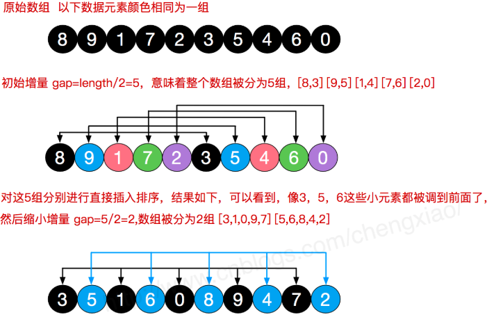
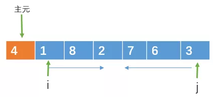
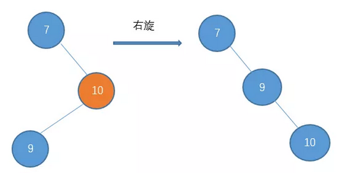

###### 时间复杂度和空间复杂度

**所以好的算法应该具备时效高和存储低的特点**。这里的时效是指时间效率，也就是算法的执行时间，对于同一个问题的多种不同解决算法，执行时间越短的算法效率越高，越长的效率越低；存储是指算法在执行的时候需要的存储空间，主要是指算法程序运行的时候所占用的内存空间。

如果我们把算法程序中的每一步看作是一个基本的计量单位，那么一个算法的执行时间就可以看作是解决一个问题所需要的总步骤数。

某个特定的数据集能让算法的执行情况极好，这就是最最好情况，而另一个不同的数据会让算法的执行情况变得极差，这就是最坏情况。不过在大多数情况下，算法的执行情况都介于这两种极端情况之间，也就是平均情况。对于最优情况，没有什么大的价值，因为它没有提供什么有用信息。平均情况是对算法的一个全面评价，因为它完整全面的反映了这个算法的性质，但从另一方面来说，这种衡量并没有什么保证，并不是每个运算都能在这种情况内完成。而对于最坏情况，它提供了一种保证，这个保证运行时间将不会再坏了，**所以一般我们所算的时间复杂度是最坏情况下的时间复杂度**，这和我们平时做事要考虑到最坏的情况是一个道理。

一般情况下，我们的程序在机器上运行时，刨去需要存储程序本身的输入数据等之外，还需要存储对数据操作的存储单元。如果输入数据所占空间和算法无关，只取决于问题本身，那么只需要分析算法在实现过程中所占的辅助单元即可。如果所需的辅助单元是个常数，那么空间复杂度就是 O(1)。空间复杂度其实在这里更多的是说一下这个概念，因为当今硬件的存储量级比较大，一般不会为了稍微减少一点儿空间复杂度而大动干戈，更多的是去想怎么优化算法的时间复杂度。所以我们在日常写代码的时候就衍生出了用空间换时间的做法，并且成为常态

##### 二叉堆

二叉堆本质上是一种完全二叉树，它分为两个类型：1.最大堆；2.最小堆

最大堆任何一个父节点的值，都**大于等于**它左右孩子节点的值。最小堆任何一个父节点的值，都**小于等于**它左右孩子节点的值。二叉堆的根节点叫做**堆顶**。最大堆和最小堆的特点，决定了在最大堆的堆顶是整个堆中的**最大元素**；最小堆的堆顶是整个堆中的**最小元素**。

###### **堆的自我调整**

对于二叉堆，如下有几种操作：插入节点；删除节点；构建二叉堆。这几种操作都是基于堆的自我调整。

插入节点：二叉堆的节点插入，插入位置是完全二叉树的最后一个位置。比如我们插入一个新节点，值是 0。

这时候，我们让节点0的它的父节点5做比较，如果0小于5，则让新节点“上浮”，和父节点交换位置。

继续用节点0和父节点3做比较，如果0小于3，则让新节点继续“上浮”。继续比较，最终让新节点0上浮到了堆顶位置。

删除节点：二叉堆的节点删除过程和插入过程正好相反，所删除的是处于堆顶的节点。比如我们删除最小堆的堆顶节点1。这时候，为了维持完全二叉树的结构，我们把堆的最后一个节点10补到原本堆顶的位置。接下来我们让移动到堆顶的节点10和它的左右孩子进行比较，如果左右孩子中最小的一个（显然是节点2）比节点10小，那么让节点10“下沉”。继续让节点10和它的左右孩子做比较，左右孩子中最小的是节点7，由于10大于7，让节点10继续“下沉”。

构建二叉堆：构建二叉堆，也就是把一个无序的完全二叉树调整为二叉堆，本质上就是让**所有非叶子节点依次下沉**。首先，我们从最后一个**非叶子**节点开始，也就是从节点10开始。如果节点10大于它左右孩子中最小的一个，则节点10下沉。接下来轮到节点3，如果节点3大于它左右孩子中最小的一个，则节点3下沉。接下来轮到节点1，如果节点1大于它左右孩子中最小的一个，则节点1下沉。事实上节点1小于它的左右孩子，所以不用改变。接下来轮到节点7，如果节点7大于它左右孩子中最小的一个，则节点7下沉。

二叉堆虽然是一颗完全二叉树，但它的存储方式并不是链式存储，而是顺序存储。换句话说，二叉堆的所有节点都存储在数组当中。假设父节点的下标是parent，那么它的左孩子下标就是 **2\*parent+1**；它的右孩子下标就是  **2\*parent+2** 。

###### 堆排序

我们再来回顾一下堆排序算法的步骤：把无序数组构建成二叉堆。循环删除堆顶元素，移到集合尾部，调节堆产生新的堆顶。第一步，把无序数组构建成二叉堆，需要进行$n/2$次循环。每次循环调用一次$ downAdjust$方法，所以第一步的计算规模是 $ n/2 * logn$，时间复杂度$O(nlogn)$。第二步，需要进行$n-1$次循环。每次循环调用一次 $downAdjust $方法，所以第二步的计算规模是$ (n-1) * logn$ ，时间复杂度 $O(nlogn)$。两个步骤是并列关系，所以整体的时间复杂度同样是$ O(nlogn)$。

###### 优先队列

优先队列不再遵循先入先出的原则，而是分为两种情况：最大优先队列，无论入队顺序，当前最大的元素优先出队。最小优先队列，无论入队顺序，当前最小的元素优先出队。

##### 排序算法

| 排序算法 | 平均时间复杂度 | 最好情况        | 最坏情况        | 空间复杂度   | 排序方式  | 稳定性 |
| -------- | -------------- | --------------- | --------------- | ------------ | --------- | ------ |
| 冒泡排序 | $O(n^2)$       | $O(n)$          | $O(n^2 )$       | $O(1)$       | In-place  | 稳定   |
| 选择排序 | $O(n^2)$       | $O(n^2)$        | $O(n^2)$        | $O(1)$       | In-place  | 不稳定 |
| 插入排序 | $O(n^2)$       | $O(n)$          | $O(n^2)$        | $O(1)$       | In-place  | 稳定   |
| 希尔排序 | $O(n\log(n))$  | $O(n\log^2(n))$ | $O(n\log^2(n))$ | $O(1)$       | In-place  | 不稳定 |
| 归并排序 | $O(n\log(n))$  | $O(n\log(n))$   | $O(n\log(n))$   | $O(n)$       | Out-place | 稳定   |
| 快速排序 | $O(n\log(n))$  | $O(n\log(n))$   | $O(n^2)$        | $O(\log(n))$ | In-place  | 不稳定 |
| 堆排序   | $O(n\log(n))$  | $O(n\log(n))$   | $O(n\log(n))$   | $O(1)$       | In-place  | 不稳定 |
| 计数排序 | $O(n + k)$     | $O(n + k)$      | $O(n + k)$      | $O(k)$       | Out-place | 稳定   |
| 桶排序   | $O(n + k)$     | $O(n + k)$      | $O(n^2)$        | $O(n + k)$   | Out-place | 稳定   |
| 基数排序 | $O(n\times k)$ | $O(n\times k)$  | $O(n\times k)$  | $O(n + k)$   | Out-place | 稳定   |

 稳定性：如果待排序的序列中存在值相等的元素，经过排序之后，相等元素之间原有的先后顺序不变，就叫做「稳定排序」。

###### 冒泡排序

1. 比较相邻的元素。如果第一个比第二个大，就交换他们两个。
2. 对每一对相邻元素作同样的工作，从开始第一对到结尾的最后一对。这步做完后，最后的元素会是最大的数。
3. 针对所有的元素重复以上的步骤，除了最后一个。
4. 持续每次对越来越少的元素重复上面的步骤，直到没有任何一对数字需要比较。

算法优化：当某次冒泡过程已经没有数据交换时，说明已经达到完全有序，不用再执行后续的冒泡操作。在冒泡排序中，只有交换才可以改变两个元素的前后顺序。为了保证冒泡排序算法的稳定性，当有相邻的两个元素大小相等的时候，我们不做交换，相同大小的数据在排序前后不会改变顺序，所以冒泡排序是稳定的排序算法。

###### 选择排序

首先在未排序序列中找到最小（大）元素，存放到排序序列的起始位置；再从剩余未排序元素中继续寻找最小（大）元素，然后放到已排序序列的末尾；重复第二步，直到所有元素均排序完毕。

###### 插入排序

将第一待排序序列第一个元素看做一个有序序列，把第二个元素到最后一个元素当成是未排序序列。从头到尾依次扫描未排序序列，将扫描到的每个元素插入有序序列的适当位置。（如果待插入的元素与有序序列中的某个元素相等，则将待插入元素插入到相等元素的后面。）

###### 希尔排序

希尔排序，也称递减增量排序算法，是插入排序的一种更高效的改进版本。但希尔排序是非稳定排序算法。希尔排序是基于插入排序的以下两点性质而提出改进方法的：插入排序在对几乎已经排好序的数据操作时，效率高，即可以达到线性排序的效率；但插入排序一般来说是低效的，因为插入排序每次只能将数据移动一位。希尔排序的基本思想是：先将整个待排序的记录序列分割成为若干子序列分别进行直接插入排序，待整个序列中的记录“基本有序”时，再对全体记录进行依次直接插入排序。 

###### 归并排序

归并排序是一种基于分治思想的排序，处理的时候可以采取递归的方式来处理子问题。我们把它切割成两部分。把左半部分和右半部分分别排序好。之后再用一个临时数组，把这两个有序的子数组汇总成一个有序的大数组。左半部分和右半部分的排序相当于一个原问题的一个子问题的，也是采取同样的方式，把左半部分分成两部分，然后....直到分割子数组只有一个元素或0个元素时，这时子数组就是有序的了(因为只有一个元素或0个，肯定是有序的啊)，就不用再分割了，直接返回就可以了。

申请空间，使其大小为两个已经排序序列之和，该空间用来存放合并后的序列；设定两个指针，最初位置分别为两个已经排序序列的起始位置；比较两个指针所指向的元素，选择相对小的元素放入到合并空间，并移动指针到下一位置；重复步骤 3 直到某一指针达到序列尾；将另一序列剩下的所有元素直接复制到合并序列尾。

###### 快速排序

快速排序也是和归并排序差不多，基于分治的思想以及采取递归的方式来处理子问题。我们可以随便选一个元素，假如我们选数组的第一个元素吧，我们把这个元素称之为”主元“吧。然后将大于或等于主元的元素放在右边，把小于或等于主元的元素放在左边。通过这种规则的调整之后，左边的元素都小于或等于主元，右边的元素都大于或等于主元，很显然，此时主元所处的位置，是一个有序的位置,即主元已经处于排好序的位置了。主元把数组分成了两半部分。把一个大的数组通过主元分割成两小部分的这个操作，我们也称之为分割操作(partition)。接下来，我们通过递归的方式，对左右两部分采取同样的方式，每次选取一个主元元素，使他处于有序的位置。

分割操作

然后用令变量$i = left + 1，j = right$。然后让$ i $和$ j $从数组的两边向中间扫描。

$i $向右遍历的过程中，如果遇到大于或等于主元的元素时，则停止移动，$j$向左遍历的过程中，如果遇到小于或等于主元的元素则停止移动。当$i$和$j$都停止移动时，如果这时$i < j$，则交换$ i, j $所指向的元素。此时$ i < j$，交换8和3。然后继续向中间遍历，直到$i >= j$。此时$i >= j$，分割结束。最后在把主元与$ j $指向的元素交换(当然，与$i$指向的交换也行)。这个时候，$j$左边的元素一定小于或等于主元，而右边则大于或等于主元。到此，分割调整完毕

###### 堆排序

 堆排序是指利用堆这种数据结构所设计的一种排序算法。  堆积是一个近似完全二叉树的结构，并同时满足堆积的性质：即子结点的键值或索引总是小于（或者大于）它的父节点。堆排序可以说是一种利用堆的概念来排序的选择排序。 

1. 创建一个堆 $H[0……n-1]$；
2. 把堆首（最大值）和堆尾互换；
3. 把堆的尺寸缩小 1，并调用 shift_down(0)，目的是把新的数组顶端数据调整到相应位置；
4. 重复步骤 2，直到堆的尺寸为 1。

###### 桶排序

桶排序是计数排序的升级版。它利用了函数的映射关系，高效与否的关键就在于这个映射函数的确定。为了使桶排序更加高效，我们需要做到这两点：在额外空间充足的情况下，尽量增大桶的数量；使用的映射函数能够将输入的 N 个数据均匀的分配到 K 个桶中。同时，对于桶中元素的排序，选择何种比较排序算法对于性能的影响至关重要。

###### 基数排序

基数排序，是一种基数“桶”的排序，他的排序思路是这样的：先以个位数的大小来对数据进行排序，接着以十位数的大小来多数进行排序，接着以百位数的大小，排到最后，就是一组有序的元素了。不过，他在以某位数进行排序的时候，是采用“桶”来排序的，基本原理就是把具有相同个（十、百等）位数的数放进同一个桶里。

基数的时间复杂度为O(n)，不过他是忽略了常数项，即实际排序时间为kn(其中k是常数项)，然而在实际排序的过程中，这个常数项k其实是很大的，这会很大程度影响实际的排序时间，而像快速排序虽然是$nlogn$，但它前面的常数项是相对比较小的，影响也相对比较小。

不采用从最高位到低位进行分桶的原因：最高位十位数排序显然，不在桶一个桶里的数，他们的大小顺序已经是已知的了，也就是说，**右边桶的数一定比左边桶的数大**，所有在接下来的个位数排序里，我们只需要进行“各部分”单独排序就可以了，每一小部分都类似于原问题的一个子问题，做的时候可以采用递归的形式来处理。这种方法确实可以减少比较的次数，不过请大家注意，在每个小部分的排序中，我们也是需要10个桶来将他们进行排序，最后导致的结果就是，**每个不同值的元素都会占据一个“桶”**，如果你有1000个元素，并且1000个元素都是不同值的话，那么从最高位排序到最低位，需要1000个桶。

###### 计数排序

假定20个随机整数的值如下：9，3，5，4，9，1，2，7，8，1，3，6，5，3，4，0，10，9 ，7，9

让我们遍历这个无序的随机数列，每一个整数按照其值对号入座，对应数组下标的元素进行加1操作。比如第一个整数是9，那么数组下标为9的元素加1：

第二个整数是3，那么数组下标为3的元素加1

继续遍历数列并修改数组，最终，数列遍历完毕时，数组的状态如下

数组每一个下标位置的值，代表了数列中对应整数出现的次数。有了这个“统计结果”，排序就很简单了。直接遍历数组，输出数组元素的下标值，元素的值是几，就输出几次。

对于其他属于某个区间的序列，不再以（输入数列的最大值+1）作为统计数组的长度，而是以（数列最大值和最小值的差+1）作为统计数组的长度。同时，数列的最小值作为一个偏移量，用于统计数组的对号入座。

统计数组从第二个元素开始，每一个元素都加上前面所有元素之和。这样相加的目的，是让统计数组存储的元素值，等于相应整数的最终排序位置。比如下标是9的元素值为5，代表原始数列的整数9，最终的排序是在第5位。接下来，我们创建输出数组$sortedArray$，长度和输入数列一致。然后从后向前遍历输入数列：第一步，我们遍历成绩表最后一行的小绿：小绿是95分，我们找到$countArray$下标是5的元素，值是4，代表小绿的成绩排名位置在第4位。同时，我们给$countArray$下标是5的元素值减1，从4变成3,，代表着下次再遇到95分的成绩时，最终排名是第3。

第二步，我们遍历成绩表倒数第二行的小白：小白是94分，我们找到$countArray$下标是4的元素，值是2，代表小白的成绩排名位置在第2位。同时，我们给$countArray$下标是4的元素值减1，从2变成1,，代表着下次再遇到94分的成绩时，最终排名是第1。第三步，我们遍历成绩表倒数第三行的小红：小红是95分，我们找到$countArray$下标是5的元素，值是3，代表小红的成绩排名位置在第3位。同时，我们给$countArray$下标是5的元素值减1，从3变成2,，代表着下次再遇到95分的成绩时（实际上已经遇不到了），最终排名是第2。这样一来，同样是95分的小红和小绿就能够清楚地排出顺序了，也正因此，优化版本的计数排序属于**稳定排序**。

###### 外部排序

这种方法适合要排序的数据太多，以至于内存一次性装载不下。只能通过把数据分几次的方式来排序，我们也把这种方法称之为**外部排序**。

12个无序的数据：70，81，2，86，3，24，8，87，17，46，30，64

从12数据读取3个数据构建最小堆，且选出目标数

读入下一个数86

读入下一个数3，比70小，暂放一边，不加入堆结构中

读入下一个数据24，比81小，不加入堆结构

读入下一个数据8，比86小，不加入堆结构。此时$p_1$已经完成了，把那些刚才暂放一边的数重新构成一个堆，继续$p_2$的存放。

以此类推...最后生成的$p_2$如下：

最后对$p_1$和$p_2$进行排序，采用的排序方法如下所示。

##### 算法技巧

巧用数组下标：数组的下标是一个隐含的很有用的数组，特别是在统计一些数字，或者判断一些整型数是否出现过的时候。

巧用取余：有时候我们在遍历数组的时候，会进行越界判断，如果下标差不多要越界了，我们就把它置为0重新遍历。

巧用双指针：比如“判断单链表是否有环”、“如何一次遍历就找到链表中间位置节点”、“单链表中倒数第 k 个节点”等问题。对于第一个问题，我们就可以设置一个慢指针和一个快指针来遍历这个链表。慢指针一次移动一个节点，而快指针一次移动两个节点，如果该链表没有环，则快指针会先遍历完这个表，如果有环，则快指针会在第二次遍历时和慢指针相遇。对于第二个问题，一样是设置一个快指针和慢指针。慢的一次移动一个节点，而快的两个。在遍历链表的时候，当快指针遍历完成时，慢指针刚好达到中点。对于第三个问题，设置两个指针，其中一个指针先移动k个节点。之后两个指针以相同速度移动。当那个先移动的指针遍历完成的时候，第二个指针正好处于倒数第k个节点。

巧用移位运算：有时候我们在进行除数或乘数运算的时候，我们就可以用移位的方法来运算了，这样会快很多。n / 2 等价于 n >> 1；n / 4 等价于 n >> 2；n / 8 等价于 n >> 3。

<<左移 运算规则：按二进制形式把所有的数字向左移动对应的位数，高位移出，低位的空位补零。\>>右移，运算规则：按二进制形式把所有的数字向右移动对应的位数，低位移出，高位的空位补符号位，即正数补0，负数补1

设置哨兵位：在链表的相关问题中，我们经常会设置一个头指针，而且这个头指针是不存任何有效数据的，只是为了操作方便，这个头指针我们就可以称之为哨兵位了。

###### 散列表

散列表，是根据键而直接访问在内存存储位置的数据结构。也就是说，它通过计算一个关于键值的函数，将所需查询的数据映射到表中一个位置来访问记录，这加快了查找速度。这个映射函数称做散列函数，存放记录的数组称做散列表。

散列函数的特点：

确定性：如果两个散列值是不相同的（根据同一函数），那么这两个散列值的原始输入也是不相同的。散列碰撞：散列函数的输入和输出不是唯一对应关系的，如果两个散列值相同，两个输入值很可能是相同的，但也可能不同。不可逆性：一个哈希值对应无数个明文，理论上你并不知道哪个是。混淆特性：输入一些数据计算出散列值，然后部分改变输入值，一个具有强混淆特性的散列函数会产生一个完全不同的散列值。

散列碰撞：开放寻址法是一种解决碰撞的方法，对于开放寻址冲突解决方法，比较经典的有线性探测方法、二次探测和 双重散列等方法。线性探测方法：当我们往散列表中插入数据时，如果某个数据经过散列函数散列之后，存储位置已经被占用了，我们就从当前位置开始，依次往后查找，看是否有空闲位置，直到找到为止。二次探测方法：二次探测是二次方探测法的简称。顾名思义，使用二次探测进行探测的步长变成了原来的“二次方”，也就是说，它探测的下标序列为 `hash(key)+0`，`hash(key)+1^2`或`[hash(key)-1^2]`，`hash(key)+2^2`或`[hash(key)-2^2]`。双重散列，意思就是不仅要使用一个散列函数，而是使用一组散列函数 `hash1(key)`，`hash2(key)`，`hash3(key)`先用第一个散列函数，如果计算得到的存储位置已经被占用，再用第二个散列函数，依次类推，直到找到空闲的存储位置。

**加载因子**是表示$ Hsah $表中元素的填满的程度，若加载因子越大，则填满的元素越多,这样的好处是：空间利用率高了,但冲突的机会加大了。反之,加载因子越小,填满的元素越少,好处是冲突的机会减小了，但空间浪费多了。

链表法是一种更加常用的散列冲突解决办法，相比开放寻址法，它要简单很多。如下动图所示，在散列表中，每个位置对应一条链表，所有散列值相同的元素都放到相同位置对应的链表中。

##### 树

###### 二叉搜索树

二叉排序树：或者是一棵空树，或者是具有下列性质的二叉树： 若它的左子树不空，则左子树上所有结点的值均小于它的根结点的值； 若它的右子树不空，则右子树上所有结点的值均大于它的根结点的值；它的左、右子树也分别为二叉排序树。

二叉排序树通常采用二叉链表作为存储结构。中序遍历二叉排序树可得到一个依据关键字的有序序列，一个无序序列可以通过构造一棵二叉排序树变成一个有序序列，构造树的过程即是对无序序列进行排序的过程。每次插入的新的结点都是二叉排序树上新的叶子结点，在进行插入操作时，不必移动其它结点，只需改动某个结点的指针，由空变为非空即可。

在二元排序树b中查找x的过程为：若b是空树，则搜索失败，否则：若x等于b的根节点的数据域之值，则查找成功；否则：若x小于b的根节点的数据域之值，则搜索左子树；否则：查找右子树。

利用查找函数，将关键字放到树中的合适位置。

在二叉排序树中删去一个结点，分三种情况讨论：若p结点为叶子结点，即左子树和右子树均为空树。由于删去叶子结点不破坏整棵树的结构，则只需修改其双亲结点的指针即可。若p结点只有左子树PL或右子树PR，此时只要令PL或PR直接成为其双亲结点f的左子树（当p是左子树）或右子树（当p是右子树）即可，作此修改也不破坏二叉排序树的特性。若p结点的左子树和右子树均不空。在删去p之后，为保持其它元素之间的相对位置不变，可按中序遍历保持有序进行调整。比较好的做法是，找到p的直接前驱（或直接后继）s，用s来替换结点p，然后再删除结点s。

###### AVL 树

具有二叉查找树的全部特性。每个节点的左子树和右子树的高度差至多等于1。

我们把这种倾向于左边的情况称之为 **左-左型**。这个时候，我们就可以对节点9进行**右旋操作**，使它恢复平衡。

顺时针旋转两个节点，使得父节点被自己的左孩子取代，而自己成为自己的右孩子

左旋和右旋一样，就是用来解决当大部分节点都偏向右边的时候，通过左旋来还原。我们把这种倾向于右边的情况称之为 **右-右型**

所以对于这种 **右-左型的，我们需要进行一次右旋再左旋**。

同理，也存在 **左-右型**的

在插入的过程中，会出现一下四种情况破坏$AVL$树的特性，我们可以采取如下相应的旋转。左-左型：做右旋 ；右-右型：做左旋转；左-右型：先做左旋，后做右旋；右-左型：先做右旋，再做左旋。

##### 树的遍历

最简单的划分：是深度优先--先访问子节点，再访问父节点，最后是第二个子节点，还是广度优先--先访问第一个子节点，再访问第二个子节点，最后访问父节点，深度优先可进一步按照根节点相对于左右子节点的访问先后来划分。如果把左节点和右节点的位置固定不动，那么根节点放在左节点的左边，称为前序、根节点放在左节点和右节点的中间，称为中序、根节点放在右节点的右边，称为后序。对广度优先而言，遍历没有前序中序后序之分：给定一组已排序的子节点，其广度优先的遍历只有一种唯一的结果。

The general recursive pattern for traversing a (non-empty) binary tree is this: At node N do the following: (L) Recursively traverse its left subtree. This step is finished at the node N again. (R) Recursively traverse its right subtree. This step is finished at the node N again. (N) Process N itself.

`Pre-order​` Check if the current node is empty or null. Display the data part of the root (or current node). Traverse the left subtree by recursively calling the `pre-order` function.Traverse the right subtree by recursively calling the `pre-order` function.

`In-order` Check if the current node is empty or null. Traverse the left subtree by recursively calling the in-order function. Display the data part of the root (or current node). Traverse the right subtree by recursively calling the in-order function.

`Out-order` Check if the current node is empty or null. Traverse the right subtree by recursively calling the out-order function. Display the data part of the root (or current node). Traverse the left subtree by recursively calling the out-order function. In a binary search tree, out-order traversal retrieves data in reverse sorted order.

`Post-order` Check if the current node is empty or null. Traverse the left subtree by recursively calling the post-order function. Traverse the right subtree by recursively calling the post-order function. Display the data part of the root (or current node).

Trees can also be traversed in *level-order*, where we visit every node on a level before going to a lower level. This search is referred to as *breadth-first search* , as the search tree is broadened as much as possible on each depth before going to the next depth.

