### 1.数学基础

#### 1.1.线性代数

所有的向量都是列向量的形式：$\vec{\mathbf{x}}=\left(x_{1}, x_{2}, \cdots, x_{n}\right)^{T}$。$F$范数：$\|\mathbf{A}\|_{F}=\sqrt{\sum_{i, j} a_{i, j}^{2}}$，有性质：$\|\mathbf{A}\|_{F}=\sqrt{\operatorname{tr}\left(\mathbf{A} \mathbf{A}^{T}\right)}$

$\vec{\mathbf{x}}\vec{\mathbf{y}}^T=\vec{\mathbf{x}} \otimes \vec{\mathbf{y}}$

##### 1.1.1.矩阵运算

阿达马积：$\text{Hadamard product}$逐元素积
$$
\mathbf{A} \circ \mathbf{B}=\left[ \begin{array}{cccc}{a_{1,1} b_{1,1}} & {a_{1,2} b_{1,2}} & {\dots} & {a_{1, n} b_{1, n}} \\ {a_{2,1} b_{2,1}} & {a_{2,2} b_{2,2}} & {\dots} & {a_{2, n} b_{2, n}} \\ {\vdots} & {\vdots} & {\ddots} & {\vdots} \\ {a_{m, 1} b_{m, 1}} & {a_{m, 2} b_{m, 2}} & {\dots} & {a_{m, n} b_{m, n}}\end{array}\right]
$$
克罗内积：$\text{Kronnecker product}$
$$
\mathbf{A} \otimes \mathbf{B}=\left[ \begin{array}{cccc}{a_{1,1} \mathbf{B}} & {a_{1,2} \mathbf{B}} & {\cdots} & {a_{1, n} \mathbf{B}} \\ {a_{2,1} \mathbf{B}} & {a_{2,2} \mathbf{B}} & {\cdots} & {a_{2, n} \mathbf{B}} \\ {\vdots} & {\vdots} & {\ddots} & {\vdots} \\ {a_{m, 1} \mathbf{B}} & {a_{m, 2} \mathbf{B}} & {\cdots} & {a_{m, n} \mathbf{B}}\end{array}\right]
$$
$\vec{\mathbf{x}}, \vec{\mathbf{a}}, \vec{\mathbf{b}}, \vec{\mathbf{c}}$为$n$阶向量，$\mathbf{A}, \mathbf{B}, \mathbf{C}, \mathbf{X}$为$n$阶方阵，则有：
$$
\begin{array}{1}
\frac{\partial\left(\overrightarrow{\mathbf{a}}^{T} \overrightarrow{\mathbf{x}}\right)}{\partial \overrightarrow{\mathbf{x}}}=\frac{\partial\left(\overrightarrow{\mathbf{x}}^{T} \overrightarrow{\mathbf{a}}\right)}{\partial \overrightarrow{\mathbf{x}}}=\overrightarrow{\mathbf{a}}\\
\frac{\partial\left(\overrightarrow{\mathbf{a}}^{T} \mathbf{X} \overrightarrow{\mathbf{b}}\right)}{\partial \mathbf{X}}=\overrightarrow{\mathbf{a}} \overrightarrow{\mathbf{b}}^{T}=\overrightarrow{\mathbf{a}} \otimes \overrightarrow{\mathbf{b}} \in \mathbb{R}^{n \times n}\\
\frac{\partial\left(\overrightarrow{\mathbf{a}}^{T} \mathbf{X}^{T} \overrightarrow{\mathbf{b}}\right)}{\partial \mathbf{X}}=\overrightarrow{\mathbf{b}} \overrightarrow{\mathbf{a}}^{T}=\overrightarrow{\mathbf{b}} \otimes \overrightarrow{\mathbf{a}} \in \mathbb{R}^{n \times n}\\
\frac{\partial\left(\overrightarrow{\mathbf{a}}^{T} \mathbf{X} \overrightarrow{\mathbf{a}}\right)}{\partial \mathbf{X}}=\frac{\partial\left(\overrightarrow{\mathbf{a}}^{T} \mathbf{X}^{T} \overrightarrow{\mathbf{a}}\right)}{\partial \mathbf{X}}=\overrightarrow{\mathbf{a}} \otimes \overrightarrow{\mathbf{a}}\\
\frac{\partial\left(\overrightarrow{\mathbf{a}}^{T} \mathbf{X}^{T} \mathbf{X} \overrightarrow{\mathbf{b}}\right)}{\partial \mathbf{X}}=\mathbf{X}(\overrightarrow{\mathbf{a}} \otimes \overrightarrow{\mathbf{b}}+\overrightarrow{\mathbf{b}} \otimes \overrightarrow{\mathbf{a}})\\
\frac{\partial\left[(\mathbf{A} \overrightarrow{\mathbf{x}}+\overrightarrow{\mathbf{a}})^{T} \mathbf{C}(\mathbf{B} \overrightarrow{\mathbf{x}}+\overrightarrow{\mathbf{b}})\right]}{\partial \overrightarrow{\mathbf{x}}}=\mathbf{A}^{T} \mathbf{C}(\mathbf{B} \overrightarrow{\mathbf{x}}+\overrightarrow{\mathbf{b}})+\mathbf{B}^{T} \mathbf{C}(\mathbf{A} \overrightarrow{\mathbf{x}}+\overrightarrow{\mathbf{a}})\\
\frac{\partial\left(\overrightarrow{\mathbf{x}}^{T} \mathbf{A} \overrightarrow{\mathbf{x}}\right)}{\partial \overrightarrow{\mathbf{x}}}=\left(\mathbf{A}+\mathbf{A}^{T}\right) \overrightarrow{\mathbf{x}}\\
\frac{\partial\left[(\mathbf{X} \overrightarrow{\mathbf{b}}+\overrightarrow{\mathbf{c}})^{T} \mathbf{A}(\mathbf{X} \overrightarrow{\mathbf{b}}+\overrightarrow{\mathbf{c}})\right]}{\partial \mathbf{X}}=\left(\mathbf{A}+\mathbf{A}^{T}\right)(\mathbf{X} \overrightarrow{\mathbf{b}}+\overrightarrow{\mathbf{c}}) \overrightarrow{\mathbf{b}}^{T}\\
\frac{\partial\left(\overrightarrow{\mathbf{b}}^{T} \mathbf{X}^{T} \mathbf{A} \mathbf{X} \overrightarrow{\mathbf{c}}\right)}{\partial \mathbf{X}}=\mathbf{A}^{T} \mathbf{X} \overrightarrow{\mathbf{b}} \overrightarrow{\mathbf{c}}^{T}+\mathbf{A} \mathbf{X} \overrightarrow{\mathbf{c}} \overrightarrow{\mathbf{b}}^{T}
\end{array}
$$
如果$f$是一元函数，则：其逐元向量函数为：$f(\vec{\mathbf{x}})=\left(f\left(x_{1}\right), f\left(x_{2}\right), \cdots, f\left(x_{n}\right)\right)^{T}$，其逐矩阵函数为：
$$
f(\mathbf{X})=\left[ \begin{array}{cccc}{f\left(x_{1,1}\right)} & {f\left(x_{1,2}\right)} & {\cdots} & {f\left(x_{1, n}\right)} \\ {f\left(x_{2,1}\right)} & {f\left(x_{2,2}\right)} & {\cdots} & {f\left(x_{2, n}\right)} \\ {\vdots} & {\vdots} & {\ddots} & {\vdots} \\ {f\left(x_{m, 1}\right)} & {f\left(x_{m, 2}\right)} & {\cdots} & {f\left(x_{m, n}\right)}\end{array}\right]
$$
其逐元导数分别为：
$$
\begin{array}{1}
f^{\prime}(\overrightarrow{\mathbf{x}})=\left(f^{\prime}(x 1), f^{\prime}(x 2), \cdots, f^{\prime}\left(x_{n}\right)\right)^{T}\\
f^{\prime}(\mathbf{X})=\left[ \begin{array}{cccc}{f^{\prime}\left(x_{1,1}\right)} & {f^{\prime}\left(x_{1,2}\right)} & {\cdots} & {f^{\prime}\left(x_{1, n}\right)} \\ {f^{\prime}\left(x_{2,1}\right)} & {f^{\prime}\left(x_{2,2}\right)} & {\cdots} & {f^{\prime}\left(x_{2, n}\right)} \\ {\vdots} & {\vdots} & {\ddots} & {\vdots} \\ {f^{\prime}\left(x_{m, 1}\right)} & {f^{\prime}\left(x_{m, 2}\right)} & {\cdots} & {f^{\prime}\left(x_{m, n}\right)}\end{array}\right]
\end{array}
$$
各种类型的偏导数: 标量对向量的偏导数：$\frac{\partial u}{\partial \vec{\mathbf{v}}}=\left(\frac{\partial u}{\partial v_{1}}, \frac{\partial u}{\partial v_{2}}, \cdots, \frac{\partial u}{\partial v_{n}}\right)^{T}$标量对矩阵的偏导数：
$$
\frac{\partial u}{\partial \mathbf{V}}=\left[ \begin{array}{cccc}{\frac{\partial u}{\partial V_{1,1}}} & {\frac{\partial u}{\partial V_{1,2}}} & {\cdots} & {\frac{\partial w}{\partial V_{1, n}}} \\ {\frac{\partial u}{\partial V_{2,1}}} & {\frac{\partial u}{\partial V_{2,2}}} & {\cdots} & {\frac{\partial u}{\partial V_{2,1}}} \\ {\vdots} & {\vdots} & {\ddots} & {\vdots} \\ {\frac{\partial u}{\partial V_{m, 1}}} & {\frac{\partial u}{\partial V_{m, 2}}} & {\cdots} & {\frac{\partial u}{\partial V_{m, n}}}\end{array}\right]
$$
向量对标量的偏导数，向量对向量的偏导数，矩阵对标量的偏导数。
$$
\begin{array}{1}
\frac{\partial[t r(f(\mathbf{X}))]}{\partial \mathbf{X}}=\left(f^{\prime}(\mathbf{X})\right)^{T}\\
\frac{\partial[t r(\mathbf{A} \mathbf{X} \mathbf{B})]}{\partial \mathbf{X}}=\mathbf{A}^{T} \mathbf{B}^{T}\\
\frac{\partial\left[t r\left(\mathbf{A} \mathbf{X}^{T} \mathbf{B}\right)\right]}{\partial \mathbf{X}}=\mathbf{B} \mathbf{A}\\
\frac{\partial[\operatorname{tr}(\mathbf{A} \otimes \mathbf{X})]}{\partial \mathbf{X}}=\operatorname{tr}(\mathbf{A}) \mathbf{I}\\
\frac{\partial[\operatorname{tr}(\mathbf{A} \mathbf{X} \mathbf{B} \mathbf{X})]}{\partial \mathbf{X}}=\mathbf{A}^{T} \mathbf{X}^{T} \mathbf{B}^{T}+\mathbf{B}^{T} \mathbf{X} \mathbf{A}^{T}\\
\frac{\partial\left[t r\left(\mathbf{X}^{T} \mathbf{B} \mathbf{X} \mathbf{C}\right)\right]}{\partial \mathbf{X}}=\mathbf{B X C}+\mathbf{B}^{T} \mathbf{X} \mathbf{C}^{T}\\
\frac{\partial\left[\operatorname{tr}\left(\mathbf{C}^{T} \mathbf{X}^{T} \mathbf{B} \mathbf{X} \mathbf{C}\right)\right]}{\partial \mathbf{X}}=\left(\mathbf{B}^{T}+\mathbf{B}\right) \mathbf{X} \mathbf{C} \mathbf{C}^{T}\\
\frac{\partial\left[t r\left(\mathbf{A} \mathbf{X} \mathbf{B} \mathbf{X}^{T} \mathbf{C}\right)\right]}{\partial \mathbf{X}}=\mathbf{A}^{T} \mathbf{C}^{T} \mathbf{X B}^{T}+\mathbf{C A X B}\\
\frac{\partial[\operatorname{tr}((\mathbf{A} \mathbf{X} \mathbf{B}+\mathbf{C})(\mathbf{A} \mathbf{X} \mathbf{B}+\mathbf{C}))]}{\partial \mathbf{X}}=2 \mathbf{A}^{T}(\mathbf{A} \mathbf{X} \mathbf{B}+\mathbf{C}) \mathbf{B}^{T}
\end{array}
$$

假设$\mathbf{U}=f(\mathbf{X})$是关于$\mathbf{X}$的矩阵值函数$(f : \mathbb{R}^{m \times n} \rightarrow \mathbb{R}^{m \times n})$，且$g(\mathbf{U})$是关于$\mathbf{U}$的实值函数$(g : \mathbb{R}^{m \times n} \rightarrow \mathbb{R})$，则下面链式法则成立：
$$
\begin{array}{l}\frac{\partial g(\mathbf{U})}{\partial \mathbf{X}}=\left(\frac{\partial g(\mathbf{U})}{\partial x_{i, j}}\right)_{m \times n}\\
=\left(\sum_{k} \sum_{l} \frac{\partial g(\mathbf{U})}{\partial u_{k, l}} \frac{\partial u_{k, l}}{\partial x_{i, j}}\right)_{m \times n}=\left(t r\left[\left(\frac{\partial g(\mathbf{U})}{\partial \mathbf{U}}\right)^{T} \frac{\partial \mathbf{U}}{\partial x_{i, j}}\right]\right)_{m \times n}
\end{array}
$$

#### 1.2.概率论与随机过程

$$
\begin{array}{l}
P\left(X_{1}, X_{2}, \cdots, X_{n}\right)=P\left(X_{1}\right) \prod_{i=2}^{n} P\left(X_{i} | X_{1}, \cdots, X_{i-1}\right)\\
P(X, Y | Z)=P(X | Z) P(Y | Z)\\
\mathbb{E}_{X \sim P(X)}[g(X)]=\int g(x) p(x) d x\\
\mathbb{E}[Z]=\mathbb{E}[g(X, Y)]=\int_{-\infty}^{\infty} \int_{-\infty}^{\infty} g(x, y) p(x, y) d x d y\\
\operatorname{Cov}[f(X), g(Y)]=\mathbb{E}[(f(X)-\mathbb{E}[f(X)])(g(Y)-\mathbb{E}[g(Y)])]\\
\text{k阶原点矩}:\mathbb{E}\left[X^{k}\right]\\
\text{k阶中心距}: \mathbb{E}\left[(X-\mathbb{E}[X])^{k}\right]\\

\end{array}
$$

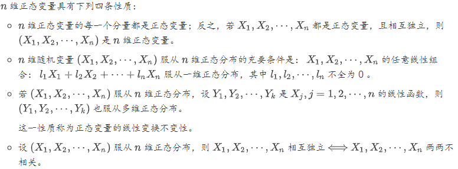

#### 1.3.信息论

###### 1.3.1.Variable-Length Codes

 In the following diagram, we use the vertical axis to visualize the probability of each word,$p(x)$, and the horizontal axis to visualize the length of the corresponding codeword, $L(x)$. Notice that the area is the average length of a codeword we send – in this case 2 bits.

Notice that the most common codeword became shorter, even as the uncommon ones became longer. The result was, on net, a smaller amount of area. This corresponds to a smaller expected codeword length. 

###### 1.3.2.The Space of Codewords

There are two codes with a length of $1$ bit:$0$ and $1$. There are four codes with a length of $2$ bits: $00, 01, 10$, and $11$. Every bit you add on doubles the number of possible codes.

The property we want is that if we see a particular codeword, there should not be some longer version that is also a codeword. Another way of putting this is that no codeword should be the prefix of another codeword.This is called the prefix property, and codes that obey it are called prefix codes.A short codeword requires you to sacrifice more of the space of possible codewords, preventing other codewords from being short. One useful way to think about this is that every codeword requires a sacrifice from the space of possible codewords.

###### 1.3.3.Optimal Encodings

In general, the cost of codewords decreases *exponentially* with the length of the codeword.

Each codeword makes the average message length longer by its probability times the length of the codeword. Short codewords reduce the average message length but are expensive, while long codewords increase the average message length but are cheap.

Let’s picture a concrete example where we need to communicate which of two possible events happened. Event $a$ happens $p(a)$ of the time and event $b$ happens $p(b)$ of the time. We distribute our budget in the natural way described above, spending $p(a)$ of our budget on getting $a$ a short codeword, and $p(b)$ on getting $b$ a short codeword.

if you had a bit more to spend, it would be equally good to invest in making any codeword shorter. What we really care about is the benefit/cost ratio – that’s what decides what we should invest more in. In this case, the ratio is $\frac{p(a)}{p(a)}$, which is equal to one.

 But that is not a proof that it’s the best budget. To prove that, we’ll consider a different budget, where we spend a bit extra on one codeword at the expense of another. We’ll invest $ϵ$ less in $b$, and invest it in $a$ instead. This makes the codeword for $a$ a bit shorter, and the codeword for $b$ a bit longer.

Now the cost of buying a shorter codeword for $a$ is $p(a)+ϵ$, and the cost of buying a shorter codeword for $b$ is $p(b)−ϵ$. But the benefits are still the same. This leads the benefit cost ratio for buying $a$ to be $\frac{p(a)}{p(a)+ϵ}$ which is less than one. On the other hand, the benefit cost ratio of buying $b$ is $\frac{p(b)}{p(b)−ϵ}$ which is greater than one.

This length – the average length of communicating an event from one distribution with the optimal code for another distribution – is called the cross-entropy. 

The more different the distributions pp and $q$ are, the more the cross-entropy of $p$ with respect to $q$ will be bigger than the entropy of $p$.We call this difference the Kullback–Leibler divergence, or just the KL divergence. The KL divergence of $p$ with respect to $q$, $D_{q}(p)$.

###### 1.3.4.Entropy and Multiple Variables

We call this the joint entropy of $X$ and $Y$, defined$H(X, Y)=\sum_{x, y} p(x, y) \log _{2}\left(\frac{1}{p(x, y)}\right)$. A slightly nicer way to think about this is to avoid flattening the distribution, and just think of the code lengths as a third dimension. Now the entropy is the volume.

At this point, we have broken the information in $X$ and $Y$ up in several ways. We have the information in each variable, $H(X)$ and $H(Y)$. We have the the union of the information in both, $H(X,Y)$. We have the information which is in one but not the other, $H(X|Y)$ and $H(Y|X)$. A lot of this seems to revolve around the information shared between the variables, the intersection of their information. We call this mutual information, $I(X,Y)$, defined as:
$$
I(X, Y)=H(X)+H(Y)-H(X, Y)
$$
Closely related to the mutual information is the variation of information. The variation of information is the information which is not shared between the variables. We can define it like so:
$$
V(X, Y)=H(X, Y)-I(X, Y)
$$

$$
\begin{array}{l}
\text{自信息}：I(x)=-\log P(x)\\
\text{熵}：H(X)=\mathbb{E}_{X \sim P(X)}[I(x)]=-\mathbb{E}_{X \sim P(X)}[\log P(x)]\\
\text{条件熵}：H(Y | X)=\mathbb{E}_{X \sim P(X)}[H(Y | X=x)]=-\mathbb{E}_{(X, Y) \sim P(X, Y)} \log P(Y | X)\\
\text{KL散度}：D_{K L}(P \| Q)=\mathbb{E}_{X \sim P(X)}\left[\log \frac{P(x)}{Q(x)}\right]=\mathbb{E}_{X \sim P(X)}[\log P(x)-\log Q(x)]\\
\text{交叉熵}：H(P, Q)=H(P)+D_{K L}(P \| Q)=-\mathbb{E}_{X \sim P(X)} \log Q(x)
\end{array}
$$

#### 1.4.数值计算

一种严重的误差是下溢出`underflow`：当接近零的数字四舍五入为零时，发生下溢出。一种严重的误差是上溢出`overflow`：当数值非常大，超过了计算机的表示范围时，发生上溢出。

##### 1.4.1.数值稳定性

`Conditioning`刻画了一个函数的如下特性：当函数的输入发生了微小的变化时，函数的输出的变化有多大。对于`Conditioning`较大的函数，在数值计算中可能有问题。因为函数输入的舍入误差可能导致函数输出的较大变化。对于方阵$\mathbf{A} \in \mathbb{R}^{n \times n}$，其条件数`condition number`为：

$\text{condition number}$ $=\max _{1 \leq i, j \leq n, i \neq j}\left|\frac{\lambda_{i}}{\lambda_{j}}\right|$, 其中$\lambda_{i}, i=1,2, \cdots, n $ 为$\mathbf{A}$的特征值。

当方阵的条件数很大时，矩阵的求逆将对误差特别敏感。条件数是矩阵本身的特性，它会放大那些包含矩阵求逆运算过程中的误差。

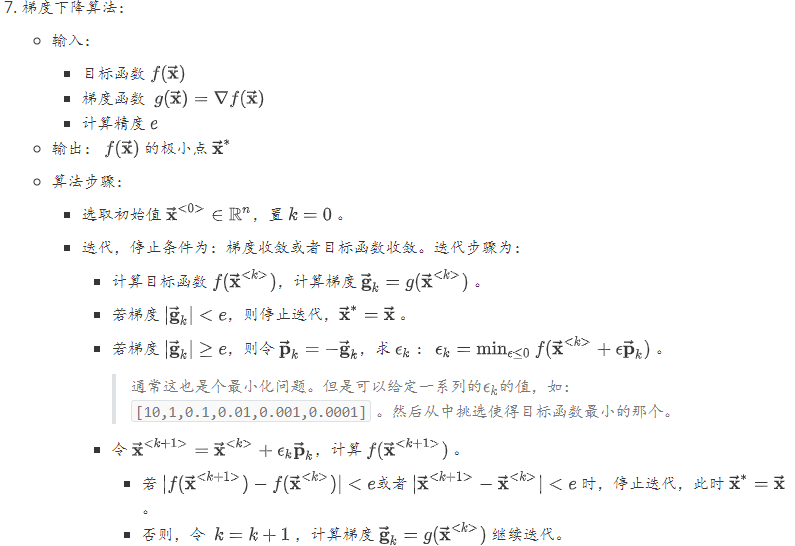

##### 1.4.2.海森矩阵与学习率

$f(\vec{\mathbf{x}}) \approx f\left(\vec{\mathbf{x}}_{0}\right)+\left(\vec{\mathbf{x}}-\vec{\mathbf{x}}_{0}\right)^{T} \vec{\mathbf{g}}+\frac{1}{2}\left(\vec{\mathbf{x}}-\vec{\mathbf{x}}_{0}\right)^{T} \mathbf{H}\left(\vec{\mathbf{x}}-\vec{\mathbf{x}}_{0}\right)$, 应用到梯度计算时：$f\left(\vec{\mathbf{x}}_{0}-\epsilon \vec{\mathbf{g}}\right) \approx f\left(\vec{\mathbf{x}}_{0}\right)-\epsilon \vec{\mathbf{g}}^{T} \vec{\mathbf{g}}+\frac{1}{2} \epsilon^{2} \vec{\mathbf{g}}^{T} \mathbf{H} \vec{\mathbf{g}}$.

$\frac{1}{2} \epsilon^{2} \vec{\mathrm{g}}^{T} \mathrm{H} \vec{\mathrm{g}}$较大时，可能会导致：沿着负梯度的方向，函数值反而增加。当海森矩阵的条件数较大时，不同方向的梯度的变化差异很大。在某些方向上，梯度变化很快；在有些方向上，梯度变化很慢。梯度下降法未能利用海森矩阵，也就不知道应该优先搜索导数长期为负或者长期为正的方向。本质上应该沿着负梯度方向搜索。但是沿着该方向的一段区间内，如果导数一直为正或者一直为负，则可以直接跨过该区间。前提是：必须保证该区间内，该方向导数不会发生正负改变。当海森矩阵的条件数较大时，也难以选择合适的步长。步长必须足够小，从而能够适应较强曲率的地方。但是如果步长太小，对于曲率较小的地方则推进太慢。

考虑泰勒展开式：$f(\overrightarrow{\mathbf{x}}) \approx f\left(\overrightarrow{\mathbf{x}}_{0}\right)+\left(\overrightarrow{\mathbf{x}}-\overrightarrow{\mathbf{x}}_{0}\right)^{T} \overrightarrow{\mathbf{g}}+\frac{1}{2}\left(\overrightarrow{\mathbf{x}}-\overrightarrow{\mathbf{x}}_{0}\right)^{T} \mathbf{H}\left(\overrightarrow{\mathbf{x}}-\overrightarrow{\mathbf{x}}_{0}\right)$。其中$\vec{\mathbf{g}}$为$\vec{\mathbf{x}}_0$处的梯度；$\mathbf{H}$为$\vec{\mathbf{x}}_0$处的海森矩阵。如果$\vec{\mathbf{x}}$为极值点，则有：$\frac{\partial}{\partial \overrightarrow{\mathbf{x}}} f(\overrightarrow{\mathbf{x}})=\overrightarrow{0}$，则有：$\overrightarrow{\mathbf{x}}^{*}=\overrightarrow{\mathbf{x}}_{0}-\mathbf{H}^{-1} \overrightarrow{\mathrm{g}}$。当$f$是个正定的二次型，则牛顿法直接一次就能到达最小值点。当$f$不是正定的二次型，则可以在局部近似为正定的二次型，那么则采用多次牛顿法即可到达最小值点。

深度学习中的目标函数非常复杂，无法保证可以通过上述优化算法进行优化。因此有时会限定目标函数具有`Lipschitz`连续，或者其导数`Lipschitz`连续。

`Lipschitz`连续的定义：对于函数$f$，存在一个`Lipschitz`常数$\mathcal{L}$，使得
$$
\forall \overrightarrow{\mathbf{x}}, \forall \overrightarrow{\mathbf{y}},|f(\overrightarrow{\mathbf{x}})-f(\overrightarrow{\mathbf{y}})| \leq \mathcal{L}| | \overrightarrow{\mathbf{x}}-\overrightarrow{\mathbf{y}}| |_{2}
$$
`Lipschitz`连续的意义是：输入的一个很小的变化，会引起输出的一个很小的变化。

##### 拟牛顿法

###### 原理

在牛顿法的迭代中，需要计算海森矩阵的逆矩阵$\mathbf{H}^{-1}$，这一计算比较复杂。可以考虑用一个$n$阶矩阵$\mathbf{G}_{k}=G(\overrightarrow{\mathbf{x}}^{<k>})$来近似代替$\mathbf{H}_{k}^{-1}=H^{-1}(\overrightarrow{\mathbf{x}}^{<k>})$。先看海森矩阵满足的条件：$\overrightarrow{\mathbf{g}}_{k+1}-\overrightarrow{\mathbf{g}}_{k}=\mathbf{H}_{k}(\overrightarrow{\mathbf{x}}^{<k+1>}-\overrightarrow{\mathbf{x}}^{<k>})$。令$\overrightarrow{\mathbf{y}}_{k}=\overrightarrow{\mathbf{g}}_{k+1}-\overrightarrow{\mathbf{g}}_{k}, \vec{\delta}_{k}=\overrightarrow{\mathbf{x}}^{<k+1>}-\overrightarrow{\mathbf{x}}^{<k>}$。则有：$\overrightarrow{\mathbf{y}}_{k}=\mathbf{H}_{k} \vec{\delta}_{k}$，或者$\mathbf{H}_{k}^{-1} \overrightarrow{\mathbf{y}}_{k}=\vec{\delta}_{k}$。这称为拟牛顿条件。根据牛顿法的迭代：$\overrightarrow{\mathbf{x}}^{<k+1>}=\overrightarrow{\mathbf{x}}^{<k>}-\mathbf{H}_{k}^{-1} \overrightarrow{\mathbf{g}}_{k}$，将$f(\vec{\mathbf{x}})$在$\overrightarrow{\mathbf{x}}^{<k>}$的一阶泰勒展开：
$$
\begin{array}{l}{f\left(\overrightarrow{\mathbf{x}}^{<k+1>}\right)=f\left(\overrightarrow{\mathbf{x}}^{<k>}\right)+f^{\prime}\left(\overrightarrow{\mathbf{x}}^{<k>}\right)\left(\overrightarrow{\mathbf{x}}^{<k+1>}-\overrightarrow{\mathbf{x}}^{<k>}\right)} \\ {=f\left(\overrightarrow{\mathbf{x}}^{<k>}\right)+\overrightarrow{\mathbf{g}}_{k}^{T}\left(-\mathbf{H}_{k}^{-1} \overrightarrow{\mathbf{g}}_{k}\right)=f\left(\overrightarrow{\mathbf{x}}^{<k>}\right)-\overrightarrow{\mathbf{g}}_{k}^{T} \mathbf{H}_{k}^{-1} \overrightarrow{\mathbf{g}}_{k}}\end{array}
$$
当$\mathbf{H}_K$是正定矩阵时，总有$f(\overrightarrow{\mathbf{x}}^{<k+1>})<f(\overrightarrow{\mathbf{x}}^{<k>})$，因此每次都是沿着函数递减的方向迭代。如果选择$\mathbf{G}_k$作为$\mathbf{H}_k^{-1}$的近似时， 同样要满足两个条件：$\mathbf{G}_k$必须是正定的。$\mathbf{G}_k$满足拟牛顿条件：$\mathbf{G}_{k+1} \overrightarrow{\mathbf{y}}_{k}=\vec{\delta}_{k}$。因为$\mathbf{G}_0$是给定的初始化条件，所以下标从$k+1$开始。按照拟牛顿条件，在每次迭代中可以选择更新矩阵$\mathbf{G}_{k+1}=\mathbf{G}_{k}+\Delta \mathbf{G}_{k}$。

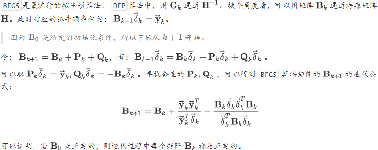

##### 约束最优化

约束最优化问题的原始问题：假设$f(\overrightarrow{\mathbf{x}}), c_{i}(\overrightarrow{\mathbf{x}}), h_{j}(\overrightarrow{\mathbf{x}})$是定义在$\mathbb{R}^{n}$上的连续可微函数。考虑约束最优化问题：
$$
\begin{array}{c}{\operatorname{min}_{\vec{x} \in \mathbb{R}^{n}} f(\overrightarrow{\mathbf{x}})} \\ {\text {s.t. } \quad c_{i}(\overrightarrow{\mathbf{x}}) \leq 0, i=1,2, \cdots, k ; \quad h_{j}(\overrightarrow{\mathbf{x}})=0, j=1,2, \cdots, l}\end{array}
$$
可行域有等式和不等式共同确定$\mathrm{S}=\left\{\overrightarrow{\mathbf{x}} | c_{i}(\overrightarrow{\mathbf{x}}) \leq 0, i=1,2, \cdots, k ; \quad h_{j}(\overrightarrow{\mathbf{x}})=0, j=1,2, \cdots, l\right\}$

引入拉格朗日函数：$L(\overrightarrow{\mathbf{x}}, \vec{\alpha}, \vec{\beta})=f(\overrightarrow{\mathbf{x}})+\sum_{i=1}^{k} \alpha_{i} c_{i}(\overrightarrow{\mathbf{x}})+\sum_{j=1}^{l} \beta_{j} h_{j}(\overrightarrow{\mathbf{x}})$这里$\overrightarrow{\mathbf{x}}=\left(x_{1}, x_{2}, \cdots, x_{n}\right)^{T} \in \mathbb{R}^{n}, \alpha_{i}, \beta_{j}$是拉格朗日乘子，$\alpha_{i} \geq 0$。定义函数：$\theta_{P}(\overrightarrow{\mathbf{x}})=\max _{\vec{\alpha}, \vec{\beta} : \alpha_{i} \geq 0} L(\overrightarrow{\mathbf{x}}, \vec{\alpha}, \vec{\beta})$其中下标$\mathbf{P}$表示原始问题。则有：
$$
\theta_{P}(\overrightarrow{\mathbf{x}})=\left\{\begin{array}{ll}{f(\overrightarrow{\mathbf{x}}),} & {\text { if } \overrightarrow{\mathbf{x}} \text { statisfy original problem's constraint }} \\ {+\infty,} & {\text { or else. }}\end{array}\right.若  满足原问题的约束，则很容易证明  ，等号在 时取到。
$$
若$\vec{\mathbf{x}}$满足原问题的约束，则很容易证明$L(\overrightarrow{\mathbf{x}}, \vec{\alpha}, \vec{\beta})=f(\overrightarrow{\mathbf{x}})+\sum_{i=1}^{k} \alpha_{i} c_{i}(\overrightarrow{\mathbf{x}}) \leq f(\overrightarrow{\mathbf{x}})$，等号在$\alpha_i =0$时取到。若$\vec{\mathbf{x}}$不满足原问题的约束：若不满足$c_{i}(\overrightarrow{\mathbf{x}}) \leq 0$：设违反的为$c_{i_{0}}(\overrightarrow{\mathbf{x}})>0$，则令$\vec{\alpha}_{i_{0}} \rightarrow \infty$，有：$L(\overrightarrow{\mathbf{x}}, \vec{\alpha}, \vec{\beta})=f(\overrightarrow{\mathbf{x}})+\sum_{i=1}^{k} \alpha_{i} c_{i}(\overrightarrow{\mathbf{x}}) \rightarrow \infty$。若不满足$h_{j}(\overrightarrow{\mathbf{x}})=0$： 设违反的为$h_{j_{0}}(\overrightarrow{\mathbf{x}}) \neq 0$，则令$\vec{\beta}_{j_{0}} h_{j_{0}}(\overrightarrow{\mathbf{x}}) \rightarrow \infty$，有：$L(\overrightarrow{\mathbf{x}}, \vec{\alpha}, \vec{\beta})=f(\overrightarrow{\mathbf{x}})+\sum_{i=1}^{k} \alpha_{i} c_{i}(\overrightarrow{\mathbf{x}})+\vec{\beta}_{j_{0}} h_{j_{0}}(\overrightarrow{\mathbf{x}}) \rightarrow \infty$。

考虑极小化问题：$\min _{\overrightarrow{\mathbf{x}}} \theta_{P}(\overrightarrow{\mathbf{x}})=\min _{\overrightarrow{\mathbf{x}}} \max _{\vec{\alpha}, \vec{\beta} : \alpha_{i} \geq 0} L(\overrightarrow{\mathbf{x}}, \vec{\alpha}, \vec{\beta})$则该问题是与原始最优化问题是等价的，即他们有相同的问题。$\min _{\overrightarrow{\mathbf{x}}} \max _{\vec{\alpha}, \vec{\beta}} : \alpha_{i} \geq 0 \quad L(\overrightarrow{\mathbf{x}}, \vec{\alpha}, \vec{\beta})$称为广义拉格朗日函数的极大极小问题。为了方便讨论，定义原始问题的最优值为：$p^{*}=\min _{\overrightarrow{\mathbf{x}}} \theta_{P}(\overrightarrow{\mathbf{x}})$。

定义$\theta_{D}(\vec{\alpha}, \vec{\beta})=\min _{\overrightarrow{\mathbf{x}}} L(\overrightarrow{\mathbf{x}}, \vec{\alpha}, \vec{\beta})$，考虑极大化$\theta_{D}(\vec{\alpha}, \vec{\beta})$，即：
$$
\max _{\vec{\alpha}, \vec{\beta} : \alpha_{i} \geq 0} \theta_{D}(\vec{\alpha}, \vec{\beta})=\max _{\vec{\alpha}, \vec{\beta} : \alpha_{i} \geq 0} L(\overrightarrow{\mathbf{x}}, \vec{\alpha}, \vec{\beta})
$$
问题$\max _{\widetilde{\alpha}, \vec{\beta}} : \alpha_{i} \geq 0 \quad \min _{\overrightarrow{\mathbf{x}}} L(\overrightarrow{\mathbf{x}}, \vec{\alpha}, \vec{\beta})$称为广义拉格朗日函数的极大极小问题。它可以表示为约束最优化问题：
$$
\begin{array}{c}{\max _{\vec{\alpha}, \vec{\beta} : \alpha_{i} \geq 0} \theta_{D}(\vec{\alpha}, \vec{\beta})=\max _{\vec{\alpha}, \vec{\beta}} \min _{\vec{x}} L(\overrightarrow{\mathbf{x}}, \vec{\alpha}, \vec{\beta})} \\ {\text { s.t. } \alpha_{i} \geq 0, i=1,2, \cdots, k}\end{array}
$$
称为原始问题的对偶问题。为了方便讨论，定义对偶问题的最优值为：$d^{*}=\max _{\vec{\alpha}, \overline{\beta} : \alpha_{i} \geq 0}  \theta^{\theta_{D}(\vec{\alpha}, \vec{\beta})}$。定理一：若原问题和对偶问题具有最优值，则：
$$
d^{*}=\max _{\vec{\alpha}, \vec{\beta} : \vec{\alpha}_{i} \geq 0} \min _{\vec{x}} L(\overrightarrow{\mathbf{x}}, \vec{\alpha}, \vec{\beta}) \leq \min _{\overrightarrow{\mathbf{x}}} \max _{\vec{\alpha}, \vec{\beta} : \vec{\alpha}_{i} \geq 0} L(\overrightarrow{\mathbf{x}}, \vec{\alpha}, \vec{\beta})=p^{*}推论一：设  为原始问题的可行解，且  的值为  ；  为对偶问题的可行解，  值为 。
$$
推论一：设$\vec{\mathbf{x}}^*$为原始问题的可行解，且$\theta_P(\vec{\mathbf{x}}^*)$的值为$p^*$；$\vec{\alpha}^{*}, \vec{\beta}^{*}$为对偶问题的可行解，$\theta_{D}\left(\vec{\alpha}^{*}, \vec{\beta}^{*}\right)$值为$d^*$。如果有$p^{*}=d^{*}$，则$\overrightarrow{\mathbf{x}}^{*}, \vec{\alpha}^{*}, \vec{\beta}^{*}$分别为原始问题和对偶问题的最优解。定理二：假设函数$f(\vec{x})$和$c_{i}(\overrightarrow{\mathbf{x}})$为凸函数，$h_{j}(\overrightarrow{\mathbf{x}})$是仿射函数；并且假设不等式约束$c_{i}(\overrightarrow{\mathbf{x}})$是严格可行的，即存在$\vec{\mathbf{x}}$，对于所有$i$有$c_{i}(x)<0$。则存在$\overrightarrow{\mathbf{x}}^{*}, \vec{\alpha}^{*}, \vec{\beta}$，使得：$\vec{\mathbf{x}}^*$是原始问题$\min _{\vec{x}} \theta_{P}(\vec{x})$的解，$\vec{\alpha}^{*}, \vec{\beta}^{*}$是对偶问题$d^{*}=\max _{\vec{\alpha}, \overline{\beta} : \alpha_{i} \geq 0}  \theta^{\theta_{D}(\vec{\alpha}, \vec{\beta})}$的解，并且$p^{*}=d^{*}=L\left(\overrightarrow{\mathbf{x}}^{*}, \vec{\alpha}^{*}, \vec{\beta}^{*}\right)$。定理三：假设函数$f(\vec{x})$和$c_{i}(\overrightarrow{\mathbf{x}})$为凸函数，$h_{j}(\overrightarrow{\mathbf{x}})$是仿射函数；并且假设不等式约束$c_{i}(\overrightarrow{\mathbf{x}})$是严格可行的，即存在$\vec{\mathbf{x}}$，对于所有$i$有$c_{i}(x)<0$。则存在$\overrightarrow{\mathbf{x}}^{*}, \vec{\alpha}^{*}, \vec{\beta}$，使得：$\vec{\mathbf{x}}^*$是原始问题$\min _{\vec{x}} \theta_{P}(\vec{x})$的解，$\vec{\alpha}^{*}, \vec{\beta}^{*}$是对偶问题$d^{*}=\max _{\vec{\alpha}, \overline{\beta} : \alpha_{i} \geq 0}  \theta^{\theta_{D}(\vec{\alpha}, \vec{\beta})}$的解的充要条件是：$\overrightarrow{\mathbf{x}}^{*}, \vec{\alpha}^{*}, \vec{\beta}$满足下面的 `Karush-kuhn-Tucker(KKT)`条件：
$$
\begin{array}{c}{\nabla_{\overrightarrow{\mathbf{x}}} L\left(\overrightarrow{\mathbf{x}}^{*}, \vec{\alpha}^{*}, \vec{\beta}^{*}\right)=0} \\ {\nabla_{\vec{\alpha}} L\left(\overrightarrow{\mathbf{x}}^{*}, \vec{\alpha}^{*}, \vec{\beta}^{*}\right)=0} \\ {\nabla_{\vec{\beta}} L\left(\overrightarrow{\mathbf{x}}^{*}, \vec{\alpha}^{*}, \vec{\beta}^{*}\right)=0} \\ {\vec{\alpha}_{i}^{*} c_{i}\left(\overrightarrow{\mathbf{x}}^{*}\right)=0, i=1,2, \cdots, k} \\ {\vec{\alpha}_{i}\left(\overrightarrow{\mathbf{x}}^{*}\right) \leq 0, i=1,2, \cdots, k} \\ {\vec{\alpha}_{i}^{*} \geq 0, i=1,2, \cdots, k} \\ {h_{j}\left(\overrightarrow{\mathbf{x}}^{*}\right)=0, j=1,2, \cdots, l}\end{array}仿射函数：仿射函数即由`1`阶多项式构成的函数。
$$
仿射函数：仿射函数即由`1`阶多项式构成的函数。一般形式为$f(\overrightarrow{\mathbf{x}})=\mathbf{A} \overrightarrow{\mathbf{x}}+b_{\mathrm{o}}$。这里：$\mathbf{A}$是一个$m \times k$矩阵，$\vec{\mathbf{x}}$是一个$k$维列向量，$b$是一个$m$维列向量。它实际上反映了一种从$k$维到$m$维的空间线性映射关系。凸函数：设$f$为定义在区间$\mathcal{X}$上的函数，若对$\mathcal{X}$上的任意两点$\overrightarrow{\mathbf{x}}_{1}, \overrightarrow{\mathbf{x}}_{2}$和任意的实数$\lambda \in(0,1)$，总有$f\left(\lambda \overrightarrow{\mathbf{x}}_{1}+(1-\lambda) \overrightarrow{\mathbf{x}}_{2}\right) \geq \lambda f\left(\overrightarrow{\mathbf{x}}_{1}\right)+(1-\lambda) f\left(\overrightarrow{\mathbf{x}}_{2}\right)$，则$f$称为$\mathcal{X}$上的凸函数 

#### 1.5.蒙特卡洛方法与$\text{MCMC}$采样

###### 蒙特卡洛采样

采样问题的主要任务是：根据概率分布$p(x)$，生成一组服从分布$p(x)$的随机数$x_1, x_2, \cdots$。如果$p(x)$就是均匀分布，则均匀分布的采样非常简单。如果$p(x)$是非均匀分布，则可以通过均匀分布的采样来实现。其步骤是：首先根据均匀分布$U(0, 1)$随机生成一个样本$z_i$。设$\tilde{P}(x)$为概率分布$p(x)$的累计分布函数：$\tilde{P}(x)=\int_{-\infty}^{x} p(z) d z$。令$z_{i}=\tilde{P}\left(x_{i}\right)$，计算得到$x_{i}=\tilde{P}^{-1}\left(z_{i}\right)$，其中$\tilde{P}^{-1}$为反函数，则$x_i$为对$p(x)$的采样。

对于复杂的概率分布$p(x)$，难以通过均匀分布来实现采样。此时可以使用`接受-拒绝采样` 策略。首先选定一个容易采样的概率分布$q(x)$，选择一个常数$k$，使得在定义域的所有位置都满足$p(x)\leq k\times q(x)$。然后根据概率分布$q(x)$随机生成一个样本$x_i$。计算$\alpha_{i}=\frac{p\left(x_{i}\right)}{k q\left(x_{i}\right)}$，以概率$\alpha_i$接受该样本。具体做法是：根据均匀分布$U(0, 1)$随机生成一个点$u_i$。如果$u_i \leq \alpha_i$，则接受该样本；否则拒绝该样本。

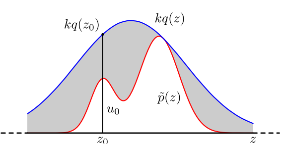

`接受-拒绝采样` 在高维的情况下会出现两个问题：合适的$q$分布比较难以找到。难以确定一个合理的$k$值。

##### 1.5.1.马尔可夫链

马尔可夫链是满足马尔可夫性质的随机过程。马尔可夫链$X_1, X_2, \cdots$描述了一个状态序列，其中每个状态值取决于前一个状态。$X_t$为随机变量，称为时刻$t$的状态，其取值范围称作状态空间。马尔可夫链的数学定义为： $P\left(X_{t+1} | X_{t}, X_{t-1}, \cdots, X_{1}\right)=P\left(X_{t+1} | X_{t}\right)$

###### 平稳分布

马尔可夫链定理：如果一个非周期马尔可夫链具有转移概率矩阵$\mathbf{P}$ ，且它的任何两个状态是联通的，则有
$$
\pi(j)=\sum_{i=0}^{\infty} \pi(i) P_{i, j}
$$
马尔可夫链的状态不要求有限，可以是无穷多个。非周期性在实际任务中都是满足的。两个状态的连通指的是：状态$i$可以通过有限的$j$步转移到达--并不要求从状态$i$可以直接一步转移到状态$j$。马尔可夫链的任何两个状态是联通的含义是：存在一个$n$，使得矩阵$\mathbf{P}^n$中的任何一个元素的数值都大于零。

如果从一个具体的初始状态$x_0$开始，然后沿着马尔可夫链按照概率转移矩阵做调整，则得到一个转移序列$x_0, x_1, \cdots, x_n, x_{n+1}, \cdots$。根据马尔可夫链的收敛行为，当$n$较大时，$x_n, x_{n+1}, \cdots$将是平稳分布$\vec{\pi}$的样本。

细致平稳性条件：如果非周期马尔可夫链的转移矩阵$\mathbf{P}$和某个分布$\vec{\pi}$满足: $\pi(i) P_{i, j}=\pi(j) P_{j, i}$则$\vec{\pi}$是马尔可夫链的平稳分布。
$$
\pi(i) P_{i, j}=\pi(j) P_{j, i} \rightarrow \sum_{i=1}^{\infty} \pi(i) P_{i, j}=\sum_{i=1}^{\infty} \pi(j) P_{j, i}=\pi(j) \sum_{i=1}^{\infty} P_{j, i}=\pi(j) \rightarrow \vec{\pi} \mathbf{P}=\vec{\pi}
$$
##### 1.5.2.$\text{MCMC}$采样

`MCMC` 算法的基本思想是：先设法构造一条马尔可夫链，使其收敛到平稳分布恰好为$\vec{\mathbf{p}}$。然后通过这条马尔可夫链来产生符合$\vec{\mathbf{p}}$分布的样本。最后通过这些样本来进行估计。

假设已经提供了一条马尔可夫链，其转移矩阵为$\mathbf{Q}$。目标是另一个马尔科夫链，使转移矩阵为$\mathbf{P}$、平稳分布是$\tilde{p}$。通常$\tilde{p}(i) Q_{i, j} \neq \tilde{p}(j) Q_{j, i}$，即$\tilde{p}$并不满足细致平稳条件不成立。但是可以改造已有的马尔可夫链，使得细致平稳条件成立。引入一个函数$\alpha(i, j)$，使其满足：$\tilde{p}(i) Q_{i, j} \alpha(i, j)=\tilde{p}(j) Q_{j, i} \alpha(j, i)$。若$\alpha(i, j)=\tilde{p}(j) Q_{j, i}$，则有：
$$
\tilde{p}(i) Q_{i, j} \alpha(i, j)=\tilde{p}(i) Q_{i, j} \tilde{p}(j) Q_{j, i}=\tilde{p}(j) Q_{j, i} \tilde{p}(i) Q_{i, j}=\tilde{p}(j) Q_{j, i} \alpha(j, i)
$$
令：$Q_{i, j}^{\prime}=Q_{i, j} \alpha(i, j), Q_{j, i}^{\prime}=Q_{j, i} \alpha(j, i)$，则有$\tilde{p}(i) Q_{i, j}^{\prime}=\tilde{p}(j) Q_{j, i}^{\prime}$。其中$Q_{i, j}^{\prime}$构成了转移矩阵$\mathbf{Q}^{\prime}$。而$Q^{\prime}$恰好满足细致平稳条件，因此它对应的马尔可夫链的平稳分布就是$\tilde{p}$。

在改造$\mathbf{Q}$的过程中引入的$\alpha(i, j)$称作接受率。其物理意义为：在原来的马尔可夫链上，从状态$i$以$Q_{i, j}$的概率跳转到状态$j$的时候，以$\alpha(i, j)$的概率接受这个转移。如果接受率$\alpha(i, j)$太小，则改造马尔可夫链过程中非常容易原地踏步，拒绝大量的跳转。这样使得马尔可夫链遍历所有的状态空间需要花费太长的时间，收敛到平稳分布$\tilde{p}$的速度太慢。根据推导$\alpha(i, j)=\tilde{p}(j) Q_{j, i}$，如果将系数从$1$提高到$K$，则有：
$$
\begin{aligned} \alpha^{*}(i, j) &=K \tilde{p}(j) Q_{j, i}=K \alpha(i, j) \\ \alpha^{*}(j, i) &=K \tilde{p}(i) Q_{i, j}=K \alpha(j, i) \end{aligned}
$$
提高了接受率，细致平稳条件仍然成立。将$\alpha(i, j), \alpha(j, i)$同比例放大，取：$\alpha(i, j)=\min \left\{\frac{\tilde{p}(j) Q_{j, i}}{\tilde{p}(i) Q_{i, j}}, 1\right\}$。当$\tilde{p}(j) Q_{j, i}=\tilde{p}(i) Q_{i, j}$时：$\alpha(i, j)=\alpha(j, i)=1$，此时满足细致平稳条件。当$\tilde{p}(j) Q_{j, i}>\tilde{p}(i) Q_{i, j}$时：$\alpha(i, j)=1, \alpha(j, i)=\frac{\tilde{p}(i) Q_{i, j}}{\tilde{p}(j) Q_{j, i}}$，此时满足细致平稳条件。当$\tilde{p}(j) Q_{j, i}<\tilde{p}(i) Q_{i, j}$时：$\alpha(i, j)=\frac{\tilde{p}(j) Q_{j, i}}{\tilde{p}(i) Q_{i, i}}, \alpha(j, i)=1$，此时满足细致平稳条件。

###### Gibbs算法

考虑二维的情形：假设有概率分布$\tilde{p}(x, y)$，考察状态空间上$x$坐标相同的两个点$A\left(x_{1}, y_{1}\right), B\left(x_{1}, y_{2}\right)$，可以证明有：
$$
\begin{array}{l}{\tilde{p}\left(x_{1}, y_{1}\right) \tilde{p}\left(y_{2} | x_{1}\right)=\tilde{p}\left(x_{1}\right) \tilde{p}\left(y_{1} | x_{1}\right) \tilde{p}\left(y_{2} | x_{1}\right)} \\ {\tilde{p}\left(x_{1}, y_{2}\right) \tilde{p}\left(y_{1} | x_{1}\right)=\tilde{p}\left(x_{1}\right) \tilde{p}\left(y_{2} | x_{1}\right) \tilde{p}\left(y_{1} | x_{1}\right)}\end{array}
$$
于是$\tilde{p}\left(x_{1}, y_{1}\right) \tilde{p}\left(y_{2} | x_{1}\right)=\tilde{p}\left(x_{1}, y_{2}\right) \tilde{p}\left(y_{1} | x_{1}\right)$。则在$x = x_1$这条平行于$y$轴的直线上，如果使用条件分布$\tilde{p}(y|x_1)$作为直线上任意两点之间的转移概率，则这两点之间的转移满足细致平稳条件。

可以构造状态空间上任意两点之间的转移概率矩阵$\mathbf{Q}$： 对于任意两点$A=\left(x_{A}, y_{A}\right), B=\left(x_{B}, y_{B}\right)$， 令从$A$转移到$B$的概率为$Q(A \rightarrow B)$：如果$x_{A}=x_{B}=x^{*}$，则$Q(A \rightarrow B)=\tilde{p}\left(y_{B} | x^{*}\right)$。如果$y_{A}=y_{B}=y^{*}$，则$Q(A \rightarrow B)=\tilde{p}\left(x_{B} | y^{*}\right)$。否则$Q(A \rightarrow B)=0$。采用该转移矩阵$\mathbf{Q}$，可以证明：对于状态空间中任意两点$A, B$，都满足细致平稳条件：$\tilde{p}(A) Q(A \rightarrow B)=\tilde{p}(B) Q(B \rightarrow A)$，于是这个二维状态空间上的马尔可夫链将收敛到平稳分布$\tilde{p}(x, y)$，这就是吉布斯采样的原理。

### 2.统计学习

**不同机器学习算法的区别**在于模型、学习准则（损失函数）和优化算法的差异。

机器学习任务可以分为两类，一类是样本的特征向量$\mathbf{x}$和标签$ y $之间如果存在未知的函数关系$ y = h(\mathbf{x})$，另一类是条件概率$ p(y|\mathbf{x})$ 服从某个未知分布。对一个预测任务，输入特征向量为$\mathbf{x}$，输出标签为$y$，我们选择一个函数$f(\mathbf{x}, θ)$，通过学习算法A和一组训练样本$D$，找到一组最优的参数$θ^∗$，得到最终的模型$f(\mathbf{x}, θ^∗)$。这样就可以对新的输入$\mathbf{x}$进行预测。

##### 模型

由于我们不知道真实的映射函数$g(\mathbf{x})$或条件概率分布$p_r(y|\mathbf{x})$的具体形式，只能根据经验来确定一个假设函数集合$F$，称为假设空间，然后通过观测其在训练集$D$上的特性，从中选择一个理想的假设$f^∗ ∈ F$。假设空间$F$通常为一个参数化的函数族$F = \{f(x, θ)|θ ∈ R^m\}$, 其中$f(x, θ)$为假设空间中的模型，$θ $为一组可学习参数，$m$为参数的数量。

**线性模型**的假设空间为一个参数化的线性函数族，$f(\mathbf{x}, \theta)=\mathbf{w}^{\mathrm{T}} \mathbf{x}+b$，其中参数$θ $包含了权重向量$w$和偏置$b$。

**广义的非线性模型**可以写为多个非线性基函数$ϕ(\mathbf{x})$的线性组合：$f(\mathbf{x}, \theta)=\mathbf{w}^{\mathrm{T}} \boldsymbol{\phi}(\mathbf{x})+b$。其中$ϕ(\mathbf{x}) = [ϕ_1(\mathbf{x}), ϕ_2(\mathbf{x}), · · · , ϕ_K(\mathbf{x})]^T $为$K $个非线性基函数组成的向量，参数$θ$包含了权重向量$w$和偏置$b$。
如果$ϕ(x)$本身为可学习的基函数，比如$\phi_{k}(\mathbf{x})=h\left(\mathbf{w}_{k}^{\mathrm{T}} \boldsymbol{\phi}^{\prime}(\mathbf{x})+b_{k}\right), \forall 1 \leq k \leq K$其中$h(·)$为非线性函数，$ϕ′(x)$为另一组基函数，$w_k $和$b_k $为可学习的参数，则$f(x, θ)$就等价于神经网络模型。

##### 学习准测

一个好的模型$f(\mathbf{x}, θ^∗)$应该在所有 $(\mathbf{x}, y) $的可能取值上都与真实映射函数$y = g(\mathbf{x})$一致，即
$$
\left|f\left(\mathbf{x}, \theta^{*}\right)-y\right|<\epsilon, \quad \forall(\mathbf{x}, y) \in \mathcal{X} \times \mathcal{Y}
$$
或与真实条件概率分布$p_r(y|\mathbf{x})$一致，即
$$
\left|f_{y}\left(\mathrm{x}, \theta^{*}\right)-p_{r}(y | \mathrm{x})\right|<\epsilon, \quad \forall(\mathrm{x}, y) \in \mathcal{X} \times \mathcal{Y}
$$
其中$ϵ$是一个很小的正数，$f_y(\mathbf{x}, θ^∗)$为模型预测的条件概率分布中$y$对应的概率。

模型$f(\mathbf{x}, θ)$的好坏可以通过期望风险$R(θ)$来衡量
$$
\mathcal{R}(\theta)=\mathbb{E}_{(\mathbf{x}, y) \sim p_{r}(\mathbf{x}, y)}[\mathcal{L}(y, f(\mathbf{x}, \theta))]
$$
其中$p_r(\mathbf{x}, y)$为真实的数据分布，$L(y, f(\mathbf{x}, θ))$为损失函数，用来量化两个变量之间的差异。

###### 损失函数

- 0-1 损失函数 ：$\mathcal{L}(y, f(\mathbf{x}, \theta))=\left\{\begin{array}{ll}{0} & {\text { if } y=f(\mathbf{x}, \theta)} \\ {1} & {\text { if } y \neq f(\mathbf{x}, \theta)}\end{array}\right.
  =I(y \neq f(\mathbf{x}, \theta))$

- 平方损失函数 ：$\mathcal{L}(y, f(\mathbf{x}, \theta))=\frac{1}{2}(y-f(\mathbf{x}, \theta))^{2}$

- 交叉熵损失函数：假设样本的标签$y ∈ \{1, · · · C\}$为离散的类别，模型$f(x, θ) ∈ [0, 1]^C$ 的输出为类别标签的条件概率分布，即：$p(y=c | \mathbf{x}, \theta)=f_{c}(\mathbf{x}, \theta)$。并满足：$f_{c}(\mathbf{x}, \theta) \in[0,1], \quad \sum_{c=1}^{C} f_{c}(\mathbf{x}, \theta)=1$

  标签的真实分布$y$和模型预测分布$f(\mathbf{x}, θ)$之间的交叉熵为：$\mathcal{L}(\mathbf{y}, f(\mathbf{x}, \theta))=-\sum_{c=1}^{C} y_{c} \log f_{c}(\mathbf{x}, \theta)$

- Hinge 损失函数：$\begin{aligned} \mathcal{L}(y, f(x, \theta)) &=\max (0,1-y f(x, \theta)) \\ & \triangleq[1-y f(x, \theta)]_{+} \end{aligned}$

###### 风险最小化准则

**经验风险最小化准则**：给定一个训练集$\mathcal{D}=\left\{\left(\mathbf{x}^{(n)}, y^{(n)}\right)\right\}_{n=1}^{N}$我们可以计算的是经验风险，即在训练集上的平均损失。
$$
\mathcal{R}_{\mathcal{D}}^{e m p}(\theta)=\frac{1}{N} \sum_{n=1}^{N} \mathcal{L}\left(y^{(n)}, f\left(x^{(n)}, \theta\right)\right)
$$
因此，一个切实可行的学习准则是找到一组参数$θ^∗$ 使得经验风险最小    
$$
\theta^{*}=\underset{\theta}{\arg \min } \mathcal{R}_{\mathcal{D}}^{\operatorname{emp}}(\theta)
$$
**结构风险最小化准则**：一般在经验风险最小化的基础上再引入参数的正则化，来限制模型能力，使其不要过度地最小化经验风险。
$$
\begin{aligned} \theta^{*} &=\arg \min _{\theta} \mathcal{R}_{\mathcal{D}}^{\operatorname{struct}}(\theta) \\ &=\underset{\theta}{\arg \min } \mathcal{R}_{\mathcal{D}}^{e m p}(\theta)+\frac{1}{2} \lambda\|\theta\|^{2} \\ &=\underset{\theta}{\arg \min } \frac{1}{N} \sum_{n=1}^{N} \mathcal{L}\left(y^{(n)}, f\left(x^{(n)}, \theta\right)\right)+\frac{1}{2} \lambda\|\theta\|^{2} \end{aligned}
$$
其中$∥θ∥$是$ℓ_2$范数的正则化项，用来减少参数空间，避免过拟合；$λ$用来控制正则化的强度。 

##### 优化算法

在确定了训练集 $D$、假设空间$ F$ 以及学习准则后，如何找到最优的模型$f(\mathbf{x}, θ^∗)$就成了一个最优问题。机器学习的训练过程其实就是最优化问题的求解过程。

**参数与超参数**在机器学习中，优化又可以分为参数优化和超参数优化。模型$f(\mathbf{x}, θ)$中的$θ$ 称为模型的参数，可以通过优化算法进行学习。除了可学习的参数$θ$ 之外，还有一类参数是用来定义模型结构或优化策略的，这类参数叫做超参数。

梯度下降算法：$\theta_{t+1}=\theta_{t}-\alpha \frac{\partial \mathcal{R}_{\mathcal{D}}(\theta)}{\partial \theta}
=\theta_{t}-\alpha \cdot \frac{1}{N} \sum_{n=1}^{N} \frac{\partial \mathcal{L}\left(y^{(n)}, f\left(\mathbf{x}^{(n)}, \theta\right)\right)}{\partial \theta}$

$\text{Stochastic Gradient Descent}$：$\theta \leftarrow \theta-\alpha \frac{\partial \mathcal{L}\left(\theta ; x^{(n)}, y^{(n)}\right)}{\partial \theta}$

$\text{Mini-Batch Gradient Descent}$：$\theta_{t+1} \leftarrow \theta_{t}-\alpha \cdot \frac{1}{K} \sum_{(\mathbf{x}, y) \in \mathcal{I}_{t}} \frac{\partial \mathcal{L}(y, f(\mathbf{x}, \theta))}{\partial \theta}$

#### 2.1.线性代数基础

###### 线性判别函数

一个线性分类模型或线性分类器，是由一个或多个线性的判别函数$f(\mathbf{x}, w) =w^T\mathbf{x} + b$和非线性的决策函数$g(·)$组成。特征空间$R^d$ 中所有满足$f(\mathbf{x}, w) = 0$的点组成用一个分割超平面，称为决策边界或决策平面。所谓“线性分类模型”就是指其决策边界是线性超平面。

**两类线性可分**：对于训练集$D=\left\{\left(\mathbf{x}^{(n)}, y^{(n)}\right)\right\}_{n=1}^{N}$,如果存在权重向量 $w^∗$，对所有样本都满足$yf(\mathbf{x}, w∗) > 0$，那么训练集$D$是线性可分的。

**多类分类问题**是指分类的类别数$C $大于2。多类分类一般需要多个线性判别函数，但设计这些判别函数有很多种方式。主要有三种：一对其余、一对一、$\text{argmax}$方式。

$\text{argmax}$方式：这是一种改进的一对其余方式，共需要$C $个判别函数
$$
f_{c}\left(\mathbf{x}, \mathbf{w}_{c}\right)=\mathbf{w}_{c}^{\mathrm{T}} \mathbf{x}+b_{c}, \quad c=[1, \cdots, C]
$$
如果存在类别$c$，对于所有的其他类别$\widetilde{C}(\widetilde{c} \neq c)$都满足$f_{c}\left(\mathbf{x}, \mathbf{w}_{c}\right)>f_{\tilde{c}}\left(\mathbf{x}, \mathbf{w}_{\tilde{c}}\right)$ 那么$\mathbf{x}$属于类别$c$。即$y=\underset{c=1}{\arg \max } f_{c}\left(\mathbf{x}, \mathbf{w}_{c}\right)$

**多类线性可分**： 对于训练集$D=\left\{\left(\mathbf{x}^{(n)}, y^{(n)}\right)\right\}_{n=1}^{N}$ ，如果存在$C$ 个权重向量 $w^∗_c, 1 ≤ c ≤ C$，对所有第$c$类的样本都满足$f_{c}\left(\mathbf{x}, \mathbf{w}_{c}\right)>f_{\tilde{c}}\left(\mathbf{x}, \mathbf{w}_{\overline{c}}\right), \forall \tilde{c} \neq c$，那么训练集$D$是线性可分的。

###### Logistic回归

引入非线性函数$g :R^d → (0, 1)$来预测类别标签的后验概率$p(y = 1|x)$。
$$
p(y=1 | \mathbf{x})=g(f(\mathbf{x}, \mathbf{w}))
$$
采用交叉熵作为损失函数，并使用梯度下降法来对参数进行优化。
$$
\mathbf{w}_{t+1} \leftarrow \mathbf{w}_{t}+\alpha \frac{1}{N} \sum_{n=1}^{N} \mathbf{x}^{(n)}\left(y^{(n)}-\hat{y}_{\mathbf{w}_{t}}^{(n)}\right)
$$

###### Softmax回归

给定一个样本$\text{x}$，$\text{softmax}$回归预测的属于类别$c$的条件概率
$$
\begin{aligned} p(y=c | \mathbf{x}) &=\operatorname{softmax}\left(\mathbf{w}_{c}^{\mathrm{T}} \mathbf{x}\right) \\ &=\frac{\exp \left(\mathbf{w}_{c}^{\top} \mathbf{x}\right)}{\sum_{c=1}^{C} \exp \left(\mathbf{w}_{c}^{\top} \mathbf{x}\right)} \end{aligned}
$$
其中$w_c$是第$c$类的权重向量，用向量形式可以写为
$$
\begin{aligned} \hat{\mathbf{y}} &=\operatorname{softmax}\left(W^{\mathrm{T}} \mathbf{x}\right) \\ &=\frac{\exp \left(W^{\mathrm{T}} \mathbf{x}\right)}{\mathbf{1}^{\mathrm{T}} \exp \left(W^{\mathrm{T}} \mathbf{x}\right)} \end{aligned}
$$
其中$W = [w_1, · · · , w_C ]$是由$C$个类的权重向量组成的矩阵，1为全1向量，$\hat{\mathbf{y}} \in R$，$C$为所有类别的预测条件概率组成的向量，第$c$维的值是第 $c$类的预测条件概率。

$Softmax$回归的决策函数可以表示:
$$
\begin{aligned} \hat{y} &=\underset{c=1}{\arg \max } p(y=c | \mathbf{x}) \\ &=\underset{c=1}{\arg \max } \mathbf{w}_{c}^{\mathrm{T}} \mathbf{x} \end{aligned}
$$
使用交叉熵损失函数来学习最优的参数矩阵$W$。
$$
W_{t+1} \leftarrow W_{t}+\alpha\left(\frac{1}{N} \sum_{n=1}^{N} \mathbf{x}^{(n)}\left(\mathbf{y}^{(n)}-\hat{\mathbf{y}}_{W_{t}}^{(n)}\right)^{\mathrm{T}}\right)
$$

##### 广义线性模型

###### 多元伯努利分布

如果给定$\vec{\mathbf{x}}$和$\vec{\mathbf{w}}$之后，$y$的条件概率分布$p(y | \vec{\mathbf{x}} ; \vec{\mathbf{w}})$服从指数分布族，则该模型称作广义线性模型。指数分布族的形式为：$p(y ; \eta)=b(y) * \exp (\eta T(y)-a(\eta))$。$\eta$是$\vec{\mathbf{x}}$的线性函数：$\eta=\vec{\mathbf{w}}^{T} \vec{\mathbf{x}}$ 。$b(y),T(y)$为$y$的函数。$\alpha(\eta)$为$\eta$的函数.

假设有$K$个分类，样本标记$\tilde{y} \in\{1,2, \cdots, K\}$。每种分类对应的概率为$\phi_{1}, \phi_{2}, \cdots, \phi_{K}$。则根据全概率公式，有
$$
\begin{array}{c}{\sum_{i=1}^{K} \phi_{i}=1} \\ {\phi_{K}=1-\sum_{i=1}^{K-1} \phi_{i}}\end{array}
$$
定义$T(y)$为一个$K-1$维的列向量：
$$
T(1)=\left[ \begin{array}{c}{1} \\ {0} \\ {0} \\ {\vdots} \\ {0}\end{array}\right], T(2)=\left[ \begin{array}{c}{0} \\ {1} \\ {0} \\ {\vdots} \\ {0}\end{array}\right], \cdots, T(K-1)=\left[ \begin{array}{c}{0} \\ {0} \\ {0} \\ {\vdots} \\ {1}\end{array}\right], T(K)=\left[ \begin{array}{c}{0} \\ {0} \\ {0} \\ {\vdots} \\ {0}\end{array}\right]
$$
定义示性函数 : $I(y=i)$表示属于$i$分类；$I(y \neq i)$表示不属于$i$分类。则有：$T(y)_{i}=I(y=i)$

构建概率密度函数为：
$$
\begin{array}{l}p(y ; \phi)=\phi_{1}^{I(y=1)} \times \phi_{2}^{I(y=2)} \times \cdots \times \phi_{K}^{I(y=K)}\\
=\phi_{1}^{T(y)_{1}} \times \phi_{2}^{T(y)_{2}} \times \cdots \times \phi_{K}^{1-\sum_{i-1}^{K-1} T(y)_{i}}\\
{=\exp \left(T(y)_{1} \times \ln \phi_{1}+T(y)_{2} \times \ln \phi_{2}+\cdots+\left(1-\sum_{i=1}^{K-1} T(y)_{i}\right) \times \ln \phi_{K}\right)} \\ {=\exp \left(T(y)_{1} \times \ln \frac{\phi_{1}}{\phi_{K}}+T(y)_{2} \times \ln \frac{\phi_{2}}{\phi_{K}}+\cdots+T(y)_{K-1} \times \ln \frac{\phi_{K-1}}{\phi_{K}}+\ln \phi_{K}\right)}\\
\text{令}：\eta=\left(\ln \frac{\phi_{1}}{\phi_{K}}, \ln \frac{\phi_{2}}{\phi_{K}}, \cdots, \ln \frac{\phi_{K-1}}{\phi_{K}}\right)^{T}\\
\text{则有}:p(y ; \phi)=\exp \left(\eta \cdot T(y)+\ln \phi_{K}\right)\\
\text{令}b(y)=1, a(\eta)=-\ln \phi_{K}，\text{则满足广义线性模型}\\
\phi_{i}=\left\{\begin{array}{ll}{\frac{e^{\eta_{i}}}{1+\sum_{j=1}^{K-1} e^{\eta_{j}}},} & {i=1,2, \cdots, K-1} \\ {\frac{1}{1+\sum_{j=1}^{K-1} e^{\eta_{j}}},} & {i=K}\end{array}\right.
\end{array}
$$

#### 2.2.$\text{SVM}$

###### $\text{C-SVM}$

其基本模型定义为特征空间上的间隔最大的线性分类器，其学习策略便是间隔最大化，最终可转化为一个凸二次规划问题的求解。对于线性可分的情况，$C-SVM$问题可以转化为如下的二次规划问题：
$$
\begin{aligned} \min &=\frac{1}{2}\|w\|^{2}+C \sum_{i=1}^{l} \xi_{i} \\ \text {s.t.} & y_{i}\left[w^{T} x_{i}+b\right] \geq 1-\xi_{i}, i=1, \ldots, l \\ & \xi_{i} \geq 0, i=1, \ldots, l \end{aligned}
$$

###### $\text{V-SVM}$

在$\text{V-SVM}$中有两个互相矛盾的目标：最大$\text{Margin}$和最小训练误差，其中$C$起着调节这两项目标的作用。参数$C$的选取是比较困难的。于是在$\text{C-SVM}$的基础上进行改进，提出了$\text{V-SVM}$。  $\text{V-SVM}$的思想就是利用新的参数来代替$C$。在线性可分的情况下，$\text{V-SVM}$模型如下：
$$
\begin{array}{l}{\min =\frac{1}{2}\|w\|^{2}-\rho v+\frac{1}{l} \sum_{i=1}^{l} \xi_{i}} \\ {\text {s.t.} y_{i}\left[w^{T} x_{i}+b\right] \geq \rho-\xi_{i}, i=1, \ldots, l} \\ {\rho \geq 0} \\ {\quad \xi_{i} \geq 0, i=1, \ldots, l}\end{array}
$$
其中，$l$为训练集样本点的个数。在一定条件下，当$l→∞$时，$v$将以趋近于$1 $的概率渐进与支持向量的个数和训练集样本点的个数比；参数$v$可以用来控制支持向量的数目和误差，也比较容易选择。参数$ρ$代表了两类点将以$\frac{2ρ}{‖w‖}$的间隔分开。

###### $\text{W-SVM}$

不同的样本在训练集中所占的比重是不同的。基于这一思想，针对不同的样本应该选择不同的惩罚参数，因此提出了加权支持向量机。
$$
\begin{aligned} \min &=\frac{1}{2}\|w\|^{2}+C \sum_{i=1}^{l} s_{i} \xi_{i} \\ \text {s.t.} & y_{i}\left[w^{T} x_{i}+b\right] \geq 1-\xi_{i}, i=1, \ldots, l \\ & \xi_{i} \geq 0, i=1, \ldots, l \end{aligned}
$$

###### $\text{LS-SVM}$

 当训练样本很大时，优化$\text{C-SVM}$算法计算量庞大。为方便求解$\text{SVM}$，提出了最小而成支持向量机。$\text{LS-SVM}$将$\text{C-SVM}$中的不等式约束变为等式约束，求解过程变成了解一组等式方程，求解速度相对加快。但是$\text{LS-SVM}$使用的是最小二乘损失函数，这样破坏$\text{C-SVM}$的稀疏性。
$$
\begin{aligned} \min &=\frac{1}{2}\|w\|^{2}+\frac{C}{2} \sum_{i=1}^{l} \xi_{i}^{2} \\ \text {s.t.} & y_{i}\left[w^{T} x_{i}+b\right]=1-\xi_{i}, i=1, \ldots, l \\ & \xi_{i} \geq 0, i=1, \ldots, l \end{aligned}
$$

###### $\text{L-SVM}$

 虽然$\text{LS-SVM}$可以提高求解$SVM$的速度，但提高的速度相对较小。如果改变$\text{C-SVM}$的目标函数，使得对偶问题为一无上界约束的二次函数的最小值问题，那么将大大加快求解的速度。因此提出了$\text{Lanrange}$支持向量机。
$$
\begin{array}{l}{\min =\frac{1}{2}\|w\|^{2}+\frac{C}{2} \sum_{i=1}^{l} \xi_{i}^{2}+\frac{1}{2} b^{2}} \\ {\text {s.t.} y_{i}\left[w^{T} x_{i}+b\right] \geq 1-\xi_{i}, i=1, \ldots, l}\end{array}
$$
对于线性不可分的情况，$\text{SVM}$先将训练集做非线性变换将输入空间映射到$Hilbert$空间。即寻找一个变换$Φ$，满足：
$$
\begin{array}{l}{\Phi : X \subset R^{n} \rightarrow H} \\ {x : \rightarrow \Phi(x)}\end{array}
$$

#### 2.3.朴素贝叶斯

朴素贝叶斯分类器是后验概率最大化，等价于期望风险最小化。令损失函数为：
$$
L(y, f(\overrightarrow{\mathbf{x}}))=\left\{\begin{array}{l}{1,} & {y \neq f(\overrightarrow{\mathbf{x}})} \\ {0,} & {y=f(\overrightarrow{\mathbf{x}})}\end{array}\right.\\R_{e x p}(f)=\mathbb{E}[L(y, f(\overrightarrow{\mathbf{x}}))]=\sum_{\overrightarrow{\mathbf{x}} \in \mathcal{X}} \sum_{y \in \mathcal{Y}} L(y, f(\overrightarrow{\mathbf{x}})) p(\overrightarrow{\mathbf{x}}, y)
$$
根据$p(\overrightarrow{\mathbf{x}}, y)=p(\overrightarrow{\mathbf{x}}) p(y | \overrightarrow{\mathbf{x}})$有：
$$
R_{e x p}(f)=\mathbb{E}[L(y, f(\overrightarrow{\mathbf{x}}))]=\sum_{\overrightarrow{\mathbf{x}} \in \mathcal{X}} \sum_{y \in \mathcal{Y}} L(y, f(\overrightarrow{\mathbf{x}})) p(\overrightarrow{\mathbf{x}}, y)=\mathbb{E}_{X}\left[\sum_{y \in \mathcal{Y}} L(y, f(\overrightarrow{\mathbf{x}})) p(y | \overrightarrow{\mathbf{x}})\right]
$$
为了使得期望风险最小化，只需要对$\mathbb{E}_{X}$中的元素极小化。令$\hat{y}=f(\overrightarrow{\mathbf{x}})$，则有：
$$
\begin{array}{l}{\arg \min _{\hat{y}} \sum_{y \in \mathcal{Y}} L(y, \hat{y}) p(y | \overrightarrow{\mathbf{x}})=\arg \min _{\hat{y}} \sum_{y \in \mathcal{Y}} p(y \neq \hat{y} | \overrightarrow{\mathbf{x}})} \\ {=\arg \min _{\hat{y}}(1-p(\hat{y} | \overrightarrow{\mathbf{x}}))=\arg \max _{\hat{y}} p(\hat{y} | \overrightarrow{\mathbf{x}})}\end{array}
$$
即：期望风险最小化，等价于后验概率最大化。

#### 2.4.决策树

决策树模型是描述对样本进行分类的树形结构。树由结点和有向边组成：内部结点表示一个特征或者属性。叶子结点表示一个分类。有向边代表了一个划分规则。决策树从根结点到子结点的的有向边代表了一条路径。决策树的路径是互斥并且是完备的。用决策树分类时，对样本的某个特征进行测试，根据测试结果将样本分配到树的子结点上。此时每个子结点对应该特征的一个取值。递归地对样本测试，直到该样本被划分叶结点。最后将样本分配为叶结点所属的类。决策树的优点：可读性强，分类速度快。决策树学习通常包括3个步骤：特征选择。决策树生成。决策树剪枝。

决策树将特征空间划分为互不相交的单元，在每个单元定义一个类的概率分布，这就构成了一个条件概率分布。决策树的每一条路径对应于划分中的一个基本单元。设某个单元$S$内部有$N_S$个样本点，则它定义了一个条件概率分布$p(y | \overrightarrow{\mathbf{x}}), \overrightarrow{\mathbf{x}} \in \mathbb{S}$。单元上的条件概率偏向哪个类，则该单元划归到该类的概率较大。即单元的类别为：$\arg \max _{y} p(y | \overrightarrow{\mathbf{x}}), \overrightarrow{\mathbf{x}} \in \mathbb{S}$。决策树所代表的条件概率分布由各个单元给定条件下类的条件概率分布组成。决策树的**学习目标**：根据给定的训练数据集构造一个决策树模型，使得它能够对样本进行正确的分类。决策树**最优化的策略**：损失函数最小化。决策树的损失函数通常是正则化的极大似然函数。选择最优决策树的问题是个 `NP` 完全问题。一般采用启发式方法近似求解这个最优化问题，这时的解为次最优的。决策树学习的算法通常递归地选择最优特征，并根据该特征对训练数据进行分割，使得对各个子数据集有一个最好的分类。

###### 剪枝算法

设树$T$的叶结点个数为$|T_f|$。设$T_{t}, t=1,2, \cdots,\left|T_{f}\right|$为树的叶节点，该叶结点有$N_t$个样本点，其中属于$c_k$类的样本点有$N_{t,k}$个，$k=1,2, \cdots, K$。令$H(t)$为叶结点$T_t$上的经验熵，令$\alpha \geq 0$为参数，则决策树$T$的损失函数定义为：$C_{\alpha}(T)=\sum_{t=1}^{\left|T_{f}\right|} N_{t} H(t)+\alpha\left|T_{f}\right|$其中：$H(t)=-\sum_{k=1}^{K} \frac{N_{t, k}}{N_{t}} \log \frac{N_{t, k}}{N_{t}}$ 。令$C(T)=\sum_{t=1}^{\left|T_{f}\right|} N_{t} H(t)=-\sum_{t=1}^{\left|T_{f}\right|} \sum_{k=1}^{K} N_{t, k} \log \frac{N_{t, k}}{N_{t}}$，则：$C_{\alpha}(T)=C(T)+\alpha\left|T_{f}\right|$。其中$\alpha\left|T_{f}\right|$为正则化项，$C(T)$表示预测误差。参数$\alpha$控制预测误差与模型复杂度之间的关系。较大的$\alpha$会选择较简单的模型 。较小的$\alpha$会选择较复杂的模型。只考虑对训练集的拟合，不考虑模型复杂度。决策树剪枝的准则是：考虑当$\alpha$确定时，$C_{\alpha}(T)$最小化。这等价于正则化的极大似然估计。

###### CART树

`CART` 假设决策树是二叉树：内部结点特征的取值为 `是` 与 `否` 。其中：左侧分支取 `是`，右侧分支取  `否` 。它递归地二分每个特征，将输入空间划分为有限个单元。

`CART` 树与`ID3` 决策树和 `C4.5` 决策树的重要区别：`CART` 树是二叉树，而后两者是`N` 叉树。由于是二叉树，因此 `CART` 树的拆分不依赖于特征的取值数量。因此`CART` 树也就不像`ID3` 那样倾向于取值数量较多的特征。`CART` 树的特征可以是离散的，也可以是连续的。而后两者的特征是离散的。如果是连续的特征，则需要执行分桶来进行离散化。

回归树：选择第$j$维$x_j$和它的取值$s$作为切分变量和切分点。定义两个区域：
$$
\begin{array}{l}{R_{1}(j, s)=\left\{\overrightarrow{\mathbf{x}} | x_{j} \leq s\right\}} \\ {R_{2}(j, s)=\left\{\overrightarrow{\mathbf{x}} | x_{j}>s\right\}}\end{array}
$$
然后寻求最优切分变量$j$和最优切分点$s$。即求解
$$
\left(j^{*}, s^{*}\right)=\min _{j, s}\left[\min _{c_{1}} \sum_{\vec{x}_{1} \in R_{1}(j, s)}\left(\tilde{y}_{i}-c_{1}\right)^{2}+\min _{c_{2}} \sum_{\vec{x}_{1} \in R_{2}(j, s)}\left(\tilde{y}_{i}-c_{2}\right)^{2}\right]
$$
`CART` 分类树遍历所有可能的维度$j$和该维度所有可能的取值$s$，取使得基尼系数最小的那个维度$j$和切分点$s$。
$$
\left(j^{*}, s^{*}\right)=\min _{j, s} \operatorname{Gini}(\mathbb{D}, j : s)
$$

#### 2.5.$\text{KNN}$

$k$近邻法是个非参数学习算法，它没有任何参数。 近邻模型具有非常高的容量，这使得它在训练样本数量较大时能获得较高的精度。它的缺点有：计算成本很高。因为需要构建一个$N\times N$的距离矩阵，其计算量为$O(N^2)$，其中$N$为训练样本的数量。在训练集较小时，泛化能力很差，非常容易陷入过拟合。无法判断特征的重要性。

##### K近邻算法

近邻法的三要素： $k$值选择。距离度量。决策规则。

###### K值选择

若$k$值较小，则相当于用较小的邻域中的训练样本进行预测，"学习"的偏差减小只有与输入样本较近的训练样本才会对预测起作用，预测结果会对近邻的样本点非常敏感。若近邻的训练样本点刚好是噪声，则预测会出错。即：$k$值的减小意味着模型整体变复杂，易发生过拟合。优点：减少"学习"的偏差。缺点：增大"学习"的方差。若$k$值较大，则相当于用较大的邻域中的训练样本进行预测。这时输入样本较远的训练样本也会对预测起作用，使预测偏离预期的结果。即：$k$值增大意味着模型整体变简单。优点：减少"学习"的方差。缺点：增大"学习"的偏差。

###### 决策规则

分类决策通常采用多数表决，也可以基于距离的远近进行加权投票：距离越近的样本权重越大。多数表决等价于经验风险最小化。回归决策通常采用均值回归，也可以基于距离的远近进行加权投票：距离越近的样本权重越大。均值回归等价于经验风险最小化。

##### kd树

$kd$树是一种对$k$维空间中的样本点进行存储以便对其进行快速检索的树型数据结构。

它是二叉树，表示对$k$维空间的一个划分。构造$kd$树的过程相当于不断的用垂直于坐标轴的超平面将$k$维空间切分的过程。$kd$树的每个结点对应于一个$k$维超矩形区域。

$kd$树搜索算法

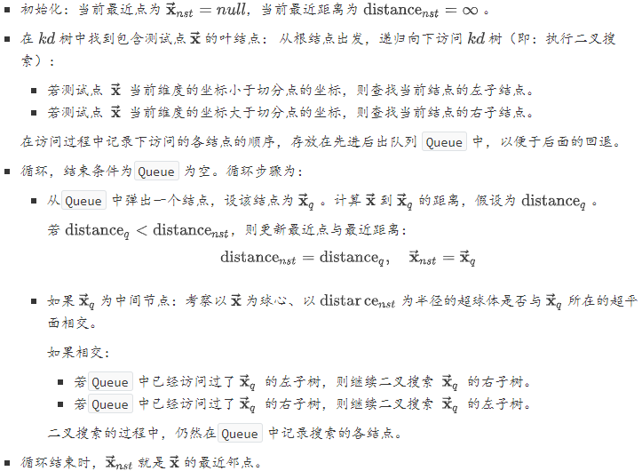

#### 2.6.集成学习

集成学习`ensemble learning`是通过构建并结合多个学习器来完成学习任务。其一般结构为：先产生一组“个体学习器”（`individual learner`) 。个体学习器通常由一种或者多种现有的学习算法从训练数据中产生。如果个体学习器都是从某一种学习算法从训练数据中产生，则称这样的集成学习是同质的`homogenerous`。此时的个体学习器也称作基学习器`base learner`，相应的学习算法称作基学习算法。如果个体学习器是从某几种学习算法从训练数据中产生，则称这样的集成学习是异质的`heterogenous` 。再使用某种策略将它们结合起来。集成学习通过将多个学习器进行组合，通常可以获得比单一学习器显著优越的泛化性能。

通常选取个体学习器的准则是：个体学习器要有一定的准确性，预测能力不能太差。个体学习器之间要有多样性，即学习器之间要有差异。根据个体学习器的生成方式，目前的集成学习方法大概可以分作两类：个体学习器之间存在强依赖关系、必须串行生成的序列化方法，每一轮迭代产生一个个体学习器。其中以`Boosting`为代表。个体学习器之间不存在强依赖关系、可同时生成的并行化方法。其中以`Bagging`和随机森林`Random Forest`为代表。

数据样本扰动：给定初始数据集，可以从中产生出不同的数据子集。再利用不同的数据子集训练出不同的个体学习器。数据样本扰动通常是基于采样法，此类做法简单高效、使用最广。输入属性扰动：训练样本通常由一组属性描述，不同的“子空间”提供了观察数据的不同视角。显然从不同子空间训练出来的个体学习器必然有所不同。输出表示扰动：此类做法的思路是对输出表示进行操纵以增强多样性。算法参数扰动：基学习算法一般都有超参数需要设置。可以通过随机设置不同的超参数，从而产生差别较大的个体学习器。

##### Boost

提升方法的理论基础是：强可学习与弱可学习是等价的。在概率近似正确$PCA$学习的框架下：强可学习：一个概念（或一个类别），若存在一个多项式的学习算法能够学习它并且正确率很高，那么称这个概念是强可学习的。弱可学习：一个概念（或一个类别），若存在一个多项式的学习算法能够学习它，学习的正确率仅比随机猜测略好，那么称这个概念是弱可学习的。可以证明：强可学习与弱可学习是等价的。即：若在学习中发现了 ”弱学习算法“ ，则可以通过某些办法将它提升为 ”强学习算法“。

`Boosting` 就是一族可以将弱学习器提升为强学习器的算法。这族算法的工作原理类似：先从初始训练集训练出一个基学习器。再根据基学习器的表现对训练样本分布进行调整，使得先前基学习器做错的训练样本在后续受到更多关注。然后基于调整后的样本分布来训练下一个基学习器。如此重复，直到基学习器数量达到事先指定的值`M` 。最终将这`M`个基学习器进行加权组合。

##### 加法模型

`AdaBoost` 算法可以认为是：模型为加法模型、损失函数为指数函数、学习算法为前向分步算法的二类分类学习方法。其中指数损失函数为：$L(\tilde{y}, f(\overrightarrow{\mathbf{x}}))=e^{-\tilde{y} f(\overrightarrow{\mathbf{x}})}$。考虑加法模型$y=f(\overrightarrow{\mathbf{x}})=\sum_{m=1}^{M} \beta_{m} b\left(\overrightarrow{\mathbf{x}} ; \gamma_{m}\right)$，其中$b\left(\overrightarrow{\mathbf{x}} ; \gamma_{m}\right)$为基函数、$\gamma_{m}$为基函数的参数、$\beta_m$为基函数的系数。给定训练数据以及损失函数$L(\tilde{y}, y)$的条件下，根据经验风险极小化准测来学习加法模型$f(\vec{x})$：
$$
\min _{\beta_{m}, \gamma_{m}} \sum_{i=1}^{N} L\left(\tilde{y}_{i}, \sum_{m=1}^{M} \beta_{m} b\left(\overrightarrow{\mathbf{x}} ; \gamma_{m}\right)\right)
$$

##### Bagging

`Bagging`直接基于自助采样法`bootstrap sampling`。自助采样法的步骤是：给定包含  个样本的数据集：先随机取出一个样本放入采样集中，再把该样本放回原始数据集。这样经过$N$次随机采样操作，得到包含$N$个样本的采样集。

`Bagging`的基本流程：经过$M$轮自助采样，可以得到$M$个包含$N$个训练样本的采样集。然后基于每个采样集训练出一个基学习器。最后将这$M$个基学习器进行组合，得到集成模型。

在使用 `Bagging`学习器进行预测时：分类任务采取简单投票法，取每个基学习器的预测类别的众数。回归任务使用简单平均法，取每个基学习器的预测值的平均。

###### 随机森林

随机森林对`Bagging`做了小改动：`Bagging`中基学习器的“多样性”来自于样本扰动。样本扰动来自于对初始训练集的随机采样。随机森林在以决策树为基学习器构建`Bagging`集成模型的基础上，进一步在决策树的训练过程中引入了随机属性选择。随机森林中，对基决策树的每个结点，先从该结点的属性集合中随机选择一个包含$k$个属性的子集，然后再从这个子集中选择一个最优属性用于划分。通常建议$k=\log _{2} n$

随机森林的优点：训练效率较高。因为随机森林使用的决策树只需要考虑所有属性的一个子集。随机森林简单、容易实现、计算开销小。随机森林在很多现实任务中展现出强大的性能，被称作 “代表集成学习技术水平的方法”。

##### 集成策略

学习器组合可以能带来好处：由于学习任务的假设空间往往很大，可能有多个假设在训练集上达到同等性能。此时如果使用单学习器可能因为造成误选而导致泛化性能不佳，通过学习器组合之后会减小这一风险。学习算法往往会陷入局部极小。有的局部极小点所对应的泛化性能可能很差，而通过学习器组合之后可降低陷入糟糕局部极小的风险。某些学习任务的真实假设可能不在当前学习算法所考虑的假设空间中，此时使用单学习器肯定无效。通过学习器组合之后，由于相应的假设空间有所扩大，有可能学得更好的近似。

##### 多样性增强

数据样本扰动：给定初始数据集，可以从中产生出不同的数据子集。再利用不同的数据子集训练出不同的个体学习器。输入属性扰动：训练样本通常由一组属性描述，不同的“子空间”提供了观察数据的不同视角。显然从不同子空间训练出来的个体学习器必然有所不同。算法参数扰动：基学习算法一般都有超参数需要设置。可以通过随机设置不同的超参数，从而产生差别较大的个体学习器。

#### 2.7.梯度提升树

###### 提升树

对分类问题，提升树中的决策树是二叉决策树；对回归问题，提升树中的决策树是二叉回归树。提升树模型可以表示为决策树为基本学习器的加法模型：$f(\vec{\mathbf{x}})=f_{M}(\vec{\mathbf{x}})=\sum_{m=1}^{M} h_{m}\left(\vec{\mathbf{x}} ; \Theta_{m}\right)$其中：$h_{m}\left(\vec{\mathbf{x}} ; \Theta_{m}\right)$表示第$m$个决策树。$\Theta_m$为第$m$个决策树的参数。$M$为决策树的数量。提升树算法采用前向分步算法。

首先确定初始提升树$f_{0}(\vec{\mathbf{x}})=0$。

第$m$步模型为：$f_{m}(\vec{\mathbf{x}})=f_{m-1}(\vec{\mathbf{x}})+h_{m}\left(\vec{\mathbf{x}} ; \Theta_{m}\right)$。其中$h_m(·)$为待求的第$m$个决策树。通过经验风险极小化确定第$m$个决策树的参数$\Theta_m$：$\hat{\Theta}_{m}=\arg \min _{\Theta_{m}} \sum_{i=1}^{N} L\left(\tilde{y}_{i}, f_{m}\left(\vec{\mathbf{x}}_{i}\right)\right)$

不同问题的提升树学习算法主要区别在于使用的损失函数不同：回归问题：通常使用平方误差损失函数： $L(\tilde{y}, \hat{y})=(\tilde{y}-\hat{y})^{2}$。分类问题：通常使用指数损失函数：$L(\tilde{y}, \hat{y})=e^{-\tilde{y} \hat{y}}$。

###### GBT

给定训练数据集$\mathbb{D}=\left\{\left(\vec{\mathbf{x}}_{1}, \tilde{y}_{1}\right),\left(\vec{\mathbf{x}}_{2}, \tilde{y}_{2}\right), \cdots,\left(\vec{\mathbf{x}}_{N}, \tilde{y}_{N}\right)\right\}, \quad \vec{\mathbf{x}}_{i} \in \mathcal{X} \subseteq \mathbb{R}^{n}, \tilde{y}_{i} \in \mathcal{Y} \subseteq \mathbb{R}$，其中$\mathcal{X}$为输入空间，$\mathcal{Y}$为输出空间。

如果将输入空间$\mathcal{X}$划分为$J$个互不相交的区域$\mathbf{R}_{1}, \mathbf{R}_{2}, \cdots, \mathbf{R}_{J}$，并且在每个区域上确定输出的常量$c_j$， 则决策树可以表示为：$h(\vec{\mathbf{x}} ; \Theta)=\sum_{j=1}^{J} c_{j} I\left(\vec{\mathbf{x}} \in \mathbf{R}_{j}\right)$ 其中：参数$\Theta=\left\{\left(\mathbf{R}_{1}, c_{1}\right),\left(\mathbf{R}_{2}, c_{2}\right), \cdots,\left(\mathbf{R}_{J}, c_{J}\right)\right\}$表示决策树的划分区域和各区域上的输出。$J$是决策树的复杂度，即叶结点个数。

###### 正则化

1. `Freidman` 从`bagging` 策略受到启发，采用随机梯度提升来修改了原始的梯度提升树算法。每一轮迭代中，新的决策树拟合的是原始训练集的一个子集的残差。这个子集是通过对原始训练集的无放回随机采样而来。子集的占比$f$是一个超参数，并且在每轮迭代中保持不变。如果$f=1$，则与原始的梯度提升树算法相同。较小的$f$会引入随机性，有助于改善过拟合，因此可以视作一定程度上的正则化。工程经验表明，$0.5 \leq f \leq 0.8$会带来一个较好的结果。这种方法除了改善过拟合之外，另一个好处是：未被采样的另一部分子集可以用来计算包外估计误差。因此可以避免额外给出一个独立的验证集。梯度提升树会限制每棵树的叶子结点包含的样本数量至少包含$m$个样本，其中$m$为超参数。在训练过程中，一旦划分结点会导致子结点的样本数少于$m$，则终止划分。这也是一种正则化策略，它会改善叶结点的预测方差。

###### xgboost

`xgboost` 也是使用与提升树相同的前向分步算法。其区别在于：`xgboost` 通过结构风险极小化来确定下一个决策树的参数$\Theta_m$：$\hat{\Theta}_{m}=\arg \min _{\Theta_{m}} \sum_{i=1}^{N} L\left(\tilde{y}_{i}, f_{m}\left(\vec{\mathbf{x}}_{i}\right)\right)+\Omega\left(h_{m}(\vec{\mathbf{x}})\right)$其中：$\Omega(h_m)$为第$m$个决策树的正则化项。这是`xgboost`  和`GBT`的一个重要区别。$\mathcal{L}=\sum_{i=1}^{N} L\left(\tilde{y}_{i}, f_{m}\left(\vec{\mathbf{x}}_{i}\right)\right)+\Omega\left(h_{m}(\vec{\mathbf{x}})\right)$为目标函数。定义：

$\hat{y}_{i}^{<m-1>}=f_{m-1}\left(\vec{\mathbf{x}}_{i}\right), \quad g_{i}=\frac{\partial L\left(\tilde{y}_{i}, \hat{y}_{i}^{<m-1>}\right)}{\partial \hat{y}_{i}^{<m-1>}}, \quad h_{i}=\frac{\partial^{2} L\left(\tilde{y}_{i}, \hat{y}_{i}^{<m-1>}\right)}{\partial^{2} \hat{y}_{i}^{<m-1>}}$对目标函数  执行二阶泰勒展开：
$$
\begin{aligned} \mathcal{L} &=\sum_{i=1}^{N} L\left(\tilde{y}_{i}, f_{m}\left(\overrightarrow{\mathbf{x}}_{i}\right)\right)+\Omega\left(h_{m}(\overrightarrow{\mathbf{x}})\right)=\sum_{i=1}^{N} L\left(\tilde{y}_{i}, \hat{y}_{i}^{<m-1>}+h_{m}\left(\overrightarrow{\mathbf{x}}_{i}\right)\right)+\Omega\left(h_{m}(\overrightarrow{\mathbf{x}})\right) \\ & \simeq \sum_{i=1}^{N}\left[L\left(\tilde{y}_{i}, \hat{y}_{i}^{<m-1>}\right)+g_{i} h_{m}\left(\overrightarrow{\mathbf{x}}_{i}\right)+\frac{1}{2} h_{i} h_{m}^{2}\left(\overrightarrow{\mathbf{x}}_{i}\right)\right]+\Omega\left(h_{m}(\overrightarrow{\mathbf{x}})\right)+\text { constant } \end{aligned}
$$
提升树模型只采用一阶泰勒展开。这也是`xgboost` 和`GBT`的另一个重要区别。对一个决策树$h_{m}(\vec{\mathbf{x}})$，仅考虑决策树的效果：给定输入$\vec{\mathbf{x}}$，该决策树将该输入经过不断的划分，最终划分到某个叶结点上去。给定一个叶结点，该叶结点有一个输出值。因此将决策树拆分成结构部分$q(·)$，和叶结点权重部分$\vec{\mathbf{w}}=\left(w_{1}, w_{2}, \cdots, w_{T}\right)$，其中$T$为叶结点的数量。结构部分$q(\vec{\mathbf{x}})$的输出是叶结点编号$d$。它的作用是将输入$\vec{\mathbf{x}}$映射到编号为$d$的叶结点。叶结点权重部分就是每个叶结点的值。它的作用是输出编号为$d$的叶结点的值$\omega_d$。因此决策树改写为：$h_{m}(\vec{\mathbf{x}})=w_{q(\vec{x})}$。

定义一个决策树的复杂度为：$\Omega\left(h_{m}(\vec{\mathbf{x}})\right)=\gamma T+\frac{1}{2} \lambda \sum_{j=1}^{T} w_{j}^{2}$。其中：$T$为叶结点的个数；$\omega_j$为每个叶结点的输出值；$\gamma, \lambda \geq 0$为系数，控制这两个部分的比重。将树的拆分、树的复杂度代入$\mathcal{L}$的二阶泰勒展开，有$\mathcal{L} \simeq \sum_{i=1}^{N}\left[g_{i} w_{q\left(\vec{\mathbf{x}}_{i}\right)}+\frac{1}{2} h_{i} w_{q\left(\vec{\mathbf{x}}_{i}\right)}^{2}\right]+\gamma T+\frac{1}{2} \lambda \sum_{j=1}^{T} w_{j}^{2}+constant$ 对于每个样本$\vec{\mathbf{x}}$，它必然被划分到树$h_m$的某个叶结点。定义划分到叶结点$j$的样本的集合为：$\mathbb{I}_{j}=\left\{i | q\left(\vec{\mathbf{x}}_{i}\right)=j\right\}$。则有：$\mathcal{L} \simeq \sum_{j=1}^{T}\left[\left(\sum_{i \in \mathbb{I}_{j}} g_{i}\right) w_{j}+\frac{1}{2}\left(\sum_{i \in \mathbb{I}_{j}} h_{i}+\lambda\right) w_{j}^{2}\right]+\gamma T+constant$ 定义：$\mathbf{G}_{j}=\sum_{i \in \mathbf{I}_{j}} g_{i}, \mathbf{H}_{j}=\sum_{i \in \mathbf{I}_{j}} h_{i}$。假设$\omega_j$与$T,\mathbf{G}_j,\mathbf{H}_j$无关，对  求导等于0，则得到：$w_{j}^{*}=-\frac{\mathrm{G}_{j}}{\mathbf{H}_{j}+\lambda}$。忽略常数项，于是定义目标函数为：$\mathcal{L}^{*}=-\frac{1}{2} \sum_{j=1}^{T} \frac{\mathbf{G}_{j}^{2}}{\mathbf{H}_{j}+\lambda}+\gamma T$在推导过程中假设$\omega_j$与$T,\mathbf{G}_j,\mathbf{H}_j$无关，这其实假设已知树的结构。事实上$\mathcal{L}^*$是与$T$相关的，甚至与树的结构相关，因此定义$\mathcal{L}^*$为结构分。结构分刻画了：当已知树的结构时目标函数的最小值。

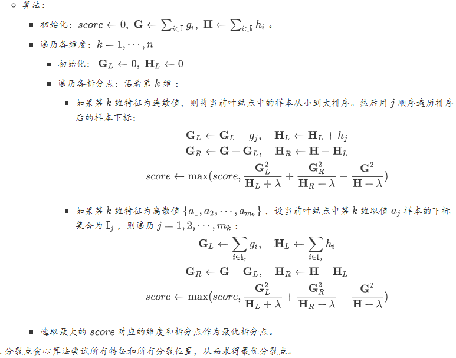

###### LightGBM

`LightGBM` 的思想：若减少训练样本的数量，或者减少样本的训练特征数量，则可以大幅度提高训练速度。`LightGBM` 提出了两个策略：`Gradient-based One-Side Sampling(GOSS)`： 基于梯度的采样。该方法用于减少训练样本的数量。`Exclusive Feature Bundling(EFB)`： 基于互斥特征的特征捆绑。该方法用于减少样本的特征。

在`AdaBoost` 中每个样本都有一个权重，该权重指示了样本在接下来的训练过程中的重要性。在`GBDT` 中并没有这样的权重。如果能知道每个样本的重要性（即：权重），那么可以保留比较重要的样本，丢弃不那么重要的样本。由于`GBDT` 中，负的梯度作为当前的残差，接下来的训练就是拟合这个残差。因此`GOSS` 采用样本的梯度作为样本的权重：如果权重较小，则说明样本的梯度较小，说明该样本已经得到了很好的训练。因此对于权重较小的样本，则可以随机丢弃。如果权重较大，则说明样本的梯度较大，说明该样本未能充分训练。因此对于权重较大的样本，则需要保留。`GOSS` 丢弃了部分样本，因此它改变了训练样本的分布。这会影响到模型的预测准确性。为了解决这个问题，`GOSS` 对小梯度的样本进行了修正：对每个保留下来的、小梯度的样本，其梯度乘以系数 $\frac{1-a}{b}$。

定义`打包特征集`为这样的特征的集合：集合中的特征两两互斥。如果对每个$i=1,2,\cdots,N$，都不会出现$x_{i,j}\ne0$ and $x_{i,k}\ne0$，则特征$j$和特征$k$互斥。

将每个特征视为图中的一个顶点。遍历每个样本$\vec{\mathbf{x}}_{i} \in \mathbb{D}$， 如果特征$j,k$之间不互斥，则：如果顶点$j,k$之间不存在边，则在顶点$j,k$之间连接一条边，权重为1 。如果顶点$j,k$之间存在边，则顶点$j,k$之间的边的权重加1 。最终，如果一组顶点之间都不存在边，则它们是相互互斥的，则可以放入到同一个`打包特征集` 中。事实上有些特征之间并不是完全互斥的，而是存在非常少量的冲突。即：存在少量的样本，在这些样本上，这些特征之间同时取得非零的值。如果允许这种少量的冲突，则可以将更多的特征放入`打包特征集`中，这样就可以减少更多的特征。

#### 2.8.特征工程

##### 数据预处理

###### 缺失值处理

缺失值的处理有三种方法：直接使用含有缺失值的数据。删除含有缺失值的数据。缺失值补全。缺失值补全常见有以下方法：均值插补、同类均值插补、建模预测、高维映射、多重插补、压缩感知及矩阵补全

优点：完整保留了原始数据的全部信息。缺点：计算量大大提升。而且只有在样本量非常大的时候效果才好，否则会因为过于稀疏，效果很差。

**多重插补**认为待插补的值是随机的，它的值来自于已观测到的值。具体实践上通常是估计出待插补的值，然后再加上不同的噪声，形成多组可选插补值。然后根据某种选择依据，选取最合适的插补值。多重插补法的步骤：通过变量之间的关系对缺失数据进行预测，利用蒙特卡洛方法生成多个完整的数据集。在每个完整的数据集上进行训练，得到训练后的模型以及评价函数值。对来自各个完整的数据集的结果，根据评价函数值进行选择，选择评价函数值最大的模型，其对应的插值就是最终的插补值。

压缩感知分为感知测量和重构恢复两个阶段。感知测量：关注如何对原始信号进行处理以获得稀疏样本表示。常用的手段是傅里叶变换、小波变换、字典学习、稀疏编码等。重构恢复：关注的是如何基于稀疏性从少量观测中恢复原信号。

限定等距性：对于大小为$m \times n, m \ll n$的矩阵$\mathbf{A}$，若存在常数$\delta_{k} \in(0,1)$，使得对于任意向量$\vec{\mathbf{s}}$和$\mathbf{A}$的所有子矩阵$\mathbf{A}_{k} \in \mathbb{R}^{m \times k}$，都有：$\left(1-\delta_{k}\right)\|\vec{\mathbf{s}}\|_{2}^{2} \leq\left\|\mathbf{A}_{k} \vec{\mathbf{s}}\right\|_{2}^{2} \leq\left(1+\delta_{k}\right)\|\vec{\mathbf{s}}\|_{2}^{2}$则称$\mathbf{A}$满足$k$限定等距性。此时通过下面的最优化问题可以近乎完美的从$\vec{y}$中恢复出稀疏信号  ，进而恢复出$\overrightarrow{\mathbf{x}}$
$$
\begin{array}{c}{\min _{\overrightarrow{\mathrm{s}}}\|\overrightarrow{\mathbf{s}}\|_{1}} \\ {\text { s.t. } \overrightarrow{\mathbf{y}}=\mathbf{A} \overrightarrow{\mathbf{s}}}\end{array}
$$

矩阵补全`matrix completion`解决的问题是：
$$
\begin{array}{l}{\operatorname{min}_{\mathbf{X}} \operatorname{ran} k(\mathbf{X})} \\ {\text {s.t. } \quad x_{i, j}=a_{i, j},(i, j) \in \Omega}\end{array}
$$
$\mathbf{A}$为观测矩阵，其中有很多缺失值。$\Omega$为$\mathbf{A}$中所有的有数值的下标的集合。$\mathbf{X}$为需要恢复的稀疏信号， 为矩阵$rank(\mathbf{X})$的秩。

考虑到$rank(\mathbf{X})$在集合$\left\{\mathbf{X} \in \mathbb{R}^{m \times n} :\|\mathbf{X}\|_{F}^{2} \leq 1\right\}$上的凸包是$\mathbf{X}$的核范数`nuclear norm`：
$$
\|\mathbf{x}\|_{*}=\sum_{j=1}^{\min \{m, n\}} \sigma_{j}(\mathbf{X})
$$
其中$\sigma_{j}(\mathbf{X})$表示$\mathbf{X}$的奇异值。于是可以通过最小化矩阵核范数来近似求解：

##### 特征编码

离散化用于将连续的数值属性转化为离散的数值属性。是否使用特征离散化，这背后是：使用“海量离散特征+简单模型”，还是“少量连续特征+复杂模型”。对于线性模型，通常使用“海量离散特征+简单模型”。优点：模型简单。缺点：特征工程比较困难。但是一旦有成功的经验就可以推广，并且可以很多人并行研究。对于非线性模型，通常使用“少量连续特征+复杂模型”。优点是：不需要进行复杂的特征工程。缺点是：模型复杂。

###### 稀疏表示和字典学习

字典学习：学习一个字典，通过该字典将样本转化为合适的稀疏表示形式。它侧重于学得字典的过程。稀疏编码：获取样本的稀疏表达，不一定需要通过字典。它侧重于对样本进行稀疏表达的过程。这两者通常是在同一个优化求解过程中完成的，因此这里不做区分，统称为字典学习。

给定数据集$\mathbb{D}=\left\{\left(\vec{\mathbf{x}}_{1}, \tilde{y}_{1}\right),\left(\vec{\mathbf{x}}_{2}, \tilde{y}_{2}\right), \cdots,\left(\vec{\mathbf{x}}_{N}, \tilde{y}_{N}\right)\right\}$，希望对样本$\vec{\mathbf{x}}_{i}$学习到它的一个稀疏表示 。其中$\vec{\alpha}_{i} \in \mathbb{R}^{k}$是一个$k$维列向量，且其中大量元素为 0 。一个自然的想法进行线性变换，即寻找一个矩阵$\mathbf{P} \in \mathbb{R}^{k \times n}$使得 $\mathbf{P} \vec{\mathbf{x}}_{i}=\vec{\alpha}_{i}$。

因此给出字典学习的最优化目标：$\min _{\mathbf{B}, \vec{\alpha}_{i}} \sum_{i=1}^{N}\left\|\vec{\mathbf{x}}_{i}-\mathbf{B} \vec{\alpha}_{i}\right\|_{2}^{2}+\lambda \sum_{i=1}^{N}\left\|\vec{\alpha}_{i}\right\|_{1}$。其中$\mathbf{B} \in \mathbb{R}^{n \times k}$称作字典矩阵。$k$称作字典的词汇量。

第一步：固定字典$\mathbf{B}$， 为每一个样本$\vec{\mathbf{x}_i}$找到相应的$\vec{\alpha_i}$：$\min _{\vec{\alpha}_{i}}\left\|\vec{\mathbf{x}}_{i}-\mathbf{B} \vec{\alpha}_{\dot{z}}\right\|_{2}^{2}+\lambda \sum_{i=1}^{N}\left\|\vec{\alpha}_{i}\right\|_{1}$。第二步：根据$\min _{\mathbf{B}}\|\mathbf{X}-\mathbf{B} \mathbf{A}\|_{F}^{2}$，以$\vec{\alpha_i}$为初值来更新字典$\mathbf{B}$。反复迭代上述两步，最终即可求得字典$\mathbf{B}$和样本$\vec{\mathbf{x}_i}$的稀疏表示$\vec{\alpha_i}$。

这里有个最优化问题：$\min _{\mathbf{B}}\|\mathbf{X}-\mathbf{B} \mathbf{A}\|_{F}^{2}$，该问题有多种求解方法，常用的有基于逐列更新策略的`KSVD`算法。令$\vec{\mathbf{b}}_i$为字典矩阵$\mathbf{B}$的第$i$列，$\vec{\mathbf{a}}^j$表示稀疏矩阵$\mathbf{A}$的第$j$行。 固定$\mathbf{B}$其他列，仅考虑第$i$列，则有：
$$
\min _{\overrightarrow{\mathbf{b}}_{i}}\left\|\mathbf{X}-\sum_{j=1}^{k} \overrightarrow{\mathbf{b}}_{i} \overrightarrow{\mathbf{a}}^{j}\right\|_{F}^{2}=\operatorname{mir}_{\overrightarrow{\mathbf{b}}_{i}}\left\|\left(\mathbf{X}-\sum_{j=1, j \neq i}^{k} \overrightarrow{\mathbf{b}}_{i} \overrightarrow{\mathbf{a}}^{j}\right)-\overrightarrow{\mathbf{b}}_{i} \overrightarrow{\mathbf{a}}^{i}\right\|_{F}^{2}
$$
令$\mathbf{E}_{i}=\mathbf{X}-\sum_{j=1, j \neq i}^{k} \overrightarrow{\mathbf{b}}_{i} \overrightarrow{\mathbf{a}}^{j}$，它表示去掉$\vec{\mathbf{x}}_i$的稀疏表示之后，样本集的稀疏表示与原样本集的误差矩阵。考虑到更新字典的第$i$列$\vec{\mathbf{b}}_i$时，其他各列都是固定的，则$\mathbf{E}_{i}$是固定的。则最优化问题转换为：
$$
\min _{\overrightarrow{\mathrm{b}}_{\mathfrak{i}}}\left\|\mathbf{E}_{i}-\overrightarrow{\mathbf{b}}_{i} \overrightarrow{\mathbf{a}}^{i}\right\|_{F}^{2}
$$
求解该最优化问题只需要对$\mathbf{E}_{i}$进行奇异值分解以取得最大奇异值所对应的正交向量。直接对$\mathbf{E}_{i}$进行奇异值分解会同时修改$\vec{\mathbf{b}}_i$和 $\vec{\mathbf{b}}^i$， 从而可能破坏$\mathbf{A}$的稀疏性。因为第二步 “以$\vec{\alpha}^i$为初值来更新字典$\mathbf{B}$” 中， 在更新$\mathbf{B}$前后$\vec{\alpha}^i$的非零元所处的位置和非零元素的值很可能不一致。为避免发生这样的情况 `KSVD` 对$\mathbf{E}_{i}$和$\overrightarrow{\mathbf{a}}^{i}$进行了专门处理：$\overrightarrow{\mathbf{a}}^{i}$仅保留非零元素。$\mathbf{E}_{i}$仅保留$\overrightarrow{\mathbf{b}}_{i}$和$\overrightarrow{\mathbf{a}}^{i}$的非零元素的乘积项，然后再进行奇异值分解，这样就保持了第一步得到的稀疏性。

#### 2.9.模型评估

高偏差对应于模型的欠拟合：模型过于简单，以至于未能很好的学习训练集，从而使得训练误差过高。此时模型预测的方差较小，表示预测较稳定。但是模型预测的偏差会较大，表示预测不准确。高方差对应于模型的过拟合：模型过于复杂，以至于将训练集的细节都学到，将训练集的一些细节当做普遍的规律，从而使得测试集误差与训练集误差相距甚远。此时模型预测的偏差较小，表示预测较准确。但是模型预测的方差较大，表示预测较不稳定。误差诊断：通过训练误差和测试误差来分析模型是否存在高方差、高偏差。如果训练误差较高：说明模型的方差较大，模型出现了欠拟合。如果训练误差较低，而训练误差较高：说明模型的偏差较大，出现了过拟合。如果训练误差较低，测试误差也较低：说明模型的方差和偏差都适中，是一个比较理想的模型。如果训练误差较高，且测试误差更高：说明模型的方差和偏差都较大。

###### bias-variance 分解

期望误差可以分解为
$$
\begin{aligned} \mathcal{R}(f) &=\mathbb{E}_{(\mathbf{x}, y) \sim p_{r}(\mathbf{x}, y)}\left[\left(y-f^{*}(\mathbf{x})+f^{*}(\mathbf{x})-f(\mathbf{x})\right)^{2}\right] \\ &=\mathbb{E}_{\mathbf{x} \sim p_{r}(\mathbf{x})}\left[\left(f(\mathbf{x})-f^{*}(\mathbf{x})\right)^{2}\right]+\varepsilon \end{aligned}
$$
对于单个样本$\mathbf{x}$，不同训练集$D$得到模型$f_D(\mathbf{x})$和最优模型$f^∗(\mathbf{x})$的上的期望差距为
$$
\begin{aligned} \mathbb{E}_{\mathcal{D}} &\left[\left(f_{\mathcal{D}}(\mathbf{x})-f^{*}(\mathbf{x})\right)^{2}\right] \\=& \mathbb{E}_{\mathcal{D}}\left[\left(f_{\mathcal{D}}(\mathbf{x})-\mathbb{E}_{\mathcal{D}}\left[f_{\mathcal{D}}(\mathbf{x})\right]+\mathbb{E}_{\mathcal{D}}\left[f_{\mathcal{D}}(\mathbf{x})\right]-f^{*}(\mathbf{x})\right)^{2}\right] \\=& \underbrace{\left(\mathbb{E}_{\mathcal{D}}\left[f_{\mathcal{D}}(\mathbf{x})\right]-f^{*}(\mathbf{x})\right)^{2}}_{(\text { bias })^{2}}+\underbrace{\mathbb{E}_{\mathcal{D}}\left[\left(f_{\mathcal{D}}(\mathbf{x})-\mathbb{E}_{\mathcal{D}}\left[f_{\mathcal{D}}(\mathbf{x})\right]\right)^{2}\right]}_{\text { variance }} \end{aligned}
$$
在机器学习中，很多学习算法经常会对学习的问题做一些假设，这些假设就称为**归纳偏置（Inductive Bias）**

###### PAC学习理论

一个 PAC 可学习的算法是指该学习算法能够在多项式时间内从合理数量的训练数据中学习到一个近似正确的$f(x)$。
$$
P\left(\left(\mathcal{R}(f)-\mathcal{R}_{\mathcal{D}}^{e m p}(f)\right) \leq \epsilon\right) \geq 1-\delta
$$
其中$ϵ,δ $是和样本数量$n$、假设空间$F$相关的变量。如果固定$ϵ,δ$，可以反过来计算出样本复杂度为
$$
n(\epsilon, \delta) \geq \frac{1}{2 \epsilon^{2}}\left(\ln |\mathcal{F}|+\ln \frac{2}{\delta}\right)
$$
其中$|F|$为假设空间的大小。

#### 2.10.降维

在高维情形下出现的数据样本稀疏、距离计算困难等问题是所有机器学习方法共同面临的严重障碍，称作“维度灾难”。降维之所以有效的原因是：人们观测或者收集到的数据样本虽然是高维的，但是与学习任务密切相关的也许仅仅是某个低维分布，即高维空间中的一个低维“嵌入”。

##### PCA

`PCA`降维的准则有两个：最近重构性：样本集中所有点，重构后的点距离原来的点的误差之和最小。最大可分性：样本点在低维空间的投影尽可能分开。

##### SVD

1. 酉矩阵：若$n$阶矩阵满足$\mathbf{U}^H\mathbf{U}=\mathbf{U}\mathbf{U}^H=\mathbf{I}$，则它是酉矩阵。其中$\mathbf{U}^H$为$\mathbf{U}$的共轭转置。$\mathbf{U}$为酉矩阵的充要条件是：$\mathbf{U}^H=\mathbf{U}^{-1}$。

2. 奇异值分解：设$\mathbf{X}为$阶$N\times n$矩阵，且$rank(X)=r$，则存在$N$阶酉矩阵$\mathbf{V}$和$n$阶酉矩阵$\mathbf{U}$，使得：$\mathbf{V}^{H} \mathbf{X} \mathbf{U}=\left[ \begin{array}{ll}{\Sigma} & {\mathbf{0}} \\ {\mathbf{0}} & {\mathbf{0}}\end{array}\right]_{N \times n}$，其中
   $$
   \Sigma=\left[ \begin{array}{ccccc}{\sigma_{1}} & {0} & {0} & {\cdots} & {0} \\ {0} & {\sigma_{2}} & {0} & {\cdots} & {0} \\ {\vdots} & {\vdots} & {\vdots} & {\ddots} & {\vdots} \\ {0} & {0} & {0} & {\cdots} & {\sigma_{r}}\end{array}\right]
   $$

3. 根据酉矩阵的性质, $\mathbf{V} \mathbf{V}^{H}=\mathbf{I}_{N \times N}, \mathbf{U} \mathbf{U}^{H}=\mathbf{I}_{n \times n}$，则有：$\mathbf{X}=\mathbf{V} \left[ \begin{array}{ll}{\Sigma} & {\mathbf{0}} \\ {\mathbf{0}} & {\mathbf{0}}\end{array}\right]_{N \times n} \mathbf{U}^{H} \Longrightarrow \mathbf{X}^{H}=\mathbf{U} \left[ \begin{array}{ll}{\Sigma} & {\mathbf{0}} \\ {\mathbf{0}} & {\mathbf{0}}\end{array}\right]_{n \times N} \mathbf{V}^{H}$

   则有$\mathbf{X}^{H} \mathbf{X}=\mathbf{U M U}^{H}$， 其中$\mathbf{M}$是个$n$阶对角矩阵：

4. 由数据集$\mathbb{D}$中样本构成的$\mathbf{X}$为实矩阵，因此有$\mathbf{X}^H=\mathbf{X}^T$。另外考虑到$\mathbf{X}^T\mathbf{X}$为实对称矩阵，因此$\mathbf{V}$也是实矩阵，因此$\mathbf{U}^H=\mathbf{U}^T$。 则有：$\mathbf{X}^{T} \mathbf{X}=\mathbf{U} \mathbf{M} \mathbf{U}^{T}$。

   - 根据$\mathbf{U} \mathbf{U}^{T}=\mathbf{I}$，则有：$\mathbf{X}^{T} \mathbf{X U}=\mathbf{U} \mathbf{M}$。根据$\mathbf{M}$是个对角矩阵的性质，有：$\mathbf{U M}=\mathbf{M U}$，则有：$\mathbf{X}^{T} \mathbf{X} \mathbf{U}=\mathbf{M} \mathbf{U}$。则$\lambda_{i}, i=1,2, \cdots, r$就是的$\mathbf{x}^{T} \mathbf{x}$特征值， 其对应的单位特征向量组成正交矩阵$\mathbf{U}$。因此`SVD`奇异值分解等价于`PCA`主成分分析，核心都是求解  的特征值以及对应的单位特征向量。

##### KPCA

1. 假定原始特征空间中的样本点$\vec{\mathbf{x}}_{i}$通过映射$\phi$映射到高维特征空间的坐标为$\vec{\mathbf{x}}_{i,\phi}$，即$\vec{\mathbf{x}}_{i, \phi}=\phi\left(\vec{\mathbf{x}}_{i}\right)$。且假设高维特征空间为$n$维的，即：$\vec{\mathbf{x}}_{i, \phi} \in \mathbb{R}^{n}$。假定要将高维特征空间中的数据投影到低维空间中，投影矩阵为$\mathbf{W}$为$n\times d$维矩阵。

   根据 `PCA` 推导的结果，求解方程：$\mathbf{X}_{\phi}^{T} \mathbf{X}_{\phi} \mathbf{W}=\lambda \mathbf{W}$。其中$\mathbf{X}_{\phi}=\left(\vec{\mathbf{x}}_{1, \phi}^{T}, \vec{\mathbf{x}}_{2, \phi}^{T}, \cdots, \vec{\mathbf{x}}_{N, \phi}^{T}\right)^{T}$为$N\times n$维矩阵。于是有：$\left(\sum_{i=1}^{N} \phi\left(\vec{\mathbf{x}}_{i}\right) \phi\left(\vec{\mathbf{x}}_{i}\right)^{T}\right) \mathbf{W}=\lambda \mathbf{W}$。

2. 定义核矩阵 ：
   $$
   \mathbf{K}=\left[ \begin{array}{cccc}{\kappa\left(\overrightarrow{\mathbf{x}}_{1}, \overrightarrow{\mathbf{x}}_{1}\right)} & {\kappa\left(\overrightarrow{\mathbf{x}}_{1}, \overrightarrow{\mathbf{x}}_{2}\right)} & {\cdots} & {\kappa\left(\overrightarrow{\mathbf{x}}_{1}, \overrightarrow{\mathbf{x}}_{N}\right)} \\ {\kappa\left(\overrightarrow{\mathbf{x}}_{2}, \overrightarrow{\mathbf{x}}_{1}\right)} & {\kappa\left(\overrightarrow{\mathbf{x}}_{2}, \overrightarrow{\mathbf{x}}_{2}\right)} & {\cdots} & {\kappa\left(\overrightarrow{\mathbf{x}}_{2}, \overrightarrow{\mathbf{x}}_{N}\right)} \\ {\vdots} & {\vdots} & {\ddots} & {\vdots} \\ {\kappa\left(\overrightarrow{\mathbf{x}}_{N}, \overrightarrow{\mathbf{x}}_{1}\right)} & {\kappa\left(\overrightarrow{\mathbf{x}}_{N}, \overrightarrow{\mathbf{x}}_{2}\right)} & {\cdots} & {\kappa\left(\overrightarrow{\mathbf{x}}_{N}, \overrightarrow{\mathbf{x}}_{N}\right)}\end{array}\right]
   $$
   则有：$\mathbf{X}_{\phi} \mathbf{X}_{\phi}^{T}=\mathbf{K}$ 。定义$\vec{\alpha}_{i}=\frac{\vec{\mathbf{x}}_{i, \phi}^{T} \mathbf{w}}{\lambda}$，则$\vec{\alpha}_{i}$为$1\times d$维行向量 。定义：$\mathbf{A}=\left(\vec{\alpha}_{1}, \vec{\alpha}_{2}, \cdots, \vec{\alpha}_{N}\right)^{T}$，则有：
   $$
   \mathbf{W}=\frac{1}{\lambda}\left(\sum_{i=1}^{N} \overrightarrow{\mathbf{x}}_{i, \phi} \overrightarrow{\mathbf{x}}_{i, \phi}^{T}\right) \mathbf{W}=\sum_{i=1}^{N} \overrightarrow{\mathbf{x}}_{i, \phi} \frac{\overrightarrow{\mathbf{x}}_{i, \phi}^{T} \mathbf{W}}{\lambda}=\sum_{i=1}^{N} \overrightarrow{\mathbf{x}}_{i, \phi} \vec{\alpha}_{i}=\mathbf{X}_{\phi}^{T} \mathbf{A}
   $$

3. 将$\mathbf{W}=\mathbf{X}_{\phi}^{T} \mathbf{A}$代入$\mathbf{x}_{\phi}^{T} \mathbf{X}_{\phi} \mathbf{W}=\lambda \mathbf{W}$，有：$\mathbf{X}_{\phi}^{T} \mathbf{X}_{\phi} \mathbf{X}_{\phi}^{T} \mathbf{A}=\lambda \mathbf{X}_{\phi}^{T} \mathbf{A}$。同样该问题也是一个特征值分解问题，取$\mathbf{K}$最大的$d$个特征值对应的特征向量组成  即可。

4. 对于新样本$\vec{\mathbf{x}}$， 其投影后第$j$维的坐标为：
   $$
   z_{j}=\overrightarrow{\mathbf{w}}_{j}^{T} \phi(\overrightarrow{\mathbf{x}})=\sum_{i=1}^{N} \alpha_{i, j} \phi\left(\overrightarrow{\mathbf{x}}_{i}\right)^{T} \phi(\overrightarrow{\mathbf{x}})=\sum_{i=1}^{N} \alpha_{i, j} \kappa\left(\overrightarrow{\mathbf{x}}_{i}, \overrightarrow{\mathbf{x}}\right)
   $$

##### 流形学习

###### 多维缩放：`MDS`

多维缩放要求原始空间中样本之间的距离在低维空间中得到保持。

###### 等度量映射

等度量映射的基本观点是：低维流形嵌入到高维空间后，直接在高维空间中计算直线距离具有误导性。因为在高维空间中的直线距离在低维嵌入流形上是不可达的。利用流形在局部上与欧氏空间同胚这个性质，对每个点基于欧氏距离找出它在低维流形上的近邻点， 然后就能建立一个近邻连接图。图中近邻点之间存在链接。图中非近邻点之间不存在链接。于是计算两点之间测地线距离的问题转变为计算近邻连接图上两点之间的最短路径问题。在得到任意两点的距离之后，就可以通过`MDS`算法来获得样本点在低维空间中的坐标。

###### 局部线性嵌入：`LLE`

假定样本点$\vec{\mathbf{x}}_i$的坐标能够通过它的邻域样本$\vec{\mathbf{x}}_{j}, \vec{\mathbf{x}}_{k}, \vec{\mathbf{x}}_{l}$进行线性组合而重构出来，即：$\vec{\mathbf{x}}_{i}=w_{i, j} \vec{\mathbf{x}}_{j}+w_{i, k} \vec{\mathbf{x}}_{k}+w_{i, l} \vec{\mathbf{x}}_{l}$。`LLE`算法希望这种关系在低维空间中得到保持。

`LLE`首先为每个样本$\vec{\mathbf{x}}$找到其近邻点下标集合$\mathbf{Q}_i$， 然后计算基于$\mathbf{Q}_i$中的样本点对$\vec{\mathbf{x}}$进行线性重构的系数$\overrightarrow{\mathbf{w}}_{i}$。定义样本集重构误差为：$e r r=\sum_{i=1}^{N}\left\|\overrightarrow{\mathbf{x}}_{i}-\sum_{j \in \mathbb{Q}_{i}} w_{i, j} \overrightarrow{\mathbf{x}}_{j}\right\|_{2}^{2}$。目标是样本集重构误差最小，即：$\min _{\overrightarrow{\mathbf{w}}_{1}, \overrightarrow{\mathbf{w}}_{2}, \cdots, \overrightarrow{\mathbf{w}}_{N}} \sum_{i=1}^{N}\left\|\overrightarrow{\mathbf{x}}_{i}-\sum_{j \in \mathbb{Q}_{i}} w_{i, j} \overrightarrow{\mathbf{x}}_{j}\right\|_{2}^{2}$。这样的解有无数个，对权重增加约束，进行归一化处理。即：$\sum_{j \in \mathbb{Q}_{i}} w_{i, j}=1, i=1,2, \cdots, N$。现在就是求解最优化问题：
$$
\begin{array}{l}{\min _{\overrightarrow{\mathbf{w}}_{1}, \overrightarrow{\mathbf{w}}_{2}, \cdots, \overrightarrow{\mathbf{w}}_{N}} \sum_{i=1}^{N}\left\|\overrightarrow{\mathbf{x}}_{i}-\sum_{j \in \mathbb{Q}_{i}} w_{i, j} \overrightarrow{\mathbf{x}}_{j}\right\|_{2}^{2}} \\ {\text {s.t. } \sum_{j \in \mathbb{Q}_{i}} w_{i, j}=1, i=1,2, \cdots, N}\end{array}
$$
该最优化问题有解析解。令$C_{j, k}=\left(\overrightarrow{\mathbf{x}}_{i}-\overrightarrow{\mathbf{x}}_{j}\right)^{T}\left(\overrightarrow{\mathbf{x}}_{i}-\overrightarrow{\mathbf{x}}_{k}\right)$，则可以解出：$w_{i, j}=\frac{\sum_{k \in \mathbb{Q}_{i}} C_{j, k}^{-1}}{\sum_{l, s \in \mathbb{Q}_{i}} C_{l, s}^{-1}}, j \in \mathbb{Q}_{i}$。`LLE` 中出现了两个重构误差。第一个重构误差：为了在原始空间中求解线性重构的系数$\vec{\mathbf{w}}_i$。目标是：基于$\mathbb{Q}_i$中的样本点对$\vec{\mathbf{x}}_i$进行线性重构，使得重构误差最小。第二个重构误差：为了求解样本集在低维空间中的表示$\mathbf{Z}$。目标是：基于线性重构的系数$\vec{\mathbf{w}}_i$，将$\mathbb{Q}_i$中的样本点对$\vec{\mathbf{z}}_i$进行线性重构，使得重构误差最小。

求出了线性重构的系数$\vec{\mathbf{w}}_i$之后， `LLE`在低维空间中保持$\vec{\mathbf{w}}_i$不变。设$\vec{\mathbf{x}}_i$对应的低维坐标$\vec{\mathbf{z}}_i$，已知线性重构的系数  ，定义样本集在低维空间中重构误差为：$e r r^{\prime}=\sum_{i=1}^{N}\left\|\overrightarrow{\mathbf{z}}_{i}-\sum_{j \in \mathbb{Q}_{i}} w_{i, j} \overrightarrow{\mathbf{z}}_{j}\right\|_{2}^{2}$。现在的问题是要求出$\vec{\mathbf{z}}_i$，从而使得上式最小。即求解：$\min _{\overrightarrow{\mathbf{z}}_{1}, \overrightarrow{\mathbf{z}}_{1}, \cdots, \overrightarrow{\mathbf{z}}_{N}} \sum_{i=1}^{N}\left\|\overrightarrow{\mathbf{z}}_{i}-\sum_{j \in \mathbb{Q}_{i}} w_{i, j} \overrightarrow{\mathbf{z}}_{j}\right\|_{2}^{2}$。令$\mathbf{Z}=\left(\overrightarrow{\mathbf{z}}_{1}^{T}, \overrightarrow{\mathbf{z}}_{2}^{T}, \cdots, \overrightarrow{\mathbf{z}}_{N}^{T}\right)^{T} \in \mathbb{R}^{N \times n^{\prime}}$，其中  为低维空间的维数$n^{\prime}$。定义$\mathbf{M}=(\mathbf{I}-\mathbf{W})^{T}(\mathbf{I}-\mathbf{W})$，于是最优化问题可重写为：$\min _{\mathbf{Z}} \operatorname{tr}\left(\mathbf{Z}^{T} \mathbf{M} \mathbf{Z}\right)$。

该最优化问题有无数个解。添加约束$\mathbf{Z}^{T} \mathbf{Z}=\mathbf{I}_{n^{\prime} \times n^{\prime}}$，于是最优化问题为：
$$
\begin{array}{cl}{\min _{\mathbf{Z}}} & {\operatorname{tr}\left(\mathbf{Z}^{T} \mathbf{M} \mathbf{Z}\right)} \\ {\text {s.t.}} & {\mathbf{Z}^{T} \mathbf{Z}=\mathbf{I}_{n^{\prime} \times n^{\prime}}}\end{array}
$$
该最优化问题可以通过特征值分解求解选取$\mathbf{M}$最小的$n^{\prime}$个特征值对应的特征向量组成的矩阵即为$\mathbf{Z}$。

##### 度量学习

在机器学习中对高维数据进行降维的主要目的是：希望找出一个合适的低维空间，在这个低维空间中进行学习能比原始空间性能更好。每个空间对应了在样本属性上定义的一个距离度量。寻找合适的空间，本质上就是在寻找一个合适的距离度量。度量学习的思想就是：尝试直接学习出一个合适的距离度量。
$$
\operatorname{dist}_{\operatorname{mah}}^{2}\left(\overrightarrow{\mathbf{x}}_{i}, \overrightarrow{\mathbf{x}}_{j}\right)=\left(\overrightarrow{\mathbf{x}}_{i}-\overrightarrow{\mathbf{x}}_{j}\right)^{T} \mathbf{M}\left(\overrightarrow{\mathbf{x}}_{i}-\overrightarrow{\mathbf{x}}_{j}\right)
$$
其中的矩阵$\mathbf{M}$也称作度量矩阵，度量学习就是对$\mathbf{M}$进行学习。为了保持距离非负而且对称，则$\mathbf{M}$必须是半正定对称矩阵。即必有正交基$\mathbf{P}$，使得$
\mathbf{M}=\mathbf{P} \mathbf{P}^{T}
$。对$\mathbf{M}$学习的目标是：将$\mathbf{M}$嵌入到学习器的评价指标中去，通过优化学习器的评价指标来求得  。即：对$\mathbf{M}$的学习无法直接提出优化目标，而是将$\mathbf{M}$的学习与学习器的学习作为一个整体，然后优化学习器的优化目标。

##### 概率`PCA`

定义隐变量$\overrightarrow{\mathbf{z}} \in \mathbb{R}^{d}$，它属于低维空间。假设$\overrightarrow{\mathbf{z}}$的先验分布为高斯分布：$p(\overrightarrow{\mathbf{z}})=\mathcal{N}(\overrightarrow{\mathbf{0}}, \mathbf{I})$。定义观测变量$\overrightarrow{\mathbf{x}} \in \mathbb{R}^{n}$，它属于高维空间。假设条件概率分布$p(\overrightarrow{\mathbf{x}} | \overrightarrow{\mathbf{z}})$也是高斯分布：$p(\overrightarrow{\mathbf{x}} | \overrightarrow{\mathbf{z}})=\mathcal{N}\left(\mathbf{W} \overrightarrow{\mathbf{z}}+\vec{\mu}, \sigma^{2} \mathbf{I}\right)$。则`PPCA` 模型生成观测样本的步骤为：首先以概率$p(\overrightarrow{\mathbf{z}})$生成隐变量$\overrightarrow{\mathbf{z}}$。然后观测样本$\vec{\mathbf{x}}$由如下规则生成：$\overrightarrow{\mathbf{x}}=\mathbf{W} \overrightarrow{\mathbf{z}}+\vec{\mu}+\vec{\epsilon}$。

可以利用最大似然准则来确定参数$\mathbf{W}, \vec{\mu}, \sigma^{2}$的解析解。根据边缘概率分布的定义有：$p(\overrightarrow{\mathbf{x}})=\int p(\overrightarrow{\mathbf{x}} | \overrightarrow{\mathbf{z}}) d \overrightarrow{\mathbf{z}}$。由于$p(\overrightarrow{\mathbf{z}}), p(\overrightarrow{\mathbf{x}} | \overrightarrow{\mathbf{z}})$均为高斯分布，因此$p(\overrightarrow{\mathbf{x}})$也是高斯分布。假$\overrightarrow{\mathbf{x}} $的其均值为$\mu^{\prime}$，协方差为$\mathbf{C}$。则：
$$
\begin{array}{c}{\vec{\mu}^{\prime}=\mathbb{E}[\overrightarrow{\mathbf{x}}]=\mathbb{E}[\mathbf{W} \overrightarrow{\mathbf{z}}+\vec{\mu}+\vec{\epsilon}]=\vec{\mu}} \\ {\mathbf{C}=\operatorname{cov}[\overrightarrow{\mathbf{x}}]=\mathbb{E}\left[(\mathbf{W} \overrightarrow{\mathbf{z}}+\vec{\mu}+\vec{\epsilon})(\mathbf{W} \overrightarrow{\mathbf{z}}+\vec{\mu}+\vec{\epsilon})^{T}\right]} \\ {=\mathbb{E}\left[\mathbf{W} \overrightarrow{\mathbf{z}}^{T} \mathbf{W}\right]+\mathbb{E}\left[\vec{\epsilon} \vec{\epsilon}^{T}\right]+\vec{\mu} \vec{\mu}^{T}=\mathbf{W} \mathbf{W}^{T}+\sigma^{2} \mathbf{I}+\vec{\mu} \vec{\mu}^{T}}\end{array}
$$
因此$p(\overrightarrow{\mathbf{x}})=\mathcal{N}(\vec{\mu}, \mathbf{C})$。

给定数据集$\mathbb{D}=\left\{\overrightarrow{\mathbf{x}}_{1}, \cdots, \overrightarrow{\mathbf{x}}_{N}\right\}$，则对数似然函数为：
$$
\begin{array}{c}{\mathcal{L}=\log p\left(\mathbb{D} ; \mathbf{W}, \vec{\mu}, \sigma^{2}\right)=\sum_{i=1}^{N} \log p\left(\overrightarrow{\mathbf{x}}_{i} ; \mathbf{W}, \vec{\mu}, \sigma^{2}\right)} \\ {=-\frac{N n}{2} \log (2 \pi)-\frac{N}{2} \log |\mathbf{C}|-\frac{1}{2} \sum_{i=1}^{N}\left(\overrightarrow{\mathbf{x}}_{i}-\vec{\mu}\right)^{T} \mathbf{C}^{-1}\left(\overrightarrow{\mathbf{x}}_{i}-\vec{\mu}\right)}\end{array}
$$
其中$|\cdot|$这里表示行列式的值。对数据集$\mathbb{D}=\left\{\overrightarrow{\mathbf{x}}_{1}, \cdots, \overrightarrow{\mathbf{x}}_{N}\right\}$进行零均值化，即：$$
\overrightarrow{\mathbf{x}}_{i} \leftarrow \overrightarrow{\mathbf{x}}_{i}-\vec{\mu}=\overrightarrow{\mathbf{x}}_{i}-\overline{\overrightarrow{\mathbf{x}}}
$$。则有：$\overrightarrow{\mathbf{x}}=\mathbf{W} \overrightarrow{\mathbf{z}}+\vec{\epsilon}$，因此$p(\overrightarrow{\mathbf{x}})=\mathcal{N}(\overrightarrow{\mathbf{x}} ; \overrightarrow{\mathbf{0}}, \mathbf{C})$。

对数似然函数：$\mathcal{L}=\log p\left(\mathbb{D} ; \mathbf{W}, \vec{\mu}, \sigma^{2}\right)=-\frac{N}{2} \log |\mathbf{C}|-\frac{1}{2} \sum_{i=1}^{N} \overrightarrow{\mathbf{x}}_{i}^{T} \mathbf{C}^{-1} \overrightarrow{\mathbf{x}}_{i}=-\frac{N}{2}\left[\log |\mathbf{C}|+\operatorname{tr}\left(\mathbf{C}^{-1} \mathbf{S}\right)\right]$

其中$\mathbf{S}=\mathbf{X}^{T} \mathbf{X}$为协方差矩阵。

$\mathcal{L}$的所有驻点都可以写做：$\mathbf{W}=\mathbf{U}_{d}\left(\mathbf{\Lambda}_{d}-\sigma^{2} \mathbf{I}\right)^{1 / 2} \mathbf{R}$。其中：$\mathbf{U}_{d} \in \mathbb{R}^{n \times d}$的列由协方差矩阵$\mathbf{S}$的任意$d$个特征向量组成。$\boldsymbol{\Lambda}_{d} \in \mathbb{R}^{d \times d}$是对角矩阵，其元素是协方差矩阵$\mathbf{S}$对应的$d$个特征值$\lambda_i$。$\mathbf{R} \in \mathbb{R}^{d \times d}$是任意一个正交矩阵。当$d$个特征向量被选择为前$d$个最大的特征值对应的特征向量时，$\mathcal{L}$取得最大值。其它的所有解都是鞍点。

假定协方差矩阵$\mathbf{S}$的特征值从大到小排列$\lambda_{1} \geq \lambda_{2} \geq \cdots \geq \lambda_{n}$，对应的$n$个特征向量为$\overrightarrow{\mathbf{u}}_{1}, \cdots, \overrightarrow{\mathbf{u}}_{n}$。则最大似然准则得到的解析解为：$\mathbf{U}=\left(\overrightarrow{\mathbf{u}}_{1}, \cdots, \overrightarrow{\mathbf{u}}_{d}\right)$，它由前$d$个特征向量组成。$\mathbf{W}=\mathbf{U}_{d}\left(\mathbf{\Lambda}_{d}-\sigma^{2} \mathbf{I}\right)^{1 / 2} \mathbf{R}$。$\sigma^{2}=\frac{1}{n-d} \sum_{i=d+1}^{n} \lambda_{i}$，它就是与丢弃的维度相关连的平均方差。$\mathbf{R}$是正交矩阵，因此它可以视作$d$维隐空间的一个旋转矩阵。

根据$\mathbf{C}=\mathbf{W} \mathbf{W}^{T}+\sigma^{2} \mathbf{I}=\mathbf{U}_{d}\left(\mathbf{\Lambda}_{d}-\sigma^{2} \mathbf{I}\right) \mathbf{U}_{d}^{T}+\sigma^{2} \mathbf{I}$，则$\mathbf{C}$与$\mathbf{R}$无关。这表明：$p(\overrightarrow{\mathbf{x}})$在隐空间中具有旋转不变性，因此$\mathbf{R}$可以选任意一个正交矩阵。

##### 因子分析

因子分析是一个线性高斯隐变量模型，它与 `PPCA` 密切相关。因子分析的定义与`PPCA` 唯一差别是：给定隐变量$\vec{\mathbf{z}}$的条件下，观测变量$\vec{\mathbf{x}}$的条件概率分布的协方差矩阵是一个对角矩阵，而不是一个各向同性的协方差矩阵。即：$p(\overrightarrow{\mathbf{x}} | \overrightarrow{\mathbf{z}})=\mathcal{N}(\mathbf{W} \overrightarrow{\mathbf{z}}+\vec{\mu}, \mathbf{\Psi})$，其中$\Psi$是一个$n \times n$的对角矩阵。因此也可以认为`PPCA` 是一种特殊情形的因子分析。如果对$\vec{\mathbf{x}}$进行了零均值化，则$p(\overrightarrow{\mathbf{x}} | \overrightarrow{\mathbf{z}})=\mathcal{N}(\mathbf{W} \overrightarrow{\mathbf{z}}, \mathbf{\Psi})$。与 `PPCA` 模型相同，因子分析模型假设在给定隐变量$\vec{\mathbf{z}}$的条件下，观测变量$\vec{\mathbf{x}}$的各分量$x_{1}, x_{2}, \cdots, x_{n}$是独立的。

可以使用最大似然法来确定因子分析模型中的参数$\mathbf{W}, \mathbf{\Psi}$的值。此时$\mathbf{W}, \mathbf{\Psi}$的最大似然解不再具有解析解，因此必须用梯度下降法或者`EM` 算法迭代求解。`E` 步：用旧的参数求期望：
$$
\begin{array}{c}
\mathbb{E}\left[\overrightarrow{\mathbf{z}}_{i}\right]=\mathbf{G} \mathbf{W}^{T} \mathbf{\Psi}^{-1} \overrightarrow{\mathbf{x}}_{i}\\
\mathbb{E}\left[\overrightarrow{\mathbf{z}}_{i} \overrightarrow{\mathbf{z}}_{i}^{T}\right]=\operatorname{cov}\left[\overrightarrow{\mathbf{z}}_{i}\right]+\mathbb{E}\left[\overrightarrow{\mathbf{z}}_{i}\right] \mathbb{E}\left[\overrightarrow{\mathbf{z}}_{i}\right]^{T}=\mathbf{G}+\mathbb{E}\left[\overrightarrow{\mathbf{z}}_{i}\right] \mathbb{E}\left[\overrightarrow{\mathbf{z}}_{i}\right]^{T}
\end{array}
$$
其中$\mathbf{G}=\left(\mathbf{I}+\mathbf{W}^{T} \mathbf{\Psi}^{-1} \mathbf{W}\right)^{-1}$。这里使用一个$d \times d$的矩阵求逆表达式，而不是$n \times n$的表达式。`M` 步：求最大化来获取新的参数。
$$
\begin{array}{l}{\mathbf{W}_{n e w} \leftarrow\left[\sum_{i=1}^{N} \overrightarrow{\mathbf{x}}_{i} \mathbb{E}\left[\overrightarrow{\mathbf{z}}_{i}\right]^{T}\right]\left[\sum_{i=1}^{N} \mathbb{E}\left[\overrightarrow{\mathbf{z}}_{i} \overrightarrow{\mathbf{z}}_{i}^{T}\right]\right]^{-1}} \\ {\mathbf{\Psi}_{n e w} \leftarrow \operatorname{diag}\left[\mathbf{S}-\mathbf{W}_{n e w} \frac{1}{N} \sum_{i=1}^{N} \mathbb{E}\left[\overrightarrow{\mathbf{z}}_{i}\right] \overrightarrow{\mathbf{x}}_{i}^{T}\right]}\end{array}
$$
其中$\text{diag}$将所有非对角线上的元素全部设置为零。

##### 独立成分分析

独立成分分析`ICA` 用于从混合信号中分离出原始信号。本质上它并不是一个降维的算法，而是一个信号分离算法。

假设酒会上有$n$个人，他们可以同时说话。房间里散落了$n$个声音接收器用于记录声音。酒会过后，从$n$个声音接收器中采集到一组数据：
$$
\begin{array}{c}{\mathbb{D}=\left\{\overrightarrow{\mathbf{x}}_{1}, \overrightarrow{\mathbf{x}}_{2}, \cdots, \overrightarrow{\mathbf{x}}_{N}\right\}} \\ {\overrightarrow{\mathbf{x}}_{i}=\left(x_{i, 1}, x_{i, 2}, \cdots, x_{i, n}\right)^{T}}\end{array}
$$
任务的目标是：从这$N$个时刻的采样数据中恢复出每个人说话的信号。这个过程也称作盲信号分离。随机变量$\vec{\mathbf{x}}$表示观测随机变量，$\vec{\mathbf{x}}_i$是其第$i$个采样值，其物理意义为：在时刻$i$采集到的$n$个声音信号。

定义：第$i$个人说话的信号为$s_i$。它是一个随机变量，其分布为$p_s(s_i)$。 为$s_{1,i}, \cdots, s_{N, i}$的$N$个时刻的采样，记作$\overrightarrow{\mathbf{u}}_{i}^{(s)}$。$n$个人说话的信号为$\overrightarrow{\mathbf{s}}=\left(s_{1}, s_{2}, \cdots, s_{n}\right)^{T}$。它是一个  维随机变量，分布为$p_s(\vec{\mathbf{s}})$。$\overrightarrow{\mathbf{s}}_{1}, \cdots, \overrightarrow{\mathbf{s}}_{N}$为 的$N$个时刻的采样。第$i$个声音接收器收到的信号为$x_i$。它是一个随机变量，其分布为$p_x(x_i)$。 $x_{1,i}, \cdots, x_{N, i}$为$x_i$的$N$个时刻的采样，记作$\overrightarrow{\mathbf{u}}_{i}^{(x)}$。$n$个声音接收器收到的信号为$\overrightarrow{\mathbf{x}}=\left(x_{1}, x_{2}, \cdots, x_{n}\right)^{T}$。它是一个$n$维随机变量，分布为$p_{x}(\overrightarrow{\mathbf{x}}) $。$\overrightarrow{\mathbf{x}}_{1}, \cdots, \overrightarrow{\mathbf{x}}_{N}$。 为$\vec{\mathbf{x}}$的$N$个时刻的采样。定义矩阵$\mathbf{X}$和矩阵$\mathbf{S}$为：
$$
\mathbf{X}=\left[\begin{array}{c}{\overrightarrow{\mathbf{x}}_{1}^{T}} \\ {\vdots} \\ {\overrightarrow{\mathbf{x}}_{N}^{T}}\end{array}\right]
\mathbf{S}=\left[\begin{array}{c}{\overrightarrow{\mathbf{s}}_{1}^{T}} \\ {\vdots} \\ {\overrightarrow{\mathbf{s}}_{N}^{T}}\end{array}\right]
$$
$\mathbf{A}=\left(a_{i, j}\right)_{n \times n}$是一个未知的混合矩阵，它用于叠加$n$个人说话的信号。则有：$\mathbf{X}=\mathbf{S} \mathbf{A}^{T}$。即：$\overrightarrow{\mathbf{x}}=\mathbf{A} \overrightarrow{\mathbf{s}}$。

现在$\mathbf{X}$是已知的，即信号$\vec{\mathbf{X}}$是已知的。令$\mathbf{W}=\mathbf{A}^{-1}$，则有：$\overrightarrow{\mathbf{s}}=\mathbf{W} \overrightarrow{\mathbf{x}}$。$\mathbf{W}$称作分离矩阵。如果没有任何先验知识，则无法求解。这里需要假设$p_s(s_i)$。首先，不能选取高斯分布。其次，考虑到概率密度函数由累计分布函数求导得到，一个方便的选择是：选择累计分布函数为 `sigmoid` 函数。

给定采样样本集$\mathbb{D}=\left\{\overrightarrow{\mathbf{x}}_{1}, \cdots, \overrightarrow{\mathbf{x}}_{N}\right\}$，则对数似然函数为：
$$
\mathcal{L}=\sum_{i=1}^{N} \log p_{x}\left(\overrightarrow{\mathbf{x}}_{i}\right)=\sum_{i=1}^{N}\left(\log |\mathbf{W}|+\sum_{j=1}^{n} \log p_{s}\left(\overrightarrow{\mathbf{w}}_{j}^{T} \overrightarrow{\mathbf{x}}_{i}\right)\right)
$$
根据最大似然准则，可以采用梯度下降法求解$\mathcal{L}$的最大值。其中：根据矩阵微积分有：$\nabla_{\mathbf{w}}|\mathbf{W}|=|\mathbf{W}|\left(\mathbf{W}^{-1}\right)^{T}$。则有：
$$
\nabla_{\mathbf{W}} \mathcal{L}=\left[\begin{array}{c}{1-2 g\left(\overrightarrow{\mathbf{w}}_{1}^{T} \overrightarrow{\mathbf{x}}_{i}\right)} \\ {1-2 g\left(\overrightarrow{\mathbf{w}}_{2}^{T} \overrightarrow{\mathbf{x}}_{i}\right)} \\ {\vdots} \\ {1-2 g\left(\overrightarrow{\mathbf{w}}_{n}^{T} \overrightarrow{\mathbf{x}}_{i}\right)}\end{array}\right] \overrightarrow{\mathbf{x}}_{i}^{T}+\left(\mathbf{W}^{-1}\right)^{T}
$$
当迭代求解出$\mathbf{W}$之后，通过$\overrightarrow{\mathbf{s}}=\mathbf{W} \overrightarrow{\mathbf{x}}$。 还原出原始信号。最大似然估计时，假设$\vec{\mathbf{x}}_i$和$\vec{\mathbf{x}}_j$之间是相互独立的。事实上对于语音信号或者其他具有时间连续性依赖性的数据，这个假设不能成立。但是当数据足够多，假设独立对于效果影响不大。如果事先打乱样本，则会加快梯度下降法的收敛速度。

##### $\text{t-SNE}$

`SNE` 的基本思想：如果两个样本在高维相似，则它们在低维也相似。`SNE` 主要包含两步：构建样本在高维的概率分布。在低维空间里重构这些样本的概率分布，使得这两个概率分布之间尽可能相似。

在数据集$\mathbb{D}=\left\{\overrightarrow{\mathbf{x}}_{1}, \cdots, \overrightarrow{\mathbf{x}}_{N}\right\}$中，给定一个样本$\overrightarrow{\mathbf{x}}_{i}$，然后计算$\left\{\overrightarrow{\mathbf{x}}_{1}, \cdots, \overrightarrow{\mathbf{x}}_{i-1}, \overrightarrow{\mathbf{x}}_{i+1}, \cdots, \overrightarrow{\mathbf{x}}_{N}\right\}$是$\overrightarrow{\mathbf{x}}_{i}$的邻居的概率。`SNE` 假设：如果$\overrightarrow{\mathbf{x}}_{j}$与$\overrightarrow{\mathbf{x}}_{i}$越相似，则$\overrightarrow{\mathbf{x}}_{j}$是$\overrightarrow{\mathbf{x}}_{i}$的邻居的概率越大。相似度通常采用欧几里得距离来衡量，两个样本距离越近则它们越相似。概率$p\left(\overrightarrow{\mathbf{x}}_{j} | \overrightarrow{\mathbf{x}}_{i}\right)$通常采用指数的形式：$p\left(\overrightarrow{\mathbf{x}}_{j} | \overrightarrow{\mathbf{x}}_{i}\right) \propto \exp \left(-\left\|\overrightarrow{\mathbf{x}}_{j}-\overrightarrow{\mathbf{x}}_{i}\right\|^{2} /\left(2 \sigma_{i}^{2}\right)\right)$对$j=1,2, \cdots, N, j \neq i$进行归一化有：
$$
p\left(\overrightarrow{\mathbf{x}}_{j} | \overrightarrow{\mathbf{x}}_{i}\right)=\frac{\exp \left(-\left\|\overrightarrow{\mathbf{x}}_{j}-\overrightarrow{\mathbf{x}}_{i}\right\|^{2} /\left(2 \sigma_{i}^{2}\right)\right)}{\sum_{k \neq i} \exp \left(-\left\|\overrightarrow{\mathbf{x}}_{k}-\overrightarrow{\mathbf{x}}_{i}\right\|^{2} /\left(2 \sigma_{i}^{2}\right)\right)}
$$
其中$\sigma_i$是与$\overrightarrow{\mathbf{x}}_{i}$相关的、待求得参数，它用于对距离进行归一化。定义$p_{j | i}=p\left(\overrightarrow{\mathbf{x}}_{j} | \overrightarrow{\mathbf{x}}_{i}\right)$。由于挑选时$\overrightarrow{\mathbf{x}}_{j}$排除了$\overrightarrow{\mathbf{x}}_{i}$，因此有$p_{i | i}=0$。定义概率分布$P_{i}=\left(p_{1 | i}, \cdots, p_{N | i}\right)$，它刻画了所有其它样本是$\overrightarrow{\mathbf{x}}_{i}$的邻居的概率分布。

假设经过降维，样本$\overrightarrow{\mathbf{x}}_{i} \in \mathbb{R}^{n}$在低维空间的表示为$\overrightarrow{\mathbf{z}}_{i} \in \mathbb{R}^{d}$，其中$d \leq n$。定义：
$$
q_{j | i}=q\left(\overrightarrow{\mathbf{z}}_{j} | \overrightarrow{\mathbf{z}}_{i}\right)=\frac{\exp \left(-\left\|\overrightarrow{\mathbf{z}}_{j}-\overrightarrow{\mathbf{z}}_{i}\right\|^{2}\right)}{\sum_{k \neq i} \exp \left(-\left\|\overrightarrow{\mathbf{z}}_{k}-\overrightarrow{\mathbf{z}}_{i}\right\|^{2}\right)}
$$
其中$q_{j|i}$表示给定一个样本$\vec{\mathbf{z}}_i$，然后计算$\left\{\overrightarrow{\mathbf{z}}_{1}, \cdots, \overrightarrow{\mathbf{z}}_{i-1}, \overrightarrow{\mathbf{z}}_{i+1}, \cdots, \overrightarrow{\mathbf{z}}_{N}\right\}$是$\vec{\mathbf{z}}_j$的邻居的概率。这里选择$\sigma^2=\frac{1}{2}$为固定值。同样地，有$q_{i|i}=0$。定义概率分布$Q_{i}=\left(q_{1 i}, \cdots, q_{N | i}\right)$，它刻画了所有其它样本是$\vec{\mathbf{z}}_i$的邻居的概率分布。

对于样本$\vec{\mathbf{x}}_i$，如果降维的效果比较好，则有$p_{j | i}=q_{j i}, i=1,2, \cdots, N$。即：降维前后不改变$\vec{\mathbf{x}}_i$周围的样本分布。对于，定义$\vec{\mathbf{x}}_i$其损失函数为分布$\mathbf{P}_I$和$\mathbf{Q}_I$的距离，通过 `KL` 散度来度量。对于全体数据集$\mathbf{D}$，整体损失函数为：
$$
\mathcal{L}=\sum_{i=1}^{N} K L\left(P_{i} \| Q_{i}\right)=\sum_{i=1}^{N} \sum_{j=1}^{N} p_{j | i} \log \frac{p_{j | i}}{q_{j | i}}
$$
记$y_{i, j}=-\left\|\overrightarrow{\mathbf{z}}_{j}-\overrightarrow{\mathbf{z}}_{i}\right\|^{2}$，则有$q_{j | i}=\frac{\exp \left(y_{i, j}\right)}{\sum_{k \neq i} \exp \left(y_{i, k}\right)}$。
$$
\begin{array}{1}
\nabla_{y_{i, j}}\left(\sum_{j=1}^{N} p_{j | i} \log q_{j | \dot{s}}\right)=p_{j | i}-q_{j | i}\\
\begin{array}{c}{\nabla_{\overrightarrow{\mathbf{z}}_{i}}\left(\sum_{j=1}^{N} p_{j | i} \log q_{j | i}\right)=\nabla_{y_{i, j}}\left(\sum_{j=1}^{N}-p_{j | i} \log q_{j | i}\right) \times \nabla_{\overrightarrow{\mathbf{z}}_{i}} y_{i, j}} \\ {=-2\left(p_{j | i}-q_{j | i}\right) \times\left(\overrightarrow{\mathbf{z}}_{i}-\overrightarrow{\mathbf{z}}_{j}\right)}\end{array}\\
\begin{array}{c}{\nabla_{\overrightarrow{\mathbf{a}}_{j}}\left(\sum_{i=1}^{N} p_{j | i} \log q_{j | i}\right)=\nabla_{y_{i, j}}\left(\sum_{i=1}^{N}-p_{j | i} \log q_{j | i}\right) \times \nabla_{\overrightarrow{\mathbf{z}}} y_{i, j}} \\ {=-2\left(p_{j | i}-q_{j | i}\right) \times\left(\overrightarrow{\mathbf{z}}_{j}-\overrightarrow{\mathbf{z}}_{i}\right)}\end{array}
\end{array}
$$
`t-SNE` 通过采用不同的分布来解决拥挤问题：在高维空间下使用高斯分布将距离转换为概率分布。在低维空间下使用 `t` 分布将距离转换为概率分布。`t-SNE` 使用自由度为`1` 的 `t` 分布。此时有：$q_{i, j}=\frac{\left(1+\left\|\overrightarrow{\mathbf{z}}_{i}-\overrightarrow{\mathbf{z}}_{j}\right\|^{2}\right)^{-1}}{\sum_{k} \sum_{l, l \neq k}\left(1+| | \overrightarrow{\mathbf{z}}_{k}-\overrightarrow{\mathbf{z}}_{l}| |^{2}\right)^{-1}}$。则梯度为：
$$
\nabla_{\overrightarrow{\mathbf{z}}_{i}} \mathcal{L}=\sum_{j} 4\left(p_{i, j}-q_{i, j}\right)\left(\overrightarrow{\mathbf{z}}_{i}-\overrightarrow{\mathbf{z}}_{j}\right)\left(1+\left\|\overrightarrow{\mathbf{z}}_{i}-\overrightarrow{\mathbf{z}}_{j}\right\|^{2}\right)^{-1}
$$
也可以选择自由度超过 `1` 的 `t` 分布。自由度越高，越接近高斯分布。

#### 2.11.聚类

##### 性能度量

###### 外部指标

对于数据集$\mathbb{D}=\left\{\overrightarrow{\mathbf{x}}_{1}, \overrightarrow{\mathbf{x}}_{2}, \cdots, \overrightarrow{\mathbf{x}}_{N}\right\}$，假定通过聚类给出的簇划分为$\mathcal{C}=\left\{\mathbb{C}_{1}, \mathbb{C}_{2}, \cdots, \mathbb{C}_{K}\right\}$。参考模型给出的簇划分为$\mathcal{C}^{*}=\left\{\mathbb{C}_{1}^{*}, \mathbb{C}_{2}^{*}, \cdots, \mathbb{C}_{K^{\prime}}^{*}\right\}$，其中$K$和$K^{\prime}$不一定相等 。

令$\vec{\lambda}, \vec{\lambda}^{*}$分别表示$\mathcal{C}, \mathcal{C}^{*}$的簇标记向量。定义：
$$
\begin{array}{l}{a=|S S|, S S=\left\{\left(\vec{x}_{i}, \vec{x}_{j}\right) | \lambda_{i}=\lambda_{j}, \lambda_{i}^{*}=\lambda_{j}^{*}, i<j\right\}} \\ {b=|S D|, S D=\left\{\left(\vec{x}_{i}, \vec{x}_{j}\right) | \lambda_{i}=\lambda_{j}, \lambda_{i}^{*} \neq \lambda_{j}^{*}, i<j\right\}} \\ {c=|D S|, D S=\left\{\left(\vec{x}_{i}, \vec{x}_{j}\right) | \lambda_{i} \neq \lambda_{j}, \lambda_{i}^{*}=\lambda_{j}^{*}, i<j\right\}} \\ {d=|D D|, D D=\left\{\left(\vec{x}_{i}, \vec{x}_{j}\right) | \lambda_{i} \neq \lambda_{j}, \lambda_{i}^{*}=\lambda_{j}^{*}, i<j\right\}}\end{array}
$$
其中$|\cdot|$表示集合的元素的个数。各集合的意义为：$SS$：包含了同时隶属于$\mathcal{C}, \mathcal{C}^{*}$的样本对。$SD$：包含了隶属于  $\mathcal{C}$，但是不隶属于$\mathcal{C}^{*}$的样本对。$DS$：包含了不隶属于 $\mathcal{C}$， 但是隶属于$\mathcal{C}^{*}$的样本对。$DD$：包含了既不隶属于 $\mathcal{C}$， 又不隶属于$\mathcal{C}^{*}$的样本对。由于每个样本对$\left(\overrightarrow{\mathbf{x}}_{i}, \overrightarrow{\mathbf{x}}_{j}\right), i<j$仅能出现在一个集合中，因此有$a+b+c+d=\frac{N(N-1)}{2}$。

$\text{Jaccard}系数$: $J C=\frac{a}{a+b+c}$

$\text{FM}指数$: $F M I=\sqrt{\frac{a}{a+b} \cdot \frac{a}{a+c}}$

$\text{Rand}指数$: $R I=\frac{a+d}{N(N-1) / 2}$

$\text{ARI}指数$:$A R I=\frac{\sum_{i} \sum_{j} C_{n_{i, j}}^{2}-\left[\sum_{i} C_{s_{i}}^{2} \times \sum_{j} C_{i_{j}}^{2}\right] / C_{N}^{2}}{\frac{1}{2}\left[\sum_{i} C_{s_{i}}^{2}+\sum_{j} C_{t_{j}}^{2}\right]-\left[\sum_{i} C_{s_{i}}^{2} \times \sum_{j} C_{t_{j}}^{2}\right] / C_{N}^{2}}$

###### 内部指标

$\text{DB}指数$：$D I=\frac{\min _{k \neq l} d_{\min }\left(\mathbb{C}_{k}, \mathbb{C}_{l}\right)}{\max _{i} \operatorname{diam}\left(\mathbb{C}_{i}\right)}$

$\text{Dunn}指数$: $D I=\frac{\min _{k \neq l} d_{\min }\left(\mathbb{C}_{k}, \mathbb{C}_{l}\right)}{\max _{i} \operatorname{diam}\left(\mathbb{C}_{i}\right)}$

##### 原型聚类

###### $\text{k-medoids}$

###### 学习向量量化

与一般聚类算法不同，学习向量量化假设数据样本带有类别标记，学习过程需要利用样本的这些监督信息来辅助聚类。给定样本集$\mathbb{D}=\left\{\left(\overrightarrow{\mathbf{x}}_{1}, y_{1}\right),\left(\overrightarrow{\mathbf{x}}_{2}, y_{2}\right), \cdots,\left(\overrightarrow{\mathbf{x}}_{N}, y_{N}\right)\right\}, \overrightarrow{\mathbf{x}} \in \mathcal{X}, y \in \mathcal{Y}$，`LVQ`的目标是从特征空间中挑选一组样本作为原型向量$\left\{\overrightarrow{\mathbf{p}}_{1}, \overrightarrow{\mathbf{p}}_{2}, \cdots, \overrightarrow{\mathbf{p}}_{Q}\right\}$。每个原型向量代表一个聚类簇。原型向量从特征空间中取得，它们不一定就是$\mathbf{D}$中的某个样本。

`LVQ`的想法是：通过从样本中挑选一组样本作为原型向量$\left\{\overrightarrow{\mathbf{p}}_{1}, \overrightarrow{\mathbf{p}}_{2}, \cdots, \overrightarrow{\mathbf{p}}_{Q}\right\}$，可以实现对样本空间$\mathcal{X}$的簇划分。对任意样本$\overrightarrow{\mathbf{x}}$，它被划入与距离最近的原型向量所代表的簇中。对于每个原型向量$\overrightarrow{\mathbf{p}}_{q}$，它定义了一个与之相关的一个区域$\mathbf{R}_q$，该区域中每个样本与$\overrightarrow{\mathbf{p}}_{q}$的距离都不大于它与其他原型向量$\overrightarrow{\mathbf{p}}_{q^{\prime}}$的距离。
$$
\mathbf{R}_{q}=\left\{\overrightarrow{\mathbf{x}} \in \mathcal{X} |\left\|\overrightarrow{\mathbf{x}}-\overrightarrow{\mathbf{p}}_{q}\right\|_{2} \leq \min _{q \neq q}\left\|\overrightarrow{\mathbf{x}}-\overrightarrow{\mathbf{p}}_{q}\right\|_{2}\right\}
$$
区域  对样本空间$\left\{\overrightarrow{\mathbf{p}}_{1}, \overrightarrow{\mathbf{p}}_{2}, \cdots, \overrightarrow{\mathbf{p}}_{Q}\right\}$形成了一个簇划分，该划分通常称作 `Voronoi`剖分。

##### 密度聚类

###### $\text{DBSCAN}$

`DBSCAN`是一种著名的密度聚类算法，它基于一组邻域参数$(\epsilon, \text{MinPts})$来刻画样本分布的紧密程度。给定数据集$\mathbb{D}=\left\{\overrightarrow{\mathbf{x}}_{1}, \overrightarrow{\mathbf{x}}_{2}, \cdots, \overrightarrow{\mathbf{x}}_{N}\right\}$， 

定义：$\epsilon$-邻域：$N_{\epsilon}\left(\overrightarrow{\mathbf{x}}_{i}\right)=\left\{\overrightarrow{\mathbf{x}}_{j} \in \mathbb{D} | \text { distance }\left(\overrightarrow{\mathbf{x}}_{i}, \overrightarrow{\mathbf{x}}_{j}\right) \leq \epsilon\right\}$。

核心对象：若$\left|N_{\epsilon}\left(\overrightarrow{\mathbf{x}}_{i}\right)\right| \geq \text{MinPts}$，则称$\overrightarrow{\mathbf{x}}_{i}$是一个核心对象。

密度直达：若$\overrightarrow{\mathbf{x}}_{i}$是一个核心对象，且$\overrightarrow{\mathbf{x}}_{j} \in N_{\epsilon}\left(\overrightarrow{\mathbf{x}}_{i}\right)$， 则称$\overrightarrow{\mathbf{x}}_{j}$由$\overrightarrow{\mathbf{x}}_{i}$密度直达，记作$\overrightarrow{\mathbf{x}}_{i} \mapsto \overrightarrow{\mathbf{x}}_{j}$。

密度可达：对于$\overrightarrow{\mathbf{x}}_{i}$和$\overrightarrow{\mathbf{x}}_{j}$， 若存在样本序列$\left(\overrightarrow{\mathbf{p}}_{0}, \overrightarrow{\mathbf{p}}_{1}, \overrightarrow{\mathbf{p}}_{2}, \cdots, \overrightarrow{\mathbf{p}}_{m}, \overrightarrow{\mathbf{p}}_{m+1}\right)$， 其中$\overrightarrow{\mathbf{p}}_{0}=\overrightarrow{\mathbf{x}}_{i}, \overrightarrow{\mathbf{p}}_{m+1}=\overrightarrow{\mathbf{x}}_{j}, \overrightarrow{\mathbf{p}}_{s} \in \mathbb{D}$，如果$\overrightarrow{\mathbf{p}}_{s+1}$由$\overrightarrow{\mathbf{p}}_{s}$密度直达，则称$\overrightarrow{\mathbf{x}}_{j}$由$\overrightarrow{\mathbf{x}}_{i}$密度可达，记作$\overrightarrow{\mathbf{x}}_{i} \leadsto \overrightarrow{\mathbf{x}}_{j}$。

密度相连：对于$\overrightarrow{\mathbf{x}}_{i}$和$\overrightarrow{\mathbf{x}}_{j}$，若存在$\overrightarrow{\mathbf{x}}_{k}$，使得$\overrightarrow{\mathbf{x}}_{i}$与$\overrightarrow{\mathbf{x}}_{j}$均由$\overrightarrow{\mathbf{x}}_{k}$密度可达，则称$\overrightarrow{\mathbf{x}}_{i}$与$\overrightarrow{\mathbf{x}}_{i}$密度相连 ，记作$\overrightarrow{\mathbf{x}}_{i} \sim \overrightarrow{\mathbf{x}}_{j}$。

`DBSCAN`算法的簇定义：给定邻域参数$(\epsilon, \text{MinPts})$， 一个簇$\mathbb{C} \subseteq \mathbb{D}$是满足下列性质的非空样本子集：连接性： 若$\overrightarrow{\mathbf{x}}_{i} \in \mathbb{C}, \overrightarrow{\mathbf{x}}_{j} \in \mathbb{C}$，则$\overrightarrow{\mathbf{x}}_{i} \sim \overrightarrow{\mathbf{x}}_{j}$。最大性：若$\overrightarrow{\mathbf{x}}_{i} \in \mathbb{C}$，且$\overrightarrow{\mathbf{x}}_{i} \leadsto \overrightarrow{\mathbf{x}}_{j}$， 则$\overrightarrow{\mathbf{x}}_{j} \in \mathbb{C}$。

`DBSCAN`算法的思想：若$\vec{\mathbf{x}}$为核心对象，则  密度可达的所有样本组成的集合记作$\mathbb{X}=\left\{\overrightarrow{\mathbf{x}}^{\prime} \in \mathbb{D} | \overrightarrow{\mathbf{x}} \leadsto \overrightarrow{\mathbf{x}}^{\prime}\right\}$。可以证明 ：$\mathbb{X}$就是满足连接性与最大性的簇。于是 `DBSCAN`算法首先任选数据集中的一个核心对象作为种子`seed`，再由此出发确定相应的聚类簇。

###### $\text{Mean-Shift}$算法

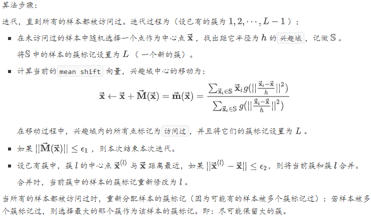

#### 2.12.半监督学习

给定有标记样本集合$\mathbb{D}_{l}=\left\{\left(\overrightarrow{\mathbf{x}}_{1}, y_{1}\right),\left(\overrightarrow{\mathbf{x}}_{2}, y_{2}\right), \cdots,\left(\overrightarrow{\mathbf{x}}_{l}, y_{l}\right)\right\}$，和未标记样本集合$\mathbb{D}_{u}=\left\{\left(\overrightarrow{\mathbf{x}}_{l+1}, y_{l+1}\right),\left(\overrightarrow{\mathbf{x}}_{l+2}, y_{l+2}\right), \cdots,\left(\overrightarrow{\mathbf{x}}_{l+u}, y_{l+u}\right)\right\}$，其中$l \ll u$。学习器自动地利用未标记的$\mathbb{D}_{u}$来提升学习性能，这就是半监督学习。

要利用未标记样本，必然需要对未标记样本的分布与已标记样本的分布的关联做出假设。最常见的假设是聚类假设`cluster assumption`：假设数据存在簇结构，同一个簇的样本属于同一个类别。另一种常见假设是流形假设`manifold assumption`：假设数据分布在一个流形结构上，邻近的样本拥有相似的输出值。其中，邻近的程度用相似度来刻画。

#### 2.13.EM算法

###### 观测变量与隐变量

1. 令$\mathbf{Y}$表示观测随机变量，$\mathbb{Y}=\left\{y_{1}, y_{2}, \cdots, y_{N}\right\}$表示对应的数据序列；令$\mathbf{Z}$表示隐随机变量，$\mathbb{Z}=\left\{z_{1}, z_{2}, \cdots, z_{N}\right\}$表示对应的数据序列。$\mathbb{Y}$和$\mathbb{Z}$连在一起称作完全数据，观测数据$\mathbb{Y}$又称作不完全数据。

2. 假设给定观测随机变量$\mathbf{Y}$，其概率分布为$P(Y ; \theta)$，其中$\theta$是需要估计的模型参数，则不完全数据$\mathbb{Y}$的似然函数是$P(\mathbb{Y} ; \theta)$， 对数似然函数为$L(\theta)=\log P(\mathbb{Y} ; \theta)$。

   假定$\mathbf{Y}$和$\mathbf{Z}$的联合概率分布是$P(Y, Z ; \theta)$，完全数据的对数似然函数是$\log P(\mathbb{Y}, \mathbb{Z} ; \theta)$，则根据每次观测之间相互独立，有：
   $$
   \begin{array}{c}{\log P(\mathbb{Y} ; \theta)=\sum_{i} \log P\left(Y=y_{i} ; \theta\right)} \\ {\log P(\mathbb{Y}, \mathbb{Z} ; \theta)=\sum_{i} \log P\left(Y=y_{i}, Z=z_{i} ; \theta\right)}\end{array}
   $$

3. 由于$\mathbb{Y}$发生，根据最大似然估计，则需要求解对数似然函数：
   $$
   \begin{array}{c}{L(\theta)=\log P(\mathbb{Y} ; \theta)=\sum_{i=1} \log P\left(Y=y_{i} ; \theta\right)=\sum_{i=1} \log \sum_{Z} P} \\ {=\sum_{i=1} \log \left[\sum_{Z} P\left(Y=y_{i} | Z ; \theta\right) P(Z ; \theta)\right]}\end{array}
   $$
   的极大值。其中$\sum_{Z} P\left(Y=y_{i}, Z ; \theta\right)$表示对所有可能的$\mathbf{Z}$求和，因为边缘分布$P(Y)=\sum_{Z} P(Y, Z)$。

###### 原理

`EM` 算法通过迭代逐步近似极大化$L(\theta)$。

假设在第$i$次迭代后，$\theta$的估计值为：$\theta^i$。则希望$\theta$新的估计值能够使得$L(\theta)$增加。为此考虑两者的差：$L(\theta)-L\left(\theta^{i}\right)=\log P(\mathbb{Y} ; \theta)-\log P\left(\mathbb{Y} ; \theta^{i}\right)$

`Jensen`不等式：如果$f$是凸函数，$x$为随机变量，则有：$\mathbb{E}[f(x)] \leq f(\mathbb{E}[x])$。

考虑到条件概率的性质，则有$\sum_{Z} P(Z | Y ; \theta)=1$。因此有
$$
\begin{array}{1}{L(\theta)-L\left(\theta^{i}\right)=\sum_{j} \log \sum_{Z} P\left(Y=y_{j}, Z ; \theta\right)-\sum_{j} \log P\left(Y=y_{j} ; \theta^{i}\right)} \\ {=\sum_{j}\left[\log \sum_{Z} P\left(Z | Y=y_{j} ; \theta^{i}\right) \frac{P\left(Y=y_{j}, Z ; \theta\right)}{P\left(Z | Y=y_{j} ; \theta^{i}\right)}-\log P\left(Y=y_{j} ; \theta^{i}\right)\right]}\\
\geq \sum_{j}\left[\sum_{Z} P\left(Z | Y=y_{j} ; \theta^{i}\right) \log \frac{P\left(Y=y_{j}, Z ; \theta\right)}{P\left(Z | Y=y_{j} ; \theta^{i}\right)}-\log P\left(Y=y_{j} ; \theta^{i}\right)\right]\\
=\sum_{j} \left[\sum_{Z} P\left(Z | Y=y_{j} ; \theta^{i}\right) \log \frac{P\left(Y=y_{j} | Z ; \theta\right) P(Z ; \theta)}{P\left(Z | Y=y_{j} ; \theta^{i}\right)}\right.-\log P\left(Y=y_{j} ; \theta^{i}\right) \times \sum_{Z} P\left(Z | Y=y_{j} ; \theta^{i}\right) ]\\
=\sum_{j}\left[\sum_{Z} P\left(Z | Y=y_{j} ; \theta^{i}\right) \log \frac{P\left(Y=y_{j} | Z ; \theta\right) P(Z ; \theta)}{P\left(Z | Y=y_{j} ; \theta^{i}\right) P\left(Y=y_{j} ; \theta^{i}\right)}\right]\\
\text{令}:\\
B\left(\theta, \theta^{i}\right)=L\left(\theta^{i}\right)+\sum_{j}\left[\sum_{Z} P\left(Z | Y=y_{j} ; \theta^{i}\right) \log \frac{P\left(Y=y_{j} | Z ; \theta\right) P(Z ; \theta)}{P\left(Z | Y=y_{j} ; \theta^{i}\right) P\left(Y=y_{j} ; \theta^{i}\right)}\right]
\end{array}
$$
任何可以使得$B(\theta, \theta^{i})$增大的$\theta$，也可以使$L(\theta)$增大。为了使得$L(\theta)$尽可能增大，则选择使得$B(\theta, \theta^{i})$取极大值的$\theta$：$\theta^{i+1}=\arg \max _{\theta} B\left(\theta, \theta^{i}\right)$。
$$
\begin{array}{l}\theta^{i+1}=\arg \max _{\theta} B\left(\theta, \theta^{i}\right)\\{=\arg \max _{\theta} \sum_{j}\left(\sum_{Z} P\left(Z | Y=y_{j} ; \theta^{i}\right) \log P\left(Y=y_{j} | Z ; \theta\right) P(Z ; \theta)\right)} \\ {=\arg \max _{\theta} \sum_{j}\left(\sum_{Z} P\left(Z | Y=y_{j} ; \theta^{i}\right) \log P\left(Y=y_{j}, Z ; \theta\right)\right)}\end{array}
$$

#### 隐马尔科夫模型

##### 基本概念

设$\mathbb{Q}=\left\{\mathbf{q}_{1}, \mathbf{q}_{2}, \cdots, \mathbf{q}_{Q}\right\}$是所有可能的状态的集合，$\mathbb{V}=\left\{\mathbf{v}_{1}, \mathbf{v}_{2}, \cdots, \mathbf{v}_{V}\right\}$是所有可能的观测的集合，其中$Q$是可能的状态数量，$V$是可能的观测数量。$\mathbb{Q}$是状态的取值空间，$\mathbb{V}$是观测的取值空间 。每个观测值$\mathbf{v}_i$可能是标量，也可能是一组标量构成的集合，因此这里用加粗的黑体表示。状态值的表示也类似。设$\mathbf{I}=\left(i_{1}, i_{2}, \cdots, i_{T}\right)$是长度为$\mathbf{T}$的状态序列，$\mathbf{O}=\left(o_{1}, o_{2}, \cdots, o_{T}\right)$是对应的观测序列。$i_{t} \in\{1, \cdots, Q\}$是一个随机变量，代表状态$\mathbf{q}_{i_{i}}$。$o_{t} \in\{1, \cdots, V\}$是一个随机变量，代表观测$\mathbf{v}_{o_{k}}$。设$\mathbf{A}$为状态转移概率矩阵。其中$a_{i, j}=P\left(i_{t+1}=j | i_{t}=i\right)$，表示在时刻$t$处于状态$\mathbf{q}_{i}$的条件下，在时刻$t+1$时刻转移到状态$\mathbf{q}_{j}$的概率。设$\mathbf{B}$为观测概率矩阵其中$b_{j}(k)=P\left(o_{t}=k | i_{t}=j\right)$，表示在时刻$t$处于状态$\mathbf{q}_{j}$的条件下生成观测$\mathbf{v}_{k}$的概率。设$\vec{\pi}$是初始状态概率向量：$\vec{\pi}=\left(\pi_{1}, \pi_{2}, \cdots, \pi_{Q}\right)^{T}, \quad \pi_{i}=P\left(i_{1}=i\right)$是时刻$t=1$时处于状态$\mathbf{q}_{i}$的概率。根据定义有：$\sum_{i=1}^{Q} \pi_{i}=1$。隐马尔可夫模型由初始状态概率向量$\vec{\pi}$、状态转移概率矩阵$\mathbf{A}$以及观测概率矩阵$\mathbf{B}$决定。因此隐马尔可夫模型 可以用三元符号表示，即 ：$\lambda=(\mathbf{A}, \mathbf{B}, \vec{\pi})$。其中$\mathbf{A}, \mathbf{B}, \vec{\pi}$称为隐马尔可夫模型的三要素：状态转移概率矩阵$\mathbf{A}$和初始状态概率向量$\vec{\pi}$确定了隐藏的马尔可夫链，生成不可观测的状态序列。观测概率矩阵$\mathbf{B}$确定了如何从状态生成观测，与状态序列一起确定了如何产生观测序列。从定义可知，隐马尔可夫模型做了两个基本假设：齐次性假设：即假设隐藏的马尔可夫链在任意时刻$t$的状态只依赖于它在前一时刻的状态，与其他时刻的状态和观测无关，也与时刻$t$无关，即：$P\left(i_{t} | i_{t-1}, o_{t-1}, \cdots, i_{1}, o_{1}\right)=P\left(i_{t} | i_{t-1}\right), \quad t=1,2, \cdots, T$。观测独立性假设，即假设任意时刻的观测值只依赖于该时刻的马尔可夫链的状态，与其他观测及状态无关，即：
$$
P\left(o_{t} | i_{T}, o_{T}, \cdots, i_{t+1}, o_{t+1}, i_{t}, i_{t-1}, o_{t-1}, \cdots, i_{1}, o_{1}\right)=P\left(o_{t} | i_{t}\right), \quad t=1,2, \cdots, T
$$

##### $\text{HMM}$基本问题

隐马尔可夫模型的 3 个基本问题：概率计算问题：给定模型$\lambda=(\mathbf{A}, \mathbf{B}, \vec{\pi})$和观测序列$\mathbf{O}=\left(o_{1}, o_{2}, \cdots, o_{T}\right)$，计算观测序列$\mathbf{O}$出现的概率$P(\mathbf{O} ; \lambda)$。学习问题：已知观测序列$\mathbf{O}$，估计模型$\lambda=(\mathbf{A}, \mathbf{B}, \vec{\pi})$的参数，使得在该模型下观测序列概率$P(\mathbf{O} ; \lambda)$最大。预测问题：已知模型$\lambda=(\mathbf{A}, \mathbf{B}, \vec{\pi})$和观测序列$\mathbf{O}=\left(o_{1}, o_{2}, \cdots, o_{T}\right)$， 求对给定观测序列的条件概率$P(\mathbf{I} | \mathbf{O})$最大的状态序列$\mathbf{I}=\left(i_{1}, i_{2}, \cdots, i_{T}\right)$。

##### 概率计算问题

###### 前向算法

定义前向概率：在时刻$t$时的观测序列为$o_{1}, o_{2}, \cdots, o_{t}$， 且时刻$t$时状态为$\mathbf{q}_{i}$的概率为前向概率，记作：$\alpha_{t}(i)=P\left(o_{1}, o_{2}, \cdots, o_{t}, i_{t}=i ; \lambda\right)$。根据定义，$\alpha_t(j)$是在时刻$t$时观测到$o_{1}, o_{2}, \cdots, o_{t}$，且在时刻$t$处于状态$\mathbf{q}_{j}$的前向概率。则有：$\alpha_{t}(j) \times a_{j, i}$：为在时刻$t$时观测到$O_{1}, O_{2}, \cdots, O_{t}$，且在时刻$t$处于状态$\mathbf{q}_{j}$，且在$t+1$时刻处在状态$\mathbf{q}_{i}$的概率。$\sum_{j=1}^{Q} \alpha_{t}(j) \times a_{j, i}$：为在时刻$t$观测序列为$o_{1}, o_{2}, \cdots, o_{t}$，并且在时刻$t+1$时刻处于状态$\mathbf{q}_{i}$的概率。考虑$b_i(o_{t+1})$，则得到前向概率的地推公式：
$$
\alpha_{t+1}(i)=\left[\sum_{j=1}^{Q} \alpha_{t}(j) a_{j, i}\right] b_{i}\left(o_{t+1}\right)
$$

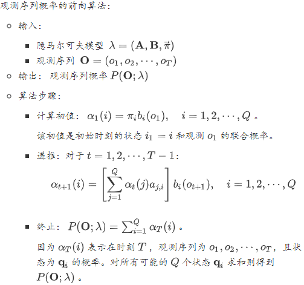

###### 后向算法

定义后向概率：在时刻$t$的状态为$\mathbf{q}_i$的条件下，从时刻$t+1$到$T$的观测序列为$o_{t+1}, o_{t+2}, \cdots, o_{T}$的概率为后向概率，记作：$\beta_{t}(i)=P\left(o_{t+1}, o_{t+2}, \cdots, o_{T} | i_{t}=i ; \lambda\right)$。在时刻$t$状态为$\mathbf{q}_i$的条件下，从时刻$t+1$到$T$的观测序列为$o_{t+1}, o_{t+2}, \cdots, o_{T}$的概率可以这样计算：考虑$t$时刻状态$\mathbf{q}_i$经过$a_{i,j}$转移到$t+1$时刻的状态$\mathbf{q}_j$。$t+1$时刻状态为$\mathbf{q}_j$的条件下，从时刻$t+2$到$T$的观测序列为观测序列为$o_{t+2}, o_{t+3}, \cdots, o_{T}$的概率为$\beta_{t+1}(j)$。$t+1$时刻状态为$\mathbf{q}_j$的条件下，从时刻$t+1$到$T$的观测序列为观测序列为$O_{t+1}, O_{t+2}, \cdots, O_{T}$的概率为$b_{j}\left(o_{t+1}\right) \times \beta_{t+1}(j)$。考虑所有可能的$\mathbf{q}_j$，则得到$\beta_{t}(j)$的递推公式：$\beta_{t}(i)=\sum_{j=1}^{Q} a_{i, j} b_{j}\left(o_{t+1}\right) \beta_{t+1}(j)$

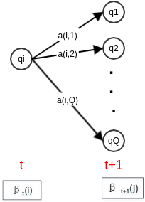

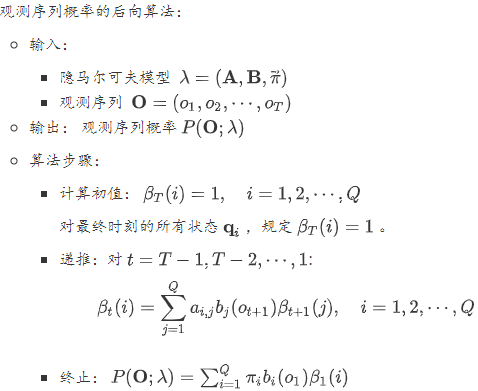

###### 统一形式

##### 学习问题

###### 有监督学习

假设数据集为$\mathbb{D}=\left\{\left(\mathbf{O}_{1}, \mathbf{I}_{1}\right),\left(\mathbf{O}_{2}, \mathbf{I}_{2}\right), \cdots,\left(\mathbf{O}_{N}, \mathbf{I}_{N}\right)\right\}$。其中：$\mathbf{O}_{1}, \cdots, \mathbf{O}_{N}$为$N$个观测序列；$\mathbf{I}_{1}, \cdots, \mathbf{I}_{N}$为对应的$N$个状态序列。序列$\mathbf{O}_{k}, \mathbf{I}_{k}$的长度为$T_k$，其中数据集中$\mathrm{O}_{1}, \cdots, \mathrm{O}_{N}$之间的序列长度可以不同。 可以利用极大似然估计来估计隐马尔可夫模型的参数。转移概率$a_{i,j}$的估计：设样本中前一时刻处于状态$i$、且后一时刻处于状态$j$的频数为$A_{i,j}$，则状态转移概率$a_{i,j}$的估计是：
$$
\hat{a}_{i, j}=\frac{A_{i, j}}{\sum_{u=1}^{Q} A_{i, u}}, \quad i=1,2, \cdots, Q ; j=1,2, \cdots, Q
$$
观测概率$b_j(k)$的估计：设样本中状态为$j$并且观测为$k$的频数为$B_{j,k}$，则状态为$j$并且观测为$k$的概率$b_j(k)$的估计为：
$$
\hat{b}_{j}(k)=\frac{B_{j, k}}{\sum_{v=1}^{V} B_{j, v}}, \quad j=1,2, \cdots, Q ; k=1,2, \cdots, V
$$
初始状态概率的估计：设样本中初始时刻处于状态$i$的频数为$C_i$，则初始状态概率$\pi_i$的估计为：$\hat{\pi}_{i}=\frac{C_{i}}{\sum_{j=1}^{Q} C_{j}}, \quad i=1,2, \cdots, Q$

###### 无监督学习

在隐马尔可夫模型的无监督学习中，数据集为$\mathbb{D}=\left\{\mathbf{O}_{1}, \mathbf{O}_{2}, \cdots, \mathbf{O}_{N}\right\}$。其中：$\mathrm{O}_{1}, \cdots, \mathrm{O}_{N}$为$N$个观测序列。序列$\mathbf{O}_k$的长度为$T_k$，其中数据集中$\mathrm{O}_{1}, \cdots, \mathrm{O}_{N}$之间的序列长度可以不同。 将观测序列数据看作观测变量$\mathbf{O}$， 状态序列数据看作不可观测的隐变量$\mathbf{I}$，则隐马尔可夫模型事实上是一个含有隐变量的概率模型：$P(\mathbf{O} ; \lambda)=\sum_{\mathbf{I}} P(\mathbf{O} | \mathbf{I} ; \lambda) P(\mathbf{I} ; \lambda)$。其参数学习可以由 `EM` 算法实现。`E` 步：求 `Q` 函数$Q(\lambda, \overline{\lambda})=\sum_{j=1}^{N}\left(\sum_{\mathbf{I}} P\left(\mathbf{I} | \mathbf{O}=\mathbf{O}_{j} ; \overline{\lambda}\right) \log P\left(\mathbf{O}=\mathbf{O}_{j}, \mathbf{I} ; \lambda\right)\right)$将$P\left(\mathbf{I} | \mathbf{O}=\mathbf{O}_{j} ; \overline{\lambda}\right)=\frac{P\left(\mathbf{I}, \mathbf{O}=\mathbf{O}_{i j} ; \overline{\lambda}\right)}{P(\mathbf{O}_{j} ; \overline{\lambda})}$代入上式，有：
$$
Q(\lambda, \overline{\lambda})=\sum_{j=1}^{N} \frac{1}{P\left(\mathbf{O}_{j} ; \overline{\lambda}\right)}\left(\sum_{\mathbf{I}} P\left(\mathbf{I}, \mathbf{O}=\mathbf{O}_{j} ; \overline{\lambda}\right) \log P\left(\mathbf{I}, \mathbf{O}=\mathbf{O}_{j} ; \lambda\right)\right)
$$
在给定参数$\overline{\lambda}$时，$P\left(\mathbf{O}_{j} ; \overline{\lambda}\right)$是已知的常数，记做$\tilde{P}_{j}$。在给定参数$\overline{\lambda}$时，$P\left(\mathbf{I}, \mathbf{O}=\mathbf{O}_{j} ; \overline{\lambda}\right)$是$\mathbf{I}$的函数，记做$\tilde{P}_{j}(\mathbf{I})$。根据$P(\mathbf{O}, \mathbf{I} ; \lambda)=\pi_{i_{1}} b_{i_{1}}\left(o_{1}\right) a_{i_{1}, i_{2}} b_{i_{2}}\left(o_{2}\right) \cdots a_{i_{T-1}, i_{T}} b_{i_{T}}\left(o_{T}\right)$得到：
$$
\begin{aligned} Q(\lambda, \overline{\lambda})=\sum_{j=1}^{N} \frac{1}{\tilde{P}_{j}} &\left(\sum_{\mathbf{I}}\left(\log \pi_{i_{1}}\right) \tilde{P}_{j}(\mathbf{I})+\sum_{\mathbf{I}}\left(\sum_{t=1}^{T_{j}-1} \log a_{i, i_{t}-1}\right) \tilde{P}_{j}(\mathbf{I})\right.\\ &+\sum_{\mathbf{I}}\left(\sum_{t=1}^{T_{j}} \log b_{i_{t}}\left(o_{t}^{(j)}\right)\right) \tilde{P}_{j}(\mathbf{I}) ) \end{aligned}
$$
其中：$T_j$表示第$j$个序列的长度，$o_t^{(j)}$表示第$j$个观测序列的第$t$个位置。

`M` 步：求`Q` 函数的极大值：$\overline{\lambda}^{<n e w>} \leftarrow \arg \max _{\lambda} Q(\lambda, \overline{\lambda})$。极大化参数在 `Q` 函数中单独的出现在3个项中，所以只需要对各项分别极大化。

$\frac{\partial Q(\lambda, \overline{\lambda})}{\partial \pi_{i}}=0$：
$$
\begin{array}{l}{\frac{\partial Q(\lambda, \overline{\lambda})}{\partial \pi_{i}}=\frac{\partial\left(\sum_{j=1}^{N} \frac{1}{\vec{P}_{j}} \sum_{\mathbf{I}}\left(\log \pi_{i_{1}}\right) \tilde{P}_{j}(\mathbf{I})\right)}{\partial \pi_{i}}} \\ {=\sum_{j=1}^{N} \frac{1}{\tilde{P}_{j}} \sum_{i_{1}=1}^{Q} P\left(i_{1}, \mathbf{O}=\mathbf{O}_{j} ; \overline{\lambda}\right) \frac{\partial \log \pi_{i_{1}}}{\partial \pi_{i}}}\end{array}
$$
将$\pi_{Q}=1-\pi_{1}-\cdots-\pi_{Q-1}$代入，有：
$$
\frac{\partial Q(\lambda, \overline{\lambda})}{\partial \pi_{i}}=\sum_{j=1}^{N} \frac{1}{\tilde{P}_{j}}\left(\frac{P\left(i_{1}=i, \mathbf{O}=\mathbf{O}_{j} ; \overline{\lambda}\right)}{\pi_{i}}-\frac{P\left(i_{1}=Q, \mathbf{O}=\mathbf{O}_{j} ; \overline{\lambda}\right)}{\pi_{Q}}\right)=0
$$
将$\tilde{P}_{j}=P\left(\mathbf{O}=\mathbf{O}_{j} ; \overline{\lambda}\right)$代入，即有：
$$
\pi_{i} \propto \sum_{j=1}^{N} P\left(i_{1}=i | \mathbf{O}=\mathbf{O}_{j} ; \overline{\lambda}\right)
$$
考虑到$\sum_{i=1}^{Q} \pi_{i}=1$，以及$\sum_{i=1}^{Q} \sum_{j=1}^{N} P\left(i_{1}=i | \mathbf{O}=\mathbf{O}_{j} ; \overline{\lambda}\right)=N$， 则有：
$$
\pi_{i}=\frac{\sum_{j=1}^{N} P\left(i_{1}=i | \mathbf{O}=\mathbf{O}_{j} ; \overline{\lambda}\right)}{N}
$$
$\frac{\partial Q(\lambda, \overline{\lambda})}{\partial \alpha_{i, j}}=0$：同样的处理有：
$$
\begin{aligned} \frac{\partial Q(\lambda, \overline{\lambda})}{\partial a_{i, j}}=& \sum_{k=1}^{N} \frac{1}{\tilde{P}_{k}} \sum_{t=1}^{T_{k}-1}\left(\frac{P\left(i_{t}=i, i_{t+1}=j, \mathbf{O}=\mathbf{O}_{k} ; \overline{\lambda}\right)}{a_{i, j}}\right.\\ &-\frac{P\left(i_{t}=i, i_{t+1}=Q, \mathbf{O}=\mathbf{O}_{k} ; \overline{\lambda}\right)}{a_{i, Q}} ) \end{aligned}
$$
得到：
$$
a_{i, j} \propto \sum_{k=1}^{N} \sum_{t=1}^{T_{h}-1} P\left(i_{t}=i, i_{t+1}=j | \mathbf{O}=\mathbf{O}_{k} ; \overline{\lambda}\right)
$$
考虑到$\sum_{j=1}^{Q} a_{i, j}=1$，则有：
$$
\begin{aligned} a_{i, j}=& \frac{\sum_{k=1}^{N} \sum_{t=1}^{T_{k}-1} P\left(i_{t}=i, i_{t+1}=j | \mathbf{O}=\mathbf{O}_{k} ; \overline{\lambda}\right)}{\sum_{j^{\prime}=1}^{Q} \sum_{k=1}^{N} \sum_{t=1}^{T_{k}-1} P\left(i_{t}=i, i_{t+1}=j^{\prime} | \mathbf{O}=\mathbf{O}_{k} ; \overline{\lambda}\right)} \\ &=\frac{\sum_{k=1}^{N} \sum_{t=1}^{T_{k}-1} P\left(i_{t}=i, i_{t+1}=j | \mathbf{O}=\mathbf{O}_{k} ; \overline{\lambda}\right)}{\sum_{k=1}^{N} \sum_{t=1}^{T_{k}-1} P\left(i_{t}=i | \mathbf{O}=\mathbf{O}_{k} ; \overline{\lambda}\right)} \end{aligned}
$$
$\frac{\partial Q(\lambda, \overline{\lambda})}{\partial b_{j}(k)}=0$：同样的处理有：
$$
\frac{\partial Q(\lambda, \overline{\lambda})}{\partial b_{j}(k)}=\sum_{i=1}^{N} \frac{1}{\tilde{P}_{i}} \sum_{t=1}^{T_{i}}\left(\frac{P\left(i_{t}=j, o_{t}=k, \mathbf{O}=\mathbf{O}_{i} ; \overline{\lambda}\right)}{b_{j}(k)}-\frac{P\left(i_{t}=j, o_{t}=V, \mathbf{O}=\mathbf{O}_{i} ; \overline{\lambda}\right)}{b_{j}(V)}\right)
$$
得到：
$$
b_{j}(k) \propto \sum_{i=1}^{N} \sum_{t=1}^{T_{i}} P\left(i_{t}=j, o_{t}=k | \mathbf{O}=\mathbf{O}_{i} ; \overline{\lambda}\right)
$$
其中如果第$i$个序列$\mathbf{O}_i$的第$t$个位置$o_{t}^{(i)} \neq k$，则$P\left(i_{t}=j, o_{t}=k | \mathbf{O}=\mathbf{O}_{i} ; \overline{\lambda}\right)=0$。

考虑到$\sum_{k=1}^{V} b_{j}(k)=1$，则有：
$$
\begin{aligned} b_{j}(k) &=\frac{\sum_{i=1}^{N} \sum_{t=1}^{T_{i}} P\left(i_{t}=j, o_{t}=k | \mathbf{O}=\mathbf{O}_{i} ; \overline{\lambda}\right)}{\sum_{k^{\prime}=1}^{V} \sum_{i=1}^{N} \sum_{t=1}^{T_{i}} P\left(i_{t}=j, o_{t}=k^{\prime} | \mathbf{O}=\mathbf{O}_{i} ; \overline{\lambda}\right)} \\ &=\frac{\sum_{i=1}^{N} \sum_{t=1}^{T_{i}} P\left(i_{t}=j, o_{t}=k | \mathbf{O}=\mathbf{O}_{i} ; \overline{\lambda}\right)}{\sum_{i=1}^{N} \sum_{t=1}^{T_{i}} P\left(i_{t}=j | \mathbf{O}=\mathbf{O}_{i} ; \overline{\lambda}\right)} \end{aligned}
$$
令$\gamma_{t}^{(s)}(i)=P\left(i_{t}=i | \mathbf{O}=\mathbf{O}_{s} ; \overline{\lambda}\right)$，其物理意义为：在序列$\mathbf{O}_s$中，第$t$时刻的隐状态为$i$的后验概率。令$\xi_{t}^{(s)}(i, j)=P\left(i_{t}=i, i_{t+1}=j | \mathbf{O}=\mathbf{O}_{s} ; \overline{\lambda}\right)$，其物理意义为：在序列$\mathbf{O}_S$中，第$t$时刻的隐状态为$i$、且第$t+1$时刻的隐状态为$j$的后验概率。

##### 预测问题

维特比算法思想：根据动态规划原理，最优路径具有这样的特性：如果最优路径在时刻$t$通过结点$i_t^*$， 则这一路径从结点$i_t^*$到终点$i_T^*$的部分路径，对于从$i_t^*$到$i_T^*$的所有可能路径来说，也必须是最优的。只需要从时刻$t=1$开始，递推地计算从时刻$1$到时刻$t$且时刻$t$状态为$i, i=1,2,\cdots, N$的各条部分路径的最大概率。于是在时刻$t=T$的最大概率即为最优路径的概率$P^*$，最优路径的终结点$i_T^*$也同时得到。之后为了找出最优路径的各个结点，从终结点$i_T^*$开始，由后向前逐步求得结点$i_{T-1}^{*}, \cdots, i_{1}^{* *}$，得到最优路径$\mathbf{T}^{*}=\left(i_{1}^{*}, i_{2}^{*}, \cdots, i_{T}^{*}\right)$。定义在时刻$t$状态为 的所有单个路径$\left(i_{1}, i_{2}, \cdots, i_{t}\right)$中概率最大值为：$\delta_{t}(i)=\max _{i_{1}, i_{2}, \cdots, i_{l-1}} P\left(i_{t}=i, i_{t-1}, \cdots, i_{1}, o_{t}, \cdots, o_{1} ; \lambda\right), \quad i=1,2, \cdots, Q$则根据定义，得到变量$\delta$的递推公式：
$$
\begin{aligned} \delta_{t+1}(i)=\max _{i_{1}, i_{2}, \cdots, i_{i}} P\left(i_{t+1}=\right.& i, i_{t}, \cdots, i_{1}, o_{t+1}, \cdots, o_{1} ; \lambda )=\max _{1 \leq j \leq Q} \delta_{t}(j) \times a_{j, i} \times b_{i}\left(o_{t+1}\right) \\ i &=1,2, \cdots, Q ; t=1,2, \cdots, T-1 \end{aligned}
$$
定义在时刻$t$状态为$i$的所有单个路径中概率最大的路径的第$t-1$个结点为：
$$
\Psi_{t}(i)=\arg \max _{1 \leq j \leq Q} \delta_{t-1}(j) a_{j, i}, \quad i=1,2, \cdots, Q
$$
它就是最优路径中，最后一个结点的前一个结点。

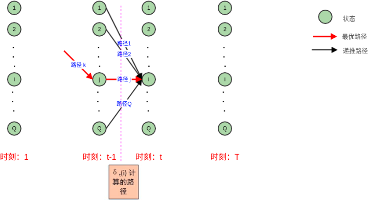

##### 最大熵马尔可夫模型

`HMM` 存在两个基本假设：观察值之间严格独立。状态转移过程中，当前状态仅依赖于前一个状态。如果放松第一个基本假设，则得到最大熵马尔科夫模型`MEMM` 。最大熵马尔科夫模型并不通过联合概率建模，而是学习条件概率$P\left(i_{t} | i_{t-1}, o_{t}\right)$。它刻画的是：在当前观察值$o_t$和前一个状态$i_{t-1}$的条件下，当前状态$i_t$的概率。

###### 坐标轴下降法

数学依据主要是这个结论：一个可微的凸函数$J(θ)$, 其中$θ$是$n \times1$的向量。如果在某一点$\overline{\theta}$，使得$J(θ)$在每一个坐标轴$\overline{\theta}_i(i = 1,2,...n)$上都是最小值，那么$J(\overline{\theta})$就是一个全局的最小值。

首先，我们把$θ$向量随机取一个初值。记为$θ^{(0)}$，上面的括号里面的数字代表我们迭代的轮数，当前初始轮数为$0$.

对于第k轮的迭代。我们从$θ^{(k)}_1$开始，到$θ^{(k)}_n$为止，依次求$θ^{(k)}_i$。$θ^{(k)}_i$的表达式如下：
$$
\theta^{(k)}_i = \mathbf{argmin}_{\theta_i}J(\theta^{(k)}_1,\cdot\cdot\cdot,\theta^{k}_{i-1},\theta_i,\cdot\cdot\cdot,\theta^{(k-1)}_n)
$$

##### 异常点检测

　第一类是基于统计学的方法来处理异常数据，这种方法一般会构建一个概率分布模型，并计算对象符合该模型的概率，把具有低概率的对象视为异常点；第二类是基于聚类的方法来做异常点检测；第三类是基于专门的异常点检测算法来做。这些算法不像聚类算法，检测异常点只是一个赠品，它们的目的就是专门检测异常点的。

###### One Class SVM算法

假设产生的超球体参数为中心$ o$和对应的超球体半径$ r>0$，超球体体积 $V(r)$被最小化，中心$o$是支持向量的线性组合；跟传统$SVM$方法相似，可以要求所有训练数据点 $x_i $到中心的距离严格小于$ r$，但同时构造一个惩罚系数为$ C$的松弛变量$ ξ_i$，优化问题如下所示：
$$
\begin{array}{c}{\underbrace{\min }_{r, o} V(r)+C \sum_{i=1}^{m} \xi_{i}} \\ {\left\|x_{i}-o\right\|_{2} \leq r+\xi_{i}, \quad i=1,2, \ldots m} \\ {\xi_{i} \geq 0, \quad i=1,2, \ldots m}\end{array}
$$

###### Isolation Forest算法

第一步训练构建随机森林对应的多颗决策树，这些决策树一般叫$iTree$，第二步计算需要检测的数据点$x$最终落在任意第$t$颗$iTree$的层数$h_t(x)$。然后我们可以得出$x$在每棵树的高度平均值$h(x)$。第三步根据$h(x)$判断$x$是否是异常点。首先采样决策树的训练样本时，普通的随机森林要采样的样本个数等于训练集个数。但是$iForest$不需要采样这么多，一般来说，采样个数要远远小于训练集个数。原因是我们的目的是异常点检测，只需要部分的样本我们一般就可以将异常点区别出来了。另外就是在做决策树分裂决策时，由于我们没有标记输出，所以没法计算基尼系数或者和方差之类的划分标准。这里我们使用的是**随机选择划分特征**，然后在基于这个特征**再随机选择划分阈值**，进行决策树的分裂。直到树的深度达到限定阈值或者样本数只剩一个。第二步计算要检测的样本点在每棵树的高度平均值$h(x)$。首先需要遍历每一颗$iTree$，得到检测的数据点$x$最终落在任意第t颗$iTree$的数层数$h_t(x)$$h_t(x)$代表的是树的深度，也就是离根节点越近，则$h_t(x)$越小，越靠近底层，则$h_t(x)$越大，根节点的高度为$0$。第三步是据$h(x)$判断$x$是否是异常点。我们一般用下面的公式计算$x$的异常概率分值：
$$
s(x, m)=2^{-\frac{n(x)}{c(m)}}\\
c(m)=2 \ln (m-1)+\xi-2 \frac{m-1}{m}
$$
$ξ$是欧拉常数，$IForest$具有线性时间复杂度。因为是随机森林的方法，所以可以用在含有海量数据的数据集上面。通常树的数量越多，算法越稳定。由于每棵树都是互相独立生成的，因此可以部署在大规模分布式系统上来加速运算。但是$IForest$ 有缺点，不适用于特别高维的数据。另外$iForest$仅对即全局稀疏点敏感，不擅长处理局部的相对稀疏点 ，这样在某些局部的异常点较多的时候检测可能不是很准。而$One Class SVM$对于中小型的数据分析，尤其是训练样本不是特别海量的时候用起来经常会比$iForest$顺手，因此比较适合做原型分析。