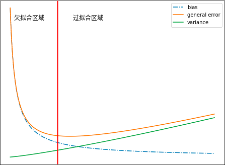

### 统计学习

**不同机器学习算法的区别**在于模型、学习准则和优化算法的差异。机器学习任务可以分为两类，一类是样本的特征向量$\mathbf{x}$和标签$ y $之间如果存在未知的函数关系$ y = h(\mathbf{x})$，另一类是条件概率$ p(y|\mathbf{x})$ 服从某个未知分布。对一个预测任务，输入特征向量为$\mathbf{x}$，输出标签为$y$，我们选择一个函数$f(\mathbf{x}, θ)$，通过学习算法A和一组训练样本$D$，找到一组最优的参数$θ^∗$，得到最终的模型$f(\mathbf{x}, θ^∗)$。这样就可以对新的输入$\mathbf{x}$进行预测。

##### 模型

由于我们不知道真实的映射函数$g(\mathbf{x})$或条件概率分布$p_r(y|\mathbf{x})$的具体形式，只能根据经验来确定一个假设函数集合$F$，称为假设空间，然后通过观测其在训练集$D$上的特性，从中选择一个理想的假设$f^∗ ∈ F$。假设空间$F$通常为一个参数化的函数族$F = \{f(x, θ)|θ ∈ R^m\}$, 其中$f(x, θ)$为假设空间中的模型，$θ $为一组可学习参数，$m$为参数的数量。

**线性模型**的假设空间为一个参数化的线性函数族，$f(\mathbf{x}, \theta)=\mathbf{w}^{\mathrm{T}} \mathbf{x}+b$，其中参数$θ $包含了权重向量$w$和偏置$b$。**广义的非线性模型**可以写为多个非线性基函数$ϕ(\mathbf{x})$的线性组合：$f(\mathbf{x}, \theta)=\mathbf{w}^{\mathrm{T}} \boldsymbol{\phi}(\mathbf{x})+b$。其中$ϕ(\mathbf{x}) = [ϕ_1(\mathbf{x}), ϕ_2(\mathbf{x}), · · · , ϕ_K(\mathbf{x})]^T $为$K $个非线性基函数组成的向量，参数$θ$包含了权重向量$w$和偏置$b$。如果$ϕ(x)$本身为可学习的基函数，比如$\phi_{k}(\mathbf{x})=h\left(\mathbf{w}_{k}^{\mathrm{T}} \boldsymbol{\phi}^{\prime}(\mathbf{x})+b_{k}\right), \forall 1 \leq k \leq K$其中$h(·)$为非线性函数，$ϕ′(x)$为另一组基函数，$w_k $和$b_k $为可学习的参数，则$f(x, θ)$就等价于神经网络模型。

##### 学习准测

一个好的模型$f(\mathbf{x}, θ^∗)$应该在所有 $(\mathbf{x}, y) $的可能取值上都与真实映射函数$y = g(\mathbf{x})$一致，即
$$
\left|f\left(\mathbf{x}, \theta^{*}\right)-y\right|<\epsilon, \quad \forall(\mathbf{x}, y) \in \mathcal{X} \times \mathcal{Y}
$$
或与真实条件概率分布$p_r(y|\mathbf{x})$一致，即
$$
\left|f_{y}\left(\mathrm{x}, \theta^{*}\right)-p_{r}(y | \mathrm{x})\right|<\epsilon, \quad \forall(\mathrm{x}, y) \in \mathcal{X} \times \mathcal{Y}
$$
其中$ϵ$是一个很小的正数，$f_y(\mathbf{x}, θ^∗)$为模型预测的条件概率分布中$y$对应的概率。

模型$f(\mathbf{x}, θ)$的好坏可以通过期望风险$R(θ)$来衡量
$$
\mathcal{R}(\theta)=\mathbb{E}_{(\mathbf{x}, y) \sim p_{r}(\mathbf{x}, y)}[\mathcal{L}(y, f(\mathbf{x}, \theta))]
$$
其中$p_r(\mathbf{x}, y)$为真实的数据分布，$L(y, f(\mathbf{x}, θ))$为损失函数，用来量化两个变量之间的差异。

##### 损失函数

- 0-1损失函数 ：$\mathcal{L}(y, f(\mathbf{x}, \theta))=\left\{\begin{array}{ll}{0} & {\text { if } y=f(\mathbf{x}, \theta)} \\ {1} & {\text { if } y \neq f(\mathbf{x}, \theta)}\end{array}\right.
  =I(y \neq f(\mathbf{x}, \theta))$

- 平方损失函数 ：$\mathcal{L}(y, f(\mathbf{x}, \theta))=\frac{1}{2}(y-f(\mathbf{x}, \theta))^{2}$

- 交叉熵损失函数：假设样本的标签$y ∈ \{1, · · · C\}$为离散的类别，模型$f(x, θ) ∈ [0, 1]^C$ 的输出为类别标签的条件概率分布，即：$p(y=c | \mathbf{x}, \theta)=f_{c}(\mathbf{x}, \theta)$。并满足：$f_{c}(\mathbf{x}, \theta) \in[0,1], \quad \sum_{c=1}^{C} f_{c}(\mathbf{x}, \theta)=1$

  标签的真实分布$y$和模型预测分布$f(\mathbf{x}, θ)$之间的交叉熵为：$\mathcal{L}(\mathbf{y}, f(\mathbf{x}, \theta))=-\sum_{c=1}^{C} y_{c} \log f_{c}(\mathbf{x}, \theta)$

- $\text{Hinge}$损失函数：$\begin{aligned} \mathcal{L}(y, f(x, \theta)) &=\max (0,1-y f(x, \theta)) \\ & \triangleq[1-y f(x, \theta)]_{+} \end{aligned}$

###### 风险最小化准则

**经验风险最小化准则**：给定一个训练集$\mathcal{D}=\left\{\left(\mathbf{x}^{(n)}, y^{(n)}\right)\right\}_{n=1}^{N}$我们可以计算的是经验风险，即在训练集上的平均损失。
$$
\mathcal{R}_{\mathcal{D}}^{e m p}(\theta)=\frac{1}{N} \sum_{n=1}^{N} \mathcal{L}\left(y^{(n)}, f\left(x^{(n)}, \theta\right)\right)
$$
因此，一个切实可行的学习准则是找到一组参数$θ^∗$ 使得经验风险最小    
$$
\theta^{*}=\underset{\theta}{\arg \min } \mathcal{R}_{\mathcal{D}}^{\operatorname{emp}}(\theta)
$$
**结构风险最小化准则**：一般在经验风险最小化的基础上再引入参数的正则化，来限制模型能力，使其不要过度地最小化经验风险。
$$
\begin{aligned} \theta^{*} &=\arg \min _{\theta} \mathcal{R}_{\mathcal{D}}^{\operatorname{struct}}(\theta) \\ &=\underset{\theta}{\arg \min } \mathcal{R}_{\mathcal{D}}^{e m p}(\theta)+\frac{1}{2} \lambda\|\theta\|^{2} \\ &=\underset{\theta}{\arg \min } \frac{1}{N} \sum_{n=1}^{N} \mathcal{L}\left(y^{(n)}, f\left(x^{(n)}, \theta\right)\right)+\frac{1}{2} \lambda\|\theta\|^{2} \end{aligned}
$$
其中$∥θ∥$是$ℓ_2$范数的正则化项，用来减少参数空间，避免过拟合；$λ$用来控制正则化的强度。 

##### 优化算法

在确定了训练集 $D$、假设空间$ F$ 以及学习准则后，如何找到最优的模型$f(\mathbf{x}, θ^∗)$就成了一个最优问题。机器学习的训练过程其实就是最优化问题的求解过程。**参数与超参数**在机器学习中，优化又可以分为参数优化和超参数优化。模型$f(\mathbf{x}, θ)$中的$θ$ 称为模型的参数，可以通过优化算法进行学习。除了可学习的参数$θ$之外，还有一类参数是用来定义模型结构或优化策略的，这类参数叫做超参数。

梯度下降算法：$\theta_{t+1}=\theta_{t}-\alpha \frac{\partial \mathcal{R}_{\mathcal{D}}(\theta)}{\partial \theta}
=\theta_{t}-\alpha \cdot \frac{1}{N} \sum_{n=1}^{N} \frac{\partial \mathcal{L}\left(y^{(n)}, f\left(\mathbf{x}^{(n)}, \theta\right)\right)}{\partial \theta}$

$\text{Stochastic Gradient Descent}$：$\theta \leftarrow \theta-\alpha \frac{\partial \mathcal{L}\left(\theta ; x^{(n)}, y^{(n)}\right)}{\partial \theta}$

$\text{Mini-Batch Gradient Descent}$：$\theta_{t+1} \leftarrow \theta_{t}-\alpha \cdot \frac{1}{K} \sum_{(\mathbf{x}, y) \in \mathcal{I}_{t}} \frac{\partial \mathcal{L}(y, f(\mathbf{x}, \theta))}{\partial \theta}$

#### 

##### 数据预处理

###### 缺失值处理

缺失值的处理有三种方法：直接使用含有缺失值的数据。删除含有缺失值的数据。缺失值补全。缺失值补全常见有以下方法：均值插补、同类均值插补、建模预测、高维映射、多重插补、压缩感知及矩阵补全

优点：完整保留了原始数据的全部信息。缺点：计算量大大提升。而且只有在样本量非常大的时候效果才好，否则会因为过于稀疏，效果很差。

**多重插补**认为待插补的值是随机的，它的值来自于已观测到的值。具体实践上通常是估计出待插补的值，然后再加上不同的噪声，形成多组可选插补值。然后根据某种选择依据，选取最合适的插补值。多重插补法的步骤：通过变量之间的关系对缺失数据进行预测，利用蒙特卡洛方法生成多个完整的数据集。在每个完整的数据集上进行训练，得到训练后的模型以及评价函数值。对来自各个完整的数据集的结果，根据评价函数值进行选择，选择评价函数值最大的模型，其对应的插值就是最终的插补值。

压缩感知分为感知测量和重构恢复两个阶段。感知测量：关注如何对原始信号进行处理以获得稀疏样本表示。常用的手段是傅里叶变换、小波变换、字典学习、稀疏编码等。重构恢复：关注的是如何基于稀疏性从少量观测中恢复原信号。

限定等距性：对于大小为$m \times n, m \ll n$的矩阵$\mathbf{A}$，若存在常数$\delta_{k} \in(0,1)$，使得对于任意向量$\vec{\mathbf{s}}$和$\mathbf{A}$的所有子矩阵$\mathbf{A}_{k} \in \mathbb{R}^{m \times k}$，都有：$\left(1-\delta_{k}\right)\|\vec{\mathbf{s}}\|_{2}^{2} \leq\left\|\mathbf{A}_{k} \vec{\mathbf{s}}\right\|_{2}^{2} \leq\left(1+\delta_{k}\right)\|\vec{\mathbf{s}}\|_{2}^{2}$则称$\mathbf{A}$满足$k$限定等距性。此时通过下面的最优化问题可以近乎完美的从$\vec{y}$中恢复出稀疏信号  ，进而恢复出$\overrightarrow{\mathbf{x}}$
$$
\begin{array}{c}{\min _{\overrightarrow{\mathrm{s}}}\|\overrightarrow{\mathbf{s}}\|_{1}} \\ {\text { s.t. } \overrightarrow{\mathbf{y}}=\mathbf{A} \overrightarrow{\mathbf{s}}}\end{array}
$$
矩阵补全`matrix completion`解决的问题是：
$$
\begin{array}{l}{\operatorname{min}_{\mathbf{X}} \operatorname{ran} k(\mathbf{X})} \\ {\text {s.t. } \quad x_{i, j}=a_{i, j},(i, j) \in \Omega}\end{array}
$$
$\mathbf{A}$为观测矩阵，其中有很多缺失值。$\Omega$为$\mathbf{A}$中所有的有数值的下标的集合。$\mathbf{X}$为需要恢复的稀疏信号， 为矩阵$rank(\mathbf{X})$的秩。

考虑到$rank(\mathbf{X})$在集合$\left\{\mathbf{X} \in \mathbb{R}^{m \times n} :\|\mathbf{X}\|_{F}^{2} \leq 1\right\}$上的凸包是$\mathbf{X}$的核范数`nuclear norm`：
$$
\|\mathbf{x}\|_{*}=\sum_{j=1}^{\min \{m, n\}} \sigma_{j}(\mathbf{X})
$$
其中$\sigma_{j}(\mathbf{X})$表示$\mathbf{X}$的奇异值。于是可以通过最小化矩阵核范数来近似求解：

##### 特征编码

离散化用于将连续的数值属性转化为离散的数值属性。是否使用特征离散化，这背后是：使用“海量离散特征+简单模型”，还是“少量连续特征+复杂模型”。对于线性模型，通常使用“海量离散特征+简单模型”。优点：模型简单。缺点：特征工程比较困难。但是一旦有成功的经验就可以推广，并且可以很多人并行研究。对于非线性模型，通常使用“少量连续特征+复杂模型”。优点是：不需要进行复杂的特征工程。缺点是：模型复杂。

###### 稀疏表示和字典学习

字典学习：学习一个字典，通过该字典将样本转化为合适的稀疏表示形式。它侧重于学得字典的过程。稀疏编码：获取样本的稀疏表达，不一定需要通过字典。它侧重于对样本进行稀疏表达的过程。这两者通常是在同一个优化求解过程中完成的，因此这里不做区分，统称为字典学习。

给定数据集$\mathbb{D}=\left\{\left(\vec{\mathbf{x}}_{1}, \tilde{y}_{1}\right),\left(\vec{\mathbf{x}}_{2}, \tilde{y}_{2}\right), \cdots,\left(\vec{\mathbf{x}}_{N}, \tilde{y}_{N}\right)\right\}$，希望对样本$\vec{\mathbf{x}}_{i}$学习到它的一个稀疏表示 。其中$\vec{\alpha}_{i} \in \mathbb{R}^{k}$是一个$k$维列向量，且其中大量元素为 0 。一个自然的想法进行线性变换，即寻找一个矩阵$\mathbf{P} \in \mathbb{R}^{k \times n}$使得 $\mathbf{P} \vec{\mathbf{x}}_{i}=\vec{\alpha}_{i}$。

因此给出字典学习的最优化目标：$\min _{\mathbf{B}, \vec{\alpha}_{i}} \sum_{i=1}^{N}\left\|\vec{\mathbf{x}}_{i}-\mathbf{B} \vec{\alpha}_{i}\right\|_{2}^{2}+\lambda \sum_{i=1}^{N}\left\|\vec{\alpha}_{i}\right\|_{1}$。其中$\mathbf{B} \in \mathbb{R}^{n \times k}$称作字典矩阵。$k$称作字典的词汇量。

第一步：固定字典$\mathbf{B}$， 为每一个样本$\vec{\mathbf{x}_i}$找到相应的$\vec{\alpha_i}$：$\min _{\vec{\alpha}_{i}}\left\|\vec{\mathbf{x}}_{i}-\mathbf{B} \vec{\alpha}_{\dot{z}}\right\|_{2}^{2}+\lambda \sum_{i=1}^{N}\left\|\vec{\alpha}_{i}\right\|_{1}$。第二步：根据$\min _{\mathbf{B}}\|\mathbf{X}-\mathbf{B} \mathbf{A}\|_{F}^{2}$，以$\vec{\alpha_i}$为初值来更新字典$\mathbf{B}$。反复迭代上述两步，最终即可求得字典$\mathbf{B}$和样本$\vec{\mathbf{x}_i}$的稀疏表示$\vec{\alpha_i}$。

这里有个最优化问题：$\min _{\mathbf{B}}\|\mathbf{X}-\mathbf{B} \mathbf{A}\|_{F}^{2}$，该问题有多种求解方法，常用的有基于逐列更新策略的`KSVD`算法。令$\vec{\mathbf{b}}_i$为字典矩阵$\mathbf{B}$的第$i$列，$\vec{\mathbf{a}}^j$表示稀疏矩阵$\mathbf{A}$的第$j$行。 固定$\mathbf{B}$其他列，仅考虑第$i$列，则有：
$$
\min _{\overrightarrow{\mathbf{b}}_{i}}\left\|\mathbf{X}-\sum_{j=1}^{k} \overrightarrow{\mathbf{b}}_{i} \overrightarrow{\mathbf{a}}^{j}\right\|_{F}^{2}=\operatorname{mir}_{\overrightarrow{\mathbf{b}}_{i}}\left\|\left(\mathbf{X}-\sum_{j=1, j \neq i}^{k} \overrightarrow{\mathbf{b}}_{i} \overrightarrow{\mathbf{a}}^{j}\right)-\overrightarrow{\mathbf{b}}_{i} \overrightarrow{\mathbf{a}}^{i}\right\|_{F}^{2}
$$
令$\mathbf{E}_{i}=\mathbf{X}-\sum_{j=1, j \neq i}^{k} \overrightarrow{\mathbf{b}}_{i} \overrightarrow{\mathbf{a}}^{j}$，它表示去掉$\vec{\mathbf{x}}_i$的稀疏表示之后，样本集的稀疏表示与原样本集的误差矩阵。考虑到更新字典的第$i$列$\vec{\mathbf{b}}_i$时，其他各列都是固定的，则$\mathbf{E}_{i}$是固定的。则最优化问题转换为：
$$
\min _{\overrightarrow{\mathrm{b}}_{\mathfrak{i}}}\left\|\mathbf{E}_{i}-\overrightarrow{\mathbf{b}}_{i} \overrightarrow{\mathbf{a}}^{i}\right\|_{F}^{2}
$$
求解该最优化问题只需要对$\mathbf{E}_{i}$进行奇异值分解以取得最大奇异值所对应的正交向量。直接对$\mathbf{E}_{i}$进行奇异值分解会同时修改$\vec{\mathbf{b}}_i$和 $\vec{\mathbf{b}}^i$， 从而可能破坏$\mathbf{A}$的稀疏性。因为第二步 “以$\vec{\alpha}^i$为初值来更新字典$\mathbf{B}$” 中， 在更新$\mathbf{B}$前后$\vec{\alpha}^i$的非零元所处的位置和非零元素的值很可能不一致。为避免发生这样的情况 `KSVD` 对$\mathbf{E}_{i}$和$\overrightarrow{\mathbf{a}}^{i}$进行了专门处理：$\overrightarrow{\mathbf{a}}^{i}$仅保留非零元素。$\mathbf{E}_{i}$仅保留$\overrightarrow{\mathbf{b}}_{i}$和$\overrightarrow{\mathbf{a}}^{i}$的非零元素的乘积项，然后再进行奇异值分解，这样就保持了第一步得到的稀疏性。

#### 2.9.模型评估

高偏差对应于模型的欠拟合：模型过于简单，以至于未能很好的学习训练集，从而使得训练误差过高。此时模型预测的方差较小，表示预测较稳定。但是模型预测的偏差会较大，表示预测不准确。高方差对应于模型的过拟合：模型过于复杂，以至于将训练集的细节都学到，将训练集的一些细节当做普遍的规律，从而使得测试集误差与训练集误差相距甚远。此时模型预测的偏差较小，表示预测较准确。但是模型预测的方差较大，表示预测较不稳定。误差诊断：通过训练误差和测试误差来分析模型是否存在高方差、高偏差。如果训练误差较高：说明模型的方差较大，模型出现了欠拟合。如果训练误差较低，而训练误差较高：说明模型的偏差较大，出现了过拟合。如果训练误差较低，测试误差也较低：说明模型的方差和偏差都适中，是一个比较理想的模型。如果训练误差较高，且测试误差更高：说明模型的方差和偏差都较大。

##### bias-variance 分解

###### 点估计

点估计：对参数$\theta$的一个预测，记作$\hat{\theta}$。假设$\left\{x_{1}, x_{2}, \cdots, x_{m}\right\}$为独立同分布的数据点，该分布由参数$\theta$决定。则参数$\theta$的点估计为某个函数：$\hat{\theta}_{m}=g\left(x_{1}, x_{2}, \cdots, x_{m}\right)$。注意：点估计的定义并不要求  返回一个接近真实值  。根据频率学派的观点：真实参值$\theta$是固定的，但是未知的。$\hat{\theta}$是数据点的函数。由于数据是随机采样的，因此$\hat{\theta}$是个随机变量

###### 偏差

偏差定义为：$\operatorname{bias}\left(\hat{\theta}_{m}\right)=\mathbb{E}\left(\hat{\theta}_{m}\right)-\theta$，期望作用在所有数据上。如果$\operatorname{bias}\left(\hat{\theta}_{m}\right)=0$，则称估计量$\hat{\theta}$是无偏的。如果$\lim _{m \rightarrow \infty} \operatorname{bias}\left(\hat{\theta}_{m}\right)=0$，则称估计量$\hat{\theta}$是渐近无偏的。无偏估计并不一定是最好的估计。

通常希望当数据集的大小$m$增加时，点估计会收敛到对应参数的真实值。即：
$$
\operatorname{plim}_{m \rightarrow \infty} \hat{\theta}_{m}=\theta
$$
 $\operatorname{plim}$表示依概率收敛。即对于任意的$\epsilon>0$，当$m \rightarrow \infty$时，有：$P\left(\left|\hat{\theta}_{m}-\theta\right|\right)>\epsilon \rightarrow 0$ 

期望误差可以分解为
$$
\begin{aligned} \mathcal{R}(f) &=\mathbb{E}_{(\mathbf{x}, y) \sim p_{r}(\mathbf{x}, y)}\left[\left(y-f^{*}(\mathbf{x})+f^{*}(\mathbf{x})-f(\mathbf{x})\right)^{2}\right] \\ &=\mathbb{E}_{\mathbf{x} \sim p_{r}(\mathbf{x})}\left[\left(f(\mathbf{x})-f^{*}(\mathbf{x})\right)^{2}\right]+\varepsilon \end{aligned}
$$
对于单个样本$\mathbf{x}$，不同训练集$D$得到模型$f_D(\mathbf{x})$和最优模型$f^∗(\mathbf{x})$的上的期望差距为
$$
\begin{aligned} \mathbb{E}_{\mathcal{D}} &\left[\left(f_{\mathcal{D}}(\mathbf{x})-f^{*}(\mathbf{x})\right)^{2}\right] \\=& \mathbb{E}_{\mathcal{D}}\left[\left(f_{\mathcal{D}}(\mathbf{x})-\mathbb{E}_{\mathcal{D}}\left[f_{\mathcal{D}}(\mathbf{x})\right]+\mathbb{E}_{\mathcal{D}}\left[f_{\mathcal{D}}(\mathbf{x})\right]-f^{*}(\mathbf{x})\right)^{2}\right] \\=& \underbrace{\left(\mathbb{E}_{\mathcal{D}}\left[f_{\mathcal{D}}(\mathbf{x})\right]-f^{*}(\mathbf{x})\right)^{2}}_{(\text { bias })^{2}}+\underbrace{\mathbb{E}_{\mathcal{D}}\left[\left(f_{\mathcal{D}}(\mathbf{x})-\mathbb{E}_{\mathcal{D}}\left[f_{\mathcal{D}}(\mathbf{x})\right]\right)^{2}\right]}_{\text { variance }} \end{aligned}
$$

##### 参数估计准则

###### 最大似然估计

假设数据集$\mathbf{X}=\left\{\overrightarrow{\mathbf{x}}_{1}, \overrightarrow{\mathbf{x}}_{2}, \cdots, \overrightarrow{\mathbf{x}}_{m}\right\}$中的样本独立同分布地由$p_{d a t a}(\overrightarrow{\mathbf{x}})$产生，但是该分布是未知的。$p_{\text {model}}(\overrightarrow{\mathbf{x}} ; \theta)$是一族由$\theta$参数控制的概率分布函数族，希望通过$p_{\text {model}}(\overrightarrow{\mathbf{x}} ; \theta)$来估计真实的概率分布函数$p_{d a t a}(\overrightarrow{\mathbf{x}})$，也就是要估计$\theta$参数。最大似然估计最大化数据集$\mathbf{X}$出现的概率。即：
$$
\theta_{M L}=\arg \max _{\theta} p_{m o d e l}(\mathbf{X} ; \theta)=\arg \max _{\theta} \prod_{i=1}^{m} p_{m o d e l}\left(\overrightarrow{\mathbf{x}}_{i} ; \theta\right)
$$
由于概率的乘积容易出现数值下溢出，因此转换为对数的形式。因为$m$与$\theta$无关，因此它也等价于： $\theta_{M L}=\arg \max _{\theta} \sum_{i=1}^{m} \frac{1}{m} \log p_{m o d e l}\left(\overrightarrow{\mathbf{x}}_{i} ; \theta\right)$。由于数据集的经验分布为：$\hat{p}_{\text {data}}(\overrightarrow{\mathbf{x}})=\frac{1}{m} \sum_{i=1}^{m} \delta\left(\overrightarrow{\mathbf{x}}-\overrightarrow{\mathbf{x}}_{i}\right)$，其中$\delta(\cdot)$狄拉克函数。因此：$\theta_{M L}=\arg \max _{\theta} \mathbb{E}_{\overrightarrow{\mathbf{x}} \sim \hat{p}_{\text {data}}} \log p_{\text {model}}(\overrightarrow{\mathbf{x}} ; \theta)$。考虑数据集的经验分布$\hat{p}_{data}$和真实分布函数的估计量$p_{model}$之间的差异，`KL`散度为：
$$
\left.D\right|_{K L}\left(\hat{p}_{\text {data}} \| p_{\text {model}} ; \theta\right)=\mathbb{E}_{\overrightarrow{\mathbf{x}} \sim \hat{p}_{\text {data}}}\left[\log \hat{p}_{\text {data}}(\overrightarrow{\mathbf{x}})-\log p_{\text {model}}(\overrightarrow{\mathbf{x}} ; \theta)\right]
$$
由于$\log \hat{p}_{d a t a}(\overrightarrow{\mathbf{x}})$与$\theta$无关，因此要使得$\left.D\right|_{K L}\left(\hat{p}_{\text { data }} \| p_{\text {model}} ; \theta\right)$最小，则只需要最小化$\mathbb{E}_{\overrightarrow{\mathbf{x}} \sim \hat{p}_{\text { data }}}\left[-\log p_{\text {model}}(\overrightarrow{\mathbf{x}} ; \theta)\right]$。也就是最大化$\mathbb{E}_{\overrightarrow{\mathbf{x}} \sim \hat{p}_{d a z a}} \log p_{\text {model}}(\overrightarrow{\mathbf{x}} ; \theta)$。因此：最大似然估计就是最小化数据集的经验分布$\hat{p}_{data}$和真实分布函数的估计量$p_{model}$之间的差异。最大似然估计可以扩展到估计条件概率。假设数据集$\mathbf{X}=\left\{\overrightarrow{\mathbf{x}}_{1}, \overrightarrow{\mathbf{x}}_{2}, \cdots, \overrightarrow{\mathbf{x}}_{m}\right\}$，对应的观测值为$\mathbf{Y}=\left\{y_{1}, y_{2}, \cdots, y_{m}\right\}$。则条件概率的最大似然估计为：$\theta_{M L}=\arg \max _{\theta} p(\mathbf{Y} | \mathbf{X} ; \theta)$。如果样本是独立同分布的，则可以分解成：$\theta_{M L}=\arg \max _{\theta} \sum_{i=1}^{m} \log p\left(y_{i} | \overrightarrow{\mathbf{x}}_{i} ; \theta\right)$。最大似然估计有两个很好的性质：在某些条件下，最大似然估计具有一致性。这意味着当训练样本数量趋向于无穷时，参数的最大似然估计依概率收敛到参数的真实值。这些条件为：真实分布$p_{data}$必须位于分布函数族$p_{\text {model}}(\cdot ; \theta)$中；否则没有估计量可以表示$p_{data}$。真实分布$p_{data}$必须对应一个$\theta$值；否则从最大似然估计恢复出真实分布$p_{data}$之后，也不能解出参数$\theta$。最大似然估计具有很好的统计效率。即只需要较少的样本就能达到一个良好的泛化误差。最大似然估计通常是机器学习中的首选估计准则。

###### 贝叶斯估计

在最大似然估计中，频率学派的观点是：真实参数$\theta$是未知的固定的值，而点估计$\hat{\theta}$是随机变量。因为数据是随机生成的，所以数据集是随机的。在贝叶斯估计中，贝叶斯学派认为：数据集是能够直接观测到的，因此不是随机的。而真实参数$\theta$是未知的、不确定的，因此$\theta$是随机变量。对$\theta$的已知的知识表示成先验概率分布$p(\theta)$：表示在观测到任何数据之前，对于参数$\theta$的可能取值的一个分布。假设观测到一组数据$\mathbf{X}=\left\{\overrightarrow{\mathbf{x}}_{1}, \overrightarrow{\mathbf{x}}_{2}, \cdots, \overrightarrow{\mathbf{x}}_{m}\right\}$，根据贝叶斯法则，有：
$$
p(\theta | \mathbf{X})=\frac{p(\mathbf{X} | \theta) p(\theta)}{p(\mathbf{X})}
$$
贝叶斯估计与最大似然估计有两个重要区别：贝叶斯估计预测下，一个样本的分布为：
$$
p\left(\overrightarrow{\mathbf{x}}_{m+1} | \overrightarrow{\mathbf{x}}_{1}, \overrightarrow{\mathbf{x}}_{2}, \cdots, \overrightarrow{\mathbf{x}}_{m}\right)=\int p\left(\overrightarrow{\mathbf{x}}_{m+1} | \theta\right) p\left(\theta | \overrightarrow{\mathbf{x}}_{1}, \overrightarrow{\mathbf{x}}_{2}, \cdots, \overrightarrow{\mathbf{x}}_{m}\right) d \theta
$$
而最大似然估计预测下，一个样本的分布为：$p_{\text {model}}(\overrightarrow{\mathbf{x}} ; \theta)$ 。贝叶斯估计会使得概率密度函数向着先验概率分布的区域偏移。当训练数据有限时，贝叶斯估计通常比最大似然估计泛化性能更好。当训练样本数量很大时，贝叶斯估计往往比最大似然估计计算代价较高。

有时候希望获取参数$\theta$的一个可能的值，而不仅仅是它的一个分布。此时可以通过最大后验估计`MAP` 选择后验概率最大的点：
$$
\theta_{M A P}=\arg \max _{\theta} p(\theta | \mathbf{X})=\arg \max _{\theta}[\log p(\mathbf{X} | \theta)+\log p(\theta)]
$$
最大后验估计具有最大似然估计没有的优势：拥有先验知识带来的信息。该信息有助于减少估计量的方差，但是增加了偏差。一些正则化方法可以被解释为最大后验估计，正则化项就是对应于$\log p(\theta)$。最大后验估计估计`MAP` 提供了一个直观的方法去设计复杂的、可解释的正则化项。

##### 分类问题性能度量

###### $\text{P-R}$曲线

假设排序后的样本集合为$\left(\overrightarrow{\mathbf{x}}_{1}, \tilde{y}_{1}\right),\left(\overrightarrow{\mathbf{x}}_{2}, \tilde{y}_{2}\right), \cdots,\left(\overrightarrow{\mathbf{x}}_{N}, \tilde{y}_{N}\right)$，预测为正类的概率依次为$\left(p_{1}, p_{2}, \cdots, p_{N}\right)$。在第$i$轮，将$p_i$作为分类阈值来。即：
$$
\hat{y}_{j}=\left\{\begin{array}{ll}{1,} & {\text { if } p_{j} \geq p_{i}} \\ {0,} & {\text { else }}\end{array}, \quad j=1,2, \cdots, N\right.
$$
此时计算得到的查准率记做$P_i$，查全率记做$R_i$。以查准率为纵轴、查全率为横轴作图，就得到查准率-查全率曲线，简称 `P-R`曲线。该曲线由点$\left\{\left(R_{1}, P_{1}\right),\left(R_{2}, P_{2}\right), \cdots,\left(R_{N}, P_{N}\right)\right\}$组成。

`P-R`曲线直观显示出分类器在样本总体上的查全率、查准率。因此可以通过两个分类器在同一个测试集上的`P-R` 曲线来比较它们的预测能力：如果分类器`B`的`P-R`曲线被分类器`A`的曲线完全包住，则可断言：`A`的性能好于`B` 。如果分类器`A`的`P-R`曲线与分类器`B`的曲线发生了交叉，则难以一般性的断言两者的优劣，只能在具体的查准率和查全率下进行比较。此时一个合理的判定依据是比较`P-R`曲线下面积大小，但这个值通常不容易计算。可以考察平衡点。平衡点是`P-R`曲线上查准率等于查全率的点，可以判定：平衡点较远的`P-R`曲线较好。

###### $\text{ROC}$曲线

定义真正例率为：$T P R=\frac{T P}{T P+F N}$。定义假正例率为：$F P R=\frac{F P}{T N+F P}$。假设排序后的样本集合为$\left(\overrightarrow{\mathbf{x}}_{1}, \tilde{y}_{1}\right),\left(\overrightarrow{\mathbf{x}}_{2}, \tilde{y}_{2}\right), \cdots,\left(\overrightarrow{\mathbf{x}}_{N}, \tilde{y}_{N}\right)$，预测为正类的概率依次为$\left(p_{1}, p_{2}, \cdots, p_{N}\right)$。在第$i$轮，将$p_i$作为分类阈值来。即：
$$
\hat{y}_{j}=\left\{\begin{array}{ll}{1,} & {\text { if } p_{j} \geq p_{i}} \\ {0,} & {\text { else }}\end{array}, \quad j=1,2, \cdots, N\right.
$$
此时计算得到的真正例率记做$TPR_i$，假正例率记做$FPR_i$。以真正例率为纵轴、假正例率为横轴作图，就得到`ROC`曲线。该曲线由点$\left\{\left(T P R_{1}, F P R_{1}\right),\left(T P R_{2}, F P R_{2}\right), \cdots,\left(R P R_{N}, F P R_{N}\right)\right\}$组成。

###### PAC学习理论

一个 PAC 可学习的算法是指该学习算法能够在多项式时间内从合理数量的训练数据中学习到一个近似正确的$f(x)$。
$$
P\left(\left(\mathcal{R}(f)-\mathcal{R}_{\mathcal{D}}^{e m p}(f)\right) \leq \epsilon\right) \geq 1-\delta
$$
其中$ϵ,δ $是和样本数量$n$、假设空间$F$相关的变量。如果固定$ϵ,δ$，可以反过来计算出样本复杂度为
$$
n(\epsilon, \delta) \geq \frac{1}{2 \epsilon^{2}}\left(\ln |\mathcal{F}|+\ln \frac{2}{\delta}\right)
$$
其中$|F|$为假设空间的大小。

##### 异常点检测

In data mining, anomaly detection is the identification of rare items, events or observations which raise suspicions by differing significantly from the majority of the data.
Anomalies can be broadly categorized as:

Point anomalies: A single instance of data is anomalous if it's too far off from the rest. Business use case: Detecting credit card fraud based on "amount spent."

Contextual anomalies: The abnormality is context specific. This type of anomaly is common in time-series data. Business use case: Spending $100 on food every day during the holiday season is normal, but may be odd otherwise.

Collective anomalies: A set of data instances collectively helps in detecting anomalies. Business use case: Someone is trying to copy data form a remote machine to a local host unexpectedly, an anomaly that would be flagged as a potential cyber attack. 

- Anomaly detection is similar to — but not entirely the same as — noise removal and novelty detection. 

- Novelty detection is concerned with identifying an unobserved pattern in new observations not included in training data

- Noise removal is the process of removing noise from an otherwise meaningful signal. 

###### 1. Anomaly Detection Techniques
#### Simple Statistical Methods

The simplest approach to identifying irregularities in data is to flag the data points that deviate from common statistical properties of a distribution, including mean, median, mode, and quantiles. Let's say the definition of an anomalous data point is one that deviates by a certain standard deviation from the mean. Traversing mean over time-series data isn't exactly trivial, as it's not static. You would need a rolling window to compute the average across the data points. Technically, this is called a ***rolling average or a moving average***, and it's intended to smooth short-term fluctuations and highlight long-term ones. Mathematically, an n-period simple moving average can also be defined as a ***"low pass filter."***

#### Challenges with Simple Statistical Methods

The low pass filter allows you to identify anomalies in simple use cases, but there are certain situations where this technique won't work. Here are a few:  

- The data contains noise which might be similar to abnormal behavior, because the boundary between normal and abnormal behavior is often not precise. 

- The definition of abnormal or normal may frequently change, as malicious adversaries constantly adapt themselves. Therefore, the threshold based on moving average may not always apply.

- The pattern is based on seasonality. This involves more sophisticated methods, such as decomposing the data into multiple trends in order to identify the change in seasonality.

###### 2. Machine Learning-Based Approaches

###### a.Density-Based Anomaly Detection 
Density-based anomaly detection is based on the k-nearest neighbors algorithm.

Assumption: Normal data points occur around a dense neighborhood and abnormalities are far away. 

The nearest set of data points are evaluated using a score, which could be Eucledian distance or a similar measure dependent on the type of the data (categorical or numerical). They could be broadly classified into two algorithms:

***K-nearest neighbor***: k-NN is a simple, non-parametric lazy learning technique used to classify data based on similarities in distance metrics such as Eucledian, Manhattan, Minkowski, or Hamming distance.

***Relative density of data***: This is better known as local outlier factor (LOF). This concept is based on a distance metric called reachability distance.

###### b.Clustering-Based Anomaly Detection 
Clustering is one of the most popular concepts in the domain of unsupervised learning.

Assumption: Data points that are similar tend to belong to similar groups or clusters, as determined by their distance from local centroids.

***K-means*** is a widely used clustering algorithm. It creates 'k' similar clusters of data points. Data instances that fall outside of these groups could potentially be marked as anomalies.

c.Support Vector Machine-Based Anomaly Detection 

- A support vector machine is another effective technique for detecting anomalies. 
- A SVM is typically associated with supervised learning, but there are extensions (OneClassCVM, for instance) that can be used to identify anomalies as an unsupervised problems (in which training data are not labeled). 
- The algorithm learns a soft boundary in order to cluster the normal data instances using the training set, and then, using the testing instance, it tunes itself to identify the abnormalities that fall outside the learned region.
- Depending on the use case, the output of an anomaly detector could be numeric scalar values for filtering on domain-specific thresholds or textual labels (such as binary/multi labels).

In this jupyter notebook we are going to take the credit card fraud detection as the case study for understanding this concept in detail using the following Anomaly Detection Techniques namely

Now it is time to start building the model .The types of algorithms we are going to use to try to do anomaly detection on this dataset are as follows

2. Local Outlier Factor(LOF) Algorithm

The LOF algorithm is an unsupervised outlier detection method which computes the local density deviation of a given data point with respect to its neighbors. It considers as outlier samples that have a substantially lower density than their neighbors.

The number of neighbors considered, (parameter n_neighbors) is typically chosen 1) greater than the minimum number of objects a cluster has to contain, so that other objects can be local outliers relative to this cluster, and 2) smaller than the maximum number of close by objects that can potentially be local outliers. In practice, such informations are generally not available, and taking n_neighbors=20 appears to work well in general.

　第一类是基于统计学的方法来处理异常数据，这种方法一般会构建一个概率分布模型，并计算对象符合该模型的概率，把具有低概率的对象视为异常点；第二类是基于聚类的方法来做异常点检测；第三类是基于专门的异常点检测算法来做。这些算法不像聚类算法，检测异常点只是一个赠品，它们的目的就是专门检测异常点的。

###### One Class `SVM`算法

假设产生的超球体参数为中心$ o$和对应的超球体半径$ r>0$，超球体体积 $V(r)$被最小化，中心$o$是支持向量的线性组合；跟传统$SVM$方法相似，可以要求所有训练数据点 $x_i $到中心的距离严格小于$ r$，但同时构造一个惩罚系数为$ C$的松弛变量$ ξ_i$，优化问题如下所示：
$$
\begin{array}{c}{\underbrace{\min }_{r, o} V(r)+C \sum_{i=1}^{m} \xi_{i}} \\ {\left\|x_{i}-o\right\|_{2} \leq r+\xi_{i}, \quad i=1,2, \ldots m} \\ {\xi_{i} \geq 0, \quad i=1,2, \ldots m}\end{array}
$$

###### Isolation Forest算法

The algorithm is based on the fact that anomalies are data points that are few and different. As a result of these properties, anomalies are susceptible to a mechanism called isolation.

This method is highly useful and is fundamentally different from all existing methods. It introduces the use of isolation as a more effective and efficient means to detect anomalies than the commonly used basic distance and density measures. Moreover, this method is an algorithm with a low linear time complexity and a small memory requirement. It builds a good performing model with a small number of trees using small sub-samples of fixed size, regardless of the size of a data set.

Typical machine learning methods tend to work better when the patterns they try to learn are balanced, meaning the same amount of good and bad behaviors are present in the dataset.

How Isolation Forests Work

The Isolation Forest algorithm isolates observations by randomly selecting a feature and then randomly selecting a split value between the maximum and minimum values of the selected feature. The logic argument goes: isolating anomaly observations is easier because only a few conditions are needed to separate those cases from the normal observations. On the other hand, isolating normal observations require more conditions. Therefore, an anomaly score can be calculated as the number of conditions required to separate a given observation.

The way that the algorithm constructs the separation is by first creating isolation trees, or random decision trees. Then, the score is calculated as the path length to isolate the observation.

第一步训练构建随机森林对应的多颗决策树，这些决策树一般叫$iTree$，第二步计算需要检测的数据点$x$最终落在任意第$t$颗$iTree$的层数$h_t(x)$。然后我们可以得出$x$在每棵树的高度平均值$h(x)$。第三步根据$h(x)$判断$x$是否是异常点。首先采样决策树的训练样本时，普通的随机森林要采样的样本个数等于训练集个数。但是$iForest$不需要采样这么多，一般来说，采样个数要远远小于训练集个数。原因是我们的目的是异常点检测，只需要部分的样本我们一般就可以将异常点区别出来了。另外就是在做决策树分裂决策时，由于我们没有标记输出，所以没法计算基尼系数或者和方差之类的划分标准。这里我们使用的是**随机选择划分特征**，然后在基于这个特征**再随机选择划分阈值**，进行决策树的分裂。直到树的深度达到限定阈值或者样本数只剩一个。第二步计算要检测的样本点在每棵树的高度平均值$h(x)$。首先需要遍历每一颗$iTree$，得到检测的数据点$x$最终落在任意第t颗$iTree$的数层数$h_t(x)$$h_t(x)$代表的是树的深度，也就是离根节点越近，则$h_t(x)$越小，越靠近底层，则$h_t(x)$越大，根节点的高度为$0$。第三步是据$h(x)$判断$x$是否是异常点。我们一般用下面的公式计算$x$的异常概率分值：
$$
s(x, m)=2^{-\frac{n(x)}{c(m)}}\\
c(m)=2 \ln (m-1)+\xi-2 \frac{m-1}{m}
$$
$ξ$是欧拉常数，$\text{IForest}$具有线性时间复杂度。因为是随机森林的方法，所以可以用在含有海量数据的数据集上面。通常树的数量越多，算法越稳定。由于每棵树都是互相独立生成的，因此可以部署在大规模分布式系统上来加速运算。但是有缺$\text{IForest}$点，不适用于特别高维的数据。另外仅对即$\text{IForest}$全局稀疏点敏感，不擅长处理局部的相对稀疏点 ，这样在某些局部的异常点较多的时候检测可能不是很准。而$\text{OneClassSVM}$对于中小型的数据分析，尤其是训练样本不是特别海量的时候用起来经常会比$\text{IForest}$顺手，因此比较适合做原型分析。

