## 1.入门篇

### 绪论

###### 人工智能的流派

**符号主义**是通过分析人类智能的功能，然后通过计算机来实现这些功能。符号主义有两个基本假设：信息可以用符号来表示；符号可以通过显式的规则（比如逻辑运算）来操作。人类的认知过程可以看作是符号操作过程。

**连接主义**是认知科学领域中的一类信息处理的方法和理论。在认知科学领域，人类的认知过程可以看做是一种信息处理过程。连接主义认为人类的认知过程是由大量简单神经元构成的神经网络中的信息处理过程，而不是符号运算。因此，联结主义模型的主要结构是由大量的简单的信息处理单元组成的互联网络，具有非线性、分布式、并行化、局部性计算以及适应性等特性。

###### 机器学习

机器学习是指从有限的观测数据中学习出具有一般性的规律，并将这些规律应用到未观测样本上的方法。传统的机器学习主要关注于如何学习一个预测模型。一般需要首先将数据表示为一组特征，然后将这些特征输入到预测模型，并输出预测结果。这类机器学习可以看作是浅层学习。浅层学习的一个重要特点是不涉及特征学习，其特征主要靠人工经验或特征转换方法来抽取。

上述流程中，每步特征处理以及预测一般都是分开进行处理的。传统的机器学习模型主要关注于最后一步，即构建预测函数。但是实际操作过程中，不同预测模型的性能相差不多，而前三步中的特征处理对最终系统的准确性有着十分关键的作用。

在机器学习中，很多学习算法经常会对学习的问题做一些假设，这些假设就称为归纳偏置。归纳偏置在贝叶斯学习中也经常称为先验

###### 表示学习

**表示学习**如果直接用数据的原始特征来进行预测，对机器学习模型的能力要求比较高。这些原始特征可能存在以下几种不足：特征比较单一，需要进行非线性的组合才能发挥其作用；特征之间冗余度比较高；并不是所有的特征都对预测有用；很多特征通常是易变的；特征中往往存在一些噪声。

如果有一种算法可以自动地学习出有效的特征，并提高最终机器学习模型的性能，那么这种学习就是可以叫做**表示学习**。表示学习的关键是解决语义鸿沟问题。语义鸿沟问题是指输入数据的底层特征和高层语义信息之间的不一致性和差异性。表示学习中两个核心问题：什么是好的表示？如何学到好的表示？一个好的表示应该具有很强的表示能力，即同样大小的向量可以表示更多信息。 一个好的表示应该使后续的学习任务变得简单，即需要包含更高层的语义信息。一个好的表示应该具有一般性，是任务或领域独立的。虽然目前的大部分表示学习方法还是基于某个任务来学习，但我们期望其学到的表示可以比较容易的迁移到其它任务上。

传统机器学习中，通常使用局部表示和分布式表示，以颜色表示为例。一种表示颜色的方式是以不同名字来命名不同的颜色，这种表示方式叫做局部表示，也称为离散表示或符号表示。**局部表示**通常可以表示为one-hot向量。局部表示有两个不足之处：`one-hot`向量的维数很高，且不能扩展。不能计算不同颜色之间的相似度。另一种表示颜色的方式是用$\text{RGB}$值来表示颜色，不同颜色对应到R、G、B三维空间中一个点，这种表示方式叫做**分布式表示**。

###### 深度学习

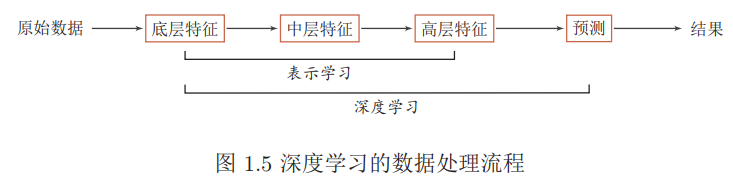

深度学习是将原始的数据特征通过多步的特征转换得到一种特征表示，并进一步输入到预测函数得到最终结果。和“浅层学习”不同，深度学习需要解决的关键问题是贡献度分配问题Credit Assignment Problem即一个系统中不同的组件或其参数对最终系统输出结果的贡献或影响。

神经网络和深度学习并不等价。深度学习可以采用神经网络模型，也可以采用其它模型。但是由于神经网络模型可以比较容易地解决贡献度分配问题，因此神经网络模型成为深度学习中主要采用的模型。

传统机器学习方法需要将一个任务的输入和输出之间人为地切割成很多子模块或多个阶段，每个子模块分开学习。这种学习方式有两个问题：一是每一个模块都需要单独优化，并且其优化目标和任务总体目标并不能保证一致。二是错误传播，即前一步的错误会对后续的模型造成很大的影响。**端到端学习**，也称端到端训练，是指在学习过程中不进行分模块或分阶段进行训练，直接优化任务的总体目标。

#### 本文架构

## 2. 基础模型

### 2.1. 前馈神经网络

假设一个**神经元**接受$d$个输入$x_1, x_2, · · · , x_d$，令向量$x = [x_1; x_2; · · · ; x_d]$来表示这组输入，并用净输入$z ∈ R$表示一个神经元所获得的输入 净输入也叫净活性值。 信号$x$$的加权和，
$$
\begin{aligned} z &=\sum_{i=1}^{d} w_{i} x_{i}+b \\ &=\mathbf{w}^{\mathrm{T}} \mathbf{x}+b \end{aligned}
$$
其中$w = [w_1; w_2; · · · ; w_d] ∈ R^d$是d维的权重向量，$b ∈ R$是偏置。净输入$z$在经过一个非线性函数$f(·)$后，得到神经元的活性值$a=f(z)$

#### 激活函数

激活函数需要具备以下几点性质：连续并可导允许少数点上不可导的非线性函数。可导的激活函数可以直接利用数值优化的方法来学习网络参数。激活函数及其导函数要尽可能的简单，有利于提高网络计算效率。激活函数的导函数的值域要在一个合适的区间内，不能太大也不能太小，否则会影响训练的效率和稳定性。

对于函数$f(x)$，若$x → −∞$时，其导数$f′(x) → 0$，则称其为左饱和。若$x → +∞$时，其导数$f′(x) → 0$，则称其为右饱和。当同时满足左、右饱和时，就称为两端饱和。

##### $\text{maxout}$单元

$\text{maxout}$也就做$\text{maxout}$网络。单元的输入是上一层神经元的全部原始输入，是一个向量$\mathbf{x} = [x_1; x_2; · · · , x_d]$,每个$maxout$单元有$K$个权重向量$w_k ∈ R^d$和偏置$b_k (1 ≤ k ≤ K)$。对于输入$x$，可以得到K 个净输入$z_k, 1 ≤ k ≤ K$。$ z_k = w_k^Tx+b_K$，其中$w_k = [w_{k,1}, · · · , w_{k,d}]^T$ 为第k 个权重向量。$Maxout$单元的非线性函数定义为
$$
\operatorname{maxout}(\mathbf{x})=\max _{k \in[1, K]}\left(z_{k}\right)
$$

#### 网络结构

前馈网络中各个神经元按接受信息的先后分为不同的组。每一组可以看作一个神经层。每一层中的神经元接受前一层神经元的输出，并输出到下一层神经元。整个网络中的信息是朝一个方向传播，没有反向的信息传播，可以用一个有向无环路图表示。反馈网络中神经元不但可以接收其它神经元的信号，也可以接收自己的反馈信号。和前馈网络相比，反馈网络中的神经元具有记忆功能，在不同的时刻具有不同的状态。反馈神经网络中的信息传播可以是单向或双向传递，因此可用一个有向循环图或无向图来表示。图网络是定义在图结构数据上的神经网络 。图中每个节点都一个或一组神经元构成。节点之间的连接可以是有向的，也可以是无向的。每个节点可以收到来自相邻节点或自身的信息。

#### 反向传播算法

多层前馈神经网络可以看作是一个非线性复合函数$φ : R^d → R^{d′}$，将输入$x ∈ R^d $映射到输出$φ(x) ∈ R^{d′}$。因此，多层前馈神经网络也可以看成是一种特征转换方法，其输出$φ(x)$作为分类器的输入进行分类。给定一个训练样本$ (\mathbf{x}, y)$，先利用多层前馈神经网络将$\mathbf{x} $映射到$φ(x)$，然后再将$φ(x)$输入到分类器$g(·)$。
$$
\hat{y}=g(\varphi(\mathbf{x}), \theta)
$$
对第$l$ 层中的参数$W^{(l)}$ 和$b^{(l)}$ 计算偏导数
$$
\begin{aligned} \frac{\partial \mathcal{L}(\mathbf{y}, \hat{\mathbf{y}})}{\partial W_{i j}^{(l)}} &=\left(\frac{\partial \mathbf{z}^{(l)}}{\partial W_{i j}^{(l)}}\right)^{\mathrm{T}} \frac{\partial \mathcal{L}(\mathbf{y}, \hat{\mathbf{y}})}{\partial \mathbf{z}^{(l)}} \\ \frac{\partial \mathcal{L}(\mathbf{y}, \hat{\mathbf{y}})}{\partial \mathbf{b}^{(l)}} &=\left(\frac{\partial \mathbf{z}^{(l)}}{\partial \mathbf{b}^{(l)}}\right)^{\mathrm{T}} \frac{\partial \mathcal{L}(\mathbf{y}, \hat{\mathbf{y}})}{\partial \mathbf{z}^{(l)}} \end{aligned}
$$
计算偏导数$\frac{\partial \mathbf{z}^{(l)}}{\partial W_{i j}^{(l)}}$
$$
\begin{aligned}\frac{\partial \mathbf{z}^{(l)}}{\partial W_{i j}^{(l)}}&=\frac{\partial\left(W^{(l)} \mathbf{a}^{(l-1)}+\mathbf{b}^{(l)}\right)}{\partial W_{i j}^{(l)}}\\
&\triangleq \mathbb{I}_{i}\left(a_{j}^{(l-1)}\right)
\end{aligned}
$$

计算误差项$\frac{\partial \mathcal{L}(\mathbf{y}, \hat{\mathbf{y}})}{\partial \mathbf{z}^{(l)}}$
$$
\delta^{(l)}=\frac{\partial \mathcal{L}(\mathbf{y}, \hat{\mathbf{y}})}{\partial \mathbf{z}^{(l)}} \in \mathbb{R}^{(l)}
$$

$$
\begin{aligned} \delta^{(l)} & \triangleq \frac{\partial \mathcal{L}(\mathbf{y}, \hat{\mathbf{y}})}{\partial \mathbf{z}^{(l)}} \\ &=\frac{\partial \mathbf{a}^{(l)}}{\partial \mathbf{z}^{(l)}} \cdot \frac{\partial \mathbf{z}^{(l+1)}}{\partial \mathbf{a}^{(l)}} \cdot \frac{\partial \mathcal{L}(\mathbf{y}, \hat{\mathbf{y}})}{\partial \mathbf{z}^{(l+1)}} \\ &=\operatorname{diag}\left(f_{l}^{\prime}\left(\mathbf{z}^{(l)}\right)\right) \cdot\left(W^{(l+1)}\right)^{T} \cdot \delta^{(l+1)}\\&={f_{l}^{\prime}\left(\mathbf{z}^{(l)}\right) \odot\left(\left(W^{(l+1)}\right)^{\mathrm{T}} \delta^{(l+1)}\right)} \end{aligned}
$$

$$
\frac{\partial \mathcal{L}(\mathbf{y}, \hat{\mathbf{y}})}{\partial W_{i j}^{(l)}}=\mathbb{I}_{i}\left(a_{j}^{(l-1)}\right)^{\mathrm{T}} \delta^{(l)}=\delta_{i}^{(l)} a_{j}^{(l-1)}
$$

$$
\frac{\partial \mathcal{L}(\mathbf{y}, \hat{\mathbf{y}})}{\partial W^{(l)}}=\delta^{(l)}\left(\mathbf{a}^{(l-1)}\right)^{\mathrm{T}}
$$

$$
\frac{\partial \mathcal{L}(\mathbf{y}, \hat{\mathbf{y}})}{\partial \mathbf{b}^{(l)}}=\delta^{(l)}
$$

神经网络的参数学习比线性模型要更加困难，主要原因有两点：非凸优化问题和梯度消失问题。

### 卷积神经网络

卷积神经网络是一种具有局部连接、权重共享等特性的深层前馈神经网络。

局部特征最重要是需要满足**可重复性**：同一场景在不同视角（几何变形）下，特征能保持自身的稳定（也就是不变性：令$f$为特征提取函数，$t$为某种几何变换，对于图像$x$，应有 $f(t(x))=f(x)$）

全连接前馈网络来处理图像时，会存在以下两个问题：参数过多、局部不变性特征：自然图像中的物体都具有局部不变性特征，比如在尺度缩放、平移、旋转等操作不影响其语义信息。(全连接前馈网络很难提取这些局部不变特征，一般需要进行数据增强来提高性能)。

目前的卷积神经网络一般是由卷积层、汇聚层和全连接层交叉堆叠而成的前馈神经网络，使用反向传播算法进行训练。卷积神经网络有三个结构上的特性：**局部连接，权重共享以及汇聚**。这些特性使得卷积神经网络具有一定程度上的平移、缩放和旋转不变性

#### 卷积

假设滤波器长度为$m$，它和一个信号序列$x_1, x_2, · · · $的卷积为
$$
y_{t}=\sum_{k=1}^{m} w_{k} \cdot x_{t-k+1}
$$
**二维卷积**也经常用在图像处理中。因为图像为一个两维结构，所以需要将一维卷积进行扩展。给定一个图像$X ∈ R^{M×N}$，和滤波器$W ∈ R^{m×n}$，一般$m << M, n << N$，其卷积为
$$
y_{i j}=\sum_{u=1}^{m} \sum_{v=1}^{n} w_{u v} \cdot x_{i-u+1, j-v+1}
$$

卷积的主要功能是在一个图像或某种特征上滑动一个卷积核即滤波器，通过卷积操作得到一组新的特征。在计算卷积的过程中，需要进行卷积核翻转。在具体实现上，一般会以互相关操作来代替卷积，从而会减少一些不必要的操作或开销。互相关是一个衡量两个序列相关性的函数，通常是用滑动窗口的点积计算来实现。给定一个图像$X ∈ R^{M×N}$和卷积核$W ∈ R^{m×n}$，它们的互相关为
$$
y_{i j}=\sum_{u=1}^{m} \sum_{v=1}^{n} w_{u v} \cdot x_{i+u-1, j+v-1}
$$
也可以记为：$Y=W \otimes X$

为了实现上的方便起见，我们用互相关来代替卷积。互相关和卷积的区别在于卷积核仅仅是否进行翻转。因此互相关也可以称为不翻转卷积。 

在卷积的标准定义基础上，还可以引入滤波器的滑动步长和零填充来增加卷积的多样性，可以更灵活地进行特征抽取。

窄卷积：步长$s = 1$，两端不补零$p = 0$，卷积后输出长度为$n − m + 1$。
宽卷积：步长$s = 1$，两端补零$p = m − 1$，卷积后输出长度$n + m − 1$。
等宽卷积：步长$s = 1$，两端补零$p = (m −1)/2$，卷积后输出长度$n$。

根据卷积的定义，卷积层有两个很重要的性质:

**局部连接**在卷积层（假设是第$l $层）中的每一个神经元都只和下一层（第$l − 1$层）中某个局部窗口内的神经元相连，构成一个局部连接网络。

**权重共享**作为参数的滤波器$w^{(l)}$ 对于第$l$层的所有的神经元都是相同的。

##### 卷积的数学性质

$$
W \tilde{\otimes} X \triangleq W \otimes \tilde{X}
$$

其中为$\tilde{\otimes} $宽卷积操作。宽卷积具有交换性，即
$$
W \tilde{\otimes} X=X \tilde{\otimes} W
$$

###### 导数

假设$Y=W \otimes X$，其中$X \in \mathbb{R}^{M \times N}, W \in \mathbb{R}^{m \times n}, Y \in \mathbb{R}^{(M-m+1) \times(N-n+1)}$，函数$f(Y ) ∈ R$为一个标量函数，则
$$
\begin{aligned} \frac{\partial f(Y)}{\partial w_{u v}} &=\sum_{i=1}^{M-m+1 N-n+1} \frac{\partial y_{i j}}{\partial w_{u v}} \frac{\partial f(Y)}{\partial y_{i j}} \\ &=\sum_{i=1}^{M-m+1} \sum_{j=1}^{N-n+1} x_{i+u-1, j+v-1} \frac{\partial f(Y)}{\partial y_{i j}} \\ &=\sum_{i=1}^{M-m+1} \sum_{j=1}^{N-n+1} \frac{\partial f(Y)}{\partial y_{i j}} x_{u+i-1, v+j-1} \end{aligned}
$$

$$
\frac{\partial f(Y)}{\partial W}=\frac{\partial f(Y)}{\partial Y} \otimes X
$$

$$
\begin{aligned} \frac{\partial f(Y)}{\partial x_{s t}} &=\sum_{i=1}^{M-m+1} \sum_{j=1}^{N-n+1} \frac{\partial y_{i j}}{\partial x_{s t}} \frac{\partial f(Y)}{\partial y_{i j}} \\ &=\sum_{i=1}^{M-m+1} \sum_{j=1}^{N-n+1} w_{s-i+1, t-j+1} \frac{\partial f(Y)}{\partial y_{i j}} \end{aligned}
$$

其中当$(s − i + 1) < 1$，或$(s − i + 1) > m$，或$(t − j + 1) < 1$，或$(t − j + 1) > n$
时，$w_{s−i+1,t−j+1} = 0$。即相当于对W 进行了$p = (M − m, N − n)$的零填充。
$$
\begin{aligned} \frac{\partial f(Y)}{\partial X} &=\operatorname{rot} 180\left(\frac{\partial f(Y)}{\partial Y}\right) \tilde{\otimes} W \\ &=\operatorname{rot} 180(W) \tilde{\otimes} \frac{\partial f(Y)}{\partial Y} \end{aligned}
$$
其中$rot180(·)$表示旋转$180$度。

#### 卷积层

输入特征映射组：$X ∈ R^{M×N×D}$为三维张量，其中每个切片矩阵$X^d ∈ R^{M×N}$为一个输入特征映射，$1 ≤ d ≤ D$
 输出特征映射组：$Y ∈ R^{M′×N′×P}$为三维张量，其中每个切片矩阵$Y^p ∈R^{M′×N′}$ 为一个输出特征映射，$1 ≤ p ≤ P$；
卷积核：$W ∈ R^{m×n×D×P}$为四维张量，其中每个切片矩阵$W_{p,d}∈ R^{m×n}$为一个两维卷积核，$1 ≤ d ≤ D, 1 ≤ p ≤ P$。

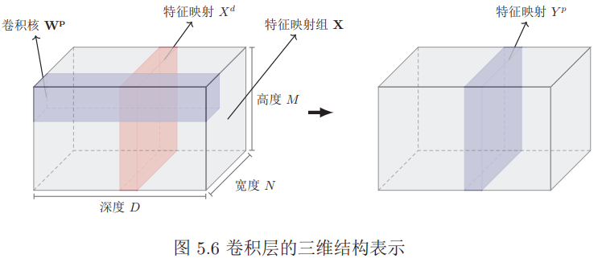
$$
\begin{aligned} Z^{p} &=\mathbf{W}^{p} \otimes \mathbf{X}+b^{p}=\sum_{d=1}^{D} W^{p, d} \otimes X^{d}+b^{p} \\ Y^{p} &=f\left(Z^{p}\right) \end{aligned}
$$
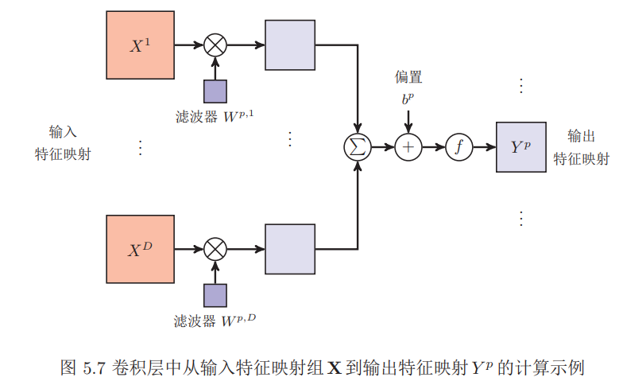

#### 池化层

其作用是进行特征选择，降低特征数量，并从而减少参数数量。

假设汇聚层的输入特征映射组为$X ∈ R^{M×N×D}$，对于其中每一个特征映射$X^d$，将其划分为很多区域$R^d{m,n}, 1 ≤ m ≤ M′, 1 ≤ n ≤ N′$，这些区域可以重叠，也可以不重叠。汇聚 (Pooling) 是指对每个区域进行下采样得到一个值，作为这个区域的概括。

最大汇聚：$Y_{m, n}^{d}=\max _{i \in R_{m, n}^{d}} x_{i}$；平均汇聚：$Y_{m, n}^{d}=\frac{1}{\left|R_{m, n}^{d}\right|} \sum_{i \in R_{m, n}^{d}} x_{i}$

#### 参数学习

在全连接前馈神经网络中，梯度主要通过每一层的误差项$δ$进行反向传播，并进一步计算每层参数的梯度。

不失一般性，对第$l$层为卷积层，第$l − 1 $层的输入特征映射为 $X^{(l−1)} ∈R^{M×N×D}$，通过卷积计算得到第$l $层的特征映射净输入$Z
^{(l)} ∈ R^{M′×N′×P}$。第$l$层的第$p(1 ≤ p ≤ P)$个特征映射净输入。
$$
Z^{(l, p)}=\sum_{d=1}^{D} W^{(l, p, d)} \otimes X^{(l-1, d)}+b^{(l, p)}
$$
其中$W^{(l,p,d)}$ 和$b^{(l,p)}$ 为卷积核以及偏置。第$l$层中共有$P × D $个卷积核和$P $个偏置，可以分别使用链式法则来计算其梯度。
$$
\begin{aligned} \frac{\partial \mathcal{L}(Y, \hat{Y})}{\partial W^{(l, p, d)}} &=\frac{\partial \mathcal{L}(Y, \hat{Y})}{\partial Z^{(l, p)}} \otimes X^{(l-1, d)} \\ &=\delta^{(l, p)} \otimes X^{(l-1, d)} \end{aligned}
$$
其中$\delta^{(l, p)}=\frac{\partial \mathcal{L}(Y, \hat{Y})}{\partial Z^{(l, p)}}$为损失函数关于第$l$层的第$p$个特征映射的净输入$Z^{(l,p)}$的偏导数。

同理可得，损失函数关于第$l$层的第$p$个偏置$b^{(l,p)}$的偏导数为
$$
\frac{\partial \mathcal{L}(Y, \hat{Y})}{\partial b^{(l, p)}}=\sum_{i, j}\left[\delta^{(l, p)}\right]_{i, j}
$$

##### 误差项计算

汇聚层当第$l + 1$层为汇聚层时，因为汇聚层是下采样操作，$l + 1$层的每个神经元的误差项 $δ $对应于第 $l $层的相应特征映射的一个区域。$l $层的第$ p $个特征映射中的每个神经元都有一条边和$ l + 1 $层的第$ p$ 个特征映射中的一个神经元相连。根据链式法则，第$l $层的一个特征映射的误差项$δ^{(l,p)}$，只需要将$l + 1$层对应特征映射的误差项$δ^{(l+1,p)}$ 进行上采样操作（和第$l $层的大小一样），再和$l$ 层特征映射的激活值偏导数逐元素相乘，就得到了$^{δ(l,p)}$。

第$l $层的第$p$个特征映射的误差项$^{δ(l,p)}$的具体推导过程如下
$$
\begin{aligned} \delta^{(l, p)} & \triangleq \frac{\partial \mathcal{L}(Y, \hat{Y})}{\partial Z^{(l, p)}} \\ &=\frac{\partial X^{(l, p)}}{\partial Z^{(l, p)}} \cdot \frac{\partial Z^{(l+1, p)}}{\partial X^{(l+1, p)}} \cdot \frac{\partial \mathcal{L}(Y, \hat{Y})}{\partial Z^{(l+1, p)}} \\ &=f_{l}^{\prime}\left(Z^{(l, p)}\right) \odot \mathbf{u p}\left(\delta^{(l+1, p)}\right) \end{aligned}
$$
其中$f′_l(·)$为第$l$层使用的激活函数导数，$\mathbf{up}$为上采样函数，与汇 聚层中使用的下采样操作刚好相反。如果下采样是最大汇聚，误差项 $^{δ(l+1,p)}$中每个值会直接传递到上一层对应区域中的最大值所对应的神经元，该区域中其它神经元的误差项的都设为0。如果下采样是平均汇聚，误差项$^{δ(l+1,p)}$中每个值会被平均分配到上一层对应区域中的所有神经元上。

卷积层当$l + 1$层为卷积层时，假设特征映射净输入$Z^{(l+1)} ∈ R^{M′×N′×P}$，其中第$p(1 ≤ p ≤ P)$个特征映射净输入
$$
Z^{(l+1, p)}=\sum_{d=1}^{D} W^{(l+1, p, d)} \otimes X^{(l, d)}+b^{(l+1, p)}
$$
其中$W^{(l+1,p,d)}$ 和$b^{(l+1,p)}$ 为第$l+1$层的卷积核以及偏置。第$l+1$层中共有$P ×D$个卷积核和$P$ 个偏置。

第$l $层的第$d$个特征映射的误差项$^{δ(l,d)}$ 的具体推导过程如下:
$$
\begin{aligned} \delta^{(l, d)} & \triangleq \frac{\partial \mathcal{L}(Y, \hat{Y})}{\partial Z^{(l, d)}} \\ &=\frac{\partial X^{(l, d)}}{\partial Z^{(l, d)}} \cdot \frac{\partial \mathcal{L}(Y, \hat{Y})}{\partial X^{(l, d)}} \\ &=f_{l}^{\prime}\left(Z^{(l)}\right) \odot \sum_{p=1}^{P}\left(\operatorname{rot} 180\left(W^{(l+1, p, d)}\right) \tilde{\otimes} \frac{\partial \mathcal{L}(Y, \hat{Y})}{\partial Z^{(l+1, p)}}\right) \\ &=f_{l}^{\prime}\left(Z^{(l)}\right) \odot \sum_{p=1}^{P}\left(\operatorname{rot} 180\left(W^{(l+1, p, d)}\right) \tilde{\otimes} \delta^{(l+1, p)}\right) \end{aligned}
$$
**连接表**卷积层的每一个输出特征映射都依赖于所有输入特征映射，相当于卷积层的输入和输出特征映射之间是全连接的关系。实际上，这种全连接关系不是必须的。我们可以让每一个输出特征映射都依赖于少数几个输入特征映射。定义一个连接表$T$ 来描述输入和输出特征映射之间的连接关系。如果第$p$个输出特征映射依赖于第$d$个输入特征映射，则$T_{p,d} = 1$，否则为$0$。
$$
Y^{p}=f\left(\sum_{d,\\T_{p, d}=1} W^{p, d} \otimes X^{d}+b^{p}\right)
$$
其中$T$ 为$P × D$ 大小的连接表。假设连接表$T $的非零个数为$K$，每个滤波器的大小为$m × n$，那么共需要$K × m × n + P $参数

### 循环神经网络

虽然简单循环网络理论上可以建立长时间间隔的状态之间的依赖关系，但是由于梯度爆炸或消失问题，实际上只能学习到短期的依赖关系。这样，如果$t$时刻的输出$y_t$依赖于$t−k$时刻的输入$x_{t−k}$，当间隔$k$比较大时，简单神经网络很难建模这种长距离的依赖关系，称为长期依赖问题。

#### 给网络增加记忆力

##### 延时神经网络

延时神经网络是在前馈网络中的非输出层都添加一个延时器，记录最近几次神经元的输出。在第$t$个时刻，第$l + 1$层神经元和第$l$层神经元的最近$p$次输出相关，即
$$
\mathbf{h}_{t}^{(l+1)}=f\left(\mathbf{h}_{t}^{(l)}, \mathbf{h}_{t-1}^{(l)}, \cdots, \mathbf{h}_{t-p+1}^{(l)}\right)
$$

##### 有外部输入的非线性自回归模型

在每个时刻$t$都有一个外部输入$x_t$，产生一个输出$y_t$。$NARX$通过一个延时器记录最近几次的外部输入和输出，第$t$个时刻的输出$y_t$ 为
$$
\mathbf{y}_{t}=f\left(\mathbf{x}_{t}, \mathbf{x}_{t-1}, \cdots, \mathbf{x}_{t-p}, \mathbf{y}_{t-1}, \mathbf{y}_{t-2}, \cdots, \mathbf{y}_{t-q}\right)
$$
其中$f(·)$表示非线性函数，可以是一个前馈网络，$p$和$q $为超参数。

##### 循环神经网络

给定一个输入序列$x_{1:T} = (x_1, x_2, . . . , x_t, . . . , x_T )$，循环神经网络通过下面公式更新带反馈边的隐藏层的活性值$h_t$：
$$
\mathbf{h}_{t}=f\left(\mathbf{h}_{t-1}, \mathbf{x}_{t}\right)
$$
其中$h_0 = 0$，$f(·)$为一个非线性函数，也可以是一个前馈网络。

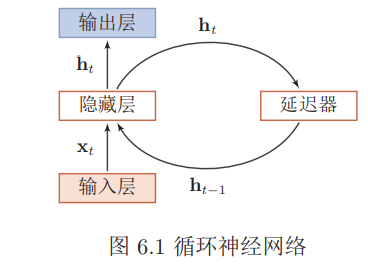

#### 简单循环神经网络

假设在时刻$t$时，网络的输入为$x_t$，隐藏层状态为$h_t$ 不仅和当前时刻的输入$x_t$ 相关，也和上一个时刻的隐藏层状态$h_{t−1}$ 相关。
$$
\begin{aligned} \mathbf{z}_{t} &=U \mathbf{h}_{t-1}+W \mathbf{x}_{t}+\mathbf{b} \\ \mathbf{h}_{t} &=f\left(\mathbf{z}_{t}\right) \end{aligned}
$$
其中$z_t$ 为隐藏层的净输入，$f(·)$是非线性激活函数，通常为$logistic$函数或$tanh$函数，$U $为状态-状态权重矩阵，$W $为状态-输入权重矩阵,$b$为偏置。

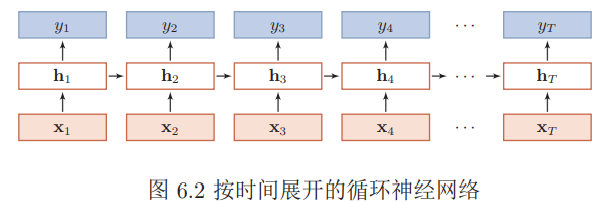

##### 序列到类别模式

序列到类别模式主要用于序列数据的分类问题：输入为序列，输出为类别。

假设一个样本$x_{1:T} = (x_1, x_2, . . . , x_t, . . . , x_T )$为一个长度为$T $的序列，输出为一个类别 $y ∈ \{1, · · · , C\}$。我们可以将样本$ x $按不同时刻输入到循环神经网络中，并得到不同时刻的隐藏状态$h_1, · · · , h_T$。我们可以将$h_T $看作整个序列的最终表示（或特征），并输入给分类器$g(·)$进行分类
$$
\hat{y}=g\left(\mathbf{h}_{T}\right)
$$
其中$g(·)$可以是简单的线性分类器（比如Logistic回归）或复杂的分类器（比如多层前馈神经网络）

除了将最后时刻的状态作为序列表示之外，我们还可以对整个序列的所有状态进行平均，并用这个平均状态来作为整个序列的表示
$$
\hat{y}=g\left(\frac{1}{T} \sum_{t=1}^{T} \mathbf{h}_{t}\right)
$$

##### 同步的序列到序列模式

同步的序列到序列模式主要用于序列标注任务，即每一时刻都有输入和输出，输入序列和输出序列的长度相同。

在同步的序列到序列模式中，输入为一个长度为T 的序列$x_{1:T} = (x_1, x_2, . . . , x_t, . . . , x_T )$，输出为序列$y_{1:T} = (y_1, y_2, . . . , y_t, . . . , y_T )$。样本$x$按不同时刻输入到循环神经网络中，并得到不同时刻的隐状态$h_1, · · · , h_T$。每个时刻的隐状态$h_t$ 代表了当前时刻和历史的信息，并输入给分类器$g(·)$得到当前时刻的标签$\hat{y}_t$。
$$
\hat{y}_{t}=g\left(\mathbf{h}_{t}\right), \quad \forall t \in[1, T]
$$

##### 异步的序列到序列模式

异步的序列到序列模式也称为编码器-解码器（Encoder-Decoder）模型，即输入序列和输出序列不需要有严格的对应关系，也不需要保持相同的长度。

在异步的序列到序列模式中，输入为一个长度为$T $的序列$x_{1:T} = (x_1, x_2, . . . , x_T )$，输出为长度为$M$ 的序列$y_{1:M} = (y_1, y_2, . . . , y_M )$。经常通过先编码后解码的方式来实现。先将样本$x$按不同时刻输入到一个循环神经网络（编码器）中，并得到其编码$h_T$。然后在使用另一个循环神经网络（解码器）中，得到输出序列$\hat{y}_{1:M}$。为了建立输出序列之间的依赖关系，在解码器中通常使用非线性的自回归模型。
$$
\mathbf{h}_{t}=f_{1}\left(\mathbf{h}_{t-1}, \mathbf{x}_{t}\right), \quad \forall t \in[1, T]\\

\begin{aligned} \mathbf{h}_{T+t} &=f_{2}\left(\mathbf{h}_{T+t-1}, \hat{\mathbf{y}}_{t-1}\right), \quad \forall t \in[1, M] \\ \hat{y}_{t} &=g\left(\mathbf{h}_{T+t}\right), \quad \forall t \in[1, M] \end{aligned}
$$
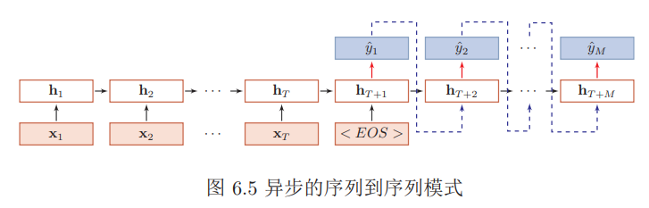

#### 参数学习

###### BPTT

给定一个训练样本$(x, y)$，其中$x_{1:T} = (x_1, · · · , x_T )$为长度是$T $的输入序列，$y_{1:T} = (y_1, · · · , y_T )$是长度为$T $的标签序列。即在每个时刻$t$，都有一个监督信息$y_t$，我们定义时刻$t$的损失函数为
$$
\mathcal{L}_{t}=\mathcal{L}\left(y_{t}, g\left(\mathbf{h}_{t}\right)\right)
$$
其中$g(h_t)$为第t时刻的输出，$\mathcal{L}$为可微分的损失函数。那么整个序列上损失函数为
$$
\mathcal{L}=\sum_{t=1}^{T} \mathcal{L}_{t}
$$
整个序列的损失函数$\mathcal{L}$关于参数$U$的梯度为
$$
\frac{\partial \mathcal{L}}{\partial U}=\sum_{t=1}^{T} \frac{\partial \mathcal{L}_{t}}{\partial U}
$$
计算偏导数$\frac{\partial \mathcal{L}_{t}}{\partial U}$

因为参数 $U$ 和隐藏层在每个时刻$ k(1 ≤ k ≤ t)$ 的净输入 $z_k = Uh_{k−1} +Wx_k + b$有关，因此第$t$时刻损失的损失函数$\mathcal{L}_t$ 关于参数$U_{ij}$ 的梯度为：
$$
\begin{aligned} \frac{\partial \mathcal{L}_{t}}{\partial U_{i j}} &=\sum_{k=1}^{t} \operatorname{tr}\left(\left(\frac{\partial \mathcal{L}_{t}}{\partial \mathbf{z}_{k}}\right)^{\mathrm{T}} \frac{\partial^{+} \mathbf{z}_{k}}{\partial U_{i j}}\right) \\ &=\sum_{k=1}^{t}\left(\frac{\partial^{+} \mathbf{z}_{k}}{\partial U_{i j}}\right)^{\mathrm{T}} \frac{\partial \mathcal{L}_{t}}{\partial \mathbf{z}_{k}} \end{aligned}
$$
其中 $\frac{\partial^{+} \mathbf{z}_{k}}{\partial U_{i j}}$ 表示“直接”偏导数，即公式$z_k = Uh_{k−1} +Wx_k + b$中保持$h_{k−1}$ 不变，对$U_{ij }$进行求偏导数，得到
$$
\frac{\partial^{+} \mathbf{z}_{k}}{\partial U_{i j}}=\left[ \begin{array}{c}{0} \\ {\vdots} \\ {\left[\mathrm{h}_{k-1}\right]_{j}} \\ {\vdots} \\ {0}\end{array}\right] \triangleq \mathbb{I}_{i}\left(\left[\mathbf{h}_{k-1}\right]_{j}\right)
$$
其中$[h_{k−1}]_j$ 为第$k − 1$时刻隐状态的第$j $维；$\mathbb{I}_{i}(x)$除了第$i$行值为$x$外，其余都为$0$的向量。

定义$\delta_{t, k} =\frac{\partial \mathcal{L}_{t}}{\partial \mathbf{z}_{k}} $为第 $t $时刻的损失对第$ k $时刻隐藏神经层的净输入$ z_k$ 的导数，则
$$
\begin{aligned} \delta_{t, k} &=\frac{\partial \mathcal{L}_{t}}{\partial \mathbf{z}_{k}} \\ &=\frac{\partial \mathbf{h}_{k}}{\partial \mathbf{z}_{k}} \frac{\partial \mathbf{z}_{k+1}}{\partial \mathbf{h}_{k}} \frac{\partial \mathcal{L}_{t}}{\partial \mathbf{z}_{k+1}} \\ &=\operatorname{diag}\left(f^{\prime}\left(\mathbf{z}_{k}\right)\right) U^{\mathrm{T}} \delta_{t, k+1} \end{aligned}
$$

$$
\frac{\partial \mathcal{L}_{t}}{\partial U_{i j}}=\sum_{k=1}^{t}\left[\delta_{t, k}\right]_{i}\left[\mathbf{h}_{k-1}\right]_{j}
$$
将上式写成矩阵形式为
$$
\frac{\partial \mathcal{L}_{t}}{\partial U}=\sum_{k=1}^{t} \delta_{t, k} \mathbf{h}_{k-1}^{\mathrm{T}}
$$
同理可得，$\mathcal{L}$关于权重$W$ 和偏置$b$的梯度为
$$
\begin{aligned} \frac{\partial \mathcal{L}}{\partial W} &=\sum_{t=1}^{T} \sum_{k=1}^{t} \delta_{t, k} \mathbf{x}_{k}^{\mathrm{T}} \\ \frac{\partial \mathcal{L}}{\partial \mathbf{b}} &=\sum_{t=1}^{T} \sum_{k=1}^{t} \delta_{t, k} \end{aligned}
$$

###### RTRL

假设循环网络网络中第$t + 1$时刻的状态$h_{t+1}$ 为
$$
\mathbf{h}_{t+1}=f\left(\mathbf{z}_{t+1}\right)=f\left(U \mathbf{h}_{t}+W \mathbf{x}_{t+1}+\mathbf{b}\right)
$$
其关于参数$U_{ij}$ 的偏导数为
$$
\begin{aligned} \frac{\partial \mathbf{h}_{t+1}}{\partial U_{i j}} &=\frac{\partial \mathbf{h}_{t+1}}{\partial \mathbf{z}_{t+1}}\left(\frac{\partial^{+} \mathbf{z}_{t+1}}{\partial U_{i j}}+U \frac{\partial \mathbf{h}_{t}}{\partial U_{i j}}\right) \\ &=\operatorname{diag}\left(f^{\prime}\left(\mathbf{z}_{t+1}\right)\right)\left(\mathbb{I}_{i}\left(\mathbf{h}_{t}\right]_{j}\right)+U \frac{\partial \mathbf{h}_{t}}{\partial U_{i j}} ) \\ &=f^{\prime}\left(\mathbf{z}_{t+1}\right) \odot\left(\mathbb{I}_{i}\left(\left[\mathbf{h}_{t}\right]_{j}\right)+U \frac{\partial \mathbf{h}_{t}}{\partial U_{i j}}\right) \end{aligned}
$$
$RTRL$算法从第$1$个时刻开始，除了计算循环神经网络的隐状态之外，还利用上面公式依次前向计算偏导数 $\frac{\partial \mathbf{h}_{1}}{\partial U_{i j}}, \frac{\partial \mathbf{h}_{2}}{\partial U_{i j}}, \frac{\partial \mathbf{h}_{3}}{\partial U_{i j}},\cdot{...}$

假设第$t$个时刻存在一个监督信息，其损失函数为$\mathcal{L}_t$，就可以同时计算损失函数对$U_{ij}$ 的偏导数
$$
\frac{\partial \mathcal{L}_{t}}{\partial U_{i j}}=\left(\frac{\partial \mathbf{h}_{t}}{\partial U_{i j}}\right)^{\mathrm{T}} \frac{\partial \mathcal{L}_{t}}{\partial \mathbf{h}_{t}}
$$
这样在第t时刻，可以实时地计算损失$\mathcal{L}_t$ 关于参数$U $的梯度，并更新参数。参数$W$ 和$b$的梯度也可以同样按上述方法实时计算。

两种算法比较$ RTRL$算法和$BPTT$算法都是基于梯度下降的算法，分别通过前向模式和反向模式应用链式法则来计算梯度。在循环神经网络中，一般网络输出维度远低于输入维度，因此$BPTT$算法的计算量会更小，但是$BPTT$算法需要保存所有时刻的中间梯度，空间复杂度较高。$RTRL$算法不需要梯度回传，因此非常适合用于需要在线学习或无限序列的任务中

#### 改进方案

梯度爆炸一般而言，循环网络的梯度爆炸问题比较容易解决，一般通过权重衰减或梯度截断来避免。 权重衰减是通过给参数增加 $ℓ_1$ 或$ ℓ_2$ 范数的正则化项来限制参数的取值范围，从而使得$γ ≤ 1$。梯度截断是另一种有效的启发式方法，当梯度的模大于一定阈值时，就将它截断成为一个较小的数。梯度消失是循环网络的主要问题。除了使用一些优化技巧外，更有效的方式就是改变模型，比如让$U = I$，同时使用$f′(z_i) = 1$，即

$$
\mathbf{h}_{t}=\mathbf{h}_{t-1}+g\left(\mathbf{x}_{t} ; \theta\right)
$$
其中$g(·)$是一个非线性函数，$θ $为参数。

这种改变也丢失了神经元在反馈边上的非线性激活的性质，因此也降低了模型的表示能力。为了避免这个缺点，我们可以采用一个更加有效的改进策略：
$$
\mathbf{h}_{t}=\mathbf{h}_{t-1}+g\left(\mathbf{x}_{t}, \mathbf{h}_{t-1} ; \theta\right)
$$
但这种改进依然有一个问题就是记忆容量。随着$\mathbf{h}_t$ 不断累积存储新的输入信息，会发生饱和现象。假设$g(·)$为$logistic$函数，则随着时间$t$的增长，$\mathbf{h}_t$ 会变得越来越大，从而导致$\mathbf{h}$变得饱和。也就是说，隐状态$\mathbf{h}_t$ 可以存储的信息是有限的，随着记忆单元存储的内容越来越多，其丢失的信息也越来越多。为了解决容量问题，可以有两种方法。一种是增加一些额外的存储单元：外部记忆；另一种是进行选择性的遗忘，同时也进行有选择的更新。

##### 基于门控技术的循环神经网络

###### LSTM

$LSTM$网络引入一个新的内部状态$\mathbf{c}_t$ 专门进行线性的循环信息传递，同时（非线性）输出信息给隐藏层的外部状态$\mathbf{h}_t$ 。
$$
\begin{aligned} \mathbf{c}_{t} &=\mathbf{f}_{t} \odot \mathbf{c}_{t-1}+\mathbf{i}_{t} \odot \tilde{\mathbf{c}}_{t} \\ \mathbf{h}_{t} &=\mathbf{o}_{t} \odot \tanh \left(\mathbf{c}_{t}\right) \end{aligned}
$$
其中$\mathbf{f}_t$ ，$\mathbf{i}_t$ 和$\mathbf{o}_t$  为三个门来控制信息传递的路径；$⊙$为向量元素乘积；$\mathbf{c}_{t-1}$  为上一时刻的记忆单元；$\tilde{\mathbf{c}}_{t}$是通过非线性函数得到候选状态，
$$
\tilde{\mathbf{c}}_{t}=\tanh \left(W_{c} \mathbf{x}_{t}+U_{c} \mathbf{h}_{t-1}+\mathbf{b}_{c}\right)
$$
遗忘门$\mathbf{f}_t$控制上一个时刻的内部状态$\mathbf{c}_{t-1}$ 需要遗忘多少信息。
输入门$\mathbf{i}_t$ 控制当前时刻的候选状态$\tilde{\mathbf{c}}_{t}$有多少信息需要保存。
输出门$\mathbf{o}_t$控制当前时刻的内部状态$\mathbf{c}_t$有多少信息需要输出给外部状态$\mathbf{h}_{t}$。

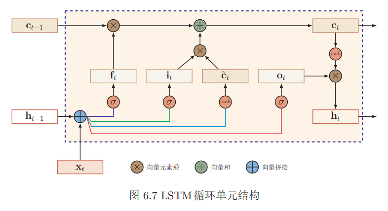
$$
\left[ \begin{array}{c}{\tilde{\mathbf{c}}_{t}} \\ {\mathbf{o}_{t}} \\ {\mathbf{i}_{t}} \\ {\mathbf{f}_{t}}\end{array}\right]=\left[ \begin{array}{c}{\tanh } \\ {\sigma} \\ {\sigma} \\ {\sigma}\end{array}\right]\left(W \left[ \begin{array}{c}{\mathbf{x}_{t}} \\ {\mathbf{h}_{t-1}}\end{array}\right]+\mathbf{b}\right)\\

\begin{aligned} \mathbf{c}_{t} &=\mathbf{f}_{t} \odot \mathbf{c}_{t-1}+\mathbf{i}_{t} \odot \tilde{\mathbf{c}}_{t} \\ \mathbf{h}_{t} &=\mathbf{o}_{t} \odot \tanh \left(\mathbf{c}_{t}\right) \end{aligned}
$$
$\mathbf{peephole}$ 连接 另外一种变体是三个门不但依赖于输入$\mathbf{x}_t$和上一时刻的隐状态$\mathbf{h}_{t−1}$，也依赖于上一个时刻的记忆单元$\mathbf{c}_{t−1}$。
$$
\begin{aligned} \mathbf{i}_{t} &=\sigma\left(W_{i} \mathbf{x}_{t}+U_{i} \mathbf{h}_{t-1}+V_{i} \mathbf{c}_{t-1}+\mathbf{b}_{i}\right) \\ \mathbf{f}_{t} &=\sigma\left(W_{f} \mathbf{x}_{t}+U_{f} \mathbf{h}_{t-1}+V_{f} \mathbf{c}_{t-1}+\mathbf{b}_{f}\right) \\ \mathbf{o}_{t} &=\sigma\left(W_{o} \mathbf{x}_{t}+U_{o} \mathbf{h}_{t-1}+V_{o} \mathbf{c}_{t}+\mathbf{b}_{o}\right) \end{aligned}
$$
其中$V_i$，$V_f$ 和$V_o$ 为对角阵形式的参数。

耦合输入门和遗忘门$LSTM$网络中的输入门和遗忘门有些互补关系，因此同时用两个门比较冗余。为了减少$LSTM$网络的计算复杂度，将这两门合并为一个门。令
$$
\mathbf{f}_{t}=\mathbf{1}-\mathbf{i}_{t}
$$

###### GRU

当前时刻的候选状态$\tilde{\mathbf{h}}_{t}$ 为
$$
\tilde{\mathbf{h}}_{t}=\tanh \left(W_{h} \mathbf{x}_{t}+U_{h}\left(\mathbf{r}_{t} \odot \mathbf{h}_{t-1}\right)+\mathbf{b}_{h}\right)
$$
其中$\mathbf{r}_t ∈ [0, 1]$为重置门（reset gate），用来控制候选状态$\tilde{\mathbf{h}}_{t}$的计算是否依赖上一时刻的状态$\mathbf{h}_{t-1}$。
$$
\mathbf{r}_{t}=\sigma\left(W_{r} \mathbf{x}_{t}+U_{r} \mathbf{h}_{t-1}+\mathbf{b}_{r}\right)
$$
GRU网络的隐状态$\mathbf{h}_t$更新方式为
$$
\mathbf{h}_{t}=\mathbf{z}_{t} \odot \mathbf{h}_{t-1}+\left(\underline{1}-\mathbf{z}_{t}\right) \odot \tilde{\mathbf{h}}_{t}
$$
其中$\mathbf{z} ∈ [0, 1]$为更新门（update gate），用来控制当前状态需要从历史状态中保留多少信息（不经过非线性变换），以及需要从候选状态中接受多少新信息。
$$
\mathbf{z}_{t}=\sigma\left(\mathbf{W}_{z} \mathbf{x}_{t}+\mathbf{U}_{z} \mathbf{h}_{t-1}+\mathbf{b}_{z}\right)
$$

#### 深层循环神经网络

##### 堆叠循环神经网络

第$l$ 层网络的输入是第$l − 1$层网络的输出。我们定义$h^{(l)}_t$ 为在时刻$t$时第$l $层的隐状态
$$
\mathbf{h}_{t}^{(l)}=f\left(U^{(l)} \mathbf{h}_{t-1}^{(l)}+W^{(l)} \mathbf{h}_{t}^{(l-1)}+\mathbf{b}^{(l)}\right)
$$
其中$U^{(l)}$，$W^{(l)}$和$b^{{l}}$为权重矩阵和偏置向量，$h^{(0)}_t = \mathbf{x}_t$。

##### 双向循环神经网络

假设第$1$层按时间顺序，第$2$层按时间逆序，在时刻$t$时的隐状态定义为$h^{(1)}_t$和$h^{(2)}_t$ ，则
$$
\begin{aligned} \mathbf{h}_{t}^{(1)} &=f\left(U^{(1)} \mathbf{h}_{t-1}^{(1)}+W^{(1)} \mathbf{x}_{t}+\mathbf{b}^{(1)}\right) \\ \mathbf{h}_{t}^{(2)} &=f\left(U^{(2)} \mathbf{h}_{t+1}^{(2)}+W^{(2)} \mathbf{x}_{t}+\mathbf{b}^{(2)}\right) \\ \mathbf{h}_{t} &=\mathbf{h}_{t}^{(1)} \oplus \mathbf{h}_{t}^{(2)} \end{aligned}
$$
其中$⊕$为向量拼接操作。

##### 递归神经网络

##### 图网络

对于一个任意的图结构$G(\mathcal{V}, \mathcal{E})$，其中$\mathcal{V}$表示节点集合，$\mathcal{E}$表示边集合。每条边表示两个节点之间的依赖关系。节点之间的连接可以是有向的，也可以是无向的。图中每个节点 $v$ 都用一组神经元来表示其状态$ h^{(v)}$，初始状态可以为
节点 $v $的输入特征$ x^{(v)}$。每个节点可以收到来自相邻节点的消息，并更新自己的状态。
$$
\mathbf{m}_{t}^{(v)}=\sum_{u \in N(v)} f\left(\mathbf{h}_{t-1}^{(v)}, \mathbf{h}_{t-1}^{(u)}, \mathbf{e}^{(u, v)}\right)\\

\mathbf{h}_{t}^{(v)}=g\left(\mathbf{h}_{t-1}^{(v)}, \mathbf{m}_{t}^{(v)}\right)
$$
其中$N(v)$表示节点$v $的邻居，$m^{(v)}_t$ 表示在第$t$时刻节点$v $收到的信息，$e^{(u,v)}$ 为边$e^{(u,v)}$上的特征。

### 网络优化和正则化

#### 网络优化

网络优化的难点：网络结构多样性、高维变量的非凸优化。

低维空间的非凸优化问题主要是存在一些局部最优点。基于梯度下降的优化方法会陷入局部最优点，因此低维空间非凸优化的主要难点是如何选择初始化参数和逃离局部最优点。深层神经网络的参数非常多，其参数学习是在非常
高维空间中的非凸优化问题，其挑战和在低维空间的非凸优化问题有所不同。鞍点 在高维空间中，非凸优化的难点并不在于如何逃离局部最优点，而是如何逃离鞍点。鞍点的梯度是0，但是在一些维度上是最高点，在另一些维度上是最低点。平坦底部 深层神经网络的参数非常多，并且有一定的冗余性，这导致每单个参数对最终损失的影响都比较小，这导致了损失函数在局部最优点附近是一个平坦的区域，称为平坦最小值。并且在非常大的神经网络中，大部分的局部最小值是相等的。虽然神经网络有一定概率收敛于比较差的局部最小值，但随着网络规模增加，网络陷入局部最小值的概率大大降低。

##### 优化算法

深层神经网络的参数学习主要是通过梯度下降方法来寻找一组可以最小化结构风险的参数。梯度下降法可以分为：批量梯度下降、随机梯度下降以及小批量梯度下降三种形式。除了在收敛效果和效率上的差异，这三种方法都存在一些共同的问题，如：如何初始化参数；预处理数据；如何选择合适的学习率，避免陷入局部最优等。

###### 学习率衰减

逆时衰减： $\alpha_{t}=\alpha_{0} \frac{1}{1+\beta \times t}$

指数衰减：$\alpha_{t}=\alpha_{0} \beta^{t}$

自然指数衰减：$\alpha_{t}=\alpha_{0} \exp (-\beta \times t)$

除了这些固定衰减率的调整学习率方法外，还有些自适应地调整学习率的方法。

使用梯度下降来更新参数$\theta_{t} \leftarrow \theta_{t-1}-\alpha \mathbf{g}_{t}$每次迭代时参数更新的差值$∆θ_t $定义为$\Delta \theta_{t} \triangleq \theta_{t}-\theta_{t-1}$

$AdaGrad$ 算法
$$
G_{t}=\sum_{\tau=1}^{t} \mathbf{g}_{\tau} \odot \mathbf{g}_{\tau}\\
\Delta \theta_{t}=-\frac{\alpha}{\sqrt{G_{t}+\epsilon}} \odot \mathbf{g}_{t}
$$
其中$⊙$为按元素乘积，$g_τ ∈ R^{|θ|}$ 是第$τ$ 次迭代时的梯度。其中$α$是初始的学习率，$ϵ$是为了保持数值稳定性而设置的非常小的常数，这里的开平方、除、加运算都是按元素进行的操作。

$RMSprop$ 算法
$$
\begin{aligned} G_{t} &=\beta G_{t-1}+(1-\beta) \mathbf{g}_{t} \odot \mathbf{g}_{t} \\ &=(1-\beta) \sum_{\tau=1}^{t} \beta^{t-\tau} \mathbf{g}_{\tau} \odot \mathbf{g}_{\tau}\\
&\Delta \theta_{t}=-\frac{\alpha}{\sqrt{G_{t}+\epsilon}} \odot \mathrm{g}_{t}
\\\end{aligned}
$$
$AdaDelta$ 算法
$$
\Delta X_{t-1}^{2}=\beta_{1} \Delta X_{t-2}^{2}+\left(1-\beta_{1}\right) \Delta \theta_{t-1} \odot \Delta \theta_{t-1}\\
\Delta \theta_{t}=-\frac{\sqrt{\Delta X_{t-1}^{2}+\epsilon}}{\sqrt{G_{t}+\epsilon}} \mathbf{g}_{t}
$$

其中$G_t $的计算方式和$RMSprop$算法一样。

###### 梯度方向优化

动量法
$$
\Delta \theta_{t}=\rho \Delta \theta_{t-1}-\alpha \mathbf{g}_{t}
$$
其中$ρ$为动量因子，通常设为$0.9$，$α$为学习率。

$Nesterov$ 加速梯度
$$
\Delta \theta_{t}=\rho \Delta \theta_{t-1}-\alpha \mathfrak{g}_{t}\left(\theta_{t-1}+\rho \Delta \theta_{t-1}\right)
$$
其中$\mathfrak{g}_{t}\left(\theta_{t-1}+\rho \Delta \theta_{t-1}\right)$表示损失函数在点$\hat{\theta}=\theta_{t-1}+\rho \Delta \theta_{t-1}$的偏导数。

$Adam$算法
$$
\begin{array}{c}{M_{t}=\beta_{1} M_{t-1}+\left(1-\beta_{1}\right) \mathbf{g}_{t}} \\ {G_{t}=\beta_{2} G_{t-1}+\left(1-\beta_{2}\right) \mathbf{g}_{t} \odot \mathbf{g}_{t}}\\
\hat{M}_{t} =\frac{M_{t}}{1-\beta_{1}^{t}} \\ \hat{G}_{t} =\frac{G_{t}}{1-\beta_{2}^{t}}\\
\Delta \theta_{t}=-\frac{\alpha}{\sqrt{\hat{G}_{t}+\epsilon}} \hat{M}_{t}\end{array}
$$
其中$β_1$ 和$β_2$ 分别为两个移动平均的衰减率，通常取值为$β_1 = 0.9$, $β_2 = 0.99$，学习率$α$通常设为$0.001$。

###### 梯度截断

在基于梯度下降的优化过程中，如果梯度突然增大，用大的梯度进行更新参数，反而会导致其远离最优点。为了避免这种情况，当梯度的模大于一定阈值时，就对梯度进行截断，称为梯度截断。

按值截断 在第$t$次迭代时，梯度为$g_t$，给定一个区间$[a, b]$，如果一个参数的梯度小于$a$时，就将其设为$a$；如果大于$b$时，就将其设为$b$。
$$
\mathbf{g}_{t}=\max \left(\min \left(\mathbf{g}_{t}, b\right), a\right)
$$
按模截断按模截断是将梯度的模截断到一个给定的截断阈值b。

如果$∥g_t∥_2 ≤ b$，保持$g_t$ 不变。如果$∥g_t∥_2 > b$，令
$$
\mathbf{g}_{t}=\frac{b}{\left\|\mathbf{g}_{t}\right\|} \mathbf{g}_{t}
$$

##### 参数初始化

$\text{Gaussian}$分布初始化：$\mathcal{N}\left(0, \sqrt{\frac{2}{n_{i n}+n_{o u t}}}\right).$

均匀分布初始化：均匀分布初始化是在一个给定的区间$[−r, r] $内采用均匀分布来初始化参数。超参数$r$的设置也可以按神经元的连接数量进行自适应的调整。$r=\sqrt{\frac{6}{n^{l-1}+n^{l}}}$

##### 数据预处理

除了参数初始化之外，不同特征取值范围差异比较大时还会梯度下降法的搜索效率。取值范围不同会造成在大多数位置上的梯度方向并不是最优的搜索方向。当使用梯度下降法寻求最优解时，会导致需要很多次迭代才能收敛。如果我们把数据归一化为取值范围相同，大部分位置的梯度方向近似于最优搜索方向。这样，在梯度下降求解时，每一步梯度的方向都基本指向最小值，训练效率会大大提高。

###### 归一化

缩放归一化、标准归一化 、白化。白化是一种重要的预处理方法，用来降低输入数据特征之间的冗余性。输入数据经过白化处理后，特征之间相关性较低，并且所有特征具有相同的方差。($PCA$)

##### 逐层归一化

在深层神经网络中，中间某一层的输入是其之前的神经层的输出。因此，其之前的神经层的参数变化会导致其输入的分布发生较大的差异。在使用随机梯度下降来训练网络时，每次参数更新都会导致网络中间每一层的输入的分布发生改变。越深的层，其输入的分布会改变得越明显。如果某个神经层的输入分布发生了改变，那么其参数需要重新学习，这种现象叫做内部协变量偏移--Internal Covariate Shift.          协变量是一个统计学概念，是可能影响预测结果的统计变量。

###### 批量归一化

对于一个深层神经网络，令第$l$层的净输入为$\mathbf{z}^{(l)}$，神经元的输出为$\mathbf{a}^{(l)}$，即
$$
\mathbf{a}^{(l)}=f\left(\mathbf{z}^{(l)}\right)=f\left(W \mathbf{a}^{(l-1)}+\mathbf{b}\right)
$$
给定一个包含$ K $个样本的小批量样本集合，第 $l $层神经元的净输入$\mathbf{z}^{(1, l)},\cdots,\mathbf{z}^{K,l}$的均值和方差为
$$
\begin{aligned} \mu_{\mathcal{B}} &=\frac{1}{K} \sum_{k=1}^{K} \mathbf{z}^{(k, l)} \\ \sigma_{\mathcal{B}}^{2} &=\frac{1}{K} \sum_{k=1}^{K}\left(\mathbf{z}^{(k, l)}-\mu_{\mathcal{B}}\right) \odot\left(\mathbf{z}^{(k, l)}-\mu_{\mathcal{B}}\right) \\
\hat{\mathbf{z}}^{(l)} &=\frac{\mathbf{z}^{(l)}-\mu_{\mathcal{B}}}{\sqrt{\sigma_{\mathcal{B}}^{2}+\epsilon}} \odot \gamma+\beta \\ & \triangleq \mathrm{B} \mathrm{N}_{\gamma, \beta}\left(\mathbf{z}^{(l)}\right)
\end{aligned}
$$
批量归一化操作可以看作是一个特殊的神经层，加在每一层非线性激活函数之前，即
$$
\mathbf{a}^{(l)}=f\left(\mathrm{BN}_{\gamma, \beta}\left(\mathbf{z}^{(l)}\right)\right)=f\left(\mathrm{BN}_{\gamma, \beta}\left(W \mathbf{a}^{(l-1)}\right)\right)
$$

###### 层归一化

对于一个深层神经网络中，令第$l $层神经的净输入为$\mathbf{z}^{(l)}$，其均值和方差为
$$
\begin{aligned} \mu^{(l)} &=\frac{1}{n^{l}} \sum_{i=1}^{n^{l}} z_{i}^{(l)} \\ \sigma^{(l)^{2}} &=\frac{1}{n^{l}} \sum_{k=1}^{n^{l}}\left(z_{i}^{(l)}-\mu^{(l)}\right)^{2} \end{aligned}
$$
其中$n^l$ 为第$l$ 层神经元的数量。

层归一化定义为
$$
\begin{aligned} \hat{\mathbf{z}}^{(l)} &=\frac{\mathbf{z}^{(l)}-\mu^{(l)}}{\sqrt{\sigma^{(l)^{2}}+\epsilon}} \odot \gamma+\beta \\ & \triangleq \operatorname{LN}_{\gamma, \beta}\left(\mathbf{z}^{(l)}\right) \end{aligned}
$$

层归一化和批量归一化整体上是十分类似的，差别在于归一化的方法不同。对于$K $个样本的一个小批量集合$Z^{(l)} = [\mathbf{z}^{(1,l)}; · · · ;\mathbf{z}^{(K,l)}]$，层归一化是对矩阵$Z^{(l) }$对每一列进行归一化，而批量归一化是对每一行进行归一化。

###### 局部响应归一化

假设一个卷积层的输出特征映射$ Y ∈ R^{M′×N′×P}$ 为三维张量，其中每个切片矩阵$Y^p ∈ R^{M′×N′}$ 为一个输出特征映射，$1 ≤ p ≤ P$。
$$
\begin{aligned} \hat{Y}^{p} &=Y^{p} /\left(k+\alpha \sum_{j=\max \left(1, p-\frac{n}{2}\right)}^{\min \left(P, p+\frac{n}{2}\right)}\left(Y^{j}\right)^{2}\right)^{\beta} \\ & \triangleq \operatorname{LRN}_{n, k, \alpha, \beta}\left(Y^{p}\right) \end{aligned}
$$
其中除和幂运算都是按元素运算，$n, k, α, β $为超参，$n$为局部归一化的特征窗口大小。

##### 超参数优化

网络结构，包括神经元之间的连接关系、层数、每层的神经元数量、激活函数的类型等；优化参数，包括优化方法、学习率、小批量的样本数量等；

#### 正则化

$ℓ1 $和 $ℓ2 $正则化、 权重衰减：$\theta_{t} \leftarrow(1-w) \theta_{t-1}-\alpha \mathbf{g}_{t}$、 提前停止、$Dropout$、

在数据量有限的情况下，可以通过数据增强（Data Augmentation）来增加数据量，提高模型鲁棒性，避免过拟合。图像数据的增强主要是通过算法对图像进行转变，引入噪声等方法来增加数据的多样性。增强的方法主要有几种：旋转、翻转、缩放、平移、加噪声。

标签平滑：一种改善的正则化方法是标签平滑（Label Smoothing），即在输出标签中添加噪声来
避免模型过拟合。

一个样本$x$的标签一般用$onehot$向量表示$$
\mathbf{y}=[0, \cdots, 0,1,0, \cdots, 0]^{\mathrm{T}}$$
平滑后的标签为$\tilde{\mathbf{y}}=\left[\frac{\epsilon}{K-1}, \cdots, \frac{\epsilon}{K-1}, 1-\epsilon, \frac{\epsilon}{K-1}, \cdots, \frac{\epsilon}{K-1}\right]^{\mathrm{T}}$

###  注意力机制与外部记忆

#### 注意力机制

注意力机制是解决信息超载问题的主要手段的一种资源分配方案，将计算资源分配给更重要的任务。注意力一般分为两种：一种是自上而下的有意识的注意力，称为聚焦式注意力。聚焦式注意力是指有预定目的、依赖任务的、主动有意识地聚焦于某一对象的注意力；另一种是自下而上的无意识的注意力，称为基于显著性的注意力。基于显著性的注意力是由外界刺激驱动的注意，不需要主动干预，也和任务无关。

**注意力机制的计算**可以分为两步：一是在所有输入信息上计算注意力分布，二是根据注意力分布来计算输入信息的加权平均。

用$X = [x_1, · · · , x_N ]$表示$N $个输入信息，为了节省计算资源，不需要将所有的$N$个输入信息都输入到神经网络进行计算，只需要从$X$ 中选择一些和任务相关的信息输入给神经网络。给定一个和任务相关的查询向量$\mathbf{q}$，我们用注意力变量 $z ∈ [1, N]$来表示被选择信息的索引位置。我们采用一种==“软性”==的信息选择机制，首先计算在给定$\mathbf{q} $和$X $下，选择第$i$个输入信息的概率$α_i$
$$
\begin{aligned} \alpha_{i} &=p(z=i | X, \mathbf{q}) \\ &=\operatorname{softmax}\left(s\left(\mathbf{x}_{i}, \mathbf{q}\right)\right) \\ &=\frac{\exp \left(s\left(\mathbf{x}_{i}, \mathbf{q}\right)\right)}{\sum_{j=1}^{N} \exp \left(s\left(\mathbf{x}_{j}, \mathbf{q}\right)\right)} \end{aligned}
$$
其中$α_i$ 称为注意力分布，$s(\mathbf{x}_i, \mathbf{q})$为注意力打分函数。

加性模型：$s\left(\mathbf{x}_{i}, \mathbf{q}\right)=\mathbf{v}^{\mathrm{T}} \tanh \left(W \mathbf{x}_{i}+U \mathbf{q}\right)$

点积模型：$s\left(\mathbf{x}_{i}, \mathbf{q}\right)=\mathbf{x}_{i}^{\mathrm{T}} \mathbf{q}$

缩放点积模型：$s\left(\mathbf{x}_{i}, \mathbf{q}\right)=\frac{\mathbf{x}_{i}^{\mathrm{T}} \mathbf{q}}{\sqrt{d}}$

双线性模型：$s\left(\mathbf{x}_{i}, \mathbf{q}\right)=\mathbf{x}_{i}^{\mathrm{T}} W \mathbf{q}$

其中$W, U, \mathbf{v}$为可学习的网络参数，$d$为输入信息的维度。

加权平均注意力分布$α_i$可以解释为在给定任务相关的查询$\mathbf{q}$时，第$i$个信息受关注的程度。我们采用一种“软性”的信息选择机制对输入信息进行汇总。
$$
\begin{aligned} \operatorname{att}(X, \mathbf{q}) &=\sum_{i=1}^{N} \alpha_{i} \mathbf{x}_{i} \\ &=\mathbb{E}_{z \sim p(z | X, \mathbf{q})}[\mathbf{x}] \end{aligned}
$$
硬性注意力有两种实现方式：
$$
\operatorname{att}(X, \mathbf{q})=\mathbf{x}_{j}
$$
其中$j$为概率最大的输入信息的下标，即$j=\arg _{i=1}^{N} \max \alpha_{i}$

另一种硬性注意力可以通过在注意力分布式上随机采样的方式实现。硬性注意力的一个缺点是基于最大采样或随机采样的方式来选择信息。因此最终的损失函数与注意力分布之间的函数关系不可导，因此无法使用在反向传播算法进行训练。

**键值对注意力**我们可以用键值对格式来表示输入信息，其中“键”用来计算注意力分布$α_i$，“值”用来计算聚合信息。

用$(K, V ) = [(\mathbf{k}_1, \mathbf{v}_1), · · · ,(\mathbf{k}_N , \mathbf{v}_N )]$表示$N$ 个输入信息，给定任务相关的查询向量$\mathbf{q} $时，注意力函数为
$$
\begin{aligned} \operatorname{att}((K, V), \mathbf{q}) &=\sum_{i=1}^{N} \alpha_{i} \mathbf{v}_{i} \\ &=\sum_{i=1}^{N} \frac{\exp \left(s\left(\mathbf{k}_{i}, \mathbf{q}\right)\right)}{\sum_{j} \exp \left(s\left(\mathbf{k}_{j}, \mathbf{q}\right)\right)} \mathbf{v}_{i} \end{aligned}
$$
其中$s(\mathbf{k}_i, \mathbf{q})$为打分函数。

多头注意力是利用多个查询$Q = [q_1, · · · , q_M]$，来平行地计算从输入信息中选取多个信息。每个注意力关注输入信息的不同部分。
$$
\operatorname{att}((K, V), Q)=\operatorname{att}\left((K, V), \mathbf{q}_{1}\right) \oplus \cdots \oplus \operatorname{att}\left((K, V), \mathbf{q}_{M}\right)
$$
其中$⊕$表示向量拼接。

##### 注意力机制的应用

###### 指针网络

指针网络（Pointer Network）是一种序列到序列模型，输入是长度为n的向量序列$X=\mathbf{x}_{1}, \cdots, \mathbf{x}_{n}$，输出是下标序列$c_{1 : m}=c_{1}, c_{2}, \cdots, c_{m}，c_{i} \in[1, n], \forall i$。和一般的序列到序列任务不同，这里的输出序列是输入序列的下标。

条件概率$p(c_{1:m}|\mathbf{x}_{1:n})$可以写为
$$
\begin{aligned} p\left(c_{1 : m} | \mathbf{x}_{1 : n}\right) &=\prod_{i=1}^{m} p\left(c_{i} | c_{1 : i-1}, \mathbf{x}_{1 : n}\right) \\ & \approx \prod_{i=1}^{m} p\left(c_{i} | \mathbf{x}_{c_{1}}, \cdots, \mathbf{x}_{c_{i-1}}, \mathbf{x}_{1 : n}\right) \end{aligned}
$$
其中条件概率 $p\left(c_{i} | \mathbf{x}_{c_{1}}, \cdots, \mathbf{x}_{c_{i-1}}, \mathbf{x}_{1 : n}\right)$ 可以通过注意力分布来计算。假设用一个循环神经网络对$\mathbf{x}_{c_{1}}, \cdots, \mathbf{x}_{c_{i-1}}, \mathbf{x}_{1 : n}$ 进行编码得到向量$\mathbf{h}_i$则
$$
p\left(c_{i} | c_{1 : i-1}, \mathbf{x}_{1 : n}\right)=\operatorname{softmax}\left(s_{i, j}\right)
$$
其中$s_{i,j}$ 为在解码过程的第i步时，每个输入向量的未归一化的注意力分布，
$$
s_{i, j}=\mathbf{v}^{\mathrm{T}} \tanh \left(W \mathbf{x}_{j}+U \mathbf{h}_{i}\right), \forall j \in[1, n]
$$
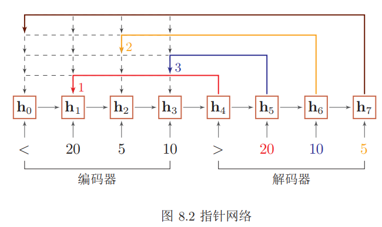

###### 自注意力模型

当使用神经网络来处理一个变长的向量序列时，我们通常可以使用卷积网络或循环网络进行编码来得到一个相同长度的输出向量序列。

基于卷积或循环网络的序列编码都是可以看做是一种局部的编码方式，只建模了输入信息的局部依赖关系。如果要建立输入序列之间的长距离依赖关系，可以使用以下两种方法：一种方法是增加网络的层数，通过一个深层网络来获取远距离的信息交互另一种方法是使用全连接网络。全连接网络是一种非常直接的建模远距离依赖的模型，但是无法处理变长的输入序列。不同的输入长度，其连接权重的大小也是不同的。这时我们就可以利用注意力机制来“动态”地生成不同连接的权重，这就是自注意力模型

假设输入**序列**为$X = [\mathbf{x}_1, · · · , \mathbf{x}_N ] ∈ R^{d_1×N}$，输出序列为$H = [\mathbf{h}_1, · · · , \mathbf{h}_N ] ∈R^{d_2×N}$，首先我们可以通过线性变换得到三组向量序列
$$
\begin{aligned} Q &=W_{Q} X \in \mathbb{R}^{d_{3} \times N} \\ K &=W_{K} X \in \mathbb{R}^{d_{3} \times N} \\ V &=W_{V} X \in \mathbb{R}^{d_{2} \times N} \end{aligned}
$$

其中$Q, K, V$分别为查询向量序列，键向量序列和值向量序列，$W_Q, W_K, W_V$ 分别为可学习的参数矩阵。

可以得到输出向量$\mathbf{h}_i$，
$$
\begin{aligned} \mathbf{h}_{i} &=\operatorname{att}\left((K, V), \mathbf{q}_{i}\right) \\ &=\sum_{j=1}^{N} \alpha_{i j} \mathbf{v}_{j} \\ &=\sum_{j=1}^{N} \operatorname{softmax}\left(s\left(\mathbf{k}_{j}, \mathbf{q}_{i}\right)\right) \mathbf{v}_{j} \end{aligned}
$$
其中$i, j ∈ [1, N]$为输出和输入向量序列的位置，连接权重$α_{ij}$由注意力机制动态生成。

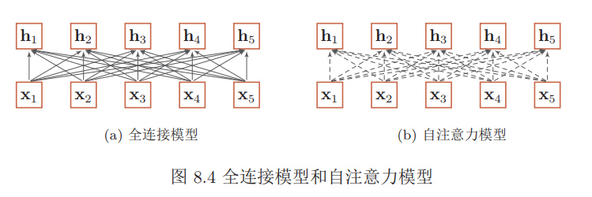

其中实线表示为可学习的权重，虚线表示动态生成的权重。自注意力模型可以作为神经网络中的一层来使用，既可以用来替换卷积层和循环层，也可以和它们一起交替使使用。

#### 外部记忆

##### 结构化的外部记忆

为了增强网络容量，一种比较简单的方式是引入结构化的记忆模块，将和任务相关的短期记忆保存在记忆中，需要时再进行读取。这种装备外部记忆的神经网络也称为记忆网络或记忆增强神经网络

主网络 $C$：也称为控制器，负责信息处理，并与外界的交互--接受外界的输入信息并产生输出到外界。主网络还同时通过读写模块和外部记忆进行交互。

外部记忆单元$M$：外部记忆单元用来存储信息，一般可以分为很多记忆片段，这些记忆片段按照一定的结构来进行组织。记忆片段一般用向量来表示，外部记忆单元可以用一组向量$\mathbf{m}_{1:N} = [\mathbf{m}_1, · · · , \mathbf{m}_N ]$来表示。这些向量的组织方式可以是集合、树、栈或队列等。大部分信息存储于外部记忆中，不需要全时参与主网络的运算。

读取模块$R$：根据主网络生成的查询向量$\mathbf{q}_r$，从外部记忆单元中读取相应的信息$\mathbf{r} = R(\mathbf{m}_{1:N} , \mathbf{q}_r)$。

写入模块$W$：根据主网络生成的查询向量$\mathbf{q}_w$ 和要写入的信息$\mathbf{a}$ 来更新外部记忆$\mathbf{m}_{1:N} = W(\mathbf{m}_{1:N} , \mathbf{q}_w, \mathbf{a})$。

这种结构化的外部记忆是带有地址的，即每个记忆片段都可以按地址读取和写入。要实现类似于人脑神经网络的联想记忆能力，就需要按内容寻址的方式进行定位，然后进行读取或写入操作。按内容寻址通常使用注意力机制来进
行。通过注意力机制可以实现一种“软性”的寻址方式，即计算一个在所有记忆片段上的分布，而不是一个单一的绝对地址。

###### 端到端记忆网络

在端到端记忆网络中，外部记忆单元是只读的。

给定一组需要存储的信息$m_{1:N} = \{m_1, · · · , m_N \}$，首先将转换成两组记忆片段 $A = [\mathbf{a}_1, · · · , \mathbf{a}_N ] $和 $C = [\mathbf{c}_1, · · · , \mathbf{c}_N ]$，分别存放在两个外部记忆单元中，其中$A$用来进行寻址，$C$ 用来进行输出。

主网络根据输入 $\mathbf{x}$ 生成$\mathbf{ q}$，并使用注意力机制来从外部记忆中读取相关信息$\mathbf{r}$
$$
\mathbf{r}=\sum_{i=1}^{N} \operatorname{softmax}\left(\mathbf{a}_{i}^{\mathrm{T}} \mathbf{q}\right) \mathbf{c}_{i}
$$
并产生输出$\mathbf{y}=f(\mathbf{q}+\mathbf{r})$，其中$f(·)$为预测函数。

多跳操作为了实现更新复杂的计算，我们可以让主网络和外部记忆进行多轮交互。在第$k $轮交互中，主网络根据上次从外部记忆中读取的信息$\mathbf{r}^{(k−1)}$，产生新的查询向量
$$
\mathbf{q}^{(k)}=\mathbf{r}^{(k-1)}+\mathbf{q}^{(k-1)}
$$
其中$\mathbf{q}^{(0)}$ 为初始的查询向量，$\mathbf{r}^{(0)} = 0$。
假设第$k$ 轮交互的外部记忆为$A^{(k)} $和$C^{(k)}$，主网络从外部记忆读取信息为
$$
\mathbf{r}^{(k)}=\sum_{i=1}^{N} \operatorname{softmax}\left(\left(\mathbf{a}_{i}^{(k)}\right)^{\mathrm{T}} \mathbf{q}^{(k)}\right) \mathbf{c}_{i}^{(k)}
$$
在$K$ 轮交互后，用$y = f(q^{(K)} +r^{(K)})$进行预测。这种多轮的交互方式也称为多跳（Multi-Hop）操作。多跳操作中的参数一般是共享的。为了简化起见，每轮交互的外部记忆也可以共享使用。

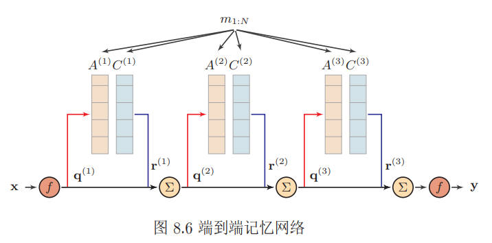

##### 基于神经动力学的联想记忆

联想记忆模型主要是通过神经网络的动态演化来进行联想，有两种应用场景：1）输入的模式和输出的模式在同一空间，这种模型叫做自联想记忆模型。自联想模型可以通过前馈神经网络或者循环神经网络来实现，也经常称为自编码器；2）输入的模式和输出的模式不在同一空间，这种模型叫做异联想记忆模型。从广义上讲，大部分模式识别问题都可以看作是异联想，因此异联想记忆模型可以作为分类器使用。

### 无监督学习

#### 无监督特征学习

无监督特征学习是指从无标注的数据中自动学习有效的数据表示，从而能够帮助后续的机器学习模型更快速地达到更好的性能。无监督特征学习主要方法有主成分分析、稀疏编码、自编码器等。

###### 稀疏编码

在数学上，编码是指给定一组基向量$A = [\mathbf{a}_1, · · · , \mathbf{a}_p]$，将输入样本$\mathbf{x} ∈ R^d$ 表示为这些基向量的线性组合
$$
\begin{aligned} \mathbf{x} &=\sum_{i=1}^{p} z_{i} \mathbf{a}_{i} \\ &=A \mathbf{z} \end{aligned}
$$
其中基向量的系数$ \mathbf{z} = [z_1;· · · ; z_p]$ 称为输入样本 $\mathbf{x}$的编码，基向量$A$也称为字典

编码是对$d$维空间中的样本$\mathbf{x}$找到其在$p$维空间中的表示（或投影），其目标通常是编码的各个维度都是统计独立的，并且可以重构出输入样本。如果$p$个基向量刚好可以支撑$p$维的欧氏空间，则这$p$个基向量是完备的。如果$p$个基向量可以支撑$d$维的欧氏空间，并且$p > d$，则这$p$个基向量是过完备的，冗余的。

给定一组$N $个输入向量$\mathbf{x}^{(1)}, · · · , \mathbf{x}^{(N)}$，其稀疏编码的目标函数定义为
$$
L(A, Z)=\sum_{n=1}^{N}\left(\left\|\mathbf{x}^{(n)}-A \mathbf{z}^{(n)}\right\|^{2}+\eta \rho\left(\mathbf{z}^{(n)}\right)\right)
$$
其中$ρ(·)$是一个稀疏性衡量函数，$η $是一个超参数，用来控制稀疏性的强度。

常用稀疏衡量函数

ℓ1 范数：$\rho(\mathbf{z})=\sum_{i=1}^{p}\left|z_{i}\right|$

对数函数：$\rho(\mathbf{z})=\sum_{i=1}^{p} \log \left(1+z_{i}^{2}\right)$

指数函数：$\rho(\mathbf{z})=\sum_{i=1}^{p}-\exp \left(-z_{i}^{2}\right)$

给定一组$N $个输入向量$\mathbf{x}^{(1)}, · · · , \mathbf{x}^{(N)}$，需要同时学习基向量$A$以及每个输入样本对应的稀疏编码$\mathbf{z}^{(1)}, · · · , \mathbf{z}^{(N)}$。

稀疏编码的训练过程一般用交替优化的方法进行。

固定基向量$A$，对每个输入$\mathbf{x}^{(n)}$，计算其对应的最优编码
$$
\min _{\mathbf{x}^{(n)}}\left\|\mathbf{x}^{(n)}-A \mathbf{z}^{(n)}\right\|^{2}-\eta \rho\left(\mathbf{z}^{(n)}\right), \forall n \in[1, N]
$$
固定上一步得到的编码$\mathbf{z}^{(1)}, · · · , \mathbf{z}^{(N)}$，计算其最优的基向量
$$
\min _{A} \sum_{n=1}^{N}\left(\left\|\mathbf{x}^{(n)}-A \mathbf{z}^{(n)}\right\|^{2}\right)+\lambda \frac{1}{2}\|A\|^{2}
$$
###### 自编码器

假设有一组$d$维的样本$\mathbf{x}^{(n)} ∈ R^d, 1 ≤ n ≤ N$，自编码器将这组数据映射到特征空间得到每个样本的编$\mathbf{z}^{(n)} ∈ R^p, 1 ≤ n ≤ N$，并且希望这组编码可以重构出原来的样本。

自编码器的结构可分为两部分：

编码器：$f : \mathbb{R}^{d} \rightarrow \mathbb{R}^{p}$

解码器：$g : \mathbb{R}^{p} \rightarrow \mathbb{R}^{d}$

自编码器的学习目标是最小化重构错误：
$$
\begin{aligned} \mathcal{L} &=\sum_{n=1}^{N}\left\|\mathbf{x}^{(n)}-g\left(f\left(\mathbf{x}^{(n)}\right)\right)\right\|^{2} \\ &=\sum_{n=1}^{N}\left\|\mathbf{x}^{(n)}-f \circ g\left(\mathbf{x}^{(n)}\right)\right\|^{2} \end{aligned}
$$
自编码器除了可以学习低维编码之外，也学习高维的稀疏编码。假设中间隐藏层$\mathbf{z}$的维度为$p$大于输入样本$\mathbf{x}$的维度$d$，并让$\mathbf{z}$尽量稀疏，这就是稀疏自编码器
$$
\mathcal{L}=\sum_{n=1}^{N} \| \mathbf{x}^{(n)}-\mathbf{x}^{(n)} )\left\|^{2}+\eta \rho\left(\mathbf{z}^{(n)}\right)\right)+\lambda\|W\|^{2}
$$
稀疏性度量函数$ρ(·)$除了上面提到的之外，还可以定义为一组训练样本中每一个神经元激活的频率。给定$N $个训练样本，隐藏层第$j $个神经元平均活性值为$\hat{\rho}_{j}=\frac{1}{N} \sum_{n=1}^{N} z_{j}^{(n)}$ ，$\hat{\rho}_{j}$可以近似地看作是第$j$ 个神经元激活的概率。我们希望$\hat{\rho}_{j}$接近于一个事先给定的值$ρ∗$，可以通过$KL$距离来衡量$\hat{\rho}_{j}$和$ρ∗$ 的差异，即
$$
\mathrm{KL}\left(\rho^{*} \| \hat{\rho}_{j}\right)=\rho^{*} \log \frac{\rho^{*}}{\hat{\rho}_{j}}+\left(1-\rho^{*}\right) \log \frac{1-\rho^{*}}{1-\hat{\rho}_{j}}
$$
稀疏性度量函数定义为
$$
\rho\left(\mathbf{z}^{(n)}\right)=\sum_{j=1}^{p} \mathrm{KL}\left(\rho^{*} \| \hat{\rho}_{j}\right)
$$
对于很多数据来说，仅使用两层神经网络的自编码器还不足以获取一种好的数据表示。为了获取更好的数据表示，我们可以使用更深层的神经网络。深层神经网络作为自编码器提取的数据表示一般会更加抽象，能够更好地捕捉到数据的语义信息。在实践中经常使用逐层堆叠的方式来训练一个深层的自编码器，称为堆叠自编码器。堆叠自编码一般可以采用逐层训练来学习网络参数。

我们使用自编码器是为了得到有效的数据表示，而有效的数据表示除了具有最小重构错误或稀疏性等性质之外，我们还可以要求其具备其它性质，比如对数据部分损坏的鲁棒性。降噪自编码器就是一种通过引入噪声来增加编码鲁棒性的自编码器。对于一个向量$\mathbf{x}$，我们首先根据一个比例$\mu$随机将$\mathbf{x}$的一些维度的值设置为$0$，得到一个被损坏的向量$\tilde{\mathbf{x}}$。然后将被损坏的向量$\tilde{\mathbf{x}}$输入给自编码器得到编码$\mathbf{z}$，并重构出原始的无损输入$\mathbf{x}$。

#### 密度估计

###### 参数密度估计

参数密度估计是根据先验知识假设随机变量服从某种分布，然后通过训练样本来估计分布的参数。令$\mathcal{D}=\left\{\mathbf{x}^{(n)}\right\}_{i=1}^{N}$为从某个未知分布中独立抽取的$N $个训练样本，假设这些样本服从一个概率分布函数$p(\mathbf{x}|θ)$，其对数似然函数为

$$
\log p(\mathcal{D} | \theta)=\sum_{n=1}^{N} \log p\left(\mathbf{x}^{(n)} | \theta\right)
$$
我们要估计一个参数$θ^{ML}$ 来使得
$$
\theta^{M L}=\underset{\theta}{\arg \max } \sum_{n=1}^{N} \log p\left(\mathbf{x}^{(n)} | \theta\right)
$$
在实际应用中，参数密度估计一般存在以下问题：模型选择问题：即如何选择数据分布的密度函数。实际数据的分布往往是非常复杂的，而不是简单的正态分布或多项分布。不可观测变量问题：即我们用来训练的样本只包含部分的可观测变量，还有一些非常关键的变量是无法观测的，这导致我们很难准确估计数据的真实分布。维度灾难问题：即高维数据的参数估计十分困难。随着维度的增加，估计参数所需要的样本数量指数增加。在样本不足时会出现过拟合。

###### 非参数密度估计

非参数密度估计是不假设数据服从某种分布，通过将样本空间划分为不同的区域并估计每个区域的概率来近似数据的概率密度函数。

对于高维空间中的一个随机向量$\mathbf{x}$，假设其服从一个未知分布$p(\mathbf{x})$，则$\mathbf{x}$落入空间中的小区域$\mathcal{R}$的概率为
$$
P=\int_{\mathcal{R}} p(\mathbf{x}) d \mathbf{x}
$$
给定$N$ 个训练样本$\mathcal{D}=\left\{\mathbf{x}^{(n)}\right\}_{i=1}^{N}$落入区域$\mathcal{R}$的样本数量$K $服从二项分布
$$
P_{K}=\left( \begin{array}{c}{N} \\ {K}\end{array}\right) P^{K}(1-P)^{1-K}
$$
其中$\frac{K}{N} $的期望为$E[\frac{K}{N}] = P$，方差为$var(\frac{K}{N}) = \frac{P(1 − P)}{N}$。当$N$非常大时，我们可以近似认为$P \approx \frac{K}{N}$。假设区域$\mathcal{R}$足够小，其内部的概率密度是相同的，则有$P \approx p(\mathbf{x}) V$，其中$V $为区域$\mathcal{R}$的体积。结合上述两个公式，得到$p(\mathbf{x}) \approx \frac{K}{N V}$。实践中非参数密度估计通常使用两种方式：（1）固定区域大小$V$ ，统计落入不同区域的数量，这种方式包括直方图方法和核方法两种。（2）改变区域大小以使得落入每个区域的样本数量为$K$，这种方式称为K近邻方法。

核密度估计，也叫$\text{Parzen}$窗方法，是一种直方图方法的改进。假设$\mathcal{R}$为$d$维空间中的一个以点$\mathbf{x}$为中心的超立方体，并定义核函数
$$
\phi\left(\frac{\mathbf{z}-\mathbf{x}}{h}\right)=\left\{\begin{array}{ll}{1} & {\text { if }\left|z_{i}-x_{i}\right|<\frac{h}{2}, 1 \leq i \leq d} \\ {0} & {\text { else }}\end{array}\right.
$$
来表示一个样本$\mathbf{z}$是否落入该超立方体中，其中$h$为超立方体的边长，也称为核
函数的宽度。给定$N $个训练样本$\mathcal{D}=\left\{\mathbf{x}^{(n)}\right\}_{i=1}^{N}$，落入区域$\mathcal{R}$的样本数量$K$ 为
$$
K=\sum_{n=1}^{N} \phi\left(\frac{\mathrm{x}^{(n)}-\mathrm{x}}{h}\right)
$$
则点$\mathbf{x}$的密度估计为
$$
p(\mathbf{x})=\frac{K}{N h^{d}}=\frac{1}{N h^{d}} \sum_{n=1}^{N} \phi\left(\frac{\mathbf{x}^{(n)}-\mathbf{x}}{h}\right)
$$
###  模型独立的学习方式

#### 自训练和协同训练

监督学习往往需要大量的标注数据，而标注数据的成本比较高，因此如何利用大量的无标注数据来提高监督学习的效果，有十分重要的意义。这种利用少量标注数据和大量无标注数据进行学习的方式称为半监督学习。

自训练是首先使用标注数据来训练一个模型，并使用这个模型来预测无标注样本的标签，把预测置信度比较高的样本及其预测的伪标签加入训练集，然后重新训练新的模型，并不断重复这个过程。

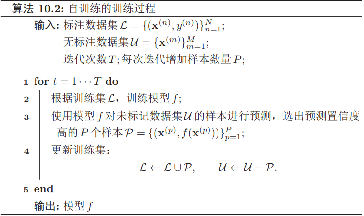

自训练的缺点是无法保证每次加入训练集的样本的伪标签是正确的。如果选择样本的伪标签是错误的，反而会损害模型的预测能力。因此，自训练最关键的步骤是如何设置挑选样本的标准。

协同训练是自训练的一种改进方法，通过两个基于不同视角的分类器来相互促进。很多数据都有相对独立的不同视角。比如互联网上的每个网页都由两种视角组成：文字内容和指向其它网页的链接。假设一个样本$\mathbf{x} = [\mathbf{x}_1, \mathbf{x}_2]$，其中$\mathbf{x}_1 $和$\mathbf{x}_2 $分别表示两种不同视角$V_1 $和$V_2 $的特征，并满足下面两个假设:条件独立性：给定样本标签$y $时，两种特征条件独立$p(\mathbf{x}_1, \mathbf{x}_2|y) = p(\mathbf{x}_1|y)p(\mathbf{x}_2|y)$；充足和冗余性：当数据充分时，每种视角的特征都可以足以单独训练出一个正确的分类器。令$y = g(\mathbf{x})$为需要学习的真实映射函数，$f_1 $和$f_2 $分别为两个视角的分类器，有

$$
\exists f_{1}, f_{2}, \quad \forall \mathbf{x} \in \mathcal{X}, \quad f_{1}\left(\mathbf{x}_{1}\right)=f_{2}\left(\mathbf{x}_{2}\right)=g(\mathbf{x})
$$
首先在训练集上根据不同视角分别训练两个模型$f_1$和$f_2$，然后用$f_1 $和$f_2 $在无标记数据集上进行预测，各选取预测置信度比较高的样本加入训练集，重新训练两个不同视角的模型，并不断重复这个过程。

#### 多任务学习

多任务学习是指同时学习多个相关任务，让这些任务在学习过程中共享知识，利用多个任务之间的相关性来改进模型在每个任务的性能和泛化能力。多任务学习可以看作是一种归纳迁移学习，即通过利用包含在相关任务中的信息作为**归纳偏置**来提高泛化能力。

多任务学习的主要挑战在于如何设计多任务之间的共享机制。目前多任务学习中常见的有共享模式。**硬共享模式**：让不同任务的神经网络模型共同使用一些共享模块一般是低层来提取一些通用特征，然后再针对每个不同的任务设置一些私有模块一般是高层来提取一些任务特定的特征。**软共享模式**：不显式地设置共享模块，但每个任务都可以从其它任务中“窃取”一些信息来提高自己的能力。窃取的方式包括直接复制使用其它任务的隐状态，或使用注意力机制来主动选取有用的信息。**层次共享模式**：一般神经网络中不同层抽取的特征类型不同。底层一般抽取一些低级的局部特征，高层抽取一些高级的抽象语义特征。因此如果多任务学习中不同任务也有级别高低之分，那么一个合理的共享模式是让低级任务在底层输出，高级任务在高层输出。**共享-私有模式**：一个更加分工明确的方式是将共享模块和任务特定私有模块的责任分开。共享模块捕捉一些跨任务的共享特征，而私有模块只捕捉和特定任务相关的特征。最终的表示由共享特征和私有特征共同构成。

假设有$M $个相关任务，第$m$个任务的训练集为$\mathcal{D}_m$，包含$N_m$ 个样本。
$$
\mathcal{D}_{m}=\left\{\left(\mathbf{x}^{(m, n)}, y^{(m, n)}\right)\right\}_{n=1}^{N_{m}}
$$
其中$\mathbf{x}^{(m,n)}$ 和$\mathbf{y}^{(m,n)}$ 表示第$m$个任务中的第$n$个样本以及它的标签。假设这$M $任务对应的模型分别为$f_m(x, θ), 1 ≤ m ≤ M$，多任务学习的联合目标函数为所有任务损失函数的线性加权。
$$
\mathcal{L}(\theta)=\sum_{m=1}^{M} \sum_{n=1}^{N_{m}} \eta_{m} \mathcal{L}_{m}\left(f_{m}\left(x^{(m, n)}, \theta\right), y^{(m, n)}\right)
$$
其中$\mathcal{L}_m(·)$为第$m$个任务的损失函数，$η_m$ 是第$m$个任务的权重，$θ $表示包含了共享模块和私有模块在内的所有参数。

多任务学习的流程可以分为两个阶段：**联合训练阶段**：每次迭代时，随机挑选一个任务，然后从这个任务中随机选择一些训练样本，计算梯度并更新参数；**单任务精调阶段**：基于多任务的学习到的参数，分别在每个单独任务进行精调。其中单任务精调阶段为可选阶段。当多个任务的差异性比较大时，在每个单任务上继续优化参数可以进一步提升模型能力。

多任务学习通常可以获得比单任务学习更好的泛化能力，主要由于以下几个原因：多任务学习在多个任务的数据集上进行训练，比单任务学习的**训练集更大**。由于多个任务之间有一定的相关性，因此多任务学习相当于是一种隐式的数据增强，可以提高模型的泛化能力。多任务学习中的共享模块需要兼顾所有任务，这在一定程度上避免了模型过拟合到单个任务的训练集，可以看作是一种**正则化**。既然一个好的表示通常需要适用于多个不同任务。它会比单任务学习可以获得一个**更好的表示**。在多任务学习中，每个任务都可以**“选择性”利用其他任务中学习到的隐藏特征**，从而提高自身的能力。
#### 迁移学习

假设一个机器学习任务T 的样本空间为$\mathcal{X} × \mathcal{Y}$，其中$\mathcal{X} $为输入空间和$\mathcal{Y} $为输出空间，其概率密度函数为$p(\mathbf{x}, y)$。一个样本空间及其分布可以称为一个领域--Domain：$\mathcal{D} = (X , Y, p(x, y))$。给定两个领域，如果它们的输入空间、输出空间或概率分布中至少一个不同，那么这两个领域就被认为是不同的。从统计学习的观点来看，一个机器学习任务$\mathcal{T} $定义为在一个领域$\mathcal{D}$ 上的条件概率$p(y|\mathbf{x})$的建模问题。

迁移学习是指两个不同领域的知识迁移过程，利用源领域--Source Domain$\mathcal{D}_S$ 中学到的知识用来帮助目标领域--Target Domain$\mathcal{D}_T$ 上的学习任务。源领域的训练样本数量一般远大于目标领域。

一般的机器学习都是指归纳学习，即希望在训练数据集上学习到使得期望风险最小的模型。而转导学习的目标是学习一种在给定测试集上错误率最小的模型， 在训练阶段可以利用测试集的信息。迁移学习根据不同的迁移方式又分为两个类型：归纳迁移学习$\text{Inductive Transfer Learning}$和推导迁移学习$\text{Transductive Transfer Learning}$。归纳迁移学习是指在源领域和任务上学习出一般的规律，然后将这个规律迁移到目标领域和任务上；而转导迁移学习是一种从样本到样本的迁移，直接利用源领域和目标领域的样本进行迁移学习。

##### 归纳迁移学习

在归纳迁移学习中，源领域和目标领域有相同的输入空间 $\mathcal{X}_S =\mathcal{X}_T$，输出空间可以相同也可以不同，源任务和目标任务一般都不相同  $\mathcal{T}_S \ne\mathcal{T}_T$，即$p_S(y|\mathbf{x}) \ne p_T (y|\mathbf{x})$。一般而言，归纳迁移学习要求源领域和目标领域是相关的，并且源领域$\mathcal{D}_S$ 有大量的训练样本，这些样本可以是有标注的样本也可以是无标注样本。**当源领域只有大量无标注数据时**，源任务可以转换为无监督学习任务，比如自编码和密度估计任务。通过这些无监督任务学习一种可迁移的表示，然后在将这种表示迁移到目标任务上。这种学习方式和自学习以及半监督学习比较类似。**当源领域有大量的标注数据时**，可以直接将源领域上训练的模型迁移到目标领域上。

归纳迁移学习一般有下面两种迁移方式：**基于特征的方式**：将预训练模型的输出或者是中间隐藏层的输出作为特征直接加入到目标任务的学习模型中。目标任务的学习模型可以是一般的浅层分类器或一个新的神经网络模型。**精调的方式**：在目标任务上复用预训练模型的部分组件，并对其参数进行精调$\text{fine-tuning}$。

假设预训练的模型是一个深层神经网络，不同层的可迁移性也不尽相同。通常来说，网络的低层学习一些通用的低层特征，中层或高层学习抽象的高级语义特征，而最后几层一般学习和特定任务相关的特征。因此，根据目标任务的自身特点以及和源任务的相关性，可以针对性地选择预训练模型的不同层来迁移到目标任务中。将预训练模型迁移目标任务上通常会比从零开始学习的方式更好，主要体现在以下三点：初始模型的性能一般比随机初始化的模型要好；训练时模型的学习速度比从零开始学习要快，收敛性更好；模型的最终性能更好，具有更好的泛化性。

##### 转导迁移学习

转导迁移学习是一种从样本到样本的迁移，直接利用源领域和目标领域的样本进行迁移学习。转导迁移学习可以看作一个种特殊的转导学习。转导迁移学习通常假设源领域有大量的标注数据，而目标领域没有或有少量标注数据，但是有大量的无标注数据。目标领域的数据在训练阶段是可见的。

转导迁移学习的一个常见子问题是领域适应--Domain Adaptation。在领域适应问题中，一般假设源领域和目标领域有相同的样本空间，但是数据分布不同$p_S(\mathbf{x}, y) \ne p_T (\mathbf{x}, y)$。

根据贝叶斯公式，$p(\mathbf{x}, y) = p(\mathbf{x}|y)p(y) = p(y|\mathbf{x})p(\mathbf{x})$，因此数据分布的不一致通常由三种情况造成:**协变量偏移**$\text{Covariate Shift}$：源领域和目标领域的输入边际分布不同$p_S(\mathbf{x}) \ne p_T (\mathbf{x})$，但后验分布相同 $p_S(y|\mathbf{x}) = p_T (y|\mathbf{x})$，即学习任务相同$\mathcal{T}_S = \mathcal{T}_T$。**概念偏移**$\text{Concept Shift}$：输入边际分布相同$p_S(\mathbf{x}) = p_T (\mathbf{x})$，但后验分布不同$p_S(y|\mathbf{x}) \ne p_T (y|\mathbf{x})$，即学习任务不同$\mathcal{T}_S \ne \mathcal{T}_T$。**先验偏移**$\text{Prior Shift}$：源领域和目标领域中的输出 $y $先验分布不同$p_S(y) \ne p_T (y)$，条件分布相同 $p_S(y|\mathbf{x}) = p_T (y|\mathbf{x})$)。在这样情况下，目标领域必须提供一定数量的标注样本。

大多数的领域适应问题主要关注于协变量偏移，这样领域适应问题在关键就在于如何学习领域无关$\text{Domain-Invariant}$的表示。假设$p_S(y|\mathbf{x}) = p_T (y|\mathbf{x})$，领域适应的目标是学习一个模型$f : \mathcal{X} → \mathcal{Y}$ 使得
$$
\begin{aligned} \mathcal{R}_{T}\left(\theta_{f}\right) &=\mathbb{E}_{(\mathbf{x}, y) \sim p_{T}(\mathbf{x}, y)}\left[\mathcal{L}\left(f\left(\mathbf{x}, \theta_{f}\right), y\right)\right] \\ &=\mathbb{E}_{(\mathbf{x}, y) \sim p_{S}(\mathbf{x}, y)} \frac{p_{T}(\mathbf{x}, y)}{p_{S}(\mathbf{x}, y)}\left[\mathcal{L}\left(f\left(\mathbf{x}, \theta_{f}\right), y\right)\right] \\ &=\mathbb{E}_{(\mathbf{x}, y) \sim p_{S}(\mathbf{x}, y)} \frac{p_{T}(\mathbf{x})}{p_{S}(\mathbf{x})}\left[\mathcal{L}\left(f\left(\mathbf{x}, \theta_{f}\right), y\right)\right] \end{aligned}
$$
如果我们可以学习一个映射函数$g : \mathcal{X} → R^d$，将$\mathbf{x}$ 映射到一个特征空间中，并在这个特征空间中使得源领域和目标领域的边际分布相同$p_S(g(\mathbf{x}, θ_g))=p_T(g(\mathbf{x}, θ_g)), ∀\mathbf{x} ∈ \mathcal{X}$，其中$θ_g$ 为映射函数的参数，那么目标函数可以近似为
$$
\begin{aligned} \mathcal{R}_{T}\left(\theta_{f}, \theta_{g}\right) &=\mathbb{E}_{(\mathbf{x}, y) \sim p_{S}(\mathbf{x}, y)}\left[\mathcal{L}\left(f\left(g\left(\mathbf{x}, \theta_{g}\right), \theta_{f}\right), y\right)\right]+\gamma d_{g}(S, T) \\ &=\mathcal{R}_{S}\left(\theta_{f}, \theta_{g}\right)+\gamma d_{g}(S, T) \end{aligned}
$$
其中$\mathcal{R}_S(θ_f , θ_g)$为源领域上的期望风险函数，$d_g(S, T)$是一个分布差异的度量函数，用来计算在映射特征空间中源领域和目标领域的样本分布的距离，$γ$ 为一个超参数用来平衡两个子目标的重要性比例。这样，学习的目标是优化参数$θ_f , θ_g$使得提取的特征是领域无关的，并且在源领域上损失最小。
$$
\begin{aligned} \mathcal{D}_{S} &=\left\{\left(\mathbf{x}_{S}^{(n)}, y_{S}^{(n)}\right)\right\}_{n=1}^{N} \sim p_{S}(\mathbf{x}, y) \\ \mathcal{D}_{T} &=\left\{\mathbf{x}_{T}^{(m)}\right\}_{m=1}^{M} \sim p_{T}(\mathbf{x}, y) \end{aligned}
$$
分别为源领域和目标领域的训练数据，我们首先用映射函数$g(x, θ_g)$ 将两个领域中训练样本的输入$\mathbf{x}$映射到特征空间，并优化参数$θ_g$ 使得映射后两个领域的输入分布差异最小。

以对抗学习为例，我们可以引入一个领域判别器$ c$ 来判断一个样本是来自于哪个领域。如果领域判别器$ c$无法判断一个映射特征的领域信息，就可以认为这个特征是一种领域无关的表示。对于训练集中的每一个样本$\mathbf{x}$，我们都赋予$z ∈ \{1, 0\}$表示它是来自于源领域还是目标领域，领域判别器$c(h, θ_c)$根据其映射特征$h = g(x, θ_g)$来预测它自于源领域的概率$p(z = 1|x)$。因此，领域判别器的损失函数
$$
\mathcal{L}_{c}\left(\theta_{g}, \theta_{c}\right)=\frac{1}{N} \sum_{n=1}^{N} \log c\left(\mathbf{h}_{S}^{(n)}, \theta_{c}\right)+\frac{1}{M} \sum_{m=1}^{M} \log \left(1-c\left(\mathbf{h}_{D}^{(m)}, \theta_{c}\right)\right)
$$
其中$\mathbf{h}_{S}^{(n)}=g\left(\mathbf{x}_{S}^{(n)}, \theta_{g}\right), \mathbf{h}_{D}^{(m)}=g\left(\mathbf{x}_{D}^{(m)}, \theta_{g}\right)$g) 分别为样本$x^{(n)}_S$ 和$x^{(m)}_D$ 的特征。

这样，领域迁移的目标函数可以分解为两个对抗的目标。一方面，要学习参数$θ_c$ 使得领域判别器$c(h, θ_c)$尽可能区分出一个表示$h = g(x, θ_g)$是来自于哪个领域；另一方面，要学习参数$θ_g$ 使得提取的表示$\mathbf{h}$无法被领域判别器$c(h, θ_c)$预测出来，并同时学习参数$θ_g$ 使得模型$f(h, θ_f )$在源领域的损失最小。
$$
\begin{array}{ll}{\min _{\theta_{c}}} & {\mathcal{L}_{c}\left(\theta_{g}, \theta_{c}\right)} \\ {\min _{\theta_{f}, \theta_{g}}} & {\sum_{n=1}^{N} \mathcal{L}\left(f\left(g\left(\mathbf{x}_{S}^{(n)}, \theta_{g}\right), \theta_{f}\right), y_{S}^{(n)}\right)-\gamma \mathcal{L}_{c}\left(\theta_{g}, \theta_{c}\right)}\end{array}
$$
#### 终生学习

终生学习或持续学习，是指像人类一样具有持续不断的学习能力，根据历史任务中学到的经验来帮助学习不断出现的新任务，并且这些经验和知识是持续累积的，不会因为新的任务而忘记旧的知识。在终生学习中，假设一个终生学习算法已经在历史任务$\mathcal{T}_{1}, \mathcal{T}_{2}, \cdots, \tau_{m}$上学习到一个模型，当出现一个新任务$\mathcal{T}_{m+1}$时，这个算法可以根据过去在$m$个任务上学习的知识来帮助第$m + 1$个任务，同时累积所有的$m + 1$个任务上的知识。

灾难性遗忘，即按照一定顺序学习多个任务时，在学习新任务的同时不忘记先前学会的历史任务。比如在神经网络模型中，一些参数对任务$\mathcal{T}_A$ 非常重要，如果在学任务$\mathcal{T}_B$ 时被改变了，就可能给任务$\mathcal{T}_A$ 造成不好的影响。

#### 元学习

即使面对一个新的任务，人们往往也可以很快找到其学习方式。这种可以动态调整学习方式的能力，称为元学习。元学习的目的是从已有任务中学习一种学习方法或元知识，可以加速新任务的学习。从这个角度来说，元学习十分类似于归纳迁移学习，但元学习更侧重从多种不同甚至是不相关的任务中归纳出一种学习方法。

###### 基于优化器的元学习

目前神经网络的学习方法主要是定义一个目标损失函数$\mathcal{L}(θ)$，并通过梯度下降算法来最小化$\mathcal{L}(θ)$，
$$
\theta_{t} \leftarrow \theta_{t-1}-\alpha \nabla \mathcal{L}\left(\theta_{t-1}\right)
$$
其中$θ_t $为第$t$步时的模型参数，$\nabla \mathcal{L}\left(\theta_{t-1}\right)$为梯度，$α $为学习率。根据没有免费午餐定理，没有一种通用的优化算法在所有任务上都有效。因此在不同的任务上，我们需要选择不同的学习率以及不同的优化方法。对于一个新的任务，我们往往通过经验或超参搜索来选择一个合适的设置。不同的优化算法的区别在于更新参数的规则不同，因此一种很自然的元学习就是自动学习一种更新参数的规则，即通过另一个神经网络来建模梯度下降的过程。

我们用函数$g_t(·)$来预测第$t$步时参数更新的差值$\Delta \theta_{t}=\theta_{t}-\theta_{t-1}$。函数$g_t(·)$称为优化器，输入是当前时刻的梯度值，输出是参数的更新差值$∆θ_t$。这样第$t$步的更新规则可以写为
$$
\theta_{t+1}=\theta_{t}+g_{t}\left(\nabla \mathcal{L}\left(\theta_{t}\right), \phi\right)
$$
学习优化器$g_t(·)$的过程可以看做是一种元学习过程，其目标是找到一个适用于多个不同任务的优化器。在标准梯度下降中，每步迭代的目标是使得$\mathcal{L}(θ)$下降。而在优化器的元学习中，我们希望在每步迭代的目标是$\mathcal{L}(θ)$最小，具体的目标函数为
$$
\begin{aligned} \mathcal{L}(\phi) &=\mathbb{E}_{f}\left[\sum_{t=1}^{T} w_{t} \mathcal{L}\left(\theta_{t}\right)\right] \\ \theta_{t} &=\theta_{t-1}+\mathbf{g}_{t} \\\left[\mathbf{g}_{t} ; \mathbf{h}_{t}\right] &=\mathbf{L} \mathbf{S} \mathbf{T} \mathbf{M}\left(\nabla \mathcal{L}\left(\theta_{t-1}\right), \mathbf{h}_{t-1}, \phi\right) \end{aligned}
$$
###### 模型无关的元学习

模型无关的元学习是一个简单的模型无关、任务无关的元学习算法。假设所有的任务都来自于一个任务空间，其分布为$p(\mathcal{T} )$，我们可以在这个任务空间的所有任务上学习一种通用的表示，这种表示可以经过梯度下降方法在一个特定的单任务上进行精调。假设一个模型为$f(θ)$，如果我们让这个模型适应到一个新任务$\mathcal{T}_m $上，通过一步或多步的梯度下降更新，学习到的任务适配参数为
$$
\theta_{m}^{\prime}=\theta-\alpha \nabla_{\theta} \mathcal{L}_{m}\left(f_{\theta}\right)
$$
$MAML$的目标是学习一个参数θ 使得其经过一个梯度迭代就可以在新任务上达到最好的性能。
$$
\min _{\theta} \sum_{\mathcal{T}_{m} \sim p(\mathcal{T})} \mathcal{L}_{\mathcal{T}_{m}}\left(f\left(\theta_{m}^{\prime}\right)\right)=\sum_{\mathcal{T}_{m} \sim p(\mathcal{T})} \mathcal{L}_{\mathcal{T}_{m}}\left(f\left(\theta-\alpha \nabla_{\theta} \mathcal{L}_{\mathcal{T}_{m}}\left(f_{\theta}\right)\right)\right)
$$
在所有任务上的元优化--Meta-Optimization也采用梯度下降来进行优化，
$$
\theta \leftarrow \theta-\beta \nabla_{\theta} \sum_{m=1}^{M} \mathcal{L}_{\mathcal{T}_{m}}\left(f_{\theta_{m}^{\prime}}\right)
$$
### 概率图模型

概率图模型简称图模型，是指一种用图结构来描述多元随机变量之间条件独立关系的概率模型，从而给研究高维空间中的概率模型带来了很大的便捷性。

图模型的基本问题 图模型有三个基本问题：

表示问题：对于一个概率模型，如何通过图结构来描述变量之间的依赖关系。

推断问题：在已知部分变量时，计算其它变量的后验概率分布。

学习问题：图模型的学习包括图结构的学习和参数的学习。在此我们只关注在给定图结构时的参数学习，即参数估计问题。

#### 模型表示

在概率图模型中，每个节点都表示一个随机变量（或一组随机变量），边表示这些随机变量之间的概率依赖关系。

常见的概率图模型可以分为两类：有向图模型和无向图模型。有向图模型的图结构为有向非循环图，如果两个节点之间有连边，表示对于的两个变量为因果关系。无向图模型使用无向图来描述变量之间的关系。每条边代表两个变量之间有概率依赖关系，但是并不一定是因果关系。

##### 有向图模型

贝叶斯网络： 对于一个随机向量$\mathbf{X} = [X_1, X_2, · · · , X_K]^T$和一个有$K $个节点的有向非循环图$G$，$G$中的每个节点都对应一个随机变量，可以是可观测的变量，隐变量或是未知参数。$G$中的每个连接$e_{ij }$表示两个随机变量$X_i$ 和$X_j$ 之间具有非独立的因果关系。$X_{π_k} $表示变量 $X_k$ 的所有父节点变量集合，每个随机变量的局部条件概率分布为$P(X_k|X_{π_k})$。如果$X$的联合概率分布可以分解为每个随机变量$X_k$ 的局部条件概率的连乘形式，即
$$
p(\mathbf{x})=\prod_{k=1}^{K} p\left(x_{k} | \mathbf{x}_{\pi_{k}}\right)
$$
那么$(G, X)$构成了一个贝叶斯网络。

条件独立性 在贝叶斯网络中，如果两个节点是直接连接的，它们肯定是非条件独立的，是直接因果关系。父节点是“因”，子节点是“果”。如果两个节点不是直接连接的，但是它们之间有一条经过其它节点的路径来连接，那么这两个节点之间的条件独立性就比较复杂。以三个节点的贝叶斯网络为例，给定三个节点$X_1, X_2, X_3$，$X_1$ 和$X_3$ 是不直接连接的，可以通过节点$X_2$ 连接。这三个节点之间可以有四种连接关系:

间接因果关系：当$X_2$已知时，$X_1$和$X_3$为条件独立，即$X_1 ⊥ X_3|X_2$；
间接果因关系： 当$X_2$已知时，$X_1$和$X_3$为条件独立，即$X_1 ⊥ X_3|X_2$；
共因关系： 当$X_2$ 未知时，$X_1$ 和 $X_3$ 是不独立的；当$X_2$ 已知时，$X_1$和$ X_3$ 条件独立。

共果关系当$X_2$ 未知时，$X_1$ 和$ X_3$ 是独立的；当$X_2$ 已知时，$X_1$ 和$X_3$ 不独立。

**局部马尔可夫性质**对一个更一般的贝叶斯网络，其局部马尔可夫性质为：每个随机变量在给定父节点的情况下，条件独立于它的非后代节点。$X_{k} \perp Z | X_{\pi_{k}}$，其中$Z$为$X_k $的非后代变量。

###### sigmoid 信念网络

对于变量$X_k$ 和它的父节点集合$π_k$，其条件概率分布表示为
$$
P\left(X_{k}=1 | \mathbf{x}_{\pi_{k}}, \theta\right)=\sigma\left(\theta_{0}+\sum_{x_{i} \in \mathbf{x}_{\pi_{k}}} \theta_{i} x_{i}\right)
$$
其中$σ(·)$是$Logistic$ $sigmoid $函数，$θ_i$ 是可学习的参数。

$Sigmoid$信念网络与$Logistic$回归模型都采用$Logistic $函数来计算条件概率。如果假设$Sigmoid$信念网络中只有一个叶子节点，其所有的父节点之间没有连接，且取值为实数，那么$sigmoid$信念网络的网络结构和$Logistic$回归模型类似。但是，这两个模型区别在于$Logistic$回归模型中的$x$作为一种确定性的参数，而非变量。因此，$Logistic$回归模型只建模条件概率$p(y|x)$，是一种判别模型；而$sigmoid$信念网络建模$p(x, y)$，是一种生成模型。

###### 朴素贝叶斯分类器

给定一个有$d$维特征的样本$\mathbf{x}$和类别$y$，类别的后验概率为
$$
\begin{aligned} p(y | \mathbf{x}, \theta) &=\frac{p\left(x_{1}, \cdots, x_{d} | y\right) p(y)}{p\left(x_{1}, \cdots, x_{d}\right)} \\ & \propto p\left(x_{1}, \cdots, x_{d} | y, \theta\right) p(y | \theta) \end{aligned}
$$
在朴素贝叶斯分类器中，假设在给定$ Y$ 的情况下，$X_i$ 之间是条件独立的

###### 隐马尔可夫模型

隐马尔可夫模型的联合概率可以分解为
$$
p(\mathbf{x}, \mathbf{y}, \theta)=\prod_{t=1}^{T} p\left(y_{t} | y_{t-1}, \theta_{s}\right) p\left(x_{t} | y_{t}, \theta_{t}\right)
$$
其中$p(x_t|y_t, θ_t)$为输出概率，$p(y_t|y_{t−1}, θ_s)$为转移概率，$θ_s$, $θ_t$ 分别表示两类条件概率的参数。 

##### 无向图模型

马尔可夫随机场： 对于一个随机向量$X = [X_1, · · · , X_K]^T$和一个有$K$ 个节点的无向图$G(V, E)$，图$G$中的节点$k $表示随机变量$X_k，1 ≤ k ≤ K$。如果$(G, X)$满足局部马尔可夫性质，即一个变量$X_k$ 在给定它的邻居的情况下独立于所有其它变量，
$$
p\left(x_{k} | \mathbf{x}_{\backslash k}\right)=p\left(x_{k} | \mathbf{x}_{N(k)}\right)
$$
其中$N(k)$为变量$X_k$ 的邻居集合，$\backslash k$ 为除$X_k$ 外其它变量的集合，那么$(G, X)$就构成了一个马尔可夫随机场。

无向图的马尔可夫性 无向图中的马尔可夫性可以表示为$X_{k} \mathbb{\perp} \mathbf{X}_{\backslash N(k), \backslash k} | \mathbf{X}_{N(k)}$，其中$\mathbf{X}_{\backslash N(k), \backslash k}$表示除$\mathbf{X}_{N(k)} $和$\mathbf{X}_k $外的其它变量。

无向图中的一个全连通子图，称为团，即团内的所有节点之间都连边。在所有团中，如果一个团不能被其它的团包含，这个团就是一个最大团。如果一个分布$p(\mathbf{x}) > 0$满足无向图$G$中的局部马尔可夫性质，当且仅当$p(\mathbf{x})$可以表示为一系列定义在最大团上的非负函数的乘积形式，即
$$
p(\mathbf{x})=\frac{1}{Z} \prod_{c \in \mathcal{C}} \phi_{c}\left(\mathbf{x}_{c}\right)
$$
其中$ C $为$ G $中的最大团集合，$ϕ_c(x_c) ≥ 0 $是定义在团 $c $上的势能函数，$Z $是配分函数，用来将乘积归一化为概率形式。
$$
Z=\sum_{\mathbf{x} \in \mathcal{X}} \prod_{c \in \mathcal{C}} \phi_{c}\left(\mathbf{x}_{c}\right)
$$
其中$\mathcal{X}$ 为随机向量$X$ 的取值空间。

由于势能函数必须为正的，因此我们一般定义为$\phi_{c}\left(\mathbf{x}_{c}\right)=\exp \left(-E_{c}\left(\mathbf{x}_{c}\right)\right)$其中$E(\mathbf{x}_c)$为能量函数。因此，无向图上定义的概率分布可以表示为：
$$
\begin{aligned} P(\mathbf{x}) &=\frac{1}{Z} \prod_{c \in \mathcal{C}} \exp \left(-E_{c}\left(\mathbf{x}_{c}\right)\right) \\ &=\frac{1}{Z} \exp \left(\sum_{c \in \mathcal{C}}-E_{c}\left(\mathbf{x}_{c}\right)\right) \end{aligned}
$$
这种形式的分布又称为玻尔兹曼分布。任何一个无向图模型都可以用上面公式来表示其联合概率。

###### 对数线性模型
$$
\log p(\mathbf{x} | \theta)=\sum_{c \in C} \theta_{c}^{\mathrm{T}} f_{c}\left(\mathbf{x}_{c}\right)-\log Z(\theta)
$$
其中$θ$ 代表所有势能函数中的参数$θ_c$。这种形式的无向图模型也称为对数线性模型或最大熵模型

如果用对数线性模型来建模条件概率$p(y|x)$，
$$
p(y | \mathbf{x}, \theta)=\frac{1}{Z(\mathbf{x}, \theta)} \exp \left(\theta^{\mathrm{T}} f(\mathbf{x}, y)\right)
$$
其中$Z(\mathbf{x}, \theta)=\sum_{y} \exp \left(\theta^{\mathrm{T}} f_{y}(\mathbf{x}, y)\right)$。这种对数线性模型也称为条件最大熵模型

###### 条件随机场

条件随机场建模的条件概率 $p(\mathbf{y}|\mathbf{x}) $中，$\mathbf{y}$一般为随机向量，因此需要对$p(\mathbf{y}|\mathbf{x}) $进行因子分解。假设条件随机场的最大团集合为$mathcal{C}$，其条件概率为
$$
p(\mathbf{y} | \mathbf{x}, \theta)=\frac{1}{Z(\mathbf{x}, \theta)} \exp \left(\sum_{c \in \mathcal{C}} \theta_{c}^{\mathrm{T}} f_{c}\left(\mathbf{x}, \mathbf{y}_{c}\right)\right)
$$
其中$Z(\mathbf{x}, \theta)=\sum_{y} \exp \left(\sum_{c \in \mathcal{C}} f_{c}\left(\mathbf{x}, \mathbf{y}_{c}\right)^{\mathrm{T}} \theta_{c}\right)$归一化项。

一个最常用的条件随机场为链式结构，其条件概率为
$$
p(\mathbf{y} | \mathbf{x}, \theta)=\frac{1}{Z(\mathbf{x}, \theta)} \exp \left(\sum_{t=1}^{T} \theta_{1}^{\mathrm{T}} f_{1}\left(\mathbf{x}, y_{t}\right)+\sum_{t=1}^{T-1} \theta_{2}^{\mathrm{T}} f_{2}\left(\mathbf{x}, y_{t}, y_{t+1}\right)\right)
$$
其中$f_1(\mathbf{x}, y_t)$为状态特征，一般和位置$t$相关，$f_2(\mathbf{x}, y_t, y_{t+1})$为转移特征，一般可以简化为$f_2(y_t, y_{t+1})$并使用状态转移矩阵来表示。

#### 推断

在图模型中，推断是指在观测到部分变量$\mathbf{e} =\{e_1, e_2, · · · , e_m\}$时，计算其它变量的某个子集$\mathbf{q} = \{q_1, q_2, · · · , q_n\}$的后验概率$p(\mathbf{q}|\mathbf{e})$。假设一个图模型中，除了变量$\mathbf{e}、\mathbf{q}$ 外，其余变量表示为$\mathbf{z}$。根据贝叶斯公
式有
$$
\begin{aligned} p(\mathbf{q} | \mathbf{e}) &=\frac{p(\mathbf{q}, \mathbf{e})}{p(\mathbf{e})} \\ &=\frac{\sum_{\mathbf{z}} p(\mathbf{q}, \mathbf{e}, \mathbf{z})}{\sum_{\mathbf{q}, \mathbf{z}} p(\mathbf{q}, \mathbf{e}, \mathbf{z})} \end{aligned}
$$
#### 学习

图模型的学习可以分为两部分：一是网络结构学习，即寻找最优的网络结构；二是网络参数估计，即已知网络结构，估计每个条件概率分布的参数。网络结构学习一般比较困难，一般是由领域专家来构建。我们讨论在给定网络结构条件下的参数估计问题。

##### 不含隐变量的参数估计

有向图模型：给定$N $个训练样本$\mathcal{D}=\left\{\mathbf{x}^{(i)}\right\}, 1 \leq i \leq N$，其对数似然函数为
$$
\begin{aligned} \mathcal{L}(\mathcal{D} | \theta) &=\frac{1}{N} \sum_{i=1}^{N} \log p\left(\mathbf{x}^{(i)}, \theta\right) \\ &=\frac{1}{N} \sum_{i=1}^{N} \sum_{k=1}^{K} \log p\left(x_{k}^{(i)} | x_{\pi_{k}}^{(i)}, \theta_{k}\right) \end{aligned}
$$
其中$θ_k$为模型中的所有参数

因为所有变量都是可观测的，最大化对数似然$\mathcal{L}(D|θ)$，只需要分别地最大化每个变量的条件似然来估计其参数。
$$
\theta_{k}=\arg \max \sum_{i=1}^{N} \log p\left(x_{k}^{(i)} | x_{\pi_{k}}^{(i)}, \theta_{k}\right)
$$
无向图模型：在无向图模型中，所有变量x的联合概率分布可以分解为定义在最大团上的势能函数的连乘形式。以对数线性模型为例

给定$N$个训练样本$\mathcal{D}=\left\{\mathbf{x}^{(i)}\right\}, 1 \leq i \leq N$，其对数似然函数为
$$
\begin{aligned} \mathcal{L}(\mathcal{D} | \theta) &=\frac{1}{N} \sum_{i=1}^{N} \log p\left(\mathbf{x}^{(i)}, \theta\right) \\ &=\frac{1}{N} \sum_{i=1}^{N}\left(\sum_{c \in C} \theta_{c}^{\mathrm{T}} f_{c}\left(\mathbf{x}_{c}^{(i)}\right)\right)-\log Z(\theta) \end{aligned}
$$
其中$θ_c$为定义在团$c$上的势能函数的参数。
$$
\begin{array}{r}{\frac{\partial \mathcal{L}(\mathcal{D} | \theta)}{\partial \theta_{c}}=\frac{1}{N} \sum_{i=1}^{N}\left(f_{c}\left(\mathbf{x}_{c}^{(i)}\right)\right)-\frac{\log Z(\theta)}{\partial \theta_{c}}} \\\\ {\frac{\log Z(\theta)}{\partial \theta_{c}}=\sum_{\mathbf{x}} \frac{1}{Z(\theta)} \cdot \exp \left(\sum_{c \in \mathcal{C}} \theta_{c}^{\mathrm{T}} f_{c}\left(\mathbf{x}_{c}\right)\right) \cdot f_{c}\left(\mathbf{x}_{c}\right) ]} \\ {=\sum_{\mathbf{x}} p(\mathbf{x} | \theta) f_{c}\left(\mathbf{x}_{c}\right) \triangleq \mathbb{E}_{\mathbf{x} \sim p(\mathbf{x} | \theta)}\left[f_{c}\left(\mathbf{x}_{c}\right)\right]} \\\\ {\frac{\partial \mathcal{L}(\mathcal{D} | \theta)}{\partial \theta_{c}}=\frac{1}{N} \sum_{i=1}^{N} f_{c}\left(\mathbf{x}_{c}^{(i)}\right)-\mathbb{E}_{\mathbf{x} \sim p(\mathbf{x} | \theta)}\left[f_{c}\left(\mathbf{x}_{c}\right)\right]}\end{array}
$$
##### 含隐变量的参数估计

给定$N$个训练样本$\mathcal{D}=\left\{\mathbf{x}^{(i)}\right\}, 1 \leq i \leq N$，其对数似然函数为
$$
\begin{aligned} \mathcal{L}(\mathcal{D} | \theta) &=\frac{1}{N} \sum_{i=1}^{N} \log p\left(\mathbf{x}^{(i)}, \theta\right) \\ &=\frac{1}{N} \sum_{i=1}^{N} \log \sum_{\mathbf{z}} p\left(\mathbf{x}^{(i)}, \mathbf{z} | \theta\right) \end{aligned}
$$
为了计算$log p(\mathbf{x}|θ)$，我们引入一个额外的变分函数$q(\mathbf{z})$，$q(\mathbf{z})$为定义在隐变量$Z$上的分布。样本$\mathbf{x}$的对数边际似然函数为
$$
\begin{aligned} \log p(\mathbf{x} | \theta) &=\log \sum_{\mathbf{z}} q(\mathbf{z}) \frac{p(\mathbf{x}, \mathbf{z} | \theta)}{q(\mathbf{z})} \\ & \geq \sum_{\mathbf{z}} q(\mathbf{z}) \log \frac{p(\mathbf{x}, \mathbf{z} | \theta)}{q(\mathbf{z})} \\ & \triangleq E L B O(q, \mathbf{x} | \theta) \end{aligned}
$$
