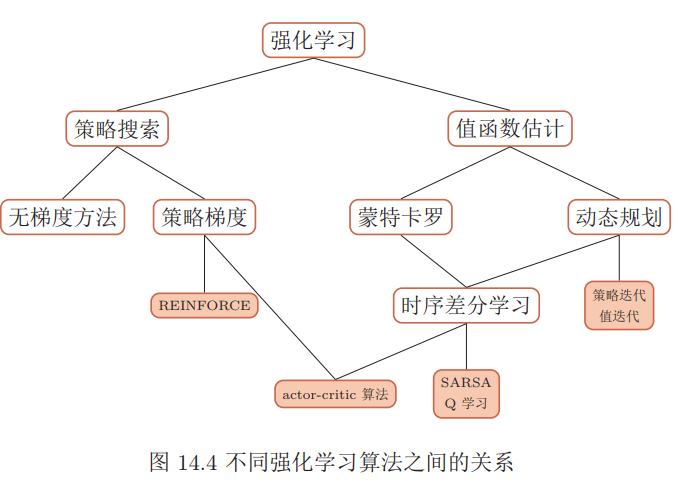

### 深度信念网

玻尔兹曼机和深度信念网络都是生成模型，借助隐变量来描述复杂的数据分布。作为概率图模型，玻尔兹曼机和深度信念网络的共同问题是推断和学习问题。因为这两种模型都比较复杂，并且都包含隐变量，它们的推断和学习一般通过$\text{MCMC}$方法来进行近似估计。这两种模型和神经网络有很强的对应关系，在一定程度上也称为随机神经络。

#### 玻尔兹曼机

玻尔兹曼机可以看做是一个随机动力系统，每个变量的状态都以一定的概率受到其它变量的影响。玻尔兹曼机可以用概率无向图模型来描述。一个具有K 个节点（变量）的玻尔兹曼机满足以下三个性质：

每个随机变量是二值的，所有随机变量可以用一个二值的随机向量$\mathbf{X} ∈\{0, 1\}^K$ 来表示，其中可观测变量表示为$\mathbf{V}$，隐变量表示为$\mathbf{H}$；所有节点之间是全连接的。每个变量$X_i$ 的取值依赖于所有其它变量$X_{\backslash i}$；每两个变量之间的相互影响（$X_i → X_j$ 和$X_j → X_i$）是对称的。

变量$\mathbf{X}$的联合概率由玻尔兹曼分布得到，即
$$
p(\mathbf{x})=\frac{1}{Z} \exp \left(\frac{-E(\mathbf{x})}{T}\right)
$$
其中$\mathbf{Z}$ 为配分函数，能量函数$E(\mathbf{x})$的定义为
$$
\begin{aligned} E(\mathbf{x}) & \triangleq E(\mathbf{X}=\mathbf{x}) \\ &=-\left(\sum_{i<j} w_{i j} x_{i} x_{j}+\sum_{i} b_{i} x_{i}\right) \end{aligned}
$$
其中$w_{ij}$ 是两个变量$x_i$ 和$x_j$之间的连接权重，$x_i ∈ \{0, 1\}$表示状态，$b_i$是变量$x_i$的偏置。

因此，如果令玻尔兹曼机中的每个变量 $X_i $代表一个基本假设，其取值为$ 1 $或$ 0 $分别表示模型接受或拒绝该假设，那么变量之间连接的权重为可正可负的实数，代表了两个假设之间的弱约束关系。一个正的权重表示两个假设可以相互支持。也就是说，如果一个假设被接受，另一个也很可能被接受。相反，一个负的权重表示两个假设不能同时被接受。

玻尔兹曼机可以用来解决两类问题。**一类是搜索问题**。当给定变量之间的连接权重，需要找到一组二值向量，使得整个网络的能量最低。**另一类是学习问题**。当给一组定部分变量的观测值时，计算一组最优的权重。

#### 生成模型

在玻尔兹曼机中，配分函数$\mathbf{Z}$ 通常难以计算，因此，联合概率分布$p(\mathbf{x})$一般通过$\text{MCMC}$方法来近似，生成一组服从$ p(\mathbf{x}) $分布的样本。本节介绍基于吉布斯采样的样本生成方法。 

##### 全条件概率

吉布斯采样需要计算每个变量$X_i $的全条件概率$p(x_i|x_{\backslash i})$，其中$x_{\backslash i}$ 表示除变量$X_i $外其它变量的取值。

首先，保持其它变量$x_{\backslash i}$ 不变，改变变量$X_i$ 的状态，从$0$和$1$之间的能量差异为
$$
\begin{aligned} \Delta E_{i}\left(\mathbf{x}_{\backslash i}\right) &=E\left(x_{i}=0, \mathbf{x}_{\backslash i}\right)-E\left(x_{i}=1, \mathbf{x}_{\backslash i}\right) \\ &=\sum_{j} w_{i j} x_{j}+b_{i} \end{aligned}
$$
又根据玻尔兹曼机的定义可得
$$
E(\mathbf{x})=-T \log p(\mathbf{x})-T \log Z
$$
因此有
$$
\begin{aligned} \Delta E_{i}\left(\mathbf{x}_{\backslash i}\right) &=-T \ln p\left(x_{i}=0, \mathbf{x}_{\backslash i}\right)-\left(-T \ln p\left(x_{i}=1, \mathbf{x}_{\backslash i}\right)\right) \\ &=T \ln \frac{p\left(x_{i}=1, \mathbf{x}_{\backslash i}\right)}{p\left(x_{i}=0, \mathbf{x}_{\backslash i}\right)} \\ &=T \ln \frac{p\left(x_{i}=1 | \mathbf{x}_{\backslash i}\right)}{p\left(x_{i}=0 | \mathbf{x}_{\backslash i}\right)} \\ &=T \ln \frac{p\left(x_{i}=1, | \mathbf{x}_{\backslash i}\right)}{1-p\left(x_{i}=1 | \mathbf{x}_{\backslash i}\right)} \end{aligned}
$$
得到
$$
\begin{aligned} p\left(x_{i}=1 | \mathbf{x}_{\{i}\right) &=\frac{1}{1+\exp \left(-\frac{\Delta E_{i}\left(\mathbf{x}_{\backslash i}\right)}{T}\right)} \\ &=\sigma\left(\frac{\sum_{j} w_{i j} x_{j}+b_{i}}{T}\right) \end{aligned}
$$

##### 参数学习

不失一般性，假设玻尔兹曼机中的变量分为可观测变量$\mathbf{v} ∈ \{0, 1\}^m$ 和隐变量$\mathbf{h} ∈ \{0, 1\}^n$。

给定一组可观测的向量$\mathcal{D}=\left\{\hat{\mathbf{v}}^{(1)}, \hat{\mathbf{v}}^{(2)}, \cdots, \hat{\mathbf{v}}^{(N)}\right\}$作为训练集，我们要学习玻尔兹曼机的参数$W$和$\mathbf{b}$使得训练集中所有样本的对数似然函数最大。训练集的对数似然函数定义为
$$
\begin{aligned} \mathcal{L}(\mathcal{D} | W, \mathbf{b}) &=\frac{1}{N} \sum_{n=1}^{N} \log p\left(\hat{\mathbf{v}}^{(n)} | W, b\right) \\ &=\frac{1}{N} \sum_{n=1}^{N} \log \sum_{\mathbf{h}} p\left(\hat{\mathbf{v}}^{(n)}, \mathbf{h} | W, \mathbf{b}\right) \\ &=\frac{1}{N} \sum_{n=1}^{N} \log \frac{\sum_{\mathbf{h}} \exp \left(-E\left(\hat{\mathbf{v}}^{(n)}, \mathbf{h}\right)\right)}{\sum_{\mathbf{v}, \mathbf{h}} \exp (-E(\mathbf{v}, \mathbf{h}))} \end{aligned}
$$
对数似然函数$\mathcal{L}(\mathcal{D}|W, \mathbf{b})$对参数$θ$ 的偏导数为
$$
\begin{array}{l}{\frac{\mathcal{L}(\mathcal{D} | W, \mathbf{b})}{\partial \theta}=\frac{1}{N} \sum_{n=1}^{N} \frac{\partial}{\partial \theta} \log \sum_{\mathbf{h}} p\left(\hat{\mathbf{v}}^{(n)}, \mathbf{h} | W, \mathbf{b}\right)} \\ {=\frac{1}{N} \sum_{n=1}^{N} \frac{\partial}{\partial \theta}\left(\log \sum_{\mathbf{h}} \exp \left(-E\left(\hat{\mathbf{v}}^{(n)}, \mathbf{h}\right)\right)-\log \sum_{\mathbf{v}, \mathbf{h}} \exp (-E(\mathbf{v}, \mathbf{h}))\right)}\\
=\frac{1}{N} \sum_{n=1}^{N} \sum_{\mathbf{h}} \frac{\exp \left(-E\left(\hat{\mathbf{v}}^{(n)}, \mathbf{h}\right)\right)}{\sum_{\mathbf{h}} \exp \left(-E\left(\hat{\mathbf{v}}^{(n)}, \mathbf{h}\right)\right)}\left[\frac{\partial E\left(\hat{\mathbf{v}}^{(n)}, \mathbf{h}\right)}{\partial \theta}\right]
-\sum_{\mathbf{v}, \mathbf{h}} \frac{\exp (-E(\mathbf{v}, \mathbf{h}))}{\sum_{\mathbf{v}, \mathbf{h}} \exp (-E(\mathbf{v}, \mathbf{h}))}\left[\frac{\partial E(\mathbf{v}, \mathbf{h})}{\partial \theta}\right]\\
=\frac{1}{N} \sum_{n=1}^{N} \sum_{\mathbf{h}} p\left(\mathbf{h} | \hat{\mathbf{v}}^{(n)}\right)\left[\frac{\partial E\left(\hat{\mathbf{v}}^{(n)}, \mathbf{h}\right)}{\partial \theta}\right]-\sum_{\mathbf{v}, \mathbf{h}} p(\mathbf{v}, \mathbf{h})\left[\frac{\partial E(\mathbf{v}, \mathbf{h})}{\partial \theta}\right]
\end{array}
$$

因此，整个训练集的对数似然函数$ \mathcal{L}(D|W, b) $对每个权重 $w_{ij}$ 和偏置$ b_i $的偏导数为
$$
\begin{aligned} \frac{\partial \mathcal{L}(\mathcal{D} | W, \mathbf{b})}{\partial w_{i j}} &=\mathbb{E}_{\hat{p}(\mathbf{v})} \mathbb{E}_{p(\mathbf{h} | \mathbf{v})}\left[x_{i} x_{j}\right]-\mathbb{E}_{p(\mathbf{v}, \mathbf{h})}\left[x_{i} x_{j}\right] \\ \frac{\partial \mathcal{L}(\mathcal{D} | W, \mathbf{b})}{\partial b_{i}} &=\mathbb{E}_{\hat{p}(\mathbf{v})} \mathbb{E}_{p(\mathbf{h} | \mathbf{v})}\left[x_{i}\right]-\mathbb{E}_{p(\mathbf{v}, \mathbf{h})}\left[x_{i}\right] \end{aligned}
$$
当$K$比较大时，配分函数以及期望的计算会十分耗时。因此，玻尔兹曼机一般通过$\text{MCMC}$方法来进行近似求解。以参数$w_{ij} $的梯度为例，上式中第一项为在给定可观测变量为训练集中的样本时，$x_ix_j$ 的期望。为了近似近似这个期望，我们可以固定住可观测变量，只对$\mathbf{h}$进行吉布斯采样。当玻尔兹曼机达到热平衡状态时，采样$x_ix_j $的值。在训练集上所有的训练样本上重复此过程，得到$x_ix_j $的近似期望$⟨x_ix_j ⟩_{data}$。上式中的第二项为玻尔兹曼机在没有任何限制时，$x_ix_j $的期望。我们可以对所有变量进行吉布斯采样。当玻尔兹曼机达到热平衡状态时，采样$x_ix_j $的值，得到近似期望$⟨x_ix_j ⟩_{model}$。这样当采用梯度上升法时，权重$w_{ij}$可以用下面公式近似地更新

$$
w_{i j} \leftarrow w_{i j}+\alpha\left(\left\langle x_{i} x_{j}\right\rangle_{\mathrm{data}}-\left\langle x_{i} x_{j}\right\rangle_{\mathrm{model}}\right)
$$
玻尔兹曼机可以用在监督学习和无监督学习中。在监督学习中，可观测的变量$\mathbf{v}$又进一步可以分为输入和输出变量，隐变量则隐式地描述了输入和输出变量之间复杂的约束关系。在无监督学习中，隐变量可以看做是可观测变量的内部特征表示。

#### 受限玻尔兹曼机

全连接的玻尔兹曼机在理论上十分有趣，但是由于其复杂性，目前为止并没有被广泛使用。虽然基于采样的方法在很大程度提高了学习效率，但是每更新一次权重，就需要网络重新达到热平衡状态，这个过程依然比较低效，需要很长时间。**受限玻尔兹曼机**是一个二分图结构的无向图模型。受限玻尔兹曼机中的变量也分为隐藏变量和可观测变量。我们分别用可观测层和隐藏层来表示这两组变量。同一层中的节点之间没有连接，而不同层一个层中的节点与另一层中的所有节点连接，这和两层的全连接神经网络的结构相同。

一个受限玻尔兹曼机由 $m_1 $个可观测变量和$m_2 $个隐变量组成，其定义如下：
可观测的随机向量$\mathbf{v} = [v_1, · · · , v_{m_1}]^T$；
隐藏的随机向量$\mathbf{h} = [h_1, · · · , h_{m_2}]^T$；
权重矩阵$\mathbf{W} ∈ R^{m_1×m_2}$，其中每个元素$w_{ij }$为可观测变量$v_i $和隐变量$h_j$之间边的权重；
偏置$\mathbf{a} ∈ R^{m_1}$ 和$\mathbf{b} ∈ R^{m_2}$，其中$a_i $为每个可观测的变量$ v_i$的偏置，$b_j $为每个隐变量$h_j $的偏置。

受限玻尔兹曼机的能量函数定义为
$$
\begin{aligned} E(\mathbf{v}, \mathbf{h}) &=-\sum_{i} a_{i} v_{i}-\sum_{j} b_{j} h_{j}-\sum_{i} \sum_{j} v_{i} w_{i j} h_{j} \\ &=-\mathbf{a}^{\mathrm{T}} \mathbf{v}-\mathbf{b}^{\mathrm{T}} \mathbf{h}-\mathbf{v}^{\mathrm{T}} W \mathbf{h} \end{aligned}
$$
受限玻尔兹曼机的联合概率分布$p(\mathbf{v}, \mathbf{h})$定义为
$$
\begin{aligned} p(\mathbf{v}, \mathbf{h}) &=\frac{1}{Z} \exp (-E(\mathbf{v}, \mathbf{h})) \\ &=\frac{1}{Z} \exp \left(\mathbf{a}^{\mathrm{T}} \mathbf{v}\right) \exp \left(\mathbf{b}^{\mathrm{T}} \mathbf{h}\right) \exp \left(\mathbf{v}^{\mathrm{T}} W \mathbf{h}\right) \end{aligned}
$$
可观测层变量$\mathbf{v}$的边际概率为
$$
\begin{aligned} P(\mathbf{v}) &=\sum_{\mathbf{h}} P(\mathbf{v}, \mathbf{h})=\frac{1}{Z} \sum_{\mathbf{h}} \exp (-E(\mathbf{v}, \mathbf{h})) \\ &=\frac{1}{Z} \sum_{\mathbf{h}} \exp \left(\mathbf{a}^{\mathrm{T}} \mathbf{v}+\sum_{j} b_{j} h_{j}+\sum_{i} \sum_{j} v_{i} w_{i j} h_{j}\right) \\ &=\frac{\exp \left(\mathbf{a}^{\mathrm{T}} \mathbf{v}\right)}{Z} \sum_{\mathbf{h}} \exp \left(\sum_{j} h_{j}\left(b_{j}+\sum_{i} w_{i j} v_{i}\right)\right) \\ &=\frac{\exp \left(\mathbf{a}^{\mathrm{T}} \mathbf{v}\right)}{Z} \sum_{j} \prod_{j} \exp \left(h_{j}\left(b_{j}+\sum_{i} w_{i j} v_{i}\right)\right)\\
&=\frac{\exp \left(\mathbf{a}^{\mathrm{T}} \mathbf{v}\right)}{Z} \sum_{h_{1}} \sum_{h_{2}} \cdots \sum_{h_{n}} \prod_{j} \exp \left(h_{j}\left(b_{j}+\sum_{i} w_{i j} v_{i}\right)\right) \\ &=\frac{\exp \left(\mathbf{a}^{\mathrm{T}} \mathbf{v}\right)}{Z} \prod_{j} \sum_{h_{j}} \exp \left(h_{j}\left(b_{j}+\sum_{i} w_{i j} v_{i}\right)\right) \\ &=\frac{\exp \left(\mathbf{a}^{\mathrm{T}} \mathbf{v}\right)}{Z} \prod_{j}\left(1+\exp \left(b_{j}+\sum_{i} w_{i j} v_{i}\right)\right)
\end{aligned}
$$
固定$h_j = 1$时，$p(h_j = 1, \mathbf{v})$的边际概率为
$$
\begin{array}{l}{p\left(h_{j}=1, \mathbf{v}\right)=\frac{1}{Z} \sum_{\mathbf{h}, h_{j}=1} \exp (-E(\mathbf{v}, \mathbf{h}))} \\ {=\frac{\exp \left(\mathbf{a}^{\mathrm{T}} \mathbf{v}\right)}{Z} \prod_{k, k \neq j}\left(1+\exp \left(b_{k}+\sum_{i} w_{i k} v_{i}\right)\right) \exp \left(b_{j}+\sum_{i} w_{i j} v_{i}\right)}\end{array}
$$
可以计算隐藏单元$h_j$ 的条件概率为
$$
\begin{aligned} p\left(h_{j}=1 | \mathbf{v}\right) &=\frac{p\left(h_{i}=1, \mathbf{v}\right)}{p(\mathbf{v})} \\ &=\frac{\exp \left(b_{j}+\sum_{i} w_{i j} v_{i}\right)}{1+\exp \left(b_{j}+\sum_{i} w_{i j} v_{i}\right)} \\ &=\sigma\left(b_{j}+\sum_{i} w_{i j} v_{i}\right) \end{aligned}
$$
同理，条件概率$p(v_i = 1|\mathbf{h})$为
$$
p\left(v_{i}=1 | \mathbf{h}\right)=\sigma\left(a_{i}+\sum_{j} w_{i j} h_{j}\right)
$$
也可以写为向量形式
$$
\begin{array}{l}{p(\mathbf{h}=\mathbf{1} | \mathbf{v})=\sigma\left(W^{\mathrm{T}} \mathbf{v}+\mathbf{b}\right)} \\ {p(\mathbf{v}=\mathbf{1} | \mathbf{h})=\sigma(W \mathbf{h}+\mathbf{a})}\end{array}
$$
因此，受限玻尔兹曼机可以并行地对所有的可观测变量或所有的隐变量同时进行采样，而从可以更快地达到热平衡状态。

受限玻尔兹曼机的采样过程如下：
给定或随机初始化一个可观测的向量$\mathbf{v}_0$, 计算隐变量的概率，并从中采样一个隐向量$\mathbf{h}_0$；基于$\mathbf{h}_0$，计算可观测变量的概率，并从中采样一个个可观测的向量$\mathbf{v}_1$；重复$t$次后，获得$(\mathbf{v}_t, \mathbf{h}_t)$；当$t → ∞$时, $(\mathbf{v}_t, \mathbf{h}_t)$的采样服从$p(\mathbf{v}, \mathbf{h})$分布。

##### 参数学习

给定一组训练样本$\mathcal{D}=\left\{\hat{\mathbf{v}}^{(1)}, \hat{\mathbf{v}}^{(2)}, \cdots, \hat{\mathbf{v}}^{(N)}\right\}$，其对数似然函数为
$$
\mathcal{L}(\mathcal{D} | W, \mathbf{a}, \mathbf{b})=\frac{1}{N} \sum_{n=1}^{N} \log p\left(\hat{\mathbf{v}}^{(n)} | W, \mathbf{a}, \mathbf{b}\right)
$$
和玻尔兹曼机类似，在受限玻尔兹曼机中，对数似然函数$\mathcal{L}(\mathcal{D}|W, \mathbf{b}) $对参数$w_{ij} , a_i, b_j $的偏导数为
$$
\begin{aligned}\frac{\partial \mathcal{L}(\mathcal{D} | W, \mathbf{a}, \mathbf{b})}{\partial w_{i j}}&=\mathbb{E}_{\hat{p}(\mathbf{v})} \mathbb{E}_{p(\mathbf{h} | \mathbf{v})}\left[v_{i} h_{j}\right]-\mathbb{E}_{p(\mathbf{v}, \mathbf{h})}\left[v_{i} h_{j}\right]\\
 \frac{\partial \mathcal{L}(\mathcal{D} | W, \mathbf{a}, \mathbf{b})}{\partial a_{i}} &=\mathbb{E}_{\hat{p}(\mathbf{v})} \mathbb{E}_{p(\mathbf{h} | \mathbf{v})}\left[v_{i}\right]-\mathbb{E}_{p(\mathbf{v}, \mathbf{h})}\left[v_{i}\right] \\ \frac{\partial \mathcal{L}(\mathcal{D} | W, \mathbf{a}, \mathbf{b})}{\partial b_{j}} &=\mathbb{E}_{\hat{p}(\mathbf{v})} \mathbb{E}_{p(\mathbf{h} | \mathbf{v})}\left[h_{j}\right]-\mathbb{E}_{p(\mathbf{v}, \mathbf{h})}\left[h_{j}\right] \end{aligned}
$$
其中$\hat{p}(\mathbf{v})$为训练数据集上$\mathbf{v}$的实际分布。
$$
\begin{array}{l}{W \leftarrow W+\alpha\left(\hat{\mathbf{v}}^{(n)} \mathbf{h}^{\mathrm{T}}-\mathbf{v}^{\prime} \mathbf{h}^{\mathrm{T}}\right)} \\ {\mathbf{a} \leftarrow \mathbf{a}+\alpha\left(\hat{\mathbf{v}}^{(n)}-\mathbf{v}^{\prime}\right)} \\ {\mathbf{b} \leftarrow \mathbf{b}+\alpha\left(\mathbf{h}-\mathbf{h}^{\prime}\right)}\end{array}
$$
由于受限玻尔兹曼机的特殊结构，因此可以使用一种比吉布斯采样更有效的学习算法，即对比散度。对比散度算法仅需$k$步吉布斯采样。为了提高效率，对比散度算法用一个训练样本作为可观测向量的初始值。然后，交替对可观测向量和隐藏向量进行吉布斯采样，不需要等到收敛，只需要$k$步就足够了。这就是$\text{CD-k}$算法。通常，$k = 1$就可以学得很好。

**伯努利-伯努利**受限玻尔兹曼机就是上面介绍的可观测变量和隐变量都为二值类型的受限玻尔兹曼机。**高斯-伯努利**受限玻尔兹曼机是假设可观测变量为高斯分布，隐变量为伯努利分布，其能量函数定义为
$$
E(\mathbf{v}, \mathbf{h})=\sum_{i} \frac{\left(v_{i}-\mu_{i}\right)^{2}}{2 \sigma_{i}^{2}}-\sum_{j} b_{j} h_{j}-\sum_{i} \sum_{j} \frac{v_{i}}{\sigma_{i}} w_{i j} h_{j}
$$
其中每个可观测变量$v_i$服从$(µ_i, σ_i)$的高斯分布。**伯努利-高斯**受限玻尔兹曼机是假设可观测变量为伯努利分布，隐变量为高斯分布，其能量函数定义为

$$
E(\mathbf{v}, \mathbf{h})=\sum_{i} a_{i} v_{i}-\sum_{j} \frac{\left(h_{j}-\mu_{j}\right)^{2}}{2 \sigma_{j}^{2}}-\sum_{i} \sum_{j} v_{i} w_{i j} \frac{h_{j}}{\sigma_{j}}
$$
其中每个隐变量$h_j$服从$(µ_j , σ_j )$的高斯分布。

#### 深度信念网络

**深度信念网络**是一种深层的概率有向图模型，其图结构由多层的节点构成。每层节点的内部没有连接，相邻两层的节点为全连接。网络的最底层为可观测变量，其它层节点都为隐变量。最顶部的两层间的连接是无向的，其他层之间的连接是有向的。

对一个有$L$层隐变量的深度信念网络，令$\mathbf{v} = \mathbf{h}^{(0)}$ 表示最底层为可观测变量，$\mathbf{h}_{(1)}, · · · , \mathbf{h}^{(L)}$ 表示其余每层的变量。顶部的两层是一个无向图，可以看做是一个受限玻尔兹曼机，用来产生$p(\mathbf{h}^{(L−1)})$的先验分布。除了最顶上两层外，每一层变量$\mathbf{h}^{(l)}$依赖于其上面一层$\mathbf{h}^{(l+1)}$，即
$$
p\left(\mathbf{h}^{(l)} | \mathbf{h}^{(l+1)}, \cdots, \mathbf{h}^{(L)}\right)=p\left(\mathbf{h}^{(l)} | \mathbf{h}^{(l+1)}\right)
$$
深度信念网络中所有变量的联合概率可以分解为
$$
\begin{align}p\left(\mathbf{v}, \mathbf{h}^{(1)}, \cdots, \mathbf{h}^{(L)}\right)&=p\left(\mathbf{v} | \mathbf{h}^{(1)}\right)\left(\prod_{l=1}^{L-2} p\left(\mathbf{h}^{(l)} | \mathbf{h}^{(l+1)}\right)\right) p\left(\mathbf{h}^{(L-1)}, \mathbf{h}^{(L)}\right)\\
&=\left(\prod_{l=0}^{L-1} p\left(\mathbf{h}^{(l)} | \mathbf{h}^{(l+1)}\right)\right) p\left(\mathbf{h}^{(L-1)}, \mathbf{h}^{(L)}\right)
\end{align}
$$
其中$p(\mathbf{h}^{(l)}| \mathbf{h}^{(l+1)})$为$Sigmoid$型条件概率分布为
$$
p\left(\mathbf{h}^{(l)} | \mathbf{h}^{(l+1)}\right)=\sigma\left(\mathbf{a}^{(l)}+W^{(l+1)} \mathbf{h}^{(l+1)}\right)
$$

##### 参数学习

在生成样本时，首先在最顶两层进行足够多次的吉布斯采样，生成$\mathbf{h}^{(L-1)}$，然后依次计算下一层隐变量的分布。因为在给定上一层变量取值时，下一层的变量是条件独立的，因为可以独立采样。这样，我们可以从第$L − 1$层开始，自顶向下进行逐层采样，最终得到可观测层的样本。

为了有效地训练深度信念网络，我们将每一层的$ Sigmoid $信念网络转换为受限玻尔兹曼机。这样做的好处是隐变量的后验概率是相互独立的，从而可以很容易地进行采样。这样，深度信念网络可以看作是由多个受限玻尔兹曼机从下到上进行堆叠，第$l $层受限玻尔兹曼机的隐层作为第$l + 1$层受限玻尔兹曼机的可观测层。进一步地，深度信念网络可以采用逐层训练的方式来快速训练，即从最底层开始，每次只训练一层，直到最后一层

深度信念网络的训练过程可以分为预训练和精调两个阶段。先通过逐层预训练将模型的参数初始化为较优的值，再通过传统学习方法对参数进行精调。

### 深度生成模型

假设在一个连续的或离散的高维空间$\mathcal{X}$ 中，存在一个随机向量$\mathbf{X}$服从一个未知的数据分布$p_r(\mathbf{x}), \mathbf{x} ∈ \mathcal{X}$。生成模型是根据一些可观测的样本$\mathbf{x}^{(1)}, \mathbf{x}^{(2)}, · · · , \mathbf{x}^{(N)}$ 来学习一个参数化的模型$p_θ(\mathbf{x})$来近似未知分布$p_r(\mathbf{x})$，并可以用这个模型来生成一些样本，使得生成的样本和真实的样本尽可能地相似。深度生成模型就是利用深层神经网络可以近似任意函数的能力来建模一个复杂的分布$p_r(\mathbf{x})$。假设一个随机向量$\mathcal{Z}$ 服从一个简单的分布$p(\mathbf{z}), \mathbf{z} ∈ \mathcal{Z}$，我们使用一个深层神经网络 $g : \mathcal{Z} → \mathcal{X}$，并使得 $g(\mathbf{z})$服从$p_r(\mathbf{x})$。

生成模型一般具有两个基本功能：密度估计和生成样本。给定一组数据$\mathcal{D} = \{\mathbf{x}^{
(i)}\}, 1 ≤ i ≤ N$，假设它们都是从独立地从相同的概率密度函数为$p_r(\mathbf{x})$的未知分布中产生的。密度估计是根据数据集$\mathcal{D}$来估计其概率密度函数$p_θ(\mathbf{x})$。生成模型也可以应用于监督学习。监督学习的目标是建模输出标签的条件概率密度函数$p(y|\mathbf{x})$。根据贝叶斯公式，我们可以将监督学习问题转换为联合概率密度函数$p(\mathbf{x}, y)$的密度估计问题。

生成样本就是给定一个概率密度函数为$p_θ(\mathbf{x})$的分布，生成一些服从这个分布的样本，也称为采样。在得到$p(\mathbf{z}, θ)$和$p(\mathbf{x}|\mathbf{z}, θ)$之后，我们就可以生成数据$\mathbf{x}$，具体过程可以分为两步进行：根据隐变量的先验分布$p(\mathbf{z}, θ)$进行采样，得到样本$\mathbf{z}$；根据条件分布$p(\mathbf{x}|\mathbf{z}, θ)$进行采样，得到$\mathbf{x}$。因此在生成模型中，重点是估计条件分布$p(\mathbf{x}|\mathbf{z}, θ)$。
#### 变分自编码器

假设一个生成模型中包含隐变量，即有部分变量是不可观测的，其中观测变量$\mathbf{X}$是一个高维空间$\mathcal{X}$ 中的随机向量，隐变量$\mathbf{Z}$是一个相对低维的空间$\mathcal{Z} $中的随机向量。这个生成模型的联合概率密度函数可以分解为
$$
p(\mathbf{x}, \mathbf{z} | \theta)=p(\mathbf{x} | \mathbf{z}, \theta) p(\mathbf{z} | \theta)
$$
其中$p(\mathbf{z}|θ)$为隐变量$\mathbf{z}$先验分布的概率密度函数，$p(\mathbf{x}|\mathbf{z}, θ)$为已知$\mathbf{z}$时观测变量$\mathbf{x}$的条件概率密度函数，$θ $表示两个密度函数的参数。一般情况下，我们可以假设$p(\mathbf{z}|θ)$和$p(\mathbf{x}|\mathbf{z}, θ)$为某种参数化的分布族。这些分布的形式已知，只是参数$θ$未知，可以通过最大化似然来进行估计。

给定一个样本$\mathbf{x}$，其对数边际似然$log p(\mathbf{x}|θ)$可以分解为
$$
\log p(\mathbf{x} | \theta)=E L B O(q, \mathbf{x} | \theta, \phi)+D_{\mathrm{KL}}(q(\mathbf{z} | \phi) \| p(\mathbf{z} | \mathbf{x}, \theta))
$$
其中$q(\mathbf{z}|ϕ)$是额外引入的变分密度函数，其参数为$ϕ$，$ELBO(q, \mathbf{x}|θ, ϕ)$为证据下界
$$
E L B O(q, \mathbf{x} | \theta, \phi)=\mathbb{E}_{\mathbf{z} \sim q(\mathbf{z} | \phi)}\left[\log \frac{p(\mathbf{x}, \mathbf{z} | \theta)}{q(\mathbf{z} | \phi)}\right]
$$
最大化对数边际似然$log p(\mathbf{x}|θ)$可以用$\text{EM}$算法来求解，具体可以分为两步：$\text{E-step}$: 寻找一个密度函数$q(\mathbf{z}|ϕ)$使其等于或接近于后验密度函数$p(\mathbf{z}|\mathbf{x}, θ)$；$\text{M-step}$: 保持$q(\mathbf{z}|ϕ)$固定，寻找$θ $来最大化$ELBO(q, \mathbf{x}|θ, ϕ)$。这样个步骤不断重复，直到收敛。

在$\text{EM}$算法的每次迭代中，理论上最优的$q(\mathbf{z}|ϕ)$为隐变量的后验概率密度函数$p(\mathbf{z}|\mathbf{x}, θ)$，
$$
p(\mathbf{z} | \mathbf{x}, \theta)=\frac{p(\mathbf{x} | \mathbf{z}, \theta) p(\mathbf{z} | \theta)}{\int_{z} p(\mathbf{x} | \mathbf{z}, \theta) p(\mathbf{z} | \theta) d \mathbf{z}}
$$
变分自编码器是一种深度生成模型，其思想是利用神经网络来分别建模两个复杂的条件概率密度函数。用神经网络来产生变分分布$q(\mathbf{z}|ϕ)$，称为推断网络。理论上$q(\mathbf{z}|ϕ)$可以不依赖$\mathbf{x}$。但由于的目$q(\mathbf{z}|ϕ)$标是近似后验分布$p(\mathbf{z}|\mathbf{x}, θ)$，其和$\mathbf{x}$相关，因此变分密度函数一般写为$p(\mathbf{z}|\mathbf{x}, θ)$。推断网络的输入为$\mathbf{x}$，输出为变分分布$p(\mathbf{z}|\mathbf{x}, θ)$用神经网络来产生概率分布$p(\mathbf{x}|\mathbf{z}, θ)$，称为生成网络。生成网络的输入为$\mathbf{z}$，输出为概率分布$p(\mathbf{x}|\mathbf{z}, θ)$。

##### 推断网络

为了简单起见，假设$q(\mathbf{z}|\mathbf{x}, ϕ)$是服从对角化协方差的高斯分布，
$$
q(\mathbf{z} | \mathbf{x}, \phi)=\mathcal{N}\left(\mathbf{z} | \boldsymbol{\mu}_{I}, \boldsymbol{\sigma}_{I}^{2} I\right)
$$
其中$µ_I$ 和$σ^2_I$是高斯分布的均值和方差，可以通过推断网络$f_I (\mathbf{x}, ϕ)$来预测。
$$
\left[ \begin{array}{c}{\boldsymbol{\mu}_{I}} \\ {\boldsymbol{\sigma}_{I}}\end{array}\right]=f_{I}(\mathbf{x}, \phi)
$$
其中推断网络$f_I (\mathbf{x}, ϕ)$可以是一般的全连接网络或卷积网络，比如一个两层的神经网络
$$
\begin{aligned} \mathbf{h} &=\sigma\left(W^{(1)} \mathbf{x}+\mathbf{b}^{(1)}\right) \\ \boldsymbol{\mu}_{I} &=W^{(2)} \mathbf{h}+\mathbf{b}^{(2)} \\ \boldsymbol{\sigma}_{I} &=\operatorname{softplus}\left(W^{(3)} \mathbf{h}+\mathbf{b}^{(3)}\right) \end{aligned}
$$

###### 推断网络的目标

推断网络的目标是使得$q(\mathbf{z}|\mathbf{x}, ϕ)$来尽可能接近真实的后验$p(\mathbf{z}|\mathbf{x}, θ)$，需要找到变分参数$ϕ^∗$来最小化两个分布的KL散度。
$$
\phi^{*}=\underset{\phi}{\arg \min } D_{\mathrm{KL}}(q(\mathbf{z} | \mathbf{x}, \phi) \| p(\mathbf{z} | \mathbf{x}, \theta))
$$
变分分布$q(\mathbf{z}|\mathbf{x}, ϕ)$与真实后验$q(\mathbf{z}|\mathbf{x}, ϕ)$的KL散度等于对数边际似然$log p(\mathbf{x}|θ)$与其下界$ELBO(q, \mathbf{x}|θ, ϕ)$的差。
$$
D_{\mathrm{KL}}(q(\mathbf{z} | \mathbf{x}, \phi) \| p(\mathbf{z} | \mathbf{x}, \theta))=\log p(\mathbf{x} | \theta)-E L B O(q, \mathbf{x} | \theta, \phi)
$$
因此，推断网络的目标函数为
$$
\begin{aligned} \phi^{*} &=\arg \min _{\phi} D_{\mathrm{KL}}(q(\mathbf{z} | \mathbf{x}, \phi) \| p(\mathbf{z} | \mathbf{x}, \theta)) \\ &=\underset{\phi}{\arg \min } \log p(\mathbf{x} | \theta)-E L B O(q, \mathbf{x} | \theta, \phi) \\ &=\underset{\phi}{\arg \max } E L B O(q, \mathbf{x} | \theta, \phi) \end{aligned}
$$

##### 生成网络

生成模型的联合分布$p(\mathbf{x}, \mathbf{z}|θ)$可以分解为两部分：隐变量$\mathbf{z}$的先验分布$p(\mathbf{z}|θ)$和条件概率分布$p(\mathbf{x}|\mathbf{z}, θ)$。先验分布$p(\mathbf{z}|θ)$一般假设隐变量$\mathbf{z}$的先验分布为各向同性的标准高斯分布$N (\mathbf{z}|0, I)$。隐变量$\mathbf{z}$的每一维之间都是独立的。条件概率分布$p(\mathbf{x}|\mathbf{z}, θ) $建模条件分布$p(\mathbf{x}|\mathbf{z}, θ)$通过生成网络来建模。为了简单起见，我们同样用参数化的分布族来表示条件概率分布$ p(\mathbf{x}|\mathbf{z}, θ)$，这些分布族的参数可以用生成网络来计算得到。

###### 生成网络的目标

生成网络的目标是找到一组$θ^∗$ 最大化证据下界$ELBO(q, \mathbf{x}|θ, ϕ)$。
$$
\theta^{*}=\underset{\theta}{\arg \max } E L B O(q, \mathbf{x} | \theta, \phi)
$$
推断网络和生成网络的目标都为最大化证据下界$ELBO(q, \mathbf{x}|θ, ϕ)$。因此，变分自编码器的总目标函数为
$$
\begin{array}{l}{\max _{\theta, \phi} E L B O(q, \mathbf{x} | \theta, \phi)=\max _{\theta, \phi} \mathbb{E}_{\mathbf{z} \sim q(\mathbf{z} | \phi)}\left[\log \frac{p(\mathbf{x} | \mathbf{z}, \theta) p(\mathbf{z} | \theta)}{q(\mathbf{z} | \phi)}\right]} \\ {=\max _{\theta, \phi} \mathbb{E}_{\mathbf{z} \sim q(\mathbf{z} | \mathbf{x}, \phi)}[\log p(\mathbf{x} | \mathbf{z}, \theta)]-D_{\mathrm{KL}}(q(\mathbf{z} | \mathbf{x}, \phi) \| p(\mathbf{z} | \theta))}\end{array}
$$
其中先验分布$p(\mathbf{z}|θ) = N (\mathbf{z}|0, I)$，$θ$ 和$ϕ$分别表示生成网络和推断网络的参数。

中的期望$\mathbb{E}_{\mathbf{z} \sim q(\mathbf{z} | \mathbf{x}, \phi)}[\log p(\mathbf{x} | \mathbf{z}, \theta)]$一般通过采样的方式进行计算。对于每个样本$\mathbf{x}$，根据$q(\mathbf{z}|\mathbf{x}, ϕ)$采集$M $个$\mathbf{z}^{(m)}, 1 ≤ m ≤ M$
$$
\mathbb{E}_{\mathbf{z} \sim q(\mathbf{z} | \mathbf{x}, \phi)}[\log p(\mathbf{x} | \mathbf{z}, \theta)] \approx \frac{1}{M} \sum_{m=1}^{M} \log p\left(\mathbf{x} | \mathbf{z}^{(m)}, \theta\right)
$$

##### 训练

给定一个数据集$\mathcal{D}$，包含$ N $个从未知数据分布中抽取的独立同分布样本$\mathbf{x}^{(1)}, \mathbf{x}^{(2)}, \cdots, \mathbf{x}^{(N)}$。变分自编码器的目标函数为
$$
\mathcal{J}(\phi, \theta | \mathcal{D})=\sum_{n=1}^{N}\left(\frac{1}{M} \sum_{m=1}^{M} \log p\left(\mathbf{x}^{(n)} | \mathbf{z}^{(n, m)}, \theta\right)-D_{\mathrm{KL}}\left(q\left(\mathbf{z} | \mathbf{x}^{(n)}, \phi\right) \| \mathcal{N}(\mathbf{z} | \mathbf{0}, \mathbf{I})\right)\right)
$$
其中$\mathbf{z}^{(n,m) }$为第$n$个样本的变分分布$q(\mathbf{z}|\mathbf{x}^{(n)}, ϕ)$的第$m$个采样。如果采用随机梯度方法，每次从数据集中采一个样本$\mathbf{x}$，然后根据$q(\mathbf{z}|\mathbf{x}, ϕ)$采一个隐变量$\mathbf{z}$，则目标函数变为

$$
\mathcal{J}(\phi, \theta | \mathbf{x})=\log p(\mathbf{x} | \mathbf{z}, \theta)-D_{\mathrm{KL}}(q(\mathbf{z} | \mathbf{x}, \phi) \| \mathcal{N}(\mathbf{z} | \mathbf{0}, \mathbf{I}))
$$
对于两个正态分布$N (µ_1, Σ_1)$和$N (µ_2, Σ_2)$，其$\text{KL}$散度为
$$
\begin{array}{l}{D_{\mathrm{KL}}\left(\mathcal{N}\left(\boldsymbol{\mu}_{1}, \Sigma_{1}\right) \| \mathcal{N}\left(\boldsymbol{\mu}_{2}, \Sigma_{2}\right)\right)} \\ {=\frac{1}{2}\left(\operatorname{tr}\left(\Sigma_{2}^{-1} \Sigma_{1}\right)+\left(\boldsymbol{\mu}_{2}-\boldsymbol{\mu}_{1}\right)^{\top} \Sigma_{2}^{-1}\left(\boldsymbol{\mu}_{2}-\boldsymbol{\mu}_{1}\right)-k+\log \frac{\left|\Sigma_{2}\right|}{\left|\Sigma_{1}\right|}\right)}\end{array}
$$
这样当$q(\mathbf{z}|\mathbf{x}^{(n)}, ϕ)$为$N (µ_I,σ^2_II)$时，
$$
\begin{array}{l}{D_{\mathrm{KL}}(q(\mathbf{z} | \mathbf{x}, \phi) \| p(\mathbf{z}, \theta))} \\ {=\frac{1}{2}\left(\operatorname{tr}\left(\boldsymbol{\sigma}_{I}^{2} I\right)+\boldsymbol{\mu}_{I}^{\top} \boldsymbol{\mu}_{I}-k-\log \left(\left|\boldsymbol{\sigma}_{I}^{2} I\right|\right)\right.}\end{array}
$$
其中$µ_I$和$σ_I$为推断网络$f_I(\mathbf{x}, ϕ)$的输出。

假设$q(\mathbf{z}|\mathbf{x}, ϕ)$为正态分布$N(µ_I,σ^2_II)$，我们可以通过下面方式来采样$\mathbf{z}$。
$$
\mathbf{z}=\boldsymbol{\mu}_{I}+\boldsymbol{\sigma}_{I} \odot \boldsymbol{\epsilon}
$$
其中$ϵ ∼ N (0, I)$，$µ_I $和$σ_I $是推断网络$f_I (x, ϕ)$的输出。这样$\mathbf{z}$和$µ_I,σ_I $的关系从采样关系变为函数关系，就可以求$\mathbf{z}$关于$ϕ$的导数。如果进一步假设$p(\mathbf{x}|\mathbf{z}, θ)$服从高斯分布$N (\mathbf{x}|µ_G, I)$，其中$µ_G = f_G(\mathbf{z}, θ)$是生成网络的输出，则目标函数可以简化为

$$
\mathcal{J}(\phi, \theta | \mathbf{x})=-\left\|\mathbf{x}-\boldsymbol{\mu}_{G}\right\|^{2}+D_{\mathrm{KL}}\left(\mathcal{N}\left(\boldsymbol{\mu}_{I}, \boldsymbol{\sigma}_{I}\right) \| \mathcal{N}(\mathbf{0}, \mathbf{I})\right)
$$
其中第一项可以近似看作是输入$\mathbf{x}$的重构正确性，第二项可以看作是正则化项。

#### 生成对抗网络

如果只是希望有一个模型能生成符合数据分布$p_r(\mathbf{x}) $的样本，那么可以不显示地估计出数据分布的密度函数。假设在低维空间$\mathcal{Z} $中有一个简单容易采样的分布$p(\mathbf{z})$。我们用神经网络构建一个映射函数$G : \mathcal{Z} → \mathcal{X}$，称为生成网络。利用神经网络强大的拟合能力，使得$G(\mathbf{z})$服从数据分布$p_r(\mathbf{x})$。这种模型就称为隐式密度模型。

##### 判别网络

在生成对抗网络中，有两个网络进行对抗训练。一个是判别网络，目标是尽量准确地判断一个样本是来自于真实数据还是生成网络产生的；另一个是生成网络，目标是尽量生成判别网络无法区分来源的样本。这两个目标相反的网络不断地进行交替训练。当最后收敛时，如果判别网络再也无法判断出一个样本的来源，那么也就等价于生成网络可以生成符合真实数据分布的样本。

判别网络：$D(\mathbf{x}, ϕ)$的目标是区分出一个样本$\mathbf{x}$时来自于真实分布$p_r(\mathbf{x})$还是来自于生成模型$p_θ(\mathbf{x})$，因此判别网络实际上是一个两类分类器。用标签$y = 1$来表示样本来自真实分布，$y = 0$表示样本来自模型，判别网络$D(\mathbf{x}, ϕ)$的输出为$\mathbf{x}$属于真实数据分布的概率，即
$$
p(y=1 | \mathbf{x})=D(\mathbf{x}, \phi)
$$
给定一个样本$(\mathbf{x}, y)，y = \{1, 0\}$表示其自于$p_r(\mathbf{x})$还是$p_θ(\mathbf{x})$，判别网络的目标函数为最小化交叉熵，即最大化对数似然
$$
\begin{aligned} & \min _{\phi}-\left(\mathbb{E}_{\mathbf{x}}[y \log p(y=1 | \mathbf{x})+(1-y) \log p(y=0 | \mathbf{x})]\right) \\=& \max _{\phi}\left(\mathbb{E}_{\mathbf{x} \sim p_{r}(\mathbf{x})}[\log D(\mathbf{x}, \phi)]+\mathbb{E}_{\mathbf{x}^{\prime} \sim p_{\theta}\left(\mathbf{x}^{\prime}\right)}\left[\log \left(1-D\left(\mathbf{x}^{\prime}, \phi\right)\right)\right]\right) \\=& \max _{\phi}\left(\mathbb{E}_{\mathbf{x} \sim p_{r}(\mathbf{x})}[\log D(\mathbf{x}, \phi)]+\mathbb{E}_{\mathbf{z} \sim p(\mathbf{z})}[\log (1-D(G(\mathbf{z}, \theta), \phi))]\right) \end{aligned}
$$
其中$θ $和$ϕ$分布时生成网络和判别网络的参数。

##### 生成网络

生成网络的目标刚好和判别网络相反，即让判别网络将自己生成的样本判别为真实样本。
$$
\begin{array}{c}{\max _{\theta}\left(\mathbb{E}_{\mathbf{z} \sim p(\mathbf{z})}[\log D(G(\mathbf{z}, \theta), \phi)]\right)} \\ {=\min _{\theta}\left(\mathbb{E}_{\mathbf{z} \sim p(\mathbf{z})}[\log (1-D(G(\mathbf{z}, \theta), \phi))]\right)}\end{array}
$$
生成对抗网络是指一类采用对抗训练方式来进行学习的深度生成模型，其包含的判别网络和生成网络都可以根据不同的生成任务使用不同的网络

深度卷积生成对抗网络：在$DCGAN$中，判别网络是一个传统的深度卷积网络，但使用了带步长的卷积来实现下采样操作，不用最大汇聚操作。生成网络使用一个特殊的深度卷积网络来实现，使用微步卷积来生成$64 × 64 ×3$大小的图像。

$DCGAN$的主要优点是通过一些经验性的网络结构设计使得对抗训练更加稳定。使用代步长的卷积（在判别网络中）和微步卷积（在生成网络中）来代替汇聚操作，以免损失信息；使用批量归一化；去除卷积层之后的全连接层；在生成网络中，除了最后一层使用$Tanh$激活函数外，其余层都使用$ReLU$函数；在判别网络中，都使用$LeakyReLU$激活函数。

##### 模型分析

将判别网络和生成网络合并，整个生成对抗网络的整个目标函数看作最小化最大化游戏
$$
\begin{aligned} & \min _{\theta} \max _{\phi}\left(\mathbb{E}_{\mathbf{x} \sim p_{r}(\mathbf{x})}[\log D(\mathbf{x}, \phi)]+\mathbb{E}_{\mathbf{x} \sim p_{\theta}(\mathbf{x})}[\log (1-D(\mathbf{x}, \phi))]\right) \\=& \min _{\theta} \max _{\phi}\left(\mathbb{E}_{\mathbf{x} \sim p_{r}(\mathbf{x})}[\log D(\mathbf{x}, \phi)]+\mathbb{E}_{\mathbf{z} \sim p(\mathbf{z})}[\log (1-D(G(\mathbf{z}, \theta), \phi)])\right.\end{aligned}
$$
假设$p_r(\mathbf{x})$和$p_θ(\mathbf{x})$已知，则最优的判别器为
$$
D^{\star}(\mathbf{x})=\frac{p_{r}(\mathbf{x})}{p_{r}(\mathbf{x})+p_{\theta}(\mathbf{x})}
$$
将最优的判别器$D^⋆(\mathbf{x})$代入，其目标函数变为
$$
\begin{aligned} \mathcal{L}\left(G | D^{\star}\right) &=\mathbb{E}_{\mathbf{x} \sim p_{r}(\mathbf{x})}\left[\log D^{\star}(\mathbf{x})\right]+\mathbb{E}_{\mathbf{x} \sim p_{\theta}(\mathbf{x})}\left[\log \left(1-D^{\star}(\mathbf{x})\right)\right] \\ &=\mathbb{E}_{\mathbf{x} \sim p_{r}(\mathbf{x})}\left[\log \frac{p_{r}(\mathbf{x})}{p_{r}(\mathbf{x})+p_{\theta}(\mathbf{x})}\right]+\mathbb{E}_{\mathbf{x} \sim p_{\theta}(\mathbf{x})}\left[\log \frac{p_{\theta}(\mathbf{x})}{p_{r}(\mathbf{x})+p_{\theta}(\mathbf{x})}\right] \\ &=D_{\mathrm{KL}}\left(p_{r} \| p_{a}\right)+D_{\mathrm{KL}}\left(p_{\theta} \| p_{a}\right)-2 \log 2 \\ &=2 D_{\mathrm{JS}}\left(p_{r} \| p_{\theta}\right)-2 \log 2 \end{aligned}
$$
在生成对抗网络中，当判断网络为最优时，生成网络的优化目标是最小化真实分布$p_r$和模型分布$p_θ $之间的$JS$散度。当两个分布相同时，$JS$散度为$0$，最优生成网络$G^⋆ $对应的损失为$L(G^⋆| D^⋆) = −2 \log 2$。

然而，$JS$散度的一个问题是：当两个分布没有重叠时，它们之间的$JS$散度恒等于常数$\log 2$。对生成网络来说，目标函数关于参数的梯度为$0$。
$$
\frac{\partial \mathcal{L}\left(G | D^{\star}\right)}{\partial \theta}=0
$$

###### 模型坍塌

前向和逆向$KL$散度分别定义为
$$
\begin{aligned} D_{\mathrm{KL}}\left(p_{r} \| p_{\theta}\right) &=\int p_{r}(\mathbf{x}) \log \frac{p_{r}(\mathbf{x})}{p_{\theta}(\mathbf{x})} d \mathbf{x} \\ D_{\mathrm{KL}}\left(p_{\theta} \| p_{r}\right) &=\int p_{\theta}(\mathbf{x}) \log \frac{p_{\theta}(\mathbf{x})}{p_{r}(\mathbf{x})} d \mathbf{x} \end{aligned}
$$
在前向$KL$散度中，当$p_r(\mathbf{x}) → 0$而$p_θ(\mathbf{x}) > 0$时，$p_{r}(\mathbf{x}) \log \frac{p_{r}(\mathbf{x})}{p_{\theta}(\mathbf{x})} \rightarrow 0$。不管$p_θ(\mathbf{x})$如何取值，都对前向$KL$散度的计算没有贡献。当$p_r(\mathbf{x}) → 0$而$p_θ(\mathbf{x}) > 0$时，$p_{r}(\mathbf{x}) \log \frac{p_{r}(\mathbf{x})}{p_{\theta}(\mathbf{x})} \rightarrow \infin$。前向KL散度会变得非常大。因此，前向$KL$散度会鼓励模型分布$p_θ(\mathbf{x})$尽可能覆盖所有真实分布$p_r(\mathbf{x})0 >0$的点，而不用回避$p_r(\mathbf{x}) ≈ 0$的点。

在逆向$KL$散度中，当$p_r(\mathbf{x}) → 0$而$p_θ(\mathbf{x}) > 0$时，$p_{\theta}(\mathbf{x}) \log \frac{p_{\theta}(\mathbf{x})}{p_{r}(\mathbf{x})} \rightarrow \infty$。即当$p_θ(\mathbf{x})$接近于$0$，而$p_θ(\mathbf{x})$有一定的密度时，逆向$KL$散度会变得非常大。当$p_θ(\mathbf{x}) → 0$时，不管$p_r(\mathbf{x})$如何取值，$p_{\theta}(\mathbf{x}) \log \frac{p_{\theta}(\mathbf{x})}{p_{r}(\mathbf{x})} \rightarrow 0$。因此，逆向$KL$散度会鼓励模型分布$p_θ(\mathbf{x})$尽可能避开所有真实分布$p_r(\mathbf{x}) ≈0$的点，而不需要考虑是否覆盖所有布$p_r(\mathbf{x}) > 0$的点。

如果使用上面公式作为生成网络的目标函数，将最优判断网络$D^⋆$ 代入，得到
$$
\begin{array}{l}{\mathcal{L}^{\prime}\left(G | D^{\star}\right)=\mathbb{E}_{\mathbf{x} \sim p_{\theta}(\mathbf{x})}\left[\log D^{\star}(\mathbf{x})\right]} \\ {\quad=\mathbb{E}_{\mathbf{x} \sim p_{\theta}(\mathbf{x})}\left[\log \frac{p_{r}(\mathbf{x})}{p_{r}(\mathbf{x})+p_{\theta}(\mathbf{x})} \cdot \frac{p_{\theta}(\mathbf{x})}{p_{\theta}(\mathbf{x})}\right]}\\
{\quad=-\mathbb{E}_{\mathbf{x} \sim p_{\theta}(\mathbf{x})}\left[\log \frac{p_{\theta}(\mathbf{x})}{p_{r}(\mathbf{x})}\right]+\mathbb{E}_{\mathbf{x} \sim p_{\theta}(\mathbf{x})}\left[\log \frac{p_{\theta}(\mathbf{x})}{p_{r}(\mathbf{x})+p_{\theta}(\mathbf{x})}\right]} \\ {\quad=-D_{\mathrm{KL}}\left(p_{\theta} \| p_{r}\right)+\mathbb{E}_{\mathbf{x} \sim p_{\theta}(\mathbf{x})}\left[\log \left(1-D^{\star}(\mathbf{x})\right)\right]} \\ {\quad=-D_{\mathrm{KL}}\left(p_{\theta} \| p_{r}\right)+2 D_{\mathrm{JS}}\left(p_{r} \| p_{\theta}\right)-2 \log 2-\mathbb{E}_{\mathbf{x} \sim p_{r}(\mathbf{x})}\left[\log D^{\star}(\mathbf{x})\right]}
\end{array}
$$
其中后两项和生成网络无关，因此
$$
\max _{\theta} \mathcal{L}^{\prime}\left(G | D^{\star}\right)=\min _{\theta} D_{\mathrm{KL}}\left(p_{\theta} \| p_{r}\right)-2 D_{\mathrm{JS}}\left(p_{r} \| p_{\theta}\right)
$$
其中$JS$散度$D_{\mathrm{JS}}\left(p_{r} \| p_{\theta}\right)∈ [0, log 2]$为有界函数，因此生成网络的目标为更多的是受逆向KL散度$D_{\mathrm{KL}}\left(p_{\theta} \| p_{r}\right)$影响，使得生成网络更倾向于生成一些更“安全”的样本，从而造成模型坍塌问题。

### 深度强化学习

在强化学习中，有两个可以进行交互的对象：智能体和环境。智能体$\text{agent}$可以感知外界环境的状态$\text{state}$和反馈的奖励$\text{reward}$，并进行学习和决策。智能体的决策功能是指根据外界环境的状态来做出不同的动作$\text{action}$，而学习功能是指根据外界环境的奖励来调整策略。环境$\text{environment}$是智能体外部的所有事物，并受智能体动作的影响而改变其状态，并反馈给智能体相应的奖励。

在强化学习中的基本要素包括：
状态$s$是对环境的描述，可以是离散的或连续的，其状态空间为$\mathcal{S}$；动作$a$是对智能体行为的描述，可以是离散的或连续的，其动作空间为$\mathcal{A}$；策略$π(a|s)$是智能体根据环境状态$s$来决定下一步的动作$a$的函数；状态转移概率 $p(s′|s, a) $是在智能体根据当前状态$ s $做出一个动作$ a $之后，环境在下一个时刻转变为状态$s′ $的概率；即时奖励$r(s, a, s′)$是一个标量函数，即智能体根据当前状态$s$做出动作$a$之后，环境会反馈给智能体一个奖励，这个奖励也经常和下一个时刻的状态$s′ $有关。

智能体的策$\text{policy}$就是智能体如何根据环境状态$s$来决定下一步的动作$a$，通常可以分为确定性策略和随机性策略两组。确定性策略是从状态空间到动作空间的映射函数$π : \mathcal{S} → \mathcal{A}$。随机性策略表示在给定环境状态时，智能体选择某个动作的概率分布。
$$
\begin{aligned} \pi(a | s) & \triangleq p(a | s) \\ & \pi(a | s)=1 \end{aligned}
$$
通常情况下，强化学习一般使用随机性的策略。随机性的策略可以有很多优点。比如在学习时可以通过引入一定随机性更好地探索环境。二是使得策略更加地多样性。

马尔可夫过程$\text{Markov Process}$是具有马尔可夫性的随机变量序列$s_0, s_1, · · · ，s_t ∈\mathcal{S}$，其下一个时刻的状态$s_{t+1} $只取决于当前状态$s_t$，
$$
p\left(s_{t+1} | s_{t}, \cdots, s_{0}\right)=p\left(s_{t+1} | s_{t}\right)
$$
其中$p(s_{t+1}|s_t)$称为状态转移概率，$\sum_{s_{t+1} \in \mathcal{S}} p\left(s_{t+1} | s_{t}\right)=1$

马尔可夫决策过程$\text{Markov Decision Process}$在马尔可夫过程中加入一个额外的变量：动作$\mathbf{a}$，即下一个时刻的状态$ s_{t+1} $和当前时刻的状态$ s_t$以及动作$a_t $相关，
$$
p\left(s_{t+1} | s_{t}, a_{t}, \cdots, s_{0}, a_{0}\right)=p\left(s_{t+1} | s_{t}, a_{t}\right)
$$
其中$p(s_{t+1}|s_t, a_t)$为状态转移概率。
给定策略$π(a|s)$，马尔可夫决策过程的一个轨迹$\tau=s_{0}, a_{0}, s_{1}, r_{1}, a_{1}, \cdots, s_{T-1}, a_{T-1}, s_{T}, r_{T}$的概率为
$$
\begin{aligned} p(\tau) &=p\left(s_{0}, a_{0}, s_{1}, a_{1}, \cdots\right) \\ &=p\left(s_{0}\right) \prod_{t=0}^{T-1} \pi\left(a_{t} | s_{t}\right) p\left(s_{t+1} | s_{t}, a_{t}\right) \end{aligned}
$$

###### 强化学习的目标函数

给定策略$ π(a|s)$，智能体和环境一次交互过程的轨迹 $τ $所收到的累积奖励为总回报。
$$
\begin{aligned} G(\tau) &=\sum_{t=0}^{T-1} r_{t+1} \\ &=\sum_{t=0}^{T-1} r\left(s_{t}, a_{t}, s_{t+1}\right) \end{aligned}
$$
假设环境中有一个或多个特殊的终止状态，当到达终止状态时，一个智能体和环境的交互过程就结束了。这一轮交互的过程称为一个回合或试验；如果环境中没有终止状态，即$T = ∞$，称为持续性强化学习任务，其总回报也可能是无穷大。为了解决这个问题，我们可以引入一个折扣率来降低远期回报的权重。折扣回报定义为
$$
G(\tau)=\sum_{t=0}^{T-1} \gamma^{t} r_{t+1}
$$
其中$γ ∈ [0, 1]$是折扣率。当$γ $接近于$0$时，智能体更在意短期回报；而当$γ$ 接近于$1$时，长期回报变得更重要。

###### 目标函数

因为策略和状态转移都有一定的随机性，每次试验得到的轨迹是一个随机序列，其收获的总回报也不一样。强化学习的目标是学习到一个策略$π_θ(a|s)$来最大化期望回报，即希望智能体执行一系列的动作来获得尽可能多的平均回报。
$$
\mathcal{J}(\theta)=\mathbb{E}_{\tau \sim p_{\theta}(\tau)}[G(\tau)]=\mathbb{E}_{\tau \sim p_{\theta}(\tau)}\left[\sum_{t=0}^{T-1} \gamma^{t} r_{t+1}\right]
$$
其中$θ $为策略函数的参数。

#### 值函数

为了评估一个策略$π $的期望回报，我们定义两个值函数：状态值函数和状态-动作值函数。

##### 状态值函数

一个策略$π $期望回报可以分解为：重期望公式$E(X)=E(E(X|Y))$
$$
\begin{aligned} \mathbb{E}_{\tau \sim p(\tau)}[G(\tau)] &=\mathbb{E}_{s \sim p\left(s_{0}\right)}\left[\mathbb{E}_{\tau \sim p(\tau)}\left[\sum_{t=0}^{T-1} \gamma^{t} r_{t+1} | \tau_{s_{0}}=s\right]\right] \\ &=\mathbb{E}_{s \sim p\left(s_{0}\right)}\left[V^{\pi}(s)\right] \end{aligned}
$$
其中$V^π(s)$称为状态值函数，表示从状态$s$开始，执行策略$π $得到的期望总回报
$$
V^{\pi}(s)=\mathbb{E}_{\tau \sim p(\tau)}\left[\sum_{t=0}^{T-1} \gamma^{t} r_{t+1} | \tau_{s_{0}}=s\right]
$$
其中$τ_{s_0}$ 表示轨迹$τ $的起始状态。

根据马尔可夫性，Vπ(s)可展开得到
$$
\begin{array}{l}{V^{\pi}(s)=\mathbb{E}_{\tau_{0 : T} \sim p(\tau)}\left[r_{1}+\gamma \sum_{t=1}^{T-1} \gamma^{t-1} r_{t+1} | \tau_{s 0}=s\right]} \\ {=\mathbb{E}_{a \sim \pi(a | s)} \mathbb{E}_{s^{\prime} \sim p\left(s^{\prime} | s, a\right)} \mathbb{E}_{\tau_{1 : T} \sim p(\tau)}\left[r\left(s, a, s^{\prime}\right)+\gamma \sum_{t=1}^{T-1} \gamma^{t-1} r_{t+1} | \tau_{s_{1}}=s^{\prime}\right]}\\
=\mathbb{E}_{a \sim \pi(a | s)} \mathbb{E}_{s^{\prime} \sim p\left(s^{\prime} | s, a\right)}\left[r\left(s, a, s^{\prime}\right)+\gamma \mathbb{E}_{\tau_{1 : T} \sim p(\tau)}\left[\sum_{t=1}^{T-1} \gamma^{t-1} r_{t+1} | \tau_{s_{1}}=s^{\prime}\right]\right]\\
=\mathbb{E}_{a \sim \pi(a | s)} \mathbb{E}_{s^{\prime} \sim p\left(s^{\prime} | s, a\right)}\left[r\left(s, a, s^{\prime}\right)+\gamma V^{\pi}\left(s^{\prime}\right)\right]
\end{array}
$$
如果给定策略$π(a|s)$，状态转移概率$p(s′|s, a)$和奖励$r(s, a, s′)$，我们就可以通过迭代的方式来计算$V^π(s)$。由于存在折扣率，迭代一定步数后，每个状态的值函数就会固定不变。

##### 状态-动作值函数

$$
Q^{\pi}(s, a)=\mathbb{E}_{s^{\prime} \sim p\left(s^{\prime} | s, a\right)}\left[r\left(s, a, s^{\prime}\right)+\gamma V^{\pi}\left(s^{\prime}\right)\right]
$$

状态-动作值函数也经常称为$Q$函数。

状态值函数$V^π(s)$是$Q$函数$Q^π(s, a)$关于动作a的期望，
$$
V^{\pi}(s)=\mathbb{E}_{a \sim \pi(a | s)}\left[Q^{\pi}(s, a)\right]
$$
$Q$函数还可以写为
$$
Q^{\pi}(s, a)=\mathbb{E}_{s^{\prime} \sim p\left(s^{\prime} | s, a\right)}\left[r\left(s, a, s^{\prime}\right)+\gamma \mathbb{E}_{a^{\prime} \sim \pi\left(a^{\prime} | s^{\prime}\right)}\left[Q^{\pi}\left(s^{\prime}, a^{\prime}\right)\right]\right]
$$
这是关于$Q$函数的贝尔曼方程。

值函数可以看作是对策略$π$的评估。如果在状态$s$，有一个动作$a$使得$Q^π(s, a) >V^π(s)$，说明执行动作$a$比当前的策略$π(a|s)$要好，我们就可以调整参数使得策略$π(a|s)$的概率增加。

深度强化学习是将强化学习和深度学习结合在一起，用强化学习来定义问题和优化目标，用深度学习来解决策略和值函数深度强化学习是将强化学习和深度学习结合在一起，用强化学习来定义问题和优化目标，用深度学习来解决策略和值函数

#### 基于值函数的学习方法

值函数是对策略π的评估，如果策略π有限（即状态数和动作数都有限）时，可以对所有的策略进行评估并选出最优策略π∗。

### 序列生成模型

给定一个序列样本$\mathbf{x}_{1 : T}=x_{1}, x_{2}, \cdots, x_{T}$，其概率可以看出是$T $个词的联合概率。 
$$
\begin{aligned} P\left(\mathbf{X}_{1 : T}=\mathbf{x}_{1 : T}\right) &=P\left(X_{1}=x_{1}, X_{2}=x_{2}, \cdots, X_{T}=x_{T}\right) \\ &=p\left(\mathbf{x}_{1 : T}\right) \end{aligned}
$$
和一般的概率模型类似，序列概率模型有两个基本问题：学习问题：给定一组序列数据，估计这些数据背后的概率分布；生成问题：从已知的序列分布中生成新的序列样本。

#### 序列概率模型

序列数据有两个特点：样本是变长的；样本空间为非常大。对于一个长度为$T $的序列，其样本空间为$|\mathcal{V}|^T$。

根据概率的乘法公式，序列$\mathbf{x}_{1:T}$ 的概率可以写为
$$
\begin{aligned} p\left(\mathbf{x}_{1 : T}\right) &=p\left(x_{1}\right) p\left(x_{2} | x_{1}\right) p\left(x_{3} | \mathbf{x}_{1 : 2}\right) \cdots p\left(x_{T} | \mathbf{x}_{1 :(T-1)}\right) \\ &=\prod_{t=1}^{T} p\left(x_{t} | \mathbf{x}_{1 :(t-1)}\right) \end{aligned}
$$
其中$x_t ∈ \mathcal{V}, t ∈ [1, T]$为词表$\mathcal{V} $中的一个词，$p(x_1|x_0) = p(x_1)$。

一旦通过最大似然估计训练了模型$p_θ(x|\mathbf{x}_{1:(t−1)})$，就可以通过时间顺序来生成一个完整的序列样本。令$\hat{x}_t$ 为在第$t$时根据分布$p_θ(x|\hat{\mathbf{x}}_{1:(t−1)})$生成的
$$
\hat{x}_{t} \sim p_{\theta}\left(x | \hat{\mathbf{x}}_{1 :(t-1)}\right)
$$
其中$\hat{\mathbf{x}}_{1:(t−1)} = \hat{x}_1, · · · , \hat{x}_{t−1 }$为前面$t − 1$步中生成的前缀序列。
自回归的方式可以生成一个无限长度的序列。为了避免这种情况，通常会设置一个特殊的符号$eos$来表示序列的结束。在训练时，每个序列样本的结尾都加上符号$eos$。在测试时，一旦生成了符号$eos$，就中止生成过程。

**束搜索**当使用自回归模型生成一个最可能的序列时，生成过程是一种从左到右的贪婪式搜索过程。在每一步都生成最可能的词，
$$
\hat{x}_{t}=\underset{x \in \mathcal{V}}{\arg \max } p_{\theta}\left(x | \hat{\mathbf{x}}_{1 :(t-1)}\right)
$$
这种贪婪式的搜索方式是次优的，生成的序列$\hat{\mathbf{x}}_{1:T}$ 并不保证是全局最优的
$$
\prod_{t=1}^{T} \max _{x_{t} \in \mathcal{V}} p_{\theta}\left(x_{t} | \hat{\mathbf{x}}_{1 :(t-1)}\right) \leq \max _{\mathbf{x}_{1 : T} \in \mathcal{V}^{T}} \prod_{t=1}^{T} p_{\theta}\left(x | \mathbf{x}_{1 :(t-1)}\right)
$$
一种常用的减少搜索错误的启发式方法是束搜索。在每一步的生成中，生成$K $个最可能的前缀序列，其中$K $为束的大小，是一个超参数。
束搜索的过程如下：在第$1$步时，生成$K $个最可能的词。在后面每一步中，从$K|\mathcal{V}|$个候选输出中选择$K$个最可能的序列。

#### N 元统计模型

假设每个词$x_t $只依赖于其前面的$n − 1$个词:n阶马尔可夫性质，即
$$
p\left(x_{t} | \mathbf{x}_{1 :(t-1)}\right)=p\left(x_{t} | \mathbf{x}_{(t-n+1) :(t-1)}\right)
$$
平滑技术：$N$元模型的一个主要问题是数据稀疏问题。数据稀疏问题在基于统计的机器学习中是一个常见的问题，主要是由于训练样本不足而导致密度估计不准.

数据稀疏问题的一种解决方法是平滑技术，即给一些没有出现的词组合赋予一定先验概
$$
p\left(x_{t} | \mathbf{x}_{(t-n+1) :(t-1)}\right)=\frac{\mathrm{m}\left(\mathrm{x}_{(t-n+1) : t}\right)+\delta}{\mathrm{m}\left(\mathrm{x}_{(t-n+1) :(t-1)}\right)+\delta|\mathcal{V}|}
$$

#### 深度序列模型

深度序列模型是指利用神经网络模型来估计条件概率$p_θ(x_t|\mathbf{x}_{1:(t−1)})$，

假设一个神经网络$f(·, θ)$，其输入为历史信息$\mathbf{h}_t = \mathbf{x}_{1:(t−1)}$，输出为词表$\mathcal{V}$中的每个词$v_k(1 ≤ k ≤ |\mathcal{V}|)$出现的概率，并满足
$$
\sum_{k=1}^{|\mathcal{V}|} f_{k}\left(\mathbf{x}_{1 :(t-1)}, \theta\right)=1
$$
其中$θ $表示网络参数。条件概率$p_θ(x_t|\mathbf{x}{1:(t−1)})$可以从神经网络的输出中得到
$$
p_{\theta}\left(x_{t} | \mathbf{x}_{1 :(t-1)}\right)=f_{k_{x_{t}}}\left(\mathbf{x}_{1 :(t-1)} ; \theta\right)
$$
其中$k_{x_t}$为$x_t $在词表$\mathcal{V} $中索引。

深度序列模型一般可以分为三个部分：嵌入层、特征层、输出层

嵌入层 令$\mathbf{h}_t = \mathbf{x}_{1:(t−1)} $表示输入的历史信息，一般为符号序列。由于神经网络模型一般要求输入形式为实数向量，因此为了能够使得神经网络模型能处理符号数据，需要将这些符号转换为向量形式。一种简单的转换方法是通过一个嵌入表来将每个符号直接映射成向量表示。嵌入表也称为嵌入矩阵或查询表。令$M ∈ R^{d_1×|\mathcal{V}| }$为嵌入矩阵，其中第$k$列向量$\mathbf{m}_k ∈ R^{d_1}$表示词表中第$k $个词对应的向量表示

假设词$ x_t $对应词表中的索引为$ k$，则其$one-hot$向量表示为$ δ_t ∈ {0, 1}^{|\mathcal{V}|}$，即第$k $维为$1$，其余为$0$的$|\mathcal{V}|$维向量。词$x_t $对应的向量表示
$$
\mathbf{e}_{t}=M \delta_{t}=\mathbf{m}_{k}
$$
通过上面的映射可以得到序列$\mathbf{x}_{1:(t−1)} $对应的向量序列$\mathbf{e}_1, · · · , \mathbf{e}_{t−1}$。

特征层 特征层用于从输入向量序列$\mathbf{e}_1, · · · , \mathbf{e}_{t−1}$中提取特征，输出为一个可以表示历史信息的向量$\mathbf{h}_t$。

简单平均：$\mathbf{h}_{t}=\sum_{i=1}^{t-1} \alpha_{i} \mathbf{e}_{i}$，权重$α_i $可以和位置$i$及其表示$\mathbf{e}_i $相关，也可以无关。

前馈神经网络

首先将这$n − 1$个的词向量的$\mathbf{e}_{t−n+1}, · · · , \mathbf{e}_{t−1 }$拼接成一个$d_1 × (n − 1)$维的向量$\mathbf{h} ′$。
$$
\mathbf{h}^{\prime}=\mathbf{e}_{t-n+1} \oplus \cdots \oplus \mathbf{e}_{t-1}
$$
然后将$\mathbf{h} ′$输入到由前馈神经网络构成的隐藏层，最后一层隐藏层的输出$\mathbf{h}_t$。
$$
\mathbf{h}_{t}=g\left(\mathbf{h}^{\prime}, \theta_{g}\right)
$$
其中$g(·, θ_g)$可以为全连接的前馈神经网络或卷积神经网络，$θ_g $为网络参数

循环神经网络

循环神经网络可以接受变长的输入序列，依次接受输入$\mathbf{e}_1, · · · , \mathbf{e}_{t−1}$，得到时刻$t$的隐藏状态$\mathbf{h}_t$。
$$
\mathbf{h}_{t}=g\left(\mathbf{h}_{t-1}, \mathbf{e}_{t}, \theta_{g}\right)
$$
其中$g(·)$为一个非线性函数，$θ_g $为循环网络的参数，$\mathbf{h}_0 = 0$。

输出层 输出层为一般使用$softmax$分类器，接受历史信息的向量表示$\mathbf{h}_t ∈ R^{d_2}$，输出为词表中每个词的后验概率，输出大小为$|\mathbf{V}|$。
$$
\begin{aligned} \mathbf{o}_{t} &=\operatorname{softmax}\left(\hat{\mathbf{o}}_{t}\right) \\ &=\operatorname{softmax}\left(W \mathbf{h}_{t}+\mathbf{b}\right) \end{aligned}
$$
其中输出向量$\mathbf{o}_t ∈ (0, 1)^{|\mathcal{V}|} $为预测的概率分布，第k维是词表中第k个词出现的条件概率；$\hat{\mathbf{o}}_t $是为归一化的得分向量；$W ∈ R^{|\mathcal{V}|×d_2}$ 是最后一层隐藏层到输出层直接的权重矩阵，$b ∈ R^{|\mathcal{V}| }$为偏置。

#### 评价方法

困惑度:Perplexity是信息论的一个概念，可以用来衡量一个分布的不确定性。对于离散随机变量$X ∈ \mathcal{X}$，其概率分布为$p(x)$，困惑度为
$$
2^{H(p)}=2^{-\sum_{x \in \mathcal{X}} p(x) \log _{2} p(x)}
$$
其中$H(p)$为分布$p$的熵。

困惑度也可以用来衡量两个分布之间差异。对于一个未知的数据分布$p_r(x)$和一个模型分布$p_θ(x)$，我们从$p_r(x)$中采样出一组测试样本$x^{(1)}, · · · , x^{(N)}$，模型分布$p_θ(x)$的困惑度为
$$
2^{H\left(\tilde{p}_{r}, p_{\theta}\right)}=2^{-\frac{1}{N} \sum_{n=1}^{N} \log _{2} p_{\theta}\left(x^{(n)}\right)}
$$
其中$H\left(\tilde{p}_{r}, p_{\theta}\right)$为样本的经验分布$\tilde{p}_{r}$与模型分布$p_θ $之间的交叉熵，也是所有样本上的负对数似然函数。

困惑度可以衡量模型分布与样本经验分布之间的契合程度。困惑度越低则两个分布越接近。因此模型分布$p_θ(x)$的好坏可以用困惑度来评价。

假设测试集合共有独立同分布的$ N $个序列 $\left\{\mathbf{X}_{1 : T_{n}}^{(n)}\right\}_{n=1}^{N}$。我们可以用模型$p_θ(\mathbf{x})$对每个序列计算其概率$p_{\theta}\left(\mathbf{x}_{1 : T_{n}}^{(n)}\right)$，整个测试集的联合概率为
$$
\prod_{n=1}^{N} p_{\theta}\left(\mathbf{x}_{1 : T_{n}}^{(n)}\right)=\prod_{n=1}^{N} \prod_{t=1}^{T_{n}} p_{\theta}\left(x_{t}^{(n)} | \mathbf{x}_{1 :(t-1)}^{(n)}\right)
$$
模型$p_θ(\mathbf{x})$的困惑度定
$$
\begin{aligned} \operatorname{PPL}(\theta) &=2^{-\frac{1}{T} \sum_{n=1}^{N} \log p_{\theta}\left(\mathbf{x}_{1 : T_{n}}^{(n)}\right)} \\ &=2^{-\frac{1}{T} \sum_{n=1}^{N} \sum_{t=1}^{T_{n}} \log p_{\theta}\left(x_{t}^{(n)} | \mathbf{x}_{1 :(t-1)}^{(n)}\right)} \\ &=\left(\prod_{n=1}^{N} \prod_{t=1}^{T_{n}} p_{\theta}\left(x_{t}^{(n)} | \mathbf{x}_{1 :(t-1)}^{(n)}\right)\right)^{-1 / T} \end{aligned}
$$
其中 $T=\sum_{n=1}^{N} T_{n}$为测试数据集中序列的总长度。可以看出，困惑度为每个词条件概率$p_{\theta}\left(x_{t}^{(n)} | \mathbf{x}_{1 :(t-1)}^{(n)}\right)$的几何平均数的倒数。测试集中所有序列的概率越大，困惑度越小，模型越好。
假设从模型分布$p_θ $中生成一个候选:Candidate序列$\mathbf{x}$，从真实数据分布中采样出的一组参考Reference序列$\mathbf{s}^{(1)}, \cdots,\mathbf{s}^{(K)}$，我们首先从生成序列中提取$N$元组合的集合$W$，并计算N元组合的精度:Precision
$$
P_{n}(\mathbf{x})=\frac{\sum_{w \in \mathcal{W}} \min \left(c_{w}(\mathbf{x}), \max _{k=1}^{K} c_{w}\left(\mathbf{s}^{(k)}\right)\right)}{\sum_{w \in \mathcal{W}} c_{w}(\mathbf{x})}
$$
其中$c_w(\mathbf{x})$是N元组合w在生成序列$\mathbf{x}$中出现的次数，$c_w(\mathbf{s}^{(k)})$是$N$元组合$w$在参考序列$\mathbf{s}^{(k) }$中出现的次数。$N $元组合的精度 $P_n(\mathbf{x}) $是计算生成序列中的$ N $元组合有多少比例在参考序列中出现。

由于精度只衡量生成序列中的$N$元组合是否在参考序列中出现，生成序列越短，其精度会越高，因此可以引入长度惩罚因子:Brevity Penalty。如果生成序列的长度短于参考序列，就对其进行惩罚
$$
b(\mathbf{x})=\left\{\begin{array}{cc}{1} & {\text { if } l_{x}>l_{s}} \\ {\exp \left(1-l_{s} / l_{x}\right)} & {\text { if } l_{x} \leq l_{s}}\end{array}\right.
$$
其中$l_x $为生成序列$x$的长度，$l_s $为参考序列的最短长度。
$BLEU $是通过计算不同长度的$ N$元组合的精度，并进行几何加权平均而得到
$$
\operatorname{BLEU}_{-} \mathrm{N}(\mathbf{x})=b(\mathbf{x}) \times \exp \left(\sum_{n=1}^{N} w_{n} \log P_{n}\right)
$$
)
其中$w_n $为不同$N$元组合的权重，一般设为$\frac{1}{N}$ 。$BLEU$取值范围是$[0, 1]$，越大表明生成的质量越好。但是$BLEU$只计算精度，而不关心召回率。

$ROUGE-N$的定义
$$
\operatorname{ROUGE}_{-} \mathrm{N}(\mathbf{x})=\frac{\sum_{k=1}^{K} \sum_{w \in \mathcal{W}} \min \left(c_{w}(\mathbf{x}), c_{w}\left(\mathbf{s}^{(k)}\right)\right)}{\sum_{k=1}^{K} \sum_{w \in \mathcal{W}} c_{w}\left(\mathbf{s}^{(k)}\right)}
$$

#### 序列生成模型中的学习问题

##### 曝光偏差问题

在自回归生成模型中，第t步的输入为模型生成的前缀序列$\hat{\mathbf{x}}_{1:(t−1)}$。而在训练时，我们使用的前缀序列是训练集中的真实数据$\mathbf{x}_{1:(t−1)}$，而不是模型预测的$\hat{\mathbf{x}}_{1:(t−1)}$。这种学习方式也称为教师强制。

模型生成的分布 $p_θ(\mathbf{x}_{1:(t−1)})$和真实数据分布 $p_r(\mathbf{x}_{1:(t−1)})$并不严格一致，因此条件概率$ p_θ(x|\mathbf{x}_{1:(t−1)})$在训练和测试会存在协变量偏移问题。一旦在预测前缀$\hat{\mathbf{x}}_{1:(t−1)}$的过程中存在错误，会导致错误传播，使得后续生成的序列也会偏离真实分布。这个问题称为曝光偏差。

**计划采样**为了缓解曝光偏差的问题，我们可以在训练时混合使用真实数据和模型生成数据。在第$t$步时，模型随机使用真实数据$x_{t−1 }$或前一步生成的词$\hat{x}_{t−1}$作为输

令$ϵ ∈ [0, 1] $为一个控制替换率的超参数，在每一步时，以$ ϵ $的概率使用真实数据$x_{t−1}$，以$1 − ϵ$的概率来使用生成数据$\hat{x}_{t−1}$。当令$ϵ = 1$时，训练和最大似然估计一样，使用真实数据；当令$ϵ = 0$时，训练时全部使用模型生成数据。直觉上，如果一开始训练时的$ ϵ $过小，模型相当于在噪声很大的数据上训练，会导致模型性能变差，并且难以收敛。因此，一个较好的策略是在训练初期赋予$ϵ$较大的值，随着训练次数的增加逐步减少$ϵ$的取值。这种策略称为计划采样。

##### 训练目标不一致问题

序列生成模型一般是采用和任务相关的指标来进行评价，比如$BLEU、ROUGE$等，而训练时是使用最大似然估计，这导致训练目标和评价方法不一致。并且这些评价指标一般都是不可微的，无法直接使用基于梯度的方法来进行优化。

基于强化学习的序列生成 为了可以直接优化评价目标，我们可以将自回归的序列生成可以看作是一种马尔可夫决策过程，并使用强化学习的方法来进行训练。

在第$t$步，动作$a_t $可以看作是从词表中选择一个词，策略为$π_θ(a|s_t)$，其中状态$ s_t $为之前步骤中生成的前缀序列$\mathbf{x}_{1:(t−1)}$。一个序列$ \mathbf{x}_{1:T}$ 可以看作是马尔克夫决策过程的一个轨迹

轨迹$τ $的概率为
$$
p_{\theta}(\tau)=\prod_{t=1}^{T} \pi_{\theta}\left(a_{t}=x_{t} | s_{t}=x_{1 :(t-1)}\right)
$$
其中状态转移概$p\left(s_{t}=\mathbf{x}_{1 : t} | s_{t-1}=\mathbf{x}_{1 :(t-2)}, a_{t-1}=x_{t-1}\right)=1$是确定性的，可以被忽略。

强化学习的目标是学习一个策略$π_θ(a|s_t)$使得期望回报最大
$$
\begin{aligned} \mathcal{J}(\theta) &=\mathbb{E}_{\tau \sim p_{\theta}(\tau)}[G(\tau)] \\ &=\mathbb{E}_{\mathbf{x}_{1 : T} \sim p_{\theta}\left(\mathbf{x}_{1 : T}\right)}\left[G\left(\mathbf{x}_{1 : T}\right)\right] \end{aligned}
$$
其中$G(\mathbf{x}_{1:T })$为序列$\mathbf{x}_{1:T} $的总回报，可以为$BLEU、ROUGE$或其它评价指标。
这样序列生成问题就转换为强化学习问题，其策略函数$ π_θ(a|s_t) $可以通过$REINFORCE$算法或$Actor-Critic$算法来进行学习。为了改进强化学习的效率，策略函数$π_θ(a|s_t)$一般会通过最大似然估计来进行预训练。

##### 计算效率问题

序列生成模型的输出层为词表中所有词的条件概率，需要$softmax$归一化。当词表比较大时，计算效率比较低。

在第$t$步时，前缀序列为$h_t = \mathbf{x}_{1:(t−1)}$，词$x_t $的条件概率为
$$
\begin{aligned} p_{\theta}\left(x_{t} | h_{t}\right) &=\operatorname{softmax}\left(s\left(x_{t}, h_{t} ; \theta\right)\right) \\ &=\frac{\exp \left(s\left(x_{t}, h_{t} ; \theta\right)\right)}{\sum_{v \in \mathcal{V}} \exp \left(s\left(v, h_{t} ; \theta\right)\right)} \end{aligned}
$$

###### 层次化$Softmax$

我们先来考虑两层的来组织词表，即将词表中词分成k 组，并每一个词只能属于一个分组，每组大小为$ |\mathcal{V}|^k$ 。假设词$w $所属的组为$c(w)$，则
$$
\begin{aligned} p(w | h) &=p(w, c(w) | h) \\ &=p(w | c(w), h) p(c(w) | h) \end{aligned}
$$
其中$p(c(w)|h)$是给定历史信息h条件下，类$c(w)$的后验概率，$p(w|c(w), h)$是给定历史信息$h$和类$c(w)$条件下，词$w $的后验概率。

为了进一步降低$ softmax $的计算复杂度，我们可以更深层的树结构来组织词汇表。假设用二叉树来组织词表中的所有词，二叉树的叶子节点代表词表中的词，非叶子节点表示不同层次上的类别。

如果我们将二叉树上所有左链接标记为$0$，右链接标记为$1$。每一个词可以用根节点到它所在的叶子之间路径上的标记来进行编码。

假设词$v $在二叉树上从根节点到其所在叶子节点的路径长度为$m$，其编码可以表示一个位向量：$[b_1, · · · , b_m]^T$。词$v$的条件概率为
$$
\begin{aligned} P(v | h) &=p\left(b_{1}, \cdots, b_{m} | h\right) \\ &=\prod_{j=1}^{m} p\left(b_{j} | b_{1}, \cdots, b_{j-1}, h\right) \\ &=\prod_{j=1}^{m} p\left(b_{j} | b_{j-1}, h\right) \end{aligned}
$$
由于$b_j ∈ \{0, 1\}$为二值变量，$p(b_j |b_{j−1}, h)$可以看作是两类分类问题，可以使用$logistic$回归来进行
$$
p\left(b_{j}=1 | b_{j-1}, h\right)=\sigma\left(\mathbf{w}_{n\left(b_{j-1}\right)}^{\mathrm{T}} \mathbf{h}+\mathbf{b}_{n\left(b_{j-1}\right)}\right)
$$
其中$n(b_j−1)$为词$v $在树$T $上的路径上的第$j − 1$个节点。

###### 重要性采样

另一种加速训练速度的方法是基于采样的方法，即通过采样来近似计算训练时的梯度。

用随机梯度上升来更新参数$ θ $时，第$ t $个样本$ (h_t, x_t) $的目标函数关于$ θ $的梯度为
$$
\begin{aligned}\frac{\partial \log p_{\theta}\left(x_{t} | h_{t}\right)}{\partial \theta}&=\frac{\partial s\left(x_{t}, h_{t} ; \theta\right)}{\partial \theta}-\frac{\partial \log \left(\sum_{v} \exp \left(s\left(v, h_{t} ; \theta\right)\right)\right)}{\partial \theta}\\
 &=\frac{\partial s\left(x_{t}, h_{t} ; \theta\right)}{\partial \theta}-\frac{1}{\sum_{v} \exp \left(s\left(v, h_{t} ; \theta\right)\right)} \cdot \frac{\partial \sum_{v} \exp \left(s\left(v, h_{t} ; \theta\right)\right)}{\partial \theta} \\ &=\frac{\partial s\left(x_{t}, h_{t} ; \theta\right)}{\partial \theta}-\sum_{v} \frac{1}{\sum_{w} \exp \left(s\left(w, h_{t} ; \theta\right)\right)} \cdot \frac{\partial \exp \left(s\left(v, h_{t} ; \theta\right)\right)}{\partial \theta} \\
 &=\frac{\partial s\left(x_{t}, h_{t} ; \theta\right)}{\partial \theta}-\sum_{v} \frac{\exp \left(s\left(v, h_{t} ; \theta\right)\right)}{\sum_{w} \exp \left(s\left(w, h_{t} ; \theta\right)\right)}\cdot \frac{\partial s\left(v, h_{t} ; \theta\right)}{\partial \theta}\\
&=\frac{\partial s\left(x_{t}, h_{t} ; \theta\right)}{\partial \theta}-\sum_{v} p_{\theta}\left(v | h_{t}\right)\cdot \frac{\partial s\left(v, h_{t} ; \theta\right)}{\partial \theta} \\ &=\frac{\partial s\left(x_{t}, h_{t} ; \theta\right)}{\partial \theta}-\sum_{p_{\theta}\left(v | h_{t}\right)}\frac{\partial s\left(v, h_{t} ; \theta\right)}{\partial \theta}.
\end{aligned}
$$
重要性采样是用一个容易采样的提议分布$q$，来近似估计$p$。
$$
\begin{aligned} \mathbb{E}_{p_{\theta}\left(v | h_{t}\right)}\left[\frac{\partial s\left(v, h_{t} ; \theta\right)}{\partial \theta}\right] &=\sum_{v \in \mathcal{V}} p_{\theta}\left(v | h_{t}\right) \frac{\partial s\left(v, h_{t} ; \theta\right)}{\partial \theta} \\ &=\sum_{v \in \mathcal{V}} q\left(v | h_{t}\right) \frac{p_{\theta}\left(v | h_{t}\right)}{q\left(v | h_{t}\right)} \cdot \frac{\partial s\left(v, h_{t} ; \theta\right)}{\partial \theta} \\ &=\mathbb{E}_{q\left(v | h_{t}\right)}\left[\frac{p_{\theta}\left(v | h_{t}\right)}{q\left(v | h_{t}\right)} \cdot \frac{\partial s\left(v, h_{t} ; \theta\right)}{\partial \theta}\right] \end{aligned}
$$
分布函数。根据分布$Q(v|h_t)$独立采样$K $个样本$v_1, · · · , v_K $来近似求解公式。
$$
\mathbb{E}_{p_{\theta}\left(v | h_{t}\right)}\left[\frac{\partial s\left(v, h_{t} ; \theta\right)}{\partial \theta}\right] \approx \frac{1}{K} \sum_{k=1}^{K} \frac{p_{\theta}\left(v_{k} | h_{t}\right)}{q\left(v_{k} | h_{t}\right)} \frac{\partial s\left(v_{k}, h_{t} ; \theta\right)}{\partial \theta}
$$
依然需要每一个计算抽取样本的概率$p_θ(v_k|h)$
$$
p_{\theta}\left(v_{k} | h_{t}\right)=\frac{s\left(v_{k}, h_{t} ; \theta\right)}{Z\left(h_{t}\right)}
$$

###### 噪声对比估计

噪声对比估计的数学描述如下：假设有三个分布，一个是需要建模真实数据分布$p_r(x)$；第二是模型布$p_θ(x)$，并期望调整模型参数$θ $来使得$p_θ(x)$来拟合真实数据分布$p_r(x)$；第三个是噪声分布$q(x)$，用来对比学习。给定一个样本$x$，如果$x$是从$p_r(x)$中抽取的，称为真实样本，如果$x$是从$q(x)$中抽取的，则称为噪声样本。为了判断样本$x$是真实样本还是噪声样本，引入一个辨别函数$D$。

#### 序列到序列模型

序列到序列是一种条件的序列生成问题，给定一个序列$\mathbf{x}_{1:S}$，生成另一个序列$\mathbf{y}_{1:T}$。输入序列的长度$S $和输出序列的长度$T $可以不同。 

序列到序列模型的目标是估计条件概率
$$
p_{\theta}\left(\mathbf{y}_{1 : T} | \mathbf{x}_{1 : S}\right)=\prod_{t=1}^{T} p_{\theta}\left(y_{t} | \mathbf{y}_{1 :(t-1)}, \mathbf{x}_{1 : S}\right)
$$
给定一组训练数据$\left\{\left(\mathbf{x}_{S_{n}}, \mathbf{y}_{T_{n}}\right)\right\}_{n=1}^{N}$，我们可以使用最大似然估计来训练模型参数。
$$
\max _{\theta} \sum_{n=1}^{N} \log p_{\theta}\left(\mathbf{y}_{1 : T_{n}} | \mathbf{x}_{1 : S_{n}}\right)
$$
一旦训练完成，模型就可以根据一个输入序列$\mathbf{x}$来生成最可能的目标序列，
$$
\hat{\mathbf{y}}=\underset{\mathbf{y}}{\arg \max } p_{\theta}(\mathbf{y} | \mathbf{x})
$$

##### 基于循环神经网络的序列到序列模型

编码器 首先使用一个循环神经网络$R_{enc} $来编码输入序列$\mathbf{x}_{1:S }$得到一个固定维数的向量$\mathbf{u}$，$\mathbf{u}$一般为编码循环神经网络最后时刻的隐状态。
$$
\mathbf{h}_{t}^{e}=f_{\mathrm{enc}}\left(\mathbf{h}_{t-1}^{e}, \mathbf{e}_{x_{t-1}}, \theta_{\mathrm{enc}}\right), \quad \forall t \in[1 : S]\\
\mathbf{u}=\mathbf{h}_{S}^{e}
$$
解码器 在生成目标序列时，使用另外一个循环神经网络$ R_{dec} $来进行解码。在解码过程的第$t$步时，已生成前缀序列为$\mathbf{y}_{1:(t−1)}$。令$\mathbf{h}_t$ 表示在网络$R_{dec }$的隐状态，$\mathbf{o}_t ∈ (0, 1)^{|\mathcal{V}|} $为词表中所有词的后验概率，则
$$
\begin{aligned} \mathbf{h}_{0}^{d} &=\mathbf{u} \\ \mathbf{h}_{t}^{d} &=f_{\mathrm{dec}}\left(\mathbf{h}_{t-1}^{d}, \mathbf{e}_{y_{t-1}}, \theta_{\mathrm{dec}}\right) \\ \mathbf{o}_{t} &=g\left(\mathbf{h}_{t}^{d}, \theta_{o}\right) \end{aligned}
$$
基于循环神经网络的序列到序列模型的缺点是：向量$\mathbf{c}$的容量问题，输入序列的信息很难全部保存在一个固定维度的向量中；当序列很长时，由于循环神经网络的长期依赖问题，容易丢失输入序列的信息。

##### 基于注意力的序列到序列模型

在解码过程的第$t$步时，先用上一步的隐状态$\mathbf{h}^d_{t−1 }$作为查询向量，利用注意力机制从所有输入序列的隐状态$H^e = [\mathbf{h}^e_1, · · · , \mathbf{h}^e_S]$中选择相关信息。
$$
\begin{aligned} \mathbf{c}_{t} &=\operatorname{att}\left(H^{e}, \mathbf{h}_{t-1}^{d}\right)=\sum_{i=1}^{S} \alpha_{i} \mathbf{h}_{i}^{e} \\ &=\sum_{i=1}^{S} \operatorname{softmax}\left(s\left(\mathbf{h}_{i}^{e}, \mathbf{h}_{t-1}^{d}\right)\right) \mathbf{h}_{i}^{e} \end{aligned}
$$
其中$s(·)$为注意力打分函数。

解码器第$t$步的隐状态
$$
\mathbf{h}_{t}^{d}=f_{\operatorname{dec}}\left(\mathbf{h}_{t-1}^{d},\left[\mathbf{e}_{y_{t-1}} ; \mathbf{c}_{t}\right], \theta_{\operatorname{dec}}\right)
$$

#####  基于自注意力的序列到序列模

对于一个向量序列$H = [\mathbf{h}_1, · · · , \mathbf{h}_T ] ∈ R^{d_h×T}$，首先用自注意力模型来对其进行编码。
$$
\begin{array}{l}{\operatorname{self}-\operatorname{att}(Q, K, V)=\operatorname{softmax}\left(\frac{K^{\mathrm{T}} Q}{\sqrt{d_{h}}} V\right)} \\ {Q=W_{Q} H, K=W_{K} X, V=W_{V} X}\end{array}
$$
其中$d_h $是输入向量$h_t $的维度，$W_Q ∈ R^{d_k×d_h} , W_K ∈ R^{d_k×d_h} , W_V ∈ R^{d_v×d_h }$为三个投影矩阵。

###### 多头自注意力

自注意力模型可以看作是在一个线性投影空间中建立向量$ H $之间交互关系。为了提取更多的交互信息，我们可以使用多头注意力，在多个不同的投影空间中捕捉不同的交互信息。
$$
\begin{aligned} &\text { MultiHead }(H) =W_{O}\left[\operatorname{head}_{1} ; \cdots ; \operatorname{head}_{M}\right] \\ &\text { head }_{m} =\operatorname{self}-\operatorname{att}\left(Q_{m}, K_{m}, V_{m}\right)\\
&\forall m \in[1 : M], \quad Q_{m}=W_{Q}^{m} H, K=W_{K}^{m} X, V=W_{V}^{m} X
\end{aligned}
$$
其中$ W_O ∈ R^{d_h×Md_v} $为输出投影矩阵，$W^m_Q ∈ R^{d_k×d_h} , W^m_K ∈ R^{d_k×d_h} , W^m_V ∈R^{d_v×d_h} $为投影矩阵，$m ∈ [1, M]$。

###### 基于自注意力模型的序列编码

对于一个序列$\mathbf{x}_{1:T}$，我们可以构建一个多层的多头自注意力来对其进行编码。由于自注意力模型忽略了输入信息的位置信息，因此初始的输入序列中加入位置编码信息来进行修正。对于一个输入序列$\mathbf{x}_{1:T}$，
$$
H^{(0)}=\left[\mathbf{e}_{x_{1}} \oplus \mathbf{p}_{1}, \cdots, \mathbf{e}_{x_{T}} \oplus \mathbf{p}_{T}\right]
$$
其中$\mathbf{e}_{x_t }$为词$x_t $的嵌入向量表示，$\mathbf{p}_t $为位置$t$的向量表示。

第$l $层的隐状态$H(l) $为
$$
\begin{aligned} Z^{(l)} &=\operatorname{norm}\left(H^{(l-1)}+\text { MultiHead }\left(H^{(l-1)}\right)\right) \\ H^{(l)} &=\operatorname{norm}\left(\mathbf{Z}^{(l)}+\operatorname{FFN}\left(Z^{(l)}\right)\right) \end{aligned}其中norm(·)表示层归一化，FFN(·)表示逐位置的前馈神经网络（Position-wiseFeed-Forward Network），为一个简单的两层网络。对于输入序列中每个位置上
向量z，
$$
其中$norm(·)$表示层归一化，$FFN(·)$表示逐位置的前馈神经网络，为一个简单的两层网络。对于输入序列中每个位置上向量$\mathbf{z}$，
$$
\mathrm{FFN}(\mathbf{z})=W_{2} \operatorname{ReLu}\left(W_{1} \mathbf{z}+\mathbf{b}_{1}\right)+\mathbf{b}_{2}
$$
其中$W_1, W_2, b_1, b_2 $为网络参数。

基于自注意力模型的序列编码可以看作是一个全连接的前馈神经网络，第$l $层的每个位置都接受第$l − 1$层的所有位置的输出。不同的是，其连接权重是通过注意力机制动态计算得到。

###### 基于自注意力模型的序列到序列模型

将自注意力模型应用在序列到序列任务中，其整个网络结构可以分为两部分：

编码器只包含多层的自注意力模块，每一层都接受前一层的输出作为输入。编码器的输入为序列$\mathbf{x}_{1:S}$，输出为一个向量序列$H_e = [\mathbf{h}^e_1, · · · , \mathbf{h}^e_S]$
解码器依是通过自回归的方式来生成目标序列。和编码器不同，解码器可以由以下三个模块构成：

自注意力模块：第$t$步时，先使用自注意力模型对已生成的前缀序列$\mathbf{y}_{1:(t−1)}$进行编码得到$H_d = [\mathbf{h}^d_1, · · · , \mathbf{h}^d_{(t−1)}]$。在训练时，解码器的输入为整个目标序列，这时可以通过一个掩码来阻止每个位置选择其后面的输入信息。

解码器到编码器注意力模块：使用$\mathbf{h}^d_{(t−1) }$作为查询向量，通过注意力机制来从输入序列$H_e $中选取有用的信息。

逐位置的前馈神经网络：使用一个前馈神经网络来综合得到所有信息。将上述三个步骤重复多次，最后通过一个全连接前馈神经网络来计算输出概率。

