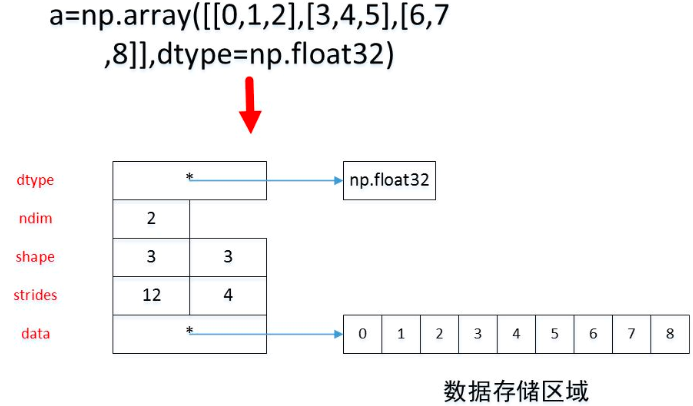

### ndarray

#### `ndarray`对象的内存结构



`ndim`:显示数组的轴线数量; `shape`:显示再每个维度里的数组的大小; `size`: 数组中所有元素的总量; `dtype`:显示数组元素的类型; `itemsize`:数组中每个元素的字节存储大小; `strides`: 是一个整数元组，每个轴上相邻两个元素的地址差。轴的下标增加1时，数据存储区中的指针增加的字节数; `data`:指向数组的数据的存储区。元素在数据存储区中的排列格式有两种：`C`语言格式和`Fortran`语言格式。

`C`语言中，多维数组的第`0`轴是最外层的。即`0`轴的下标增加`1`时，元素的地址增加的字节数最多；`Fortran`语言中，多维数组的第`0`轴是最内层的。即`0`轴的下标增加`1`时，元素的地址增加的字节数最少。`numpy`中默认是以 `C`语言格式存储数据。如果希望改为`Fortran`格式，则只需要在创建数组时，设置`order`参数为`"F"

数组的`flags`属性描述了数据存储区域的一些属性。你可以直接查看`flags`属性，也可以单独获取其中某个标志值。`C_CONTIGUOUS`:数据存储区域是否是`C`语言格式的连续区域; `F_CONTIGUOUS`:数据存储区域是否是`F`语言格式的连续区域; `OWNDATA`:数组是否拥有此数据存储区域。当一个数组是其他数组的视图时，它并不拥有数据存储区域，通过视图数组的`base`属性可以获取保存数据存储区域的那个原始数组。修改数组的内容时，会直接修改数据存储区域。所有使用该数据存储区域的数组都将被同时修改。数组的转置可以通过其`T`属性获取。转置数组可以简单的将其数据存储区域看作是`Fortran`语言格式的连续区域，并且它不拥有数据存储区域。

`numpy` 有自己的浮点数类型： `float16/float32/float64/float128`等等。在需要指定`dtype`参数时，你可以使用`numpy.float16`，也可以传递一个表示数值类型的字符串。`dtype`是一种对象，它不同于数值类型。只有`dtype.type`才能获取对应的数值类型。使用`ndarray.astype()`方法可以对数组元素类型进行转换。

你可以使用`ndarray.reshape()`方法调整数组的维度。可以直接修改`ndarry`的`shape`属性，此时直接修改原始数组。

可以通过`ndarray.view()`方法，从同一块数据区创建不同的`dtype`数组。即使用不同的数值类型查看同一段内存中的二进制数据。它们使用的是**同一块内存**。

当处理`ndarray`时，它的数据存储区有时被拷贝，但有时并不被拷贝。有三种情况。完全不拷贝：简单的赋值操作并不拷贝`ndarray`的任何数据，这种情况下是新的变量引用`ndarray`对象。视图和浅拷贝：不同的`ndarray`可能共享相同的数据存储区。如`ndarray.view()`方法创建一个新的`ndarray`但是与旧`ndarray`共享相同的数据存储区。新创建的那个数组称作视图数组。对于视图数组，`ndarray.base`返回的是拥有数据存储区的那个底层`ndarray`。而非视图数组的`ndarray.base`返回`None`。`ndarray.flags.owndata`返回数组是否拥有基础数据。对于数组的分片操作返回的是一个`ndarray`的视图。对数组的索引返回的不是视图，而是含有基础数据。深拷贝：`ndarray.copy()`操作会返回一个完全的拷贝，不仅拷贝`ndarray`也拷贝数据存储区。

#### 数组的创建

有几个共同的参数`a`：一个`array-like`类型的实例，它不一定是数组，可以为`list`、`tuple`、`list of tuple`、`list of list`、`tuple of list`、`tuple of tuple`等等。`dtype`：数组的值类型，默认为`float`。可以指定`Python`的标准数值类型，也可以使用`numpy`的数值类型如：`numpy.int32`或者`numpy.float64`等等。`order`：指定存储多维数据的方式。可以为`'C'`，表示按行优先存储（C风格）；可以为`'F'`，表示按列优先存储。对于`**_like()`函数，`order`可以为：`'C'`，`'F'`，`'A'`表示结果的`order`与`a`相同，`'K'`表示结果的`order`与`a`尽可能相似。`subok`：`bool`值。如果为`True`则：如果`a`为`ndarray`的子类，则结果类型与`a`类型相同。如果为`False`则：结果类型始终为`ndarray`。默认为`True`。

| 函数                                              | 描述                                                         |
| ------------------------------------------------- | ------------------------------------------------------------ |
| `np.empty(shape[,dtype, order]) empty_like(a)`    | 返回一个新的`ndarray`，但是没有初始化元素。因此其内容是随机的。 |
| `np.eye(N[,M, K, dtype]) identity(n[,dtype])`     | 返回一个二维数组，对角线元素为1，其余元素为0。               |
| `full(shape,fill_value)`                          |                                                              |
| `fromfile(file[,dtype, count, sep])`              | 从二进制文件或者文本文件中读取数据返回`ndarray`。            |
| `fromfunction(function,shape,**kwargs)`           |                                                              |
| `fromiter(iterable, dtype[, count])`              | 从可迭代对象中迭代获取数据创建一维`ndarray`。                |
| `fromstring(string[, dtype, count, sep])`         | 从字符串或者`raw binary`中创建一维`ndarray`。如果`sep`为空字符串则`string`将按照二进制数据解释 |
| `logspace(start, end[, num, endpoint, base,...])` | 采样点开始于`base^start`，结束于`base^stop`。`base`为对数的基，默认为 10。 |
| `loadtxt(fname[, dtype, comments, delimiter])`    | 从文本文件中加载数据创建`ndarray`，要求文本文件每一行都有相同数量的数值。 |

#### 数组的索引

###### 一维数组的索引

一维数组的索引和列表相同。假设`a1` 是一维数组。可以指定一个整数`i`作为索引下标，如`a1[i]`；可以指定一个切片作为索引下标，如`a1[i:j]`。通过切片获得的新的数组是原始数组的一个视图，它与原始数组共享相同的一块数据存储空间；可以指定一个整数列表对数组进行存取，如`a1[[i1,i2,i3]]`。此时会将列表中的每个整数作为下标(`i1/i2/i3`)，使用列表作为下标得到的数组为 `np.array([a1[i1],a1[i2],a1[i3]])`不和原始数组共享数据；可以指定一个整数数组作为数组下标，如`a1[a2]`此时会得到一个形状和下标数组`a2`相同的新数组。新数组的每个元素都是下标数组中对应位置的值作为下标从原始数组中获得的值。新数组不和原始数组共享数据。可以指定一个布尔数组作为数组下标，如`a1[b]`。此时将获得数组`a1`中与数组`b`中的`True`对应的元素。新数组不和原始数组共享数据。布尔数组的形状与数组`a1` 完全相同，它就是一个`mask` 

###### 多维数组的索引

多维数组使用元组作为数组的下标，如`a[1,2]`，当然你也可以添加圆括号为`a[(1,2)]`。多维数组的下标必须是一个长度和数组的维度`ndim`相等的元组。如果下标元组的长度大于数组的维度`ndim`，则报错如果下标元组的长度小于数组的维度`ndim`，则在元组的后面补 `:`，使得下标元组的长度等于数组维度`ndim`。如果下标对象不是元组，则`Numpy`会首先将其转换为元组。

多维数组的下标元组的元素可能为下列类型之一：整数、切片、整数数组、布尔数组。如果不是这些类型，如列表或者元组，则将其转换成整数数组。多维数组的**下标全部是整数或者切片**：索引得到的是元素数组的一个视图。多维数组的**下标全部是整数数组**：假设多维数组为$\mathbf{X}$。假设这些下标整数数组依次为$A_{1}, A_{2}, \cdots, A_{n}$。这$n$个数组必须满足广播条件。假设它们进行广播之后的维度为$\mathbf{M}$，形状为$\left(d_{0}, d_{1}, \cdots, d_{M-1}\right)$即：广播之后有$M$个轴：第 0 轴长度为$d_0$，...，第$M-1$轴长度为$d_{M-1}$。假设$A_{1}, A_{2}, \cdots, A_{n}$经过广播之后分别为数组$A_{1}^{\prime}, A_{2}^{\prime}, \cdots, A_{n}^{\prime}$则：索引的结果也是一个数组 $R$，结果数组$R$的维度为$M$，形状为$\left(d_{0}, d_{1}, \cdots, d_{M-1}\right)$。其中$R\left[i_{0}, i_{1}, \cdots, i_{M-1}\right]=$
$X\left[A_{1}^{\prime}\left[i_{0}, i_{1}, \cdots, i_{M-1}\right], A_{2}^{\prime}\left[i_{0}, i_{1}, \cdots, i_{M-1}\right], \cdots, A_{n}^{\prime}\left[i_{0}, i_{1}, \cdots, i_{M-1}\right]\right]$。多维数组的下标包含整数数组、切片：则切片/整数下标与整数数组下标分别处理。多维数组的下标是布尔数组或者下标元组中包含了布尔数组，则相当于将布尔数组通过`nonzero` 将布尔数组转换成一个整数数组的元组，然后使用整数数组进行下标运行。`nonzero(a)`返回数组`a`中，值非零的元素的下标。它返回值是一个长度为`a.ndim`的元组，元组的每个元素都是一个一维的整数数组，其值为非零元素的下标在对应轴上的值。

对于数组，如果我们不考虑下标数组的情况，也就是：其下标仅仅为整数、或者切片，则有：每次下标中出现一个整数下标，则索引结果的维度降 1。该维度被吸收掉。每次下标中出现一个切片下标，则该维度保持不变。

多维数组的下标必须是一个长度和数组的维度`ndim`相等的元组。但是如果下标中包含`None`，则可以突破这一限制。每多一个`None`，则索引结构维度升 1 。当数组的下标元组的长度小于等于数组的维度`ndim`时，元组中出现的`None`等价于切片`:`。当数组的下标元组的长度大于数组的维度`ndim`时，元组中哪里出现`None`，索引结果就在哪里创建一个新轴，该轴长度为 1。

##### 操作多维数组

| 函数                                      | 描述                                                         |
| ----------------------------------------- | ------------------------------------------------------------ |
| `concatenate((a1,a2,...), axis=0)`        | 连接多个数组。其中`(a1,a2,...)`为数组的序列，给出了待连接的数组，它们沿着`axis`指定的轴连接。 |
| `vstack(tup)`                             | 沿着 0 轴拼接数组                                            |
| `hstack(tup)`                             | 沿着 1 轴拼接数组                                            |
| `column_stack(tup)`                       | 类似于`hstack`，但是如果被拼接的数组是一维的，则将其形状修改为二维的`(N,1)`。 |
| `c_`                                      | 对象的`[]`方法也可以用于按列连接数组。但是如果被拼接的数组是一维的，则将其形状修改为二维的`(N,1)`。 |
| `split(ary, indices_or_sections, axis=0)` | 用于沿着指定的轴拆分数组`ary`。`indices_or_sections`指定了拆分点：如果为整数`N`，则表示平均拆分成`N`份。如果不能平均拆分，则报错 如果为序列，则该序列指定了划分区间--无需指定最开始的`0`起点和终点。 |
| `transpose(a, axis=None)`                 | 重置轴序。如果`axes=None`，则默认重置为逆序的轴序（如原来的`shape=(1,2,3)`，逆序之后为`(3,2,1)`）。如果`axes!=None`，则要给出重置后的轴序。它获得的是原数组的视图。 |
| `swapaxes(a, axis1, axis2)`               | 交换指定的两个轴`axis1/axis2`。它获得是原数组的视图。        |

##### Nan和无穷大

在`numpy`中，有几个特殊的数：`numpy.nan`表示`NaN`，它并不等价于`numpy.inf`。`numpy.inf`：正无穷。`numpy.PINF`：正无穷

| 函数                 | 描述                                                       |
| -------------------- | ---------------------------------------------------------- |
| `isnan(x[, out])`    | 返回`x`是否是个`NaN`，其中`x`可以是标量，可以是数组        |
| `isfinite(x[, out])` | 返回`x`是否是个有限大小的数，其中`x`可以是标量，可以是数组 |
| `isposinf(x[, out])` | 返回`x`是否是个正无穷大的数，其中`x`可以是标量，可以是数组 |
| `isneginf(x[, out])` | 返回`x`是否是个负无穷大的数，其中`x`可以是标量，可以是数组 |
| `isinf(x[, out])`    | 返回`x`是否是个无穷大的数，其中`x`可以是标量，可以是数组   |

#### `ufunc`函数

基本上所有的`ufunc`函数可以指定一个`out`参数来保存计算结果数组，并返回`out`数组。同时如果未指定`out`参数，则创建新的数组来保存计算结果。如果你指定了`out`参数，则要求`out`数组与计算结果兼容。即：数组的尺寸要严格匹配，并且数组的`dtype`要匹配。

###### 广播

当使用`ufunc`函数对两个数组进行计算时，`ufunc`函数会对这两个数组的对应元素进行计算。这就要求这两个数组的形状相同。如果这两个数组的形状不同，就通过广播`broadcasting`进行处理：首先让所有输入数组都向其中维度最高的数组看齐。看齐方式为：在`shape`属性的左侧插入数字`1`。然后输出数组的`shape`属性是输入数组的`shape`属性的各轴上的最大值。如果输入数组的某个轴的长度为 1，或者与输出数组的各对应轴的长度相同，该数组能正确广播。否则计算出错。当输入数组的某个轴的长度为 1时，沿着此轴运算时都用此轴上的第一组值。

你可以通过`ndarray.repeat()`方法来手动重复某个轴上的值.其用法为`ndarray.repeat(repeats, axis=None)`，其中：`repeats`为重复次数。`axis`指定被重复的轴，即沿着哪一轴重复。如果未指定，则将数组展平然后重复。返回的也是一个展平的数组。被重复的是该轴的每一组值。

由于`python`中的布尔运算使用`and/or/not`关键字，因此它们无法被重载。`numpy`提供的数组布尔运算只能通过`ufunc`函数进行，这些函数以`logical_`开头。进行逻辑运算时，对于数值零视作`False`；对数值非零视作`True`。运算结果也是一个布尔类型的数组：与：`ufunc`函数的形式：`numpy.logical_and(x1,x2[,out=y])`; 或：`ufunc`函数的形式：`numpy.logical_or(x1,x2[,out=y])`; 否定：`ufunc`函数的形式：`numpy.logical_not(x[,out=y])`; 异或：`ufunc`函数的形式：`numpy.logical_xor(x1,x2[,out=y])`

###### 自定义`ufunc`函数

可以通过`frompyfunc()`将计算单个元素的函数转换成`ufunc`函数。调用格式为：`my_ufunc=frompyfunc(func,nin,nout)`。其中：`func`：计算单个元素的函数；`nin`：`func`的输入参数的个数；`nout`：`func`返回值的个数。调用时，使用`my_ufunc(...)`即可。也可以通过`vectorize()`函数来实现`frompyfunc()`的功能。其原型为： `np.vectorize(func, otypes='', doc=None, excluded=None)`。其中：`func`：计算单个元素的函数；`otypes`：可以是一个表示结果数组元素类型的字符串，也可以是一个类型列表。如果使用类型列表，可以描述多个返回数组的元素类型；`doc`：函数的描述字符串。若未给定，则使用`func.__doc__`；`excluded`：指定`func`中哪些参数未被向量化。你可以指定一个字符串和整数的集合，其中字符串代表关键字参数，整数代表位置参数。

`ufunc.reduce`方法：类似于`Python`的`reduce`函数，它沿着`axis`参数指定的轴，对数组进行操作。相当于将`<op>`运算符插入到沿着`axis`轴的所有元素之间：`<op>.reduce(array,axis=0,dtype=None)`；经过一次`reduce`，结果数组的维度降低一维；`ufunc.accumulate`方法：它类似于`reduce()`的计算过程，但是它会保存所有的中间计算结果，从而使得返回数组的形状和输入数组的形状相同。`ufunc.outer`方法：相当于将`<op>`运算符对输入数组`A`和输入数组`B`的每一对元素对`(a,b)`起作用：`<op>.reduce(A,B)`。结果数组维度为`A.dim+B.dim`。设`A`的`shape=(4,5)`，`B`的`shape`为`(4,)`，则结果数组的`shape=(4,5,4)`；一维数组和一维数组的`outer`操作为二维数组；多维数组的`outer`拆分成各自的一维操作。

#### 函数库

##### 随机数库

| 函数                                  | 描述                                                         |
| ------------------------------------- | ------------------------------------------------------------ |
| `numpy.random.rand(d0, d1, ..., dn)`  | 指定形状`(d0, d1, ..., dn)`创建一个随机的`ndarray`。每个元素值来自于半闭半开区间`[0,1)`并且服从均匀分布。 |
| `numpy.random.randn(d0, d1, ..., dn)` | 指定形状`(d0, d1, ..., dn)`创建一个随机的`ndarray`。每个元素值服从正态分布，其中正态分布的期望为0，方差为1 |
| `randint(low[, high, size])`          | 返回一个随机的整数`ndarray`或者一个随机的整数值。            |
| `choice(a[, size, replace, p])`       | 从一维数组中采样产生一组随机数或者一个随机数                 |
| `random_sample([size])`               | 返回一个随机的浮点`ndarray`或者一个随机的浮点值，浮点值是`[0.0,1.0)`之间均匀分布的随机数 |
| `shuffle(x)`                          | 原地随机混洗`x`的内容，返回`None`。`x`为`array-like`对象，原地修改它 |
| `permutation(x)`                      | 随机重排`x`，返回重排后的`ndarray`。`x`为`array-like`对象，不会修改它 |

类式用法主要使用`numpy.random.RandomState`类，它是一个`Mersenne Twister`伪随机数生成器的容器。它提供了一些方法来生成各种各样概率分布的随机数。构造函数:`RandomState(seed)`。其中`seed`可以为`None`, `int`, `array_like`。这个`seed`是初始化伪随机数生成器。如果`seed`为`None`，则`RandomState`会尝试读取`/dev/urandom`或者`Windows analogure`来读取数据，或用者`clock`来做种子。

##### 统计量

这里是共同的参数：`a`：一个`array_like`对象。`axis`：可以为为`int`或者`tuple`或者`None`：`None`：将`a`展平，在整个数组上操作。`int`：在`a`的指定轴线上操作。如果为`-1`，表示沿着最后一个轴（0轴为第一个轴）。`tuple of ints`：在`a`的一组指定轴线上操作。`out`：可选的输出位置。必须与期望的结果形状相同。`keepdims`：如果为`True`，则结果数组的维度与原数组相同，从而可以与原数组进行广播运算。

| 函数                                                         | 描述                                                         |
| ------------------------------------------------------------ | ------------------------------------------------------------ |
| `minimum(x1, x2[, out])`                                     | 返回两个数组`x1`和`x2`对应位置的最小值。要求`x1`和`x2`形状相同或者广播之后形状相同。 |
| `histogram(a, bins=10, range=None, normed=False, weights=None, density=None)` | 计算一组数据的直方图。如果`a`不是一维的，则展平为一维。`bins`指定了统计的区间个数 |
| `amin(a[, axis, out, keepdims])`                             | 返回`a`中指定轴线上的最大值（数组）、或者返回`a`上的最小值（标量）。 |
| `nanmin(a[, axis, out, keepdims])`                           | 返回`a`中指定轴线上的最小值（数组）、或者返回`a`上的最小值（标量），忽略`NaN`。 |
| `ptp(a[, axis, out])`                                        | 返回`a`中指定轴线上的`最大值减去最小值`（数组），即`peak to peak` |
| `argmin(a, axis=None, out=None)`                             | 返回`a`中指定轴线上最小值的下标                              |
| `percentile(a, q[, axis, out, ...])`                         | 返回`a`中指定轴线上`qth 百分比`数据。`q=50`表示 50% 分位。你可以用列表或者数组的形式一次指定多个 `q`。 |
| `nanpercentile(a, q[, axis, out, ...])`                      |                                                              |
| `partition(a, kth, axis=-1, kind='introselect', order=None)` | 它将数组执行划分操作：第$k$位左侧的数都小于第$k$；第$k$位右侧的数都大于等于第$k$。它返回划分之后的数组 |
| `numpy.argpartition(a, kth, axis=-1, kind='introselect', order=None)` | 返回执行划分之后的下标对应于数组划分之前的位置。             |
| `sort(a, axis=-1, kind='quicksort', order=None)`             | 返回`a`在指定轴上排序后的结果并不修改原数组。                |
| `argsort(a, axis=-1, kind='quicksort', order=None)`          | 返回`a`在指定轴上排序之后的下标对应于数组划分之前的位置。    |
| `searchsorted(a, v, side='left', sorter=None)`               | 要求`a`是个已排序好的一维数组。本函数将`v`插入到 `a`中，从而使得数组`a`维持一个排序好的数组。函数返回的是`v`应该插入的位置。`side`指定若发现数值相等时，插入左侧`left`还是右侧`right` |
| `lexsort(keys, axis=-1)`                                     |                                                              |
| `sum(a, axis=None, dtype=None, out=None, keepdims=False)`    |                                                              |
| `prod, median, average, mean, std, var`                      |                                                              |
| `corrcoef(x[, y, rowvar, bias, ddof])`                       | 返回皮尔逊积差相关                                           |
| `correlate(a, v[, mode])`                                    | 返回两个一维数组的互相关系数                                 |
| `cov(m[, y, rowvar, bias, ddof, fweights, ...])`             | 返回协方差矩阵                                               |
| `unique(ar, return_index=False, return_inverse=False, return_counts=False)` | 返回`ar`中所有不同的值组成的一维数组。如果`ar`不是一维的，则展平为一维。 |
| `bincount(x[, weights, minlength])`                          | 计算每个数出现的次数。它要求数组中所有元素都是非负的。其返回数组中第`i`个元素表示：整数`i`在`x`中出现的次数。要求`x`必须一维数组，否则报错。 |
| `digitize(x, bins, right=False)`                             | 离散化。如果`x`不是一维的，则展平为一维。它返回一个数组，该数组中元素值给出了`x`中的每个元素将对应于统计区间的哪个区间。区间由`bins`这个一维数组指定。 |

##### 分段函数

`numpy.where(condition[, x, y])`：它类似于`python`的 `x if condition else y`。`condition/x/y`都是数组，要求形状相同或者通过广播之后形状相同。产生结果的方式为： 如果`condition`某个元素为`True`或者非零，则对应的结果元素从`x`中获取；否则对应的结果元素从`y`中获取 

`numpy.select(condlist, choicelist, default=0)`。其中`condlist`为长度为 `N`的列表，列表元素为数组，给出了条件数组。`choicelist`为长度为`N`的列表，列表元素为数组，给出了结果被选中的候选值。所有数组的长度都形状相同，如果形状不同，则执行广播。结果数组的形状为广播之后的形状。

结果筛选规则如下：从`condlist`左到右扫描，若发现第 `i` 个元素（是个数组）对应位置为`True`或者非零，则输出元素来自`choicelist` 的第  `i`  个元素（是个数组）。因此若有多个`condlist`的元素满足，则只会使用第一个遇到的。如果扫描结果是都不满足，则使用`default`

`numpy.piecewise(x, condlist, funclist, *args, **kw)`。`x`：为分段函数的自变量取值数组。`condlist`：为一个列表，列表元素为布尔数组，数组形状和`x`相同。`funclist`：为一个列表，列表元素为函数对象。其长度与`condlist`相同或者比它长1。当`condlist[i]`对应位置为 `True`时，则该位置处的输出值由 `funclist[i]`来计算。如果`funclist`长度比`condlist`长1，则当所有的`condlist`都是`False`时，则使用 `funclist[len(condlist)]`来计算。如果有多个符合条件，则使用最后一个遇到的。列表元素可以为数值，表示一个返回为常数值（就是该数值）的函数。`args/kw`：用于传递给函数对象`funclist[i]`的额外参数。

##### 多项式函数

```python
numpy.poly1d(c_or_r, r=0, variable=None)
```

`c_or_r`：一个数组或者序列。其意义取决于`r`。`r`：布尔值。如果为`True`，则`c_or_r`指定的是多项式的根；如果为`False`，则`c_or_r`指定的是多项式的系数。`variable`：一个字符串，指定了打印多项式时，用什么字符代表自变量。默认为`x`

多项式的属性有：`.coeffs`属性：多项式的系数。`.order`属性：多项式最高次的次数。`.variable`属性：自变量的代表字符

多项式的方法有：`.deriv(m=1)`方法：计算多项式的微分。可以通过参数`m`指定微分次数。`.integ(m=1,k=0)`方法：计算多项式的积分。可以通过参数`m`指定积分次数和`k`积分常量

操作一元多项式类的函数：多项式对象可以像函数一样，返回多项式的值多项式对象进行加减乘除，相当于对应的多项式进行计算。也可以使用对应的`numpy.polyadd/polysub/polymul/polydiv/`函数。`numpy.polyder/numpy.polyint`：进行微分/积分操作。`numpy.roots`函数：求多项式的根

使用`np.polyfit(x, y, deg, rcond=None, full=False, w=None, cov=False)`函数可以对一组数据使用多项式函数进行拟合（最小均方误差）。其参数为：`x`：数据点的`x`坐标序列。`y`：数据点的`y`坐标序列。如果某个`x`坐标由两个点，你可以传入一个二维数组。`deg`：拟合多项式的次数。`rcond`：指定了求解过程中的条件：当`某个特征值/最大特征值<rcond`时，该特征值被抛弃。`full`：如果为`False`，则仅仅返回拟合多项式的系数；如果为`True`，则更多的结果被返回。`w`：权重序列。它对`y`序列的每个位置赋予一个权重。`cov`：如果为`True`，则返回相关矩阵。如果`full`为`True`，则不返回。

`numpy`提供了更丰富的多项式函数类。注意其中的多项式的系数按照次数从小到大排列。`numpy.polynomial.Polynomial`：一元多次多项`numpy.polynomial.Chebyshev`：切比雪夫多项式； `numpy.polynomial.Laguerre`：拉盖尔多项式；`numpy.polynomial.Legendre`：勒让德多项式；`numpy.polynomial.Hermite`：哈米特多项式`numpy.polynomial.HermiteE`：`HermiteE`多项式

所有的这些多项式的构造函数为： `XXX(coef, domain=None, window=None)`。其中`XXX`为多项式类名。`domain`为自变量取值范围，默认为`[-1,1]`。`window`指定了将`domain`映射到的范围，默认为`[-1,1]`。所有的这些多项式可以使用的方法为：四则运行。`.basis(deg[, domain, window])`：获取转换后的一元多项式。`.convert(domain=None, kind=None, window=None)`：转换为另一个格式的多项式。`kind`为目标格式的多项式的类。`.degree()`：返回次数。`.fit(x, y, deg[, domain, rcond, full, w, window])`：拟合数据，返回拟合后的多项式。`.fromroots(roots[, domain, window])`：从根创建多项式。`.has_samecoef(other)`、`.has_samedomain(other)`、`.has_sametype(other)` 、`.has_samewindow(other)`：判断是否有相同的系数/`domain`/类型/`window`。`.roots()`：返回多项式的根。`.trim([tol])`：将系数小于 `tol`的项截掉

##### 内积、外积、张量积

`numpy.dot(a, b, out=None)`：计算矩阵的乘积。对于一维数组，他计算的是内积；对于二维数组，他计算的是线性代数中的矩阵乘法。`numpy.vdot(a, b)`：返回一维向量之间的点积。如果`a`和`b`是多维数组，则展平成一维再点积。`numpy.inner(a, b)`：计算矩阵的内积。对于一维数组，它计算的是向量点积；对于多维数组，则它计算的是：每个数组最后轴作为向量，由此产生的内积。`numpy.outer(a, b, out=None)`：计算矩阵的外积。它始终接收一维数组。如果是多维数组，则展平成一维数组。

`numpy.tensordot(a, b, axes=2)`：计算张量乘积。`axes`如果是个二元序列，则第一个元素表示`a`中的轴；第二个元素表示`b`中的轴。将这两个轴上元素相乘之后求和。其他轴不变`axes`如果是个整数，则表示把`a`中的后`axes`个轴和`b`中的前`axes`个轴进行乘积之后求和。其他轴不变

叉乘：`numpy.cross(a, b, axisa=-1, axisb=-1, axisc=-1, axis=None)`:计算两个向量之间的叉乘。叉积用于判断两个三维空间的向量是否垂直。要求`a`和`b`都是二维向量或者三维向量，否则抛出异常。

##### 线性代数

逆矩阵：`numpy.linalg.inv(a)`：获取`a`的逆矩阵（一个`array-like`对象）。如果传入的是多个矩阵，则依次计算这些矩阵的逆矩阵。如果`a`不是方阵，或者`a`不可逆则抛出异常

对角线和：`numpy.trace(a, offset=0, axis1=0, axis2=1, dtype=None, out=None)`：返回对角线的和。如果`a`是二维的，则直接选取对角线的元素之和（`offsert=0`），或者对角线右侧偏移`offset`的元素之和（即选取`a[i,i+offset]`之和）

`numpy.linalg.solve(a,b)`：计算线性方程的解`ax=b`，其中`a`为矩阵，要求为秩不为0的方阵，`b`为列向量（长度等于方阵大小）；或者`a`为标量，`b`也为标量。如果`a`不是方阵或者`a`是方阵但是行列式为0，则抛出异常

`numpy.linalg.eig(a)`：计算矩阵的特征值和右特征向量。如果不是方阵则抛出异常，如果行列式为0则抛出异常。

奇异值分解：`numpy.linalg.svd(a, full_matrices=1, compute_uv=1)`：对矩阵`a`进行奇异值分解，将它分解成`u*np.diag(s)*v`的形式，其中`u`和`v`是酉矩阵，`s`是`a`的奇异值组成的一维数组。 其中：`full_matrics`:如果为`True`，则`u`形状为`(M,M)`，`v`形状为`(N,N)`；否则`u`形状为`(M,K)`，`v`形状为`(K,N)`，`K=min(M,N)`。`compute_uv`：如果为`True`则表示要计算`u`和`v`。默认为`True`。返回`u`、`s`、`v`的元组。如果不可分解则抛出异常