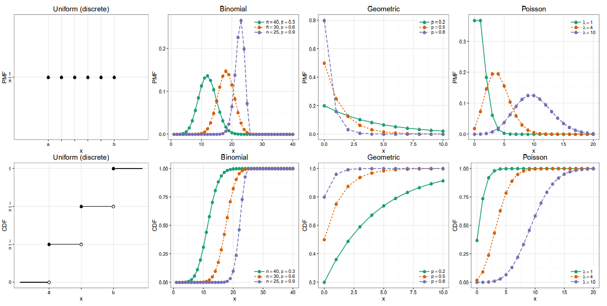
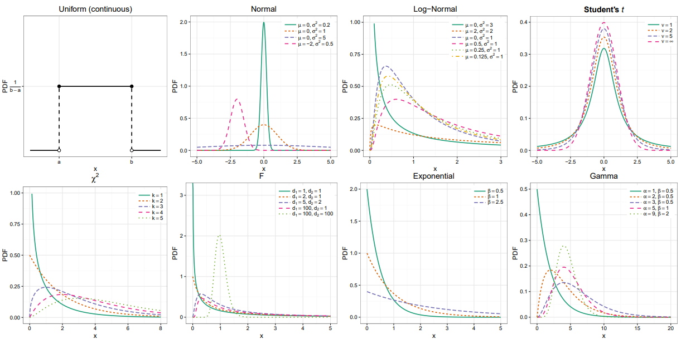

Distribution overview

###### Discrete Distribution

|                   | Notation                         | $F_X(x)$                                              | $f_X(x)$                                                     | $E[X]$                                                       | $\mathbf{V}[X]$                    | $M_X(s)$                                          |
| ----------------- | -------------------------------- | ----------------------------------------------------- | ------------------------------------------------------------ | ------------------------------------------------------------ | ---------------------------------- | ------------------------------------------------- |
| Uniform           | $Unif \{a, \cdot\cdot\cdot, b\}$ |                                                       | $\frac{I(a \leq x \leq b)}{b-a+1}$                           | $\frac{a+b}{2}$                                              | $\frac{(b-a +1)^2-1}{12}$          | $\frac{e^{a s}-e^{-(b+1) s}}{s(b-a)}$             |
| Bernoulli         | $Bern(p)$                        | $(1-p)^{1-x}$                                         | $p^{x}(1-p)^{1-x}$                                           | $p$                                                          | $p(1-p)$                           | $1-p+p e^{s}$                                     |
| Binomial          | $Bin(n,p)$                       | $I_{1-p}(n-x, x+1)$                                   | $\left( \begin{array}{l}{n} \\ {x}\end{array}\right) p^{x}(1-p)^{n-x}$ | $np$                                                         | $np(1-p)$                          | $\left(1-p+p e^{s}\right)^{n}$                    |
| Multinomial       | $Mult(n, p)$                     |                                                       | $\frac{n !}{x_{1} ! \ldots x_{k} !} p_{1}^{x_{1}} \cdots p_{k}^{x_{k}} \quad \sum_{i=1}^{k} x_{i}=n$ | $\left( \begin{array}{c}{n p_{1}} \\ {\vdots} \\ {n p_{k}}\end{array}\right)$ |                                    | $\left(\sum_{i=0}^{k} p_{i} e^{s_{i}}\right)^{n}$ |
| Hypergeometric    | $Hyp(N, m, n)$                   |                                                       | $\frac{\left( \begin{array}{c}{m} \\ {x}\end{array}\right) \left( \begin{array}{c}{N-m} \\ {n-x}\end{array}\right)}{\left( \begin{array}{c}{N} \\ {n}\end{array}\right)}$ | $\frac{nm}{N}$                                               | $\frac{n m(N-n)(N-m)}{N^{2}(N-1)}$ |                                                   |
| Negative Binomial | $NBin(r, p)$                     | $I_{p}(r, x+1)$                                       | $\left( \begin{array}{c}{x+r-1} \\ {r-1}\end{array}\right) p^{r}(1-p)^{x}$ | $r\frac{1-p}{p}$                                             | $r\frac{1-p}{p^2}$                 | $\left(\frac{p}{1-(1-p) e^{s}}\right)^{r}$        |
| Geometric         | $Geo(p)$                         | $1-(1-p)^{x} \quad x \in \mathbb{N}^{+}$              | $p(1-p)^{x-1} \quad x \in \mathbb{N}^{+}$                    | $\frac{1}{p}$                                                | $\frac{1-p}{p^2}$                  | $\frac{p e^{s}}{1-(1-p) e^{s}}$                   |
| Poisson           | $Po(\lambda)$                    | $e^{-\lambda} \sum_{i=0}^{x} \frac{\lambda^{i}}{i !}$ | $\frac{\lambda^{x} e^{-\lambda}}{x !}$                       | $\lambda$                                                    | $\lambda$                          | $e^{\lambda\left(e^{s}-1\right)}$                 |

###### Continuous Distribution

|               | Notation                       | $F_X(x)$                                                     | $f_X(x)$                                                     | $E[X]$                                         | $V[X]$                                                       | $M_X(s)$                                                     |
| ------------- | ------------------------------ | ------------------------------------------------------------ | ------------------------------------------------------------ | ---------------------------------------------- | ------------------------------------------------------------ | ------------------------------------------------------------ |
| Uniform       | $Unif(a, b)$                   |                                                              | $\frac{I(a<x<b)}{b-a}$                                       | $\frac{a+b}{2}$                                | $\frac{(b-a)^2}{12}$                                         | $\frac{e^{s b}-e^{s a}}{s(b-a)}$                             |
| Normal        | $\mathcal{N}(\mu, \sigma^2)$   | $\Phi(x)=\int_{-\infty}^{x} \phi(t) d t$                     | $\phi(x)=\frac{1}{\sigma \sqrt{2 \pi}} \exp \left\{-\frac{(x-\mu)^{2}}{2 \sigma^{2}}\right\}$ | $\mu$                                          | $\sigma^2$                                                   | $\exp \left\{\mu s+\frac{\sigma^{2} s^{2}}{2}\right\}$       |
| Log-Normal    | $ln\mathcal{N}(\mu, \sigma^2)$ | $\frac{1}{2}+\frac{1}{2} \operatorname{erf}\left[\frac{\ln x-\mu}{\sqrt{2 \sigma^{2}}}\right]$ | $\frac{1}{x \sqrt{2 \pi \sigma^{2}}} \exp \left\{-\frac{(\ln x-\mu)^{2}}{2 \sigma^{2}}\right\}$ | $e^{\mu + \sigma^2/2}$                         | $\left(e^{\sigma^{2}}-1\right) e^{2 \mu+\sigma^{2}}$         |                                                              |
| Multi-Normal  | $MVN(\mu, \Sigma)$             |                                                              | $(2 \pi)^{-k / 2}\Sigma^{-1 / 2} e^{-\frac{1}{2}(x-\mu)^{T} \Sigma^{-1}(x-\mu)}$ | $\mu$                                          | $\Sigma$                                                     | $\exp \left\{\mu^{T} s+\frac{1}{2} s^{T} \Sigma s\right\}$   |
| Student's t   | $Student(\nu)$                 | $I_{x}\left(\frac{\nu}{2}, \frac{\nu}{2}\right)$             | $\frac{\Gamma\left(\frac{\nu+1}{2}\right)}{\sqrt{\nu \pi} \Gamma\left(\frac{\nu}{2}\right)}\left(1+\frac{x^{2}}{\nu}\right)^{-(\nu+1) / 2}$ | $0 \quad \nu>1$                                |                                                              |                                                              |
| Chi-square    | $\chi_{k}^{2}$                 | $\frac{1}{\Gamma(k / 2)} \gamma\left(\frac{k}{2}, \frac{x}{2}\right)$ | $\frac{1}{2^{k / 2} \Gamma(k / 2)} x^{k / 2-1} e^{-x / 2}$   | $k$                                            | $2k$                                                         | $(1-2 s)^{-k / 2} s<1 / 2$                                   |
| F             | $F(d_1, d_2)$                  | $I_{\frac{d_{1} x}{d_{1} x+d_{2}}}\left(\frac{d_{1}}{2}, \frac{d_{2}}{2}\right)$ | $\frac{\sqrt{\frac{\left(d_{1} x\right)^{d_{1}} d_{2}^{d_{2}}}{\left(d_{1} x+d_{2}\right)^{d_{1}} d_{2}^{d_{2}}}}}{x B\left(\frac{d_{1}}{2}, \frac{d_{1}}{2}\right)}$ | $\frac{d_{2}}{d_{2}-2}$                        | $\frac{2 d_{2}^{2}\left(d_{1}+d_{2}-2\right)}{d_{1}\left(d_{2}-2\right)^{2}\left(d_{2}-4\right)}$ |                                                              |
| Exponential   | $Exp(\beta)$                   | $1-e^{-x / \beta}$                                           | $\frac{1}{\beta} e^{-x / \beta}$                             | $\beta$                                        | $\beta^2$                                                    | $\frac{1}{1-\frac{s}{\beta}}(s<\beta)$                       |
| Gamma         | $Gamma(\alpha, \beta)$         | $\frac{\gamma(\alpha, \beta x)}{\Gamma(\alpha)}$             | $\frac{\beta^{\alpha}}{\Gamma(\alpha)} x^{\alpha-1} e^{-\beta x}$ | $\frac{\alpha}{\beta}$                         | $\frac{\alpha}{\beta^2}$                                     | $\left(\frac{1}{1-\frac{s}{\beta}}\right)^{\alpha}(s<\beta)$ |
| Inverse Gamma | $InvGamma(\alpha, \beta)$      | $\frac{\Gamma\left(\alpha, \frac{\beta}{x}\right)}{\Gamma(\alpha)}$ | $\frac{\beta^{\alpha}}{\Gamma(\alpha)} x^{-\alpha-1} e^{-\beta / x}$ | $\frac{\beta}{\alpha-1} \alpha>1$              | $\frac{\beta^{2}}{(\alpha-1)^{2}(\alpha-2)} \alpha>2$        | $\frac{2(-\beta s)^{\alpha / 2}}{\Gamma(\alpha)} K_{\alpha}(\sqrt{-4 \beta s})$ |
| Dirichlet     | $Dir(\alpha)$                  |                                                              | $\frac{\Gamma\left(\sum_{i=1}^{k} \alpha_{i}\right)}{\prod_{i=1}^{k} \Gamma\left(\alpha_{i}\right)} \prod_{i=1}^{k} x_{i}^{\alpha_{i}-1}$ | $\frac{\alpha_{i}}{\sum_{i=1}^{k} \alpha_{i}}$ | $\frac{\mathbb{E}\left[X_{i}\right]\left(1-\mathbb{E}\left[X_{i}\right]\right)}{\sum_{i=1}^{k} \alpha_{i}+1}$ |                                                              |
| Beta          | $\beta(\alpha, \beta)$         | $I_{x}(\alpha, \beta)$                                       | $\frac{\Gamma(\alpha+\beta)}{\Gamma(\alpha) \Gamma(\beta)} x^{\alpha-1}(1-x)^{\beta-1}$ | $\frac{\alpha}{\alpha+\beta}$                  | $\frac{\alpha \beta}{(\alpha+\beta)^{2}(\alpha+\beta+1)}$    | $1+\sum_{k=1}^{\infty}\left(\prod_{r=0}^{k-1} \frac{\alpha+r}{\alpha+\beta+r}\right) \frac{s^{k}}{k !}$ |
| Weibull       | $Weibull(\lambda, k)$          | $1-e^{-(x / \lambda)^{k}}$                                   | $\frac{k}{\lambda}\left(\frac{x}{\lambda}\right)^{k-1} e^{-(x / \lambda)^{k}}$ | $\lambda \Gamma\left(1+\frac{1}{k}\right)$     | $\lambda^{2} \Gamma\left(1+\frac{2}{k}\right)-\mu^{2}$       | $\sum_{n=0}^{\infty} \frac{s^{n} \lambda^{n}}{n !} \Gamma\left(1+\frac{n}{k}\right)$ |
| Pareto        | $Pareto(x_m, \alpha)$          | $1-\left(\frac{x_{m}}{x}\right)^{\alpha} x \geq x_{m}$       | $\alpha \frac{x_{m}^{\alpha}}{x^{\alpha+1}} \quad x \geq x_{m}$ | $\frac{\alpha x_{m}}{\alpha-1} \alpha>1$       | $\frac{x_{m}^{2} \alpha}{(\alpha-1)^{2}(\alpha-2)} \alpha>2$ | $\alpha\left(-x_{m} s\right)^{\alpha} \Gamma\left(-\alpha,-x_{m} s\right) s<0$ |

##### Probability Theory

###### Definitions
Sample space $Ω$: the only physical requirement on $\Omega$ is that a given performance of the experiment must be produce a result corresponding to exactly one of the point of $\Omega$. it is simply a set of points.

Outcome $ω ∈ Ω$

Event $A ⊆ Ω$: a subset of the $\Omega$, that is, a collection of points of the sample space.
$$
\begin{array}{l}{(a, b)=\bigcup_{n=1}^{\infty}\left(a, b-\frac{1}{n}\right]=\bigcup_{n=1}^{\infty}\left[a+\frac{1}{n}, b\right)} \\ {[a, b]=\bigcap_{n=1}^{\infty}\left[a, b+\frac{1}{n}\right)=\bigcap_{n=1}^{\infty}\left(a-\frac{1}{n}, b\right]}\end{array}
$$
• σ-algebra $\mathcal{A}$: a collection of subsets of $\Omega$ 
$$
\begin{array}{l}\Omega \in \mathcal{A}\\ {A_{1}, A_{2}, \ldots, \in \mathcal{A} \Longrightarrow \bigcup_{i=1}^{\infty} A_{i} \in \mathcal{A}} \\ {A \in \mathcal{A} \Longrightarrow \neg A \in \mathcal{A}}\end{array}
$$
Probability Distribution $P $: assign a number $P(A)$ to each set $A$ in the sigma field $\mathcal{A}$ is called a probability measure on $\mathcal{A}$
$$
\begin{array}{l}{\mathbb{P}[A] \geq 0 \quad \forall A} \\ {\mathbb{P}[\Omega]=1} \\ {\mathbb{P}\left[\bigcup_{i=1}^{\infty} A_{i}\right]=\sum_{i=1}^{\infty} \mathbb{P}\left[A_{i}\right]}, A _i\text{ disjoint sets in } \mathcal{A}\end{array}
$$
 Probability space $(Ω, A, P)$, where $\Omega$ is a set, $\mathcal{A}$ a sigma field of subsets of $\Omega$, and $P$ a probability measure on $\mathcal{A}$

若不允许重复，我们使用的是无重复抽样--sampling with replacement；若允许重复，则是重复抽样-- sampling with replacement。
$$
P\left(A_{1} \cup A_{2} \cup \cdots\right)=\sum_{n=1}^{\infty} P\left(A_{1}^{c} \cap \cdots \cap A_{n-1}^{\circ} \cap A_{n}\right) \leq \sum_{n=1}^{\infty} P\left(A_{n}\right)
$$

###### Property

$$
\begin{array}{1}\neg\left(\bigcup_{n} A_{n}\right)=\bigcap_{n} \neg A_{n} \quad \neg\left(\bigcap_{n} A_{n}\right)=\cup_{n} \neg A_{n}\\
\mathbb{P}\left[\bigcup_{n} A_{n}\right]=1-\mathbb{P}\left[\bigcap_{n} \neg A_{n}\right]\\
\text{Continuity of Probabilities}\\
A_{1} \subset A_{2} \subset \ldots \Longrightarrow \lim _{n \rightarrow \infty} \mathbb{P}\left[A_{n}\right]=\mathbb{P}[A] \quad \text { where } A=\bigcup_{i=1}^{\infty} A_{i}\\
A_{1} \supset A_{2} \supset \ldots \Longrightarrow \lim _{n \rightarrow \infty} \mathbb{P}\left[A_{n}\right]=\mathbb{P}[A] \quad \text { where } A=\bigcap_{i=1}^{\infty} A_{i}\\
\text{Independence}\\
A \perp B \Longleftrightarrow \mathbb{P}[A \cap B]=\mathbb{P}[A] \mathbb{P}[B]\\
\text{Conditional Probability}\\
\mathbb{P}[A | B]=\frac{\mathbb{P}[A \cap B]}{\mathbb{P}[B]} \quad \mathbb{P}[B]>0\\
\text{Law of Total Probability}\\
\mathbb{P}[B]=\sum_{i=1}^{n} \mathbb{P}\left[B | A_{i}\right] \mathbb{P}\left[A_{i}\right] \quad \Omega=\bigcup_{i=1}^{n} A_{i}\\
\text{Bayes’ Theorem}\\
\mathbb{P}\left[A_{i} | B\right]=\frac{\mathbb{P}\left[B | A_{i}\right] \mathbb{P}\left[A_{i}\right]}{\sum_{j=1}^{n} \mathbb{P}\left[B | A_{j}\right] \mathbb{P}\left[A_{j}\right]} \quad \Omega=\bigcup_{i=1}^{n} A_{i}
\end{array}
$$

##### Random Variables

若一个变量每一次的实现多对应一个概率，那么改变量称为随机变量。概率分布是描述一个随机变量的任意实现值和概率的对应关系的函数。 $X : \Omega \rightarrow \mathbb{R}$. 

a random variable on the probability space $(\Omega, \mathcal{A}, P)$ is a real valued function $R$ defined on $\Omega$, such that for every Borel subset $B$ of the reals, $\{\omega: R(\omega) \in B\}$ belongs to $\mathcal{A}$

the random variable $R$ is said to be discrete if the set of possible values of $R$ is finite or countably infinite.

if $R$ is defined on $\Omega$ by $R(\omega) = \omega$ then $P\{\omega : R(\omega) \in B\}=P(B)=\int_{B} f(x) d x$
$$
\begin{array}{1}\text{Probability Mass Function(PMF)}:f_{X}(x)=\mathbb{P}[X=x]=\mathbb{P}[\{\omega \in \Omega : X(\omega)=x\}]\\
\text{Probability Density Function(PDF)}:\mathbb{P}[a \leq X \leq b]=\int_{a}^{b} f(x) d x\\
\text{Cumulative Distribution Function(CDF)}:F_{X} : \mathbb{R} \rightarrow[0,1] \quad F_{X}(x)=\mathbb{P}[X \leq x]\\
\begin{array}{l}{\text { 1. Nondecreasing: } x_{1}<x_{2} \Longrightarrow F\left(x_{1}\right) \leq F\left(x_{2}\right)} \\ {\text { 2. Normalized: } \lim _{x \rightarrow-\infty}=0 \text { and } \lim _{x \rightarrow \infty}=1} \\ {\text { 3. Right-Continuous: } \lim _{y \downarrow x} F(y)=F(x)}\end{array}\\
\begin{array}{c}{\mathbb{P}[a \leq Y \leq b | X=x]=\int_{a}^{b} f_{Y|X}(y | x) d y} \\ {f_{Y | X}(y | x)=\frac{f(x, y)}{f_{X}(x)}}\end{array}\\
\text{Independence}\\
\begin{array}{l}{\mathbb{P}[X \leq x, Y \leq y]=\mathbb{P}[X \leq x] \mathbb{P}[Y \leq y]} \\ {f_{X, Y}(x, y)=f_{X}(x) f_{Y}(y)}\end{array}
\end{array}
$$

##### Transformations

Transformation function: $Z=\varphi(X)$
$$
\begin{array}{1}\text{Discrete}\\
f_{Z}(z)=\mathbb{P}[\varphi(X)=z]=\mathbb{P}[\{x : \varphi(x)=z\}]=\mathbb{P}\left[X \in \varphi^{-1}(z)\right]=\sum_{x \in \varphi^{-1}(z)} f_{X}(x)\\
\text{Continuous}\\
F_{Z}(z)=\mathbb{P}[\varphi(X) \leq z]=\int_{A_{z}} f(x) d x \quad \text { with } A_{z}=\{x : \varphi(x) \leq z\}\\
\text{Special case if } \varphi \text{ strictly monotone}\\
f_{Z}(z)=f_{X}\left(\varphi^{-1}(z)\right)\left|\frac{d}{d z} \varphi^{-1}(z)\right|=f_{X}(x)\left|\frac{d x}{d z}\right|=f_{X}(x) \frac{1}{|J|}\\
\text{The Rule of the Lazy Statistician}\\
\begin{array}{c}{\mathbb{E}[Z]=\int \varphi(x) d F_{X}(x)} \\ {\mathbb{E}\left[I_{A}(x)\right]=\int I_{A}(x) d F_{X}(x)=\int_{A} d F_{X}(x)=\mathbb{P}[X \in A]}\end{array}\\
\text{Convolution}\\
Z :=X+Y \quad f_{Z}(z)=\int_{-\infty}^{\infty} f_{X, Y}(x, z-x) d x \stackrel{X, Y \geq 0}{=} \int_{0}^{z} f_{X, Y}(x, z-x) d x\\
Z :=|X-Y| \quad f_{Z}(z)=2 \int_{0}^{\infty} f_{X, Y}(x, z+x) d x\\
Z :=\frac{X}{Y} \quad f_{Z}(z)=\int_{-\infty}^{\infty}|y| f_{X, Y}(y z, y) d y \stackrel{\perp}{=} \int_{-\infty}^{\infty}|y| f_{X}(y z) f_{Y}(y) d y
\end{array}
$$

##### Expectation

$$
\mathbb{E}[X]=\mu_{X}=\int x d F_{X}(x)=\left\{\begin{array}{ll}{\sum x f_{X}(x)} & {\mathrm{X} \text { discrete }} \\ {\int x f_{X}(x) d x} & {\mathrm{X} \text { continuous }}\end{array}\right.
$$

$$
\begin{array}{1}\mathbb{E}[X]=\sum_{x=1}^{\infty} \mathbb{P}[X \geq x]\\
\text{Simple mean}\\\overline{X}_{n}=\frac{1}{n} \sum_{i=1}^{n} X_{i}\\
\begin{array}{l}{\mathbb{E}[Y | X=x]=\int y f(y | x) d y} \\ {\mathbb{E}[X]=\mathbb{E}[\mathbb{E}[X | Y]]} \\ {\mathbb{E}[{\varphi(X, Y)|X=x}]= \int_{-\infty}^{\infty} \varphi(x, y) f_{Y | X}(y | x) d x}\end{array}\\
\begin{array}{l}{\mathbb{E}[\varphi(Y, Z) | X=x]=\int_{-\infty}^{\infty} \varphi(y, z) f_{(Y, Z) | X}(y, z | x) d y d z} \\ {\mathbb{E}[Y+Z | X]=\mathbb{E}[Y | X]+\mathbb{E}[Z | X]} \\ {\mathbb{E}[\varphi(X) Y | X]=\varphi(X) \mathbb{E}[Y | X]} \\ {\mathbb{E}[Y | X]=c \Longrightarrow \operatorname{Cov}[X, Y]=0}\end{array}
\end{array}
$$

##### Variance

###### covariance

$$
\begin{array}{l}{\operatorname{Cov}[a X, b Y]=a b \operatorname{Cov}[X, Y]} \\ {\operatorname{Cov}[X+a, Y+b]=\operatorname{Cov}[X, Y]} \\ {\operatorname{Cov}\left[\sum_{i=1}^{n} X_{i}, \sum_{j=1}^{m} Y_{j}\right]=\sum_{i=1}^{n} \sum_{j=1}^{m} \operatorname{Cov}\left[X_{i}, Y_{j}\right]}\end{array}
$$

###### correlation

$$
\rho[X, Y]=\frac{\operatorname{Cov}[X, Y]}{\sqrt{\mathbb{V}[X] \mathbb{V}[Y]}}
$$

$$
\begin{array}{1}\text{Sample variance}: S^{2}=\frac{1}{n-1} \sum_{i=1}^{n}\left(X_{i}-\overline{X}_{n}\right)^{2}\\
\text{Conditional variance}\\
\begin{array}{l}{\mathbb{V}[Y | X]=\mathbb{E}\left[(Y-\mathbb{E}[Y | X])^{2} | X\right]=\mathbb{E}\left[Y^{2} | X\right]-\mathbb{E}[Y | X]^{2}} \\ {\mathbb{V}[Y]=\mathbb{E}[\mathbb{V}[Y | X]]+\mathbb{V}[\mathbb{E}[Y | X]]}\end{array}
\end{array}
$$

##### Inequalities

$$
\begin{array}{1}\text{Cauchy-Schwarz}:\mathbb{E}[X Y]^{2} \leq \mathbb{E}\left[X^{2}\right] \mathbb{E}\left[Y^{2}\right]\\
\text{Markov}:\mathbb{P}[\varphi(X) \geq t] \leq \frac{\mathbb{E}[\varphi(X)]}{t}\\
\text{Chebyshev}:\mathbb{P}[|X-\mathbb{E}[X]| \geq t] \leq \frac{\mathbb{V}[X]}{t^{2}}\\
\text{Chernoff}:\mathbb{P}[X \geq(1+\delta) \mu] \leq\left(\frac{e^{\delta}}{(1+\delta)^{1+\delta}}\right) \quad \delta>-1\\
\text{Hoeffding}:X_{1}, \ldots, X_{n} \text { independent } \wedge \mathbb{P}\left[X_{i} \in\left[a_{i}, b_{i}\right]\right]=1 \wedge 1 \leq i \leq n\\\begin{array}{c}{\mathbb{P}[\overline{X}-\mathbb{E}[\overline{X}] \geq t] \leq e^{-2 n t^{2}} \quad t>0} \\ {\mathbb{P}[|\overline{X}-\mathbb{E}[\overline{X}]| \geq t] \leq 2 \exp \left\{-\frac{2 n^{2} t^{2}}{\sum_{i=1}^{n}\left(b_{i}-a_{i}\right)^{2}}\right\} \quad t>0}\end{array}\\
\text{Jensen}:\mathbb{E}[\varphi(X)] \geq \varphi(\mathbb{E}[X]) \quad \varphi
\end{array}
$$

##### Probability and Moment Generating Functions

$$
\begin{array}{1}\begin{array}{l}{G_{X}(t)=\mathbb{E}\left[t^{X}\right] \quad|t|<1} \\ {M_{X}(t)=G_{X}\left(e^{t}\right)=\mathbb{E}\left[e^{X t}\right]=\mathbb{E}\left[\sum_{i=0}^{\infty} \frac{(X t)^{i}}{i !}\right]=\sum_{i=0}^{\infty} \frac{\mathbb{E}\left[X^{i}\right]}{i !} \cdot t^{i}}\end{array}\\
\begin{array}{l}{\mathbb{P}[X=0]=G_{X}(0)} \\ {\mathbb{P}[X=1]=G_{X}^{\prime}(0)} \\ {\mathbb{P}[X=i]=\frac{G_{X}^{(i)}(0)}{i !}} \\ {\mathbb{E}[X]=G_{X}^{\prime}\left(1^{-}\right)} \\ {\mathbb{E}\left[X^{k}\right]=M_{X}^{(k)}(0)}\end{array}\\
\begin{array}{l}{\mathbb{E}\left[\frac{X !}{(X-k) !}\right]=G_{X}^{(k)}\left(1^{-}\right)} \\ {\mathbb{V}[X]=G_{X}^{\prime \prime}\left(1^{-}\right)+G_{X}^{\prime}\left(1^{-}\right)-\left(G_{X}^{\prime}\left(1^{-}\right)\right)^{2}} \\ {G_{X}(t)=G_{Y}(t) \Longrightarrow X \stackrel{d}{=} Y}\end{array}
\end{array}
$$

##### Multivariate Distribution

###### Standard Bivariate Normal

let $X, Y \sim \mathcal{N}(0,1) \wedge X \perp Z$ where $Y=\rho X+\sqrt{1-\rho^{2}} Z$ Joint density
$$
\begin{array}{1}f(x, y)=\frac{1}{2 \pi \sqrt{1-\rho^{2}}} \exp \left\{-\frac{x^{2}+y^{2}-2 \rho x y}{2\left(1-\rho^{2}\right)}\right\}\\
\text{Conditionals}\\
(Y | X=x) \sim \mathcal{N}\left(\rho x, 1-\rho^{2}\right) \quad \text { and } \quad(X | Y=y) \sim \mathcal{N}\left(\rho y, 1-\rho^{2}\right)\\
\text{Independence}\\
X \perp Y \Longleftrightarrow \rho=0
\end{array}
$$
let Let $X \sim \mathcal{N}\left(\mu_{x}, \sigma_{x}^{2}\right)$ and $Y \sim \mathcal{N}\left(\mu_{y}, \sigma_{y}^{2}\right)$
$$
\begin{array}{1}{f(x, y)=\frac{1}{2 \pi \sigma_{x} \sigma_{y} \sqrt{1-\rho^{2}}} \exp \left\{-\frac{z}{2\left(1-\rho^{2}\right)}\right\}} \\ {z=\left[\left(\frac{x-\mu_{x}}{\sigma_{x}}\right)^{2}+\left(\frac{y-\mu_{y}}{\sigma_{y}}\right)^{2}-2 \rho\left(\frac{x-\mu_{x}}{\sigma_{x}}\right)\left(\frac{y-\mu_{y}}{\sigma_{y}}\right)\right]}\\
\text{Conditional mean and variance}\\
\begin{array}{c}{\mathbb{E}[X | Y]=\mathbb{E}[X]+\rho \frac{\sigma_{X}}{\sigma_{Y}}(Y-\mathbb{E}[Y])} \\ {\mathbb{V}[X | Y]=\sigma_{X} \sqrt{1-\rho^{2}}}\end{array}
\end{array}
$$

###### Multivariate Normal

Covariance matrix $\Sigma$
$$
\Sigma=\left( \begin{array}{ccc}{\mathbb{V}\left[X_{1}\right]} & {\cdots} & {\operatorname{Cov}\left[X_{1}, X_{k}\right]} \\ {\vdots} & {\ddots} & {\vdots} \\ {\operatorname{Cov}\left[X_{k}, X_{1}\right]} & {\cdots} & {\mathbb{V}\left[X_{k}\right]}\end{array}\right)
$$
If $X \sim \mathcal{N}(\mu, \Sigma)$
$$
f_{X}(x)=(2 \pi)^{-n / 2}|\Sigma|^{-1 / 2} \exp \left\{-\frac{1}{2}(x-\mu)^{T} \Sigma^{-1}(x-\mu)\right\}
$$

$$
\begin{array}{l}{Z \sim \mathcal{N}(0,1) \wedge X=\mu+\Sigma^{1 / 2} Z \Longrightarrow X \sim \mathcal{N}(\mu, \Sigma)} \\ {X \sim \mathcal{N}(\mu, \Sigma) \Longrightarrow \Sigma^{-1 / 2}(X-\mu) \sim \mathcal{N}(0,1)} \\ {X \sim \mathcal{N}(\mu, \Sigma) \Longrightarrow A X \sim \mathcal{N}\left(A \mu, A \Sigma A^{T}\right)} \\ {X \sim \mathcal{N}(\mu, \Sigma) \wedge\|a\|=k \Longrightarrow a^{T} X \sim \mathcal{N}\left(a^{T} \mu, a^{T} \Sigma a\right)}\end{array}
$$

##### Convergence

let $\{X_1, X_2, \cdot\cdot\cdot\}$ be a sequence of RV‘s and let $X$ be another RV. let $F_n$denote the CDF of $X_n$ and $F$ denote the CDF of $X$.
$$
\begin{array}{1}\text{In distribution}:X_{n} \stackrel{\mathrm{D}}{\rightarrow} X\\
\lim _{n \rightarrow \infty} F_{n}(t)=F(t) \quad \forall t \text { where } F\text{ continuous}\\
\text{In probability}:X_{n} \stackrel{\mathrm{p}}{\rightarrow} X\\
(\forall \varepsilon>0) \lim _{n \rightarrow \infty} \mathbb{P}\left[\left|X_{n}-X\right|>\varepsilon\right]=0\\
\text{Almost surely}:X_{n} \stackrel{\mathrm{as}}{\rightarrow} X\\
\mathbb{P}\left[\lim _{n \rightarrow \infty} X_{n}=X\right]=\mathbb{P}\left[\omega \in \Omega : \lim _{n \rightarrow \infty} X_{n}(\omega)=X(\omega)\right]=1\\
\text{In quandratic mean}:X_{n} \stackrel{\mathrm{qm}}{\rightarrow} X\\
\lim _{n \rightarrow \infty} \mathbb{E}\left[\left(X_{n}-X\right)^{2}\right]=0
\end{array}
$$
let $\{X_1, X_2, \cdot\cdot\cdot\}$ be a sequence of IID RV‘s, $E[X_1] = \mu$.
$$
\begin{array}{1}\\\text{Law of Large Number}\\
\text{Weak}: \overline{X}_{n} \stackrel{\mathrm{P}}{\rightarrow} \mu \quad n \rightarrow \infty\\
\text{Strong}: \overline{X}_{n} \stackrel{\mathrm{as}}{\rightarrow} \mu \quad n \rightarrow \infty
\end{array}
$$
let $\{X_1, X_2, \cdot\cdot\cdot\}$ be a sequence of IID RV‘s, $E[X_1] = \mu$, and $V[X_1] = \sigma^2$.
$$
\begin{array}{1}\text{Central Limit Theorem}\\
Z_{n} :=\frac{\overline{X}_{n}-\mu}{\sqrt{\mathbb{V}\left[\overline{X}_{n}\right]}}=\frac{\sqrt{n}\left(\overline{X}_{n}-\mu\right)}{\sigma} \stackrel{D}{\rightarrow} Z \quad \text { where } Z \sim \mathcal{N}(0,1)\\
\text{Delta method}\\
Y_{n} \approx \mathcal{N}\left(\mu, \frac{\sigma^{2}}{n}\right) \Longrightarrow \varphi\left(Y_{n}\right) \approx \mathcal{N}\left(\varphi(\mu),\left(\varphi^{\prime}(\mu)\right)^{2} \frac{\sigma^{2}}{n}\right)
\end{array}
$$

##### Statistical Inference

Let $X_{1}, \cdots, X_{n} \stackrel{i i d}{\sim} F$ if not otherwise noted

###### point Estimation

