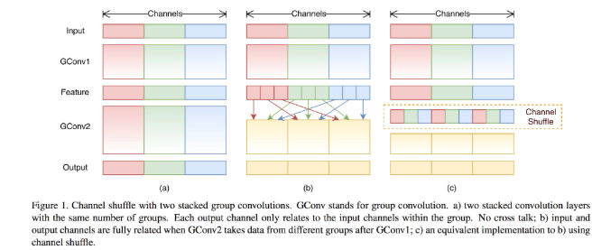
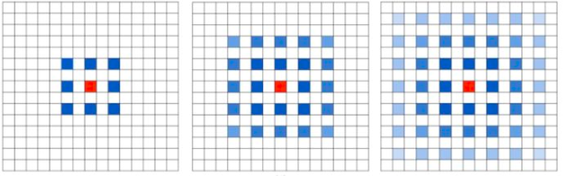

###### 深度可分离卷积

###### 群卷积

###### ShffuleNet

然而，如果多个组卷积堆叠在一起，会有一个副作用： 某个通道输出仅从一小部分输入通道中导出，如下图(a)所示，这样的属性降低了通道组之间的信息流通，降低了信息表示能力。如果我们允许组卷积能够得到不同组的输入数据，，那么输入和输出通道会是全关联的。具体来说，对于上一层输出的通道，我们可做一个混洗 (Shuffle) 操作，再分成几个组，feed 到下一层。

###### 空洞卷积

Up-sampling / pooling layer is deterministic. 内部数据结构丢失；空间层级化信息丢失。小物体信息无法重建。

对于 dilated convolution，它的优点，即内部数据结构的保留和避免使用 down-sampling 这样的特性。

潜在问题：我们发现我们的 kernel 并不连续，也就是并不是所有的 pixel 都用来计算了，因此这里将信息看做 checker-board 的方式会损失信息的连续性。这对 pixel-level dense prediction 的任务来说是致命的。

我们从 dilated convolution 的设计背景来看就能推测出这样的设计是用来获取 long-ranged information。然而光采用大 dilation rate 的信息或许只对一些大物体分割有效果，而对小物体来说可能则有弊无利了。如何同时处理不同大小的物体的关系，则是设计好 dilated convolution 网络的关键。

###### 转置卷积

卷积核为3×3、步幅为2和无边界扩充的二维转置卷积 

###### ResNet

###### SEnet

一组特征在上一层被输出，这时候分两条路线，第一条直接通过，第二条首先进行Squeeze操作(Global Average Pooling)，把每个通道2维的特征压缩成一个1维，从而得到一个特征通道向量(每个数字代表对应通道的特征)。然后进行Excitation操作，把这一列特征通道向量输入两个全连接层和sigmoid，建模出特征通道间的相关性，**得到的输出其实就是每个通道对应的权重**，把这些权重通过Scale乘法通道加权到原来的特征上，这样就完成了特征通道的权重分配。

###### Inception

###### 门限卷积

why CNN

1. same pattern are much smaller than the whole image
2. the same pattern appear in different region
3. sub-sampling the pixel will not change the object

##### **im2col详解**

###### 单通道

图像高$input_h=4$; 图像宽$input_w=4$; kernel高$ kernel_h=3$;kernel宽$ kernel_w=3$;$stride=1；pad=0$；

卷积后，输出图像的计算公式：

$output_h=\frac{(input_h-kernel_h)}{stride}+1; output_w=\frac{(input_w-kernel_w)}{stride}+1;$

###### **多通道的im2col**

同样，多个输出通道图像的数据是连续存储，因此输出图像也可以如下图所示$[output_channels\times output_h \times output_w]=3\times2\times2$

