##### 起步

###### 概念

Git 和其它版本控制系统的主要差别在于 Git 对待数据的方法。 概念上来区分，其它大部分系统以文件变更列表的方式存储信息。 这类系统将它们保存的信息看作是一组基本文件和每个文件随时间逐步累积的差异。

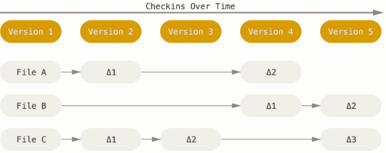

Git 不按照以上方式对待或保存数据。 反之，Git 更像是把数据看作是对小型文件系统的一组快照。 每次你提交更新，或在 Git 中保存项目状态时，它主要对当时的全部文件制作一个快照并保存这个快照的索引。 为了高效，如果文件没有修改，Git 不再重新存储该文件，而是只保留一个链接指向之前存储的文件。 Git 对待数据更像是一个 **快照流**。

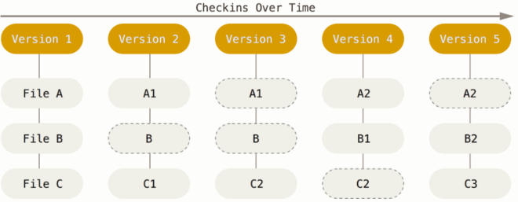

`Git`有三种状态，你的文件可能处于其中之一：已提交`committed`、已修改`modified`和已暂存`staged`。 已提交表示数据已经安全的保存在本地数据库中。 已修改表示修改了文件，但还没保存到数据库中。 已暂存表示对一个已修改文件的当前版本做了标记，使之包含在下次提交的快照中。由此引入`Git`项目的三个工作区域的概念：Git仓库、工作目录以及暂存区域。

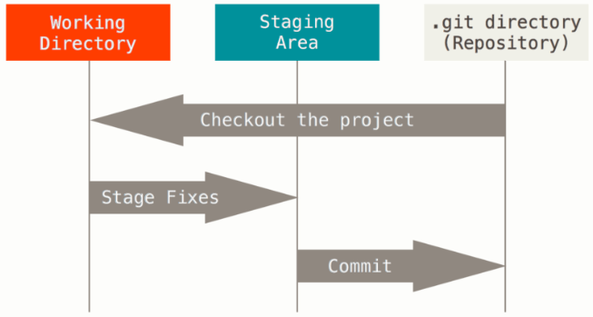

`Git`仓库目录是`Git`用来保存项目的元数据和对象数据库的地方。 这是`Git`中最重要的部分，从其它计算机克隆仓库时，拷贝的就是这里的数据。工作目录是对项目的某个版本独立提取出来的内容。 这些从`Git`仓库的压缩数据库中提取出来的文件，放在磁盘上供你使用或修改。暂存区域是一个文件，保存了下次将提交的文件列表信息，一般在`Git`仓库目录中。 有时候也被称作索引，不过一般说法还是叫暂存区域。基本的`Git`工作流程如下：在工作目录中修改文件；暂存文件，将文件的快照放入暂存区域；提交更新，找到暂存区域的文件，将快照永久性存储到`Git`仓库目录。如果`Git`目录中保存着特定版本的文件，就属于已提交状态。 如果作了修改并已放入暂存区域，就属于已暂存状态。 如果自上次取出后，作了修改但还没有放到暂存区域，就是已修改状态。

##### 基础知识

###### 获取`git`仓库

有两种取得 Git 项目仓库的方法。 第一种是在现有项目或目录下导入所有文件到 Git 中； 第二种是从一个服务器克隆一个现有的 Git 仓库。在现有目录中初始化仓库：如果你打算使用 Git 来对现有的项目进行管理，你只需要进入该项目目录并输入：`git init`该命令将创建一个名为 `.git` 的子目录，这个子目录含有你初始化的 Git 仓库中所有的必须文件，这些文件是 Git 仓库的骨干。 但是，在这个时候，我们仅仅是做了一个初始化的操作，你的项目里的文件还没有被跟踪。如果你是在一个已经存在文件的文件夹（而不是空文件夹）中初始化 Git 仓库来进行版本控制的话，你应该开始跟踪这些文件并提交。 你可通过 `git add` 命令来实现对指定文件的跟踪，然后执行 `git commit` 提交；**如果你想获得一份已经存在了的 Git 仓库的拷贝**，这时就要用到 `git clone` 命令。Git 克隆的是该 Git 仓库服务器上的几乎所有数据，而不是仅仅复制完成你的工作所需要文件。 当你执行 `git clone` 命令的时候，默认配置下远程 Git 仓库中的每一个文件的每一个版本都将被拉取下来。

###### 记录每次更新到仓库

工作目录下的每一个文件都不外乎这两种状态：已跟踪或未跟踪。 已跟踪的文件是指那些被纳入了版本控制的文件，在上一次快照中有它们的记录，在工作一段时间后，它们的状态可能处于未修改，已修改或已放入暂存区。 工作目录中除已跟踪文件以外的所有其它文件都属于未跟踪文件，它们既不存在于上次快照的记录中，也没有放入暂存区。 初次克隆某个仓库的时候，工作目录中的所有文件都属于已跟踪文件，并处于未修改状态。编辑过某些文件之后，由于自上次提交后你对它们做了修改，Git 将它们标记为已修改文件。 我们逐步将这些修改过的文件放入暂存区，然后提交所有暂存了的修改，如此反复。所以使用 Git 时文件的生命周期如下：

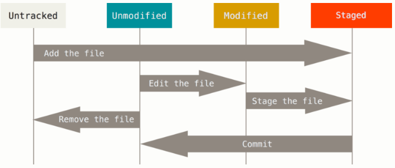

 `git add` 命令是个多功能命令：可以用它开始跟踪新文件，或者把已跟踪的文件放到暂存区，还能用于合并时把有冲突的文件标记为已解决状态等。 将这个命令理解为添加内容到下一次提交中而不是将一个文件添加到项目中要更加合适。现在的暂存区域已经准备妥当可以提交了。 在此之前，请一定要确认还有什么修改过的或新建的文件还没有 `git add` 过，否则提交的时候不会记录这些还没暂存起来的变化。 这些修改过的文件只保留在本地磁盘。 所以，每次准备提交前，先用 `git status` 看下，是不是都已暂存起来了， 然后再运行提交命令 `git commit`。这种方式会启动文本编辑器以便输入本次提交的说明。

要查看哪些文件处于什么状态，可以用 `git status` 命令。`git status` 命令的输出十分详细，但其用语有些繁琐。 如果你使用 `git status -s` 命令或 `git status --short`命令，你将得到一种更为紧凑的格式输出。新添加的未跟踪文件前面有 `??` 标记，新添加到暂存区中的文件前面有 `A` 标记，修改过的文件前面有 `M` 标记。 你可能注意到了 `M` 有两个可以出现的位置，出现在右边的 `M` 表示该文件被修改了但是还没放入暂存区，出现在靠左边的 `M` 表示该文件被修改了并放入了暂存区。

要从 Git 中移除某个文件，就必须要从已跟踪文件清单中移除确切地说，是从暂存区域移除，然后提交。 可以用 `git rm` 命令完成此项工作，并连带从工作目录中删除指定的文件，这样以后就不会出现在未跟踪文件清单中了。另外一种情况是，我们想把文件从 Git 仓库中删除，但仍然希望保留在当前工作目录中。 换句话说，你想让文件保留在磁盘，但是并不想让 Git 继续跟踪。 当你忘记添加 `.gitignore` 文件，不小心把一个很大的日志文件或一堆 `.a` 这样的编译生成文件添加到暂存区时，这一做法尤其有用。 为达到这一目的，使用 `--cached` 选项。修改文件名`git mv old new`, 然后提交。

###### 撤销操作

提交完了才发现漏掉了几个文件没有添加，或者提交信息写错了。 此时，可以运行带有 `--amend` 选项的提交命令尝试重新提交：`git commit --amend`这个命令会将暂存区中的文件提交。 如果自上次提交以来你还未做任何修改，那么快照会保持不变，而你所修改的只是提交信息。文本编辑器启动后，可以看到之前的提交信息。 编辑后保存会覆盖原来的提交信息。最终你只会有一个提交 - 第二次提交将代替第一次提交的结果

使用 `git reset HEAD <file>...` 来取消暂存。撤销对文件的修改`git checkout -- <file>`。

`HEAD`指向的版本就是当前版本，上一个版本就是`HEAD^`，上上一个版本就是`HEAD^^`，当然往上100个版本写100个`^`比较容易数不过来，所以写成`HEAD~100`。因此，Git允许我们在版本的历史之间穿梭，使用命令`git reset --hard commit_id`。穿梭前，用`git log`可以查看提交历史，以便确定要回退到哪个版本。要重返未来，用`git reflog`查看命令历史，以便确定要回到未来的哪个版本。

###### 别名

Git 并不会在你输入部分命令时自动推断出你想要的命令。 如果不想每次都输入完整的 Git 命令，可以通过 `git config` 文件来轻松地为每一个命令设置一个别名。Git 只是简单地将别名替换为对应的命令。 然而，你可能想要执行外部命令，而不是一个 Git 子命令。 如果是那样的话，可以在命令前面加入 `!` 符号。

```bash
$ git config --global alias.co checkout
$ git config --global alias.br branch
$ git config --global alias.ci commit
$ git config --global alias.st status
$ git config --global alias.unstage 'reset HEAD --'
$ git config --global alias.last 'log -1 HEAD'
$ git config --global alias.visual '!gitk'
```

##### `Git`分支

在进行提交操作时，Git 会保存一个提交对象`commit object`。该提交对象会包含一个指向暂存内容快照的针。 但不仅仅是这样，该提交对象还包含了作者的姓名和邮箱、提交时输入的信息以及指向它的父对象的指针。首次提交产生的提交对象没有父对象，普通提交操作产生的提交对象有一个父对象，而由多个分支合并产生的提交对象有多个父对象，为了更加形象地说明，我们假设现在有一个工作目录，里面包含了三个将要被暂存和提交的文件。 暂存操作会为每一个文件计算**校验和**--使用`SHA-1`哈希算法，然后会把当前版本的文件快照保存到`Git`仓库中Git使用`blob`对象来保存它们，最终将**校验和**加入到暂存区域等待提。当使用 `git commit` 进行提交操作时，Git会先计算每一个子目录的校验和，然后在Git仓库中这些**校验和**保存为树对象。 随后，Git便会创建一个提交对象，它除了包含上面提到的那些信息外，还包含指向这个树对象的指针。如此一来，Git 就可以在需要的时候重现此次保存的快照。

```bash
$ git add README test.rb LICENSE
$ git commit -m 'The initial commit of my project'
```

现在，Git 仓库中有五个对象：三个 blob 对象保存着文件快照、一个树对象记录着目录结构和blob对象索引以及一个提交对象包含着指向前述树对象的指针和所有提交信息。

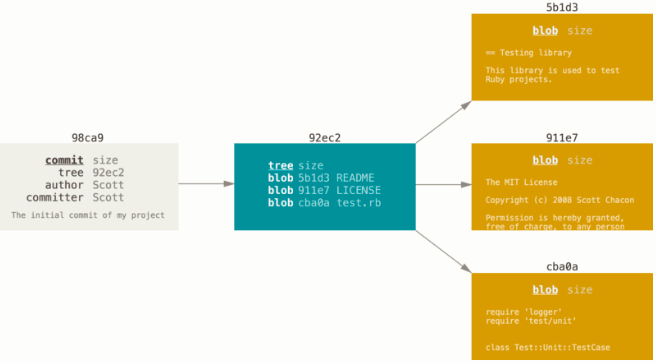

做些修改后再次提交，那么这次产生的提交对象会包含一个指向上次提交对象--父对象的指针。

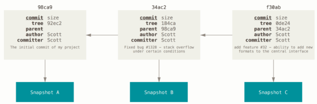

Git 的分支，其实本质上仅仅是指向提交对象的可变指针。 Git 的默认分支名字是 `master`。 在多次提交操作之后，你其实已经有一个指向最后那个提交对象的 `master` 分支。 它会在每次的提交操作中自动向前移动。Git创建新分支只是为你创建了一个可以移动的新的指针。 比如创建一个 testing 分支， 你需要使用 `git branch` 命令：`git branch testing`这会在当前所在的提交对象上创建一个指针。

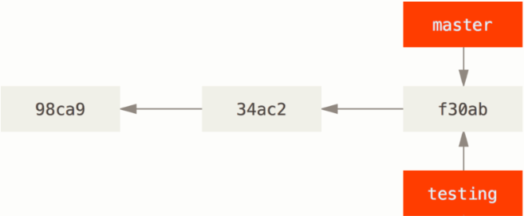

Git有一个名为 `HEAD` 的特殊指针。在 Git 中，它是一个指针，指向当前所在的本地分支。 在本例中，你仍然在 `master` 分支上。 因为 `git branch` 命令仅仅创建一个新分支，并不会自动切换到新分支中去。要切换到一个已存在的分支，你需要使用 `git checkout` 命令`git checkout testing`。 我们现在切换到新创建的 `testing` 分支去。这样 `HEAD` 就指向 `testing` 分支了。

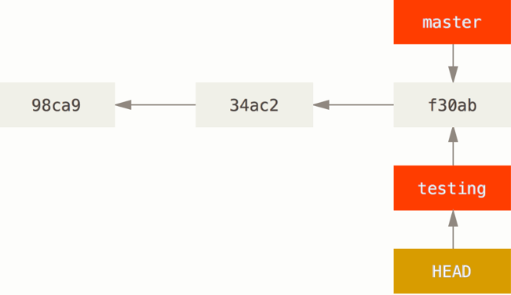

从现在开始，对工作区的修改和提交就是针对`testing`分支了，比如新提交一次后，`testing`指针往前移动一步，而`master`指针不变

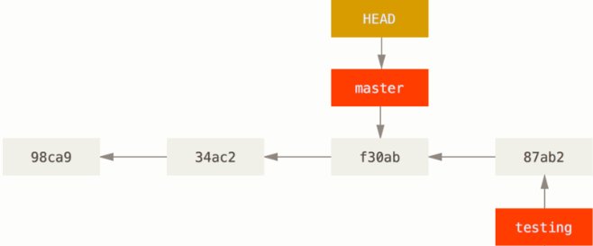

假如我们在`testing`上的工作完成了，就可以把`testing`合并到`master`上。Git合并就是直接把`master`指向`testing`的当前提交，就完成了合并。具体命令如下

```bash
$git checkout master
$git merge testing
```

合并之后可以删除 `testing` 分支，因为你已经不再需要它了 —— `master` 分支已经指向了同一个位置。 你可以使用带 `-d`选项的 `git branch` 命令来删除分支`git brach -d testing`。

###### 分支合并

开发历史从一个更早的地方开始分叉开来。 因为，`master` 分支所在提交并不是 `iss53` 分支所在提交的直接祖先，Git 不得不做一些额外的工作。 出现这种情况的时候，Git 会使用两个分支的末端所指的快照（`C4` 和 `C5`）以及这两个分支的工作祖先（`C2`），做一个简单的三方合并。

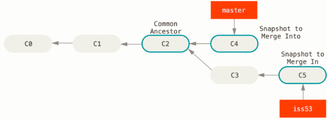

和之前将分支指针向前推进所不同的是，Git 将此次三方合并的结果做了一个新的快照并且自动创建一个新的提交指向它。 这个被称作一次合并提交，它的特别之处在于他有不止一个父提交。需要指出的是，Git 会自行决定选取哪一个提交作为最优的共同祖先，并以此作为合并的基础；

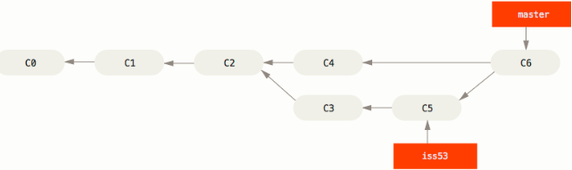

有时候合并操作不会如此顺利。 如果你在两个不同的分支中，对同一个文件的同一个部分进行了不同的修改，Git 就没法干净的合并它们。此时 Git 做了合并，但是没有自动地创建一个新的合并提交。 Git 会暂停下来，等待你去解决合并产生的冲突。 你可以在合并冲突后的任意时刻使用 `git status` 命令来查看那些因包含合并冲突而处于未合并`unmerged`状态的文件。任何因包含合并冲突而有待解决的文件，都会以未合并状态标识出来。 Git会在有冲突的文件中加入标准的冲突解决标记，这样你可以打开这些包含冲突的文件然后手动解决冲突。 出现冲突的文件会包含一些特殊区段，看起来像下面这个样子：

```
<<<<<<< HEAD:index.html
<div id="footer">contact : email.support@github.com</div>
=======
<div id="footer">
 please contact us at support@github.com
</div>
>>>>>>> iss53:index.html
```

这表示 `HEAD` 所指示的版本也就是你的 `master` 分支所在的位置，在这个区段的上半部分`=======` 的上半部分，而 `iss53` 分支所指示的版本在 `=======` 的下半部分。 为了解决冲突，你必须选择使用由 `=======` 分割的两部分中的一个，或者你也可以自行合并这些内容。 例如，你可以通过把这段内容换成下面的样子来解决冲突：

```
<div id="footer">
please contact us at email.support@github.com
</div>
```

上述的冲突解决方案仅保留了其中一个分支的修改，并且 `<<<<<<<` , `=======` , 和 `>>>>>>>` 这些行被完全删除了。在你解决了所有文件里的冲突之后，对每个文件使用 `git add` 命令来将其标记为冲突已解决。 一旦暂存这些原本有冲突的文件，Git 就会将它们标记为冲突已解决。

###### 原理

当在一个新目录或已有目录执行 `git init` 时，Git 会创建一个 `.git` 目录。 这个目录包含了几乎所有 Git 存储和操作的对象。 如若想备份或复制一个版本库，只需把这个目录拷贝至另一处即可。

Git 是一个内容寻址文件系统。这意味着，Git 的核心部分是一个简单的键值对数据库key-value data store。 你可以向该数据库插入任意类型的内容，它会返回一个键值，通过该键值可以在任意时刻再次检索（retrieve）该内容。 可以通过底层命令 `hash-object`来演示上述效果——该命令可将任意数据保存于 `.git` 目录，并返回相应的键值。

 Git 以一种类似于 UNIX 文件系统的方式存储内容，但作了些许简化。 所有内容均以树对象和数据对象的形式存储，其中树对象对应了 UNIX 中的目录项，数据对象则大致上对应了 inodes 或文件内容。 一个树对象包含了一条或多条树对象记录（tree entry），每条记录含有一个指向数据对象或者子树对象的 SHA-1 指针，以及相应的模式、类型、文件名信息。 


git fetch

`git fetch` 命令与一个远程的仓库交互，并且将远程仓库中有但是在当前仓库的没有的所有信息拉取下来然后存储在你本地数据库中。

`git pull` 命令基本上就是 `git fetch` 和 `git merge` 命令的组合体，Git 从你指定的远程仓库中抓取内容，然后马上尝试将其合并进你所在的分支中。`git push` 命令用来与另一个仓库通信，计算你本地数据库与远程仓库的差异，然后将差异推送到另一个仓库中。 它需要有另一个仓库的写权限，因此这通常是需要验证的。`git remote` 命令是一个是你远程仓库记录的管理工具。 它允许你将一个长的 URL 保存成一个简写的句柄，例如 `origin` ，这样你就可以不用每次都输入他们了。 你可以有多个这样的句柄，`git remote`可以用来添加，修改，及删除它们。`git archive` 命令用来创建项目一个指定快照的归档文件。

One of the most common ways I use relative refs is to move branches around. You can directly reassign a branch to a commit with the `-f` option. So something like:

```bash
git branch -f master HEAD~3
```

