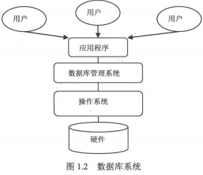

###### 数据库基础

在关系数据库中，数据库表是一系列二维数组的结合，用来存储数据和操作数据的逻辑结构。它由纵向的列和横向的行组成，行被称为记录。时组织数据的单位；列被称为字段，每一列表示记录的有属性，都有相应的描述信息，如数据类型、数据宽度等。

数据类型决定了数据在计算机中的存储格式，代表不同的信息类型。常用的数据类型有：整数数据类型、浮点型数据类型、精确小鼠类型、二进制数据类型、日期或时间数据类型、字符串数据类型。

主键用于唯一地标识表中的每一条记录。可以定义表中的一列或多列为主键，主键列上不能有两列相同的值，也不能为空值。

数据库提供了一个存储空间以存储各种数据，可以将数据库视为一个存储数据的容器。一个数据库可能包含许多文件，一个数据库系统中通常包含许多数据库。数据库管理系统是用户创建、管理和维护数据库时所使用的软件，位于用户与操作系统之间，对数据库进行统一管理。数据库管理系统能定于数据存储结构，提供数据的操作机制，维护数据库的安全性、完整性和可靠性。



`SQL`包含以下四部分：数据定义语言`drop, create, alter`、数据操作语言`insert, update, delete`、数据查询语言`select`、数据控制语言`grant, revoke, commit, rollback`。

###### 数据库基本操作

`net start MySQL`启动`MySQL`服务。`net stop MySQL`停止服务。当MySQL服务启动完成后，便可以通过客户端登录MySQL数据库。

创建数据库: `create database db_name`、删除数据库:`drop database db_name`

##### 数据表的基本操作

###### 创建数据表

```mysql
create table tb_name(
字段1， 数据类型[列级别约束条件][默认值],
字段2， 数据类型[列级别约束条件][默认值],
字段3， 数据类型[列级别约束条件][默认值],
[表级别约束条件])
```

查看数据表: `desc tb_name`. 查看表详细结构: `show create table tb_name`

###### 修改数据表

修改表名:`alter table old rename [to] new`. 修改字段的数据类型:`alter table tb_name modify 字段名  数据类型`. 修改字段名:`alter table tb_name change old new data_type`. 添加字段: ` alter table tb_name add name data_type [constraint] [first|after 已存在字段名]`. 删除字段: `alter table tb_name drop name`. 修改字段的排列位置: ` alter table tb_name modify name data_type first|after name2`. 更改表的存储引擎: `alter table tb_name engine=new_engine`. 删除表的外键约束: `alter table tb_name drop foreign key key_name`. 删除没有关联的表: `drop table [if exists] tb1, tb2, ..., tbn`. 删除别其他表关联的主表: 先解除关联子表的外键约束，然后执行删除没有关联的表的操作。

##### 数据类型

###### 整数类型

##### `MySQL`函数

##### 查询数据

###### 单表查询

查询所有字段: `select * from tb`. 查询指定字段: `select 列名 from tb`. 查询指定记录: ` select name1, name2,..., namen from tb where condition`. 

###### 连接查询

