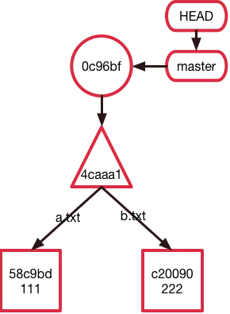
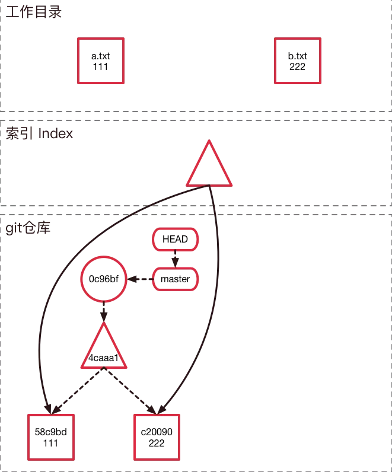
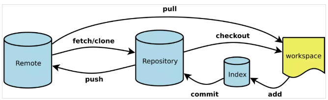
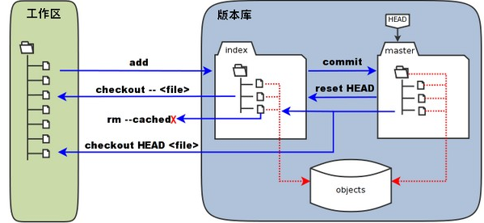

Git会将整个数据库储存在.git/目录下，Git提供了一个能够帮助你探索它的方法`git cat-file [-t] [-p]`，`-t`可以查看object的类型，`-p`可以查看object储存的具体内容。git中由三种object，第一种blob类型，它只储存的是一个文件的内容，不包括文件名等其他信息。然后将这些信息经过SHA1哈希算法得到对应的哈希值，作为这个object在Git仓库中的唯一身份证。第二种tree，它将当前的目录结构打了一个快照。从它储存的内容来看可以发现它储存了一个目录结构（类似于文件夹），以及每一个文件（或者子文件夹）的权限、类型、对应的身份证（SHA1值）、以及文件名。第三种commit，它储存的是一个提交的信息，包括对应目录结构的快照tree的哈希值，上一个提交的哈希值，提交的作者以及提交的具体时间，最后是该提交的信息。





##### 工作流程



- 工作区：改动（增删文件和内容）
- 暂存区：输入命令：`git add 改动的文件名`，此次改动就放到了 ‘暂存区’，当对工作区修改或新增的文件执行 "git add" 命令时，暂存区的目录树被更新，同时工作区修改或新增的文件内容被写入到对象库中的一个新的对象中，而该对象的ID被记录在暂存区的文件索引中。
- 本地仓库：输入命令：`git commit` 此次修改的描述，此次改动就放到了 ’本地仓库’，每个 commit，我叫它为一个 ‘版本’。当执行提交操作（git commit）时，暂存区的目录树写到版本库（对象库）中，master 分支会做相应的更新。即 master 指向的目录树就是提交时暂存区的目录树。
- 远程仓库(简称：远程)：输入命令：`git push 远程仓库`，此次改动就放到了 ‘远程仓库’
- commit-id：输出命令：`git log`，最上面那行 `commit xxxxxx`，后面的字符串就是 commit-id



当执行 `"git reset HEAD"` 命令时，暂存区的目录树会被重写，被 master 分支指向的目录树所替换，但是工作区不受影响。 
当执行 `"git rm --cached <file>"` 命令时，会直接从暂存区删除文件，工作区则不做出改变。 
当执行 `"git checkout "` 或者 `"git checkout -- <file>"` 命令时，会用暂存区全部或指定的文件替换工作区的文件。这个操作很危险，会清除工作区中未添加到暂存区的改动。 
当执行 `"git checkout HEAD "` 或者 `"git checkout HEAD <file>"` 命令时，会用 HEAD 指向的 master 分支中的全部或者部分文件替换暂存区和以及工作区中的文件。这个命令也是极具危险性的，因为不但会清除工作区中未提交的改动，也会清除暂存区中未提交的改动。

| 指令                                                 | 作用                                                         |
| ---------------------------------------------------- | ------------------------------------------------------------ |
| `git help -g`                                        | 展示帮助信息                                                 |
| `git fetch --all && git reset --hard origin/master`  | 抛弃本地所有的修改，回到远程仓库的状态。                     |
| `git update-ref -d HEAD`                             | 也就是把所有的改动都重新放回工作区，并**清空所有的 commit**，这样就可以重新提交第一个 commit 了 |
| `git diff`                                           | 输出**工作区**和**暂存区**的 different (不同)。              |
| `git diff <commit-id> <commit-id>`                   | 还可以展示本地仓库中任意两个 commit 之间的文件变动           |
| `git diff --cached`                                  | 输出**暂存区**和本地最近的版本 (commit) 的 different (不同)。 |
| `git diff HEAD`                                      | 输出**工作区**、**暂存区** 和本地最近的版本 (commit) 的 different (不同)。 |
| `git checkout -`                                     | 快速切换到上一个分支                                         |
| `git branch -vv`                                     | 展示本地分支关联远程仓库的情况                               |
| `git branch -u origin/mybranch`                      | 关联之后，`git branch -vv` 就可以展示关联的远程分支名了，同时推送到远程仓库直接：`git push`，不需要指定远程仓库了。 |
| `git branch -r`                                      | 列出所有远程分支                                             |
| `git branch -a`                                      | 列出所有远程分支                                             |
| `git remote show origin`                             | 查看远程分支和本地分支的对应关系                             |
| `git remote prune origin`                            | 远程删除了分支本地也想删除                                   |
| `git checkout -b <branch-name>`                      | 创建并切换到本地分支                                         |
| `git checkout -b <branch-name> origin/<branch-name>` | 从远程分支中创建并切换到本地分支                             |
| `git branch -d <local-branchname>`                   | 删除本地分支                                                 |
| `git push origin --delete <remote-branchname>`       | 删除远程分支                                                 |
| `git branch -m <new-branch-name>`                    | 删除远程分支                                                 |
| `git tag`                                            | 查看标签                                                     |
| `git push origin <local-version-number>`             | 推送标签到远程仓库                                           |
| `git checkout <file-name>`                           | 放弃工作区的修改                                             |
| `git checkout .`                                     | 放弃所有修改                                                 |
| `git revert <commit-id>`                             | 以新增一个 commit 的方式还原某一个 commit 的修改             |
| `git remote add origin <remote-url>`                 | 增加远程仓库                                                 |
| `git log`                                            | 查看 commit 历史                                             |
| `git remote`                                         | 列出所有远程仓库                                             |
| `git whatchanged --since='2 weeks ago'`              | 查看两个星期内的改动                                         |
| `git stash`                                          | 存储当前的修改，但不用提交 commit                            |

###### 恢复删除的文件
```sh
git rev-list -n 1 HEAD -- <file_path> #得到 deleting_commit

git checkout <deleting_commit>^ -- <file_path> #回到删除文件 deleting_commit 之前的状态
```

###### 回到某个 commit 的状态，并删除后面的 commit

和 revert 的区别：reset 命令会抹去某个 commit id 之后的所有 commit

```sh
git reset <commit-id>  #默认就是-mixed参数。

git reset –mixed HEAD^  #回退至上个版本，它将重置HEAD到另外一个commit,并且重置暂存区以便和HEAD相匹配，但是也到此为止。工作区不会被更改。

git reset –soft HEAD~3  #回退至三个版本之前，只回退了commit的信息，暂存区和工作区与回退之前保持一致。如果还要提交，直接commit即可  

git reset –hard <commit-id>  #彻底回退到指定commit-id的状态，暂存区和工作区也会变为指定commit-id版本的内容
```

###### 把 A 分支的某一个 commit，放到 B 分支上

```sh
git checkout <branch-name> && git cherry-pick <commit-id>
```

###### 给 git 命令起别名

```sh
git config --global alias.<handle> <command>
比如：git status 改成 git st，这样可以简化命令
git config --global alias.st status
```

###### 展示所有 stashes
```sh
git stash list
```

###### 从 stash 中拿出某个文件的修改
```sh
git checkout <stash@{n}> -- <file-path>
```

###### 展示简化的 commit 历史
```sh
git log --pretty=oneline --graph --decorate --all
```

###### 从远程仓库根据 ID，拉下某一状态，到本地分支

```sh
git fetch origin pull/<id>/head:<branch-name>
```

###### 展示所有 alias 和 configs

```sh
git config --local --list (当前目录)
git config --global --list (全局)
```

要查看哪些文件处于什么状态，可以用 `git status` 命令。`git status` 命令的输出十分详细，但其用语有些繁琐。 如果你使用 `git status -s` 命令或 `git status --short`命令，你将得到一种更为紧凑的格式输出。新添加的未跟踪文件前面有 `??` 标记，新添加到暂存区中的文件前面有 `A` 标记，修改过的文件前面有 `M` 标记。 你可能注意到了 `M` 有两个可以出现的位置，出现在右边的 `M` 表示该文件被修改了但是还没放入暂存区，出现在靠左边的 `M` 表示该文件被修改了并放入了暂存区。

要从 Git 中移除某个文件，就必须要从已跟踪文件清单中移除确切地说，是从暂存区域移除，然后提交。 可以用 `git rm` 命令完成此项工作，并连带从工作目录中删除指定的文件，这样以后就不会出现在未跟踪文件清单中了。另外一种情况是，我们想把文件从 Git 仓库中删除，但仍然希望保留在当前工作目录中。 换句话说，你想让文件保留在磁盘，但是并不想让 Git 继续跟踪。 当你忘记添加 `.gitignore` 文件，不小心把一个很大的日志文件或一堆 `.a` 这样的编译生成文件添加到暂存区时，这一做法尤其有用。 为达到这一目的，使用 `--cached` 选项。修改文件名`git mv old new`, 然后提交。

###### 撤销操作

提交完了才发现漏掉了几个文件没有添加，或者提交信息写错了。 此时，可以运行带有 `--amend` 选项的提交命令尝试重新提交：`git commit --amend`这个命令会将暂存区中的文件提交。 如果自上次提交以来你还未做任何修改，那么快照会保持不变，而你所修改的只是提交信息。文本编辑器启动后，可以看到之前的提交信息。 编辑后保存会覆盖原来的提交信息。最终你只会有一个提交 - 第二次提交将代替第一次提交的结果

使用 `git reset HEAD <file>...` 来取消暂存。撤销对文件的修改`git checkout -- <file>`。

`HEAD`指向的版本就是当前版本，上一个版本就是`HEAD^`，上上一个版本就是`HEAD^^`，当然往上100个版本写100个`^`比较容易数不过来，所以写成`HEAD~100`。因此，Git允许我们在版本的历史之间穿梭，使用命令`git reset --hard commit_id`。穿梭前，用`git log`可以查看提交历史，以便确定要回退到哪个版本。要重返未来，用`git reflog`查看命令历史，以便确定要回到未来的哪个版本。

###### 别名

Git 并不会在你输入部分命令时自动推断出你想要的命令。 如果不想每次都输入完整的 Git 命令，可以通过 `git config` 文件来轻松地为每一个命令设置一个别名。Git 只是简单地将别名替换为对应的命令。 然而，你可能想要执行外部命令，而不是一个 Git 子命令。 如果是那样的话，可以在命令前面加入 `!` 符号。

```bash
$ git config --global alias.co checkout
$ git config --global alias.br branch
$ git config --global alias.ci commit
$ git config --global alias.st status
$ git config --global alias.unstage 'reset HEAD --'
$ git config --global alias.last 'log -1 HEAD'
$ git config --global alias.visual '!gitk'
# 我提交(commit)里的用户名和邮箱不对
git commit --amend --author "New Authorname <authoremail@mydomain.com>"
```

###### git fetch

`git fetch` 命令与一个远程的仓库交互，并且将远程仓库中有但是在当前仓库的没有的所有信息拉取下来然后存储在你本地数据库中。

`git pull` 命令基本上就是 `git fetch` 和 `git merge` 命令的组合体，Git 从你指定的远程仓库中抓取内容，然后马上尝试将其合并进你所在的分支中。`git push` 命令用来与另一个仓库通信，计算你本地数据库与远程仓库的差异，然后将差异推送到另一个仓库中。 它需要有另一个仓库的写权限，因此这通常是需要验证的。`git remote` 命令是一个是你远程仓库记录的管理工具。 它允许你将一个长的 URL 保存成一个简写的句柄，例如 `origin` ，这样你就可以不用每次都输入他们了。 你可以有多个这样的句柄，`git remote`可以用来添加，修改，及删除它们。`git archive` 命令用来创建项目一个指定快照的归档文件。

首先要明确下，所有的版本控制系统，只能跟踪文本文件的改动，比如txt文件，网页，所有程序的代码等，Git也不列外，版本控制系统可以告诉你每次的改动，但是图片，视频这些二进制文件，虽能也能由版本控制系统管理，但没法跟踪文件的变化，只能把二进制文件每次改动串起来，也就是知道图片从1kb变成2kb，但是到底改了啥，版本控制也不知道。