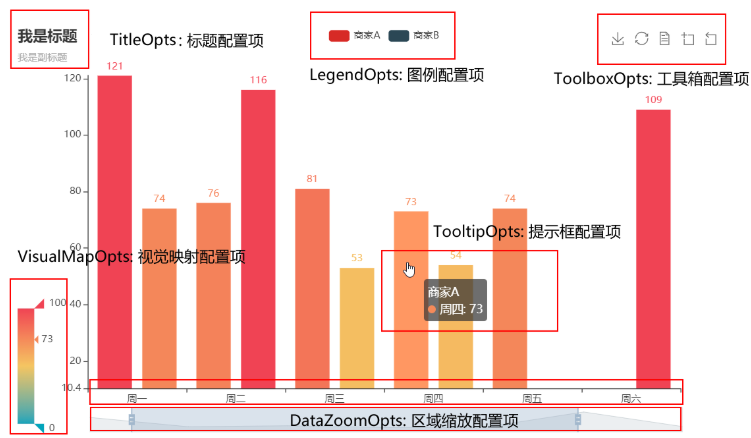

#### 配置项

全局配置项可通过 `set_global_options` 方法设置.位于`pyecharts.options`模块



##### 全局配置项

###### `InitOpts`:初始化配置项

```python
class InitOpts(
    # 图表画布宽度、高度
    width: str = "900px", height: str = "500px",
    # 图表主题
    theme: str = "white",
    # 图表背景颜色
    bg_color: Optional[str] = None)
```

###### `ToolboxOpts`：工具箱配置项

```python
class ToolboxOpts(
    # 是否显示工具栏组件
    is_show: bool = True,
    # 可选：'horizontal', 'vertical'
    orient: str = "horizontal",
    # 各工具配置项，参考 `global_options.ToolBoxFeatureOpts`
    feature: Union[ToolBoxFeatureOpts, dict] = ToolBoxFeatureOpts(),
)
```

###### `TitleOpts`：标题配置项

```python
class TitleOpts(
    # 主标题文本，支持使用 \n 换行。
    title: Optional[str] = None,
    # 主标题跳转 URL 链接
    title_link: Optional[str] = None,
    # 主标题跳转链接方式,默认值是: blank,可选参数: 'self', 'blank'
    # 'self' 当前窗口打开; 'blank' 新窗口打开
    title_target: Optional[str] = None,
    # 副标题文本，支持使用 \n 换行。
    subtitle: Optional[str] = None,
    # 主标题字体样式配置项，参考 `series_options.TextStyleOpts`
    title_textstyle_opts: Union[TextStyleOpts, dict, None] = None)
```

###### `DataZoomOpts`：区域缩放配置项

###### `LegendOpts`：图例配置项

```python
class LegendOpts(
    # 图例的类型。可选值：'plain'：普通图例。'scroll'：可滚动翻页的图例。
    type_: Optional[str] = None,
    # 是否显示图例组件
    is_show: bool = True
    # 图例列表的布局朝向。可选：'horizontal', 'vertical'
    orient: Optional[str] = None,
    # 图例组件字体样式，参考 `series_options.TextStyleOpts`
    textstyle_opts: Union[TextStyleOpts, dict, None] = None)
```

`VisualMapOpts`：视觉映射配置项

 `TooltipOpts`：提示框配置项

```python
class TooltipOpts(
    # 是否显示提示框组件，包括提示框浮层和 axisPointer。
    is_show: bool = True,
    # 触发类型 'item': 数据项图形触发，'axis': 坐标轴触发，'none': 什么都不触发
    trigger: str = "item",
    # 提示框触发的条件，可选：'mousemove': 鼠标移动时触发. 'click': 鼠标点击时触发。'mousemove|click': 同时鼠标移动和点击时触发。'none': 不在 'mousemove' 或 'click' 时触发，
    trigger_on: str = "mousemove|click",

    formatter: Optional[str] = None,
    # 文字样式配置项
    textstyle_opts: TextStyleOpts = TextStyleOpts(font_size=14),
)
```

`AxisLineOpts`：坐标轴轴线配置项

```python
class AxisLineOpts(
    # 是否显示坐标轴轴线。
    is_show: bool = True,
    # X 轴或者 Y 轴的轴线是否在另一个轴的 0 刻度上，只有在另一个轴为数值轴且包含 0 刻度时有效。
    is_on_zero: bool = True,
    # 当有双轴时，可以用这个属性手动指定，在哪个轴的 0 刻度上。
    on_zero_axis_index: int = 0,
    # 默认不显示箭头，即 'none'。只在末端显示箭头可以设置为['none', 'arrow']。
    symbol: Optional[str] = None,
    # 坐标轴线风格配置项，参考 `series_optionsLineStyleOpts`
    linestyle_opts: Union[LineStyleOpts, dict, None] = None,
)
```

`AxisTickOpts`：坐标轴刻度配置项

```python
class AxisTickOpts(
    # 是否显示坐标轴刻度。
    is_show: bool = True,

    # 类目轴中在 boundaryGap 为 true 的时候有效，可以保证刻度线和标签对齐。
    is_align_with_label: bool = False,

    # 坐标轴刻度是否朝内，默认朝外。
    is_inside: bool = False,

    # 坐标轴刻度的长度。
    length: Optional[Numeric] = None)
```

`AxisPointerOpts`：坐标轴提示器配置项

```python
class AxisPointerOpts(
    # 默认显示坐标轴指示器
    is_show: bool = True,
    # 指示器类型。可选参数如下，默认为 'line','line' 直线指示器, 'shadow' 阴影指示器, 'none' 无指示器
    type_: str = "line",
    # 坐标轴指示器的文本标签，坐标轴标签配置项
    label: Union[LabelOpts, dict, None] = None,
    # 坐标轴线风格配置项
    linestyle_opts: Union[LineStyleOpts, dict, None] = None,
)
```

`AxisOpts`：坐标轴配置项

```python
class AxisOpts(
    # 坐标轴类型。可选：'value': 数值轴，适用于连续数据。'category': 类目轴，适用于离散的类目数据，'time': 时间轴，适用于连续的时序数据. 'log' 对数轴。适用于对数数据。
    type_: Optional[str] = None
    # 是否显示 x 轴。
    is_show: bool = True,
     # 坐标轴名称。
    name: Optional[str] = None,
    # 坐标轴刻度最小值。
    min_: Union[Numeric, str, None] = None,
    # 坐标轴刻度最大值。
    max_: Union[Numeric, str, None] = None,
    # 坐标轴刻度线配置项
    axisline_opts: Union[AxisLineOpts, dict, None] = None,
    # 坐标轴刻度配置项
    axistick_opts: Union[AxisTickOpts, dict, None] = None,
    # 坐标轴标签配置项
    axislabel_opts: Union[LabelOpts, dict, None] = None,
    # 坐标轴指示器配置项
    axispointer_opts: Union[AxisPointerOpts, dict, None] = None,
    # 坐标轴名称的文字样式
    name_textstyle_opts: Union[TextStyleOpts, dict, None] = None,
    # 分割区域配置项
    splitarea_opts: Union[SplitAreaOpts, dict, None] = None,
    # 分割线配置项
    splitline_opts: Union[SplitLineOpts, dict] = SplitLineOpts(),
)
```

`SingleAxisOpts`：单轴配置项

```python
class SingleAxisOpts(
    # 坐标轴名称。
    name: Optional[str] = None)
```

##### 系列配置项

###### `ItemStyleOpts`：图元样式配置

###### `TextStyleOpts`:文字样式配置

`LabelOpts`：标签配置项

`LineStyleOpts`：线样式配置项

`SplitLineOpts`：分割线配置项

`MarkPointItem`：标记点数据线

`MarkPointOpts`：标记点配置项

`MarkLineItem`：标记线数据线

`MarkLineOpts`：标记线配置项

`MarkAreaItem`:标记区域数据线

`MarkAreaOpts`：标记区域配置项

`EffectOpts`：涟漪特效配置项

`AreaStyleOpts`：区域填充样式配置项

`SplitAreaOpts`:分割区域配置项