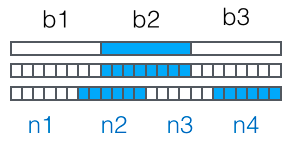

### 入门教程

###### 模块

Python有一种方法可以把定义放在一个文件里，并在脚本或解释器的交互式实例中使用它们。这样的文件被称作 *模块* ；模块中的定义可以 *导入* 到其它模块或者 *主* 模块。模块是一个包含Python定义和语句的文件。文件名就是模块名后跟文件后缀 `.py` 。在一个模块内部，模块名（作为一个字符串）可以通过全局变量 `__name__` 的值获得。模块可以包含可执行的语句以及函数定义。这些语句用于初始化模块。它们仅在模块 *第一次* 在 import 语句中被导入时才执行。每个模块都有它自己的私有符号表，该表用作模块中定义的所有函数的全局符号表。因此，模块的作者可以在模块内使用全局变量，而不必担心与用户的全局变量发生意外冲突。当一个名为 `spam` 的模块被导入的时候，解释器首先寻找具有该名称的内置模块。如果没有找到，然后解释器从`sys.path`变量给出的目录列表里寻找名为 `spam.py` 的文件。[`sys.path`](https://docs.python.org/zh-cn/3/library/sys.html#sys.path) 初始有这些目录地址:

- 包含输入脚本的目录（或者未指定文件时的当前目录）。
- `PYTHONPATH`（一个包含目录名称的列表，它和shell变量 `PATH` 有一样的语法）。
- 取决于安装的默认设置当一个名为 `spam` 的模块被导入的时候，解释器首先寻找具有该名称的内置模块。如果没有找到，然后解释器从`sys.path` 变量给出的目录列表里寻找名为 `spam.py` 的文件。`sys.path` 初始有这些目录地址:
  - 包含输入脚本的目录（或者未指定文件时的当前目录）。
  - `PYTHONPATH`一个包含目录名称的列表，它和shell变量 `PATH` 有一样的语法）。
  - 取决于安装的默认设置

*namespace* （命名空间）是一个从名字到对象的映射。 大部分命名空间当前都由 Python 字典实现，但一般情况下基本不会去关注它们（除了要面对性能问题时），而且也有可能在将来更改。 下面是几个命名空间的例子：存放内置函数的集合模块中的全局名称；函数调用中的局部名称。 从某种意义上说，对象的属性集合也是一种命名空间的形式。 关于命名空间的重要一点是，不同命名空间中的名称之间绝对没有关系；

### python标准库

#### 内置函数

| 函数                                                         | 描述                                                         |
| ------------------------------------------------------------ | ------------------------------------------------------------ |
| `abs(x)`                                                     | 返回一个数的绝对值。实参可以是整数或浮点数。如果实参是一个复数，返回它的模。 |
| `all(iterable)`                                              | 如果 `iterable` 的所有元素为真（或迭代器为空），返回 `True`  |
| `any(iterable)`                                              | 如果`iterable`的任一元素为真则返回`True`。如果迭代器为空，返回`False` |
| `ascii(object)`                                              | 返回一个对象可打印的字符串                                   |
| `bin(x)`                                                     | 将一个整数转变为一个前缀为`0b`的二进制字符串。               |
| `class bool([x])`                                            | 返回一个布尔值，`True` 或者 `False`                          |
| `breakpoint(*arg, **kws)`                                    | 此函数会在调用时将你陷入调试器中。具体来说，它调用 `sys.breakpointhook()` ，直接传递 `args` 和 `kws` |
| `class bytearray([source[, encoding,[,errors]]])`            | 返回一个新的 bytes 数组，是一个可变序列                      |
| `class bytes([source[, encoding[,errors]]])`                 | 返回一个新的“bytes”对象， 是一个不可变序列。                 |
| `callable(object)`                                           | `如果实参` object `是可调用的，返回`True`，否则返回 `False`  |
| `chr(i)`                                                     | 返回` Unicode `码位为整数` *i* `的字符的字符串格式。         |
| `@classmethod`                                               | 把一个方法封装成类方法。                                     |
| `compile(source, filename, mode, flag=0, dont_inherit=False, optimize = -1)` | 将`source `编译成代码或 `AST `对象。代码对象可以被 `exec() `或` eval() `执行。source 可以是常规的字符串、字节字符串，或者` AST `对象。 |
| `class complex([real[,imag]])`                               | 返回值为` real + imag*1j `的复数，或将字符串或数字转换为复数。 |
| `delattr(obj,name)`                                          | 实参是一个对象和一个字符串。该字符串必须是对象的某个属性。如果对象允许，该函数将删除指定的属性。 |
| `class(**kwarg)`                                             | 创建一个新的字典。                                           |
| `dir([object])`                                              | 如果没有实参，则返回当前本地作用域中的名称列表。如果有实参，它会尝试返回该对象的有效属性列表。 |
| `divmod(a,b)`                                                | 它将两个（非复数）数字作为实参，并在执行整数除法时返回一对商和余数。 |
| `enumerate(iterable, start = 0)`                             | 返回一个枚举对象。`iterable`必须是一个序列，或 `iterator`，或其他支持迭代的对象。 |
| `eval(expression, globals=None, locals=None)`                | 实参是一个字符串，以及可选的` globals `和` locals`。`globals`实参必须是一个字典。`locals`可以是任何映射对象。 |
| `exec(object[,globals[,locals]])`                            | 这个函数支持动态执行 Python 代码。object 必须是字符串或者代码对象。如果是字符串，那么该字符串将被解析为一系列 Python 语句并执行。 |
| `filter(function, iterable)`                                 | 用`iterable`中函数`function `返回真的那些元素，构建一个新的迭代器。 |
| `class float([x])`                                           | 返回从数字或字符串 *x* 生成的浮点数。                        |
| `format(value[, format_spec])`                               | 将` value `转换为` format_spec `控制的格式化表示。           |
| `class frozenset([iterable])`                                | 返回一个新的`frozenset`对象，它包含可选参数`iterable`中的元素。 `frozenset`是一个内置的类。 |
| `getattr(object,name[,default])`                             | 返回对象命名属性的值。`name`必须是字符串。如果该字符串是对象的属性之一，则返回该属性的值。 |
| `globals()`                                                  | 返回表示当前全局符号表的字典。                               |
| `hasattr(object,name)`                                       | 该实参是一个对象和一个字符串。如果字符串是对象的属性之一的名称，则返回 `True`，否则返回 `False`。 |
| `hash(object)`                                               | 返回该对象的哈希值                                           |
| `help([object])`                                             | 启动内置的帮助系统                                           |
| `hex(x)`                                                     | 将整数转换为以`0x`为前缀的小写十六进制字符串。               |
| `id(object)`                                                 | 返回对象的“标识值”。该值是一个整数，在此对象的生命周期中保证是唯一且恒定的。 |
| `input([prompt])`                                            | 如果存在 *prompt* 实参，则将其写入标准输出，末尾不带换行符。 |
| `class int(x,base =10)`                                      | 返回一个使用数字或字符串 *x* 生成的整数对象，或者没有实参的时候返回 `0` 。 |
| `isinstance(object,classinfo)`                               | 如果` object `实参是` classinfo `实参的实例，或者是（直接、间接或 虚拟）子类的实例，则返回`true`。如果` object `不是给定类型的对象，函数始终返回` false`。如果` classinfo `是对象类型（或多个递归元组）的元组，如果` object `是其中的任何一个的实例则返回` true`。 |
| `issubclass(class, classinfo)`                               | 如果` class `是` classinfo `的子类--直接、间接或 虚拟 的，则返回` true`。`classinfo `可以是类对象的元组，此时` classinfo `中的每个元素都会被检查。 |
| `iter(object[,sentinel])`                                    | 返回一个iterator对象。                                       |
| `locals()`                                                   | 更新并返回表示当前本地符号表的字典。                         |
| `len(s)`                                                     |                                                              |
| `class list([iterable])`                                     |                                                              |
| `map(function, iterable,...)`                                | 产生一个将 *function* 应用于迭代器中所有元素并返回结果的迭代器。 |
| `max(iterable,*[,key, default])`                             |                                                              |
| `next(iterator[, default])`                                  | 通过调用`iterator`的`__next__()`方法获取下一个元素。如果迭代器耗尽，则返回给定的`default`，如果没有默认值则触发`StopIteration` |
| `class object`                                               | 返回一个没有特征的新对象。object 是所有类的基类。它具有所有 Python 类实例的通用方法。这个函数不接受任何实参 |
| `oct(x)`                                                     | 将一个整数转变为一个前缀为`0o`的八进制字符串。               |
| `open(file, mode='r', encoding=None)`                        | file 是一个path-like object，表示将要打开的文件的路径。mode 是一个可选字符串，用于指定打开文件的模式。encoding 是用于解码或编码文件的编码的名称。errors 是一个可选的字符串参数，用于指定如何处理编码和解码错误。 |
| `ord(c)`                                                     | 对表示单个 Unicode 字符的字符串，返回代表它 Unicode 码点的整数。 |
| `pow(x,y[,z])`                                               | 返回 *x* 的 *y* 次幂；如果 *z* 存在，则对 *z* 取余           |
| `print(*object, sep=' ',end='\n',file=sys.stdout)`           | 将 *objects* 打印到 *file* 指定的文本流，以 *sep* 分隔并在末尾加上 *end*。 *sep*, *end*, *file* 和 *flush* 如果存在，它们必须以关键字参数的形式给出。 |
| `class property(fget=None, fset=None, fdel=None)`            | 返回 property 属性。fget是获取属性值的函数。 *fset* 是用于设置属性值的函数。 *fdel* 是用于删除属性值的函数。并且 *doc*为属性对象创建文档字符串。 |
| `range(start, stop[, step])`                                 |                                                              |
| `repr(object)`                                               | 返回包含一个对象的可打印表示形式的字符串。                   |
| `reversed(seq)`                                              | 返回一个反向的`iterator`。 `seq`必须是一个具有`__reversed__()`方法的对象或者是支持该序列协议 |
| `round(number[, ndigits])`                                   | 返回number 舍入到小数点后`ndigits`位精度的值。 如果`ndigits`被省略或为`None`，则返回最接近输入值的整数。 |
| `class set([iterable])`                                      |                                                              |
| `setattr(object, name, value)`                               | 其参数为一个对象、一个字符串和一个任意值。 字符串指定一个现有属性或者新增属性。 函数会将值赋给该属性，只要对象允许这种操作。 |
| `class slice(start, stop[,step])`                            | 返回一个表示由`range(start, stop, step)`所指定索引集的`slice`对象。 其中start 和 step 参数默认为None。 切片对象具有仅会返回对应参数值的只读数据属性 start, stop 和 step。 |
| `sorted(iterable,*, key =None, reversed=False)`              |                                                              |
| `@staticmethod`                                              | 将方法转换为静态方法。                                       |
| `class str(object=b'', encoding='utf8',errors='strict')`     |                                                              |
| `sum(iterable[, start])`                                     | 从 *start* 开始自左向右对`iterable`中的项求和并返回总计值。  |
| `super([type[, object-or-type]])`                            |                                                              |
| `tuple([iterable])`                                          |                                                              |
| `type(name, bases, dict)`                                    |                                                              |
| `vars([object])`                                             | 返回模块、类、实例或任何其它具有`__dict__` 属性的对象的` __dict__` 属性。 |
| `zip(*iterables)`                                            |                                                              |
| `__import__(name, globals=None, locals=None,level=0)`        | 此函数会由 import 语句发起调用。                             |

#### 内置类型

###### 逻辑值检测

一个对象在默认情况下均被视为真值，除非当该对象被调用时其所属类定义了` __bool__()`方法且返回`False`或是定义了`__len__()`方法且返回零。下面基本完整地列出了会被视为假值的内置对象:  被定义为假值的常量: `None` 和`False`。任何数值类型的零:` 0, 0.0, 0j, Decimal(0), Fraction(0, 1)`。空的序列和多项集:` '', (), [], {}, set(), range(0)`。产生布尔值结果的运算和内置函数总是返回`0`或`False`作为假值，`1`或`True`作为真值。

列表推导、生成器表达式，以及同它们很相似的集合推导和字典推导，在 Python 3 中都有了自己的局部作用域，就像函数似的。表达式内部的变量和赋值只在局部起作用，表达式的上下文里的同名变量还可以被正常引用，局部变量并不会影响到它们。

用 * 运算符把一个可迭代对象拆开作为函数的参数。`a:b:c `这种用法只能作为索引或者下标用在` [] `中来返回一个切片对象：`slice(a, b,c)`。对 `seq[start:stop:step] `进行求值的时候，Python 会调用`seq.__getitem__(slice(start, stop, step))`。要正确处理这种` [] `运算符的话，对象的特殊方法 `__getitem__ `和 `__setitem__ `需要以元组的形式来接收`a[i, j] `中的索引。也就是说，如果要得到 `a[i, j] `的值，Python 会调用`a.__getitem__((i, j))`。

如果我们需要一个只包含数字的列表，那么 `array.array `比` list `更高效。数组支持所
有跟可变序列有关的操作，包括` .pop、.insert `和` .extend`。另外，数组还提供从文件读取和存入文件的更快的方法，如` .frombytes `和` .tofile`。

###### 序列类型

所有序列规定的比较操作都是基于字典顺序，即一个元素接一个元素地比较，直至找到第一个不同的元素。大多数序列类型支持下表中的操作，表中s和t是具有相同类型的序列。

| 运算                 | 结果                                        |
| -------------------- | ------------------------------------------- |
| `x in s`             | 如果s中的某项等于x则结果为True，否则为False |
| `x not in s`         | 如果s中某项等于x则结果为False，否则为True   |
| `s +t`               | s与t相拼接                                  |
| `s*n`                |                                             |
| `s[i]`               |                                             |
| `s[i:j]`             |                                             |
| `s[i:j:k]`           |                                             |
| `len(s)`             |                                             |
| `min(s)`             |                                             |
| `max(s)`             |                                             |
| `s.index(x[,i[,j]])` | x再s中首次出现项的索引号                    |
| `s.count(x)`         | x在s中出现的总次数                          |

不可变序列类型普遍实现而可变序列类型未实现的唯一操作就是对`hash()`内置函数的支持。下标是可变序列类型支持的操作。

| 运算            | 结果                                       |
| --------------- | ------------------------------------------ |
| `s[i]=k`        |                                            |
| `s[i:j]=k`      |                                            |
| `del s[i:j]`    |                                            |
| `s[i:j:k]=t`    |                                            |
| `s.append(x)`   |                                            |
| `s.clear()`     |                                            |
| `s.copy()`      |                                            |
| `s.extend(t)`   |                                            |
| `s*=n`          |                                            |
| `s.insert(i,x)` | 在由 *i* 给出的索引位置将 *x*插入 *s*      |
| `s.pop([i])`    | 提取在 *i* 位置上的项，并将其从 *s* 中移除 |
| `s.remove(x)`   | 删除 *s* 中第一个 `s[i]` 等于 *x*的项目。  |
| `s.reverse()`   | 就地将列表中的元素逆序                     |

###### 文本序列类型

字符串是由 Unicode 码位构成的不可变 序列。

| 方法                               | 描述                                                         |
| ---------------------------------- | ------------------------------------------------------------ |
| `endswith(suffix[, start[,end]])`  | 如果字符串以指定的 *suffix* 结束返回 `True`，否则返回 `False`。 |
| `find(sub[,start[,end]])`          | 返回子字符串 *sub* 在 `s[start:end]` 切片内被找到的最小索引。 |
| `index(sub[,start[,end]])`         | 类似于find                                                   |
| `isalnum,isdigit,isalpha...`       | 判断字符串是否满足某些条件                                   |
| `replace(old,new[,count])`         | 返回字符串的副本，其中出现的所有子字符串 *old* 都将被替换为 *new*。 如果给出了可选参数 *count*，则只替换前 *count* 次出现。 |
| `split(sep=None, maxsplit=-1)`     | 返回一个由字符串内单词组成的列表，使用 *sep* 作为分隔字符串。 如果给出了 *maxsplit*，则最多进行 *maxsplit* 次拆分 |
| `startswith(prefix[,start[,end]])` | 如果字符串以指定的 *prefix* 开始则返回 `True`，否则返回 `False`。 |
| `strip([char])`                    | 返回原字符串的副本，移除其中的前导和末尾字符。 *chars* 参数为指定要移除字符的字符串。 如果省略或为 `None`，则 *chars* 参数默认移除空格符。 |
| `partition(sep)`                   | 在 *sep* 首次出现的位置拆分字符串，返回一个 3 元组，其中包含分隔符之前的部分、分隔符本身，以及分隔符之后的部分。 |

###### 集合类型

set 对象是由具有唯一性的`hashable`对象所组成的无序多项集。 常见的用途包括成员检测、从序列中去除重复项以及数学中的集合类计算，例如交集、并集、差集与对称差集等等。

| 方法                                | 描述                                                         |
| ----------------------------------- | ------------------------------------------------------------ |
| `isdisjoint(other)`                 | 如果集合中没有与 *other* 共有的元素则返回 `True`。           |
| `issubset(other),issuperset(other)` | 检测是否集合中的每个元素都在 *other* 之中。                  |
| `union(*others)`                    | 返回一个新集合，其中包含来自原集合以及 others 指定的所有集合中的元素。 |
| `intersection(*others)`             | 返回一个新集合，其中包含原集合以及 others 指定的所有集合中共有的元素。 |
| `diffenrence(*other)`               | 返回一个新集合，其中包含原集合中在 others 指定的其他集合中不存在的元素。 |
| `update(*others)`                   | 更新集合，添加来自 others 中的所有元素。                     |
| `add(elem)`                         | 将元素 *elem* 添加到集合中。                                 |
| `remove(elem),discard(elem),pop()`  | 从集合中移除元素 *elem*。                                    |
| `clear()`                           | 从集合中移除所有元素。                                       |

###### 字典

`mapping `对象会将` hashable `值映射到任意对象。 映射属于可变对象。字典的键 几乎 可以是任何值。 非` hashable `的值，即包含列表、字典或其他可变类型的值不可用作键。

| 方法                         | 描述                                                         |
| ---------------------------- | ------------------------------------------------------------ |
| `get(key[,default])`         | Return the value for *key* if *key* is in the dictionary, else *default*. |
| `pop(key[, default])`        | If `key` is in the dictionary, remove it and return its value, else return `default`. |
| `popitem()`                  | Remove and return a `(key, value)` pair from the dictionary. Pairs are returned in LIFO order. |
| `setdefault(key[, default])` | 如果字典存在键`key`，返回它的值。如果不存在，插入值为`default`的键 `key` ，并返回 `default`。 |
| `update([other])`            | Update the dictionary with the key/value pairs from *other*, overwriting existing keys. Return `None`. |

`update`方法处理参数`other`的方式，是典型的“鸭子类型”。函数首先检查`other`是否有`keys`方法，如果有，那么`update`函数就把它当作映射对象来处理。否则，函数
会退一步，转而把`other`当作包含了键值对`(key, value)`元素的迭代器。Python 里大多数映射类型的构造方法都采用了类似的逻辑，因此你既可以用一个映射对象来新建一个映射对象，也可以用包含`(key, value)`元素的可迭代对象来初始化一个映射对象。

#### 文本处理

##### string

##### `re`

#### 数据类型

##### `datetime`

##### `calendar`

##### `collections`

##### `heapq`

##### `enum`

#### 数字和数学模块

##### `numbers`

##### `random`

#### 函数式编程模块

##### `functools`

##### `operator`

#### 文件和目录访问

#### 数据压缩和存档

#### 数据格式化

#### 并发执行

#### 开发工具

##### python 模块

```python
sum([[1,2,3],[4,5,6]], [])# 列表降维
```

字符通过二进制的数据进行编码，不同的编码方式对应的字符可能不同。通过一个字典将字符和数字进行一一映射，然后通过字节来表示不同的数字，这样就建立了字节和字符之间的一一对应关系。`unicode`采用两个字节来编码字符，由于最早的`ascii`码中只有英文相关字符，才有一个字节进行编码。而采用`unicode`进行编码可能会造成内存浪费，所以采用了`utf`动态编码来对字符进行编码 对于常用的采用短的字节编码，不常用的采用长字节编码。计算机内存中统一采用`unicode`编码。从文件读取的`UTF-8`字符被转换为`Unicode`字符到内存里，编辑完成后，保存的时候再把`Unicode`转换为`UTF-8`保存到文件

Python要做的第一件事是查找sys.modules中的`abc`名称。这是预先导入的所有模块的缓存。如果在模块缓存中没有找到该名称，Python将通过内置模块列表进行搜索。这些模块是和Python一起预先安装的，并且可以在Python标准库中找到。如果在内置模块中仍没有找到该名称，那么Python在sys.path定义的目录列表中搜索它。此列表通常包括当前目录，首先搜索该目录。当Python找到该模块时，将它绑定到本地作用域中的名称。这意味着现在定义了`abc`，而且可以在当前文件中使用，而不引发`NameError`。如果找不到该名字，会得到`ModuleNotFoundError`。你可以在Python文档找到更多关于导入的信息！

函数参数：位置参数、默认参数、可变参数、关键字参数、命名关键字参数。
函数传入实参时，可变参数之前的参数不能指定参数名，之后的参数必须指定参数名。关键字参数都只能作为最后一个参数，前面的参数按位置赋值还是名称赋值都可以。
本地作用域在函数结束后就立即失效，而嵌套作用域在嵌套的函数返回后却仍然有效。闭包：一个能记住嵌套作用域变量值的函数，尽管作用域已经不存在。
本地函数通过`global`声明对全局变量进行引用修改，那么对应的，内嵌函数内部想对嵌套作用域中的变量进行修改，就要使用`nonlocal`进行声明。
当python运行到`def`语句时，他将会生成一个新的函数对象并将其赋值给这个函数名。和普通对象赋值一样，函数名就成了某一个函数的引用。
仅当`for`循环运行完毕时才运行`else`块；仅当`while`循环因为条件为价值而退出时才运行`else`快；仅当`try`块没有异常抛出时才运行`else`块。
`isinstance(object, classinfo)`可以判断一个对象是否是某个类的实例。

```python
# isinstance 检查原理
def _isinstance(x, C):
    if type(x) is C: # 快速匹配
        return True
    if type(C) is type:# 如果由元类type直接构造的类
        return C in x.__class__.__mro__
    if type(C) is tuple:
        for item in C:
            r = _isinstance(x, item)
            if r:
                return r
     if hasattr(C, '__instancecheck__'):# 用户自定义规则检测
        return C.__instancecheck__(x)
    return C in x.__class__.__mro__# 默认行为
```

###### pip

  `install`: Install packages.  `download`: Download packages.  `uninstall`: $Uninstall$ packages.  `freeze`                      Output installed packages in requirements format. ` list `: List installed packages. ` show `: Show information about installed packages. ` check `: Verify installed packages have compatible dependencies.                             ` config `: Manage local and global configuration. ` search` : Search $PyPI$ for packages. ` wheel`Build wheels from your requirements. ` hash`: Compute hashes of package archives. ` completion `  A helper command used for command completion.  `help  `: Show help for commands.

General Options:
 ` -h, --help`: Show help.   `-V, --version  `: Show version and exit.  ` --log <path> ` : Path to a verbose appending log.  ` --proxy <proxy> ` : Specify a proxy in the form $[user:passwd@]proxy.server:port$.`--retries <retries>  ` : Maximum number of retries each connection should attempt. `--timeout <sec> `: Set the socket timeout (default 15 seconds).  `--cache-dir <dir>`: Store the cache data in <dir>`--no-cache-dir`: Disable the cache.

`pip install`

 `-r, --requirement <file> `: Install from the given requirements file. This option can be used multiple times.   `-c, --constraint <file>`: Constrain versions using the given constraints file. This option can be used multiple times.  `--no-deps`: Don't install package dependencies.   `--pre`: Include pre-release and development versions. By default, pip only finds stable versions.   `-t, --target <dir>`: Install packages into <dir>. By default this will not replace existing files/folders in<dir>. Use --upgrade to replace existing packages in <dir> with new versions.     `-U, --upgrade`: Upgrade all specified packages to the newest available version. The handling of dependencies depends on the upgrade-strategy used.   `--user ` : Install to the Python user install directory for your platform.   `--root <dir>`: Install everything relative to this alternate root directory.   `-i, --index-url <url>`: Base URL of Python Package Index This should point to
a repository compliant with PEP 503 or a local directory laid out in the same format.

###### json

将`JSON`解析成`dict`：`json.loads`；读取`json`文件：`json.load`；将字典转换为`json`字符串：`json.dumps`
将`json`写入一个文件：`json.dump`

```python
import json
with open('one.txt', 'w') as file:
    json.dump(dict, file)
```

###### csv

`csv.reader(csvfile, dialect='excel', **fmtparams)`：Return a reader object which will iterate over lines in the given`csvfile`. `csvfile` can be any object which supports the iterator protocol and returns a string each time its `__next__() `method is called --- file objects and list objects are both suitable. 

`csv.writer(csvfile, dialect='excel', **fmtparams)`：Return a writer object responsible for converting the user's data into delimited strings on the given file-like object. `csvfile` can be any object with a `write()` method. If `csvfile` is a file object, it should be opened with newline=''.

`csv.DictReader(f, fieldname=None, restkey = None, restval=None, dialect='excel', *args, **kwds)`：Create an object that operates like a regular reader but maps the information in each row to an `OrderedDict` whose keys are given by the optional `fieldnames` parameter.

`csv.DictWriter(f, fieldnames, restval='', extrasaction='raise', dialect='excel', *args, **kwds)`：Create an object which operates like a regular writer but maps dictionaries onto output rows. The `fieldnames` parameter is a `sequence`of keys that identify the order in which values in the dictionary passed to the `writerow()`method are written to file *f*. The optional `restval` parameter specifies the value to be written if the dictionary is missing a key in `fieldnames`.

| 方法                      | 描述                                                         |
| ------------------------- | ------------------------------------------------------------ |
| `csvreader.__next__()`    | Return the next row of the reader's `iterable` object as a list or a `dict`, parsed according to the current dialect |
| `line_num`                | The number of lines read from the source iterator.           |
| `fieldnames`              | If not passed as a parameter when creating the object, this attribute is initialized upon first access or when the first record is read from the file. |
| `csvwriter.writerow(row)` | Write the *row* parameter to the writer's file object.       |
| `writerows(rows)`         | Write all elements in *rows*  to the writer's file object.   |

###### re

`re.I`:忽略大小写；`re.M`：多行模型，改变`^`和`$`行为；`re.S`:点任意匹配模式，改变`.`行为；`re.L`;  `re.U`; `re.X`:详细模式。

`\w`----匹配字母数字字符；`\W`----匹配非字母数字字符；`\d`----匹配数字；`\D`----匹配所有非数字；`\s`----匹配一个空格字符；`\S`----匹配出空格字符外的所有字符；`\t`----匹配制表符；`\n`----匹配换行符；`\r`----匹配回测符；`.`----匹配除`\n`外的所有字符；`()`----对正则表达式进行分组，并返回匹配的文本；`a|b`----匹配a或者b；`^`----开始位置；`$`----结束位置；`{m}`----精确匹配m个；`*`----匹配模式的0次或多次出现；`{m,}`----匹配至少m个；`{m,n}`----匹配个数介于m和n之间；`?`----匹配模式的一次或零次出现；`+`----匹配模式的一次或多次出现；`[]`--用于表示一个字符集合；`{m,n}?`---前一个修饰符的非贪婪模式，只匹配尽量少的字符次数；`(?P<name>...)`---类似正则组合，但是匹配到的子串组在外部是通过定义的 `name` 来获取的；`\`----转义字符；

| 方法                                              | 描述                                                         |
| ------------------------------------------------- | ------------------------------------------------------------ |
| `compile(pattern, flags = 0)`                     | 将正则表达式的样式编译为一个 正则表达式对象，可以用于匹配。  |
| `re.A, re.I, re.L,re.M, re.S, re.X`               |                                                              |
| `re.search(pattern, string, flags=0)`             | 扫描整个字符串找到匹配样式的第一个位置，并返回一个相应的匹配对象。如果没有匹配，就返回一个 None |
| `match(pattern, string, flags=0)`                 | 如果string开始的0或者多个字符匹配到了正则表达式样式，就返回一个相应的匹配对象 。 如果没有匹配，就返回 None |
| `fullmatch(pattern, string, flags=0)`             | 如果整个string匹配到正则表达式样式，就返回一个相应的匹配对象 。 否则就返回一个None |
| `split(pattern, string, maxsplit=0, flags=0)`     | 用 *pattern* 分开 *string*                                   |
| `findall(pattern, string, flags=0)`               | 对 *string* 返回一个不重复的 *pattern* 的匹配列表， *string* 从左到右进行扫描，匹配按找到的顺序返回。 |
| `finditer(pattern, string, flags=0)`              | pattern 在 string 里所有的非重复匹配，返回为一个迭代器 iterator 保存了 匹配对象 。 string 从左到右扫描，匹配按顺序排列。 |
| `re.sub(pattern, repl, string, count=0, flags=0)` | 返回通过使用 *repl* 替换在 *string* 最左边非重叠出现的 *pattern* 而获得的字符串。 |
| `re.escape(pattern)`                              | 转义 *pattern* 中的特殊字符。                                |

编译后的正则表达式对象支持一下方法和属性：

| 方法                                   |                                                              |
| -------------------------------------- | ------------------------------------------------------------ |
| `search(string[,pos[,endpos]])`        |                                                              |
| `pattern.match(string[,pos[,endpos]])` |                                                              |
| `pattern.flags`                        | 正则匹配标记。                                               |
| `pattern.groups`                       | 捕获组合的数量。                                             |
| `pattern.groupindex`                   | 映射由 `(?P<id>)` 定义的命名符号组合和数字组合的字典。如果没有符号组，那字典就是空的。 |

匹配对象总是有一个布尔值 `True`。如果没有匹配的话 `match()` 和 `search()`返回 `None` 所以你可以简单的用 `if` 语句来判断是否匹配。匹配对象支持以下方法和属性：

| 方法                                        | 描述                                                         |
| ------------------------------------------- | ------------------------------------------------------------ |
| `Match.expand(template)`                    |                                                              |
| `match.group([group1,...])`                 | 返回一个或者多个匹配的子组。如果只有一个参数，结果就是一个字符串，如果有多个参数，结果就是一个元组，如果没有参数，组1默认到0。 |
| `Match.groups(default=None)`                | 返回一个元组，包含所有匹配的子组，在样式中出现的从1到任意多的组合。 |
| `Match.groupdict(default=None)`             | 返回一个字典，包含了所有的 *命名* 子组。key就是组名。        |
| `Match.start([group]),end,span,pos, endpos` | 返回 *group* 匹配到的字串的开始和结束标号。*group* 默认为0   |

###### random

| 方法                                                         | 描述                                                         |
| ------------------------------------------------------------ | ------------------------------------------------------------ |
| `random.seed(a=None, version=2)`                             | 初始化随机数生成器。                                         |
| `getstate(), setstate(state)`                                | 返回捕获生成器当前内部状态的对象。state 应该是从之前调用 `getstate() `获得的，并且` setstate()` 将生成器的内部状态恢复到` getstate() `被调用时的状态。 |
| `randrange(start, stop[,step])`                              | 从 `range(start, stop, step)` 返回一个随机选择的元素。 这相当于 `choice(range(start, stop, step))` ，但实际上并没有构建一个 range 对象。 |
| `choice(seq)`                                                | 从非空序列 *seq* 返回一个随机元素。 如果 *seq* 为空，则引发`IndexError` |
| `choices(population, weights=None, *, cum_weights=None, k=1)` | 从population中选择替换，返回大小为 k 的元素列表。 如果 population 为空，则引发 `IndexError`。 |
| `shuffle(x[,random])`                                        | 将序列 *x* 随机打乱位置。可选参数 *random* 是一个0参数函数。 |
| `sample(population, k)`                                      | 返回从总体序列或集合中选择的唯一元素的 *k* 长度列表。 用于无重复的随机抽样。 |

###### base64

$Base64$的原理很简单，首先，准备一个包含64个字符的数组；然后，对二进制数据进行处理，每3个字节一组，一共是`3x8=24`bit，划为4组，每组正好6个bit；这样我们得到4个数字作为索引，然后查表，获得相应的4个字符，就是编码后的字符串。如果要编码的二进制数据不是3的倍数，$Base64$用`\x00`字节在末尾补足后，再在编码的末尾加上1个或2个`=`号，表示补了多少字节，解码的时候，会自动去掉。



###### hashlib

摘要算法又称哈希算法、散列算法。它通过一个函数，把任意长度的数据转换为一个长度固定的数据串--通常用16进制的字符串表示。摘要算法就是通过摘要函数`f()`对任意长度的数据`data`计算出固定长度的摘要`digest`，目的是为了发现原始数据是否被人篡改过。摘要算法之所以能指出数据是否被篡改过，就是因为摘要函数是一个单向函数，计算`f(data)`很容易，但通过`digest`反推`data`却非常困难。而且，对原始数据做一个bit的修改，都会导致计算出的摘要完全不同。

$MD5$是最常见的摘要算法，速度很快，生成结果是固定的128 bit字节，通常用一个32位的16进制字符串表示。由于常用口令的$MD5$值很容易被计算出来，所以，要确保存储的用户口令不是那些已经被计算出来的常用口令的$MD5$，这一方法通过对原始口令加一个复杂字符串来实现，俗称“加盐”：

###### concurrent.futures

concurrent.futures会以子进程的形式，平行的运行多个python解释器，从而令python程序可以利用多核CPU来提升执行速度。由于子进程与主解释器相分离，所以他们的全局解释器锁也是相互独立的。每个子进程都能够完整的使用一个CPU内核。

```python
from concurrent.futures import ThreadPoolExecutor, ProcessPoolExecutor, Executor
def gcd(*pair):
    a, b = pair
    if max(a,b)%min(a,b) == 0:
        return min(a,b)
    div, mod = divmod(a,b)
    return gcd(b, mod)
pool = ProcessPoolExecutor(max_workers=2)
results = list(pool.map(gcd, numbers))
```

`ProcessPoolExecutor`类会利用`multiprocessing`模块所提供的底层机制，完成下列操作：把numbers列表中的每一项输入数据都传给map。用`pickle`模块对数据进行序列化，将其变成二进制形式。通过本地套接字，将序列化之后的数据从主解释器所在的进程，发送到子解释器所在的进程。在子进程中，用`pickle`对二进制数据进行反序列化，将其还原成python对象。引入包含`gcd`函数的python模块。各个子进程并行的对各自的输入数据进行计算。对运行的结果进行序列化操作，将其转变成字节。将这些字节通过`socket`复制到主进程之中。主进程对这些字节执行反序列化操作，将其还原成python对象。最后，把每个子进程所求出的计算结果合并到一份列表之中，并返回给调用者。`multiprocessing`开销比较大，原因就在于：主进程和子进程之间通信，必须进行序列化和反序列化的操作。

可以任务`Executor`是一个抽象类，提供了如下抽象方法`submit，map，shutdown`。值得一提的是`Executor`实现了`__enter__`和`__exit__`使得其对象可以使用`with`操作符。`ThreadPoolExecutor``和ProcessPoolExecutor`继承了`Executor`，分别被用来创建线程池和进程池的代码。

###### collections

| 类名                                | 作用                                                         |
| ----------------------------------- | ------------------------------------------------------------ |
| `namedtuple(typename,field_name)`   | 创建命名元组子类的工厂函数,返回一个新的元组子类，名为 `typename` 。`field_names`是一个像 `[‘x’, ‘y’]` 一样的字符串序列。 |
| `deque([iterable[,maxlen]])`        | 类似列表的容器，实现了在两端快速添加(append)和弹出(pop)      |
| `ChainMap(*maps)`                   | 类似字典的容器类，将多个映射集合到一个视图里面               |
| `Counter(iterable or mapping)`      | 字典的子类，提供了可哈希对象的计数功能                       |
| `OrderDict`                         | 字典的子类，保存了他们被添加的顺序                           |
| `defaultdict(default_factory[,..])` | 字典的子类，提供了一个工厂函数，为字典查询提供一个默认值     |
| `UserDict`                          | 封装了字典对象，简化了字典子类化                             |
| `UseList`                           | 封装了列表对象，简化了列表子类化                             |
| `UseString`                         | 封装了字符串对象，简化了字符串子类化                         |

一个 `ChainMap `将多个字典或者其他映射组合在一起，创建一个单独的可更新的视图。 如果没有` maps `被指定，就提供一个默认的空字典，这样一个新链至少有一个映射。底层映射被存储在一个列表中。这个列表是公开的，可以通过` maps `属性存取和更新。没有其他的状态。搜索查询底层映射，直到一个键被找到。不同的是，写，更新和删除只操作第一个映射。

一个`Counter `是一个` dict `的子类，用于计数可哈希对象。它是一个集合，元素像字典键(key)一样存储，它们的计数存储为值。计数可以是任何整数值，包括0和负数。

`elements()`:返回一个迭代器，每个元素重复计数的个数。元素顺序是任意的。如果一个元素的计数小于1，就会忽略它。
`most_common([n])`:返回一个列表，提供` n` 个频率最高的元素和计数。 如果是`None`， `most_common() `:返回计数器中的所有元素。`subtract([iterable-or-mapping])`:从迭代对象或映射对象减去元素。像`dict.update()`但是是减去，而不是替换。输入和输出都可以是0或者负数。`update([iterable-or-mapping])`:从 迭代对象 计数元素或者 从另一个 映射对象添加。 像` dict.update() `但是是加上，而不是替换。另外，迭代对象应该是序列元素，而不是一个`(key, value) `对。

`deque`返回一个新的双向队列对象，从左到右初始化 ，从`iterable`数据创建。如果 `iterable `没有指定，新队列为空。如果`maxlen`没有指定或者是` None `，`deques `可以增长到任意长度。否则，`deque`就限定到指定最大长度。一旦限定长度的`deque`满了，当新项加入时，同样数量的项就从另一端弹出
`append(x)`:添加 x 到右端。`appendleft(x)`:添加 x 到左端。`count(x)`:计算`deque`中个数等于 x 的元素。`extend(iterable)`: 扩展`deque`的右侧，通过添加`iterable`参数中的元素。`extendleft(iterable)`: 扩展`deque`的左侧，通过添加`iterable`参数中的元素。`insert(i, x)`:在位置` i` 插入` x `。如果插入会导致一个限长`deque`超出长度` maxlen `的话，就升起一个` IndexError`。`pop()`: 移去并且返回一个元素，`deque`最右侧的那一个。`popleft()`: 移去并且返回一个元素，`deque`最左侧的那一个。`remove(value)`: 移去找到的第一个`value`。 `reverse()`: 将`deque`逆序排列。返回 `None` 。`rotate(n=1)`: 向右循环移动` n `步。 如果` n `是负数，就向左循环。

###### operator

| 方法                           | 描述                                                         |
| ------------------------------ | ------------------------------------------------------------ |
| `getitem(a,b)`                 | Return the value of *a* at index *b*.                        |
| `setitem(a,b,c)`               | Set the value of *a* at index *b* to *c*.                    |
| `attrgetter(*attrs)`           | Return a callable object that fetches `attr`from its operand. After` f = attrgetter('name')`, the call`f(b)` returns `b.name`. After` f = attrgetter('name', 'date')`, the call `f(b) `returns` (b.name, b.date)`. |
| `itemgetter(*item)`            | After `f = itemgetter(2)`, the call `f(r)` returns `r[2]`. After `g = itemgetter(2, 5, 3)`, the call `g(r)` returns `(r[2], r[5], r[3])`. |
| `methodcaller(name[,args...])` | After `f = methodcaller('name')`, the call `f(b)` returns `b.name()`. After `f = methodcaller('name', 'foo', bar=1)`, the call `f(b)` returns `b.name('foo', bar=1)`. |
| `countOf(a,b)`                 | Return the number of occurrences of *b* in *a*.              |
| `indexOf(a,b)`                 | Return the index of the first of occurrence of *b* in *a*.   |
| `concat(a,b)`                  | Return `a + b` for *a* and *b* sequences.                    |

###### functools

| 方法                                      | 描述                                                         |
| ----------------------------------------- | ------------------------------------------------------------ |
| `@lru_cache(maxsize=128, typed=False)`    | 一个提供缓存功能的装饰器，包装一个函数，缓存其`maxsize`组传入参数，在下次以相同参数调用时直接返回上一次的结果。用以节约高开销或I/O函数的调用时间。 |
| `partial(func, *args, **keywords)`        | The`partial()`is used for partial function application which "freezes" some portion of a function's arguments and/or keywords resulting in a new object with a simplified signature. |
| `reduce(function,iterable[,initializer])` | Apply *function* of two arguments cumulatively to the items of *sequence*, from left to right, so as to reduce the sequence to a single value. |

