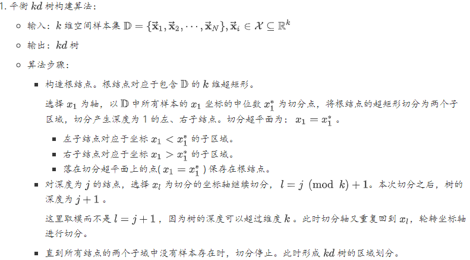
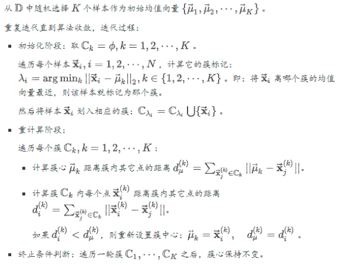
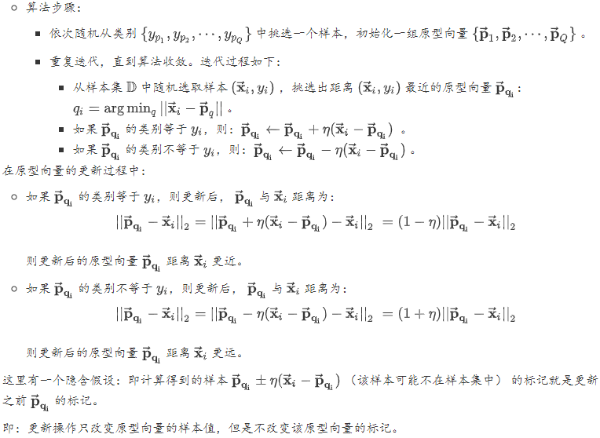
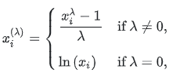
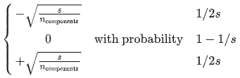
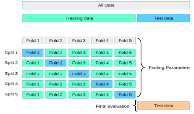
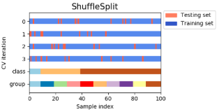
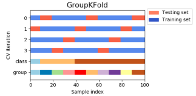
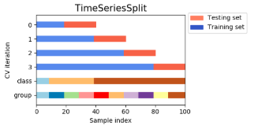

#### 1.1. Linear models

一个线性分类模型或线性分类器，是由一个或多个线性的判别函数$f(\mathbf{x}, w) =w^T\mathbf{x} + b$和非线性的决策函数$g(·)$组成。特征空间$R^d$ 中所有满足$f(\mathbf{x}, w) = 0$的点组成用一个分割超平面，称为决策边界或决策平面。所谓线性分类模型就是指其决策边界是线性超平面。

Across the module, we designate the vector $\omega=(\omega_1,\cdots,\omega_p)$ as `coef_` and $\omega_0$ as `intercept_`.  The coefficient estimates for Ordinary Least Squares rely on the independence of the features. When features are correlated and the columns of the design matrix $X$ have an approximate linear dependence, the design matrix becomes close to singular and as a result, the least-squares estimate becomes highly sensitive to random errors in the observed target, producing a large variance.   The least squares solution is computed using the singular value decomposition of X. 

| 模型                   | 优化                                                         |
| ---------------------- | ------------------------------------------------------------ |
| Ordinary Least Squares | $min_{\omega}||X\omega-y||^2_2$                              |
| Ridge Regression       | $min_\omega||X\omega-y||^2_2+\alpha||\omega||^2_2$           |
| Lasso                  | $min_\omega||X\omega-y||^2_2+\alpha||\omega||_1$             |
| `Elastic-Net`          | $min_\omega||X\omega-y||^2_2+\alpha\rho||\omega||_1+\frac{\alpha(1-\rho)}{2}||\omega||^2_2$ |

The `MultiTaskLasso` is a linear model that estimates sparse coefficients for multiple regression problems jointly: y is a 2D array, of shape (n_samples, n_tasks). The constraint is that the selected features are the same for all the regression problems, also called tasks. Mathematically, it consists of a linear model trained with a mixed$l_1,l_2$-norm for regularization. The objective function to minimize is: 
$$
\min_\omega||XW-Y||_{Fro}^2+\alpha||W||_{21}
$$
 and $l_1 l_2$ reads $||A||_{21}=\sum_i\sqrt{\sum_{ij}\alpha_{ij}^2}$.

 `LARS` is similar to forward stepwise regression. At each step, it finds the feature most correlated with the target. When there are multiple features having equal correlation, instead of continuing along the same feature, it proceeds in a direction equiangular between the features. 

**两类线性可分**：对于训练集$D=\left\{\left(\mathbf{x}^{(n)}, y^{(n)}\right)\right\}_{n=1}^{N}$,如果存在权重向量 $w^∗$，对所有样本都满足$yf(\mathbf{x}, w∗) > 0$，那么训练集$D$是线性可分的。

**多类分类问题**是指分类的类别数$C $大于2。多类分类一般需要多个线性判别函数，但设计这些判别函数有很多种方式。主要有三种：一对其余、一对一、$\text{argmax}$方式。$\text{argmax}$方式：这是一种改进的一对其余方式，共需要$C $个判别函数
$$
f_{c}\left(\mathbf{x}, \mathbf{w}_{c}\right)=\mathbf{w}_{c}^{\mathrm{T}} \mathbf{x}+b_{c}, \quad c=[1, \cdots, C]
$$
如果存在类别$c$，对于所有的其他类别$\widetilde{C}(\widetilde{c} \neq c)$都满足$f_{c}\left(\mathbf{x}, \mathbf{w}_{c}\right)>f_{\tilde{c}}\left(\mathbf{x}, \mathbf{w}_{\tilde{c}}\right)$ 那么$\mathbf{x}$属于类别$c$。即$y=\underset{c=1}{\arg \max } f_{c}\left(\mathbf{x}, \mathbf{w}_{c}\right)$

**多类线性可分**： 对于训练集$D=\left\{\left(\mathbf{x}^{(n)}, y^{(n)}\right)\right\}_{n=1}^{N}$ ，如果存在$C$ 个权重向量 $w^∗_c, 1 ≤ c ≤ C$，对所有第$c$类的样本都满足$f_{c}\left(\mathbf{x}, \mathbf{w}_{c}\right)>f_{\tilde{c}}\left(\mathbf{x}, \mathbf{w}_{\overline{c}}\right), \forall \tilde{c} \neq c$，那么训练集$D$是线性可分的。

###### Logistic回归

引入非线性函数$g :R^d → (0, 1)$来预测类别标签的后验概率$p(y = 1|x)$。
$$
p(y=1 | \mathbf{x})=g(f(\mathbf{x}, \mathbf{w}))
$$
采用交叉熵作为损失函数，并使用梯度下降法来对参数进行优化。
$$
\mathbf{w}_{t+1} \leftarrow \mathbf{w}_{t}+\alpha \frac{1}{N} \sum_{n=1}^{N} \mathbf{x}^{(n)}\left(y^{(n)}-\hat{y}_{\mathbf{w}_{t}}^{(n)}\right)
$$

###### `Softmax`回归

给定一个样本$\mathbf{x}$，$\text{softmax}$回归预测的属于类别$c$的条件概率
$$
\begin{aligned} p(y=c | \mathbf{x}) &=\operatorname{softmax}\left(\mathbf{w}_{c}^{\mathrm{T}} \mathbf{x}\right) \\ &=\frac{\exp \left(\mathbf{w}_{c}^{\top} \mathbf{x}\right)}{\sum_{c=1}^{C} \exp \left(\mathbf{w}_{c}^{\top} \mathbf{x}\right)} \end{aligned}
$$
其中$w_c$是第$c$类的权重向量，用向量形式可以写为
$$
\begin{aligned} \hat{\mathbf{y}} &=\operatorname{softmax}\left(W^{\mathrm{T}} \mathbf{x}\right) \\ &=\frac{\exp \left(W^{\mathrm{T}} \mathbf{x}\right)}{\mathbf{1}^{\mathrm{T}} \exp \left(W^{\mathrm{T}} \mathbf{x}\right)} \end{aligned}
$$
其中$W = [w_1, · · · , w_C ]$是由$C$个类的权重向量组成的矩阵，1为全1向量，$\hat{\mathbf{y}} \in R$，$C$为所有类别的预测条件概率组成的向量，第$c$维的值是第 $c$类的预测条件概率。

$Softmax$回归的决策函数可以表示:
$$
\begin{aligned} \hat{y} &=\underset{c=1}{\arg \max } p(y=c | \mathbf{x}) \\ &=\underset{c=1}{\arg \max } \mathbf{w}_{c}^{\mathrm{T}} \mathbf{x} \end{aligned}
$$
使用交叉熵损失函数来学习最优的参数矩阵$W$。
$$
W_{t+1} \leftarrow W_{t}+\alpha\left(\frac{1}{N} \sum_{n=1}^{N} \mathbf{x}^{(n)}\left(\mathbf{y}^{(n)}-\hat{\mathbf{y}}_{W_{t}}^{(n)}\right)^{\mathrm{T}}\right)
$$

###### 广义线性模型

如果给定$\vec{\mathbf{x}}$和$\vec{\mathbf{w}}$之后，$y$的条件概率分布$p(y | \vec{\mathbf{x}} ; \vec{\mathbf{w}})$服从指数分布族，则该模型称作广义线性模型。指数分布族的形式为：$p(y ; \eta)=b(y) * \exp (\eta T(y)-a(\eta))$。$\eta$是$\vec{\mathbf{x}}$的线性函数：$\eta=\vec{\mathbf{w}}^{T} \vec{\mathbf{x}}$ 。$b(y),T(y)$为$y$的函数。$\alpha(\eta)$为$\eta$的函数.

假设有$K$个分类，样本标记$\tilde{y} \in\{1,2, \cdots, K\}$。每种分类对应的概率为$\phi_{1}, \phi_{2}, \cdots, \phi_{K}$。则根据全概率公式，有
$$
\begin{array}{c}{\sum_{i=1}^{K} \phi_{i}=1} \\ {\phi_{K}=1-\sum_{i=1}^{K-1} \phi_{i}}\end{array}
$$
定义$T(y)$为一个$K-1$维的列向量：
$$
T(1)=\left[ \begin{array}{c}{1} \\ {0} \\ {0} \\ {\vdots} \\ {0}\end{array}\right], T(2)=\left[ \begin{array}{c}{0} \\ {1} \\ {0} \\ {\vdots} \\ {0}\end{array}\right], \cdots, T(K-1)=\left[ \begin{array}{c}{0} \\ {0} \\ {0} \\ {\vdots} \\ {1}\end{array}\right], T(K)=\left[ \begin{array}{c}{0} \\ {0} \\ {0} \\ {\vdots} \\ {0}\end{array}\right]
$$
定义示性函数 : $I(y=i)$表示属于$i$分类；$I(y \neq i)$表示不属于$i$分类。则有：$T(y)_{i}=I(y=i)$

构建概率密度函数为：
$$
\begin{array}{l}p(y ; \phi)=\phi_{1}^{I(y=1)} \times \phi_{2}^{I(y=2)} \times \cdots \times \phi_{K}^{I(y=K)}\\
=\phi_{1}^{T(y)_{1}} \times \phi_{2}^{T(y)_{2}} \times \cdots \times \phi_{K}^{1-\sum_{i-1}^{K-1} T(y)_{i}}\\
{=\exp \left(T(y)_{1} \times \ln \phi_{1}+T(y)_{2} \times \ln \phi_{2}+\cdots+\left(1-\sum_{i=1}^{K-1} T(y)_{i}\right) \times \ln \phi_{K}\right)} \\ {=\exp \left(T(y)_{1} \times \ln \frac{\phi_{1}}{\phi_{K}}+T(y)_{2} \times \ln \frac{\phi_{2}}{\phi_{K}}+\cdots+T(y)_{K-1} \times \ln \frac{\phi_{K-1}}{\phi_{K}}+\ln \phi_{K}\right)}\\
\text{令}：\eta=\left(\ln \frac{\phi_{1}}{\phi_{K}}, \ln \frac{\phi_{2}}{\phi_{K}}, \cdots, \ln \frac{\phi_{K-1}}{\phi_{K}}\right)^{T}\\
\text{则有}:p(y ; \phi)=\exp \left(\eta \cdot T(y)+\ln \phi_{K}\right)\\
\text{令}b(y)=1, a(\eta)=-\ln \phi_{K}，\text{则满足广义线性模型}\\
\phi_{i}=\left\{\begin{array}{ll}{\frac{e^{\eta_{i}}}{1+\sum_{j=1}^{K-1} e^{\eta_{j}}},} & {i=1,2, \cdots, K-1} \\ {\frac{1}{1+\sum_{j=1}^{K-1} e^{\eta_{j}}},} & {i=K}\end{array}\right.
\end{array}
$$

#### 1.2. Linear and Quadratic Discriminant Analysis

Both `LDA` and`QDA` can be derived from simple probabilistic models which model the class conditional distribution of the data $P(X|y=k)$ for each class $k$. Predictions can then be obtained by using Bayes’ rule.  More specifically, for linear and quadratic discriminant analysis, $P(X|y)$ is modeled as a multivariate Gaussian distribution with density.  To use this model as a classifier, we just need to estimate from the training data the class priors by the proportion of instances of class, the class means $\mu_k$ by the empirical sample class means and the covariance matrices either by the empirical sample class covariance matrices, or by a regularized estimator.  In the case of LDA, the Gaussians for each class are assumed to share the same covariance matrix: $\Sigma_k=\Sigma$ for all $k$.  In the case of QDA, there are no assumptions on the covariance matrices $\Sigma_k$ of the Gaussians 

线性判别分析基本思想：**训练时**给定训练样本集，设法将样例投影到某一条直线上，使得同类样例的投影点尽可能接近、异类样例的投影点尽可能远离。要学习的就是这样的一条直线。**预测时**对新样本进行分类时，将其投影到学到的直线上，在根据投影点的位置来确定新样本的类别。

定义类内散度矩阵：
$$
\mathbf{S}_{w}=\Sigma_{0}+\Sigma_{1}=\sum_{\overrightarrow{\mathbf{x}} \in \mathbb{D}_{0}}\left(\overrightarrow{\mathbf{x}}-\vec{\mu}_{0}\right)\left(\overrightarrow{\mathbf{x}}-\vec{\mu}_{0}\right)^{T}+\sum_{\overrightarrow{\mathbf{x}} \in \mathbb{D}_{1}}\left(\overrightarrow{\mathbf{x}}-\vec{\mu}_{1}\right)\left(\overrightarrow{\mathbf{x}}-\vec{\mu}_{1}\right)^{T}
$$
类间散度矩阵：$\mathbf{S}_{b}=\left(\vec{\mu}_{0}-\vec{\mu}_{1}\right)\left(\vec{\mu}_{0}-\vec{\mu}_{1}\right)^{T}$。

利用类内散度矩阵和类间散度矩阵，线性判别分析的最优化目标为：$J=\frac{\vec{w}^{T} \mathbf{S}_{b} \overrightarrow{\mathbf{w}}}{\overrightarrow{\mathbf{w}}^{T} \mathbf{S}_{w} \overrightarrow{\mathbf{w}}}$。现在求解最优化问题：$\overrightarrow{\mathbf{w}}^{*}=\arg \max _{\overrightarrow{\mathbf{w}}} \frac{\overrightarrow{\mathbf{w}}^{T} \mathbf{S}_{b} \overrightarrow{\mathbf{w}}}{\overrightarrow{\mathbf{w}}^{T} \mathbf{S}_{w} \overrightarrow{\mathbf{w}}}$。考虑到分子与分母都是关于$\overrightarrow{\mathbf{w}}$的二次项，因此上式的解与$\overrightarrow{\mathbf{w}}$的长度无关，只与$\overrightarrow{\mathbf{w}}$的方向有关。令$\overrightarrow{\mathbf{w}}^{T} \mathbf{S}_{w} \overrightarrow{\mathbf{w}}=1$，则最优化问题改写为：
$$
\begin{array}{c}{\overrightarrow{\mathbf{w}}^{*}=\arg \min _{\overrightarrow{\mathbf{w}}}-\overrightarrow{\mathbf{w}}^{T} \mathbf{S}_{b} \overrightarrow{\mathbf{w}}} \\ {s . t . \overrightarrow{\mathbf{w}}^{T} \mathbf{S}_{w} \overrightarrow{\mathbf{w}}=1}\end{array}
$$
应用拉格朗日乘子法，上式等价于$\mathbf{S}_{b} \overrightarrow{\mathbf{w}}=\lambda \mathbf{S}_{w} \overrightarrow{\mathbf{w}}$。令$\left(\vec{\mu}_{0}-\vec{\mu}_{1}\right)^{T} \overrightarrow{\mathbf{w}}=\lambda_{\overrightarrow{\mathbf{w}}}$，其中$\lambda_{\overrightarrow{\mathbf{w}}}$为实数。则$\mathbf{S}_{b} \overrightarrow{\mathbf{w}}=\left(\vec{\mu}_{0}-\vec{\mu}_{1}\right)\left(\vec{\mu}_{0}-\vec{\mu}_{1}\right)^{T} \overrightarrow{\mathbf{w}}=\lambda_{\vec{w}}\left(\vec{\mu}_{0}-\vec{\mu}_{1}\right)$。代入上式有：$\mathbf{S}_{b} \overrightarrow{\mathbf{w}}=\lambda_{\overrightarrow{\mathbf{w}}}\left(\vec{\mu}_{0}-\vec{\mu}_{1}\right)=\lambda \mathbf{S}_{w} \overrightarrow{\mathbf{w}}$

#### 1.4. `SVM`

The advantages of support vector machines are: Effective in high dimensional spaces；Still effective in cases where number of dimensions is greater than the number of samples；Uses a subset of training points in the decision function, so it is also memory efficient；Versatile: different Kernel functions can be specified for the decision function.

The disadvantages of support vector machines include: If the number of features is much greater than the number of samples, avoid over-fitting in choosing Kernel functions and regularization term is crucial；SVMs do not directly provide probability estimates, these are calculated using an expensive five-fold cross-validation 

$\text{C-SVM}$：其基本模型定义为特征空间上的间隔最大的线性分类器，其学习策略便是间隔最大化，最终可转化为一个凸二次规划问题的求解。对于线性可分的情况，$C-SVM$问题可以转化为如下的二次规划问题：
$$
\begin{aligned} \min &=\frac{1}{2}\|w\|^{2}+C \sum_{i=1}^{l} \xi_{i} \\ \text {s.t.} & y_{i}\left[w^{T} x_{i}+b\right] \geq 1-\xi_{i}, i=1, \ldots, l \\ & \xi_{i} \geq 0, i=1, \ldots, l \end{aligned}
$$

$\text{V-SVM}$：在$\text{V-SVM}$中有两个互相矛盾的目标：最大$\text{Margin}$和最小训练误差，其中$C$起着调节这两项目标的作用。参数$C$的选取是比较困难的。于是在$\text{C-SVM}$的基础上进行改进，提出了$\text{V-SVM}$。  $\text{V-SVM}$的思想就是利用新的参数来代替$C$。在线性可分的情况下，$\text{V-SVM}$模型如下：
$$
\begin{array}{l}{\min =\frac{1}{2}\|w\|^{2}-\rho v+\frac{1}{l} \sum_{i=1}^{l} \xi_{i}} \\ {\text {s.t.} y_{i}\left[w^{T} x_{i}+b\right] \geq \rho-\xi_{i}, i=1, \ldots, l} \\ {\rho \geq 0} \\ {\quad \xi_{i} \geq 0, i=1, \ldots, l}\end{array}
$$
其中，$l$为训练集样本点的个数。在一定条件下，当$l→∞$时，$v$将以趋近于$1 $的概率渐进与支持向量的个数和训练集样本点的个数比；参数$v$可以用来控制支持向量的数目和误差，也比较容易选择。参数$ρ$代表了两类点将以$\frac{2ρ}{‖w‖}$的间隔分开。

$\text{W-SVM}$：不同的样本在训练集中所占的比重是不同的。基于这一思想，针对不同的样本应该选择不同的惩罚参数，因此提出了加权支持向量机。
$$
\begin{aligned} \min &=\frac{1}{2}\|w\|^{2}+C \sum_{i=1}^{l} s_{i} \xi_{i} \\ \text {s.t.} & y_{i}\left[w^{T} x_{i}+b\right] \geq 1-\xi_{i}, i=1, \ldots, l \\ & \xi_{i} \geq 0, i=1, \ldots, l \end{aligned}
$$

$\text{LS-SVM}$： 当训练样本很大时，优化$\text{C-SVM}$算法计算量庞大。为方便求解$\text{SVM}$，提出了最小而成支持向量机。$\text{LS-SVM}$将$\text{C-SVM}$中的不等式约束变为等式约束，求解过程变成了解一组等式方程，求解速度相对加快。但是$\text{LS-SVM}$使用的是最小二乘损失函数，这样破坏$\text{C-SVM}$的稀疏性。
$$
\begin{aligned} \min &=\frac{1}{2}\|w\|^{2}+\frac{C}{2} \sum_{i=1}^{l} \xi_{i}^{2} \\ \text {s.t.} & y_{i}\left[w^{T} x_{i}+b\right]=1-\xi_{i}, i=1, \ldots, l \\ & \xi_{i} \geq 0, i=1, \ldots, l \end{aligned}
$$

$\text{L-SVM}$：虽然$\text{LS-SVM}$可以提高求解$SVM$的速度，但提高的速度相对较小。如果改变$\text{C-SVM}$的目标函数，使得对偶问题为一无上界约束的二次函数的最小值问题，那么将大大加快求解的速度。因此提出了$\text{Lanrange}$支持向量机。
$$
\begin{array}{l}{\min =\frac{1}{2}\|w\|^{2}+\frac{C}{2} \sum_{i=1}^{l} \xi_{i}^{2}+\frac{1}{2} b^{2}} \\ {\text {s.t.} y_{i}\left[w^{T} x_{i}+b\right] \geq 1-\xi_{i}, i=1, \ldots, l}\end{array}
$$
对于线性不可分的情况，$\text{SVM}$先将训练集做非线性变换将输入空间映射到$Hilbert$空间。即寻找一个变换$Φ$，满足：
$$
\begin{array}{l}{\Phi : X \subset R^{n} \rightarrow H} \\ {x : \rightarrow \Phi(x)}\end{array}
$$

#### 1.6. Nearest Neighbors

`sklearn.neighbors` provides functionality for unsupervised and supervised neighbors-based learning methods. The principle behind nearest neighbor methods is to find a predefined number of training samples closest in distance to the new point, and predict the label from these. The number of samples can be a user-defined constant (k-nearest neighbor learning), or vary based on the local density of points (radius-based neighbor learning). The distance can, in general, be any metric measure
`NearestNeighbors` implements unsupervised nearest neighbors learning. It acts as a uniform interface to three different nearest neighbors algorithms: BallTree, KDTree, and a brute-force algorithm. The choice of neighbors search algorithm is controlled through the keyword `'algorithm'`, which must be one of ['auto', 'ball_tree', 'kd_tree', 'brute']. 

$k$近邻法是个非参数学习算法，它没有任何参数。 近邻模型具有非常高的容量，这使得它在训练样本数量较大时能获得较高的精度。它的缺点有：计算成本很高。因为需要构建一个$N\times N$的距离矩阵，其计算量为$O(N^2)$，其中$N$为训练样本的数量。在训练集较小时，泛化能力很差，非常容易陷入过拟合。无法判断特征的重要性。

##### K近邻算法

近邻法的三要素： $k$值选择、距离度量、决策规则。

决策规则: 分类决策通常采用多数表决，也可以基于距离的远近进行加权投票：距离越近的样本权重越大。多数表决等价于经验风险最小化。回归决策通常采用均值回归，也可以基于距离的远近进行加权投票：距离越近的样本权重越大。均值回归等价于经验风险最小化。

##### `kd`树

$kd$树是一种对$k$维空间中的样本点进行存储以便对其进行快速检索的树型数据结构。它是二叉树，表示对$k$维空间的一个划分。构造$kd$树的过程相当于不断的用垂直于坐标轴的超平面将$k$维空间切分的过程。$kd$树的每个结点对应于一个$k$维超矩形区域。



$kd$树搜索算法


#### 1.9. Naive Bayes

设输入空间$\mathcal{X} \subseteq \mathbb{R}^{n}$为$n$维向量的集合，输出空间为类标记集合$\mathcal{Y}=\left\{c_{1}, c_{2}, \cdots, c_{k}\right\}$。令$\overrightarrow{\mathbf{x}}=\left(x_{1}, x_{2}, \cdots, x_{n}\right)^{T}$为定义在$\mathcal{X}$上的随机向量，$y$为定义在$\mathcal{Y}$上的随机变量。令$p(\vec{\mathbf{x}}, y)$为$\vec{\mathbf{x}}$和$y$的联合概率分布，假设训练数据集$\mathbb{D}=\left\{\left(\overrightarrow{\mathbf{x}}_{1}, \tilde{y}_{1}\right),\left(\overrightarrow{\mathbf{x}}_{2}, \tilde{y}_{2}\right), \cdots,\left(\overrightarrow{\mathbf{x}}_{N}, \tilde{y}_{N}\right)\right\}$由$p(\overrightarrow{\mathbf{x}}, y)$独立同分布产生。朴素贝叶斯法通过训练数据集学习联合概率分布 。具体的学习下列概率分布：先验概率分布：$p(\overrightarrow{\mathbf{x}}, y)$。条件概率分布：$p(\overrightarrow{\mathbf{x}} | y)=p\left(x_{1}, x_{2}, \cdots, x_{n} | y\right)$。朴素贝叶斯法对条件概率做了特征独立性假设：$p(\overrightarrow{\mathbf{x}} | y)=p\left(x_{1}, x_{2}, \cdots, x_{n} | y\right)=\prod_{j=1}^{n} p\left(x_{j} | y\right)$。这意味着在分类确定的条件下，用于分类的特征是条件独立的。根据贝叶斯定理：
$$
p(y | \overrightarrow{\mathbf{x}})=\frac{p(\overrightarrow{\mathbf{x}} | y) p(y)}{\sum_{y^{\prime}} p\left(\overrightarrow{\mathbf{x}} | y^{\prime}\right) p\left(y^{\prime}\right)}
$$
考虑分类特征的条件独立假设有：
$$
p(y | \overrightarrow{\mathbf{x}})=\frac{p(y) \prod_{i=1}^{n} p\left(x_{i} | y\right)}{\sum_{y} p\left(\overrightarrow{\mathbf{x}} | y^{\prime}\right) p\left(y^{\prime}\right)}
$$
则朴素贝叶斯分类器表示为：
$$
f(\overrightarrow{\mathbf{x}})=\arg \max _{y \in \mathcal{Y}} \frac{p(y) \prod_{i=1}^{n} p\left(x_{i} | y\right)}{\sum_{y} p\left(\overrightarrow{\mathbf{x}} | y^{\prime}\right) p\left(y^{\prime}\right)}
$$
朴素贝叶斯分类器是后验概率最大化，等价于期望风险最小化。令损失函数为：
$$
L(y, f(\overrightarrow{\mathbf{x}}))=\left\{\begin{array}{l}{1,} & {y \neq f(\overrightarrow{\mathbf{x}})} \\ {0,} & {y=f(\overrightarrow{\mathbf{x}})}\end{array}\right.\\R_{e x p}(f)=\mathbb{E}[L(y, f(\overrightarrow{\mathbf{x}}))]=\sum_{\overrightarrow{\mathbf{x}} \in \mathcal{X}} \sum_{y \in \mathcal{Y}} L(y, f(\overrightarrow{\mathbf{x}})) p(\overrightarrow{\mathbf{x}}, y)
$$
根据$p(\overrightarrow{\mathbf{x}}, y)=p(\overrightarrow{\mathbf{x}}) p(y | \overrightarrow{\mathbf{x}})$有：
$$
R_{e x p}(f)=\mathbb{E}[L(y, f(\overrightarrow{\mathbf{x}}))]=\sum_{\overrightarrow{\mathbf{x}} \in \mathcal{X}} \sum_{y \in \mathcal{Y}} L(y, f(\overrightarrow{\mathbf{x}})) p(\overrightarrow{\mathbf{x}}, y)=\mathbb{E}_{X}\left[\sum_{y \in \mathcal{Y}} L(y, f(\overrightarrow{\mathbf{x}})) p(y | \overrightarrow{\mathbf{x}})\right]
$$
为了使得期望风险最小化，只需要对$\mathbb{E}_{X}$中的元素极小化。令$\hat{y}=f(\overrightarrow{\mathbf{x}})$，则有：
$$
\begin{array}{l}{\arg \min _{\hat{y}} \sum_{y \in \mathcal{Y}} L(y, \hat{y}) p(y | \overrightarrow{\mathbf{x}})=\arg \min _{\hat{y}} \sum_{y \in \mathcal{Y}} p(y \neq \hat{y} | \overrightarrow{\mathbf{x}})} \\ {=\arg \min _{\hat{y}}(1-p(\hat{y} | \overrightarrow{\mathbf{x}}))=\arg \max _{\hat{y}} p(\hat{y} | \overrightarrow{\mathbf{x}})}\end{array}
$$
即：期望风险最小化，等价于后验概率最大化。

#### 1.13. Feature selection

###### Removing features with low variance

`VarianceThreshold` is a simple baseline approach to feature selection. It removes all features whose variance doesn’t meet some threshold. By default, it removes all zero-variance features

###### Univariate feature selection

Univariate feature selection works by selecting the best features based on univariate statistical tests. It can be seen as a preprocessing step to an estimator. `Scikit-learn` exposes feature selection routines as objects that implement the transform method:

- `SelectKBest` removes all but the  highest scoring features
- `SelectPercentile` removes all but a user-specified highest scoring percentage of features
- using common univariate statistical tests for each feature: false positive rate `SelectFpr`, false discovery rate `SelectFdr`, or family wise error `SelectFwe`.
- `GenericUnivariateSelect` allows to perform univariate feature selection with a configurable strategy. This allows to select the best univariate selection strategy with hyper-parameter search estimator.

These objects take as input a scoring function that returns univariate scores and p-values (or only scores for `SelectKBest` and `SelectPercentile`): For regression: `f_regression, mutual_info_regression`; For classification: `chi2, f_classif, mutual_info_classif`.

The methods based on `F-test` estimate the degree of linear dependency between two random variables. On the other hand, mutual information methods can capture any kind of statistical dependency, but being nonparametric, they require more samples for accurate estimation.

###### Recursive feature elimination

Given an external estimator that assigns weights to features, recursive feature elimination is to select features by recursively considering smaller and smaller sets of features. First, the estimator is trained on the initial set of features and the importance of each feature is obtained either through a `coef_` attribute or through a `feature_importances_` attribute. Then, the least important features are pruned from current set of features. That procedure is recursively repeated on the pruned set until the desired number of features to select is eventually reached. `RFECV` performs `RFE` in a cross-validation loop to find the optimal number of features.

###### Feature selection using `SelectFromModel`

`SelectFromModel` is a meta-transformer that can be used along with any estimator that has a `coef_` or `feature_importances_` attribute after fitting. The features are considered unimportant and removed, if the corresponding `coef_` or `feature_importances_` values are below the provided threshold parameter. Apart from specifying the threshold numerically, there are built-in heuristics for finding a threshold using a string argument. Available heuristics are `“mean”, “median”` and float multiples of these like `“0.1*mean”`.·

```python
from sklearn.svm import LinearSVC
from sklearn.datasets import load_iris
from sklearn.feature_selection import SelectFromModel
X, y = load_iris(return_X_y=True)
lsvc = LinearSVC(C=0.01, penalty="l1", dual=False).fit(X, y)
model = SelectFromModel(lsvc, prefit=True)
X_new = model.transform(X)
```

#### 2.1. Gaussian mixture models

##### EM算法

###### 观测变量与隐变量

令$\mathbf{Y}$表示观测随机变量，$\mathbb{Y}=\left\{y_{1}, y_{2}, \cdots, y_{N}\right\}$表示对应的数据序列；令$\mathbf{Z}$表示隐随机变量，$\mathbb{Z}=\left\{z_{1}, z_{2}, \cdots, z_{N}\right\}$表示对应的数据序列。$\mathbb{Y}$和$\mathbb{Z}$连在一起称作完全数据，观测数据$\mathbb{Y}$又称作不完全数据。假设给定观测随机变量$\mathbf{Y}$，其概率分布为$P(Y ; \theta)$，其中$\theta$是需要估计的模型参数，则不完全数据$\mathbb{Y}$的似然函数是$P(\mathbb{Y} ; \theta)$， 对数似然函数为$L(\theta)=\log P(\mathbb{Y} ; \theta)$。

假定$\mathbf{Y}$和$\mathbf{Z}$的联合概率分布是$P(Y, Z ; \theta)$，完全数据的对数似然函数是$\log P(\mathbb{Y}, \mathbb{Z} ; \theta)$，则根据每次观测之间相互独立，有：
$$
\begin{array}{c}{\log P(\mathbb{Y} ; \theta)=\sum_{i} \log P\left(Y=y_{i} ; \theta\right)} \\ {\log P(\mathbb{Y}, \mathbb{Z} ; \theta)=\sum_{i} \log P\left(Y=y_{i}, Z=z_{i} ; \theta\right)}\end{array}
$$
由于$\mathbb{Y}$发生，根据最大似然估计，则需要求解对数似然函数：
$$
\begin{array}{c}{L(\theta)=\log P(\mathbb{Y} ; \theta)=\sum_{i=1} \log P\left(Y=y_{i} ; \theta\right)=\sum_{i=1} \log \sum_{Z} P} \\ {=\sum_{i=1} \log \left[\sum_{Z} P\left(Y=y_{i} | Z ; \theta\right) P(Z ; \theta)\right]}\end{array}
$$
的极大值。其中$\sum_{Z} P\left(Y=y_{i}, Z ; \theta\right)$表示对所有可能的$\mathbf{Z}$求和，因为边缘分布$P(Y)=\sum_{Z} P(Y, Z)$。

###### 原理

`EM` 算法通过迭代逐步近似极大化$L(\theta)$。

假设在第$i$次迭代后，$\theta$的估计值为：$\theta^i$。则希望$\theta$新的估计值能够使得$L(\theta)$增加。为此考虑两者的差：$L(\theta)-L\left(\theta^{i}\right)=\log P(\mathbb{Y} ; \theta)-\log P\left(\mathbb{Y} ; \theta^{i}\right)$

`Jensen`不等式：如果$f$是凸函数，$x$为随机变量，则有：$\mathbb{E}[f(x)] \leq f(\mathbb{E}[x])$。

考虑到条件概率的性质，则有$\sum_{Z} P(Z | Y ; \theta)=1$。因此有
$$
\begin{array}{1}{L(\theta)-L\left(\theta^{i}\right)=\sum_{j} \log \sum_{Z} P\left(Y=y_{j}, Z ; \theta\right)-\sum_{j} \log P\left(Y=y_{j} ; \theta^{i}\right)} \\ {=\sum_{j}\left[\log \sum_{Z} P\left(Z | Y=y_{j} ; \theta^{i}\right) \frac{P\left(Y=y_{j}, Z ; \theta\right)}{P\left(Z | Y=y_{j} ; \theta^{i}\right)}-\log P\left(Y=y_{j} ; \theta^{i}\right)\right]}\\
\geq \sum_{j}\left[\sum_{Z} P\left(Z | Y=y_{j} ; \theta^{i}\right) \log \frac{P\left(Y=y_{j}, Z ; \theta\right)}{P\left(Z | Y=y_{j} ; \theta^{i}\right)}-\log P\left(Y=y_{j} ; \theta^{i}\right)\right]\\
=\sum_{j} \left[\sum_{Z} P\left(Z | Y=y_{j} ; \theta^{i}\right) \log \frac{P\left(Y=y_{j} | Z ; \theta\right) P(Z ; \theta)}{P\left(Z | Y=y_{j} ; \theta^{i}\right)}\right.-\log P\left(Y=y_{j} ; \theta^{i}\right) \times \sum_{Z} P\left(Z | Y=y_{j} ; \theta^{i}\right) ]\\
=\sum_{j}\left[\sum_{Z} P\left(Z | Y=y_{j} ; \theta^{i}\right) \log \frac{P\left(Y=y_{j} | Z ; \theta\right) P(Z ; \theta)}{P\left(Z | Y=y_{j} ; \theta^{i}\right) P\left(Y=y_{j} ; \theta^{i}\right)}\right]\\
\text{令}:\\
B\left(\theta, \theta^{i}\right)=L\left(\theta^{i}\right)+\sum_{j}\left[\sum_{Z} P\left(Z | Y=y_{j} ; \theta^{i}\right) \log \frac{P\left(Y=y_{j} | Z ; \theta\right) P(Z ; \theta)}{P\left(Z | Y=y_{j} ; \theta^{i}\right) P\left(Y=y_{j} ; \theta^{i}\right)}\right]
\end{array}
$$
任何可以使得$B(\theta, \theta^{i})$增大的$\theta$，也可以使$L(\theta)$增大。为了使得$L(\theta)$尽可能增大，则选择使得$B(\theta, \theta^{i})$取极大值的$\theta$：$\theta^{i+1}=\arg \max _{\theta} B\left(\theta, \theta^{i}\right)$。
$$
\begin{array}{l}\theta^{i+1}=\arg \max _{\theta} B\left(\theta, \theta^{i}\right)\\{=\arg \max _{\theta} \sum_{j}\left(\sum_{Z} P\left(Z | Y=y_{j} ; \theta^{i}\right) \log P\left(Y=y_{j} | Z ; \theta\right) P(Z ; \theta)\right)} \\ {=\arg \max _{\theta} \sum_{j}\left(\sum_{Z} P\left(Z | Y=y_{j} ; \theta^{i}\right) \log P\left(Y=y_{j}, Z ; \theta\right)\right)}\end{array}
$$

#### 2.2. Manifold learning

##### 多维缩放：`MDS`

多维缩放要求原始空间中样本之间的距离在低维空间中得到保持。


###### 等度量映射

等度量映射的基本观点是：低维流形嵌入到高维空间后，直接在高维空间中计算直线距离具有误导性。因为在高维空间中的直线距离在低维嵌入流形上是不可达的。利用流形在局部上与欧氏空间同胚这个性质，对每个点基于欧氏距离找出它在低维流形上的近邻点， 然后就能建立一个近邻连接图。图中近邻点之间存在链接。图中非近邻点之间不存在链接。于是计算两点之间测地线距离的问题转变为计算近邻连接图上两点之间的最短路径问题。在得到任意两点的距离之后，就可以通过`MDS`算法来获得样本点在低维空间中的坐标。


###### 局部线性嵌入：`LLE`

假定样本点$\vec{\mathbf{x}}_i$的坐标能够通过它的邻域样本$\vec{\mathbf{x}}_{j}, \vec{\mathbf{x}}_{k}, \vec{\mathbf{x}}_{l}$进行线性组合而重构出来，即：$\vec{\mathbf{x}}_{i}=w_{i, j} \vec{\mathbf{x}}_{j}+w_{i, k} \vec{\mathbf{x}}_{k}+w_{i, l} \vec{\mathbf{x}}_{l}$。`LLE`算法希望这种关系在低维空间中得到保持。

`LLE`首先为每个样本$\vec{\mathbf{x}}$找到其近邻点下标集合$\mathbf{Q}_i$， 然后计算基于$\mathbf{Q}_i$中的样本点对$\vec{\mathbf{x}}$进行线性重构的系数$\overrightarrow{\mathbf{w}}_{i}$。定义样本集重构误差为：$e r r=\sum_{i=1}^{N}\left\|\overrightarrow{\mathbf{x}}_{i}-\sum_{j \in \mathbb{Q}_{i}} w_{i, j} \overrightarrow{\mathbf{x}}_{j}\right\|_{2}^{2}$。目标是样本集重构误差最小，即：$\min _{\overrightarrow{\mathbf{w}}_{1}, \overrightarrow{\mathbf{w}}_{2}, \cdots, \overrightarrow{\mathbf{w}}_{N}} \sum_{i=1}^{N}\left\|\overrightarrow{\mathbf{x}}_{i}-\sum_{j \in \mathbb{Q}_{i}} w_{i, j} \overrightarrow{\mathbf{x}}_{j}\right\|_{2}^{2}$。这样的解有无数个，对权重增加约束，进行归一化处理。即：$\sum_{j \in \mathbb{Q}_{i}} w_{i, j}=1, i=1,2, \cdots, N$。现在就是求解最优化问题：
$$
\begin{array}{l}{\min _{\overrightarrow{\mathbf{w}}_{1}, \overrightarrow{\mathbf{w}}_{2}, \cdots, \overrightarrow{\mathbf{w}}_{N}} \sum_{i=1}^{N}\left\|\overrightarrow{\mathbf{x}}_{i}-\sum_{j \in \mathbb{Q}_{i}} w_{i, j} \overrightarrow{\mathbf{x}}_{j}\right\|_{2}^{2}} \\ {\text {s.t. } \sum_{j \in \mathbb{Q}_{i}} w_{i, j}=1, i=1,2, \cdots, N}\end{array}
$$
该最优化问题有解析解。令$C_{j, k}=\left(\overrightarrow{\mathbf{x}}_{i}-\overrightarrow{\mathbf{x}}_{j}\right)^{T}\left(\overrightarrow{\mathbf{x}}_{i}-\overrightarrow{\mathbf{x}}_{k}\right)$，则可以解出：$w_{i, j}=\frac{\sum_{k \in \mathbb{Q}_{i}} C_{j, k}^{-1}}{\sum_{l, s \in \mathbb{Q}_{i}} C_{l, s}^{-1}}, j \in \mathbb{Q}_{i}$。`LLE` 中出现了两个重构误差。第一个重构误差：为了在原始空间中求解线性重构的系数$\vec{\mathbf{w}}_i$。目标是：基于$\mathbb{Q}_i$中的样本点对$\vec{\mathbf{x}}_i$进行线性重构，使得重构误差最小。第二个重构误差：为了求解样本集在低维空间中的表示$\mathbf{Z}$。目标是：基于线性重构的系数$\vec{\mathbf{w}}_i$，将$\mathbb{Q}_i$中的样本点对$\vec{\mathbf{z}}_i$进行线性重构，使得重构误差最小。

求出了线性重构的系数$\vec{\mathbf{w}}_i$之后， `LLE`在低维空间中保持$\vec{\mathbf{w}}_i$不变。设$\vec{\mathbf{x}}_i$对应的低维坐标$\vec{\mathbf{z}}_i$，已知线性重构的系数  ，定义样本集在低维空间中重构误差为：$e r r^{\prime}=\sum_{i=1}^{N}\left\|\overrightarrow{\mathbf{z}}_{i}-\sum_{j \in \mathbb{Q}_{i}} w_{i, j} \overrightarrow{\mathbf{z}}_{j}\right\|_{2}^{2}$。现在的问题是要求出$\vec{\mathbf{z}}_i$，从而使得上式最小。即求解：$\min _{\overrightarrow{\mathbf{z}}_{1}, \overrightarrow{\mathbf{z}}_{1}, \cdots, \overrightarrow{\mathbf{z}}_{N}} \sum_{i=1}^{N}\left\|\overrightarrow{\mathbf{z}}_{i}-\sum_{j \in \mathbb{Q}_{i}} w_{i, j} \overrightarrow{\mathbf{z}}_{j}\right\|_{2}^{2}$。令$\mathbf{Z}=\left(\overrightarrow{\mathbf{z}}_{1}^{T}, \overrightarrow{\mathbf{z}}_{2}^{T}, \cdots, \overrightarrow{\mathbf{z}}_{N}^{T}\right)^{T} \in \mathbb{R}^{N \times n^{\prime}}$，其中  为低维空间的维数$n^{\prime}$。定义$\mathbf{M}=(\mathbf{I}-\mathbf{W})^{T}(\mathbf{I}-\mathbf{W})$，于是最优化问题可重写为：$\min _{\mathbf{Z}} \operatorname{tr}\left(\mathbf{Z}^{T} \mathbf{M} \mathbf{Z}\right)$。

该最优化问题有无数个解。添加约束$\mathbf{Z}^{T} \mathbf{Z}=\mathbf{I}_{n^{\prime} \times n^{\prime}}$，于是最优化问题为：
$$
\begin{array}{cl}{\min _{\mathbf{Z}}} & {\operatorname{tr}\left(\mathbf{Z}^{T} \mathbf{M} \mathbf{Z}\right)} \\ {\text {s.t.}} & {\mathbf{Z}^{T} \mathbf{Z}=\mathbf{I}_{n^{\prime} \times n^{\prime}}}\end{array}
$$
该最优化问题可以通过特征值分解求解选取$\mathbf{M}$最小的$n^{\prime}$个特征值对应的特征向量组成的矩阵即为$\mathbf{Z}$。

##### 度量学习

在机器学习中对高维数据进行降维的主要目的是：希望找出一个合适的低维空间，在这个低维空间中进行学习能比原始空间性能更好。每个空间对应了在样本属性上定义的一个距离度量。寻找合适的空间，本质上就是在寻找一个合适的距离度量。度量学习的思想就是：尝试直接学习出一个合适的距离度量。
$$
\operatorname{dist}_{\operatorname{mah}}^{2}\left(\overrightarrow{\mathbf{x}}_{i}, \overrightarrow{\mathbf{x}}_{j}\right)=\left(\overrightarrow{\mathbf{x}}_{i}-\overrightarrow{\mathbf{x}}_{j}\right)^{T} \mathbf{M}\left(\overrightarrow{\mathbf{x}}_{i}-\overrightarrow{\mathbf{x}}_{j}\right)
$$
其中的矩阵$\mathbf{M}$也称作度量矩阵，度量学习就是对$\mathbf{M}$进行学习。为了保持距离非负而且对称，则$\mathbf{M}$必须是半正定对称矩阵。即必有正交基$\mathbf{P}$，使得$
\mathbf{M}=\mathbf{P} \mathbf{P}^{T}
$。对$\mathbf{M}$学习的目标是：将$\mathbf{M}$嵌入到学习器的评价指标中去，通过优化学习器的评价指标来求得  。即：对$\mathbf{M}$的学习无法直接提出优化目标，而是将$\mathbf{M}$的学习与学习器的学习作为一个整体，然后优化学习器的优化目标。

##### $\text{t-SNE}$

`SNE` 的基本思想：如果两个样本在高维相似，则它们在低维也相似。`SNE` 主要包含两步：构建样本在高维的概率分布。在低维空间里重构这些样本的概率分布，使得这两个概率分布之间尽可能相似。

在数据集$\mathbb{D}=\left\{\overrightarrow{\mathbf{x}}_{1}, \cdots, \overrightarrow{\mathbf{x}}_{N}\right\}$中，给定一个样本$\overrightarrow{\mathbf{x}}_{i}$，然后计算$\left\{\overrightarrow{\mathbf{x}}_{1}, \cdots, \overrightarrow{\mathbf{x}}_{i-1}, \overrightarrow{\mathbf{x}}_{i+1}, \cdots, \overrightarrow{\mathbf{x}}_{N}\right\}$是$\overrightarrow{\mathbf{x}}_{i}$的邻居的概率。`SNE` 假设：如果$\overrightarrow{\mathbf{x}}_{j}$与$\overrightarrow{\mathbf{x}}_{i}$越相似，则$\overrightarrow{\mathbf{x}}_{j}$是$\overrightarrow{\mathbf{x}}_{i}$的邻居的概率越大。相似度通常采用欧几里得距离来衡量，两个样本距离越近则它们越相似。概率$p\left(\overrightarrow{\mathbf{x}}_{j} | \overrightarrow{\mathbf{x}}_{i}\right)$通常采用指数的形式：$p\left(\overrightarrow{\mathbf{x}}_{j} | \overrightarrow{\mathbf{x}}_{i}\right) \propto \exp \left(-\left\|\overrightarrow{\mathbf{x}}_{j}-\overrightarrow{\mathbf{x}}_{i}\right\|^{2} /\left(2 \sigma_{i}^{2}\right)\right)$对$j=1,2, \cdots, N, j \neq i$进行归一化有：
$$
p\left(\overrightarrow{\mathbf{x}}_{j} | \overrightarrow{\mathbf{x}}_{i}\right)=\frac{\exp \left(-\left\|\overrightarrow{\mathbf{x}}_{j}-\overrightarrow{\mathbf{x}}_{i}\right\|^{2} /\left(2 \sigma_{i}^{2}\right)\right)}{\sum_{k \neq i} \exp \left(-\left\|\overrightarrow{\mathbf{x}}_{k}-\overrightarrow{\mathbf{x}}_{i}\right\|^{2} /\left(2 \sigma_{i}^{2}\right)\right)}
$$
其中$\sigma_i$是与$\overrightarrow{\mathbf{x}}_{i}$相关的、待求得参数，它用于对距离进行归一化。定义$p_{j | i}=p\left(\overrightarrow{\mathbf{x}}_{j} | \overrightarrow{\mathbf{x}}_{i}\right)$。由于挑选时$\overrightarrow{\mathbf{x}}_{j}$排除了$\overrightarrow{\mathbf{x}}_{i}$，因此有$p_{i | i}=0$。定义概率分布$P_{i}=\left(p_{1 | i}, \cdots, p_{N | i}\right)$，它刻画了所有其它样本是$\overrightarrow{\mathbf{x}}_{i}$的邻居的概率分布。

假设经过降维，样本$\overrightarrow{\mathbf{x}}_{i} \in \mathbb{R}^{n}$在低维空间的表示为$\overrightarrow{\mathbf{z}}_{i} \in \mathbb{R}^{d}$，其中$d \leq n$。定义：
$$
q_{j | i}=q\left(\overrightarrow{\mathbf{z}}_{j} | \overrightarrow{\mathbf{z}}_{i}\right)=\frac{\exp \left(-\left\|\overrightarrow{\mathbf{z}}_{j}-\overrightarrow{\mathbf{z}}_{i}\right\|^{2}\right)}{\sum_{k \neq i} \exp \left(-\left\|\overrightarrow{\mathbf{z}}_{k}-\overrightarrow{\mathbf{z}}_{i}\right\|^{2}\right)}
$$
其中$q_{j|i}$表示给定一个样本$\vec{\mathbf{z}}_i$，然后计算$\left\{\overrightarrow{\mathbf{z}}_{1}, \cdots, \overrightarrow{\mathbf{z}}_{i-1}, \overrightarrow{\mathbf{z}}_{i+1}, \cdots, \overrightarrow{\mathbf{z}}_{N}\right\}$是$\vec{\mathbf{z}}_j$的邻居的概率。这里选择$\sigma^2=\frac{1}{2}$为固定值。同样地，有$q_{i|i}=0$。定义概率分布$Q_{i}=\left(q_{1 i}, \cdots, q_{N | i}\right)$，它刻画了所有其它样本是$\vec{\mathbf{z}}_i$的邻居的概率分布。

对于样本$\vec{\mathbf{x}}_i$，如果降维的效果比较好，则有$p_{j | i}=q_{j i}, i=1,2, \cdots, N$。即：降维前后不改变$\vec{\mathbf{x}}_i$周围的样本分布。对于，定义$\vec{\mathbf{x}}_i$其损失函数为分布$\mathbf{P}_I$和$\mathbf{Q}_I$的距离，通过 `KL` 散度来度量。对于全体数据集$\mathbf{D}$，整体损失函数为：
$$
\mathcal{L}=\sum_{i=1}^{N} K L\left(P_{i} \| Q_{i}\right)=\sum_{i=1}^{N} \sum_{j=1}^{N} p_{j | i} \log \frac{p_{j | i}}{q_{j | i}}
$$
记$y_{i, j}=-\left\|\overrightarrow{\mathbf{z}}_{j}-\overrightarrow{\mathbf{z}}_{i}\right\|^{2}$，则有$q_{j | i}=\frac{\exp \left(y_{i, j}\right)}{\sum_{k \neq i} \exp \left(y_{i, k}\right)}$。
$$
\begin{array}{1}
\nabla_{y_{i, j}}\left(\sum_{j=1}^{N} p_{j | i} \log q_{j | \dot{s}}\right)=p_{j | i}-q_{j | i}\\
\begin{array}{c}{\nabla_{\overrightarrow{\mathbf{z}}_{i}}\left(\sum_{j=1}^{N} p_{j | i} \log q_{j | i}\right)=\nabla_{y_{i, j}}\left(\sum_{j=1}^{N}-p_{j | i} \log q_{j | i}\right) \times \nabla_{\overrightarrow{\mathbf{z}}_{i}} y_{i, j}} \\ {=-2\left(p_{j | i}-q_{j | i}\right) \times\left(\overrightarrow{\mathbf{z}}_{i}-\overrightarrow{\mathbf{z}}_{j}\right)}\end{array}\\
\begin{array}{c}{\nabla_{\overrightarrow{\mathbf{a}}_{j}}\left(\sum_{i=1}^{N} p_{j | i} \log q_{j | i}\right)=\nabla_{y_{i, j}}\left(\sum_{i=1}^{N}-p_{j | i} \log q_{j | i}\right) \times \nabla_{\overrightarrow{\mathbf{z}}} y_{i, j}} \\ {=-2\left(p_{j | i}-q_{j | i}\right) \times\left(\overrightarrow{\mathbf{z}}_{j}-\overrightarrow{\mathbf{z}}_{i}\right)}\end{array}
\end{array}
$$
`t-SNE` 通过采用不同的分布来解决拥挤问题：在高维空间下使用高斯分布将距离转换为概率分布。在低维空间下使用 `t` 分布将距离转换为概率分布。`t-SNE` 使用自由度为`1` 的 `t` 分布。此时有：$q_{i, j}=\frac{\left(1+\left\|\overrightarrow{\mathbf{z}}_{i}-\overrightarrow{\mathbf{z}}_{j}\right\|^{2}\right)^{-1}}{\sum_{k} \sum_{l, l \neq k}\left(1+| | \overrightarrow{\mathbf{z}}_{k}-\overrightarrow{\mathbf{z}}_{l}| |^{2}\right)^{-1}}$。则梯度为：
$$
\nabla_{\overrightarrow{\mathbf{z}}_{i}} \mathcal{L}=\sum_{j} 4\left(p_{i, j}-q_{i, j}\right)\left(\overrightarrow{\mathbf{z}}_{i}-\overrightarrow{\mathbf{z}}_{j}\right)\left(1+\left\|\overrightarrow{\mathbf{z}}_{i}-\overrightarrow{\mathbf{z}}_{j}\right\|^{2}\right)^{-1}
$$
也可以选择自由度超过 `1` 的 `t` 分布。自由度越高，越接近高斯分布。

##### 2.3. Clustering

##### 性能度量

###### 外部指标

对于数据集$\mathbb{D}=\left\{\overrightarrow{\mathbf{x}}_{1}, \overrightarrow{\mathbf{x}}_{2}, \cdots, \overrightarrow{\mathbf{x}}_{N}\right\}$，假定通过聚类给出的簇划分为$\mathcal{C}=\left\{\mathbb{C}_{1}, \mathbb{C}_{2}, \cdots, \mathbb{C}_{K}\right\}$。参考模型给出的簇划分为$\mathcal{C}^{*}=\left\{\mathbb{C}_{1}^{*}, \mathbb{C}_{2}^{*}, \cdots, \mathbb{C}_{K^{\prime}}^{*}\right\}$，其中$K$和$K^{\prime}$不一定相等 。

令$\vec{\lambda}, \vec{\lambda}^{*}$分别表示$\mathcal{C}, \mathcal{C}^{*}$的簇标记向量。定义：
$$
\begin{array}{l}{a=|S S|, S S=\left\{\left(\vec{x}_{i}, \vec{x}_{j}\right) | \lambda_{i}=\lambda_{j}, \lambda_{i}^{*}=\lambda_{j}^{*}, i<j\right\}} \\ {b=|S D|, S D=\left\{\left(\vec{x}_{i}, \vec{x}_{j}\right) | \lambda_{i}=\lambda_{j}, \lambda_{i}^{*} \neq \lambda_{j}^{*}, i<j\right\}} \\ {c=|D S|, D S=\left\{\left(\vec{x}_{i}, \vec{x}_{j}\right) | \lambda_{i} \neq \lambda_{j}, \lambda_{i}^{*}=\lambda_{j}^{*}, i<j\right\}} \\ {d=|D D|, D D=\left\{\left(\vec{x}_{i}, \vec{x}_{j}\right) | \lambda_{i} \neq \lambda_{j}, \lambda_{i}^{*}=\lambda_{j}^{*}, i<j\right\}}\end{array}
$$
其中$|\cdot|$表示集合的元素的个数。各集合的意义为：$SS$：包含了同时隶属于$\mathcal{C}, \mathcal{C}^{*}$的样本对。$SD$：包含了隶属于  $\mathcal{C}$，但是不隶属于$\mathcal{C}^{*}$的样本对。$DS$：包含了不隶属于 $\mathcal{C}$， 但是隶属于$\mathcal{C}^{*}$的样本对。$DD$：包含了既不隶属于 $\mathcal{C}$， 又不隶属于$\mathcal{C}^{*}$的样本对。由于每个样本对$\left(\overrightarrow{\mathbf{x}}_{i}, \overrightarrow{\mathbf{x}}_{j}\right), i<j$仅能出现在一个集合中，因此有$a+b+c+d=\frac{N(N-1)}{2}$。

$\text{Jaccard}系数$: $J C=\frac{a}{a+b+c}$

$\text{FM}指数$: $F M I=\sqrt{\frac{a}{a+b} \cdot \frac{a}{a+c}}$

$\text{Rand}指数$: $R I=\frac{a+d}{N(N-1) / 2}$

$\text{ARI}指数$:$A R I=\frac{\sum_{i} \sum_{j} C_{n_{i, j}}^{2}-\left[\sum_{i} C_{s_{i}}^{2} \times \sum_{j} C_{i_{j}}^{2}\right] / C_{N}^{2}}{\frac{1}{2}\left[\sum_{i} C_{s_{i}}^{2}+\sum_{j} C_{t_{j}}^{2}\right]-\left[\sum_{i} C_{s_{i}}^{2} \times \sum_{j} C_{t_{j}}^{2}\right] / C_{N}^{2}}$

###### 内部指标

$\text{DB}指数$：$D I=\frac{\min _{k \neq l} d_{\min }\left(\mathbb{C}_{k}, \mathbb{C}_{l}\right)}{\max _{i} \operatorname{diam}\left(\mathbb{C}_{i}\right)}$

$\text{Dunn}指数$: $D I=\frac{\min _{k \neq l} d_{\min }\left(\mathbb{C}_{k}, \mathbb{C}_{l}\right)}{\max _{i} \operatorname{diam}\left(\mathbb{C}_{i}\right)}$

##### 原型聚类

###### $\text{k-means++}$

`k-means++` 属于 `k-means` 的变种，它主要解决`k-means` 严重依赖于分类中心初始化的问题。`k-means++` 选择初始均值向量时，尽量安排这些初始均值向量之间的距离尽可能的远。


###### $\text{k-medoids}$



###### 学习向量量化

与一般聚类算法不同，学习向量量化假设数据样本带有类别标记，学习过程需要利用样本的这些监督信息来辅助聚类。给定样本集$\mathbb{D}=\left\{\left(\overrightarrow{\mathbf{x}}_{1}, y_{1}\right),\left(\overrightarrow{\mathbf{x}}_{2}, y_{2}\right), \cdots,\left(\overrightarrow{\mathbf{x}}_{N}, y_{N}\right)\right\}, \overrightarrow{\mathbf{x}} \in \mathcal{X}, y \in \mathcal{Y}$，`LVQ`的目标是从特征空间中挑选一组样本作为原型向量$\left\{\overrightarrow{\mathbf{p}}_{1}, \overrightarrow{\mathbf{p}}_{2}, \cdots, \overrightarrow{\mathbf{p}}_{Q}\right\}$。每个原型向量代表一个聚类簇。原型向量从特征空间中取得，它们不一定就是$\mathbf{D}$中的某个样本。

`LVQ`的想法是：通过从样本中挑选一组样本作为原型向量$\left\{\overrightarrow{\mathbf{p}}_{1}, \overrightarrow{\mathbf{p}}_{2}, \cdots, \overrightarrow{\mathbf{p}}_{Q}\right\}$，可以实现对样本空间$\mathcal{X}$的簇划分。对任意样本$\overrightarrow{\mathbf{x}}$，它被划入与距离最近的原型向量所代表的簇中。对于每个原型向量$\overrightarrow{\mathbf{p}}_{q}$，它定义了一个与之相关的一个区域$\mathbf{R}_q$，该区域中每个样本与$\overrightarrow{\mathbf{p}}_{q}$的距离都不大于它与其他原型向量$\overrightarrow{\mathbf{p}}_{q^{\prime}}$的距离。
$$
\mathbf{R}_{q}=\left\{\overrightarrow{\mathbf{x}} \in \mathcal{X} |\left\|\overrightarrow{\mathbf{x}}-\overrightarrow{\mathbf{p}}_{q}\right\|_{2} \leq \min _{q \neq q}\left\|\overrightarrow{\mathbf{x}}-\overrightarrow{\mathbf{p}}_{q}\right\|_{2}\right\}
$$
区域$\left\{\overrightarrow{\mathbf{p}}_{1}, \overrightarrow{\mathbf{p}}_{2}, \cdots, \overrightarrow{\mathbf{p}}_{Q}\right\}$对样本空间$\mathcal{X}$形成了一个簇划分，该划分通常称作 `Voronoi`剖分。



##### 密度聚类

###### $\text{DBSCAN}$

`DBSCAN`是一种著名的密度聚类算法，它基于一组邻域参数$(\epsilon, \text{MinPts})$来刻画样本分布的紧密程度。给定数据集$\mathbb{D}=\left\{\overrightarrow{\mathbf{x}}_{1}, \overrightarrow{\mathbf{x}}_{2}, \cdots, \overrightarrow{\mathbf{x}}_{N}\right\}$， 

定义：$\epsilon$-邻域：$N_{\epsilon}\left(\overrightarrow{\mathbf{x}}_{i}\right)=\left\{\overrightarrow{\mathbf{x}}_{j} \in \mathbb{D} | \text { distance }\left(\overrightarrow{\mathbf{x}}_{i}, \overrightarrow{\mathbf{x}}_{j}\right) \leq \epsilon\right\}$。

核心对象：若$\left|N_{\epsilon}\left(\overrightarrow{\mathbf{x}}_{i}\right)\right| \geq \text{MinPts}$，则称$\overrightarrow{\mathbf{x}}_{i}$是一个核心对象。

密度直达：若$\overrightarrow{\mathbf{x}}_{i}$是一个核心对象，且$\overrightarrow{\mathbf{x}}_{j} \in N_{\epsilon}\left(\overrightarrow{\mathbf{x}}_{i}\right)$， 则称$\overrightarrow{\mathbf{x}}_{j}$由$\overrightarrow{\mathbf{x}}_{i}$密度直达，记作$\overrightarrow{\mathbf{x}}_{i} \mapsto \overrightarrow{\mathbf{x}}_{j}$。

密度可达：对于$\overrightarrow{\mathbf{x}}_{i}$和$\overrightarrow{\mathbf{x}}_{j}$， 若存在样本序列$\left(\overrightarrow{\mathbf{p}}_{0}, \overrightarrow{\mathbf{p}}_{1}, \overrightarrow{\mathbf{p}}_{2}, \cdots, \overrightarrow{\mathbf{p}}_{m}, \overrightarrow{\mathbf{p}}_{m+1}\right)$， 其中$\overrightarrow{\mathbf{p}}_{0}=\overrightarrow{\mathbf{x}}_{i}, \overrightarrow{\mathbf{p}}_{m+1}=\overrightarrow{\mathbf{x}}_{j}, \overrightarrow{\mathbf{p}}_{s} \in \mathbb{D}$，如果$\overrightarrow{\mathbf{p}}_{s+1}$由$\overrightarrow{\mathbf{p}}_{s}$密度直达，则称$\overrightarrow{\mathbf{x}}_{j}$由$\overrightarrow{\mathbf{x}}_{i}$密度可达，记作$\overrightarrow{\mathbf{x}}_{i} \leadsto \overrightarrow{\mathbf{x}}_{j}$。

密度相连：对于$\overrightarrow{\mathbf{x}}_{i}$和$\overrightarrow{\mathbf{x}}_{j}$，若存在$\overrightarrow{\mathbf{x}}_{k}$，使得$\overrightarrow{\mathbf{x}}_{i}$与$\overrightarrow{\mathbf{x}}_{j}$均由$\overrightarrow{\mathbf{x}}_{k}$密度可达，则称$\overrightarrow{\mathbf{x}}_{i}$与$\overrightarrow{\mathbf{x}}_{i}$密度相连 ，记作$\overrightarrow{\mathbf{x}}_{i} \sim \overrightarrow{\mathbf{x}}_{j}$。

`DBSCAN`算法的簇定义：给定邻域参数$(\epsilon, \text{MinPts})$， 一个簇$\mathbb{C} \subseteq \mathbb{D}$是满足下列性质的非空样本子集：连接性： 若$\overrightarrow{\mathbf{x}}_{i} \in \mathbb{C}, \overrightarrow{\mathbf{x}}_{j} \in \mathbb{C}$，则$\overrightarrow{\mathbf{x}}_{i} \sim \overrightarrow{\mathbf{x}}_{j}$。最大性：若$\overrightarrow{\mathbf{x}}_{i} \in \mathbb{C}$，且$\overrightarrow{\mathbf{x}}_{i} \leadsto \overrightarrow{\mathbf{x}}_{j}$， 则$\overrightarrow{\mathbf{x}}_{j} \in \mathbb{C}$。

`DBSCAN`算法的思想：若$\vec{\mathbf{x}}$为核心对象，则  密度可达的所有样本组成的集合记作$\mathbb{X}=\left\{\overrightarrow{\mathbf{x}}^{\prime} \in \mathbb{D} | \overrightarrow{\mathbf{x}} \leadsto \overrightarrow{\mathbf{x}}^{\prime}\right\}$。可以证明 ：$\mathbb{X}$就是满足连接性与最大性的簇。于是 `DBSCAN`算法首先任选数据集中的一个核心对象作为种子`seed`，再由此出发确定相应的聚类簇。

###### $\text{Mean-Shift}$算法


##### 层次聚类

层次聚类试图在不同层次上对数据集进行划分，从而形成树形的聚类结构。

###### $\text{BIRCH}$算法

聚类特征`CF`：每个`CF` 都是刻画一个簇的特征的三元组：$C F=\left(\mathrm{num}, \vec{\Sigma}_{l}, \Sigma_{s}\right)$。其中：$\text{num}$：表示簇内样本数量的数量。$\vec{\Sigma}_{l}$：表示簇内样本的线性求和：$\vec{\Sigma}_{l}=\sum_{\vec{x}_{i} \in \mathbb{S}} \overrightarrow{\mathbf{x}}_{i}$。$\Sigma_{s}$：表示簇内样本的长度的平方和。$\Sigma_{s}=\sum_{\vec{x}_{i} \in \mathbb{S}}\left\|\vec{x}_{i}\right\|^{2}=\sum_{\vec{x}_{i} \in \mathbb{S}} \overrightarrow{\mathbf{x}}_{i}^{T} \overrightarrow{\mathbf{x}}_{i}$。根据`CF` 的定义可知：如果`CF1` 和 `CF2` 分别表示两个不相交的簇的特征，如果将这两个簇合并成一个大簇，则大簇的特征为：$C F_{m e r g e}=C F_{1}+C F_{2}$。

`CF`树的结构类似于平衡`B+`树 。树由三种结点构成：根结点、中间结点、叶结点。根结点、中间结点：由若干个聚类特征`CF` ，以及这些`CF` 指向子结点的指针组成。叶结点：由若干个聚类特征`CF` 组成。叶结点没有子结点，因此`CF` 没有指向子结点的指针。所有的叶结点通过双向链表连接起来。在`BIRCH` 算法结束时，叶结点的每个`CF` 对应的样本集就对应了一个簇。`CF` 树有三个关键参数：枝平衡因子$\beta$：非叶结点中，最多不能包含超过$\beta$个 `CF` 。叶平衡因子$\lambda$：叶结点中，最多不能包含超过$\lambda$个 `CF` 。空间阈值$\tau$：叶结点中，每个`CF` 对应的子簇的大小不能超过$\tau$。由于`CF` 的可加性，所以`CF` 树中，每个父结点的`CF` 等于它所有子结点的所有`CF` 之和。

##### 谱聚类

谱聚类的主要思想是：基于数据集$\mathbb{D}=\left\{\overrightarrow{\mathbf{x}}_{1}, \cdots, \overrightarrow{\mathbf{x}}_{N}\right\}$来构建图$\mathcal{G}=(\mathbb{V}, \mathbb{E})$，其中：顶点$\mathbb{V}$：由数据集中的数据点组成：$\mathbb{V}=\{1,2, \cdots, N\}$。边$\mathbb{E}$：任意一对顶点之间存在边。距离越近的一对顶点，边的权重越高；距离越远的一对顶点，边的权重越低。通过对图$\mathcal{G}$进行切割，使得切割之后：不同子图之间的边的权重尽可能的低、各子图内的边的权重尽可能的高。这样就完成了聚类。

在图$\mathcal{G}=(\mathbb{W}, \mathbb{E})$中，定义权重$\omega_{i,j}$为顶点$i$和$j$之间的权重，其中$i, j \in \mathbb{V}$。定义$\mathbf{W}=\left(w_{i, j}\right)_{N \times N}$为邻接矩阵由于$\mathcal{G}$为无向图，因此$w_{i, j}=w_{j, i}$。即：$\mathbf{W}=\mathbf{W}^{T}$。对图中顶点$i$，定义它的度$d_i$为：所有与顶点$i$相连的边的权重之和：$d_{i}=\sum_{j=1}^{N} w_{i, j}$。定义度矩阵$\mathbf{D}$为一个对角矩阵，其中对角线分别为各顶点的度。对于顶点集合$\mathbb{V}$的一个子集$\mathbb{A}\subset \mathbb{V}$，定义$|\mathbb{A}|$为子集$\mathbb{A}$中点的个数；定义$\operatorname{vol}(\mathbb{A})=\sum_{i \in \mathbb{A}} d_{i}$，为子集$\mathbb{A}$中所有点的度之和。事实上在谱聚类中，通常只给定数据集$\mathbb{D}=\left\{\overrightarrow{\mathbf{x}}_{1}, \cdots, \overrightarrow{\mathbf{x}}_{N}\right\}$，因此需要计算出邻接矩阵$\mathbf{W}$。基本思想是：距离较近的一对点，边的权重较高；距离较远的一对点，边的权重较低。基本方法是：首先构建相似度矩阵$\mathbf{S}=\left(s_{i, j}\right)_{N \times N}$，然后使用$\epsilon$-近邻法、$K$近邻法、或者全连接法。

$\epsilon$-近邻法：设置一个距离阈值$\epsilon$，定义邻接矩阵$\mathbf{W}$为：
$$
w_{i, j}=\left\{\begin{array}{ll}{0,} & {s_{i, j}>\varepsilon} \\ {\varepsilon,} & {s_{i, j} \leq \varepsilon}\end{array}\right.
$$
$K$近邻法：利用 `KNN` 算法选择每个样本最近的$K$个点作为近邻，其它点与当前点之间的边的权重为 0 。这种做法会导致邻接矩阵$\mathbf{W}$非对称，因为当$\overrightarrow{\mathbf{x}}_{j}$是$\overrightarrow{\mathbf{x}}_{i}$的$K$近邻时， $\overrightarrow{\mathbf{x}}_{i}$不一定是$\overrightarrow{\mathbf{x}}_{j}$的$K$近邻。为了解决对称性问题，有两种做法：只要一个点在另一个点的  近邻中，则认为是近邻。即：取并集。
$$
w_{i, j}=w_{j, i}=\left\{\begin{array}{ll}{0,} & {\overrightarrow{\mathbf{x}}_{i} \notin K N N\left(\overrightarrow{\mathbf{x}}_{j}\right) \text { and } \overrightarrow{\mathbf{x}}_{j} \notin K N N\left(\overrightarrow{\mathbf{x}}_{i}\right)} \\ {s_{i, j},} & {\overrightarrow{\mathbf{x}}_{i} \in K N N\left(\overrightarrow{\mathbf{x}}_{j}\right) \text { or } \overrightarrow{\mathbf{x}}_{j} \in K N N\left(\overrightarrow{\mathbf{x}}_{i}\right)}\end{array}\right.
$$
只有两个点互为对方的  近邻中，则认为是近邻。即：取交集。
$$
w_{i, j}=w_{j, i}=\left\{\begin{array}{ll}{0,} & {\overrightarrow{\mathbf{x}}_{i} \notin K N N\left(\overrightarrow{\mathbf{x}}_{j}\right) \text { or } \overrightarrow{\mathbf{x}}_{j} \notin K N N\left(\overrightarrow{\mathbf{x}}_{i}\right)} \\ {s_{i, j},} & {\overrightarrow{\mathbf{x}}_{i} \in K N N\left(\overrightarrow{\mathbf{x}}_{j}\right) \text { and } \overrightarrow{\mathbf{x}}_{j} \in K N N\left(\overrightarrow{\mathbf{x}}_{i}\right)}\end{array}\right.
$$
全连接法：所有点之间的权重都大于 0 ：$w_{i, j}=s_{i, j}$。

定义拉普拉斯矩阵$\mathbf{L}=\mathbf{D}-\mathbf{W}$，其中$\mathbf{D}$为度矩阵、$\mathbf{W}$为邻接矩阵。拉普拉斯矩阵$\mathbf{L}$的性质：$\mathbf{L}$是对称矩阵。因为$\mathbf{L}$是实对称矩阵，因此它的特征值都是实数。对任意向量$\overrightarrow{\mathbf{f}}=\left(f_{1}, f_{2}, \cdots, f_{N}\right)^{T}$，有：$\overrightarrow{\mathbf{f}}^{T} \mathbf{L} \overrightarrow{\mathbf{f}}=\frac{1}{2} \sum_{i=1}^{N} \sum_{j=1}^{N} w_{i, j}\left(f_{i}-f_{j}\right)^{2}$。$\mathbf{L}$是半正定的，且对应的$N$个特征值都大于等于0，且最小的特征值为 0。

给定无向图$\mathcal{G}=(\mathbb{V}, \mathbb{E})$，设子图的点的集合$\mathbb{A}$和子图的点的集合$\mathbb{B}$都是$\mathbb{V}$的子集，且$\mathbb{A} \cap \mathbb{B}=\phi$。定义$\mathbb{A}$和$\mathbb{B}$之间的切图权重为：$W(\mathbb{A}, \mathbb{B})=\sum_{i \in \mathbb{A}, j \in \mathbb{B}} w_{i, j}$。对于无向图$\mathcal{G}=(\mathbb{V}, \mathbb{E})$，假设将它切分为$k$个子图：每个子图的点的集合为$\mathbb{A}_{1}, \cdots, \mathbb{A}_{k}$，满足$\mathbb{A}_{i} \cap \mathbb{A}_{j}=\phi, i \neq j$且$\mathbb{A}_{1} \cup \cdots \cup \mathbb{A}_{k}=\mathbb{V}$。定义切图`cut` 为：$\operatorname{cut}\left(\mathbb{A}_{1}, \cdots, \mathbb{A}_{k}\right)=\sum_{i=1}^{k} W\left(\mathbb{A}_{i}, \overline{\mathbb{A}}_{i}\right)$，其中$\overline{\mathbb{A}}$为$\mathbb{A}$的补集。

###### 最小切图

引入指示向量$\overrightarrow{\mathbf{q}}_{j}=\left(q_{j, 1}, \cdots, q_{j, N}\right)^{T}, j=1,2, \cdots, k$，定义：$q_{j, i}=\left\{\begin{array}{ll}{0,} & {i \notin \mathbb{A}_{j}} \\ {1,} & {i \in \mathbb{A}_{j}}\end{array}\right.$

因此$\operatorname{cut}\left(\mathbb{A}_{1}, \cdots, \mathbb{A}_{k}\right)=\sum_{j=1}^{k} \overrightarrow{\mathbf{q}}_{j}^{T} \mathbf{L} \overrightarrow{\mathbf{q}}_{j}=\operatorname{tr}\left(\mathbf{Q}^{T} \mathbf{L} \mathbf{Q}\right)$。其中$\mathbf{Q}=\left(\overrightarrow{\mathbf{q}}_{1}, \cdots, \overrightarrow{\mathbf{q}}_{k}\right)$，$tr(\cdot)$为矩阵的迹。考虑到顶点$i$有且仅位于一个子图中，则有约束条件：
$$
q_{j, m} \in\{0,1\}, \quad \overrightarrow{\mathbf{q}}_{i} \cdot \overrightarrow{\mathbf{q}}_{j}=\left\{\begin{array}{ll}{0,} & {i \neq j} \\ {|\hat{A}|_{j},} & {i=j}\end{array}\right.
$$
最小切图算法：$\operatorname{cut}\left(\mathbb{A}_{1}, \cdots, \mathbb{A}_{k}\right)$最小的切分。即求解：
$$
\begin{array}{c}{\min _{\mathbf{Q}} \operatorname{tr}\left(\mathbf{Q}^{T} \mathbf{L} \mathbf{Q}\right)} \\ {\text {s.t. } q_{j, m} \in\{0,1\}, \quad \overrightarrow{\mathbf{q}}_{i} \cdot \overrightarrow{\mathbf{q}}_{j}=\left\{\begin{array}{ll}{0,} & {i \neq j} \\ {|\hat{A}|_{j},} & {i=j}\end{array}\right.}\end{array}
$$

###### $\text{RatioCut}$算法

`RatioCut` 切图不仅考虑最小化$\operatorname{cut}\left(A_{1}, \cdots, \mathbb{A}_{k}\right)$，它还考虑最大化每个子图的点的个数。即：$\operatorname{Ratio} \operatorname{Cut}\left(\mathbb{A}_{1}, \cdots, \mathbb{A}_{k}\right)=\sum_{i=1}^{k} \frac{W\left(\mathbb{A}_{i}, \overline{A}_{i}\right)}{\left|\mathbb{A}_{i}\right|}$。

引入指示向量$\overrightarrow{\mathbf{h}}_{j}=\left(h_{j, 1}, \cdots, h_{j, N}\right)^{T}, j=1,2, \cdots, k$，定义$h_{j, i}=\left\{\begin{array}{ll}{0,} & {i \notin \mathbb{A}_{j}} \\ {\frac{1}{\sqrt{\left|\hat{A}_{j}\right|}},} & {i \in \mathbb{A}_{j}}\end{array}\right.$。因此$\text{RatioCut}\left(\mathbb{A}_{1}, \cdots, \mathbb{A}_{k}\right)=\sum_{j=1}^{k} \overrightarrow{\mathbf{h}}_{j}^{T} \mathbf{L} \overrightarrow{\mathbf{h}}_{j}=\operatorname{tr}\left(\mathbf{H}^{T} \mathbf{L H}\right)$。其中$\mathbf{H}=\left(\overrightarrow{\mathbf{h}}_{1}, \cdots, \overrightarrow{\mathbf{h}}_{k}\right), t r(\cdot)$为矩阵的迹。考虑到顶点$I$有且仅位于一个子图中，则有约束条件：
$$
\overrightarrow{\mathbf{h}}_{i} \cdot \overrightarrow{\mathbf{h}}_{j}=\left\{\begin{array}{ll}{0,} & {i \neq j} \\ {1,} & {i=j}\end{array}\right.
$$
`RatioCut`算法：$\text{RatioCut} \left(\mathbb{A}_{1}, \cdots, \mathbb{A}_{k}\right)$最小的切分。即求解：
$$
\begin{array}{l}{\min _{\mathbf{H}} \operatorname{tr}\left(\mathbf{H}^{T} \mathbf{L H}\right)} \\ {\text {s.t.}\mathbf{H}^{T} \mathbf{H}=\mathbf{I}}\end{array}
$$

###### $\text{Ncut}$算法

`Ncut` 切图不仅考虑最小化 ，它还考虑最大化每个子图的边的权重。即：
$$
\text{Ncut}\left(\mathbb{A}_{1}, \cdots, \mathbb{A}_{k}\right)=\sum_{i=1}^{k} \frac{W\left(\mathbb{A}_{i}, \overline{A}_{i}\right)}{\operatorname{vol}\left(\mathbb{A}_{i}\right)}
$$
引入指示向量$\overrightarrow{\mathbf{h}}_{j}=\left(h_{j, 1}, \cdots, h_{j, N}\right)^{T}, j=1,2, \cdots, k$，定义：$h_{j, i}=\left\{\begin{array}{ll}{0,} & {i \notin \mathbb{A}_{j}} \\ {\frac{1}{\sqrt{v o l\left(k_{j}\right)}},} & {i \in \mathbb{A}_{j}}\end{array}\right.$。考虑到顶点$i$有且仅位于一个子图中，则有约束条件：
$$
\overrightarrow{\mathbf{h}}_{i} \cdot \overrightarrow{\mathbf{h}}_{j}=\left\{\begin{array}{ll}{0,} & {i \neq j} \\ {\frac{1}{v o l\left(A_{j}\right)},} & {i=j}\end{array}\right.
$$
`Ncut`算法：$\text{Ncut}\left(\mathbb{A}_{1}, \cdots, \mathbb{A}_{k}\right)$最小的切分。即求解
$$
\begin{array}{c}{\min _{\mathbf{H}} \operatorname{tr}\left(\mathbf{H}^{T} \mathbf{L} \mathbf{H}\right)} \\ {\text { s.t. } \mathbf{H}^{T} \mathbf{D} \mathbf{H}=\mathbf{I}}\end{array}
$$

#### 2.5. Matrix factorization 

在高维情形下出现的数据样本稀疏、距离计算困难等问题是所有机器学习方法共同面临的严重障碍，称作维度灾难。降维之所以有效的原因是：人们观测或者收集到的数据样本虽然是高维的，但是与学习任务密切相关的也许仅仅是某个低维分布，即高维空间中的一个低维嵌入。

##### $\text{PCA}$

`PCA`降维的准则有两个：最近重构性：样本集中所有点，重构后的点距离原来的点的误差之和最小。最大可分性：样本点在低维空间的投影尽可能分开。

##### $\text{SVD}$

酉矩阵：若$n$阶矩阵满足$\mathbf{U}^H\mathbf{U}=\mathbf{U}\mathbf{U}^H=\mathbf{I}$，则它是酉矩阵。其中$\mathbf{U}^H$为$\mathbf{U}$的共轭转置。$\mathbf{U}$为酉矩阵的充要条件是：$\mathbf{U}^H=\mathbf{U}^{-1}$。

奇异值分解：设$\mathbf{X}为$阶$N\times n$矩阵，且$rank(X)=r$，则存在$N$阶酉矩阵$\mathbf{V}$和$n$阶酉矩阵$\mathbf{U}$，使得：$\mathbf{V}^{H} \mathbf{X} \mathbf{U}=\left[ \begin{array}{ll}{\Sigma} & {\mathbf{0}} \\ {\mathbf{0}} & {\mathbf{0}}\end{array}\right]_{N \times n}$，其中
$$
\Sigma=\left[ \begin{array}{ccccc}{\sigma_{1}} & {0} & {0} & {\cdots} & {0} \\ {0} & {\sigma_{2}} & {0} & {\cdots} & {0} \\ {\vdots} & {\vdots} & {\vdots} & {\ddots} & {\vdots} \\ {0} & {0} & {0} & {\cdots} & {\sigma_{r}}\end{array}\right]
$$
根据酉矩阵的性质, $\mathbf{V} \mathbf{V}^{H}=\mathbf{I}_{N \times N}, \mathbf{U} \mathbf{U}^{H}=\mathbf{I}_{n \times n}$，则有：$\mathbf{X}=\mathbf{V} \left[ \begin{array}{ll}{\Sigma} & {\mathbf{0}} \\ {\mathbf{0}} & {\mathbf{0}}\end{array}\right]_{N \times n} \mathbf{U}^{H} \Longrightarrow \mathbf{X}^{H}=\mathbf{U} \left[ \begin{array}{ll}{\Sigma} & {\mathbf{0}} \\ {\mathbf{0}} & {\mathbf{0}}\end{array}\right]_{n \times N} \mathbf{V}^{H}$

则有$\mathbf{X}^{H} \mathbf{X}=\mathbf{U M U}^{H}$， 其中$\mathbf{M}$是个$n$阶对角矩阵：由数据集$\mathbb{D}$中样本构成的$\mathbf{X}$为实矩阵，因此有$\mathbf{X}^H=\mathbf{X}^T$。另外考虑到$\mathbf{X}^T\mathbf{X}$为实对称矩阵，因此$\mathbf{V}$也是实矩阵，因此$\mathbf{U}^H=\mathbf{U}^T$。 则有：$\mathbf{X}^{T} \mathbf{X}=\mathbf{U} \mathbf{M} \mathbf{U}^{T}$。根据$\mathbf{U} \mathbf{U}^{T}=\mathbf{I}$，则有：$\mathbf{X}^{T} \mathbf{X U}=\mathbf{U} \mathbf{M}$。根据$\mathbf{M}$是个对角矩阵的性质，有：$\mathbf{U M}=\mathbf{M U}$，则有：$\mathbf{X}^{T} \mathbf{X} \mathbf{U}=\mathbf{M} \mathbf{U}$。则$\lambda_{i}, i=1,2, \cdots, r$就是的$\mathbf{x}^{T} \mathbf{x}$特征值， 其对应的单位特征向量组成正交矩阵$\mathbf{U}$。因此`SVD`奇异值分解等价于`PCA`主成分分析，核心都是求解  的特征值以及对应的单位特征向量。

##### $\text{KPCA}$

假定原始特征空间中的样本点$\vec{\mathbf{x}}_{i}$通过映射$\phi$映射到高维特征空间的坐标为$\vec{\mathbf{x}}_{i,\phi}$，即$\vec{\mathbf{x}}_{i, \phi}=\phi\left(\vec{\mathbf{x}}_{i}\right)$。且假设高维特征空间为$n$维的，即：$\vec{\mathbf{x}}_{i, \phi} \in \mathbb{R}^{n}$。假定要将高维特征空间中的数据投影到低维空间中，投影矩阵为$\mathbf{W}$为$n\times d$维矩阵。根据 `PCA` 推导的结果，求解方程：$\mathbf{X}_{\phi}^{T} \mathbf{X}_{\phi} \mathbf{W}=\lambda \mathbf{W}$。其中$\mathbf{X}_{\phi}=\left(\vec{\mathbf{x}}_{1, \phi}^{T}, \vec{\mathbf{x}}_{2, \phi}^{T}, \cdots, \vec{\mathbf{x}}_{N, \phi}^{T}\right)^{T}$为$N\times n$维矩阵。于是有：$\left(\sum_{i=1}^{N} \phi\left(\vec{\mathbf{x}}_{i}\right) \phi\left(\vec{\mathbf{x}}_{i}\right)^{T}\right) \mathbf{W}=\lambda \mathbf{W}$。

定义核矩阵 ：
$$
\mathbf{K}=\left[ \begin{array}{cccc}{\kappa\left(\overrightarrow{\mathbf{x}}_{1}, \overrightarrow{\mathbf{x}}_{1}\right)} & {\kappa\left(\overrightarrow{\mathbf{x}}_{1}, \overrightarrow{\mathbf{x}}_{2}\right)} & {\cdots} & {\kappa\left(\overrightarrow{\mathbf{x}}_{1}, \overrightarrow{\mathbf{x}}_{N}\right)} \\ {\kappa\left(\overrightarrow{\mathbf{x}}_{2}, \overrightarrow{\mathbf{x}}_{1}\right)} & {\kappa\left(\overrightarrow{\mathbf{x}}_{2}, \overrightarrow{\mathbf{x}}_{2}\right)} & {\cdots} & {\kappa\left(\overrightarrow{\mathbf{x}}_{2}, \overrightarrow{\mathbf{x}}_{N}\right)} \\ {\vdots} & {\vdots} & {\ddots} & {\vdots} \\ {\kappa\left(\overrightarrow{\mathbf{x}}_{N}, \overrightarrow{\mathbf{x}}_{1}\right)} & {\kappa\left(\overrightarrow{\mathbf{x}}_{N}, \overrightarrow{\mathbf{x}}_{2}\right)} & {\cdots} & {\kappa\left(\overrightarrow{\mathbf{x}}_{N}, \overrightarrow{\mathbf{x}}_{N}\right)}\end{array}\right]
$$
则有：$\mathbf{X}_{\phi} \mathbf{X}_{\phi}^{T}=\mathbf{K}$ 。定义$\vec{\alpha}_{i}=\frac{\vec{\mathbf{x}}_{i, \phi}^{T} \mathbf{w}}{\lambda}$，则$\vec{\alpha}_{i}$为$1\times d$维行向量 。定义：$\mathbf{A}=\left(\vec{\alpha}_{1}, \vec{\alpha}_{2}, \cdots, \vec{\alpha}_{N}\right)^{T}$，则有：
$$
\mathbf{W}=\frac{1}{\lambda}\left(\sum_{i=1}^{N} \overrightarrow{\mathbf{x}}_{i, \phi} \overrightarrow{\mathbf{x}}_{i, \phi}^{T}\right) \mathbf{W}=\sum_{i=1}^{N} \overrightarrow{\mathbf{x}}_{i, \phi} \frac{\overrightarrow{\mathbf{x}}_{i, \phi}^{T} \mathbf{W}}{\lambda}=\sum_{i=1}^{N} \overrightarrow{\mathbf{x}}_{i, \phi} \vec{\alpha}_{i}=\mathbf{X}_{\phi}^{T} \mathbf{A}
$$
将$\mathbf{W}=\mathbf{X}_{\phi}^{T} \mathbf{A}$代入$\mathbf{x}_{\phi}^{T} \mathbf{X}_{\phi} \mathbf{W}=\lambda \mathbf{W}$，有：$\mathbf{X}_{\phi}^{T} \mathbf{X}_{\phi} \mathbf{X}_{\phi}^{T} \mathbf{A}=\lambda \mathbf{X}_{\phi}^{T} \mathbf{A}$。同样该问题也是一个特征值分解问题，取$\mathbf{K}$最大的$d$个特征值对应的特征向量组成  即可。对于新样本$\vec{\mathbf{x}}$， 其投影后第$j$维的坐标为：
$$
z_{j}=\overrightarrow{\mathbf{w}}_{j}^{T} \phi(\overrightarrow{\mathbf{x}})=\sum_{i=1}^{N} \alpha_{i, j} \phi\left(\overrightarrow{\mathbf{x}}_{i}\right)^{T} \phi(\overrightarrow{\mathbf{x}})=\sum_{i=1}^{N} \alpha_{i, j} \kappa\left(\overrightarrow{\mathbf{x}}_{i}, \overrightarrow{\mathbf{x}}\right)
$$

##### 概率`PCA`

定义隐变量$\overrightarrow{\mathbf{z}} \in \mathbb{R}^{d}$，它属于低维空间。假设$\overrightarrow{\mathbf{z}}$的先验分布为高斯分布：$p(\overrightarrow{\mathbf{z}})=\mathcal{N}(\overrightarrow{\mathbf{0}}, \mathbf{I})$。定义观测变量$\overrightarrow{\mathbf{x}} \in \mathbb{R}^{n}$，它属于高维空间。假设条件概率分布$p(\overrightarrow{\mathbf{x}} | \overrightarrow{\mathbf{z}})$也是高斯分布：$p(\overrightarrow{\mathbf{x}} | \overrightarrow{\mathbf{z}})=\mathcal{N}\left(\mathbf{W} \overrightarrow{\mathbf{z}}+\vec{\mu}, \sigma^{2} \mathbf{I}\right)$。则`PPCA` 模型生成观测样本的步骤为：首先以概率$p(\overrightarrow{\mathbf{z}})$生成隐变量$\overrightarrow{\mathbf{z}}$。然后观测样本$\vec{\mathbf{x}}$由如下规则生成：$\overrightarrow{\mathbf{x}}=\mathbf{W} \overrightarrow{\mathbf{z}}+\vec{\mu}+\vec{\epsilon}$。

可以利用最大似然准则来确定参数$\mathbf{W}, \vec{\mu}, \sigma^{2}$的解析解。根据边缘概率分布的定义有：$p(\overrightarrow{\mathbf{x}})=\int p(\overrightarrow{\mathbf{x}} | \overrightarrow{\mathbf{z}}) d \overrightarrow{\mathbf{z}}$。由于$p(\overrightarrow{\mathbf{z}}), p(\overrightarrow{\mathbf{x}} | \overrightarrow{\mathbf{z}})$均为高斯分布，因此$p(\overrightarrow{\mathbf{x}})$也是高斯分布。假$\overrightarrow{\mathbf{x}} $的其均值为$\mu^{\prime}$，协方差为$\mathbf{C}$。则：
$$
\begin{array}{c}{\vec{\mu}^{\prime}=\mathbb{E}[\overrightarrow{\mathbf{x}}]=\mathbb{E}[\mathbf{W} \overrightarrow{\mathbf{z}}+\vec{\mu}+\vec{\epsilon}]=\vec{\mu}} \\ {\mathbf{C}=\operatorname{cov}[\overrightarrow{\mathbf{x}}]=\mathbb{E}\left[(\mathbf{W} \overrightarrow{\mathbf{z}}+\vec{\mu}+\vec{\epsilon})(\mathbf{W} \overrightarrow{\mathbf{z}}+\vec{\mu}+\vec{\epsilon})^{T}\right]} \\ {=\mathbb{E}\left[\mathbf{W} \overrightarrow{\mathbf{z}}^{T} \mathbf{W}\right]+\mathbb{E}\left[\vec{\epsilon} \vec{\epsilon}^{T}\right]+\vec{\mu} \vec{\mu}^{T}=\mathbf{W} \mathbf{W}^{T}+\sigma^{2} \mathbf{I}+\vec{\mu} \vec{\mu}^{T}}\end{array}
$$
因此$p(\overrightarrow{\mathbf{x}})=\mathcal{N}(\vec{\mu}, \mathbf{C})$。

给定数据集$\mathbb{D}=\left\{\overrightarrow{\mathbf{x}}_{1}, \cdots, \overrightarrow{\mathbf{x}}_{N}\right\}$，则对数似然函数为：
$$
\begin{array}{c}{\mathcal{L}=\log p\left(\mathbb{D} ; \mathbf{W}, \vec{\mu}, \sigma^{2}\right)=\sum_{i=1}^{N} \log p\left(\overrightarrow{\mathbf{x}}_{i} ; \mathbf{W}, \vec{\mu}, \sigma^{2}\right)} \\ {=-\frac{N n}{2} \log (2 \pi)-\frac{N}{2} \log |\mathbf{C}|-\frac{1}{2} \sum_{i=1}^{N}\left(\overrightarrow{\mathbf{x}}_{i}-\vec{\mu}\right)^{T} \mathbf{C}^{-1}\left(\overrightarrow{\mathbf{x}}_{i}-\vec{\mu}\right)}\end{array}
$$
其中$|\cdot|$这里表示行列式的值。对数据集$\mathbb{D}=\left\{\overrightarrow{\mathbf{x}}_{1}, \cdots, \overrightarrow{\mathbf{x}}_{N}\right\}$进行零均值化，即：$$
\overrightarrow{\mathbf{x}}_{i} \leftarrow \overrightarrow{\mathbf{x}}_{i}-\vec{\mu}=\overrightarrow{\mathbf{x}}_{i}-\overline{\overrightarrow{\mathbf{x}}}
$$。则有：$\overrightarrow{\mathbf{x}}=\mathbf{W} \overrightarrow{\mathbf{z}}+\vec{\epsilon}$，因此$p(\overrightarrow{\mathbf{x}})=\mathcal{N}(\overrightarrow{\mathbf{x}} ; \overrightarrow{\mathbf{0}}, \mathbf{C})$。

对数似然函数：$\mathcal{L}=\log p\left(\mathbb{D} ; \mathbf{W}, \vec{\mu}, \sigma^{2}\right)=-\frac{N}{2} \log |\mathbf{C}|-\frac{1}{2} \sum_{i=1}^{N} \overrightarrow{\mathbf{x}}_{i}^{T} \mathbf{C}^{-1} \overrightarrow{\mathbf{x}}_{i}=-\frac{N}{2}\left[\log |\mathbf{C}|+\operatorname{tr}\left(\mathbf{C}^{-1} \mathbf{S}\right)\right]$

其中$\mathbf{S}=\mathbf{X}^{T} \mathbf{X}$为协方差矩阵。

$\mathcal{L}$的所有驻点都可以写做：$\mathbf{W}=\mathbf{U}_{d}\left(\mathbf{\Lambda}_{d}-\sigma^{2} \mathbf{I}\right)^{1 / 2} \mathbf{R}$。其中：$\mathbf{U}_{d} \in \mathbb{R}^{n \times d}$的列由协方差矩阵$\mathbf{S}$的任意$d$个特征向量组成。$\boldsymbol{\Lambda}_{d} \in \mathbb{R}^{d \times d}$是对角矩阵，其元素是协方差矩阵$\mathbf{S}$对应的$d$个特征值$\lambda_i$。$\mathbf{R} \in \mathbb{R}^{d \times d}$是任意一个正交矩阵。当$d$个特征向量被选择为前$d$个最大的特征值对应的特征向量时，$\mathcal{L}$取得最大值。其它的所有解都是鞍点。

假定协方差矩阵$\mathbf{S}$的特征值从大到小排列$\lambda_{1} \geq \lambda_{2} \geq \cdots \geq \lambda_{n}$，对应的$n$个特征向量为$\overrightarrow{\mathbf{u}}_{1}, \cdots, \overrightarrow{\mathbf{u}}_{n}$。则最大似然准则得到的解析解为：$\mathbf{U}=\left(\overrightarrow{\mathbf{u}}_{1}, \cdots, \overrightarrow{\mathbf{u}}_{d}\right)$，它由前$d$个特征向量组成。$\mathbf{W}=\mathbf{U}_{d}\left(\mathbf{\Lambda}_{d}-\sigma^{2} \mathbf{I}\right)^{1 / 2} \mathbf{R}$。$\sigma^{2}=\frac{1}{n-d} \sum_{i=d+1}^{n} \lambda_{i}$，它就是与丢弃的维度相关连的平均方差。$\mathbf{R}$是正交矩阵，因此它可以视作$d$维隐空间的一个旋转矩阵。

根据$\mathbf{C}=\mathbf{W} \mathbf{W}^{T}+\sigma^{2} \mathbf{I}=\mathbf{U}_{d}\left(\mathbf{\Lambda}_{d}-\sigma^{2} \mathbf{I}\right) \mathbf{U}_{d}^{T}+\sigma^{2} \mathbf{I}$，则$\mathbf{C}$与$\mathbf{R}$无关。这表明：$p(\overrightarrow{\mathbf{x}})$在隐空间中具有旋转不变性，因此$\mathbf{R}$可以选任意一个正交矩阵。

##### 因子分析

因子分析是一个线性高斯隐变量模型，它与 `PPCA` 密切相关。因子分析的定义与`PPCA` 唯一差别是：给定隐变量$\vec{\mathbf{z}}$的条件下，观测变量$\vec{\mathbf{x}}$的条件概率分布的协方差矩阵是一个对角矩阵，而不是一个各向同性的协方差矩阵。即：$p(\overrightarrow{\mathbf{x}} | \overrightarrow{\mathbf{z}})=\mathcal{N}(\mathbf{W} \overrightarrow{\mathbf{z}}+\vec{\mu}, \mathbf{\Psi})$，其中$\Psi$是一个$n \times n$的对角矩阵。因此也可以认为`PPCA` 是一种特殊情形的因子分析。如果对$\vec{\mathbf{x}}$进行了零均值化，则$p(\overrightarrow{\mathbf{x}} | \overrightarrow{\mathbf{z}})=\mathcal{N}(\mathbf{W} \overrightarrow{\mathbf{z}}, \mathbf{\Psi})$。与 `PPCA` 模型相同，因子分析模型假设在给定隐变量$\vec{\mathbf{z}}$的条件下，观测变量$\vec{\mathbf{x}}$的各分量$x_{1}, x_{2}, \cdots, x_{n}$是独立的。

可以使用最大似然法来确定因子分析模型中的参数$\mathbf{W}, \mathbf{\Psi}$的值。此时$\mathbf{W}, \mathbf{\Psi}$的最大似然解不再具有解析解，因此必须用梯度下降法或者`EM` 算法迭代求解。`E` 步：用旧的参数求期望：
$$
\begin{array}{c}
\mathbb{E}\left[\overrightarrow{\mathbf{z}}_{i}\right]=\mathbf{G} \mathbf{W}^{T} \mathbf{\Psi}^{-1} \overrightarrow{\mathbf{x}}_{i}\\
\mathbb{E}\left[\overrightarrow{\mathbf{z}}_{i} \overrightarrow{\mathbf{z}}_{i}^{T}\right]=\operatorname{cov}\left[\overrightarrow{\mathbf{z}}_{i}\right]+\mathbb{E}\left[\overrightarrow{\mathbf{z}}_{i}\right] \mathbb{E}\left[\overrightarrow{\mathbf{z}}_{i}\right]^{T}=\mathbf{G}+\mathbb{E}\left[\overrightarrow{\mathbf{z}}_{i}\right] \mathbb{E}\left[\overrightarrow{\mathbf{z}}_{i}\right]^{T}
\end{array}
$$
其中$\mathbf{G}=\left(\mathbf{I}+\mathbf{W}^{T} \mathbf{\Psi}^{-1} \mathbf{W}\right)^{-1}$。这里使用一个$d \times d$的矩阵求逆表达式，而不是$n \times n$的表达式。`M` 步：求最大化来获取新的参数。
$$
\begin{array}{l}{\mathbf{W}_{n e w} \leftarrow\left[\sum_{i=1}^{N} \overrightarrow{\mathbf{x}}_{i} \mathbb{E}\left[\overrightarrow{\mathbf{z}}_{i}\right]^{T}\right]\left[\sum_{i=1}^{N} \mathbb{E}\left[\overrightarrow{\mathbf{z}}_{i} \overrightarrow{\mathbf{z}}_{i}^{T}\right]\right]^{-1}} \\ {\mathbf{\Psi}_{n e w} \leftarrow \operatorname{diag}\left[\mathbf{S}-\mathbf{W}_{n e w} \frac{1}{N} \sum_{i=1}^{N} \mathbb{E}\left[\overrightarrow{\mathbf{z}}_{i}\right] \overrightarrow{\mathbf{x}}_{i}^{T}\right]}\end{array}
$$
其中$\text{diag}$将所有非对角线上的元素全部设置为零。

##### 独立成分分析

独立成分分析`ICA` 用于从混合信号中分离出原始信号。本质上它并不是一个降维的算法，而是一个信号分离算法。

假设酒会上有$n$个人，他们可以同时说话。房间里散落了$n$个声音接收器用于记录声音。酒会过后，从$n$个声音接收器中采集到一组数据：
$$
\begin{array}{c}{\mathbb{D}=\left\{\overrightarrow{\mathbf{x}}_{1}, \overrightarrow{\mathbf{x}}_{2}, \cdots, \overrightarrow{\mathbf{x}}_{N}\right\}} \\ {\overrightarrow{\mathbf{x}}_{i}=\left(x_{i, 1}, x_{i, 2}, \cdots, x_{i, n}\right)^{T}}\end{array}
$$
任务的目标是：从这$N$个时刻的采样数据中恢复出每个人说话的信号。这个过程也称作盲信号分离。随机变量$\vec{\mathbf{x}}$表示观测随机变量，$\vec{\mathbf{x}}_i$是其第$i$个采样值，其物理意义为：在时刻$i$采集到的$n$个声音信号。

定义：第$i$个人说话的信号为$s_i$。它是一个随机变量，其分布为$p_s(s_i)$。 为$s_{1,i}, \cdots, s_{N, i}$的$N$个时刻的采样，记作$\overrightarrow{\mathbf{u}}_{i}^{(s)}$。$n$个人说话的信号为$\overrightarrow{\mathbf{s}}=\left(s_{1}, s_{2}, \cdots, s_{n}\right)^{T}$。它是一个  维随机变量，分布为$p_s(\vec{\mathbf{s}})$。$\overrightarrow{\mathbf{s}}_{1}, \cdots, \overrightarrow{\mathbf{s}}_{N}$为 的$N$个时刻的采样。第$i$个声音接收器收到的信号为$x_i$。它是一个随机变量，其分布为$p_x(x_i)$。 $x_{1,i}, \cdots, x_{N, i}$为$x_i$的$N$个时刻的采样，记作$\overrightarrow{\mathbf{u}}_{i}^{(x)}$。$n$个声音接收器收到的信号为$\overrightarrow{\mathbf{x}}=\left(x_{1}, x_{2}, \cdots, x_{n}\right)^{T}$。它是一个$n$维随机变量，分布为$p_{x}(\overrightarrow{\mathbf{x}}) $。$\overrightarrow{\mathbf{x}}_{1}, \cdots, \overrightarrow{\mathbf{x}}_{N}$。 为$\vec{\mathbf{x}}$的$N$个时刻的采样。定义矩阵$\mathbf{X}$和矩阵$\mathbf{S}$为：
$$
\mathbf{X}=\left[\begin{array}{c}{\overrightarrow{\mathbf{x}}_{1}^{T}} \\ {\vdots} \\ {\overrightarrow{\mathbf{x}}_{N}^{T}}\end{array}\right]
\mathbf{S}=\left[\begin{array}{c}{\overrightarrow{\mathbf{s}}_{1}^{T}} \\ {\vdots} \\ {\overrightarrow{\mathbf{s}}_{N}^{T}}\end{array}\right]
$$
$\mathbf{A}=\left(a_{i, j}\right)_{n \times n}$是一个未知的混合矩阵，它用于叠加$n$个人说话的信号。则有：$\mathbf{X}=\mathbf{S} \mathbf{A}^{T}$。即：$\overrightarrow{\mathbf{x}}=\mathbf{A} \overrightarrow{\mathbf{s}}$。

现在$\mathbf{X}$是已知的，即信号$\vec{\mathbf{X}}$是已知的。令$\mathbf{W}=\mathbf{A}^{-1}$，则有：$\overrightarrow{\mathbf{s}}=\mathbf{W} \overrightarrow{\mathbf{x}}$。$\mathbf{W}$称作分离矩阵。如果没有任何先验知识，则无法求解。这里需要假设$p_s(s_i)$。首先，不能选取高斯分布。其次，考虑到概率密度函数由累计分布函数求导得到，一个方便的选择是：选择累计分布函数为 `sigmoid` 函数。

给定采样样本集$\mathbb{D}=\left\{\overrightarrow{\mathbf{x}}_{1}, \cdots, \overrightarrow{\mathbf{x}}_{N}\right\}$，则对数似然函数为：
$$
\mathcal{L}=\sum_{i=1}^{N} \log p_{x}\left(\overrightarrow{\mathbf{x}}_{i}\right)=\sum_{i=1}^{N}\left(\log |\mathbf{W}|+\sum_{j=1}^{n} \log p_{s}\left(\overrightarrow{\mathbf{w}}_{j}^{T} \overrightarrow{\mathbf{x}}_{i}\right)\right)
$$
根据最大似然准则，可以采用梯度下降法求解$\mathcal{L}$的最大值。其中：根据矩阵微积分有：$\nabla_{\mathbf{w}}|\mathbf{W}|=|\mathbf{W}|\left(\mathbf{W}^{-1}\right)^{T}$。则有：
$$
\nabla_{\mathbf{W}} \mathcal{L}=\left[\begin{array}{c}{1-2 g\left(\overrightarrow{\mathbf{w}}_{1}^{T} \overrightarrow{\mathbf{x}}_{i}\right)} \\ {1-2 g\left(\overrightarrow{\mathbf{w}}_{2}^{T} \overrightarrow{\mathbf{x}}_{i}\right)} \\ {\vdots} \\ {1-2 g\left(\overrightarrow{\mathbf{w}}_{n}^{T} \overrightarrow{\mathbf{x}}_{i}\right)}\end{array}\right] \overrightarrow{\mathbf{x}}_{i}^{T}+\left(\mathbf{W}^{-1}\right)^{T}
$$
当迭代求解出$\mathbf{W}$之后，通过$\overrightarrow{\mathbf{s}}=\mathbf{W} \overrightarrow{\mathbf{x}}$。 还原出原始信号。最大似然估计时，假设$\vec{\mathbf{x}}_i$和$\vec{\mathbf{x}}_j$之间是相互独立的。事实上对于语音信号或者其他具有时间连续性依赖性的数据，这个假设不能成立。但是当数据足够多，假设独立对于效果影响不大。如果事先打乱样本，则会加快梯度下降法的收敛速度。

#### 2.6. Covariance estimation

the Maximum Likelihood Estimator of a sample is an unbiased estimator of the corresponding population’s covariance matrix.
Be careful that results depend on whether the data are centered, so one may want to use the `assume_centered` parameter accurately. More precisely, if `assume_centered=False`, then the test set is supposed to have the same mean vector as the training set. If not, both should be centered by the user, and `assume_centered=True` should be used.

precision matrix: the matrix inverse of the covariance matrix. the precision matrix obtained from its inversion is not accurate. Sometimes, it even occurs that the empirical covariance matrix cannot be inverted for numerical reasons. To avoid such an inversion problem, a transformation of the empirical covariance matrix has been introduced: the shrinkage.

Mathematically, this shrinkage consists in reducing the ratio between the smallest and the largest eigenvalues of the empirical covariance matrix. It can be done by simply shifting every eigenvalue according to a given offset, which is equivalent of finding the $l_2$-penalized Maximum Likelihood Estimator of the covariance matrix. In practice, shrinkage boils down to a simple a convex transformation$\sum_{sh} = (1-\alpha)\hat{\sum} + \alpha\frac{Tr(\hat{\sum})}{p}I$

`Ledoit-Wolf` estimator compute the optimal shrinkage coefficient  that minimizes the Mean Squared Error between the estimated and the real covariance matrix.
Under the assumption that the data are Gaussian distributed, Oracle Shrinkage Approximating can choose a shrinkage coefficient that yields a smaller Mean Squared Error than the one given by `Ledoit-Wolf`. 

###### Sparse inverse covariance

precision matrix is proportional to the partial correlation matrix. It gives the partial independence relationship. In other words, if two features are independent conditionally on the others, the corresponding coefficient in the precision matrix will be zero. This is why it makes sense to estimate a sparse precision matrix: the estimation of the covariance matrix is better conditioned by learning independence relations from the data. This is known as covariance selection.

unlike shrinkage estimators, sparse estimators are able to recover off-diagonal structure. The `GraphicalLasso` estimator uses an $l_1$ penalty to enforce sparsity on the precision matrix: the higher its $\alpha$ parameter, the more sparse the precision matrix. 

 The mathematical formulation is the following: 
$$
\hat{K} = argmin_{K}(tr(SK)-log(det(K))+\alpha||K||_1)
$$
 Where $K$ is the precision matrix to be estimated, and $S$ is the sample covariance matrix. $||K||_1$ is the sum of the absolute values of off-diagonal coefficients of $K$. 

###### Robust Covariance Estimation

 The empirical covariance estimator and the shrunk covariance estimators presented above are very sensitive to the presence of outliers in the data.  Therefore, one should use robust covariance estimators to estimate the covariance of its real data sets. Alternatively, robust covariance estimators can be used to perform outlier detection and discard/downweight some observations according to further processing of the data. 

#### 2.7. Novelty and Outlier Detection

outlier detection: The training data contains outliers which are defined as observations that are far from the others. Outlier detection estimators thus try to fit the regions where the training data is the most concentrated, ignoring the deviant observations.

novelty detection: The training data is not polluted by outliers and we are interested in detecting whether a new observation is an outlier. In this context an outlier is also called a novelty.

 Outlier detection and novelty detection are both used for anomaly detection, where one is interested in detecting abnormal or unusual observations. Outlier detection is then also known as unsupervised anomaly detection and novelty detection as semi-supervised anomaly detection. In the context of outlier detection, the outliers/anomalies cannot form a dense cluster as available estimators assume that the outliers/anomalies are located in low density regions. On the contrary, in the context of novelty detection, novelties/anomalies can form a dense cluster as long as they are in a low density region of the training data, considered as normal in this context. 

This strategy is implemented with objects learning in an unsupervised way from the data: `estimator.fit(X_train)`. new observations can then be sorted as inliers or outliers with a predict method:`estimator.predict(X_test)`. Inliers are labeled 1, while outliers are labeled -1. The `predict` method makes use of a threshold on the raw scoring function computed by the estimator. This scoring function is accessible through the `score_samples` method, while the threshold can be controlled by the `contamination` parameter. The `decision_function` method is also defined from the scoring function, in such a way that negative values are outliers and non-negative ones are inliers:`estimator.decision_function(X_test)`

##### Novelty Detection

 In general, it is about to learn a rough, close frontier delimiting the contour of the initial observations distribution, plotted in embedding $p$-dimensional space. Then, if further observations lay within the frontier-delimited subspace, they are considered as coming from the same population than the initial observations. Otherwise, if they lay outside the frontier, we can say that they are abnormal with a given confidence in our assessment. 

假设产生的超球体参数为中心$ o$和对应的超球体半径$ r>0$，超球体体积 $V(r)$被最小化，中心$o$是支持向量的线性组合；跟传统$SVM$方法相似，可以要求所有训练数据点 $x_i $到中心的距离严格小于$ r$，但同时构造一个惩罚系数为$ C$的松弛变量$ ξ_i$，优化问题如下所示：
$$
\begin{array}{c}{\underbrace{\min }_{r, o} V(r)+C \sum_{i=1}^{m} \xi_{i}} \\ {\left\|x_{i}-o\right\|_{2} \leq r+\xi_{i}, \quad i=1,2, \ldots m} \\ {\xi_{i} \geq 0, \quad i=1,2, \ldots m}\end{array}
$$

##### Outlier Detection

`covariance.EllipticEnvelope`: One common way of performing outlier detection is to assume that the regular data come from a known distribution. From this assumption, we generally try to define the “shape” of the data, and can define outlying observations as observations which stand far enough from the fit shape. `covariance.EllipticEnvelope` that fits a robust covariance estimate to the data, and thus fits an ellipse to the central data points, ignoring points outside the central mode. For instance, assuming that the inlier data are Gaussian distributed, it will estimate the inlier location and covariance in a robust way. The Mahalanobis distances obtained from this estimate is used to derive a measure of outlyingness. This strategy is illustrated below. `MCD`算法计算均值和方差。

`ensemble.IsolationForest`: 第一步训练构建随机森林对应的多颗决策树，这些决策树一般叫$iTree$，第二步计算需要检测的数据点$x$最终落在任意第$t$颗$iTree$的层数$h_t(x)$。然后我们可以得出$x$在每棵树的高度平均值$h(x)$。第三步根据$h(x)$判断$x$是否是异常点。首先采样决策树的训练样本时，普通的随机森林要采样的样本个数等于训练集个数。但是$iForest$不需要采样这么多，一般来说，采样个数要远远小于训练集个数。原因是我们的目的是异常点检测，只需要部分的样本我们一般就可以将异常点区别出来了。另外就是在做决策树分裂决策时，由于我们没有标记输出，所以没法计算基尼系数或者和方差之类的划分标准。这里我们使用的是**随机选择划分特征**，然后在基于这个特征**再随机选择划分阈值**，进行决策树的分裂。直到树的深度达到限定阈值或者样本数只剩一个。第二步计算要检测的样本点在每棵树的高度平均值$h(x)$。首先需要遍历每一颗$iTree$，得到检测的数据点$x$最终落在任意第t颗$iTree$的数层数$h_t(x)$$h_t(x)$代表的是树的深度，也就是离根节点越近，则$h_t(x)$越小，越靠近底层，则$h_t(x)$越大，根节点的高度为$0$。第三步是据$h(x)$判断$x$是否是异常点。我们一般用下面的公式计算$x$的异常概率分值：
$$
s(x, m)=2^{-\frac{n(x)}{c(m)}}\\
c(m)=2 \ln (m-1)+\xi-2 \frac{m-1}{m}
$$
$ξ$是欧拉常数，$\text{IForest}$具有线性时间复杂度。因为是随机森林的方法，所以可以用在含有海量数据的数据集上面。通常树的数量越多，算法越稳定。由于每棵树都是互相独立生成的，因此可以部署在大规模分布式系统上来加速运算。但是有缺$\text{IForest}$点，不适用于特别高维的数据。另外仅对即$\text{IForest}$全局稀疏点敏感，不擅长处理局部的相对稀疏点 ，这样在某些局部的异常点较多的时候检测可能不是很准。

`neighbor.LocalOutlierFactor`: computes a score reflecting the degree of abnormality of the observations. It measures the local density deviation of a given data point with respect to its neighbors. The idea is to detect the samples that have a substantially lower density than their neighbors. In practice the local density is obtained from the k-nearest neighbors. The LOF score of an observation is equal to the ratio of the average local density of his k-nearest neighbors, and its own local density: a normal instance is expected to have a local density similar to that of its neighbors, while abnormal data are expected to have much smaller local density. 

#### 2.8 Density Estimation

Kernel density estimation is implemented in the `neighbors.KernelDensity` estimator, which uses the Ball Tree or KD Tree for efficient queries

```python
from sklearn.neighbors import KernelDensity
import numpy as np
X = np.array([[-1, -1], [-2, -1], [-3, -2], [1, 1], [2, 1], [3, 2]])
kde = KernelDensity(kernel='gaussian', bandwidth=0.2).fit(X)
kde.score_samples(X)
```

Mathematically, a kernel is a positive function $K(x;h)$ which is controlled by the bandwidth parameter $h$. Given this kernel form, the density estimate at a point $y$ within a group of points $x_i;i=1\cdots N$ is given by: 
$$
\rho K(y) = \sum_{i=1}^N K((y-x_i)/h)
$$
The bandwidth here acts as a smoothing parameter, controlling the tradeoff between bias and variance in the result. A large bandwidth leads to a very smooth density distribution. A small bandwidth leads to an unsmooth density distribution. 

#### Dataset transformations

Transformers, which may clean, reduce, expand or generate feature representations. Like other estimators, these are represented by classes with a fit method, which learns model parameters from a training set, and a transform method which applies this transformation model to unseen data. `fit_transform` may be more convenient and efficient for `modelling` and transforming the training data simultaneously.

##### Pipelines and composite estimators

###### Pipeline: chaining estimators

All estimators in a pipeline, except the last one, must be transformers, 等价于must have a transform method. The last estimator may be any type. The Pipeline is built using a list of `(key, value)` pairs, where the `key` is a string containing the name you want to give this step and `value` is an estimator object

```python
estimators = [('reduce_dim', PCA()), ('clf', SVC())]
pipe = Pipeline(estimators)
# The utility function make_pipeline is a shorthand for constructing pipelines
make_pipeline(Binarizer(), MultinomialNB())
pipe.steps[0]; pipe[0]; pipe['reduce_dim']
pipe.named_steps.reduce_dim is pipe['reduce_dim']

pipe.set_params(clf__C=10) 
param_grid = dict(reduce_dim__n_components=[2, 5, 10],
                  clf__C=[0.1, 10, 100])
grid_search = GridSearchCV(pipe, param_grid=param_grid)
```

 The estimators of a pipeline are stored as a list in the `steps` attribute, but can be accessed by index or name by indexing the Pipeline. Pipeline’s `named_steps` attribute allows accessing steps by name with tab completion in interactive environments. A sub-pipeline can also be extracted using the slicing notation commonly used for Python Sequences, although only a step of 1 is permitted. This is convenient for performing only some of the transformations. Parameters of the estimators in the pipeline can be accessed using the `<estimator>__<parameter>` syntax. Calling `fit` on the pipeline is the same as calling fit on each estimator in turn, transform the input and pass it on to the next step. The pipeline has all the methods that the last estimator in the pipeline has. if the last estimator is a classifier, the Pipeline can be used as a classifier. If the last estimator is a transformer, again, so is the pipeline.

##### `FeatureUnion`: composite feature spaces

`FeatureUnion` combines several transformer objects into a new transformer that combines their output. A `FeatureUnion` takes a list of transformer objects. During fitting, each of these is fit to the data independently. The transformers are applied in parallel, and the feature matrices they output are concatenated side-by-side into a larger matrix.

```python
estimators = [('linear_pca', PCA()), ('kernel_pca', KernelPCA())]
combined = FeatureUnion(estimators)
```

`FeatureUnion` serves the same purposes as Pipeline - convenience and joint parameter estimation and validation. `FeatureUnion` and Pipeline can be combined to create complex models.
A `FeatureUnion` has no way of checking whether two transformers might produce identical features. It only produces a union when the feature sets are disjoint, and making sure they are the caller’s responsibility. A `FeatureUnion` is built using a list of `(key, value)` pairs, where the key is the name you want to give to a given transformation and `value` is an estimator object.

##### Column Transformer for heterogeneous data

The `ColumnTransformer` helps performing different transformations for different columns of the data, within a Pipeline that is safe from data leakage and that can be parametrized. `ColumnTransformer` works on arrays, sparse matrices, and pandas `DataFrames`. To each column, a different transformation can be applied, such as preprocessing or a specific feature extraction method.

```python
X = pd.DataFrame({'city': ['London', 'London', 'Paris', 'Sallisaw'],
     'title': ["His Last Bow", "How Watson Learned the Trick",
               "A Moveable Feast", "The Grapes of Wrath"],'expert_rating': [5, 3, 4, 5],
     'user_rating': [4, 5, 4, 3]})
'''In the above example, the CountVectorizer expects a 1D array as input and therefore the columns were specified as a string ('title'). However, preprocessing.OneHotEncoder as most of other transformers expects 2D data, therefore in that case you need to specify the column as a list of strings (['city']).'''
column_trans = ColumnTransformer([('city_category', OneHotEncoder(dtype='int'),['city']),
     ('title_bow', CountVectorizer(), 'title')],remainder='drop')

column_trans.fit(X) 
column_trans.get_feature_names()
column_trans.transform(X).toarray()
```

Apart from a scalar or a single item list, the column selection can be specified as a list of multiple items, an integer array, a slice, or a boolean mask. Strings can reference columns if the input is a `DataFrame`, integers are always interpreted as the positional columns.

We can keep the remaining rating columns by setting `remainder='passthrough'`. The values are appended to the end of the transformation:

```
column_trans = ColumnTransformer([('city_category', OneHotEncoder(dtype='int'),['city']),
     ('title_bow', CountVectorizer(), 'title')], remainder='passthrough')
```

 The `remainder` parameter can be set to an estimator to transform the remaining rating columns. The transformed values are appended to the end of the transformation.

```python
column_trans = ColumnTransformer([('city_category', OneHotEncoder(), ['city']),
     ('title_bow', CountVectorizer(), 'title')], remainder=MinMaxScaler())
```

##### Feature extraction

The `sklearn.feature_extraction` module can be used to extract features in a format supported by machine learning algorithms from datasets consisting of formats such as text and image.
Feature extraction is very different from Feature selection: the former consists in transforming arbitrary data, such as text or images, into numerical features usable for machine learning. The latter is a machine learning technique applied on these features.

###### loading features from `dicts`

`DictVectorizer` implements what is called one-of-K or “one-hot” coding for categorical features. Categorical features are “attribute-value” pairs where the value is restricted to a list of discrete of possibilities without ordering

##### Preprocessing data

###### Standardization, or mean removal and variance scaling

many elements used in the objective function of a learning algorithm assume that all features are centered around zero and have variance in the same order. If a feature has a variance that is orders of magnitude larger than others, it might dominate the objective function and make the estimator unable to learn from other features correctly as expected. The preprocessing module further provides a utility class `StandardScaler` that implements the Transformer `API` to compute the mean and standard deviation on a training set so as to be able to later reapply the same transformation on the testing set. An alternative standardization is scaling features to lie between a given minimum and maximum value, often between zero and one, or so that the maximum absolute value of each feature is scaled to unit size. This can be achieved using `MinMaxScaler` or `MaxAbsScaler`, respectively. The motivation to use this scaling include robustness to very small standard deviations of features and preserving zero entries in sparse data.
`MaxAbsScaler` works in a very similar fashion, but scales in a way that the training data lies within the range [-1, 1] by dividing through the largest maximum value in each feature. It is meant for data that is already centered at zero or sparse data. Centering sparse data would destroy the sparseness structure in the data, and thus rarely is a sensible thing to do. However, it can make sense to scale sparse inputs, especially if features are on different scales.

`MaxAbsScaler` and `maxabs_scale` were specifically designed for scaling sparse data, and are the recommended way to go about this. However, scale and `StandardScaler` can accept `scipy.sparse` matrices as input, as long as `with_mean=False` is explicitly passed to the constructor. Otherwise a `ValueError` will be raised as silently centering would break the sparsity and would often crash the execution by allocating excessive amounts of memory unintentionally. `RobustScaler` cannot be fitted to sparse inputs, but you can use the transform method on sparse inputs. This Scaler removes the median and scales the data according to the quantile range, defaults to `IQR`
Finally, if the centered data is expected to be small enough, explicitly converting the input to an array using the `toarray` method of sparse matrices is another option.

###### Non-linear transformation

Quantile transforms put all features into the same desired distribution based on the formula $G^{-1}(F(X))$ where $F$ is the cumulative distribution function of the feature and $G^{-1}$ the quantile function of the desired output distribution . This formula is using the two following facts: if $X$ is a random variable with a continuous cumulative distribution function $F$ then $F(X)$ is uniformly distributed on ; if $U$ is a random variable with uniform distribution on $[0,1]$ then $G^{-1}(U)$has distribution $G$. By performing a rank transformation, a quantile transform smooths out unusual distributions and is less influenced by outliers than scaling methods. It does, however, distort correlations and distances within and across features.

 Power transforms are a family of parametric transformations that aim to map data from any distribution to as close to a Gaussian distribution. 

`PowerTransformer` currently provides two such power transformations, the `Yeo-Johnson` transform and the Box-Cox transform. The `Yeo-Johnson` transform is given by:


 while the Box-Cox transform is given by 



Box-Cox can only be applied to strictly positive data. In both methods, the transformation is parameterized by λ, which is determined through maximum likelihood estimation. Here is an example of using Box-Cox to map samples drawn from a `lognormal` distribution to a normal distribution. Note that when applied to certain distributions, the power transforms achieve very Gaussian-like results, but with others, they are ineffective.
It is also possible to map data to a normal distribution using `QuantileTransformer` by setting `output_distribution='normal'`. 

###### Normalization

Normalization is the process of scaling individual samples to have unit norm. This process can be useful if you plan to use a quadratic form such as the dot-product or any other kernel to quantify the similarity of any pair of samples.

###### Discretization

Discretization provides a way to partition continuous features into discrete values. Certain datasets with continuous features may benefit from discretization, because discretization can transform the dataset of continuous attributes to one with only nominal attributes. One-hot encoded discretized features can make a model more expressive, while maintaining interpretability. 

By default the output is one-hot encoded into a sparse matrix and this can be configured with the `encode` parameter. For each feature, the bin edges are computed during `fit` and together with the number of bins, they will define the intervals. Discretization is similar to constructing histograms for continuous data. However, histograms focus on counting features which fall into particular bins, whereas discretization focuses on assigning feature values to these bins.

`KBinsDiscretizer` implements different binning strategies, which can be selected with the `strategy` parameter. The ‘`uniform’` strategy uses constant-width bins. The `‘quantile’` strategy uses the quantiles values to have equally populated bins in each feature. The `‘kmeans’` strategy defines bins based on a k-means clustering procedure performed on each feature independently.

###### Feature `binarization`

Feature `binarization` is the process of thresholding numerical features to get boolean values. This can be useful for downstream probabilistic estimators that make assumption that the input data is distributed according to a multi-variate Bernoulli distribution.

###### Generating polynomial features

Often it’s useful to add complexity to the model by considering nonlinear features of the input data. A simple and common method to use is polynomial features, which can get features’ high-order and interaction terms. It is implemented in `PolynomialFeatures`

##### Unsupervised dimensionality reduction

`cluster.FeatureAgglomeration` applies Hierarchical clustering to group together features that behave similarly.

###### Random Projection

The `sklearn.random_projection` module implements a simple and computationally efficient way to reduce the dimensionality of the data by trading a controlled amount of accuracy (as additional variance) for faster processing times and smaller model sizes.

###### Gaussian random projection

The`sklearn.random_projection.GaussianRandomProjection` reduces the dimensionality by projecting the original input space on a randomly generated matrix where components are drawn from the following distribution$N(0,\frac{1}{n_{sample}})$

###### Sparse random projection

The `sklearn.random_projection.SparseRandomProjection` reduces the dimensionality by projecting the original input space using a sparse random matrix.

Sparse random matrices are an alternative to dense Gaussian random projection matrix that guarantees similar embedding quality while being much more memory efficient and allowing faster computation of the projected data.

If we define s = 1 / density, the elements of the random matrix are drawn from



##### Imputing missing data

One type of imputation algorithm is univariate, which imputes values in the i-th feature dimension using only non-missing values in that feature dimension. By contrast, multivariate imputation algorithms use the entire set of available feature dimensions to estimate the missing values.

Missing values can be replaced by the mean, the median or the most frequent value using the basic `sklearn.impute.SimpleImputer`. The median is a more robust estimator for data with high magnitude variables which could dominate results.

轮询调度算法：A more sophisticated approach is to use the `IterativeImputer` class, which models each feature with missing values as a function of other features, and uses that estimate for imputation. It does so in an iterated round-robin fashion: at each step, a feature column is designated as output y and the other feature columns are treated as inputs X. A `regressor` is fit on (X, y) for known y. Then, the `regressor` is used to predict the missing values of y. This is done for each feature in an iterative fashion, and then is repeated for `max_iter` imputation rounds. The results of the final imputation round are returned. 

The version implemented assumes Gaussian (output) variables. If your features are obviously non-Normal, consider transforming them to look more Normal so as to potentially improve performance.

This estimator is still experimental for now, To use it, you need to explicitly import `enable_iterative_imputer`. the `sklearn.impute.IterativeImputer` class is very flexible - it can be used with a variety of estimators to do round-robin regression, treating every variable as an output in turn. some estimators for the purpose of missing feature imputation with `sklearn.impute.IterativeImputer`

`BayesianRidge`,`DecisionTreeRegressor`, `ExtraTreesRegressor`, `KNeighborsRegressor`


In the statistics community, it is common practice to perform multiple imputations, generate m separate imputations for a single feature matrix. Each of these m imputations is then put through the subsequent analysis pipeline. The m final analysis results allow the data scientist to obtain understanding of how analytic results may differ as a consequence of the inherent uncertainty caused by the missing values. The above practice is called multiple imputation. `IterativeImputer` can also be used for multiple imputations by applying it repeatedly to the same dataset with different random seeds when `sample_posterior=True`. 

The `MissingIndicator` transformer is useful to transform a dataset into corresponding binary matrix indicating the presence of missing values in the dataset. This transformation is useful in conjunction with imputation. When using imputation, preserving the information about which values had been missing can be informative. `NaN` is usually used as the placeholder for missing values. However, it enforces the data type to be float. The parameter `missing_values` allows to specify other placeholder such as integer.

###### Model persistence

It is possible to save a model in `scikit-learn` by using `Python’s` built-in persistence model, pickle

```python
clf = svm.SVC(gamma='scale')
clf.fit(X, y)  
s = pickle.dumps(clf)
lf2 = pickle.loads(s)
```

In the specific case of `scikit-learn`, it may be more interesting to use `joblib’s` replacement for pickle, which is more efficient on big data but it can only pickle to the disk and not to a string

```python
from joblib import dump, load
dump(clf, 'filename.joblib')
clf = load('filename.joblib')
```

###### `xgboost`

```python
# Training a model requires a parameter list and data set.
num_round = 10
bst = xgb.train(param, dtrain, num_round, evallist)
# After training, the model can be saved.

bst.save_model('0001.model')
# The model and its feature map can also be dumped to a text file.

# dump model
bst.dump_model('dump.raw.txt')
# dump model with feature map
bst.dump_model('dump.raw.txt', 'featmap.txt')
A saved model can be loaded as follows:

bst = xgb.Booster({'nthread': 4})  # init model
bst.load_model('model.bin')  # load data
```

 If you have a validation set, you can use early stopping to find the optimal number of boosting rounds. Early stopping requires at least one set in `evals`. If there’s more than one, it will use the last. 

Categorical features not supported. Note that `XGBoost` does not provide specialization for categorical features; if your data contains categorical features, load it as a `NumPy` array first and then perform one-hot encoding.
The model will train until the validation score stops improving. Validation error needs to decrease at least every early_stopping_rounds to continue training.

If early stopping occurs, the model will have three additional fields: `bst.best_score`, `bst.best_iteration` and `bst.best_ntree_limit`. Note that `xgboost.train()` will return a model from the last iteration, not the best one. This works with both metrics to minimize and to maximize. Note that if you specify more than one evaluation metric the last one in `param['eval_metric']` is used for early stopping.

###### `lightgbm`

```python
train_data = lgb.Dataset(data, label=label, feature_name=['c1', 'c2', 'c3'], categorical_feature=['c3'])
```

`LightGBM` can use categorical features as input directly. It doesn’t need to convert to one-hot coding, and is much faster than one-hot coding. You should convert your categorical features to int type before you construct Dataset.

```python
#Training a model requires a parameter list and data set:
bst = lgb.train(param, train_data, num_round, valid_sets=[validation_data])
#After training, the model can be saved:
bst.save_model('model.txt')
#The trained model can also be dumped to JSON format:
json_model = bst.dump_model()
#A saved model can be loaded:
bst = lgb.Booster(model_file='model.txt')  # init model
```

If you have a validation set, you can use early stopping to find the optimal number of boosting rounds. Early stopping requires at least one set in `valid_sets`. If there is more than one, it will use all of them except the training data:

```python
bst = lgb.train(param, train_data, num_round, valid_sets=valid_sets, early_stopping_rounds=5)
bst.save_model('model.txt', num_iteration=bst.best_iteration)
```

The model will train until the validation score stops improving. Validation score needs to improve at least every `early_stopping_rounds` to continue training.

The index of iteration that has the best performance will be saved in the `best_iteration` field if early stopping logic is enabled by setting `early_stopping_rounds`. Note that `train()` will return a model from the best iteration. This works with both metrics to minimize and to maximize. Note that if you specify more than one evaluation metric, all of them will be used for early stopping. However, you can change this behavior and make `LightGBM` check only the first metric for early stopping by passing `first_metric_only=True` in `param` or `early_stopping` callback constructor.

#### Model selection and evaluation

##### Cross-validation: evaluating estimator performance

A test set should still be held out for final evaluation, but the validation set is no longer needed when doing CV. In the basic approach, called *k*-fold CV, the training set is split into *k* smaller sets (other approaches are described below, but generally follow the same principles). The following procedure is followed for each of the *k* “folds”:

> - A model is trained using k−1 of the folds as training data;
> - the resulting model is validated on the remaining part of the data

The performance measure reported by *k*-fold cross-validation is then the average of the values computed in the loop.



###### Computing cross-validated metrics

The simplest way to use cross-validation is to call the `cross_val_score` helper function on the estimator and the dataset.
By default, the score computed at each `CV` iteration is the score method of the estimator. It is possible to change this by using the scoring parameter

```python
from sklearn import metrics
scores = cross_val_score(clf, iris.data, iris.target, cv=5, scoring='f1_macro')
```

When the `cv` argument is an integer, `cross_val_score` uses the `KFold` or `StratifiedKFold` strategies by default,
It is also possible to use other cross validation strategies by passing a cross validation iterator instead,

```python
from sklearn.model_selection import ShuffleSplit
cv = ShuffleSplit(n_splits=5, test_size=0.3, random_state=0)
cross_val_score(clf, iris.data, iris.target, cv=cv) 
```

###### The `cross_validate` function and multiple metric evaluation

The `cross_validate` function differs from `cross_val_score` in two ways:

- It allows specifying multiple metrics for evaluation.
- It returns a `dict` containing fit-times, score-times in addition to the test score.

For single metric evaluation, where the scoring parameter is a string, callable or None, the keys will be - `['test_score', 'fit_time', 'score_time']`

And for multiple metric evaluation, the return value is a `dict` with the following keys - `['test_<scorer1_name>', 'test_<scorer2_name>', 'test_<scorer...>', 'fit_time', 'score_time']`

###### Obtaining predictions by cross-validation

The function `cross_val_predict` has a similar interface to `cross_val_score`, but returns, for each element in the input, the prediction that was obtained for that element when it was in the test set. Only `cross-validation` strategies that assign all elements to a test set exactly once can be used.
the function `cross_val_predict` is appropriate for:

- Visualization of predictions obtained from different models.
- Model blending: When predictions of one supervised estimator are used to train another estimator in ensemble methods.

###### Cross validation iterators

Assuming that some data is Independent and Identically Distributed is making the assumption that all samples stem from the same generative process and that the generative process is assumed to have no memory of past generated samples. The following `cross-validators` can be used in such cases.

**K-fold**


**Repeated K-Fold**: `RepeatedKFold` repeats `K-Fold` n times. It can be used when one requires to run `KFold` n times, producing different splits in each repetition.

Similarly, `RepeatedStratifiedKFold` repeats Stratified K-Fold n times with different randomization in each repetition

**Leave One Out**: `LeaveOneOut` is a simple cross-validation. Each learning set is created by taking all the samples except one, the test set being the sample left out. 

**Leave P Out:**`LeavePOut` is very similar to `LeaveOneOut` as it creates all the possible training/test sets by removing  samples from the complete set. 

**Shuffle Split**: The `ShuffleSplit` iterator will generate a user defined number of independent train / test dataset splits. Samples are first shuffled and then split into a pair of train and test sets.



**Stratified K-Fold**: `StratifiedKFold` is a variation of k-fold which returns stratified folds: each set contains approximately the same percentage of samples of each target class as the complete set.


**Stratified Shuffle Split**: `StratifiedShuffleSplit` is a variation of `ShuffleSplit`, which returns stratified splits, which creates splits by preserving the same percentage for each target class as in the complete set.


###### Cross-validation iterators for grouped data.

The `i.i.d.` assumption is broken if the underlying generative process yield groups of dependent samples.

**Group K-Fold**: `GroupKFold` is a variation of k-fold which ensures that the same group is not represented in both testing and training sets.



**Time Series Split**: `TimeSeriesSplit` is a variation of k-fold which returns first  folds as train set and the  th fold as test set. Note that unlike standard cross-validation methods, successive training sets are supersets of those that come before them. 



##### Tuning the hyper-parameters of an estimator

Any parameter provided when constructing an estimator may be optimized in this manner. Specifically, to find the names and current values for all parameters for a given estimator, use: `estimator.get_params()`
A search consists of:

- an estimator
- a parameter space;
- a method for searching or sampling candidates;
- a cross-validation scheme
- a score function.

###### Exhaustive Grid Search

The grid search provided by `GridSearchCV` exhaustively generates candidates from a grid of parameter values specified with the `param_grid` parameter.

###### Randomized Parameter Optimization

`RandomizedSearchCV` implements a randomized search over parameters, where each setting is sampled from a distribution over possible parameter values. This has two main benefits over an exhaustive search:

- A budget can be chosen independent of the number of parameters and possible values.
- Adding parameters that do not influence the performance does not decrease efficiency.

Specifying how parameters should be sampled is done using a dictionary, very similar to specifying parameters for `GridSearchCV`. Additionally, a computation budget, being the number of sampled candidates or sampling iterations, is specified using the `n_iter` parameter. For each parameter, either a distribution over possible values or a list of discrete choices can be specified:

```python
{'C': scipy.stats.expon(scale=100), 'gamma': scipy.stats.expon(scale=.1),
  'kernel': ['rbf'], 'class_weight':['balanced', None]}
```

###### Tips for Parameter search

Specifying an objective metric. By default, parameter search uses the `score` function of the estimator to evaluate a parameter setting. An alternative scoring function can be specified via the `scoring` parameter 

Specifying multiple metrics for evaluation. `GridSearchCV` and `RandomizedSearchCV` allow specifying multiple metrics for the `scoring` parameter. When specifying multiple metrics, the `refit` parameter must be set to the metric (string) for which the `best_params_` will be found and used to build the `best_estimator_` on the whole dataset. If the search should not be refit, set `refit=False`. Leaving refit to the default value `None` will result in an error when using multiple metrics.

Parallelism. Computations can be run in parallel if your OS supports it, by using the keyword `n_jobs=-1`.

Robustness to failure. Some parameter settings may result in a failure to `fit` one or more folds of the data. By default, this will cause the entire search to fail, even if some parameter settings could be fully evaluated. Setting `error_score=0` (or `=np.NaN`) will make the procedure robust to such failure, issuing a warning and setting the score for that fold to 0 (or `NaN`), but completing the search.

##### Model Evaluation: quantifying the quality of prediction

For the most common use cases, you can designate a scorer object with the `scoring` parameter; the table below shows all possible values. All scorer objects follow the convention that higher return values are better than lower return values.

The module `sklearn.metrics` also exposes a set of simple functions measuring a prediction error given ground truth and prediction:

- functions ending with `_score` return a value to maximize, the higher the better.
- functions ending with `_error` or `_loss` return a value to minimize, the lower the better. When converting into a scorer object using `make_scorer`, set the `greater_is_better` parameter to `False` 

```python
from sklearn.metrics import fbeta_score, make_scorer
ftwo_scorer = make_scorer(fbeta_score, beta=2)
from sklearn.model_selection import GridSearchCV
from sklearn.svm import LinearSVC
grid = GridSearchCV(LinearSVC(), param_grid={'C': [1, 10]},
                    scoring=ftwo_scorer, cv=5)
```

The second use case is to build a completely custom scorer object from a simple python function using `make_scorer`, which can take several parameters:

- the python function you want to use 
- whether the python function returns a score (greater_is_better=True, the default) or a loss (greater_is_better=False). If a loss, the output of the python function is negated by the scorer object, conforming to the cross validation convention that scorers return higher values for better models.
- for classification metrics only: whether the python function you provided requires continuous decision certainties (needs_threshold=True). The default value is False.
- any additional parameters,

```python
import numpy as np
def my_custom_loss_func(y_true, y_pred):
    diff = np.abs(y_true - y_pred).max()
    return np.log1p(diff)
score = make_scorer(my_custom_loss_func, greater_is_better=False)
```

##### Validation curves: plotting scores to evaluate models

###### Validation curve

plot the influence of a single hyper-parameter on the training score and the validation score to find out whether the estimator is over-fitting or under-fitting for some hyper-parameter values.

```python
import numpy as np
from sklearn.model_selection import validation_curve
from sklearn.datasets import load_iris
from sklearn.linear_model import Ridge

np.random.seed(0)
iris = load_iris()
X, y = iris.data, iris.target
indices = np.arange(y.shape[0])
np.random.shuffle(indices)
X, y = X[indices], y[indices]

train_scores, valid_scores = validation_curve(Ridge(), X, y, "alpha", np.logspace(-7, 3, 3), cv=5)
```

###### Learning curve

A learning curve shows the validation and training score of an estimator for varying numbers of training samples. It is a tool to find out how much we benefit from adding more training data and whether the estimator suffers more from a variance error or a bias error. If both the validation score and the training score converge to a value that is too low with increasing size of the training set, we will not benefit much from more training data.

```python
from sklearn.model_selection import learning_curve
from sklearn.svm import SVC

train_sizes, train_scores, valid_scores = learning_curve(
    SVC(kernel='linear'), X, y, train_sizes=[50, 80, 110], cv=5) 
```


