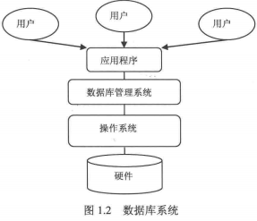

##### 数据库

###### 数据库注入

SQL注入其实就是恶意用户通过在表单中填写包含SQL关键字的数据来使数据库执行非常规代码的过程。简单来说，就是数据「越俎代庖」做了代码才能干的事情。这个问题的来源是，SQL数据库的操作是通过SQL语句来执行的，而无论是执行代码还是数据项都必须写在SQL语句之中，这就导致如果我们在数据项中加入了某些SQL语句关键字（比如说SELECT、DROP等等），这些关键字就很可能在数据库写入或读取数据时得到执行。

##### 数据库优化

 MySQL的逻辑架构图。 


MySQL逻辑架构整体分为三层，最上层为客户端层，并非MySQL所独有，诸如：连接处理、授权认证、安全等功能均在这一层处理。MySQL大多数核心服务均在中间这一层，包括查询解析、分析、优化、缓存、内置函数(比如：时间、数学、加密等函数)。所有的跨存储引擎的功能也在这一层实现：存储过程、触发器、视图等。最下层为存储引擎，其负责MySQL中的数据存储和提取。和Linux下的文件系统类似，每种存储引擎都有其优势和劣势。中间的服务层通过API与存储引擎通信，这些API接口屏蔽了不同存储引擎间的差异。
当向MySQL发送一个请求的时候，MySQL到底做了些什么呢？


客户端/服务端通信协议：MySQL客户端/服务端通信协议是“半双工”的：在任一时刻，要么是服务器向客户端发送数据，要么是客户端向服务器发送数据，这两个动作不能同时发生。一旦一端开始发送消息，另一端要接收完整个消息才能响应它，所以我们无法也无须将一个消息切成小块独立发送，也没有办法进行流量控制。客户端用一个单独的数据包将查询请求发送给服务器，所以当查询语句很长的时候，需要设置max_allowed_packet参数。但是需要注意的是，如果查询实在是太大，服务端会拒绝接收更多数据并抛出异常。与之相反的是，服务器响应给用户的数据通常会很多，由多个数据包组成。但是当服务器响应客户端请求时，客户端必须完整的接收整个返回结果，而不能简单的只取前面几条结果，然后让服务器停止发送。因而在实际开发中，尽量保持查询简单且只返回必需的数据，减小通信间数据包的大小和数量是一个非常好的习惯，这也是查询中尽量避免使用SELECT *以及加上LIMIT限制的原因之一。

查询缓存：在解析一个查询语句前，如果查询缓存是打开的，那么MySQL会检查这个查询语句是否命中查询缓存中的数据。如果当前查询恰好命中查询缓存，在检查一次用户权限后直接返回缓存中的结果。这种情况下，查询不会被解析，也不会生成执行计划，更不会执行。MySQL将缓存存放在一个引用表，通过一个哈希值索引，这个哈希值通过查询本身、当前要查询的数据库、客户端协议版本号等一些可能影响结果的信息计算得来。所以两个查询在任何字符上的不同，都会导致缓存不会命中。如果查询中包含任何用户自定义函数、存储函数、用户变量、临时表、mysql库中的系统表，其查询结果都不会被缓存。比如函数NOW()或者CURRENT_DATE()会因为不同的查询时间，返回不同的查询结果，再比如包含CURRENT_USER或者CONNECION_ID()的查询语句会因为不同的用户而返回不同的结果，将这样的查询结果缓存起来没有任何的意义。既然是缓存，就会失效，那查询缓存何时失效呢？MySQL的查询缓存系统会跟踪查询中涉及的每个表，如果这些表发生变化，那么和这张表相关的所有缓存数据都将失效。正因为如此，在任何的写操作时，MySQL必须将对应表的所有缓存都设置为失效。如果查询缓存非常大或者碎片很多，这个操作就可能带来很大的系统消耗，甚至导致系统僵死一会儿。而且查询缓存对系统的额外消耗也不仅仅在写操作，读操作也不例外：任何的查询语句在开始之前都必须经过检查，即使这条SQL语句永远不会命中缓存；如果查询结果可以被缓存，那么执行完成后，会将结果存入缓存，也会带来额外的系统消耗

语法解析和预处理：MySQL通过关键字将SQL语句进行解析，并生成一颗对应的解析树。这个过程解析器主要通过语法规则来验证和解析。比如SQL中是否使用了错误的关键字或者关键字的顺序是否正确等等。预处理则会根据MySQL规则进一步检查解析树是否合法。比如检查要查询的数据表和数据列是否存在等等。

查询优化：经过前面的步骤生成的语法树被认为是合法的了，并且由优化器将其转化成查询计划。多数情况下，一条查询可以有很多种执行方式，最后都返回相应的结果。优化器的作用就是找到这其中最好的执行计划。MySQL使用基于成本的优化器，它尝试预测一个查询使用某种执行计划时的成本，并选择其中成本最小的一个。在MySQL可以通过查询当前会话的last_query_cost的值来得到其计算当前查询的成本。有非常多的原因会导致MySQL选择错误的执行计划，比如统计信息不准确、不会考虑不受其控制的操作成本、MySQL认为的最优跟我们想的不一样等等。MySQL的查询优化器是一个非常复杂的部件，它使用了非常多的优化策略来生成一个最优的执行计划：重新定义表的关联顺序：多张表关联查询时，并不一定按照SQL中指定的顺序进行，但有一些技巧可以指定关联顺序；优化MIN()和MAX()函数；提前终止查询；优化排序。

查询执行引擎：在完成解析和优化阶段以后，MySQL会生成对应的执行计划，查询执行引擎根据执行计划给出的指令逐步执行得出结果。整个执行过程的大部分操作均是通过调用存储引擎实现的接口来完成，这些接口被称为handler API。查询过程中的每一张表由一个handler实例表示。实际上，MySQL在查询优化阶段就为每一张表创建了一个handler实例，优化器可以根据这些实例的接口来获取表的相关信息，包括表的所有列名、索引统计信息等。存储引擎接口提供了非常丰富的功能，但其底层仅有几十个接口，这些接口像搭积木一样完成了一次查询的大部分操作。

返回结果给客户端：查询执行的最后一个阶段就是将结果返回给客户端。即使查询不到数据，MySQL仍然会返回这个查询的相关信息，比如该查询影响到的行数以及执行时间等等。如果查询缓存被打开且这个查询可以被缓存，MySQL也会将结果存放到缓存中。结果集返回客户端是一个增量且逐步返回的过程。有可能MySQL在生成第一条结果时，就开始向客户端逐步返回结果集了。这样服务端就无须存储太多结果而消耗过多内存，也可以让客户端第一时间获得返回结果。需要注意的是，结果集中的每一行都会以一个满足①中所描述的通信协议的数据包发送，再通过TCP协议进行传输，在传输过程中，可能对MySQL的数据包进行缓存然后批量发送。

###### Scheme设计与数据类型优化

选择数据类型只要遵循小而简单的原则就好，越小的数据类型通常会更快，占用更少的磁盘、内存，处理时需要的CPU周期也更少。越简单的数据类型在计算时需要更少的CPU周期，比如，整型就比字符操作代价低，因而会使用整型来存储ip地址，使用DATETIME来存储时间，而不是使用字符串。

这里总结几个可能容易理解错误的技巧：

通常来说把可为NULL的列改为NOT NULL不会对性能提升有多少帮助，只是如果计划在列上创建索引，就应该将该列设置为NOT NULL。
对整数类型指定宽度，比如INT(11)，没有任何卵用。INT使用32位（4个字节）存储空间，那么它的表示范围已经确定，所以INT(1)和INT(20)对于存储和计算是相同的。
UNSIGNED表示不允许负值，大致可以使正数的上限提高一倍。比如TINYINT存储范围是-128 ~ 127，而UNSIGNED TINYINT存储的范围却是0 - 255。
通常来讲，没有太大的必要使用DECIMAL数据类型。即使是在需要存储财务数据时，仍然可以使用BIGINT。比如需要精确到万分之一，那么可以将数据乘以一百万然后使用BIGINT存储。这样可以避免浮点数计算不准确和DECIMAL精确计算代价高的问题。
TIMESTAMP使用4个字节存储空间，DATETIME使用8个字节存储空间。因而，TIMESTAMP只能表示1970 - 2038年，比DATETIME表示的范围小得多，而且TIMESTAMP的值因时区不同而不同。
大多数情况下没有使用枚举类型的必要，其中一个缺点是枚举的字符串列表是固定的，添加和删除字符串（枚举选项）必须使用ALTER TABLE（如果只只是在列表末尾追加元素，不需要重建表）。
schema的列不要太多。原因是存储引擎的API工作时需要在服务器层和存储引擎层之间通过行缓冲格式拷贝数据，然后在服务器层将缓冲内容解码成各个列，这个转换过程的代价是非常高的。如果列太多而实际使用的列又很少的话，有可能会导致CPU占用过高。
大表ALTER TABLE非常耗时，MySQL执行大部分修改表结果操作的方法是用新的结构创建一个张空表，从旧表中查出所有的数据插入新表，然后再删除旧表。尤其当内存不足而表又很大，而且还有很大索引的情况下，耗时更久。

###### 创建高性能索引

索引是提高MySQL查询性能的一个重要途径，但过多的索引可能会导致过高的磁盘使用率以及过高的内存占用，从而影响应用程序的整体性能。应当尽量避免事后才想起添加索引，因为事后可能需要监控大量的SQL才能定位到问题所在，而且添加索引的时间肯定是远大于初始添加索引所需要的时间，可见索引的添加也是非常有技术含量的。
而B+Tree就是一种多路搜索树。理解B+Tree时，只需要理解其最重要的两个特征即可：第一，所有的关键字（可以理解为数据）都存储在叶子节点，非叶子节点并不存储真正的数据，所有记录节点都是按键值大小顺序存放在同一层叶子节点上。其次，所有的叶子节点由指针连接。MySQL将每个节点的大小设置为一个页的整数倍，也就是在节点空间大小一定的情况下，每个节点可以存储更多的内结点，这样每个结点能索引的范围更大更精确。所有的叶子节点使用指针链接的好处是可以进行区间访问，比如上图中，如果查找大于20而小于30的记录，只需要找到节点20，就可以遍历指针依次找到25、30。如果没有链接指针的话，就无法进行区间查找。这也是MySQL使用B+Tree作为索引存储结构的重要原因。MySQL为何将节点大小设置为页的整数倍，这就需要理解磁盘的存储原理。磁盘本身存取就比主存慢很多，在加上机械运动损耗，磁盘的存取速度往往是主存的几百万分之一，为了尽量减少磁盘I/O，磁盘往往不是严格按需读取，而是每次都会预读，即使只需要一个字节，磁盘也会从这个位置开始，顺序向后读取一定长度的数据放入内存，预读的长度一般为页的整数倍。

页是计算机管理存储器的逻辑块，硬件及OS往往将主存和磁盘存储区分割为连续的大小相等的块，每个存储块称为一页（许多OS中，页的大小通常为4K）。主存和磁盘以页为单位交换数据。当程序要读取的数据不在主存中时，会触发一个缺页异常，此时系统会向磁盘发出读盘信号，磁盘会找到数据的起始位置并向后连续读取一页或几页载入内存中，然后一起返回，程序继续运行。

MySQL巧妙利用了磁盘预读原理，将一个节点的大小设为等于一个页，这样每个节点只需要一次I/O就可以完全载入。为了达到这个目的，每次新建节点时，直接申请一个页的空间，这样就保证一个节点物理上也存储在一个页里，加之计算机存储分配都是按页对齐的，就实现了读取一个节点只需一次I/O。
B+Tree为了保持平衡，对于新插入的值需要做大量的拆分页操作，而页的拆分需要I/O操作，为了尽可能的减少页的拆分操作，B+Tree也提供了类似于平衡二叉树的旋转功能。当Leaf Page已满但其左右兄弟节点没有满的情况下，B+Tree并不急于去做拆分操作，而是将记录移到当前所在页的兄弟节点上。通常情况下，左兄弟会被先检查用来做旋转操作。

“独立的列”是指索引列不能是表达式的一部分，也不能是函数的参数
索引的顺序对于查询是至关重要的，很明显应该把选择性更高的字段放到索引的前面，这样通过第一个字段就可以过滤掉大多数不符合条件的数据。

索引选择性是指不重复的索引值和数据表的总记录数的比值，选择性越高查询效率越高，因为选择性越高的索引可以让MySQL在查询时过滤掉更多的行。唯一索引的选择性是1，这是最好的索引选择性，性能也是最好的。
如果一个索引包含或者说覆盖所有需要查询的字段的值，那么就没有必要再回表查询，这就称为覆盖索引。覆盖索引是非常有用的工具，可以极大的提高性能，因为查询只需要扫描索引会带来许多好处：

索引条目远小于数据行大小，如果只读取索引，极大减少数据访问量

索引是有按照列值顺序存储的，对于I/O密集型的范围查询要比随机从磁盘读取每一行数据的IO要少的多

6、使用索引扫描来排序

MySQL有两种方式可以生产有序的结果集，其一是对结果集进行排序的操作，其二是按照索引顺序扫描得出的结果自然是有序的。如果explain的结果中type列的值为index表示使用了索引扫描来做排序。

扫描索引本身很快，因为只需要从一条索引记录移动到相邻的下一条记录。但如果索引本身不能覆盖所有需要查询的列，那么就不得不每扫描一条索引记录就回表查询一次对应的行。这个读取操作基本上是随机I/O，因此按照索引顺序读取数据的速度通常要比顺序地全表扫描要慢。

在设计索引时，如果一个索引既能够满足排序，又满足查询，是最好的。

###### 数据库基础

在关系数据库中，数据库表是一系列二维数组的结合，用来存储数据和操作数据的逻辑结构。它由纵向的列和横向的行组成，行被称为记录。时组织数据的单位；列被称为字段，每一列表示记录的有属性，都有相应的描述信息，如数据类型、数据宽度等。

数据类型决定了数据在计算机中的存储格式，代表不同的信息类型。常用的数据类型有：整数数据类型、浮点型数据类型、精确小鼠类型、二进制数据类型、日期或时间数据类型、字符串数据类型。

主键用于唯一地标识表中的每一条记录。可以定义表中的一列或多列为主键，主键列上不能有两列相同的值，也不能为空值。

数据库提供了一个存储空间以存储各种数据，可以将数据库视为一个存储数据的容器。一个数据库可能包含许多文件，一个数据库系统中通常包含许多数据库。数据库管理系统是用户创建、管理和维护数据库时所使用的软件，位于用户与操作系统之间，对数据库进行统一管理。数据库管理系统能定于数据存储结构，提供数据的操作机制，维护数据库的安全性、完整性和可靠性。



`SQL`包含以下四部分：数据定义语言`drop, create, alter`、数据操作语言`insert, update, delete`、数据查询语言`select`、数据控制语言`grant, revoke, commit, rollback`。

#### 数据库基本操作

`net start MySQL`启动`MySQL`服务。`net stop MySQL`停止服务。当`MySQL`服务启动完成后，便可以通过客户端登录`mySQL`数据库。`sql -h localhost -u root -p password`

创建数据库: `create database db_name`、删除数据库:`drop database db_name`

#### 数据表的基本操作

`show databases`查看当前所有存在的数据库；`create database database_name`创建数据库；`drop databae database_name`删除数据库；`use database_name`使用数据库；

##### 创建数据表

```mysql
create table tb_name(
字段1， 数据类型[列级别约束条件][默认值],
字段2， 数据类型[列级别约束条件][默认值],
字段3， 数据类型[列级别约束条件][默认值],
[表级别约束条件])
```

查看数据表: `desc tb_name`. 查看表详细结构: `show create table tb_name`

###### 使用主键约束

单字段主键：`字段名 数据类型 primary key [默认值]`，在定义列的同时指定主键；在定义完所有列之后指定主键`[constraint <约束名>] primary key [字段名]`

多字段联合主键`primary key[字段1，字段2，···，字段n]`

###### 使用外键约束

外键用来在两个表的数据之间建立连接，它可以是一列或多列。一个表可以有一个或多个主键。外键对应的是参照完整性，一个表的外键可以为空值，若不为空值，则每一个外键值必须等于另一个表中主键的某个值。外键首先它是表中的一个字段，它可以不是本表的主键，但对应另一个表的主键。外键主要作用是保证数据引用的完整性，定义外键后，不允许删除另一个表中具有关联关系的行。外键的作用是保证数据的一致性、完整性。

`[constraint<外键名>] foreign key 字段名1 [，字段名2，···] references<主键名> 主键列1[，主键列2，···]`

###### 使用非空约束

`字段名 数据类型 not null`

###### 使用唯一性约束

`字段名 数据类型 unique`, `[constraint<约束名>] unique(<字段名>)`

###### 使用默认约束

`字段名 数据类型 default 默认值`

###### 设置表的属性值自动增加

`字段名 数据类型 auto_increment`

##### 查看数据表结构

`describe 表名`

`show create table tb_name`

##### 修改数据表

###### 修改表名

`alter table old_name rename [to] new_name`；

`alter table tb_dept3 rename tb_deptment3`

###### 修改字段的数据类型

`alter table tb_name modify 字段名  数据类型`；

`alter table tb_dept1 modify name varchar(30)`

###### 修改字段名

`alter table tb_name change old_name new_name new_data_type`

`alter table tb_dept1 change location loc varchar(50)`

######  添加字段

 ` alter table tb_name add name data_type [constraint] [first|after 已存在字段名]`

`alter table tb_dept1 add manageId int(10)`

`alter table tp_dept1 add column1 varchar(12) not null`

`alter table tb_dept1 add column2 int(11) first`

`alter table tb_dept1 add column3 int(11) after name`

###### 删除字段

 `alter table tb_name drop name`

`alter table tb_dept1 drop column2`

###### 修改字段的排列位置

` alter table tb_name modify name data_type first|after name2`

`alter table tb_dept1 modify column1 varchar(12) first`

###### 更改表的存储引擎

`alter table tb_name engine=new_engine`

`alter table tb_deptment3 engine=MyISAM`

###### 删除表的外键约束

`alter table tb_name drop foreign key key_name`

##### 删除数据表

###### 删除没有关联的表

`drop table [if exists] tb1, tb2, ..., tbn`

`drop table if exists tb_dept2`

###### 删除被其他表关联的主表

先解除关联子表的外键约束，然后执行删除没有关联的表的操作。

#### 数据类型和运算符

##### 数据类型介绍

`mysql`支持多种数据类型，主要有数值类型、日期/时间类型和字符串类型。数值类型：包括整数类型`tinyint, smallint, mediumint, int, bigint`浮点小数数据类型`float, double`，定点小数类型`decimal`。时间/日期类型：包括`year, time, date, datetime, timestamp`。字符串类型：包括`char, varchar, binary, varbinary, blob, text, enum, set`

`ENUM`是一个字符串对象，其值为表创建时在列规定内阁中枚举的一列值。

`字段名 ENUM('值1'，'值2'，···，'值n')`

`SET`是一个字符串对象，可以有零或多个值，set列最多可以有64个成员，其值为表创建时规定的一列值。指定包括多个set成员的set列值时，各成员之间用逗号(,)间隔开。语法格式如下：`SET('值1'，'值2'，···，'值n')`

```mysql
create table tmp1(s set('a', 'b', 'c', 
                       'd'));
insert into tmp1 values('a'), ('a,b,a'), ('c,a,d')
```

##### 常见运算符介绍

算术运算符：`+, -, *, /, %求余`

比较运算符：`>, <, =, >=, <=, !=, in：判断一个值是列表中的任意一个值, between and：判断一个值是否落在两个值之间, is null, greatest:当有两或多个参数时，返回最大值, least：当有两或多个参数时，返回最小值, like：通配符匹配, regexp：正则表达式匹配expr REGEXP 匹配条件`

逻辑运算符：`not, and, or, xor`

`%`：匹配任何数目的字符，甚至包括零字符。`_`：只能匹配一个字符。

#### `MySQL`函数

##### 数学函数

| 函数名             | 表达式                                  |
| ------------------ | --------------------------------------- |
| 绝对值\平方根\求余 | `abs(x)\sqrt(x)\mod(x,y)`               |
| 获取整数的函数     | `ceil(x), ceiling(x), floor(x)`         |
| 获取随机数的函数   | `rand(), rand(x)`                       |
| 近似函数           | `round(x), round(x, y), truncate(x, y)` |
| 三角函数           | `sin\cos\asin`                          |

##### 字符串函数

| 函数名                   | 表达式                                                       |
| ------------------------ | ------------------------------------------------------------ |
| 合并字符串函数           | `concat(s1, s2, ...), concat_ws(x, s1, s2, ...)`             |
| 计算长度函数             | `char_length\length`                                         |
| 替换字符串               | `insert(s1,x, len, s2)`                                      |
| 获取指定长度字符串函数   | `left(s, n), right(s, n)`                                    |
| 填充字符串函数           | `lpad(s1, len, s2), rpad(s1, len, s2)`                       |
| 删除空格的函数           | `ltrim(s), rtrim(s), trim(s)`                                |
| 删除指定字符串的函数     | `trim(s1 from s)`                                            |
| 重复\逆序                | `repeat(s,n)\reverse(s)`                                     |
| 替换                     | `replace(s, s1, s2)`                                         |
| 获取子串的函数           | `substring(s, n, len), mid(s, n, len)`                       |
| 匹配子串开始位置         | `locate(str1, str), position(str1 in str), instr(str, str1)` |
| 返回指定位置的字符串函数 | `elt(N, str1, str2, ..., strn)`                              |
| 返回指定字符串位置的函数 | `field(s, s1, s2,...)`                                       |

##### 日期函数

| 函数名                   | 表达式                                     |
| ------------------------ | ------------------------------------------ |
| 获取当前日期或时间的函数 | `curdate/current_date/curtime/`            |
| 获取当前时间和时期的函数 | `current_timestamp/localtime/now/sysdate`  |
| `UNIX`时间戳函数         | `unix_timestamp/from_unixtime`             |
| 获取月份                 | `month(date)/monthname(date)`              |
| 获取星期                 | `dayname(d)\dayofweek(d)\weekday(d)`       |
| 获取星期数               | `week(d)/weekofyear(d)`                    |
| 获取其他信息             | `year/dayofyear/dayofmonth/quarter/minute` |
| 获取日期的指定值         | `extract(type from date)`                  |
| 计算日期和时间的函数     | `adddate/subdate/addtime/subtime`          |
| 日期和时间格式化         | `date_format(date, format)`                |

##### 条件判断函数

###### `if(expr, v1, v2)`函数

###### `ifnull(v1, v2)`

`ifnull(v1,v2)`加入`v1`不为`NULL`，则返回`v1`，否则返回`v2`

###### `case`

`case expr when v1 then r1 [when v2 then r2] [else m] end`

##### 系统信息函数

| 函数名                     | 表达式                                                   |
| -------------------------- | -------------------------------------------------------- |
| 获取版本、连接数和数据库名 | `version/connection_id\show processlist\database\schema` |
| 获取字符串的字符集         | `charset(str)`                                           |
| 获取最后一个自动生成的id值 | `last_insert_id()`                                       |

##### 加/解密函数

| 函数名   | 表达式                                         |
| -------- | ---------------------------------------------- |
| 加密函数 | `password(str)/md5(str)/encode(str, pswd_str)` |
| 揭秘函数 | `decode(crypt_str, pswd_str)`                  |

#### 查询数据

##### 基本查询语句

```mysql
select {*|<字段列表>} [
    from <表1>, <表2>, ...
    [where <表达式>]
    [group by <group by definition>]
    [having <expression> [{<operation> <expression}...]]
    [order by <order by definition>]
    [limit[<offset>,] <row count>]
]
```

##### 单表查询

###### 查询所有字段

 `select * from tb`.

###### 查询指定字段

 `select 列名 from tb`. 

###### 查询指定记录

 ` select name1, name2,..., namen from tb where condition`. 

###### 带in关键字的查询

```mysql
select id, name, price from fruits
where id [not] in (101, 102) order by name;
```

###### 带`between and`的范围查询

`select name, price from fruits where price [not] between 2.00 and 10.20`

###### 带`like`的字符串匹配查询

```mysql
select id, name from fruits where name like 'b%';
select id, name from fruits where name like '____y';
```

###### 查询空值

`select id, name, email from customers where email is null`

###### 带`and`的多条件查询

`select id, price, name from fruits where id ='101' and price >=5;`

`select id, name, price from fruits where id = '101' or id='102'`

###### 查询结果不重复

`select distinct name1 from tb`

###### 对结果进行排序

`select name from fruits order by name;`

`select name, price from fruits order by name , price;`

`select name, price from fruits order by name desc`

###### 分组查询

`[groupby by name1] [having <condition>]`

```mysql
/* 创建分组*/
select id count(*) as total from fruits groupby id;
select id, group_concat(name) as names from fruits
group by id having count(name) > 1;
select * from fruits group by id, name;
```

###### 使用`limit`限制查询结果的数量

`limit[位置偏移量offset,] rows`

##### 使用聚合函数查询

| 函数      | 作用             |
| --------- | ---------------- |
| `AVG()`   | 返回某列的平均值 |
| `count()` | 返回某列的函数   |
| `max()`   | 返回某列的最大值 |
| `min()`   | 返回某列的最小值 |
| `sum()`   | 返回某列值的和   |

##### 连接查询

###### 内连接查询

内连接使用比较运算符进行表间某列数据的比较操作，并列出这些表中与连接条件相匹配的数据行，组合成新纪录，也就是说，在内连接查询中，只有满足条件的记录才能出现在结果关系中。

###### 外连接查询

左连接：返回包括左表中的所有记录和右表中连接字段相等的记录；右连接：返回包括右表中的所有记录和坐标中连接字段相等的记录。

###### 符合条件连接查询

```mysql
select c.id, o.num from customers c inner join orders o
on c.id = o.id and c.id = 10001;
```

###### 子查询

```mysql
/*带any，some关键字的子查询*/
select num1 from tb1 where num1 > any(select num2 from tb2);
/*带all关键字的子查询*/
select num1 from tb1 where num1 > all(select num2 from tb2);
/*带exists关键字的子查询*/
select * from fruits where price> 10.20 and exists (select name from suppliers where id =107);
/*带in关键字的子查询*/
select id from order where num in (select num from orderitems where id='c0');
/*带比较运算符的子查询*/
select id, name from fruits where id = 
(select s.id from suppliers as s where s.city = 'Tianjin');

```

##### 合并查询结果

```mysql
/*利用union关键字，可以给出多条select语句，并将它们的结果组合成单个结果集。合并时，两个表对应的列数和数据类型必须相同各个select语句之间使用union 或union all关键字分割。不使用all，执行的时候删除重复记录，所有返回的行都是唯一的；使用则不删除重复行也不对结果进行自动排序。*/
select column, ... from table1
union [all]
select column, ... from table2
/*为表和字段取别名*/
tb as alias
```

###### 使用正则表达式查询

```mysql
/*查询以特定字符或字符串开头的记录*/
select * from fruits where name regexp '^b';
/*查询以特定字符或字符串结尾的记录*/
select * fro fruits where name regexp 'y$';
/*使用符号“.”来代替字符串中的任意一个字符*/
select * from fruits where name regexp 'a.g'
/*使用“*”和“+”来匹配多个字符*/
select * from fruits where name regexp '^ba*'
select * from fruits where name regexp '^ba+'
/*匹配指定字符串*/
select * from fruits where name regexp 'on';
/*匹配指定字符串中的任意一个*/
select * from fruits where name regexp '[ot]'
/*匹配指定字符以外的字符*/
select * from fruits where id regexp '[^a-e1-2]';
/*使用{n,}或者{n, m}来指定字符串连续出现的次数*/
select * from fruits where name regexp 'x{2,}'
```

#### 插入、更新与删除数据

##### 插入数据

`insert into tb_name (column_list) values (value_list1), (value_list2),..., (value_listn)`

将查询结果插入到表中

`insert into tb (column_list) select (column_list2) from tb2 where condition;`

##### 更新数据

```mysql
update tb set column_name1=value, column_name2=value2,...,
column_namen = valuen where (condition);
```

##### 删除数据

`delete from table (where <condition>)`

#### 索引

索引是对数据库表中一列或多列的值进行排序的一种结构，使用索引可提高数据库中特定数据的查询速度。索引是一个单独的、存储在磁盘上的数据库结构，它包含着对数据表里所有记录的引用指针。使用索引用于快速找出在某个或多个列中有一特定值的行。

好处：通过创建唯一索引，可以保证数据库表中每一行数据的唯一性；可以大大加快数据的查询速度，可以加速表和表之间的连接。

坏处：创建和维护索引要消耗时间，索引需要占磁盘空间。

##### 索引简介

普通索引：基本索引类型，允许在定义索引的列中插入重复值和空值。

唯一索引：索引列的值必须唯一，但允许有空值。如果是组合索引，则列值的组合必须唯一。主键索引是一种特殊的唯一索引，不允许有空值。

###### 索引的设计原则

索引并非越多越好；避免对经常更新的表进行过多的索引，并且索引中的列尽可能少；数据量小的表最好不要使用索引；在条件表达式中经常用到的不同值较多的列上建立索引，在不同值很少的裂伤不要建立索引；当唯一性是某种数据本身的特征时，指定唯一索引；在频繁进行排序或分组的列上建立索引，如果待排序的列有多个，可以在这些列上建立组合索引。

##### 创建索引

###### 创建表的时候创建索引

```mysql
create table table_name (col_name, dtype) [unique|fulltext|spatial]
[index|key] [index_name] (col_name[length]) [asc|desc]
/*创建唯一索引*/
create table t1 ( id int not null, name char(10) not null,
                unique index uniqIdx(id));
/*创建单列索引*/
create table t1 ( id int not null, name char(10) not null,
                index SingleIdx(id));
/*创建组合索引*/
create table t1 ( id int not null, name char(10) not null, age int,
                index MultiIdx(id, name));
```

##### 在已经存在的表上创建索引

```mysql
alter table tb add [unique|fulltext|spatial] [index|key] [index_name] (col_name[length],_)[asc|desc]

create [unique|fulltext|spatial] index index_name on table_name (col_name[length],_)[asc|desc]
```

##### 删除索引

`alter table tb drop index index_name;`

`drop index index_name on table_name`

#### 存储过程和函数

##### 创建存储过程和函数

#### 视图

#### 触发器

