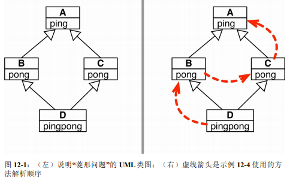
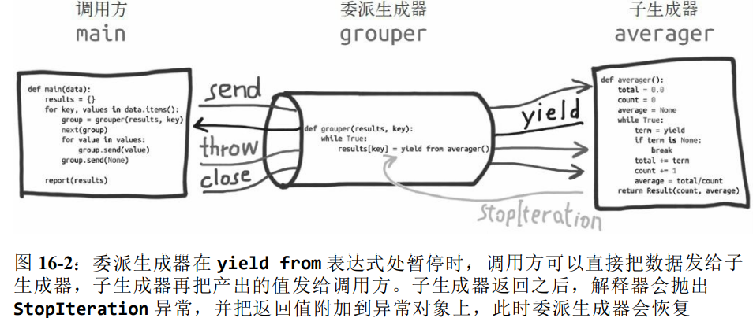

### 数据结构

#### 序列构成的数组

容器序列: `list、tuple`和 `collections.deque `这些序列能存放不同类型的数据。扁平序列: `str、bytes、bytearray、memoryview` 和` array.array`，这类序列只能容纳一种类型。容器序列存放的是它们所包含的任意类型的对象的引用，而扁平序列里存放的是值而不是引用。换句话说，扁平序列其实是一段连续的内存空间。由此可见扁平序列其实更加紧凑，但是它里面只能存放诸如字符、字节和数值这种基础类型。序列类型还能按照能否被修改来分类。可变序列: `list、bytearray、array.array、collections.deque` 和 `memoryview`。不可变序列: `tuple、str `和 `bytes`。


列表推导是构建列表的快捷方式，而生成器表达式则可以用来创建其他任何类型的序列。列表推导、生成器表达式，以及同它们很相似的集合推导和字典推导，在 `Python3`中都有了自己的局部作用域，就像函数似的。表达式内部的变量和赋值只在局部起作用，表达式的上下文里的同名变量还可以被正常引用，局部变量并不会影响到它们。因为生成器表达式背后遵守了迭代器协议，可以逐个地产出元素，而不是先建立一个完整的列表，然后再把这个列表传递到某个构造函数里。

`+=`背后的特殊方法是 `__iadd__`。但是如果一个类没有实现这个方法的话，Python 会退一步调用 `__add__`。` a += b`如果`a`实现了 `__iadd__`方法，就会调用这个方法。同时对可变序列来说，a 会就地改动，就像调用了`a.extend(b)`一样。但是如果`a`没有实现 `__iadd__ `的话，`a += b`这个表达式的效果就变得跟`a = a+b`一样了：首先计算`a + b`，得到一个新的对象，然后赋值给`a`。也就是说，在这个表达式中，变量名会不会被关联到新的对象，完全取决于这个类型有没有实现`__iadd__ `这个方法。

###### 用bisect管理已排序的序列

`bisect(haystack, needle)`在 haystack里搜索`needle`的位置，该位置满足的条件是，把`needle`插入这个位置之后，`haystack`还能保持升序。也就是在说这个函数返回的位置前面的值，都小于或等于`needle`的值。其中`haystack`必须是一个有序的序列。你可以先用`bisect(haystack, needle)`查找位置`index`，再用
`haystack.insert(index, needle)`来插入新值。但你也可用`insort`来一步到位，并且后者的速度更快一些。

###### 数组

如果我们需要一个只包含数字的列表，那么`array.array`比 `list`更高效。数组支持所有跟可变序列有关的操作，包括`.pop、.insert`和`.extend`。另外，数组还提供从文件读取和存入文件的更快的方法，如`.frombytes`和`.tofile`。Python数组跟C语言数组一样精简。创建数组需要一个类型码，这个类型码用来表示在底层的C语言应该存放怎样的数据类型。而且Python不会允许你在数组里存放除指定类型之外的数据。

| 函数               | 描述                                                         |
| ------------------ | ------------------------------------------------------------ |
| `s.fromfile(f, n)` | 将二进制文件 f 内含有机器值读出来添加到尾部，最多添加 n 项   |
| `s.fromlist(l)`    | 将列表里的元素添加到尾部，如果其中任何一个元素导致了 `TypeError`异常，那么所有的添加都会取消 |
| `s.tobytes()`      | 把所有元素的机器值用 bytes 对象的形式返回                    |
| `s.tofile(f)`      | 把所有元素以机器值的形式写入一个文件                         |
| `s.tolist()`       | 把数组转换成列表，列表里的元素类型是数字对象                 |
| `s.typecode`       | 返回只有一个字符的字符串，代表数组元素在 C 语言中的类型      |

###### 双向队列和其他形式的队列

`collections.deque`类双向队列是一个线程安全、可以快速从两端添加或者删除元
素的数据类型。而且如果想要有一种数据类型来存放最近用到的几个元素，`deque`也是
一个很好的选择。这是因为在新建一个双向队列的时候，你可以指定这个队列的大小，如果这个队列满员了，还可以从反向端删除过期的元素，然后在尾端添加新的元素。双向队列实现了大部分列表所拥有的方法，也有一些额外的符合自身设计的方法。但是为了实现这些方法，双向队列也付出了一些代价，从队列中间删除元素的操作会慢一些，因为它只对在头尾的操作进行了优化。`append`和`popleft`都是原子操作，也就说是`deque`可以在多线程程序中安全地当作先进先出的栈使用，而使用者不需要担心资源锁的问题。

| 方法              | 描述                                 |
| ----------------- | ------------------------------------ |
| `s.appendleft(a)` | 添加一个元素到最左侧到第一个元素之前 |
| `s.extendleft(i)` | 将可迭代对象 i 中的元素添加到头部    |
| `s.popleft()`     | 移除第一个元素并返回它的值           |
| `s.rotate(n)`     | 把 n 个元素从队列的一端移到另一端    |

`heapq`没有队列类，而是提供了`heappush`和`heappop`方法，让用户可以把可变序列当作堆队列或者优先队列来使用。

#### 字典和集合


标准库里的所有映射类型都是利用` dict `来实现的，因此它们有个共同的限制，即只有可散列的数据类型才能用作这些映射里的键。如果一个对象是可散列的，那么在这个对象的生命周期中，它的散列值是不变的，而且这个对象需要实现` __hash__() `方法。另外可散列对象还要有`__qe__() `方法，这样才能跟其他键做比较。**如果两个可散列对象是相等的，那么它们的散列值一定是一样的。**一般来讲用户自定义的类型的对象都是可散列的，散列值就是它们的` id() `函数的返回值，所以所有这些对象在比较的时候都是不相等的。如果一个对象实现了 `__eq__ `方法，并且在方法中用到了这个对象的内部状态的话，那么只有当所有这些内部状态都是不可变的情况下，这个对象才是可散列的。`setdefault`用来处理键值缺失情况。

##### 映射的弹性键查询

有时候为了方便起见，就算某个键在映射里不存在，我们也希望在通过这个键读取值的时候能得到一个默认值。有途径能帮我们达到这个目的，一个是通过` defaultdict `这个类型而不是普通的` dict`，另一个是给自己定义一个` dict `的子类，然后在子类中实现`__missing__ `方法。在实例化一个 `defaultdict `的时候，需要给构造方法提供一个可调用对象，这个可调用对象会在 `__getitem__ `碰到找不到的键的时候被调用，让 `__getitem__ `返回某种默认值。`defaultdict `里的` default_factory `只会在 `__getitem__ `里被调用，在其他的方法里完全不会发挥作用。比如，`dd `是个` defaultdict`，k 是个找不到的键， `dd[k]`这个表达式会调用` default_factory `创造某个默认值，而` dd.get(k)`则会返回` None`。

###### 特殊方法`__missing__`

所有的映射类型在处理找不到的键的时候，都会牵扯到` __missing__ `方法。虽然基类 `dict `并没有定义这个方法，但是 `dict `是知道有这么个东西存在的。也就是说，如果有一个类继承了` dict`，然后这个继承类提供了`__missing__ `方法，那么在 `__getitem__ `碰到找不到的键的时候，Python 就会自动调用它，而不是抛出一个 `KeyError `异常。`__missing__ `方法只会被 `__getitem__ `调用。提供 `__missing__ `方法对 `get `或者 `__contains__`这些方法的使用没有影响。

从`UserDict`而不是从`dict`继承的主要原因是，后者有时会在某些方法的实现上走一些捷径，导致我们不得不在它的子类中重写这些方法，但是`UserDict`就不会带来这些问题。`UserDict `并不是 `dict `的子类，但是 `UserDict `有一个叫作 data 的属性，是 `dict `的实例，这个属性实际上是 `UserDict `最终存储数据的地方。

##### 集合


散列表其实是一个稀疏数组：总是有空白元素的数组称为稀疏数组。在一般的数据结构教材中，散列表里的单元通常叫作表元。在` dict `的散列表当中，每个键值对都占用一个表元，每个表元都有两个部分，一个是对键的引用，另一个是对值的引用。因为所有表元的大小一致，所以可以通过偏移量来读取某个表元。因为 Python 会设法保证大概还有三分之一的表元是空的，所以在快要达到这个阈值的时候，原有的散列表会被复制到一个更大的空间里面。

为了获取` my_dict[search_key] `背后的值，Python 首先会调用` hash(search_key)`来计算` search_key `的散列值，把这个值最低的几位数字当作偏移量，在散列表里查找表元。若找到的表元是空的，则抛出`KeyError `异常。若不是空的，则表元里会有一对` found_key:found_value`。这时候 Python 会检验` search_key == found_key `是否为真，如果它们相等的话，就会返回` found_value`。如果 `search_key `和 `found_key `不匹配的话，这种情况称为散列冲突。发生这种情况是因为，散列表所做的其实是把随机的元素映射到只有几位的数字上，而散列表本身的索引又只依赖于这个数字的一部分。为了解决散列冲突，算法会在散列值中另外再取几位，然后用特殊的方法处理一下，把新得到的数字再当作索引来寻找表元。若这次找到的表元是空的，则同样抛出 `KeyError`；若非空，或者键匹配，则返回这个值；或者又发现了散列冲突，则重复以上的步骤。


#### 文本和字节序列

##### 字符问题

字符的最佳定义是Unicode字符。因此，从Python 3的` str `对象中获取的元素是Unicode字符。Unicode标准把字符的**标识和具体的字节**表述进行了如下的明确区分。**字符的标识**即码位，是`0~1114111`的数字，在 Unicode 标准中以` 4~6`个十六进制数字表示，而且加前缀“U+”。在 Unicode 6.3 中，约 10% 的有效码位有对应的字符。
**字符的具体表述取决于所用的编码**。编码是在**码位和字节序列之间转换时使用的算法**。在` UTF-8 `编码中，A的码位编码成单个字节` \x41`，而在` UTF-16LE`编码中编码成两个字节` \x41\x00`。把码位转换成字节序列的过程是编码；把字节序列转换成码位的过程是解码。多数非` UTF `编解码器只能处理 Unicode 字符的一小部分子集。把文本转换成字节序列时，如果目标编码中没有定义某个字符，那就会抛出` UnicodeEncodeError `异常，除非把` errors `参数传给编码方法或函数，对错误进行特殊处理。不是每一个字节都包含有效的ASCII字符，也不是每一个字符序列都是有效的` UTF-8 `或`UTF-16`。因此，把二进制序列转换成文本时，如果假设是这两个编码中的一个，遇到无法转换的字节序列时会抛出` UnicodeDecodeError`。另一方面，很多陈旧的 8 位编码如` 'cp1252'、'iso8859_1'` 能解码任何字节序列流而不抛出错误。因此，如果程序使用错误的8位编码，解码过程悄无声息，而得到的是无用输出。

###### 字节

`bytes`或`bytearray`对象的各个元素是介于 0~255之间的整数，然而，二进制序列的切片始终是同一类型的二进制序列，包括长度为1的切片。虽然二进制序列其实是整数序列，但是它们的字面量表示法表明其中有 ASCII 文本。因此，各个字节的值可能会使用下列三种不同的方式显示。可打印的 ASCII 范围内的字节，使用 ASCII 字符本身。制表符、换行符、回车符和`\`对应的字节，使用转义序列`\t、\n、\r `和`\\`其他字节的值，使用十六进制转义序列。

除了格式化方法format 和 和几个处理 Unicode 数据的方法包括`casefold、isdecimal、isidentifier、isnumeric、isprintable`和`encode`之
外，`str`类型的其他方法都支持`bytes`和`bytearray`类型。这意味着，我们可以使用熟悉的字符串方法处理二进制序列，如`endswith、replace、strip、translate、upper`等，只有少数几个其他方法的参数是`bytes`对象，而不是`str`对象。此外，如果正则表达式编译自二进制序列而不是字符串，re 模块中的正则表达式函数也能处理二进制序列。

##### 处理文本文件

处理文本的最佳实践是“Unicode 三明治”。 意思是，要尽早把输入的字节序列解码成字符串。这种三明治中的“肉片”是程序的业务逻辑，在这里只能处理字符串对象。在其他处理过程中，一定不能编码或解码。对输出来说，则要尽量晚地把字符串编码成字节序列。


如果打开文件时没有指定 encoding 参数，默认值由`locale.getpreferredencoding()` 提供。如果打开文件时没有指定` encoding `参数，默认值由`locale.getpreferredencoding() `提供。

因为 Unicode 有组合字符：变音符号和附加到前一个字符上的记号，打印时作为一个整体，所以字符串比较起来很复杂。解决方案是使用`unicodedata.normalize`函数提供Unicode规范化。这个函数的第一个参数是这4个字符串中的一个：`'NFC'、'NFD'、'NFKC'`和`'NFKD'`。`NFC`使用最少的码位构成等价的字符串，而 `NFD`把组合字符分解成基字符和单独的组合字符。Unicode 标准提供了一个完整的数据库，不仅包括码位与字符名称之间的映射，还有各个字符的元数据，以及字符之间的关系。如果使用字节序列构建正则表达式，`\d` 和 `\w` 等模式只能匹配 ASCII 字符；相比之下，如果是字符串模式，就能匹配`ASCII`之外的Unicode数字或字母。

### 把函数视作对象

以关键字`def`开始的第一行作为函数的签名。这个标志建立了一个新的标识符作为函数的名称，并且设立了期望的参数个数，以及标识这些参数的名称。每次调用函数时，python会创建一个专用的活动记录用来存储与当前调用相关的信息。这个活动记录包括了命名空间。命名空间用以管理当前调用中局部作用域内的所有标识符。命名空间包含该函数的参数以及在函数体内定义的其他本地标识符。函数调用者局部作用域内的标识符与调用者作用域内的其他相同名称的标识符没有关系。在函数签名的上下文中，用来描述预期参数的标识符被称为形式参数，调用者调用函数时发送的对象是实际参数。在python中，参数传递遵循标准赋值语句的语法。当调用一个函数是，在函数的局部范围内，每个标识符将作为一个形式参数**被赋值**给该函数的调用方提供的相应的实际参数。函数的执行会引入一个用于函数局部变量的新符号表。更确切地说，函数中的所有变量赋值都将值存储在本地符号表中；而变量引用首先在本地符号表中查找，然后在封闭函数的本地符号表中查找，然后在全局符号表中查找，最后在内置符号表中查找。所以全局变量不能直接在函数中赋值--除非使用 global 命名，尽管可以引用它们。在函数被调用时，实际参数会被引入被调用函数的本地符号表中；因此，实参是通过按值调用传递的--其中值始终是对象 **引用**而不是对象的值。当一个函数调用另外一个函数时，将会为该调用创建一个新的本地符号表。函数定义会把函数名引入当前的符号表中。函数名称的值具有解释器将其识别为用户定义函数的类型。这个值可以分配给另一个名称，该名称也可以作为一个函数使用。

函数装饰器在导入模块时立即执行，而被装饰的函数只在明确调用时执行。函数对象有一个`__name__`属性，可以拿到函数的名字。创建偏函数时，实际上可以接收函数对象、`*args`和`**kw`这$3$个参数

在Python中，函数是一等对象。编程语言理论家把**一等对象**定义为满足下述条件的程序实体：在运行时创建；能赋值给变量或数据结构中的元素；能作为参数传给函数；能作为函数的返回结果

#### 一等函数

除了用户定义的函数，调用运算符，即`()`，还可以应用到其他对象上。如果想判断对象能否调用，可以使用内置的 callable() 函数。**用户定义的函数**：使用 def 语句或 lambda 表达式创建；**内置函数**：使用 C 语言实现的函数，如` len `或 `time.strftime`；**内置方法**：使用 C 语言实现的方法，如`dict.get`；**方法**：在类的定义体中定义的函数；**类**：调用类时会运行类的` __new__ `方法创建一个实例，然后运行` __init__ `方法，初始化实例，最后把实例返回给调用方。因为 Python 没有`new`运算符，所以调用类相当于调用函数；**类的实例**：如果类定义了` __call__ `方法，那么它的实例可以作为函数调用；**生成器函数**：使用 yield 关键字的函数或方法。调用生成器函数返回的是生成器对象。

##### 函数内省

函数专有而用户定义的一般对象没有的属性。

| 名称             | 类型             | 说明                                 |
| ---------------- | ---------------- | ------------------------------------ |
| `__annotation__` | `dict`           | 参数和返回值的注解                   |
| `__call__`       | `method-wrapper` | 实现`()`运算符；即可调用对象协议     |
| `__closure__`    | `tuple`          | 函数闭包，即自由变量的绑定           |
| `__code__`       | `code`           | 编译成字节码的函数元数据和函数定义体 |
| `__defaults__`   | `tuple`          | 形式参数的默认值                     |
| `__get__`        | `method-wrapper` | 实现只读描述符协议                   |
| `__globals__`    | `dict`           | 函数所在模块中的全局变量             |
| `__kwdefaults__` | `dict`           | 仅限关键字形式参数的默认值           |
| `__name__`       | `str`            | 函数名称                             |
| `__qualname__`   | `str`            | 函数的限定名称                       |

定义函数时若想指定仅限关键字参数，要把它们放到前面有`*`的参数后面。如果不想支持数量不定的定位参数，但是想支持仅限关键字参数，在签名中放一个`*`，如`def f(a, *, b)`。函数对象有个`__defaults__ `属性，它的值是一个元组，里面保存着定位参数和关键字参数的默认值。仅限关键字参数的默认值在`__kwdefaults__`属性中。然而，参数的名称` __code__`属性中，它的值是一个`code`对象引用，自身也有很多属性。

`POSITIONAL_OR_KEYWORD`：可以通过定位参数和关键字参数传入的形参。`VAR_POSITIONAL`：定位参数元组。`VAR_KEYWORD`：关键字参数字典。`KEYWORD_ONLY`：仅限关键字参数。`POSITIONAL_ONLY`：仅限定位参数；

`operator `模块中还有一类函数，能替代从序列中取出元素或读取对象属性的 lambda 表达式：因此，`itemgetter` 和` attrgetter` 其实会自行构建函数。`itemgetter(1) `的作用与` lambda fields: fields[1] `一样：创建一个接受集合的函数，返回索引位 1 上的元素。`itemgetter `使用` [] `运算符，因此它不仅支持序列，还支持映射和任何实现`__getitem__ `方法的类。`attrgetter `与` itemgetter` 作用类似，它创建的函数根据名称提取对象的属性。如果把多个属性名传给` attrgetter`，它也会返回提取的值构成的元组。此外，如果参数名中包
含` .`，`attrgetter `会深入嵌套对象，获取指定的属性。在 operator 模块余下的函数中`methodcaller`。它的作用与`attrgetter `和 `itemgetter `类似，它会自行创建函数。`methodcaller `创建的函数会在对象上调用参数指定的方法，

#### 函数装饰器和闭包

装饰器是可调用的对象，其参数是另一个函数。 装饰器可能会处理被装饰的函数，然后把它返回，或者将其替换成另一个函数或可调用对象。装饰器的一大特性是，能把被装饰的函数替换成其他函数。第二个特性是，装饰器
在加载模块时立即执行：它们在被装饰的函数定义之后立即运行。这通常是在导入时，函数装饰器在导入模块时立即执行，而被装饰的函数只在明确调用时运行。闭包指延伸了作用域的函数，其中包含函数定义体中引用、但是不在定义体中定义的非全局变量。


闭包是一种函数，它会保留定义函数时存在的自由变量的绑定，这样调用函数时，虽然定义作用域不可用了，但是仍能使用那些绑定。注意，只有嵌套在其他函数中的函数才可能需要处理不在全局作用域中的外部变量。`nonlocal `声明。它的作用是把变量标记为自由变量，即使在函数中为变量赋予新值了，也会变成自由变量。如果为` nonlocal `声明的变量赋予新值，闭包中保存的绑定会更新。解析源码中的装饰器时，`Python`把被装饰的函数作为第一个参数传给装饰器函数。那怎么让装饰器接受其他参数呢？答案是：创建一个装饰器工厂函数，把参数传给它，返回一个装饰器，然后再把它应用到要装饰的函数上。

### 面向对象惯用法

##### 面向对象编程

在Python中，一切都是对象。类也是对象。所以一个类必须有一个类型--type。一般来说，任何新式类的类型都是`type`。可以传递三个参数`type(<name>, <bases>, <dct>)`调用`type()`：`<name>`指定类名称，将成为该类的`__name__`属性。`<bases>`指定继承类的基类元组，将成为该类的`__bases__`属性。`<dct>`指定包含类主体定义的名称空间字典，将成为该类的`__dict__`属性。以这种方式调用`type()`将创建一个type元类的新实例。换句话说，它动态地创建了一个新的类。

在面向对象的编程中，模块化和层次化组织的机制是一种称为继承的技术。这个技术允许基于一个现有的类作为起点定义新的类。在面向对象的术语中，通常描述现有的类为基类、父类或者超类，而称新定义的类为子类。有两种方式可以让子类有别于父类。子类可以通过提供一个新的覆盖现有方法的实现方法特化一个现有的行为。子类也可以通过提供一些权限的方法扩展其父类。如一个类的唯一目的是作为继承的基类，那么这个类就是一个抽象基类。更正式地说，一个抽象类不能直接实例化，而具体的类可以被实例化。

###### python对象

每个标识符与其所引用的对象的内存地址隐式相关联。python是一种动态语言类型，标识符的数据类型并不需要事先声明。标识符可以与任何类型的对象相关联，并且它可以在以后重新分配给相同或不同类型的另一个对象。虽然标识符没有被声明为确切的类型，但它所引用的对象有一个明确的类型。

一些方法返回一个对象的状态信息，但是并不改变改状态。这些方法被称为访问器。其他方法会改变一个对象的状态，这些方法被称为应用程序或更新方法。

每个已定义的类都有一个单独的类命名空间。这个命名空间用于管理一个类的所有实例所共享的成员或没有引用任何特定实例的成员。

当标识符a和b是同一个对象的别名时，表达式`a is b`的结果为真，表达式`a==b`是一个更一般的等价概念。如果标识符a和b指向同一个对象，那么表达式`a==b`为真。如果标识符指向不同的对象，但这些对象的值被认为是等价的，那么`a==b`的结果也为真。精确的等价概念取决于数据类型。

类中的赋值语句`self.balance=0`，其中`self`是新创实例中的标识符。在这种赋值中，`self.balance`中的`self`作为限定符使用，这使得`balance`标识符直接被添加到实例命名空间中。一个类命名空间包含所有直接在类定义体内的声明。默认情况下，python中的每个命名空间均代表内置`dict`类的一个实例，即将范围内识别的名称与相关联的对象映射起来。虽然字典结构支持相对有效的名称查找，但它需要的额外内存使用量超出了它存储原始数据的内存。python提供了一种更直接的机制来表示实例命名空间，以避免使用一个辅助字典。使用流表示一个类的所有实例，类定义必须提供一个名为`__slots__`的类级别的成员分配给一个固定的字符串序列以此服务于变量。如果使用继承时，基类声明了`__slots__`，那么为了避免字典实例的创建，子类必须声明`__slots__`。子类的声明只需包含新创建的步长方法的名称。

当用点运算符语法访问现有的成员时(`obj.foo`)，python解释器将开始一个名称解析的过程，描述如下：在实例命名空间中搜索，如果找到所需的名称，关联值就可以使用。否则在该实例所属的类的命名空间中搜索，如果找到名称，关联值可以使用。如果在直接的类的命名空间中没有，搜索仍在继续，通过继承层次结构向上，检查每一个父类的类名称空间。第一次找到这个名字，它的关联值可以使用。如果还没有找到该名称，就会引发一个`AttributeError`异常。

###### 作用域和命名空间

当在python中以`x+y`计算两个数的和时，x和y这两个名称一定要与先前作为值的对象相关联；如果没有找到相关定义，会抛出一个`NameError`异常。确定与标识符相关联的值的过程称为名称解析。每当标识符分配一个值，这个定义都有特定的范围。最高级赋值通常时全局范围，对于在函数体内的赋值，其范围通常时该函数调用的局部。python中每一个定义域使用了一个抽象名称，称为命名空间。命名空间管理当前在给定作用域内定义的所有标识符。python中实现命名空间使用自己的字典将每一个标识符字符串映射到其相关的值。python提供几种方法来检查一个给定的命名空间。函数`dir`报告给定命名空间中的标识符的名称，而函数`vars`返回完整的字典。默认情况下，调用`dir`和`vars`报告的是执行过程中本地封闭的命名空间。在命名中指示标识符时，python会在名称解析过程中搜索一系列的命名空间。首先，搜索的是所给名字的本地命名空间，若没有找到，则搜索外一层的命名空间，然后以此类推。

###### 概念

类：用来描述具有相同属性和方法的对象的集合。它定义了该集合中每个对象所共有的属性和方法。其中的对象被称为类的实例。
实例：通过类定义的初始化方法，赋予具体的值，称为一个实体。
实例化：创建类的实例的过程或操作。
实例变量：定义在实例中的变量，只作用于当前实例。
类变量：类变量是所有实例公有的变量。类变量定义在类中，但在方法体之外。
数据成员：类变量、实例变量、方法、类方法、静态方法和属性的统称。
方法：类中定义的函数。
静态方法：不需要实例化就可以由类执行的方法。静态方法由类调用，无默认参数。将实例方法参数中的self去掉，然后在方法定义上方加上`@staticmethod`，就成为静态方法。它属于类，和实例无关。
类方法：类方法是将类本身作为对象进行操作的方法。类方法由类调用，采用`@classmethod`装饰，至少传入一个`cls`参数。执行类方法时，自动将调用该方法的类赋值给`cls`。
方法重写：如果从父类继承的方法不能满足子类的需求，可以对父类方法进行改写，这个过程也称为override。
封装：将内部实现包裹起来，对外透明，提供api接口进行调用的机制。将数据与具体操作的实现代码放在某个对象内部，外部无法访问。必须要先调用类的方法才能启动。
继承：即一个派生类继承父类的变量和方法。
多态：根据对象类型的不同以不同的方式进行处理。

`super() -> same as super(__class__, <first argument>)
super(type) -> unbound super object
super(type, obj) -> bound super object; requires isinstance(obj, type)
super(type, type2) -> bound super object; requires issubclass(type2, type)
Typical use to call a cooperative superclass method:`

`super()`允许继承超类的子类访问该超类中的方法。`super()`单独返回超类的临时对象，然后允许您调用该超类的方法。`super()`也可以使用两个参数：第一个是子类，第二个参数是作为该子类实例的对象。通过包含实例化对象，`super()`返回一个绑定方法：绑定到对象的方法，用来为方法提供对象的上下文。如果未包含此参数，则返回的方法只是一个函数，与对象的上下文无关。方法解析顺序（或`MRO`）告诉Python如何搜索继承的方法。 当你使用`super()`时，这会派上用场，因为`MRO`会告诉你Python将使用`super()`以及以什么顺序调用的方法。每个类都有一个`.__ mro__`属性，允许我们检查顺序，所以让我们这样做：新式类开始实例化时，`__new__()`方法会返回`cls`的实例，然后该类的` __init__()`方法作为构造方法会接收这个实例（即self）作为自己的第一个参数，然后依次传入`__new__ ()`方法中接收的位置参数和命名参数。注意：如果`__new__()`没有返回`cls`（即当前类）的实例，那么当前类的`__init__()`方法是不会被调用 的。如果`__new__()`返回其他类的实例，那么只会调用被返回的那个类的构造方 法。

`__new__()`方法的特性： `  __new__()`方法是在类准备将自身实例化时调用。   `   __new__()`方法始终都是类的静态方法，即使没有被加上静态方法装饰器。第一个参数`cls`是当前正在实例化的类，如果要得到当前类的实例，应当在当前类中的`__new__()`方法语句中调用当前类的父类 的`__new__()`方法。事实上如果（新式）类中没有重写`__new__()`方法，即在定义新式类时没有重新定义`__new__()`时 ，Python默认是调用该类的直接父类的`__new__()`方法来构造该类的实例，如果该类的父类也没有重写 `__new__()`，那么将一直按此规矩追溯至object的`__new__()`方法，因为`object`是所有新式类的基类。

###### 魔法方法

| 魔法方法                         | 描述                                                         |
| -------------------------------- | ------------------------------------------------------------ |
| `__init()__`                     | 实例化方法，通过类创建实例时，自动触发执行。                 |
| `__module__`                     | 前者表示当前操作对象在属于那个模块；                         |
| `__slots__`                      | python作为一种动态语言，可以在类定义完成和实例化后给类或者对象继续添加随意个数或者任意类型的变量或方法，可以使用`slots`限制实例的变量。`slots`定义的属性仅对当前类的实例起作用，对继承它的子类是不起作用的。 |
| `__name__`                       | The name of the class, function, method, descriptor, or generator instance. |
| `__qualname__`                   | The qualified name of the class, function, method, descriptor, or generator instance. |
| `__dict__`                       | A dictionary or other mapping object used to store an object's attributes. |
| `__mro__`                        | 显示指定类的所有继承脉络和继承顺序，假如这个指定的类不具有某些方法和属性，但与其有血统关系的类中具有这些属性和方法，则在访问这个类本身不具有的这些方法和属性时，会按照`__mro__`显示出来的顺序一层一层向后查找，直到找到为止。 |
| `__getattribute__`               | 属性访问拦截器，在访问实例属性时自动调用。在python中，类的属性和方法都理解为属性，且均可以通过`__getattribute__`获取。当获取属性时，相当于对属性进行重写，直接`return object.__getattribute__(self, *args, **kwargs)`或者根据判断`return`所需要的重写值，如果需要获取某个方法的返回值时，则需要在函数后面加上一个()即可。如果不加的话，返回的是函数引用地址。 |
| `__class__`                      | 获得已知对象的类                                             |
| `__call__(self[, args...])`      | 允许一个类的实例像函数一样被调用：`x(a, b) `调用` x.__call__(a, b)` |
| `__getattr__(self, name)`        | 定义当用户试图获取一个不存在的属性时的行为                   |
| `__setattr__(self, name, value)` | 定义当一个属性被设置时的行为                                 |
| `__get__(self, instance, owner)` | 定义当描述符的值被取得时的行为                               |
| `__set__(self, instance, value)` | 定义当描述符的值被改变时的行为                               |
| `__delete__(self, instance)`     | 定义当描述符的值被删除时的行为                               |
| `__getitem__(self, key)`         | 定义获取容器中指定元素的行为，相当于` self[key]`             |
| `__setitem__(self, key, value)`  | 定义设置容器中指定元素的行为，相当于 `self[key] = value`     |
| `__delitem__(self, key)`         | 定义删除容器中指定元素的行为，相当于` del self[key]`         |
| `__contains__(self, item)`       | 定义当使用成员测试运算符`in` 或` not in`时的行为             |
| `__reversed__(self)`             | 定义当被 `reversed() `调用时的行为                           |
| `__bases__`                      | 获取指定类的所有父类构成元素，使用方法为类名`.__bases__`·    |
| `__hash__(self)`                 | 定义当被` hash() `调用时的行为                               |

##### 对象引用、可变性和垃圾回收

###### 拷贝

python中的赋值语句不会创建对象的副本，而只是给对象绑定了新的名称。浅拷贝会创建一个新的集合对象，然后用原对象的引用来填充它。实质上，浅拷贝只有一层。拷贝过程不会递归，因此不会创建子对象本身的副本。深拷贝会递归拷贝过程。这意味着会首先构造一个新的集合对象，然后递归地填充原始对象中的子对象的副本。以这种方式拷贝对象会遍历整个对象树，从而创建原始对象及其所有子对象的完全独立的副本。

所有python对象拥有三个属性：身份、类型、值。可变对象值值可变，身份不可变；不可变对象指身份和值都不可变。每个对象都会在内存中申请一块空间来保存该对象，该对象在内存中所在位置的地址被称为引用。在开发程序时，所定义的变量名实际就是对象的地址引用。赋值的本质就是让多个变量同时引用同一个对象的地址。引用实际就是内存中的一个数字地址编号，在使用对象时，只要知道这个对象的地址，就可以操作这个对象，但是因为这个数字地址不方便在开发时使用和记忆，所以使用变量名的形式来代替对象的数字地址。 在 Python 中，变量就是地址的一种表示形式，并不开辟开辟存储空间。

可变对象和不可变对象在拷贝时情况是不一样的：不可变对象的拷贝只在修改的时候才会在内存中开辟新的空间，而拷贝实际上是让多个对象同时指向同一个引用，和对象赋值没有区别。可变对象在浅拷贝时只拷贝第一层中的引用，深拷贝时，会逐层拷贝，直到所有的引用都是不可变对象位置。


理解 Python 中的赋值语句，应该始终先读右边。对象在右边创建或获取，在此之后左边的变量才会绑定到对象上，这就像为对象贴上标注。因为变量只不过是标注，所以无法阻止为对象贴上多个标注。贴的多个标注，就是别名。每个变量都有标识、类型和值。对象一旦创建，它的标识绝不会变；你可以把标识理解为对象在内存中的地址。is 运算符比较两个对象的标识；id() 函数返回对象标识的整数表示。Python 唯一支持的参数传递模式是共享传参。共享传参指函数的各个形式参数获得实参中各个引用的副本。也就是说，函数内部的形参是实参的别名。这种方案的结果是，函数可能会修改作为参数传入的可变对象，但是无法修改那些对象的标识

##### `del`和垃圾回收

`del `语句删除名称，而不是对象。`del `命令可能会导致对象被当作垃圾回收，但是仅当删除的变量保存的是对象的最后一个引用，或者无法得到对象时。 重新绑定也可能会导致对象的引用数量归零，导致对象被销毁。在 `CPython `中，垃圾回收使用的主要算法是引用计数。实际上，每个对象都会统计有多少引用指向自己。当引用计数归零时，对象立即就被销。`CPython 2.0 `增加了分代垃圾回收算法，用于检测引用循环中涉及的对象组——如果一组对象之间全是相互引用，即使再出色的引用方式也会导致组中的对象不可获取。正是因为有引用，对象才会在内存中存在。当对象的引用数量归零后，垃圾回收程序会把对象销毁。但是，有时需要引用对象，而不让对象存在的时间超过所需时间。这经常用在缓存中。弱引用不会增加对象的引用数量。引用的目标对象称为所指对象。因此我们说，弱引用不会妨碍所指对象被当作垃圾回收。弱引用在缓存应用中很有用，因为我们不想仅因为被缓存引用着而始终保存缓存对象。

简单的赋值不创建副本。对` += `或 `*= `所做的增量赋值来说，如果左边的变量绑定的是不可变对象，会创建新对象；如果是可变对象，会就地修改。为现有的变量赋予新值，不会修改之前绑定的变量。这叫重新绑定：现在变量绑定了其他对象。如果变量是之前那个对象的最后一个引用，对象会被当作垃圾回收。函数的参数以别名的形式传递，这意味着，函数可能会修改通过参数传入的可变对象。这一行为无法避免，除非在本地创建副本，或者使用不可变对象。使用可变类型作为函数参数的默认值有危险，因为如果就地修改了参数，默认值也就变了，这会影响以后使用默认值的调用。

#### 符合python风格的对象

先来看` classmethod`。定义操作类，而不是操作实例的方法。`classmethod `改变了调用方法的方式，因此类方法的第一个参数是类本身，而不是实例。`classmethod `最常见的用途是定义备选构造方法。`staticmethod `装饰器也会改变方法的调用方式，但是第一个参数不是特殊的值。其实，静态方法就是普通的函数，只是碰巧在类的定义体中，而不是在模块层定义。

如果以 `__mood `的形式（两个前导下划线，尾部没有或最多有一个划线）命名实例属性，Python会把属性名存入实例的 `__dict__ `属性中，而且会在前面加上一个下划线和类名。因此，对`Dog`类来说，`__mood`会变成 `_Dog__mood`。这个语言特性叫名称改写

定义` __slots__ `的方式是，创建一个类属性，使用` __slots`__ 这个名字，并把它的值设为一个字符串构成的可迭代对象，其中各个元素表示各个实例属性。

如`Vector2d `中有个`typecode `类属性，使用 `self.typecode `读取它的值。因为 `Vector2d `实例本身没有 `typecode `属性，所以` self.typecode `默认获取的是 `Vector2d.typecode `类属性的值。但是，如果为不存在的实例属性赋值，会新建实例属性。假如我们为` typecode` 实例属性赋值，那么同名类属性不受影响。然而，自此之后，实例读取的` self.typecode `是实例属性` typecode`，也就是把同名类属性遮盖了。

#### 序列的修改、散列和切片

Python 的序列协议只需要 `__len__ `和 `__getitem__ `两个方法。任何类，只要使用标准的签名和语义实现了这两个方法，就能用在任何期待序列的地方。

调用`dir(slice)`得到的结果中有个`indices`属性，`S.indices(len) -> (start, stop, stride)`给定长度为` len`的序列，计算 S 表示的扩展切片的起始和结尾索引，以及步幅。超出边界的索引会被截掉，这与常规切片的处理方式一样。换句话说，`indices` 方法开放了内置序列实现的棘手逻辑，用于优雅地处理缺失索引和负数索引，以及长度超过目标序列的切片。这个方法会“整顿”元组，把` start、stop` 和`stride` 都变成非负数，而且都落在指定长度序列的边界内。

属性查找失败后，解释器会调用` __getattr__` 方法。简单来说，对` my_obj.x `表达式，Python 会检查 `my_obj` 实例有没有名为` x`的属性；如果没有，到类`my_obj.__class__`中查找；如果还没有，顺着继承树继续查找。 如果依旧找不到，调用 `my_obj `所属类中定义的` __getattr__ `方法，传入` self `和属性名称的字符串形式。

`my_seq[a:b:c]` 句法背后的工作原理：创建 `slice(a, b, c)`对象，交给` __getitem__ `方法处理。

#### 从协议到抽象基类

鸭子类型：对象的类型无关紧要，只要实现了特定的协议即可。猴子补丁：在运行时修改类或模块，而不改动源码。猴子补丁很强大，但是打补丁的代码与要打补丁的程序耦合十分紧密，而且往往要处理隐藏和没有文档的部分。白鹅类型指，只要`cls`是抽象基类，即`cls`的元类是`abc.ABCMeta`，就可以使用`isinstance(obj, cls)`。

导入时，Python 不会检查抽象方法的实现，在运行时实例化时才会真正检查。因此，如果没有正确实现某个抽象方法，Python 会抛出`TypeError`异常。


`Iterable、Container `和 `Sized`:各个集合应该继承这三个抽象基类，或者至少实现兼容的协议。`Iterable `通过
`__iter__ `方法支持迭代，`Container`通过 `__contains__ `方法支持`in `运算符，`Sized`通过 `__len__ `方法支持 `len() `函数。`Sequence、Mapping `和 `Set`这三个是主要的不可变集合类型，而且各自都有可变的子类。`Callable `和 `Hashable`这两个抽象基类与集合没有太大的关系，只不过因为` collections.abc `是标准库中定义抽象基类的第一个模块，而它们又太重要了，因此才把它们放到`collections.abc`模块中。我从未见过`Callable`或`Hashable`的子类。这两个抽象基类的主要作用是为内置函数`isinstance`提供支持，以一种安全的方式判断对象能不能调用或散列。

#### 继承

任何实现多重继承的语言都要处理潜在的命名冲突，这种冲突由不相关的祖先类实现同名方法引起。这种冲突称为“菱形问题”。



##### 运算符重载

运算符重载的作用是让用户定义的对象使用中缀运算符如`+`和`|`或一元运算符如`-`和`~`。说得宽泛一些，在 Python 中，函数调用`()`、属性访问`.`和元素访问 / 切片`[]`也是运算符。不能重载内置类型的运算符；不能新建运算符，只能重载现有的；某些运算符不能重载`is、and、or`和`not`

| 类别               | 方法名和对应的运算符                                         |
| ------------------ | ------------------------------------------------------------ |
| 一元运算符         | `__neg__ -、__pos__ +、__abs__ abs()`                        |
| 众多比较运算符     | `__lt__ <、__le__ <=、__eq__ ==、__ne__ !=、__gt__ >、__ge__ >=` |
| 算术运算符         | `__add__ +、__sub__ -、__mul__ *、__truediv__ /、__floordiv__ //、__mod__ %、__divmod__<br/>divmod()、__pow__ ** 或pow()、__round__ round()` |
| 反向算术运算符     | `__radd__、__rsub__、__rmul__、__rtruediv__、__rfloordiv__、__rmod__、__rdivmod__、__rpow__` |
| 增量赋值算术运算符 | `__iadd__、__isub__、__imul__、__itruediv__、__ifloordiv__、__imod__、__ipow__` |
| 位运算符           | `__invert__ ~、__lshift__ <<、__rshift__ >>、__and__ &、__or__` |
| 反向位运算符       | `__rlshift__、__rrshift__、__rand__、__rxor__、__ror__`      |
| 增量赋值位运算符   | `__ilshift__、__irshift__、__iand__、__ixor__、__ior__`      |

跟运算符无关的特殊方法

| 类别                    | 方法名                                                       |
| ----------------------- | ------------------------------------------------------------ |
| 字符串/字节序列表示形式 | `__repr__、__str__、__format__、__bytes__`                   |
| 数值转换                | `__abs__、__bool__、__complex__、__int__、__float__、__hash__、__index__` |
| 集合模拟                | `__len__、__getitem__、__setitem__、__delitem__、__contains__` |
| 迭代枚举                | `__iter__、__reversed__、__next__`                           |
| 可调用模拟              | `__call__`                                                   |
| 上下文管理              | `__enter__、__exit__`                                        |
| 实例创建和销毁          | `__new__、__init__、__del__`                                 |
| 属性管理                | `__getattr__、__getattribute__、__setattr__、__delattr__、__dir__` |
| 属性描述符              | `__get__、__set__、__delete__`                               |
| 跟类相关的服务          | `__prepare__、__instancecheck__、__subclasscheck__`          |

Python 为中缀运算符特殊方法提供了特殊的分派机制。对表达式`a + b`来说，解释器会执行以下几步操作。(1) 如果`a`有`__add__`方法，而且返回值不是 `NotImplemented`，调用`a.__add__(b)`，然后返回结果。(2) 如果`a`没有`__add__ `方法，或者调用`__add__ `方法返回`NotImplemented`，检查`b`有没有 `__radd__ `方法，如果有，而且没有返回`NotImplemented`，调用`b.__radd__(a)`，然后返回结果。(3) 如果`b`没有`__radd__`方法，或者调用`__radd__`方法返回`NotImplemented`，抛出`TypeError`，并在错误消息中指明操作数类型不支持。


### 控制流程

#### 可迭代对象、迭代器和生成器

迭代是数据处理的基石。扫描内存中放不下的数据集时，我们要找到一种惰性获取数据项的方式，即按需一次获取一个数据项。这就是迭代器模式。所有生成器都是迭代器，因为生成器完全实现了迭代器接口。迭代器用于从集合中取出元素；而生成器用于“凭空”生成元素。在Python中，所有集合都可以迭代。在Python语言内部，迭代器用于支持：for循环；构建和扩展集合类型；逐行遍历文本文件；列表推导、字典推导和集合推导；元组拆包；调用函数时，使用`*`拆包实参。

内置的`iter`函数有以下作用。(1) 检查对象是否实现了 `__iter__ `方法，如果实现了就调用它，获取一个迭代器。(2) 如果没有实现 `__iter__ `方法，但是实现了 `__getitem__ `方法，Python 会创建一个迭代器，尝试按顺序从索引 0 开始获取元素。(3) 如果尝试失败，Python 抛出 `TypeError `异常，通常会提示“C object is not `iterable`”，其中`C`是目标对象所属的类。

可迭代的对象使用`iter`内置函数可以获取迭代器的对象。如果对象实现了能返回迭代器的`__iter__ `方法，那么对象就是可迭代的。序列都可以迭代；实现了 `__getitem__ `方法，而且其参数是从零开始的索引，这种对象也可以迭代。标准的迭代器接口有两个方法。`__next__`返回下一个可用的元素，如果没有元素了，抛`StopIteration`异常。`__iter__`返回`self`，以便在应该使用可迭代对象的地方使用迭代器


因为迭代器只需 `__next__ `和 `__iter__ `两个方法，所以除了调用`next()`方法，以及捕获`StopIteration`异常之外，没有办法检查是否还有遗留的元素。此外，也没有办法“还原”迭代器。如果想再次迭代，那就要调用`iter(...)`，传入之前构建迭代器的可迭代对象。传入迭代器本身没用，因为前面说过`Iterator.__iter__ `方法的实现方式是返回实例本身，所以传入迭代器无法还原已经耗尽的迭代器迭代器是这样的对象：实现了无参数的`__next__`方法，返回序列中的下一个元素；如果没有元素了，那么抛出 `StopIteration`异常。Python 中的迭代器还实现了`__iter__ `方法，因此迭代器也可以迭代。可迭代的对象一定不能是自身的迭代器。也就是说，可迭代的对象必须实现`__iter__ `方法，但不能实现 `__next__ `方法。

只要Python函数的定义体中有`yield`关键字，该函数就是生成器函数。调用生成器函数时，会返回一个生成器对象。生成器函数会创建一个生成器对象，包装生成器函数的定义体。把生成器传给`next(...) `函数时，生成器函数会向前，执行函数定义体中的下一个`yield`语句，返回产出的值，并在**函数定义体的当前位置暂停**。最终，函数的定义体返回时，外层的生成器对象会抛出`StopIteration`异常——这一点与迭代器协议一致。

##### 标准库中的生成器函数

###### 用于过滤的生成器函数

| 函数                                      | 说明                                                         |
| ----------------------------------------- | ------------------------------------------------------------ |
| `itertools.compress(it, selector_it)`     | 并行处理两个可迭代的对象；如果`selector_it`中的元素是真值，产出`it`中对应的元素 |
| `itertools.dropwhile(predicate, it)`      | 处理`it`，跳过`predicate`的计算结果为真值的元素，然后产出剩下的各个元素 |
| `filter(predicate, it)`                   | 把`it`中的各个元素传给`predicate`，如果`predicate(item)`返回真值，那么产出对应的元素；如果`predicate`是`None`，那么只产出真值元素 |
| `itertools.filterfalse(predicate, it)`    | 与`filter`函数的作用类似，不过`predicate`的逻辑是相反的：`predicate`返回假值时产出对应的元素 |
| `itertools.islice(it, start, stop, step)` | 产出`it`的切片，作用类似于`s[start:stop:step]`，不过`it`可以是任何可迭代的对象，而且这个函数实现的是惰性操作 |
| `itertools.takewhile(predicte, it)`       | `predicate`返回真值时产出对应的元素，然后立即停止，不再继续检查。 |

###### 用于映射的生成器函数

| 函数                              | 说明                                                         |
| --------------------------------- | ------------------------------------------------------------ |
| `itertools.accumulate(it[,func])` | 产出累积的总和；如果提供了`fun`，那么把前两个元素传给它，然后把计算结果和下一个元素传给它，以此类推，最后产出结果 |
| `enumerate(iterable, start = 0)`  | 产出由两个元素组成的元组，结构是`(index, item)`，其中`index`从`start`开始计数，`item`则从`iterable`中获取 |
| `map(func, it1[, it2, ..., itN])` | 把`it`中的各个元素传给`func`，产出结果；如果传入`N`个可迭代的对象，那么`func`必须能接受`N`个参数，而且要并行处理各个可迭代的对象 |
| `itertools.starmap(func, it)`     | 把`it`中的各个元素传给`func`，产出结果；输入的可迭代对象应该产出可迭代的元素`iit`，然后以`func(*iit)`这种形式调用`func` |

###### 合并多个可迭代对象的生成器函数

| 函数                                                   | 说明                                                         |
| ------------------------------------------------------ | ------------------------------------------------------------ |
| `itertools.chain(it1, ..., itN)`                       | 先产出`it1`中的所有元素，然后产出`it2`中的所有元素，以此类推，无缝连接在一起 |
| `itertools.chain.from_iterable(it)`                    | 产出`it`生成的各个可迭代对象中的元素，一个接一个，无缝连接在一起；`it`应该产出可迭代的元素。 |
| `itertools.product(it1, ..., itN, repeat =1)`          | 计算笛卡儿积：从输入的各个可迭代对象中获取元素，合并成由 `N`个元素组成的元组，与嵌套的`for`循环效果一样；`repeat`指明重复处理多少次输入的可迭代对象 |
| `zip(it1, ..., itN)`                                   | 并行从输入的各个可迭代对象中获取元素，产出由`N`个元素组成的元组，只要有一个可迭代的对象到头了，就默默地停止 |
| `itertools.zip_longest(it1, ..., itN, fillvalue=None)` | 并行从输入的各个可迭代对象中获取元素，产出由`N`个元素组成的元组，等到最长的可迭代对象到头后才停止，空缺的值使用`fillvalue`填充 |

###### 把输入的各个元素扩展成多个输出元素的生成器函数

| 函数                                                   | 说明                                                         |
| ------------------------------------------------------ | ------------------------------------------------------------ |
| `itertools.combination(it, out_len)`                   | 把`it`产出的`out_len`个元素组合在一起，然后产出              |
| `itertools.combinations_with_replacement(it, out_len)` | 把`it`产出的`out_len`个元素组合在一起，然后产出，包含相同元素的组合 |
| `itertools.count(start=0, step=1)`                     | 从`start`开始不断产出数字，按`step`指定的步幅增加            |
| `itertools.cycle(it)`                                  | 从`it`中产出各个元素，存储各个元素的副本，然后按顺序重复不断地产出各个元素 |
| `itertools.permutation(it, out_len=None)`              | 把`out_len`个`it`产出的元素排列在一起，然后产出这些排列；`out_len`的默认值等于`len(list(it))` |
| `itertools.repeat(item[, times])`                      | 重复不断地产出指定的元素，除非提`times`，指定次数            |

###### 用于重新排列元素的生成器函数

| 函数                                  | 说明                                                         |
| ------------------------------------- | ------------------------------------------------------------ |
| `itertools.groupby(iter, key = None)` | 产出由两个元素组成的元素，形式为`(key, group)`，其中`key`是分组标准，`group`是生成器，用于产出分组里的元素 |
| `reversed(seq)`                       | 从后向前，倒序产出`seq`中的元素；`seq`必须是序列，或者是实现了`__reversed__`特殊方法的对象 |
| `itertools.tee(it, n =2)`             | 产出一个由`n`个生成器组成的元组，每个生成器用于单独产出输入的可迭代对象中的元素 |

###### 读取迭代器，返回单个值的内置函数

| 函数                                    | 说明                                                         |
| --------------------------------------- | ------------------------------------------------------------ |
| `any(it)`                               | 只要`it`中有元素为真值就返回`True`，否则返回`False`；`any([])`返回`False` |
| `all(it)`                               | `it`中的所有元素都为真值时返回`True`，否则返回`False`；`all([])`返回`True` |
| `max(it[, key, default])`               | 返回`it`中值最大的元素；`key`是排序函数；如果可迭代的对象为空，返回`default` |
| `min(it[, key, default])`               | 返回`it`中值最小的元素；`key`是排序函数；如果可迭代的对象为空，返回`default` |
| `functools.reduce(func, it[, initial])` | 把前两个元素传给`func`，然后把计算结果和第三个元素传给 `func`，以此类推，返回最后的结果；如果提供了`initial`，把它当作第一个元素传入 |
| `sum(it, start = 0)`                    | `it`中所有元素的总和，如果提供可选的`start`，会把它加上      |

##### 深入分析`iter`函数

`iter`函数还有一个鲜为人知的用法：传入两个参数，使用常规的函数或任何可调用的对象创建迭代器。这样使用时，第一个参数必须是可调用的对象，用于不断调，产出各个值；第二个值是哨符，这是个标记值，当可调用的对象返回这个值时，触发迭代器抛出`StopIteration`异常，而不产出哨符。

```python
#逐行读取文件，直到遇到空行或者到达文件末尾为止
with open('mydata.txt') as fp:
    for line in iter(fp.readline, '\n'):
        process_line(line)
```

##### 把生成器当成协程

与` .__next__() `方法一样，`.send() `方法致使生成器前进到下一个`yield`语句。不过，`.send() `方法还允许使用生成器的客户把数据发给自己，即不管传给 `.send() `方法什么参数，那个参数都会成为生成器函数定义体中对应的`yield`表达式的值。也就是说`.send()`方法允许在客户代码和生成器之间双向交换数据。而 `.__next__() `方法只允许客户从生成器中获取数据。

#### 上下文管理和`else`块

`for/else、while/else `和 `try/else `的语义关系紧密，不过与`if/else`差别很大。`for`仅当 `for `循环运行完毕时才运行`else`块。`while`仅当`while`循环因为条件为假值而退出时才运行`else`块。`try`仅当`try `块中没有异常抛出时才运行`else`块。在所有情况下，如果异常或者`return、break`或`continue`语句导致控制权跳到了复合
语句的主块之外，`else`子句也会被跳过。

上下文管理器对象存在的目的是管理`with`语句，就像迭代器的存在是为了管理`for`语句一样。`with`语句的目的是简化`try/finally `模式。这种模式用于保证一段代码运行完毕后执行某项操作，即便那段代码由于异常、`return `语句或 `sys.exit() `调用而中止，也会执行指定的操作。`finally `句中的代码通常用于释放重要的资源，或者还原临时变更的状态。上下文管理器协议包含 `__enter__ `和 `__exit__ `两个方法。`with `语句开始运行时，会在上下文管理器对象上调用 `__enter__ `方法。`with `语句运行结束后，会在上下文管理器对象上调用 `__exit__ `方法，以此扮演`finally`子句的角色。执行`with`后面的表达式得到的结果是上下文管理器对象，不过，把值绑定到目标变量上是在上下文管理器对象上调用` __enter__ `方法的结果。

`@contextmanager `装饰器能减少创建上下文管理器的样板代码量，因为不用编写一个完整的类，定义 `__enter__ `和 `__exit__ `方法，而只需实现有一个`yield`语句的生成器，生成想让 `__enter__ `方法返回的值。
在使用` @contextmanager `装饰的生成器中，`yield `语句的作用是把函数的定义体分成两部分：`yield `语句前面的所有代码在`with`块开始时即解释器调用 `__enter__ `方法时执行， `yield`语句后面的代码在`with`块结束时即调用 `__exit__ `方法时执行。其实，`contextlib.contextmanager `装饰器会把函数包装成实现 `__enter__ `和
`__exit__ `方法的类。这个类的 `__enter__ `方法有如下作用。调用生成器函数，保存生成器对象。调用 `next(gen)`，执行到`yield`关键字所在的位置。返回`next(gen)`产出的值，以便把产出的值绑定到`with/as`语句中的目标变量上。with 块终止时，`__exit__ `方法会做以下几件事。检查有没有把异常传给`exc_type`；如果有，调用`gen.throw(exception)`，在生成器函数定义体中包含`yield`关键字的那一行抛出异常。否则，调用 `next(gen)`，继续执行生成器函数定义体中`yield`语句之后的代码`。

#### 协程

`yield item`这行代码会产出一个值，提供给`next(...)`的调用方；此外，还会作出让步，暂停执行生成器，让调用方继续工作，直到需要使用另一个值时再调用`next()`。调用方会从生成器中拉取值。从句法上看，协程与生成器类似，都是定义体中包含 yield 关键字的函数。可是，在协程中，`yield`通常出现在表达式的右边，如`datum = yield`，可以产出值，也可以不产出——如果 yield 关键字后面没有表达式，那么生成器产出`None`。协程可能会从调用方接收数据，不过调用方把数据提供给协程使用的是 `.send(datum) `方法，而不是`next(...) `函数。通常，调用方会把值推送给协程。
`yield`关键字甚至还可以不接收或传出数据。不管数据如何流动，yield 都是一种流程控制工具，使用它可以实现协作式多任务：协程可以把控制器让步给中心调度程序，从而激活其他的协程。从根本上把`yield`视作控制流程的方式，这样就好理解协程了。

协程可以身处四个状态中的一个。当前状态可以使用`inspect.getgeneratorstate(...)`函数确定，该函数会返回下述字符串中的一个。`'GEN_CREATED'`: 等待开始执行。`'GEN_RUNNING'`: 解释器正执行。`'GEN_SUSPENDED'`: 在 yield 表达式处暂停。`'GEN_CLOSED'`:执行结束。因为` send `方法的参数会成为暂停的`yield`表达式的值，所以，仅当协程处于暂停状态时才能调用`send`方法。不过，如果协程还没激活，情况就不同了。因此，始终要调用 `next(my_coro)` 激活协，效果一样。


协程中未处理的异常会向上冒泡，传给`next`函数或`send`方法的调用方。客户代码可以在生成器对象上调用两个方法，显式地把异常发给协程。这两个方法是`throw`和`close`。`generator.throw(exc_type[, exc_value[, traceback]])`致使生成器在暂停的`yield`表达式处抛出指定的异常。如果生成器处理了抛出的异常，代码会向前执行到下一个`yield`表达式，而产出的值会成为调用`generator.throw`方法得到的返回值。如果生成器没有处理抛出的异常，异常会向上冒泡，传到调用方的上下文中。`generator.close()`致使生成器在暂停的`yield`表达式处抛出`GeneratorExit`异常。如果生成器没有处理这个异常，或者抛出了`StopIteration`异常，调用方不会报错。如果收到`GeneratorExit`异常，生成器一定不能产出值，否则解释器会抛出`RuntimeError `异常。生成器抛出的其他异常会向上冒泡，传给调用方。

在生成器`gen`中使用`yield from subgen()`时，`subgen`会获得控制权，把产出的值传给`gen`的调用方，即调用方可以直接控制`subgen`。与此同时，`gen`会阻塞，等待`subgen`终止。`yield from x`表达式对`x`对象所做的第一件事是，调用`iter(x)`，从中获取迭代器。因此，`x`可以是任何可迭代的对象。`yield from`的主要功能是打开双向通道，把最外层的调用方与最内层的子生成器连接起来，这样二者可以直接发送和产出值，还可以直接传入异常，而不用在位于中间的协程中添加大量处理异常的样板代码。有了这个结构，协程可以通过以前不可能的方式委托职责。

委派生成器：包含`yield from <iterable>`表达式的生成器函数。子生成器：从 yield from 表达式中`<iterable>`部分获取的生成器。调用方指代调用委派生成器的客户端代码。



```python
from collections import namedtuple
Result = namedtuple('Result', 'count average')
def averager():
    total, count, average = 0., 0, None
    while True:
        term = yield
        if term is None:
            break
        total += term
        count += 1
        average total/count
    return Result(count, average)
def grouper(results, key): # 委派生成器
    while True:
        results[key] = yield from averager()
def main(data):
    results = {}
    for key, values in data.items():
        group = grouper(results, key) 
        next(group) 
        for value in values:
            group.send(value)
        group.send(None)
```

外层`for`循环每次迭代会新建一个`grouper`实例，赋值给`group`变量；`group`是委派生成器。调用`next(group)`，预激委派生成器`grouper`，此时进入`while True`循环，调用子生成器`averager`后，在`yield from`表达式处暂停。内层`for`循环调用`group.send(value)`，直接把值传给子生成器`averager`。同时，当前的`grouper`实例`group`在`yield from`表达式处暂停。内层循环结束后，`group`实例依旧在`yield from`表达式处暂停，因此，`grouper`函数定义体中为`results[key]`赋值的语句还没有执行。如果外层`for`循环的末尾没有 `group.send(None)`，那么`averager`子生成器永远不会终止，委派生成器`group`永远不会再次激活，因此永远不会为`results[key]`赋值。外层`for`循环重新迭代时会新建一个`grouper`实例，然后绑定到`group`变量上。前一个`grouper`实例以及它创建的尚未终止的`averager`子生成器实例被垃圾回收程序回收。

###### `yield from`的意义

子生成器产出的值都直接传给委派生成器的调用方即客户端代码。使用`send()`方法发给委派生成器的值都直接传给子生成器。如果发送的值是`None`，那么会调用子生成器的 `__next__() `方法。如果发送的值不是 None，那么会调用子生成器的`send()`方法。如果调用的方法抛出`StopIteration`异常，那么委派生成器恢复运行。任何其他异常都会向上冒泡，传给委派生成器。生成器退出时，生成器或子生成器中的` return expr `表达式会触发
`StopIteration(expr) `异常抛出。`yield from `表达式的值是子生成器终止时传给 `StopIteration `异常的第一个参数。`yield from `结构的另外两个特性与异常和终止有关。传入委派生成器的异常，除了` GeneratorExit `之外都传给子生成器的 throw() 方法。如果调用` throw() `方法时抛出 `StopIteration `异常，委派生成器恢复运
行。`StopIteration `之外的异常会向上冒泡，传给委派生成器。如果把 `GeneratorExit `异常传入委派生成器，或者在委派生成器上调用 `close() `方法，那么在子生成器上调用 `close() `方法，如果它有的话。如果调用 `close() `方法导致异常抛出，那么异常会向上冒泡，传给委派生成器；否则，委派生成器抛出`GeneratorExit `异常。

假设`yield from`出现在委派生成器中。客户端代码驱动着委派生成器，而委派生成器驱动着子生成器。那么，为了简化涉及到的逻辑，我们假设客户端没有在委派生成器上调用`.throw(...)`或`.close()`方法。此外，我们还假设子生成器不会抛出异常，而是一直运行到终止，让解释器抛出`StopIteration`异常。下面的伪代码，等效于委派生成器中的`RESULT = yield from EXPR`语句

```python
_i = iter(EXPR)
try:
    _y = next(_i)
    # 预激子生成器；结果保存在 _y 中，作为产出的第一个值。
except StopIteration as _e:
    _r = _e.value
else:
    while 1:
        _s = yield _y
        #产出子生成器当前产出的元素；等待调用方发送 _s 中保存的值。
        try:
            # 尝试让子生成器向前执行，转发调用方发送的 _s。
            _y = _i.send(_s)
        except StopIteration as _e:
            _r = _e.value
            break
RESULT = _r
```

`_i`迭代器：子生成器；`_y`产出的值：子生成器产出的值；`_r`结果：最终的结果即子生成器运行结束后`yield from`表达式的值；`_s`发送的值：调用方发给委派生成器的值，这个值会转发给子生成器；`_e`异常：异常对象

##### 使用`futures`处理并发

###### 线程和进程

单核CPU是怎么执行多任务的呢？答案就是操作系统轮流让各个任务交替执行。表面上看，每个任务都是交替执行的，但是，由于CPU的执行速度实在是太快了，我们感觉就像所有任务都在同时执行一样。真正的并行执行多任务只能在多核CPU上实现，但是，由于任务数量远远多于CPU的核心数量，所以，操作系统也会自动把很多任务轮流调度到每个核心上执行。对于操作系统来说，一个任务就是一个进程，比如打开一个记事本就启动了一个记事本进程，打开两个记事本就启动了两个记事本进程。有些进程还不止同时干一件事，比如Word，它可以同时进行打字、拼写检查等事情。在一个进程内部，要同时干多件事，就需要同时运行多个子任务，我们把进程内的这些 子任务称为线程。由于每个进程至少要干一件事，所以，一个进程至少有一个线程。当然，像Word这种复杂的进程可以有多个线程，多个线程可以同时执行，多线程的执行方式和多进程是一样的，也是由操作系统在多个线程之间快速切换交替运行。当然，真正地同时执行多线程需要多核CPU才可能实现。多线程和多进程最大的不同在于，多进程中，同一个变量，各自有一份拷贝存在于每个进程中，互不影响，而多线程中，所有变量都由所有线程共享，所以，任何一个变量都可以被任何一个线程修改，因此，线程之间共享数据最大的危险在于多个线程同时改一个变量，把内容给改乱了。

Python全局解释锁GIL简单来说就是一个互斥体，这样的机制只允许一个线程来控制Python解释器。这就意味着在任何一个时间点只有一个线程处于执行状态。GIL对执行单线程任务的程序员们来说并没什么显著影响，但是它成为了计算密集型和多线程任务的性能瓶颈。
Python利用**引用计数来进行内存管理**，这就意味着在Python中创建的对象都有一个引用计数变量来追踪指向该对象的引用数量。当数量为0时，该对象占用的内存即被释放。问题在于，这个引用计数变量需要在两个线程同时增加或减少时从竞争条件中得到保护。如果发生了这种情况，可能会导致泄露的内存永远不会被释放，抑或更严重的是当一个对象的引用仍然存在的情况下错误地释放内存。通过对跨线程分享的数据结构添加锁定以至于数据不会不一致地被修改，这样做可以很好的保证引用计数变量的安全。GIL是解释器本身的一个单一锁，它增加的一条规则表明任何Python字节码的执行都需要获取解释锁。这有效地防止了死锁并且不会带来太多的性能开销。但是这的确使每一个计算密集型任务变成了单线程。
**计算密集型任务**是那些促使CPU达到极限的任务。这其中包括了进行数学计算的程序，如矩阵相乘、搜索、图像处理等。**I/O密集型任务**是一些需要花费时间来等待来自用户、文件、数据库、网络等的输入输出的任务。I/O密集型任务有时需要等待非常久直到他们从数据源获取到他们所需要的内容为止。这是因为在准备好输入输出之前数据源本身需要先进行自身处理GIL对I/O密集型任务多线程程序的性能没有太大的影响，因为在等待I/O时锁可以在多线程之间共享。

为了高效处理网络 I/O，需要使用并发，因为网络有很高的延迟，所以为了不浪费 CPU 周期去等待，最好在收到网络响应之前做些其他的事。

###### 使用`concurrent.futures`模块下载

`concurrent.futures`模块的主要特色是`ThreadPoolExecutor`和`ProcessPoolExecutor`类，这两个类实现的接口能分别在不同的线程或进程中执行可调用的对象。这两个类在内部维护着一个工作线程或进程池，以及要执行的任务队列。

```python
from concurrent import futures
'''使用工作的线程数实例化 ThreadPoolExecutor 类；executor.__exit__ 方法会调用 executor.shutdown(wait=True) 方法，它会在所有线程都执行完毕前阻塞线程。'''
def download_many(cc_list):
    workers = len(cc_list)
    with futures.ThreadPoolExecutor(workers):
        '''map方法的作用与内置的map函数类似，不过func函数会在多个线程中并发调用；map方法返回一个生成器，因此可以迭代，获取各个函数返回的值。'''
        res = executor.map(func, data)
        '''返回获取的结果数量；如果有线程抛出异常，异常会在这里抛出，这与隐式调用next()函数从迭代器中获取相应的返回值一样。'''
     return len(list(res))
```

```python
def download_many(cc_list):
    with futures.ThreadPoolExecutor(len(cc_list)) as executor:
        '''executor.submit 方法排定可调用对象的执行时间，然后返回一个期物，表示这个待执行的操作。'''
        submit = (executor.submit(func, cc) for cc in cc_list)
        '''as_completed 函数在期物运行结束后产出期物。'''
        res = (future.result() for future in futures.as_completed(submit))
    return len(list(result))
 
```

标准库中有两个名为`Future`的类：`concurrent.futures.Future`和`asyncio.Future`。这两个类的作用相同：两个`Future`类的实例都表示可能已经完成或者尚未完成的延迟计算。期物封装待完成的操作，可以放入队列，完成的状态可以查询，得到结果后可以获取结果。我们要记住一件事：通常情况下自己不应该创建期物，而只能由并发框架`concurrent.futures`或`asyncio`实例化。原因很简单：期物表示终将发生的事情，而确定某件事会发生的唯一方式是执行的时间已经排定。因此，只有排定把某件事交给`concurrent.futures.Executor`子类处理时，才会创建`concurrent.futures.Future`实例。客户端代码不应该改变期物的状态，并发框架在期物表示的延迟计算结束后会改变期物的状态，而我们无法控制计算何时结束。这两种期物都有`.done()`方法，这个方法不阻塞，返回值是布尔值，指明期物链接的可调对象是否已经执行。客户端代码通常不会询问期物是否运行结束，而是会等待通知。因此，两个`Future`类都有`.add_done_callback()`方法：这个方法只有一个参数，类型是可调用的对象，期物运行结束后会调用指定的可调用对象。此外，还有`.result()`方法。在期物运行结束后调用的话，这个方法在两个`Future`类中的作用相同：返回可调用对象的结果，或者重新抛出执行可调用的对象时抛出的异常。可是，如果期物没有运行结束，`result`方法在两个`Future`类中的行为相差很大。对`concurrency.futures.Future` 实例来说，调用`f.result()`方法会阻塞调用方所在的线程，直到有结果可返回。此时，`result`方法可以接收可选的`timeout`参数，如果在指定的时间内期物没有运行完毕，会抛出 `TimeoutError`异常。

###### 阻塞型`I/O`和`GIL`

`CPython`解释器本身就不是线程安全的，因此有全局解释器锁，一次只允许使用一个线程执行Python字节码。因此，一个Python进程通常不能同时使用多个CPU核心。标准库中所有执行阻塞型 I/O 操作的函数，在等待操作系统返回结果时都会释放`GIL`。这意味着在Python语言这个层次上可以使用多线程，而`I/O`密集型Python程序能从中受益：一个Python线程等待网络响应时，阻塞型I/O函数会释放GIL，再运行一个线程。`concurrent.futures`模块实现的是真正的并行计算，因为它使用`ProcessPoolExecutor`类把工作分配给多个`Python`进程处理。因此，如果需要做`CPU`密集型处理，使用这个模块能绕开`GIL`，利用所有可用的`CPU`核心。`ProcessPoolExecutor`和`ThreadPoolExecutor`类都实现了通用的`Executor`接口，因此使用`concurrent.futures`模块能特别轻松地把基于线程的方案转成基于进程的方案。对简单的用途来说，这两个实现`Executor`接口的类唯一值得注意的区别
是，`ThreadPoolExecutor.__init__ `方法需要`max_workers`参数，指定线程池中线程的数量。在 `ProcessPoolExecutor`类中，那个参数是可选的，而且大多数情况下不使用——默认值是`os.cpu_count()`函数返回的`CPU`数量。这样处理说得通，因为对`CPU`密集型的处理来说，不可能要求使用超过`CPU`数量的进程。而对`I/O`密集型处理来说，可以在一个`ThreadPoolExecutor`实例中使用10个、100个或1000个线程；最佳线程数
取决于做的是什么事，以及可用内存有多少。`executor.submit`和`futures.as_completed`这个组合比`executor.map`更灵活，因为`submit`方法能处理不同的可调用对象和参数，而`executor.map`只能处理参数不同的同一个可调用对象。此外，传给`futures.as_completed`函数的期物集合可以来自多个`Executor`实例，例如一些由`ThreadPoolExecutor`实例创建，另一些由`ProcessPoolExecutor`实例创建。

而协程默认会做好全方位保护，以防止中断。我们必须显式产出才能让程序的余下部分运行。对协程来说，无需保留锁，在多个线程之间同步操作，协程自身就会同步，因为在任意时刻只有一个协程运行。想交出控制权时，可以使用`yield`或`yield from`把控制权交还调度程序。这就是能够安全地取消协程的原因：按照定义，协程只能在暂停的`yield`处取消，因此可以处理`CancelledError`异常，执行清理操作。期物只是调度执行某物的结果。在 `asyncio`包中，`BaseEventLoop.create_task(...)`方法接收一个协程，排定它的运行时间，然后返回一个`asyncio.Task`实例——也是`asyncio.Future`类的实例，因为`Task`是`Future`的子类，用于包装协程。这与调用`Executor.submit(...)`方法创建`concurrent.futures.Future`实例是一个道理。与 `concurrent.futures.Future`类似，`asyncio.Future`类也提供了`.done()、.add_done_callback(...)`和`.result()`等方法。前两个方法的用法一样，不过`.result()`方法差别很大。`asyncio.Future`类的`.result()`方法没有参数，因此不能指定超时时间。此外，如果调用`.result()`方法时期物还没运行完毕，那么`.result()`方法不会阻塞去等待结果，而是抛出`asyncio.InvalidStateError`异常。然而，获取 `asyncio.Future`对象的结果通常使用`yield from`，从中产出结果。使用`yield from`处理期物，等待期物运行完毕这一步无需我们关心，而且不会阻塞事件循环，因为在`asyncio`包中，`yield from`的作用是把控制权还给事件循环。使用`yield from`处理期物与使用`add_done_callback`方法处理协程的作用一样：延迟的操作结束后，事件循环不会触发回调对象，而是设置期物的返回值；而`yield from`表达式则在暂停的协程中生成返回值，恢复执行协程。总之，因为`asyncio.Future`类的目的是与`yield from`一起使用，所以通常不需要使用以下方法。
无需调用`my_future.add_done_callback(...)`，因为可以直接把想在期物运行结束后执行的操作放在协程中 `yield from my_future`表达式的后面。这是协程的一大优势：协程是可以暂停和恢复的函数。无需调用 `my_future.result()`，因为`yield from`从期物中产出的值就是结果。当然，有时也需要使用 `.done()、.add_done_callback(...)`和`.result()`方法。但是一般情况下，`asyncio.Future`对象由`yield from`驱动，而不是靠调用这些方法驱动

在`asyncio`包中，期物和协程关系紧密，因为可以使用`yield from`从`asyncio.Future`对象中产出结果。这意味着，如果`foo`是协程函数（调用后返回协程对象），抑或是返回`Future`或`Task`实例的普通函数，那么可以这样写：`res = yield from foo()`。为了执行这些操作，必须排定协程的运行时间，然后使用`asyncio.Task`对象包装协程。对协程来说，获取`Task`对象有两种主要方式。`asyncio.async(coro_or_future, *, loop=None)`这个函数统一了协程和期物：第一个参数可以是二者中的任何一个。如果是`Future`或`Task`对象，那就原封不动地返回。如果是协程，那么`async`函数会调用`loop.create_task(...)`方法创建`Task`对象。loop= 关键字参数是可选的，用于传入事件循环；如果没有传入，那么`async`函数会通过调用`asyncio.get_event_loop()`函数获取循环对象。`BaseEventLoop.create_task(coro)`这个方法排定协程的执行时间，返回一个`asyncio.Task`对象。如果在自定义的`BaseEventLoop`子类上调用，返回的对象可能是外部库中与 Task 类兼容的某个类的实例。

有两种方法能避免阻塞型调用中止整个应用程序的进程：在单独的线程中运行各个阻塞型操作；把每个阻塞型操作转换成非阻塞的异步调用使用。多个线程是可以的，但是各个操作系统线程消耗的内存达兆字节。如果要处理几千个连接，而每个连接都使用一个线程的话，我们负担不起。为了降低内存的消耗，通常使用回调来实现异步调用。这是一种低层概念，类似于所有并发机制中最古老、最原始的那种——硬件中断。使用回调时，我们不等待响应，而是注册一个函数，在发生某件事时调用。这样，所有调用都是非阻塞的。因为回调简单

当然，只有异步应用程序底层的事件循环能依靠基础设置的中断、线程、轮询和后台进程等，确保多个并发请求能取得进展并最终完成，这样才能使用回调。 事件循环获得响应后，会回过头来调用我们指定的回调。不过，如果做法正确，事件循环和应用代码共用的主线程绝不会阻塞。

把生成器当作协程使用是异步编程的另一种方式。对事件循环来说，调用回调与在暂停的
协程上调用 .send() 方法效果差不多。各个暂停的协程是要消耗内存，但是比线程消耗
的内存数量级小。而且，协程能避免可怕的“回调地狱”；

### 元编程

#### 动态属性和特性

在 Python 中，数据的属性和处理数据的方法统称属性attribute。其实，方法只是可调用的属性。除了这二者之外，我们还可以创建特性property，在不改变类接口的前提下，使用存取方法即读值方法和设值方法修改数据属性仅当无法使用常规的方式获取属性即在实例、类或超类中找不到指定的属性，解释器才会调用特殊的 `__getattr__ `方法。

```python
from collections import abc
class FrozenJSON:
    def __new__(cls, arg):
        if isintance(arg, abc.Mapping):
            return super().__new__(cls)
        elif isinstance(arg, abc.MutableSequence):
            return [cls(item) for item in arg]
        else: return arg
    def __init__(self, mapping):
        self._data = dict(mapping)
    def __getattr__(self, name):
        if hasattr(self._data, name):
            return getattr(self._data, name)
        else:
            return FrozenJSON(self._data[name])
   ''' @classmethod
    def build(cls, obj):
        if isinstance(obj, abc.Mapping):
            return cls(obj)
        elif isinstance(obj, abc.MutableSequence):
            return [cls(item) for item in obj]
        else:
            return obj'''
```

`rozenJSON`类只有两个方法`__init__ `和 `__getattr__`和一个实例属性`__data`。因此，尝试获取其他属性会触发解释器调用`__getattr__`方法。这个方法首先查看`self.__data`字典有没有指定名称的属性不是键，这样`FrozenJSON`实例便可以处理字典的所有方法。如果`self.__data`没有指定名称的属性，那么`__getattr__ `方法以那个名称为键，从`self.__data`中获取一个元素，传给`FrozenJSON.build`方法。这样就能深入`JSON `数据的嵌套结构，使用类方法`build`把每一层嵌套转换成一个`FrozenJSON`实例。

我们通常把`__init__`称为构造方法。其实，用于构建实例的是特殊方法`__new__`：这是个类方法使用特殊方式处理，因此不必使用`@classmethod`装饰器，必须返回一个实例。返回的实例会作为第一个参数即self传给`__init__`方法。因为调用`__init__`方法时要传入实例，而且禁止返回任何值，所以`__init__`方法其实是“初始化方法”。真的构造方法是`__new__`。我们几乎不需要自己编写`__new__`方法，因为从`object`类继承的实现已经足够了。刚才说明的过程，即从`__new__`方法到`__init__`方法，是最常见的，但不是唯一的。`__new__`方法也可以**返回其他类的实例**，此时，解释器不会调用 `__init__ `方法。

```python
def object_maker(the_class, args):
    new_obj = the_class.__new__(args)
    if isinstance(new_obj, the_class):
        the_class.__init__(new_obj, args)
    return new_obj
x = Foo('bar')#两个语句的作用基本等效
x = object_maker(Foo, 'bar')
```

###### 使用`shelve`模块

`shelve.open`高阶函数返回一个`shelve.Shelf`实例，这是简单的键值对象数据库，背后由`dbm`模块支持，具有下述特点。`shelve.Shelf`是`abc.MutableMapping`的子类，因此提供了处理映射类型的重要方法。此外，`shelve.Shelf`类还提供了几个管理`I/O`的方法，如`sync`和`close`；它也是一个上下文管理器。只要把新值赋予键，就会保存键和值。键必须是字符串。值必须是`pickle`模块能处理的对象。

##### 使用动态属性转换数据类型

##### 特性全解析

`property(fget=None, fset=None, fdel=None, doc=None)`所有参数都是可选的，如果没有把函数传给某个参数，那么得到的特性对象就不允许执行相应的操作。特性都是类属性，但是特性管理的其实是实例属性的存取。实例属性不会遮盖类特性。新添的类特性遮盖现有的实例属性。`obj.attr`这样的表达式不会从`obj`开始寻找`attr`，而是从`obj.__class__`开始，而且，仅当类中没有名为`attr`的特性时，Python才会在`obj`实例中寻找。这条规则不仅适用于特性，还适用于一整类描述符——覆盖型描述符。

描述符是实现了特定协议的类，这个协议包括`__get__、__set__`和`__delete__`方法。`property`类实现了完整的描述符协议。通常，可以只实现部分协议。其实，我们在真实的代码中见到的大多数描述符只实现了`__get__`和`__set__`方法，还有很多只实现了其中的一个。

##### 处理属性的重要属性和函数

`__class__`对象所属类的引用（即`obj.__class__`与`type(obj)`的作用相同）。Python 的某些特殊方法，例如 `__getattr__`，只在对象的类中寻找，而不在实例中寻找。`__dict__`一个映射，存储对象或类的可写属性。有 `__dict__ `属性的对象，任何时候都能随意设置新属性。如果类有`__slots__`属性，它的实例可能没有`__dict__` 属性。`__slots__`类可以定义这个这属性，限制实例能有哪些属性。`__slots__`属性的值是一个字符串组成的元组，指明允许有的属性。 如果`__slots__`中没有`'__dict__'`，那么该类的实例没有`__dict__`属性，实例只允许有指定名称的属性。

###### 处理属性的内置函数

`getattr(object, name[, default])`从 object 对象中获取 name 字符串对应的属性。获取的属性可能来自对象所属的类或超类。如果没有指定的属性，`getattr`函数抛出`AttributeError`异常，或者返回default 参数的值。`hasattr(object, name)`如果`object`对象中存在指定的属性，或者能以某种方式通过`object`对象获取指定的属性，返回 True。`setattr(object, name, value)`把`object`对象指定属性的值设为`value`，前提是 `object`对象能接受那个值。这个函数可能会创建一个新属性，或者覆盖现有的属性。`vars([object])`返回`object`对象的`__dict__ `属性；如果实例所属的类定义了`__slots__`属性，实例没有`__dict__`属性，那么`vars`函数不能处理那个实例。如果没有指定参数，那么`vars()`函数的作用与`locals()`函数一样：返回表示本地作用域的字典。

###### 处理属性的特殊方法

`__dir__(self)`把对象传给`dir`函数时调用，列出属性。例如，`dir(obj)`触发`Class.__dir__(obj)`方法。
`__getattr__(self, name)`仅当获取指定的属性失败，搜索过`obj、Class`和超类之后调用。表达式`obj.no_such_attr、getattr(obj, 'no_such_attr')`和`hasattr(obj,'no_such_attr')`可能会触发`Class.__getattr__(obj, 'no_such_attr')`方法，但是，仅当在 obj、Class 和超类中找不到指定的属性时才会触发。`__getattribute__(self, name)`尝试获取指定的属性时总会调用这个方法，不过，寻找的属性是特殊属性或特殊方法时除外。点号与`getattr`和`hasattr`内置函数会触发这个方法。调用`__getattribute__ `方法且抛出`AttributeError`异常时，才会调用`__getattr__ `方法。为了在获取`obj`实例的属性时不导致无限递归，`__getattribute__ `方法的实现要使用`super().__getattribute__(obj, name)`。`__setattr__(self, name, value)`尝试设置指定的属性时总会调用这个方法。点号和`setattr`内置函数会触发这个方法。例如，`obj.attr = 42`和`setattr(obj, 'attr', 42)`都会触发`Class.__setattr__(obj, ‘attr’, 42)`方法。

##### 属性描述符


描述符类：实现描述符协议的类。托管类：把描述符实例声明为类属性的类。描述符实例：描述符类的各个实例，声明为托管类的类属性。各个描述符实例使用箭头和带下划线的名称表示。与黑色菱形接触的`LineItem`类包含描述符实例。托管实例：托管类的实例。储存属性：托管实例中存储自身托管属性的属性。`LineItem`实例的`weight`和`price`属性是储存属性。这种属性与描述符属性不同，描述符属性都是类属性。托管属性：托管类中由描述符实例处理的公开属性，值存储在储存属性中。也就是说，描述符实例和储存属性为托管属性建立了基础。

```python
class Quantity:#描述符基于协议实现，无需创建子类。
    def __init__(self, name):
        self.name = name
 '''尝试为托管属性赋值时，会调用 __set__ 方法。这里，self 是描述符实例（即LineItem.weight 或 LineItem.price），instance 是托管实例（LineItem 实
例），value 是要设定的值。'''
    def __set__(self, instance, value):
        if value > 0:
            '''必须直接处理托管实例的 __dict__ 属性；如果使用内置的 setattr 函数，会再次触发 __set__ 方法，导致无限递归。'''
            instance.__dict__[self.name] = value
        else:
            raise ValueError('value must be > 0')
class LineItem:
    weight = Quantity('weight')
    price = Quantity('price')
    '''各个托管属性的名称与储存属性一样，而且读值方法不需要特殊的逻
辑，所以 Quantity 类不需要定义 __get__ 方法。'''
    def __init__(self, description, weight, price):
        self.description = description
        self.weight = weight
        self.price = price
'''编写 __set__ 方法时，要记住 self 和 instance 参数的意思：self 是描述
符实例，instance 是托管实例。管理实例属性的描述符应该把值存储在托管实例
中。因此，Python 才为描述符中的那个方法提供了 instance 参数。'''
```

实现`__set__ `方法的描述符属于覆盖型描述符，因为虽然描述符是类属性，但是实现
`__set__ `方法的话，会覆盖对实例属性的赋值操作。特性也是覆盖型描述符：如果没提供设值函数，`property`类中的`__set__`方法会抛出`AttributeError`异常，指明那个属性是只读的。通常，覆盖型描述符既会实现`__set__`方法，也会实现`__get__`方法，不过也可以只实现`__set__`方法。此时，只有写操作由描述符处理。通过实例读取描述符会返回描述符对象本身，因为没有处理读操作的`__get__`方法。如果直接通过实例的`__dict__`属性创建同名实例属性，以后再设置那个属性时，仍会由`__set__`方法插手接管，但是读取那个属性的话，就会直接从实例中返回新赋予的值，而不会返回描述符对象。也就是说，实例属性会遮盖描述符，不过只有读操作是如此。没有实现`__set__`方法的描述符是非覆盖型描述符。如果设置了同名的实例属性，描述符会被遮盖，致使描述符无法处理那个实例的那个属性。不管描述符是不是覆盖型，为类属性赋值都能覆盖描述符。这是一种猴子补丁技术，这其实会导致依赖描述符的类不能正确地
执行操作。

###### 方法是描述符

在类中定义的函数属于绑定方法，因为用户定义的函数都有`__get__`方法，所以依附到类上时，就相当于描述符。函数没有实现`__set__`方法，因此是非覆盖型描述符。与描述符一样，通过托管类访问时，函数的`__get__`方法会返回自身的引用。但是，通过实例访问时，函数的`__get__`方法返回的是绑定方法对象：一种可调用的对象，里面包装着函数，并把托管实例绑定给函数的第一个参数。绑定方法对象还有个`__call__`方法，用于处理真正的调用过程。这个方法会调用`__func__`属性引用的原始函数，把函数的第一个参数设为绑定方法的`__self__`属性。这就是形参 self 的隐式绑定方式。函数会变成绑定方法，这是 Python 语言底层使用描述符的最好例证。

**使用特性以保持简单**内置的`property`类创建的其实是覆盖型描述符，`__set__`方法和 `__get__ `方法都实现了，即便不定义设值方法也是如此。特性的`__set__`方法默认抛出`AttributeError: can't set attribute`，因此创建只读属性最简单的方式是使用特性。**只读描述符**必须有`__set__`方法如果使用描述符类实现只读属性，要记住，`__get__ `和`__set__`两个方法必须都定义，否则，实例的同名属性会遮盖描述符。只读属性的`__set__`方法只需抛出`AttributeError`异常，并提供合适的错误消息。**用于验证的描述符**可以只有`__set__`方法对仅用于验证的描述符来说，`__set__`方法应该检查`value`参数获得的值，如果有效，使用描述符实例的名称为键，直接在实例的`__dict__`属性中设置。这样，从实例中读取同名属性的速度很快，因为不用经过`__get__`方法处理。仅有`__get__`方法的描述符可以实现高效缓存如果只编写了`__get__`方法，那么创建的是非覆盖型描述符。这种描述符可用于执行某些耗费资源的计算，然后为实例设置同名属性，缓存结果。同名实例属性会遮盖描述符，因此后续访问会直接从实例的`__dict__`属性中获取值，而不会再触发描述符的`__get__`方法。
**非特殊的方法可以被实例属性遮盖**由于函数和方法只实现了`__get__`方法，它们不会处理同名实例属性的赋值操作。因此，像`my_obj.the_method = 7`这样简单赋值之后，后续通过该实例访问`the_method`得到的是数字 7——但是不影响类或其他实例。然而，特殊方法不受这个问题的影响。解释器只会在类中寻找特殊的方法，也就是说，`repr(x)`执行的其实是`x.__class__.__repr__(x)`，因此`x`的`__repr__`属性对`repr(x)`方法调用没有影响。出于同样的原因，实例的`__getattr__`属性不会破坏常规的属性访问规则。

###### 术语表

绑定方法（bound method）
通过实例访问的方法会绑定到那个实例上。方法其实是描述符，访问方法时，会返回
一个包装自身的对象，把方法绑定到实例上。那个对象就是绑定方法。调用绑定方法时，
可以不传入 self 的值。例如，像 my_method = my_obj.method 这样赋值之后，可以通
过 my_method() 调用绑定方法。请与非绑定方法相比较。

猴子补丁（monkey patching）
在运行时动态修改模块、类或函数，通常是添加功能或修正缺陷。猴子补丁在内存中
发挥作用，不会修改源码，因此只对当前运行的程序实例有效。因为猴子补丁破坏了封
装，而且容易导致程序与补丁代码的实现细节紧密耦合，所以被视为临时的变通方案，不
是集成代码的推荐方式。