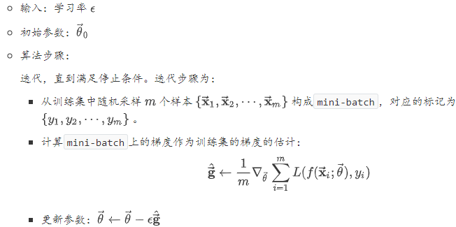
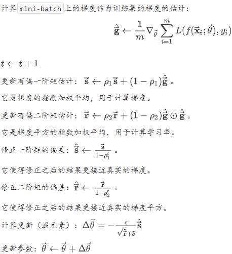
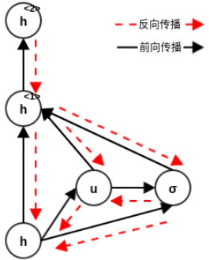
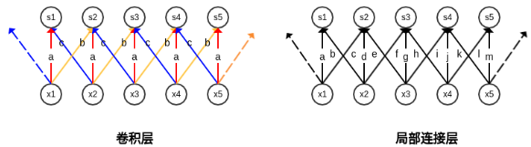
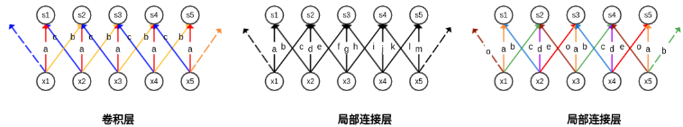
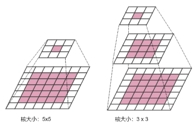
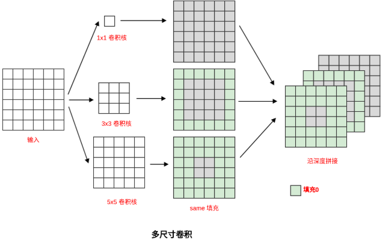
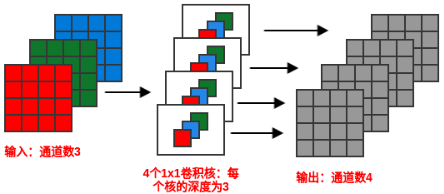
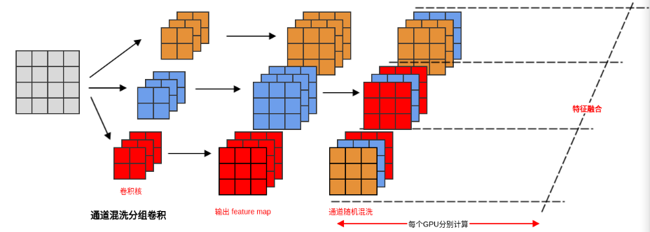
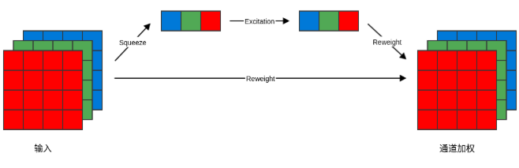

#### 1.深度前馈神经网络

深度学习的一个重要方面是代价函数的选取。代价函数给出的是单个样本的损失，损失函数是代价函数在所有样本上的和。通常神经网络的代价函数与传统模型的代价函数相同。大多数现代的神经网络采用最大似然准则，令代价函数为负的对数似然函数。因此损失函数为：$J(\vec{\theta})=-\mathbb{E}_{\overrightarrow{\mathbf{x}}, y \sim \hat{p}_{\text {data}}} \log p_{\text {model}}(y | \overrightarrow{\mathbf{x}} ; \vec{\theta})$。$\hat{p}_{data}$为样本的经验分布：
$$
\hat{p}_{d a t a}\left(\overrightarrow{\mathbf{x}}_{i}, y_{i}\right)=\left\{\begin{array}{ll}{\frac{1}{N} \delta\left(\overrightarrow{\mathbf{x}}-\overrightarrow{\mathbf{x}}_{i}, y-y_{i}\right),} & {\left(\overrightarrow{\mathbf{x}}_{i}, y_{i}\right) \in \mathbb{D}} \\ {0,} & {\text { else }}\end{array}\right.
$$
$\delta(\cdot)$为狄拉克函数，它仅在原点处非0，在其它所有位置都为 0 ，其在整个定义域上的积分为 1 。$N$为数据集$\mathbb{D}$的大小。$p_{model}$为对数据建立的模型，$\vec{\theta}$为模型参数。代价函数的具体形式取决于$p_{model}$的形式，随不同的模型而改变。其实就是样本的经验分布$\hat{p}_{data}$与模型$p_{model}$的交叉熵 。使用最大似然准则来导出代价函数的优势是：减轻了为每个模型设计代价函数的负担。一旦明确了一个模型$p_{\text {model}}(y | \overrightarrow{\mathbf{x}})$，则自动地确定了一个代价函数$-\log p_{\operatorname{model}}(y | \overrightarrow{\mathbf{x}})$。

#### 2.反向传播算法

计算图：图中的每个节点代表一个变量。操作：为一个或者多个变量的简单函数。多个操作组合在一起可以描述一个更复杂的函数。一个操作仅返回单个输出变量。如果变量$\mathbf{y}$是变量$\mathbf{x}$通过一个操作计算得到，则在图中绘制一条从$\mathbf{y}$到$\mathbf{x}$的有向边。

在多维情况下，设：$\overrightarrow{\mathbf{x}} \in \mathbb{R}^{m}, \overrightarrow{\mathbf{y}} \in \mathbb{R}^{n}$，$g$为$\mathbb{R}^m到$$\mathbb{R}^n$的映射且满足$\overrightarrow{\mathbf{y}}=g(\overrightarrow{\mathbf{x}})$，$f$为$\mathbb{R}^n$到$\mathbb{R}$的映射且满足$z=f(\overrightarrow{\mathbf{y}})$。则有：$\frac{\partial z}{\partial x_{i}}=\sum_{j=1}^{n} \frac{\partial z}{\partial y_{j}} \frac{\partial y_{j}}{\partial x_{i}}, \quad i=1,2, \cdots, m$。使用向量记法，可以等价地写作：$\nabla_{\overrightarrow{\mathbf{x}}} z=\left(\frac{\partial \overrightarrow{\mathbf{y}}}{\partial \overrightarrow{\mathbf{x}}}\right)^{T} \nabla_{\overrightarrow{\mathbf{y}}} z$。使用向量记法，可以等价地写作：$\nabla_{\overrightarrow{\mathbf{x}}} z=\left(\frac{\partial \overrightarrow{\mathbf{y}}}{\partial \overrightarrow{\mathbf{x}}}\right)^{T} \nabla_{\overrightarrow{\mathbf{y}}} z$。其中：$\frac{\partial \overrightarrow{\mathbf{y}}}{\partial \overrightarrow{\mathbf{x}}}$为$g$的$n\times m$阶雅可比矩阵，$\nabla_{\overrightarrow{\mathbf{x}}} z$为$z$对$\vec{\mathbf{x}}$的梯度，$\nabla_{\overrightarrow{\mathbf{y}}} z$为$z$对$\vec{\mathbf{y}}$的梯度：

$$
\nabla_{\overrightarrow{\mathbf{x}}} z=\left[\begin{array}{c}{\frac{\partial z}{\partial x_{1}}} \\ {\frac{\partial z}{\partial x_{2}}} \\ {\vdots} \\ {\frac{\partial z}{\partial x_{m}}}\end{array}\right] \quad \nabla_{\overrightarrow{\mathbf{y}}} z=\left[\begin{array}{c}{\frac{\partial z}{\partial y_{1}}} \\ {\frac{\partial z}{\partial y_{2}}} \\ {\vdots} \\ {\frac{\partial z}{\partial y_{n}}}\end{array}\right]\frac{\partial \overrightarrow{\mathbf{y}}}{\partial \overrightarrow{\mathbf{x}}}=\left[\begin{array}{cccc}{\frac{\partial y_{1}}{\partial x_{1}}} & {\frac{\partial y_{1}}{\partial x_{2}}} & {\cdots} & {\frac{\partial y_{1}}{\partial x_{m}}} \\ {\frac{\partial y_{2}}{\partial x_{1}}} & {\frac{\partial y_{2}}{\partial x_{2}}} & {\cdots} & {\frac{\partial y_{2}}{\partial x_{m}}} \\ {\vdots} & {\vdots} & {\ddots} & {\vdots} \\ {\frac{\partial y_{n}}{\partial x_{1}}} & {\frac{\partial y_{n}}{\partial x_{2}}} & {\cdots} & {\frac{\partial y_{n}}{\partial x_{m}}}\end{array}\right]
$$
链式法则不仅可以作用于向量，也可以应用于张量：首先将张量展平为一维向量。然后计算该向量的梯度。然后将该梯度重新构造为张量。记$\nabla_{\mathbf{X}} z$为$z$对张量$\mathbf{X}$的梯度。现在有多个索引，可以使用单个变量$i$来表示$\mathbf{X}$的索引元组。这就与向量中的索引方式完全一致：$\left(\nabla_{\mathbf{X}} z\right)_{i}=\frac{\partial z}{\partial x_{i}}$。

设$\mathbf{Y}=g(\mathbf{X}), z=f(\mathbf{Y})$，用单个变量$j$来表示$\mathbf{Y}$的索引元组。则张量的链式法则为：
$$
\frac{\partial z}{\partial x_{i}}=\sum_{j} \frac{\partial z}{\partial y_{j}} \frac{\partial y_{j}}{\partial x_{i}} \Rightarrow \nabla_{\mathbf{X}} z=\sum_{j}\left(\nabla_{\mathbf{x}} y_{j}\right) \frac{\partial z}{\partial y_{j}}
$$

#### 3.正则化

##### 参数范数正则化

一些正则化方法通过对目标函数  添加一个参数范数正则化项  来限制模型的容量。正则化之后的目标函数为$\tilde{J} : \tilde{J}(\vec{\theta} ; \mathbf{X}, \overrightarrow{\mathbf{y}})=J(\vec{\theta} ; \mathbf{X}, \overrightarrow{\mathbf{y}})+\alpha \Omega(\vec{\theta})$

###### $\text{L2}$正则化

假设$\vec{\theta}$参数就是权重$\vec{\mathbf{w}}$，没有偏置参数，则：$\tilde{J}(\overrightarrow{\mathbf{w}} ; \mathbf{X}, \overrightarrow{\mathbf{y}})=J(\overrightarrow{\mathbf{w}} ; \mathbf{X}, \overrightarrow{\mathbf{y}})+\frac{\alpha}{2} \overrightarrow{\mathbf{w}}^{T} \overrightarrow{\mathbf{w}}$。对应的梯度为：$\nabla_{\vec{w}} \tilde{J}(\overrightarrow{\mathbf{w}} ; \mathbf{X}, \overrightarrow{\mathbf{y}})=\nabla_{\vec{w}} J(\overrightarrow{\mathbf{w}} ; \mathbf{X}, \overrightarrow{\mathbf{y}})+\alpha \overrightarrow{\mathbf{w}}$。使用梯度下降法来更新权重，则权重的更新公式为：$\overrightarrow{\mathbf{w}}<\overrightarrow{\mathbf{w}}-\epsilon\left(\nabla_{\overrightarrow{\mathbf{w}}} J(\overrightarrow{\mathbf{w}} ; \mathbf{X}, \overrightarrow{\mathbf{y}})+\alpha \overrightarrow{\mathbf{w}}\right)$。即：$\overrightarrow{\mathbf{w}} \leftarrow(1-\epsilon \alpha) \overrightarrow{\mathbf{w}}-\epsilon \nabla_{\overrightarrow{\mathbf{w}}} J(\overrightarrow{\mathbf{w}} ; \mathbf{X}, \overrightarrow{\mathbf{y}})$。$\text{L2}$正则化对于梯度更新的影响是：每一步执行梯度更新之前，会对权重向量乘以一个常数因子来收缩权重向量。因此`L2` 正则化也被称作权重衰减。

令$\overrightarrow{\mathbf{w}}^{*}=\arg \min _{\overrightarrow{\mathbf{w}}} J(\overrightarrow{\mathbf{w}})$，它就是无正则化项时使得目标函数最小的权重向量。根据极小值的条件，有$\nabla_{\overrightarrow{\mathbf{w}}} J\left(\overrightarrow{\mathbf{w}}^{*}\right)=\overrightarrow{\mathbf{0}}$。于是在$\overrightarrow{\mathbf{w}}^{*}$的邻域内泰勒展开$J(\overrightarrow{\mathbf{w}})$。
$$
\hat{J}(\overrightarrow{\mathbf{w}})=J\left(\overrightarrow{\mathbf{w}}^{*}\right)+\overrightarrow{\mathbf{0}}+\frac{1}{2}\left(\overrightarrow{\mathbf{w}}-\overrightarrow{\mathbf{w}}^{*}\right)^{T} \mathbf{H}\left(\overrightarrow{\mathbf{w}}-\overrightarrow{\mathbf{w}}^{*}\right), \quad \overrightarrow{\mathbf{w}} \in \mathbb{N}\left(\overrightarrow{\mathbf{w}}^{*}\right)
$$
则$J(\overrightarrow{\mathbf{w}})$的梯度为：$\nabla_{\overrightarrow{\mathbf{w}}} \hat{J}(\overrightarrow{\mathbf{w}})=\mathbf{H}\left(\overrightarrow{\mathbf{w}}-\overrightarrow{\mathbf{w}}^{*}\right), \quad \overrightarrow{\mathbf{w}} \in \mathbb{N}\left(\overrightarrow{\mathbf{w}}^{*}\right)$。

令$\overrightarrow{\overline{\mathbf{w}}}^{*}=\arg \min _{\overrightarrow{\mathbf{w}}} \tilde{J}(\overrightarrow{\mathbf{w}})$，它就是有正则化项时使得目标函数最小的权重向量。

假设$\tilde{\mathbf{w}}^{*} \in \mathbb{N}\left(\overrightarrow{\mathbf{w}}^{*}\right)$， 即$\tilde{\mathbf{w}}^{*} $在$\overrightarrow{\mathbf{w}}^{*}$的一个邻域内，则有：$\nabla_{\vec{w}} J\left(\tilde{\vec{\mathbf{w}}}^{*}\right)=\mathbf{H}\left(\hat{\vec{\mathbf{w}}}^{*}-\overrightarrow{\mathbf{w}}^{*}\right)$。

根据极小值条件，则有：$\mathbf{H}\left(\overrightarrow{\mathbf{w}}^{*}-\overrightarrow{\mathbf{w}}^{*}\right)+\alpha \overrightarrow{\mathbf{w}}^{*}=\overrightarrow{\mathbf{0}} \rightarrow(\mathbf{H}+\alpha \mathbf{I}) \overrightarrow{\mathbf{w}}^{*}=\mathbf{H} \overrightarrow{\mathbf{w}}^{*}$

###### $\text{L1}$正则化

模型参数$\vec{\mathbf{w}}$的$\mathbf{L}_1$的正则化形式为：$\Omega(\vec{\theta})=\|\overrightarrow{\mathbf{w}}\|_{1}=\sum_{i}\left|w_{i}\right|$。即各个参数的绝对值之和。$\mathbf{L}_1$正则化后的目标函数$\tilde{J}(\overrightarrow{\mathbf{w}} ; \mathbf{X}, \overrightarrow{\mathbf{y}}) : \tilde{J}(\overrightarrow{\mathbf{w}} ; \mathbf{X}, \overrightarrow{\mathbf{y}})=J(\overrightarrow{\mathbf{w}} ; \mathbf{X}, \overrightarrow{\mathbf{y}})+\alpha\|\overrightarrow{\mathbf{w}}\|_{1}$。对应的梯度为$\nabla_{\overrightarrow{\mathbf{w}}} \tilde{J}(\overrightarrow{\mathbf{w}} ; \mathbf{X}, \overrightarrow{\mathbf{y}})=\nabla_{\overrightarrow{\mathbf{w}}} J(\overrightarrow{\mathbf{w}} ; \mathbf{X}, \overrightarrow{\mathbf{y}})+\alpha \operatorname{sign}(\overrightarrow{\mathbf{w}})$。如果自变量大于零，则取值为 1；如果自变量小于零，则取值为 -1；如果自变量为零，则取值为零。使用梯度下降法来更新权重，给出权重的更新公式为：
$$
\begin{array}{l}{\overrightarrow{\mathbf{w}} \leftarrow \overrightarrow{\mathbf{w}}-\epsilon\left(\nabla_{\overrightarrow{\mathbf{w}}} J(\overrightarrow{\mathbf{w}} ; \mathbf{X}, \overrightarrow{\mathbf{y}})+\alpha \operatorname{sign}(\overrightarrow{\mathbf{w}})\right)} \\ {=(\overrightarrow{\mathbf{w}}-\epsilon \alpha \operatorname{sign}(\overrightarrow{\mathbf{w}}))-\epsilon \nabla_{\overrightarrow{\mathbf{w}}} J(\overrightarrow{\mathbf{w}} ; \mathbf{X}, \overrightarrow{\mathbf{y}})}\end{array}
$$

##### 显式约束正则化

可以通过添加一个显式约束来实现正则化：$\min _{\vec{\theta}} J(\vec{\theta} ; \mathbf{X}, \overrightarrow{\mathbf{y}}), \quad$ st. $\Omega(\vec{\theta})<k$。其中$k$为一个常数。可以通过构建广义拉格朗日函数来求解该约束最优化问题。定义广义拉格朗日函数：$\mathcal{L}(\vec{\theta}, \alpha)=J(\vec{\theta})+\alpha(\Omega(\vec{\theta})-k)$。则上述约束最优化问题的解由下式给出：$\vec{\theta}^{*}=\arg \min _{\vec{\theta}} \max _{\alpha, \alpha>0} \mathcal{L}(\vec{\theta}, \alpha)$。假设$\alpha$的解为$\alpha^*$，固定$\alpha^*$则：$\vec{\theta}^{*}=\arg \min _{\vec{\theta}} J(\vec{\theta})+\alpha^{*} \Omega(\vec{\theta})$。

##### $\text{DropOut}$

`dropout`：在前向传播过程中，对网络中的每个隐层，每个隐单元都以一定的概率$p_{drop}$被删除，最后得到一个规模更小的网络。在反向传播过程中，仅仅针对该小网络进行权重更新。所谓的删除，即指定该该隐单元的输出都为0。一旦隐单元的权重为0，则该隐单元对后续神经元的影响均为0 。输入层和输出层的神经元不会被删除，因为这两个层的神经元的数量是固定的。

隐单元删除发生在一个训练样本的训练期间。不同的训练样本，其删除的隐单元的集合是不同的，因此裁剪得到的小网络是不同的。不同的训练样本，隐单元被删除的概率   都是相同的。在不同`batch` 之间的同一个训练样本，其删除的隐单元的集合也是不同的。在不同的梯度更新周期，会从完整的网络中随机删除不同的神经元，因此裁剪得到的小网络是不同的。但是在这个过程中，隐单元被删除的概率是相同的。可以指定某一个隐层或者某几个隐层执行`dropout`，而没有必要针对所有的隐层执行`dropout` 。`dropout`可以视作集成了非常多的神经网络的`bagging`集成模型，这些网络包含了所有从基础网络中删除隐单元形成的子网络。`bagging`涉及训练多个模型，并且在每个测试样本上评估多个模型。当每个模型都是一个大型神经网络时，这种`bagging`计算量非常庞大，实际不可行。`dropout`提供了一种方便的`bagging`近似，它能够训练和评估指数级别的神经网络的集成。

#### 4.最优化基础

有时候真正的代价函数无法有效优化，此时可以考虑使用`替代损失函数` 来代替真实的损失函数。一般的优化和机器学习优化的一个重要不同：机器学习算法通常并不收敛于代价函数的局部极小值。因为：机器学习算法通常使用替代损失函数。算法终止时，可能出现：采用 `替代损失函数`的代价函数的导数较小，而采用真实损失函数的代价函数的导数仍然较大相比较于0值。机器学习算法可能会基于早停策略而提前终止。

##### 神经网络最优化挑战

###### 病态黑塞矩阵

病态的黑塞矩阵$\mathbf{H}$是凸优化或者其他形式优化中普遍存在的问题。在神经网络训练过程中，如果$\mathbf{H}$是病态的，则随机梯度下降会“卡”在某些地方：此时即使很小的更新步长也会增加代价函数。当黑塞矩阵是病态时，牛顿法是一个很好的解决方案。但是牛顿法并不适用于神经网络，需要对它进行较大改动才能用于神经网络。将$f(\vec{\mathbf{x}})$在$\vec{\mathbf{x}}$处泰勒展开：$f(\overrightarrow{\mathbf{x}}) \approx f\left(\overrightarrow{\mathbf{x}}_{0}\right)+\left(\overrightarrow{\mathbf{x}}-\overrightarrow{\mathbf{x}}_{0}\right)^{T} \overrightarrow{\mathbf{g}}+\frac{1}{2}\left(\overrightarrow{\mathbf{x}}-\overrightarrow{\mathbf{x}}_{0}\right)^{T} \mathbf{H}\left(\overrightarrow{\mathbf{x}}-\overrightarrow{\mathbf{x}}_{0}\right)$。根据梯度下降法：$\overrightarrow{\mathbf{x}}^{\prime}=\overrightarrow{\mathbf{x}}-\epsilon \nabla_{\overrightarrow{\mathbf{x}}} f(\overrightarrow{\mathbf{x}})$。应用在点$\vec{\mathbf{x}}_0$，有：$f\left(\overrightarrow{\mathbf{x}}_{0}-\epsilon \overrightarrow{\mathbf{g}}\right) \approx f\left(\overrightarrow{\mathbf{x}}_{0}\right)-\epsilon \overrightarrow{\mathbf{g}}^{T} \overrightarrow{\mathbf{g}}+\frac{1}{2} \epsilon^{2} \overrightarrow{\mathbf{g}}^{T} \mathbf{H} \overrightarrow{\mathbf{g}}$。因此沿着负梯度的方向，步长$-\epsilon \overrightarrow{\mathrm{g}}$将导致代价函数$f$增加：$-\epsilon \overrightarrow{\mathrm{g}}^{T} \overrightarrow{\mathrm{g}}+\frac{1}{2} \epsilon^{2} \overrightarrow{\mathrm{g}}^{T} \mathbf{H} \overrightarrow{\mathrm{g}}$。当$\frac{\epsilon}{2} \vec{g}^{T} \mathbf{H} \vec{g}>\vec{g}^{T} \overrightarrow{\mathbf{g}}$时，黑塞矩阵的病态会成为问题。此时沿着负梯度的方向，代价函数值反而在增长。

###### 局部极小值

如果局部极小解和全局极小解相差很大时，此时多个局部极小解会带来很大隐患。它将给基于梯度的优化算法带来很大的问题。有一种方案是排除局部极小值导致的困难：绘制梯度范数随着时间的变化：如果梯度范数没有缩小到一个很小的值，则问题的原因既不是局部极小值引起的，也不是其他形式的临界点引起的。如果梯度范数缩小到一个很小的值，则问题的原因可能是局部极小值引起的，也可能是其他原因引起的。神经网络训练中，通常不关注代价函数的精确全局极小值，而是关心将代价函数值下降到足够小，从而获得一个很好的泛化误差。

###### 鞍点

鞍点是另一类梯度为零的点。鞍点附近的某些点的函数值比鞍点处的值更大，鞍点附近的另一些点的函数值比鞍点处的值更小。鞍点对于训练算法的影响：对于只使用了梯度的一阶优化算法而言：情况不明。理论上，鞍点附近的梯度通常会非常小，这导致梯度下降算法沿着梯度方向的步长非常小。实际上，梯度下降算法似乎在很多情况下都能够逃离鞍点。对于牛顿法而言，鞍点是个大问题。因为梯度下降的原则是：朝着下坡路的方向移动。而牛顿法的原则是：明确寻找梯度为零的点。如果不做任何修改，则牛顿法会主动跳入一个鞍点。也可能出现一个恒值的、平坦的宽区域：在这个区域中，梯度和黑塞矩阵都为零

###### 悬崖

多层神经网络通常有像悬崖一样的区域，悬崖是指代价函数斜率较大的区域。产生悬崖的原因：由于几个较大的权重相乘，导致求导的时候，其梯度异常巨大。在`RNN`网络的代价函数中悬崖结构很常见，因为`RNN` 这一类模型会涉及到多个时间步长中的因子的相乘，导致产生了大量的权重相乘。悬崖的影响：在梯度更新时，如果遇到悬崖，则会导致参数更新的步长非常大，从而跨了非常大的一步，使得参数弹射的非常远。这样可能会使得已经完成的大量优化工作无效。因为当弹射非常远时，可能横跨了参数空间的很多个区域而进入到另一个区域。这样已经探索的参数区域就被放弃了。

解决悬崖问题的方案：使用梯度截断策略。梯度下降法只是指明了参数更新的方向，但是未指明最佳步长。当常规的梯度下降算法建议更新一大步时，梯度截断会干涉并缩减步长，从而使其基本上贴着悬崖来更新。

###### 长期依赖、

当计算图非常深时，容易产生另一种优化困难：长期依赖。假设计算图中包含一条重复地、与矩阵$\mathbf{W}$相乘的路径。经过$t$步，则相当于与$\mathbf{W}^t$相乘。在第$i$步有：$\overrightarrow{\mathbf{h}}_{t}=\mathbf{W}^{t-i} \overrightarrow{\mathbf{h}}_{i}$。根据反向传播原理，有： $\nabla_{\overrightarrow{\mathrm{h}}_{\mathrm{i}}} J=\left(\frac{\partial \overrightarrow{\mathrm{h}}_{t}}{\partial \overrightarrow{\mathrm{h}}_{\mathrm{i}}}\right)^{T} \nabla_{\overrightarrow{\mathrm{h}}_{t}} J=\left(\mathbf{W}^{t-i}\right)^{T}\nabla_{\overrightarrow{\mathrm{h}}_{\mathrm{t}}} J$。考虑到权重$\mathbf{W}$参与到每个时间步的计算，因此有：$\nabla_{\mathbf{W}}=\sum_{i=1}^{t} \frac{\partial J}{\partial \overrightarrow{\mathbf{h}}_{i}} \overrightarrow{\mathbf{h}}_{i-1}^{T}=\sum_{i=1}^{t}\left(\mathbf{W}^{t-i}\right)^{T}\left(\nabla_{\overrightarrow{\mathbf{h}}_{i}} J\right) \overrightarrow{\mathbf{h}}_{i-1}^{T}$。其中记$\overrightarrow{\mathbf{x}}=\overrightarrow{\mathbf{h}}_{0}$。假设矩阵$\left(\nabla_{\overrightarrow{\mathbf{h}}_{\mathrm{t}}} J\right) \overrightarrow{\mathbf{x}}^{T}=c \mathbf{I}$，则有：
$$
\nabla_{\mathbf{W}}=\sum_{i=1}^{t}\left(\mathbf{W}^{t-i}\right)^{T}\left(\nabla_{\overrightarrow{\mathbf{h}}_{t}} J\right)\left(\mathbf{W}^{i-1} \overrightarrow{\mathbf{x}}\right)^{T}=\sum_{i=1}^{t} c\left(\mathbf{W}^{t-1}\right)^{T}=c \times t \times\left(\mathbf{W}^{t-1}\right)^{T}
$$
假设$\mathbf{W}$有特征值分解$\mathbf{W}=\mathbf{V} \Lambda \mathbf{V}^{-1}$，则：$\mathbf{W}^{t-1}=\mathbf{V} \Lambda^{t-1} \mathbf{V}^{-1}$。考虑特征值$\lambda_i$，当它不在 1 附近时：如果量级大于 1，$lambda_i^t$非常大，这称作梯度爆炸问题。如果量级小于 1， $\lambda_i^t$非常小，这称作梯度消失问题。梯度消失使得学习难以进行，此时学习的推进会非常缓慢。循环网络在每个时间步上使用相同的矩阵 ，因此非常容易产生梯度爆炸和梯度消失问题。前馈神经网络并没有在每一层使用相同的矩阵 ，因此即使是非常深层的前馈神经网络也能很大程度上避免梯度爆炸和梯度消失问题。对于梯度爆炸，可以通过梯度裁剪来缓解：限定梯度的范数的上限。对于梯度消失，不能够简单的通过放大来解决。因为有两个问题：当梯度很小的时候，无法分辨它是梯度消失问题，还是因为抵达了极小值点。当梯度很小的时候，噪音对梯度的影响太大。获得的梯度很可能由于噪音的影响，导致它的方向是随机的。此时如果放大梯度，则无法确保此时的方向就是代价函数下降的方向。而对于梯度爆炸，如果缩小梯度，仍然可以保证此时的方向就是代价函数下降的方向。

###### 非精确梯度

大多数优化算法都假设知道精确的梯度或者`Hessian`矩阵，实际中这些量都有躁扰，甚至是有偏的估计。如：`mini-batch`随机梯度下降中，用一个`batch` 的梯度来估计整体的梯度。各种神经网络优化算法的设计都考虑到了梯度估计的不精确。另外，实际情况中的目标函数是比较棘手的，甚至难以用简洁的数学解析形式给出。此时可以选择`替代损失函数`来避免这个问题。

###### 局部和全局结构的弱对应

对于最优化问题，即使克服了以上的所有困难，但是并没有到达代价函数低得多的区域，则表现仍然不佳。这就是局部优秀，全局不良。局部优秀：跨过了鞍点、爬过了悬崖、克服了梯度消失，最终到达局部极小值点。全局不良：并未到达目标函数全局比较小的值所在的区域。在局部结构中执行梯度下降的问题：局部梯度下降或许能找出一条解路径，但是该路径可能包含了很多次梯度更新，遵循该路径会带来很高的计算代价。如果目标函数没有任何鞍点、极值点，而是具有一个宽而平坦的区域。此时，若要寻求一个精确的临界点，则局部梯度下降无法给出解路径。这意味着算法难以收敛。局部梯度下降可能太过贪心，使得训练虽然朝着梯度下降的方向移动，但是远离了真正的解。如果存在某个参数区域，当遵循局部梯度下降就能够合理地直接到达最优解，且参数初始化点就位于该区域，则局部梯度下降的问题就得到解决。

##### $\text{mini-batch}$

使用小批量样本来估计梯度的原因：使用更多样本来估计梯度的方法的收益是低于线性的。如果能够快速计算出梯度的估计值，则大多数优化算法会更快收敛。大多数优化算法基于梯度下降，如果每一步中计算梯度的时间大大缩短，则它们会更快收敛。训练集存在冗余。

##### 基本梯度下降算法

###### 随机梯度下降

`SGD`中一个关键参数是学习率。前面介绍的`SGD`算法步骤使用固定的学习率 ，实践中有必要随着时间的推移而降低学习率。使用标准的梯度下降到达极小点时，整个代价函数的真实梯度非常小，甚至为零。由于`SGD` 使用`mini-batch`的梯度作为整体梯度的估计，因此引入了噪源。该噪源并不会在极小值处消失，使得在极小点时，梯度的估计可能会比较大。因此：标准的梯度下降可以使用固定的学习率，而`SGD`必须使用逐渐降低的学习率。

##### 动量方法

###### $\text{Nesterov}$动量

`Nesterov`动量是动量方法的变种。区别在于：计算`mini-batch`的梯度时，采用更新后的参数$\vec{\theta}+\alpha \overrightarrow{\mathbf{v}}$。它可以视作向标准动量方法中添加了一个校正因子：
$$
\begin{aligned} \overrightarrow{\mathbf{v}} \leftarrow \alpha \overrightarrow{\mathbf{v}} &-\epsilon \nabla_{\vec{\theta}} J(\vec{\theta}+\alpha \overrightarrow{\mathbf{v}}) \\ \vec{\theta} & \leftarrow \vec{\theta}+\overrightarrow{\mathbf{v}} \end{aligned}
$$

##### 自适应学习率算法

###### $\text{AdaGrad}$

`AdaGrad`算法的思想是：参数空间每个方向的学习率反比于某个值的平方根。这个值就是该方向上梯度分量的所有历史平方值之和。
$$
\begin{array}{c}{\overrightarrow{\mathbf{r}} \leftarrow \overrightarrow{\mathbf{r}}+\hat{\mathbf{g}} \odot \hat{\mathbf{g}}} \\ {\vec{\theta} \leftarrow \vec{\theta}-\frac{\epsilon}{\sqrt{\mathbf{r}}} \odot \hat{\overrightarrow{\mathbf{g}}}}\end{array}
$$
其中$\odot$表示两个向量的逐元素的相乘。

`AdaDelta` 将梯度平方和的累计策略修改为：只考虑过去窗口$window$内的梯度。

###### $\text{RMSProp}$

`RMSProp`是`AdaGrad`的一个修改：将梯度累计策略修改为指数加权的移动平均。
$$
\begin{aligned} \overrightarrow{\mathbf{r}} & \leftarrow \rho \overrightarrow{\mathbf{r}}+(1-\rho) \hat{\vec{g}} \odot \hat{\mathbf{g}} \\ \vec{\theta} & \leftarrow \vec{\theta}-\frac{\epsilon}{\sqrt{\overrightarrow{\mathbf{r}}}} \odot \hat{\overrightarrow{\mathbf{g}}} \end{aligned}
$$
其中$\rho$为衰减速率，它决定了指数加权移动平均的有效长度。

###### $\text{RMSProp}$动量算法

###### $\text{Adam}$

初始化一阶和二阶矩变量$\overrightarrow{\mathrm{s}}=\overrightarrow{\mathbf{0}}, \overrightarrow{\mathrm{r}}=\overrightarrow{0}$

##### $\text{Normalization}$

###### $\text{batch normlization}$

在机器学习中，如果数据是独立同分布的，则可以简化模型的训练，提升模型的预测能力。所以通常需要对输入数据进行白化`whitening`。 白化主要实现两个目的：去除特征之间的相关性。即：特征之间尽可能的独立。使得所有特征都具有相同的均值和方差。即：特征之间尽可能的同分布。白化操作：首先将输入执行 `PCA` 降维，这称作`PCA` 处理。然后在新的空间中，对输入数据的每一维进行标准差归一化处理。

###### 深层网络的参数更新

对于一个深层的神经网络，如果同时更新所有层的参数，则可能会发生一些意想不到的后果。假设有一个深层神经网络，一共有$l$层，每层只有一个单元，且每个隐层不使用激励函数。则输出为：$\hat{y}=x w_{1} w_{2} \cdots w_{l}$。其中$w_i$为第$i$层的权重。第$i$层的输出为：$h^{<i>}=h^{<i-1>} w_{i}$。令$\overrightarrow{\mathbf{g}}=\left(g_{1}, g_{2}, \cdots, g_{l}\right)^{T}=\nabla_{\overrightarrow{\mathbf{w}}} \hat{y}$，其中：$g_{i}=\frac{\partial \hat{y}}{w_{i}}=x \prod_{j=1, j \neq i}^{l} w_{j}$。利用梯度下降法更新参数，则有：$\overrightarrow{\mathbf{w}} \leftarrow \overrightarrow{\mathbf{w}}-\epsilon \overrightarrow{\mathbf{g}}$。如果使用$\hat{y}$的一阶泰勒近似，则有：$f(\overrightarrow{\mathbf{w}}-\epsilon \overrightarrow{\mathbf{g}})-f(\overrightarrow{\mathbf{w}}) \approx-\epsilon \overrightarrow{\mathbf{g}}^{T} \overrightarrow{\mathbf{g}}$。即：$\hat{y}$的值下降了$\epsilon \overrightarrow{\mathrm{g}}^{T} \overrightarrow{\mathrm{g}}$。因此梯度下降法一定能够降低$\hat{y}$的值。如果直接按多项式乘法展开，则会考虑$\epsilon$的二阶、三阶甚至更高阶的项，有：
$$
\begin{array}{l}{f(\overrightarrow{\mathbf{w}}-\epsilon \overrightarrow{\mathbf{g}})-f(\overrightarrow{\mathbf{w}})=x\left(w_{1}-\epsilon g_{1}\right)\left(w_{2}-\epsilon g_{2}\right) \cdots\left(w_{l}-\epsilon g_{l}\right)-x w_{1} w_{2} \cdots w_{l}} \\ {\quad=-\epsilon x \sum_{i=1}^{l}\left(g_{i} \prod_{j=1, j \neq i}^{l} w_{j}\right)+\epsilon^{2} x \sum_{j=i}^{l}\left(g_{i} g_{j} \prod_{k=1, k \neq i, k \neq j}^{l} w_{k}\right)+\cdots}\end{array}
$$
考虑到$g_{i}=x \prod_{j=1, j \neq i}^{l} w_{j}$，则有：
$$
f(\overrightarrow{\mathbf{w}}-\epsilon \overrightarrow{\mathrm{g}})-f(\overrightarrow{\mathbf{w}})=-\epsilon \overrightarrow{\mathrm{g}}^{T} \overrightarrow{\mathrm{g}}+\epsilon^{2} x \sum_{i=1}^{l} \sum_{j=i}^{l}\left(g_{i} g_{j} \prod_{k=1, k \neq i, k \neq j}^{l} w_{k}\right)+\cdots
$$
如果$w_i$都比较小，则$\prod_{k=1, k \neq i, k \neq j}^{l} w_{k}$很小，则二阶项可以忽略不计。如果$w_i$都比较大，则该二阶项可能会指数级大。此时很难选择一个合适的学习率，使得$f(\overrightarrow{\mathbf{w}}-\epsilon \overrightarrow{\mathbf{g}})-f(\overrightarrow{\mathbf{w}})<0$。因此某一层中参数更新的效果会取决于其他所有层。虽然二阶优化算法会利用二阶项的相互作用来解决这个问题，但是还有三阶项甚至更高阶项的影响。

###### $\text{BN}$算法

`batch normalization`解决了多层之间协调更新的问题，它可以应用于网络的任何输入层或者隐层。设$\mathbb{H}=\left\{\overrightarrow{\mathbf{h}}_{1}, \overrightarrow{\mathbf{h}}_{2}, \cdots, \overrightarrow{\mathbf{h}}_{m}\right\}$为神经网络某层的一个`mini-batch` 的输入，$n$为输入的维度。首先计算这个`mini-batch` 输入的均值和每维特征的标准差：
$$
\begin{array}{c}{\vec{\mu}=\frac{1}{m} \sum_{i=1}^{m} \overrightarrow{\mathbf{h}}_{i}} \\ {\vec{\sigma}^{2}=\left(\sigma_{1}^{2}, \sigma_{2}^{2}, \cdots, \sigma_{n}^{2}\right)^{T}, \quad \sigma_{j}^{2}=\frac{1}{m} \sum_{i=1}^{m}\left(h_{i, j}-\mu_{j}\right)^{2}}\end{array}
$$
然后对输入进行归一化：$\overrightarrow{\mathbf{h}}_{i}^{<1>}=\frac{\overrightarrow{\mathbf{h}}_{i}-\vec{\mu}}{\sqrt{\vec{\sigma}^{2}+\epsilon}}$。其中$\frac{1}{\sqrt{\vec{\sigma}^{2}+\epsilon}}$表示逐元素的除法：$h_{i, j}^{<1>}=\frac{h_{i j}-\mu_{j}}{\sqrt{\sigma_{j}^{2}+\epsilon}}, j=1,2, \cdots, n$。最后执行缩放：$\overrightarrow{\mathbf{h}}_{i}^{<2>}=\vec{\gamma} \odot \overrightarrow{\mathbf{h}}_{i}^{<1>}+\vec{\beta}$。其中$\vec{\gamma}, \vec{\beta}$是网络从数据中自动学习到的参数，用于调整$\overrightarrow{\mathbf{h}}_{i}^{<2>}$的均值和方差。虽然$\overrightarrow{\mathbf{h}}_{i}^{<2>}$的每个维度不是零均值、单位方差的，但是可以保证它的每个维度的均值、方差不再依赖于低层的网络。归一化一个神经元的均值和标准差会降低包含该神经元的神经网络的表达能力。若每个神经元的输出都是均值为0、标准差为 1 ，则会产生两个问题：无论底层的神经元如何学习 ，其输出在提交给上层神经元处理之前，都被粗暴的归一化。导致底层神经元的学习毫无意义。`sigmoid` 等激活函数通过区分饱和区、非饱和区（线性区），使得神经网络具有非线性计算的能力。输入归一化使得数据几乎都被映射到激活函数的线性区，从而降低了模型的表达能力。因此执行缩放的原因是：保证模型的容量不会被降低。当网络学到的参数且好是$\vec{\gamma}=\sqrt{\vec{\sigma}^{2}}+\epsilon, \vec{\beta}=\vec{\mu}$时，$\overrightarrow{\mathbf{h}}_{i}^{<2>}=\overrightarrow{\mathbf{h}}_{i}$，因此`BN` 可以还原原来的输入。这样，模型既可以改变、也可以保持原输入，这就提升了网络的表达能力。

根据梯度的链式法则，反向传播规则为：$\nabla_{\overrightarrow{\mathbf{h}}_{i}^{<1>}}\mathcal{L}=\vec{\gamma} \odot \nabla_{\overrightarrow{\mathbf{h}}_{i}^{<2>}}\mathcal{L}$。考虑到$\vec{\gamma}, \vec{\beta}$出现在$\overrightarrow{\mathbf{h}}_{1}^{<2>}, \cdots, \overrightarrow{\mathbf{h}}_{m}^{<2>}$中，因此有：$\nabla_{\vec{\beta}} \mathcal{L}=\sum_{i=1}^{m} \nabla_{\overrightarrow{\mathbf{h}}_{i}^{<2>}}\mathcal{L}, \quad \nabla_{\vec{\gamma}} \mathcal{L}=\sum_{i=1}^{m}\left(\nabla_{\overrightarrow{\mathbf{h}}_{i}^{<2>}}\right) \odot \overrightarrow{\mathbf{h}}_{i}^{<1>}$。由于$=\vec{\mu}, \vec{\sigma}^{2}$出现在$\overrightarrow{\mathbf{h}}_{1}^{<2>}, \cdots, \overrightarrow{\mathbf{h}}_{m}^{<2>}$中，因此有：
$$
\nabla_{\vec{\mu}} \mathcal{L}=\sum_{i=1}^{m}\left(\frac{\partial \overrightarrow{\mathbf{h}}_{i}^{<1>}}{\partial \vec{\mu}}\right)^{T} \nabla_{\overrightarrow{\mathbf{h}}_{i}^{<1>}} \mathcal{L}=\sum_{i=1}^{m}-\frac{\nabla_{\overrightarrow{\mathbf{h}}_{i}^{<1>}}\mathcal{L}}{\sqrt{\vec{\sigma}^{2}+\epsilon}}\\
\nabla_{\vec{\sigma}^{2}} \mathcal{L}=\sum_{i=1}^{m}\left(\frac{\partial \overrightarrow{\mathbf{h}}_{i}^{<1>}}{\partial \vec{\sigma}^{2}}\right)^{T} \nabla_{\overrightarrow{\mathbf{h}}_{i}^{<1>}} \mathcal{L}=\sum_{i=1}^{m}-\frac{1}{2} \frac{\overrightarrow{\mathbf{h}}_{i}-\vec{\mu}}{\left(\vec{\sigma}^{2}+\epsilon\right)^{3 / 2}} \odot\left(\nabla_{\overrightarrow{\mathbf{h}}_{i}^{<1>}} \mathcal{L}\right)
$$
由于$\overrightarrow{\mathbf{h}}_{i}$出现在多条路径中，因此有：
$$
\begin{aligned} \nabla_{\overrightarrow{\mathbf{h}}_{i}} \mathcal{L}=( & \frac{\partial \overrightarrow{\mathbf{h}}_{i}^{<1>}}{\partial \overrightarrow{\mathbf{h}}_{i}} )^{T} \nabla_{\overrightarrow{\mathbf{h}}_{i}^{<1>}} \mathcal{L}+\left(\frac{\partial \vec{\mu}}{\partial \overrightarrow{\mathbf{h}}_{i}}\right)^{T} \nabla_{\vec{\mu}} \mathcal{L}+\left(\frac{\partial \vec{\sigma}^{2}}{\partial \overrightarrow{\mathbf{h}}_{i}}\right)^{T} \nabla_{\vec{\sigma}^{2}} \mathcal{L} \\=& \frac{\nabla_{\overrightarrow{\mathbf{h}}_{i}}^{<1>\mathcal{L}}}{\sqrt{\vec{\sigma}^{2}+\epsilon}}+\frac{\nabla_{\vec{\mu}} \mathcal{L}}{m}+\frac{2}{m}\left(\overrightarrow{\mathbf{h}}_{i}-\vec{\mu}\right) \odot \nabla_{\vec{\sigma}^{2}} \mathcal{L} \end{aligned}
$$

除了`batch normalization` 之外，还有`layer normalization、 instance normalization、group normalization、 weight normalization` 。下图给出了`BN、LN、IN、GN` 的示意图。其中蓝色部分表示：通过这些蓝色区域计算均值和方差，然后蓝色区域中的每个单元都使用这些均值、方差来归一化。如果是对每个神经元进行归一化，则`BN` 示意图中，蓝色区域只有最底下的一行。

#### 5.卷积神经网络

卷积神经网络是指那些至少在网络的某一层中使用了卷积运算来代替一般的矩阵乘法运算的神经网络。

离散卷积可以视作输入矩阵与一个特殊的核矩阵的乘法。对于一维的离散卷积，核矩阵的每一行必须和上一行移动一个元素后相等。这种类型的矩阵叫做`Toeplitz`矩阵。对于二维的离散卷积，核矩阵对应着一个双重块循环矩阵。该矩阵大部分元素相等，且非常稀疏。

假设有两个长度分别为$M$和$N$的序列$x(i)$和$w(i)$， 则一维卷积为：$s(i)=x(i) * w(i)=\sum_{j} x(j) w(i-j)$。卷积的长度为$L=M+N-1$。首先用0扩充序列$x, w$:
$$
x_{p}(i)=\left\{\begin{array}{ll}{x(i)} & {, 0 \leq i \leq M-1} \\ {0} & {, M-1<i \leq L-1}\end{array}\right.\\
w_{p}(i)=\left\{\begin{array}{ll}{w(i)} & {, 0 \leq i \leq N-1} \\ {0} & {, N-1<i \leq L-1}\end{array}\right.
$$
由于用$w$取卷积$x$，因此构造$w$的循环矩阵：
$$
\mathbf{W}=\left[\begin{array}{ccccc}{w_{p}(0)} & {w_{p}(L-1)} & {w_{p}(L-2)} & {\dots} & {w_{p}(1)} \\ {w_{p}(1)} & {w_{p}(0)} & {w_{p}(L-1)} & {\dots} & {w_{p}(2)} \\ {\vdots} & {\vdots} & {\vdots} & {\ddots} & {\vdots} \\ {w_{p}(L-1)} & {w_{p}(L-2)} & {w_{p}(L-3)} & {\cdots} & {w_{p}(0)}\end{array}\right]
$$

$$
\overrightarrow{\mathbf{s}}=\mathbf{W} \cdot x_{p}=\left[\begin{array}{cccc}{w_{p}(0)} & {w_{p}(L-1)} & {w_{p}(L-2)} & {\cdots} & {w_{p}(1)} \\ {w_{p}(1)} & {w_{p}(0)} & {w_{p}(L-1)} & {\dots} & {w_{p}(2)} \\ {\vdots} & {\vdots} & {\vdots} & {\vdots} \\ {w_{p}(L-1)} & {w_{p}(L-2)} & {w_{p}(L-3)} & {\cdots} & {w_{p}(0)}\end{array}\right] \cdot\left[\begin{array}{c}{x_{p}(0)} \\ {x_{p}(1)} \\ {\vdots} \\ {x_{p}(L-1)}\end{array}\right]
$$

###### 二维卷积和矩阵乘法

$\mathbf{S}(i, j)=(\mathbf{I} * \mathbf{K})(i, j)=\sum_{m} \sum_{n} \mathbf{I}(m, n) \mathbf{K}(i-m, j-n)$先将$\mathbf{I}$, $\mathbf{K}$扩充到$M\times N$维：$M=M_I+M_K-1, N=N_I+N_K-1$。扩充之后的新矩阵为$\mathbf{I}_p, \mathbf{K}_p$。其中：
$$
\mathbf{I}_{p}=\left[\begin{array}{ccccccc}{I_{1,1}} & {I_{1,2}} & {\cdots} & {I_{1, N_{I}}} & {0} & {\cdots} & {0} \\ {I_{2,1}} & {I_{2,2}} & {\cdots} & {I_{2, N_{I}}} & {0} & {\cdots} & {0} \\ {\vdots} & {\vdots} & {\ddots} & {\vdots} & {0} & {\cdots} & {0} \\ {I_{M_{l}, 1}} & {I_{M_{l}, 2}} & {\cdots} & {I_{M, N_{I}}} & {0} & {\cdots} & {0} \\ {0} & {0} & {\cdots} & {0} & {0} & {\cdots} & {0} \\ {\vdots} & {\vdots} & {\ddots} & {\vdots} & {\vdots} & {\ddots} & {\vdots} \\ {0} & {0} & {\cdots} & {0} & {0} & {\cdots} & {0}\end{array}\right]
$$

$$
\mathbf{K}_{p}=\left[\begin{array}{ccccccc}{K_{1,1}} & {K_{1,2}} & {\cdots} & {K_{1, N_{K}}} & {0} & {\cdots} & {0} \\ {K_{2,1}} & {K_{2,2}} & {\cdots} & {K_{2, N_{K}}} & {0} & {\cdots} & {0} \\ {\vdots} & {\vdots} & {\ddots} & {\vdots} & {0} & {\cdots} & {0} \\ {K_{M_{K}, 1}} & {K_{M_{K}, 2}} & {\cdots} & {K_{M_{K}, N_{K}}} & {0} & {\cdots} & {0} \\ {0} & {0} & {\cdots} & {0} & {0} & {\cdots} & {0} \\ {\vdots} & {\vdots} & {\ddots} & {\vdots} & {\vdots} & {\ddots} & {\vdots} \\ {0} & {0} & {\cdots} & {0} & {0} & {\cdots} & {0}\end{array}\right]
$$

用$\mathbf{I}_p$构造一个列向量$f_p$：将$\mathbf{I}_p$的第一行转置之后将其成为$f_p$的前$N$个元素；接下来是第二行的转置....第$M$行的转置。
$$
f_{p}=\left(I_{1,1}, I_{1,2}, \cdots, I_{1, N_{I}}, 0, \cdots, I_{M_{I}, 1}, I_{M_{I}, 2}, \cdots, I_{M_{I}, N_{I}}, 0, \cdots\right)^{T}
$$
将$\mathbf{K}_{p}$中的每一行，都按照一维卷积中介绍的循环矩阵生成的方法构成一个$N\times N$的循环矩阵。这些矩阵记做：$\mathbf{G}_{1}, \mathbf{G}_{2}, \cdots \mathbf{G}_{M}$。
$$
\mathbf{G}_{m}=\left[\begin{array}{cccc}{K_{m, 1}} & {0} & {\cdots} & {K_{m, 2}} \\ {K_{m, 2}} & {K_{m, 1}} & {\cdots} & {K_{m, 3}} \\ {\vdots} & {\vdots} & {\ddots} & {\vdots} \\ {K_{m, N_{K}}} & {K_{m, N_{K}-1}} & {\cdots} & {0} \\ {0} & {K_{m, N_{K}}} & {\cdots} & {0} \\ {\vdots} & {\vdots} & {\ddots} & {\vdots} \\ {0} & {0} & {\cdots} & {K_{m, 1}}\end{array}\right], \quad m=1,2, \cdots, M
$$
用这些循环矩阵构造一个大的块循环矩阵：
$$
\mathbf{G}_{b}=\left[\begin{array}{cccc}{\left[\mathbf{G}_{1}\right]} & {\left[\mathbf{G}_{M}\right]} & {\cdots} & {\left[\mathbf{G}_{2}\right]} \\ {\left[\mathbf{G}_{2}\right]} & {\left[\mathbf{G}_{1}\right]} & {\cdots} & {\left[\mathbf{G}_{3}\right]} \\ {\vdots} & {\vdots} & {\ddots} & {\vdots} \\ {\left[\mathbf{G}_{M}\right]} & {\left[\mathbf{G}_{M-1}\right]} & {\cdots} & {\left[\mathbf{G}_{1}\right]}\end{array}\right]
$$
计算：$h_{b}=\mathbf{G}_{b} \cdot f_{p}$。将$h_b$的结果分配到$\mathbf{S}$的各行与构造$f_p$相反的过程，即得到二维卷积。

单个卷积核只能提取一种类型的特征。如果希望卷积层能够提取多个特征，则可以并行使用多个卷积核，每个卷积核提取一种特征。我们称输出的`feature map` 具有多个通道`channel` 。`feature map` 特征图是卷积层的输出的别名，它由多个通道组成，每个通道代表通过卷积提取的某种特征

###### 输入填充

对输入$\mathbf{V}$有三种填充零的方式：`valid` 填充、`same` 填充、`full` 填充。`valid` 填充：不使用零来填充输入，卷积核只允许访问那些图像中能完全包含整个核的位置。在`valid` 填充模式中，输出的大小在每一层都缩减。假设核的宽度是$k$，则每经过一层，输出的宽度减少了$k-1$。如果输入图像的宽度是$m$，则网络经过了$d$层之后，输出的宽度变成$m-(k-1)\times d$。如果核的宽度$k$非常大时，缩减非常明显。最终网络会缩减到 1。

`same` 填充：使用足够的零来填充，使得输出和输入保持相同的大小。这是最常见的填充方式。在`same`填充模式中，网络可以包含任意多的卷积层，因为它不存在网络输出宽度缩减的问题。`same` 填充模式的一个问题是：输入的边缘单元可能存在一定程度上的欠表达。因为输入的中间区域的单元的影响域为全部的输出单元，这意味着这些输入单元的信息会被很多输出单元所编码。而输入的边缘区域的单元的影响域只是输出单元的一部分，这意味着这些输入单元的信息仅仅被少量输出单元所编码。

`full` 填充：在输入的两端各填充$k-1$个零，使得每个输入单元都恰好被卷积核访问$k$次。其中$k$为卷积核的宽度。它将从卷积核和输入开始相交的时候开始做卷积。假设核的宽度是$k$，则每经过一层，输出的宽度增加了$k-1$。如果输入图像的宽度是$m$，则网络经过了$d$层之后，输出的宽度变成$m+(k-1)\times d$。它使得输入的边缘单元也能够得到充分表达。

##### 卷积层

传统的网络层是全连接的，使用矩阵乘法来建立输入与输出的连接关系。矩阵的每个参数都是独立的，它描述了每个输入单元与输出单元的交互。这意味着每个输出单元与所有的输入单元都产生关联。卷积层通过使用核矩阵来实现稀疏交互，每个输出单元仅仅与少量的输入单元产生关联。这降低了网络的参数和计算量，不仅减少了模型的存储需求，也降低了计算复杂度。

参数共享：在模型的多个位置使用相同的参数。传统的全连接层中，权重矩阵不同位置处的参数相互独立。卷积层中，同一个核会在输入的不同区域做卷积运算。核函数会在输入的不同区域之间共享，这些区域的大小就是核函数的大小。

如果一个函数满足：输入发生改变，输出也以同样的方式改变，则称它是等变的。如果函数$f(x), g(x)$满足$f(g(x))=g(f(x))$，则称$f(x)$对于变换$g$具有等变性。对于卷积层，它具有平移等变的性质：如果$g$是输入的任何一个平移函数，则下面的两个操作的结果是相同的：先对图片进行卷积之后，再对结果应用平移函数  先对图片应用平移函数  ，再对图片进行卷积

##### 基本卷积的变体

###### 局部连接

局部连接与卷积很类似：局部连接也是连接受限的，但是每个连接都有自己的权重。即：局部连接实现了稀疏交互，但是没有实现参数共享。

###### 拼接卷积

拼接卷积 对卷积和局部连接进行了折中：学习一组核，使得当核在空间移动时，它们可以循环利用。

拼接卷积在相邻的位置上拥有不同的过滤器，就像局部连接层一样。拼接卷积每隔一定的位置，使用相同的过滤器，就像卷积层一样。拼接卷积的参数仅仅会增长常数倍，常数就是过滤器集合的大小。

###### 分组卷积

分组卷积：将多个卷积核拆分为分组，每个分组单独执行一系列运算之后，最终在全连接层再拼接在一起。

假设输入具有$C_I$的输入通道、宽/高分别为$W_I, H_I$，假设卷积核的宽/高分别为$W_K, H_K$，有$C_O$个卷积核。则：参数数量： $W_{K} \times H_{K} \times C_{I} \times C_{O}$。计算量：$W_{K} \times H_{K} \times C_{I} \times W_{O} \times H_{O} \times C_{O}$。假设采用分组卷积，将输入通道分成了$G$组，则分组之后：参数数量：$G \times W_{K} \times H_{K} \times \frac{C_{I}}{G} \times \frac{C_{O}}{G}$计算量以一次`乘-加`计算为单位：$G \times W_{K} \times H_{K} \times \frac{C_{T}}{G} \times W_{O} \times H_{O} \times \frac{C_{0}}{G}$。

###### 小卷积核替代

卷积核的尺寸越大，则看到的图片信息越多，因此获得的特征会越好。但是卷积核的尺寸越大，模型的参数数量会爆涨，不利于模型的深度的增加，计算量和存储量也大幅上升。卷积核的尺寸越小，模型的参数数量越少，模型可以越深。但是卷积核的尺寸太小，则只能看到图片的一个非常小的局部区域，获得的特征越差。一种解决方案是：用多个小卷积层的堆叠来代替较大的卷积核。假设大卷积核的宽度是$k$，则每经过一层，输出的宽度减少了$k-1$。假设希望通过$n$个宽度为$k^{\prime}$的小卷积核来代替，则为了保持输出的大小一致，需要满足：$k-1=n\left(k^{\prime}-1\right)$

用多个小卷积层的堆叠代替一个大卷积层的优点：可以实现与大卷积层相同的感受野。具有更大的非线性，网络表达能力更强。虽然卷积是线性的，但是卷积层之后往往跟随一个`ReLU` 激活函数。这使得多个小卷积层的堆叠注入了更大的非线性。具有更少的参数数量。小卷积层堆叠的缺点是：加深了网络的深度，容易引发梯度消失等问题，从而使得网络的训练难度加大。用多个小卷积层的堆叠代替一个大卷积层可以看作是一种正则化：要求大卷积核通过多个小卷积核进行分解。感受野：一个特定的`CNN` 输出单元在输入空间所受影响的区域。上图中，染色的区域为某个输出单元的感受野。一个感受野可以用中心位置和大小来表示。用多个小卷积核来代替大卷积核时，输出单元的感受野不会受到影响。

###### 非对称卷积核

在卷积核分解过程中，还有一种分解方式：非对称卷积核分解，将`nxn` 卷积替换为`1xn` 卷积和`nx1` 卷积。

非对称卷积核的分解有以下优点：感受野保持不变。节省计算成本，尤其是当`n` 较大时。假设输入通道数和输出通道数都为$C$，原始卷积`nxn` 的参数数量为：$n \times n \times C \times C=n^{2} C^{2}$。假设非对称卷积的`1xn` 的输出通道数也是$C$，则非对称分解时参数数量为：$1 \times n \times C \times C+n \times 1 \times C \times C=2 n C^{2}$。它是原始卷积的参数数量的$\frac{2}{n}$。

###### 多尺寸卷积核

由于信息区域的巨大差异，为卷积操作选择合适的卷积核尺寸就非常困难。信息分布更具有全局性的图像中，更倾向于使用较大的卷积核。信息分布更具有局部性的图像中，更倾向于使用较小的卷积核。一个解决方案是：分别使用多个不同尺寸的卷积核从而获得不同尺度的特征。然后将这些特征拼接起来。通过多种尺度的卷积核，无论感兴趣的信息区域尺寸多大，总有一种尺度的卷积核与之匹配。这样总可以提取到合适的特征。

###### $1 \times 1$卷积核

`1x1` 卷积并不是复制输入，它会进行跨通道的卷积。它有三个作用：实现跨通道的信息整合。进行通道数的升维和降维。在不损失分辨率的前提下，大幅增加非线性。

假设输入张量为$\mathbf{I} \in \mathbb{R}^{\left(C_{I} \times W_{I} \times H_{I}\right)}$。如果图片直接通过一个宽度为$W_K$，高度为$H_K$、输出通道为$C_O$的卷积层，则参数数量为：$C_{I} \times C_{O} \times W_{K} \times H_{K}$。如果图片先通过一个`1x1`、输出通道为$\sqrt{C_O}$的卷积层，再经过一个$W_K\times H_K$、输出通道为$\sqrt{C_O}$的卷积层；最后经过一个`1x1`、输出通道为$C_O$的卷积层。则参数数量为：$C_{I} \sqrt{C_{O}}+W_{K} H_{K} C_{O}+C_{O}^{3 / 2}$

`1x1` 卷积层通常会形成瓶颈层`bottleneck layer` 。瓶颈层指的是网络中信息被压缩的层。输入`feature map` 先经过`1x1` 卷积的压缩，这会导致该段信息容量的下降；然后经过常规卷积，此段信息容量不变；最后经过`1x1` 卷积的膨胀，恢复了信息容量。整体而言模型的信息容量很像一个`bottleneck`，因此`1x1` 卷积层也被称作瓶颈层。

事实上，不仅`1x1` 卷积层会形成`bottleneck`，任何会降低模型信息容量的层都会形成瓶颈。因此在卷积神经网络中，通常每经过一个卷积层，输出尺寸减半、输出通道数翻倍。瓶颈层中的信息膨胀阶段不是必须存在，通常信息膨胀过程是为了保持整个瓶颈层的输入尺寸、输出尺寸满足某些约束。

###### $\text{DepthWise}$卷积

标准的卷积会考虑所有的输入通道，而`DepthWise` 卷积会针对每一个输入通道进行卷积操作，然后接一个`1x1` 的跨通道卷积操作。

###### 通道混洗分组卷积

在分组卷积中，特征的通道被平均分配到不同的分组中。如果融合的时刻非常靠后，则对模型的泛化性相当不利，因为如果能在早期知道其它通道的一些信息，则很可能得到更有效的特征。通道混洗分组卷积在每一次分组卷积之后执行一次通道混洗，被混洗过的通道被分配到不同的分组中。经过通道混洗之后，每个分组输出的特征能够考虑到更多的通道，因此输出特征的表达能力更强。

###### 通道加权卷积

在常规卷积中，各通道产生的特征都是不分权重直接结合的。通道加权卷积中，不同的通道具有不同的权重，各通道产生的特征经过加权之后再结合。所用到的权重是输入的函数。`SEnet`（`Squeeze-and-Excitation Networks`）网络大量使用通道加权卷积。在`SEnet` 中存在三个关键的操作：`Squeeze` 操作：沿着空间维度压缩特征，将每个二维的`feature map` 通道压缩成一个实数。该实数具有全局的感受野，表征了在该`feature map` 通道上响应的全局分布。`Excitation` 操作：通过一个类似循环神经网络中的门机制，用一个`sigmoid` 激活函数的全连接层获取每个`feature map` 通道的权重。`Reweight` 操作：将特征通道的权重通过乘法逐通道的加权到先前的`feature map` 上。

###### 空洞卷积

空洞卷积：对于空洞数为$d$的空洞卷积，卷积结果为：
$$
\mathbf{S}(i, j)=\sum_{m} \sum_{n} \mathbf{I}(i+m(d+1)+1, j+n(d+1)+1) \mathbf{K}(m, n)
$$
它实际上等价于一个卷积核为$(d+1)\times K +1$的新的卷积核，其中$K$为当前卷积核的大小。新的卷积核的特点是：每隔$d$个位置，权重非零；否则权重为零。另外首行、首列、尾行、尾列权重均为零。$d+1$称作膨胀比。

空洞卷积的优点：在不做池化损失信息的情况下，加大感受野，让每个卷积的输出都包含较大范围的信息。

空洞卷积的缺点：网格效应(`Gridding Effect` )。如果仅仅多次叠加多个 `dilation rate=2` 的 `3x3` 的卷积核时，会发现：并不是所有的输入像素都得到计算，也就是卷积核不连续。长距离信息可能与任务无关。采用空洞卷积可能对大物体的分割有效果，但是对于小物体的分割可能没有好处。

为了解决空洞卷积的缺点，人们提出了一种混合空洞卷积的结构`Hybrid Dilated Convolution:HDC`。该结构有三个特性：叠加的空洞卷积的`dilation rate` 不能有大于1的公约数。这是为了对抗网格效应。将`dilation rate` 设计成锯齿状结构。这是为了同时满足小物体、大物体的分割要求。如`[1,2,5,1,2,5]` 的循环结构。最后一层的空洞卷积的`dilation rate` 最大，且`dilation rate` 小于等于卷积核的大小。这也是为了对抗网格效应。

#### 6.经典卷积网络

#### 7.循环神经网络

#### 8.工程实践知道原则

#### 数据增强

 数据增强可以分为，有监督的数据增强和无监督的数据增强方法。其中有监督的数据增强又可以分为单样本数据增强和多样本数据增强方法，无监督的数据增强分为生成新的数据和学习增强策略两个方向。 

##### 单样本数据增强

 所谓单样本数据增强，即增强一个样本的时候，全部围绕着该样本本身进行操作，包括**几何变换类，颜色变换类**等。 

几何变换类即对图像进行几何变换，包括翻转，旋转，裁剪，变形，缩放等各类操作，  翻转和旋转不改变图像的大小，而裁剪会改变图像的大小。通常在训练的时候会采用随机裁剪的方法，在测试的时候选择裁剪中间部分或者不裁剪。值得注意的是，在一些竞赛中进行模型测试时，一般都是裁剪输入的多个版本然后将结果进行融合，对预测的改进效果非常明显。 

 如果要改变图像本身的内容，就属于颜色变换类的数据增强了，常见的包括**噪声、模糊、颜色变换、擦除、填充**等等。  基于噪声的数据增强就是在原来的图片的基础上，随机叠加一些噪声，最常见的做法就是高斯噪声。更复杂一点的就是在面积大小可选定、位置随机的矩形区域上丢弃像素产生黑色矩形块，从而产生一些彩色噪声。

##### 多样本数据增强

 多样本数据增强方法利用多个样本来产生新的样本 

##### 无监督的数据增强

无监督的数据增强方法包括两类：通过模型学习数据的分布，随机生成与训练数据集分布一致的图片，代表方法GAN。通过模型，学习出适合当前任务的数据增强方法，代表方法AutoAugment。

###### Autoaugmentation

AutoAugment是Google提出的自动选择最优数据增强方案的研究，这是无监督数据增强的重要研究方向。它的基本思路是使用增强学习从数据本身寻找最佳图像变换策略，对于不同的任务学习不同的增强方法，流程如下：

1. 准备16个常用的数据增强操作。
2. 从16个中选择5个操作，随机产生使用该操作的概率和相应的幅度，将其称为一个sub-policy，一共产生5个sub-polices。
3. 对训练过程中每一个batch的图片，随机采用5个sub-polices操作中的一种。
4. 通过模型在验证集上的泛化能力来反馈，使用的优化方法是增强学习方法。
5. 经过80~100个epoch后网络开始学习到有效的sub-policies。
6. 之后串接这5个sub-policies，然后再进行最后的训练。