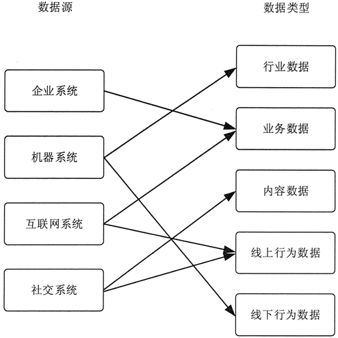
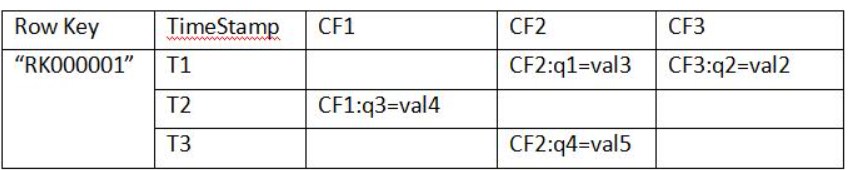
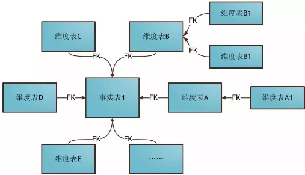
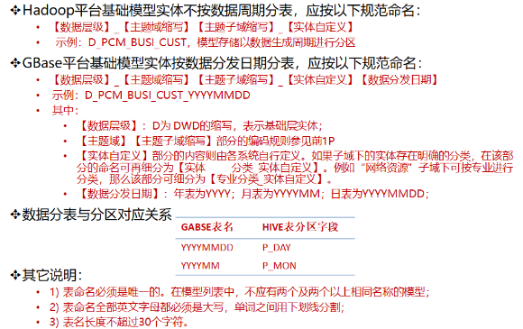

#### 大数据

##### 大数据采集

在大数据体系中，传统数据分为业务数据和行业数据，传统数据体系中没有考虑过的新数据源包括内容数据、线上行为数据和线下行为数据 3 大类。在传统数据体系和新数据体系中，数据共分为以下 5 种。

1. 业务数据：消费者数据、客户关系数据、库存数据、账目数据等。
2. 行业数据：车流量数据、能耗数据、PM2.5数据等。
3. 内容数据：应用日志、电子文档、机器数据、语音数据、社交媒体数据等。
4. 线上行为数据：页面数据、交互数据、表单数据、会话数据、反馈数据等。
5. 线下行为数据：车辆位置和轨迹、用户位置和轨迹、动物位置和轨迹等。

大数据的主要来源如下

1. 企业系统：客户关系管理系统、企业资源计划系统、库存系统、销售系统等。
2. 机器系统：智能仪表、工业设备传感器、智能设备、视频监控系统等。
3. 互联网系统：电商系统、服务行业业务系统、政府监管系统等。
4. 社交系统：微信、QQ、微博、博客、新闻网站、朋友圈等。

在大数据体系中，数据源与数据类型的关系如图 1 所示。大数据系统从传统企业系统中获取相关的业务数据。 

 

大数据的采集是指利用多个数据库或存储系统来接收发自客户端的数据。

根据数据源的不同，大数据采集方法也不相同。但是为了能够满足大数据采集的需要，大数据采集时都使用了大数据的处理模式，即 MapReduce 分布式并行处理模式或基于内存的流式处理模式。针对 4 种不同的数据源，大数据采集方法有以下几大类。 

1. 数据库采集：企业通过在采集端部署大量数据库，并在这些数据库之间进行负载均衡和分片，来完成大数据采集工作
2. 系统日志采集：收集公司业务平台日常产生的大量日志数据，供离线和在线的大数据分析系统使用。高可用性、高可靠性、可扩展性是日志收集系统所具有的基本特征。系统日志采集工具均采用分布式架构，能够满足每秒数百 MB 的日志数据采集和传输需求。
3. 网络数据采集：指通过网络爬虫或网站公开 API 等方式从网站上获取数据信息的过程。
4. 感知设备数据采集：通过传感器、摄像头和其他智能终端自动采集信号、图片或录像来获取数据。

###### 日志采集

日志一般为流式数据，处理这些日志需要特定的日志系统，这些系统需要具有以下特征。 构建应用系统和分析系统的桥梁，并将它们之间的关联解耦。支持近实时的在线分析系统和分布式并发的离线分析系统。具有高可扩展性，也就是说，当数据量增加时，可以通过增加结点进行水平扩展。

Flume 支持在日志系统中定制各类数据发送方，用于收集数据，同时，Flume 提供对数据进行简单处理，并写到各种数据接收方的能力。Flume 的核心是把数据从数据源（Source）收集过来，再将收集到的数据送到指定的目的地（Smk）。为了保证输送的过程一定成功，在送到目的地之前，会先缓存数据到管道（Channel）,待数据真正到达目的地后，Flume 再删除缓存的数据，如图所示。

##### 预处理架构和方法

大数据预处理将数据划分为结构化数据和半结构化/非结构化数据，分别采用传统 ETL 工具和分布式并行处理框架来实现。总体架构如图所示。 

结构化数据可以存储在传统的关系型数据库中。关系型数据库在处理事务、及时响应、保证数据的一致性方面有天然的优势。非结构化数据可以存储在新型的分布式存储中，如HBase。分布式存储在系统的横向扩展性、存储成本、文件读取速度方面有着显著的优势。结构化数据和非结构化数据之间的数据可以按照数据处理的需求进行迁移。例如，为了进行快速并行处理，需要将传统关系型数据库中的结构化数据导入到分布式存储中。可以利用 Sqoop 等工具，先将关系型数据库的表结构导入分布式数据库，然后再向分布式数据库的表中导入结构化数据。 

数据清洗在汇聚多个维度、多个来源、多种结构的数据之后，对数据进行抽取、转换和集成加载。在以上过程中，除了更正、修复系统中的一些错误数据之外，更多的是对数据进行归并整理，并储存到新的存储介质中。其中，数据的质量至关重要。常见的数据质量问题可以根据数据源的多少和所属层次（定义层和实例层）分为 4 类。

1. 单数据源定义层：违背字段约束条件（例如，日期出现 9 月 31 日），字段属性依赖冲突（例如，两条记录描述同一个人的某一个属性，但数值不一致），违反唯一性（同一个主键 ID 出现了多次）等。
2. 单数据源实例层：单个属性值含有过多信息，拼写错误，存在空白值，存在噪音数据，数据重复，数据过时等；
3. 多数据源定义层：同一个实体的不同称呼（如 custom_id、custom_num），同一种属性的不同定义（例如，字段长度定义不一致，字段类型不一致等）；
4. 多数据源实例层：数据的维度、粒度不一致（例如，有的按 GB 记录存储量，有的按 TB 记录存储量；有的按照年度统计，有的按照月份统计），数据重复，拼写错误等。

噪声数据是指数据中存在着错误或异常（偏离期望值）的数据，不完整数据是指感兴趣的属性没有值，而不一致数据则是指数据内涵出现不一致情况。数据清洗是指消除数据中存在的噪声及纠正其不一致的错误。数据集成是指将来自多个数据源的数据合并到一起构成一个完整的数据集。数据转换是指将一种格式的数据转换为另一种格式的数据。数据消减是指通过删除冗余特征或聚类消除多余数据。

数据清洗的处理过程通常包括填补遗漏的数据值，平滑有噪声数据，识别或除去异常值，以及解决不一致问题。有问题的数据将会误导数据挖掘的搜索过程。

数据集成就是将来自多个数据源的数据合并到一起。由于描述同一个概念的属性在不同数据库中有时会取不同的名字，所以在进行数据集成时就常常会引起数据的不一致或冗余。

数据转换主要是对数据进行规格化操作。在正式进行数据挖掘之前，尤其是使用基于对象距离的挖掘算法时，如神经网络、最近邻分类等，必须进行数据规格化，也就是将其缩至特定的范围之内

数据消减的目的就是缩小所挖掘数据的规模，但却不会影响（或基本不影响）最终的挖掘结果。

模式集成问题就是如何使来自多个数据源的现实世界的实体相互匹配，这其中就涉及实体识别问题。

###### 数据消减

数据消减技术的主要目的就是从原有巨大数据集中获得一个精简的数据集，并使这一精简数据集保持原有数据集的完整性。这样在精简数据集上进行数据挖掘就会提高效率，并且能够保证挖掘出来的结果与使用原有数据集所获得的结果基本相同。

| 名称                 | 说明                                                         |
| -------------------- | ------------------------------------------------------------ |
| 数据立方合计         | 这类合计操作主要用于构造数据立方（数据仓库操作）。           |
| 维数消减             | 主要用于检测和消除无关、弱相关，或冗余的属性或维（数据仓库中属性）。 |
| 数据压缩             | 利用编码技术压缩数据集的大小。                               |
| 数据块消减           | 利用更简单的数据表达形式，如参数模型、非参数模型（聚类、采样、直方图等），来取代原有的数据。 |
| 离散化与概念层次生成 | 所谓离散化就是利用取值范围或更高层次概念来替换初始数据。利用概念层次可以帮助挖掘不同抽象层次的模式知识。 |

##### Google大数据处理系统

###### GFS

GFS 的系统架构主要由一个 Master Server（主服务器）和多个 Chunk Server（数据块服务器）组成。Master Server 主要负责维护系统中的名字空间，访问控制信息，从文件到块的映射及块的当前位置等元数据，并与 Chunk Server 通信。Chunk Server 负责具体的存储工作。数据以文件的形式存储在 Chunk Server 上。Client 是应用程序访问 GFS 的接口。 Master Server 的所有信息都存储在内存里，启动时信息从 Chunk Server 中获取。这样不但提高了 Master Server 的性能和吞吐量，也有利于 Master Server 宕机后把后备服务器切换成 Master Server。

###### MapReduce

MapReduce 则是为了解决如何从这些海量数据中快速计算并获取期望结果的问题。MapReduce 实现了 Map 和 Reduce 两个功能。Map 把一个函数应用于集合中的所有成员，然后返回一个基于这个处理的结果集，而 Reduce 是把两个或更多个 Map 通过多个线程、进程或者独立系统进行并行执行处理得到的结果集进行分类和归纳。用户只需要提供自己的 Map 函数及 Reduce 函数就可以在集群上进行大规模的分布式数据处理。这一编程环境能够使程序设计人员编写大规模的并行应用程序时不用考虑集群的并发性、分布性、可靠性和可扩展性等问题。应用程序编写人员只需要将精力放在应用程序本身，关于集群的处理问题则交由平台来完成。

###### BigTable

BigTable 是 Google 设计的分布式数据存储系统，是用来处理海量数据的一种非关系型数据库。BigTable 是一个稀疏的、分布式的、持久化存储的多维度排序的映射表。

##### Hadoop大数据处理框架

###### HDFS

文件系统是操作系统提供的磁盘空间管理服务，该服务只需要用户指定文件的存储位置及文件读取路径，而不需要用户了解文件在磁盘上是如何存放的。

布式文件系统存在多个问题

1. 各个存储结点的负载不均衡，单机负载可能极高。例如，如果某个文件是热门文件，则会有很多用户经常读取这个文件，这就会造成该文件所在机器的访问压力极高。
2. 数据可靠性低。如果某个文件所在的机器出现故障，那么这个文件就不能访问了，甚至会造成数据的丢失。
3. 文件管理困难。如果想把一些文件的存储位置进行调整，就需要查看目标机器的空间是否够用，并且需要管理员维护文件位置，在机器非常多的情况下，这种操作就极为复杂。

例如，用户访问 HDFS 中的 /a/b/c.mpg 这个文件时，HDFS 负责从底层的相应服务器中读取该文件，然后返回给用户，这样用户就只需和 HDFS 打交道，而不用关心这个文件是如何存储的。为了解决存储结点负载不均衡的问题，HDFS 首先把一个文件分割成多个块，然后再把这些文件块存储在不同服务器上。这种方式的优势就是不怕文件太大，并且读文件的压力不会全部集中在一台服务器上，从而可以避免某个热点文件会带来的单机负载过高的问题。为了保证文件的可靠性，HDFS 会把每个文件块进行多个备份，一般情况下是 3 个备份。假如要在由服务器 A、B、C 和 D 的存储结点组成的 HDFS 上存储文件 /a/b/xxx.avi，则 HDFS 会把文件分成 4 块，分别为块 1、块 2、块 3 和块 4。为了保证文件的可靠性，HDFS 会把数据块按以下方式存储到 4 台服务器上，如图 3 所示。 

为了管理文件，HDFS 需要记录维护一些元数据，也就是关于文件数据信息的数据，如 HDFS 中存了哪些文件，文件被分成了哪些块，每个块被放在哪台服务器上等。HDFS 把这些元数据抽象为一个目录树，来记录这些复杂的对应关系。这些元数据由一个单独的模块进行管理，这个模块叫作名称结点（NameNode）。存放文件块的真实服务器叫作数据结点（DataNode）。 

###### HBase

Hadoop 是一个高容错、高延时的分布式文件系统和高并发的批处理系统，不适用于提供实时计算，而 HBase 是可以提供实时计算的分布式数据库，数据被保存在 HDFS (分布式文件系统）上，由 HDFS 保证其高容错性。HBase 上的数据是以二进制流的形式存储在 HDFS 上的数据块中的，但是，HBase 上的存储数据对于 HDFS 是透明的。HBase 可以直接使用本地文件系统，也可以使用 Hadoop 的 HDFS。HBase 中保存的数据可以使用 MapReduce 来处理，它将数据存储和并行计算有机地结合在一起。

Hadoop HDFS作为其文件存储系统,利用Hadoop MapReduce来处理 HBase中的海量数据,利用Zookeeper作为其分布式协同服务主要用来存储非结构化和半结构化的松散数据

Row Key: 决定一行数据的唯一标识；RowKey是按照字典顺序排序的；Row key最多只能存储64k的字节数据。
Column Family列族（CF1、CF2、CF3） & qualifier列：HBase表中的每个列都归属于某个列族，列族必须作为表模式(schema) 定义的一部分预先给出；列名以列族作为前缀，每个“列族”都可以有多个列成员；新的列族成员可以随后按需、动态加入；权限控制、存储以及调优都是在列族层面进行的；HBase把同一列族里面的数据存储在同一目录下，由几个文件保存。目前为止HBase的列族能能够很好处理最多不超过3个列族。
Timestamp时间戳：在HBase每个cell存储单元对同一份数据有多个版本，根据唯一的时间 戳来区分每个版本之间的差异，不同版本的数据按照时间倒序排序，最新的数据版本排在最前面。时间戳的类型是64位整型。时间戳可以由HBase(在数据写入时自动)赋值，此时时间戳是精确到毫秒的当前系统时间。
Cell单元格：由行和列的坐标交叉决定；单元格是有版本的（由时间戳来作为版本）； 单元格的内容是未解析的字节数组（Byte[]），cell中的数据是没有类型的，全部是字节码形式存贮。由`{row key，column(=<family> +<qualifier>)，version}`唯一确定的单元。

HBase 表中的所有行都是按照行键的字典序排列的。因为一张表中包含的行的数量非常多，有时候会高达几亿行，所以需要分布存储到多台服务器上。因此，当一张表的行太多的时候，HBase 就会根据行键的值对表中的行进行分区，每个行区间构成一个“分区（Region）”，包含了位于某个值域区间内的所有数据。Region 是按大小分割的，每个表一开始只有二个 Region，随着数据不断插入到表中，Region 不断增大，当增大到一个阈值的时候，Region 就会等分为两个新的 Region。当表中的行不断增多时，就会有越来越多的 Region。Region 是 HBase 中数据分发和负载均衡的最小单元，默认大小是 100MB 到 200MB。不同的 Region 可以分布在不同的 Region Server 上，但一个 Region 不会拆分到多个 Region Server 上。每个 Region Server 负责管理一个 Region 集合。

在分布式的生产环境中，HBase 需要运行在 HDFS 之上，以 HDFS 作为其基础的存储设施。HBase 的集群主要由 Master、Region Server 和 Zookeeper 组成

Master 主要负责表和 Region 的管理工作。表的管理工作主要是负责完成增加表、删除表、修改表和查询表等操作。Region 的管理工作更复杂一些，Master 需要负责分配 Region 给 Region Server，协调多个 Region Server，检测各个 Region Server 的状态，并平衡 Region Server 之间的负载。当 Region 分裂或合并之后，Master 负责重新调整 Region 的布局。如果某个 Region Server 发生故障，Master 需要负责把故障 Region Server 上的 Region 迁移到其他 Region Server 上。HBase 允许多个 Master 结点共存，但是这需要 Zookeeper 进行协调。当多个 Master 结点共存时，只有一个 Master 是提供服务的，其他的 Master 结点处于待命的状态。当正在工作的 Master 结点宕机时，其他的 Master 则会接管 HBase 的集群。

HBase 有许多个 Region Server，每个 Region Server 又包含多个 Region。Region Server 是 HBase 最核心的模块，负责维护 Master 分配给它的 Region 集合，并处理对这些 Region 的读写操作。Client 直接与 Region Server 连接，并经过通信获取 HBase 中的数据。HBase 釆用 HDFS 作为底层存储文件系统，Region Server 需要向 HDFS 写入数据，并利用 HDFS 提供可靠稳定的数据存储。Region Server 并不需要提供数据复制和维护数据副本的功能。

Zookeeper 的作用对 HBase 很重要。首先，Zookeeper 是 HBase Master 的高可用性（High Available，HA）解决方案。也就是说，Zookeeper 保证了至少有一个 HBase Master 处于运行状态。Zookeeper 同时负责 Region 和 Region Server 的注册。HBase 集群的 Master 是整个集群的管理者，它必须知道每个 Region Server 的状态。HBase 就是使用 Zookeeper 来管理 Region Server 状态的。每个 Region Server 都向 Zookeeper 注册，由 Zookeeper 实时监控每个 Region Server 的状态，并通知给 Master。这样，Master 就可以通过 Zookeeper 随时感知各个 Region Server 的工作状态。

### 数据仓库

数据仓库是一个面向主题的、集成的、相对稳定的、反映历史变化的数据集合，它用于支持企业或组织的决策分析处理。

传统的离线 Batch SQL有三种基础的实现方式，分别是 Nested-loop Join、Sort-Merge Join 和 Hash Join。Nested-loop Join 最为简单直接，将两个数据集加载到内存，并用内嵌遍历的方式来逐个比较两个数据集内的元素是否符合 Join 条件。Nested-loop Join 虽然时间效率以及空间效率都是最低的，但胜在比较灵活适用范围广，因此其变体 BNL 常被传统数据库用作为 Join 的默认基础选项。Sort-Merge Join 顾名思义，分为两个 Sort 和 Merge 阶段。首先将两个数据集进行分别排序，然后对两个有序数据集分别进行遍历和匹配，类似于归并排序的合并。值得注意的是，Sort-Merge 只适用于 Equi-Join（Join 条件均使用等于作为比较算子）。Sort-Merge Join 要求对两个数据集进行排序，成本很高，通常作为输入本就是有序数据集的情况下的优化方案。Hash Join 同样分为两个阶段，首先将一个数据集转换为 Hash Table，然后遍历另外一个数据集元素并与 Hash Table 内的元素进行匹配。第一阶段和第一个数据集分别称为 build 阶段和 build table，第二个阶段和第二个数据集分别称为 probe 阶段和 probe table。Hash Join 效率较高但对空间要求较大，通常是作为 Join 其中一个表为适合放入内存的小表的情况下的优化方案。和 Sort-Merge Join 类似，Hash Join 也只适用于 Equi-Join。

#### 数据模型

数据模型就是数据组织和存储方法，它强调从业务、数据存取和使用角度合理存储数据。只有数据模型将数据有序的组织和存储起来之后，大数据才能得到高性能、低成本、高效率、高质量的使用。

- 性能：帮助我们快速查询所需要的数据，减少数据的I/O吞吐，提高使用数据的效率，如宽表。

- 成本：极大地减少不必要的数据冗余，也能实现计算结果复用，极大地降低存储和计算成本。

-  效率：在业务或系统发生变化时，可以保持稳定或很容易扩展，提高数据稳定性和连续性。

- 质量：良好的数据模型能改善数据统计口径的不一致性，减少数据计算错误的可能性。

数据模型能够促进业务与技术进行有效沟通，形成对主要业务定义和术语的统一认识，具有跨部门、中性的特征，可以表达和涵盖所有的业务。大数据系统需要数据模型方法来帮助更好地组织和存储数据，以便在性能、成本、效率和质量之间取得最佳平衡！

维度建模以分析决策的需求出发构建模型，构建的数据模型为分析需求服务，因此它重点解决用户如何更快速完成分析需求，同时还有较好的大规模复杂查询的响应性能。它是面向分析的，为了提高查询性能可以增加数据冗余，反规范化的设计技术。事实表产生于业务过程，存储了业务活动或事件提炼出来的性能度量。从最低的粒度级别来看，事实表行对应一个度量事件。事实表根据粒度的角色划分不同，可分为事务事实表、周期快照事实表、累积快照事实表。

- 事务事实表，用于承载事务数据，通常粒度比较低，它是面向事务的，其粒度是每一行对应一个事务，它是最细粒度的事实表，例如产品交易事务事实、ATM交易事务事实。

- 周期快照b事实表，按照一定的时间周期间隔(每天，每月)来捕捉业务活动的执行情况，一旦装入事实表就不会再去更新，它是事务事实表的补充。用来记录有规律的、固定时间间隔的业务累计数据，通常粒度比较高，例如账户月平均余额事实表。

- 累积快照事实表，用来记录具有时间跨度的业务处理过程的整个过程的信息，每个生命周期一行，通常这类事实表比较少见。

维度表，一致性维度，业务过程的发生或分析角度，我们主要关注下退化维度和缓慢变化维。

退化维度：在维度类型中，有一种重要的维度称作为退化维度，亦维度退化一说。这种维度指的是直接把一些简单的维度放在事实表中。退化维度是维度建模领域中的一个非常重要的概念，它对理解维度建模有着非常重要的作用，退化维度一般在分析中可以用来做分组使用。

缓慢变化维：维度的属性并不是始终不变的，它会随着时间的流逝发生缓慢的变化，这种随时间发生变化的维度我们一般称之为缓慢变化维。

##### 分层设计

数据仓库一般要进行分层的设计，其能带来五大好处：

- 清晰数据结构：每一个数据分层都有它的作用域，这样我们在使用表的时候能更方便地定位和理解。

- 数据血缘追踪：能够快速准确地定位到问题，并清楚它的危害范围。

- 减少重复开发：规范数据分层，开发一些通用的中间层数据，能够减少极大的重复计算。

- 把复杂问题简单化：将复杂的任务分解成多个步骤来完成，每一层只处理单一的步骤，比较简单和容易理解。当数据出现问题之后，不用修复所有的数据，只需要从有问题的步骤开始修复。

- 屏蔽原始数据的异常：不必改一次业务就需要重新接入数据。

以下是我们的一种分层设计方法，数据缓冲区的数据结构与源系统完全一致。基础数据模型和融合数据模型是大数据平台重点建设的数据模型。应用层模型由各应用按需自行建设，其中基础数据模型一般采用ER模型，融合数据模型采用维度建模思路。

数据仓库标准上可以分为四层：ODS、PDW、DM、APP。
ODS层：为临时存储层，是接口数据的临时存储区域，为后一步的数据处理做准备。一般来说ODS层的数据和源系统的数据是同构的，主要目的是简化后续数据加工处理的工作。从数据粒度上来说ODS层的数据粒度是最细的。ODS层的表通常包括两类，一个用于存储当前需要加载的数据，一个用于存储处理完后的历史数据。历史数据一般保存3-6个月后需要清除，以节省空间。但不同的项目要区别对待，如果源系统的数据量不大，可以保留更长的时间，甚至全量保存；

PDW层：为数据仓库层，PDW层的数据应该是一致的、准确的、干净的数据，即对源系统数据进行了清洗后的数据。这一层的数据一般是遵循数据库第三范式的，其数据粒度通常和ODS的粒度相同。在PDW层会保存BI系统中所有的历史数据。

DM层：为数据集市层，这层数据是面向主题来组织数据的，通常是星形或雪花结构的数据。从数据粒度来说，这层的数据是轻度汇总级的数据，已经不存在明细数据了。从数据的时间跨度来说，通常是PDW层的一部分，主要的目的是为了满足用户分析的需求，而从分析的角度来说，用户通常只需要分析近几年的即可。从数据的广度来说，仍然覆盖了所有业务数据。

APP层：为应用层，这层数据是完全为了满足具体的分析需求而构建的数据，也是星形或雪花结构的数据。从数据粒度来说是高度汇总的数据。从数据的广度来说，则并不一定会覆盖所有业务数据，而是DM层数据的一个真子集，从某种意义上来说是DM层数据的一个重复。从极端情况来说，可以为每一张报表在APP层构建一个模型来支持，达到以空间换时间的目的数据仓库的标准分层只是一个建议性质的标准，实际实施时需要根据实际情况确定数据仓库的分层，不同类型的数据也可能采取不同的分层方法。

元数据的定义：数据仓库的元数据是关于数据仓库中数据的数据。它的作用类似于数据库管理系统的数据字典，保存了逻辑数据结构、文件、地址和索引等信息。广义上讲，在数据仓库中，元数据描述了数据仓库内数据的结构和建立方法的数据。

 元数据是数据仓库管理系统的重要组成部分，元数据管理器是企业级数据仓库中的关键组件，贯穿数据仓库构建的整个过程，直接影响着数据仓库的构建、使用和维护。

构建数据仓库的主要步骤之一是ETL。这时元数据将发挥重要的作用，它定义了源数据系统到数据仓库的映射、数据转换的规则、数据仓库的逻辑结构、数据更新的规则、数据导入历史记录以及装载周期等相关内容。数据抽取和转换的专家以及数据仓库管理员正是通过元数据高效地构建数据仓库。

用户在使用数据仓库时，通过元数据访问数据，明确数据项的含义以及定制报表。

数据仓库的规模及其复杂性离不开正确的元数据管理，包括增加或移除外部数据源，改变数据清洗方法，控制出错的查询以及安排备份等。

 元数据可分为技术元数据和业务元数据。技术元数据为开发和管理数据仓库的IT 人员使用，它描述了与数据仓库开发、管理和维护相关的数据，包括数据源信息、数据转换描述、数据仓库模型、数据清洗与更新规则、数据映射和访问权限等。而业务元数据为管理层和业务分析人员服务，从业务角度描述数据，包括商务术语、数据仓库中有什么数据、数据的位置和数据的可用性等，帮助业务人员更好地理解数据仓库中哪些数据是可用的以及如何使用。

##### 数据仓库建模方法

###### 维度建模

维度建模以分析决策的需求出发构建模型，构建的数据模型为分析需求服务，因此它重点解决用户如何更快速完成分析需求，同时还有较好的大规模复杂查询的响应性能，更直接面向业务。

维度表：表示对分析主题所属类型的描述。事实表：表示对分析主题的度量。

星型模型主要是维表和事实表，以事实表为中心，所有维度直接关联在事实表上，呈星型分布。 维表只和事实表关联，维表之间没有关联；每个维表的主码为单列，且该主码放置在事实表中，作为两边连接的外码；以事实表为核心，维表围绕核心呈星形分布；

雪花模型，在星型模型的基础上，维度表上又关联了其他维度表。这种模型维护成本高，性能方面也较差，所以一般不建议使用。

星座模型，是对星型模型的扩展延伸，多张事实表共享维度表。数仓模型建设后期，大部分维度建模都是星座模型。

###### 关系建模

范式建模：从全企业的高度设计一个3NF模型的方法，用实体加关系描述的数据模型描述企业业务架构，在范式理论上符合3NF，站在企业角度面向主题的抽象，而不是针对某个具体业务流程的实体对象关系抽象。

第一范式：原子性，列不可再分，每一列只包含一个属性，所有属性的类型都是一样的，而不能是集合，数组，记录等非原子数据项，即实体中的某个属性有多个值时，必须拆分为不同的属性。这是所有关系型数据库的最基本要求；

第二范式：唯一性，一个表只说明一个事物，要求表中的所有列，都必须依赖于主键，而不能有任何一列与主键没有关系，也就是说一个表只描述一件事情；

函数依赖：若在一张表中，在属性（或属性组）X的值确定的情况下，必定能确定属性Y的值，那么就可以说Y函数依赖于X，写作 X--->Y。简单说就是，在数据表中，不存在任意两条记录，它们在X属性（或属性组）上的值相同，而在Y属性上的值不同。
完全函数依赖：在一张表中，若 X--->Y，且对于 X 的任何一个真子集（假如属性组 X 包含超过一个属性的话），X ’ --->Y 不成立，那么我们称 Y 对于 X 完全函数依赖，记作 X F--->Y。
部分函数依赖：Y函数依赖于X，但同时Y并不完全函数依赖于X，那么我们就称Y部分函数依赖于X，记作 X P--->Y。
码：设K为某表中的一个属性或属性组，若除K之外的所有属性都完全函数依赖于K，那么我们称K为候选码，简称为码。在实际中我们通常可以理解为：假如当K确定的情况下，该表除K之外的所有属性的值也就随之确定，那么K就是码。一张表中可以有超过一个码。
非主属性：包含在任何一个码中的属性成为主属性，举个例子，假设公民表中的字段（身份证号、姓名、联系方式，联系内容），主属性有两个身份证号、联系方式。
判断符合第二范式要求的方法
根据2NF的定义，判断的依据实际上就是看数据表中是否存在非主属性对于码的部分函数依赖。若存在，则数据表最高只符合1NF的要求，若不存在，则符合2NF的要求。判断的方法是：

- 找出数据表中所有的码
- 根据第一步所得到的码，找出所有的主属性
- 数据表中，除去所有的主属性，剩下的就都是非主属性了
- 查看是否存在非主属性对码的部分函数依赖

第三范式：每列都与主键有直接关系，属性不能传递依赖于主属性。3NF在2NF的基础之上，消除了非主属性对于码的传递函数依赖。也就是说， 如果存在非主属性对于码的传递函数依赖，则不符合3NF的要求。

符合第三范式的关系必须具有以下三个条件：

- 每个属性的值唯一，不具有多义性
- 每个非主属性必须完全依赖于整个主键，而非主键的一部分
- 每个非主属性不能依赖于其他关系中的属性，因为这样的话，这种属性应该归到其他关系中去。

###### ER关系模型

ER图转关系模型：系表（系号、主管教师号）、教师表（教师号、系号、聘期）、学生表（学号、系号、辅导教室号）、任课表（课程号、教师号、教材）、选修课表（课程号、学号）

数据仓库建模的任何实体都需要标准化命名，否则未来的管理成本巨大，也是后续数据有效治理的基础，以下是我们的一个命名规范示例：

##### 数据仓库建模体系

###### 规范化数据仓库

 规范化数据仓库顾名思义，其中是规范化设计的分析型数据库，然后基于这个数据库为各部门建立数据集市。  该建模体系首先对ETL得到的数据进行ER建模，关系建模，得到一个规范化的数据库模式。然后用这个中心数据库为公司各部门建立基于维度建模的数据集市。各部门开发人员大都从这些数据集市提数，通常来说不允许直接访问中心数据库。

###### 维度建模数据仓库

 非维度建模数据仓库是一种使用交错维度进行建模的数据仓库， 该建模体系首先设计一组常用的度集合，然后创建一个大星座模型表示所有分析型数据。如果这种一致维度不满足某些数据分析要求，自然也可在数据仓库之上继续构建新的数据集市。

###### 对立数据集市

 独立数据集市的建模体系是让公司的各个组织自己创建并完成ETL，自己维护自己的数据集市。

##### 数据应用

操作型处理，叫联机事务处理OLTP，也可以称面向交易的处理系统，它是针对具体业务在数据库联机的日常操作，通常对少数记录进行查询、修改。用户较为关心操作的响应时间、数据的安全性、完整性和并发支持的用户数等问题。传统的数据库系统作为数据管理的主要手段，主要用于操作型处理。
分析型处理，叫联机分析处理OLAP一般针对某些主题的历史数据进行分析，支持管理决策

`OLAP`的多维分析操作包括：钻取、上卷、切片、切块以及旋转。

`OLAP`按存储器的数据存储格式分为ROLAP、MOLAP和 HOLAP。
MOLAP，基于多维数组的存储模型，也是OLAP最初的形态，特点是对数据进行预计算，以空间换效率，明细和聚合数据都保存在cube中。但生成cube需要大量时间和空间。
ROLAP，完全基于关系模型进行存储数据，不需要预计算，按需即时查询。明细和汇总数据都保存在关系型数据库事实表中。
HOLAP，混合模型，细节数据以ROLAP存放，聚合数据以MOLAP存放。这种方式相对灵活，且更加高效。可按企业业务场景和数据粒度进行取舍，没有最好，只有最适合。

 