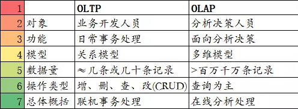
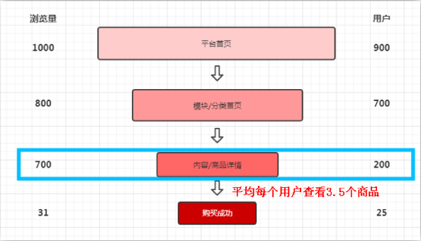
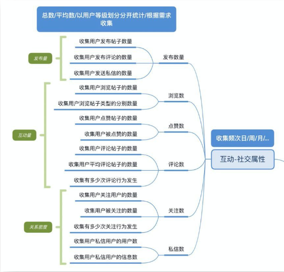
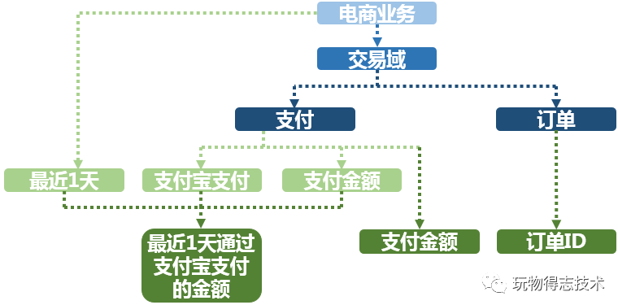
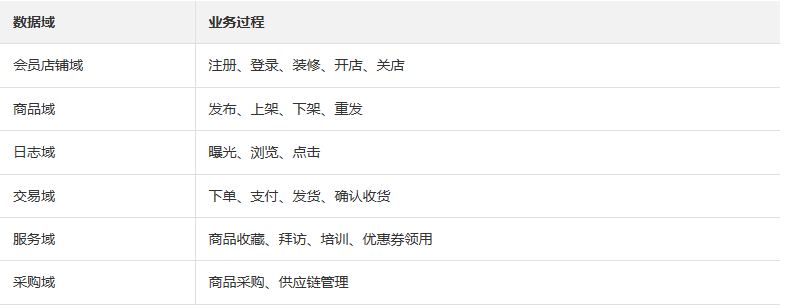
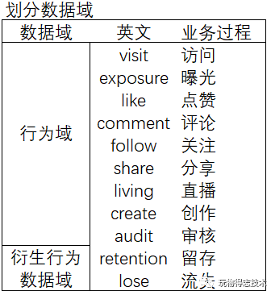
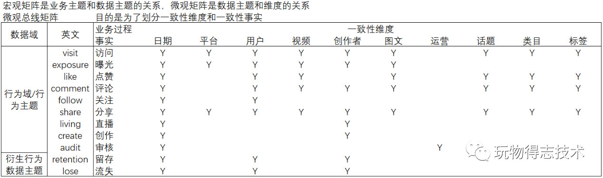
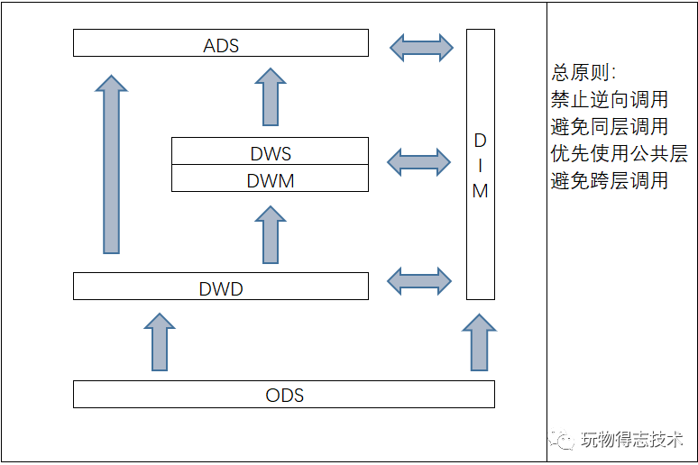

##### 数据应用

操作型处理，叫联机事务处理OLTP，也可以称面向交易的处理系统，它是针对具体业务在数据库联机的日常操作，通常对少数记录进行查询、修改。用户较为关心操作的响应时间、数据的安全性、完整性和并发支持的用户数等问题。传统的数据库系统作为数据管理的主要手段，主要用于操作型处理。
分析型处理，叫联机分析处理OLAP一般针对某些主题的历史数据进行分析，支持管理决策

`OLAP`的多维分析操作包括：钻取、上卷、切片、切块以及旋转。

`OLAP`按存储器的数据存储格式分为ROLAP、MOLAP和 HOLAP。

- 多维OLAP，传统的OLAP分析方式，数据存储在多维数据集中

- 关系OLAP，以关系数据库为核心，以关系型结构进行多维数据的表示，通过SQL的where条件以呈现传统OLAP的切片、切块功能
- 混合OLAP，将MOLAP和ROLPA的优势结合起来，以获得更快的性能

###### 多维OLAP

处理流程：对原始数据做数据预处理，预处理后的数据存至数据仓库， 用户的请求通过OLAP server查询数据仓库中的数据。

MOLAP的优点和缺点都来自于其数据预处理环节。数据预处理，将原始数据按照指定的计算规则预先做聚合计算，这样避免了查询过程中出现大量的临时计算，提升了查询性能，同时也为很多复杂的计算提供了支持。但是这样的预聚合处理，需要预先定义维度，会限制后期数据查询的灵活性；如果查询工作涉及新的指标，需要重新增加预处理流程，损失了灵活度，存储成本也很高；同时，这种方式不支持明细数据的查询。

###### ROLAP

处理流程：用户的请求直接发送给OLAP server；OLAP serve将用户的请求转换成关系型操作算子：①通过SCAN扫描原始数据，②在原始数据基础上做过滤、聚合、关联等处理；将计算结果返回给用户

ROLAP不需要进行数据预处理，因此查询灵活，可扩展性好。这类引擎使用MPP架构 ( 与Hadoop相似的大型并行处理架构，可以通过扩大并发来增加计算资源 )，可以高效处理大量数据。但是当数据量较大或query较为复杂时，查询性能也无法像MOLAP那样稳定。所有计算都是临时发生，因此会耗费更多的计算资源。

###### HOLAP

混合OLAP，是MOLAP和ROLAP的一种融合。当查询聚合性数据的时候，使用MOLAP技术；当查询明细数据时，使用ROLAP技术。在给定使用场景的前提下，以达到查询性能的最优化。

###### 分库分表

IO瓶颈：①磁盘读IO瓶颈，热点数据太多，数据库缓存放不下，每次查询时会产生大量的IO，降低查询速度 -> 分库和垂直分表；②网络IO瓶颈，请求的数据太多，网络带宽不够 -> 分库。

CPU瓶颈：①SQL问题，如SQL中包含join，group by，order by，非索引字段条件查询等，增加CPU运算的操作 -> SQL优化，建立合适的索引，在业务Service层进行业务计算。②单表数据量太大，查询时扫描的行太多，SQL效率低，CPU率先出现瓶颈 -> 水平分表。

**水平分库**：以字段为依据，按照一定策略（hash、range等），将一个库中的数据拆分到多个库中。库多了，io和cpu的压力自然可以成倍缓解。

结果：每个库的结构都一样；每个库的数据都不一样，没有交集；所有库的并集是全量数据；

场景：系统绝对并发量上来了，分表难以根本上解决问题，并且还没有明显的业务归属来垂直分库。

**水平分表**：以字段为依据，按照一定策略（hash、range等），将一个表中的数据拆分到多个表中。表的数据量少了，单次SQL执行效率高，自然减轻了CPU的负担。

结果：每个表的结构都一样；每个表的数据都不一样，没有交集；所有表的并集是全量数据；

场景：系统绝对并发量并没有上来，只是单表的数据量太多，影响了SQL效率，加重了CPU负担，以至于成为瓶颈。

**垂直分库**：以表为依据，按照业务归属不同，将不同的表拆分到不同的库中。到这一步，基本上就可以服务化了。例如，随着业务的发展一些公用的配置表、字典表等越来越多，这时可以将这些表拆到单独的库中，甚至可以服务化。再有，随着业务的发展孵化出了一套业务模式，这时可以将相关的表拆到单独的库中，甚至可以服务化。

结果：每个库的结构都不一样；每个库的数据也不一样，没有交集；所有库的并集是全量数据；

场景：系统绝对并发量上来了，并且可以抽象出单独的业务模块。

**垂直分表**：以字段为依据，按照字段的活跃性，将表中字段拆到不同的表（主表和扩展表）中。可以用列表页和详情页来帮助理解。垂直分表的拆分原则是将热点数据（可能会冗余经常一起查询的数据）放在一起作为主表，非热点数据放在一起作为扩展表。这样更多的热点数据就能被缓存下来，进而减少了随机读IO。拆了之后，要想获得全部数据就需要关联两个表来取数据。

结果：每个表的结构都不一样；每个表的数据也不一样，一般来说，每个表的字段至少有一列交集，一般是主键，用于关联数据；所有表的并集是全量数据；

场景：系统绝对并发量并没有上来，表的记录并不多，但是字段多，并且热点数据和非热点数据在一起，单行数据所需的存储空间较大。以至于数据库缓存的数据行减少，查询时会去读磁盘数据产生大量的随机读IO，产生IO瓶颈。

##### 数据分析指南

数据指标定义了你数据分析目的（数据分析往往是为了提升某个数据指标或降低某个数据指标，发现潜藏问题、寻找潜藏机会），而数据收集则给数据分析提供了基础。

数据指标：对当前业务有参考价值的可统计数据。数据指标对于产品而言就是说什么数据能衡量你们业务的好坏？什么数据对于你们产品是十分重要的？比如用户数、订单数、销售额、浏览数。数据指标可能有一个或多个没有固定约束，依据业务需求定义。

###### 定义指标的方法

1. 确认模块或产品特性：确认与模块特性相关的关键指标。市面上的产品或功能基本能用以下几个模块进行划分，大家在使用时可进行相似归类，套用这个模版。

内容：内容类型产品主要关注用户使用时长和频次。
常用指标：浏览数、浏览时长、内容互动情况（弹幕、评论、点赞）

社交：社交类型产品主要关注用户与用户之间的关系密度（紧密、多少）、和用户活跃程度。
常用指标：发布量（社区使用）、互动量、关系密度（关注用户数、发送消息数）

工具：工具类型产品主要关注用户使用频次和使用完成度。
常用指标：使用量、频次、流程达成率（目标产品的用户流程较为简单，查看用户是否完成整个流程）

交易：交易类型产品主要关注用户交易规模和整个交易流程的转化率。
常用流程：详情页转化率（核心场景转化率）、金额（总交易规模）、客单价、复购率

2. 确认核心业务：确认体现核心业务健康程度的指标。其实上面的指标定义方法可以涵盖大多部分使用场景，但是如果你是为你们平台制定一个总指标的时候，那就需要用核心业务确认总指标。确认核心业务的方法：平台靠什么盈利。

###### 数据收集方法

数据收集主要是需要开发同学来进行埋点，我们需要定义埋在哪里。定义数据埋点我梳理了有以下两种方法：一种基于业务流程，一种基于功能被使用的情况，根据业务需求选择即可。

1. 以业务流程进行埋点，就是梳理业务流程，再统计各流程的数据。这种埋点方式可以发现用户前后的两个环节是否有巨大断层，或者远低或远高于行业水平，从而优化各个环节的转化率（其实就是漏斗）。

适用场景：页面层级清晰有明确的业务流程，每个页面有明确的业务目标（下单、支付）。使用方法：梳理业务流程后在各个页面或各个行为进行埋点即可。做漏斗的时候，记住用户行为一定是有连贯性的、有顺序的、有时间限制的，基于用户还是事件要想清楚。    

中间就是根据业务流程梳理的需要统计的页面。左边是根据事件进行埋点得到的数据，右边为真实用户数据（去重后），就是告诉一下大家基于用户/事件得到的数据是不同的。当然事件和用户可以都进行统计，这样可以算出其他的一些数据，比如用户平均浏览多少个商品、平均浏览多少个分类、购买成功页面有多少用户进行分享。

2. 以功能模块拆解进行埋点。功能模块拆解，你们也可以理解为对对应数据指标的细化。以社交模块为例，直接通过脑图的方式进行说明，这种埋点方式可以体现功能模块的健康程度。

收集数据时如数据有明显的周期性则以该周期作为单位进行收集和比较。如某应用周末用户活跃度明显上升，则建议以周为单位进行收集。与往期数据对比时，建议同比上一周的数据或本周六的数据同比上周六的数据，这样可减少数据之间的干扰性。

#### 数据指标

##### 目的

通过指标体系监测业务发展的状况，最大的价值就是高效利用时间，把时间花在解决问题上，而不是寻找问题上，从而提高整体的人效。数据指标常用于评价产品业务的好坏，通过对数据指标的拆解能够得出产品、策略、运营等各方面目前存在的问题，从而得出优化方向。非体系化的指标通常是单点分析，无法串联更多关联指标进行全局的分析评估，而体系化的指标则可以综合不同的指标不同的维度串联起来进行全面的分析，会更快的发现目前产品和业务流程存在的问题。

指标体系的输出结果应当是一份指标字典和对应的Dashboard展示，需要至少满足以下要求：

- 成体系化的指标监控系统，能够从多维度了解业务发展的现状
- 在业务发展出现问题时能够快速定位问题所在
- 高效地为团队提供数据支持

##### 指标类型及命名

在构建指标体系的过程中，首要动作就是明确指标的分类以及约束指标命名方式，使各个指标能够做到见名知意、减少沟通成本，这里我们按照阿里对指标的划分规范指标命名：

指标分为原子指标和派生指标。

原子指标是基于某一业务事件行为下的度量，是业务定义中不可再拆分的指标，是具有明确业务含义的名词 ，体现明确的业务统计口径和计算逻辑，例如支付金额。

- 原子指标=业务过程+度量
- 派生指标=时间周期+修饰词+原子指标，派生指标可以理解为对原子指标业务统计范围的圈定。

业务板块：比数据域更高维度的业务划分方法，适用于特别庞大的业务系统。

业务过程：指企业的业务活动事件，如下单、支付、退款都是业务过程，请注意，业务过程是一个不可拆分的行为事件，通俗的讲，业务过程就是企业活动中的事件。

修饰类型：是对修饰词的一种抽象划分。修饰类型从属于某个业务域，如日志域的访问终端类型涵盖无线端、PC端等修饰词。

修饰词：指出了统计维度以外指标的业务场景限定抽象，修饰词隶属于一种修饰类型，如果在日志域的访问终端类型下，有修饰词PC端、无线端等。

时间周期：用来明确数据统计的时间范围或者时间点，如最近30天、自然周、截至当日等。

度量/原子指标：原子指标和度量含义相同，基于某一业务事件行为下的度量，是业务定义中不可再拆分的指标，具有明确业务含义的名词，通常是业务过程+度量组合而成，如支付金额。

维度：维度是度量的环境，用来反映业务的一类属性，这类属性的集合构成一个维度，也可以成为实体对象。维度属于一个数据域，如地理纬度、时间维度。例如， 在分析交易过程时，可以通过买家、卖家、商品和时间等维度描述交易发生的环境。

派生指标：派生指标=一个原子指标+多个修饰词（可选）+时间周期。可以理解为对原子指标业务统计范围的圈定。如原子指标：支付金额，最近一天海外买家支付金额则为派生指标（最近1天为时间周期，海外为修饰词，买家作为维度，而不作为修饰词）

结果性指标和过程性指标

结果性指标，比如电商场景下的 GMV 或订单量，它通常是业务漏斗的底部，是一个不可更改的、后验性的指标。

过程性指标，可以简单理解为我到达这个结果之前经过的路径，以及通过这个路径去衡量转化好坏的过程，它是可干预的，而且通常是“用户行为”。

在实际的业务运营过程中，不仅要关注结果性指标，更要关注过程性指标，通过优化过程性指标便能够更加有效的达成结果性指标。

核心指标应当是结果性指标，然后在核心指标的基础上拆解过程性指标并纵向划分层级，在此基础上再划分层级之间的关系，通过层次划分，最终实现我们需要的效果。

##### 指标体系搭建

搭建指标体系的时候，横向使用OSM模型，纵向进行三级指标分级。

###### 横向选择数据指标

选取数据指标是需要有方向性的，需要针对业务现状选取最能代表业务发展状态的指标，在这方面有成熟的模型可以参考，这里我们使用OSM模型来选取指标。

OSM模型分别代表业务目标、业务策略、业务度量。

O：用户使用产品的目标是什么？产品满足了用户的什么需求？业务的核心目标是什么？

S：为了达成上述目标采取的策略是什么？

M：这些策略随之带来的数据指标变化有哪些？

搭建指标体系的第一步，应该先明确产品的类型，明确业务究竟是什么，目标是什么。梳理出业务流程，形成一个指标体系框架。不同业务类型的产品会有不同的指标体系框架。例如电商类产品，指标框架可能涵盖：

 而o2o类产品，它的框架可能涵盖：(以下指标均可根据o2o业务类型，拆分买/卖家、司机/乘客 等多端) 

###### 纵向划分数据指标层级 

基于以上选择的数据指标，再对数据指标进行层级划分，划分指标层级能够帮助公司搭建一套完整的**数据监控指标体系**，从而及时发现业绩的升高或降低，以及产生的原因，节省花在寻找问题上的时间。

指标分级可以帮助我们更高效的去定位问题，去验证你的方法论，无需每次都要思考要去看哪些指标。

- 一级指标：**公司战略层面指标**，必须是全公司都认可的、衡量业绩的核心指标。它可以直接指引公司的战略目标，衡量公司的业务达成情况，本质上需要管理层和下级员工的双向理解、认同，且要易于沟通传达。比如公司的销售额，或者社交产品的活跃度。
- 二级指标：**业务策略层面指标**，二级指标是一级指标的路径指标，一级指标发生变化的时候，我们通过查看二级指标，能够快速定位问题的原因所在。比如uv、转化率、客单价，通过这三个指标可以快速定位销售额降低的原因。
- 三级指标：**业务执行层面指标**，三级指标是对二级指标的路径的拆解，即是二级指标的过程性指标。通过三级指标，可以高效定位二级指标波动的原因，并可以快速做出相应的动作。这一步会基于历史经验进行拆解，拆解时可以试着不断询问自己为了实现二级指标我需要做哪些事情？这些事对应的指标是什么？

根据以上原则拆分指标如下(指标都为日度汇总指标)：

##### 搭建数仓

 指标体系方案敲定后，就可开始着手整理底层数据的存储逻辑，明确每个字段要从哪里获取，每张表应该涵盖哪些指标哪些字段维度。这个过程可能会出现很多问题，例如1、想做的的指标没有埋点所以无法获取，2、有埋点但是数据未传 3、数据缺失、错误严重。我们需要整理出这些存在的问题并将问题归类，找到相应数据仓库、埋点研发负责的部门寻求配合，沟通存在的问题并商定问题的解决方案，明确协作的过程及责任划分，确认排期。这个过程中，建议每周将指标体系搭建项目做一次进度汇报，让相关部门及上级了解目前具体的项目进展，促进部门之间的配合，有利于项目正常进行。

搭建好了指标体系，已经梳理出了需要的指标，高效的计算出我们需要的指标就需要构建数仓，通过ETL过程对数据进行多维度计算汇总，再经由Bi产品可视化展现，最终产出我们需要的指标体系。并且这个数仓需要满足幂等性，即多次复核计算的结果都应该是相同的。

###### 划分数据域

数据仓库是面向主题的应用。数据仓库模型设计除横向的分层外，通常也需要根据业务情况进行纵向划分数据域。数据域是联系较为紧密的数据主题的集合，是业务对象高度概括的概念层次归类，目的是便于数据的管理和应用。

数据域是指面向业务分析，将业务过程或者维度进行抽象的集合。为保障整个体系的生命力，数据域需要抽象提炼，并长期维护更新。在划分数据域时，既能涵盖当前所有的业务需求，又能让新业务在进入时可以被包含进已有的数据域或扩展新的数据域。数据域的划分工作可以在业务调研之后进行，需要分析各个业务模块中有哪些业务活动。

数据域可以按照用户企业的部门划分，也可以按照业务过程或者业务板块中的功能模块进行划分。例如A公司电商营销业务板块可以划分为如下数据域，数据域中每一部分都是实际业务过程经过归纳抽象之后得出的。

###### 构建总线矩阵

明确每个数据域下有哪些业务过程后，即可构建总线矩阵。同时需要明确业务过程与哪些维度相关，并定义每个数据域下的业务过程和维度。构建总线矩阵的重点在于：

- 明确业务过程所属的数据域
- 明确业务过程与维度的关系

基于以上两点，宏观上构建业务主题与数据域之间的关系，微观上构建业务主题中的业务过程与维度之间的关系。

1.宏观业务矩阵

宏观矩阵是业务主题和数据主题的关系，由于社区数仓仅涉及社区业务主题，故这里仅放置社区涉及到的业务过程。

2.微观业务矩阵

微观矩阵是数据主题和维度的关系。

在构建微观业务矩阵的时候，需要结合对业务过程的分析定义维度，根据业务的不同形态需要从不同的维度进行分析，这个维度的定义需要结合业务场景与分析指标，最终定义如下：

基于以上得到的总线矩阵，我们可以进行如下模型的设计：

- 明细模型设计：设计一致性维表DIM和一致性事实表DWD

- 汇总模型设计：设计公用汇总层DWS和应用汇总层ADS

###### 确定统计指标

这一步需要依据之前使用OSM模型和指标分层构建的指标体系，对数据进行计算，标准化命名，然后将涉及到的指标计算出来。

###### 数仓分层

数仓分层的目的在于我们希望数据的流转能够更加有序可控，减少重复开发，统一数据口径，且能够及时有效的响应多样的数据需求，参照如下结构，将数据进行组织：

 ODS (Operation Data Store) 层：从日志或者业务DB传输过来的原始数据，传统的离线数仓做法也有直接用CDC (Change Data Capture) 工具周期同步到数仓里面。用一套统一的Kafka来承接这个角色，可以让数据更实时的落入数仓，也可以在这一层统一实时和离线的。

**DWD层**：明细事实层，这一层的数据应该是经过清洗的，干净的、准确的数据，它包含的信息和ODS层相同，但是它遵循数仓和数据库的标准Schema定义。

**DWS层**：主题汇总层，这一层可能经过了轻度的聚合，可能是星型或雪花模型的结构数据，这一层已经做了一些业务层的计算，用户可以基于这一层，计算出数据服务所需数据。这一步可以拆分两层：

- DWM层基于明细事实表的维度进行日度汇总
- DWS层基于常用分析维度进行的数据汇总

按照以下层级调用标准进行分层计算：

- 禁止逆向调用
- 避免同层调用
- 优先使用公共层
- 避免跨层引用

###### 输出指标字典

数据在经过ETL之后就计算出了我们需要的指标，但是在数据的计算过程中，我们会遇到很多计算口径的问题，需要我们和运营、技术、产品一起多次明确口径。

比如用户互动中已删除的点赞算不算点赞、已删除的评论算不算互动等类似问题。。。

故，在最后阶段，我们要将计算过程中每一个指标的计算口径，异常值的处理等等输出一份指标字典，以便我们和运营之间进行沟通。 

当然，这一步也可以在构建完纵向指标层级之后就进行输出，但是由于我们无法提前预知计算过程中的问题，所以还是建议在指标体系搭建的最后阶段输出准确的指标字典。 

###### BI层展示

展示层需要满足以下功能：

- 能够多角度的描述业务当前的运营状态
- 能够从时间、平台、人群多维度分析业务
- 能够快速获取历史数据通过excel灵活分析
- 能够了解对应指标的含义
- 能够关注到核心链路

此外，将所有数据展示在同一张DashBoard上肯定会是不现实的，所以需要按照分析主题将DashBoard规划为以下层级：

1. 整体业务层级：该层级关注当前业务状态的核心主题，即指标体系中的第一第二层级数据
2. 业务执行层级：该层级关注具体业务专题的结果指标及路径指标，即指标体系中的第二和第三层级数据

##### Hive

hive是基于Hadoop构建的一套数据仓库分析系统，它提供了丰富的SQL查询方式来分析存储在Hadoop分布式文件系统中的数据：可以将结构化的数据文件映射为一张数据库表，并提供完整的SQL查询功能；可以将SQL语句转换为MapReduce任务运行，通过自己的SQL查询分析需要的内容，这套SQL简称Hive SQL，使不熟悉mapreduce的用户可以很方便地利用SQL语言‘查询、汇总和分析数据。它与关系型数据库的SQL略有不同，但支持了绝大多数的语句如DDL、DML以及常见的聚合函数、连接查询、条件查询。
hive 是一种底层封装了Hadoop 的数据仓库处理工具，使用类SQL 的hiveQL 语言实现数据查询，所有hive 的数据都存储在Hadoop 兼容的文件系统中。hive 在加载数据过程中不会对数据进行任何的修改，只是将数据移动到HDFS 中hive 设定的目录下，因此，hive 不支持对数据的改写和添加，所有的数据都是在加载的时候确定的。
hive中包含以下四类数据模型：表(Table)、外部表(External Tablc)、分区(Partition)、桶(Bucket)。  

- hive中的Table和数据库中的Table在概念上是类似的。在hive中每一个Table都有一个相应的目录存储数据。
- 外部表是一个已经存储在HDFS中，并具有一定格式的数据。使用外部表意味着hive表内的数据不在hive的数据仓库内，它会到仓库目录以外的位置访问数据。外部表和普通表的操作不同，创建普通表的操作分为两个步骤，即表的创建步骤和数据装入步骤。在数据的装入过程中，实际数据会移动到数据表所在的hive数据仓库文件目录中，其后对该数据表的访问将直接访问装入所对应文件目录中的数据。删除表时，该表的元数据和在数据仓库目录下的实际数据将同时删除。外部表的创建只有一个步骤，创建表和装人数据同时完成。外部表的实际数据存储在创建语句`IOCATION`参数指定的外部HDFS文件路径中，但这个数据并不会移动到hive数据仓库的文件目录中。删除外部表时，仅删除其元数据，保存在外部HDFS文件目录中的数据不会被删除。 
- 分区对应于数据库中的分区列的密集索引，但是hive中分区的组织方式和数据库中的很不相同。在hive中，表中的一个分区对应于表下的一个目录，所有的分区的数据都存储在对应的目录中。 
- 桶对指定列进行哈希(hash)计算，会根据哈希值切分数据，目的是为了并行，每一个桶对应一个文件。

数据库管理系统是一种操纵和管理数据库的大型软件，用于建立、使用和维护数据库，简称DBMS。它对数据库进行统一的管理和控制，以保证数据库的安全性和完整性。用户通过DBMS访问数据库中的数据，数据库管理员也通过DBMS进行数据库的维护工作。它可以支持多个应用程序和用户用不同的方法在同时或不同时刻去建立，修改和询问数据库。大部分DBMS提供数据定义语言DDL和数据操作语言DML，供用户定义数据库的模式结构与权限约束，实现对数据的追加、删除等操作。目前市场上比较流行的数据库管理系统产品主要是Oracle、IBM、Microsoft和Sybase、Mysql等公司的产品。

Hive是基于Hadoop的一个数据仓库工具，可以将结构化的数据文件映射为一张数据库表，并提供类SQL查询功能。
Hive利用HDFS存储数据，利用MapReduce查询数据。由于在加载数据的过程中，不需要从用户数据格式到 Hive 定义的数据格式的转换，因此，Hive在加载的过程中不会对数据本身进行任何修改，而只是将数据内容复制或者移动到相应的HDFS目录中。而在数据库中，不同的数据库有不同的存储引擎，定义了自己的数据格式。所有数据都会按照一定的组织存储，因此，数据库加载数据的过程会比较耗时。由于Hive是针对数据仓库应用设计的，而数据仓库的内容是读多写少的。因此，Hive中不支持对数据的改写和添加，所有的数据都是在加载的时候中确定好的。
Hive在加载数据的过程中不会对数据进行任何处理，甚至不会对数据进行扫描，因此也没有对数据中的某些Key建立索引。Hive要访问数据中满足条件的特定值时，需要暴力扫描整个数据，因此访问延迟较高。由于 MapReduce 的引入， Hive 可以并行访问数据，因此即使没有索引，对于大数据量的访问，Hive 仍然可以体现出优势。数据库中，通常会针对一个或者几个列建立索引，因此对于少量的特定条件的数据的访问，数据库可以有很高的效率，较低的延迟。由于数据的访问延迟较高，决定了 Hive 不适合在线数据查询。

物理表：物理表是具体某个数据源中的一张表。对于mysql就是一个table，对于Hbase可以是一张hbase表，对于ES是一个索引。mysql， Hbase和ES这些物理表必须要有合理的key。特殊的物理表不含有key逻辑表：逻辑表可以理解为数据库中的视图，是一张虚拟表。可以映射到一张物理表，也可以由多张物理表组成，这些物理表可以来自于不同的数据源。

关系型数据库，是指采用了关系模型来组织数据的数据库，其以行和列的形式存储数据，以便于用户理解，关系型数据库这一系列的行和列被称为表，一组表组成了数据库。用户通过查询来检索数据库中的数据，而查询是一个用于限定数据库中某些区域的执行代码。关系模型可以简单理解为二维表格模型，而一个关系型数据库就是由二维表及其之间的关系组成的一个数据组织。

如今的 Hadoop 由两大部分组成。第一部分是名为 Hadoop 分布式文件系统（HDFS）的大规模存储系统，该系统能高效、低成本地存储数据，且针对大数据的容量、多样性和速度进行了优化。第二部分是名为 YARN 的计算引擎，该引擎能在 HDFS 存储的数据上运行大量并行程序。MapReduce 只是 Hadoop 集群处理数据的诸多方式之一。Spark 可以替代 MapReduce。
Hadoop 分布式文件系统，支持对应数据高吞吐量访问的分布式文件系统；
（3）  用于作业调度和集群资源管理的 Hadoop YANRN 框架；
（4）  Hadoop MapReduce ，基于  YARN  的大数据并行处理系统  

处理无界数据通常要求以特定顺序（例如事件发生的顺序）摄取事件，以便能够推断结果完整性。有界流具有定义的开始和结束。可以在执行任何计算之前通过摄取所有数据来处理有界流。处理有界流不需要有序摄取，因为可以始终对有界数据集进行排序。有界流的处理也称为批处理。

数据抽取是指把ODS源数据抽取到DW中，然后处理成展示给相关人员查看的数据

源数据：用户访问日志、自定义事件日志、操作日志、业务日志
抽取频次：如果没有特殊要求可以一天一次，但是需要避开拉去日志的高峰期；对于有实时性要求的日志，可以一小时一次，或者直接使用kafka等相关工具收集，需要考虑到系统能否承受
抽取策略：由于数据量较大，一般都是采用增量抽取，但是对于一些特殊场景的数据，比如订单数据，由于订单的状态会发生变化，并且订单的量级是可预知和相对较少的，就需要采用全量拉取的策略对于增量拉取的日志，如果是文件类型，可以在文件名称上追加日期，例如 server_log_2018082718.log，这样就可以满足按小时拉取的需求，对于源数据的保留，考虑到突发情况，服务器上的源数据至少要保证2天以上的时间
二、数据转换、清洗
　一般情况下，数据仓库分为ODS、DW两部分。通常的做法是从业务系统到ODS做清洗，将脏数据和不完整数据过滤掉，在从ODS到DW的过程中转换，进行一些业务规则的计算和聚合。

