### 数据采集

#### 数据埋点采集

 所谓埋点，就是事件追踪，指的是针对特定用户行为或事件进行捕获，处理和发送的相关技术及其实施过程。数据埋点是数据分析师，数据产品经理和数据运营，基于业务需求或者产品需求对用户行为的每一个事件对应位置进行开发埋点，并通过SDK上报埋点的数据结果，记录汇总数据后进行分析，推动产品优化和指导运营。

埋点就是为了对产品进行全方位的持续追踪，通过数据分析不断指导优化产品。数据埋点的质量直接影响到数据，产品，运营等质量。

1、数据驱动-埋点将分析的深度下钻到流量分布和流动层面，通过统计分析，对宏观指标进行深入剖析，发现指标背后的问题，洞察用户行为与提升价值之间的潜在关联

2、产品优化-对产品来说，用户在产品里做了什么，停留多久，有什么异常都需要关注，这些问题都可以通过埋点的方式实现

3、精细化运营-埋点可以贯彻整个产品的生命周期，流量质量和不同来源的分布，人群的行为特点和关系，洞察用户行为与提升业务价值之间的潜在关联。

##### 埋点方式

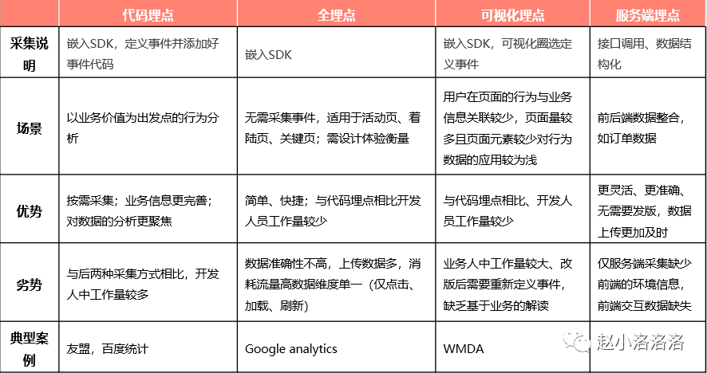

##### 埋点的框架和设计

###### 顶层设计

所谓的顶层设计就是想清楚怎么做埋点，用什么方式，上传机制是什么，具体怎么定义，具体怎么落地等等;我们遵循唯一性，可扩展性，一致性等的基础上，我们要设计一些通用字段及生成机制，比如：cid, idfa,idfv等。

**用户识别：**用户识别机制的混乱会导致两个结果：一是数据不准确，比如UV数据对不上;二是涉及到漏斗分析环节出现异常。因此应该做到：a.严格规范ID的本身识别机制;b.跨平台用户识别

**同类抽象:** 同类抽象包括事件抽象和属性抽象。事件抽象即浏览事件，点击事件的聚合;属性抽象，即多数复用的场景来进行合并,增加来源区分

**采集一致：**采集一致包括两点：一是跨平台页面命名一致，二是按钮命名一致;埋点的制定过程本身就是规范底层数据的过程，所以一致性是特别重要，只有这样才能真正的用起来

**渠道配置：**渠道主要指的是推广渠道，落地页，网页推广页面，APP推广页面等，这个落地页的配置要有统一规范和标准

###### 埋点采集事件及属性设计

在设计属性和事件的时候，我们要知道哪些经常变，哪些不变，哪些是业务行为，哪些是基本属性。基于基本属性事件，我们认为属性是必须采集项，只是属性里面的事件属性根据业务不同有所调整而已，因此，我们可以把埋点采集分为协议层和业务层埋点。

**业务分解：**梳理确认业务流程、操作路径和不同细分场景、定义用户行为路径

**分析指标：**对特定的事件进行定义、核心业务指标需要的数据

**事件设计：**APP启动，退出、页面浏览、事件曝光点击

**属性设计：**用户属性、事件属性、对象属性、环境属性

###### 数据采集事件及属性设计

事件就是记录用户行为或过程，比如用户的点击，下拉，这些都是用户的行为，都可以通过事件去记录。大部分的埋点都会通过事件的形式去跟踪。

事件的命名，也遵循一些规则，同一类功能在不同页面或位置出现时，按照功能名称命名，页面和位置在ev参数中进行区分。仅是按钮点击时，按照按钮名称命名。

**ev事件格式：**ev分为ev标识和ev参数

**规则：**

ev标识和ev参数之间用“#”连接(一级连接符)

ev参数和ev参数之间用“/”来连接(二级连接符)

ev参数使用key=value的结构，当一个key对应多个value值时，value1与value2之间用“，”连接(三级连接符)

当埋点仅有ev标识没有ev参数的时候，不需要带#

**备注：**

ev标识：作为埋点的唯一标识，用来区分埋点的位置和属性，不可变，不可修改。

ev参数：埋点需要回传的参数，ev参数顺序可变，可修改)

app埋点调整的时，ev标识不变，只修改后面的埋点参数(参数取值变化或者增加参数类型)

一般埋点文档中所包含的sheet名称以及作用**：**

A、曝光埋点汇总；

B、点击和浏览埋点汇总；

C、失效埋点汇总：一般会记录埋点失效版本或时间；

D、PC和M端页面埋点所对应的pageid；

E、各版本上线时间记录；

埋点文档中，所有包含的列名及功能：

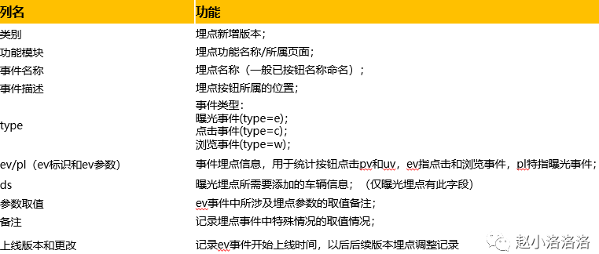

##### 大数据采集

在大数据体系中，传统数据分为业务数据和行业数据，传统数据体系中没有考虑过的新数据源包括内容数据、线上行为数据和线下行为数据 3 大类。在传统数据体系和新数据体系中，数据共分为以下 5 种。

1. 业务数据：消费者数据、客户关系数据、库存数据、账目数据等。
2. 行业数据：车流量数据、能耗数据、PM2.5数据等。
3. 内容数据：应用日志、电子文档、机器数据、语音数据、社交媒体数据等。
4. 线上行为数据：页面数据、交互数据、表单数据、会话数据、反馈数据等。
5. 线下行为数据：车辆位置和轨迹、用户位置和轨迹、动物位置和轨迹等。

大数据的主要来源如下

1. 企业系统：客户关系管理系统、企业资源计划系统、库存系统、销售系统等。
2. 机器系统：智能仪表、工业设备传感器、智能设备、视频监控系统等。
3. 互联网系统：电商系统、服务行业业务系统、政府监管系统等。
4. 社交系统：微信、QQ、微博、博客、新闻网站、朋友圈等。

在大数据体系中，数据源与数据类型的关系如图 1 所示。大数据系统从传统企业系统中获取相关的业务数据。 

 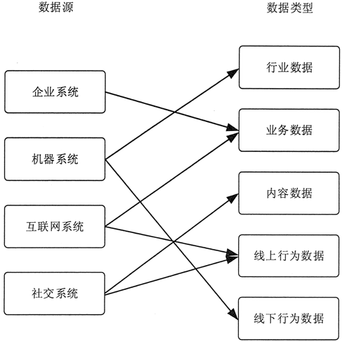

大数据的采集是指利用多个数据库或存储系统来接收发自客户端的数据。

根据数据源的不同，大数据采集方法也不相同。但是为了能够满足大数据采集的需要，大数据采集时都使用了大数据的处理模式，即 MapReduce 分布式并行处理模式或基于内存的流式处理模式。针对 4 种不同的数据源，大数据采集方法有以下几大类。 

1. 数据库采集：企业通过在采集端部署大量数据库，并在这些数据库之间进行负载均衡和分片，来完成大数据采集工作
2. 系统日志采集：收集公司业务平台日常产生的大量日志数据，供离线和在线的大数据分析系统使用。高可用性、高可靠性、可扩展性是日志收集系统所具有的基本特征。系统日志采集工具均采用分布式架构，能够满足每秒数百 MB 的日志数据采集和传输需求。
3. 网络数据采集：指通过网络爬虫或网站公开 API 等方式从网站上获取数据信息的过程。
4. 感知设备数据采集：通过传感器、摄像头和其他智能终端自动采集信号、图片或录像来获取数据。

###### 日志采集

日志一般为流式数据，处理这些日志需要特定的日志系统，这些系统需要具有以下特征。 构建应用系统和分析系统的桥梁，并将它们之间的关联解耦。支持近实时的在线分析系统和分布式并发的离线分析系统。具有高可扩展性，也就是说，当数据量增加时，可以通过增加结点进行水平扩展。

Flume 支持在日志系统中定制各类数据发送方，用于收集数据，同时，Flume 提供对数据进行简单处理，并写到各种数据接收方的能力。Flume 的核心是把数据从数据源（Source）收集过来，再将收集到的数据送到指定的目的地（Smk）。为了保证输送的过程一定成功，在送到目的地之前，会先缓存数据到管道（Channel）,待数据真正到达目的地后，Flume 再删除缓存的数据，如图所示。

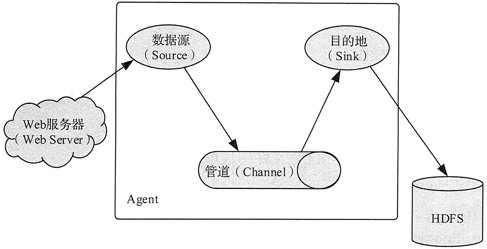

##### 预处理架构和方法

大数据预处理将数据划分为结构化数据和半结构化/非结构化数据，分别采用传统 ETL 工具和分布式并行处理框架来实现。总体架构如图所示。 

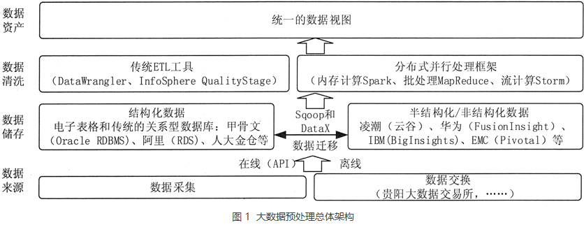

结构化数据可以存储在传统的关系型数据库中。关系型数据库在处理事务、及时响应、保证数据的一致性方面有天然的优势。非结构化数据可以存储在新型的分布式存储中，如HBase。分布式存储在系统的横向扩展性、存储成本、文件读取速度方面有着显著的优势。结构化数据和非结构化数据之间的数据可以按照数据处理的需求进行迁移。例如，为了进行快速并行处理，需要将传统关系型数据库中的结构化数据导入到分布式存储中。可以利用 Sqoop 等工具，先将关系型数据库的表结构导入分布式数据库，然后再向分布式数据库的表中导入结构化数据。 

数据清洗在汇聚多个维度、多个来源、多种结构的数据之后，对数据进行抽取、转换和集成加载。在以上过程中，除了更正、修复系统中的一些错误数据之外，更多的是对数据进行归并整理，并储存到新的存储介质中。其中，数据的质量至关重要。常见的数据质量问题可以根据数据源的多少和所属层次（定义层和实例层）分为 4 类。

1. 单数据源定义层：违背字段约束条件（例如，日期出现 9 月 31 日），字段属性依赖冲突（例如，两条记录描述同一个人的某一个属性，但数值不一致），违反唯一性（同一个主键 ID 出现了多次）等。
2. 单数据源实例层：单个属性值含有过多信息，拼写错误，存在空白值，存在噪音数据，数据重复，数据过时等；
3. 多数据源定义层：同一个实体的不同称呼（如 custom_id、custom_num），同一种属性的不同定义（例如，字段长度定义不一致，字段类型不一致等）；
4. 多数据源实例层：数据的维度、粒度不一致（例如，有的按 GB 记录存储量，有的按 TB 记录存储量；有的按照年度统计，有的按照月份统计），数据重复，拼写错误等。

噪声数据是指数据中存在着错误或异常（偏离期望值）的数据，不完整数据是指感兴趣的属性没有值，而不一致数据则是指数据内涵出现不一致情况。数据清洗是指消除数据中存在的噪声及纠正其不一致的错误。数据集成是指将来自多个数据源的数据合并到一起构成一个完整的数据集。数据转换是指将一种格式的数据转换为另一种格式的数据。数据消减是指通过删除冗余特征或聚类消除多余数据。

数据清洗的处理过程通常包括填补遗漏的数据值，平滑有噪声数据，识别或除去异常值，以及解决不一致问题。有问题的数据将会误导数据挖掘的搜索过程。

数据集成就是将来自多个数据源的数据合并到一起。由于描述同一个概念的属性在不同数据库中有时会取不同的名字，所以在进行数据集成时就常常会引起数据的不一致或冗余。

数据转换主要是对数据进行规格化操作。在正式进行数据挖掘之前，尤其是使用基于对象距离的挖掘算法时，如神经网络、最近邻分类等，必须进行数据规格化，也就是将其缩至特定的范围之内

数据消减的目的就是缩小所挖掘数据的规模，但却不会影响（或基本不影响）最终的挖掘结果。

模式集成问题就是如何使来自多个数据源的现实世界的实体相互匹配，这其中就涉及实体识别问题。

###### 数据消减

数据消减技术的主要目的就是从原有巨大数据集中获得一个精简的数据集，并使这一精简数据集保持原有数据集的完整性。这样在精简数据集上进行数据挖掘就会提高效率，并且能够保证挖掘出来的结果与使用原有数据集所获得的结果基本相同。

| 名称                 | 说明                                                         |
| -------------------- | ------------------------------------------------------------ |
| 数据立方合计         | 这类合计操作主要用于构造数据立方（数据仓库操作）。           |
| 维数消减             | 主要用于检测和消除无关、弱相关，或冗余的属性或维（数据仓库中属性）。 |
| 数据压缩             | 利用编码技术压缩数据集的大小。                               |
| 数据块消减           | 利用更简单的数据表达形式，如参数模型、非参数模型（聚类、采样、直方图等），来取代原有的数据。 |
| 离散化与概念层次生成 | 所谓离散化就是利用取值范围或更高层次概念来替换初始数据。利用概念层次可以帮助挖掘不同抽象层次的模式知识。 |

##### 流计算

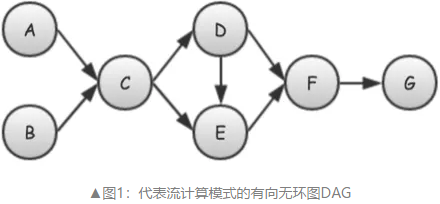

首先，“流”与“异步”不谋而合。“流”的各个节点通过队列传递消息，不同节点的执行正好就是完全异步的。并且由于有队列隔离，不同节点的执行完全不用考虑并发安全的问题。“流”在内部执行时是异步和并行的，能最大限度提高资源使用效率，提高程序执行性能。可以说，“流”是“异步”的一种重要表现方式，“异步”则是“流”在执行时的内禀性质。

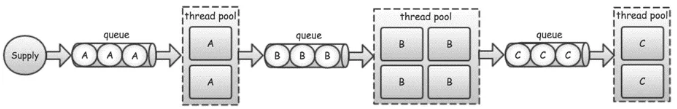

其次，如果“流”的执行节点间使用的是阻塞队列，那么整个流的各个执行环节就天然地带有了反向压力能力，让我们不必担心很多异步系统在高负载而又临时处理能力不足时造成的OOM问题。

再次，“流”能够非常自然地描述业务执行的流程。不管是大到整个产品线的各个服务模块，还是小到每个服务模块中的具体实现步骤。就像“分形”一样，“流”能够做任意细力度的划分。这是一种非常普遍的描述事情发生过程的模式。

最后，通过类似于Kafka这样消息中间件的隔离，可以非常清晰地定义模块和模块之间的边界，从设计模式中高内聚、低耦合的角度来看，是一种非常不错的实践

###### 解决什么

使用流计算主要是为了计算以下几类问题。

- 流数据操作：流数据操作可以说是流计算系统与生俱来的能力，它本身是针对数据流的转化或转移处理，所以实现和使用起来都相对更加直观。流数据操作的内容主要包括了三类：**对数据进行清洗、规整和结构化**，对不同来源的数据进行关联及合并，以及在不同系统之间搬运数据。这三类操作通过一些常用的流式API就可以实现。
- 单点特征计算：一个事件中包含的用户是否在黑名单中？发生事件的设备是否是模拟器？温度传感器传来的温度事件是否已经超出正常温度范围？发送消息设备的IP是否是代理？一次交易的金额是否属于大额交易？手机是否有SIM卡？诸如此类的问题，要么可以通过黑白名单，要么能够通过特定的规则计算而得到答案，实现起来相对简单，所以我们将这类特征计算称之为单点特征。

- 时间维度聚合特征计算：相同设备的1小时内注册事件次数、相同银行卡号的7天交易事件次数、过去30天内同一IP段上交易金额、过去1分钟高温事件的次数、过去5分钟日志告警事件的次数，诸如此类特征在诸如风控、预警、监控等各种场景都非常广泛的应用。分析不难发现，这类特征都有个共同特点，它们均需要在时间维度对数据进行聚合运算。因此，**我们称这类特征为时间维度聚合特征。**

- 关联图谱特征计算：除了时间维度的聚合分析外，我们还经常进行“空间”维度的聚合分析。不过这种分析有个更专业的名字，即“关联图谱”分析。比如在一些风控场景中，我们需要计算用户账户使用IP的个数、同一手机号码发生在不同城市的个数、同一设备上关联用户的数目、同一用户关联设备的数目、同一推荐人推荐的用户数等特征。以设备关联用户数为例，如果某个设备上注册的用户很多，那么它的风险就比较高，毕竟正常情况下我们都只会用自己的手机注册自己的账号，而不会是帮其他几十、上百人注册账号的。

- 事件序列分析：数据流中的数据不是单纯在时间上有着先来后到的关系，而是在数据和数据之间也有着联系。考虑用户在手机上安装新APP的过程，它可能是先点击了某个广告链接，然后下载并安装了APP，最后成功注册了账号。从“点击”到“下载”，再到“安装”和“注册”，这就完成了一次将广告转化为用户的过程。再比如在网络欺诈识别场景中，如果用户在新建账号后，立马发生大量交易行为。那么这种“新建账号”到“10分钟内5次交易”的行为就是种非常可疑的行为了。诸如此类从数据流表示的事件流中，检测并筛选出符合特定模式或行为的事件序列的过程，我们称之为复杂事件处理。CEP也是流计算经常被用来解决的问题。

- 模型学习和预测：随着流计算越来越流行和普及，越来越多的原本主要针对离线批式数据的统计和机器学习模型也被用于流数据。比如在风控系统中，当我们计算好特征后，还需要把这些特征输入评分模型进行风险评分。根据不同的使用场景，使用的评分模型可能是基于规则的模型，也可能是基于机器学习的模型。传统的机器学习模型主要通过离线训练而来，但现在越来越多的模型会直接基于流数据在线训练和更新。再比如在异常检测应用中，我们会在线统计并估计变量的分布参数，然后根据训练出的分布模型判断变量之后的取值是否属于异常。**这种同时在线更新和预测的做法，在流计算应用中也越来越常见**

###### 流数据状态和流信息状态

我们将流在执行过程中涉及到的状态，分为两类：**流数据状态**和**流信息状态**。

- **流数据状态。**在流数据处理的过程中，可能需要处理事件窗口、时间乱序、多流关联等问题，在解决这些问题的过程中，通常会涉及到对部分流数据的临时缓存，并在处理完后将其清理。我们将临时保存的部分流数据称为“流数据状态”。
- **流信息状态。**在对流数据的分析过程中，会得到一些我们感兴趣的信息，比如时间维度的聚合数据、关联图谱中的一度关联节点数、CEP中的有限状态机等，这些信息可能会在后续的流数据分析过程中被继续使用，从而需要将这些信息保存下来。同时在后续的流数据处理过程中，这些信息还会被不断地访问和更新。我们将这些分析所得并保存下来的数据称为“流信息状态”。

将实时流计算应用中的状态分为了“流数据状态”和“流信息状态”。可以说是从两个不同的维度对“流”进行的管理。前者“流数据状态”是从“时间”角度对流进行管理，而后者“流信息状态”则是从“空间”角度对流的管理。“流信息状态”弥补了“流数据状态”只是对事件在时间序列上做管理的不足，将流的状态扩展到了任意的空间。

目前，针对“流信息状态”的存储，主要有三种方式：

- 计算节点和状态数据节点分离的分布式内存数据库方案

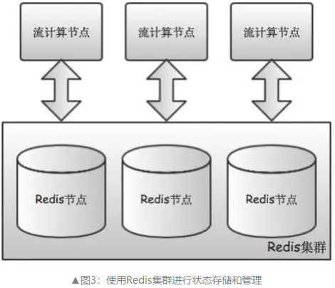

- 计算节点和状态数据节点共存的分布式内存格点方案

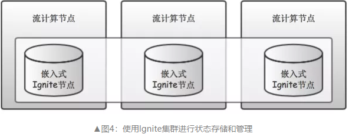

- 基于分布式文件系统同步状态数据的方案

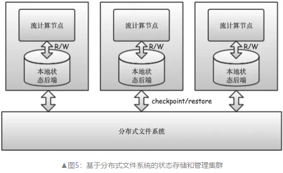

### 数据存储及管理

##### Google大数据处理系统

###### GFS

GFS 的系统架构主要由一个 Master Server（主服务器）和多个 Chunk Server（数据块服务器）组成。Master Server 主要负责维护系统中的名字空间，访问控制信息，从文件到块的映射及块的当前位置等元数据，并与 Chunk Server 通信。Chunk Server 负责具体的存储工作。数据以文件的形式存储在 Chunk Server 上。Client 是应用程序访问 GFS 的接口。 Master Server 的所有信息都存储在内存里，启动时信息从 Chunk Server 中获取。这样不但提高了 Master Server 的性能和吞吐量，也有利于 Master Server 宕机后把后备服务器切换成 Master Server。

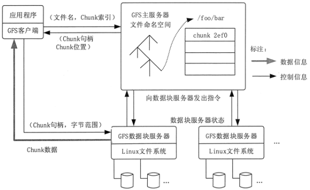

###### MapReduce

MapReduce 则是为了解决如何从这些海量数据中快速计算并获取期望结果的问题。MapReduce 实现了 Map 和 Reduce 两个功能。Map 把一个函数应用于集合中的所有成员，然后返回一个基于这个处理的结果集，而 Reduce 是把两个或更多个 Map 通过多个线程、进程或者独立系统进行并行执行处理得到的结果集进行分类和归纳。用户只需要提供自己的 Map 函数及 Reduce 函数就可以在集群上进行大规模的分布式数据处理。这一编程环境能够使程序设计人员编写大规模的并行应用程序时不用考虑集群的并发性、分布性、可靠性和可扩展性等问题。应用程序编写人员只需要将精力放在应用程序本身，关于集群的处理问题则交由平台来完成。

###### BigTable

BigTable 是 Google 设计的分布式数据存储系统，是用来处理海量数据的一种非关系型数据库。BigTable 是一个稀疏的、分布式的、持久化存储的多维度排序的映射表。

##### Hadoop大数据处理框架

###### HDFS

文件系统是操作系统提供的磁盘空间管理服务，该服务只需要用户指定文件的存储位置及文件读取路径，而不需要用户了解文件在磁盘上是如何存放的。

布式文件系统存在多个问题

1. 各个存储结点的负载不均衡，单机负载可能极高。例如，如果某个文件是热门文件，则会有很多用户经常读取这个文件，这就会造成该文件所在机器的访问压力极高。
2. 数据可靠性低。如果某个文件所在的机器出现故障，那么这个文件就不能访问了，甚至会造成数据的丢失。
3. 文件管理困难。如果想把一些文件的存储位置进行调整，就需要查看目标机器的空间是否够用，并且需要管理员维护文件位置，在机器非常多的情况下，这种操作就极为复杂。

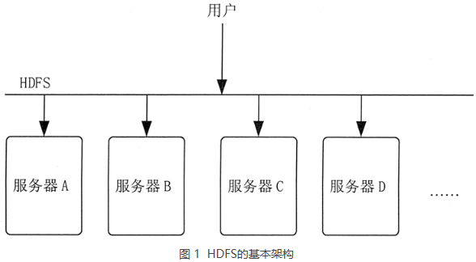

例如，用户访问 HDFS 中的 /a/b/c.mpg 这个文件时，HDFS 负责从底层的相应服务器中读取该文件，然后返回给用户，这样用户就只需和 HDFS 打交道，而不用关心这个文件是如何存储的。为了解决存储结点负载不均衡的问题，HDFS 首先把一个文件分割成多个块，然后再把这些文件块存储在不同服务器上。这种方式的优势就是不怕文件太大，并且读文件的压力不会全部集中在一台服务器上，从而可以避免某个热点文件会带来的单机负载过高的问题。为了保证文件的可靠性，HDFS 会把每个文件块进行多个备份，一般情况下是 3 个备份。假如要在由服务器 A、B、C 和 D 的存储结点组成的 HDFS 上存储文件 /a/b/xxx.avi，则 HDFS 会把文件分成 4 块，分别为块 1、块 2、块 3 和块 4。为了保证文件的可靠性，HDFS 会把数据块按以下方式存储到 4 台服务器上，如图 3 所示。 

为了管理文件，HDFS 需要记录维护一些元数据，也就是关于文件数据信息的数据，如 HDFS 中存了哪些文件，文件被分成了哪些块，每个块被放在哪台服务器上等。HDFS 把这些元数据抽象为一个目录树，来记录这些复杂的对应关系。这些元数据由一个单独的模块进行管理，这个模块叫作名称结点（NameNode）。存放文件块的真实服务器叫作数据结点（DataNode）。 

###### HBase

Hadoop 是一个高容错、高延时的分布式文件系统和高并发的批处理系统，不适用于提供实时计算，而 HBase 是可以提供实时计算的分布式数据库，数据被保存在 HDFS (分布式文件系统）上，由 HDFS 保证其高容错性。HBase 上的数据是以二进制流的形式存储在 HDFS 上的数据块中的，但是，HBase 上的存储数据对于 HDFS 是透明的。HBase 可以直接使用本地文件系统，也可以使用 Hadoop 的 HDFS。HBase 中保存的数据可以使用 MapReduce 来处理，它将数据存储和并行计算有机地结合在一起。

Hadoop HDFS作为其文件存储系统,利用Hadoop MapReduce来处理 HBase中的海量数据,利用Zookeeper作为其分布式协同服务主要用来存储非结构化和半结构化的松散数据

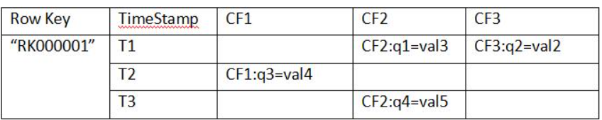

Row Key: 决定一行数据的唯一标识；RowKey是按照字典顺序排序的；Row key最多只能存储64k的字节数据。
Column Family列族（CF1、CF2、CF3） & qualifier列：HBase表中的每个列都归属于某个列族，列族必须作为表模式(schema) 定义的一部分预先给出；列名以列族作为前缀，每个“列族”都可以有多个列成员；新的列族成员可以随后按需、动态加入；权限控制、存储以及调优都是在列族层面进行的；HBase把同一列族里面的数据存储在同一目录下，由几个文件保存。目前为止HBase的列族能能够很好处理最多不超过3个列族。
Timestamp时间戳：在HBase每个cell存储单元对同一份数据有多个版本，根据唯一的时间 戳来区分每个版本之间的差异，不同版本的数据按照时间倒序排序，最新的数据版本排在最前面。时间戳的类型是64位整型。时间戳可以由HBase(在数据写入时自动)赋值，此时时间戳是精确到毫秒的当前系统时间。
Cell单元格：由行和列的坐标交叉决定；单元格是有版本的（由时间戳来作为版本）； 单元格的内容是未解析的字节数组（Byte[]），cell中的数据是没有类型的，全部是字节码形式存贮。由`{row key，column(=<family> +<qualifier>)，version}`唯一确定的单元。

HBase 表中的所有行都是按照行键的字典序排列的。因为一张表中包含的行的数量非常多，有时候会高达几亿行，所以需要分布存储到多台服务器上。因此，当一张表的行太多的时候，HBase 就会根据行键的值对表中的行进行分区，每个行区间构成一个“分区（Region）”，包含了位于某个值域区间内的所有数据。Region 是按大小分割的，每个表一开始只有二个 Region，随着数据不断插入到表中，Region 不断增大，当增大到一个阈值的时候，Region 就会等分为两个新的 Region。当表中的行不断增多时，就会有越来越多的 Region。Region 是 HBase 中数据分发和负载均衡的最小单元，默认大小是 100MB 到 200MB。不同的 Region 可以分布在不同的 Region Server 上，但一个 Region 不会拆分到多个 Region Server 上。每个 Region Server 负责管理一个 Region 集合。

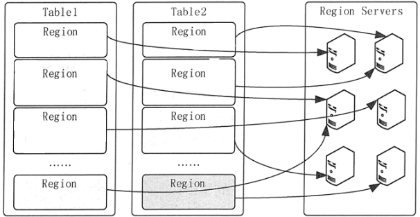

在分布式的生产环境中，HBase 需要运行在 HDFS 之上，以 HDFS 作为其基础的存储设施。HBase 的集群主要由 Master、Region Server 和 Zookeeper 组成

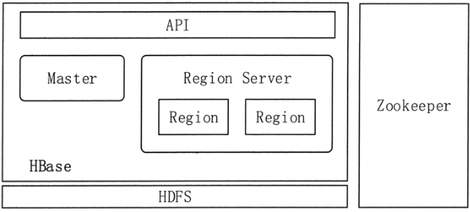

Master 主要负责表和 Region 的管理工作。表的管理工作主要是负责完成增加表、删除表、修改表和查询表等操作。Region 的管理工作更复杂一些，Master 需要负责分配 Region 给 Region Server，协调多个 Region Server，检测各个 Region Server 的状态，并平衡 Region Server 之间的负载。当 Region 分裂或合并之后，Master 负责重新调整 Region 的布局。如果某个 Region Server 发生故障，Master 需要负责把故障 Region Server 上的 Region 迁移到其他 Region Server 上。HBase 允许多个 Master 结点共存，但是这需要 Zookeeper 进行协调。当多个 Master 结点共存时，只有一个 Master 是提供服务的，其他的 Master 结点处于待命的状态。当正在工作的 Master 结点宕机时，其他的 Master 则会接管 HBase 的集群。

HBase 有许多个 Region Server，每个 Region Server 又包含多个 Region。Region Server 是 HBase 最核心的模块，负责维护 Master 分配给它的 Region 集合，并处理对这些 Region 的读写操作。Client 直接与 Region Server 连接，并经过通信获取 HBase 中的数据。HBase 釆用 HDFS 作为底层存储文件系统，Region Server 需要向 HDFS 写入数据，并利用 HDFS 提供可靠稳定的数据存储。Region Server 并不需要提供数据复制和维护数据副本的功能。

Zookeeper 的作用对 HBase 很重要。首先，Zookeeper 是 HBase Master 的高可用性（High Available，HA）解决方案。也就是说，Zookeeper 保证了至少有一个 HBase Master 处于运行状态。Zookeeper 同时负责 Region 和 Region Server 的注册。HBase 集群的 Master 是整个集群的管理者，它必须知道每个 Region Server 的状态。HBase 就是使用 Zookeeper 来管理 Region Server 状态的。每个 Region Server 都向 Zookeeper 注册，由 Zookeeper 实时监控每个 Region Server 的状态，并通知给 Master。这样，Master 就可以通过 Zookeeper 随时感知各个 Region Server 的工作状态。

### 数据查询和分析

#### Lambda架构

Lambda架构的目标是设计出一个能满足实时大数据系统关键特性的架构，包括有：高容错、低延时和可扩展等。Lambda架构整合离线计算和实时计算，融合不可变性，读写分离和复杂性隔离等一系列架构原则，可集成Hadoop，Kafka，Storm，Spark，Hbase等各类大数据组件。

###### 大数据系统的关键特性

大数据系统应具有以下的关键特性：

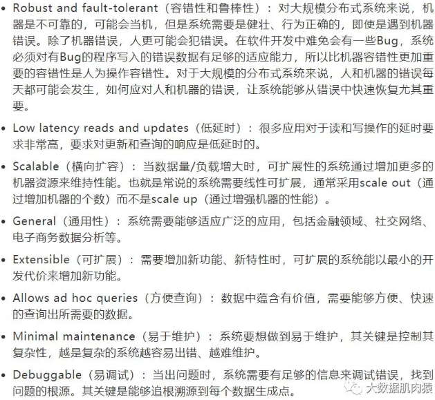

##### 数据系统的本质

我们可将数据系统简化为：数据系统=数据+查询

###### 数据的本质

数据是一个不可分割的单位，数据有两个关键的性质：When和What。

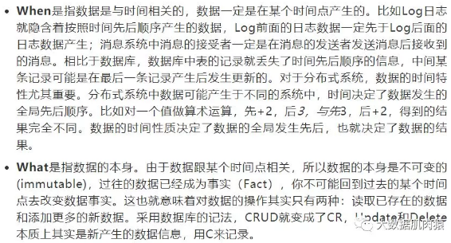

根据上述对数据本质特性的分析，Lamba架构中对数据的存储采用的方式是：数据不可变，存储所有数据。

通过采用不可变方式存储所有的数据，可以有如下好处：

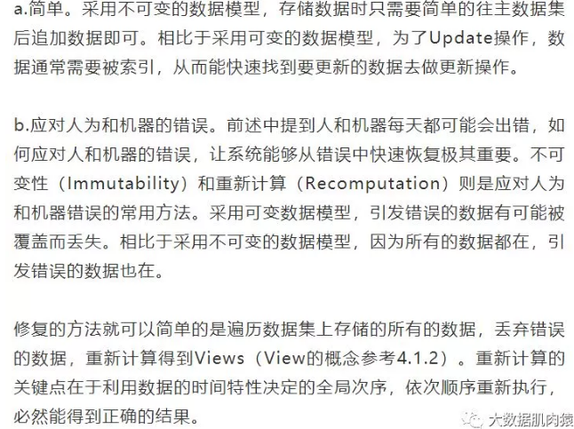

###### 查询

查询的定义：$Query=Function(All Data)$，查询是应用于数据集上的函数。

有一类称为Monoid特性的函数应用非常广泛。Monoid的概念来源于范畴学，其一个重要特性是满足结合律。如整数的加法就满足Monoid特性：$(a+b)+c = a+(b+c)$。不满足Monoid特性的函数很多时候可以转化成多个满足Monoid特性的函数的运算。如多个数的平均值Avg函数，多个平均值没法直接通过结合来得到最终的平均值，但是可以拆成分母除以分子，分母和分子都是整数的加法，从而满足Monoid特性。

Monoid的结合律特性在分布式计算中极其重要，满足Monoid特性意味着我们可以将计算分解到多台机器并行运算，然后再结合各自的部分运算结果得到最终结果。同时也意味着部分运算结果可以储存下来被别的运算共享利用（如果该运算也包含相同的部分子运算），从而减少重复运算的工作量。

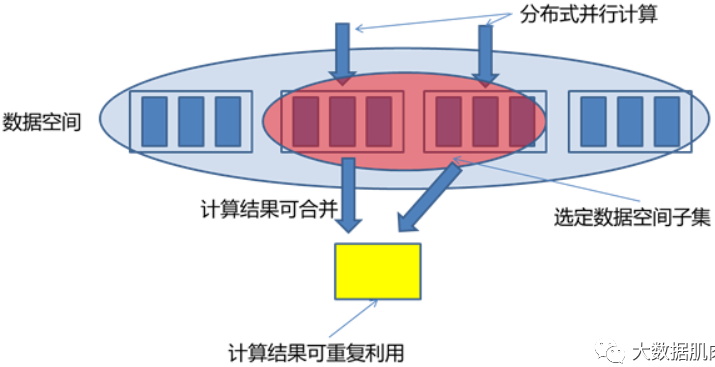

Lambda架构通过分解的三层架构来解决该问题：Batch Layer(批处理层)，Speed Layer(实时层)和Serving Layer(服务层)。

###### Batch Layer

储存数据集

根据前述对数据When&What特性的讨论，Batch Layer采用不可变模型存储所有的数据。因为数据量比较大，可以采用HDFS之类的大数据储存方案。如果需要按照数据产生的时间先后顺序存放数据，可以考虑如InfluxDB之类的时间序列数据库存储方案。

构建查询View

上面说到根据等式Query = Function(All Data)，在全体数据集上在线运行查询函数得到结果的代价太大。但如果我们预先在数据集上计算并保存查询函数的结果，查询的时候就可以直接返回结果或通过简单的加工运算就可得到结果而无需重新进行完整费时的计算了。这儿可以把Batch Layer看成是一个数据预处理的过程。我们把针对查询预先计算并保存的结果称为View，View是Lamba架构的一个核心概念，它是针对查询的优化，通过View即可以快速得到查询结果。

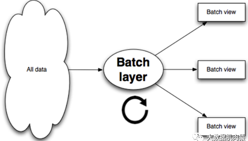

对View的理解：View是一个和业务关联性比较大的概念，View的创建需要从业务自身的需求出发。一个通用的数据库查询系统，查询对应的函数千变万化，不可能穷举。但是如果从业务自身的需求出发，可以发现业务所需要的查询常常是有限的。Batch Layer需要做的一件重要的工作就是根据业务的需求，考察可能需要的各种查询，根据查询定义其在数据集上对应的Views。

###### Speed Layer

Speed Layer正是用来处理增量的实时数据。Speed Layer和Batch Layer比较类似，对数据进行计算并生成Realtime View，其主要区别在于：Speed Layer处理的数据是最近的增量数据流，Batch Layer处理的全体数据集Speed Layer为了效率，接收到新数据时不断更新Realtime View，而Batch Layer根据全体离线数据集直接得到Batch View。

Lambda架构将数据处理分解为Batch Layer和Speed Layer有如下优点：

容错性。Speed Layer中处理的数据也不断写入Batch Layer，当Batch Layer中重新计算的数据集包含Speed Layer处理的数据集后，当前的Realtime View就可以丢弃，这也就意味着Speed Layer处理中引入的错误，在Batch Layer重新计算时都可以得到修正。这点也可以看成是CAP理论中的最终一致性（Eventual Consistency）的体现。

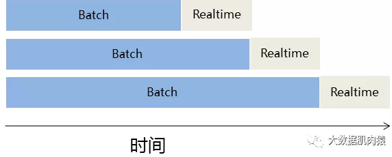

复杂性隔离。Batch Layer处理的是离线数据，可以很好的掌控。Speed Layer采用增量算法处理实时数据，复杂性比Batch Layer要高很多。通过分开Batch Layer和Speed Layer，把复杂性隔离到Speed Layer，可以很好的提高整个系统的鲁棒性和可靠性。

###### Serving Layer

Lambda架构的Serving Layer用于响应用户的查询请求，合并Batch View和Realtime View中的结果数据集到最终的数据集。如果查询函数满足Monoid性质，只需要简单的合并Batch View和Realtime View中的结果数据集即可。否则的话，可以把查询函数转换成多个满足Monoid性质的查询函数的运算，单独对每个满足Monoid性质的查询函数进行Batch View和Realtime View中的结果数据集合并，然后再计算得到最终的结果数据集。另外也可以根据业务自身的特性，运用业务自身的规则来对Batch View和Realtime View中的结果数据集合并。

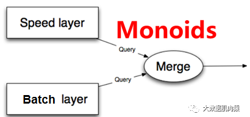

下图给出了Lambda架构的一个完整视图和流程。

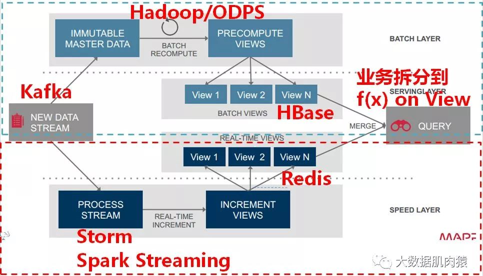

数据流进入系统后，同时发往Batch Layer和Speed Layer处理。Batch Layer以不可变模型离线存储所有数据集，通过在全体数据集上不断重新计算构建查询所对应的Batch Views。Speed Layer处理增量的实时数据流，不断更新查询所对应的Realtime Views。Serving Layer响应用户的查询请求，合并Batch View和Realtime View中的结果数据集到最终的数据集。

数据流存储可选用基于不可变日志的分布式消息系统Kafka；Batch Layer数据集的存储可选用Hadoop的HDFS，或者是阿里云的ODPS；Batch View的预计算可以选用MapReduce或Spark；Batch View自身结果数据的存储可使用MySQL（查询少量的最近结果数据），或HBase（查询大量的历史结果数据）。Speed Layer增量数据的处理可选用Storm或Spark Streaming；Realtime View增量结果数据集为了满足实时更新的效率，可选用Redis等内存NoSQL。

Kappa架构  简化了Lambda架构。Kappa架构系统是删除了批处理系统的架构。要取代批处理，数据只需通过流式传输系统快速提供：

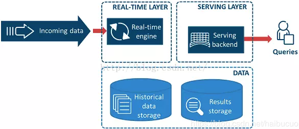

那如何用流计算系统对全量数据进行重新计算，步骤如下：

1、用Kafka或类似的分布式队列保存数据，需要几天数据量就保存几天。

2、当需要全量计算时，重新起一个流计算实例，从头开始读取数据进行处理，并输出到一个结果存储中。

3、当新的实例完成后，停止老的流计算实例，并把老的一引起结果删除。

一个典型的Kappa架构如下：

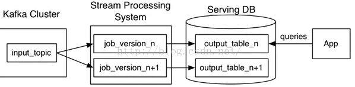

和Lambda架构相比，在Kappa架构下，只有在有必要的时候才会对历史数据进行重复计算，并且实时计算和批处理过程使用的是同一份代码。或许有些人会质疑流式处理对于历史数据的高吞吐量会力不从心，但是这可以通过控制新实例的并发数进行改善。

  Kappa架构的核心思想包括以下三点：用Kafka或者类似的分布式队列系统保存数据，你需要几天的数据量就保存几天；当需要全量重新计算时，重新起一个流计算实例，从头开始读取数据进行处理，并输出到一个新的结果存储中；当新的实例做完后，停止老的流计算实例，并把老的一些结果删除。

### 数据仓库

数据仓库是一个面向主题的、集成的、相对稳定的、反映历史变化的数据集合，它用于支持企业或组织的决策分析处理。

传统的离线 Batch SQL有三种基础的实现方式，分别是 Nested-loop Join、Sort-Merge Join 和 Hash Join。Nested-loop Join 最为简单直接，将两个数据集加载到内存，并用内嵌遍历的方式来逐个比较两个数据集内的元素是否符合 Join 条件。Nested-loop Join 虽然时间效率以及空间效率都是最低的，但胜在比较灵活适用范围广，因此其变体 BNL 常被传统数据库用作为 Join 的默认基础选项。Sort-Merge Join 顾名思义，分为两个 Sort 和 Merge 阶段。首先将两个数据集进行分别排序，然后对两个有序数据集分别进行遍历和匹配，类似于归并排序的合并。值得注意的是，Sort-Merge 只适用于 Equi-Join（Join 条件均使用等于作为比较算子）。Sort-Merge Join 要求对两个数据集进行排序，成本很高，通常作为输入本就是有序数据集的情况下的优化方案。Hash Join 同样分为两个阶段，首先将一个数据集转换为 Hash Table，然后遍历另外一个数据集元素并与 Hash Table 内的元素进行匹配。第一阶段和第一个数据集分别称为 build 阶段和 build table，第二个阶段和第二个数据集分别称为 probe 阶段和 probe table。Hash Join 效率较高但对空间要求较大，通常是作为 Join 其中一个表为适合放入内存的小表的情况下的优化方案。和 Sort-Merge Join 类似，Hash Join 也只适用于 Equi-Join。

#### 数据模型

数据模型就是数据组织和存储方法，它强调从业务、数据存取和使用角度合理存储数据。只有数据模型将数据有序的组织和存储起来之后，大数据才能得到高性能、低成本、高效率、高质量的使用。

- 性能：帮助我们快速查询所需要的数据，减少数据的I/O吞吐，提高使用数据的效率，如宽表。

- 成本：极大地减少不必要的数据冗余，也能实现计算结果复用，极大地降低存储和计算成本。

- 效率：在业务或系统发生变化时，可以保持稳定或很容易扩展，提高数据稳定性和连续性。

- 质量：良好的数据模型能改善数据统计口径的不一致性，减少数据计算错误的可能性。

数据模型能够促进业务与技术进行有效沟通，形成对主要业务定义和术语的统一认识，具有跨部门、中性的特征，可以表达和涵盖所有的业务。大数据系统需要数据模型方法来帮助更好地组织和存储数据，以便在性能、成本、效率和质量之间取得最佳平衡！

维度建模以分析决策的需求出发构建模型，构建的数据模型为分析需求服务，因此它重点解决用户如何更快速完成分析需求，同时还有较好的大规模复杂查询的响应性能。它是面向分析的，为了提高查询性能可以增加数据冗余，反规范化的设计技术。事实表产生于业务过程，存储了业务活动或事件提炼出来的性能度量。从最低的粒度级别来看，事实表行对应一个度量事件。事实表根据粒度的角色划分不同，可分为事务事实表、周期快照事实表、累积快照事实表。

- 事务事实表，用于承载事务数据，通常粒度比较低，它是面向事务的，其粒度是每一行对应一个事务，它是最细粒度的事实表，例如产品交易事务事实、ATM交易事务事实。

- 周期快照b事实表，按照一定的时间周期间隔(每天，每月)来捕捉业务活动的执行情况，一旦装入事实表就不会再去更新，它是事务事实表的补充。用来记录有规律的、固定时间间隔的业务累计数据，通常粒度比较高，例如账户月平均余额事实表。

- 累积快照事实表，用来记录具有时间跨度的业务处理过程的整个过程的信息，每个生命周期一行，通常这类事实表比较少见。

维度表，一致性维度，业务过程的发生或分析角度，我们主要关注下退化维度和缓慢变化维。

退化维度：在维度类型中，有一种重要的维度称作为退化维度，亦维度退化一说。这种维度指的是直接把一些简单的维度放在事实表中。退化维度是维度建模领域中的一个非常重要的概念，它对理解维度建模有着非常重要的作用，退化维度一般在分析中可以用来做分组使用。

缓慢变化维：维度的属性并不是始终不变的，它会随着时间的流逝发生缓慢的变化，这种随时间发生变化的维度我们一般称之为缓慢变化维。

##### 分层设计

数据仓库一般要进行分层的设计，其能带来五大好处：

- 清晰数据结构：每一个数据分层都有它的作用域，这样我们在使用表的时候能更方便地定位和理解。

- 数据血缘追踪：能够快速准确地定位到问题，并清楚它的危害范围。

- 减少重复开发：规范数据分层，开发一些通用的中间层数据，能够减少极大的重复计算。

- 把复杂问题简单化：将复杂的任务分解成多个步骤来完成，每一层只处理单一的步骤，比较简单和容易理解。当数据出现问题之后，不用修复所有的数据，只需要从有问题的步骤开始修复。

- 屏蔽原始数据的异常：不必改一次业务就需要重新接入数据。

以下是我们的一种分层设计方法，数据缓冲区的数据结构与源系统完全一致。基础数据模型和融合数据模型是大数据平台重点建设的数据模型。应用层模型由各应用按需自行建设，其中基础数据模型一般采用ER模型，融合数据模型采用维度建模思路。

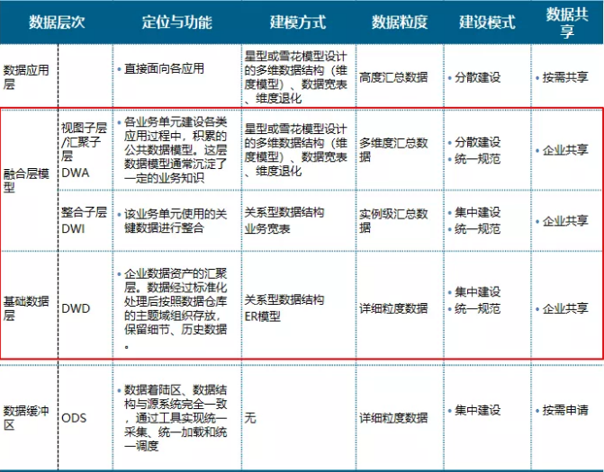

数据仓库标准上可以分为四层：ODS、PDW、DM、APP。
ODS层：为临时存储层，是接口数据的临时存储区域，为后一步的数据处理做准备。一般来说ODS层的数据和源系统的数据是同构的，主要目的是简化后续数据加工处理的工作。从数据粒度上来说ODS层的数据粒度是最细的。ODS层的表通常包括两类，一个用于存储当前需要加载的数据，一个用于存储处理完后的历史数据。历史数据一般保存3-6个月后需要清除，以节省空间。但不同的项目要区别对待，如果源系统的数据量不大，可以保留更长的时间，甚至全量保存；

PDW层：为数据仓库层，PDW层的数据应该是一致的、准确的、干净的数据，即对源系统数据进行了清洗后的数据。这一层的数据一般是遵循数据库第三范式的，其数据粒度通常和ODS的粒度相同。在PDW层会保存BI系统中所有的历史数据。

DM层：为数据集市层，这层数据是面向主题来组织数据的，通常是星形或雪花结构的数据。从数据粒度来说，这层的数据是轻度汇总级的数据，已经不存在明细数据了。从数据的时间跨度来说，通常是PDW层的一部分，主要的目的是为了满足用户分析的需求，而从分析的角度来说，用户通常只需要分析近几年的即可。从数据的广度来说，仍然覆盖了所有业务数据。

APP层：为应用层，这层数据是完全为了满足具体的分析需求而构建的数据，也是星形或雪花结构的数据。从数据粒度来说是高度汇总的数据。从数据的广度来说，则并不一定会覆盖所有业务数据，而是DM层数据的一个真子集，从某种意义上来说是DM层数据的一个重复。从极端情况来说，可以为每一张报表在APP层构建一个模型来支持，达到以空间换时间的目的数据仓库的标准分层只是一个建议性质的标准，实际实施时需要根据实际情况确定数据仓库的分层，不同类型的数据也可能采取不同的分层方法。

元数据的定义：数据仓库的元数据是关于数据仓库中数据的数据。它的作用类似于数据库管理系统的数据字典，保存了逻辑数据结构、文件、地址和索引等信息。广义上讲，在数据仓库中，元数据描述了数据仓库内数据的结构和建立方法的数据。

 元数据是数据仓库管理系统的重要组成部分，元数据管理器是企业级数据仓库中的关键组件，贯穿数据仓库构建的整个过程，直接影响着数据仓库的构建、使用和维护。

构建数据仓库的主要步骤之一是ETL。这时元数据将发挥重要的作用，它定义了源数据系统到数据仓库的映射、数据转换的规则、数据仓库的逻辑结构、数据更新的规则、数据导入历史记录以及装载周期等相关内容。数据抽取和转换的专家以及数据仓库管理员正是通过元数据高效地构建数据仓库。

用户在使用数据仓库时，通过元数据访问数据，明确数据项的含义以及定制报表。

数据仓库的规模及其复杂性离不开正确的元数据管理，包括增加或移除外部数据源，改变数据清洗方法，控制出错的查询以及安排备份等。

 元数据可分为技术元数据和业务元数据。技术元数据为开发和管理数据仓库的IT 人员使用，它描述了与数据仓库开发、管理和维护相关的数据，包括数据源信息、数据转换描述、数据仓库模型、数据清洗与更新规则、数据映射和访问权限等。而业务元数据为管理层和业务分析人员服务，从业务角度描述数据，包括商务术语、数据仓库中有什么数据、数据的位置和数据的可用性等，帮助业务人员更好地理解数据仓库中哪些数据是可用的以及如何使用。

##### 数据仓库建模方法

###### 维度建模

维度建模以分析决策的需求出发构建模型，构建的数据模型为分析需求服务，因此它重点解决用户如何更快速完成分析需求，同时还有较好的大规模复杂查询的响应性能，更直接面向业务。

维度表：表示对分析主题所属类型的描述。事实表：表示对分析主题的度量。

星型模型主要是维表和事实表，以事实表为中心，所有维度直接关联在事实表上，呈星型分布。 维表只和事实表关联，维表之间没有关联；每个维表的主码为单列，且该主码放置在事实表中，作为两边连接的外码；以事实表为核心，维表围绕核心呈星形分布；

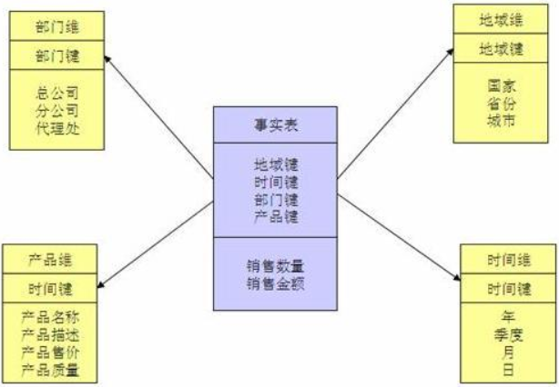

雪花模型，在星型模型的基础上，维度表上又关联了其他维度表。这种模型维护成本高，性能方面也较差，所以一般不建议使用。

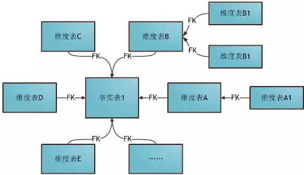

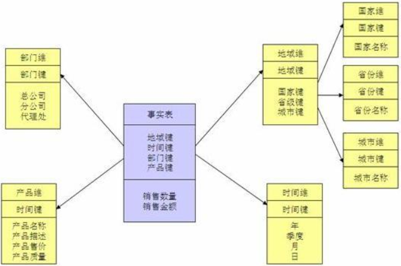

星座模型，是对星型模型的扩展延伸，多张事实表共享维度表。数仓模型建设后期，大部分维度建模都是星座模型。

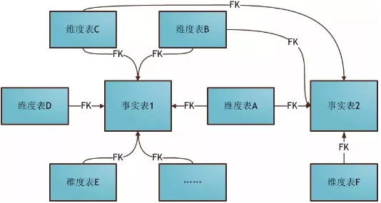

###### 关系建模

范式建模：从全企业的高度设计一个3NF模型的方法，用实体加关系描述的数据模型描述企业业务架构，在范式理论上符合3NF，站在企业角度面向主题的抽象，而不是针对某个具体业务流程的实体对象关系抽象。

第一范式：原子性，列不可再分，每一列只包含一个属性，所有属性的类型都是一样的，而不能是集合，数组，记录等非原子数据项，即实体中的某个属性有多个值时，必须拆分为不同的属性。这是所有关系型数据库的最基本要求；

第二范式：唯一性，一个表只说明一个事物，要求表中的所有列，都必须依赖于主键，而不能有任何一列与主键没有关系，也就是说一个表只描述一件事情；

函数依赖：若在一张表中，在属性（或属性组）X的值确定的情况下，必定能确定属性Y的值，那么就可以说Y函数依赖于X，写作 X--->Y。简单说就是，在数据表中，不存在任意两条记录，它们在X属性（或属性组）上的值相同，而在Y属性上的值不同。
完全函数依赖：在一张表中，若 X--->Y，且对于 X 的任何一个真子集（假如属性组 X 包含超过一个属性的话），X ’ --->Y 不成立，那么我们称 Y 对于 X 完全函数依赖，记作 X F--->Y。
部分函数依赖：Y函数依赖于X，但同时Y并不完全函数依赖于X，那么我们就称Y部分函数依赖于X，记作 X P--->Y。
码：设K为某表中的一个属性或属性组，若除K之外的所有属性都完全函数依赖于K，那么我们称K为候选码，简称为码。在实际中我们通常可以理解为：假如当K确定的情况下，该表除K之外的所有属性的值也就随之确定，那么K就是码。一张表中可以有超过一个码。
非主属性：包含在任何一个码中的属性成为主属性，举个例子，假设公民表中的字段（身份证号、姓名、联系方式，联系内容），主属性有两个身份证号、联系方式。
判断符合第二范式要求的方法
根据2NF的定义，判断的依据实际上就是看数据表中是否存在非主属性对于码的部分函数依赖。若存在，则数据表最高只符合1NF的要求，若不存在，则符合2NF的要求。判断的方法是：

- 找出数据表中所有的码
- 根据第一步所得到的码，找出所有的主属性
- 数据表中，除去所有的主属性，剩下的就都是非主属性了
- 查看是否存在非主属性对码的部分函数依赖

第三范式：每列都与主键有直接关系，属性不能传递依赖于主属性。3NF在2NF的基础之上，消除了非主属性对于码的传递函数依赖。也就是说， 如果存在非主属性对于码的传递函数依赖，则不符合3NF的要求。

符合第三范式的关系必须具有以下三个条件：

- 每个属性的值唯一，不具有多义性
- 每个非主属性必须完全依赖于整个主键，而非主键的一部分
- 每个非主属性不能依赖于其他关系中的属性，因为这样的话，这种属性应该归到其他关系中去。

###### ER关系模型

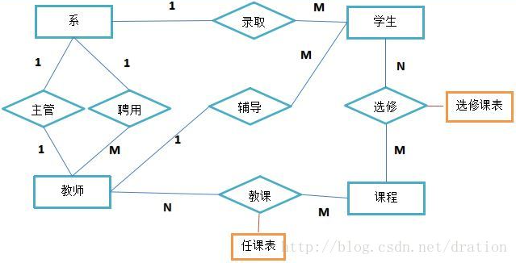

ER图转关系模型：系表（系号、主管教师号）、教师表（教师号、系号、聘期）、学生表（学号、系号、辅导教室号）、任课表（课程号、教师号、教材）、选修课表（课程号、学号）

数据仓库建模的任何实体都需要标准化命名，否则未来的管理成本巨大，也是后续数据有效治理的基础，以下是我们的一个命名规范示例：

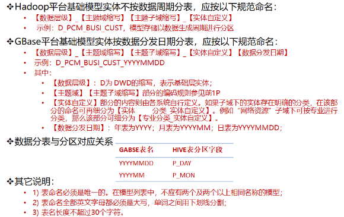

##### 数据仓库建模体系

###### 规范化数据仓库

 规范化数据仓库顾名思义，其中是规范化设计的分析型数据库，然后基于这个数据库为各部门建立数据集市。  该建模体系首先对ETL得到的数据进行ER建模，关系建模，得到一个规范化的数据库模式。然后用这个中心数据库为公司各部门建立基于维度建模的数据集市。各部门开发人员大都从这些数据集市提数，通常来说不允许直接访问中心数据库。

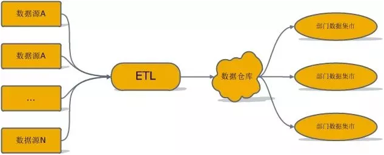

###### 维度建模数据仓库

 非维度建模数据仓库是一种使用交错维度进行建模的数据仓库， 该建模体系首先设计一组常用的度集合，然后创建一个大星座模型表示所有分析型数据。如果这种一致维度不满足某些数据分析要求，自然也可在数据仓库之上继续构建新的数据集市。

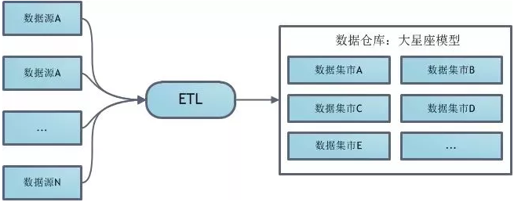

###### 对立数据集市

 独立数据集市的建模体系是让公司的各个组织自己创建并完成ETL，自己维护自己的数据集市。

##### 元数据管理

元数据最简单的定义是描述数据的数据。这里有两个关键点，一个是数据，一个是描述数据。企业中一般的可进行管理的数据如下表：

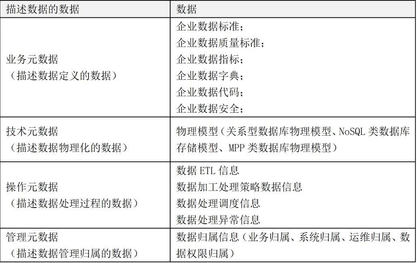

和元数据管理相关的另一个重要概念是元模型，要实现企业元数据管理，需要定义一个符合存储企业数据现状的元数据模型，且这个模型有不同粒度和层次的元模型，有了层次和粒度的划分，未来元数据进行批量管理后就可以灵活的从不同维度进行元数据分析，如企业的数据地图、数据血统都是基于此实现的。

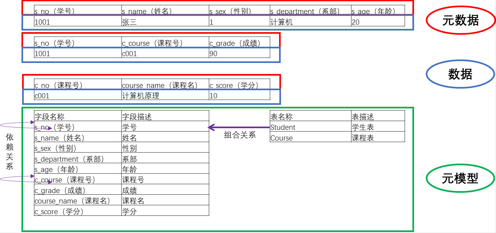

我们试着把企业找中的技术元数据、业务元数据、操作元数据、管理元数据进行元模型的梳理，如下图所示：

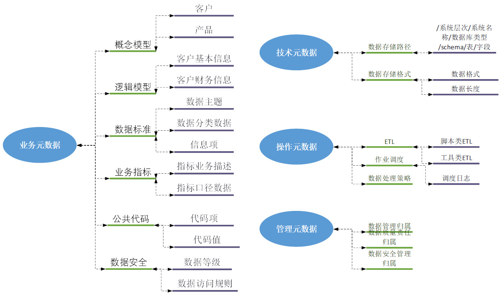

将以上梳理出的信息通过UML建模处理就得到了元模型，在元模型中有包、类、属性、继承、关系。创建元模型的时候也可以参考CWM，CWM定义了一套完整的元模型体系结构，但它是用于数据仓库构建和应用的元数据建模。

###### 什么是元数据管理

国内企业进行元数据管理的方向有三个，一个是基于数据平台进行元数据管理，由于大数据平台的兴起，目前逐步开始针对Hadoop环境进行元数据管理；二是基于企业数据整体管理规划开展对元数据的管理，也是企业数据资产管理的基础；三是元数据作为某个平台的组件进行此平台特有的元数据管理，它作为一个中介或中转互通平台各组件间的数据。
基于数据平台的元数据管理相对成熟，也是业界最早进行元数据管理的切入点或者说是数据平台建设的必备。

在此业务场景下，从技术维度讲：元数据管理围绕着数据平台内的源系统、数据平台、数据集市、数据应用中，数据模型，数据库、表、字段、报表（指标存储字段）、字段和字段间的数据关系进行管理。从业务维度讲：管理指标的定义包括指标的业务维度，技术维度和管理维度三方面的数据、字段的中文描述、表的加工策略、表的生命周期信息、表或字段的安全等级。从应用维度讲：实现数据平台模型变更管理、变更影响分析、数据血统分析、高阶数据地图、调度作业异常影响范围。

###### 怎么管理

要实现企业元数据管理需从两个方面考虑，一是盘点企业数据情况，搞清楚要管理哪些元数据以及这些元数据在什么地方，以何种形态存储，他们之间有有着怎样的联系。二是建模，这里的建模是建立元数据的模型及元模型，要抽象出企业的元模型，建立个元模型之间的逻辑关系。总结的讲盘点企业数据资产和建立企业元模型是元数据管理的两个基本步骤。下面我们展开的讲一下这两点：

企业数据资产盘点，首先要把元数据建设的定位定义清楚，短期解决什么问题，长期达到什么目的，基于短期目标要重点细化。举个例子要实现企业物理模型的全面管理，实现数据结构变更一体化管理这个短期目标，那么就需要盘点企业有多少应用系统，每个应用系统有多少个数据库，数据库的种类有什么，哪些是业务数据表，哪些是垃圾数据表，每个数据字段的含义是否完整，每个系统那个业务部门使用，哪些管理员进行运维，企业的数据变更是否有流程驱动等。将以上信息分为两大类，一类是数据模型本身的元数据信息，一类是支撑数据模型管理的元数据信息，这两类信息都是需要盘点的内容。

元数据建模，元数据建模是对企业要管理的元数据进行结构化、模型化。元模型的构建要一般要参考公共仓库元模型CWM，但也不能照搬CWM，否则构建的元模型太过臃肿，不够灵活。在构建元模型过程中不但要关心模型的结构更要关系模型间的关系，每个模型在元数据的世界里是一个独立的个体，个体和个体之间的关系赋予了模型间错综复杂的关系圈，这些关系的创建往后衍生会支撑数据图谱或知识图谱的构建。再拿数据资产盘点的例子来讲，我们要建立数据库元模型、表元模型、字段元模型、管理员元模型，其中库-表-字段是通过组合关系来构建的，而表-表、字段-字段是通过依赖关系来构建的。通过这样的关系构建就能将企业中的所有有交互的数据形成一个错综复杂庞大的数据关系网络，数据分析人员就可以基于这张网络进行各种信息的挖掘。

##### 数据治理

数据治理产品或工具主要包含以下组件：数据模型管理、元数据管理、数据质量管理、数据标准管理、主数据管理、数据安全管理、数据服务平台。

###### 数据模型管理

数据模型对上是承载数据业务需求的元数据，对下是数据标准管理的内容，同时，是数据质量指标和规则定义的起点，是主数据和参照数据设计的根本，是数据仓库和BI的核心，也是数据安全管控的对象。数据模型管理平台从功能上，主要包括：可视化建模、模型版本管理、数据模型管理、数据模型查询、数据模型浏览、数据模型分析等。

可视化建模。提供的可视化的前台建模能力，支持企业级数据模型的构建，数据可视化建模一般支持Oracle、MySQL、SQL Server、HIVE、HBase等数据库类型，优秀的模型管理平台支持数据仓库或业务系统的正向建模，同时支持将企业现有系统数据模型反向采集。

模型版本管理。支持模型变更和版本的管理，支持版本的回溯，版本明细信息查询。

数据模型管理。支持模型导入功能，对于采用PowerDesigner、Erwin、Excle等模型设计工具设计的模型能够导入到模型管理平台中来，并提供模型的可视化修改、模型导出、模型删除等功能。

数据模型查询。支持数据模型查询，通过输入关键字可以查询到指定的数据模型。

数据模型浏览。支持数据模型全景视图，能够直观看到企业数据的分布地图，并支持通过模型下钻功能进行模型的逐级查询，直到查询的模型的最深层级的元数据。

数据模型分析。主要提供模型的对比分析功能，这种对比分析可以是两个不同模型之间也可以是统一模型的不同版本之间的对比分析。通过模型的对比分析，能够轻松找到模型之间的差异，支持由模型驱动的影响分析。

###### 元数据管理

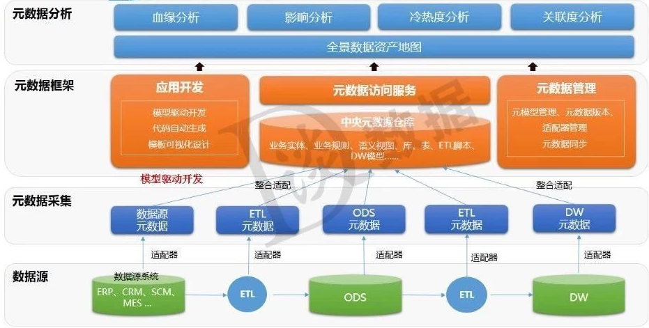

元数据管理统一管控分布在企业各个角落的数据资源，企业涉及的业务元数据、技术元数据、管理元数据都是其管理的范畴。
元数据管理平台从功能上，主要包括：元数据采集服务，应用开发支持服务，元数据访问服务、元数据管理服务和元数据分析服务。

1）元数据采集服务。元数据采集服务提供各类适配器满足以上各类元数据的采集，并将元数据整合处理后统一存储于中央元数据仓库，实现元数据的统一管理。这个过程中，数据采集适配器十分重要，元数据采集要能够适配各种DB、各类ETL、各类DW和Report产品，同时还需要适配各类结构化或半结构化数据源。

2）元数据管理服务。市场上主流的元数据管理产品，基本都包括元数据查询、元模型管理、元数据维护、元数据版本管理、元数据对比分析、元数据适配器、元数据同步管理、元数据生命周期管理等功能。

3）元数据访问服务。元数据访问服务是元数据管理软件提供的元数据访问的接口服务，一般支持REST或Webservice等接口协议。通过元数据访问服务支持企业元数据的共享，是企业数据治理的基础。

4）元数据分析服务。
血缘分析：告诉你数据来自哪里，都经过了哪些加工。
影响分析：告诉你数据都去了哪里，经过了哪些加工。
冷热度分析：告诉你哪些数据是企业常用数据，哪些数据属于僵死数据。
关联度分析：告诉你数据和其他数据的关系以及它们的关系是怎样建立的。
数据资产地图：告诉你有哪些数据，在哪里可以找到这些数据，能用这些数据干什么。

###### 数据质量管理

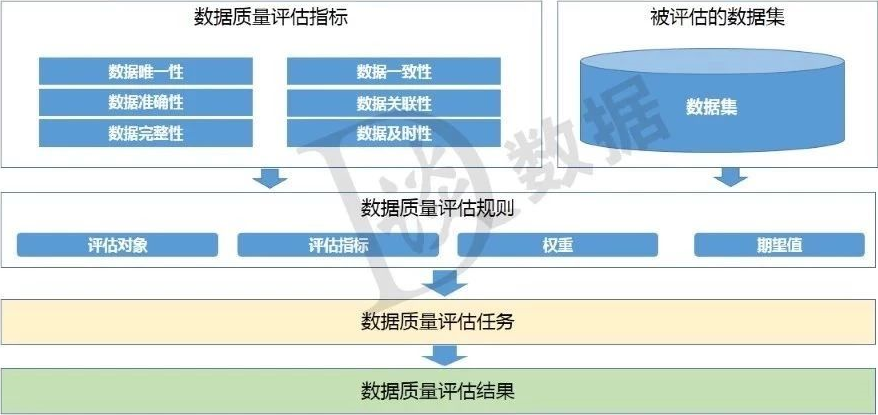

数据质量管理工具在不同的数据治理项目中有时会被单独使用，有时配合元数据使用、有时又与主数据搭档。

在管理范围上，往往会根据项目的需求、客户的目标进行控制，可以是企业级的全域数据质量管理，也可以针对某一特定业务领域进行数据质量管理的实施。

数据质量管理工具从功能上，主要包括：数据质量指标管理、数据质量规则管理、数据质量评估任务、数据质量评估报告。
数据质量指标管理。通过对不同业务规则的收集、分类、抽象和概括，定义数据质量维度，这里给出了六种，分别是：数据唯一性、数据一致性、数据准确性、数据关联性、数据完整性、数据及时性。质量指标反映了数据质量不同的规格标准，也体现了高层次的指标度量的特点。

2）数据治理规则管理。一个数据质量规则包含了数据的评估对象，评估指标、权重和期望值等。质量规则是由业务人员根据各检核类别对不同的业务实体提出的数据质量的衡量标准。它是各检核类别在不同业务实体上的具体体现。

3）数据质量检核任务。检核任务调度模块是数据质量平台的核心，通过执行检核方法生成相应的检核结果问题数据文件，检核结果问题数据能够反映出用户所关心的数据质量问题。

4）数据质量分析报告。数据质量报告提供了一个集中展示数据质量状况的窗口，相关人员可以对数据质量问题进行查询、统计、分析，找到引起数据质量问题的根因，并付诸行动，从源头上解决数据质量的根本问题，实现数据质量的闭环。

###### 数据标准管理

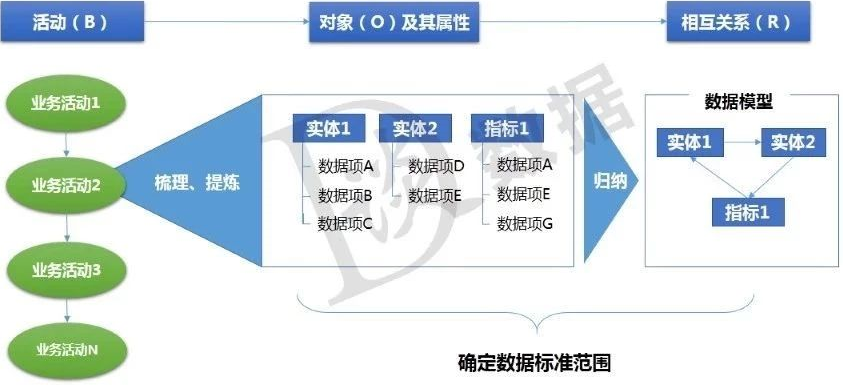

数据标准从字面上理解就是数据既定的“规则”，这个规则一旦定义，就需要必须执行。数据标准化就是研究、制定和推广应用统一的数据分类分级、记录格式及转换、编码等技术标准的过程。

从管理的对象上来看，数据标准主要包含三个方面的标准：

数据模型标准、即元数据的标准化；
主数据和参照数据标准；
指标数据标准，如指标的统计维度、计算方式、分析规则等。

数据标准管理工具，从功能层面主要包括：数据标准编制、数据标准审批、数据标准发布、数据标准使用。
数据标准编制。根据企业业务进行管控数据项的划分，确定数据项的名称、编码、类型、长度、业务含义、数据来源、质量规则、安全级别、域值范围等。数据标准可以参考国际、国家或行业标准的现行标准进行制定，也可以根据企业业务制定特定的企业级数据标准。

2）数据标准审查。对数据标准初稿进行审查，判断数据标准是否符合企业的应用和管理需求，是否符合企业数据战略要求。

3）数据标准发布。数据标准一经发布各部门、各业务系统都需要按相应的标准进行执行，对于遗留系统会存在一定的风险。标准发布的过程需要对现有应用系统、数据模型的影响进行评估，并做好相应的应对策略。

4）数据标准贯彻。把已定义的数据标准与业务系统、应用和服务进行映射，标明标准和现状的关系以及可能影响到的应用。该过程中，对于企业新建的系统应当直接应用定义好的数据标准，对于旧系统应对一般建议建了相应的数据映射关系，进行数据转换，逐步进行数据标准的落地。

###### 主数据管理

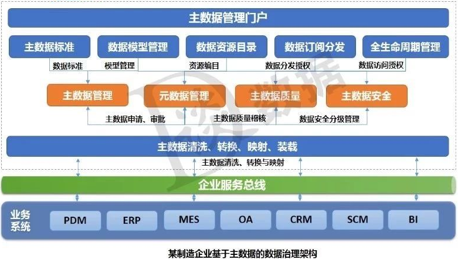

数据标准从字面上理解就是数据既定的“规则”，这个规则一旦定义，就需要必须执行。数据标准化就是研究、制定和推广应用统一的数据分类分级、记录格式及转换、编码等技术标准的过程。

从管理的对象上来看，数据标准主要包含三个方面的标准：

数据模型标准、即元数据的标准化；
主数据和参照数据标准；
指标数据标准，如指标的统计维度、计算方式、分析规则等。

数据标准管理工具，从功能层面主要包括：数据标准编制、数据标准审批、数据标准发布、数据标准使用。
数据标准编制。根据企业业务进行管控数据项的划分，确定数据项的名称、编码、类型、长度、业务含义、数据来源、质量规则、安全级别、域值范围等。数据标准可以参考国际、国家或行业标准的现行标准进行制定，也可以根据企业业务制定特定的企业级数据标准。

2）数据标准审查。对数据标准初稿进行审查，判断数据标准是否符合企业的应用和管理需求，是否符合企业数据战略要求。

3）数据标准发布。数据标准一经发布各部门、各业务系统都需要按相应的标准进行执行，对于遗留系统会存在一定的风险。标准发布的过程需要对现有应用系统、数据模型的影响进行评估，并做好相应的应对策略。

4）数据标准贯彻。把已定义的数据标准与业务系统、应用和服务进行映射，标明标准和现状的关系以及可能影响到的应用。该过程中，对于企业新建的系统应当直接应用定义好的数据标准，对于旧系统应对一般建议建了相应的数据映射关系，进行数据转换，逐步进行数据标准的落地。

###### 数据安全管理

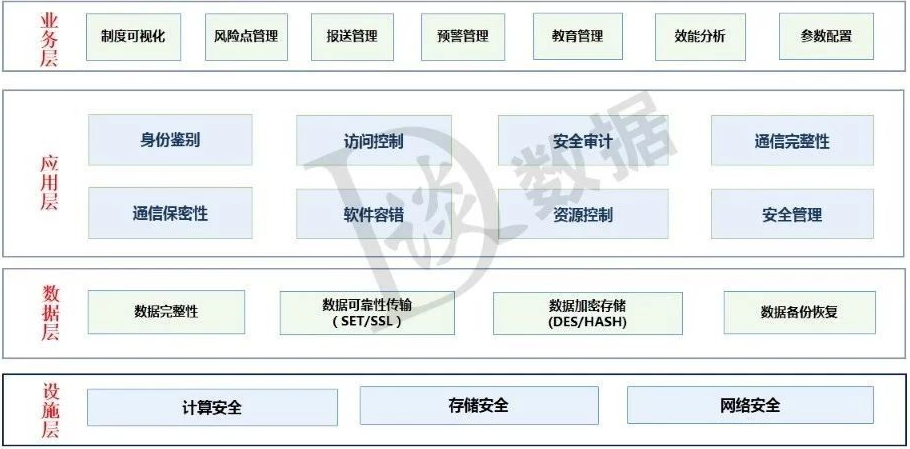

数据安全涵盖了操作系统安全、网络安全、数据库安全、软件应用安全等。

对于数据的安全治理，侧重点是对于数据使用过程的控制，使得数据安全合法的进行使用，所以管控的重点是在应用上。

从应用上，数据安全的主要功能包括：身份认证与访问控制、数据合规性申请、数据分级与授权、数据脱敏/脱敏、数据加密、安全审计等。

1）身份认证与访问控制。身份认证是为访问控制提供支撑，访问控制提供了不同身份用户访问不同信息资源提供了相应的安全策略。身份认证是在计算机及计算机网络系统中确认操作者身份的过程，确定用户是否具有对某种资源的访问和使用权限，防止攻击者假冒合法用户获得资源的访问权限，保证系统和数据的安全。常用身份认证的技术包括：电子签名（CA）、USB-key（智能卡）、静态口令，动态口令、短信密码、人脸识别、指纹识别、虹膜识别、声音识别等。

2）数据合规性申请。对于企业关键信息的创建和变更需要符合企业相关的数据管理流程，建立数据申请、审批制度，对新增的数据或变更的数据进行合法性审批。

3）数据的分级与授权。根据数据的来源、内容和用途对数据资产进行分类，根据数据的价值、敏感程度、影响范围进行敏感分级，建立敏感分级数据与用户角色的访问控制矩阵，对不同等级的数据分配给相应的用户角色实现分级授权。

4）数据脱敏。简单的数据脱敏技术就是给数据打个“马赛克”，脱敏的过程数据的含义保持不变、数据类型不变、数据的关系不变。

5）数据加密。数据加密技术是数据防窃取的一种安全防治技术，指将一个信息经过加密钥匙及加密函数转换，变成无意义的密文，而接收方则将此密文经过解密函数、解密钥匙还原成明文。

6）安全审计。数据安全审计是通过记录用户对数据的所有访问和操作记录日志，并通过日志的分类统计和分析，提供数据访问报表，支持对数据的检索和分析，支持对用户的违规访问和危险操作进行告警。

###### 数据服务平台

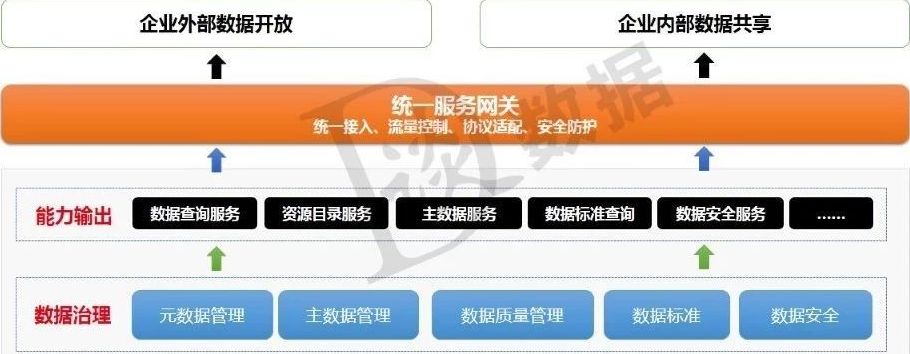

数据服务平台是数据治理的能力输出平台，持续的数据服务能力输出，披荆斩棘，为前端的数据分析和数据应用提供支撑。

数据服务平台在互联网架构下一般会基于统一的API网关进行服务的统一接入，由统一网关对所有数据服务进行调度、管理、编排、适配，应适应企业内部的数据共享和企业外部的数据开放等需求。

数据服务平台主要包括服务能力输出和统一网关服务两大部分，一部分是输出数据服务能力，另一部分是通过统一的网关来管理这些能力。

1）能力输出。数据治理平台的主要输出的数据服务能力包括：数据查询服务、资源目录服务、主数据服务、数据标准查询服务、数据安全服务等，每一类数据服务都是由一组服务接口组成的。

数据服务能力也可以根据业务主题进行组织，形成主题服务。数据服务的量和质量也是考验一个数据治理项目实施的一项重要指标。

2）服务网关。严格意义上来说，服务网关也是一套独立的工具，核心功能包括：服务的编排、注册接入、流程控制、协议适配、安全防护等。

传统架构中一般会以ESB——企业服务总线，作为服务网关来使用。在互联网架构下，ESB这种中心化的架构对应高并发的前台应用无法支撑，所以目前一般采用API网关，即API Gateway技术来替代传统的ESB。API网关提供日志、安全、流量控制、熔断、负载均衡、鉴权等功能插件。

这些插件会随着企业业务应用规模等的变化进行不断的强化与调整，而不用频繁对网关层进行改动，确保网关层的稳定性。

