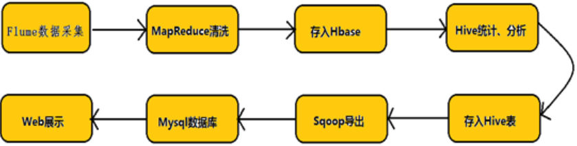

运营重点是拓展用户价值。这里有两个问题：第一是提升用户价值，具体而言就是提升用户的单均价和消费频次，从而提升用户的LTV（life-time value)。基本手段包括交叉销售（新品类的推荐）、向上销售（优质高价供给的推荐）以及重复购买（优惠、红包刺激重复下单以及优质供给的推荐带来下单频次的提升）；第二个问题是用户的留存，通过提升用户总体体验以及在用户有流失倾向时通过促销和优惠将用户留在外卖平台。

#### 大数据平台

如今的 Hadoop 由两大部分组成。第一部分是名为 Hadoop 分布式文件系统（HDFS）的大规模存储系统，该系统能高效、低成本地存储数据，且针对大数据的容量、多样性和速度进行了优化。第二部分是名为 YARN 的计算引擎，该引擎能在 HDFS 存储的数据上运行大量并行程序。MapReduce 只是 Hadoop 集群处理数据的诸多方式之一。Spark 可以替代 MapReduce。
Hadoop 分布式文件系统，支持对应数据高吞吐量访问的分布式文件系统；
（3）  用于作业调度和集群资源管理的 Hadoop YANRN 框架；
（4）  Hadoop MapReduce ，基于  YARN  的大数据并行处理系统  

Spark和Storm两者最大的区别在于实时性：Spark是准实时，先收集一段时间的数据再进行统一处理，好比看网页统计票数每隔几秒刷新一次，而Storm则是完全实时，来一条数据就处理一条。当然Storm实时处理方式所带来的缺点也是很明显的，不论离线批处理，高延迟批处理还是交互式查询都不如Spark框架。

任何类型的数据都是作为事件流产生的。信用卡交易，传感器测量，机器日志或网站或移动应用程序上的用户交互，所有这些数据都作为流生成。数据可以作为无界或有界流处理。无界流有一个开始但没有定义的结束。它们不会在生成时终止并提供数据。必须持续处理无界流，即必须在摄取事件后立即处理事件。无法等待所有输入数据到达，因为输入是无界的，并且在任何时间点都不会完成。处理无界数据通常要求以特定顺序（例如事件发生的顺序）摄取事件，以便能够推断结果完整性。有界流具有定义的开始和结束。可以在执行任何计算之前通过摄取所有数据来处理有界流。处理有界流不需要有序摄取，因为可以始终对有界数据集进行排序。有界流的处理也称为批处理。

hive是基于Hadoop构建的一套数据仓库分析系统，它提供了丰富的SQL查询方式来分析存储在Hadoop分布式文件系统中的数据：可以将结构化的数据文件映射为一张数据库表，并提供完整的SQL查询功能；可以将SQL语句转换为MapReduce任务运行，通过自己的SQL查询分析需要的内容，这套SQL简称Hive SQL，使不熟悉mapreduce的用户可以很方便地利用SQL语言‘查询、汇总和分析数据。
它与关系型数据库的SQL略有不同，但支持了绝大多数的语句如DDL、DML以及常见的聚合函数、连接查询、条件查询。它还提供了一系列的1：具进行数据提取转化加载，用来存储、查询和分析存储在Hadoop中的大规模数据集，并支持UDF（User-Defined Function）、UDAF(User-Defnes AggregateFunction)和USTF（User-Defined Table-Generating Function），也可以实现对map和reduce函数的定制，为数据操作提供了良好的伸缩性和可扩展性。
hive 是一种底层封装了Hadoop 的数据仓库处理工具，使用类SQL 的hiveQL 语言实现数据查询，所有hive 的数据都存储在Hadoop 兼容的文件系统（例如，Amazon S3、HDFS）中。hive 在加载数据过程中不会对数据进行任何的修改，只是将数据移动到HDFS 中hive 设定的目录下，因此，hive 不支持对数据的改写和添加，所有的数据都是在加载的时候确定的。
hive中包含以下四类数据模型：表(Table)、外部表(External Tablc)、分区(Partition)、桶(Bucket)。  
(1) hive中的Table和数据库中的Table在概念上是类似的。在hive中每一个Table都有一个相应的目录存储数据。
(2)外部表是一个已经存储在HDFS中，并具有一定格式的数据。使用外部表意味着hive表内的数据不在hive的数据仓库内，它会到仓库目录以外的位置访问数据。 [5]  
外部表和普通表的操作不同，创建普通表的操作分为两个步骤，即表的创建步骤和数据装入步骤（可以分开也可以同时完成）。在数据的装入过程中，实际数据会移动到数据表所在的hive数据仓库文件目录中，其后对该数据表的访问将直接访问装入所对应文件目录中的数据。删除表时，该表的元数据和在数据仓库目录下的实际数据将同时删除。 [5]  
外部表的创建只有一个步骤，创建表和装人数据同时完成。外部表的实际数据存储在创建语句I。OCATION参数指定的外部HDFS文件路径中，但这个数据并不会移动到hive数据仓库的文件目录中。删除外部表时，仅删除其元数据，保存在外部HDFS文件目录中的数据不会被删除。 [5]  
(3)分区对应于数据库中的分区列的密集索引，但是hive中分区的组织方式和数据库中的很不相同。在hive中，表中的一个分区对应于表下的一个目录，所有的分区的数据都存储在对应的目录中。 [5]  
(4)桶对指定列进行哈希(hash)计算，会根据哈希值切分数据，目的是为了并行，每一个桶对应一个文件。

数据抽取是指把ODS源数据抽取到DW中，然后处理成展示给相关人员查看的数据

源数据：用户访问日志、自定义事件日志、操作日志、业务日志
抽取频次：如果没有特殊要求可以一天一次，但是需要避开拉去日志的高峰期；对于有实时性要求的日志，可以一小时一次，或者直接使用kafka等相关工具收集，需要考虑到系统能否承受
抽取策略：由于数据量较大，一般都是采用增量抽取，但是对于一些特殊场景的数据，比如订单数据，由于订单的状态会发生变化，并且订单的量级是可预知和相对较少的，就需要采用全量拉取的策略对于增量拉取的日志，如果是文件类型，可以在文件名称上追加日期，例如 server_log_2018082718.log，这样就可以满足按小时拉取的需求，对于源数据的保留，考虑到突发情况，服务器上的源数据至少要保证2天以上的时间
二、数据转换、清洗
　一般情况下，数据仓库分为ODS、DW两部分。通常的做法是从业务系统到ODS做清洗，将脏数据和不完整数据过滤掉，在从ODS到DW的过程中转换，进行一些业务规则的计算和聚合。
顾名思义，就是把不需要的和不符合规范的数据进行处理。数据清洗最好不要放在抽取的环节进行，考虑到有时可能会查原始数据。一般各公司都会有自己的规范，以下列出几点仅供参考
数据清洗主要包括以下几个方面：
空值处理；根据业务需要，可以将空值替换为特定的值或者直接过滤掉；
验证数据正确性；主要是把不符合业务含义的数据做一处理，比如，把一个表示数量的字段中的字符串替换为0，把一个日期字段的非日期字符串过滤掉等等；
规范数据格式；比如，把所有的日期都格式化成yyyy-MM-dd HH:mm:ss的格式等；
数据转码；把一个源数据中用编码表示的字段，通过关联编码表，转换成代表其真实意义的值等等；
数据标准，统一；比如在源数据中表示男女的方式有很多种，在抽取的时候，直接根据模型中定义的值做转化，统一表示男女；
其他业务规则定义的数据清洗...
三、数据加载
数据拉取，清洗完之后，就需要展示了。一般是把清洗好的数据加载到mysql中，然后在各系统中使用，或者使用Tableau直接给相关人员展示

数据库管理系统(Database Management System)是一种操纵和管理数据库的大型软件，用于建立、使用和维护数据库，简称DBMS。它对数据库进行统一的管理和控制，以保证数据库的安全性和完整性。用户通过DBMS访问数据库中的数据，数据库管理员也通过DBMS进行数据库的维护工作。它可以支持多个应用程序和用户用不同的方法在同时或不同时刻去建立，修改和询问数据库。大部分DBMS提供数据定义语言DDL（Data Definition Language）和数据操作语言DML（Data Manipulation Language），供用户定义数据库的模式结构与权限约束，实现对数据的追加、删除等操作。
目前市场上比较流行的数据库管理系统产品主要是Oracle、IBM、Microsoft和Sybase、Mysql等公司的产品。

Hive是基于Hadoop的一个数据仓库工具，可以将结构化的数据文件映射为一张数据库表，并提供类SQL查询功能。
Hive利用HDFS存储数据，利用MapReduce查询数据
Hive中所有的数据都存储在 HDFS 中，没有专门的数据存储格式
Hive 中没有定义专门的数据格式，数据格式可以由用户指定，用户定义数据格式需要指定三个属性：列分隔符（通常为空格、”\t”、”\x001″）、行分隔符（”\n”）以及读取文件数据的方法（Hive 中默认有三个文件格式TextFile，SequenceFile以及RCFile）。由于在加载数据的过程中，不需要从用户数据格式到 Hive 定义的数据格式的转换，因此，Hive在加载的过程中不会对数据本身进行任何修改，而只是将数据内容复制或者移动到相应的HDFS目录中。而在数据库中，不同的数据库有不同的存储引擎，定义了自己的数据格式。所有数据都会按照一定的组织存储，因此，数据库加载数据的过程会比较耗时。
　由于Hive是针对数据仓库应用设计的，而数据仓库的内容是读多写少的。因此，Hive中不支持对数据的改写和添加，所有的数据都是在加载的时候中确定好的。而数据库中的数据通常是需要经常进行修改的，因此可以使用 INSERT INTO …  VALUES 添加数据，使用 UPDATE … SET修改数据。
之前已经说过，Hive在加载数据的过程中不会对数据进行任何处理，甚至不会对数据进行扫描，因此也没有对数据中的某些Key建立索引。Hive要访问数据中满足条件的特定值时，需要暴力扫描整个数据，因此访问延迟较高。由于 MapReduce 的引入， Hive 可以并行访问数据，因此即使没有索引，对于大数据量的访问，Hive 仍然可以体现出优势。数据库中，通常会针对一个或者几个列建立索引，因此对于少量的特定条件的数据的访问，数据库可以有很高的效率，较低的延迟。由于数据的访问延迟较高，决定了 Hive 不适合在线数据查询。
同样白话一点加不严格一点，hbase可以认为是hdfs的一个包装。他的本质是数据存储，是个NoSql数据库；hbase部署于hdfs之上，并且克服了hdfs在随机读写方面的缺点
白话一点再加不严格一点，hive可以认为是map-reduce的一个包装。hive的意义就是把好写的hive的sql转换为复杂难写的map-reduce程序。
Hive和Hbase有各自不同的特征：hive是高延迟、结构化和面向分析的，hbase是低延迟、非结构化和面向编程的。Hive数据仓库在hadoop上是高延迟的。 
　　其中HBase位于结构化存储层，Hadoop HDFS为HBase提供了高可靠性的底层存储支持，Hadoop MapReduce为HBase提供了高性能的计算能力，Zookeeper为HBase提供了稳定服务和failover机制。 
物理表：物理表是具体某个数据源中的一张表。对于mysql就是一个table，对于Hbase可以是一张hbase表，对于ES是一个索引。mysql， Hbase和ES这些物理表必须要有合理的key。特殊的物理表不含有key逻辑表：逻辑表可以理解为数据库中的视图，是一张虚拟表。可以映射到一张物理表，也可以由多张物理表组成，这些物理表可以来自于不同的数据源。对于mysql, Hbase和ES，要组成一张逻辑表，只需要他们有相同含义的key即可。这个key在mysql中是主键，Hbase中是生成rowkey用的值，是ES中的key。
在大数据架构中，Hive和HBase是协作关系，数据流一般如下图：
通过ETL工具将数据源抽取到HDFS存储；
通过Hive清洗、处理和计算原始数据；
HIve清洗处理后的结果，如果是面向海量数据随机查询场景的可存入Hbase
数据应用从HBase查询数据；

关系型数据库，是指采用了关系模型来组织数据的数据库，其以行和列的形式存储数据，以便于用户理解，关系型数据库这一系列的行和列被称为表，一组表组成了数据库。用户通过查询来检索数据库中的数据，而查询是一个用于限定数据库中某些区域的执行代码。关系模型可以简单理解为二维表格模型，而一个关系型数据库就是由二维表及其之间的关系组成的一个数据组织。
Sqoop(发音：skup)是一款开源的工具，主要用于在Hadoop(Hive)与传统的数据库(mysql、postgresql...)间进行数据的传递，可以将一个关系型数据库（例如 ： MySQL ,Oracle ,Postgres等）中的数据导进到Hadoop的HDFS中，也可以将HDFS的数据导进到关系型数据库中。

