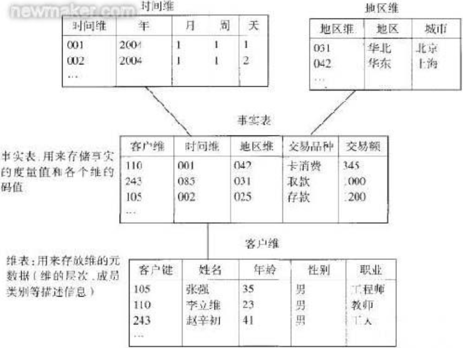
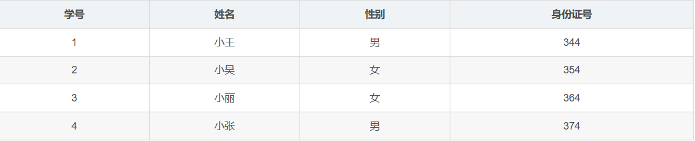
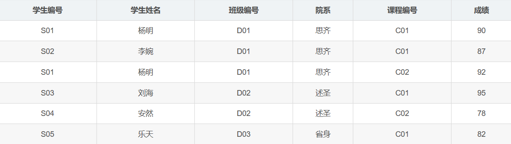
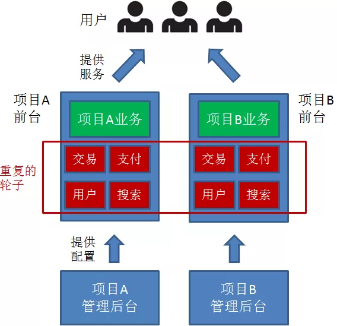
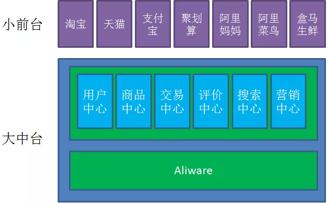
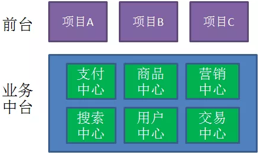
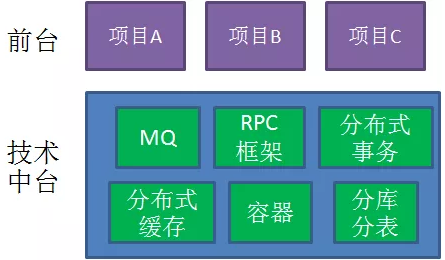
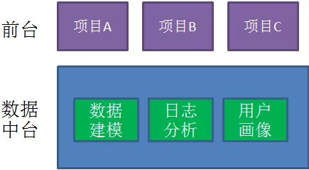
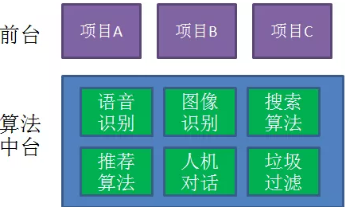

运营重点是拓展用户价值。这里有两个问题：第一是提升用户价值，具体而言就是提升用户的单均价和消费频次，从而提升用户的LTV（life-time value)。基本手段包括交叉销售（新品类的推荐）、向上销售（优质高价供给的推荐）以及重复购买（优惠、红包刺激重复下单以及优质供给的推荐带来下单频次的提升）；第二个问题是用户的留存，通过提升用户总体体验以及在用户有流失倾向时通过促销和优惠将用户留在外卖平台。

数据仓库是一个面向主题的（Subject Oriented）、集成的（Integrate）、相对稳定的（Non-Volatile）、反映历史变化（Time Variant）的数据集合，它用于支持企业或组织的决策分析处理。
 前期业务调研 需求调研 数据调研 技术选型

2). 提炼业务模型，总线矩阵，划分主题域；

3). 定制规范 命名规范、开发规范、流程规范

4). 数仓架构分层：一般分为

操作数据层（ODS）、公共维度模型层（CDM）和应用数据层（ADS）,其中公共维度模型层包括明细数据层（DWD和汇总数据层（DWS）

公共维度模型层（CDM）：存放明细事实数据、维表数据及公共指标汇总数据,其中明细事实数据、维表数据一般根据ODS层数据加工生成：公共指标汇总数据一般根据维表数据和明细事实数据加工生成。

CDM层又细分为DWD层和DWS层,分别是明细数据层和汇总数据层,采用维度模型方法作为理论基础,更多地采用一些维度退化手法,将维度退化至事实表中,减少事实表和维表的关联,提高明细数据表的易用性：同时在汇总数据层,加强指标的维度退化,采取更多的宽表化手段构建公共指标数据层,提升公共指标的复用性,减少重复加工。

应用数据层（ADS）：存放数据产品个性化的统计指标数据,根据CDM层与ODS层加工生成。

 5）.选择合适的数据模型，不同的行业涉选取的模型近不相同，合适的模型，更利于在数据存储，计算，开发，安全，以及数据查询的效率，更能体现数仓的价值。

商务智能是一种以提供决策分析性的运营数据为目的而建立的信息系统。是属于在线分析处理：On Line Analytical Processing(OLAP)，将预先计算完成的汇总数据，储存于魔方数据库(Cube) 之中，针对复杂的分析查询，提供快速的响应。在前10年，BI报表项目比较多，是数据仓库项目的前期预热项目（主要分析为主的阶段，是数据仓库的初级阶段），制作一些可视化报表展现给管理者。

它利用信息科技，将分散于企业内、外部各种数据加以整合并转换成知识，并依据某些特定的主题需求，进行决策分析和运算；

用户则通过报表、图表、多维度分析的方式，寻找解决业务问题所需要的方案；

 这些结果将呈报给决策者，以支持策略性的决策和定义组织绩效，或者融入智能知识库自动向客户推送。

#### 数据仓库

传统的离线 Batch SQL （面向有界数据集的 SQL）有三种基础的实现方式，分别是 Nested-loop Join、Sort-Merge Join 和 Hash Join。

Nested-loop Join 最为简单直接，将两个数据集加载到内存，并用内嵌遍历的方式来逐个比较两个数据集内的元素是否符合 Join 条件。Nested-loop Join 虽然时间效率以及空间效率都是最低的，但胜在比较灵活适用范围广，因此其变体 BNL 常被传统数据库用作为 Join 的默认基础选项。

Sort-Merge Join 顾名思义，分为两个 Sort 和 Merge 阶段。首先将两个数据集进行分别排序，然后对两个有序数据集分别进行遍历和匹配，类似于归并排序的合并。值得注意的是，Sort-Merge 只适用于 Equi-Join（Join 条件均使用等于作为比较算子）。Sort-Merge Join 要求对两个数据集进行排序，成本很高，通常作为输入本就是有序数据集的情况下的优化方案。

Hash Join 同样分为两个阶段，首先将一个数据集转换为 Hash Table，然后遍历另外一个数据集元素并与 Hash Table 内的元素进行匹配。第一阶段和第一个数据集分别称为 build 阶段和 build table，第二个阶段和第二个数据集分别称为 probe 阶段和 probe table。Hash Join 效率较高但对空间要求较大，通常是作为 Join 其中一个表为适合放入内存的小表的情况下的优化方案。和 Sort-Merge Join 类似，Hash Join 也只适用于 Equi-Join。

##### 数据模型

维度建模以分析决策的需求出发构建模型，构建的数据模型为分析需求服务，因此它重点解决用户如何更快速完成分析需求，同时还有较好的大规模复杂查询的响应性能。它是面向分析的，为了提高查询性能可以增加数据冗余，反规范化的设计技术。

事实表产生于业务过程，存储了业务活动或事件提炼出来的性能度量。从最低的粒度级别来看，事实表行对应一个度量事件。事实表根据粒度的角色划分不同，可分为事务事实表、周期快照事实表、累积快照事实表。

（1）事务事实表，用于承载事务数据，通常粒度比较低，它是面向事务的，其粒度是每一行对应一个事务，它是最细粒度的事实表，例如产品交易事务事实、ATM交易事务事实。

（2）周期快照事实表，按照一定的时间周期间隔(每天，每月)来捕捉业务活动的执行情况，一旦装入事实表就不会再去更新，它是事务事实表的补充。用来记录有规律的、固定时间间隔的业务累计数据，通常粒度比较高，例如账户月平均余额事实表。

（3）累积快照事实表，用来记录具有时间跨度的业务处理过程的整个过程的信息，每个生命周期一行，通常这类事实表比较少见。

维度表，一致性维度，业务过程的发生或分析角度，我们主要关注下退化维度和缓慢变化维。

（1）退化维度（DegenerateDimension）
在维度类型中，有一种重要的维度称作为退化维度，亦维度退化一说。这种维度指的是直接把一些简单的维度放在事实表中。退化维度是维度建模领域中的一个非常重要的概念，它对理解维度建模有着非常重要的作用，退化维度一般在分析中可以用来做分组使用。

（2）缓慢变化维（Slowly Changing Dimensions）
维度的属性并不是始终不变的，它会随着时间的流逝发生缓慢的变化，这种随时间发生变化的维度我们一般称之为缓慢变化维（SCD）。

###### 建模方法

维度表：表示对分析主题所属类型的描述。事实表：表示对分析主题的度量。

维度建模：星型模型、雪花模型、星座模型

星型模型主要是维表和事实表，以事实表为中心，所有维度直接关联在事实表上，呈星型分布。 维表只和事实表关联，维表之间没有关联；每个维表的主码为单列，且该主码放置在事实表中，作为两边连接的外码；以事实表为核心，维表围绕核心呈星形分布；

雪花模型，在星型模型的基础上，维度表上又关联了其他维度表。这种模型维护成本高，性能方面也较差，所以一般不建议使用。

星座模型，是对星型模型的扩展延伸，多张事实表共享维度表。数仓模型建设后期，大部分维度建模都是星座模型。

###### 范式建模

范式建模：即 实体关系（ER）模型，设计一个3NF模型，用实体加关系描述的数据模型描述企业业务架构，在范式理论上符合3NF。超键：在关系中能唯一标识元组的属性集称为关系模式的超键；候选键：不含有多余属性的超键称为候选键。也就是关系中的一个属性组，其值能唯一标识一个元组。若从属性组中去掉任何一个属性，它就不具有这一性质了，这样的属性组称作候选键；主属性：任何一个候选键中的属性称作主属性；主键：用户从一个关系的多个候选键中，选定一个作为主键。

超键：在学生表中含有学号或者身份证号的任意组合都可以唯一标识一个学生，那么它们就是此表的超键。如：（学号）、（身份证号）、（学号，姓名）、（身份证号，性别）等。

候选键：候选键属于超键，它是最小的超键，就是说如果再去掉候选键中的任何一个属性它就不再是超键了。对于（学号、姓名）来说，去掉姓名后仍是一个超键，那么它就不是候选键。其中，学生表中的候选键为：（学号）、（身份证号），主属性就是学号、身份证号。

主键：主键就是候选键里面的一个，用户可以选择，那么在这里我们选择（学号）作为学生表的主键。
函数依赖也就是一个或者一组属性的值可以决定其他属性的值。候选键都可以做到。

（学生编号、课程编号）作为主键，可以唯一标识每条元组，但是对于学生姓名、学生所属的班级编号、院系，这三个属性可以直接通过学生编号来确定，在这里课程编号显得很多余。于是称，学生姓名、班级编号、院系对（学生编号、课程编号）部分函数依赖。即，非主属性对键有部分函数依赖。学生编号可以唯一确定他所在的院系，但是注意到这中间存在传递过程，即学生编号唯一确定该学生所对应的班级编号，班级编号对应唯一的院系。我们称，院系对学生编号传递函数依赖。即，非主属性对键有部分函数依赖。

`1NF`：关系中每一分量不可再分。即不能以集合、序列等作为属性。也就是不能表中套表，要保证数据的原子性；`2NF`: 在1NF基础上，消除非主属性对键的部分依赖，则称它符合2NF；`3NF`: 在2NF基础上，消除非主属性对键的传递依赖，则称它符合3NF。

##### 数据仓库建模体系

###### 规范化数据仓库

 规范化数据仓库顾名思义，其中是规范化设计的分析型数据库，然后基于这个数据库为各部门建立数据集市。  该建模体系首先对ETL得到的数据进行ER建模，关系建模，得到一个规范化的数据库模式。然后用这个中心数据库为公司各部门建立基于维度建模的数据集市。各部门开发人员大都从这些数据集市提数，通常来说不允许直接访问中心数据库。

###### 维度建模数据仓库

 非维度建模数据仓库是一种使用交错维度进行建模的数据仓库， 该建模体系首先设计一组常用的度集合，然后创建一个大星座模型表示所有分析型数据。如果这种一致维度不满足某些数据分析要求，自然也可在数据仓库之上继续构建新的数据集市。

###### 对立数据集市

 独立数据集市的建模体系是让公司的各个组织自己创建并完成ETL，自己维护自己的数据集市。

##### 数据应用

###### `OLAP`

`OLAP`: 在线分析处理，主要用于支持企业决策管理分析。区别于``OLTP`: 联机事务处理。

`OLAP`的优势：丰富的数据展现方式、高效的数据查询以及多视角多层次的数据分析。

`OLAP`的多维分析操作包括：钻取、上卷、切片、切块以及旋转。

`OLAP`按存储器的数据存储格式分为ROLAP、MOLAP和 HOLAP。
MOLAP，基于多维数组的存储模型，也是OLAP最初的形态，特点是对数据进行预计算，以空间换效率，明细和聚合数据都保存在cube中。但生成cube需要大量时间和空间。
ROLAP，完全基于关系模型进行存储数据，不需要预计算，按需即时查询。明细和汇总数据都保存在关系型数据库事实表中。
HOLAP，混合模型，细节数据以ROLAP存放，聚合数据以MOLAP存放。这种方式相对灵活，且更加高效。可按企业业务场景和数据粒度进行取舍，没有最好，只有最适合。

数据仓库，是为企业所有级别的决策制定过程，提供所有类型数据支持的战略集合。它出于分析性报告和决策支持目的而创建。为需要业务智能的企业，提供指导业务流程改进、监视时间、成本、质量以及控制。
数据仓库随时间变化不断增加新的数据内容。数据仓库系统必须不断捕捉OLTP数据库中变化的数据，追加到数据仓库中去，也就是要不断地生成OLTP数据库的快照，经统一集成后增加到数据仓库中去；但对于确实不再变化的数据库快照，如果捕捉到新的变化数据，则只生成一个新的数据库快照增加进去，而不会对原有的数据库快照进行修改。
数据仓库随时间变化不断删去旧的数据内容。数据仓库的数据也有存储期限，一旦超过了这一期限，过期数据就要被删除。只是数据仓库内的数据时限要远远长于操作型环境中的数据时限。在操作型环境中一般只保存有60~90天的数据，而在数据仓库中则需要保存较长时限的数据（如5~10年），以适应DSS进行趋势分析的要求。
数据仓库中包含有大量的综合数据，这些综合数据中很多跟时间有关，如数据经常按照时间段进行综合，或隔一定的时间片进行抽样等等。这些数据要随着时间的变化不断地进行重新综合。因此，数据仓库的数据特征都包含时间项，以标明数据的历史时期。

数据库的表设计往往是针对某一个应用进行设计的。对于数据分析和数据挖掘，我们引入数据仓库概念。数据仓库的表结构是依照分析需求，分析维度，分析指标进行设计的。
数据库与数据仓库的区别实际讲的是OLTP与OLAP的区别。
操作型处理，叫联机事务处理OLTP（On-Line Transaction Processing，），也可以称面向交易的处理系统，它是针对具体业务在数据库联机的日常操作，通常对少数记录进行查询、修改。用户较为关心操作的响应时间、数据的安全性、完整性和并发支持的用户数等问题。传统的数据库系统作为数据管理的主要手段，主要用于操作型处理。
分析型处理，叫联机分析处理OLAP（On-Line Analytical Processing）一般针对某些主题的历史数据进行分析，支持管理决策
数据仓库标准上可以分为四层：ODS（临时存储层）、PDW（数据仓库层）、DM（数据集市层）、APP（应用层）。
ODS层：

为临时存储层，是接口数据的临时存储区域，为后一步的数据处理做准备。一般来说ODS层的数据和源系统的数据是同构的，主要目的是简化后续数据加工处理的工作。从数据粒度上来说ODS层的数据粒度是最细的。ODS层的表通常包括两类，一个用于存储当前需要加载的数据，一个用于存储处理完后的历史数据。历史数据一般保存3-6个月后需要清除，以节省空间。但不同的项目要区别对待，如果源系统的数据量不大，可以保留更长的时间，甚至全量保存；

PDW层：

为数据仓库层，PDW层的数据应该是一致的、准确的、干净的数据，即对源系统数据进行了清洗（去除了杂质）后的数据。这一层的数据一般是遵循数据库第三范式的，其数据粒度通常和ODS的粒度相同。在PDW层会保存BI系统中所有的历史数据，例如保存10年的数据。

DM层：

为数据集市层，这层数据是面向主题来组织数据的，通常是星形或雪花结构的数据。从数据粒度来说，这层的数据是轻度汇总级的数据，已经不存在明细数据了。从数据的时间跨度来说，通常是PDW层的一部分，主要的目的是为了满足用户分析的需求，而从分析的角度来说，用户通常只需要分析近几年（如近三年的数据）的即可。从数据的广度来说，仍然覆盖了所有业务数据。

APP层：

为应用层，这层数据是完全为了满足具体的分析需求而构建的数据，也是星形或雪花结构的数据。从数据粒度来说是高度汇总的数据。从数据的广度来说，则并不一定会覆盖所有业务数据，而是DM层数据的一个真子集，从某种意义上来说是DM层数据的一个重复。从极端情况来说，可以为每一张报表在APP层构建一个模型来支持，达到以空间换时间的目的数据仓库的标准分层只是一个建议性质的标准，实际实施时需要根据实际情况确定数据仓库的分层，不同类型的数据也可能采取不同的分层方法。

元数据的定义：数据仓库的元数据是关于数据仓库中数据的数据。它的作用类似于数据库管理系统的数据字典，保存了逻辑数据结构、文件、地址和索引等信息。广义上讲，在数据仓库中，元数据描述了数据仓库内数据的结构和建立方法的数据。

 元数据是数据仓库管理系统的重要组成部分，元数据管理器是企业级数据仓库中的关键组件，贯穿数据仓库构建的整个过程，直接影响着数据仓库的构建、使用和维护。

构建数据仓库的主要步骤之一是ETL。这时元数据将发挥重要的作用，它定义了源数据系统到数据仓库的映射、数据转换的规则、数据仓库的逻辑结构、数据更新的规则、数据导入历史记录以及装载周期等相关内容。数据抽取和转换的专家以及数据仓库管理员正是通过元数据高效地构建数据仓库。

用户在使用数据仓库时，通过元数据访问数据，明确数据项的含义以及定制报表。

数据仓库的规模及其复杂性离不开正确的元数据管理，包括增加或移除外部数据源，改变数据清洗方法，控制出错的查询以及安排备份等。

 元数据可分为技术元数据和业务元数据。技术元数据为开发和管理数据仓库的IT 人员使用，它描述了与数据仓库开发、管理和维护相关的数据，包括数据源信息、数据转换描述、数据仓库模型、数据清洗与更新规则、数据映射和访问权限等。而业务元数据为管理层和业务分析人员服务，从业务角度描述数据，包括商务术语、数据仓库中有什么数据、数据的位置和数据的可用性等，帮助业务人员更好地理解数据仓库中哪些数据是可用的以及如何使用。

##### 数据中台

在传统的前台-后台架构中，各个项目相对独立，许多项目都在重复发明同样的轮子，即让项目本身越来越臃肿，也让开发效率越来越低。

为提高开发效率整合出一个中间组织，为所有的项目提供一些公共资源。这个中间组织就是“中台”。

业务中台就是把各个项目的共通业务进行下沉，整合成通用的服务平台。

技术中台向各个项目提供通用的底层框架、引擎、中间件。

数据中台为各个项目进行各种数据采集和分析

算法中台为各个项目提供算法能力，比如推荐算法、搜索算法、图像识别、语音识别等等

#### 大数据平台

##### Hbase

就像Bigtable利用了Google文件系统（File System）所提供的分布式数据存储一样，HBase在Hadoop之上提供了类似于Bigtable的能力。HBase不同于一般的关系数据库，它是一个适合于非结构化数据存储的数据库。另一个不同的是HBase基于列的而不是基于行的模式。
 HBase – Hadoop Database，是一个高可靠性、高性能、面向列、可伸缩、 实时读写的分布式数据库 利用Hadoop HDFS作为其文件存储系统,利用Hadoop MapReduce来处理 HBase中的海量数据,利用Zookeeper作为其分布式协同服务主要用来存储非结构化和半结构化的松散数据

Row Key: 决定一行数据的唯一标识；RowKey是按照字典顺序排序的；Row key最多只能存储64k的字节数据。
Column Family列族（CF1、CF2、CF3） & qualifier列：HBase表中的每个列都归属于某个列族，列族必须作为表模式(schema) 定义的一部分预先给出；列名以列族作为前缀，每个“列族”都可以有多个列成员；新的列族成员可以随后按需、动态加入；权限控制、存储以及调优都是在列族层面进行的；HBase把同一列族里面的数据存储在同一目录下，由几个文件保存。目前为止HBase的列族能能够很好处理最多不超过3个列族。
Timestamp时间戳：在HBase每个cell存储单元对同一份数据有多个版本，根据唯一的时间 戳来区分每个版本之间的差异，不同版本的数据按照时间倒序排序，最新的数据版本排在最前面。时间戳的类型是64位整型。时间戳可以由HBase(在数据写入时自动)赋值，此时时间戳是精确到毫秒的当前系统时间。
Cell单元格：由行和列的坐标交叉决定；单元格是有版本的（由时间戳来作为版本）； 单元格的内容是未解析的字节数组（Byte[]），cell中的数据是没有类型的，全部是字节码形式存贮。由`{row key，column(=<family> +<qualifier>)，version}`唯一确定的单元。

如今的 Hadoop 由两大部分组成。第一部分是名为 Hadoop 分布式文件系统（HDFS）的大规模存储系统，该系统能高效、低成本地存储数据，且针对大数据的容量、多样性和速度进行了优化。第二部分是名为 YARN 的计算引擎，该引擎能在 HDFS 存储的数据上运行大量并行程序。MapReduce 只是 Hadoop 集群处理数据的诸多方式之一。Spark 可以替代 MapReduce。商业分析们会避免使用这两个本来是供程序员使用的底层框架。相反，他们运用 SQL 等高级语言来更方便地使用 Hadoop。
Hadoop 分布式文件系统，支持对应数据高吞吐量访问的分布式文件系统；
（3）  用于作业调度和集群资源管理的 Hadoop YANRN 框架；
（4）  Hadoop MapReduce ，基于  YARN  的大数据并行处理系统  

所谓流数据处理其实不难理解，比如看网上视频，都是下载一段看一段，然后快结束的时候自动下载下一段。由于Hadoop的计算过程放在硬盘，受制于硬件条件限制，数据的吞吐和处理速度明显不如使用内存来的快。于是Spark和Storm开始登上舞台。Spark和Storm两者最大的区别在于实时性：Spark是准实时，先收集一段时间的数据再进行统一处理，好比看网页统计票数每隔几秒刷新一次，而Storm则是完全实时，来一条数据就处理一条。当然Storm实时处理方式所带来的缺点也是很明显的，不论离线批处理，高延迟批处理还是交互式查询都不如Spark框架。

任何类型的数据都是作为事件流产生的。信用卡交易，传感器测量，机器日志或网站或移动应用程序上的用户交互，所有这些数据都作为流生成。数据可以作为无界或有界流处理。无界流有一个开始但没有定义的结束。它们不会在生成时终止并提供数据。必须持续处理无界流，即必须在摄取事件后立即处理事件。无法等待所有输入数据到达，因为输入是无界的，并且在任何时间点都不会完成。处理无界数据通常要求以特定顺序（例如事件发生的顺序）摄取事件，以便能够推断结果完整性。有界流具有定义的开始和结束。可以在执行任何计算之前通过摄取所有数据来处理有界流。处理有界流不需要有序摄取，因为可以始终对有界数据集进行排序。有界流的处理也称为批处理。

hive是基于Hadoop构建的一套数据仓库分析系统，它提供了丰富的SQL查询方式来分析存储在Hadoop分布式文件系统中的数据：可以将结构化的数据文件映射为一张数据库表，并提供完整的SQL查询功能；可以将SQL语句转换为MapReduce任务运行，通过自己的SQL查询分析需要的内容，这套SQL简称Hive SQL，使不熟悉mapreduce的用户可以很方便地利用SQL语言‘查询、汇总和分析数据。
它与关系型数据库的SQL略有不同，但支持了绝大多数的语句如DDL、DML以及常见的聚合函数、连接查询、条件查询。它还提供了一系列的1：具进行数据提取转化加载，用来存储、查询和分析存储在Hadoop中的大规模数据集，并支持UDF（User-Defined Function）、UDAF(User-Defnes AggregateFunction)和USTF（User-Defined Table-Generating Function），也可以实现对map和reduce函数的定制，为数据操作提供了良好的伸缩性和可扩展性。
hive 是一种底层封装了Hadoop 的数据仓库处理工具，使用类SQL 的hiveQL 语言实现数据查询，所有hive 的数据都存储在Hadoop 兼容的文件系统（例如，Amazon S3、HDFS）中。hive 在加载数据过程中不会对数据进行任何的修改，只是将数据移动到HDFS 中hive 设定的目录下，因此，hive 不支持对数据的改写和添加，所有的数据都是在加载的时候确定的。
hive中包含以下四类数据模型：表(Table)、外部表(External Tablc)、分区(Partition)、桶(Bucket)。  
(1) hive中的Table和数据库中的Table在概念上是类似的。在hive中每一个Table都有一个相应的目录存储数据。
(2)外部表是一个已经存储在HDFS中，并具有一定格式的数据。使用外部表意味着hive表内的数据不在hive的数据仓库内，它会到仓库目录以外的位置访问数据。 [5]  
外部表和普通表的操作不同，创建普通表的操作分为两个步骤，即表的创建步骤和数据装入步骤（可以分开也可以同时完成）。在数据的装入过程中，实际数据会移动到数据表所在的hive数据仓库文件目录中，其后对该数据表的访问将直接访问装入所对应文件目录中的数据。删除表时，该表的元数据和在数据仓库目录下的实际数据将同时删除。 [5]  
外部表的创建只有一个步骤，创建表和装人数据同时完成。外部表的实际数据存储在创建语句I。OCATION参数指定的外部HDFS文件路径中，但这个数据并不会移动到hive数据仓库的文件目录中。删除外部表时，仅删除其元数据，保存在外部HDFS文件目录中的数据不会被删除。 [5]  
(3)分区对应于数据库中的分区列的密集索引，但是hive中分区的组织方式和数据库中的很不相同。在hive中，表中的一个分区对应于表下的一个目录，所有的分区的数据都存储在对应的目录中。 [5]  
(4)桶对指定列进行哈希(hash)计算，会根据哈希值切分数据，目的是为了并行，每一个桶对应一个文件。

数据抽取是指把ODS源数据抽取到DW中，然后处理成展示给相关人员查看的数据

源数据：用户访问日志、自定义事件日志、操作日志、业务日志
抽取频次：如果没有特殊要求可以一天一次，但是需要避开拉去日志的高峰期；对于有实时性要求的日志，可以一小时一次，或者直接使用kafka等相关工具收集，需要考虑到系统能否承受
抽取策略：由于数据量较大，一般都是采用增量抽取，但是对于一些特殊场景的数据，比如订单数据，由于订单的状态会发生变化，并且订单的量级是可预知和相对较少的，就需要采用全量拉取的策略对于增量拉取的日志，如果是文件类型，可以在文件名称上追加日期，例如 server_log_2018082718.log，这样就可以满足按小时拉取的需求，对于源数据的保留，考虑到突发情况，服务器上的源数据至少要保证2天以上的时间
二、数据转换、清洗
　一般情况下，数据仓库分为ODS、DW两部分。通常的做法是从业务系统到ODS做清洗，将脏数据和不完整数据过滤掉，在从ODS到DW的过程中转换，进行一些业务规则的计算和聚合。
顾名思义，就是把不需要的和不符合规范的数据进行处理。数据清洗最好不要放在抽取的环节进行，考虑到有时可能会查原始数据。一般各公司都会有自己的规范，以下列出几点仅供参考
数据清洗主要包括以下几个方面：
空值处理；根据业务需要，可以将空值替换为特定的值或者直接过滤掉；
验证数据正确性；主要是把不符合业务含义的数据做一处理，比如，把一个表示数量的字段中的字符串替换为0，把一个日期字段的非日期字符串过滤掉等等；
规范数据格式；比如，把所有的日期都格式化成yyyy-MM-dd HH:mm:ss的格式等；
数据转码；把一个源数据中用编码表示的字段，通过关联编码表，转换成代表其真实意义的值等等；
数据标准，统一；比如在源数据中表示男女的方式有很多种，在抽取的时候，直接根据模型中定义的值做转化，统一表示男女；
其他业务规则定义的数据清洗...
三、数据加载
数据拉取，清洗完之后，就需要展示了。一般是把清洗好的数据加载到mysql中，然后在各系统中使用，或者使用Tableau直接给相关人员展示

数据库管理系统(Database Management System)是一种操纵和管理数据库的大型软件，用于建立、使用和维护数据库，简称DBMS。它对数据库进行统一的管理和控制，以保证数据库的安全性和完整性。用户通过DBMS访问数据库中的数据，数据库管理员也通过DBMS进行数据库的维护工作。它可以支持多个应用程序和用户用不同的方法在同时或不同时刻去建立，修改和询问数据库。大部分DBMS提供数据定义语言DDL（Data Definition Language）和数据操作语言DML（Data Manipulation Language），供用户定义数据库的模式结构与权限约束，实现对数据的追加、删除等操作。
目前市场上比较流行的数据库管理系统产品主要是Oracle、IBM、Microsoft和Sybase、Mysql等公司的产品。

Hive是基于Hadoop的一个数据仓库工具，可以将结构化的数据文件映射为一张数据库表，并提供类SQL查询功能。
Hive利用HDFS存储数据，利用MapReduce查询数据
Hive中所有的数据都存储在 HDFS 中，没有专门的数据存储格式
Hive 中没有定义专门的数据格式，数据格式可以由用户指定，用户定义数据格式需要指定三个属性：列分隔符（通常为空格、”\t”、”\x001″）、行分隔符（”\n”）以及读取文件数据的方法（Hive 中默认有三个文件格式TextFile，SequenceFile以及RCFile）。由于在加载数据的过程中，不需要从用户数据格式到 Hive 定义的数据格式的转换，因此，Hive在加载的过程中不会对数据本身进行任何修改，而只是将数据内容复制或者移动到相应的HDFS目录中。而在数据库中，不同的数据库有不同的存储引擎，定义了自己的数据格式。所有数据都会按照一定的组织存储，因此，数据库加载数据的过程会比较耗时。
　由于Hive是针对数据仓库应用设计的，而数据仓库的内容是读多写少的。因此，Hive中不支持对数据的改写和添加，所有的数据都是在加载的时候中确定好的。而数据库中的数据通常是需要经常进行修改的，因此可以使用 INSERT INTO …  VALUES 添加数据，使用 UPDATE … SET修改数据。
之前已经说过，Hive在加载数据的过程中不会对数据进行任何处理，甚至不会对数据进行扫描，因此也没有对数据中的某些Key建立索引。Hive要访问数据中满足条件的特定值时，需要暴力扫描整个数据，因此访问延迟较高。由于 MapReduce 的引入， Hive 可以并行访问数据，因此即使没有索引，对于大数据量的访问，Hive 仍然可以体现出优势。数据库中，通常会针对一个或者几个列建立索引，因此对于少量的特定条件的数据的访问，数据库可以有很高的效率，较低的延迟。由于数据的访问延迟较高，决定了 Hive 不适合在线数据查询。
同样白话一点加不严格一点，hbase可以认为是hdfs的一个包装。他的本质是数据存储，是个NoSql数据库；hbase部署于hdfs之上，并且克服了hdfs在随机读写方面的缺点
白话一点再加不严格一点，hive可以认为是map-reduce的一个包装。hive的意义就是把好写的hive的sql转换为复杂难写的map-reduce程序。
Hive和Hbase有各自不同的特征：hive是高延迟、结构化和面向分析的，hbase是低延迟、非结构化和面向编程的。Hive数据仓库在hadoop上是高延迟的。 
　　其中HBase位于结构化存储层，Hadoop HDFS为HBase提供了高可靠性的底层存储支持，Hadoop MapReduce为HBase提供了高性能的计算能力，Zookeeper为HBase提供了稳定服务和failover机制。 
物理表：物理表是具体某个数据源中的一张表。对于mysql就是一个table，对于Hbase可以是一张hbase表，对于ES是一个索引。mysql， Hbase和ES这些物理表必须要有合理的key。特殊的物理表不含有key逻辑表：逻辑表可以理解为数据库中的视图，是一张虚拟表。可以映射到一张物理表，也可以由多张物理表组成，这些物理表可以来自于不同的数据源。对于mysql, Hbase和ES，要组成一张逻辑表，只需要他们有相同含义的key即可。这个key在mysql中是主键，Hbase中是生成rowkey用的值，是ES中的key。
在大数据架构中，Hive和HBase是协作关系，数据流一般如下图：
通过ETL工具将数据源抽取到HDFS存储；
通过Hive清洗、处理和计算原始数据；
HIve清洗处理后的结果，如果是面向海量数据随机查询场景的可存入Hbase
数据应用从HBase查询数据；

关系型数据库，是指采用了关系模型来组织数据的数据库，其以行和列的形式存储数据，以便于用户理解，关系型数据库这一系列的行和列被称为表，一组表组成了数据库。用户通过查询来检索数据库中的数据，而查询是一个用于限定数据库中某些区域的执行代码。关系模型可以简单理解为二维表格模型，而一个关系型数据库就是由二维表及其之间的关系组成的一个数据组织。
Sqoop(发音：skup)是一款开源的工具，主要用于在Hadoop(Hive)与传统的数据库(mysql、postgresql...)间进行数据的传递，可以将一个关系型数据库（例如 ： MySQL ,Oracle ,Postgres等）中的数据导进到Hadoop的HDFS中，也可以将HDFS的数据导进到关系型数据库中。