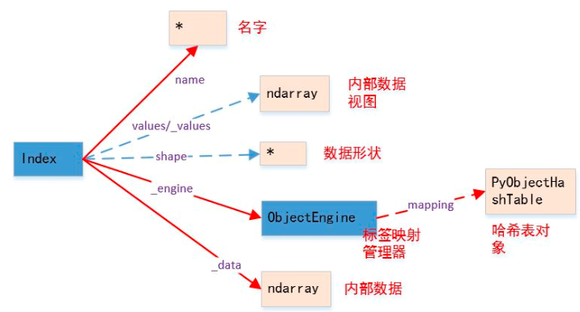
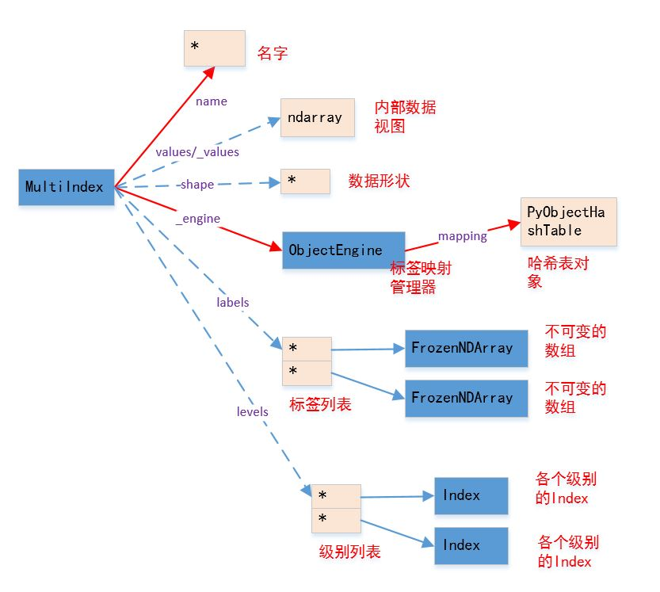

### 基本数据结构

#### Series


创建： `class pandas.Series(data=None, index=None, dtype=None, name=None, copy=False)`:

参数：`data`：它可以是一个字典、`array-like`、标量。表示`Series`包含的数据，如果是序列/数组，则它必须是一维的；`index`：一个`array-like`或者一个`Index`对象。它指定了`label`。其值必须唯一而且`hashable`，且长度与`data`一致；`name`：一个字符串，为`Series`的名字；`dtype`：指定数据类型。如果为`None`，则数据类型被自动推断；`copy`：一个布尔值。如果为`True`，则拷贝输入数据`data`。

将`Series`转换成其他数据类型：`.to_dict()`：转换成字典，格式为`{label->value}`；`.to_frame([name])`：转换成`DataFrame`。`name`为`Index`的名字；`.tolist()`：转换成列表

#### Index



`class pandas.Index(data=None, dtype=None, copy=False, name=None, )`：创建`Index`对象。

参数：`data`：一个`array-like`，必须是一维的；`name`：一个字符串，为`Index`的名字；`dtype`：指定数据类型。如果为`None`，则默认为`object`；`copy`：一个布尔值。如果为`True`，则拷贝输入数据`data`

`Index`对象负责管理轴`label`和其他元数据。构建`Series/DataFrame`时，传给`index/columns`关键字的任何数组或者序列都将被转化成一个`Index`。`Index` 对象是`immutable`，因此用户无法对其进行修改。这样才能够使得`Index`对象在多个数据结构之间安全共享 。

1. 存在多种索引类型：`Index`：最泛化的`Index`对象，将轴`label`表示为一个`Python`对象组成的`Numpy`数组；`Int64Index`：针对整数的特殊`Index`；`MultiIndex`：层次化索引对象，表示单个轴上的多层索引。可以看做由__元组__组成的数组；`DatatimeIndex`：存储纳秒级时间戳，用`numpy`的`datatime64`类型表示；`PeriodIndex`：针对`Period`数据（时间间隔）的特殊`Index`
2. `Index`的功能类似一个固定大小的集合。其类似于集合的方法有：`.copy([name,deep,dtype])`：返回一份`Index`的拷贝；`.append(other)`：连接另一个`Index`对象，产生一个新的`Index`对象；`.difference(other)`：计算差集，返回一个`Index`对象；`.isin(values[, level])`：计算`Index`中各`label`是否在`values`中；`.drop(labels[, errors])`：删除传入的`labels`，得到新的`Index`；`.insert(loc, item)`：在指定下标位置插入值，得到新的`Index`；`.unique()`：返回`Index`中唯一值的数组，得到新的`Index`

`Index`提供的选取方法有：`.get_indexer(target[, method, limit, ...])` ：获取`target`对应的下标列表。(`target`：一个`Index`对象。我们要考察的就是`Index`中的每个`label`在`self`中的下标序列；`method`：指定`label`的匹配方法。可以为`None`，表示严格匹配。如果为`'pad'/'ffill'`，则：若未找到匹配的，则使用前向匹配。如果为`'backfill'/'bfill'`，则：若未找到匹配的，则使用后向匹配。如果为`'nearest'`，则：若未找到匹配的，则使用最近邻匹配。`tolerance`：一个整数，用于给出在不匹配时，连续采用前向/后向/最近邻匹配的跨度的最大值)；`.get_level_values(level)`：返回指定`level`的`Index`，用于`MultiIndex`；`.get_loc(key[, method, tolerance])`：返回指定`label`处的下标，由`key`指定；`.get_value(series, key)`：寻找`Series`指定`label`处的值。若`key`指定的`label`找不到，则抛出异常；`.slice_locs([start, end, step, kind])`：计算给定`start label`和`end label`之间的下标序列，返回代表该下标序列的切片或者数组。其中不包括`end`。

#### MultiIndex



`MultiIndex`代表的是多级索引对象。它继承自`Index`，其中的多级`label`采用元组对象来表示。在`MultiIndex`内部，并不直接保存元组对象，而是使用多个`Index`对象保存索引中每级的`label`。

`class pandas.MultiIndex(levels=None, labels=None, sortorder=None, names=None,` `copy=False, verify_integrity=True, _set_identity=True, name=None, **kwargs)`

参数：`levels`：一个数组的列表，给出了每一级的`level`；`labels`：一个数组的列表，给出了每一级`level`的下标。第`i`级`label`是这样产生的；`names`：一个字符串序列，给出了每个`Index`的`name`。其中每个级别对应一个`Index`；`name`：指定了本`MultiIndex`的名字。

你也可以通过下面的类方法来创建`MultiIndex`：`MultiIndex.from_arrays(arrays[, sortorder, ...])`：将二维序列转换为`MultiIndex`。其中`arrays`为`array-like`的序列，每个`array-like`按顺序的给出了一列`label`；`MultiIndex.from_tuples(tuples[, sortorder, ...])` ：将元组序列转换为`MultiIndex`。其中`tuples`为`tuple-like`的序列，每个`array-like`按顺序的给出了一行`label`对；`MultiIndex.from_product(iterables[, ...])`：根据多个可迭代对象生成一个`MultiIndex`，其中使用笛卡尔积的算法。其中`iterables`为可迭代对象的序列

#### DataFrame


`DataFrame` 是一个表格型的数据结构，它含有一组有序的列，每一列都可以是不同的值类型。其中`object`类型可以保存任何`python`对象，比如字符串。同一列必须是相同的值类型。`DataFrame` 既有行索引，又有列索引。他可以被看作为`Series`组成的字典；`DataFrame`中面向行和面向列的操作基本上是平衡的。其实`DataFrame`中的数据是以一个或者多个二维块存放的

`class pandas.DataFrame(data=None, index=None, columns=None, dtype=None, copy=False)`：`data`：可以是一个二维数组、字典、或者`DataFrame`；`index`：一个`Index`或者`array-like`对象；`columns`：一个`Index`或者`array-like`对象；`dtype`：指定数据类型。如果为`None`，则数据类型被自动推断；`copy`：一个布尔值。如果为`True`，则拷贝输入数据`data`

常见的构造`DataFrame`有以下情况：二维`ndarray`：`data`就是数据，此时可以传入`index/columns`参数；一个字典，其中字典的值为一维数组、一维列表、一维元组：此时每个键就是列索引，对应的值就是列数据。要求所有序列的长度相同；`numpy`的结构化数组；`Series`组成的字典：如果没有显式的指定行索引，那么各个`Series`的索引将会被合并成`DataFrame`的行索引；字典的字典：各个内层字典会成为一列，键会被合并成结果的行索引；字典或者`Series`的列表：每一项将会成为`DataFrame`的一行。字典的键、`Series`索引的并集将会成为`DataFrame`的列索引；列表、元组组成的列表：类似于二维`ndarray`；另一个`DataFrame`：该`DataFrame`的索引将会被沿用，除非显式指定其他索引；`numpy`的`MaskedArray`：类似于二维`ndarray`，只是掩码值在结果`DataFrame`中会变成`NA/缺失值`

可以通过下面的类方法从其他数据结构中创建`DataFrame`：`DataFrame.from_dict(data, orient='columns', dtype=None)`：从字典中创建`DataFrame`：`data`：是个字典，其格式为： `{key:array-like}`或者`{key:dict}`；`orient`：指定了`key`为行还是列。参数的值为`'columns'`；或者`'index`；

`DataFrame.from_items(items, columns=None, orient='columns')`：从元组序列中创建`DataFrame`。`items`：为元组序列，元组格式为：`(key,value)`，其中`value`为表示一维数据的序列或者`Series`对象；`columns`：一个序列，给出列的`labels`。

#### 下标存取

##### []操作符

对于`Index`对象，可以通过`[]`来选取数据，它类似于一维`ndarray`的索引。下标可以为下列几种下标对象：一个整数下标。此时返回对应的`label`；一个整数`slice`。此时返回对应的`Index`；一个`array-like`对象（元素可以为下标或者布尔值）。此时返回对应的`Index`；由`None`组成的二元组，其中`None`相当于新建一个轴。它并没有将`Index` 转换成`MultiIndex`，只是将`Index`内部的数据数组扩充了一个轴。

对于`Series`对象，可以通过`[]`来选取数据，它类似于一维`ndarray`的索引。下标可以为下列几种下标对象：一个整数下标/一个属性（属性名为某个`label`）/字典索引（键为`label`）：返回对应的数值；一个整数切片/一个`label`切片：返回对应的`Series`。注意：`label`切片同时包含了起始`label`和终止`label`；一个整数`array-like`/一个`label array-like`/一个布尔`ndarray`：返回对应的`Series`；一个二维整数`array-like`/二维`label array-like`：返回对应值组成的二维`ndarray`

对于`DataFrame`对象，可以通过`[]`来选取数据。下标可以为下列几种下标对象：一个属性（属性名为某个`column label`）/字典索引（键为`column label`）：返回对应的列对应的`Series`；一个整数切片/一个`row label`切片：返回对应的行组成的`DataFrame`。注意：`label`切片同时包含了起始`label`和终止`label`；一个一维`label array-like`:返回对应的列组成的`DataFrame`；一个布尔数组：返回数组中`True`对应的行组成的`DataFrame`；一个布尔`DataFrame`：将该布尔`DataFrame`中的`False`对应的元素设置为`NaN`（布尔`DataFrame`中没有出现的值为`False`）

对于`DataFrame`的赋值与列删除：将列表或者数组赋值给某个列时，其长度必须跟`DataFrame`的行数匹配；将标量赋值给某个列时，会将标量扩充；将`Series`赋值给某个列时，会精确匹配`DataFrame`的索引。如果`DataFrame`中某个`label`在`Series`中找不到，则赋值`NaN`为不存在的列赋值会创建出一个新列（必须用字典的形式，不能用属性赋值的形式）；关键字`del`用于删除列（必须用字典的形式，不能用属性赋值的形式）

对于`Series`的赋值与删除：对于单个索引或者切片索引，要求右侧数值的长度与左侧相等；为不存在的`label`赋值会创建出一个新行（必须用字典的形式，不能用属性赋值的形式）；关键字`del`用于删除行（必须用字典的形式，不能用属性赋值的形式）

如果`Series/DataFrame`的索引有重复`label`，则数据的选取行为将有所不同：如果索引对应多个`label`，则`Series`返回一个`Sereis`，`DataFrame`返回一个`DataFrame`；如果索引对应单个`label`，则`Series`返回一个标量值，`DataFrame`返回一个`Series`；对于`[]`、字典索引、属性索引或者`.loc/.ix`存取器，结论如上所述；对于`.at`存取器：如果索引对应单个`label`，索引结果正常。如果索引对应多个`label`，则`Series`返回一个一维`ndarray`；`DataFrame`则抛出异常。

你可以通过`Index.is_unique`属性得知索引是否有重复的。

##### loc/iloc存取器

对于`Series`， `.loc[]`的下标对象可以为：单个`label`，此时返回对应的值；`label`的`array-like`、`label slice`以及布尔`array-like`：返回对应值组成的`Series`

对于`DataFrame`，`.loc[]`的下标对象是一个元组，其中两个元素分别与`DataFrame`的两个轴对应。如果下标不是元组，则该下标对应的是第0轴，第一轴为默认值`:`；每个轴的下标都支持单个`label`、`label array-like`、`label slice`、布尔`array-like`；若获取的是某一列或者某一行，则返回的是`Series`；若返回的是多行或者多列，则返回的是`DataFrame`；如果返回的是某个值，则是普通的标量。

`.iloc[]`和`.loc[]`类似，但是`.iloc[]`使用整数下标，而不是使用`label`。

`Index`对象不能使用`loc/iloc/ix`存取器；对于`.loc/.iloc/.ix`：如果某轴的索引为`array-like`或者布尔`array-like`，则返回的结果与原来的对象不再共享基础数据。如果轴的索引全部都是`slice`或者单个整数、单个`label`，则返回的结果与原来的对象共享基础数据。

##### query 方法

对于`DataFrame`，当需要根据一定的条件对行进行过滤时，通常可以先创建一个布尔数组，然后使用该数组获取`True`对应的行。另一个方案就是采用`query(expr, inplace=False, **kwargs)`方法：`expr`是个运算表达式字符串，如`'label1 >3 and label2<5'`；表达式中的变量名表示对应的列，可以使用`not/and/or`等关键字进行向量布尔运算；如果希望在表达式中使用`Python`变量，则在变量名之前使用`@`；`inplace`是个布尔值，如果为`True`，则原地修改。否则返回一份拷贝。

##### 多级索引

对于`.loc/.ix/[]`，其下标可以指定多级索引中，每级索引上的标签。多级索引轴对应的下标是一个下标元组，该元组中每个元素与索引中每级索引对应；如果下标不是元组，则将其转换成长度为 1 的元组；如果元组的长度比索引的层数少，则在其后面补充`slice(None)`

#### 运算

##### 数值运算

当进行数值运算时，`pandas`会按照标签对齐元素：运算符会对标签相同的两个元素进行计算。对于`DataFrame`，对齐会同时发生在行和列上。当某一方的标签不存在时，默认以`NaN`填充。缺失值会在运算过程中传播。结果的索引是双方索引的并集。

对于`DataFrame`和`Series`的运算，默认会用`DataFrame`的每一行与`Series`运算。如果你希望使用`DataFrame`的每一列与`Series`运算，则必须使用二元操作函数，并且指定`axis=0`（表示操作匹配的轴）。

##### 排序

`.sort_index()`方法的作用是根据`label`排序：`axis`：指定沿着那个轴排序。如果为`0/'index'`，则对沿着0轴，对行`label`排序；如果为`1/'columns'`，则沿着 1轴对列`label`排序；`level`：一个整数、`label`、整数列表、`label list`或者`None`。对于多级索引，它指定在哪一级上排序；`ascending`：一个布尔值，如果为`True`，则升序排序；如果是`False`，则降序排序；`na_position`：一个字符串，值为`'first'/'last'`，指示：将`NaN`排在最开始还是最末尾。

`.sort_values()`方法的作用是根据元素值进行排序：`by`：一个字符串或者字符串的列表，指定希望对那些`label`对应的列或者行的元素进行排序。对于`DataFrame`，必须指定该参数。而`Series`不能指定该参数；如果是一个字符串列表，则排在前面的`label`的优先级较高；`axis`：指定沿着那个轴排序；其他的跟前面的函数参数相同，功能一致。

`DataFrame/Series.sortlevel(level=0, axis=0, ascending=True,``inplace=False, sort_remaining=True)`：根据单个`level`中的`label`对数据进行排列（稳定的）：`axis`：指定沿着那个轴排序；`level`：一个整数，指定多级索引的`level`

`.rank()`方法的作用是在指定轴上计算各数值的排，其中相同数值的排名是相同的：`axis`：指定沿着那个轴排名；`method`：一个字符串，指定相同的一组数值的排名。假设数值 `v`一共有`N`个。现在轮到对`v`排序，设当前可用的排名为`k`。`'average'`：为各个等值平均分配排名、`'min'`：使用可用的最小的排名，这`N`个数的排名都是 `k`、`'max'`：使用可用的最大的排名，这`N`各数的排名都是 `k+N-1`、`'first`：根据元素数据中出现的顺序依次分配排名，即按照它们出现的顺序，其排名分别为 `k,k+1,...k+N-1`、`'dense`：类似于 `'min'`，但是排名并不会跳跃。即比`v`大的下一个数值排名为`k+1`，而不是`k+N`；`numeric_only` :一个布尔值。如果为`True`，则只对`float/int/bool`数据排名；`na_option`：一个字符串，指定对`NaN`的处理。可以为：`'keep'`：保留`NaN`在原位置、`'top'`:如果升序，则`NaN`安排最大的排名、`'bottom'`:如果升序，则`NaN`安排最小的排名`ascending`：一个布尔值，如果为`True`，则升序排名；如果是`False`，则降序排名；`pct`：一个布尔值。如果为`True`，则计算数据的百分位数，而不是排名。

##### 统计

`Series`和`DataFrame`对象都支持`Numpy`的数组接口，因此可以直接使用`Numpy`提供的`ufunc`函数对它们进行运算。这些函数通常都有三个常用参数：`axis`：指定运算沿着哪个轴进行；`level`：如果轴是多级索引`MultiIndex`，则根据`level`分组计算；`skipna`：运算是否自动跳过`NaN`

数值运算类方法：`DataFrame.clip([lower, upper, axis])` ：将指定轴上的数据裁剪到`[lower,upper]`这个闭区间之内。超过`upper`的值裁剪成`upper`；小于`lower`的值裁剪成`lower`；`DataFrame.clip_lower(threshold[, axis])`：返回一份拷贝，该拷贝是在指定轴上：向下裁剪到`threshold`；`DataFrame.clip_upper(threshold[, axis])`：返回一份拷贝，该拷贝是在指定轴上：向上裁剪到`threshold`；`DataFrame.count([axis, level, numeric_only])`：计算沿着`axis`轴，`level`级索引的非`NaN`值的数量。如果`numeric_only`为`True`，则只考虑数值和布尔类型；`DataFrame.round([decimals])` ：对元素指定小数点位数。`decimals`可以为一个整数（所有的元素都按照该小数点位数）、一个字典（根据列`label`指定） 

最大最小：`Series.idxmax([axis, skipna, ...])`： 计算最大值的索引`label`；`Series.idxmin([axis, skipna, ...])`： 计算最小值的索引`label`；`DataFrame.cummax([axis, skipna])` ：计算沿着`axis`轴的累积最大值；`DataFrame.cummin([axis, skipna])` ：计算沿着`axis`轴的累积最最小值；`DataFrame.quantile([q, axis, numeric_only, ...])`：计算指定轴上样本的百分位数。`q`为一个浮点数或者一个`array-like`。每个元素都是 `0~1`之间。如 0.5代表 50%分位；`DataFrame.pct_change([periods, fill_method, ...])`：计算百分比变化。`periods`为相隔多少个周期。它计算的是：`(s[i+periods]-s[i])/s[i]`，注意结果并没有乘以 100。`Series.nlargest( *args,**kwargs)`：计算最大的`N`个数。参数为：`n`：最大的多少个数、`keep`：遇到重复值时怎么处理。可以为：`'first'/'last'`；`Series.nsmallest( *args,**kwargs)`：计算最小的`N`个数。

统计类方法：`DataFrame.diff([periods, axis])`：沿着指定轴的一阶差分。`periods`为间隔；`DataFrame.skew([axis, skipna, level, ...])`：沿着指定轴计算样本的偏度（二阶矩）；`DataFrame.kurt([axis, skipna, level, ...])`：沿着指定轴，计算样本的峰度（四阶矩）；`DataFrame.corr([method, min_periods])`：计算任意两个列之间的非`NAN`的、按照索引对齐的值的相关系数。`method`为相关系数的类型，可以为：`'pearson'`：标准的相关系数、`'kendall'`：`Kendall Tau`相关系数、`'spearman'`：`Spearman rank`相关系数、而`min_periods`：一个整数。它指定为了生成一个有效的相关系数，每一对列数据的最短长度；`DataFrame.corrwith(other[, axis, drop])` ：计算两个`DataFrame`的行-行、列-列的相关系数：`drop`：一个布尔值。如果为`True`，则如果某行/列都是`NaN`，则抛弃该行/列。如果为`False`，则返回全部；`DataFrame.cov([min_periods])`：计算任意两列之间的协方差。`min_periods`指定为了生成一个有效的协方差，每一对列数据的最短长度。对于`Series`，其调用为：`Series.cov(other,[min_periods])`

对于`Series`：唯一值、值计数、成员资格：`Series.unique()`：返回`Series`中唯一值组成的一维`ndarray`；`Series.value_counts(normalize=False, sort=True, ascending=False,` `bins=None, dropna=True)`：对`Series`中的数进行计数。如果`normalize`为`True`，则返回频率而不是频数。`sort`为`True`则结果根据出现的值排序，排序方式由`ascending`指定、`bins`是一个整数或者`None`。如果它为整数，则使用半开半闭区间来统计，它给出了该区间的数量；`Series.isin(values)`：返回一个布尔数组，给出`Series`中各值是否位于`values`中。

对于多级索引，可以通过`level`参数来指定在某个轴上的操作索引级别。如果`level=None`，则不考虑索引的多级。 

#### 变换

##### 索引和轴的变换

重新索引：`Series/DataFrame.reindex(index=None, **kwargs)`：`index`：一个`array-like`对象，给出了新的`index`的`label`；`method`：当新的`label`的值缺失时，如何处理；`copy`：一个布尔值，如果为`True`，则返回一个新的`Series`对象；`level`：一个整数或者`name`，在`MultiIndex`的指定级别上匹配简单索引；`fill_value`：一个标量。指定缺失值的填充数据，默认为`NaN`；`limit`：一个整数，指定前向/后向填充时：如果有连续的`k`个`NaN`，则只填充其中`limit`个；`tolerance`：一个整数，用于给出在不匹配时，连续采用前向/后向/最近邻匹配的跨度的最大值。

对于`DataFrame`，多了关键字参数：`columns`：一个`array-like`对象，给出了新的`columns`的`label`

对于`DataFrame`，如果`.reindex()`只传入一个序列，则默认会重索引行`label`。如果同时重索引行`label`和列`label`，则`method`插值只能按照行来进行

将列数据变成行索引

将列数据变成行索引，其中：`col label`变成`index name`，列数据变成行`label`：` DataFrame.set_index(keys, drop=True, append=False, inplace=False, 
  verify_integrity=False)`：`keys`： 指定了一个或者一列的`column label`。这些列将会转换为行`index`；`drop`：一个布尔值。如果为`True`，则`keys`对应的列会被删除；否则这些列仍然被保留；`append`：一个布尔值。如果为`True`，则原有的行索引将保留；否则抛弃原来的行索引；`verify_integrity`：一个布尔值。如果为`True`，则检查新的`index`是否有重复值。否则会推迟到检测过程到必须检测的时候。

`reset_index`会将层次化的行`index`转移到列中，成为新的一列。同时`index` 变成一个整数型的，从0开始编号：`level`：一个整数、`str`、元组或者列表。它指定了将从层次化的`index`中移除的`level`。如果为`None`，则移除所有的`level`；`drop`：一个布尔值。如果为`True`，则并不会插入新的列。如果为`False`，则插入新的列；`col_level`：如果列索引也是多层次的，则决定插入到列索引的哪个`level`；`col_fill`：如果列索引也是多层次的，则决定插入之后其他`level`的索引如何命名的。默认情况下就是重复该`index name`。对于`Series`，`name`就是插入后，对应的列`label`

丢弃某条轴上的一个或者多个`label`：`Series/DataFrame.drop(labels[, axis, level, inplace, errors])`:`labels`：单个`label`或者一个`label`序列，代表要被丢弃的`label`；`axis`：一个整数，或者轴的名字。默认为 0 轴；`level`：一个整数或者`level`名字，用于`MultiIndex`。因为可能在多个`level`上都有同名的`label`；`errors`：可以为`'ignore'/'raise'`

交换两个轴： `DataFrame/Series.swapaxes(axis1, axis2, copy=True)` 

交换多级索引的两个`level`：`DataFrame/Series.swaplevel(i=-2, j=-1, axis=0, copy=True)` `i/j`为两个`level`的整数`position`，也可以是`name`字符串。

想修改轴`label`有两种方案：可以采用`Index.map(mapper)`方法。其中`mapper`是个可调用对象，它对每个`label`进行调用然后返回新的`label`。该函数返回一个新的`Index`对象。然后将其赋值给`pandas`对象的`.index/.columns`属性；调用`.rename`方法：`index/columns`：一个标量、`dict-like`、或者一个函数。标量：修改了`Series.name`属性。但是对于`DataFrame`会抛出异常、`dict-like`或者函数：应用于对应轴的`label`上

##### 合并数据

对于`DataFrame`，`merge()`方法可以根据一个或者多个键将不同`DataFrame`的行连接接起来。它实现的就是数据库的连接操作：`right`：另一个`DataFrame`对象；`how`：指定连接类型。可以为：`'left'`：左连接。只使用左边`DataFrame`的连接键、`'right'`：右连接。只使用右边`DataFrame`的连接键、`'outer'`：外连接。使用两个`DataFrame`的连接键的并集、`'inner'`：内连接。使用两个`DataFrame`的连接键的交集；`on`：一个`label`或者`label list`。它指定用作连接键的列的`label`。并且必须在两个`DataFrame`中这些`label`都存在。如果它为`None`，则默认使用两个`DataFrame`的列`label`的交集；`left_on`：一个`label`或者`label list`。指定左边`DataFrame`用作连接键的列；`right_on`：一个`label`或者`label list`。指定右边`DataFrame`用作连接键的列；`left_index`：一个布尔值。如果为`True`，则使用左边的`DataFrame`的行的`index value`来作为连接键来合并；`right_index`：一个布尔值；`sort`：一个布尔值。如果为`True`，则在结果中，对合并采用的连接键进行排序；`suffixes`：一个二元序列。对于结果中同名的列，它会添加前缀来指示它们来自哪个`DataFrame`；`copy`：一个布尔值。如果为`True`，则拷贝基础数据。否则不拷贝数据

说明：如果合并的序列来自于行的`index value`，则使用`left_index`或者`right_index`参数。如果是使用了`left_index=True`，则必须使用`right_index=True`，或者指定`right_on`。此时`right_on`为第二个`DataFrame`的行`label`。此时所有对键的操作都针对`index label`，而不再是`column label`；如果不显示指定连接的键，则默认使用两个`DataFrame`的`column label`的交集中的第一个`label`。；如果根据列来连接，则结果的`index label`是`RangeIndex`。如果根据行`label value`连接，则结果的`index label/column label`来自两个`DataFrame`；对于层次化索引的数据，你必须以列表的形式指明用作合并键的多个列。

如果所有的连接键来自于某列值，则可以使用`DataFrame.join()`函数：`other`：一个`DataFrame`，或者一个`Series`（要求它的`name`非空），或者一个`DataFrame`序列。`Series`的`name`作用等同`DataFrame`的`column label`；`on`：指定以调用者的那个`column`对应的列为键；`how`：参考`merge`的`how`；`sort`：一个布尔值。如果为`True`，则在结果中，对合并采用的连接键进行排序。如果是`Series`，则连接键为`Series`的`index value`。此外，`DataFrame`默认使用 `index value`

`pandas.concat(objs, axis=0, join='outer', join_axes=None, ignore_index=False,` `keys=None, levels=None, names=None, verify_integrity=False, copy=True)`函数：它将多个`DataFrame/Series`对象拼接起来：`objs`：一个序列，序列元素为`Series/DataFrame/Panel`等。你也可以传入一个字典，此时字典的键将作为`keys`参数；`axis`：指定拼接沿着哪个轴；`join`：可以为`'inner'/'outer'`，指定如何处理其他轴上的索引；`join_axes`：一个`Index`对象的列表。你可以指定拼接结果中，其他轴上的索引而不是交集或者并集；`keys`：一个序列。它用于区分拼接结果中，这些行/列来分别来自哪里。在必要的时候将建立多级索引，`keys`作为最外层的索引。如果`objs`是个字典，则使用字典的键作为`keys`；`levels`：一个序列。与`keys`配合使用，指定多级索引各级别上的索引。如果为空，则从`keys`参数中推断；`names`：一个序列。与`keys`配合使用，用于建立多级索引的`names`。

`Series/DataFrame.combine_first()`也是一种合并方式。它用参数对象中的数据给调用者打补丁：`other`：`Series`中必须为另一个`Series`，`DataFrame`中必须为另一个`DataFrame`。结果的`index/columns`是两个的并集。结果中每个元素值这样产生：如果调用者不是`NaN`，则选择调用者的值、如果调用者是`NaN`，则选择参数的值（此时无论参数的值是否`NaN`）

`Series/DataFrame.combine()`也是一种合并：`other`：`Series`中必须为另一个`Series`，`DataFrame`中必须为另一个`DataFrame`；`func`：一个函数，该函数拥有两个位置参数。第一个参数来自于调用者，第二个参数来自于`other`：对于`Series`，两个参数都是标量值，对应它们对齐后的元素值。返回值就是结果对应位置处的值、对于`DataFrame`，这两个参数都是`Series`，即对应的列；`fill_value`：一个标量 。在合并之前先用它来填充 `NaN`。

对于`Series`，结果的`index`是两个的并集。结果中每个元素值这样产生：将两个`Series`在同一个`index`的两个标量值分别传给`func`、`func`的返回值就是结果`Series`在该`index`处的值

对于`DataFrame`，结果的`index/columns`是两个的并集。结果中每列这样产生：将两个`DataFrame`在同一个`column label`的两列值分别传给`func`、`func`的返回值就是结果`DataFrame`在该`column label`列的值。

##### 索引旋转

`DataFrame.stack()`方法将数据的列索引旋转为行索引。注意：它跟转置不同，转置会同时旋转数据：`level`：一个整数、字符串或者整数字符串的列表。如果列索引为多级索引，它指定了将哪个级别的索引旋转为行索引；`dropna`：一个布尔值。如果为`True`，则如果结果中某行全为`NaN`，则抛弃该行。

与`DataFrame.stack()`对应的就是`DataFrame.unstack()`方法。它将数据的行索引转换为列索引。注意：它跟转置不同，转置会同时旋转数据：`level`：一个整数、字符串或者整数字符串的列表。如果行索引为多级索引，它指定了将哪个级别的索引旋转为列索引；`fill_value`：一个标量。如果结果中有`NaN`，则使用`fill_value`替换。

旋转时，比如列索引旋转为行索引，则新的行索引是个多级索引，最内层的一级就是原来的列索引。

`DataFrame.pivot()`方法重排数据。它是一个快捷方式，它使用`set_index`将列数据变成行索引，然后使用`unstack`将行索引转为列索引：`index`：一个字符串。指定了一个`column name`，用该列数据来`set_index`。如果为`None`，则不执行`set_index`；`columns`：一个字符串，指定了哪个列数据作为结果的`columns labels`；`values`：一个字符串，指定了哪个列数据作为结果的数据。如果未提供，则剩余的所有列都将作为结果的数据。

#### 数据清洗

##### 移除重复数据

`Series/DataFrame.duplicated(*args, **kwargs)`：返回一个布尔`Series`，指示调用者中，哪些行是重复的：`keep`：一个字符串或者`False`，指示如何标记。它代替了废弃的参数`take_last`、`'first'`：对于重复数据，第一次出现时标记为`False`，后面出现时标记为`True`、`'last'`：对于重复数据，最后一次出现时标记为`False`，前面出现时标记为`True`、`False`：对于重复数据，所有出现的地方都标记为`True`

而`Series/DataFrame.drop_duplicates(*args, **kwargs)`：返回重复行被移除之后的`Series/DataFrame`：`keep`：一个字符串或者`False`，指示如何删除。 它代替了废弃的参数`take_last`、`'first'`：对于重复数据，保留第一次出现，后面出现时删除、`'last'`：对于重复数据，最后一次出现时保留，前面出现时删除、`False`：对于重复数据，删除所有出现的位置；`inplace`：一个布尔值。如果为`True`，则原地修改。否则返回新建的对象。

对于`DataFrame`，还有个 `subset`参数。它是`column label`或者其列表，给出了考虑哪些列的重复值。默认考虑所有列。

##### apply

将函数应用到由各列或者各行形成的一维数组上，此时`DataFrame`的`.apply()`方法即可实现此功能。 `.apply(func, axis=0, broadcast=False, raw=False, reduce=None, args=(), **kwds)`：`func`：一个可调用对象，它会应用于每一行或者每一列；`axis`：指定应用于行还是列；`broadcast`：一个布尔值，如果为`True`，则结果为`DataFrame`；`raw`：一个布尔值。如果为`False`，则转换每一行/每一列为一个`Series`，然后传给 `func` 作为参数。如果`True`，则`func`接受到的是`ndarray`，而不是`Series`；`args`：传递给`func`的额外的位置参数（第一个位置参数始终为`Series/ndarray`）

将函数应用到`DataFrame`中的每个元素，则可以使用`.applymap(func)`方法。之所以不叫`map`，是因为`Series`已经有个`.map`方法。 

`Series`的`.apply()`方法应用到`Series`的每个元素上： `.apply(func, convert_dtype=True, args=(), **kwds)`：`func`：一个可调用对象，它会应用于每个元素；`convert_dtype`：一个布尔值。如果为`True`，则`pandas`会自动匹配`func`结果的最佳`dtype`；如果为`False`，则`dtype=object`；`args`：传递给`func`的额外的位置参数；`kwds`：传递给`func`的额外的关键字参数。返回结果可能是`Series`，也可能是`DataFrame`（比如，`func`返回一个`Series`) 

`Series`的`.map(arg,na_action=None)`方法会应用到`Series`的每个元素上：`arg`：一个函数、字典或者`Series`。如果为字典或者`Series`，则它是一种映射关系，键/`index label`就是自变量，值就是返回值；`na_action`：如果为`ignore`，则忽略`NaN`。返回相同`index`的一个`Series` 

##### 缺失数据

`pands`对象上的所有描述统计都排除了缺失数据。

`DataFrame.dropna(axis=0, how='any', thresh=None, subset=None, inplace=False)`：根据各`label`的值中是否存在缺失数据来对轴`label`进行过滤：`axis`：指定沿着哪个轴进行过滤；`how`：指定过滤方式。如果为`'any'`，则如果该`label`对应的数据中只要有任何`NaN`，则抛弃该`label`；如果为`'all'`，则如果该`label`对应的数据中必须全部为`NaN`才抛弃该`label`；`thresh`：一个整数，要求该`label`必须有`thresh`个非`NaN`才保留下来。它比`how`的优先级较高；`subset`：一个`label`的`array-like`。对于`Series`，其签名为： `Series.dropna(axis=0, inplace=False, **kwargs)`

`DataFrame/Series.fillna(value=None, method=None, axis=None, inplace=False, limit=None,` `downcast=None, **kwargs)`：用指定值或者插值方法来填充缺失数据：`value`：一个标量、字典、`Series`或者`DataFrame`：如果为标量，则它指定了填充`NaN`的数据、如果为`Series/dict`，则它指定了填充每个`index`的数据、如果为`DataFrame`，则它指定了填充每个`DataFrame`单元的数据；`method`：指定填充方式。可以为`None`；`axis`：指定沿着哪个轴进行填充；`downcast`：一个字典，用于类型转换。字典形式为： `{label->dtype}`，`dtype`可以为字符串，也可以为`np.float64`等。

`DataFrame/Series.isnull()`：返回一个同样尺寸的布尔类型的对象，来指示每个值是否是`null
DataFrame/Series.notnull()`：返回一个同样尺寸的布尔类型的对象，来指示每个值是否是`not null`。

`fillna()`方法可以看作是值替换的一种特殊情况。更通用的是值替换`replace()`方法：`to_replace`：一个字符串、正则表达式、列表、字典、`Series`、数值、`None`。指示了需要被替换的那些值：字符串：则只有严格等于该字符串的那些值才被替换、正则表达式：只有匹配该正则表达式的那些值才被替换（`regex=True`）、列表：如果`to_place` 和`value`都是列表，则它们必须长度严格相等，如果`regex=True`，则列表中所有字符串都是正则表达式、字典：字典的键对应了被替换的值，字典的值给出了替换值。如果是嵌套字典，则最外层的键给出了`column`名、`None`：此时`regex`必须是个字符串，该字符串可以表示正则表达式、列表、字典、`ndarray`等。如果`value`也是`None`，则`to_replace`必须是个嵌套字典；`value`：一个字符串、正则表达式、列表、字典、`Series`、数值、`None`。给出了替换值。如果是个字典，则键指出了将填充哪些列（不在其中的那些列将不被填充）；`regex`：一个布尔值，或者与`to_replace`类型相同；`method`：指定填充类型。

`interpolate`是通过前后数据插值来填充`NaN`：`method`：一个字符串，指定插值的方法：`'linear'`：线性插值。只有它支持`MultiIndex`、`'index'`/`'values'`：使用索引标签的整数下标来辅助插值、`'nearest', 'zero', 'slinear', 'quadratic', 'cubic',``'barycentric', 'polynomial'`使用`scipy.interpolate.interp1d`。对于`'polynomial'/'spline'` 

- `'krogh', 'piecewise_polynomial', 'spline', 'pchip','akima'`也使用了`scipy`的插值算法。它们使用索引标签的整数下标来辅助插值。
- `'time'`： interpolation works on daily and higher resolution data to interpolate given length of interval

`axis`：指定插值的轴；`limit`：一个整数，指定插值时，如果有`K`个连续的`NaN`，则只插值其中的`limit`个；`limit_direction`：一个字符串。当设定了`limit`时，指定处理前面`limit`个`NaN`，还是后面`limit`个`NaN`。可以为`'forward'/'backward'/'both'`；`downcast`：指定是否自动向下执行类型转换；其他参数是传递给`scipy`的插值函数的。

##### 离散化

连续数据常常会被离散化或者拆分成面元`bin`。可以通过`pandas.cut()`函数来实现：`x`：一维的数据；`bins`：一个整数或者一个序列：整数：它指定了划分区间的数量、一个序列：它给出了`bins`的每个划分点；`right`：一个布尔值。如果为`True`，则区间是左开右闭；否则区间是左闭右开的区间；`labels`：一个`array`或者`None`。如果为一个`array`，则它指定了结果`bins`的`label`。如果为`None`，则使用区间来表示；`include_lowest`：一个布尔值。如果为`True`，则最左侧`bin`的左侧是闭区间。返回的是一个`Categorical`对象或者`Series`对象。该函数类似于`numpy.histogram()`函数。

另外一个划分的函数是：`pandas.qcut(x, q, labels=None, retbins=False, precision=3)``q`：一个整数或者序列。整数：它指定了划分区间的数量、一个序列：它给出了百分比划分点。其他参数与`cut`相同。(`qcut`没有`bins`参数）

##### 字符串操作

`Series.str`能够将`Series`的值当作字符串处理，并且你可以通过`Series.str.func`来应用某些函数。其中`func`可以为：python中`str`类支持的方法。

- `Series.str.cat([others, sep, na_rep])` Concatenate strings
- `Series.str.contains(pat[, case=True, flags=0, na=nan, regex=True])`
- `Series.str.count(pat[, flags])` 
- `Series.str.decode(encoding[, errors])` 
- `Series.str.encode(encoding[, errors])` 
- `Series.str.endswith(pat[, na])` 
- `Series.str.extract(pat[, flags, expand])` 
- `Series.str.extractall(pat[, flags])` 
- `Series.str.find(sub[, start, end])` 
- `Series.str.findall(pat[, flags])` 
- `Series.str.get(i)` 
- `Series.str.index(sub[, start, end])` 
- `Series.str.join(sep)` 
- `Series.str.len()` 
- `Series.str.ljust(width[, fillchar])` 
- `Series.str.lstrip([to_strip])` 
- `Series.str.match(pat[, case=True, flags=0, na=nan, as_indexer=False])` 
- `Series.str.pad(width[, side, fillchar])` 
- `Series.str.partition([pat, expand])` 
- `Series.str.repeat(repeats)` 
- `Series.str.replace(pat, repl[, n, case, flags])` 
- `Series.str.rfind(sub[, start, end])` 
- `Series.str.rindex(sub[, start, end])` 
- `Series.str.rpartition([pat, expand])`
- `Series.str.slice([start, stop, step])`
- `Series.str.slice_replace([start, stop, repl])`
- `Series.str.startswith(pat[, na])`
- `Series.str.strip([to_strip])`
- `Series.str.swapcase()`
- `Series.str.wrap(width, **kwargs)`
- `Series.str.get_dummies([sep])`

你也可以通过`Series.str[:3]`这种索引操作来进行子串截取。或者使用`Series.str.get()`方法进行截取。

#### 聚合与分组

##### 分组

分组运算的过程为：拆分-应用-合并：拆分阶段：`Series/DataFrame`等数据根据你提供的一个或者多个键，被拆分为多组、应用阶段：根据你提供的一个函数应用到这些分组上、合并阶段：将函数的执行结果合并到最终结果中

分组中有两种数据：源数据（被分组的对象），分组数据（用于划分源数据的）。源数据每一行(axis=0) 对应于分组数据中的一个元素。分组数据中每一个唯一值对应于一个分组。当分组数据也在源数据中时，可以直接通过指定列名来指定分组数据。

`.groupby()`方法是分组方法：`by`：一个`mapping function`、`list of function`、一个字典、一个序列、一个元组、一个`list of column name`。它指定了分组数据。

- 如果传入了函数，则在每个`index value`上调用函数来产生分组数据

- 如果是`Series`或者字典，则根据每个`index value`在字典/`Series`中的值来产生分组数据

- 如果是个`column label`，则使用该`label`抽取出来的一列数据产生分组数据

- 如果是个`column label`的`list`，则使用一组`column label`抽取出来的多列数据作为分组数据。

- 如果是个序列，则它直接指定了分组数据。

- 如果是个序列的序列，则使用这些序列拼接成一个`MulitiIndex`，然后根据这个`MultiIndex`替换掉`index`后，根据`label value`来分组。

`axis`：指定沿着哪个轴分组；`level`：一个整数、`level name`或者其序列，如果`axis`是个`MultiIndex`，则在指定级别上的索引来分组；`as_index`：一个布尔值。如果为`True`，则将`group label`作为输出的`index`。如果为`False`，则输出是`SQL`风格的分组。`Series`中，该参数必须为`True`；`sort`：一个布尔值。如果为`True`，则对分组的键进行排序；`group_keys`：一个布尔值。如果为`True`，且调用了函数来决定分组，则添加分组键来区分不同的数据；`squeeze`：一个布尔值。如果为`True`，则尽可能的缩减结果的类型。

该函数返回一个`GroupBy`对象。我们可以使用`dtype`来分组，此时`by=df.dtypes,axis=1`：

对于由`DataFrame`产生的`GroupBy`对象，我们可以用一个或者一组列名对其索引。它其实一个语法糖。如果索引是一个列名，则`df.groupby('key1')['data1']` 等价于`df['data1'].groupby(df['key1'])`；如果索引是一个元组和序列，则 `df.groupby('key1')[['data1','data2']]` 并不等价于 `df[['data1','data2']].groupby(df['key1'])`，而是等同于 `df.groupby(df['key1'])`；之所以用 `[['data1','data2']]`，是因为`df[['data1','data2']]`与`df['data1','data2']`语义不同。后者表示某个`label`是个元组，该元组的值为`'data1','data2'`。

##### GroupBy对象

`GroupBy`对象是一个迭代器对象。迭代结果产生一组二元元组（由分组名和数据块组成）。

- 如果有多重键，则元组的第一个元素将是由键组成的元组。
- `dict(list(GroupBy_obj))`将生产一个字典，方便引用  

- `GroupBy.groups`属性返回一个字典： `{group name->group labels}`
- `GroupBy.indices`属性返回一个字典：`{group name->group indices}`

`GroupBy`的统计函数有：

- `GroupBy.ohlc()`：计算每个分组的开始、最高、最低、结束值
- `GroupBy.sem([ddof])` ：计算每个分组的`sem`（与均值的绝对误差之和）

另外`SeriesGroupBy/DataFrameGroupBy`也支持`Series/DataFrame`的统计类方法以及其他方法：

如果你希望使用自己的聚合函数，只需要将其传入`.aggregate(func, *args, **kwargs)`或者`.agg()`方法即可。其中`func`接受一维数组，返回一个标量值。

你可以将前面介绍的`GroupBy`的统计函数名以字符串的形式传入；如果你传入了一组函数或者函数名，则得到的结果中，相应的列就用对应的函数名命名。如果你希望提供一个自己的名字，则使用`(name,function)`元组的序列。其中`name`用作结果列的列名；如果你希望对不同的列采用不同的聚合函数，则向`agg()`传入一个字典。字典的键就是列名，值就是你希望对该列采用的函数。

1. `.get_group(key)`可以获取分组键对应的数据。
   - `key` ：不同的分组就是依靠它来区分的
2. `GroupBy`的下标操作将获得一个只包含源数据中指定列的新`GroupBy`对象
3. `GroupBy`类定义了`__getattr__()`方法，当获取`GroupBy`中未定义的属性时：
   - 如果属性名是源数据对象的某列的名称则，相当于`GroupBy[name]`，即获取针对该列的`GroupBy`对象
   - 如果属性名是源数据对象的方法，则相当于通过`.apply(name)`对每个分组调用该方法。

##### 分组级运算

1. `agg/aggregate`只是分组级运算其中的一种。它接受一维数组，返回一个标量值。
2. `transform`是另一个分组级运算。它也接受一维数组。只能返回两种结果：要么是一个标量值（该标量值将被广播），或者一个相同大小的结果数组。
   - 你无法通过字典来对不同的列进行不同的`transform`

`apply`是另一个分组级运算。它是最一般化的分组级运算。它将待处理的对象拆分成多个片段，然后对各个片段调用传入的函数，最后尝试将各个片段组合到一起。

- `func`：运算函数。其第一个位置参数为待处理对象。其返回值是一个标量值或者`pandas`对象。
- `args/kwargs`是传递给`func`的额外的位置参数与关键字参数。

对于`DataFrame`的`.groupby`时，传递给`func`的第一个参数是`DataFrame`；对于`Series`的`.groupby`，传递给`func`的第一个参数是`Series`。

`pd.cut()/qcut()`函数返回的是`Categorical`对象。我们可以用它作为`.groupby()`的`by`参数的值。这样可以实现桶分析

##### 透视表和交叉表

1. 透视表`pivot table`是一种数据汇总工具。它根据一个或者多个键对数据进行聚合，并根据行和列上的分组键将数据分配到各个单元格中。
   - 你可以通过`.groupby`功能以及索引的变换来手工实现这种功能
2. `DataFrame.pivot_table()`方法，以及`pandas.pivot_table()`函数都可以实现这种功能

- `data`：一个`DataFrame`对象
- `values`：指定哪些列将被聚合。默认聚合所有的数值列。
- `index`：一个`index label`、一个`Grouper`、一个数组，或者前面这些类型的一个列表。它指定关于分组的列名或者其他分组键，出现在结果透视表的行
- `columns`：一个`column label`、一个`Grouper`、一个数组，或者前面这些类型的一个列表。它指定关于分组的列名或者其他分组键，出现在结果透视表的列
- `aggfunc`：一个函数或者函数的列表。默认为`numpy.mean`。它作为聚合函数。如果为函数的列表，则结果中会出现多级索引，函数名就是最外层的索引名
- `margins`：一个布尔值。如果为`True`，则添加行/列的总计。

交叉表`cross-tabulation:crosstab`是一种用于计算分组频率的特殊透视表。我们可以使用`pivot_table()`函数实现透视表的功能，但是直接使用更方便：

- `index`：一个`array-like`、`Series`或者前两种的列表。它给出了行的计算频数的数据。
- `columns`：一个`array-like`、`Series`或者前两种的列表。它给出了列的计算频数的数据。
- `values`：一个`array-like`，该数据用于聚合。如果出现了`values`，则必须提供`aggfunc`。
- `aggfunc`：一个函数对象，是聚合函数。如果出现了`aggfunc`，则必须提供`values`。
- `rownames`：一个序列。如果非空，则必须和结果的`row index`的`level`数量相等
- `colnames`：一个序列。如果非空，则必须和结果的`column index`的`level`数量相等
- `margins`：一个布尔值。如果为`True`，则添加行/列的总计。
- `dropna`：一个布尔值。如果为`True`，则结果不包含这样的列：该列所有元素都是`NaN`
- `normalize`：一个布尔值、字符串（`'all'/'index'/'columns'`）、或者整数`0/1`。它指定是否进行归一化处理（归一化为频率），否则就是频数。
  - 如果`'all'/True`，则对所有数据进行归一化
  - 如果为`'index'`：则对每一行归一化
  - 如果为`'columns'`：则对每一列归一化
  - 如果`margins`为`True`，则对`margins`也归一化。

`values`的作用是这样的：首先根据`index-columns`建立坐标。行坐标来自`index`，列坐标来自`columns`。在`index-columns-values`中，同一个坐标下的`values`组成`Series`。这个`Series`被`aggfunc`进行聚合，`aggfunc`接受一个`Series`，返回一个标量。此时就不再是对坐标点进行计数了，而是对`values`进行聚合。

#### 时间序列

1. `Pandas` 提供了表示时间点、时间段、时间间隔等三种与时间有关的类型，以及元素为这些类型的索引对象。`pandas`还提供了许多与时间序列相关的函数。

2. ##### time 模块

1. `time`模块中，时间有三种表现形式：
   - `Unix`时间戳。指的是从`1970`年以来的秒数
   - 本地时间的`struct_time`形式：一个命名元组，第一位为年、第二位为月....
   - `UTC`时间的`struct_time`的形式：类似于上面的，只是为`UTC`时间。区别在于：前者是本地时间`local time`，后者是`UTC`时间
2. 查看当前时间的三种表现形式：
   - `Unix`时间戳： `time.time()`
   - `local struct_time`： `time.localtime()`
   - `utc struct_time`：`time.gmtime()`

三种格式之间的转换：

- `timestamp--->local time`：`time.localtime(time_stamp)`
- `timestamp--->utc time`：`time.gmtime(time_stamp)`
- `local time--->timestamp`：`time.mktime(local_time)`
- `utc time---> timestamp`：`calendar.timegm(utc_time)`

三种格式的时间转换为字符串：

- `timestamp`：`time.ctime(time_stamp)`
- `local struct_time time/utc struct_time time`：`time.asctime(struct_time)`
- 对于`local struct_time time/utc struct_time time`：你也可以使用`time.strftime(format_str,struct_time)` 来自定义格式化串。其中`format_str`为格式化串。

查看当前时区： `time.timezone`。它返回的是距离`UTC`时间的距离（单位为秒）（>0，在美洲;<=0，在大多数欧洲，亚洲，非洲）

##### datetime 模块

`datetime`模块中主要包含四个类：

- `datetime.time`：时间类。只包含时、分、秒、微秒等时间信息
- `datetime.date`：日期类。值包含年月日星期等日期信息
- `datetime.datetime`：日期时间类。包含上述两者的全部信息
- `datetime.timedelta`：日期时间间隔类，用来表示两个`datetime`之间的差值

1. ```
     time([hour[, minute[, second[, microsecond[, tzinfo]]]]])
   ```

   其中`tzinfo`就是时区对象。`0<=hour<24`，`0<=minute<60`，`0<=second<60`，`0<=microsecond<1000000`，否则抛出异常。`tzinfo`默认为`None`

属性有：

- `hour/minute/second/microsecond/tzinfo`

方法有：

- `time.replace([hour[, minute[, second[, microsecond[, tzinfo]]]]])`：替换对应的值，返回一个新的对象
- `time.isoformat()`：返回一个`ISO 8601`格式的字符串。
- `time.strftime(format)`：格式化`datetime.time`对象
- `time.tzname()`：如果时区为为`None`，则返回`None`。否则返回时区名称

`datetime.date`的构造函数为：

- `month`取值为`[1,12]`；`day`取值为`[1,num]`，`num`取决于指定的年和月有多少天

类方法有：`date.today()/date.fromtimestamp(timestamp)`

属性有：`year/month/day`

方法有：

- 运算：`date1-date2`、`date1+timedelta`、`date1-timedelta`、`date1<date2`
- `date.replace(year,month,day)`：替换掉对应值，返回新对象
- `date.timetuple()`：返回一个`time.struct_time`类型的元组
- `date.weekday()`：返回代表星期几的数字。`0`为周日
- `date.isoweekday()`：返回代表星期几的数字。`7`为周日 
- `date.isocalendar()`：返回一个元组`(ISO year,IOS week num,ISO weekday)`
- `date.isoformat()`：返回一个`ISO 8601`格式的字符串。
- `date.ctime()`：等价于`time.ctime(time.mktime(d.timetuple()))`
- `date.strftime(format)`：格式化`datetime.date`对象

`datetime.datetime`的构造函数为：

1. 类方法有：

   - `datetime.today()`：返回当前的时间日期
   - `datetime.now(tz=None)`：返回指定时区当前的时间日期。如果`tz=None`，则等价于`datetime.today()`
   - `datetime.utcnow()`：返回当前的`UTC`时间日期
   - `datetime.fromtimestamp(timestamp, tz=None)`：根据时间戳，创建指定时区下的时间日期。
   - `datetime.utcfromtimestamp(timestamp)`：根据时间戳，创建`UTC`下的时间日期。 
   - `datetime.combine(date, time)`：从`date`和`time`对象中创建`datetime`
   - `datetime.strptime(date_string, format)`：从字符串中创建`datetime`

   属性有：`year/month/day/hour/minute/second/microsecond/tzinfo`

   方法有：

   - 运算：`datetime1-datetime2`、`datetime1+timedelta`、 `datetime1-timedelta`、`datetime1<datetime2`
   - `datetime.date()`：返回一个`date`对象
   - `datetime.time()`：返回一个`time`对象（该`time`的`tzinfo=None`）
   - `datetime.timetz()`：返回一个`time`对象（该`time`的`tzinfo`为`datetime`的`tzinfo`）
   - `datetime.replace([year[, month[, day[, hour[, minute[, second` `[, microsecond[, tzinfo]]]]]]]])`：替换掉指定值，返回新对象
   - `datetime.astimezone(tz=None)` ：调整时区。如果`tz=None`，则默认采用系统时区。注意，调整前后的`UTC`时间是相同的。
   - `datetime.tzname()`：返回时区名字
   - `datetime.timetuple()`：返回一个`time.struct_time`这样的命名元组
   - `datetime.utctimetuple()`：返回一个`time.struct_time`这样的命名元组，注意它是在`UTC`时间下的，而不是`local time`下的
   - `datetime.timestamp()`：返回一个时间戳
   - `datetime.weekday()`：返回代表星期几的数字。`0`为周日
   - `datetime.isoweekday()`：返回代表星期几的数字。`7`为周日 
   - `datetime.isocalendar()`：返回一个元组`(ISO year,IOS week num,ISO weekday)`
   - `datetime.isoformat(sep='T')`：返回一个`ISO 8601`格式的字符串。
   - `datetime.ctime()`：等价于`time.ctime(time.mktime(d.timetuple()))`
   - `datetime.strftime(format)`：格式化`datetime.datetime`对象。

   注意：不能将`tzinfo=None`和`tzinfo!=None`的两个`datetime`进行运算。

2. 下面是常用的格式化字符串的定义：

   - `'%Y'`：4位数的年
   - `'%y'`：2位数的年
   - `'%m'`：2位数的月 `[01,12]`
   - `'%d'`：2位数的日 `[01,31]`
   - `'%H'`：小时（24小时制）`[00,23]`
   - `'%I'`：小时（12小时制）`[01,12]`
   - `'%M'`：2位数的分`[00,59]`
   - `'%S'`：秒`[00,61]`，`61`秒用于闰秒
   - `'%w'`：用整数表示的星期几`[0,6]`，0 表示星期日
   - `'%U'`：每年的第几周`[00,53]`。星期天表示每周的第一天。每年的第一个星期天之前的那几天被认为是第 0 周
   - `'%W'`：每年的第几周`[00,53]`。星期一表示每周的第一天。每年的第一个星期一之前的那几天被认为是第 0 周
   - `'%z'`：以`+HHMM`或者`-HHMM`表示的`UTC`时区偏移量。如果未指定时区，则返回空字符串。
   - `'%F'`：以`%Y-%m-%d`简写的形式
   - `'%D'`：以`%m/%d/%y`简写的形式
   - `'%a'`：星期几的简称
   - `'%A'`：星期几的全称
   - `'%b'`：月份的简称
   - `'%B'`：月份的全称
   - `'%c'`：完整的日期和时间
   - `'%q'`：季度`[01,04]`

##### 时间点Timestamp

时间点：`Timestamp`对象从`Python`的`datetime`类继承，它表示时间轴上的一个点。

`pd.Timestamp(ts_input, freq=None, tz=None, 
  unit=None, year=None, month=None, day=None, hour=None, minute=None, 
  second=None, microsecond=None, tzinfo=None, offset=None)`

- `ts_input`：一个`datetime-like/str/int/float`，该值将被转换成`Timestamp`
- `freq`：一个字符串或者`DateOffset`，给出了偏移量
- `tz`：一个字符串或者`pytz.timezone`对象，给出了时区
- `unit`：一个字符串。当`ts_input`为整数或者浮点数时，给出了转换单位
- `offset`：废弃的，推荐使用`freq`
- 其他的参数来自于`datetime.datetime`。它们要么使用位置参数，要么使用关键字参数，但是不能混用

属性有：

- `year/month/day/hour/minute/second/microsecond/nanosecond`，这些属性都为整数
- `tzinfo`：时区信息（默认为`None`），它是一个`datetime.tzinfo`对象
- `dayofweek/dayofyear/days_in_mounth/freqstr/quarter/weekofyear/...`
- `value`:保存的是`UTC`时间戳（自`UNIX`纪元1970年1月1日以来的纳秒数），该值在时区转换过程中保持不变

类方法有：

- `combine(date, time)`：通过`datetime.date`和`datetime.time`创建一个`Timestamp`
- `fromtimestamp(ts)`：通过时间戳创建一个`Timestamp`
- `now(tz=None)`：创建一个指定时区的当前时间。
- `doday(tz=None)`：创建一个指定时区的当前时间。
- `utcfromtimestamp(ts)`：从时间戳创建一个`UTC Timestamp`，其`tzinfo=None`
- `utcnow()`：创建一个当前的`UTC Timestamp`，其`tzinfo=UTC`

方法有：

- `.astimezone(tz)/.tz_convert(tz)`：将一个`tz-aware Timestamp`转换时区
- `.isoformat(sep='T')`：返回一个`ISO 8601`格式的字符串。
- `.normalize()`：将`Timestamp`调整到午夜（保留`tzinfo`）
- `replace(**kwds)`：调整对应值，返回一个新对象
- `.to_period(self, freq=None)`：返回一个`Period`对象`
- `.tz_localize(self, tz, ambiguous='raise', errors='raise')`：将一个`tz-naive Timestamp` ，利用`tz`转换为一个`tz-aware Timestamp`
- `.to_pydatetime(...)`：转换为`python datetime`对象
- `.to_datetime64(...)`：转换为`numpy.datetime64`对象
- 从`datetime.date/datetime.datetime`继承而来的方法

1. 默认情况下，`pands`中的`Timestamp`是`tz-naive`，即`tz`字段为`None`。 `Timestamp`提供了方便的时区转换功能。如果`tz`非空，则是`tz-aware Timestamp`。不同时区的时间可以比较，但是`naive Timestamp`和`localized Timestamp`无法比较。

   `Timestamp`的减法，要求两个`Timestamp`要么都是同一个时区下，要么都是`tz-naive`的。

2. `DateOffset`对象：是一个表示日期偏移对象。`Timestamp`加一个日期偏移，结果还是一个`Timestamp`对象。其声明为：

`pd.DateOffset(n=1, normalize=False, **kwds)`

通常我们使用的是其子类（它们位于`pandas.tseries.offsets`中）：

- `Day`：日历日
- `BusinessDay`：工作日
- `Hour`：小时
- `Minute`：分钟
- `Second`：秒
- `Milli`：毫秒
- `Micro`：微秒
- `MonthEnd`：每月最后一个日历日
- `BusinessMonthEnd`：每月最后一个工作日
- `MonthBegin`：每月第一个日历日
- `BusinessMonthBegin`：每月第一个工作日
- `Week`：每周几 

`Day(2)`：表示两个工作日。

`DateOffset`对象可以加在`datetime/Timestamp`对象上。如果是`MonthEnd`这种加上`Timestamp`，则第一次增量会将原日期向前滚动到符合频率规则的下一个日期。

- 你可以通过`DateOffset.rollforward(time_stamp)`、`DateOffset.rollback(time_stamp)`来显式地将日期向前或者向后滚动

1. 利用 `str(dt_obj)`函数或者`datetime.strftime(format_str)`方法，可以将`datetime`对象和`Timestamp`对象格式化为字符串。而利用`datetime.strptime(dt_str,format_str)`类方法，可以从字符串中创建日期。其中`dt_str`为日期字符串，如`'2011-11-12'`；`format_str`为格式化字符串，如`'%Y-%m-%d'`。
   - `datetime.strptime`是对已知格式进行日期解析的最佳方式。
   - 对于一些常见的日期格式，使用`dateutil`这个第三方包中的`parser.parse(dt_str)`，它几乎可以解析所有的日期表示形式。
   - `pandas.to_datetime()`方法可以解析多种不同的日期表示形式，将字符串转换为日期。对于标准日期格式的解析非常快。如果发现无法解析（如不是一个日期），则返回一个`NaT`（`Not a Time`），它是时间戳数据中的`NA`值。
2. `Timedelta`对象：表示时间间隔。它等价于`datetime.timedelta`类。

` pd.Timedelta(value=<object object at 0x00000000004BF340>, unit=None, **kwargs)`

- `value`：一个`Timedelta`对象，或者`datetime.timedelta`，或者`np.timedelta64`、或者一个整数，或者一个字符串。指定了时间间隔
- `unit`：一个字符串，指明了当输入时整数时，其单位。可以为`'D'/'h'/'m'/'s'/'ms'/'us'/'ns'`
- `days/seconds/microseconds/nanoseconds`：都是数值。给出了某个时间单位下的时间间隔

方法：

- `to_timedelta64()`：返回一个`numpy.timedelta64`类型（按照纳秒的精度）
- `total_seconds()`：返回总的时间间隔，单位秒（精度为纳秒）
- `to_pytimedelta()`：返回一个`datetime.timedelta`对象

属性：

- `components`：返回各成分的命名元组
- `days/seconds/microseconds/nanoseconds`：返回各个成分
- `delta`：返回总的时常（纳秒计）

一个时间间隔有天数、秒数等等属性。注意：所有的这些值与对应的单位相乘的和，才是总的时间间隔。

两个`Timestamp`相减可以得到时间间隔`Timedelta`

##### 时间段Period

`Period`表示一个标准的时间段（如某年，某月）。时间段的长短由`freq`属性决定。

` pd.Period(value=None, freq=None, ordinal=None, year=None, month=None, 
  quarter=None, day=None, hour=None, minute=None, second=None)`

参数：

- `value`：一个`Period`对象或者字符串（如`'4Q2016'`），它表示一个时区段。默认为`None`
- `freq`：一个字符串，表示区间长度。可选的值从下面函数获取：
- `pandas.tseries.frequencies._period_code_map.keys()`
- `pandas.tseries.frequencies._period_alias_dictionary()`
- 其他的参数和前面的其他类的构造函数类似。其中`quarter`表示季度。

属性：

- `day/dayofweek/dayofyear/hour/minute/quarter/second/` `year/week/weekday/weekofyear/year`：对应的属性
- `end_time`：区间结束的`Timestamp`。`start_time`：区间开始的`Timestamp`
- `freq`

方法：

- `.asfreq(freq,how)`：转换为其他区间。其中`freq`为字符串。`how`可以为`'E'/'end'`，表示包含区间结束；`'S'/'start'`表示包含区间开始。
- `.now(freq)`：返回当期日期对应`freq`下的`Period`
- `strftime(format)`：给出`Period`的格式化字符串表示
- `to_timestamp(freq,how)`：转换为`Timestamp`。

1. `pands`中的频率是由一个基础频率和一个倍数组成。

   - 基础频率通常以一个字符串别名表示，如`'M'`表示每月，`'H'`表示每小时。
   - 对于每个基础频率，都有一个`DateOffset`对象与之对应。如`pandas.tseries.offsets`中的`Hour/Minute`。`Hour(4)`表示日期偏移为 4小时。
   - 倍数为基础频率之前的数字，如`'4H'`。也可以组合多个频率`4H30min`

   有些频率描述的时间点并不是均匀间隔的。如`'M'`就取决于每个月的天数。下面是一些常用的基础频率

   - `'D'`：偏移量类型为`Day`，为每日历日
   - `'B'`：偏移量类型为`BusinessDay`，为每工作日
   - `'H'`：偏移量类型为`Hour`，为每小时
   - `'T'`或者`'min'`：偏移量类型为`Minute`，为每分钟
   - `'S'`：偏移量类型为`Second`，为每秒
   - `'L'`或者`'ms'`：偏移量类型为`Milli`，为每毫秒
   - `'U'`：偏移量类型为`Micro`，为每微秒
   - `'M'`：偏移量类型为`MonthEnd`，为每月最后一个日历日
   - `'BM'`：偏移量类型为`BusinessMonthEnd`，为每月最后一个工作日
   - `'MS'`：偏移量类型为`MonthBegin`，为每月第一个日历日
   - `'BMS'`：偏移量类型为`BusinessMonthBegin`，为每月第一个工作日
   - `'W-Mon'...'W-TUE`：偏移量类型为`Week`，为指定星期几(`MON/TUE/WED/THU/FRI/SAT/SUN`)开始算起，每周  

2. 调用`Timestamp`对象的`.to_period(freq)`方法能将时间点转化为包含该时间点的时间段。 

`Period`的`.asfreq()`方法可以实现时间段的频率转换。

创建`Period`时，我们可以传入一个`Timestamp`的各分量（由`year/month...`等提供）。创建的`Period`是包含该时刻，且指定频率。在使用`Timestamp.to_period(freq)`也是如此。

给定一个频率的`Period`，如果转换到更低频的`Period`，则非常简单：返回指定频率下的包含本`Period`的那个`Period`即可。如果想转换到更高频的`Period`，则由于在本`Period`下，对应了很多个高频的`Period`，则返回哪一个，由`how`参数指定：

- `how=S`：返回最开头的那个`Period`
- `how=E`：返回最末尾的那个`Period`

而`Period.to_timestamp(freq,how)`方法中，我们首先进行时间段的频率转换，然后提取该频率的`Period`开始处的`Timestamp`

如果两个`Period`对象有相同的频率，则它们的差就是它们之间的单位数量。

##### DatetimeIndex

`DatetimeIndex`是一种索引，它的各个标量值是`Timestamp`对象，它用`numpy`的`datetime64`数据类型以纳秒形式存储时间戳。

`pd.DatetimeIndex(data=None, freq=None, start=None, end=None, periods=None,
  copy=False, name=None, tz=None, verify_integrity=True, normalize=False,
  closed=None, ambiguous='raise', dtype=None, **kwargs)`

- `data`：一个`array-like`对象，给出了各个时间
- `copy`：一个布尔值，如果为`True` 则拷贝基础数据
- `freq`：一个字符串或者`DateOffset`对象，给出了频率
- `start`：一个`datetime-like`，指定了起始时间。如果`data=None`，则使用它来生成时间
- `periods`：一个整数（大于0），指定生成多少个时间。如果`data=None`，则使用它来生成时间
- `end`：一个`datetime-like`，指定了结束时间。如果`data=None`且`periods=None`，则使用它来生成时间
- `closed`：一个字符串或者`None`。用于指示区间的类型。可以为`'left'`（左闭右开），`'right'`（左开右闭），`None`（左闭右闭）
- `tz`： 一个字符串，指定了时区。如果非空，则返回的是`localized DatetimeIndex` 
- `name`：指定了`Index`的名字

`pandas.date_range()`函数可以生成指定长度的`DatetimeIndex`

1. 各参数意义参考`DatetimeIndex`的构造函数。
2. 对于以`DatetimeIndex`为索引的`Series`，我们可以通过指定`Timestamp`切片来截取指定时间区间的数据（也可以是对应的字符串来指定`Timestamp`）。注意：这里的`Timestamp`可以并不是`DatetimeIndex`的`key`。

`DatetimeIndex`的方法有：（`DatetimeIndex`继承自`Index`，因此它有`Index`的所有方法）

- `indexer_at_time(time, asof=False)`：返回指定`time`的位置
- `indexer_between_time( start_time, end_time, include_start=True,` `include_end=True)`：返回指定的两个时间之间的索引的位置
- `normalize()`：将时间调整到午夜
- `to_period( freq=None)`：以指定`freq`转换到`PeriodIndex`
- `to_perioddelta( freq)`：计算不同索引值的`Timedelta`，然后转换成一个`TimedeldaIndex`
- `to_pydatetime`/`tz_convert`/`tz_localize`：对每个时间使用`Timestamp`对应的方法

任何`Timestamp`的属性都可以作用于`DatetimeIndex`。 

##### PeriodIndex

如果将一个`Period`序列作为索引，则该索引就是`PeriodIndex`类型。其各位置的值为`Period`对象。

` pd.PeriodIndex(data=None, ordinal=None, freq=None, start=None, end=None,
  periods=None, copy=False, name=None, tz=None, dtype=None, **kwargs)`

- `data`：一个`array-like`对象，给出了各个时间段
- `copy`：一个布尔值，如果为`True` 则拷贝基础数据
- `freq`：一个字符串或者`period`对象，给出了频率
- `start`：一个`period-like`，指定了起始时间段。如果`data=None`，则使用它来生成时间段
- `periods`：一个整数（大于0），指定生成多少个时间段。如果`data=None`，则使用它来生成时间段
- `end`：一个`period-like`，指定了结束时间段。如果`data=None`且`periods=None`，则使用它来生成时间段
- `year/month/quarter/day/hour/minute/second`：一个整数、`array`或者`Series` 。通过它们可以组装出一个`Period`序列。
- `tz`： 一个字符串，指定了时区。如果非空，则返回的是`localized DatetimeIndex` 
- `name`：指定了`Index`的名字

`pandas.period_range()`函数可以生成指定长度的`PeriodIndex`

1. 参数意义参见`PeriodIndex`的构造函数。

2. `PeriodIndex`的方法有：（`PeriodIndex`继承自`Index`，因此它有`Index`的所有方法）

   - `asfreq( freq=None, how='E')`：转换成另一种频率的时间段
   - `to_timestamp(self, freq=None, how='start')`：转成`DatetimeIndex`
   - `tz_convert(self, tz)/tz_localize(self, tz, infer_dst=False)`：转成对应时区的`DatetimeIndex`

   任何`Period`的属性都可以作用于`PeriodIndex`。 

##### Resample和频率转换

`Series/DataFrame`有一个`shift()`方法用于执行单纯的前移或者后移操作，：

` Series/DataFrame.shift(periods=1, freq=None, axis=0)`

- `periods`:一个整数（可以为负的），指定移动的数量。对于时间序列，单位由`freq`指定。
- `freq`：一个`DateOffset/timedelta`或者一个频率字符串。指定移动的单位。注意，如果为`PeriodIndex`，则`freq`必须和它匹配。
- `axis`：为`0/'index'`表示沿着0轴移动；为`1/'columns'`表示沿着1轴移动

如果为时间序列，则该方法移动并建立一个新的索引，但是`Series/DataFrame`的值不变。对于非时间序列，则保持索引不变，而移动`Series/DataFrame`的值。

1. 重采样`resampling`指的是将时间序列从一个频率转换到另一个频率的处理过程。

   - 将高频数据转换到低频数据称作降采样。降采样时，待聚合的数据不必拥有固定的频率，期望的频率（低频的）会自动划分聚合的`bin`的边界。这些`bin`将时间序列拆分为多个片段。这些片段都是半开放的，一个数据点只能属于一个片段，所有的片段的并集组成了整个时间帧。在对数据降采样时，只需要考虑两样：
   - 各个区间哪边是闭合的
   - 如何标记各个聚合`bin`，用区间的开头还是结尾
   - 将低频数据转换到高频数据称作升采样。将数据转换到高频时，就不需要聚合了，而是插值，默认引入缺失值。插值的填充和填充方式与`fillna/reindex`的一样。
   - 在对时间段`Period`进行重采样时，升采样稍微麻烦点，因为你必须决定：哪个高频区间代表原区间。就像`asfreq`一样，`convention`可以设置为`'end'/'start'`

   有些重采样并不划分到上述两者之中。比如将`W-WED`（每周三）转换到`W-FRI`（每周五）。另外，由于`Period`是时间区间，所以升采样和降采样的规则就比较严格：

   - 降采样中，目标频率必须包含原频率。如`Day->Month`，目标频率为每月，原频率为每天。
   - 升采样中，原频率必须包含目标频率。如`Day->Hour`，目标频率为每小时，原频率为每天。

   如果不满足这些条件，则会引发异常。

2. `resample` 方法：

` Series/DataFrame.resample(rule, how=None, axis=0, fill_method=None, closed=None, 
  label=None, convention='start', kind=None, loffset=None, limit=None, 
  base=0, on=None, level=None)`

- `rule`：一个字符串，指定了重采样的目标频率
- `axis`：为`0/'index'`表示沿着0轴重采样；为`1/'columns'`表示沿着1轴重采样
- `closed`：一个字符串，指定降采样中，各时间段的哪一端是闭合的。如果为`'right'`，则是左开右闭区间；如果为`'left'`，则是左闭右开区间
- `label`：在降采样中，如何设置聚合值的标签。可以为`'right'/'left'`（面元的右边界或者左边界）。如：`9:30~9:35`这5分钟会被标记为`9:30`或者`9:35`
- `how`：用于产生聚合值的函数名或者数组函数。可以为`'mean'/'ohlc'/np.max`等。默认为`'mean'`，其他常用的有：`'first'/'last'/'median'/'ohlc'/'max'/'min'`。
- `convention`：当重采样时期时，将低频转换到高频所采用的约定。可以为`'s'/'start'`（用第一个高频）或者`'e'/'end'`（用最后一个高频）
- `loffset`：一个`timedelta`，用于调整面元（`bin`）标签。如`'-1s'`，会将用于将聚合的结果标签调早1秒，从而更容易表示它代表哪个区间。比如`12:00:00`你就难以判别是哪个区间，而`11:59:59`就很容易知道它是那个区间。
- `base`：一个整数，默认为0.用于聚合过程中，当频率可以整除`1D`（比如`4H`）时，第一个完整的分组从哪个元素开始的。如`rule='4H'`，`base=2`，则`Series[0:1]`作为一个分组，`Series[2:6]....`作为一个分组....
- `on`：一个字符串，对于`DataFrame`，它指定了重采样的列。该列必须是`datetime-like`
- `level`：一个字符串或者整数。对于`MultiIndex`，该参数指定了被重采样的子索引
- `fill_method`：一个字符串，指定升采样时，如何插值。如`'ffill'/'bfill'`。默认不插值
- `limit`：一个整数。指定向前或者向后填充时，运行连续填充的最大单元数量
- `kind`：一个字符串，指定聚合到时间段`Period`还是时间戳`Timestamp`。默认聚合到时间序列的索引类型

##### 移动窗口函数

1. 时间序列的移动窗口上的各种统计函数是一种常见的操作。这一类函数我们称作移动窗口函数
   - 与其他统计函数一样，移动窗口函数也排除了`NA`值
   - 所谓移动窗口，就是两层含义：
     - 窗口：统计函数作用的对象为该窗口内的数值
     - 移动：该窗口是移动的，每个窗口对应一个统计量 。最终生成一个统计量序列
2. 计算移动窗口的平均值：

`Series/DataFrame.rolling(window, min_periods=None, freq=None, center=False, 
  win_type=None, on=None, axis=0)`

- `window`：一个整数或者一个`offset`。如果是个整数，则给出了窗口的大小（窗口大小是固定的）。如果是个`offset`，则每个窗口对应一个时间段，因此窗口大小不固定。
- `min_periods`：一个整数。给出了窗口内有效值的数量。
- `freq`：一个字符串或者`DateOffset`对象，该参数被废弃。它用于对数据重采样，因为我们一般使用`resample()`来完成，所以该参数被废弃。
- `center`：一个布尔值。如果为`True`，则聚合结果的`label`为窗口的中心点的索引。默认情况下，聚合结果的`label`为窗口的最右点的索引。（因为一个聚合结果对应了 `window`个数据，因此该聚合结果可选的索引可以从这些数据的索引中选取）
- `win_type`：一个字符串，给出了窗口类型
- `on`：一个字符串。对于`DataFrame`，它指定在哪一`column`上进行移动平均。否则是`index`
- `axis`：一个整数。指定沿着0轴还是1轴移动平均。如果为`0/'index'`则沿着0轴；如果为`1/'columns'`则沿着0轴

窗口类型可以为：

- `'boxcar'`
- `'triang'`
- `'blackman'`
- `'hamming'`
- `'bartlett'`
- `'parzen'`
- `'bohman'`
- `'blackmanharris'`
- `'nuttall'`
- `'barthann'`
- `'kaiser'`（需要`beta`参数），该参数由后面的`.mean()`等方法给出
- `'guassian'`（需要`std`参数），该参数由后面的`.mean()`等方法给出
- `'general_gaussian'`（需要`power,width`参数），该参数由后面的`.mean()`等方法给出
- `'slepian'`（需要`width`参数），该参数由后面的`.mean()`等方法给出

该方法返回一个`Window`对象，你可以在该对象上调用`.mean()/.sum()/.agg()/.aggregate()`等方法。

拓展窗口是`rolling`窗口的特殊情况：当窗口大小等于序列长度。另外`expanding`窗口中，如果数据有空缺，则剔除空缺值再计算。

` DataFrame/Series.expanding(min_periods=1, freq=None, center=False, axis=0) `

- `min_periods`：一个整数。给出了窗口内有效值的数量。
- `freq`：一个字符串或者`DateOffset`对象，该参数被废弃。它用于对数据重采样，因为我们一般使用`resample()`来完成，所以该参数被废弃。
- `center`：一个布尔值。如果为`True`，则`label`为窗口的中心的值。默认情况下，`label`为窗口的右侧的值。
- `axis`：一个整数。指定沿着0轴还是1轴移动平均。如果为`0/'index'`则沿着0轴；如果为`1/'columns'`则沿着0轴

它返回一个`Expanding`对象。

它的统计方法如下：

- `count()` ：有效值数量
- `sum()` ：和
- `mean()` ：均值
- `median()` ：中位数
- `min()` ：最小值
- `max()` ：最大值
- `std()` ：标准差
- `var()` ：方差
- `skew()` ：斜度
- `kurt()` ：峰度
- `quantile()` ：百分位数
- `apply()` ：通用处理函数。其参数为一个可调用对象，该可调用对象接受一个序列，返回一个标量。
- `cov()` ：协方差
- `corr()` ：相关系数

#### 数据加载和保存

`read_csv`可以读取文本文件(`.csv` 格式):`read_table`也能完成`read_csv`的功能。二者接口一致。`DataFrame/Series.to_csv`方法可以将数据写入到文件中。`read_json`能够读取`Json`文件：

##### 二进制文件

`pandas.read_pickle(path)`可以从`pickle`文件中读取数据，`path`为`pickle`文件的文件名。

`Series/DataFrame.to_pickle(path)`：将`Series/DataFrame`保存到`pickle`文件中，`path`为`pickle`文件的文件名。

##### Excel文件

`read_excel`读取`Excel`文件。需要用到第三方包`xlrd/xlwt`，前者读`excel`，后者写`excel`

`read_html`可以将`HTML`中的`<table></table>`解析为一个`DataFrame`列表。

可以通过`DataFrame.to_html()`转换为`HTML`的表格

##### SQL

`read_sql_table`从指定数据表中，提取你所需要的列。

`  pandas.read_sql_table(table_name, con, schema=None, index_col=None,
  coerce_float=True, parse_dates=None, columns=None, chunksize=None)`

1. - `table_name`：一个字符串，指定了数据库的表名
   - `con`：一个`SQLAlchemy conectable`或者一个`database string URI`，指定了连接对象它就是`SQLAlchemy`中的`Engine`对象。
   - `schema`：一个字符串，给出了`SQL schema`（在`mysql`中就是`database`）
   - `index_col`：一个字符串或者字符串列表，指定哪一列或者哪些列作为`index`
   - `coerce_float`：一个布尔值，如果为`True`，则试图转换结果到数值类型
   - `parse_dates`：一个列表或者字典。指定如何解析日期：
     - 列名的列表：这些列将被解析为日期
     - 字典`{col_name:format_str}`：给出了那些列被解析为日期，以及解析字符串
     - 字典`{col_name:arg dict}`：给出了哪些列被解析为日期，`arg dict`将传递给`pandas.to_datetime()`函数来解析日期
   - `columns`：一个列表，给出了将从`sql`中提取哪些列
   - `chunksize`：一个整数。如果给出了，则函数返回的是一个迭代器，每次迭代时，返回`chunksize`行的数据。
2. `read_sql_query`可以选择`select query`语句。因此你可以执行多表联合查询。

- `sql`：一个`SQL`查询字符串，或者`SQLAlchemy Selectable`对象。
- `params`：一个列表，元组或者字典。用于传递给`sql`查询语句。比如：`sql`为`uses %(name)s...`，因此`params`为`{'name':'xxxx'}`

`read_sql`是前两者的一个包装，它可以根据`sql`参数，自由地选择使用哪个方式。

1. - `sql`：一个数据表名，或者查询字符串，或者`SQLAlchemy Selectable`对象。如果为表名，则使用`read_sql_table`；如果为后两者，则使用`read_sql_query`
2. `pandas`对象的`.to_sql()`方法用于插入数据库

` Series/DataFrame.to_sql(name, con, flavor=None, schema=None, if_exists='fail',
  index=True, index_label=None, chunksize=None, dtype=None)`

- `name`：一个字符串，指定表名
- `con`：一个`SQLAlchemy conectable`或者一个`database string URI`，指定了连接对象。它就是`SQLAlchemy`中的`Engine`对象。
- `flavor`：被废弃的参数
- `schema`：一个字符串，指定了`SQL schema`
- `if_exists`：一个字符串，指定当数据表已存在时如何。可以为：
- `'fail'`：什么都不做（即不存储数据）
- `'replace'`：删除数据表，创建新表，然后插入数据
- `'append'`：如果数据表不存在则创建数据表然后插入数据。入股数据表已存在，则追加数据
- `index`：一个布尔值。如果为`True`，则将`index`作为一列数据插入数据库
- `index_label`：`index`的存储名。如果`index=True`，且`index_label=None`，则使用`index.name`
- `chunksize`：一个整数。  如果为`None`，则一次写入所有的记录。如果非空，则一次写入`chunksize`大小的记录
- `dtype`：一个字典。给出了各列的存储类型。