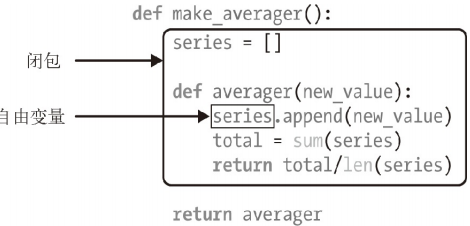

### 把函数视作对象

函数是对象类型，Python运行到`def`语句时，它将会生成一个新的函数对象，并将该函数对象赋值给这个函数名。定义的函数是`function`类的实例。调用函数相当于调用实例的`__call__`方法。`lambda`表达式创建一个函数对象并返回它，但是它并没有绑定一个名字即它是匿名的没有函数名，`return`语句将一个结果对象发送给调用者，`yield`语句使得函数成为一个生成函数

python中函数内的代码在函数调用的时候才求值，函数主体内的代码直到函数被调用时才运行。函数内的变量名在函数实际执行之前都不会解析。

确定与标识符相关联的值的过程称为名称解析。python中每一个定义域使用了一个抽象名称，称为命名空间。命名空间管理当前在给定作用域内定义的所有标识符。函数`dir`报告给定命名空间中的标识符的名称，而函数`vars`返回完整的字典。默认情况下，调用`dir`和`vars`报告的是执行过程中本地封闭的命名空间。

变量名查找规则：`LGBE`：首先查找本地作用域`L`，接着查找上一层`def`或`lambda`的本地作用域`E`（嵌套函数），接着查找全局作用域`G`，最后查找内置作用域`B`，如果均未找到变量名则报错。 

隐式赋值包括，`import`语句隐式赋值，`def`函数定义来隐式赋值，形参匹配来隐式赋值，

作用域法则：每个模块文件就是一个全局作用域。从外面看，模块的全局变量就成为该模块对象的属性；从内部看，模块的全局变量就是普通的、作用域为全局的变量，全局作用域的范围仅限于变量所在的单个文件，每次调用函数，都创建一个新的局部作用域，默认情况下，所有函数定义内部的变量都是局部变量，`global`语句声明会将变量名作用域提升至全局，`nonlocal`语句声明会将变量名作用域提升至外层的`def`。

```python
#嵌套作用域中的变量在嵌套的函数调用时才进行查找，而不是定义时。 
def func():
	acts=[]
	for i in range(5):
		acts.append(lambda x:i**x) #添加匿名函数对象
	return acts
acts=func();acts[0](2) #调用时才开始查找i,此时i最后被记住的值是4
```

参数传递的性质：参数的传递是通过自动将对象赋值给本地变量名来实现的，在函数内部的参数名赋值不会影响到实参对象，只是将变量名重新引用到另一个对象，若实参对象为可变对象，则在函数内原地修改参数对象会影响所有的指向该实参对象的引用。

默认情况下，参数匹配是通过其位置进行匹配的，从左到右一一匹配。必须精确传递和函数签名中参数名一样多的实参。关键字参数：允许通过变量名进行匹配，而不是通过位置。其中关键字顺序可以任意；默认参数：函数定义时，可以为参数设定默认值，这样允许调用时传递较少的参数，默认实参后面不能跟随非默认实参。如果出现这种情况则报语法错误；可变参数：函数能用特定的参数（以`*`开头），收集任意多的额外位置参数，将收集到的位置相关的参数到一个新元组中。  函数能用特定的参数（以`**`开头），收集任意多的额外关键字参数，将收集关键字相关的参数到一个新字典中；`keyword-only`参数：它是一种命名参数，出现在`*`参数之后，在`**`参数之前。所有的`keyword-only`参数必须使用关键字语法传递。   

可变参数解包：调用者可以用`*`语法将实参（如元组、列表、`set`）打散，形成位置参数，调用者可以用`**`语法将字典实参打散，形成关键字参数    

函数定义时的参数类型顺序：

```python
def func(a,b,c='c',*d,e,f='f',**g):
	pass
	func('a','b',e='e',*seq,**dic)
#seq是一个序列，它解包之后优先覆盖c，剩下的再收集成元组传给d，dic是一个字典，它解包之后优先考虑e,f，剩下的在收集成字典传递给g，e='e'这个关键字实参也可以位于'b'之后的任何位置，关键字实参必须位于位置实参之后 
```

编程语言理论家把一等对象定义为满足下述条件的程序实体：在运行时创建；能赋值给变量或数据结构中的元素；能作为参数传给函数；能作为函数的返回结果。

除了用户定义的函数，调用运算符，即`()`，还可以应用到其他对象上。如果想判断对象能否调用，可以使用内置的 callable() 函数。用户定义的函数、内置函数、内置方法、方法：在类的定义体中定义的函数；**类**：调用类时会运行类的` __new__ `方法创建一个实例，然后运行` __init__ `方法，初始化实例，最后把实例返回给调用方。因为 Python 没有`new`运算符，所以调用类相当于调用函数；**类的实例**：如果类定义了` __call__ `方法，那么它的实例可以作为函数调用；**生成器函数**：使用 yield 关键字的函数或方法。调用生成器函数返回的是生成器对象。

##### 函数内省

函数专有而用户定义的一般对象没有的属性。

| 名称             | 类型             | 说明                                 |
| ---------------- | ---------------- | ------------------------------------ |
| `__annotation__` | `dict`           | 参数和返回值的注解                   |
| `__call__`       | `method-wrapper` | 实现`()`运算符；即可调用对象协议     |
| `__closure__`    | `tuple`          | 函数闭包，即自由变量的绑定           |
| `__code__`       | `code`           | 编译成字节码的函数元数据和函数定义体 |
| `__defaults__`   | `tuple`          | 形式参数的默认值                     |
| `__get__`        | `method-wrapper` | 实现只读描述符协议                   |
| `__globals__`    | `dict`           | 函数所在模块中的全局变量             |
| `__kwdefaults__` | `dict`           | 仅限关键字形式参数的默认值           |
| `__name__`       | `str`            | 函数名称                             |
| `__qualname__`   | `str`            | 函数的限定名称                       |

#### 函数装饰器和闭包

装饰器是用于包装其他可调用对象的一个可调用对象，它是一个可调用对象，其调用参数为另一个可调用对象，它返回一个可调用对象。装饰器有两种使用形式：函数的装饰器：在函数对象定义的时候使用装饰器，用于管理该函数对象；类的装饰器：在类定义的时候使用该装饰器，用于管理该类以及类的实例

```python
@decorator
def func(*pargs,**kwargs):
	pass
func=decorator(func) # 等价于
```

执行了装饰器的`def`之后，函数名指向的不再是原来的函数对象，而是：一个可调用对象， 当`decorator`是个函数时由`decorator(func)`函数返回的；`decorator`类的实例，当`decorator`是个类时，由`decorator(func)`构造方法返回

```python
@decorator
class A:
	pass
A=decorator(A)
```

类的装饰器并不是拦截创建实例的函数调用，而是返回一个不同的可调用对象，执行了装饰器的`class`之后，类名指向的不再是原来的类对象，而是：一个可调用对象， 当`decorator`是个函数时由`decorator(func)`函数返回的；`decorator`类的实例，当`decorator`是个类时，由`decorator(func)`构造方法返回

```python
def decorator(func): #定义了一个叫decorator的装饰器
	#某些处理
	return func #返回可调用对象
class decorator: #也可以用类来实现装饰器
	def __init__(self,func):
		self.func=func
	def __call__(self,*args,**kwargs):
		return self.func
def decorator(func): #定义了一个叫decorator的装饰器
	def wrapper(*args):
		#使用func或其他的一些工作
	return wrapper #返回可调用对象
```

```python
@decoratorA
@decoratorB
@decoratorC
def func():
	pass
f=A(B(C(f))) #装饰器的嵌套
```

装饰器可以携带参数。函数定义的装饰器带参数：它其实是一个嵌套函数。外层函数的参数为装饰器参数，返回一个函数。内层函数的参数为`func`，返回一个可调用参数，<font color='red'>内层函数才是真正的装饰器</font>

```python
def decorator(*args,**kwargs): 
	print("this is decorator1:",args,kwargs)
	def actualDecorator(func): # 这才是真实的装饰器
		...
		return func
	return actualDecorator
```

类定义的装饰器带参数：它其实是一个嵌套类。外层类的初始化函数的参数为装饰器参数，外层类的`__call__`函数的参数为`func`，返回值为一个类的实例；内层类的初始化函数参数为`func`；内层类的`__call__`函数使用`func`，<font color='red'>内层类才是真正的装饰器</font>

```python
class decorator2:
	class ActualDecorator: #这才是真实的装饰器
		def __init__(self,func):
			...
			self.func=func#记住func
		def __call__(self,*args,**kwargs):
			...
			return self.func(*args,**kwargs) #使用func
	def __init__(self,*args,**kwargs):
		...
	def __call__(self,func):
		...
		return decorator2.ActualDecorator(func) 
```

总结：不带参数的装饰器`decorator`装饰一个名字`F``@decorator`：则执行的是：`F=decorator(F)`，直接使用`F`；带参数的装饰器`decorator`装饰一个名字`F``@decorator(args)`：则执行的是：`F=decorator(args)(F)`，间接使用`F` 。装饰器在加载模块时立即执行：它们在被装饰的函数定义之后立即运行。这通常是在导入时，函数装饰器在导入模块时立即执行，而被装饰的函数只在明确调用时运行。闭包指延伸了作用域的函数，其中包含函数定义体中引用、但是不在定义体中定义的非全局变量。



闭包是一种函数，它会保留定义函数时存在的自由变量的绑定，这样调用函数时，虽然定义作用域不可用了，但是仍能使用那些绑定。注意，只有嵌套在其他函数中的函数才可能需要处理不在全局作用域中的外部变量。`nonlocal `声明。它的作用是把变量标记为自由变量，即使在函数中为变量赋予新值了，也会变成自由变量。如果为` nonlocal `声明的变量赋予新值，闭包中保存的绑定会更新。解析源码中的装饰器时，`Python`把被装饰的函数作为第一个参数传给装饰器函数。那怎么让装饰器接受其他参数呢？答案是：创建一个装饰器工厂函数，把参数传给它，返回一个装饰器，然后再把它应用到要装饰的函数上。