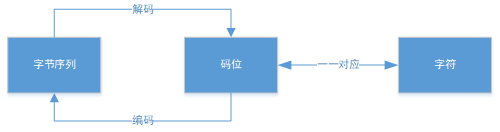

#### 文本和字节序列

| 占位符  | 作用       |
| ------- | ---------- |
| `%s,%r` | 字符串     |
| `%c`    | 字符       |
| `%d`    | 十进制整数 |
| `%i`    | 整数       |
| `%e`    | 浮点指数   |
| `%f`    | 浮点十进制 |
| `%%`    | 百分号 `%` |

转换通用目标结构为：`%[(key_name)][flags][width][.precision]type`

| 名称        | 作用                                                         |
| ----------- | ------------------------------------------------------------ |
| `key_name`  | 用于从右边字典中取对应键的值，如：`"%(n)d %(x)s" %{"n":3,"x":"apples"}` |
| `flags`     | 如果为`-`则左对齐；如果为`+`则为正负号；如果为`0`：则补零    |
| `width`     | 指定位宽，至少为`width`字符宽度                              |
| `precision` | 指定小数点后几位                                             |
| `type`      | 类型，如`d`,`r`,`f`,`e`等                                    |

格式化字符串除了使用字符串格式化表达式之外，还可以通过字符串的`.format()`方法达到同样的效果。`.format()`方法支持位置参数、关键字参数、以及二者的混合。

| 类型       | 案例                                                  |
| ---------- | ----------------------------------------------------- |
| 位置参数   | `"{0},{1},{2}".format('abc','def','ghi')`             |
| 关键字参数 | `"{k1},{k2},{k3}".format(k1='abc',k2='def',k3='ghi')` |
| 混合使用   | `"{0},{1},{k}".format('abc','def',k='ghi')`           |

格式化字符串中可以指定对象的属性、字典键、序列的索引

| 方式           | 案例                                                         |
| -------------- | ------------------------------------------------------------ |
| 指定字典的键   | `"{0[a]}".format({'a':'value'})`                             |
| 指定对象的属性 | `"{0.platform}".format(sys)`                                 |
| 关键字参数     | `"{obj.platform}".format(obj=sys)`                           |
| 指定序列的索引 | `"{0[2]}".format("abcd")` ，这里只能进行正索引值，且不能分片 |

通用目标结构为： `{fieldname!conversionflag:formatspec}`

| 名称         | 说明                                                         |
| ------------ | ------------------------------------------------------------ |
| `fieldname`  | 为位置数字 0,1,2,或者为关键字，它后面可选地跟随              |
| `formatspec` | 格式，结构为：`[[fill] align] [sign] [#] [0] [width] [.precision] [type]` |

| 名称         | 说明                                                         |
| ------------ | ------------------------------------------------------------ |
| `fill`       | 一般与`align`为`=`时配合                                     |
| `align`      | 对齐：`<`：左对齐；`>`：右对齐；`=`：必须指定`fill`，此时用这个字符填充；`^`：居中对齐 |
| `sign`       | 为正负号标记；`0`：补0                                       |
| `width`      | 位宽                                                         |
| `.precision` | 精度                                                         |
| `type`       | 为类型，如`d`,`r`,`f`,`e`等                                  |

##### 字符问题

字符的最佳定义是Unicode字符。码位，是`0~1114111`的数字,每一个字符对应一个标识或码位。字符的具体表述取决于所用的编码，通过编码将数值编码成不同的字节序列，解码就是将字节序列解读成数值，然后通过数值找到对应的字符。编码是在码位和字节序列之间转换时使用的算法，不同的编码方式就是不同的函数将字节序列映射成码位。

| 数据类型    | 说明                                                         |
| ----------- | ------------------------------------------------------------ |
| `str`       | 表示`Unicode`文本，为不可变的字符序列，称为字符串            |
| `bytes`     | 二进制数据，称为字节串。`bytes`对象是小整数的一个序列，每个整数的范围在(0,255)之间，`list(bytes_obj)`返回一个整数列表。 |
| `bytearray` | 一种可变的`bytes`类型，称为可变字节串，可变的且支持原地修改。它支持`str`与`bytes`的常见操作，以及与列表相同的一些原地修改操作 |

字符串的`str(a_bytes,encoding)`函数和`.decode(encoding)`方法将一个`bytes`实例解码成字符串形式。`bytearray`实例的构造：`bytearray('abc',encoding='ascii')`：通过构造函数传入字符串和编码构造; `bytearray(b'abc')`：通过`bytes`常量构造

##### 处理文本文件

处理文本的最佳实践是“Unicode 三明治”。 意思是，要尽早把输入的字节序列解码成字符串。这种三明治中的“肉片”是程序的业务逻辑，在这里只能处理字符串对象。在其他处理过程中，一定不能编码或解码。对输出来说，则要尽量晚地把字符串编码成字节序列。

当一个文件以文本模式打开时，读取其数据会自动将其内容解码，并返回一个字符串；当一个文件以文本模式写打开时，写入一个字符串会在将该字符串写入文件之前自动编码它。当一个文件以二进制模式打开时，读取其数据直接返回其原生内容而并不以任何方式解码，也不做任何方式修改，直接作为`bytes`实例返回；写入会接受一个`bytes`实例或者一个`bytearray`实例，并且不加修改地写入到文件

| 方法                                      | 描述                                                         |
| ----------------------------------------- | ------------------------------------------------------------ |
| `endswith(suffix[, start[,end]])`         | 如果字符串以指定的 *suffix* 结束返回 `True`，否则返回 `False`。 |
| `find(sub[,start[,end]])`                 | 返回子字符串 *sub* 在 `s[start:end]` 切片内被找到的最小索引。 |
| `index(sub[,start[,end]])`                | 类似于find                                                   |
| `isalnum,isdigit,isalpha...`              | 判断字符串是否满足某些条件                                   |
| `replace(old,new[,count])`                | 返回字符串的副本，其中出现的所有子字符串 *old* 都将被替换为 *new*。 如果给出了可选参数 *count*，则只替换前 *count* 次出现。 |
| `split(sep=None, maxsplit=-1)`            | 返回一个由字符串内单词组成的列表，使用 *sep* 作为分隔字符串。 如果给出了 *maxsplit*，则最多进行 *maxsplit* 次拆分 |
| `startswith(prefix[,start[,end]])`        | 如果字符串以指定的 *prefix* 开始则返回 `True`，否则返回 `False`。 |
| `strip([char])`                           | 返回原字符串的副本，移除其中的前导和末尾字符。 *chars* 参数为指定要移除字符的字符串。 如果省略或为 `None`，则 *chars* 参数默认移除空格符。 |
| `partition(sep)`                          | 在 *sep* 首次出现的位置拆分字符串，返回一个 3 元组，其中包含分隔符之前的部分、分隔符本身，以及分隔符之后的部分。 |
| `count(sub[, start[, end]])`              | 统计子字符串出现的次数                                       |
| `encode(encoding='utf8', error='strict')` | 对字符串进行编码，得到`bytes`                                |
| `join(iterable)`                          | 对可迭代对象进行合并                                         |
| `splitlines([keepends])`                  | 对字符串按行切分                                             |

##### `re`

`re.I`:忽略大小写；`re.M`：多行模型，改变`^`和`$`行为；`re.S`:点任意匹配模式，改变`.`行为；`re.L`;  `re.U`; `re.X`:详细模式。

`\w`----匹配字母数字字符；`\W`----匹配非字母数字字符；`\d`----匹配数字；`\D`----匹配所有非数字；`\s`----匹配一个空格字符；`\S`----匹配出空格字符外的所有字符；`\t`----匹配制表符；`\n`----匹配换行符；`\r`----匹配回测符；`.`----匹配除`\n`外的所有字符；`()`----对正则表达式进行分组，并返回匹配的文本；`a|b`----匹配a或者b；`^`----开始位置；`$`----结束位置；`{m}`----精确匹配m个；`*`----匹配模式的0次或多次出现；`{m,}`----匹配至少m个；`{m,n}`----匹配个数介于m和n之间；`?`----匹配模式的一次或零次出现；`+`----匹配模式的一次或多次出现；`[]`--用于表示一个字符集合；`{m,n}?`---前一个修饰符的非贪婪模式，只匹配尽量少的字符次数；`(?P<name>...)`---类似正则组合，但是匹配到的子串组在外部是通过定义的 `name` 来获取的；`\`----转义字符；

| 方法                                              | 描述                                                         |
| ------------------------------------------------- | ------------------------------------------------------------ |
| `compile(pattern, flags = 0)`                     | 将正则表达式的样式编译为一个 正则表达式对象，可以用于匹配。  |
| `re.A, re.I, re.L,re.M, re.S, re.X`               |                                                              |
| `re.search(pattern, string, flags=0)`             | 扫描整个字符串找到匹配样式的第一个位置，并返回一个相应的匹配对象。如果没有匹配，就返回一个 None |
| `match(pattern, string, flags=0)`                 | 如果string开始的0或者多个字符匹配到了正则表达式样式，就返回一个相应的匹配对象 。 如果没有匹配，就返回 None |
| `fullmatch(pattern, string, flags=0)`             | 如果整个string匹配到正则表达式样式，就返回一个相应的匹配对象 。 否则就返回一个None |
| `split(pattern, string, maxsplit=0, flags=0)`     | 用 *pattern* 分开 *string*                                   |
| `findall(pattern, string, flags=0)`               | 对 *string* 返回一个不重复的 *pattern* 的匹配列表， *string* 从左到右进行扫描，匹配按找到的顺序返回。 |
| `finditer(pattern, string, flags=0)`              | pattern 在 string 里所有的非重复匹配，返回为一个迭代器 iterator 保存了 匹配对象 。 string 从左到右扫描，匹配按顺序排列。 |
| `re.sub(pattern, repl, string, count=0, flags=0)` | 返回通过使用 *repl* 替换在 *string* 最左边非重叠出现的 *pattern* 而获得的字符串。 |
| `re.escape(pattern)`                              | 转义 *pattern* 中的特殊字符。                                |

编译后的正则表达式对象支持一下方法和属性：

| 方法                                   |                                                              |
| -------------------------------------- | ------------------------------------------------------------ |
| `search(string[,pos[,endpos]])`        |                                                              |
| `pattern.match(string[,pos[,endpos]])` |                                                              |
| `pattern.flags`                        | 正则匹配标记。                                               |
| `pattern.groups`                       | 捕获组合的数量。                                             |
| `pattern.groupindex`                   | 映射由 `(?P<id>)` 定义的命名符号组合和数字组合的字典。如果没有符号组，那字典就是空的。 |

匹配对象总是有一个布尔值 `True`。如果没有匹配的话 `match()` 和 `search()`返回 `None` 所以你可以简单的用 `if` 语句来判断是否匹配。匹配对象支持以下方法和属性：

| 方法                                        | 描述                                                         |
| ------------------------------------------- | ------------------------------------------------------------ |
| `Match.expand(template)`                    |                                                              |
| `match.group([group1,...])`                 | 返回一个或者多个匹配的子组。如果只有一个参数，结果就是一个字符串，如果有多个参数，结果就是一个元组，如果没有参数，组1默认到0。 |
| `Match.groups(default=None)`                | 返回一个元组，包含所有匹配的子组，在样式中出现的从1到任意多的组合。 |
| `Match.groupdict(default=None)`             | 返回一个字典，包含了所有的 *命名* 子组。key就是组名。        |
| `Match.start([group]),end,span,pos, endpos` | 返回 *group* 匹配到的字串的开始和结束标号。*group* 默认为0   |
