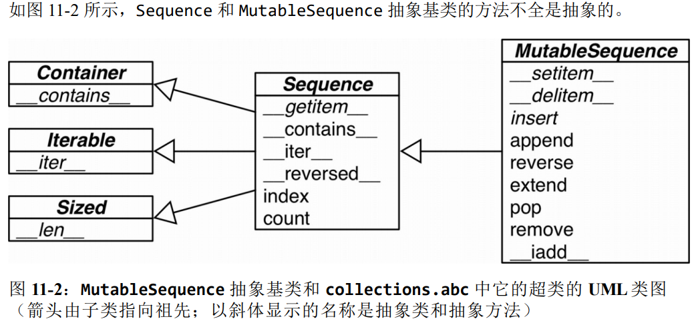

容器序列: `list、tuple`和 `collections.deque `这些序列能存放不同类型的数据；扁平序列: `str、bytes、bytearray、memoryview` 和` array.array`，这类序列只能容纳一种类型。

容器序列存放的是它们所包含的任意类型的对象的引用，而扁平序列里存放的是值而不是引用。换句话说，扁平序列其实是一段连续的内存空间，只能存放诸如字符、字节和数值这种基础类型。

序列类型还能按照能否被修改来分类。可变序列: `list、bytearray、array.array、collections.deque` 和 `memoryview`。不可变序列: `tuple、str `和 `bytes`。

所有序列规定的比较操作都是基于字典顺序，即一个元素接一个元素地比较，直至找到第一个不同的元素。



| 序列支持操作         | 结果                                        |
| -------------------- | ------------------------------------------- |
| `x in s`             | 如果s中的某项等于x则结果为True，否则为False |
| `x not in s`         | 如果s中某项等于x则结果为False，否则为True   |
| `s.index(x[,i[,j]])` | x再s中首次出现项的索引号                    |
| `s.count(x)`         | x在s中出现的总次数                          |

不可变序列类型普遍实现而可变序列类型未实现的唯一操作是对`hash()`函数的支持。

| 可变序列支持操作 | 结果                                       |
| ---------------- | ------------------------------------------ |
| `s.extend(t)`    |                                            |
| `s.insert(i,x)`  | 在由 *i* 给出的索引位置将 *x*插入 *s*      |
| `s.pop([i])`     | 提取在 *i* 位置上的项，并将其从 *s* 中移除 |
| `s.remove(x)`    | 删除 *s* 中第一个 `s[i]` 等于 *x*的项目。  |
| `s.reverse()`    | 就地将列表中的元素逆序                     |

列表推导、生成器表达式，以及同它们很相似的集合推导和字典推导，在 `Python3`中都有了自己的局部作用域。

###### 切片对象

`a:b:c`这种用法只能作为索引或者下标用在`[]`中来返回一个切片对象：`slice(a, b, c)`。对`seq[start:stop:step]`进行求值时调用 `seq.__getitem__(slice(start, stop, step))`

###### 数组

如果我们需要一个只包含数字的列表，那么`array.array`比 `list`更高效。数组支持所有跟可变序列有关的操作。另外，数组还提供从文件读取和存入文件的更快的方法，如`.frombytes`和`.tofile`。Python数组跟C语言数组一样精简。创建数组需要一个类型码，这个类型码用来表示在底层的C语言应该存放怎样的数据类型。而且Python不会允许你在数组里存放除指定类型之外的数据。

| 函数               | 描述                                                         |
| ------------------ | ------------------------------------------------------------ |
| `s.fromfile(f, n)` | 将二进制文件f内含有机器值读出来添加到尾部，最多添加 n 项     |
| `s.fromlist(l)`    | 将列表里的元素添加到尾部，如果其中任何一个元素导致了 `TypeError`异常，那么所有的添加都会取消 |
| `s.tobytes()`      | 把所有元素的机器值用 bytes 对象的形式返回                    |
| `s.tofile(f)`      | 把所有元素以机器值的形式写入一个文件                         |
| `s.tolist()`       | 把数组转换成列表，列表里的元素类型是数字对象                 |
| `s.typecode`       | 返回只有一个字符的字符串，代表数组元素在 C 语言中的类型      |

#### 字典和集合

`UserDict `并不是 `dict `的子类，但是 `UserDict `有一个叫作`data`的属性，是 `dict `的实例，这个属性实际上是 `UserDict `最终存储数据的地方。


| 方法                         | 描述                                                         |
| ---------------------------- | ------------------------------------------------------------ |
| `get(key[,default])`         | 如果`key`在字典中返回值，否则返回`default`                   |
| `pop(key[, default])`        | 如果`key`在字典中删除并返回对应的值，否则返回`default`       |
| `popitem()`                  | 从字典中删除并返回`(key, value)`，按照`LIFO`顺序，后入先出   |
| `setdefault(key[, default])` | 如果字典存在键`key`，返回它的值。如果不存在，插入值为`default`的键 `key` ，并返回 `default`。 |
| `update([other])`            | 用`other`中的`(key, value)`来更新原来的字典，并且覆盖原来字典的值。 |

标准库里的所有映射类型都是利用` dict `来实现的，因此它们有个共同的限制，即只有可散列的数据类型才能用作这些映射里的键。

如果一个对象是可散列的，那么在这个对象的生命周期中，它的散列值是不变的，而且这个对象需要实现` __hash__() `方法。另外可散列对象还要有`__qe__() `方法，这样才能跟其他键做比较。如果两个可散列对象是相等的，那么它们的散列值一定是一样的。

一般来讲用户自定义的类型的对象都是可散列的，散列值就是它们的` id() `函数的返回值，所以所有这些对象在比较的时候都是不相等的。如果一个对象实现了 `__eq__ `方法，并且在方法中用到了这个对象的内部状态的话，那么只有当所有这些内部状态都是不可变的情况下，这个对象才是可散列的。

##### 映射的弹性键查询

有时候为了方便起见，就算某个键在映射里不存在，我们也希望在通过这个键读取值的时候能得到一个默认值。有途径能帮我们达到这个目的，一个是通过` defaultdict `这个类型而不是普通的` dict`，另一个是给自己定义一个` dict `的子类，然后在子类中实现`__missing__ `方法。在实例化一个 `defaultdict `的时候，需要给构造方法提供一个可调用对象，这个可调用对象会在 `__getitem__ `碰到找不到的键的时候被调用，让 `__getitem__ `返回某种默认值。`defaultdict `里的` default_factory `只会在 `__getitem__ `里被调用，在其他的方法里完全不会发挥作用。所有的映射类型在处理找不到的键的时候，都会牵扯到` __missing__ `方法。虽然基类 `dict `并没有定义这个方法，但是 `dict `是知道有这么个东西存在的。也就是说，如果有一个类继承了` dict`，然后这个继承类提供了`__missing__ `方法，那么在 `__getitem__ `碰到找不到的键的时候，Python 就会自动调用它，而不是抛出一个 `KeyError `异常。`__missing__ `方法只会被 `__getitem__ `调用。提供 `__missing__ `方法对 `get `或者 `__contains__`这些方法的使用没有影响。

##### 集合


| 方法                                | 描述                                                         |
| ----------------------------------- | ------------------------------------------------------------ |
| `isdisjoint(other)`                 | 如果集合中没有与 *other* 共有的元素则返回 `True`。           |
| `issubset(other),issuperset(other)` | 检测是否集合中的每个元素都在 *other* 之中。                  |
| `union(*others)`                    | 返回一个新集合，其中包含来自原集合以及 others 指定的所有集合中的元素。 |
| `intersection(*others)`             | 返回一个新集合，其中包含原集合以及 others 指定的所有集合中共有的元素。 |
| `diffenrence(*other)`               | 返回一个新集合，其中包含原集合中在 others 指定的其他集合中不存在的元素。 |
| `update(*others)`                   | 更新集合，添加来自 others 中的所有元素。                     |
| `add(elem)`                         | 将元素 `elem`添加到集合中。                                  |
| `remove(elem),discard(elem),pop()`  | 从集合中移除元素 *elem*。                                    |

散列表其实是一个稀疏数组：总是有空白元素的数组称为稀疏数组。散列表里的单元通常叫作表元。在` dict `的散列表当中，每个键值对都占用一个表元，每个表元都有两个部分，一个是对键的引用，另一个是对值的引用。因为所有表元的大小一致，所以可以通过偏移量来读取某个表元。

因为 Python 会设法保证大概还有三分之一的表元是空的，所以在快要达到这个阈值的时候，原有的散列表会被复制到一个更大的空间里面。为了获取` my_dict[search_key] `背后的值，Python 首先会调用` hash(search_key)`来计算` search_key `的散列值，把这个值最低的几位数字当作偏移量，在散列表里查找表元。若找到的表元是空的，则抛出`KeyError `异常。若不是空的，则表元里会有一对` found_key:found_value`。这时候 Python 会检验` search_key == found_key `是否为真，如果它们相等的话，就会返回` found_value`。如果 `search_key `和 `found_key `不匹配的话，这种情况称为散列冲突。发生这种情况是因为，散列表所做的其实是把随机的元素映射到只有几位的数字上，而散列表本身的索引又只依赖于这个数字的一部分。为了解决散列冲突，算法会在散列值中另外再取几位，然后用特殊的方法处理一下，把新得到的数字再当作索引来寻找表元。若这次找到的表元是空的，则同样抛出 `KeyError`；若非空，或者键匹配，则返回这个值；或者又发现了散列冲突，则重复以上的步骤。


##### collections

| 类名                                | 作用                                                     |
| ----------------------------------- | -------------------------------------------------------- |
| `namedtuple(typename,field_name)`   | 创建命名元组子类的工厂函数,返回一个新的元组子类。        |
| `deque([iterable[,maxlen]])`        | 类似列表的容器，实现了在两端快速添加(append)和弹出(pop)  |
| `ChainMap(*maps)`                   | 类似字典的容器类，将多个映射集合到一个视图里面           |
| `Counter(iterable or mapping)`      | 字典的子类，提供了可哈希对象的计数功能                   |
| `OrderDict`                         | 字典的子类，保存了他们被添加的顺序                       |
| `defaultdict(default_factory[,..])` | 字典的子类，提供了一个工厂函数，为字典查询提供一个默认值 |
| `UserDict`                          | 封装了字典对象，简化了字典子类化                         |
| `UseList`                           | 封装了列表对象，简化了列表子类化                         |
| `UseString`                         | 封装了字符串对象，简化了字符串子类化                     |

```python
Card = collections.namedtuple('Card',['rank', 'suit'])

```


一个 `ChainMap `将多个字典或者其他映射组合在一起，创建一个单独的可更新的视图。 如果没有` maps `被指定，就提供一个默认的空字典，这样一个新链至少有一个映射。底层映射被存储在一个列表中。这个列表是公开的，可以通过` maps `属性存取和更新。没有其他的状态。搜索查询底层映射，直到一个键被找到。不同的是，写，更新和删除只操作第一个映射。

一个`Counter `是一个` dict `的子类，用于计数可哈希对象。它是一个集合，元素像字典键(key)一样存储，它们的计数存储为值。计数可以是任何整数值，包括0和负数。

`elements()`:返回一个迭代器，每个元素重复计数的个数。元素顺序是任意的。如果一个元素的计数小于1，就会忽略它。
`most_common([n])`:返回一个列表，提供` n` 个频率最高的元素和计数。 如果是`None`， `most_common() `:返回计数器中的所有元素。`subtract([iterable-or-mapping])`:从迭代对象或映射对象减去元素。像`dict.update()`但是是减去，而不是替换。输入和输出都可以是0或者负数。`update([iterable-or-mapping])`:从 迭代对象 计数元素或者 从另一个 映射对象添加。 像` dict.update() `但是是加上，而不是替换。另外，迭代对象应该是序列元素，而不是一个`(key, value) `对。

`deque`返回一个新的双向队列对象，从左到右初始化 ，从`iterable`数据创建。如果 `iterable `没有指定，新队列为空。如果`maxlen`没有指定或者是` None `，`deques `可以增长到任意长度。否则，`deque`就限定到指定最大长度。一旦限定长度的`deque`满了，当新项加入时，同样数量的项就从另一端弹出
`append(x)`:添加 x 到右端。`appendleft(x)`:添加 x 到左端。`count(x)`:计算`deque`中个数等于 x 的元素。`extend(iterable)`: 扩展`deque`的右侧，通过添加`iterable`参数中的元素。`extendleft(iterable)`: 扩展`deque`的左侧，通过添加`iterable`参数中的元素。`insert(i, x)`:在位置` i` 插入` x `。如果插入会导致一个限长`deque`超出长度` maxlen `的话，就升起一个` IndexError`。`pop()`: 移去并且返回一个元素，`deque`最右侧的那一个。`popleft()`: 移去并且返回一个元素，`deque`最左侧的那一个。`remove(value)`: 移去找到的第一个`value`。 `reverse()`: 将`deque`逆序排列。返回 `None` 。`rotate(n=1)`: 向右循环移动` n `步。 如果` n `是负数，就向左循环。

##### `heapq`

This module provides an implementation of the heap queue algorithm, also known as the priority queue algorithm. The `API` below differs from textbook heap algorithms in two aspects: (a) We use zero-based indexing. This makes the relationship between the index for a node and the indexes for its children slightly less obvious, but is more suitable since Python uses zero-based indexing. (b) Our pop method returns the smallest item, not the largest.

| 函数名                                       | 作用                                                         |
| -------------------------------------------- | ------------------------------------------------------------ |
| `heappush(heap, item)`                       | Push the value *item* onto the *heap*, maintaining the heap invariant. |
| `heappop(heap)`                              | Pop and return the smallest item from the *heap*, maintaining the heap invariant. |
| `heappushpop(heap, item)`                    | Push *item* on the heap, then pop and return the smallest item from the *heap*. |
| `heapify(x)`                                 | Transform list *x* into a heap, in-place, in linear time.    |
| `merge(*iterable, key =None, reverse=False)` | Merge multiple sorted inputs into a single sorted output     |
| `nlargest(n, iterable, key=None)`            | Return a list with the *n* largest elements from the dataset defined by `iterable`. |

