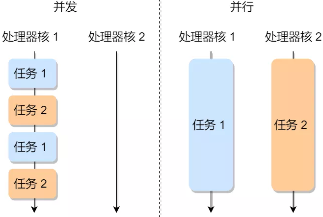
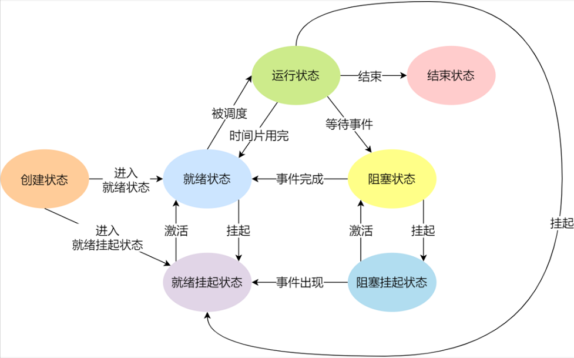
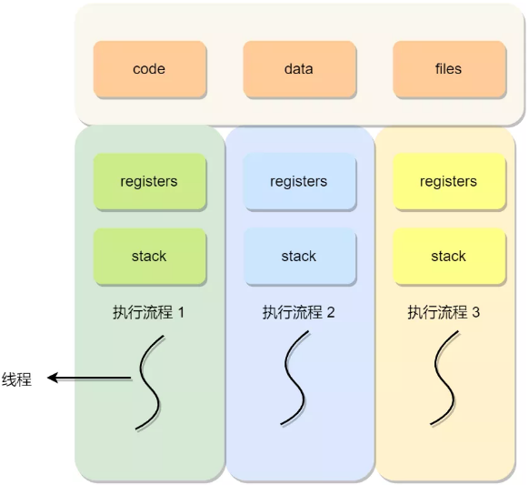

在一个进程的活动期间至少具备三种基本状态，即运行状态、就绪状态、阻塞状态。

| 状态名称 | 说明                                                         |
| -------- | ------------------------------------------------------------ |
| 创建状态 | 进程正在被创建时的状态                                       |
| 就绪状态 | 可运行，但因为其他进程正在运行而暂停停止；                   |
| 运行状态 | 该时刻进程占用 CPU；                                         |
| 阻塞状态 | 进程正在等待某一事件发生（如等待输入/输出操作）而暂时停止运行，这时，即使给它CPU控制权，它也无法运行 |
| 结束状态 | 进程正在从系统中消失时的状态                                 |
| 挂起状态 | 表示进程没有占有物理内存空间                                 |

挂起状态可以分为两种：阻塞挂起状态：进程在外存（硬盘）并等待某个事件的出现；就绪挂起状态：进程在外存（硬盘），但只要进入内存，即刻立刻运行；

###### 线程

同一个进程内多个线程之间可以共享代码段、数据段、打开的文件等资源，但每个线程都有独立一套的寄存器和栈，这样可以确保线程的控制流是相对独立的。

线程的优点：一个进程中可以同时存在多个线程；各个线程之间可以并发执行；各个线程之间可以共享地址空间和文件等资源；

线程的缺点：当进程中的一个线程奔溃时，会导致其所属进程的所有线程奔溃。

线程与进程的比较如下：

- 进程是资源（包括内存、打开的文件等）分配的单位，线程是 CPU 调度的单位；
- 进程拥有一个完整的资源平台，而线程只独享必不可少的资源，如寄存器和栈；
- 线程同样具有就绪、阻塞、执行三种基本状态，同样具有状态之间的转换关系；
- 线程能减少并发执行的时间和空间开销；

线程是调度的基本单位，而进程则是资源拥有的基本单位。