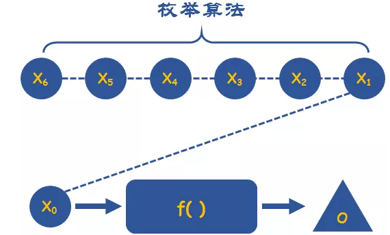
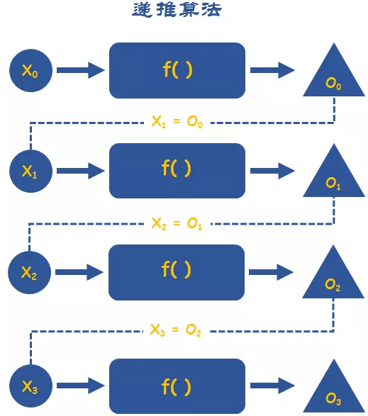
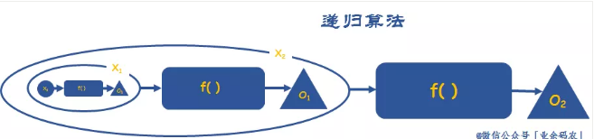
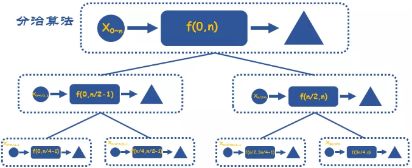
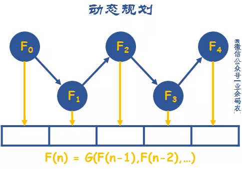
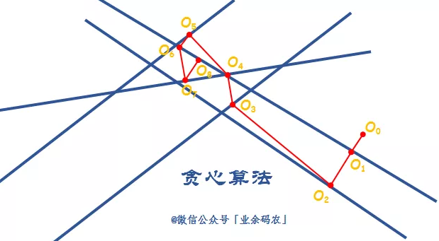

##### KMP算法

 `KMP`算法的核心，它是主要利用匹配失败后的信息，尽量减少模式串与主串的匹配次数以达到快速匹配的目的。用成功匹配的位数减去匹配表中的匹配值就是下一次要移动的次数。


对于前缀就是除了最后个字符以外所有的顺序组合方式。比如 A、AB、ABC、ABCA、ABCAB。后缀正好相反，除了第一个字符外，其他所有的组合方式。比如BCABD、CABD、ABD、ABD、BD、D。对于每个匹配值是如何计算的，那就对子串的每个字符组合寻找出前缀和后缀，然后进行比较是否有相同的，相同的字符组合有几位，就是所谓的匹配值。


###### Bloom Filter

在哈希表中存放的是元素本身，而 Bloom Filter 在内存中是一个足够大的位数组(Bit Array)，其最小的内存使用单位是Bit。元素在插入Bloom Filter时，使用哈希函数(Hash Function)计算其哈希值确定其在位数组中的位置索引，然后将位数组中的指定Bit从0置1即可(如该Bit已经被置1，则无需再次置1)。当使用Bloom Filter判定指定元素是否存在其中时，同样利用该Hash Function先计算哈希值，确定其在位数组的中位置索引，然后取出该位置的值， 若该Bit为0，则说明该元素不存在于其中；若该Bit为1，则说明该元素存在于其中。现已向一个Bloom Filter分别插入元素"Hello"、"World"为例，给出其插入过程的图解


故判定一个元素是否存在于Bloom Filter，如果判定结果是不存在(False)，则一定不存在；但是如果判定结果是存在(True)，则实际情况其实是可能存在，而不是一定存在，即假阳性。 所以，实际应用中，在Bloom Filter 一般会使用多个Hash Function，以减小发生哈希冲突的概率。即，减小误判率 P(true)。插入一个元素时，分别计算其在各个Hash Function的哈希值，然后将各个哈希值对应的Bit的值置1；而判定元素是否存在于Bloom Filter时，则要求各个哈希值对应的Bit的值均为1才行


Bloom Filter 中涉及到的一些参数指标：

- 欲插入Bloom Filter中的元素数目: n
- Bloom Filter误判率: P(true)
- BitArray数组的大小: m
- Hash Function的数目: k

欲插入Bloom Filter中的元素数目 n 是我们在实际应用中可以提前获取或预估的；Bloom Filter的误判率 P(true) 则是我们提前设定的可以接受的容错率。所以在设计Bloom Filter过程中，最关键的参数就是BitArray数组的大小 m 和 Hash Function的数目 k。$P(true) = (p_1^n)^k=[1-(1-\frac{1}{m})^{kn}]^k$。从上式可以看出，当BitArray数组的大小m增大 或 欲插入Bloom Filter中的元素数目n 减小时，均可以使得误判率P(true)下降

##### 算法技巧

巧用数组下标：数组的下标是一个隐含的很有用的数组，特别是在统计一些数字，或者判断一些整型数是否出现过的时候。

巧用取余：有时候我们在遍历数组的时候，会进行越界判断，如果下标差不多要越界了，我们就把它置为0重新遍历。

巧用双指针：比如“判断单链表是否有环”、“如何一次遍历就找到链表中间位置节点”、“单链表中倒数第 k 个节点”等问题。对于第一个问题，我们就可以设置一个慢指针和一个快指针来遍历这个链表。慢指针一次移动一个节点，而快指针一次移动两个节点，如果该链表没有环，则快指针会先遍历完这个表，如果有环，则快指针会在第二次遍历时和慢指针相遇。对于第二个问题，一样是设置一个快指针和慢指针。慢的一次移动一个节点，而快的两个。在遍历链表的时候，当快指针遍历完成时，慢指针刚好达到中点。对于第三个问题，设置两个指针，其中一个指针先移动k个节点。之后两个指针以相同速度移动。当那个先移动的指针遍历完成的时候，第二个指针正好处于倒数第k个节点。

巧用移位运算：有时候我们在进行除数或乘数运算的时候，我们就可以用移位的方法来运算了，这样会快很多。n / 2 等价于 n >> 1；n / 4 等价于 n >> 2；n / 8 等价于 n >> 3。

<<左移 运算规则：按二进制形式把所有的数字向左移动对应的位数，高位移出，低位的空位补零。\>>右移，运算规则：按二进制形式把所有的数字向右移动对应的位数，低位移出，高位的空位补符号位，即正数补0，负数补1

设置哨兵位：在链表的相关问题中，我们经常会设置一个头指针，而且这个头指针是不存任何有效数据的，只是为了操作方便，这个头指针我们就可以称之为哨兵位了。


给两个整数数组 A 和 B ，返回两个数组中公共的、长度最长的子数组的长度。

```java
public int findLength(int[]A, int[]B){
    int max = 0;
    int [][] dp = new int[A.length][B.length];
    for (int i=0; j<A.length; i++){
        for (int j=0; j<B.length;j++){
            if (A[i]==B[j]){
                if (i>0&& j>0)
                    dp[i][j] = dp[i-1][j-1]+1;
                else
                    dp[i][j]=1
                max = Math.max(max,dp[i][j]);
            }
        }
    }
    return max;
}
```

##### 算法思想

###### 枚举

通过实现事先确定好「可能解」，然后逐一在系统中进行验证，根据验证结果来对「可能解」进行分析和论证。



###### 递推

每一次推导的结果可以作为下一次推导的开始，这似乎跟迭代、递归的思想有点类似，不过递推的范畴要更广一些。



###### 递归

递归算法实际上是把问题转化成规模更小的同类子问题，先解决子问题，再通过相同的求解过程逐步解决更高层次的问题，最终获得最终的解。所以相较于递推而言，递归算法的范畴更小，要求子问题跟父问题的结构相同。而递推思想从概念上并没有这样的约束。



###### 分治

分治算法很像是一种向下管理的思想，从最高级层层划分，将子任务划分给不同的子模块，进而可以进行大问题的拆分，对系统问题的粒度进行细化，寻求最底层的最基本的解。

分治算法主要包括两个维度的处理，一是自顶向下，将主要问题逐层级划分为子问题；二是自底向上，将子问题的解逐层递增融入主问题的求解中。

通过层层粒度上的划分，将原问题划分为最小的子问题，然后再向上依次得到更高粒度的解。从上而下，再从下而上。先分解，再求解，再合并。



###### 动态规划

动态规划同样需要将问题划分为多个子问题，但是子问题之间往往不是互相独立的。当前子问题的解可看作是前多个阶段问题的完整总结。因此这就需要在子问题求解的过程中进行多阶段的决策，同时当前阶段之前的决策都能够构成一种最优的子结构。这就是所谓的最优化原理。

最优化原理，一个最优化策略具有这样的性质，不论过去状态和决策如何，对前面的决策所形成的状态而言，余下的诸决策必须构成最优策略。同时，这样的最优策略是针对已作出决策的总结，对后来的决策没有直接影响，只能借用目前最优策略的状态数据。这也被称之为无后效性。

动态规划的开始需要将问题按照一定顺序划分为各个阶段，然后确定每个阶段的状态，如图中节点的F0等。然后重点是根据决策的方法来确定状态转移方程。也就是需要根据当前阶段的状态确定下一阶段的状态。在这个过程中，下一状态的确定往往需要参考之前的状态。因此需要在每一次状态转移的过程中将当前的状态变量进行记录，方便之后的查找。



###### 贪心

贪心算法的实现过程就是从问题的一个初始解出发，每一次都作出「当前最优」的选择，直至遇到局部极值点。贪心所带来的局限性很明显，就是无法保证最后的解是最优的，很容易陷入局部最优的情况。



###### 回溯

回溯的过程就是在做出下一步选择之前，先对每一种可能进行试探；只有当可能性存在时才会向前迈进，倘若所有选择都不可能，那么则向后退回原来的位置，重新选择。


