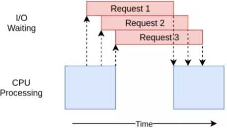
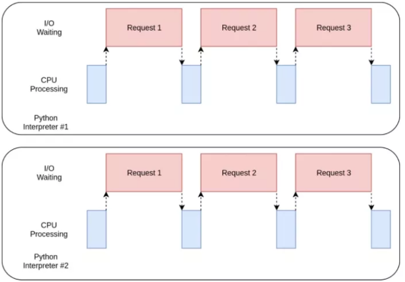

并发的字典定义是同时发生。在Python中，同时发生的事情用不同的名称(线程、任务、进程)来调用，但是在更高的级别上，它们都指向一个按顺序运行的指令序列。每一个都可以在某一点停止，处理它们的CPU可以切换到另一个。每一个的状态都会被保存，这样就可以在它们被中断的地方重新启动。只有multiprocessing才是真正意义上的同时运行。 Threading 和 asyncio 都运行在一个处理器上，因此它们两个一次只能运行一个。它们只是非常聪明地找到轮流加速整个过程的方法。尽管它们没有真正地同时运行，我们仍然将其称为并发。线程或任务轮流执行的方式是 threading 和 asyncio之间的主要区别。在threading中，操作系统实际上知道每个线程，并可以在任何时候中断它，以开始运行不同的线程。这称为抢占式多任务处理，因为操作系统可以抢占线程来进行切换。抢占式多任务处理非常方便，因为线程中的代码不需要做任何事情来进行切换。它也可能是困难的，因为“在任何时候”这句话。这种切换可以发生在单个Python语句的中间，甚至是像x = x + 1这样的简单语句。另一方面，asyncio使用协作多任务处理。这些任务必须通过宣布它们何时可以被切换出来相互配合。这意味着任务中的代码必须稍做修改才能实现这一点。并行：使用 multiprocessing，Python可以创建新的进程。这里的进程几乎可以看作是一个完全不同的程序，尽管从技术上讲，它们通常被定义为一组资源集合，其中的资源包括内存、文件句柄等。一种考虑方式是，每个进程都运行在自己的Python解释器中。因为它们是不同的过程，所以多进程程序中的每个任务都可以运行在不同的核心上。在不同的核心上运行意味着它们实际上可以同时运行threading抢占式多任务处理：操作系统决定何时将任务向外切换给python。asyncio协作式多任务处理：由任务决定何时放弃控制权。multiprocessing多进程:进程在不同的处理器上全部同时运行。


在`threading`中，因为操作系统可以控制任务何时中断，何时启动另一个任务，所以线程之间共享的任何数据都需要被保护起来，或者说是线程安全的。不幸的是，requests . Session()不是线程安全的。

根据数据是什么以及如何你使用它们，有几种策略可以使数据访问变成线程安全的。其中之一是使用线程安全的数据结构，比如来自 Python的queue模块的Queue。

这些对象使用低级基本数据类型，比如threading.Lock，以确保只有一个线程可以同时访问代码块或内存块。你可以通过ThreadPoolExecutor对象间接地使用此策略。这里要使用的另一种策略是线程本地存储。Threading.local()会创建一个对象，它看起来像一个全局对象但又是特定于每个线程的。


竞态条件是在多线程代码中可能而且经常发生的一类细微的bug。竞态条件的发生是因为程序员没有有效地保护数据访问，以防止线程之间相互干扰。在编写使用线程的代码时，你需要采取额外的步骤来确保数据是线程安全的。这里发生的事情是，操作系统控制着你的线程何时运行，以及它何时被交换出去，让另一个线程运行。这种线程交换可以在任何时候发生，甚至在执行Python语句的子步骤时也是如此。

asyncio的一般概念是一个单个的Python对象，称为事件循环，它控制每个任务如何以及何时运行。事件循环会关注每个任务并知道它处于什么状态。在实际中，任务可以处于许多状态，但现在我们假设一个简化的只有两种状态的事件循环。

就绪状态将表明一个任务有工作要做，并且已经准备好运行，而等待状态意味着该任务正在等待一些外部工作完成，例如网络操作。

我们简化的事件循环维护两个任务列表，每一个对应这些状态。它会选择一个就绪的任务，然后重新启动它。该任务处于完全控制之中，直到它配合地将控制权交还给事件循环为止。

当正在运行的任务将控制权交还给事件循环时，事件循环将该任务放入就绪或等待列表中，然后遍历等待列表中的每个任务，以查看I/O操作完成后某个任务是否已经就绪。时间循环知道就绪列表中的任务仍然是就绪的，因为它知道它们还没有运行。

一旦所有的任务都重新排序到正确的列表中，事件循环将选择下一个要运行的任务，然后重复这个过程。我们简化的事件循环会选择等待时间最长的任务并运行该任务。此过程会一直重复，直到事件循环结束。

asyncio的一个重要之处在于，如果没有刻意去释放控制权，任务是永远不会放弃控制权的。它们在操作过程中从不会被打断。这使得我们在asyncio中比在threading中能更容易地共享资源。你不必担心代码是否是线程安全的。



标准库中的multiprocessing旨在打破这种障碍，并使你的代码在多个CPU上运行。在高级层面来看，它通过创建一个新的Python解释器实例并在每个CPU上运行，然后将程序的一部分外包给每个CPU来实现这一点。



 协程是一个可以在自身结束之前挂起的方法，并且它可以将控制器传给其它协程一段时间。  \* 句法 `async def` 引入了**原生协程**或者说**异步生成器**。表达式 `async with` 和 `async for` 也是允许的，稍后就可以看到。

  \* 关键字 `await` 将控制器传递给时间循环。（挂起当前运行的协程。）Python执行的时候，在  `g()` 函数范围内如果遇到表达式 `await f()`，就是 `await` 在告诉事件循环“挂起 `g()` 函数，直到 `f()` 返回结果，在此期间，可以运行其他函数。”

```python
async def g():
    r = await f()
    return r
async def pcoro():
    await stuff() #一个函数标记为协程
```

协程是引入了 async def 的函数。你可能会用到 await，return 或者 yield，但是这些都是可选的。Python允许使用 async def noop(): pass 声明：使用 await 与 return 的组合创建协程函数。想要调用一个协程函数，必须使用 await 等待返回结果。在 async def 代码块中使用 yield 的情况并不多见。当你使用 async for 进行迭代的时候，会创建一个异步生成器。在任何使用 async def 定义的地方都不可以使用 yield from，这会引发异常 SyntaxError。一如在 def 定义的函数之外使用 yield 会引发异常 SyntaxError，在 async def 定义的协程之外使用 await 也会引发异常 SyntaxError。你只能在协程内部使用 await。

 当你使用 `await f()` 时，要求 `f()` 是一个可等待的对象。(1)其他的协程,要么就是(2)定义了 `.await()` 函数且返回迭代器的对象。 


在并行处理中，有两种执行类型：同步和异步。
同步执行就是各个进程按照启动的先后，顺序完成。 这是通过锁定主程序直到相应的进程运行完毕来实现的。
而异步执行，换句话说，进程的执行不涉及锁定。这样做的结果就是，进程结果返回的顺序可能会混淆，但通常情况下，异步执行会更快完成。
multiprocessing 模块中有两个对象是用来实现函数并行执行的：Pool 类和Process 类。
multiprocessing.Pool() 中提供了 apply(), map() 和 starmap() 等方法对传入的函数并行运行。

apply()和 map()都是把要进行并行化的函数作为主要参数。但是不同的是， apply()接受args参数， 通过args将各个参数传送给被并行化处理的函数，而map 仅将一个迭代器作为参数。
与Pool.map()一样，Pool.starmap()也只仅接受一个迭代器参数，但在starmap()中，迭代器种的每一个元件也是一个迭代器。你可以通过这个内部迭代器向被并行化处理的函数传递参数，在执行时再顺序解开，只要传递和解开的顺序一致就可以。
apply_async()的使用与apply()非常相似，只是你需要提供一个回调函数来告诉如何存储计算结果。

但是，使用apply_async()时需要注意的是，结果中的数字顺序会混乱，表明进程没有按照启动的顺序完成。

###### 线程模块

In CPython, the global interpreter lock, or GIL, is a mutex that prevents multiple native threads from executing Python bytecodes at once. This lock is necessary mainly because CPython’s memory management is not thread-safe. (However, since the GIL exists, other features have grown to depend on the guarantees that it enforces.)

尽管Python完全支持多线程编程， 但是解释器的C语言实现部分在完全并行执行时并不是线程安全的。实际上，解释器被一个全局解释器锁保护着，它确保任何时候都只有一个Python线程执行。

在多线程环境中，Python 虚拟机按以下方式执行:

1.设置GIL

2.切换到一个线程去执行

3.运行

- 指定数量的字节码指令
- 线程主动让出控制（可以调用time.sleep(0))

4.把线程设置完睡眠状态

5.解锁GIL

6.再次重复以上步骤

对所有面向 I/O 的(会调用内建的操作系统 C 代码的)程序来说，GIL 会在这个 I/O 调用之 前被释放，以允许其它的线程在这个线程等待 I/O 的时候运行。如果某线程并未使用很多 I/O 操作， 它会在自己的时间片内一直占用处理器(和 GIL)。也就是说，I/O 密集型的 Python 程序比计算密集 型的程序更能充分利用多线程环境的好处。

 守护线程一般是一个等待客户请求的服务器， 如果没有客户 出请求，它就在那等着。如果你设定一个线程为守护线程，就表示你在说这个线程 是不重要的，在进程退出的时候，不用等待这个线程退出。 

 threading._shutdown() 方法会遍历所有正在运行的线程，并且会在所有没有 deamon 标记的线程上调用 .join() 方法。

所以，当线程本身正处于休眠等待状态时，程序会等待线程完成然后退出。而一旦线程完成并打印了消息，.join() 方法则会返回并退出程序。

Python创建Thread对象语法如下：

```
import threading
threading.Thread(target=None, name=None,  args=())
```

主要参数说明：

- target 是函数名字，需要调用的函数。
- name 设置线程名字。
- `args `函数需要的参数，以元祖( tuple)的形式传入
- Thread对象主要方法说明:
- `run()`: 用以表示线程活动的方法。
- `start()`:启动线程活动。
- `join()`: 等待至线程中止。
- `isAlive()`: 返回线程是否活动的。
- `getName()`: 返回线程名。
- `setName()`: 设置线程名。

Python中实现多线程有两种方式：函数式创建线程和创建线程类。

函数式创建线程：创建线程的时候，只需要传入一个执行函数和函数的参数即可完成`threading.Thread`实例的创建。下面的例子使用Thread类来产生2个子线程，然后启动2个子线程并等待其结束，

```python
import threadingimport time,random,math# idx 循环次数
def printNum(idx):    
    for num in range(idx ):#打印当前运行的线程名字        
        print("{0}\tnum={1}".format(threading.current_thread().getName(), num))
        delay = math.ceil(random.random() * 2)        
        time.sleep(delay)
if __name__ == '__main__':    
    th1 = threading.Thread(target=printNum, args=(2,),name="thread1"  )    
    th2 = threading.Thread(target=printNum, args=(3,),name="thread2" )
    th1.start() #启动2个线程   
    th2.start()
    th1.join()   #等待至线程中止  
    th2.join()    
    print("{0} 线程结束".format(threading.current_thread().getName()))
```

运行脚本默认会启动一个线程，把该线程称为主线程，主线程有可以启动新的线程，Python的threading模块有个current_thread()函数，它将返回当前线程的示例。从当前线程的示例可以获得前运行线程名字，核心代码如下。

```
threading.current_thread().getName()
```

启动一个线程就是把一个函数和参数传入并创建Thread实例，然后调用start()开始执行

创建线程类：直接创建`threading.Thread`的子类来创建一个线程对象,实现多线程。通过继承Thread类，并重写Thread类的run()方法，在run()方法中定义具体要执行的任务。在Thread类中，提供了一个start()方法用于启动新进程，线程启动后会自动调用run()方法。

```python
import threading
import time,random,math
class MutliThread(threading.Thread):    
    def __init__(self, threadName,num):        
        threading.Thread.__init__(self)        
        self.name = threadName        
        self.num = num    
    def run(self):        
        for i in range(self.num):            
            print("{0} i={1}".format(threading.current_thread().getName(), i))             delay = math.ceil(random.random() * 2)            
            time.sleep(delay)
if __name__ == '__main__':    
    thr1 = MutliThread("thread1",3)    
    thr2 = MutliThread("thread2",2)  
    thr1.start()    
    thr2.start()      
    thr1.join()    
    thr2.join()    
    print("{0} 线程结束".format(threading.current_thread().getName()))
```

如果子线程`thread1`和`thread2`不调用join()函数，那么主线程`MainThread`和2个子线程是并行执行任务的，2个子线程加上`join()`函数后，程序就变成顺序执行了。所以子线程用到`join()`的时候，通常都是主线程等到其他多个子线程执行完毕后再继续执行，其他的多个子线程并不需要互相等待。

###### 守护线程

在线程模块中，使用子线程对象用到join()函数，主线程需要依赖子线程执行完毕后才继续执行代码。如果子线程不使用join()函数，主线程和子线程是并行运行的，没有依赖关系，主线程执行了，子线程也在执行。在多线程开发中，如果子线程设定为了守护线程，守护线程会等待主线程运行完毕后被销毁。一个主线程可以设置多个守护线程，守护线程运行的前提是，主线程必须存在，如果主线程不存在了，守护线程会被销毁。

```python
 # 把子线程设置为守护线程，在启动线程前设置
thr.setDaemon(True)
thr.start()
```

###### 多线程的锁机制

多线程编程访问共享变量时会出现问题，但是多进程编程访问共享变量不会出现问题。因为多进程中，同一个变量各自有一份拷贝存在于每个进程中，互不影响，而多线程中，所有变量都由所有线程共享。 想实现多个线程共享变量，需要使用全局变量。在方法里加上全局关键字`global`定义全局变量，多线程才可以修改全局变量来共享变量。  多线程同时修改全局变量时会出现数据安全问题，线程不安全就是不提供数据访问保护，有可能出现多个线程先后更改数据造成所得到的数据是脏数据。 

在多线程情况下，所有的全局变量有所有线程共享。所以，任何一个变量都可以被任何一个线程修改，因此，线程之间共享数据最大的危险在于多个线程同时改一个变量，把内容给改乱了。在多线程情况下，使用全局变量并不会共享数据，会出现线程安全问题。线程安全就是多线程访问时，采用了加锁机制，当一个线程访问该类的某个数据时，进行保护，其他线程不能进行访问直到该线程读取完，其他线程才可使用。不会出现数据不一致针对线程安全问题，需要使用”互斥锁”，就像数据库里操纵数据一样，也需要使用锁机制。某个线程要更改共享数据时，先将其锁定，此时资源的状态为“锁定”，其他线程不能更改；直到该线程释放资源，将资源的状态变成“非锁定”，其他的线程才能再次锁定该资源。互斥锁保证了每次只有一个线程进行写入操作，从而保证了多线程情况下数据的正确性。

```python
mutex = threading.Lock()# 创建锁
mutex.acquire()# 锁定
mutex.release()# 释放
```

```python
def change(num, counter):
    global balance
    for i in range(counter):
        lock.acquire() # # 先要获取锁
        balance += num
        balance -= num
        lock.release()  # 释放锁
        if balance != 100:
            # 如果输出这句话，说明线程不安全
            print("balance=%d" % balance)
            break
```

 当某个线程执行change()函数时，通过`lock.acquire()`获取锁，那么其他线程就不能执行同步代码块了，只能等待知道锁被释放了，获得锁才能执行同步代码块。由于锁只有一个，无论多少线程，同一个时刻最多只有一个线程持有该锁，所以修改全局变量balance不会产生冲突。

#### 协程

##### `io`编程

在python中访问文件要先调用一个内置函数`open`，它返回一个与底层文件交互的对象。在处理一个文件时，文件对象使用距离文件开始处的偏移量维护文件中的当前位置。在以只读权限或只写权限打开文件时，初始位置是0；如果以追加权限打开，初始位置是在文件的末尾。`fp = open('sample.txt')`

| 调用方法             | 描述                                                         |
| -------------------- | ------------------------------------------------------------ |
| `fp.read()`          | 将只读文件剩下的所有内容作为一个字符串返回                   |
| `fp.read(k)`         | 将只读文件中接下来k个字节作为一个字符返回                    |
| `fp.readline()`      | 从文件中读取一行内容，并以此作为一个字符串返回               |
| `fp.readlines()`     | 将文件中的每行内容作为一个字符串存入列表中，并返回该列表     |
| `fp.seek(k)`         | 将当前位置定位到文件的第k个字节                              |
| `for line in fp`     | 遍历文件中每一行                                             |
| `fp.tell()`          | 返回当前位置偏离开始处的字节数                               |
| `fp.write(string)`   | 在只写文件的当前位置将`string`的内容写入                     |
| `fp.writelines(seq)` | 在只写文件的当前位置写入给定序列的每个字符串。除了那些嵌入到字符串中的换行符，这个命令不插入换行符。 |

在磁盘上读写文件的功能都是由操作系统提供的，现代操作系统不允许普通的程序直接操作磁盘，所以，读写文件就是请求操作系统打开一个文件对象，然后，通过操作系统提供的接口从这个文件对象中读取数据，或者把数据写入这个文件对象。$\text{file-like object}$：像`open()`函数返回的这种有个`read()`方法的对象，在Python中统称为file-like Object。除了`file`外，还可以是内存的字节流，网络流，自定义流等等。$\text{file-like object}$不要求从特定类继承，只要写个`read()`方法就行。`StringIO`就是在内存中创建的$\text{file-like object}$，常用作临时缓冲。

###### 异步`io`

在一个线程中，CPU执行代码的速度极快，然而，一旦遇到IO操作，就需要等待IO操作完成，才能继续进行下一步操作。这种情况称为同步IO。在IO操作的过程中，当前线程被挂起，而其他需要CPU执行的代码就无法被当前线程执行了。因为一个IO操作就阻塞了当前线程，导致其他代码无法执行，所以我们必须使用多线程或者多进程来并发执行代码，为多个用户服务。每个用户都会分配一个线程，如果遇到IO导致线程被挂起，其他用户的线程不受影响。多线程和多进程的模型虽然解决了并发问题，但是系统不能无上限地增加线程。由于系统切换线程的开销也很大，所以，一旦线程数量过多，CPU的时间就花在线程切换上了，真正运行代码的时间就少了，结果导致性能严重下降。由于我们要解决的问题是CPU高速执行能力和IO设备的龟速严重不匹配，多线程和多进程只是解决这一问题的一种方法。另一种解决IO问题的方法是异步IO。当代码需要执行一个耗时的IO操作时，它只发出IO指令，并不等待IO结果，然后就去执行其他代码了。一段时间后，当IO返回结果时，再通知CPU进行处理。

```python
do_some_code()
f = open('/path/to/file', 'r')
r = f.read() # <== 线程停在此处等待IO操作结果
# IO操作完成后线程才能继续执行:
do_some_code(r)
#异步IO模型需要一个消息循环，在消息循环中，主线程不断地重复“读取消息-处理消息”这一过程
loop = get_event_loop()
while True:
    event = loop.get_event()
    process_event(event)
```

消息模型其实早在应用在桌面应用程序中了。一个GUI程序的主线程就负责不停地读取消息并处理消息。所有的键盘、鼠标等消息都被发送到GUI程序的消息队列中，然后由GUI程序的主线程处理。由于GUI线程处理键盘、鼠标等消息的速度非常快，所以用户感觉不到延迟。某些时候，GUI线程在一个消息处理的过程中遇到问题导致一次消息处理时间过长，此时，用户会感觉到整个GUI程序停止响应了。这种情况说明在消息模型中，处理一个消息必须非常迅速，否则，主线程将无法及时处理消息队列中的其他消息，导致程序看上去停止响应。消息模型是如何解决同步IO必须等待IO操作这一问题的呢？当遇到IO操作时，代码只负责发出IO请求，不等待IO结果，然后直接结束本轮消息处理，进入下一轮消息处理过程。当IO操作完成后，将收到一条“IO完成”的消息，处理该消息时就可以直接获取IO操作结果。在“发出IO请求”到收到“IO完成”的这段时间里，同步IO模型下，主线程只能挂起，但异步IO模型下，主线程并没有休息，而是在消息循环中继续处理其他消息。这样，在异步IO模型下，一个线程就可以同时处理多个IO请求，并且没有切换线程的操作。对于大多数IO密集型的应用程序，使用异步IO将大大提升系统的多任务处理能力。

##### 线程

线程，有时被称为轻量进程，是程序执行流的最小单元。一个标准的线程由线程ID，当前指令指针(PC），寄存器集合和堆栈组成。线程是进程中的一个实体，是被系统独立调度和分派的基本单位，线程不拥有私有的系统资源，但它可与同属一个进程的其它线程共享进程所拥有的全部资源。一个线程可以创建和撤消另一个线程，同一进程中的多个线程之间可以并发执行。

线程是程序中一个单一的顺序控制流程。进程内有一个相对独立的、可调度的执行单元，是系统独立调度和分派CPU的基本单位指令运行时的程序的调度单位。在单个程序中同时运行多个线程完成不同的工作，称为多线程。Python多线程用于I/O操作密集型的任务。

现代处理器都是多核的，几核处理器只能同时处理几个线程，多线程执行程序看起来是同时进行，实际上是CPU在多个线程之间快速切换执行，这中间就涉及到上下问切换，所谓的上下文切换就是指一个线程Thread被分配的时间片用完了之后，线程的信息被保存起来，CPU执行另外的线程，再到CPU读取线程Thread的信息并继续执行Thread的过程。 

##### 把生成器当成协程

生成器函数：编写为常规的`def`语句，但是用`yield`语句一次返回一个结果。每次使用生成器函数时会继续上一轮的状态。生成器函数会保存上次执行的状态，生成器函数执行时，得到一个生成器对象，它`yield`一个值，而不是返回一个值。生成器对象自动实现迭代协议，它有一个`.__next__()`方法，对生成器对象调用`.__next__()`方法会继续生成器函数的运行到下一个`yield`结果或引发一个`StopIteration`异常。`yield`语句会挂起生成器函数并向调用者发送一个值。当下一轮继续时，函数会在上一个`yield`表达式返回后继续执行，其本地变量根据上一轮保持的状态继续使用，生成器对象有一个`.send(arg)`方法。该方法会将`arg`参数发送给生成器作为`yield`表达式的返回值，同时生成器会触发生成动作(相当于调用了一次`.__next__()`方法。`yield`表达式的返回值和生成值是不同的。返回值是用于生成器函数内部，`yield`表达式默认返回值为`None`；而生成值是用于生成器函数外部的迭代返回。生成器对象必须先启动。启动意味着它第一次运行到`yield`之前挂起    要想启动生成器，可以直接使用`next(generatorable)`函数，也可以使用`generatorable.send(None)`方法，或者
`generatorable.__next__()`方法，`generatorable.send(None)`方法会在传递`yield`表达式的值（默认为`None`返回值），下一轮迭代从`yield`表达式返回开始。每一轮挂起时，`yield`表达式 yield 一个数，但是并没有返回（挂起了该`yield`表达式。生成器函数可以有`return`，它可以出现在函数内任何地方。生成器函数内遇到`return`则触发`StopIteration`异常，同时`return`的值作为异常说明 。可以调用生成器对象的`.close()`方法强制关闭它。这样再次给它`send()`任何信息，都会抛出`StopIteration`异常，表明没有什么可以生成的了  

```python
def generator():
    inner_gen=generator2()
    yield from inner_gen #为了便于说明，这里分两行写
gen=generator()
```

对`inner_gen`迭代产生的每个值都直接作为`gen` yield值，所有`gen.send(val)`发送到`gen`的值`val`都会被直接传递给`inner_gen`。`inner_gen`抛出异常：如果`inner_gen`产生了`StopIteration`异常，则`gen`会继续执行`yield from`之后的语句；如果对`inner_gen`产生了非`StopIteration`异常，则传导至`gen`中，导致`gen`在执行`yield from`的时候抛出异常，`gen`抛出异常：如果`gen`产生了除`GeneratorExit`以外的异常，则该异常直接 throw 到`inner_gen`中；如果`gen`产生了`GeneratorExit`异常，或者`gen`的`.close()`方法被调用，
则`inner_gen`的`.close()`方法被调用。`gen`中`yield from`表达式求职结果是`inner_gen`迭代结束时抛出的`StopIteration`异常的第一个参数，`inner_gen`中的`return xxx`语句实际上会抛出一个`StopIteration(xxx)`异常，所以`inner_gen`中的`return`值会成为`gen`中的`yield from`表达式的返回值。

与` .__next__() `方法一样，`.send() `方法致使生成器前进到下一个`yield`语句。不过，`.send() `方法还允许使用生成器的客户把数据发给自己，即不管传给 `.send() `方法什么参数，那个参数都会成为生成器函数定义体中对应的`yield`表达式的值。也就是说`.send()`方法允许在客户代码和生成器之间双向交换数据。而 `.__next__() `方法只允许客户从生成器中获取数据。

`yield item`这行代码会产出一个值，提供给`next(...)`的调用方；此外，还会作出让步，暂停执行生成器，让调用方继续工作，直到需要使用另一个值时再调用`next()`。调用方会从生成器中拉取值。从句法上看，协程与生成器类似，都是定义体中包含 yield 关键字的函数。可是，在协程中，`yield`通常出现在表达式的右边，如`datum = yield`，可以产出值，也可以不产出——如果 yield 关键字后面没有表达式，那么生成器产出`None`。协程可能会从调用方接收数据，不过调用方把数据提供给协程使用的是 `.send(datum) `方法，而不是`next(...) `函数。通常，调用方会把值推送给协程。
`yield`关键字甚至还可以不接收或传出数据。不管数据如何流动，yield 都是一种流程控制工具，使用它可以实现协作式多任务：协程可以把控制器让步给中心调度程序，从而激活其他的协程。从根本上把`yield`视作控制流程的方式，这样就好理解协程了。

协程可以身处四个状态中的一个。当前状态可以使用`inspect.getgeneratorstate(...)`函数确定，该函数会返回下述字符串中的一个。`'GEN_CREATED'`: 等待开始执行。`'GEN_RUNNING'`: 解释器正执行。`'GEN_SUSPENDED'`: 在 yield 表达式处暂停。`'GEN_CLOSED'`:执行结束。因为` send `方法的参数会成为暂停的`yield`表达式的值，所以，仅当协程处于暂停状态时才能调用`send`方法。不过，如果协程还没激活，情况就不同了。因此，始终要调用 `next(my_coro)` 激活协，效果一样。


协程中未处理的异常会向上冒泡，传给`next`函数或`send`方法的调用方。客户代码可以在生成器对象上调用两个方法，显式地把异常发给协程。这两个方法是`throw`和`close`。`generator.throw(exc_type[, exc_value[, traceback]])`致使生成器在暂停的`yield`表达式处抛出指定的异常。如果生成器处理了抛出的异常，代码会向前执行到下一个`yield`表达式，而产出的值会成为调用`generator.throw`方法得到的返回值。如果生成器没有处理抛出的异常，异常会向上冒泡，传到调用方的上下文中。`generator.close()`致使生成器在暂停的`yield`表达式处抛出`GeneratorExit`异常。如果生成器没有处理这个异常，或者抛出了`StopIteration`异常，调用方不会报错。如果收到`GeneratorExit`异常，生成器一定不能产出值，否则解释器会抛出`RuntimeError `异常。生成器抛出的其他异常会向上冒泡，传给调用方。

在生成器`gen`中使用`yield from subgen()`时，`subgen`会获得控制权，把产出的值传给`gen`的调用方，即调用方可以直接控制`subgen`。与此同时，`gen`会阻塞，等待`subgen`终止。`yield from x`表达式对`x`对象所做的第一件事是，调用`iter(x)`，从中获取迭代器。因此，`x`可以是任何可迭代的对象。`yield from`的主要功能是打开双向通道，把最外层的调用方与最内层的子生成器连接起来，这样二者可以直接发送和产出值，还可以直接传入异常，而不用在位于中间的协程中添加大量处理异常的样板代码。有了这个结构，协程可以通过以前不可能的方式委托职责。

委派生成器：包含`yield from <iterable>`表达式的生成器函数。子生成器：从 yield from 表达式中`<iterable>`部分获取的生成器。调用方指代调用委派生成器的客户端代码。


```python
from collections import namedtuple
Result = namedtuple('Result', 'count average')
def averager():
    total, count, average = 0., 0, None
    while True:
        term = yield
        if term is None:
            break
        total += term
        count += 1
        average total/count
    return Result(count, average)
def grouper(results, key): # 委派生成器
    while True:
        results[key] = yield from averager()
def main(data):
    results = {}
    for key, values in data.items():
        group = grouper(results, key) 
        next(group) 
        for value in values:
            group.send(value)
        group.send(None)
```

外层`for`循环每次迭代会新建一个`grouper`实例，赋值给`group`变量；`group`是委派生成器。调用`next(group)`，预激委派生成器`grouper`，此时进入`while True`循环，调用子生成器`averager`后，在`yield from`表达式处暂停。内层`for`循环调用`group.send(value)`，直接把值传给子生成器`averager`。同时，当前的`grouper`实例`group`在`yield from`表达式处暂停。内层循环结束后，`group`实例依旧在`yield from`表达式处暂停，因此，`grouper`函数定义体中为`results[key]`赋值的语句还没有执行。如果外层`for`循环的末尾没有 `group.send(None)`，那么`averager`子生成器永远不会终止，委派生成器`group`永远不会再次激活，因此永远不会为`results[key]`赋值。外层`for`循环重新迭代时会新建一个`grouper`实例，然后绑定到`group`变量上。前一个`grouper`实例以及它创建的尚未终止的`averager`子生成器实例被垃圾回收程序回收。

###### `yield from`的意义

子生成器产出的值都直接传给委派生成器的调用方即客户端代码。使用`send()`方法发给委派生成器的值都直接传给子生成器。如果发送的值是`None`，那么会调用子生成器的 `__next__() `方法。如果发送的值不是 None，那么会调用子生成器的`send()`方法。如果调用的方法抛出`StopIteration`异常，那么委派生成器恢复运行。任何其他异常都会向上冒泡，传给委派生成器。生成器退出时，生成器或子生成器中的` return expr `表达式会触发
`StopIteration(expr) `异常抛出。`yield from `表达式的值是子生成器终止时传给 `StopIteration `异常的第一个参数。`yield from `结构的另外两个特性与异常和终止有关。传入委派生成器的异常，除了` GeneratorExit `之外都传给子生成器的 throw() 方法。如果调用` throw() `方法时抛出 `StopIteration `异常，委派生成器恢复运
行。`StopIteration `之外的异常会向上冒泡，传给委派生成器。如果把 `GeneratorExit `异常传入委派生成器，或者在委派生成器上调用 `close() `方法，那么在子生成器上调用 `close() `方法，如果它有的话。如果调用 `close() `方法导致异常抛出，那么异常会向上冒泡，传给委派生成器；否则，委派生成器抛出`GeneratorExit `异常。

假设`yield from`出现在委派生成器中。客户端代码驱动着委派生成器，而委派生成器驱动着子生成器。那么，为了简化涉及到的逻辑，我们假设客户端没有在委派生成器上调用`.throw(...)`或`.close()`方法。此外，我们还假设子生成器不会抛出异常，而是一直运行到终止，让解释器抛出`StopIteration`异常。下面的伪代码，等效于委派生成器中的`RESULT = yield from EXPR`语句

```python
_i = iter(EXPR)
try:
    _y = next(_i)
    # 预激子生成器；结果保存在 _y 中，作为产出的第一个值。
except StopIteration as _e:
    _r = _e.value
else:
    while 1:
        _s = yield _y
        #产出子生成器当前产出的元素；等待调用方发送 _s 中保存的值。
        try:
            # 尝试让子生成器向前执行，转发调用方发送的 _s。
            _y = _i.send(_s)
        except StopIteration as _e:
            _r = _e.value
            break
RESULT = _r
```

`_i`迭代器：子生成器；`_y`产出的值：子生成器产出的值；`_r`结果：最终的结果即子生成器运行结束后`yield from`表达式的值；`_s`发送的值：调用方发给委派生成器的值，这个值会转发给子生成器；`_e`异常：异常对象

##### 使用`futures`处理并发

###### 线程和进程

单核CPU是怎么执行多任务的呢？答案就是操作系统轮流让各个任务交替执行。表面上看，每个任务都是交替执行的，但是，由于CPU的执行速度实在是太快了，我们感觉就像所有任务都在同时执行一样。真正的并行执行多任务只能在多核CPU上实现，但是，由于任务数量远远多于CPU的核心数量，所以，操作系统也会自动把很多任务轮流调度到每个核心上执行。对于操作系统来说，一个任务就是一个进程，比如打开一个记事本就启动了一个记事本进程，打开两个记事本就启动了两个记事本进程。有些进程还不止同时干一件事，比如Word，它可以同时进行打字、拼写检查等事情。在一个进程内部，要同时干多件事，就需要同时运行多个子任务，我们把进程内的这些 子任务称为线程。由于每个进程至少要干一件事，所以，一个进程至少有一个线程。当然，像Word这种复杂的进程可以有多个线程，多个线程可以同时执行，多线程的执行方式和多进程是一样的，也是由操作系统在多个线程之间快速切换交替运行。当然，真正地同时执行多线程需要多核CPU才可能实现。多线程和多进程最大的不同在于，多进程中，同一个变量，各自有一份拷贝存在于每个进程中，互不影响，而多线程中，所有变量都由所有线程共享，所以，任何一个变量都可以被任何一个线程修改，因此，线程之间共享数据最大的危险在于多个线程同时改一个变量，把内容给改乱了。

Python全局解释锁GIL简单来说就是一个互斥体，这样的机制只允许一个线程来控制Python解释器。这就意味着在任何一个时间点只有一个线程处于执行状态。GIL对执行单线程任务的程序员们来说并没什么显著影响，但是它成为了计算密集型和多线程任务的性能瓶颈。
Python利用**引用计数来进行内存管理**，这就意味着在Python中创建的对象都有一个引用计数变量来追踪指向该对象的引用数量。当数量为0时，该对象占用的内存即被释放。问题在于，这个引用计数变量需要在两个线程同时增加或减少时从竞争条件中得到保护。如果发生了这种情况，可能会导致泄露的内存永远不会被释放，抑或更严重的是当一个对象的引用仍然存在的情况下错误地释放内存。通过对跨线程分享的数据结构添加锁定以至于数据不会不一致地被修改，这样做可以很好的保证引用计数变量的安全。GIL是解释器本身的一个单一锁，它增加的一条规则表明任何Python字节码的执行都需要获取解释锁。这有效地防止了死锁并且不会带来太多的性能开销。但是这的确使每一个计算密集型任务变成了单线程。
**计算密集型任务**是那些促使CPU达到极限的任务。这其中包括了进行数学计算的程序，如矩阵相乘、搜索、图像处理等。**I/O密集型任务**是一些需要花费时间来等待来自用户、文件、数据库、网络等的输入输出的任务。I/O密集型任务有时需要等待非常久直到他们从数据源获取到他们所需要的内容为止。这是因为在准备好输入输出之前数据源本身需要先进行自身处理GIL对I/O密集型任务多线程程序的性能没有太大的影响，因为在等待I/O时锁可以在多线程之间共享。

为了高效处理网络 I/O，需要使用并发，因为网络有很高的延迟，所以为了不浪费 CPU 周期去等待，最好在收到网络响应之前做些其他的事。

###### 使用`concurrent.futures`模块下载

`concurrent.futures`模块的主要特色是`ThreadPoolExecutor`和`ProcessPoolExecutor`类，这两个类实现的接口能分别在不同的线程或进程中执行可调用的对象。这两个类在内部维护着一个工作线程或进程池，以及要执行的任务队列。

```python
from concurrent import futures
'''使用工作的线程数实例化 ThreadPoolExecutor 类；executor.__exit__ 方法会调用 executor.shutdown(wait=True) 方法，它会在所有线程都执行完毕前阻塞线程。'''
def download_many(cc_list):
    workers = len(cc_list)
    with futures.ThreadPoolExecutor(workers):
        '''map方法的作用与内置的map函数类似，不过func函数会在多个线程中并发调用；map方法返回一个生成器，因此可以迭代，获取各个函数返回的值。'''
        res = executor.map(func, data)
        '''返回获取的结果数量；如果有线程抛出异常，异常会在这里抛出，这与隐式调用next()函数从迭代器中获取相应的返回值一样。'''
     return len(list(res))
```

```python
def download_many(cc_list):
    with futures.ThreadPoolExecutor(len(cc_list)) as executor:
        '''executor.submit 方法排定可调用对象的执行时间，然后返回一个期物，表示这个待执行的操作。'''
        submit = (executor.submit(func, cc) for cc in cc_list)
        '''as_completed 函数在期物运行结束后产出期物。'''
        res = (future.result() for future in futures.as_completed(submit))
    return len(list(result))
 
```

标准库中有两个名为`Future`的类：`concurrent.futures.Future`和`asyncio.Future`。这两个类的作用相同：两个`Future`类的实例都表示可能已经完成或者尚未完成的延迟计算。期物封装待完成的操作，可以放入队列，完成的状态可以查询，得到结果后可以获取结果。我们要记住一件事：通常情况下自己不应该创建期物，而只能由并发框架`concurrent.futures`或`asyncio`实例化。原因很简单：期物表示终将发生的事情，而确定某件事会发生的唯一方式是执行的时间已经排定。因此，只有排定把某件事交给`concurrent.futures.Executor`子类处理时，才会创建`concurrent.futures.Future`实例。客户端代码不应该改变期物的状态，并发框架在期物表示的延迟计算结束后会改变期物的状态，而我们无法控制计算何时结束。这两种期物都有`.done()`方法，这个方法不阻塞，返回值是布尔值，指明期物链接的可调对象是否已经执行。客户端代码通常不会询问期物是否运行结束，而是会等待通知。因此，两个`Future`类都有`.add_done_callback()`方法：这个方法只有一个参数，类型是可调用的对象，期物运行结束后会调用指定的可调用对象。此外，还有`.result()`方法。在期物运行结束后调用的话，这个方法在两个`Future`类中的作用相同：返回可调用对象的结果，或者重新抛出执行可调用的对象时抛出的异常。可是，如果期物没有运行结束，`result`方法在两个`Future`类中的行为相差很大。对`concurrency.futures.Future` 实例来说，调用`f.result()`方法会阻塞调用方所在的线程，直到有结果可返回。此时，`result`方法可以接收可选的`timeout`参数，如果在指定的时间内期物没有运行完毕，会抛出 `TimeoutError`异常。

###### 阻塞型`I/O`和`GIL`

`CPython`解释器本身就不是线程安全的，因此有全局解释器锁，一次只允许使用一个线程执行Python字节码。因此，一个Python进程通常不能同时使用多个CPU核心。标准库中所有执行阻塞型 I/O 操作的函数，在等待操作系统返回结果时都会释放`GIL`。这意味着在Python语言这个层次上可以使用多线程，而`I/O`密集型Python程序能从中受益：一个Python线程等待网络响应时，阻塞型I/O函数会释放GIL，再运行一个线程。`concurrent.futures`模块实现的是真正的并行计算，因为它使用`ProcessPoolExecutor`类把工作分配给多个`Python`进程处理。因此，如果需要做`CPU`密集型处理，使用这个模块能绕开`GIL`，利用所有可用的`CPU`核心。`ProcessPoolExecutor`和`ThreadPoolExecutor`类都实现了通用的`Executor`接口，因此使用`concurrent.futures`模块能特别轻松地把基于线程的方案转成基于进程的方案。对简单的用途来说，这两个实现`Executor`接口的类唯一值得注意的区别
是，`ThreadPoolExecutor.__init__ `方法需要`max_workers`参数，指定线程池中线程的数量。在 `ProcessPoolExecutor`类中，那个参数是可选的，而且大多数情况下不使用——默认值是`os.cpu_count()`函数返回的`CPU`数量。这样处理说得通，因为对`CPU`密集型的处理来说，不可能要求使用超过`CPU`数量的进程。而对`I/O`密集型处理来说，可以在一个`ThreadPoolExecutor`实例中使用10个、100个或1000个线程；最佳线程数
取决于做的是什么事，以及可用内存有多少。`executor.submit`和`futures.as_completed`这个组合比`executor.map`更灵活，因为`submit`方法能处理不同的可调用对象和参数，而`executor.map`只能处理参数不同的同一个可调用对象。此外，传给`futures.as_completed`函数的期物集合可以来自多个`Executor`实例，例如一些由`ThreadPoolExecutor`实例创建，另一些由`ProcessPoolExecutor`实例创建。

而协程默认会做好全方位保护，以防止中断。我们必须显式产出才能让程序的余下部分运行。对协程来说，无需保留锁，在多个线程之间同步操作，协程自身就会同步，因为在任意时刻只有一个协程运行。想交出控制权时，可以使用`yield`或`yield from`把控制权交还调度程序。这就是能够安全地取消协程的原因：按照定义，协程只能在暂停的`yield`处取消，因此可以处理`CancelledError`异常，执行清理操作。期物只是调度执行某物的结果。在 `asyncio`包中，`BaseEventLoop.create_task(...)`方法接收一个协程，排定它的运行时间，然后返回一个`asyncio.Task`实例——也是`asyncio.Future`类的实例，因为`Task`是`Future`的子类，用于包装协程。这与调用`Executor.submit(...)`方法创建`concurrent.futures.Future`实例是一个道理。与 `concurrent.futures.Future`类似，`asyncio.Future`类也提供了`.done()、.add_done_callback(...)`和`.result()`等方法。前两个方法的用法一样，不过`.result()`方法差别很大。`asyncio.Future`类的`.result()`方法没有参数，因此不能指定超时时间。此外，如果调用`.result()`方法时期物还没运行完毕，那么`.result()`方法不会阻塞去等待结果，而是抛出`asyncio.InvalidStateError`异常。然而，获取 `asyncio.Future`对象的结果通常使用`yield from`，从中产出结果。使用`yield from`处理期物，等待期物运行完毕这一步无需我们关心，而且不会阻塞事件循环，因为在`asyncio`包中，`yield from`的作用是把控制权还给事件循环。使用`yield from`处理期物与使用`add_done_callback`方法处理协程的作用一样：延迟的操作结束后，事件循环不会触发回调对象，而是设置期物的返回值；而`yield from`表达式则在暂停的协程中生成返回值，恢复执行协程。总之，因为`asyncio.Future`类的目的是与`yield from`一起使用，所以通常不需要使用以下方法。
无需调用`my_future.add_done_callback(...)`，因为可以直接把想在期物运行结束后执行的操作放在协程中 `yield from my_future`表达式的后面。这是协程的一大优势：协程是可以暂停和恢复的函数。无需调用 `my_future.result()`，因为`yield from`从期物中产出的值就是结果。当然，有时也需要使用 `.done()、.add_done_callback(...)`和`.result()`方法。但是一般情况下，`asyncio.Future`对象由`yield from`驱动，而不是靠调用这些方法驱动

在`asyncio`包中，期物和协程关系紧密，因为可以使用`yield from`从`asyncio.Future`对象中产出结果。这意味着，如果`foo`是协程函数（调用后返回协程对象），抑或是返回`Future`或`Task`实例的普通函数，那么可以这样写：`res = yield from foo()`。为了执行这些操作，必须排定协程的运行时间，然后使用`asyncio.Task`对象包装协程。对协程来说，获取`Task`对象有两种主要方式。`asyncio.async(coro_or_future, *, loop=None)`这个函数统一了协程和期物：第一个参数可以是二者中的任何一个。如果是`Future`或`Task`对象，那就原封不动地返回。如果是协程，那么`async`函数会调用`loop.create_task(...)`方法创建`Task`对象。loop= 关键字参数是可选的，用于传入事件循环；如果没有传入，那么`async`函数会通过调用`asyncio.get_event_loop()`函数获取循环对象。`BaseEventLoop.create_task(coro)`这个方法排定协程的执行时间，返回一个`asyncio.Task`对象。如果在自定义的`BaseEventLoop`子类上调用，返回的对象可能是外部库中与 Task 类兼容的某个类的实例。

有两种方法能避免阻塞型调用中止整个应用程序的进程：在单独的线程中运行各个阻塞型操作；把每个阻塞型操作转换成非阻塞的异步调用使用。多个线程是可以的，但是各个操作系统线程消耗的内存达兆字节。如果要处理几千个连接，而每个连接都使用一个线程的话，我们负担不起。为了降低内存的消耗，通常使用回调来实现异步调用。这是一种低层概念，类似于所有并发机制中最古老、最原始的那种——硬件中断。使用回调时，我们不等待响应，而是注册一个函数，在发生某件事时调用。这样，所有调用都是非阻塞的。因为回调简单

当然，只有异步应用程序底层的事件循环能依靠基础设置的中断、线程、轮询和后台进程等，确保多个并发请求能取得进展并最终完成，这样才能使用回调。 事件循环获得响应后，会回过头来调用我们指定的回调。不过，如果做法正确，事件循环和应用代码共用的主线程绝不会阻塞。

把生成器当作协程使用是异步编程的另一种方式。对事件循环来说，调用回调与在暂停的协程上调用 .send() 方法效果差不多。各个暂停的协程是要消耗内存，但是比线程消耗的内存数量级小。而且，协程能避免可怕的“回调地狱”；