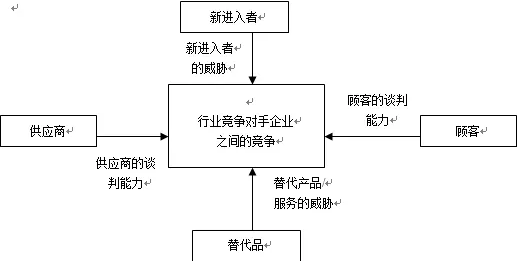
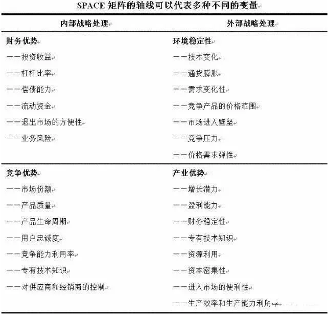
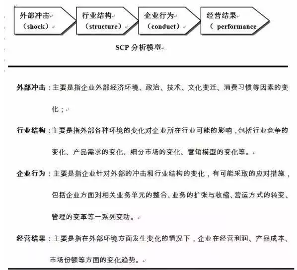
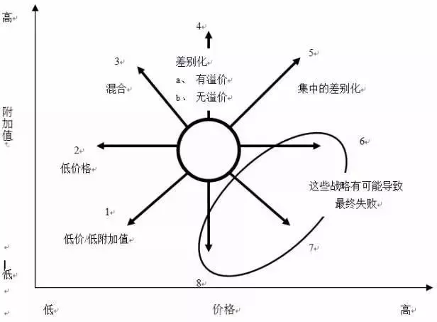
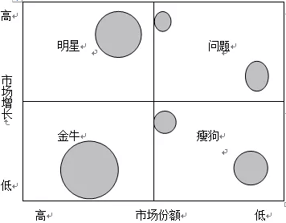
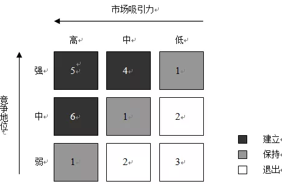

### 供应链金融

供应链金融，简单地说，就是银行将核心企业和上下游企业联系在一起提供灵活运用的金融产品和服务的一种融资模式。即把资金作为供应链的一个溶剂，增加其流动性。

#### 供应链金融的特点

最大的特点就是在供应链中寻找出一个大的核心企业，以核心企业为出发点，为供应链提供金融支持。一方面，将资金有效注入处于相对弱势的上下游配套中小企业，解决中小企业融资难和供应链失衡的问题；另一方面，将银行信用融入上下游企业的购销行为，增强其商业信用，促进中小企业与核心企业建立长期战略协同关系，提升供应链的竞争能力。

##### 供应链金融的参与主体

| 参与主体   | 功能                                                         |
| ---------- | ------------------------------------------------------------ |
| 金融机构   | 在供应链金融中为中小企业提供融资支持，通过与支持型企业、核心企业合作，在供应链的各个环节，根据预付账款、存货、应收账款等动产进行“量体裁衣”，设计相应的供应链金融模式。金融机构提供供应链金融服务的模式，决定了供应链金融业务的融资成本和融资期限。 |
| 中小企业   | 在生产经营中，受经营周期的影响，预付账款、存货、应收账款等流动资产占用大量的资金。而在供应链金融模式中，可以通过货权质押、应收账款转让等方式从银行取得融资，把企业资产盘活，将有限的资金用于业务扩张，从而减少资金占用，提高了资金利用效率。 |
| 支持性企业 | 供应链金融的主要协调者，一方面为中小企业提供物流、仓储服务，另一方面为银行等金融机构提供货押监管服务，搭建银企间合作的桥梁。对于参与供应链金融的物流企业而言，供应链金融为其开辟了新的增值业务，带来新的利润增长点，为物流企业业务的规范与扩大带来更多的机遇。 |
| 核心企业   | 在供应链中规模较大、实力较强，能够对整个供应链的物流和资金流产生较大影响的企业。供应链作为一个有机整体，中小企业的融资瓶颈会给核心企业造成供应或经销渠道的不稳定。核心企业依靠自身优势地位和良好信用，通过担保、回购和承诺等方式帮助上下游中小企业进行融资，维持供应链稳定性，有利于自身发展壮大。 |

#### 背景和概念

供应链中的弱势成员企业通常会面临：既要向核心企业供货，又要承受着应收账款的推迟；或者在销售开始之前便以铺货、保证金等形式向核心企业提前支付资金。供应链中上下游企业分担了核心企业的资金风险，但却并没有得到核心企业的信用支持。尽管银行想给这些企业进行授信，但却常常因为这些中小型企业规模小、抵押物不足、生产经营难于掌握以及抵御经济波动能力差等诸多因素，让银行等金融机构认为风险很大而拒绝放贷。仅从供应链角度内部来看，核心企业不愿承担资金风险，而供应链上下游中小型企业缺乏融资能力是供应链资金流“梗阻”的内在动因。但如果核心企业能够将自身的资信能力注入其上下游企业，银行等金融机构也能够有效监管核心企业及其上下游企业的业务往来，那么金融机构作为供应链外部的第三方机构就能够将供应链资金流“盘活”，同时也获得金融业务的扩展，而这就是供应链金融产生的背景。供应链金融是商业银行等金融机构的一个金融创新业务，它与传统信贷业务最大的差别在于，利用供应链中核心企业、第三方物流企业的资信能力，来缓解商业银行等金融机构与中小型企业之间信息的不对称，解决中小型企业的抵押、担保资源匮乏问题。

综合诸多学者以及实业界的观点，在此将供应链金融的概念界定为：供应链金融是金融机构围绕核心企业在对整条供应链进行信用评估及商业交易监管的基础上，面向供应链核心企业和节点企业之间的资金管理进行的一整套财务融资解决方案。由此，可以看出：供应链金融是金融机构开展的一项金融服务业务，管理的是供应链的资金往来。在整条供应链的信用评估中，核心企业的信用被赋予很大的权重，也就是核心企业的信用风险是整体供应链信用风险的主要来源。供应链核心企业与其他链中企业之间的交易需要被监督，确保不会向虚假业务进行融资。供应链金融是一种财务融资，企业向金融机构的抵押物不是固定资产，而是应收账款、预付款和存货等流动资产。

#### 供应链金融的融资模式

##### 应收类：应收账款融资

应收账款融资是指在供应链核心企业承诺支付的前提下，供应链上下游的中小型企业可用未到期的应收账款向金融机构进行贷款的一种融资模式。图是一个典型的应收账款融资模式。在这种模式中，供应链上下游的中小型企业是债权融资需求方，核心企业是债务企业并对债权企业的融资进行反担保。一旦融资企业出现问题，金融机构便会要求债务企业承担弥补损失的责任。

##### 预付类：未来货权融资模式分析

很多情况下，企业支付货款之后在一定时期内往往不能收到现货，但它实际上拥有了对这批货物的未来货权。未来货权融资(又称为保兑仓融资)是下游购货商向金融机构申请贷款，用于支付上游核心供应商在未来一段时期内交付货物的款项，同时供应商承诺对未被提取的货物进行回购，并将提货权交由金融机构控制的一种融资模式。

##### 存货类：融通仓融资模式分析

很多情况下，只有一家需要融资的企业，而这家企业除了货物之外，并没有相应的应收账款和供应链中其他企业的信用担保。此时，金融机构可采用融通仓融资模式对其进行授信。融通仓融资模式是企业以存货作为质押，经过专业的第三方物流企业的评估和证明后，金融机构向其进行授信的一种融资模式。图是一个典型的融通仓融资模式。在这种模式中，抵押货物的贬值风险是金融机构重点关注的问题。因此，金融机构在收到中小企业融通仓业务申请时，应考察企业是否有稳定的库存、是否有长期合作的交易对象以及整体供应链的综合运作状况，以此作为授信决策的依据。

　反向保理是指保理商与规模较大，资信卓著的高质量买方达成协议，对为该公司供货，位于其供应链上的中小企业提供保理业务。实务操作中，保理商首先与资信较好的买方达成协议，确定由保理商为向买方供货的中小企业提供保理融资。供货的中小企业履行合同后，向保理商提示买方承兑票据，保理商立即提供融资，并进行应收账款管理，待票据到期时，买方直接向保理商付款。 

信用证是一种银行开立的有条件的承诺付款的书面文件，它是一种银行信用。 信用证是银行（即开证行）依照进口商（即开证申请人）的要求和指示，对出口商（即受益人）发出的、授权进口商签发以银行或进口商为付款人的汇票，保证在将来符合信用证条款规定的汇票和单据时，必定承兑和付款的保证文件。

 保函，又称保证书，是指银行、保险公司、担保公司或担保人应申请人的请求，向受益人开立的一种书面信用担保凭证，以书面形式出具的、凭提交与承诺条件相符的书面索款通知和其它类似单据即行付款的保证文件。保证在申请人未能按双方协议履行其责任或义务时，由担保人代其履行一定金额、一定时限范围内的某种支付或经济赔偿责任。 

狭义的票据，即汇票、本票和支票三种票据。它们的共同特点是，在票据规定的期限内，持票人或收款人可向出票人或指定付款人无条件地支取确定金额的货币；它们都属于反映一定债权债务关系的、可流通的、代表一定数量货币请求权的有价证券。 票据一般是指商业上由出票人签发，无条件约定自己或要求他人支付一定金额，可流通转让的有价证券，持有人具有一定权力的凭证。属于票据的有：汇票、本票、支票、提单、存单、股票、债券等等

#### **对公类**

##### 流动资金贷款

###### 法人透支账户

指在企业获得银行授信额度后，银行为企业在约定的账户、约定的限额内以透支的形式提供的短期融资和结算便利的业务。

担保方式：有银行认可的资产作为抵押或质押，或有足够代偿能力的单位或个人作为偿还贷款本息、并承担连带责任的保证人。

##### 票据融资

###### 商业承兑汇票贴现

持票人将未到期的商业承兑汇票转让给银行，银行在按贴现率扣除贴现利息后将余额票款付给持票人的一种授信业务

###### 银行承兑汇票贴现

由在承兑银行开立存款账户的存款人出票，向开户银行申请并经银行审查同意承兑的，保证在指定日期无条件支付确定的金额给收款人或持票人的票据。

###### 商业承兑汇票保贴

对符合银行条件的企业，以书函的形式承诺为其签发或持有的商业承兑汇票办理贴现，即给予保贴额度的一种授信行为。

##### 转贷款

###### 转贷款

指商业银行既作为债务人，**对外签订贷款协议**，借入资金；又作为债权人，将此资金**转贷给国内企业**

##### 贸易融资

###### 出口押汇

是指企业（信用证受益人）在货物装运后在向银行提交信用证项下单据议付时，银行（议付行）根据企业的申请，凭企业提交的全套单证相符的单据作为**质押**进行审核，审核无误后，参照票面金额将款项垫付给企业，然后向开证行寄单索汇，并向企业收取押汇利息和银行费用并保留追索权的一种短期出口融资业务

###### 出口托收融资

在托收项下，出口商委托银行向进口商收取货款，因出口未收汇而形成了短期流动资金需求，向银行申请办理的资金融通业务。

###### 出口发票融资

指出口商采用赊销（O/A）、承兑交单（D/A）等信用方式向进口商销售货物后，出口商将现在或将来的基于其与客户（进口商）订立的**货物销售合同所产生的应收账款**转让给银行，由银行提供有追索权短期融资的一种金融服务.

###### 出口保理融资

国际保理业务是指出口商在采用赊销（O/A）、承兑交单（D/A）等信用方式向进口商销售货物或提供服务时，由**出口保理商和进口保理商**共同提供的商业咨询调查、应收账款管理与催收、信用风险控制及贸易融资等综合金融服务。出口保理融资业务是国际保理服务的一部分

###### 福费延

银行或其他金融机构无追索权地从出口商那里买断由于出口商品或劳务而产生的**应收账款**。

###### 进口押汇

进出口双方签订买卖合同之后，进口方请求进口地某个银行（一般为自己的往来银行）向出口方开立保证付款文件，大多数为信用证。然后，开证行将此文件寄送给出口商，出口商见证后，将货物发送给进口商。商业银行为进口商开立信用保证文件的过程。

###### 进口保理融资

进口保理商根据出口保理商的申请，在出口商以赊销方式向进口商销售货物或提供服务后，接受出口商转让的应收账款，为进口商提供信用担保及其它账务管理服务的业务。

###### 进口代收融资

指在进口代收付款交单方式下，代收行向申请人提示对外付款赎单通知时，根据申请人提出的书面申请，向申请人提供的短期资金融通，并按约定利率和期限由申请人还本付息的业务

###### 进口汇出款融资

采用汇款方式结算的、进口合同规定货到付款的国际贸易项下进口货物到港后，根据申请人的书面申请，我行为其支付给国外出口商的部分或全部应付货款提供短期资金融通，并按约定的利率和期限由申请人还本付息的业务。

###### 提货担保

在货物先于信用证项下提单或其他物权凭证到达的情况下，为便于进口商办理提货，尽快实现 销售和避免货物滞港造成的费用和损失，银行根据开证申请人的申请向船公司出具书面担保。

###### 备用信用证

又称担保信用证，是指不以清偿商品交易的价款为目的，而以贷款融资，或担保债务偿还为目的所开立的信用证。

###### 商业信用证

商业信用证是货物的进口方为开证申请人，以出口方为受益人；备用信用证开证申请人与受益人既可以是进口方也可以是出口方。

###### 开立进口信用证

指开证行根据进口商的申请向受益人（国外出口商）开具的，保证在一定期限内，凭议付行/寄单行寄来的符合信用证规定的全套单据，按照信用证条款对外付款的书面承诺。

###### 开立保函

银行应客户的申请而开立的有担保性质的书面承诺，一旦申请人没有履行保函下的约定义务，受益人合理索赔，则由我行履行担保责任。

##### 保理

###### 国内保理

指保理商（通常是银行或银行附属机构）为国内贸易中以赊销的信用销售方式销售货物或提供服务而设计的一项综合性金融服务。卖方（国内供应商）将其与买方（债务人）订立的销售合同所产生的应收账款转让给保理商，由保理商为其提供贸易融资、销售分户账管理、应收账款的催收、信用风险控制与坏账担保等综合性金融服务。

###### 出口保理

指保理商（通常是银行或银行附属机构）对采用赊销等信用方式出口商品或提供服务的出口商在受让其应收账款的基础上，提供信用担保、货款催收、销售分类账管理以及贸易融资等金融服务。

###### 进口保理

指进口保理商根据出口保理商的申请，在出口商以赊销方式向进口商销售货物或提供服务后，接受出口商转让的应收账款，为进口商提供信用担保及其它账务管理服务的业务。

##### 国内信用证

###### 国内信用证

指开证银行依照申请人（购货方）的申请向受益人（销货方）开出的有一定金额、在一定期限内凭**信用证**规定的单据**支付款项的书面承诺**。

##### 保函

指银行作为担保人，应商业交易一方（申请人）的需求，**以其自身的信誉**向商业交易的另一方（受益人）为担保申请人的某种责任和义务的履行而作出的一种具有一定金额、期限、承担某种支付责任或经济赔偿可**书面付款保证**。

##### 委托贷款

###### 委托贷款

指由委托人提供合法来源的资金，委托业务银行根据委托人确定的贷款对象、用途、金额、期限、利率等代为发放、监督使用并协助收回的贷款业务。

##### 贷款承诺

###### 贷款承诺函

银行与借款客户达成的一种具有法律约束力的正式协议，银行在有效承诺期内，按照双方约定的条件、金额和利率等，随时准备应客户需要提供贷款，并有权向借款客户收取承诺费的一种授信业务。

###### 贷款意向书

银行根据客户申请，在国家有权部门批复项目建议书或预可行性研究报告之前，对外出具的不具有法律约束力的非承诺性文书，作为政府有权部门批复项目建议书或预可行性研究报告的依据。

###### 银行信贷证明

根据申请人（投标人）的要求，以出具《信贷证明书》的形式，向招标人承诺，当申请人（投标人）中标后，在中标项目实施过程中，满足申请人（投标人）在《信贷证明书》项下承诺限额内用于该项目正常、合理信用需求的一种表外信贷业务。

##### 商业分析模型

###### 波特五种竞争力分析模型

竞争对手：企业间的竞争是五种力量中最主要的一种。只有那些比竞争对手的战略更具优势的战略才可能获得成功。为此，公司必须在市场、价格、质量、产量、功能、服务、研发等方面建立自己的核心竞争优势。影响行业内企业竞争的因素有：产业增加、固定(存储)成本/附加价值周期性生产过剩、产品差异、商标专有、转换成本、集中与平衡、信息复杂性、竞争者的多样性、公司的风险、退出壁垒等。

新进入者：企业必须对新的市场进入者保持足够的警惕，他们的存在将使企业做出相应的反应，而这样又不可避免地需要公司投入相应的资源。影响潜在新竞争者进入的因素有：经济规模、专卖产品的差别、商标专有、资本需求、分销渠道、绝对成本优势、政府政策、行业内企业的预期反击等。

购买者：当用户分布集中、规模较大或大批量购货时，他们的议价能力将成为影响产业竞争强度的一个主要因素。决定购买者力量的因素有：买方的集中程度相对于企业的集中程度、买方的数量、买方转换成本相对企业转换成本、买方信息、后向整合能力、替代品、克服危机的能力、价格/购买总量、产品差异、品牌专有、质量/性能影响、买方利润、决策者的激励。

替代产品：在很多产业，企业会与其他产业生产替代品的公司开展直接或间接的斗争。替代品的存在为产品的价格设置了上限，当产品价格超过这一上限时，用户将转向其他替代产品。决定替代威胁的因素有：替代品的相对价格表现、转换成本、客户对替代品的使用倾向。

供应商：供应商的议价力量会影响产业的竞争程度，尤其是当供应商垄断程度比较高、原材料替代品比较少，或者改用其他原材料的转换成本比较高时更是如此。决定供应商力量的因素有：投入的差异、产业中供方和企业的转换成本、替代品投入的现状、供方的集中程度、批量大小对供方的重要性、与产业总购买量的相关成本、投入对成本和特色的影响、产业中企业前向整合相对于后向整合的威胁等

###### SWOT分析模型

通过分析企业内部和外部存在的优势和劣势、机会和挑战来概括企业内外部研究结果的一种方法。

S-优势：比较分析企业在外部市场环境、内部经营方面相对于其他竞争对手的优势; W-劣势：比较分析企业在外部市场环境、内部经营方面相对于其他竞争对手的劣势; O-机会：分析在目前的市场竞争态势下企业存在的发展机会; T-挑战：分析在目前的市场竞争态势下企业存在的威胁和挑战。

###### 战略地位与行动评价矩阵

主要是分析企业外部环境及企业应该采用的战略组合。SPACE矩阵有四个象限分别表示企业采取的进取、保守、防御和竞争四种战略模式。这个矩阵的两个数轴分别代表了企业的两个内部因素——财务优势和竞争优势; 两个外部因素——环境稳定性和产业优势。这四个因素对于企业的总体战略地位是最为重要的。
选择构成财务优势、竞争优势、环境稳定性和产业优势的一组变量; 对构成``FS`和`IS`的各变量给予从+1到+6的评分值。而对构成ES和CA的轴的各变量从-1(最好)到-6(最差)的评分值; 将各数轴所有变量的评分值相加，再分别除以各数轴变量总数，从而得出FS、CA、IS和ES各自的平均分数; 将FS、CA、IS和ES各自的平均分数标在各自的数轴上; 将X轴的两个分数相加，将结果标在X轴是;将Y轴的两个分数相加，将结果标在Y轴上;标出X、Y数轴的交叉点; 自SPACE矩阵原点到X、Y 数值的交叉点画一条向量，这一条向量就表示企业可以采取的战略类型。

###### SCP分析模型

分析在行业或者企业受到表面冲击时，可能的战略调整及行为变化

###### 战略钟

“战略钟”是分析企业竞争战略选择的一种工具，这种模型为企业的管理人员和咨询顾问提供了思考竞争战略和取得竞争优势的方法。战略钟模型假设不同企业的产品或服务的适用性基本类似，那么，顾客购买时选择其中一家而不是其他企业可能有以下原因：这家企业的产品和服务的价格比其他公司低; 顾客认为这家企业的产品和服务具有更高的附加值。

战略钟模型将产品/服务价格和产品/服务附加值综合在一起考虑，企业实际上沿着以下8种途径中的一种来完成企业经营行为。其中一些的路线可能是成功的路线，而另外一些则可能导致企业的失败。

低价低值战略：采用途径1的企业关注的是对价格非常敏感的细分市场的情况。企业采用这种战略是在降低产品或服务的附加值的同时降低产品或服务的价格。

低价战略：采用途径2的企业是建立企业竞争优势的典型途径，即在降低产品或服务的价格的同时，包装产品或服务的质量。但是这种竞争策略容易被竞争对手模仿，也降低价格。在这种情况下，如果一个企业不能将价格降低到竞争对手的价格以下，或者顾客由于低价格难以对产品或服务的质量水平做出准确的判断，那么采用低价策略可能是得不偿失的。要想通过这一途径获得成功，企业必须取得成本领先地位。因此，这个途径实质上是成本领先战略。

差别化战略：采用途径3的企业以相同和略高于竞争对手的价格向顾客提供可感受的附加值，其目的是通过提供更好的产品和服务来获得更多的市场份额，或者通过稍高的价格提高收入。企业可以通过采取有形差异化战略，如产品在外观、质量、功能等方面的独特性;也可以采取无形差异化战略，如服务质量、客户服务、品牌文化等来获得竞争优势。

混合战略：采用途径4的企业在为顾客提供可感知的附加值同时保持低价格。而这种高品质低价格的策略能否成功，既取决于企业理解和满足客户需求的能力，又取决于是否有保持低价格策略的成本基础，并且难以被模仿。

集中差别化战略：采用途径5的企业可以采用高品质高价格策略在行业中竞争，即以特别高的价格为用户提供更高的产品和服务的附加值。但是采用这样的竞争策略意味着企业只能在特定的细分市场中参与经营和竞争。

高价撇脂战略：采用途径6、7、8的企业一般都是处在垄断经营地位，完全不考虑产品的成本和产品或服务队附加值。企业采用这种经营战略的前提是市场中没有竞争对手提供类似的产品和服务。否则，竞争对手很容易夺得市场份额，并很快削弱采用这一策略的企业的地位。

###### 波士顿分析矩阵

用来协助企业进行业务组合或投资组合，在矩阵坐标轴是的两个变量分别是业务单元所在市场的增长程度和所占据的市场份额。每个象限中的企业处于根本不同的现金流位置，并且应用不同的方式加以管理，这样就引申出公司如何寻求其总体业务组合。

金牛：在低增长市场上具有相对高的市场份额的业务将产生健康的现金流，它们能用于向其他方面提供资金，发展业务；瘦狗：在低增长市场是具有相对低的市场份额的业务经常是中等现金流的使用者。由于其虚弱的竞争地位，它们将成为现金的陷阱；明星：在高增长市场上具有相对高的市场份额通常需要大量的现金以维持增长，但具有较强的市场地位并将产生较高的报告利润，它们有可能处在现金平衡状态；问题：在迅速增长的市场上具有相对较低市场份额的业务需要大量的现金流入，以便为增长筹措资金。

###### GE行业吸引力矩阵

通过确定在矩阵中的位置来判断其在行业中的地位，对于市场吸引力，需要考虑的因素主要有：行业：绝对市场规模、成长率、价格敏感性、进入壁垒、替代品、市场竞争、供应商等；环境：政府法规、经济气候、通货风险、社会趋势、技术、就业、利率等。

对于业务单位的实力或竞争地位，需要考虑的因素主要有：目前优势：市场份额、市场份额变化趋势、盈利能力、现金流、差别化、相对价格地位等；持久性：成本、后勤、营销、服务、客户形象、技术等。
通过确定业务单位在矩阵中的位置，其需要实施的主要战略可能是：投资建立地位；通过平衡现金生成和有选择地使用现金以保持地位；放弃并退出市场