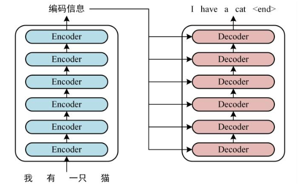

#### 模型解释

事实上，每个分类问题的机器学习流程中都应该包括模型理解和模型解释，下面是几个原因：

模型理解和模型解释对于机器学习的作用：模型改进，理解指标特征、分类、预测，进而理解为什么一个机器学习模型会做出这样的决定、什么特征在决定中起最重要作用，能让我们判断模型是否符合常理；模型可信性与透明度；识别和防止偏差。

可解释性特质：

重要性：了解“为什么”可以帮助更深入地了解问题，数据以及模型可能失败的原因。
分类：建模前数据的可解释性、建模阶段模型可解释性、运行阶段结果可解释性。
范围：全局解释性、局部解释性、模型透明度、模型公平性、模型可靠性。
评估：内在还是事后？模型特定或模型不可知？本地还是全局？
特性：准确性、保真性、可用性、可靠性，鲁棒性、通用性等。
人性化解释：人类能够理解决策原因的程度，人们可以持续预测模型结果的程度标示。

模型解释的三个最重要的方面解释如下。

是什么驱动了模型的预测？我们应该能够查询我们的模型并找出潜在的特征交互，以了解哪些特征在模型的决策策略中可能是重要的。这确保了模型的公平性。
为什么模型会做出某个决定？我们还应该能够验证并证明为什么某些关键特征在预测期间驱动模型所做出的某些决策时负有责任。这确保了模型的可靠性。
我们如何信任模型预测？我们应该能够评估和验证任何数据点以及模型如何对其进行决策。对于模型按预期工作的关键利益相关者而言，这应该是可证明且易于理解的。这确保了模型的透明度。

###### 可解释性的标准

内在还是事后？内在可解释性就是利用机器学习模型，该模型本质上是可解释的。事后可解释性意味着选择和训练黑匣子模型 并在训练后应用可解释性方法。
模型特定或模型不可知？特定于模型的解释工具非常特定于内在模型解释方法，这些方法完全依赖于每个模型的功能和特征。这可以是系数，p值，与回归模型有关的AIC分数，来自决策树的规则等等。与模型无关的工具与事后方法更相关，可用于任何机器学习模型。这些不可知方法通常通过分析特征输入和输出对来操作。根据定义，这些方法无法访问任何模型内部，如权重，约束或假设。
本地还是全局？这种解释分类讨论了解释方法是解释单个预测还是整个模型行为？或者如果范围介于两者之间？我们将很快谈论全球和地方的解释。

全局可解释：就是试图理解“模型如何进行预测？”和“模型的子集如何影响模型决策？”。要立即理解和解释整个模型，我们需要全局可解释性。全局可解释性是指能够基于完整数据集上的依赖（响应）变量和独立（预测变量）特征之间的条件交互来解释和理解模型决策。尝试理解特征交互和重要性始终是理解全球解释的一个很好的一步。当然，在尝试分析交互时，在超过两维或三维之后可视化特征变得非常困难。因此，经常查看可能影响全局知识模型预测的模块化部分和特征子集会有所帮助。全局解释需要完整的模型结构，假设和约束知识。

###### 可解释范围

局部解释：试图理解“为什么模型为单个实例做出具体决策？”和“为什么模型为一组实例做出具体决策？”。对于本地可解释性，我们不关心模型的固有结构或假设，我们将其视为黑盒子。为了理解单个数据点的预测决策，我们专注于该数据点并查看该点周围的特征空间中的局部子区域，并尝试基于该局部区域理解该点的模型决策。本地数据分布和特征空间可能表现完全不同，并提供更准确的解释而不是全局解释。局部可解释模型 - 不可知解释（LIME）框架是一种很好的方法，可用于模型不可知的局部解释。我们可以结合使用全局和局部解释来解释一组实例的模型决策。

模型透明度：为试图理解“如何根据算法和特征创建模型？”。我们知道，通常机器学习模型都是在数据特征之上利用算法来构建将输入映射到潜在输出（响应）的表示。模型的透明度可能试图了解模型的构建方式以及可能影响其决策的更多技术细节。这可以是神经网络的权重，CNN滤波器的权重，线性模型系数，决策树的节点和分裂。但是，由于业务可能不太精通这些技术细节，因此尝试使用不可知的局部和全局解释方法来解释模型决策有助于展示模型透明度


一致性：指的是一个模型的特征重要度，不会因为我们更改了某个特征，而改变其重要度。不一致性可能会导致具有重要度较大的特征比具有重要度较小的特征更不重要。
个体化：指的是重要度的计算是可以针对个体，而不需要整个数据集一起计算。

Split Count：即分裂次数统计，指的是给定特征被用于分裂的次数

##### LIME

###### 问题

 **trusting a prediction**, whether a user trusts an individual prediction sufficiently to take some action based on it, and **trusting a model**, whether the user trusts a model to behave in reasonable ways if deployed. 

Humans usually have prior knowledge about the application domain, which they can use to accept or reject a prediction if they understand the reasoning behind it. 

###### Desired Characteristics for Explainers

1. An essential criterion for explanations is that they must be interpretable, provide qualitative understanding between joint values of input variables and the resulting predicted response value

2. Another essential criterion is local fidelity. Although it is often impossible for an explanation to be completely faithful unless it is the complete description of the model itself, for an explanation to be meaningful it must at least be locally faithful, it must correspond to how the model behaves in the vicinity of the instance being predicted. We note that local fidelity does not imply global fidelity: features that are globally important may not be important in the local context, and vice versa.

3. an explainer must be able to explain any model, and thus be model-agnostic

4. In addition to explaining predictions, providing a global perspective is important to ascertain trust in the model. 

###### LIME

We denote $x\in R^d$ be the original representation of an instance being explained, and we use $x{\prime}\in \{0, 1\}^{d^{\prime}}$ to denote a binary vector for its interpretable representation. we define an explanation as a model$g \in G$, where $G$ is a class of potentially interpretable models, . Note that the domain of $g$ is $\{0, 1\}^{d^\prime}$, $g$ acts over absence/presence of the interpretable components. $Ω(g)$ be a measure of complexity of the explanation $g \in G$. the model being explained be denoted $f :R^d → R$. $Π_x(z)$ as a proximity measure between an instance $z$ to $x$,  $L(f, g, Π_x)$ be a measure of how unfaithful g is in approximating f in the locality defined by $Π_x$

$$
\xi(x)=\operatorname{argmin}_{g \in G} \mathcal{L}\left(f, g, \Pi_{x}\right)+\Omega(g)
$$
in order to learn the local behavior of $f$ as the interpretable inputs vary, we approximate $L(f, g, Π_x)$ by drawing samples, weighted by $Π_x$. We sample instances around $x^\prime$ by drawing nonzero elements of $x^\prime$ uniformly at random. Given a perturbed sample $z^\prime \in \{0, 1\}^{d\prime}$ (which contains a fraction of the nonzero elements of $x^\prime$), we recover the sample in the original representation $z \in R^d$ and obtain $f(z)$, which is used as a label for the explanation model. Given this dataset $\mathcal{Z}$ of perturbed samples with the associated labels, we optimize$ξ(x)$ to get an explanation $ξ(x)$. 


We propose to give a global understanding of the model by explaining a set of individual instances. This approach is still model agnostic, and is complementary to computing summary statistics such as held-out accuracy. We represent the time and patience that humans have by a budget $B$ that denotes the number of explanations they are willing to look at in order to understand a model. Given a set of instances $X$, we define the pick step as the task of selecting $B$ instances for the user to inspect.

Given all of the explanations for a set of instances $X$, we construct an $n\times d^\prime$ explanation matrix $W$ that
represents the local importance of the interpretable components for each instance. When using linear models as explanations, for an instance $x_i$ and explanation $g_i = ξ(x_i)$, we set $W_{ij} = |w_{g_{ij}} |$. Further, for each component $j$ in $W$, we let $I_j$ denote the global importance, or representativeness of that component in the explanation space. Intuitively, we want $I$ such that features that explain many different instances have higher importance scores. Concretely for the text applications, we set $I_j = \sqrt{\sum_{i=1}^{n}W_{ij}}$ .

While we want to pick instances that cover the important components, the set of explanations must not
be redundant in the components they show the users, avoid selecting instances with similar explanations.

 define coverage as the set function c, given W and I, which computes the total importance of the features that appear in at least one instance in a set V .
$$
c(V, \mathcal{W}, I)=\sum_{j=1}^{d^{\prime}} \mathbb{1}_{\left[\exists i \in V : \mathcal{W}_{i j}>0\right]} I_{j}
$$
finding the set $V$, $|V | ≤ B$ that achieves highest coverage.
$$
\operatorname{Pick}(\mathcal{W}, I)=\operatorname{argmax}_{V,|V| \leq B} c(V, \mathcal{W}, I)
$$
Let $c(V \cup\{i\}, \mathcal{W}, I)-c(V, \mathcal{W}, I)$ be the marginal coverage gain of adding an instance $i$ to a set $V$. 


##### `Eli5`

There are two main ways to look at a classification or a regression model: inspect model parameters and try to figure out how the model works globally; inspect an individual prediction of a model, try to figure out why the model makes the decision it makes. for the first, `ELI5` provides `eli5.show_weights()` function; for the second it provides `eli5.show_prediction()` function.提供两种算法，分别为`Lime`和Permutation importance.

###### `LIME`解释文本分类器

`TextExplainer` generated a lot of texts similar to the document by removing some of the words, and then trained a white-box classifier which predicts the output of the black-box classifier. The explanation we saw is for this white-box classifier. This approach follows the LIME algorithm; for text data the algorithm is actually pretty straightforward:

- generate distorted versions of the text;
- predict probabilities for these distorted texts using the black-box classifier;
- train another classifier which tries to predict output of a black-box classifier on these texts.

The algorithm works because even though it could be hard or impossible to approximate a black-box classifier globally, approximating it in a small neighborhood near a given text often works well, even with simple white-box classifiers.

```python
from sklearn.pipeline import make_pipeline
c = make_pipeline(vectorizer, rf)
from lime.lime_text import LimeTextExplainer
'''Lime explainers assume that classifiers act on raw text, but sklearn classifiers act on vectorized representation of texts.
this explainer works for any classifier you may want to use, as long as it implements predict_proba.'''
explainer = LimeTextExplainer(class_names=class_names)
'''The classifier got this example right (it predicted atheism).
The explanation is presented below as a list of weighted features.'''
exp.as_list()
# Visualizing explanations
fig = exp.as_pyplot_figure()
#The explanations can also be exported as an html page (which we can render here in this notebook)
exp.show_in_notebook(text=False)
'''Finally, we can also include a visualization of the original document, with the words in the explanations highlighted. Notice how the words that affect the classifier the most are all in the email header.'''
exp.show_in_notebook(text=True)
```

###### 多分类

```python
'''Previously, we used the default parameter for label when generating explanation, which works well in the binary case.
For the multiclass case, we have to determine for which labels we will get explanations, via the 'labels' parameter.Below, we generate explanations for labels 0 and 17.'''
from lime.lime_text import LimeTextExplainer
explainer = LimeTextExplainer(class_names=class_names)
idx = 1340
exp = explainer.explain_instance(newsgroups_test.data[idx],
                    c.predict_proba, num_features=6, labels=[0, 17])
'''Another alternative is to ask LIME to generate labels for the top K classes. This is shown below with K=2.
To see which labels have explanations, use the available_labels function.'''
exp = explainer.explain_instance(newsgroups_test.data[idx], 
                    c.predict_proba, num_features=6, top_labels=2)
print(exp.available_labels())
```

###### 类别和数值

As opposed to lime_text.TextExplainer, tabular explainers need a training set. The reason for this is because we compute statistics on each feature. If the feature is numerical, we compute the mean and std, and discretize it into quartiles. If the feature is categorical, we compute the frequency of each value. For this tutorial, we'll only look at numerical features. We use these computed statistics for two things:
To scale the data, so that we can meaningfully compute distances when the attributes are not on the same scale. To sample perturbed instances - which we do by sampling from a Normal(0,1), multiplying by the std and adding back the mean.

```python
explainer = lime.lime_tabular.LimeTabularExplainer(train, 
            feature_names=iris.feature_names, 
            class_names=iris.target_names, discretize_continuous=True)
'''Our explainer takes in numerical data, even if the features are categorical. We thus transform all of the string attributes into integers, using sklearn's LabelEncoder. We use a dict to save the correspondence between the integer values and the original strings, so that we can present this later in the explanations.'''
categorical_names = {}
for feature in categorical_features:
    le = sklearn.preprocessing.LabelEncoder()
    le.fit(data[:, feature])
    data[:, feature] = le.transform(data[:, feature])
    categorical_names[feature] = le.classes_
'''Finally, we use a One-hot encoder, so that the classifier does not take our categorical features as continuous features. We will use this encoder only for the classifier, not for the explainer - and the reason is that the explainer must make sure that a categorical feature only has one value.'''
encoder = sklearn.preprocessing.OneHotEncoder(
    categorical_features=categorical_features)
encoder.fit(data)
encoded_train = encoder.transform(train)
predict_fn = lambda x: rf.predict_proba(encoder.transform(x))
'''We now create our explainer. The categorical_features parameter lets it know which features are categorical (in this case, all of them). The categorical names parameter gives a string representation of each categorical feature's numerical value, as we saw before.'''
explainer = lime.lime_tabular.LimeTabularExplainer(train ,
                            class_names=['edible', 'poisonous'], 
                            feature_names = feature_names,
                            categorical_features=categorical_features, 
                            categorical_names=categorical_names, 
                            kernel_width=3, verbose=False)
'''Now note that the explanations are based not only on features, but on feature-value pairs. For example, we are saying that odor=foul is indicative of a poisonous mushroom. In the context of a categorical feature, odor could take many other values (see below). Since we perturb each categorical feature drawing samples according to the original training distribution, the way to interpret this is: if odor was not foul, on average, this prediction would be 0.24 less 'poisonous'. Let's check if this is the case'''
i = 137
exp = explainer.explain_instance(test[i], predict_fn, num_features=5)
exp.show_in_notebook()
odor_idx = feature_names.index('odor')
explainer.categorical_names[odor_idx]
foul_idx = 4
non_foul = np.delete(explainer.categorical_names[odor_idx], foul_idx)
non_foul_normalized_frequencies = explainer.feature_frequencies[odor_idx].copy()
non_foul_normalized_frequencies[foul_idx] = 0
non_foul_normalized_frequencies /= non_foul_normalized_frequencies.sum()

average_poisonous = 0
for idx, (name, frequency) in enumerate(zip(explainer.categorical_names[
    odor_idx], non_foul_normalized_frequencies)):
    if name == 'foul':
        continue
    temp[odor_idx] = idx
    p_poisonous = predict_fn(temp.reshape(1,-1))[0,1]
    average_poisonous += p_poisonous * frequency
    print('P(poisonous | odor=%s): %.2f' % (name, p_poisonous))
```

###### 回归

```python
explainer = lime.lime_tabular.LimeTabularExplainer(train, 
                        feature_names=boston.feature_names, 
                        class_names=['price'], 
                    categorical_features=categorical_features,
                        verbose=True, mode='regression')
```

###### `SP-LIME`

```python
from lime import submodular_pick
sp_obj = submodular_pick.SubmodularPick(explainer, train, 
                rf.predict, sample_size=20, num_features=14, 
                    num_exps_desired=5)
[exp.as_pyplot_figure() for exp in sp_obj.sp_explanations]
W=pd.DataFrame([dict(this.as_list()) for this in sp_obj.explanations])

exp=explainer.explain_instance(Xtrain[i],rf.predict_proba,top_labels=3)
exp.available_labels()
import pandas as pd
df=pd.DataFrame({})
for this_label in range(3):
    dfl=[]
    for i,exp in enumerate(sp_obj.sp_explanations):
        l=exp.as_list(label=this_label)
        l.append(("exp number",i))
        dfl.append(dict(l))
    dftest=pd.DataFrame(dfl)
    df=df.append(pd.DataFrame(dfl,
    index=[iris.target_names[this_label] 
        for i in range(len(sp_obj.sp_explanations))]))
```

##### `SHAP`

`SHAP`是由`Shapley value`启发的可加性解释模型。对于每个预测样本，模型都产生一个预测值，`SHAP value`就是该样本中每个特征所分配到的数值。 假设第$i$个样本为$x_i$，第$i$个样本的第$j$个特征为$x_{i,j}$，模型对第$i$个样本的预测值为$y_i$，整个模型的基线，通常是所有样本的目标变量的均值为$y_{base}$，那么`SHAP value`服从以下等式。 
$$
y_{i}=y_{\text {base }}+f\left(x_{i, 1}\right)+f\left(x_{i, 2}\right)+\cdots+f\left(x_{i, k}\right)
$$
 其中$f(x_{i,j})$为$x_{i,j}$的`SHAP`值。直观上看，$f(x_{i,j})$就是第$i$个样本中第$j$个特征对最终预测值$y_i$的贡献值，当$f(x_{i,j})>0$，说明该特征提升了预测值，也正向作用；反之，说明该特征使得预测值降低，有反作用。也可以把一个特征对目标变量影响程度的绝对值的均值作为这个特征的重要性。 

##### Feature Importance

###### `xgboost`

`weight`: the number of times a feature is used to split the data across all trees；gain: the average gain across all splits the feature is used in. 特征重要性使用特征在作为划分属性时loss平均的降低量；cover: the average coverage across all splits the feature is used in. 特征重要性使用特征在作为划分属性时对样本的覆盖度；total_gain: the total gain across all splits the feature is used in；total_cover: the total coverage across all splits the feature is used in.

######  `lightgbm`

 If “split”, result contains numbers of times the feature is used in a model. If “gain”, result contains total gains of splits which use the feature.

iteration–Limit number of iterations in the feature importance calculation. If None, if the best iteration exists, it is used; otherwise, all trees are used. If <= 0, all trees are used.

######  `GBDT`

判断每个特征在随机森林中的每颗树上做了多大的贡献，然后取个平均值，最后比一比特征之间的贡献大小。其中关于贡献的计算方式可以是基尼指数或袋外数据错误率。特征$j$的全局重要度通过特征$j$在单颗树中的重要度的平均值来衡量。`gbdt`是根据分裂前后节点的impurity减少量来评估特征重要性，criterion分裂标准有：熵、基尼系数、均方误差、平均绝对误差。`gbdt`中的树全部是回归树，所以impurity计算和节点的分裂标准是`MSE`或MAE.

#####  Partial Dependence 


`Partial Dependence Plot`是依赖于模型本身的，所以我们需要先训练模型。假设我们想研究$y$和特征$\mathbf{X}_1$的关系，那么`PDP`就是一个关于$\mathbf{X}_1$和模型预测值的函数。我们先拟合了一个随机森林模型$RF(\mathbf{X})$，然后用$\mathbf{X}^k_i$表示训练集中第$k$个样本的第$i$个特征，那么PDP的函数就是
$$
f\left(X_{1}\right)=\frac{1}{n} \sum_{k=1}^{n} \operatorname{RF}\left(X_{1}, X_{2}^{k}, X_{3}^{k}, \cdots, X_{n}^{k}\right)
$$
也就是说`PDP`在$\mathbf{X}_1$的值，就是把训练集中第一个变量换成$\mathbf{X}_1$之后，原模型预测出来的平均值。根据$\mathbf{X}_1$的不同取值，$f(\mathbf{X}_1)$就可以练成折线，这个折线就是`Partial Dependence Plot`，横轴是$\mathbf{X}_1$，纵轴就是Partial Dependence。 

##### Permutation Importance

With this insight, the process is as follows:

- Get a trained model.
- Shuffle the values in a single column, make predictions using the resulting dataset. Use these predictions and the true target values to calculate how much the loss function suffered from shuffling.
- Now repeat step 2 with the next column in the dataset, until you have calculated the importance of each column.

Like most things in data science, there is some randomness to the exact performance change from a shuffling a column. We measure the amount of randomness in our permutation importance calculation by repeating the process with multiple shuffles. The number after the ± measures how performance varied from one-reshuffling to the next. You'll occasionally see negative values for permutation importances. In those cases, the predictions on the shuffled data happened to be more accurate than the real data. This happens when the feature didn't matter, but random chance caused the predictions on shuffled data to be more accurate. This is more common with small datasets.

##### Individual Conditional Expectation Plots

 Traditional ICE plots display one curve for each observation in the training set, but plotting a curve for every observation can result in visualization overload even for data sets of moderate size. Fortunately, you can manage the number of curves that are displayed by sampling or clustering.   You can think of each ICE curve as a kind of simulation that shows what would happen to the model’s prediction if you varied one characteristic of a particular observation. As illustrated in Figure 9, the ICE curve for one observation is obtained by replicating the individual observation over the unique values of the plot variable and scoring each replicate.  


##### A preprocessing scheme for high-cardinality categorical attributes in classification and prediction problem


The method that is probably most frequently used today for high-cardinality attributes is clustering. The basic idea is to reduce the original 1-to-N mapping problem to a 1 -to-K mapping problem, with K<<N. To accomplish this, the cardinality of the data is first reduced by grouping individual values into K sets of values. Then each set is represented with a binary derived input. Thus then encoding first identifies the group to which the value belongs and then sets the corresponding bit in the numerical representation.

#### 特征离散化

######  为什么

1. 离散化结果将会减 少给定连续特征值的个数，减小系统对存储空间的实际需求。 
2. 离散特征相对于连续特征 来说更接近于知识层面的表示。
3. 通过离散 化，数据被规约和简化，对于使用者和专家来说，离散化的数据都更易于理解、使用和解释。
4. 离散化处理使得算法的学习更为准确和迅。 
5. 一系列算法只能应用于离散型数据， 使得离散化处理成为必要，而离散化又使很多 算法的应用范围扩展了

###### 分类

有监督和无监督：有监督的离散化方法使用类信息，而无监督的 离散化方法不使用类信息。

动态和静态：动态的离散化方法就是在建立分类模 型的同时对连续特征进行离散化，静态的离散化方法就是在进行分类之 前完成离散化处理。

全局和局部： 全局的离散化方法使用所有的实例，而局部的离散化方法只是用一部分的实例。

分裂式和合并式：分裂的离散化方法起始的分裂点列表是空的，通过离散化过程逐渐往列表中加入分裂点，而合并的离散化方法则是将所有的连续值都看作可能的 分裂点，再逐渐合并相邻区域的值形成区间。

 单变量和多变量： 单变量的离散化方法是指一次只对数据集的一个特征进行离散化，而多变量的离散化是同时考虑数据集的多个特征及其相互关联关系进行离散化，

直接式和增量式：直接式的离散化方法就是根据额外给定的参数（离散化所需得到的区间数等）一 次性形成所有的分裂点，而增量式的离散化方法 是根据某个准则逐渐的将离散化结果进行改进， 直到满足准则的停止条件为止

###### 步骤

1. 对此特征进行排序 
2. 选择某个点作为候选断点，用所选取的具体的离散化方法的尺度进行衡量此候选断 点是否满足要求。
3. 若候选断点满足离散化的衡量尺度， 则对数据集进行分裂或合并，再选择下一个候选断点，重复上述步骤。
4. 当离散算法存在停止准则时，如果满足停止准则，则不再进行离散化过程，从而得到终的离散结果。 

###### 评价标准

1. 区间的个数。这也是对模型简洁性的要求。理论上来说，离散得到的区间数越少越好， 便于理解，但区间数的减少另一方面也会导致 数据的可理解性变差
2. 离散化所导致的不一 致性。离散化之后数据的不一致性不能比离散 化之前更高。这一点是对模型一致性的要求。
3. 预测准确性。即对模型准确性的要求。这 一点通常通过交叉检验模式建立分类树来衡量

##### 具体方法


###### 无监督

简单，易于操作，但都需要人为地规定划分区间的个数这个参数。

等宽：等宽法的缺点在于它对异常点比较敏感， 倾向于不均匀地把实例分布到各个箱中，有些箱中包括许多实例，而另外一些箱中又一个实例都没有。这样会严重地损坏特征建立好的决策结构的能力。

解决办法：对于等宽法对异常点敏感的问题， 其中一 种可用的方法是离散化前首先设定某个阈值将异常数据移除。

等频：等频的方法虽然避免了等宽分箱中的问题，却可能将具有相同类标签的相同特征值分入不同的箱中以满足箱中数据的固定个数的条件。

解决办法：针对等频法易将具有相同类标签相同特征值的实例分入不同箱中的问题，可用的解决方法是先用等频法将特征值进行分箱，然后对各个相邻分箱的边界值进行调整， 使得相同的值可以被分入同一个箱中。 

###### 有监督

 $\text{1R}$是一种使用分箱的有监督的方法。 它把连续的区间分成小的区间，然后再使用类标签对小区间的边界进行调整。每个区间至少 包含 6 个实例，除了后一个区间外，后一 个区间包含所有未被列入其他区间的实例。从第一个实例开始，把前 6 个实例列入第一区间， 如果下一个实例与此区间中大多数实例的类标 签相同，则把此实例加入区间中，再判定下一 个实例按照前述操作能否加入刚才的区间中， 否则形成下一个含 6 个实例的新的区间，对下 一个实例重复类似的操作，直至结束。然后把 区间中的大多数实例的共同类标签作为此区间 的类标签，如果相邻区间经过此操作后有相同 的类标签，则应把这两个相邻区间合并。 1R离散化方法也是分箱方法，操作仍然比较方便，但又不再需要用户人为指定箱的个数， 也克服了无监督的分箱方法的不使用类信息的 缺陷，并且能避免把具有相同特征值相同类标 签的实例分入不同的小区间中

ID3 通过贪心算 法搜寻给定数据区间内的具有熵值小的数据 点作为断点。该方法将区间内的每一个数值作 为候选断点，计算其熵值，然后从中选出具有 小熵值的数据点作为断点，将区间一分为二， 然后再对得到的区间递归地应用以上方法进行 离散化。停止准则是当得到的每个区间中的类 标签都是一样时，即停止离散化过程。这个准 则也可以根据需要适当放宽要求。它的缺点在 于使用的停止准则的原则化合理性是有待考虑 的。分类和离散化毕竟是两个不能完全等同的 处理过程。而使用ID3 和C4.5 的方法来离散化 完全是照搬利用这两种算法建立决策树的思 想。

D2 法与ID3 法不同之处在于，ID3 法是动态的， 在建树的过程中进行离散化，而D2 法则不是。 除此外，D2 法与ID3 法没有明显的不同，D2 法也是计算数据集中每个取值的熵，选取熵值 小的点作为端点，将区间一分为二，再对得 到的每一个区间递归地二分。离散化过程在满 足D2 法的停止准则时再停止。

$\text{ChiMerge}$方法，它是一种自动化的离散化算法。它的过程如下：首先将数值特征的每个 不同值看作一个区间，对每对相邻区间计算卡 方统计量，将其与由给定的置信水平确定的阈 值进行比较，高于阈值则把相邻区间进行合并， 因为高的卡方统计量表示这两个相邻区间具有 相似的类分布，而具有相似类分步的区间应当 进行合并形成为一个区间。合并的过程递归地 进行，直至计算得到的卡方统计量不再大于阈 值，也就是说，找不到相邻的区间可以进行合 并，则离散化过程终止，得到终的离散化结 果。


有了信息熵和信息增益的概念，现在就来介绍一下`MDLP`算法的具体步骤为：

1. 找到最优的切分点。选择切分点的标准就是信息增益最大；
2. 分别计算不切分变量情况下的最小描述长度和按照最优点切分以后的最小描述长度；
3. 比较两者最小描述长度的大小，如果前者的最小描述长度值大于后者，那么变量就应该需要切分，否则就放弃切分变量；
4. 切分后的每一段又可以重复上述的步骤并最终得到所有的切分点。

$$
\operatorname{Gain}(A, T ; S)>\frac{\log _{2}(N-1)+\log _{2}\left(3^{k}-2\right)-\left[k * E(S)-k_{1} * E\left(S_{1}\right)-k_{2} * E\left(S_{2}\right)\right]}{N}
$$

其中，N是集合S所包含的样本个数，这些样本又分别归属于k个大类。k1和k2分别是子集合S1和S2样本所属大类的个数。


##### `Wassertein`距离

 假设从未知数据分布$p(x)$中观测到一些随机变量$x$，我们想要找到一个模型$q(x|θ)$能作为$p(x)$的一个很好的近似。 因为KL散度可以度量两个分布的距离，所以只需要最小化$KL(q‖p)$就可以了。尽管 KL 散度有很广泛的应用，在某些情况下，KL 散度则会失效。不妨考虑一下如下图所示的离散分布：


 KL散度假设这两个分布共享相同的支撑集，也就是说，它们被定义在同一个点集上。因此，我们不能为上面的例子计算KL散度。

######  **移动概率质量函数** 

 不妨把离散的概率分布想象成空间中分散的点的质量。我们可以观测这些带质量的点从一个分布移动到另一个分布需要做多少功，如下图所示： 


 接着，我们可以定义另一个度量标准，用以衡量移动做所有点所需要做的功。要想将这个直观的概念形式化定义下来，首先，我们可以通过引入一个耦合矩阵 P，它表示要从`p(x)`支撑集中的一个点上到`q(x)`支撑集中的一个点需要分配多少概率质量。对于均匀分布，我们规定每个点都具有$\frac{1}{4}$的概率质量。 
$$
\mathbf{P}=\left(\begin{array}{cccc}{0} & {0} & {0} & {\frac{1}{4}} \\ {0} & {0} & {\frac{1}{4}} & {0} \\ {0} & {\frac{1}{4}} & {0} & {0} \\ {\frac{1}{4}} & {0} & {0} & {0}\end{array}\right)
$$
 也就是说，$p(x)$支撑集中点1的质量被分配给了$q(x)$支撑集中的点4，$p(x)$支撑集中点2的质量被分配给了$q(x)$支撑集中的点3，以此类推，如上图中的箭头所示。 

 为了算出质量分配的过程需要做多少功，我们将引入第二个矩阵：距离矩阵。该矩阵中的每个元素$C_{ij}$表示将$p(x)$支撑集中的点移动到$q(x)$支撑集中的点上的成本。点与点之间的欧几里得距离是定义这种成本的一种方式，它也被称为`ground distance`。如果我们假设$p(x)$的支撑集和$q(x)$的支撑集分别为$\{1,2,3,4\}$和$\{5,6,7,8\}$，成本矩阵即为： 
$$
\mathbf{C}=\left(\begin{array}{llll}{4} & {5} & {6} & {7} \\ {3} & {4} & {5} & {6} \\ {2} & {3} & {4} & {5} \\ {1} & {2} & {3} & {4}\end{array}\right)
$$
 根据上述定义，总的成本可以通过$P$和$C$之间的`Frobenius`内积来计算： $\langle\mathbf{C}, \mathbf{P}\rangle=\sum_{i j} \mathbf{C}_{i j} \mathbf{P}_{i j}$

实际上有很多种方法可以把点从一个支撑集移动到另一个支撑集中，每一种方式都会得到不同的成本。上面给出的只是一个示例，但是我们感兴趣的是最终能够让成本较小的分配方式。这就是两个离散分布之间的「最优传输」问题，该问题的解是所有耦合矩阵上的最低成本 L_C。由于不是所有矩阵都是有效的耦合矩阵，最后一个条件会引入了一个约束。对于一个耦合矩阵来说，其所有列都必须要加到带有 q(x) 概率质量的向量中。
$$
\begin{aligned} \mathrm{L}_{\mathrm{C}} &=\min _{\mathbf{P}}\langle\mathbf{C}, \mathbf{P}\rangle \\ \text { subject to } \mathbf{P} \mathbf{1} &=\mathbf{a} \\ \mathbf{P}^{\top} \mathbf{1} &=\mathbf{b} \end{aligned}
$$

######  熵正则化和`Sinkhorn`迭代 

 矩阵的熵定义如下： $H(\mathbf{P})=-\sum_{i j} \mathbf{P}_{i j} \log \mathbf{P}_{i j}$

 我们可以将正则化系数 ε 引入最优传输问题，从而得到更平滑的耦合矩阵： 
$$
\begin{aligned} \mathrm{L}_{\mathrm{C}} &=\min _{\mathbf{P}}\langle\mathbf{C}, \mathbf{P}\rangle-\varepsilon H(\mathbf{P}) \\ \text { subject to } \mathbf{P} \mathbf{1} &=\mathbf{a} \\ \mathbf{P}^{\top} \mathbf{1} &=\mathbf{b} \end{aligned}
$$
 通过增大 ε，最终得到的耦合矩阵将会变得更加平滑；而当 ε 趋近于零时，耦合矩阵会更加稀疏，同时最终的解会更加趋近于原始最优运输问题。  通过引入这种熵正则化，该问题变成了一个凸优化问题，并且可 以通过使用`Sinkhorn iteration`求解。解可以被写作$P=diag(u)Kdiag(v)$，在迭代过程中交替更新$u$和$v$： 
$$
\begin{aligned} \mathbf{u}^{(k+1)} &=\frac{\mathbf{a}}{\mathbf{K} \mathbf{v}^{(k)}} \\ \mathbf{v}^{(k+1)} &=\frac{\mathbf{b}}{\mathbf{K}^{\top} \mathbf{u}^{(k+1)}} \end{aligned}
$$
 其中$K$是一个用$C$计算的核矩阵。 

#### 最优化

最优化问题的一般提法是要选择一组参数，在满足一系列有关的限制条件下，使设计指标达到最优值

最优化问题分为函数优化问题和组合优化问题两大类，其中函数优化的对象是一定区间的连续变量，而组合优化的对象则是解空间中的离散状态。

最优化算法有三要素：变量、约束条件和目标函数。最优化算法，其实就是一种搜索过程或规则，它是基于某种思想和机制，通过一定的途径或规则来得到满足用户要求的问题的解。


领域搜索算法。从任一解出发，对其领域的不断搜索和当前解的替换来实现优化。根据搜索行为，它又可分为局部搜索法和指导性搜索法。
局部领域搜索法（也称爬山法）。以局部优化策略在当前解的领域中贪婪搜索，如只接受优于当前解的状态作为下一当前解的爬山法；接受当前邻域中的最好解作为下一当前解的最陡下降法等。
指导性搜索法。利用一些指导规则来指导整个解空间中优良解的探索，如SA、GA、EP、ES和TS等.

爬山算法
算法思想：从当前的节点开始，和周围的邻居节点的值进行比较。如果当前节点是最大的，那么返回当前节点，作为最大值(即山峰最高点)；反之就用最高的邻居节点替换当前节点，从而实现向山峰的高处攀爬的目的。

禁忌算法(Tabu Search，TS)
基本思想：基于爬山算法的改进，标记已经解得的局部最优解或求解过程，并在进一步的迭代中避开这些局部最优解或求解过程。局部搜索的缺点在于，太过于对某一局部区域以及其邻域的搜索，导致一叶障目。为了找到全局最优解，禁忌搜索就是对于找到的一部分局部最优解，有意识地避开它，从而或得更多的搜索区域
模拟退火(simulated annealing，SA)
模拟退火算法作为局部搜索算法的扩展，在每一次修改模型的过程中，随机产生一个新的状态模型，然后以一定的概率选择邻域中能量值大的状态．这种接受新模型的方式使其成为一种全局最优算法，并得到理论证明和实际应用的验证．SA虽然在寻优能力上不容置疑，但它是以严密的退火计划为保证的，具体地讲，就是足够高的初始温度、缓慢的退火速度、大量的迭代次数及同一温度下足够的扰动次数。

###### 粒子群优化算法

鸟群有三个决定其搜索结果的参数：$C_1$:自我学习因子，$C_2$:全局学习因子。对于每只鸟，有两个属性：

位置：$\mathbf{X}_i^t = (x_{i,1}^T,x_{1,2}^t,\dots, x_{i,D}^t)$

速度：$\mathbf{V}_i^t = (v_{i,1}^T,v_{1,2}^t,\dots, v_{i,D}^t)$

其中$t$表示第$t$次迭代,$i$表是这只鸟的序号是$i$，$D$表示搜索空间的维度.
$$
v_{i,d}^{t+1} = v_{i,d}^t +r_1C_1(P_{i,d}^t - x_{i,d}^t) + r_2C_2(G_{i,d}^t-x_{i,d}^t)\\
x_{i,d}^{t+1} = x_{i,d}^t + v_{i,d}^{t+1}
$$

###### 差分进化算法

差分进化算法中，每一个个体的基因表示待求问题的一个候选解。每次迭代将先进行变异操作，选择一个或多个个体的基因作为基，然后选择不同的个体的差分来构成差分基因，最后将作为基的基因与差分基因相加来得出新的个体。交叉操作将新的个体将于父代的对应个体交叉，然后进行选择操作，比较交叉后的个体与父代的对应个体，选择较优的个体保留至下一代。在迭代完成之后将选择种群中最优个体的基因作为解。

差分变异：$U_i = X_{r1} +\alpha\times (X_{r2}-X_{r3})$

交叉：$v_{i,d} = u_{i,d} \text{ or } x_{i,d}$

###### 人工蜂群算法

　采蜜蜂：也有叫雇佣蜂，蜜源的发现者，发现蜜源后会去招募观察蜂小伙伴来一同开采这个蜜源。
 　观察蜂：也有叫非雇佣蜂、跟随蜂等，在等来数只采蜜蜂来招募时，观察蜂会在众多的采蜜蜂中选择一只跟随去开采采蜜蜂所发现的蜜源，直到该蜜源被开采完。
 　侦查蜂：不跟随任何其他蜜蜂，自己寻找蜜源，找到之后则会转变为采蜜蜂去招募观察蜂。
 　每只蜜蜂第t代的位置如下，每一个位置都代表一个蜜源，蜜源值越优对蜜蜂的吸引越大

三种蜜蜂之间可以相互转化。

 　采蜜蜂->观察蜂：有观察蜂在采蜜过程中发现了比当前采蜜蜂更好的蜜源，则采蜜蜂放弃当前蜜源转而变成观察蜂跟随优质蜜源，同时该观察蜂转变为采蜜蜂。
 　采蜜蜂->观察蜂：当该采蜜蜂所发现的蜜源被开采完后，它会转变为观察蜂去跟随其他采蜜蜂。
 　采蜜蜂->侦查蜂：当所有的采蜜蜂发现的蜜源都被开采完后，采蜜蜂将会变为侦查蜂，观察蜂也会变成侦查蜂，因为大家都无蜜可采。
 　侦查蜂->采蜜蜂、观察蜂：侦查蜂随机搜索蜜源，选择较好的数个蜜源位置的蜜蜂为采蜜蜂，其他蜜蜂为观察蜂。

###### 杜鹃搜索算法

杜鹃有两种产卵的策略：
 　1.    列维飞行，杜鹃将在通过列维飞行所找到的与之前的寄生巢对比，选择较优的寄生巢作为下一代的寄生巢
 　2.    随机选择，每个寄生巢的主人都有一定的几率发现自己的巢被寄生。发现后，杜鹃将随机选择一个新的鸟巢作为自己的寄生巢。

在D维解空间内每个鸟巢的位置为: $X=(x_1,x_2,\cdots,x_d)$

第t+1代时，杜鹃将根据第t代的寄生巢的位置，结合列维飞行求得新的寄生巢的位置，飞行公式如下

$x_{i,d}^{t+1} = x_{i,d}^t + \alpha \times Levy(\lambda)$

实际的飞行公式如下：$x_{i,d}^{t+1} = x_{i,d}^t + \alpha \times Levy(\lambda)\times (x_{best,d}^t-x_{i,d}^t)$

Levy 过程直观上讲,可以看做连续时间的随机游动 .它的特征是有平稳 独立的增量, 重要的 Levy 过程有 Brown 运动, Poisson 过程, Cauchy 过程等

###### 萤火虫算法

一句话简述萤火虫算法流程：**每只萤火虫都向着看上去比自己更亮的萤火虫飞行。**

在D维解空间内每个萤火虫的位置为

萤火虫之间的相对吸引度由以下公式:$\beta(r) = \beta_0e^{-\sigma r^2}$

$\beta_0$为其初始吸引度，即两只萤火虫之间距离为0时的吸引度，r为两只萤火虫之间的距离。

算法运行过程中，每只萤火虫将会朝着所有亮度比自己高的所有萤火虫移动

$X_i^\prime = X_i + \beta(r)(X_i-X_j) + \alpha\times rand$

其中表示一个比第i个个体亮度更高的萤火虫的位置，r表示第i个萤火虫与第j个萤火虫之间的距离。rand()为一个随机扰动，为扰动的步长因子。一般rand()取值为[-0.5,0.5]范围内的均匀分布或者U(0,1)的标准正态分布a取值为[0,1]之间。

###### 鲸鱼算法

在鲸鱼群捕猎过程中，每只鲸鱼有两种行为，一种是包围猎物，所有的鲸鱼都向着其他鲸鱼前进；另一种是汽包网，鲸鱼环形游动喷出气泡来驱赶猎物。在每一代的游动中，鲸鱼们会随机选择这两种行为来进行捕猎。在鲸鱼进行包围猎物的行为中，鲸鱼将会随机选择是向着最优位置的鲸鱼游去还是随机选择一只鲸鱼作为自己的目标，并向其靠近。

向最优：$X_i^{t+1} = X_{best}^t - A|C\times X_{best}^t-X_i^t|$

向随机：$X_i^{t+1} = X_{rand}^t - A|C\times X_{rand}^t-X_i^t|$

其中 为当前最优的鲸鱼的位置，A的每一维为均匀分布在（-a,a）内的随机数，a的初始值为2,随着迭代次数线性递减至0；C为均匀分布在（0,2）内的随机数。||表示数的绝对值，即每一维的值都是非负数。

当 时，鲸鱼选择向着最优个体游动。注意A是一个D维的向量，所以是A的模小于1时，鲸鱼向着最优个体游动。
 　当 时，鲸鱼选择向着随机个体游动。

气泡网：$X_i^{t+1} = X_{best}^t+ |X_{best}^t-X_i^t|\times e^{bl}\times \cos(2\pi l)$

每次行动之前，每只鲸鱼都会抛个硬币，来决定是选择包围猎物还是使用气泡网来驱赶猎物。

###### 烟花算法

每个火星的振幅 可由下式计算得出：

%2B%5Cxi%7D%7B%5Csum_%7Bk%3D1%7D%5EN%20%7B(f_%7Bmax%7D-f(X_i)%7D%2B%5Cxi%7D%2Cf_%7Bmax%7D%3Df_%7Bbest%7D(2))

式（1）为适应度值越小越优的情况，而式（2）则是适应度值越大越优的情况。 为一个极小的值，以保证分母不为0。
 　每个火星产生的正常火星数量也由其适应度值来决定。
 %2B%5Cxi%7D%7B%5Csum_%7Bk%3D1%7D%5EN%20%7B(f_%7Bmax%7D-f(X_i)%7D%2B%5Cxi%7D%2Cf_%7Bmin%7D%3Df_%7Bbest%7D(3))
 　其中表示第i个火星将要产生的正常火星数，是产生正常火星的总数为一个常数，从式（3）,（4）可以看出适应度值越好的火星能够产生更多的正常火星，反之，火星适应度越差，能够产生的火星数越少。
 　由于式（3），（4）计算出的值为小数，烟花算法中使用式（5）将其转化为整数。
 %2CS_i%3Ca*S_%7Ball%7D%20%5C%5C%20round(b*S_%7Ball%7D)%2CS_i%3Eb*S_%7Ball%7D%20%2Ca%3Cb%3C1%20%5C%5C%20round(S_%7Bi%7D)%2Ca*S_%7Ball%7D%20%5Cleq%20S_i%5Cleq%20b*S_%7Ball%7D%20%2Ca%3Cb%3C1%20%5C%5C%20%5Cend%7Bcases%7D%20(5))

当前火星每次爆炸会从D维搜索空间内随机选择z维进行更新从而产生新的火星。正常火星的位置由如下公式产生。
 %2BX_%7Bi%2Cj%7D%5Ek%2Cj%5Cin%20%5C%7B%20d_1%2Cd_2%2C...%2Cd_z%20%5C%7D%20%2C1%5Cleq%20z%5Cleq%20d%20%5C%5C%20X_%7Bi%2Cj%7D%5Ek%2Cj%5Cnotin%20%5C%7B%20d_1%2Cd_2%2C...%2Cd_z%20%5C%7D%20%5C%5C%20%5Cend%7Bcases%7D%20(6))
 　其中z为取值1-D的均匀随机正整数，rand(-1,1)表示-1到1内的均匀随机数。从式(6)中可以看出，正常火星的位置与其振幅有直接关系，振幅越大产生的新火星距当前火星的距离约远。

每次迭代过程中，会产生m个特别的火星，即在这N个火星中随机选择m个火星，每个火星产生一个特别的火星。特别的火星的由下面的公式产生：

*X_%7Bi%2Cj%7D%5Ek%2Cj%5Cin%20%5C%7B%20d_1%2Cd_2%2C...%2Cd_z%20%5C%7D%20%2C1%5Cleq%20z%5Cleq%20d%20%5C%5C%20X_%7Bi%2Cj%7D%5Ek%2Cj%5Cnotin%20%5C%7B%20d_1%2Cd_2%2C...%2Cd_z%20%5C%7D%20%5C%5C%20%5Cend%7Bcases%7D)

每次会先从 个火星中选择最优的火星保留至下一代，然后再从中选择N-1个火星。选择某个火星的概率如下：
 %7D%3D%5Cfrac%7BR(X_i)%7D%7B%5Csum_%7Bk%3D1%7D%5E%7BS_%7Ball%7D%2Bm%2BN%7D%20R(X_k)%7D%2C(8))
 %7D%3D%5Csum_%7Bj%7D%20R(X_j)%2C(9))
 其中R(X)表示该火星距其他所有火星的距离之和，即距其它火星越远的火星，被选择保留至下一代的概率较大。

##### `Word2vec`

在训练过程开始之前，我们预先处理我们正在训练模型的文本。在这一步中，我们确定一下词典的大小以及哪些词被它包含在内。在训练阶段的开始，我们创建两个矩阵——Embedding矩阵和Context矩阵。这两个矩阵在我们的词汇表中嵌入了每个单词。第二个维度是我们希望每次嵌入的长度。


在训练过程开始时，我们用随机值初始化这些矩阵。然后我们开始训练过程。在每个训练步骤中，我们采取一个相邻的例子及其相关的非相邻例子。我们来看看我们的第一组


现在我们有四个单词：输入单词not和输出/上下文单词: thou（实际邻居词），aaron和taco（负面例子）。我们继续查找它们的嵌入——对于输入词，我们查看Embedding矩阵。对于上下文单词，我们查看Context矩阵。


然后，我们计算输入嵌入与每个上下文嵌入的点积。在每种情况下，结果都将是表示输入和上下文嵌入的相似性的数字。


现在我们需要一种方法将这些分数转化为看起来像概率的东西，现在我们可以将sigmoid操作的输出视为这些示例的模型输出，既然未经训练的模型已做出预测，而且我们确实拥有真实目标标签来作对比。计算误差只需从目标标签中减去sigmoid分数。现在，我们可以利用这个错误分数来调整not、thou、aaron和taco的嵌入，使我们下一次做出这一计算时，结果会更接近目标分数。

训练步骤到此结束。我们从中得到了这一步所使用词语更好一些的嵌入（not，thou，aaron和taco）。我们现在进行下一步，下一个相邻样本及其相关的非相邻样本，并再次执行相同的过程。当我们循环遍历整个数据集多次时，嵌入会继续得到改进。然后我们就可以停止训练过程，丢弃Context矩阵，并使用Embeddings矩阵作为下一项任务的已被训练好的嵌入。


###### 负例采样

要使用高性能模型生成高质量嵌入，我们可以改变一下预测相邻单词这一任务，将其切换到一个提取输入与输出单词的模型，并输出一个表明它们是否是邻居的分数，这个简单的变换将我们需要的模型从神经网络改为逻辑回归模型——因此它变得更简单，计算速度更快。这个开关要求我们切换数据集的结构——标签值现在是一个值为0或1的新列。它们将全部为1，因为我们添加的所有单词都是邻居。


我们需要在数据集中引入负样本 - 不是邻居的单词样本。我们的模型需要为这些样本返回0。模型必须努力解决这个挑战——而且依然必须保持高速。我们从词汇表中随机抽取单词


##### Attention is All You Need

###### Attention层


$Attention(Q,K,V) = softmax(\frac{QK^T}{\sqrt{d_k}})V$，其中$Q\in R^{n\times d_k},K\in R^{m\times d_k},V\in R^{m\times d_v}$。这是一个Attention层，将$n\times d_k$的序列$Q$ 编码成了一个新的$n\times d_v$的序列。

逐个向量来看。
$$
Attention(q_t,K,V)=\sum_{s=1}^m \frac{1}{Z}exp(\frac{<q_t,k_s>}{\sqrt{d_k}}v_s)
$$
其中 Z 是归一化因子。事实上 q,k,v 分别是 query,key,value 的简写，K,V 是一一对应的，它们就像是 key-value 的关系，那么上式的意思就是通过$q_t$这个 query，通过与各个$k_s$内积的并softmax 的方式，来得到$q_t$与各个$v_s$的相似度，然后加权求和，得到一个$d_v$维的向量，其中因子$\sqrt{d_k}$起到调节作用，使得内积不至于太大

###### Multi-Head Attention


就是把 Q,K,V 通过参数矩阵映射一下，然后再做 Attention，把这个过程重复做 h 次，结果拼接起来就行了，可谓“大道至简”了。具体来说：$head_i = Attention(QW_i^Q,KW_i^K,VW_i^V)$，其中$W_i^Q\in R^{d_k\times \hat{d_k}},W_i^K\in R^{d_k\times \hat{d_k}},W_i^V\in R^{d_k\times \hat{d_k}}$。然后
$$
MultiHead(Q,K,V) = Concat(head_1,\cdots,head_h)
$$
所谓Self Attention，其实就是$Attention(X,X,X)$，$X$就是前面说的输入序列。也就是说，在序列内部做Attention，寻找序列内部的联系。 Google 所用的是 Self Multi-Head Attention
$$
Y=MultiHead(X,X,X)
$$


###### Position Embedding

Position Embedding，也就是“位置向量”，将每个位置编号，然后每个编号对应一个向量，通过结合位置向量和词向量，就给每个词都引入了一定的位置信息，这样 Attention 就可以分辨出不同位置的词了。 而 Google 直接给出了一个构造 Position Embedding 的公式：
$$
\begin{cases}PE_{21}(p) = \sin(p/10000^{2i/d_{pos}})\\
PE_{2i+1}(p) = \cos(p/10000^{2i/d_{pos}})
\end{cases}
$$
将`id`为$p$的位置映射为一个$d_{pos}$维的位置向量，这个向量的第$i$个元素的数值就是$PE_i(p)$。结合位置向量和词向量有几个可选方案，可以把它们拼接起来作为一个新向量，也可以把位置向量定义为跟词向量一样大小，然后两者加起来。

###### Transformer



现在，让我们观察下图。编码器块有一层 多头注意力，然后是另一层 前馈神经网络。另一方面，解码器有一个额外的 掩模多头注意力。


编码器和解码器块实际上是相互堆叠在一起的多个相同的编码器和解码器。 编码器堆栈和解码器堆栈都具有相同数量的单元。

##### 注意力机制

###### `seq2seq`模型

seq2seq模型通常具有编码器 - 解码器架构:编码器encoder:  编码器处理输入序列并将序列信息压缩成固定长度的上下文向量（语义编码/语义向量context）。期望这个向量能够比较好的表示输入序列的信息。解码器decoder: 利用上下文向量初始化解码器以得到变换后的目标序列输出。早期工作仅使用编码器的最后状态作为解码器的输入。编码器和解码器都是循环神经网络，比较常见的是使用LSTM或GRU。


###### 起源


作者采样bidirectional RNN作为encoder，具有前向隐藏状态$\vec{\mathbf{h}_i}$和后向隐藏状态$\vec{\mathbf{h}_i}$。为了获得词的上下文信息，作者采用简单串联方式将前向和后向表示拼接作为encoder的隐藏层状态，公式如下：

$$
\mathbf{h}_i=[\vec{\mathbf{h}_i};\vec{\mathbf{h}_i}], i=1,2,\cdots,n
$$
对于目标(输出)序列的每个词(假设位置为t)，decoder网络的隐藏层状态：$\mathbf{s}_t = f(\mathbf{s}_{t-1},y_{t-1},\mathbf{c}_t)$. 语义向量$\mathbf{c}_t$是输入序列的隐状态的加权和，权重为对其分数
$$
\mathbf{c}_t = \sum_{i=1}^{n}\alpha_{t,i}\mathbf{h}_i\\
\alpha_{t,i} = align(y_t,x_i) = \frac{exp(socre(\mathbf{s_{t-1},\mathbf{h}_i}))}{\sum_{i=1}^{n}exp(socre(\mathbf{s_{t-1},\mathbf{h}_i}))}
$$

###### Hierarchical Attention


##### 语言处理

###### Bool模型

布尔模型出现了词所在维度为1，没出现的所在维度为0，然后求两个向量的cosine即可


###### 向量空间模型


 $t$表示特征项，$d$表示一个Document，那么D可表示为$D=\{t_1,t_2,\cdots,t_N\}$的N维向量，利用TF*IDF来计算$w_{ij}$，TF表示词频、IDF表示反词频，公式如下：$TF(t)$=特征词在文档中出现次数/文档总词数；$IDF(t)$=$log(N/(n+1))$，其中N为文本集文本总数，n为包含特征词t的文档数量

###### `word2vec`


###### ELMO

word2vec固然可以表示词与词之间的语义以及相互之间的关系，但是word2vec是一个完全静态的，也就是把所有信息都压缩到一个固定维度的向量里。那么对于一词多意，是表现力是比较有限的。

EMLO的结构很简单，用了双向的LSTM来训练一个语言模型。模型training的过程很简单，读入一个词，一词下一个词，反向读一个词，预测上一个词，以此训练下去，直到收敛。中间红框处的蓝色和橙色的向量就是Embedding的向量，最后接起来就是我们所要的向量了，当然这个bi-lstm也可以叠很多层。每一层都得到一个Embedding向量。使用的时候怎么用这个编码值呢？这取决于下游任务，比方说可以把每一层的Embedding向量求和取平均，或者加权求和等等，这个权重可以跟着任务一起train出来。


###### GPT

ELMO实现了对word进行动态编码，但是他用了LSTM，LSTM并不能记住很长的信息，且不利于并行计算。GPT用self attention改变这一结果


每个词之和前面的词做attention，预测下一个词，例如读入开始标记BOS，然后自己和自己做attention，预测“潮水”，读入BOS、潮水，然后和BOS、潮水做attention，预测“退了”，类推下去，直到结束。在很多语料上train下去，就得到了一个非常强大的语言模型，可以动态的进行编码。使用的时候可以固定住这些attention层的参数，然后训练其他的下游任务，例如做情感分类问题，可以把这些attention层放在几个全连接层前面，固定参数，只训练后面的全连接层，通过softmax或者sigmoid进行分类。

###### BERT

GPT有个缺陷，就是编码只依赖上文信息，没有加入下文信息，那么BERT很好的解决了这个问题。BERT其实是transformer的encoder部分，train BERT有两种方法，Masked LM和Next Sentence Prediction，Masked LM是随机掩盖住一些词，让BERT猜测盖住的词什么。Next Sentence Prediction是让BERT推断两个句子是不是有上下文关系。


整个 BERT 分为两步，pre-training 和 fine-tuning，在 pre-training 部分，在不同的 pre-training 任务中在未标记数据上进行训练，在 fine-tuning 部分，模型先使用 pre-trained 的参数初始化，然后在下游任务中用标记数据对所有参数进行微调，虽然初始化用的都是相同的 pre-trained 参数，但是在下游不同任务中可以有不同的 fine-tuned 模型。为了使 BERT 能适应各式各样的下游任务，我们的输入表示要能够用一个序列清晰的同时可以表示一个单句子和一个句子对（比如（问题，答案）），这时在 BERT 中的“sequence”不再是单一的语言意义上的一个句子，而是任意跨度的连续文本。在序列开头永远放一个 [CLS] 标记，在分类任务的时候这个表示类别，不是分类任务可以忽略，对于句子对，用了两个方法区分，第一，每个句子后插如一个 [SEP] 标记，第二，加入一个序列向量用来区分一个词是属于句子 A 还是句子 B。实际最后的 input embedding，是三部分向量相加，单词本身的 Token embedding，单词归属信息的 segment embedding，位置信息的 position embeddings，这里的位置信息，在前面说 Transfomer 时提过，有两种方法：1）自己训练；2）自己编码，Transformer 使用的是第二种，奇怪的 sin、cos 函数编码位置 ，而这里用的是第一种，初始化，完了也加入到训练参数中自己去 train。


###### Pre-training BERT


TASK1 Masked LM：

为了训练深度双向模型，作者使用了一种随机掩盖一定百分比的输入词的方法，然后去预测这些被掩盖的词，叫做“Masked LM” (MLM)，其实就可以想象成是完形填空，在作者实验中使用的是 15% 的词，也就是说有随机选择的 15% 的词会被 masked 掉，然后去预测这些被 masked 掉的词是什么，这时实际上已经变成一个单纯分类问题了，不是传统意义上的生成语言模型了，根据这个位置的 hidden state 预测是什么 token，而不是预测下一个词的概率了。

虽然这样可以建立一个双向预训练模型，但是缺点是这样预训练阶段和微调阶段就产生了不匹配的问题，因为 mask token 在微调阶段不会出现，也就是说在预训练阶段你是加了 [mask] 的去训练，而微调阶段没有加 [mask] 训练，为了尽可能的把模型调教的忽略这些标记的影响，作者通过如下方式来告诉模型这些是噪声，请忽略它： 

如果一个 token 被选中，那么我们把这个 token：

1. 80% 的时间换成 [MASK] 标记，即掩盖掉；
2. 10% 的时间随机换成另外一个词（还是要预测正确的词的）；
3. 10% 的时间不变，仍然是原词 （还是要预测该位置的词的）。

还有一个问题是只有 15% 的词被预测，而传统语言模型是每一个词都会被预测的，所以 MLM 收敛比较慢。

如上图，用来通过 cross-entropy 预测原来这个位置的 token 是什么，属于 Mask LM 任务。

TASK2 Next Sentence Prediction: 

很多下游任务比如 QA，NLI (Natural Language Inference) 都是基于对两个句子之间的关系去理解的，但是在语言模型里没有捕捉到这个信息，BERT 中就为了解决这个问题，加了一个 NSP 训练任务，50% 的时间选择句子 A 真正的下一个句子 B 作为一个句子对（标记为 IsNext），50% 的时间选择句子 A 和随机句子作为句子对（标记为 NotNext），训练数据就是这样，虽然很简单，但是很有效，有点句子级别的负采样的味道。

如上图，句子级别的信息被 encoding 在 [CLS] 标记里，这个做法乍一看有点费解，其实 Transformer 是可以无视空间和距离的把全局信息 encoding 进每个位置的，而 [CLS] 作为句子/句对的表示是直接跟分类器的输出层连接的，因此其作为梯度反传路径上的“关卡”，当然会想办法学习到分类相关的上层特征，如上图 C，用来做 NSP 任务。

###### Fine-tuning BERT


在 fine-tuning 之前只需根据特定任务对结构做简单的改变，例如针对句子级别的分类任务（例如情感分析），取第一个 [CLS] 的输出表示，传给一个 softmax 层得到分类结果输出；对于单词级别的分类（例如 NER），取所有 token 的最后层 transformer 输出，传给 softmax 层做分类，总之改变都很简单，就加一层神经网络就好了。然后微调很简单，因为 Transformer 中的 self-attention 机制允许 BERT 通过改变适当的输入和输出来对许多下游任务（无论它们涉及单个文本还是文本对）进行建模。


对抗样本：对自然输入进行微小的扰动就会使当前最优的分类器出现错误的预测结果，而这种扰动在人类看来是不影响整体的。
对抗脆弱性是模型对数据中泛化较好的特征具备敏感性的直接结果。


