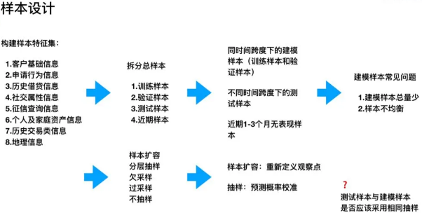
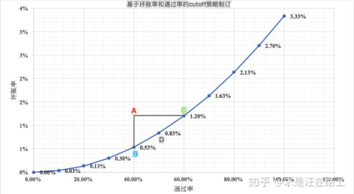

### 风控策略

轻管控，重检测，快响应，私以为基本能实现用户体验与风控需要的平衡。

轻管控：在出现风险，需要阻断用户操作时，阻断动作宜轻不宜重。能验证码校验就不短信校验，能短信校验就不禁访。同时被阻断后文案，下一步出口都需要照顾用户感受。看似简单，其实背后涉及到对用户风控行为以及对用户风控阻断动作的分层管理。

重检测：通过尽可能多的获取用户信息（包括静态及动态数据），由规则引擎进行实时或离线计算，来动态分析每个用户及采取行为的风险程度。这里需要尽量全的数据来源，以及非常强大的规则引擎，才可以实现良好的检测效果。

快响应：是指在检测出用户存在的风险后，如何快速的进行阻挡。这里的重点是快，则意味着对业务的理解要细，提前在关键动作进行布局，才可以做到尽可能减少损失。

#### 贷前策略

##### 反欺诈规则

###### 人员构成

一个完备的反欺诈策略体系需要以下几类岗位人员。

策略人员：互联网反欺诈体系需要有大量熟悉互联网欺诈手段和防范方法的反欺诈策略人员。反欺诈策略人员应当实时关注互联网欺诈的动态，及时发现新出现的互联网欺诈手段和手法，并有效的调度和利用既有的资源制定反欺诈的策略，进行防范。

运营人员：由于互联网欺诈行为的多样性和灵活性，欺诈手段会不断的出现变化和创新。反欺诈运营人员应当建立起各类反欺诈运营监控指标体系，通过监控指标的变化，不间断的分析指标变化原因，及时发现穿透反欺诈策略体系的欺诈行为并予以应急响应。此外，运营人员还应该与业务部门、产品部门、营销部门保持高度密切的沟通，做欺诈风险和用户体验的平衡。

调查人员：反欺诈调查人员应当人工对各种已经发生或正在发生的互联网业务请求进行人工的调查、核实。对于在人工调查中发现的漏报欺诈行为，应当及时的止损、追损，如取消订单（互联网电商）、拦截发货（互联网电商）、贷后提前介入（互联网金融）等。

数据挖掘人员：数据挖掘人员主要负责将系统采集的各种形式的数据进行解析和挖掘，输出各种特征，使其能够被应用于反欺诈建模和反欺诈策略工作。该岗位的工作可与公司数据分析、用户画像等部门共享。

数据建模人员：数据建模人员负责利用系统采集到的客户数据和数据挖掘输出的特征，建立欺诈模型，对客户的欺诈概率进行判断。该岗位的工作可与企业内部其他数据建模工作共享。

研发人员：负责各类反欺诈系统的开发和维护、反欺诈策略和模型的实现

###### 黑话

##### 拒绝推断

幸存者偏差是一个广泛存在的逻辑谬误。我们在进行统计的时候，可能会忽略样本的随机性和全面性，用局部样本代替了总体样本，对总体的描述出现偏差，从而得出错误的结论。样本偏差问题同样存在，这会导致模型参数估计不准确，从而影响对真实风险的判断。为了解决这一问题，拒绝推断应运而生。

indeterminate:不确定，exclusion:排斥样本

模型最终上线可能会应用到不同环节，如额度层、定价层、支用层。不同环节的风控模型的定位一般都是违约概率预测模型。那么差异是什么？由于不同阶段可用数据源、计算实时性要求、目标变量等因素的不同，导致模型设计上不尽相同。同时，额度阶段是在用户维度预测，而定价和申请阶段是在订单维度预测。

在某些情况下，可能也并不需要开展拒绝推断。我们可以结合放贷率来进行定性分析，一般适用于放贷率适中的场景里。

- 如果放贷率很高，这时就没必要做拒绝推断，样本偏差问题已经不明显。
- 如果放贷率很低，那么由于拒绝推断与真实贷后表现之间存在较大的差异，可能导致模型性能反而下降。

注意，这里的放贷率阈值仅供参考，实践中将根据业务实际情况而定。

###### 拒绝推断的分类体系

经典的拒绝推断方法从广义上可分为两大类：数据法和推断法。

**数据法**：**获取拒绝样本的其他表现数据**。

> 方法一：接受本该拒绝：其思想是将部分本该被信用策略拒绝的订单，人工否决予以通过。当然，这批订单将会被打上标记，作为实验对象，保持观察贷后还款表现。
> 方法二：同生表现，又称为重新分类法：该方法的思想是利用其他产品或贷款机构的表现数据来标注。可能存在的问题：①外部数据的获取和成本问题。②多源数据格式不统一问题。③坏样本标注相对容易，好样本定义不明确。④不同平台数据对bad的定义之间存在差异。⑤建模样本是订单维度，外部拒绝标注是用户维度。
> 方法三：拒绝原因：在图1所示的信贷审批链路中，我们会记录每个环节的拒绝原因，尤其是人工信审部分。因此，我们可利用这些数据进行bad样本标注。

推断法：推断拒绝和放贷样本之间的差异，进而调整建模样本组成来构建模型。

> 方法一：展开法，又称为重新加权法：$P(Y=bad|X,Reject) = P(Y=b|X,Accept)\times IK$
> 方法二：重新加权法(Reweighting) 
> 方法三：打包法(Parcelling)，又称为外推法(Extrapolation)
> 方法四：迭代再分类法(Iterative Reclassification)
> 方法五：两阶段法(Two-stage)，又称为双变量推断(Bivariate Inference)

展开法又可细分为2类：

> \1. 简单展开法(Simple Augmentation)，又称为硬截断法(Hard Cutoff)
> \2. 模糊展开法(Fuzzy Augmentation)

简单展开法的操作步骤为：

- **step 1**. 构建 ![[公式]](https://www.zhihu.com/equation?tex=KGB)模型，并对全量样本打分，得到![[公式]](https://www.zhihu.com/equation?tex=P%28good%29) 。 
- **step 2**. 将拒绝样本按 ![[公式]](https://www.zhihu.com/equation?tex=P%28good%29) 降序排列，设置![[公式]](https://www.zhihu.com/equation?tex=cutoff) 。根据业务经验，比如拒绝样本的 ![[公式]](https://www.zhihu.com/equation?tex=bad+%5Cspace+rate) 是放贷样本的2～4倍，从而结合拒绝样本量计算出 ![[公式]](https://www.zhihu.com/equation?tex=cutoff)。
- **step 3**. 高于![[公式]](https://www.zhihu.com/equation?tex=cutoff) 的拒绝样本标记为 ![[公式]](https://www.zhihu.com/equation?tex=good) ，反之标记为![[公式]](https://www.zhihu.com/equation?tex=bad) 。
- **step 4**. 利用组合样本构建![[公式]](https://www.zhihu.com/equation?tex=AGB) 模型。

模糊展开法的操作步骤为：

- **step 1**. 构建 ![[公式]](https://www.zhihu.com/equation?tex=KGB) 模型，并对拒绝样本打分，得到 ![[公式]](https://www.zhihu.com/equation?tex=P%28good%29) 和 ![[公式]](https://www.zhihu.com/equation?tex=P%28bad%29) 。
- **step 2**. 将每条拒绝样本复制为不同类别，不同权重的两条：一条标记为![[公式]](https://www.zhihu.com/equation?tex=good) ，权重为 ![[公式]](https://www.zhihu.com/equation?tex=P%28good%29) ；另一条标记为 ![[公式]](https://www.zhihu.com/equation?tex=bad) ，权重为 ![[公式]](https://www.zhihu.com/equation?tex=P%28bad%29) 。
- **step 3**. 利用变换后的拒绝样本和放贷已知好坏样本（类别不变，权重设为1）建立 ![[公式]](https://www.zhihu.com/equation?tex=AGB) 模型

**方法二：重新加权法**

重新加权法并没有把拒绝样本加入建模，只是调整了放贷好坏样本的权重。操作步骤为：

- **step 1**. 构建 ![[公式]](https://www.zhihu.com/equation?tex=KGB)模型，并对全量样本打分，得到![[公式]](https://www.zhihu.com/equation?tex=P%28good%29) 。  
- **step 2**. 将全量样本按 ![[公式]](https://www.zhihu.com/equation?tex=P%28good%29) 降序排列，分箱统计每箱中的放贷和拒绝样本数。
- **step 3**. 计算每个分箱中放贷好坏样本的权重：
  ![[公式]](https://www.zhihu.com/equation?tex=weight+%3D+%5Cfrac%7BReject_i+%2BAccept_i+%7D%7BAccept_i%7D+%3D+%5Cfrac%7BReject_i+%2BGood_i+%2B+Bad_i+%7D%7BGood_i+%2B+Bad_i%7D+%5Ctag%7B3%7D) 
- **step 4**. 引入样本权重，利用放贷好坏样本构建 ![[公式]](https://www.zhihu.com/equation?tex=KGB) 模型。

**方法三：打包法(Parcelling)，**又称为**外推法(Extrapolation)**。

该方法的操作步骤如下：

- **step 1**. 构建![[公式]](https://www.zhihu.com/equation?tex=KGB) 模型，并对全量样本打分![[公式]](https://www.zhihu.com/equation?tex=P%28good%29) ，也就是图6中的![[公式]](https://www.zhihu.com/equation?tex=score) 。
- **step 2**. 将放贷样本按分数排序后分箱（一般等频），将拒绝样本按相同边界分组。
- **step 3**. 对每个分箱，统计放贷样本中的![[公式]](https://www.zhihu.com/equation?tex=bad+%5Cspace+rate)。
- **step 4**. 对每个分箱，将放贷样本的![[公式]](https://www.zhihu.com/equation?tex=bad+%5Cspace+rate)乘以**经验风险因子**（通常取2～4），得到拒绝样本的期望![[公式]](https://www.zhihu.com/equation?tex=bad+%5Cspace+rate)。
- **step 5**. 为达到期望的![[公式]](https://www.zhihu.com/equation?tex=bad+%5Cspace+rate)，**随机赋予**分箱内的拒绝样本以![[公式]](https://www.zhihu.com/equation?tex=bad) 和![[公式]](https://www.zhihu.com/equation?tex=good)状态。同时，检验整体拒绝样本的![[公式]](https://www.zhihu.com/equation?tex=bad+%5Cspace+rate)是否是放贷样本的2～4倍。
- **step 6**. 利用组合样本构建 ![[公式]](https://www.zhihu.com/equation?tex=AGB) 模型。

**方法四：迭代再分类法 (Iterative Reclassification)**

该方法通过**多次迭代好坏分类，直到收敛某一临界值**。操作步骤如下：

- **step 1**. 构建![[公式]](https://www.zhihu.com/equation?tex=KGB) 模型，对拒绝样本打分，得到![[公式]](https://www.zhihu.com/equation?tex=P%28good%29)
- **step 2**. 将拒绝样本按![[公式]](https://www.zhihu.com/equation?tex=P%28good%29) 降序排列，设置![[公式]](https://www.zhihu.com/equation?tex=cutoff) ，若高于 ![[公式]](https://www.zhihu.com/equation?tex=cutoff) 则标记为![[公式]](https://www.zhihu.com/equation?tex=good) ，反之标记为![[公式]](https://www.zhihu.com/equation?tex=bad) 。
- **step 3**. 加入推断的好坏样本，构建![[公式]](https://www.zhihu.com/equation?tex=AGB) 模型，对拒绝样本打分，得到新的![[公式]](https://www.zhihu.com/equation?tex=P%28good%29_i) 。
- **step 4**. 迭代训练，直到模型参数收敛。如 ![[公式]](https://www.zhihu.com/equation?tex=log%28odds%29-score) 曲线位置不再变化。

**方法五：两阶段法(Two-stage)，又称为双变量推断(Bivariate Inference)**

实际信贷业务逻辑是：**先有放款决策，才有好坏表现**。因此，建模过程也考虑分为**放款预测（AR模型）和好坏预测（KGB模型）**两个阶段。用数学描述：

![[公式]](https://www.zhihu.com/equation?tex=P%28good%29%3DP%28good%7Caccept%29%2AP%28accept%29%2BP%28good%7Creject%29%2AP%28reject%29+%5Ctag%7B4%7D) 

假设 ![[公式]](https://www.zhihu.com/equation?tex=P%28accept%29) **相近的客户具有近似的风险特征**，因此考虑将 ![[公式]](https://www.zhihu.com/equation?tex=P%28accept%29) 分成若干段，每段的好坏账户能代表该段内的被拒客户的特征，利用这些好坏账户可以推断被拒帐户中的好坏。

两阶段法的操作步骤如下：

- **step 1.** 构建 ![[公式]](https://www.zhihu.com/equation?tex=AR) 模型，对全量样本打分，得到 ![[公式]](https://www.zhihu.com/equation?tex=P%28accept%29) .
- **step 2**. 构建 ![[公式]](https://www.zhihu.com/equation?tex=KGB) 模型，对全量样本打分，得到 ![[公式]](https://www.zhihu.com/equation?tex=P%28good%29) .
- **step 3**. 将全量样本按 ![[公式]](https://www.zhihu.com/equation?tex=P%28accept%29) **升序**排列，**等频**分箱，分别计算每个分箱内放贷样本和拒绝样本**平均** ![[公式]](https://www.zhihu.com/equation?tex=P%28good%29)，也就是**边际好人概率** ![[公式]](https://www.zhihu.com/equation?tex=%EF%BC%88marginal+%5Cspace+good++%5Cspace+rate%EF%BC%89) 。
- **step 4**. 分别绘制拒绝样本和放贷样本的散点图，横坐标为 ![[公式]](https://www.zhihu.com/equation?tex=P%28accept%29) ，纵坐标为 ![[公式]](https://www.zhihu.com/equation?tex=P%28good%29) ，如图10所示。
- **step 5**.  基于业务经验确定一条期望趋势线，用以对拒绝样本的实际概率 ![[公式]](https://www.zhihu.com/equation?tex=P%28good%29_a) 进行修正，目标概率为期望趋势线上对应的 ![[公式]](https://www.zhihu.com/equation?tex=P%28good%29_e) 。
- **step 6**.  计算用于修正样本选择偏差的权重修正因子： ![[公式]](https://www.zhihu.com/equation?tex=weight+%3D+%5Cfrac%7BP%28good%29_e%7D%7BP%28good%29_a%7D) 
- **step 7.**   引入权重修正因子，利用打包法推断好坏。
- **step 8.**  根据组合样本构建 ![[公式]](https://www.zhihu.com/equation?tex=AGB) 模型。

#### 互联网金融业务知识

##### 行业分类

车贷、传统线下转线上信用贷（无抵押贷款）、消费贷款、场景消费分期：整容分期、教育分期、特定群体的分期：蓝领贷、正规持牌消费金融分期、小额现金贷、信用卡代还、流量中介

存在的风险有：资金链、获客成本越来越高、群体欺诈代办：贷款中介、风控模型：贷款贷错人、多头寻贷、道德风险：跟客户串通骗贷、数据安全问题：客户信息泄露、政策风险

##### 四类产品能力

###### 风控

产品能力
坚实的数据支撑：丰富的数据基础；账户身份信息接入公安网、红盾网等机构；第三方支付安全合作联盟成员，共享风险数据
实时风险管控：在线风险监控——用户登录即进入保护；离线风险分析——完善实时监控功能；7*24小时风险处理团队
安全服务输出：商户网站安全扫描；防钓鱼、木马、防校验码泄露的技术输出；风险交易联合拦截
多方外部合作：浏览器厂商；杀毒软件厂商；通信运营商；邮件运营商
核心能力
四项元素验证 : 是用户实名验证的基础，包括：姓名、身份证号、手机号码和一些基础的用户信息。
黑名单厚度：黑名单是风控中的一种策略，厚度就是数据的丰富度。
多头借贷：同一个人会在很多地方产生行为，有好的和坏的，这就会产生多头借贷。这个时候模型就起到了动态调节的作用，模型有两种：一种是前置模型，一种是后置模型，它们解决不同的问题。前置模型：解决一部分人信用预判和授信的问题，比如：可以解决无业人员的申请问题；后置模型：更多的是解决后期的反欺诈、后向行为（用户后续的操作行为，以及交易层面进行的异常交易，在这个过程中发现问题并实时拦截）。
黑产：非法数据的窃取与交易、网络攻击与敲诈勒索、网络诈骗、手机木马、挂马与人海战术、打马产业等等。
催收：信贷行业将钱贷出，更重要的是能将贷出的资金回收，不同的公司有不同的催收策略，如APP、短信、人工催收、机构等等。

###### 通道

核心能力
可分为收款、打款、鉴权这几类。
比如：我们在支付平台完成一次付款需要收款的通道；发起一次余额的提现需要打款通道；在绑定一张新银行卡的时候，平台需要验证你的基本信息、基本卡要素、判断卡类型，同时进行身份核实，这个时候要用到鉴权的通道。
属性：按属性可分为快捷通道、理财通道、大额通道、代扣等很多细分。
每接入一家银行，通道需要付出很多努力。其中涉及几个环节，首先是商务谈判，清算规则的制定、对账文件、退款接口、还有订单关联的逻辑，包括财务后台怎么去进行对账的验证，发生异常数据时怎样进行调账，这样的事情都需要前期去谈清楚、说明白，并且进行相关的调试和开发，才能完成一个通道的接入。

###### 收银台

收银台是离大家最近的产品，绑一张银行卡、输入密码、消费扣款、收到扣款的短信和温馨提示，这些流程都是在收银台内完成的。收银台是整个产品中的一个上层结构，它更多的是完成用户端的支付能力，然后将钱结算给商户。同时不同的收银台会有很多的形式，会适配不同的商户和业务来进行接入。线上支付：SDK收银台、H5收银台、PC电脑收银台、线下支付：扫码支付、条码支付、HCE支付

###### 商户权益管理

商户权益管理是重要的后台管理能力，包括商户资质的申请、订单的管理、账户的管理、资金流的管理、子商户的管理等。权益管理和营销管理的资源已成为各网贷平台互相争夺的资源，我们需要通过试验来找到核心功能点，通过优先级排序来满足用户和商户的需求，同时需要进行漏斗分析，分析用户的摩擦损失。

##### 三大业务

支付、理财、信贷
支付：支付是最底层的一个能力，在用户进行理财和信贷借款时，都需要用到收银台和支付这样的能力进行支撑，同时三者又是一个互相耦合的关系，会进行互相的促进。

支付方向的产品，需要了解这些知识：

什么叫非银行支付机构？什么叫合规？

一类账户、二类账户、三类账户分别是什么意思？

收银台有哪些形式？

收银台里边的一些基本的功能？还有它本身背后存在的一些逻辑？

##### 风控分析模型

###### 主要指标

逾期天数DPDn：自应还日次日起到实还日期间的日期数，DPD30表示逾期30天；
逾期期数：自应还日次日起到实还日期间的还款期数，正常资产用C表示，Mn表示逾期n期；
贷款余额ENR：至某时点借款人尚未偿还的本金，即全部剩余本金作为贷款余额；
月均贷款余额：月均贷款余额=（月初贷款余额+月末贷款余额）/2，月初贷款余额即上月末贷款余额
核销金额：贷款逾期M7后经审核进行销账，核销金额即在核销日期当天的贷款余额；
回收金额：来自历史所有已核销合同的全部实收金额；
净坏账=当月新增核销金额-当月回收金额；
在账月份MOBn：放款后的月份，MOB0放款日至当月月底，MOB1：放款后第二个当月月底
滚动率
c-m1：当月进入M1的贷款余额/上月末的贷款余额
m2-m3：当月进入M3的贷款余额/上月末M2的贷款余额
逾期率：Coin(C)%、Coin(M1)%、Coin(M2)%、Coin(M3)%、Coin(M4)%、Coin(M5)%、Coin(M6)%
当月不同逾期期数的贷款余额/当月底总贷款余额
逾期率：Lagged(M1)%、Lagged(M2)%、Lagged(M3)%、Lagged(M4)%、Lagged(M5)%、Lagged(M6)%

##### 体系

#### 风控模型

模型开发方向，从技术算法的专业度，分成风控建模工程师和算法研究员。从字面意义就可以发现，风控建模工程师工作核心还是以风控模型的开发为主，更多的工作落脚点在构造有效特征，应用一些模型算法进行数据训练和测试。

风控建模工程师普遍只会花少量时间研究算法本身，甚至不会花时间去研究最新算法。逻辑回归、随机森林、XGboost等主流常规算法，是他们建模首选。而对于算法研究员，更多的精力在研究前沿算法，通过结合自家机构的物理场景，判断是否在未来时期内业务落地应用。

##### 评分模型搭建

###### 样本准备

产品的目标客群是怎样的？建成的评分卡是要用在哪些人身上的？有哪些样本是不适合拿来建模的？举个例子，如果准入规则直接拒绝了25岁以下的客户，那么对应建模时也应该筛选掉这部分样本（非准入客群）。又或者，有一些客户虽然申请了额度，但是并未真正申请放款，那么这些无行为表现客户也不应该包含在建模样本之内。

###### 好坏定义

怎样的客户算“好”，怎样的客户算“坏”都是很有讲究的。这个好坏定义首先和评分卡真正关心的客户类型有关，比如说一个反欺诈评分卡的“坏客户”定义可能是首逾30天以上（FPD30+），而审批评分卡的定义可能是M3+。而具体逾期多少天算“坏”，就要进行Roll Rate分析了。

###### 观察期和表现期

观察期是指用于生成客户特征的时间区间，用于收集信用历史和行为特征等信息，以提炼能预测未来信用表现的预测变量。观察期过长可能导致大量客户无法获取相应时间长度的数据，大批样本不能进入模型；观察期过短会导致样本无法生成足够多有效的时间切片变量。表现期是对观察点上客户表现进行监控的时间周期。这些帐户根据截止到表现点的表现被分类成“好”、“坏”。表现期需要有足够的长度，从而保证样本群体分类的稳定性，使客户的逾期行为充分表现出来。但也不能够过于长，即使可获得很长时间的历史数据，还需要在完整性（有多少个坏样本需要捕捉）和数据质量之间保持平衡。

###### 细分分析

如果对不同类型（某种维度意义上）客户都使用不同的评分卡，过多的评分卡不好管理，不同评分卡之间得出的结果有时也不具备可比性。因此，需要找出最佳的群体分组，使得以此为基础建立的一组评分模型可使整个评分系统的预测能力最大化。当然，如果是在样本量比较少的情况下，这一步就可以跳过了。

###### 数据准备

数据准备的过程包括数据清洗、缺失值处理、离群值处理等等，目的是让数据足够“干净”，而不会因为其中的一些乱码或格式问题影响后续建模。在逻辑回归模型中，合理的缺失值和离群值都是可以不做处理的，因为在进行分箱和WOE转换时可以解决掉这些问题。

###### 变量衍生

变量衍生是整个建模过程中最重要的一个环节，往往在同样的数据和维度条件下，谁的评分卡模型效果更好，看的就是这一步。变量衍生有各种各样的方法，比的就是谁的脑洞更大。可以简单粗暴的根据业务理解进行变量的组合，生成交叉变量，比如说，不同年龄段的客户的婚姻状况可以给予不同的打分标准。又或者，可以利用一些机器学习算法，比如xgboost，从数据的角度来进行变量衍生。

###### 训练集和验证集

在真正进入建模过程前，还需要预留出一部分样本用作模型的验证，这是为了防止模型的不稳定：在训练集上表现良好、在验证集中却无法很好的预测。然而只要手气足够好，随机抽取验证样本时足够“随机”，训练集和验证集各指标的分布足够近似，验证集的表现一般不会和训练集有太大的差距，但这并不一定代表模型就是稳定的了。

因此，最好的做法是再预留出一部分时间外测试集，选取与建模样本不同时间段的样本再对模型表现进行验证。比如，如果选取的审批时间在1-3月的客户作为建模样本，那么可以将4月的客户作为测试样本测试模型的效果。

###### 分箱和WOE转换

在进行变量衍生后，我们可能会产生好几百上千个变量，有连续性变量也有分类型（字符型）变量。然而，字符型变量是没有办法直接作为入参参与逻辑回归拟合的，而为了使自变量和目标变量呈正相关的关系往往会对数值型变量也进行分箱和WOE转换。毕竟如果按照原数据入模，会导致评分卡非常不稳定，同时变量的取值和得分的关系也会变得非常的杂乱无章，失去业务上的可解释性。另外，在这一步，根据每个变量的IV值，也可以筛选掉一部分区分能力较弱的变量。

###### 共线性检验

共线性检验也是筛选变量过程中非常重要的一步。共线性指的是模型的变量之间存在较高的相关性，某一个变量可以被其他一部分变量所解释。共线性高会导致回归拟合出来的系数发生严重的偏离。常用的指标为相关系数和VIF。

###### 逐步回归

这是一个基本上完全交给程序的过程，通过不断增加、删减变量，从数据层面挑选使模型的预测能力达到最大的变量组合。然而，虽然已经进入变量筛选阶段的尾声，逐步回归跑出来的变量也不一定就符合要求了，还会有可能出现逻辑回归的系数正负符号不一致的情况。这种时候，就需要结合前面的共线性检验，不断的调整进入逐步回归的变量，以得到合理的最终入模变量。

###### 模型表现

模型表现的评估常见的也就是大家耳熟能详的那几个指标：KS值、Gini、AUC、Lift等等。需要注意的是，模型不能一味的追求高KS，所有变量在建模过程中都针对显著性、相关性、冗余及多重共线性进行测试。如果变量在各维度上不能符合标准，即使会牺牲KS，也将被从模型中剔除。

###### 拒绝推断

拒绝推断是给被拒绝的申请人赋予一个理论上的表现的过程。等价于说：“如果申请人被接受了，他们的表现会是什么？”由于审批时有一定的拒绝条件，所以被批准的客户群体并不是申请群体的无偏差代表，相反由于审批的选择性导致了被批准客户群体的信用质量高于申请人群体的总体信用质量。如果最终的评分卡只是基于被接受的群体创建，可能会造成一定程度的偏差。

拒绝推断的流程为：先建立一个已有客户模型，使用已有客户模型给拒绝客户打分，再基于已有客户和拒绝客户的群体集合建立新的评估分数。如果之前的审批策略效果不佳，已有客群和拒绝客群差别很小，是可以跳过拒绝推断这一步的。

###### 标准评分卡

在评分卡模型建立的最后，需要将模型转化成一个更加直观、更容易部署的形式，也就是标准评分卡。标准评分卡可以一眼看出每一个入模变量落在哪个区间可以得到多少分。简单来说，就是需要将每个变量每个分箱的系数*WOE变成一个分数，这个过程会使用到三个参数：标准分、标准好坏比、PDO，最终计算出好坏比和分数的一一对应关系。

##### 评分卡模型搭建流程

评分卡按照使用阶段分为申请卡、行为卡、催收卡

- A卡（Application scorecard）申请评分卡：在客户申请处理期，预测客户开户后一定时期内违约拖欠的风险概率，有效排除了信用不良客户和非目标客户的申请
- B卡（Behavior score card）行为评分卡：在帐户管理期，根据账户历史上所表现出来的各种行为特征来预测该账户未来的信贷表现 
- C卡（Collection scorecard）催收评分卡：在帐户管理期，对逾期帐户预测催收策略反应的概率，从而采取相应的催收措施

三张卡的区别

- 使用的时间不同。分别侧重贷前、贷中、贷后；
- 数据要求不同。申请评分卡一般可做贷款0-1年的信用分析，行为评分卡则是在申请人有了一定行为后，有了较大数据进行的分析，一般为3-5年，催收评分卡则对数据要求更大，需加入催收后客户反应等属性数据。 
- 使用模型不同。在申请评分卡中常用的有逻辑回归，AHP等，而在行为和催收两种评分卡中，常使用多因素逻辑回归，精度等方面更好。
- 变量不同。申请评分卡用到的大部分是申请者的背景变量，比如客户填写的基础信息+第三方外部数据源查询信息，而且这个模型一般也会比较谨慎。行为评分卡利用了很多基于交易的变量，可以预测一个客户未来的违约概率。 

申请评分卡的评分结果将决定：

- 估计的信用状况，即正常还是违约，并据此决定批准还是拒绝该笔贷款申请；
- 为了获得审批通过需要的抵押物；
- 贷款额（信用额度）;
- 贷款定价（利率水平）

行为评分卡的评分结果将决定：

- 审查信用重建；
- 审查信用额度、额度管理调整；
- 制定清收策略（若违约或逾期）；
- 审查贷款定价和贷款条件

催收评分卡的评分结果将决定：

- Pre催收，降低违约风险提升还款率
- M1阶段精细化催收策略，如IVR、预测式外呼、预览式外呼
- 失联信息修复和提前委外催收

###### 数据业务理解

在开发信用评分模型之前，最基本面的工作就是梳理和理解数据。

不要自认为知道这些字段的中文意思、来自哪张数据表就可以了，还要尽可能的去了解这些数据是从生产库怎么生成的，也就是说这些可能用到的变量数据还原到业务中是怎样的衍生过程，当然如果你们是直接从生产库里挑选数据提炼到建模表上，那么恭喜你，可以花更多的时间去梳理整理数据了，建好的模型也会更稳定准确。

###### 数据探索分析

当我们带着好奇的心态沉浸在生产库或者数仓的数据海洋里，不要忘记我们是身负重任的，我们要从以产品为中心生成的大维度数据变量里进行一遍变量维度的初步筛选，筛选出有可能进入建模表里的所有变量字段，然后去观察这些数据具备什么形态。

直接运行 proc means过程时，会对所有数值型变量进行操作，得到各变量的非缺失观测数N，均值MEAN，标准差STD DEV，最大值Max和最小值Min，我们还可以增加range（极差） sum（和） var（方差）nmiss（缺失值个数）median（中值）等选项得到其统计量。

直接运行 proc freq过程时，会对所有变量（一般针对离散型变量，如果是连续型变量，通过Format进行离散化处理）进行操作，得到各变量的频数、百分比、累积频数、累积百分比，我们还可以增加多变量的交叉表频数统计。

探索性数据分析最常用的过程步之一就是proc univariate，直接运行 proc univariate过程时,会对所有变量进行操作,得到矩、位置和可变形的基本测度、位置检验、分位数、极值观测。

若加了一个HISTOGRAM则增加了一个直方图；加一个NORMAL选项则在直方图上面加了一根拟合后的正态分布图，并且还增加了拟合正态分布的参数估计、拟合优度、分位数；加一个KERNEL则在直方图中加了一根实际数据核分布的密度曲线；加一个plot选项，在结果中增加了分析变量数据的分布图、箱型图、以及概率图，等等。

###### 定义目标变量

对于评分卡目标变量Y的界定，我们主要从Roll Rate和Vintage来观察分析，重点需要考虑三个方面

逾期流转比例

观察期和表现期

样本容量

###### 样本设计及抽取策略

在开发评分模型前，如果可以在样本设计阶段尽可能的涵盖到体现客户风险的所有特征维度，那么对于之后模型开发工作，将会起到事半功倍的效果。

**样本特征集的设计**

对于不同形态的金融产品，样本特征集的设计框架彼此不同，但设计出发点都是为了体现用户的全部潜在风险。

以个人信贷为例，样本特征集应该至少包括客户基础信息、申请行为信息、历史借贷信息、社交属性信息、征信查询信息、个人及家庭资产信息、历史交易类信息、地理信息。其中，征信查询信息包括第三方数据供应商提供的信息。

所以，在设计样本特征集时，需要将以上风险特征变量尽可能的收集聚合在样本特征集中。

**总样本拆分策略**

在构建出样本特征集之后，需要按照模型开发、模型验证、模型测试三个环节，将总样本拆分成训练样本、验证样本、测试样本和近期样本。

训练样本和验证样来自于总样本并在同一时间区间内，可以按照一定比例进行样本抽取（一般训练样本：验证样本=7:3）或者N折交叉抽取。

测试样本来自相邻“未来”时间区间，用以测试模型的预测能力、区分能力、排序能力、稳定性等指标，确保模型在不同时间段上仍有一定“活性”。

近期样本是在开发前仅三个月左右的样本，没有表现结果。近期样本主要用来确保评分卡特征变量的稳定。

**建模样本抽取策略**

一般对于建模样本，常遇到两类问题：建模样本总量少和样本不均衡。

对于建模样本总量少的情况，需要按照最大、最小样本设计策略重新进行观察期和表现期以及观察点的选择，同时结合计算能力以及外部数据征信成本进行综合考量，在这里不进行过多赘述。

对于样本不均衡问题，一般有三种处理方法：欠采样、过采样和样本分类阈值移动。欠采样是减少数量较多那一类样本（一般是好样本）的数量，使得正负样本比例均衡；过采样是增加数量较少那一类样本（一般是坏样本）的数量，使得正负样本比例均衡。

样本分类阈值移动的设计方法是，在分类学习中面对样本不均衡时，我们可以采用原有不均衡的样本进行学习，然后通过改变决策规则来做分类，比如在样本均衡时我们0.5作为分类阈值，而在样本不均衡的情况下我们可以规定预测概率需要达到0.8才能被预测为多数类。

至此，在经过确定最大、最小样本、剔除灰样本、处理样本不均衡和分层后，样本设计基本完成，但有一点需要提醒各位读者，需要独立关注因数据缺失等原因剔除的样本，虽然他们可能成为样本的噪音数据，但他们也通常有很高或很低的违约率特性，对于一些特定场景模型如反欺诈模型，往往对于此类特征的关注度更高。

###### 数据清洗

**缺失值**

数据缺失引起的原因多种多样，大致可以概括为IT系统原因、前端录入原因和接入征信公司原因。

- 对于IT系统缺陷导致的数据缺失，在你无能为力的时候请尽快联系IT人员。
- 对于前端录入数据的缺失，通过逻辑匹配方式可以选择不同手段去填补。
- 对于接入征信公司原因导致某些第三方数据字段有缺失，那我们要理解这个缺失值的内在含义，有些情况的缺失我们是不能去填补的，就作为missing存在。

在做缺失值填补前，同学们应该先看看有哪些字段是缺失的，缺失比例如何，是否对我们业务和模型有作用。如果这些缺失字段是不必要的，那我们没有必要花功夫去填补它们。

**具体操作手法**

筛选出缺失的数据

google或者baidu上能找到很多关于查找缺失值的小代码，大部分筛选逻辑按照数据类型做分类筛选，运用数组和do循环，具体代码我就不展示在文章里了。黑猫白猫能抓住老鼠的就是好猫。

2.2 查看缺失比例，判断是否必要

对筛选出缺失数据字段的missing数据集，通过观察缺失比例和建模产品的逾期率去判断是否有必要做缺失值填补。

比如，建模产品的逾期率比较高，也就是建模样本里的坏样本比较多，变量分箱的目的是更希望将坏样本分到一个组里，这个时候一个分箱变量的缺失率很高，不论是做特征值替换、线性插值、逻辑匹配填补或者作为MISSING处理，都容易造成分箱组里sample的极端分布不均，这个时候如果你做并组，会造成分箱区分度下降，如果你不做并组，这个分箱变量会有不稳定的潜在隐患。

所以，对于逾期率高的产品建模，缺失比例高的话就不建议进入模型，同比，对于逾期率低的建模产品，缺失率的容忍度就好了很多，具体这个balance的线在哪里，我提供一个经验建议：

- 如果逾期率大约40%以上，可接受的缺失比例在15%以下；
- 如果逾期率大约8%以下，可接受的缺失比例在70%以下；

严谨的做法是每次建模时候根据我上面的逻辑去校验样本可接受缺失比例的balance point，然后判断哪些字段是需要继续操作，哪些字段可以直接舍弃。

2.3 缺失值填补or not

通过第二步我们已经知道哪些字段是可以继续操作下去的，这个时候我们就要选择用什么方法去对缺失数据处理。

统计学上的缺失值处理常用手法有特征值（mean\median…）替换、线性插值等，但实际建模中更常用的是结合业务逻辑匹配，或者作为MISSING不做处理。

###### 特征衍生

以下是我分享一些造变量的个人小技巧，希望可以帮助读者朋友们打开思想枷锁，造出变量IV较高的好变量。

- 善用产品准入规则变量，弱弱联合会变强；
- 多参考Strategy变量，往往有意想不到的效果；
- 风控核心防欺诈，设身处境去思考；
- 风控基本出发点是评估个人还款能力和还款意愿；
- 合理利用一些算法，省时省力又高效；

###### 特征变量筛选

**缺失率**

一个变量，如果缺失率过高，他所包含的信息往往也比较少，做缺失值填补也会比较困难。同时该变量如果在建模样本中大量缺失，很可能投入生产后也是差不多的情况，那进入模型也就没有太大的意义了。

**区分能力**

一般情况下，如果模型中加入过多的指标往往会比较冗余，因此在有限个指标中要使模型的效果更佳，自然需要挑选对坏样本识别能力较强的变量。通常的做法是计算每个变量的IV值，或者单变量KS/AR值，并从大到小进行排序，挑选排名前多少的变量，或者大于一定阈值的变量。对于IV值较低的变量，他们本身能提供给模型的贡献也比较少，剔除掉也不足为惜了。

**稳定性**

一个优秀的模型，除了能够很好的区分好坏样本以外，还需要足够的稳定，防止随着时间的推移过快衰退的现象出现。因此模型中的每一个变量也需要足够的稳定。要进行判断，可以计算不同时间切片之间该指标的PSI。比如说如果使用了2018年全年的样本作为建模样本的话，可以将样本切分为上半年和下半年两部分，并计算每个指标在这两个部分间的PSI。如果变量的PSI>0.2，说明随着时间推移该变量的分布发生了很大的改变，那么如果它成为了入模变量，往往会导致模型整体变得不稳定。

**相关性/共线性**

一个指标光是自己表现的足够好也是没有用的，还要考虑它和所有其他自变量之间的“团队协作能力”。一个优秀的团队，往往需要队员之间取长补短，各自分工，而不是大家擅长的事物都一样，而短板却无人弥补。放在模型上面也是一样的道理。如果模型中的自变量之间具有完全多重共线性，那么训练出来的系数便会失去统计学意义。即使是不完全共线性，也会导致系数失真，从而导致模型的效果无法达到预期。

这个时候，如果单纯计算变量的VIF，虽然能检验共线性问题是否存在，但是却无法判断应该保留哪些变量、剔除哪些变量。因此可以综合考虑单变量或多变量的AR值。

**业务逻辑**

除了上面几点可以通过各种指标量化的筛选条件以外，业务逻辑也往往是一个不可忽视的门槛。

比如说学历这个指标，从直观上来看往往学历越高，信用风险就越低。因此在分箱的过程中，各箱的坏样本率也需要符合这一趋势。否则最后转换为标准评分卡后，低学历客户的单项得分比高学历客户的还高，这显然是不合常理的。对于趋势与业务逻辑不一致的指标，往往也会予以剔除，来满足评分模型的可解释性。这就是为什么常说，做模型一定要将数据与业务相结合，光靠数据跑出来而没有业务做支撑的模型，往往也是不可靠的。

**逐步回归**

逐步回归是一个不断往模型中增加或删除变量，直到找到最优的变量组合、新增变量不再产生具有统计显著意义的增量效应为止。一般来说，这就是指标筛选的最后一步了，如果使用SAS进行逐步回归往往也能控制住入模变量的显著性，因此此时最需要注意的是模型拟合出来的系数方向是否一致，如果出现不一致的情况，可以考虑在变量清单中剔除掉这部分指标，重新进行逐步回归分析，直到系数方向一致为止。

###### 模型变量分箱

在搭建逻辑回归评分卡模型的时候，大多数步骤都可以用打包好的函数或代码快速实现，而最需要人工干预的步骤就是分箱。毕竟程序再厉害，也不可能懂你的业务逻辑，不会知道怎样的趋势才是符合实际的。因此，建模er经常会花费大量的时间在调整每个变量的分箱上。有的时候调整的方向正确的话，最终模型的K-S值甚至可能有从0.35到0.4的变化。

在人工调整分箱的时候，需要注意的地方有：

- 每个分箱之间的好坏比要有一定差异；
- 每一箱中的样本数量不能过少；
- 分箱的好坏比趋势要与业务常识保持一致；
- 分箱切点的取值要符合业务常识。

具体人工分箱的切点如何选取，这个就比较因人而异了。可以在最优分箱的基础上进行调整，也可以等频或等距分箱后参考好坏比趋势进行合并和调整。

###### 模型拟合

**前向逐步回归**

顾名思义，FS（Forward Stepwise）回归是让所有建模指标变量一个一个地进入回归方程，按照预先设定的显著性检验标准，最显著的指标变量最先进入，然后其次就是次显著的指标变量进入，依次类推。

**后向逐步回归**

明白了FS回归，BS回归就很容易理解。它的逻辑是首先让全部指标变量都进入回归方程，按照预先设定的显著性检验标准，把不显著的变量逐一剔除。

**混合逐步回归**

CS回归是融合FS和BS回归的优缺点，提出的一种变量选择方法，它的原理如下：按照预先设定的显著性检验标准，逐步加入或者剔除指标变量，可以由前向逐步回归开始，也可以由后向逐步回归开始，例如由前向逐步回归开始，当新指标变量进入时，如果老指标变量不满足预先设定的标准可以后向剔除，而对比前向逐步回归，变量一旦进入，就不再退出。

###### 模型评估常用指标

对于训练出来的Score Model，需要一系列指标对Model进行关于稳定性、区分能力等效用来度量。

**KS**

我认为对于评分模型的KS取值应有如下要求：

- KS<0.2 模型的区分能力不高，价值不大；
- 0.2<=KS<0.4 一般金融机构开发的评分模型KS大部分都集中在这个区间内，行为评分模型的KS会更高一点，相对于KS<0.2的评分模型，此时的评分模型已经具备一定的区分能力，模型具有一定的使用价值，此时可以结合其他指标继续观察调优模型；
- 0.4<=KS<=0.7 模型区分能力比较好，模型有应用价值；
- KS>0.7 模型好的难以令人置信，可能在变量中加入了业务目标衍生指标，需要对模型特征工程进行排查。

**GINI**

虽然Gini指标与Ks一样也是金融评分模型界通用的核心指标，但是它的使用也是有2点需要注意的地方：

- 评估评分卡的区分能力时，如果坏客户的定义不是那么严格，Gini系数对应代表的区分能力可能被夸大效果；
- Gini对目标变量类别的定义比较敏感，比如账户的好坏。

所以要想Gini指标精确有效，那么目标变量Y的定义在评分卡开发初期是十分重要和严谨的步骤。

Gini系数的不同范围值对应的评分模型区分能力高低也不一样，行业内也没有一个绝对标准，以下个人经验，可供参考：

针对评分卡集群来说，申请评分卡集的GINI标准：

- Gini<0.3,模型不太能接受；
- 0.3<=Gini<0.35,模型区分能力一般，模型有优化空间；
- 0.35<=Gini<=0.5,模型区分能力比较满意；
- Gini>0.5，Gini越高越有过拟合的可能性；

行为评分卡集群的GINI标准：

- Gini可能会超过0.8；
- Gini<0.6，可能模型有问题。

当然了，对于单一子评分卡模型的话，Gini的接受浮动就比较大了，比如某一特定场景开发出的申请评分卡，因为IV高于0.1的变量本身就很少了，这个时候的Gini标准就不需要再采用模型集群的GINI标准了。

###### 模型预测概率校准

在建立评分卡模型的时候，往往建模样本的好坏比和实际情况是不一致的，这是因为：

- 产品本身坏样本较少，为了提高评分模型的敏感程度，会对坏样本进行过抽样或者好样本进行欠抽样；
- 如果是乙方公司，好坏样本的来源可能不同，或者甲方爸爸并没有全量反馈样本表现，那么自然样本中的好坏比无法反映真实的情况。

然而，用一个好坏比失真的样本建立好评分卡模型后，如果想要计算每个分数段的坏样本率，得出来的结果是会大于真实情况的。原因很简单，逻辑回归中的截距是约等于好坏比的对数的（因为评分卡模型预测的是该样本为坏样本的概率，因此使用的是坏:好）。如果样本的坏样本占比比实际情况要高，那么模型预测出来的每个样本的违约概率都会偏大。那么想要还原每个客户真实的违约概率，就需要进行一个概率校准。

校准的方式也非常简单。首先我们需要一个目标好坏比odds1，它可以是进行过抽样/欠抽样前产品真实的好坏比（对应上面情况1），也可以是行业平均水平（对应上面情况2）。如果建模样本的实际好坏比是odds的话，那么我们只需要在逻辑回归拟合出来的截距上再加一个ln(odds1/odds)即可（这一步发生在sigmoid函数转换前）。

这种校准方法在直观上也非常好理解，因为ln(odds1/odds)是等于ln(odds1)-ln(odds)的，而前面也提到过，逻辑回归拟合出来的截距是约等于ln(odds)的，那么在截距上再加上ln(odds1/odds)，相当于只是把ln(odds)抵消掉，变成了实际好坏比ln(odds1)而已。

然而这只是每个客户违约概率的校准，即使是校准后，如果计算每个分数段的好坏比，依然会被打回原形。这是因为这个过程虽然校准了每个客户违约概率的值，但是并不会改变评分模型的排序顺序。因此对计算出来的好坏比，也要有一个校准的过程：对好坏比进行一个sigmoid的反函数，加上ln(odds1/odds)，再用sigmoid函数运算回来，这样得出的好坏比就是接近真实情况的好坏比了。

###### 模型违约概率误差校准

##### 评分模型如何用于决策

#### 风控策略

##### 风控策略概要

什么是风控审批策略

基于数据分析在申请阶段制定各式各样多维度的策略和规则;

其中多维度数据的策略规则包括：

1）社交及短信维度规则

2）移动设备维度规则

3）外部数据源（如：征信报告、各种黑名单来源）规则

4）多维度评分卡规则

5）行为数据(设备信息、注册时间、登陆时间)规则

风控审批策略的目的

在贷前审批减少风险事件的发生的各种可能性，挽回风险事件时造成的损失。较大的程度上筛选过滤高风险客户，保留低风险客户予以营销。针对客群分级实行个性化的审批流程，提高审批效率。

风控审批策略的作用

在保证业务量的同时降低业务坏账率、控制逾期风险，最终实现公司盈利。

风控审批策略的类别

多维度数据分析呈现了借款人的用户画像，制定多维度完善的审批策略规则，具体策略规则包含：

1）经济能力维度(月收入、工资流水等信息)

2）app信息维度(贷款APP安装个数、短信命中高风险关键词)

3）基本信息维度(年龄、性别、工龄等信息)

4）信用历史(征信贷款信息、还款记录)

5）行为表现(活动轨迹、登陆时间、注册时间等信息)

风控的基本量化指标

\#FPDx：首期逾期，x对应天数

\#CPDx：当前逾期，x对应天数

\#Flow rate：迁徙率

释义：前期资产等级，落入下一期的比率。

*举例：C-M1=M月月末M1资产余额 / 上月末C的在贷余额

8月C-M1 ：8月末进入M1的贷款余额 / 7月月末C的贷款余额

迁徙率的计算，主要用于分析观察每个月份贷款的催收率，催收人员的催收力度对比，也用于计算公司的坏账计提标准、资产拨备

\#贷款状态

\#贷款状态-->迁徙率报表

\#vintage：账龄分析

释义：以贷款的账龄为基础，观察贷后N个月的逾期比率，用于分析各时期的贷款贷后质量，可推测至当时放款月的进件客群变化以及策略规则调整对放款贷后质量的影响。

MOB0,放款日至当月月底

MOB1,放款后一个月份

MOB2,放款后两个月份

\#Vintage  Delinquency 31+(MOB3)：放款月后的三个月份,逾期天数31+剩余本金/放款月的贷款总额。

##### 规则所需数据的获取方式

\#H5渠道

H5是HTML5的简称，是一种快速开发网页的编程语言。H5渠道就是基于HTML5语言开发或搭建出来的网页，有电脑端和手机移动端两种形态。

金融机构获得客户如果采用H5页面方式，一般都是基于自家的微信公众号、小程序进行。纯H5页面只能搜集类表格型数据，也就是你想让客户填写什么信息，就要在H5页面体现出输入框，以及少量的浏览器和系统信息。更多的数据无法在纯H5渠道上获取。所以，金融机构常常为了保证用户体验要放弃掉更多的客户信息主动填写设定。

一般，通过H5渠道主要为了达到如下目的：

- 产品宣传；
- 基础信息填写；
- 浏览器版本号、登录时的地理位置、手机系统类型（如安卓、苹果）、是不是虚拟机和越狱；
- 插件跳转

API渠道

API是Application Programming Interface的缩写，是应用程序编写的接口。通过API渠道我们可以从流量平台获取大量的客户信息，理论上我们需求什么，都可以通过API来传。但是API传什么是根据数据提供方的意愿来传，接口可以有这个数据，但是数据合作方也可以选择不传。

另外数据的真实性也没办法确认，因为数据是合作机构提供给的，并不是通过自己程序抓取的。API渠道获客的全流程完全在提供API接口的合作方内部完成，自始至终都没有离开他们的平台，甚至可以连提现环节都是在他们平台里实现，这样连提现分佣也都有相关的利益关联。

API渠道操作简单，一般只需要完成与合作机构的接口对接即可获得客户及其数据。相比较纯H5可以获得更丰富的客户信息，有更多的维度做用户风险管理，但也因为与合作机构发生关联关系，省事之外，有更多的商务谈判和利益关系。

\#SDK

SDK是Software Development Kit的简称，既软件开发工具包。一般都是一些软件工程师为特定的软件包、软件框架、硬件平台、操作系统等建立应用软件时的开发工具的集合。金融机构通过将SDK嵌套在自家的H5或APP里，以实现封闭式数据获取和管理。在风控采数上也更加的灵活，比如可以通过SDK设定，获取用户的设备唯一识别码进行反欺诈、采集用户信贷申请时的行为数据进行信用评分模型建模。风控自建客户数据都可以借助SDK实现。

##### 策略分析常见工作场景

**三方数据评测**

案例：现有1000个样本数据，分别测试2家黑名单，2家欺诈名单与2家多头，如何选择合适的第三方数据源？

首先要专业科普选择第三方数据源重要考察的5大指标计算公式（以黑名单为例）：

1. 查得率(Search rate)=查得数/样本量
2. 覆盖率(Cover rate)=查得命中黑名单数/样本中命中黑名单量
3. 误拒率(Error reject rate)=查得命中黑名单数/样本中通过且为Good量
4. 有效差异率(Effective difference rate)=查得命中黑名单数/样本中通过且Bad量
5. 无效差异率(Invalid difference rate)=查得命中黑名单数/样本中其他拒绝量

其中SR、CR、EDR指标越高越好，ERR越低越好，IDR与EDR结合起来观察，如果IDR和EDR都较高，反应的一种情况是数据源定义黑名单是广撒网式，黑名单质量相对不够精准。

其中前三个指标是重点考察，如果想更全面的测试第三方数据源，后面两个差异率指标也可以加入考核标准。

**信用多头策略**

多头借贷是指单个借款人向2家或2家以上的金融机构提出借贷需求的行为。多头借贷数据一般至少会粗分成银行类多头借贷、非银类多头借贷。按时间跨度可以分为近7天、近15天、近1个月、近3个月、近6个月、近12个月。

多头借贷除了会统计申请次数，还会统计申请机构数、申请最大间隔天数、申请最小间隔天数、申请记录月份、平均每月申请次数(有申请月份平均)、最大月申请次数、最小月申请次数等。

多头借贷少出现在模型变量中，主要有两个方面原因。

第一，多头借贷数据往往被策略同事应用于规则中。第二，多头借贷数据往往覆盖度不全。

**评分的策略应用**

评分卡模型的运用，主要是为了解决两大问题：

1、线上借贷业务量逐渐增加的情景下，策略规则已经无法满足更细的切分需求；

2、对于策略无法有效识别的大量灰色客群，需要使用评分卡进行风险判断；

现如今业界使用评分卡模型，更多的是为了解决第二个问题。

1、金融机构业务快速发展阶段

在金融机构业务发展的早期阶段，因为业务量小、样本少、风险控制严格等一些主客观原因，使用风控策略规则足以开展业务，所以在业务发展早期评分模型基本没有任何用武之地。

但随着信贷产品的测试期结束，金融机构要加快业务发展，此时不论是大量的客群样本、逾期表现的积累，还是风险控制的政策放松，都因为风险策略无法精准细分的局限性，而需要评分模型的介入，评分卡的应用场景更适用于人工分流。

此阶段的评分模型，常常表现不稳定，比如KS波动较大，Lift下降较快，PSI时常过0.1。此阶段评分模型的优化更多在于分析波动原因，快速重新开发迭代。

2、金融机构业务发展稳定阶段

一旦金融机构度过了新产品的早期和发展期，此时产品市场表现已经趋向稳定，反应在客群分析上，表现出稳定层级的客户画像，此阶段是评分模型介入2.0阶段。

在这个阶段评分模型会在风控流程节点上进行一些调整，比如申请卡模型会进一步的前置，担当部分客群豁免的功能。同时，此时评分模型介入2.0阶段也会降低一些外部征信数据调用成本，控制因三方数据有误而引起的误杀。

此阶段的评分模型，表现较为稳定，KS、Lift、PSI等指标波动较小，对于评分卡的迭代开发需求降低，评分卡的应用更加与业务需求、金融政策以及企业发展战略相关，在保证评分模型稳定性及相对精准度的前提下，使用模型调整系数进行全局模型的调整是此阶段的主要优化办法。

**评分模型的cutoff**

评分卡分数转换出来，在不同业务发展阶段如何合理的制定评分的cutoff，是评分应用重要的一步。

一般将评分等分后，会有两种方式对评分进行cutoff：一种是参照KS和Cum % bad rate,另一种根据等分后的累计净收益。

第一种参照Max KS和累积bad rate理论上是可以尽可能的将坏客户剔除，对好客群进行授信，但无法根据业务发展需要保证收益最大化。参照不同业务发展阶段的需求，根据评分对收益损失预估，最终确定评分cutoff，我认为这才是精细化的评分应用策略。

第二种制定评分的cutoff，需要联动分析以下图示的一些指标：分数排序、剔除组后的bad rate、收益、损失（dpd30+)、flow rate(dpd3-90+)、调整后损失、资金成本、原始坏账应给的收入、估计催收回收金额、净收入、组内平均每单收入、累计净收入、逆向累计净收入，通过逆向累计净收入指标的分析，结合当下风控政策，综合评定评分的cutoff，将之应用在风控策略上，这样才是更接近业务的评分cutoff。

##### 模型与策略

有两种主流的风控决策应用架构：策略规则+评分模型 & 策略规则+模型规则。

前者策略规则和评分模型是分开的，一般风控流程是先进行策略规则的风险判断，再进入评分模型的风险识别；后者是将评分模型的预测概率（或分数）转变为一个策略规则，与其他策略规则融合在一起进行风险决策。

###### 模型的问题

建模数据集与实际贷款人之间存在偏差，金融机构的模型一般以实际贷款人作为模型数据集，而申请人母集到贷款人子集往往发生较大变化，模型的判断就会出现一些偏差，此时需要根据策略维度的一些拒绝线，对模型进行一些矫正和保护。

模型数据集来自历史，与未来实际情况存在偏差，模型是基于历史数据找到数据之间的逻辑规律后，对未来事件进行预测。对于具有周期性的金融行业，如果用处于上升期的数据模型预测金融衰退期的事件，必然会与实际情况发生偏差。

模型对于目标变量的界定与实际商业目标存在偏差，模型为了权衡观察期的代表性和表现期的时效性，在建模时为了囊括最近的贷款数据，在界定“坏账”定义时，仅考虑前12个月的还款表现（有时仅考虑前6个月），此时对于一些中额长期的信贷产品，模型目标变量的界定与实际商业目标就发生了偏差。

###### Swap Set

信用评分模型使用时需要结合策略分析制定一个cutoff，通常高于这个cutoff会审批通过，否则予以拒绝。因此，新旧两个模型都分别会制订一个cutoff，按是否被模型维度，两两交叉可形成一个矩阵，如所示。

|          | Approved | Declined | Total  |
| -------- | -------- | -------- | ------ |
| Approved | 45000    | 5000     | 50000  |
| Declined | 5000     | 75000    | 80000  |
| Total    | 50000    | 80000    | 130000 |

客群可细分为3个子客群，它们分别是：
1. Swap-in population：指旧模型拒绝但新模型接受的客户。
2. Swap-out population：指旧模型接受但新模型拒绝的客户。
3. No change：指同时被新旧模型拒绝或接受，因此审批状态没有差异。

如果当前策略（A点）：通过率40%，坏账率1.2%，那么在引入信用评分模型后，我们可以从2个临界点之间的任意一个位置作为新的策略目标，分别是：
B点：保持通过率在40%不变，坏账率由1.2%下降到0.53%； 
C点：保持坏账率在1.2%不变，通过率由40%提高到60%；
D点：保证通过率提高到50%，同时坏账率下降到0.83%；

若满足以下几个场景，则可论证“新模型比旧模型表现更好”这一观点。
场景一（对应B点）：Swap-in population = Swap-out population，即新模型和旧模型的通过率相同，但坏账率降低。
场景二（对应C点）：Swap-in population > Swap-out population，即新模型相对于旧模型的通过率更高，但坏账率保持不变。
场景三：Swap-in population = Swap-out population，即新模型和旧模型的通过率相同，且坏账率也相同，但用户响应率（response rate）提高。

###### 模型

欺诈者没有还款意愿具体体现在`First Payment Default`上，就是说这些借款人在拿到贷款之后一次款都没有还过，直接到一定时间之后被企业记作了损失。而信用风险的借款人多是在某个时点开始出现款项延迟的情况，然后从某个时点开始不在付款。黑名单用户、首单逾期用户、策略拒绝用户、人工标记用户。由于黑样本的缺乏，有效确认难度大、调研成本高，所以导致欺诈模型目标变量的定义很有限或者无法充分验证。在建立反欺诈模型的时候，资产质量分析中的逾期变黑趋势就成为一种定义目标变量的新方法。通过资产质量逾期变黑的回溯，从逾期客户里挑选出一部分隐藏的欺诈分子，用于扩充整个黑样本空间，实现欺诈模型的识别广度。

#### 额度管理体系

额度管理，包括初识额度、主动提额、被动提额、降额等。授信额度是指金融机构能够为借款人提供的最大贷款金额。贷款额度一般是指借款人在金融机构给予的最大贷款金额范围内，实际借贷的金额。授信额度和贷款额度的主要区别是授信额度属于意向额度，而贷款额度是实际取现额度，授信额度会始终大于等于贷款额度。只有借款人的授信额度增加，他的贷款额度才可以增加，否则最大的贷款额度就是授信额度。从金融信贷产品角度来看，一般消费分期类的信贷产品授信额度等同于贷款额度，实际上往往也只讲贷款额度。对于信用卡分期及循环现金贷产品，才会真正区分授信额度与贷款额度。

##### 额度管理的方法

###### 规则额度矩阵

在初期没有很多数据验证的情况下，可以通过一些进件指标进行交叉生成额度矩阵，例如，以收入为单一规则进行额度授予，首先可以划定该产品预计发售的额度区间，即可用一些收入指标分配额度给客户。举例说明，对于低收入客户授予3000额度，中收入客户授予5000额度，高收入客户授予1万额度。同样，对于高风险客户授予3000额度，中风险客户授予5000额度，低风险客户授予1万额度。最初的额度管理矩阵就产生了。

|        | 高收入 | 中收入 | 低收入 |
| ------ | ------ | ------ | ------ |
| 低风险 | 10000  | 8000   | 5000   |
| 中风险 | 8000   | 5000   | 3000   |
| 高风险 | 5000   | 3000   | 3000   |

###### 策略型额度管理

在数据产生一定的表现期后，可以通过分析设计一系列调额策略。以评分卡调额策略为例，当评分卡开发上线后，可以对一部分灰色客群运用评分卡的合理cutoff进行额度管理第一次优化。通过评分卡模型合理的cutoff，通过一系列指标的联动分析，最终测算出不同分数段的累计净收益（逆向），再结合不同业务时期的损失与利润需要，制定好符合业务发展的Cutoff。评分模型找到合理的cutoff之后，结合调额策略进行额度管理。一般调额步骤包括筛选可调额客户、划分调额组和对照组、结合Vintage观察调额组和对照组资产逾期变化、调额策略回顾及优化调额策略。举个例子，初始筛选可调额客户的策略可以是：评分模型利润最大化cutoff分数段客户、历史未逾期客户、帐龄达到6个月、活跃月份占比超过80%、额度使用率超过85%、未办理过再分期业务。通过这些策略条件筛选出来的客群，划分80%为调额组、20%为对照组。通过观察调额后两组资产质量的变化、不断优化调额策略，不断剔除调额后逾期增加的客户，直至对照组和调额组的逾期一致，那样说明此时的调额策略是最优的，此时就可以按照调额策略进行额度管理的二次优化。

###### 风险利润型额度管理

第三种方法是运用机器学习算法，最近邻居法，基于定价利润最大化的回归模型寻找出定价模型中Lamda的最优解，实现差异化额度管理的最大利润化。

举个例子，大家都知道$EL=PD*LGD*EAD$，调整授信额度(EAD)后会引起EL的变化，但授信额度的变化与EL的变化不是线性关系的，此时就有调额后罚项因子的介入干预。

罚项因子的公式为EXP(Max(LN(调整后人均授信/人均授信),0)*Lamda)),通过回归模型找到最优Lamda就成为第三种方法的关键点。

##### 额度管理生命周期

###### 产品初始额度

对于没有任何客户信息的情况下，一般对于不同信贷产品都会与之对应一个初始额度范围，比如农机贷的授信额度范围上线30万。产品初始额度的设定一般是金融公司政策性决定。

###### 授信初始额度

对于一个新增借款申请人，金融机构会根据一些授信考核指标生成授信初始额度矩阵，综合给定一个初始授信额度。额度矩阵理解起来也很简单，就是选取合适的指标区分客群来授予额度。一般金融机构授信考量的指标类别有：风险型指标、还款能力型指标、竞争风险型指标，其中竞争风险型指标是指同业之间因为额度竞争导致客户流失的风险。

在设计授信初始额度矩阵的时候，通常可以分为以下三步：

- 确定客群额度范围：通过分析产品想要针对的客群，从而找到一个适当的额度范围。比如说农户贷款额度在3000到1万之间；城镇职工的贷款额度在5000到5万之间；
- 确定额度授予考核指标：选择一个或多个授信考核指标，如上面所讲的风险型指标、还款能力型指标等。
- 组合额度矩阵。

###### 额度适应性调整

在客户开始使用授信额度之后，金融机构开始获得贷中客户行为数据，相应的行为评分分数随即产生，进而可以对授信额度进行适度性调整，比如升额、降额等。行为分数用来描述现有借款人在未来一个特定时间内的违约概率。与申请分数类似，行为分数测量了违约概率，但不同的是，它不要求立即对借款人做出某种决定，尤其是对于非循环信用客户。

如果借款人的行为分数降低，但他仍能按照条款继续还款，那么银行或金融机构也不能取消已放出的贷款。但如果该借款人想进一步贷更多的款或申请提额，银行就有机会利用行为分数来决定下一个申请的结果。

在循环信用贷款中，比如循环现金贷，金融机构可以适时根据行为分数调整客户的额度。其实，即便内部“影子”额度已经降低，金融机构也不愿意降低客户的信用额度，以免客户不满意而流失。如果实在要调低信用额度，也不要大幅降低。

给定当前的贷款水平和信用额度，一个高的信用评分意味着借款人的违约概率较低，但不意味着额度大幅增加后他的违约概率依然较低。

借款人的行为分数每个月都在发生变化，也许在当下看来，提升信用额度的决策有根据，但在未来是否合理还得看之后的违约风险变化。所以，设置合理的信用额度，对借款人行为分数进行动态估计至关重要。

在客户不断使用授信额度的过程中，根据风险回报矩阵和风险回报矩阵里的最优额度模型，进行科学的客户授信动态管理，是整个用户贷款周期额度管理里最重要的一部分。

仍以循环信用贷款产品为例，接下来我将为读者朋友们讲解风险回报矩阵和最优额度模型。对于循环信用贷款产品在进行授信额度调整阶段，同时考虑风险和回报是最优策略。

风险的量化指标可以是行为分数，回报的量化指标可以是现金账户的平均余额。风险回报矩阵可以设计如下：

| 透支额度        | 余额<1000 | 余额1000~5000 | 余额>5000 |
| --------------- | --------- | ------------- | --------- |
| 行为分数>500    | 20000     | 25000         | 30000     |
| 行为分数300~500 | 4000      | 8000          | 20000     |
| 行为分数<300    | 0         | 1000          | 2000      |

策略是：行为分数越高（违约风险越低），透支就可以越多；同样平均余额越大，潜在利润也越大，透支也就可以越多。风险回报矩阵和授信初始额度矩阵一样，风险和回报的划分都比较主观，分割点有时也比较随意，为了提现“损失最小收益最大化”，就需要运用风险回报矩阵里的最优额度模型。

我们可以用模型来决定对风险回报矩阵里每个单元代表的某类借款人采取怎样的调额策略，同时也能满足整体贷款组合的要求最优额度模型的目标值是选择最优授信额度使得贷款组合期望利润（回报减去损失）最大。

##### 贷前策略的全生命周期

对已上线的策略进行回顾，观测效果是否稳定，同时需要对线上规则进行整理和归档。

###### 搭建初期

其实，一般在业务上线初期，规则越少越好，最好要有一个MVP版本，且一定要能支持快速迭代。

具体原因有如下三点：

- 业务初期需要快速试水，摸清目标客群的自然风险情况，这样才能快速在产品层面进行评估和调整；前期试水和后期试水产生风险绝对值在量级上是完全不一样的。前期较少，也可以快速止损。
- 上线后策略的迭代优化，需要足够的样本量，前期更多的样本能帮助快速定位问题并补足漏洞，这样漏洞越来越少，业务拓广的信心也越来越大；同时，可以避免迭代时样本不够的尴尬境地，影响迭代速度。
- 初期缺少自身客群的Y值，无法准确量化定义前期策略的效用，所以一些不确定的策略均可离线观测。

###### 搭建中期

策略搭建中期，主要分为以下四个阶段：

- 进行大规模、有序的可用规则线上A/B Test，这个过程主要目标还是在找坏人，将测试无误的规则转正上线；
- 将这批转正的规则集合进行内部交叉分析，剔除杂质。简单来说，就是看有哪些规则是可以被其它多条规则所替代的；再将剔除杂质后的这批转正的规则集合与原有规则集合进行交叉分析，进一步剔除杂质。
- 在上述2步系统的完成后，接下来就要做回捞了。也就是在拒绝的客户中找一些好的客户捞回，这个时候也需要做大量的A/B Test，验证无误的规则转正上线；
- 最后就是对精炼的策略进行分类和归纳整理，形成完成的策略体系。

###### 搭建后期

现在针对当前客群已经有了一套比较适合的贷前策略，接下来需要把这套策略上升一个维度，就是细分客群，做差异化审批。所要优化的不是单个规则，而是优化整套策略，目标是适配各个细分的客群。如果说中期的策略优化是保证当前产品的盈利性，那么后期的差异化策略则是扩大收益的利器。在做差异化审批的同时，主体的这套策略也需要优化，在这个阶段，主要是应对一些突发事件的优化，以及进件客群变化的应对调整。经历这个过程后，将会完成贷前策略搭建的闭环。