##### 风控业务框架

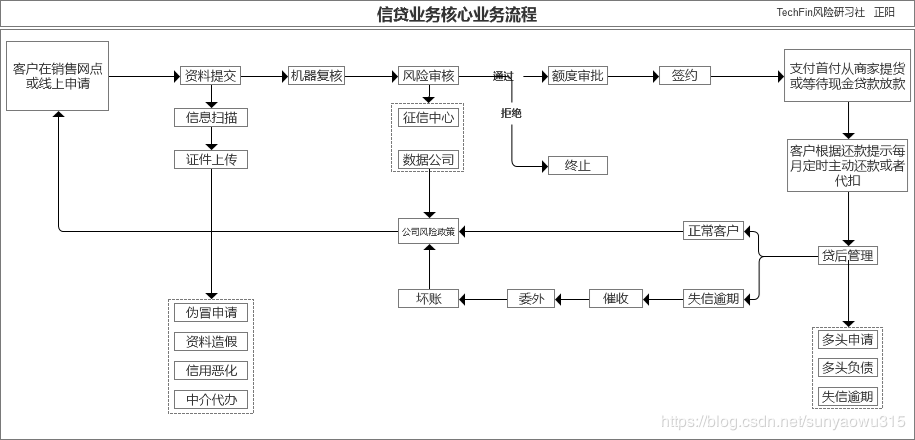

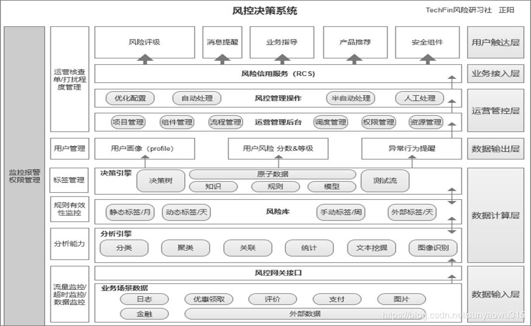

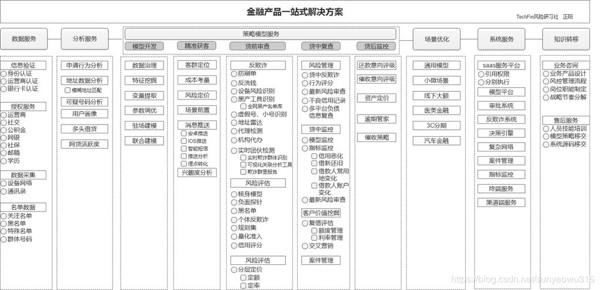

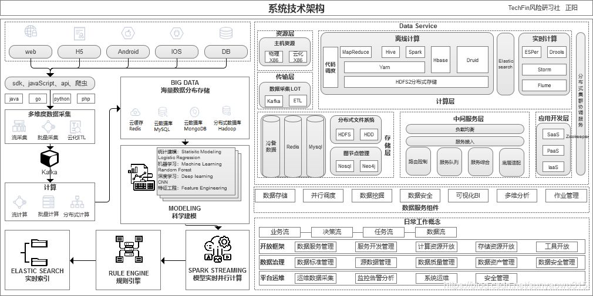

### 风控策略

信贷分析的目的主要评价：还款意愿+还款能力+持续盈利能力。

下探最直接解决风控场景样本不均衡的方法。所谓下探，就是对评分较低被拒绝的人进行放款，牺牲一部分收益，来积累坏样本，供后续模型学习。这也是所有方法中最直接有效的。但是不是每一家公司都愿意承担这部分坏账。

拒绝演绎或者叫拒绝推断，是一种根据已有模型打分，对无标签用户客户进行加权复制的方法。比如一个客户预测出坏账的概率为0.8，则按照4：1的权重分别生成两个样本，带入模型进行训练。用训练过的其他模型对无标签样本打标签，然后模型进行训练。很多公司会用当前模型在上面做预测，然后带入模型继续训练。很不推荐这样做，效果一般是很差的。可以考虑无监督算法或者用很旧的样本做训练然后做预测。

金融业务风险通常包括战略风险、市场风险、信用风险和操作风险。战略风险和市场风险是对公司远景规划，业务发展方向，市场趋势和利率、汇率、价格等经济因素的宏观研判，需要的是战略层面的决策和行动；而信用风险和操作风险，则更多的是具体到特定业务、特定交易的微观层面的风险判断，需要的是战术层面的行动和响应。
通常我们会区分关键业务（如支付、转账）和非关键业务（如注册、登录），对不同类型的业务点采用不同的风控强度方案。那么这意味着具有相同程度的欺诈风险出现时，由于对应的业务类型不同，企业对它的风险评级是不同的，关键业务需要更为严格的风险评级，而非关键业务则可以相对宽松。但是在业务发展的不同时期，这一标准可能又会做出相应的调整，因此在识别出潜在业务风险后，企业还应当有一套完整的风险衡量和评级方案；
风险评级完成后，则是对应的风险规避动作。例如人工审核、电话核实、短信二次验证、人脸识别等等各类操作手段，都是风控系统可以选择的，针对不同的风险等级而选择的相应风险规避动作；
Gartner认为一个完整的线上业务欺诈检测系统，应该分为5个层级，分别是

1. 第一层终端风险识别：以终端为核心，分析交易发起终端（PC，移动设备等）的属性，并且这些分析的前提应当是，欺诈检测系统能够和终端直接发生交互，而不是通过其它中间系统。主要技术手段包括设备指纹、生物检测、木马检测、终端行为与地理位置检测等；
2. 第二层交互行为监测: 以帐户为核心，采集帐户与业务系统之间的交互行为或网络行为，实时采集并分析，学习用户行为模式，通过行为模式的对比，发现欺诈交易；
3. 第三层渠道内行为异常检测: 使用统计模型或规则系统，在单一渠道上针对某一特定用户，进行行为分析和异常检测。在这一层级，同时可能利用内、外部数据，针对高风险交易，共同进行身份验证；
4. 第四层全方位行为异常检测: 以用户为核心，跨渠道、跨产品的，对用户行为进行监控和分析，对高风险异常行为进行预警。例如全方位采集某个用户在信用卡、手机银行、网上银行、ATM机、POS机等各个渠道上的交易行为数据，集中分析，实现全渠道的风控；
5. 第五层 UEBA: 基于大数据的UEBA（User andEntity Behavior Analytics），通过全面的数据采集与数据治理，在不同的属性上对用户或实体之间的关系进行关联分析，发现潜在的欺诈风险；

风险控制的四种基本方法是：风险回避、损失控制、风险转移和风险保留
1、风险回避
风险回避是投资主体有意识地放弃风险行为，完全避免特定的损失风险。简单的风险回避是一种最消极的风险处理办法，因为投资者在放弃风险行为的同时，往往也放弃了潜在的目标收益。
2、损失控制
损失控制不是放弃风险，而是制定计划和采取措施降低损失的可能性或者是减少实际损失。控制的阶段包括事前、事中和事后三个阶段。事前控制的目的主要是为了降低损失的概率，事中和事后的控制主要是为了减少实际发生的损失。
3、风险转移
风险转移，是指通过契约，将让渡人的风险转移给受让人承担的行为。通过风险转移过程有时可大大降低经济主体的风险程度。风险转移的主要形式是合同和保险。
4、风险保留风险保留，即风险承担。也就是说，如果损失发生，经济主体将以当时可利用的任何资金进行支付。风险保留包括无计划自留、有计划自我保险。
金融行业中信贷领域有两种不同的风险，一种是运营风险（Operational Risk）一种是信用风险（Credit Risk）而这两种风险应该说是完全不同的。 信用风险是因为贷款人生活当中的一些不确定性而造成的，信用风险造成的损失是公司无法避免的。欺诈行为则并不能被算作为信用风险，因为借款人在借款的时候就没有任何还款意愿，那就意味着风险收益是0，这是一种运营风险，而且是一种应该尽力减少的运营风险，否则会大量蚕食企业利润，大幅提高损失率。欺诈者没有还款意愿具体体现在First Payment Default上，就是说这些借款人在拿到贷款之后一次款都没有还过，直接到一定时间之后被企业记作了损失。而信用风险的借款人多是在某个时点开始出现款项延迟（payment delinquent）的情况，然后从某个时点开始不在付款。所以一个公司的First Payment Default Rate 应该是可以判断欺诈行为严重程度的重要指标。

风险管理和风险控制。风险管理：是指如何在项目或者企业在一定的风险的环境里，把风险减至最低的管理过程。它的基本程序包括风险识别、风险估测、风险评价、风险控制和风险管理效果评价等环节。风险控制：是指风险管理者采取各种措施和方法,消灭或减少风险事件发生的各种可能性,或者减少风险事件发生时造成的损失。所以其实风险控制是风险管理中的一个环节。风控是风险控制的简称。

一个完备的反欺诈策略体系需要以下几类岗位人员。

策略人员：互联网反欺诈体系需要有大量熟悉互联网欺诈手段和防范方法的反欺诈策略人员。反欺诈策略人员应当实时关注互联网欺诈的动态，及时发现新出现的互联网欺诈手段和手法，并有效的调度和利用既有的资源制定反欺诈的策略，进行防范。

运营人员：由于互联网欺诈行为的多样性和灵活性，欺诈手段会不断的出现变化和创新。反欺诈运营人员应当建立起各类反欺诈运营监控指标体系，通过监控指标的变化，不间断的分析指标变化原因，及时发现穿透反欺诈策略体系的欺诈行为并予以应急响应。此外，运营人员还应该与业务部门、产品部门、营销部门保持高度密切的沟通，做欺诈风险和用户体验的平衡。

调查人员：反欺诈调查人员应当人工对各种已经发生或正在发生的互联网业务请求进行人工的调查、核实。对于在人工调查中发现的漏报欺诈行为，应当及时的止损、追损，如取消订单（互联网电商）、拦截发货（互联网电商）、贷后提前介入（互联网金融）等。

数据挖掘人员：数据挖掘人员主要负责将系统采集的各种形式的数据进行解析和挖掘，输出各种特征，使其能够被应用于反欺诈建模和反欺诈策略工作。该岗位的工作可与公司数据分析、用户画像等部门共享。

数据建模人员：数据建模人员负责利用系统采集到的客户数据和数据挖掘输出的特征，建立欺诈模型，对客户的欺诈概率进行判断。该岗位的工作可与企业内部其他数据建模工作共享。

研发人员：负责各类反欺诈系统的开发和维护、反欺诈策略和模型的实现。

轻管控，重检测，快响应，私以为基本能实现用户体验与风控需要的平衡。

轻管控：在出现风险，需要阻断用户操作时，阻断动作宜轻不宜重。能验证码校验就不短信校验，能短信校验就不禁访。同时被阻断后文案，下一步出口都需要照顾用户感受。看似简单，其实背后涉及到对用户风控行为以及对用户风控阻断动作的分层管理。

重检测：通过尽可能多的获取用户信息（包括静态及动态数据），由规则引擎进行实时或离线计算，来动态分析每个用户及采取行为的风险程度。这里需要尽量全的数据来源，以及非常强大的规则引擎，才可以实现良好的检测效果。

快响应：是指在检测出用户存在的风险后，如何快速的进行阻挡。这里的重点是快，则意味着对业务的理解要细，提前在关键动作进行布局，才可以做到尽可能减少损失。

#### 数据

| 分类         | 特征例子                                                     |
| ------------ | ------------------------------------------------------------ |
| 用户身份信息 | 身份证2要素核验、银行卡3/4要素核验、手机号三要素核验、人像对及活体识别 |
| 手机号码特征 | 手机号前缀是否相同、手机号归属地是否相同、是否是虚拟运营商、流量卡或通话卡 |
| 运营商数据   | 在网状态、在网时长、主叫与次叫次占比、通讯录重合情况、风险号码通过次数过多 |
| 用户注册信息 | 昵称规律、出生日期规律、性别失衡情况、密码设置规律、邮箱规律 |
| 用户行为数据 | 注册、申请等活跃时间是否在半夜、申请时间长度、输入信息时间长度、修改信息频率 |
| 其他三方数据 | 学历信息授权采集、各类黑、灰名单、银行流水授权采集、通讯录授权采集 |
| 设备环境特征 | 设备类：手机品牌和型号是否相同、操作系统是否相同，环境类：`IP`精确地理位置号段是否一样 |
| 消费支出数据 | 线上电商和线下银联消费数据、银行卡收支数据、航旅出行数据。   |
| 社交数据     | 社交信用度评、社交人脉图谱。微信，`QQ`，微博等相关信息。     |

趋势数据在整个风险评估中越来越重要。贷款公司以前只关注借款人在申请借款当下时点的信用表现，比如当下的信用分数为600分。但观察期回溯时间拉长，近半年客户的信用分从500到600分和从700到600分会有很大的不同。

LBS（Location Based Services），指基于用户设备定位信息提供服务。定位信息可以通过GPS、WiFi、基站等获取，简单介绍下这几种方式获取坐标位置的原理：GPS很简单，就是手机通过GPS卫星获取的坐标信息；对于WiFi来说， 每个无线热点都有唯一的MAC地址，而一般无线热点的位置是不变的，服务商会有一个MAC地址-坐标的映射数据库，由于手机在打开WiFi的情况下会自动扫描周围的热点信号，服务商获取这些热点MAC信息后，结合用户与这些热点间的信号衰减程度，利用三角定位，就可以得到该用户的准确位置；基站的原理类似，每个基站都有唯一编号及位置坐标，结合信用强度，也可以得到坐标。
利用LBS坐标数据，结合上报时间等，可以校验用户填写的工作地址、现居地址等信息的可信度，在实际的开发中，要结合客群分布来制定相应策略，另一方面，也可以依此衍生特征，入模考察效果。
首先，可以利用用户连接过的热点MAC地址和基站ID地址，建立用户间的关系，进而构造图数据库，进行欺诈团伙的识别和欺诈风险的评估。这里面有几个问题需要注意下，一是用户设备上报的坐标信息往往是很多的，需要筛选去重，比如可以选择近7天，出现频次前N个的数据，另外，构建关系网络时候，一度关系和二度关系对应的数据库大小也是指数递增，需要根据实际情况有所取舍，对于小型企业来说可能没有那么多精力去做图数据库，可以退而求其次建立一度关系后衍生特征入模使用。
首先最简单的一些基础统计指标特征，比如用户在不同时间段上连接的不同WiFi热点数量、基站数量、进而可以计算方差、KL散度等指标，衡量用户的稳态。
进一步就是基于移动距离类的特征，如用户每日、每周，或不同时间周期上的最大移动距离，

###### 硬信息分析

让不对称信息最大限度对称—解决的是还款能力问题。让软信息最大限度真实还原—解决的是还款意愿问题。让不对称信息最大限度对称：重点是财务信息，解决的是还款能力问题。硬信息主要包括财务报表和信贷记录登，而财务报表包括资产负债表、利润表、现金流表及附录、现金流水等。在授信过程中，硬信息是核心，还款能力主要从稳定性、可持续发展的角度衡量，稳定性是指客户所处的行业状况是否稳定、收入是否稳定、工作是否稳定等等；可持续性是从收入总体处于上升状态，以及收入中应收账款的占比具有下降趋势。信贷记录分析：信贷记录主要来源中人民银行征信报告，这些数据大都来自银行、部分小贷的记录，其次信贷记录来自信贷机构自身业务发展和数据积累的记录。

###### 软信息分析

让软信息最大限度真实还原：主要非财务信息，解决的是还款意愿问题。软信息不能用准确的硬指标来表示，是非正式的、模糊的、推断的、知觉的。客户能正常还款的前提是还款意愿和还款能力都必须合理。还款能力可以通过调查获取的各种财务或财务相关数据进行估算，而还款意愿则需要依据各种软信息来判断借款人还款的意愿和想法。在信贷分析过程中，还款意愿可以通过客户过往需信贷记录来判断，如周围人对客户的评价、客户消费记录。软信息可以分为两类：人口统计信息——客户的基本信息、社交网络和行为信息等动态信息——设备信息，电话等通信相关的人，消费行为、支付行为、点击行为等，软信息必须经得起逻辑验证

##### 选择三方数据

选择第三方数据源重要考察的5大指标计算公式（以黑名单为例）：

1. 查得率=查得数/样本量  Search rate
2. 覆盖率=查得命中黑名单数/样本中命中黑名单量  Cover rate
3. 误拒率=查得命中黑名单数/样本中通过且为Good量  Error reject rate
4. 有效差异率=查得命中黑名单数/样本中通过且Bad量  Effective difference rate
5. 无效差异率=查得命中黑名单数/样本中其他拒绝量   Invalid difference rate

其中`SR、CR、EDR`指标越高越好，`ERR`越低越好，`IDR`与`EDR`结合起来观察，如果`IDR`和`EDR`都较高，反应的一种情况是数据源定义黑名单是广撒网式，黑名单质量相对不够精准。

其中前三个指标是重点考察，如果想更全面的测试第三方数据源，后面两个差异率指标也可以加入考核标准。

#### 贷前策略

首先要专业科普核算征信成本与放款成本需要掌握的6大指标计算公式：

1. 注册申请转化率=申请额度人数/注册人数；
2. 授信通过率=授信通过人数/申请额度人数；
3. 推广费用=注册人数$\times$注册成本（每人）；
4. 放款成本=推广费用/授信通过人数；
5. 审批征信费用=申请额度人数$\times$审批成本（每人）；
6. 征信成本=审批征信费用/授信通过人数；

征信成本、放款成本均与授信通过率高度相关，通过调控征信成本和放款成本，改善风控策略架构，再辅以核算逾期与不良，可以在金融业务中调整资金本金比例，保证资金流动安全。

###### 坏账准备金

在信贷中，准备金是为预期贷款损失准备的，是审慎信用风险管理中非常重要的措施。坏账准备金分为两大类：普通准备金：与具体账户无关，用于各类账户；专项准备金：为预计可能出现的问题而建立的准备金。

首先要专业科普3类基础资产状态追踪指标：`Current`：表示目前处于正常还款未发生逾期的金额/客户；`M1`：表示目前处于逾期一期的金额/客户，逾期天数范围在1-30天；`M2`：表示目前处于逾期二期的金额/客户，逾期天数范围在31-60天；`M6+`：表示目前处于逾期6期以上的金额/客户，逾期天数范围在180天以上；

再次要专业科普迁徙率这个指标的计算公式（以`C-M1`为例）：观察上述案例2017-06、07这两个月份的累积贷款资产，2017-06处于Current状态的资产总额为1003709860.9元，2017-07处于`M1`状态的资产总额为64125384.5元，所以，2017-07月`C-M1`的Roll Rate=64125384.5元/1003709860.9元=6.39%。通过对2017-07月迁徙率中间层数据进行累积加乘，可以计算出2017-07月不同资产状态追踪指标下流转到不良(`M6+`)或核销的概率，最后，对不同资产状态流转到不良(`M6+`)或核销的概率乘以2017-07月不同资产状态的资产金额，即可算出不同资产状态流转到不良(`M6+`)或核销的资产金额。将所有不同资产状态流转到不良(`M6+`)或核销的资产金额求和，即可测算出2018-08月应该预留的坏账准备金

##### 基础认证

基础认证模块主要作用是验证借款此人是本人，也是以风控规则形式出现，规则大多为公允共认的规则。比如身份证信息验证，人脸信息验证、银行卡四要素验证、运营商三要素验证等。

##### 准入规则

风控准入策略作为金融借贷机构评估一个借款人是否有机会获得授信的第一道门槛，是借款人与贷款人之间平等合理的发生金融供需关系的基石，也是保卫金融机构的第一道护卫。

风控准入策略属于贷前风控策略体系的一部分，贷前风控策略包括基础认证、准入策略，贷前反欺诈策略，黑名单策略，特殊名单策略及信用风险策略。风控准入策略中的规则更多是由产品政策性规则构成。

 风控准入策略的规则属性全部为强拒绝规则，借款人一旦不满足一条准入规则金融贷款机构都不会给予贷款的授信与发放；同时，风控准入规则不需要经过复杂的规则衍生，通常可以简单有效的判决借款人是否有资格进入之后的风控流程；最后，风控准入规则的策略理念是验证借款人依法合规未被政策限制。 准入策略主要分为年龄准入、地区准入、行业准入及其他。这些准入规则的根本设定原则是基于监管和金融机构产品政策性导向。

准入策略优化的目标有二：一是要尽可能多的规避触及底线的风险；二是降低风控成本。为了实现目标一，我们要及时关注本行业政府监管政策动态，实时更新相应的规则，切实有效防范合规风险。为了实现目标二，我们需要掌握风控成本的构成。直接成本包括三方数据使用成本、复杂规则计算造成的算力成本、时间成本、数据存储成本；间接成本主要是风控通过率影响下的单位获客成本。我们在前文中提到过制定规则、规则排序的原则：自有规则优于外部规则、强规则优于弱规则、前置规则优于后置规则

##### 反欺诈规则

欺诈一般分两类，即申请欺诈和交易欺诈。欺诈类型：身份冒用、恶意骗贷、资料造假、用途篡改。常见的欺诈手段：账号盗用欺诈、伪造虚假交易欺诈、网购营销欺诈、手机银行欺诈、供应链金融式欺诈、网络借贷欺诈、获取方式欺诈、技术欺诈等。

欺诈者没有还款意愿具体体现在`First Payment Default`上，就是说这些借款人在拿到贷款之后一次款都没有还过，直接到一定时间之后被企业记作了损失。而信用风险的借款人多是在某个时点开始出现款项延迟的情况，然后从某个时点开始不在付款。黑名单用户、首单逾期用户、策略拒绝用户、人工标记用户。由于黑样本的缺乏，有效确认难度大、调研成本高，所以导致欺诈模型目标变量的定义很有限或者无法充分验证。在建立反欺诈模型的时候，资产质量分析中的逾期变黑趋势就成为一种定义目标变量的新方法。逻辑很简单，坏人一直都是坏人，好人可能变成坏人，一部分好人是隐藏的坏人。通过资产质量逾期变黑的回溯，从逾期客户里挑选出一部分隐藏的欺诈分子，用于扩充整个黑样本空间，实现欺诈模型的识别广度。

###### 反欺诈体系

贷前欺诈识别框架：在信贷申请环节中的反欺诈策略框架重点可以从客户身份安全检查、银行卡校验、运营商校验、黑名单以及关系图谱进行策略的提取、测试和框架搭建；贷中欺诈监控框架：在贷中反欺诈环节，重点可以放在集中度监控和异常交易监控两大维度去构建贷中欺诈监控框架；贷后欺诈监控框架：在贷后反欺诈环节，重点在逾期失联客户的排查、失联信息修复以及欺诈发生管控办法去构建贷后欺诈框架。

###### 反欺诈方法

- 验证借款人身份：验证借款人身份的五因素认证是姓名、手机号、身份证号、银行卡号、家庭地址。

- 提交的信息来识别欺诈：线上申请时，申请人会按照贷款公司的要求填写多维度信息例如户籍地址，居住地址，工作单位，单位电话，单位名称等。如果是欺诈用户，其填写的信息往往会出现一些规律，企业可根据异常填写记录来识别欺诈。

- 勾稽规则：通过对比进行校验，你自己填写的收入、工作、住址、借款目的等等都会和平台能够抓取到的数据进行对比，有硬性的对比，比如学历、性别、年龄等。也有模糊对比如收入等级、居住地址和单位地址等。通常为了防止申请人填写错误导致的误杀，勾稽规则这一块采取命中后给于风险分值，分值累加后计算是否超过阀值的方式处理，达到一定阀值人工干涉、达到更高的阀值自动拒绝。通常这些分值也会和多头产生的疑似欺诈分值进行累积。

- 逻辑规则：信贷审核中有一句话叫做反常即为妖。比如你填写自己为朝九晚五公务员，但是收集到的你的运营商数据显示你的通过话时间集中在工作日的凌晨1点-4点。

- 申请行为来识别欺诈：欺诈用户往往事先准备好用户基本信息，在申请过程中，快速进行填写，批量作业，在多家网站进行申请，通过提高申请量来获得更多的贷款。企业可以借助于SDK或JS来采集申请人在各个环节的行为，计算客户阅读条款的时间，填写信息的时间，申请贷款的时间等，如果这些申请时间大大小于正常客户申请时间，可以给一个欺诈评分。

- 黑名单和灰名单识别风险：灰名单是逾期但是还没有达到违约的客户，逾期少于3个月的客户，灰名单也还意味着多头借贷，申请人在多个贷款平台进行借贷。总借款数目远远超过其还款能力。

- 移动设备数据识别欺诈：公司可以利用移动设备的位置信息来验证客户提交的工作地和生活地是否真实，另外来可以根据设备安装的应用活跃来识别多头借贷风险。

- 消费记录来进行评分：评估贷款人的还款能力。过去传统金融依据借款人的收入来判断其还款能力。常用的消费记录由银行卡消费、电商购物、公共事业费记录、大宗商品消费等。互联网金融的主要客户是普通人，其电商消费记录、旅游消费记录、以及加油消费记录都可以作为评估其信用的依据。

- 参考社会关系来评估信用情况：参考借款人常联系的朋友信用评分可以评价借款人的信用情况，一般会采用经常打电话的朋友作为样本，评估经常联系的几个人的信用评分，去掉一个最高分，去掉一个最低分，取其中的平均值来判断借款人的信用。

- 参考借款人社会属性和行为来评估信用、利用司法信息评估风险、用户画像：系统的梳理用户群体，尽可能的找到异同点并将用户分类。

- 欺诈网络图谱：羊毛党经常通过网络发起组织，在一些单点特征上，同正常用户一样呈现出分散的特点，使得单点特征防御难以奏效。但如果将用户行为用网络的形式建模展示，会发现在一些特殊的图形特征上，欺诈行为明显异于正常行为。

###### 欺诈行内黑话

##### 风险定价策略

###### 征信成本与放款成本

风险定价是围绕着以下几条公式来实现利润的最大化分配：利润=销售收入-成本、销售收入=利率$\times$在贷余额、成本=风险成本+其他成本、风险成本=违约概率$\times$风险敞口$\times$贷款违约损失

利率差异化：成本法：发放贷款的成本+由于贷款可能发生违约甚至损失而承担风险，而必须得到的风险补偿+通过发放贷款所预计实现的利润水平。这种风险适合历史数据积累较少的创新业务；利率基准加成法：选择某种基准利率为“基价”，为具有不同信用等级或风险程度的顾客确定不同水平的利差一般方式是在基准利率基础上“加点”，或乘上一个系数。这种方法适合成熟的市场，能获得有效的信用等级和基准利率参考。

额度差异化：针对不同用户的风险情况，给予差异化的额度，能够有效地控制风险敞口并且拉开各级用户间的授信差，从而最大化提升优质用户的价值及降低次级用户的风险损失。

还款期限差异化：另外一种定价差异化的方式为还款期限差异化。因为从概率论而言，风险概率越高的个体，风险敞口的暴露时间越长，则违约的概率就越高。所以从实际应用出发，符合放款标准但风险相对较高的用户往往能够获得的单笔贷款期限也越短。

还款方式差异化：还款方式差异化决定了贷款的本金暴露情况，所以也会根据用户的风险进行变化。一般来说，先息后本的产品往往被认为是风险最高的还款方式。一般还款方式包含以下几类：

**等额本息**：将收益和本息加起来后平均到每个月，每月偿还同等数额的资金(包括本息)，其实际利息与名义利息相一致。这种还款方式本金的归还速度相对较慢，占用资金时间较长，还款总利息较相同期限的等额本金高。**等额本金**：在还款期内把贷款数总额等分，每期还款的本金相同，每期还款的利息是截至上期剩余本金乘以每期利率，所以前期要归还的利息较多，每期还款金额较多，压力较大，但随着剩余本金越来越少，每期的利息也会越来越小，所以后期每期还款金额越来越少，其实际利息与名义利息相一致。**等本等息**：一般用于信用卡账单分期或者现金分期，或者小贷公司计算利息。等本等息每期还款的本金相同，同时每期还的利息也是相同的，都是用总贷款金额乘以每期贷款利率，所以最终的还款总利息远远高于等额本息和等额本金。**先息后本**：是指借款人在贷款到期日一次性归还贷款本金，利息按月归还。这种还款方式，一般适用多月的中短期借款项目。**一次还本付息**：一般用于银行存款，就是取钱的一次性结算本金和利息。在民间借贷中也时常使用，一次借款，到期时同时归还本金和利息。

###### 评分卡模型概率校准

用一个好坏比失真的样本建立好评分卡模型后，如果想要计算每个分数段的坏样本率，得出来的结果是会大于真实情况的。原因很简单，逻辑回归中的截距是约等于好坏比的对数的。如果样本的坏样本占比比实际情况要高，那么模型预测出来的每个样本的违约概率都会偏大。那么想要还原每个客户真实的违约概率，就需要进行一个概率校准。校准的方式也非常简单。首先我们需要一个目标好坏比`odds1`，它可以是进行过抽样/欠抽样前产品真实的好坏比，也可以是行业平均水平。如果建模样本的实际好坏比是`odds`的话，那么我们只需要在逻辑回归拟合出来的截距上再加一个`ln(odds1/odds)`即可。

然而这只是每个客户违约概率的校准，即使是校准后，如果计算每个分数段的好坏比，依然会被打回原形。这是因为这个过程虽然校准了每个客户违约概率的值，但是并不会改变评分模型的排序顺序。因此对计算出来的好坏比，也要有一个校准的过程：对好坏比进行一个sigmoid的反函数，加上`ln(odds1/odds)`，再用sigmoid函数运算回来，这样得出的好坏比就是接近真实情况的好坏比了。

$A=ln(odds)$  $B=A+ln(odds1/odds)=A-1.6946$   $C=1/(1+exp(-B))$

#### 贷中策略

##### 贷中监控

######  反欺诈监控体系 

业务层监控

变量异常监控：数据获取是金融机构设计风险策略、开发模型的基础，对于核心变量异常监控可以有效的防止因核心数据缺失而造成的风险规则、模型无法迭代上线，甚至影响业务发展。变量异常监控可以从三个主要维度进行监控设计：变量缺失率、爬取成功率、变量分布。
交叉验证异常监控：从数据验真的角度，我们需要在反欺诈监控体系中设计交叉验证这一环节。比如归属地、地址所在城市交叉验证、单位信息交叉验证，以便我们可以利用最真的数据进行策略分析及建模。交叉验证不仅是客户信息的验真，还可以是多维度集中度的异常监控。
各环节流量异常监控：参照用户一次借贷的行为轨迹，大致分为登录-注册-填信息-提现四个环节。通过监控每个环节的流量，可以分析出转化率、批核率等风险指标。当某时期风险指标波动超过正常范围时，可以进行异常情形特殊处理，避免风险集中爆发。
高风险规则监控：高风险规则包括拒绝规则、人工规则、豁免客户规则等，对于高风险规则的监控，主要从命中占比变化角度进行监控。

系统层监控

系统层的反欺诈监控体系主要涉及数据源调用和变量准确性监控。数据源调用可以监控短时间内调用失败数量等，生成数据源调用日报表。变量准确性监控从新增变量、已有变量两个角度进行准确性、稳定性的监控。

###### 监控风险指标

风险维度：放款逾期率=逾期余额/放款金额、余额逾期率=逾期余额/总计余额、人头逾期率=逾期人数/总人数

收益维度

- 留存率：人头留存率：例如结清用户未来90天内新开借据人数占总结清人数的占比。余额留存率：例如结清用户未来MOB余额留存占初始余额的比例

- 提现率：对于获得授信的客户，额度提现使用的客户占比与金融机构未来收益相关。对于获得授信的客户，如果额度长期未提现使用，金融机构在贷中管理中可能会采取降额或冻额处理。
- 额度使用率：在贷中管理环节，授信客户对于自己信用额度的使用率不仅可以作为额度调整的参考维度，还可以作为老客户交叉营销的重要依据，又或是建立贷中行为评分模型时，历史额度使用率也是常构建的指标之一。
- 复借率：复借率指标使用场景主要是循环贷产品，表现是客户在完成往期的借款后立刻有借出新贷款，这种情况往往与借旧还新现象挂钩。当某客户长期历史借贷复借率较高时，从策略角度建议分析其多头借贷数、评估当下还款能力，判断是否会在下一笔借贷时发生违约逾期的风险。

##### 风险管理策略

##### 额度管理策略

###### 现行额度管理分析

在进行授信额度调整之前，我们首先需要根据已有数据计算出目前风险等级划分下的不同人均授信额度、风险损失以及损失比例。 根据敞口总额和客户数量，可以计算出人均授信额度；根据实际违约概率和敞口总额，可以计算出风险损失，进一步可以计算出全局损失比例。 

######  额度违约加成系数(违约概率罚项）

因为额度的调整与违约概率相关，违约概率又与最终的损益相关，所以在进行额度调整之前，我们需要先设计好额度违约加成系数，即违约概率罚项。罚项的参数由人均授信、调整后的人均授信以及$\lambda$组成，构成公式如下：
罚项=$\exp^{\max(\ln(\text{调整后人均授信/人均授信}),0)*\lambda}$。$\lambda$可以通过数学最优解迭代求得，也可以经验赋予一个系数如0.4。

###### 测算额度调整后的预估风险损失比例

通过对不同风险等级的客群人均授信额度的调整，可以影响罚项系数的变化，最终影响不同风险等级下客群的风险损失。假设我们对最好的客群Risk Level A人均授信额度进行升额，从原人均授信额度36176调整为50000元，得出如下分析结

###### 用户授信额度管理策略及模型

授信额度是指金融机构能够为借款人提供的最大贷款金额。贷款额度一般是指借款人在金融机构给予的最大贷款金额范围内，实际借贷的金额。授信额度和贷款额度的主要区别是授信额度属于意向额度，而贷款额度是实际取现额度，授信额度会始终大于等于贷款额度。只有借款人的授信额度增加，他的贷款额度才可以增加，否则最大的贷款额度就是授信额度。

用户贷款周期额度管理依托借款人的贷款生命周期，大致分为产品初始额度、授信初始额度、额度适应性调整、终止额度。

产品初始额度：对于没有任何客户信息的情况下，一般对于不同信贷产品都会与之对应一个初始额度范围，比如农机贷的授信额度范围上线30万。产品初始额度的设定一般是金融公司政策性决定。

授信初始额度：对于一个新增借款申请人，金融机构会根据一些授信考核指标生成授信初始额度矩阵，综合给定一个初始授信额度。额度矩阵理解起来也很简单，就是选取合适的指标区分客群来授予额度。一般金融机构授信考量的指标类别有：风险型指标、还款能力型指标、竞争风险型指标，其中竞争风险型指标是指同业之间因为额度竞争导致客户流失的风险。在设计授信初始额度矩阵的时候，通常可以分为以下三步：确定客群额度范围：通过分析产品想要针对的客群，从而找到一个适当的额度范围；确定额度授予考核指标：选择一个或多个授信考核指标；组合额度矩阵。

额度适应性调整：在客户开始使用授信额度之后，金融机构开始获得贷中客户行为数据，相应的行为评分分数随即产生，进而可以对授信额度进行适度性调整，比如升额、降额等。行为分数用来描述现有借款人在未来一个特定时间内的违约概率。与申请分数类似，行为分数测量了违约概率，但不同的是，它不要求立即对借款人做出某种决定，尤其是对于非循环信用客户。如果借款人的行为分数降低，但他仍能按照条款继续还款，那么银行或金融机构也不能取消已放出的贷款。但如果该借款人想进一步贷更多的款或申请提额，银行就有机会利用行为分数来决定下一个申请的结果。

在客户不断使用授信额度的过程中，根据风险回报矩阵和风险回报矩阵里的最优额度模型，进行科学的客户授信动态管理，是整个用户贷款周期额度管理里最重要的一部分。

风险回报矩阵：风险的量化指标可以是行为分数，回报的量化指标可以是现金账户的平均余额。 风险回报矩阵可以设计如下： 

行为分数越高（违约风险越低），透支就可以越多；同样平均余额越大，潜在利润也越大，透支也就可以越多。风险回报矩阵和授信初始额度矩阵一样，风险和回报的划分都比较主观，分割点有时也比较随意，为了提现“损失最小收益最大化”，就需要运用风险回报矩阵里的最优额度模型。

最优额度模型：我们可以用模型来决定对风险回报矩阵里每个单元代表的某类借款人采取怎样的调额策略，同时也能满足整体贷款组合的要求。最优额度模型的目标值是选择最优授信额度使得贷款组合期望利润最大。

#### 贷后策略

`FPDx`：首期逾期，x对应天数

`CPDx`：客户逾期天数，与`DPD`相似。x对应天数

`RPC`：Right Public Contact，指有效的联系人，通过电话催收可以找到客户本人或直属亲属。

`PTP`：Promise To Pay，通过电话催收，客户承诺在一定期限内归还一定数额的欠款，称之为承诺还款。

`In_PTP`：通过电话催收，客户承诺在一定期限内归还一定数额的欠款。

`V_PTP`：有效`PTP`，即客户承诺还款后，处于在P期内有效未还款的客户。 

`KP`：Kept Promise, 客户按照约定还款。

`BP`：Broken Promise，承诺到期内，客户未按约定还款。

回款效率：平均一通有效电话（接通并确认客户本人）的回款金额。

施压频率：平均一通有效电话的施压话术的使用次数（包括警示语）。

##### 失联信息修复

##### 催收策略

###### 贷后评分模型

`M1`阶段三种细分应用催收评分模型：`C-M1`模型、`CPD1-10`模型及失联预测模型。

`C-M1`模型

`C-M1`模型开发的目的在于预测还款日前5天的客户是否会发生逾期，即CPD=1。对于贷后催收策略设计，主要用于`Pre`催收，降低违约风险提升还款率。常用的入模变量有： 

一般`C-M1`模型的KS要求在0.5以上，`AUC`在80%以上。通过对评分模型分数进行风险等级划分，根据风险等级制定不同的催收策略，比如`IVR`催收、短信提醒等。

`CPD1-10`模型

`CPD1-10`模型开发的目的在于预测处于`CPD1`阶段的客户在10天内是否会还款，即预测CPD=1的客户CPD>=10的概率。对于贷后催收策略设计，主要用于`M1`阶段精细化催收策略，如`IVR`、预测式外呼、预览式外呼。常用的入模变量有：

其中，`TPC`表示借款客户提供的联系人信息是否为第三方信息，`BDR=Deat Burden Ratio`，代表债务负担比率。一般`CPD1-10`模型的KS要求在0.45以上，`AUC`在0.75以上。当客户处于CPD=1的状态时，就触发运行`CPD1-10`模型。

失联预测模型

失联预测模型开发的目的在于预测在CPD=10的客户，未来5天后是否会失联。即在`CPD10`的客户预测在`CPD16`时是否会失联。对于贷后催收策略设计，主要用于失联信息修复和提前委外催收，常用的入模变量有：

 一般失联预测模型的KS要求在`0.5`以上，`AUC`在0.8以上。对失联预测模型高风险的客群，催收策略可以采用一旦超过`CPD16`之后就进入委外催收流程。 

##### 贷后信息整理

#### 其他

授信通过率(AR)、违约率(DR)、授信敞口(`EAD`)、授信转化率。 

`AR`= SUM(贷款申请通过账户)/SUM(申请账户)

DR=SUM(发生违约账户)/SUM(使用授信账户)

`EAD`=`SUM(C0+M1+M2+...+M6+)`

授信转化率=SUM(使用授信账户)/SUM(申请账户)

`FSTQPD`指标是一系列指标的综合命名，对其可以拆解为`FPD、SPD、TPD、QPD`。其中，`FPD=First Payment Deliquency，SPD=Second Payment Deliquency，TPD=Third Payment Deliquency，QPD=Quarter Payment Deliquency`。再之后就使用数字表示，如`5PD、7PD`。

`FSTQPD`指标重点关注“首逾”，即客户首次逾期发生在第几期。一般指标后加上具体数字，具体数字代表逾期天数。举个例子，`FPD`表示贷款公司放款后到第一个还款日客户开始发生首次逾期；`SPD`表示客户在第一期的还款日还款或提前还款，但在第二期的还款日首次发生逾期。`FPD30`表示客户首次逾期30天发生在第一期，或客户第一期首次逾期30天。在数据仓库里一般用0和1标记`FSTQPD`，比如`SPD10=0`表示客户没有在第二期首次逾期10天；`TPD10=1`表示客户在第三期首次逾期10天。

##### 模型与策略

目前策略规则与模型在风控决策体系里的应用架构。目前我所见到有两种主流的风控决策应用架构：策略规则+评分模型 & 策略规则+模型规则。前者策略规则和评分模型是分开的，一般风控流程是先进行策略规则的风险判断，再进入评分模型的风险识别；后者是将评分模型的预测概率或分数转变为一个策略规则，与其他策略规则融合在一起进行风险决策。

模型无法取代策略的原因

1. 在中国因为征信体系的不完善，金融机构的模型一般以实际贷款人作为模型数据集，而申请人母集到贷款人子集往往发生较大变化，模型的判断就会出现一些偏差，此时需要根据策略维度的一些拒绝线，对模型进行一些矫正和保护。
2. 模型是基于历史数据找到数据之间的逻辑规律后，对未来事件进行预测。对于具有周期性的金融行业，如果用处于上升期的数据模型预测金融衰退期的事件，必然会与实际情况发生偏差。
3. 模型为了权衡观察期的代表性和表现期的时效性，在建模时为了囊括最近的贷款数据，在界定“坏账”定义时，仅考虑前12个月的还款表现，有时仅考虑前6个月，此时对于一些中额长期的信贷产品，模型目标变量的界定与实际商业目标就发生了偏差。

##### 审批通过率突然下降应该如何应对

1. 寻找通过率下降的时间点或时间段：在风控策略稳定之后，审批通过率一般稳定在某一小范围内波动，当监控每日通过率指标时发现，T-1、T-2时点的通过率明显下降，我们应该先通过监控报表迅速定位到具体时间点或时间段。
2. 判断策略节点主次要拒绝影响：先聚焦到策略节点。假设两个策略节点A和B。以波动开始日作为时间节点划分，对比数据分析，寻找拒绝率的波动差。按照波动差确定通过率的下降主要因为A节点的拒绝率上升引起，从而将通过率下降的影响因素从策略A和B两个节点问题进一步聚焦到A节点上。
3. 从节点聚焦到节点规则层深度分析：完成节点的聚焦分析，定位到引起通过率下降的主要原因节点A，接下来需要进一步分析节点A内包含的所有规则拒绝情况。与节点聚焦分析一致，寻找引起拒绝率上升的主次要拒绝规则。在规则层确定主次要影响因子时，分析方法不仅结合数据同时也参考业务场景。
4. 具体规则分布分析：从步骤3确定出年龄准入拒绝是第一位引起通过率下降的规则后，第四步就从规则层聚焦到具体策略规则的分布上。
5. 分析指导决策：实际业务场景中，并不会因为此时通过率突降就进行策略规则的调整，更多的是通过聚焦分析后，结果进一步细分两个参照要素：进件渠道的进件量分布和最大进件渠道的年龄准入拒绝分布。
             1. 进件渠道分布分析：既然是客群的变化引起了整体审批通过率的下降，从进件的所有渠道数据中进行分布排序，定位到渠道进件量A段和B段都最大的一个进件渠道C。
             2. 最大进件渠道的年龄准入拒绝分布：通过进件渠道进件量分析，从众多进件渠道中定位到最大进件渠道C。此时分析主要拒绝规则-年龄准入拒绝的渠道C的分布情况，是否满足条件：B段与A段年龄18-25岁的波动变高。
             3. 决策建议：将策略分析结果应用于前段业务指导和决策，提醒前端业务人员在渠道C可以适当缩紧18-25岁客群的进件需求，以此共同维护金融公司整体风控通过率

##### 找到审批策略规则的黄金分割拒绝线

风控审批策略：基于数据分析在申请阶段制定各式各样多维度的策略和规则;
目的：在贷前审批减少风险事件的发生的各种可能性，挽回风险事件时造成的损失。较大的程度上筛选过滤高风险客户，保留低风险客户予以营销。针对客群分级实行个性化的审批流程，提高审批效率。作用：在保证业务量的同时降低业务坏账率、控制逾期风险，最终实现公司盈利。

假设我们已经对评分模型分数分为`T1-T5`组，`T1`风险最低`T5`风险最大。年龄规则也使用单变量树模型初步分为5组区间。我们希望结合评分分数找到年龄规则这个核心策略维度的合理拒绝线。

###### 通过评分找到风险被低估的区间

在本例中，首先将年龄与评分卡进行交叉矩阵分析，观测不同交叉区间里的用户违约概率。

一般策略规则多数组之间的趋势线是紧密相近的。从图示数据走线可以发现，年龄组[35,47)和[47,53)这两个年龄组的违约概率走线脱离了其他分组，尤其是年龄组[35,47)，其走线脱离其他“群体”过多。通过分析初步定位年龄组[35,47)和[47,53)可以是待确定的规则拒绝线。

###### 评估拟拒绝人群的收益/风险比

虽然经过评分与年龄的交叉对比，发现年龄规则的两个待确定高风险拒绝区间。但是实际拒绝线的划分要结合年龄分组区间人群的实际收益与风险进一步考虑。如果高风险的人群可以带来高收益，对于策略来讲也是可以接受的。

 

将年龄分组区间按照上图示例2横轴所示指标进行统计， 假设年龄分组[35,47)的收益/风险大于[47,53)且为正，即表明虽然[35,47)年龄分组的人群违约率最高，但其收益同样也是最大。反而[47,53)年龄区间的人群为公司带来负收益。本着收益覆盖风险的商业理念，此时对于年龄这一维度的策略最佳拒绝线，应该划分在[47,53)这一分组区间。

##### 多头借贷数据在风控中如何分析及应用

 多头借贷是指单个借款人向2家或2家以上的金融机构提出借贷需求的行为。多头借贷数据一般至少会粗分成银行类多头借贷、非银类多头借贷。按时间跨度可以分为近7天、近15天、近1个月、近3个月、近6个月、近12个月。  多头借贷除了会统计申请次数，还会统计申请机构数、申请最大间隔天数、申请最小间隔天数、申请记录月份、平均每月申请次数(有申请月份平均)、最大月申请次数、最小月申请次数等。 

多头借贷少出现在模型变量中，主要有两个方面原因。

1. 多头借贷数据往往被策略同事应用于规则中。数据建模的目的是从金融弱变量中通过特征工程方法，提炼出有效区分变量，构建评分模型。所以对于多头借贷数据，既然已经运用在策略规则中，实在没必要加入到模型变量。如果读者朋友们看到提交的评分模型报告中有多头借贷变量，那么建模的同事要么没有事先了解已上线运行的策略规则集，要么就是为了模型表现指标好看强行使用。

2. 多头借贷数据往往覆盖度不全。多头借贷虽然是一个与风险强关联的维度，但其查得率一直被人所诟病。
   举一个例子，借款人一个月内在多家机构贷款，作为一个特征，很有可能出现某个人虽然频繁贷款，但并没有被多头供应商捕捉到。一旦这个特征作为模型变量，那么这个变量的噪声就很大了。反而如果做成反欺诈策略，就不需要担心噪声问题，直接选取拒绝线进行截断，最大的影响，也就是没有拒绝掉足够多的用户，而这个影响我们还可以用噪声较小的模型进行弥补。

##### 稳定性指标在风控中的应用

###### PSI在风控模型中的应用

PSI在模型中的应用主要体现在两个方面，一个是单变量的PSI，一个是模型分数的PSI。

一次模型的迭代更新，在部署时往往会耗费大量的时间。为了避免经常性迭代模型，在建模的时候就必须保证模型的稳定性。因此在建模过程中，常常会按时间段切分样本并计算各个变量的PSI，以筛除那些随时间推移波动特别大的变量。除此之外，在对模型进行监控时，对稳定性的监控也是必不可少的，需要及时监控是否有客群发生偏移的情况，找到发生偏移的原因并确定是否需要调整模型或者策略。首先需要监控的是不同时间区间内模型分数的稳定性，如果发现模型总分的PSI较高，则需要通过计算每个入模变量的PSI来寻找原因，发现是哪一个变量导致的分数不稳定后，则需要根据这个变量的特征来调整策略，或如果认为这种波动性会持续下去的话，需要考虑是否将这个变量剔除在模型之外。

###### PSI在风控策略中的应用

PSI作为稳定性度量指标，不仅可以运用于模型中，仍然可以风控策略中发挥作用。在策略A类和D类调优中，我们往往通过观测不同时间节点或时间跨度内规则节点的波动差，来确定主要引起通过率下降和逾期率上升的一个或多个核心规则，进一步确认策略调优阈值方案。波动差与之对应的即是稳定度，波动越大，PSI越大，表示规则影响风险往不稳定方向发生。在之前的“审批通过率突然下降应该如何应对”章节中有解释运用PSI判断节点主次要拒绝影响。

##### 黑名单

 目前金融机构风控部采用的风控策略是黑名单全部拒绝，但是，对于不同业务属性的机构，黑名单的风控策略也不是绝对的。  但对于导流助贷性质的金融科技机构，业务最核心的问题是流量和客户质量，如果全部拒绝黑名单客群，其所付出的成本巨大。因此导流助贷机构可能会选择性放入一部分客群，结合客户评分，多头等数据综合判断，或者随机放过。 

 黑名单测试：金融机构一般在全部拒绝黑名单前，会随机放过5%或者10%的触碰黑名单的客户，去测试黑名单数据有“多黑”，测试该黑名单客群是否适用于该机构。

##### 风控白名单

经常使用的白名单有以下两种业务场景：

1. 在存在自有存量数据的前提下，金融机构想开展信贷业务，前期需要通过白名单控制入口，此类场景多存在于业务初期，或者是内部员工贷的业务场景。
2. 在业务开展中期，需要部分进件客户走特殊贷前审批流程，满足特殊审批的要求，此类场景多存在于较大的金融公司。
   如何筛选出白名单

###### 筛选白名单的策略。

1. 联合建模：金融机构在有存量数据的前提下，自有数据是不缺乏X特征变量，主要缺乏相应业务场景有表现特征的目标Y变量。在这个时候可以通过引进一些外部机构进行联合建模，用以补充一些Y变量。

2. 内部数据探索：我们在筛选白名单的时候，除了通过联合建模弥补相应业务场景下目标变量的缺失，还可以通过内部数据探索，寻找分析一些对逾期违约表现相关性较强的一些特征规则，逐渐设定出白名单规则。这里面分为两种规则设定方式。第一种是寻找与新开展业务相似模式和场景的已有产品，参照已有产品的风控策略规则对新业务场景数据进行比对分析，参照已有产品的策略规则制定出新业务场景的风控白名单规则。另外一种方式是在更“艰苦”的环境下，没有任何可对比参照的已有产品，这个时候设定的白名单规则相对更严谨，同时对风控策略工作者的业务经验要求更高，可以认为是一种专家经验规则。

3. 引入外部数据匹配：在进行内部数据探索的同时，我们也可以通过引入一些外部数据如工作单位、学历、社保缴费单位、公积金缴费单位、缴费基数等一些对好坏客群区分能力较强的数据，通过内部数据与外部数据的变量结合，共同设定出白名单策略规则，筛选出优质客群。

###### 白名单的作用

1. 控制放量节奏：从业务发展角度来看，其实白名单只是一个过渡，存量数据一定会有用完的一天，风险管理最终的目标还是开放所有人群进行信贷业务的申请，所以在金融机构新业务开展初期，白名单的作用更多的是可以控制放量的节奏，便于整体调控。

2. 降低风险：即然白名单是我们认为的优质借贷“VIP”，在新业务开展初期对他们进行放款产生违约的风险一定比其他客群的风险更低。

3. 提高审批通过率：对白名单客群，我们的风控规则相对较松，自然在放款初期风险相对可控的前提下，我们有相对较高的审批通过率。在一定意义上，也有利于前期业务的积累，从整个信贷管理周期来讲，也可以认为是一种风控战略。

4. 可协助调整贷前策略：风控白名单的筛选也是由一系列的贷前策略规则组成。在之后的风控策略与模型搭建过程中，通过基于白名单规则的衍生、白名单中逾期客户的策略回顾，也可以协助风控策略人员调整贷前策略。

**主动式设备指纹识别技术**：顾名思义，主动式设备指纹识别技术需要主动的得到设备的配合获取相应的信息，最直接的主动方法就是直接在设备上植入程序。主动式设备指纹所取特征均暴露于客户端，欺诈者可轻易通过一些一键新机等工具篡改相应特征信息，从而使指纹无效。

**被动式设备指纹识别技术**：每个设备厂家在设计网络操作系统时，为了体现竞争优势，往往在服务与协议的具体实现上有所不同，同时也会区分不同的版本和兼容性信息，这使得基于协议分析的指纹识别成为可行。被动式主要通过在服务器端收集通信协议和网络的特征来识别设备。

**混合式设备指纹技术**：混合式设备指纹技术指将主动式和被动式设备指纹技术整合在同一个设备识别与跟踪的架构中，将主动式设备指纹技术在客户端生成的设备标识符，与被动式设备指纹技术在服务器端收集的、协议栈相关的特征信息对应起来，使得所有的设备都有一个唯一的设备识别ID。

策略是规则引擎定义的模型对应一组规则，每个规则都对应一组指标。策略、规则和指标关系如下图所示

###### 流量

注册用户：实际用户完成注册全部流程的用户设置不足30%，同时我们不能保证这部分客群是正常客户，其中也有羊毛党，欺诈用户，黑产业链等，这一部分占比数量也不少，也就是说，注册客户当中，正常的且完成绑卡用户也就是25%。

授信用户：在整个审批决策中，通过率很难超过50%，一般头部公司的通过率设置也就超不过20%。

借款用户：往大了说，客户的平均转化率也就三分之一。

消费金融公司指的是经过银保监会批准，在中国境内设立的，不吸收公众存款，以小额、分散为原则，为中国境内居民个人提供以消费为目的的贷款的“非银行金融机构”。
P2P网络借贷是个人与个人间通过互联网平台实现的借贷交易，不过P2P平台并不会直接参与到借贷交易当中，只是为借贷双方提供信息搜集、资信评估、信息披露、撮合借贷等服务。
小额贷：由自然人、企业法人与其他社会组织投资设立，不吸收公众存款，经营小额贷款业务的有限责任公司或股份有限公司。

###### 逾期

从上图可以发现，对于4月19日的账单，当超过正常还款期限后，即5月8日的最后还款日未还款，信用卡中心开始记录此笔账单发生逾期。此处有4个提醒注意点：账单日记录汇总上月账单日后的第一天到当月账单日的所有消费金额；出账单后即可对已出账单进行还款，在最后还款日之前还清账单金额均算正常还款；过了最后还款日仍未还款，则为逾期；一个客户只有一个账单日；

逾期在金融信贷业务细分中被划分为客户或账户级、订单级以及账单级，每一级都有对应的逾期阶段以及风控计算口径。

 一个客户可以有多个订单，每个订单又对应多个账单，进一步验证三级的递进关系。对于逾期，我们按照客户观测细分层级，也对应出账单逾期、订单逾期以及客户逾期。 

 所有的资产报告不良率的统计口径都是订单级。 在银行或非银机构的风控核心系统里，对于每一位借贷人都会存在借据表和还款计划表，里面记录了计算逾期的两个重要时间：约定还款时间和实际还款时间。再结合当前时间，既可以推算出逾期。  通过三个时间维度，我们会推算出三个与逾期相关性很高的2个指标：当前逾期天数、历史逾期天数。 

假设当前时间为2019年3月16日，订单A001还款期数为6期，对比约定还款日和实际还款日数据，每期的当前逾期天数的推算逻辑是：实际还款日有还款日期，则当前逾期天数即为0；实际还款日并没有发生还款行为的情况，当前逾期天数=当前时间-约定还款日；每期的历史逾期天数的统计逻辑：实际还款日有还款日期且大于当期约定还款日，则历史逾期天数=实际还款日-约定还款日；实际还款日并没有发生还款行为的情况，历史逾期天数=当前时间-约定还款日；

#### 风控报表体系

##### 贷中

###### 监控

###### 资产质量报表

##### 贷后

##### 审批监控

###### 拒绝原因分布

拒绝原因分布：查看各个拒绝原因出现的频率，监控政策实施条件，便于后去策略优化。申请审批报表中批核率发生变化时应该查看拒绝原因分布表、某项拒绝原因占比有较大改变时需检查规则引擎的配置。

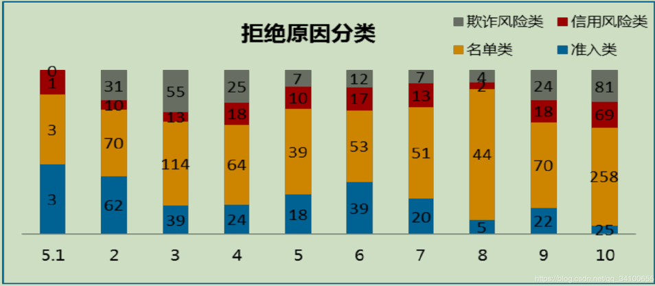

###### 用户特征监控

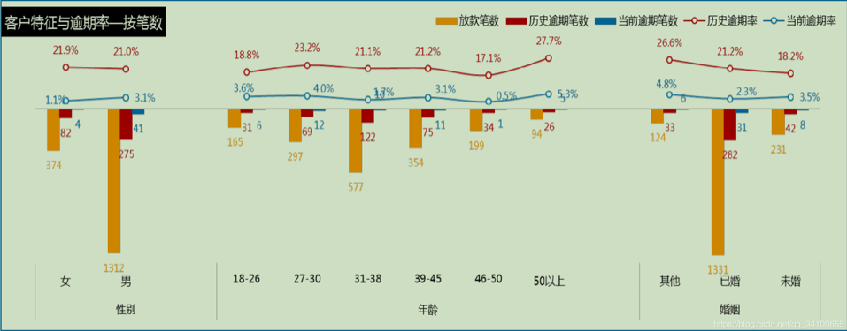

###### 模型监控

催收业绩表：区分不同区间（M1~M6）、组别查看回收指标（回收金额、回收率），观测每日、每月变化，出现异常可及时调整派单；

#### 数据分析

##### 核心思维

结构化思维就是著名的”金字塔思维“，也就是麦肯锡提出的，如下图就是典型的结构化：

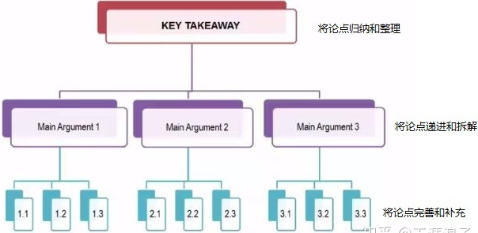

更详细来讲就是：核心论点：寻找金字塔的塔点（假设/预测/问题/原因）、结构拆解：自上而下将核心论点层层拆解成分论点，上下之间呈因果/依赖关系、MECE：相互独立，完全穷尽（分论点之间避免交叉重复，尽量完善）、验证：核心论点/分论点都是可量化的、可验证的，要用数据说话

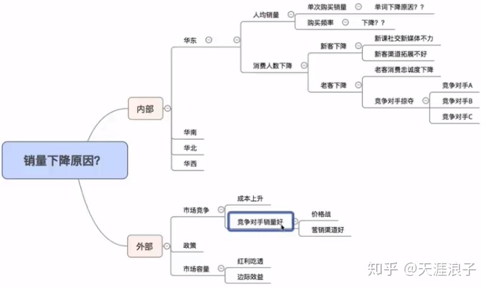

公式化分析思维意味着：上下互为计算（一切结构皆可量化）、左右呈关联（最小不可分割）
公式化可以简单地看成是利用加减乘除来量化分析的分析思维：不同类别的业务叠加可以用加法；减法常用来计算业务间的逻辑关系；乘法和除法是各种比例或比率。

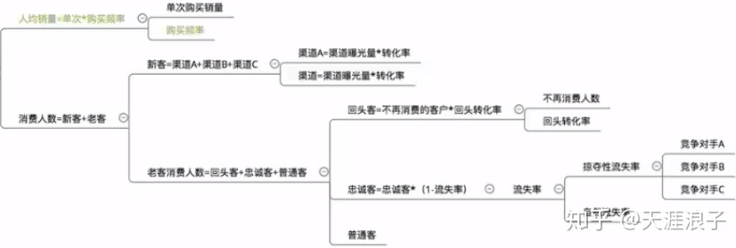

##### 拒绝推断

幸存者偏差是一个广泛存在的逻辑谬误。我们在进行统计的时候，可能会忽略样本的随机性和全面性，用局部样本代替了总体样本，对总体的描述出现偏差，从而得出错误的结论。样本偏差问题同样存在，这会导致模型参数估计不准确，从而影响对真实风险的判断。为了解决这一问题，拒绝推断应运而生。

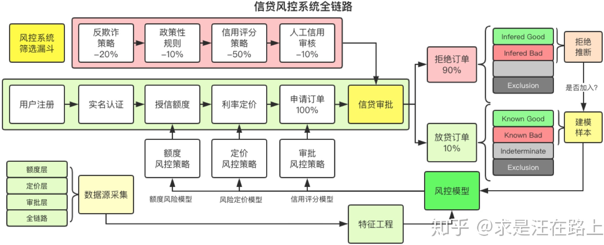

indeterminate:不确定，exclusion:排斥样本

模型最终上线可能会应用到不同环节，如额度层、定价层、支用层。不同环节的风控模型的定位一般都是违约概率预测模型。那么差异是什么？由于不同阶段可用数据源、计算实时性要求、目标变量等因素的不同，导致模型设计上不尽相同。同时，额度阶段是在用户维度预测，而定价和申请阶段是在订单维度预测。

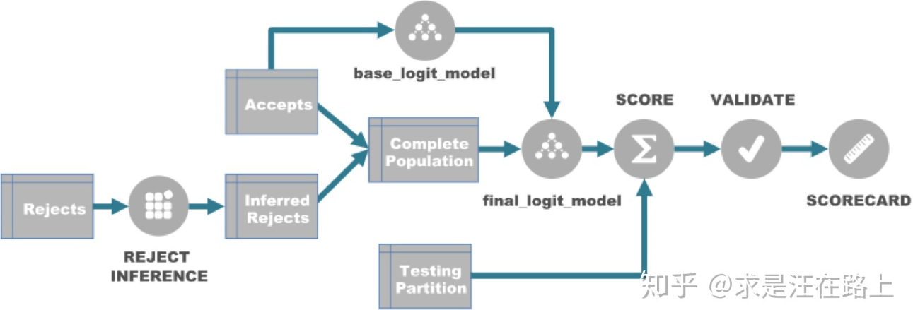

在某些情况下，可能也并不需要开展拒绝推断。我们可以结合放贷率来进行定性分析，一般适用于放贷率适中的场景里。

- 如果放贷率很高，这时就没必要做拒绝推断，样本偏差问题已经不明显。
- 如果放贷率很低，那么由于拒绝推断与真实贷后表现之间存在较大的差异，可能导致模型性能反而下降。

注意，这里的放贷率阈值仅供参考，实践中将根据业务实际情况而定。

###### 拒绝推断的分类体系

经典的拒绝推断方法从广义上可分为两大类：数据法和推断法。

**数据法**：**获取拒绝样本的其他表现数据**。

> 方法一：接受本该拒绝：其思想是将部分本该被信用策略拒绝的订单，人工否决予以通过。当然，这批订单将会被打上标记，作为实验对象，保持观察贷后还款表现。
> 方法二：同生表现，又称为重新分类法：该方法的思想是利用其他产品或贷款机构的表现数据来标注。可能存在的问题：①外部数据的获取和成本问题。②多源数据格式不统一问题。③坏样本标注相对容易，好样本定义不明确。④不同平台数据对bad的定义之间存在差异。⑤建模样本是订单维度，外部拒绝标注是用户维度。
> 方法三：拒绝原因：在图1所示的信贷审批链路中，我们会记录每个环节的拒绝原因，尤其是人工信审部分。因此，我们可利用这些数据进行bad样本标注。

推断法：推断拒绝和放贷样本之间的差异，进而调整建模样本组成来构建模型。

> 方法一：展开法，又称为重新加权法：$P(Y=bad|X,Reject) = P(Y=b|X,Accept)\times IK$
> 方法二：重新加权法(Reweighting) 
> 方法三：打包法(Parcelling)，又称为外推法(Extrapolation)
> 方法四：迭代再分类法(Iterative Reclassification)
> 方法五：两阶段法(Two-stage)，又称为双变量推断(Bivariate Inference)

展开法又可细分为2类：

> \1. 简单展开法(Simple Augmentation)，又称为硬截断法(Hard Cutoff)
> \2. 模糊展开法(Fuzzy Augmentation)

简单展开法的操作步骤为：

- **step 1**. 构建 ![[公式]](https://www.zhihu.com/equation?tex=KGB)模型，并对全量样本打分，得到![[公式]](https://www.zhihu.com/equation?tex=P%28good%29) 。 
- **step 2**. 将拒绝样本按 ![[公式]](https://www.zhihu.com/equation?tex=P%28good%29) 降序排列，设置![[公式]](https://www.zhihu.com/equation?tex=cutoff) 。根据业务经验，比如拒绝样本的 ![[公式]](https://www.zhihu.com/equation?tex=bad+%5Cspace+rate) 是放贷样本的2～4倍，从而结合拒绝样本量计算出 ![[公式]](https://www.zhihu.com/equation?tex=cutoff)。
- **step 3**. 高于![[公式]](https://www.zhihu.com/equation?tex=cutoff) 的拒绝样本标记为 ![[公式]](https://www.zhihu.com/equation?tex=good) ，反之标记为![[公式]](https://www.zhihu.com/equation?tex=bad) 。
- **step 4**. 利用组合样本构建![[公式]](https://www.zhihu.com/equation?tex=AGB) 模型。

模糊展开法的操作步骤为：

- **step 1**. 构建 ![[公式]](https://www.zhihu.com/equation?tex=KGB) 模型，并对拒绝样本打分，得到 ![[公式]](https://www.zhihu.com/equation?tex=P%28good%29) 和 ![[公式]](https://www.zhihu.com/equation?tex=P%28bad%29) 。
- **step 2**. 将每条拒绝样本复制为不同类别，不同权重的两条：一条标记为![[公式]](https://www.zhihu.com/equation?tex=good) ，权重为 ![[公式]](https://www.zhihu.com/equation?tex=P%28good%29) ；另一条标记为 ![[公式]](https://www.zhihu.com/equation?tex=bad) ，权重为 ![[公式]](https://www.zhihu.com/equation?tex=P%28bad%29) 。
- **step 3**. 利用变换后的拒绝样本和放贷已知好坏样本（类别不变，权重设为1）建立 ![[公式]](https://www.zhihu.com/equation?tex=AGB) 模型

**方法二：重新加权法(Reweighting)** 

重新加权法并没有把拒绝样本加入建模，只是调整了放贷好坏样本的权重。操作步骤为：

- **step 1**. 构建 ![[公式]](https://www.zhihu.com/equation?tex=KGB)模型，并对全量样本打分，得到![[公式]](https://www.zhihu.com/equation?tex=P%28good%29) 。  
- **step 2**. 将全量样本按 ![[公式]](https://www.zhihu.com/equation?tex=P%28good%29) 降序排列，分箱统计每箱中的放贷和拒绝样本数。
- **step 3**. 计算每个分箱中放贷好坏样本的权重：
  ![[公式]](https://www.zhihu.com/equation?tex=weight+%3D+%5Cfrac%7BReject_i+%2BAccept_i+%7D%7BAccept_i%7D+%3D+%5Cfrac%7BReject_i+%2BGood_i+%2B+Bad_i+%7D%7BGood_i+%2B+Bad_i%7D+%5Ctag%7B3%7D) 
- **step 4**. 引入样本权重，利用放贷好坏样本构建 ![[公式]](https://www.zhihu.com/equation?tex=KGB) 模型。

**方法三：打包法(Parcelling)，**又称为**外推法(Extrapolation)**。

该方法的操作步骤如下：

- **step 1**. 构建![[公式]](https://www.zhihu.com/equation?tex=KGB) 模型，并对全量样本打分![[公式]](https://www.zhihu.com/equation?tex=P%28good%29) ，也就是图6中的![[公式]](https://www.zhihu.com/equation?tex=score) 。
- **step 2**. 将放贷样本按分数排序后分箱（一般等频），将拒绝样本按相同边界分组。
- **step 3**. 对每个分箱，统计放贷样本中的![[公式]](https://www.zhihu.com/equation?tex=bad+%5Cspace+rate)。
- **step 4**. 对每个分箱，将放贷样本的![[公式]](https://www.zhihu.com/equation?tex=bad+%5Cspace+rate)乘以**经验风险因子**（通常取2～4），得到拒绝样本的期望![[公式]](https://www.zhihu.com/equation?tex=bad+%5Cspace+rate)。
- **step 5**. 为达到期望的![[公式]](https://www.zhihu.com/equation?tex=bad+%5Cspace+rate)，**随机赋予**分箱内的拒绝样本以![[公式]](https://www.zhihu.com/equation?tex=bad) 和![[公式]](https://www.zhihu.com/equation?tex=good)状态。同时，检验整体拒绝样本的![[公式]](https://www.zhihu.com/equation?tex=bad+%5Cspace+rate)是否是放贷样本的2～4倍。
- **step 6**. 利用组合样本构建 ![[公式]](https://www.zhihu.com/equation?tex=AGB) 模型。

**方法四：迭代再分类法 (Iterative Reclassification)**

该方法通过**多次迭代好坏分类，直到收敛某一临界值**。操作步骤如下：

- **step 1**. 构建![[公式]](https://www.zhihu.com/equation?tex=KGB) 模型，对拒绝样本打分，得到![[公式]](https://www.zhihu.com/equation?tex=P%28good%29)
- **step 2**. 将拒绝样本按![[公式]](https://www.zhihu.com/equation?tex=P%28good%29) 降序排列，设置![[公式]](https://www.zhihu.com/equation?tex=cutoff) ，若高于 ![[公式]](https://www.zhihu.com/equation?tex=cutoff) 则标记为![[公式]](https://www.zhihu.com/equation?tex=good) ，反之标记为![[公式]](https://www.zhihu.com/equation?tex=bad) 。
- **step 3**. 加入推断的好坏样本，构建![[公式]](https://www.zhihu.com/equation?tex=AGB) 模型，对拒绝样本打分，得到新的![[公式]](https://www.zhihu.com/equation?tex=P%28good%29_i) 。
- **step 4**. 迭代训练，直到模型参数收敛。如 ![[公式]](https://www.zhihu.com/equation?tex=log%28odds%29-score) 曲线位置不再变化。

**方法五：两阶段法(Two-stage)，又称为双变量推断(Bivariate Inference)**

实际信贷业务逻辑是：**先有放款决策，才有好坏表现**。因此，建模过程也考虑分为**放款预测（AR模型）和好坏预测（KGB模型）**两个阶段。用数学描述：

![[公式]](https://www.zhihu.com/equation?tex=P%28good%29%3DP%28good%7Caccept%29%2AP%28accept%29%2BP%28good%7Creject%29%2AP%28reject%29+%5Ctag%7B4%7D) 

假设 ![[公式]](https://www.zhihu.com/equation?tex=P%28accept%29) **相近的客户具有近似的风险特征**，因此考虑将 ![[公式]](https://www.zhihu.com/equation?tex=P%28accept%29) 分成若干段，每段的好坏账户能代表该段内的被拒客户的特征，利用这些好坏账户可以推断被拒帐户中的好坏。

两阶段法的操作步骤如下：

- **step 1.** 构建 ![[公式]](https://www.zhihu.com/equation?tex=AR) 模型，对全量样本打分，得到 ![[公式]](https://www.zhihu.com/equation?tex=P%28accept%29) .
- **step 2**. 构建 ![[公式]](https://www.zhihu.com/equation?tex=KGB) 模型，对全量样本打分，得到 ![[公式]](https://www.zhihu.com/equation?tex=P%28good%29) .
- **step 3**. 将全量样本按 ![[公式]](https://www.zhihu.com/equation?tex=P%28accept%29) **升序**排列，**等频**分箱，分别计算每个分箱内放贷样本和拒绝样本**平均** ![[公式]](https://www.zhihu.com/equation?tex=P%28good%29)，也就是**边际好人概率** ![[公式]](https://www.zhihu.com/equation?tex=%EF%BC%88marginal+%5Cspace+good++%5Cspace+rate%EF%BC%89) 。
- **step 4**. 分别绘制拒绝样本和放贷样本的散点图，横坐标为 ![[公式]](https://www.zhihu.com/equation?tex=P%28accept%29) ，纵坐标为 ![[公式]](https://www.zhihu.com/equation?tex=P%28good%29) ，如图10所示。
- **step 5**.  基于业务经验确定一条期望趋势线，用以对拒绝样本的实际概率 ![[公式]](https://www.zhihu.com/equation?tex=P%28good%29_a) 进行修正，目标概率为期望趋势线上对应的 ![[公式]](https://www.zhihu.com/equation?tex=P%28good%29_e) 。
- **step 6**.  计算用于修正样本选择偏差的权重修正因子： ![[公式]](https://www.zhihu.com/equation?tex=weight+%3D+%5Cfrac%7BP%28good%29_e%7D%7BP%28good%29_a%7D) 
- **step 7.**   引入权重修正因子，利用打包法推断好坏。
- **step 8.**  根据组合样本构建 ![[公式]](https://www.zhihu.com/equation?tex=AGB) 模型。

#### 互联网金融业务知识

##### 行业分类

车贷、传统线下转线上信用贷（无抵押贷款）、消费贷款、场景消费分期：整容分期、教育分期、特定群体的分期：蓝领贷、正规持牌消费金融分期、小额现金贷、信用卡代还、流量中介

存在的风险有：资金链、获客成本越来越高、群体欺诈代办：贷款中介、风控模型：贷款贷错人、多头寻贷、道德风险：跟客户串通骗贷、数据安全问题：客户信息泄露、政策风险

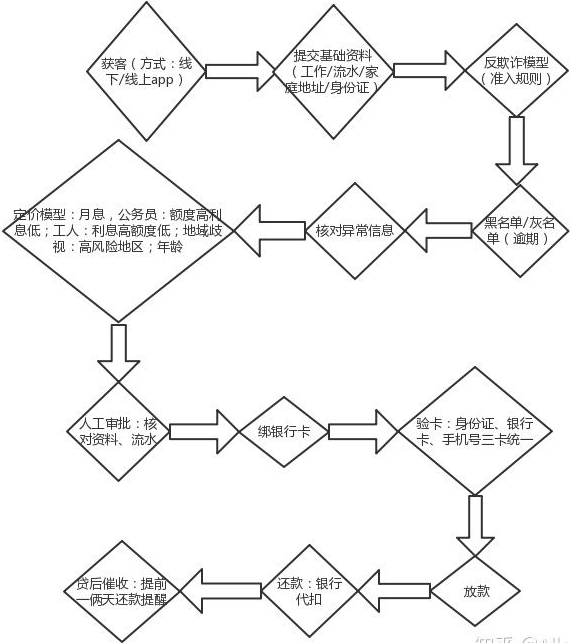

##### 四类产品能力

###### 风控

产品能力
坚实的数据支撑：丰富的数据基础；账户身份信息接入公安网、红盾网等机构；第三方支付安全合作联盟成员，共享风险数据
实时风险管控：在线风险监控——用户登录即进入保护；离线风险分析——完善实时监控功能；7*24小时风险处理团队
安全服务输出：商户网站安全扫描；防钓鱼、木马、防校验码泄露的技术输出；风险交易联合拦截
多方外部合作：浏览器厂商；杀毒软件厂商；通信运营商；邮件运营商
核心能力
四项元素验证 : 是用户实名验证的基础，包括：姓名、身份证号、手机号码和一些基础的用户信息。
黑名单厚度：黑名单是风控中的一种策略，厚度就是数据的丰富度。
多头借贷：同一个人会在很多地方产生行为，有好的和坏的，这就会产生多头借贷。这个时候模型就起到了动态调节的作用，模型有两种：一种是前置模型，一种是后置模型，它们解决不同的问题。前置模型：解决一部分人信用预判和授信的问题，比如：可以解决无业人员的申请问题；后置模型：更多的是解决后期的反欺诈、后向行为（用户后续的操作行为，以及交易层面进行的异常交易，在这个过程中发现问题并实时拦截）。
黑产：非法数据的窃取与交易、网络攻击与敲诈勒索、网络诈骗、手机木马、挂马与人海战术、打马产业等等。
催收：信贷行业将钱贷出，更重要的是能将贷出的资金回收，不同的公司有不同的催收策略，如APP、短信、人工催收、机构等等。

###### 通道

核心能力
可分为收款、打款、鉴权这几类。
比如：我们在支付平台完成一次付款需要收款的通道；发起一次余额的提现需要打款通道；在绑定一张新银行卡的时候，平台需要验证你的基本信息、基本卡要素、判断卡类型，同时进行身份核实，这个时候要用到鉴权的通道。
属性：按属性可分为快捷通道、理财通道、大额通道、代扣等很多细分。
每接入一家银行，通道需要付出很多努力。其中涉及几个环节，首先是商务谈判，清算规则的制定、对账文件、退款接口、还有订单关联的逻辑，包括财务后台怎么去进行对账的验证，发生异常数据时怎样进行调账，这样的事情都需要前期去谈清楚、说明白，并且进行相关的调试和开发，才能完成一个通道的接入。

###### 收银台

收银台是离大家最近的产品，绑一张银行卡、输入密码、消费扣款、收到扣款的短信和温馨提示，这些流程都是在收银台内完成的。收银台是整个产品中的一个上层结构，它更多的是完成用户端的支付能力，然后将钱结算给商户。同时不同的收银台会有很多的形式，会适配不同的商户和业务来进行接入。线上支付：SDK收银台、H5收银台、PC电脑收银台、线下支付：扫码支付、条码支付、HCE支付

###### 商户权益管理

商户权益管理是重要的后台管理能力，包括商户资质的申请、订单的管理、账户的管理、资金流的管理、子商户的管理等。权益管理和营销管理的资源已成为各网贷平台互相争夺的资源，我们需要通过试验来找到核心功能点，通过优先级排序来满足用户和商户的需求，同时需要进行漏斗分析，分析用户的摩擦损失。

##### 三大业务

支付、理财、信贷
支付：支付是最底层的一个能力，在用户进行理财和信贷借款时，都需要用到收银台和支付这样的能力进行支撑，同时三者又是一个互相耦合的关系，会进行互相的促进。

支付方向的产品，需要了解这些知识：

什么叫非银行支付机构？什么叫合规？

一类账户、二类账户、三类账户分别是什么意思？

收银台有哪些形式？

收银台里边的一些基本的功能？还有它本身背后存在的一些逻辑？

##### 风控分析模型

###### 主要指标

逾期天数DPDn：自应还日次日起到实还日期间的日期数，DPD30表示逾期30天；
逾期期数：自应还日次日起到实还日期间的还款期数，正常资产用C表示，Mn表示逾期n期；
贷款余额ENR：至某时点借款人尚未偿还的本金，即全部剩余本金作为贷款余额；
月均贷款余额：月均贷款余额=（月初贷款余额+月末贷款余额）/2，月初贷款余额即上月末贷款余额
核销金额：贷款逾期M7后经审核进行销账，核销金额即在核销日期当天的贷款余额；
回收金额：来自历史所有已核销合同的全部实收金额；
净坏账=当月新增核销金额-当月回收金额；
在账月份MOBn：放款后的月份，MOB0放款日至当月月底，MOB1：放款后第二个当月月底
滚动率
c-m1：当月进入M1的贷款余额/上月末的贷款余额
m2-m3：当月进入M3的贷款余额/上月末M2的贷款余额
逾期率：Coin(C)%、Coin(M1)%、Coin(M2)%、Coin(M3)%、Coin(M4)%、Coin(M5)%、Coin(M6)%
当月不同逾期期数的贷款余额/当月底总贷款余额
逾期率：Lagged(M1)%、Lagged(M2)%、Lagged(M3)%、Lagged(M4)%、Lagged(M5)%、Lagged(M6)%

###### 分析模型

客户准入管理：客户引入管理是金融机构控制风险的第一道门槛，对存量客户和逾期客户的管理有很大帮助。客户准入阶段需要解决两个问题，一个是引入什么样的客户，二是如何授信。客户准入阶段的模型主要有申请风险模型、初始额度模型、申请欺诈模型。

- 申请风险模型：申请风险模型对金融机构是最常用也是最重要的，来源于客户资质综合评价，全面评估客户的风险，引入优质客户。该模型的预测变量很大程度上依赖于客户的申请信息、信贷历史信息和无央行征信信息等。主要从家庭、工作、资产负债、学历、信贷历史、还款历史和新信贷需求等考核。现在互联网大数据的普及，还可以通过客户流水数据、网络交易行为、浏览行为、评价行为等进行判断，增加 客户风险评价的准确性。通常来说，如果客户评分高，风险较低，可以直接通过；评分低，风险较高，可以直接拒绝；处于两者之间，则进行二审再做决定。
- 初始额度模型：初始额度的授信不仅是考虑客户还款能力，更主要的是衡量客户的收益情况。客户的收益主要是来源于客户的循环利息、逾期利息、分期手续费等。
  通过客户属性、逾期行为、还款行为、透支情况和额度使用情况等，在一定程度上能够反映客户的收益。另外电商中的购买行为、分期行为、客户的网络浏览行为及点击行为，对于客户价值的判断也有帮助。风险低、收益高的客户，初始额度授信高；风险高、收益低的客户，初始额度授信低。
- 申请欺诈模型虽然欺诈客户的比例比较小，但如果发生损失，就很难追回，所以这个模型也很重要。申请欺诈模型，是通过客户填写的申请信息和央行征信信息来判断。这个模型的预测变量主要通过以下这些方面反映：客户单位名称是否在征信的单位列表中；客户家庭地址、单位地址是否在征信的地址列表中；过去一段时间同一联系人、同一单位地址是否有多次进件；申请人、单位是否曾经发生过欺诈进件。由于央行征信信息的实效性和完备性，并不能完全满足欺诈模型的需求。互联网上的相关数据，对申请欺诈模型的建立也是有帮助的。这些具体数据包括同一cookie和IP地址是否在短时间内频繁进件；申请贷款的cookie和IP地址是否为客户活跃使用的；申请贷款地点离客户家庭住址和单位地址的距离；客户以前的互联网行为是否活跃；电商数据、浏览数据、电信运营商等记录的客户联系方式。

存量客户管理：存量客户即金融机构业已维护的客户群体，其管理主要包含交易欺诈管理、再贷客户营销管理、授信额度管理、流失客户管理等业务，核心目标是为了巩固客户的忠诚度，提高客户价值。存量客户管理模型体系主要有行为风险模型、交易欺诈模型、行为收益模型、行为流失模型和市场响应模型等。

- 行为风险模型：行为风险变量是预测客户风险的模型，其预测变量主要由客户的交易行为组合而成。行为风险模型预测变量可以基于还款行为、消费行为、信用卡取现行为、欠款行为、资金的使用情况等方面来考虑。另外央行征信数据、互联网交易数据和浏览数据、银行流水数据等，对于行为风险模型的开发也很有帮助。
- 交易欺诈模型：交易欺诈是指通过盗取他人的账号和密码信息，盗取持卡人的资金的行为。交易欺诈模型是根据客户的历史交易行为预测当笔交易为欺诈的可能性。交易模型的预测变量比较多，例如通过当笔交易金额、当笔交易币种、当笔交易时间、当笔交易地点、过去N次交易的密码输错次数、过去N次交易的交易失败次数、过去N分钟内的交易次数、过去N分钟小额刷卡次数等进行判断。
- 行为收益模型：行为收益风险模型是根据客户的历史行为来预测客户未来收益的高低。客户收益的高低由其户自身属性和行为属性的决定，主要通过性别、年龄、学历、消费行为、取现行为、分期行为、逾期情况、额度使用情况等判断。低风险高收益的客群，获取的资源相对较多；高风险低收益的客户得到的资源就会少。
- 行为流失模型：客户是否有流失的征兆，主要看其交易行为是否有异常就可判断。行为流失模型的预测变量，可以通过以下这些方面来考虑：近N个月的交易金额和交易笔数、额度、信用卡到期时间、也可通过央行征信信息获取客户在其他金融机构持有的信用卡情况、持有他行卡的数、他行卡活跃程度，他行卡的额度。行为流失模型主要用于客户挽留，通常会结合行为风险模型和行为收益模型，根据风险收益的不同，采取不同的策略。
- 市场响应模型：市场响应模型通常和风险模型结合使用，筛选风险，响应较好的客户群作为营销的目标客户群。市场响应模型需要根据营销目标来选择预测变量。例如存量客户再贷营销，预测变量就要看这些方面：最近是否有申请贷款的查询记录、信用卡的额度占用情况、信用卡循环使用情况、收入负债情况等。另外客户最近是否有买车、买房、买奢侈品等大额单笔交易的记录等第三方数据，对于客户是否有贷款需求也很有帮助。

逾期客户管理：逾期客户指客户未按约定时间履行还款的约定，客户逾期原因主要是还款意愿差和还款能力不足。针对逾期客户，主要采用催收策略。催收计量模型是逾期看客户分群的重要依据，能够识别客户的风险情况，根据风险不同采用的催收手段也不一样。常见的催收计量模型包括账龄滚动率模型、行为模型和失联模型。

- 账龄滚动率模型：逾期账龄是通过逾期天数定义，账龄越高，客户的风险越高。客户评分越低，迁移至下一个账龄的概率越高，客户的风险越高，下个月内还钱的可能性越小。账龄滚动率模型采用的变量包含客户的行为信息和催收信息，常用的预测变量包括：消费行为、取现行为、额度使用情况、还款情况、催收情况、打破承诺次数。
- 行为模型：行为模型主要利用客户的交易行为特征和还款行为特征去考察客户未来变坏的可能性，与存量客户管理时所考虑的变量是相同的。行为模型与账龄滚动率模型结合使用，对客户的评价才会全面、准确，制定催收策略就会更优针对性。
- 失联模型：失联是需要综合一段时间尝试使用多种方式多个时段，都无法联系上客户，才能判断为失联。失联模型是基于历史数据，预测客户发生失联的可能性，希望做到提前预知。失联模型主要关注客户的这些信息：交易情况、贷款余额情况、额度占用情况、最近一次联系客户时间、联系方式变更情况、户籍信息、工作家庭情况、历史催收结果等。互联网的技术优势降低了风险评估成本，风险控制变得相对容易。互联网金融公司做信贷业务时，能够根据风险分析模型，做好客户分群管理，才能更好的建立竞争优势。