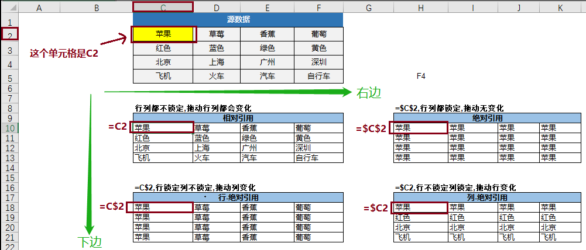

相对引用：针对某一单元格引用另外一个单元格的情况，不添加`$`符号时，就表示相对引用。当我们将引用单元格，朝着右边、下边拖动填充的时候，该引用单元格会跟着被引用单元格变化，类似于图中的“A图”。

绝对引用：也是针对某一单元格引用另外一个单元格的情况，行列都添加`$`符号时，就表示绝对引用。当我们将引用单元格，朝着右边、下边拖动填充的时候，引用单元格不发生任何变化，类似于图中的“B图”。

半绝对引用：同样是针对某一单元格引用另外一个单元格的情况，行或者列其中一个添加 `$ `符号时，就表示半绝对引用。当仅针对行使用了`$`符号，引用单元格朝下边拖拉填充的时候，引用单元格不会发生任何变化，类似于图中的“C图”。当仅针对列使用了`$`符号，引用单元格朝右边拖拉填充的时候，引用单元格不会发生任何变化，类似于图中的“D图”。

| 名称  | 场景                                                         | 语法                      | 案例                 |
| ----- | ------------------------------------------------------------ | ------------------------- | -------------------- |
| `and` | 判断所有条件的真假，当所有为真，返回True，否则返回False      | `=and(cond1,cond2,...)`   | `=and(1=1,2=2,3=3)`  |
| `if`  | 根据制定的判断条件，在正确或错误的状态下，返回不同的值       | `=if(cond,value1,value2)` | `=if(1=0,“好”,"坏")` |
| `or`  | 判断所有条件的真假，当有一个条件为真，返回True，否则返回False | `=or(cond1,cond2,...)`    | `=or(1=0,2=0,3=0)`   |

###### 字符串函数

| 名称         | 场景                                       | 语法                             | 案例                    |
| ------------ | ------------------------------------------ | -------------------------------- | ----------------------- |
| `left`       | 从左边截取指定位数的字符                   | `left(x,length)`                 | `=left(E37,5)`          |
| `right`      | 从右边截取指定位数的字符                   | `right(x, length)`               | `=right(E38,5)`         |
| `mid`        | 从左边指定字符位置开始，截取指定位数的字符 | `mid(x, start, length)`          | `=mid(E39,2,5)`         |
| `len`        | 返回指定对象的字符个数                     | `len(x)`                         | `len(E51)`              |
| `find`       | 查找指定字符的起始位置（区分大小写）       | `find(char, obj)`                | `=find('b',E75)`        |
| `search`     | 查找指定字符的起始位置（不区分大小写）     | `search(char, obj)`              | `=search('B',E75)`      |
| `replace`    | 将 指定对象指定位置和长度的内容进行替换    | `replace(obj,start,length,repl)` | `=replace(E75,1,4,'B')` |
| `substitute` | 将指定对象中指定对象进行替换               | `substitute(obj,old,new)`        | `=substitute(E74,9,'')` |

###### 数学函数

| 名称          | 场景                   | 语法                 |
| ------------- | ---------------------- | -------------------- |
| `abs`         |                        |                      |
| `round`       |                        | `round(obj,n)`       |
| `roundup`     |                        |                      |
| `rounddown`   |                        |                      |
| `power`       |                        | `power(obj, n)`      |
| `product`     |                        | `product(n1,n2,...)` |
| `mod`         | 返回余数               |                      |
| `rand`        | 返回0-1之间随机数      |                      |
| `randbetween` | 返回指定区间的随机整数 |                      |

###### 统计函数

| 名称                      | 场景 | 语法 | 案例 |
| ------------------------- | ---- | ---- | ---- |
| `sum/average/count`       |      |      |      |
| `sumif/averageif/countif` |      |      |      |
| `min/max/median`          |      |      |      |
| `sumproduct`              |      |      |      |
|                           |      |      |      |
|                           |      |      |      |

###### 时间函数

| 名称 | 场景 | 语法 | 案例 |
| ---- | ---- | ---- | ---- |
|      |      |      |      |
|      |      |      |      |
|      |      |      |      |
|      |      |      |      |
|      |      |      |      |
|      |      |      |      |

###### 匹配查找函数

`vlookup`

`lookup`

`index`

`match`

`offset`

