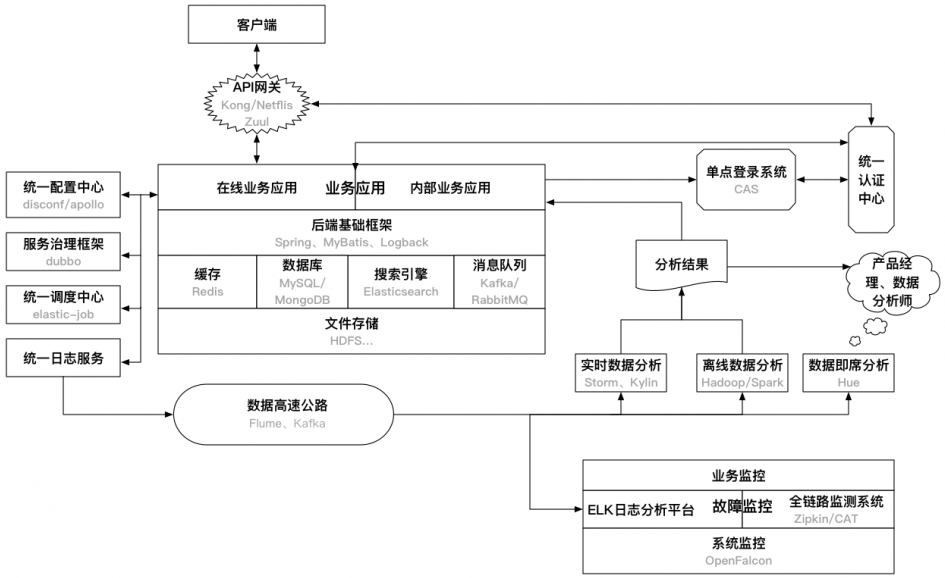
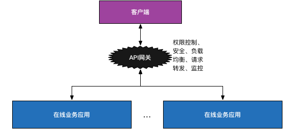
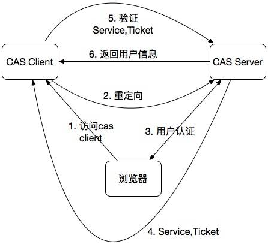
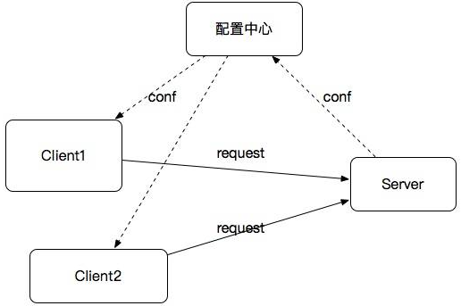

#### 后端基础设施

SaaS平台供应商将应用软件统一部署在自己的服务器上，客户可以根据工作实际需求，通过互联网向厂商定购所需的应用软件服务，按定购的服务多少和时间长短向厂商支付费用，并通过互联网获得Saas平台供应商提供的服务。

后端服务器的主要功能概括起来就是：接收外界的API请求，解析后去执行数据库操作，最后将数据包装好返回给调用者（当然，中间还包含其他业务逻辑）。所以，这句话中包含了三类框架的信息，分别是：和数据操作有关的，和API请求响应有关的，和业务逻辑有关的，我们下面就这三类来讲述。

和数据操作相关的：这类框架一般负责和数据库进行连接，负责SQL的处理，以及将查询到的数据映射成指定的java对象。这样子的框架有：mybatis: 、hibernate 

 和API处理相关的：这类框架一般负责根据不同的API请求来调用程序中不同的处理方法，负责将调用者传入的数据映射成java对象，也负责处理程序返回给客户端的响应数据格式等。这样子的框架一般有：struts、spring mvc:

和业务逻辑相关的：这类框架主要用到了两个特性（其实是一个），以此来简化程序的复杂性，这里先稍微提及一下，以后再做说明，他们是：控制反转和依赖注入。总之呢，我们在程序中结合这类框架，写出来的程序具有更好的维护性扩展性，也更加清晰简洁。这类程序有：spring、guice

 我们选用的框架有： 数据层：mybatis、API层：spring mvc 、业务层：spring、外加重要的：spring boot 。这里说一下 spring boot ，其他三个你们都知道了。那 spring boot 是什么呢？就是进一步简化基于 spring 框架的项目的构建工具。boot本就是启动的意思，用上 spring boot 进行java后台开发，在spring的基础上又省力了许多。

 前端至少要懂的三个部分：HTML，CSS，JavaScript（简称JS），那首先先明确这三个概念：HTML负责结构，网页想要表达的内容由html书写。CSS负责样式，网页的美与丑由它来控制JS负责交互，用户和网页产生的互动由它来控制。

后端基础设施主要指的是应用在线上稳定运行需要依赖的关键组件或者服务。开发或者搭建好以上的后端基础设施，一般情况下是能够支撑很长一段时间内的业务的。此外，对于一个完整的架构来说，还有很多应用感知不到的系统基础服务，如负载均衡、自动化部署、系统安全等

##### API网口

在移动APP的开发过程中，通常后端提供的接口需要以下功能的支持：负载均衡、API访问权限控制、用户鉴权。一般的做法，使用Nginx做负载均衡，然后在每个业务应用里做API接口的访问权限控制和用户鉴权，更优化一点的方式则是把后两者做成公共类库供所有业务调用。但从总体上来看，这三种特性都属于业务的公共需求，更可取的方式则是集成到一起作为一个服务，既可以动态地修改权限控制和鉴权机制，也可以减少每个业务集成这些机制的成本。这种服务就是API网关，可以选择自己实现。

但是以上方案的一个问题是由于所有API请求都要经过网关，它很容易成为系统的性能瓶颈。因此，可以采取的方案是：去掉API网关，让业务应用直接对接统一认证中心，在基础框架层面保证每个API调用都需要先通过统一认证中心的认证，这里可以采取缓存认证结果的方式避免对统一认证中心产生过大的请求压力。

##### 业务应用和后端基础框架

业务应用分为：在线业务应用和内部业务应用。在线业务应用：直接面向互联网用户的应用、接口等，典型的特点就是：请求量大、高并发、对故障的容忍度低。内部业务应用：主要面向公司内部用户的应用。比如，内部数据管理平台、广告投放平台等。相比起在线业务应用，其特点: 数据保密性高、压力小、并发量小、允许故障的发生。

业务应用基于后端的基础框架开发，针对Java后端来说，应该有以下几个框架：MVC框架：统一开发流程、提高开发效率、屏蔽一些关键细节的Web/后端框架。典型的如SpringMVC、Jersey以及国人开发的JFinal以及阿里的WebX。

IOC框架：实现依赖注入/控制反转的框架。Java中最为流行的Spring框架的核心就是IOC功能。

ORM框架：能够屏蔽底层数据库细节，提供统一的数据访问接口的数据库操作框架，额外地能够支持客户端主从、分库、分表等分布式特性。MyBatis是目前最为流行的ORM框架。此外，Spring ORM中提供的JdbcTemplate也很不错。当然，对于分库分表、主从分离这些需求，一般就需要自己实现，开源的则有阿里的TDDL、当当的sharding-jdbc（从datasource层面解决了分库分表、读写分离的问题，对应用透明、零侵入）。缓存框架：对Redis、Memcached这些缓存软件操作的统一封装，能够支持客户端分布式方案、主从等。一般使用Spring的RedisTemplate即可，也可以使用Jedis做自己的封装，支持客户端分布式方案、主从等。

JavaEE应用性能检测框架：对于线上的JavaEE应用，需要有一个统一的框架集成到每一个业务中检测每一个请求、方法调用、JDBC连接、Redis连接等的耗时、状态等。

##### 缓存、数据库、搜索引擎、消息队列

缓存、数据库、搜索引擎、消息队列这四者都是应用依赖的后端基础服务，他们的性能直接影响到了应用的整体性能。

缓存: 缓存通常被用来解决热点数据的访问问题，是提高数据查询性能的强大武器。在高并发的后端应用中，将数据持久层的数据加载到缓存中，能够隔离高并发请求与后端数据库，避免数据库被大量请求击垮。目前常用的除了在内存中的本地缓存，比较普遍的集中缓存软件有Memcached和Redis。

数据库：数据库可以说是后端应用最基本的基础设施。基本上绝大多数业务数据都是持久化存储在数据库中的。主流的数据库包括传统的关系型数据库（MySQL、PostgreSQL）以及最近几年开始流行的NoSQL（MongoDB、HBase）。其中HBase是用于大数据领域的列数据库，受限于其查询性能，一般并不用来做业务数据库。

搜索引擎：搜索引擎是针对全文检索以及数据各种维度查询设计的软件。目前用的比较多的开源软件是Solr和Elasticsearch，不同之处主要在于termIndex的存储、分布式架构的支持等。Elasticsearch由于对集群的良好支持以及高性能的实现，已经逐渐成为搜索引擎的主流开源方案。

消息队列：数据传输的一种方式就是通过消息队列。目前用的比较普遍的消息队列包括为日志设计的Kafka以及重事务的RabbitMQ等。在对消息丢失不是特别敏感且并不要求消息事务的场景下，选择Kafka能够获得更高的性能；否则，RabbitMQ则是更好的选择。

##### 文件存储

不管是业务应用、依赖的后端服务还是其他的各种服务，最终还是要依赖于底层文件存储的。通常来说，文件存储需要满足的特性有：可靠性、容灾性、稳定性，即要保证存储的数据不会轻易丢失，即使发生故障也能够有回滚方案，也要保证高可用。在底层可以采用传统的RAID作为解决方案，再上一层，目前Hadoop的HDFS则是最为普遍的分布式文件存储方案，当然还有NFS、Samba这种共享文件系统也提供了简单的分布式存储的特性。此外，如果文件存储确实成为了应用的瓶颈或者必须提高文件存储的性能从而提升整个系统的性能时，那么最为直接和简单的做法就是抛弃传统机械硬盘，用SSD硬盘替代。

##### 统一认证中心

统一认证中心，主要是对APP用户、内部用户、APP等的认证服务，包括用户的注册、登录验证、Token鉴权内部信息系统用户的管理和登录鉴权APP的管理，包括APP的secret生成，APP信息的验证（如验证接口签名）等。之所以需要统一认证中心，就是为了能够集中对这些所有APP都会用到的信息进行管理，也给所有应用提供统一的认证服务。尤其是在有很多业务需要共享用户数据的时候，构建一个统一认证中心是非常必要的。此外，通过统一认证中心构建移动APP的单点登录也是水到渠成的事情：模仿Web的机制，将认证后的信息加密存储到本地存储中供多个APP使用。

##### 单点登录系统

目前很多大的在线Web网站都是有单点登录系统的，通俗的来说就是只需要一次用户登录，就能够进入多个业务应用（权限可以不相同），非常方便用户的操作。而在移动互联网公司中，内部的各种管理、信息系统甚至外部应用同样也需要单点登录系统。

##### 统一配置中心

在Java后端应用中，一种读写配置比较通用的方式就是将配置文件写在Propeties、YAML、HCON等文件中，修改的时候只需要更新文件重新部署即可，可以做到不牵扯代码层面改动的目的。统一配置中心，则是基于这种方式之上的统一对所有业务或者基础后端服务的相关配置文件进行管理的统一服务, 具有以下特性：能够在线动态修改配置文件并生效配置文件可以区分环境（开发、测试、生产等）在Java中可以通过注解、XML配置的方式引入相关配置

##### 服务治理框架

对于外部API调用或者客户端对后端API的访问，可以使用HTTP协议或者RESTful。但对于内部服务间的调用，一般都是通过RPC机制来调用的。目前主流的RPC协议有：RMI、Hessian、Thrift、Dubbo这些RPC协议各有优劣点，需要针对业务需求做出最好的选择。这样，当你的系统服务在逐渐增多，RPC调用链越来越复杂，很多情况下，需要不停的更新文档来维护这些调用关系。一个对这些服务进行管理的框架可以大大减少因此带来的繁琐的人力工作。传统的ESB（企业服务总线）本质就是一个服务治理方案，但ESB作为一种proxy的角色存在于Client和Server之间，所有请求都需要经过ESB，使得ESB很容易成为性能瓶颈。因此，基于传统的ESB，更好的一种设计如下图所示：

如图，以配置中心为枢纽，调用关系只存在于Client和提供服务的Server之间，就避免了传统ESB的性能瓶颈问题。对于这种设计，ESB应该支持的特性如下：服务提供方的注册、管理服务消费者的注册、管理服务的版本管理、负载均衡、流量控制、服务降级、资源隔离服务的容错、熔断

##### 统一调度中心

在很多业务中，定时调度是一个非常普遍的场景，比如定时去抓取数据、定时刷新订单的状态等。通常的做法就是针对各自的业务依赖Linux的Cron机制或者Java中的Quartz。统一调度中心则是对所有的调度任务进行管理，这样能够统一对调度集群进行调优、扩展、任务管理等。Azkaban和Yahoo的Oozie是Hadoop的流式工作管理引擎，也可以作为统一调度中心来使用。当然，你也可以使用Cron或者Quartz来实现自己的统一调度中心。根据Cron表达式调度任务动态修改、停止、删除任务支持任务分片执行支持任务工作流：比如一个任务完成之后再执行下一个任务任务支持脚本、代码、url等多种形式任务执行的日志记录、故障报警对于Java的Quartz这里需要说明一下：这个Quartz需要和Spring Quartz区分，后者是Spring对Quartz框架的简单实现也是目前使用的最多的一种调度方式。但其并没有做高可用集群的支持。而Quartz虽然有集群的支持，但是配置起来非常复杂。现在很多方案都是使用Zookeeper来实现Spring Quartz的分布式集群。

##### 统一日志服务

日志是开发过程必不可少的东西。打印日志的时机、技巧是很能体现出工程师编码水平的。毕竟，日志是线上服务能够定位、排查异常最为直接的信息。通常的，将日志分散在各个业务中非常不方便对问题的管理和排查。统一日志服务则使用单独的日志服务器记录日志，各个业务通过统一的日志框架将日志输出到日志服务器上。

##### 数据基础设施

###### 数据高速公路

接着上面讲的统一日志服务，其输出的日志最终是变成数据到数据高速公路上供后续的数据处理程序消费的。这中间的过程包括日志的收集和传输。

收集：统一日志服务将日志打印在日志服务上之后，需要日志收集机制将其集中起来。目前，常见的日志收集方案有：Scribe、Chukwa、Kakfa和Flume。

传输：通过消息队列将数据传输到数据处理服务中。对于日志来说，通常选择Kafka这个消息队列即可。

此外，这里还有一个关键的技术就是数据库和数据仓库间的数据同步问题，即将需要分析的数据从数据库中同步到诸如Hive这种数据仓库时使用的方案。

###### 离线数据分析

离线数据分析是可以有延迟的，一般针对的是非实时需求的数据分析工作，产生的也是延迟一天的报表。目前最常用的离线数据分析技术除了Hadoop还有Spark。相比Hadoop，Spark性能上有很大优势，当然对硬件资源要求也高。其中，Hadoop中的Yarn作为资源管理调度组件除了服务于MR还可以用于Spark（Spark on Yarn），Mesos则是另一种资源管理调度系统。

对于Hadoop，传统的MR编写很复杂，也不利于维护，可以选择使用Hive来用SQL替代编写MR。而对于Spark，也有类似Hive的Spark SQL。

此外，对于离线数据分析，还有一个很关键的就是数据倾斜问题。所谓数据倾斜指的是region数据分布不均，造成有的结点负载很低，而有些却负载很高，从而影响整体的性能。处理好数据倾斜问题对于数据处理是很关键的。

###### 实时数据分析

实时数据处理一般情况下都是基于增量处理的，相对于离线来说并非可靠的，一旦出现故障（如集群崩溃）或者数据处理失败，是很难对数据恢复或者修复异常数据的。因此结合离线+实时是目前最普遍采用的数据处理方案。Lambda架构就是一个结合离线和实时数据处理的架构方案。此外，实时数据分析中还有一个很常见的场景：多维数据实时分析，即能够组合任意维度进行数据展示和分析。目前有两种解决此问题的方案：ROLAP和MOLAP。ROLAP：使用关系型数据库或者扩展的关系型数据库来管理数据仓库数据，以Hive、Spark SQL、Presto为代表。MOLAP：基于数据立方体的多位存储引擎，用空间换时间，把所有的分析情况都物化为物理表或者视图。以Druid、Pinot和Kylin为代表，不同于ROLAP（Hive、Spark SQL）, 其原生的支持多维的数据查询。

###### 数据即席分析

离线和实时数据分析产生的一些报表是给数据分析师、产品经理参考使用的，但是很多情况下，线上的程序并不能满足这些需求方的需求。这时候就需要需求方自己对数据仓库进行查询统计。针对这些需求方，SQL上手容易、易描述等特点决定了其可能是一个最为合适的方式。因此提供一个SQL的即席查询工具能够大大提高数据分析师、产品经理的工作效率。

##### 故障监控

对于面向用户的线上服务，发生故障是一件很严重的事情。因此，做好线上服务的故障检测告警是一件非常重要的事情。可以将故障监控分为以下两个层面的监控：系统监控：主要指对主机的带宽、CPU、内存、硬盘、IO等硬件资源的监控。可以使用Nagios、Cacti等开源软件进行监控。目前，市面上也有很多第三方服务能够提供对于主机资源的监控，如监控宝等。对于分布式服务集群（如Hadoop、Storm、Kafka、Flume等集群）的监控则可以使用Ganglia。此外，小米开源的OpenFalcon也很不错，涵盖了系统监控、JVM监控、应用监控等，也支持自定义的监控机制。业务监控：是在主机资源层面以上的监控，比如APP的PV、UV数据异常、交易失败等。需要业务中加入相关的监控代码，比如在异常抛出的地方，加一段日志记录。监控还有一个关键的步骤就是告警。告警的方式有很多种：邮件、IM、短信等。考虑到故障的重要性不同、告警的合理性、便于定位问题等因素，有以下建议：告警日志要记录发生故障的机器ID，尤其是在集群服务中，如果没有记录机器ID，那么对于后续的问题定位会很困难。要对告警做聚合，不要每一个故障都单独进行告警，这样会对工程师造成极大的困扰。要对告警做等级划分，不能对所有告警都做同样的优先级处理。使用微信做为告警软件，能够在节省短信成本的情况下，保证告警的到达率。

