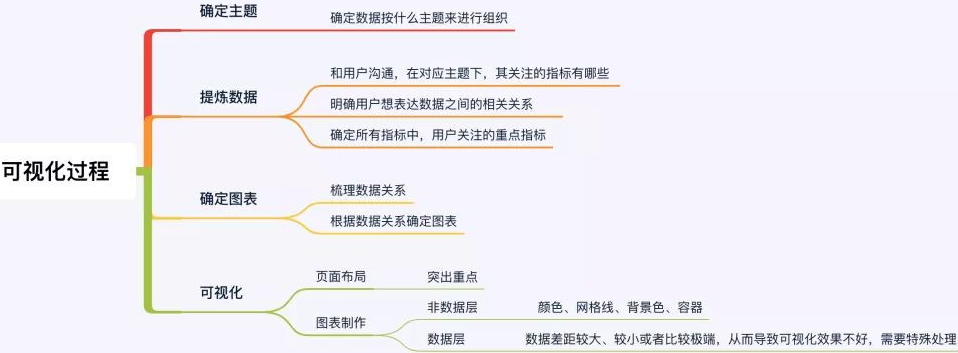
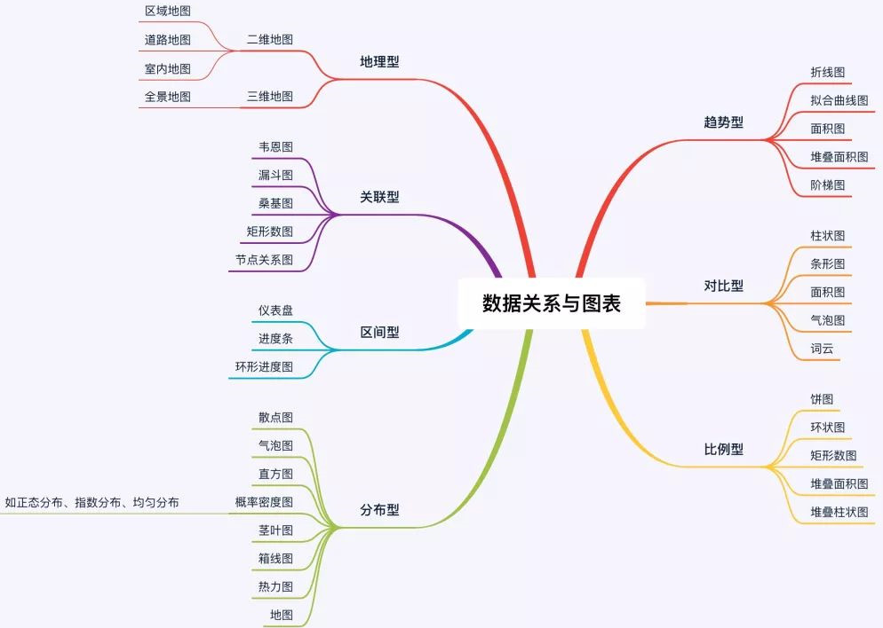
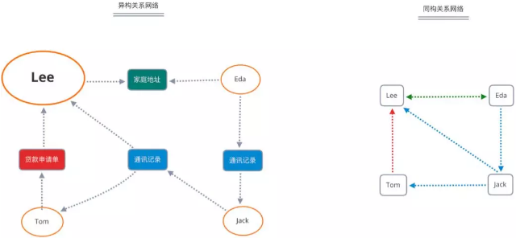
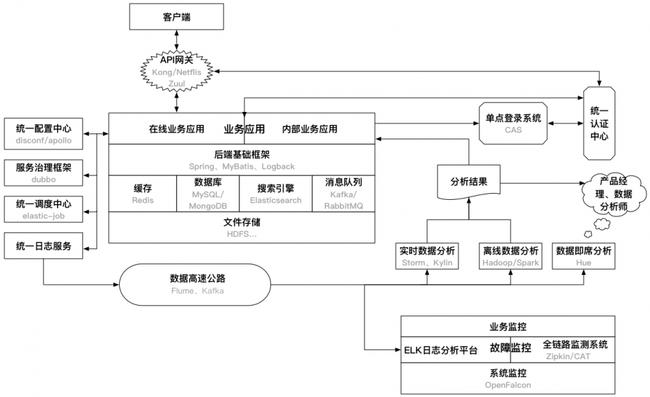
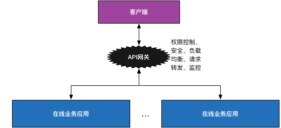

##### 可视化

 探索性分析指理解数据并找出值得分析或分享给他人的精华。而解释性分析，我们迫切希望能够言之有物，讲好某个故事。一个完整的数据可视化过程，主要包括以下4个步骤：确定数据可视化的主题、提炼可视化主题的数据、根据数据关系确定图表、进行可视化布局及设计

###### 数据类型

分类数据：指针反映事物类别的数据。如：用户的设备可以分为Iphone用户和andorid用户两种；支付方式可以分为支付宝、微信、现金支付三种等。诸如此类的分类所得到的数据被称为分类数据。

时序数据：也称时间序列数据，是指同一统一指标按时间顺序记录的数据列。如:每个月的新增用户数量、某公司近十年每年的GMV等。诸如此类按时间顺序来记录的指标对应的数据成为时序数据。

空间数据：指用来表示空间实体的位置、形状、大小及其分布特征诸多方面信息的数据，它可以用来描述来自现实世界的目标，它具有定位、定性、时间和空间关系等特性。

多变量：数据通常以表格形式的出现，表格中有多个列，每一列代表一个变量，将这份数据就称为多变量数据，多变量常用来研究变量之间的相关性。即用来找出影响某一指标的因素有哪些。

###### 可视化形式

在做可视化的过程中，我们需要先明确我们有什么数据，然后再去研究这些数据适合做什么类型的可视化，再然后从这些适合的可视化类型中选择能够很好的满足我们需求的视图。

为了找到合适的可视化形式我们需要先介绍两个内容：有哪些可视化形式、如何让可视化更加清晰。

  1. 有哪些可视化形式：基于数据的可视化形式有：视觉暗示、坐标系、标尺、背景信息以及前面四种形式的任意组合。① 视觉暗示：指通过查看图表就可以与潜意识中的意识进行联系从而得出图表表达的意识。常用的视觉暗示主要有：位置（位置高低）、长度（长短）、角度（大小）、方向（方向上升还是下降）、形状（不同形状代表不同分类）、面积（面积大小）、体积（体积大小）、饱和度（色调的强度，就是颜色的深浅）、色调（不同颜色）。
      坐标系：这里的坐标系和我们之前数学中学到的坐标系是相同的，只不过坐标轴的意义可能稍有不同。常见的坐标系种类有：直角坐标系、极坐标系和地理坐标系。
     ③ 标尺：前面说到的三种坐标系只是定义了展示数据的维度和方向，而标尺的作用是用来衡量不同方向和维度上的大小，其实和我们熟悉的刻度挺像。④ 背景信息：此处的背景和我们在语文中学习到的背景是一个概念，是为了说明数据的相关信息（who、what、when、where、why），使数据更加清晰，便于读者更好的理解。⑤ 组合组件：组合组件就是根据目标用途将上面四种信息进行组合。

2. 如何让可视化更加清晰① 建立视觉层次：把图表在视觉上进行分层，把非重点信息弱化，重点信息强化突出。② 增强图标可读性：让数据点更容易比较 、留白，图表之间留有一定空间的空白。③ 高亮显示重点内容：高亮就是以特殊形式显示的内容，便于读者在一堆数据中很快抓住重点。注释可视化：一般指图标的标题部分。帮助读者更好地理解图表的意思。

 可视化元素由3部分组成：可视化空间+标记+视觉通道， 数据可视化的显示空间，通常是二维。三维物体的可视化，通过图形绘制技术，解决了在二维平面显示的问题。 标记，是数据属性到可视化几何图形元素的映射，用来代表数据属性的归类。根据空间自由度的差别，标记可以分为点、线、面、体，分别具有零自由度、一维、二维、三维自由度。如我们常见的散点图、折线图、矩形树图、三维柱状图，分别采用了点、线、面、体这四种不同类型的标记。数据属性的值到标记的视觉呈现参数的映射，叫做视觉通道，通常用于展示数据属性的定量信息。常用的视觉通道包括：标记的位置、大小、形状、方向、颜色等。

 如果Python没有在其标准库中找到该模块，它将检查外部模块。这个操作也是以一种非常特殊的顺序进行的。它将首先在当前目录中进行搜索，然后移动到包安装的目录。 要让Python认识到一个目录是一个模块，也该目录必须包含一个__init_ .py文件。这样做是为了防止意外的名称冲突 

 求和编码通过比较某一特征取值下对应标签（或其他相关变量）的均值与标签的均值之间的差别来对特征进行编码。  Helmet编码是仅次于OHE和SumEncoder使用最广泛的编码方法，与SumEncoder不同的是，它比较的是某一特征取值下对应标签（或其他相关变量）的均值与他之前特征的均值之间的差异，而不是和所有特征的均值比较。

 对于无序的离散特征，实战中使用 OneHot, Hashing, LeaveOneOut, and Target encoding 方法效果较好，但是使用OneHot时要避免高基类别的特征以及基于决策树的模型， 使用Xgboost处理高维稀疏的问题效果并不会很差。  对于有序离散特征，尝试 Ordinal (Integer), Binary, OneHot, LeaveOneOut, and Target. Helmert, Sum, BackwardDifference and Polynomial 基本没啥用，但是当你有确切的原因或者对于业务的理解的话，可以进行尝试。 对于回归问题而言，Target 与 LeaveOneOut 方法可能不会有比较好的效果。LeaveOneOut、WeightOfEvidence、James-Stein、M-estimator 适合用来处理高基数特征。Helmert、Sum、Backward Difference、Polynomial 在机器学习问题里的效果往往不是很好(过拟合的原因)。

##### 数据分析框架和任务拆解

 现在从某个产品获取到了很多用户的意向信息，需要怎么把这些数据和业务结合在一起？ 先对意向信息的有效性、质量、真实性进行识别和明确：首先，信息的采集渠道有哪些，各自的准确度，用boston矩阵进行拆解分析，最终进行权衡；采集到信息的完整性，能够描述意向的指标内容项有哪些，是不是都具备了；信息的衍生指标；商品的衍生信息；对于用户的第三方平台数据信息，譬如征信记录、银行存款、信用额度等等。通过对以上信息的综合整理，构建一个基于用户的线索池，进行自我交叉验证；构建一个外部数据池，进行三方交叉验证，最终沉淀下来的基本上就是能够应用的数据。

 在经过第一层模型的数据筛选处理之后的信息我们认为是可靠的，这时候单一部门已经没办法让数据的价值得到充分的体现，必须是跨部门的协同合作，  就是这些信息在经过一个流程的时候，需要过哪些人的审批、执行、落地、跟踪，之后由谁来负责将意向转换为业务语言进行需求对接，最后的结果怎么样。 

建立意见反馈机制，当信息识别分类异常、错误时，应收集相关信息及时调整规则

搭建数据信息匹配模型，筛选出可以进行优先级排序的指标项，分配权重系数

当业务经过一段时间的沉淀，很多人为敲定的规则能够通过机器的方式进行判断，这时候就能够去沉淀业务规则，从经验决策转变为数据决策。

信息的匹配模型，可以划分为三个阶段：输入层、处理层、输出层，在处理层就会关联到原有的产品逻辑和流程规则。这个过程和神经网络算法实际上有点儿类似，得有人告诉我这项业务的判断依据，也就是做决策时需要观测的数据指标项，分别由哪些类目构成，然后在有多重因素的情况下人为判断是怎么做的选择，决策之后的结果交付的下游方是谁。

形成数据闭环，数据应用的结果需要进行跟进，反哺规则、算法、模型上的迭代

在实际的业务过程里面永远不存在一次性分析，毕竟市场在变、环境在变、生活方式在变、人的行为习惯喜好也都在变化的过程里面，用户和产品都在成长，所以这时候可以引入一个叫做生命周期的词语来进行区别。

对于产品而言，它有产品全生命周期，包括线索、商机、需求、需求开发、产品实现、市场推广、市场占有饱和、用户衰减、产品迭代、用户维护等等一系列的过程；
对于用户而言，它的生命周期实际上是成timeline形式，接触平台、成为新手玩家、了解规则成为朋友、恋爱期的粘性用户、蜜月期的忠诚、逐渐冷淡之后的消沉、分手之后的死亡；
对于商品而言，在设计师的各种脑暴和灵魂创造之后，可以概括为设计、生产、上市、热卖、退市、处理几个阶段；

##### 关系网络

关系组网功能、网络可视化展示 、图算法的支持、子网络划分与子网特征计算 、其他业务功能，如中文分词、中文模糊匹配、一个网络在时间轴上的动态监测

###### 关系组网

异构关系网络：每一个节点都可能由不同类型的数据组成的。这种关系网络的构建相对是比较简单，只需要把客户申请信息、合规获取的隐私信息，做一个数据提取，然后把数据按照公司的业务要求生成对应的点和边，那样关联起来那就构成了这样的一个异构关系网络。
同构关系网络：同构关系网络比异构关系网络复杂，需要对每个不同类型的节点进行同一人模型化。通常，通过对借贷申请人的手机号，IMEI，身份证号等唯一信息节点数据进行同一人模型化，生成对每个借款人的唯一识别码，再用这些借款人的唯一识别码进行重新组网，生成同构关系网络。

##### 精细化用户增长

###### 事件分析

事件研究是根据某一事件发生前后的资料统计，采用特定技术测量该事件影响性的一种定量分析方法。运营当中的事件分析，是追踪或记录的用户行为或业务过程的。举个栗子，一个电商产品可能包含如下事件：用户注册、浏览商品、添加购物车、支付订单等。事件细分：对某一行为的无限细分，定位影响行为的因素，也是对用户分群的过程。 下钻、下钻这是事件分析的特点。

###### 漏斗分析

营销漏斗模型指的是营销过程中，将非潜在客户逐步变为客户的转化量化模型。营销漏斗模型的价值在于量化了营销过程各个环节的效率，帮助找到薄弱环节。也就是说营销的环节指的是从获取用户到最终转化成购买这整个流程中的一个个子环节，相邻环节的转化率则就是指用数据指标来量化每一个步骤的表现。所以整个漏斗模型就是先将整个购买流程拆分成一个个步骤，然后用转化率来衡量每一个步骤的表现，最后通过异常的数据指标找出有问题的环节，从而解决问题，优化该步骤，最终达到提升整体购买转化率的目的，整体漏斗模型的核心思想其实可以归为分解和量化。

###### 留存分析

留存分析是一种用来分析用户参与情况/活跃程度的分析模型，考察进行初始行为的用户中，有多少人会进行后续行为。这是用来衡量产品对用户价值高低的重要方法。 一个常见的留存曲线，我把它分成了三个部分：第一部分是振荡期，第二部分是选择期，第三部分是平稳期。 

 细分用户群体，分析每个产品功能点对用户留存情况的影响，我们不仅可以把收藏拿出来对比，点赞，转发，评论，关注等等都可以对比。 

#### 麦肯锡的分析思维

##### 金子塔原理

任何一件事情都有一个中心论点，中心论点可以划分成3～7个分论点，分论点又可以由3～7个论据支撑。层层拓展，这个结构由上至下呈金字塔状。

##### MECE

金字塔原理有一个核心法则MECE，全称Mutually Exclusive Collectively Exhaustive，中文意思是相互独立，完全穷尽。它指导我们如何搭建结构。每个分论点彼此应该没有冲突和耦合，都属于独立的模块。完全穷尽，则是所有的分论点都被提出，不会有遗漏。如何划分分论点，我们可以用事物间的不同特性划分，它本质上也是一个分类问题，目的是找出事物（论点）之间的共性。

在分解问题的模式，其实是指从哪些角度来来分解问题。通常而言，可以从时空维度，即问题按时间与空间的关系进行分解。可以从成分维度，即问题在物理上或者社会意义上的构成进行分解。可以从要素维度，即问题的影响因素上进行分解，已经不再简单的考虑时空和关系。同时也可以从逻辑维度，即将问题中的逻辑连接进行分解。在问题的分解中，基于时空分解的落脚点在于时间和空间，其反应的是事物的结构和变化情况。

###### 基于时空分解

在在问题的分解中，基于时空分解的落脚点在于时间和空间，其反应的是事物的结构和变化情况。

在时间维度上，就是把整体的时间，按照时间顺序划分为不同的时间单位，并在时间轴上进行对比，体现出对象在不同时间的变化情况。这个时间段比前一个时间段是增加还是减少，这个时间段的数据和其他时间段的数据相比，变化的幅度有多少。在时间维度上，除了按照标准的时间单位分解外，也可以通过事物发展的阶段分解，比如在市场营销中就把产品的生命周期分为了”导入期-成长期-成熟期-衰退期”四个阶段.

此外，在时间维度上，还可以按照流程进行分解，比如将业务处理或者生产中的每一个步骤分解出来，对比流程中每个点的产出，就能够知道每个点的效率。在电商中，从搜索到最终下单有若干个步骤，对比经历每个步骤的人群，就可以知道每步的转化情况。

在空间的维度上，就将对象从按照空间的组成进行分解成不同的单位。

###### 基于成分分解

这基于成分的分解，是将分析对象按照其在物理和在社会关系的维度上，分解成各个子对象的方式，其中既包括了以人群为对象的分解，同时也包括了以事物为对象的分解。

以人群为对象，顾名思义，就是将一大群人按照某种特征和相关的关系，分成一个又一个的小群体，在这个基础上，可以对比对象之间的数据分布。

以事物为对象，是将事物根据按照更小的颗粒度进行分解。事物相对人群而言，构成更加丰富，成分之间的关联也变得多样化起来。因此围绕事物进行分解，也会呈现出多种形式。

在针对事物的分解中，可以将产品按照形态或者组合进行分解，对现在的很多公司而言，都有不同的产品线，各个产品线中又有不同的产品，产品线的宽度和深度都共同的构成了公司的产品体系，因此按照“产品体系-产品线-产品“的维度，就可以把公司的所有产品，按照隶属关系，一步步拆分成更小的集合。在这种情况，能够对比产品的销售贡献情况和利润情况。

除了实物以来，事物可以按照社会形态进行分解，一个常见的情况就是根据行业分解，分解以后分析各个行业的情况，包括从业人数，经济产出等等。例如一家公司就可以分析各个行业市场的份额，销售金额，利润，从而制定出相关的市场组合决策。当然在行业下面，还可以拆分成不同的公司，可以进一步分析各个客户的贡献情况。

以事物为对象的分解，一方面可以在物理成面展开，还有一方面可以在社会关系层面展开，总之展开的方向可以多样，不仅仅是产品，部件和行业的形式，总之只要能够想到合理的形式，都可以步步分解。

###### 基于要素的分解

很多时候，问题可以分解为不同的要素，可以在不同的维度上来将问题拆分为更小的对象。问题可以有多种多样，通常有一些对问题的拆分方法就是按照要素的模式对事物进行分解。

5W1H是对问题的按照六个维度进行分解，分别围绕对象（何事What）、原因（何因Why）、地点（何地Where）、时间（何时When）、人员（何人Who）、方法（何法How）对问题的进行展开。在5W1H中既可以引入定性的因素，也可以引入定量的因素。当对比其中一个维度时，就可以拉通其余的五个要素进行对比。比如产品的销售可以按照，时间、地点、人员、方式等维度进行依次对比。

在营销领域中，也将营销问题按照要素进行展开，其中4P理论就是一个典型的例子。在4P理论中，将营销分为了产品、价格、渠道、促销四个要素。在对营销问题的拆解中，可以围绕这几个方面进行分拆和对比。比如对比不同产品的价格情况，不同产品的促销手段，不同产品的渠道覆盖等等。

###### 基于逻辑分解

在针对问题的拆分中，有种方式是基于逻辑进行拆分，当问题基于逻辑拆分后，分解出来的单位之间具有逻辑关联的关系，在逻辑关联中还伴随着数学运算。在逻辑联接中，计算包括了加减乘除，加权汇总甚至到微积分的关系，随着逻辑链接的丰富和深入，更多更高深的计算关系也会出现。

###### 假设先行

以假设作为思考的起点，在做出假设后，引导思维去挖掘分论点，然后分析，只要作出了假设，就能用MECE原则画出金字塔结构。不要想着从无尽的业务和数据中找出规律，这叫大海捞针。这种根据问题作为中心论点形成的结构化思维，叫做问题树。

###### 关键驱动因素

关键驱动因素是分析的核心，应该聚焦于这些因素，不然你会有数不完的因素要分析。如果一家企业成本的关键因素是地租、房租，那么就不应该深入分析办公用品成本。提出假设—MECE原则—结构化分析—找出关键驱动因素—数据分析

数仓经常会碰到的两类问题：

1、两个数据报表进行对比，结果差异很大，需要人工核对分析指标的维度信息，比如从头分析数据指标从哪里来，处理条件是什么，最后才能分析出问题原因       ——数据回溯问题

2、基础数据表因某种原因需要修改字段，需要评估其对数仓的影响，费时费力，然后在做方案        —— 影响分析问题

这两类问题都属于数据血缘分析问题，数据血缘分析还有其它的积极意义，比如：

问题定位分析

类似于影响分析，当程序运行出错时，可以方便找到问题的节点，并判断出问题的原因以及后续的影响

指标波动分析

当某个指标出现较大的波动时，可进行溯源分析，判断是由哪条数据发生变化所导致的

数据体检

判定系统和数据的健康情况，是否存在大量的冗余数据、无效数据、无来源数据、重复计算、系统资源浪费等问题

数据评估

通过血缘分析和元数据，可以从数据的集中度、分布、冗余度、数据热度、重要性等多角度进行评估分析，从而初步判断数据的价值

##### 结构思维

结构思维就是对应着数据分析的目的。需要通过数据分析来解释的问题，无外乎在三个方面：what，why，how即是什么，为什么以及怎么样三个方面的问题。针对问题的拆分和对比也是围绕着三个点展开。对what而言，就是需要了解现在的情况是什么样子，有哪些对象，在对象中涵盖了哪些数据，对象可以分成哪些部分，各个部门数据的大小如何，主要的数据贡献是来自于哪些地方等等。What就是状态进行展开，尤其是现状展开。比如分析现在各家产商的份额就是属于what的问题。

对why而言，比what更进一步，从现状进行回溯，需要通过分析来理清问题发生的因果关系以及对象之间的逻辑关系。和what聚焦静态数据相比，why更专注于动态数据，重点在考察哪些数据在不同的情况下发生的变化。比如需要分析市场份额为什么发生的变化，价格为什么上涨或者下降等等。

对how而言，从关注原因发展到了关注结果，更注重未来的情况，各个对象的数据未来会如何变化，对于分析的对象而言未来是什么样子。比如在制定了一项市场决策后，就会预测未来的投资收益情况。

用户画像的标签一般通过两种形式获得，基于已有数据或者一定规则加工，流失标签和距今天数皆是。另外一种是基于已有的数据计算概率模型，会用到机器学习和数据挖掘。

用户画像一般按业务属性划分多个类别模块。除了常见的人口统计，社会属性外。还有用户消费画像，用户行为画像，用户兴趣画像等。具体的画像得看产品形态，像金融领域，还会有风险画像，包括征信、违约、洗钱、还款能力、保险黑名单等。电商领域会有商品的类目偏好、品类偏好、品牌偏好

##### 数据指标体系

 指标体系就是将各类数据指标系统性的关联起来，按照具体的产品类型，将指标按照其不同的属性及维度进行分类分层。数据指标常用于评价产品业务的好坏，通过对数据指标的拆解能够得出产品、策略、运营等各方面目前存在的问题，从而得出优化方向。非体系化的指标通常是单点分析，无法串联更多关联指标进行全局的分析评估，而体系化的指标则可以综合不同的指标不同的维度串联起来进行全面的分析，会更快的发现目前产品和业务流程存在的问题。

在构建指标体系的过程中，首要动作就是明确指标的分类以及约束指标命名方式，使各个指标能够做到见名知意、减少沟通成本，这里我们按照阿里对指标的划分规范指标命名：

指标分为原子指标和派生指标。

原子指标是基于某一业务事件行为下的度量，是业务定义中不可再拆分的指标，是具有明确业务含义的名词 ，体现明确的业务统计口径和计算逻辑，例如支付金额。

原子指标=业务过程+度量
派生指标=时间周期+修饰词+原子指标，派生指标可以理解为对原子指标业务统计范围的圈定。

###### 思考产品类型，梳理业务流程

搭建指标体系的第一步，应该先明确产品的类型，明确业务究竟是什么，目标是什么。梳理出业务流程，形成一个指标体系框架。不同业务类型的产品会有不同的指标体系框架。例如电商类产品，指标框架可能涵盖：

 而o2o类产品，它的框架可能涵盖：(以下指标均可根据o2o业务类型，拆分买/卖家、司机/乘客 等多端) 

###### 指标体系拆分

 搭建完体系框架后，将指标按照流程的阶段及其属性进行指标分类，尽可能全面找出每种类型应该关注的相应指标有哪些，有哪些指标可以反应流程节点的问题。由于数据分析师/数据产品距离业务较远，以及数据指标最直接的需求者是业务部门，故还应该与其他各个部门沟通。去收集相应的业务指标需求，共同沟通每个指标的合理性，能否反应业务实际的问题，确定每个指标的具体含义，完善指标体系框架，确定统计的维度和粒度。最终敲定一版双方均认可的指标体系方案。这里需要注意一些细节：

​    一是我们可以把指标按重要程度及分类，将其分为一级、二级、三级指标，将我们搭建指标体系的过程进行分段拆解，确保搭建指标的条理性，保证每个阶段都有相应的产出。

​    二是注意数据的产出时效，明确每个指标是实时数据/小时级数据/次日数据，在可行的情况下满足业务需求。

​    三是尽量确保各指标应该和直接相关部门的考核挂钩。

###### 验证指标可行性

 指标体系方案敲定后，就可开始着手整理底层数据的存储逻辑，明确每个字段要从哪里获取，每张表应该涵盖哪些指标哪些字段维度。这个过程可能会出现很多问题，例如1、想做的的指标没有埋点所以无法获取，2、有埋点但是数据未传 3、数据缺失、错误严重。我们需要整理出这些存在的问题并将问题归类，找到相应数据仓库、埋点研发负责的部门寻求配合，沟通存在的问题并商定问题的解决方案，明确协作的过程及责任划分，确认排期。这个过程中，建议每周将指标体系搭建项目做一次进度汇报，让相关部门及上级了解目前具体的项目进展，促进部门之间的配合，有利于项目正常进行。

​    当底层数据ready后，就可以按照整理的逻辑，指标计算方式，正常进行指标计算，报表开发了。过程中切记数据准确性的校验，确保所有自己出口的数据都是相对准确的，标明数据口径，如有数据不完备的情况需标明原因及后续预计解决计划。

###### 指标数据可视化

  数据指标底层报表建好后，只是一些数值而已。让这些数据真正的被人用起来，才能发挥它的价值。这时候可以用公司的数据产品或者第三方数据产品来将这些指标进行数据可视化展示，以便于业务概览及异常数据监控，还可以根据一些业务实际问题，进行一些分析报告的产出。其实很多数据分析师的痛点在于没数据，数据不全，解决指标体系搭建问题后，相信大家都如鱼得水，可以开始做自己擅长的分析了! 

 根据业务调整，指标体系持续更新优化 

##### 数据分析指南

数据指标定义了你数据分析目的（数据分析往往是为了提升某个数据指标或降低某个数据指标，发现潜藏问题、寻找潜藏机会），而数据收集则给数据分析提供了基础。

数据指标：对当前业务有参考价值的可统计数据。数据指标对于产品而言就是说什么数据能衡量你们业务的好坏？什么数据对于你们产品是十分重要的？比如用户数、订单数、销售额、浏览数。数据指标可能有一个或多个没有固定约束，依据业务需求定义。

###### 定义指标的方法

1. 确认模块或产品特性：确认与模块特性相关的关键指标。市面上的产品或功能基本能用以下几个模块进行划分，大家在使用时可进行相似归类，套用这个模版。

内容：内容类型产品主要关注用户使用时长和频次。
常用指标：浏览数、浏览时长、内容互动情况（弹幕、评论、点赞）

社交：社交类型产品主要关注用户与用户之间的关系密度（紧密、多少）、和用户活跃程度。
常用指标：发布量（社区使用）、互动量、关系密度（关注用户数、发送消息数）

工具：工具类型产品主要关注用户使用频次和使用完成度。
常用指标：使用量、频次、流程达成率（目标产品的用户流程较为简单，查看用户是否完成整个流程）

交易：交易类型产品主要关注用户交易规模和整个交易流程的转化率。
常用流程：详情页转化率（核心场景转化率）、金额（总交易规模）、客单价、复购率

2. 确认核心业务：确认体现核心业务健康程度的指标。其实上面的指标定义方法可以涵盖大多部分使用场景，但是如果你是为你们平台制定一个总指标的时候，那就需要用核心业务确认总指标。确认核心业务的方法：平台靠什么盈利。

###### 数据收集方法

数据收集主要是需要开发同学来进行埋点，我们需要定义埋在哪里。定义数据埋点我梳理了有以下两种方法：一种基于业务流程，一种基于功能被使用的情况，根据业务需求选择即可。

1. 以业务流程进行埋点，就是梳理业务流程，再统计各流程的数据。这种埋点方式可以发现用户前后的两个环节是否有巨大断层，或者远低或远高于行业水平，从而优化各个环节的转化率（其实就是漏斗）。

适用场景：页面层级清晰有明确的业务流程，每个页面有明确的业务目标（下单、支付）。使用方法：梳理业务流程后在各个页面或各个行为进行埋点即可。做漏斗的时候，记住用户行为一定是有连贯性的、有顺序的、有时间限制的，基于用户还是事件要想清楚。    

中间就是根据业务流程梳理的需要统计的页面。左边是根据事件进行埋点得到的数据，右边为真实用户数据（去重后），就是告诉一下大家基于用户/事件得到的数据是不同的。当然事件和用户可以都进行统计，这样可以算出其他的一些数据，比如用户平均浏览多少个商品、平均浏览多少个分类、购买成功页面有多少用户进行分享。

2. 以功能模块拆解进行埋点。功能模块拆解，你们也可以理解为对对应数据指标的细化。以社交模块为例，直接通过脑图的方式进行说明，这种埋点方式可以体现功能模块的健康程度。

收集数据时如数据有明显的周期性则以该周期作为单位进行收集和比较。如某应用周末用户活跃度明显上升，则建议以周为单位进行收集。与往期数据对比时，建议同比上一周的数据或本周六的数据同比上周六的数据，这样可减少数据之间的干扰性。

#### 后端基础设施

后端基础设施主要指的是应用在线上稳定运行需要依赖的关键组件或者服务。开发或者搭建好以上的后端基础设施，一般情况下是能够支撑很长一段时间内的业务的。此外，对于一个完整的架构来说，还有很多应用感知不到的系统基础服务，如负载均衡、自动化部署、系统安全等

##### API网口

在移动APP的开发过程中，通常后端提供的接口需要以下功能的支持：负载均衡、API访问权限控制、用户鉴权。一般的做法，使用Nginx做负载均衡，然后在每个业务应用里做API接口的访问权限控制和用户鉴权，更优化一点的方式则是把后两者做成公共类库供所有业务调用。但从总体上来看，这三种特性都属于业务的公共需求，更可取的方式则是集成到一起作为一个服务，既可以动态地修改权限控制和鉴权机制，也可以减少每个业务集成这些机制的成本。这种服务就是API网关，可以选择自己实现。

但是以上方案的一个问题是由于所有API请求都要经过网关，它很容易成为系统的性能瓶颈。因此，可以采取的方案是：去掉API网关，让业务应用直接对接统一认证中心，在基础框架层面保证每个API调用都需要先通过统一认证中心的认证，这里可以采取缓存认证结果的方式避免对统一认证中心产生过大的请求压力。

##### 业务应用和后端基础框架

业务应用分为：在线业务应用和内部业务应用。在线业务应用：直接面向互联网用户的应用、接口等，典型的特点就是：请求量大、高并发、对故障的容忍度低。内部业务应用：主要面向公司内部用户的应用。比如，内部数据管理平台、广告投放平台等。相比起在线业务应用，其特点: 数据保密性高、压力小、并发量小、允许故障的发生。

业务应用基于后端的基础框架开发，针对Java后端来说，应该有以下几个框架：MVC框架：统一开发流程、提高开发效率、屏蔽一些关键细节的Web/后端框架。典型的如SpringMVC、Jersey以及国人开发的JFinal以及阿里的WebX。

IOC框架：实现依赖注入/控制反转的框架。Java中最为流行的Spring框架的核心就是IOC功能。

ORM框架：能够屏蔽底层数据库细节，提供统一的数据访问接口的数据库操作框架，额外地能够支持客户端主从、分库、分表等分布式特性。MyBatis是目前最为流行的ORM框架。此外，Spring ORM中提供的JdbcTemplate也很不错。当然，对于分库分表、主从分离这些需求，一般就需要自己实现，开源的则有阿里的TDDL、当当的sharding-jdbc（从datasource层面解决了分库分表、读写分离的问题，对应用透明、零侵入）。缓存框架：对Redis、Memcached这些缓存软件操作的统一封装，能够支持客户端分布式方案、主从等。一般使用Spring的RedisTemplate即可，也可以使用Jedis做自己的封装，支持客户端分布式方案、主从等。

JavaEE应用性能检测框架：对于线上的JavaEE应用，需要有一个统一的框架集成到每一个业务中检测每一个请求、方法调用、JDBC连接、Redis连接等的耗时、状态等。

##### 缓存、数据库、搜索引擎、消息队列

缓存、数据库、搜索引擎、消息队列这四者都是应用依赖的后端基础服务，他们的性能直接影响到了应用的整体性能。

缓存: 缓存通常被用来解决热点数据的访问问题，是提高数据查询性能的强大武器。在高并发的后端应用中，将数据持久层的数据加载到缓存中，能够隔离高并发请求与后端数据库，避免数据库被大量请求击垮。目前常用的除了在内存中的本地缓存，比较普遍的集中缓存软件有Memcached和Redis。

数据库：数据库可以说是后端应用最基本的基础设施。基本上绝大多数业务数据都是持久化存储在数据库中的。主流的数据库包括传统的关系型数据库（MySQL、PostgreSQL）以及最近几年开始流行的NoSQL（MongoDB、HBase）。其中HBase是用于大数据领域的列数据库，受限于其查询性能，一般并不用来做业务数据库。

搜索引擎：搜索引擎是针对全文检索以及数据各种维度查询设计的软件。目前用的比较多的开源软件是Solr和Elasticsearch，不同之处主要在于termIndex的存储、分布式架构的支持等。Elasticsearch由于对集群的良好支持以及高性能的实现，已经逐渐成为搜索引擎的主流开源方案。

消息队列：数据传输的一种方式就是通过消息队列。目前用的比较普遍的消息队列包括为日志设计的Kafka以及重事务的RabbitMQ等。在对消息丢失不是特别敏感且并不要求消息事务的场景下，选择Kafka能够获得更高的性能；否则，RabbitMQ则是更好的选择。

##### 文件存储

不管是业务应用、依赖的后端服务还是其他的各种服务，最终还是要依赖于底层文件存储的。通常来说，文件存储需要满足的特性有：可靠性、容灾性、稳定性，即要保证存储的数据不会轻易丢失，即使发生故障也能够有回滚方案，也要保证高可用。在底层可以采用传统的RAID作为解决方案，再上一层，目前Hadoop的HDFS则是最为普遍的分布式文件存储方案，当然还有NFS、Samba这种共享文件系统也提供了简单的分布式存储的特性。此外，如果文件存储确实成为了应用的瓶颈或者必须提高文件存储的性能从而提升整个系统的性能时，那么最为直接和简单的做法就是抛弃传统机械硬盘，用SSD硬盘替代。

##### 统一认证中心

统一认证中心，主要是对APP用户、内部用户、APP等的认证服务，包括用户的注册、登录验证、Token鉴权内部信息系统用户的管理和登录鉴权APP的管理，包括APP的secret生成，APP信息的验证（如验证接口签名）等。之所以需要统一认证中心，就是为了能够集中对这些所有APP都会用到的信息进行管理，也给所有应用提供统一的认证服务。尤其是在有很多业务需要共享用户数据的时候，构建一个统一认证中心是非常必要的。此外，通过统一认证中心构建移动APP的单点登录也是水到渠成的事情：模仿Web的机制，将认证后的信息加密存储到本地存储中供多个APP使用。

##### 单点登录系统

目前很多大的在线Web网站都是有单点登录系统的，通俗的来说就是只需要一次用户登录，就能够进入多个业务应用（权限可以不相同），非常方便用户的操作。而在移动互联网公司中，内部的各种管理、信息系统甚至外部应用同样也需要单点登录系统。

##### 统一配置中心

在Java后端应用中，一种读写配置比较通用的方式就是将配置文件写在Propeties、YAML、HCON等文件中，修改的时候只需要更新文件重新部署即可，可以做到不牵扯代码层面改动的目的。统一配置中心，则是基于这种方式之上的统一对所有业务或者基础后端服务的相关配置文件进行管理的统一服务, 具有以下特性：能够在线动态修改配置文件并生效配置文件可以区分环境（开发、测试、生产等）在Java中可以通过注解、XML配置的方式引入相关配置

##### 服务治理框架

对于外部API调用或者客户端对后端API的访问，可以使用HTTP协议或者RESTful。但对于内部服务间的调用，一般都是通过RPC机制来调用的。目前主流的RPC协议有：RMI、Hessian、Thrift、Dubbo这些RPC协议各有优劣点，需要针对业务需求做出最好的选择。这样，当你的系统服务在逐渐增多，RPC调用链越来越复杂，很多情况下，需要不停的更新文档来维护这些调用关系。一个对这些服务进行管理的框架可以大大减少因此带来的繁琐的人力工作。传统的ESB（企业服务总线）本质就是一个服务治理方案，但ESB作为一种proxy的角色存在于Client和Server之间，所有请求都需要经过ESB，使得ESB很容易成为性能瓶颈。因此，基于传统的ESB，更好的一种设计如下图所示：

如图，以配置中心为枢纽，调用关系只存在于Client和提供服务的Server之间，就避免了传统ESB的性能瓶颈问题。对于这种设计，ESB应该支持的特性如下：服务提供方的注册、管理服务消费者的注册、管理服务的版本管理、负载均衡、流量控制、服务降级、资源隔离服务的容错、熔断

##### 统一调度中心

在很多业务中，定时调度是一个非常普遍的场景，比如定时去抓取数据、定时刷新订单的状态等。通常的做法就是针对各自的业务依赖Linux的Cron机制或者Java中的Quartz。统一调度中心则是对所有的调度任务进行管理，这样能够统一对调度集群进行调优、扩展、任务管理等。Azkaban和Yahoo的Oozie是Hadoop的流式工作管理引擎，也可以作为统一调度中心来使用。当然，你也可以使用Cron或者Quartz来实现自己的统一调度中心。根据Cron表达式调度任务动态修改、停止、删除任务支持任务分片执行支持任务工作流：比如一个任务完成之后再执行下一个任务任务支持脚本、代码、url等多种形式任务执行的日志记录、故障报警对于Java的Quartz这里需要说明一下：这个Quartz需要和Spring Quartz区分，后者是Spring对Quartz框架的简单实现也是目前使用的最多的一种调度方式。但其并没有做高可用集群的支持。而Quartz虽然有集群的支持，但是配置起来非常复杂。现在很多方案都是使用Zookeeper来实现Spring Quartz的分布式集群。

##### 统一日志服务

日志是开发过程必不可少的东西。打印日志的时机、技巧是很能体现出工程师编码水平的。毕竟，日志是线上服务能够定位、排查异常最为直接的信息。通常的，将日志分散在各个业务中非常不方便对问题的管理和排查。统一日志服务则使用单独的日志服务器记录日志，各个业务通过统一的日志框架将日志输出到日志服务器上。

##### 数据基础设施

###### 数据高速公路

接着上面讲的统一日志服务，其输出的日志最终是变成数据到数据高速公路上供后续的数据处理程序消费的。这中间的过程包括日志的收集和传输。

收集：统一日志服务将日志打印在日志服务上之后，需要日志收集机制将其集中起来。目前，常见的日志收集方案有：Scribe、Chukwa、Kakfa和Flume。

传输：通过消息队列将数据传输到数据处理服务中。对于日志来说，通常选择Kafka这个消息队列即可。

此外，这里还有一个关键的技术就是数据库和数据仓库间的数据同步问题，即将需要分析的数据从数据库中同步到诸如Hive这种数据仓库时使用的方案。

###### 离线数据分析

离线数据分析是可以有延迟的，一般针对的是非实时需求的数据分析工作，产生的也是延迟一天的报表。目前最常用的离线数据分析技术除了Hadoop还有Spark。相比Hadoop，Spark性能上有很大优势，当然对硬件资源要求也高。其中，Hadoop中的Yarn作为资源管理调度组件除了服务于MR还可以用于Spark（Spark on Yarn），Mesos则是另一种资源管理调度系统。

对于Hadoop，传统的MR编写很复杂，也不利于维护，可以选择使用Hive来用SQL替代编写MR。而对于Spark，也有类似Hive的Spark SQL。

此外，对于离线数据分析，还有一个很关键的就是数据倾斜问题。所谓数据倾斜指的是region数据分布不均，造成有的结点负载很低，而有些却负载很高，从而影响整体的性能。处理好数据倾斜问题对于数据处理是很关键的。

###### 实时数据分析

实时数据处理一般情况下都是基于增量处理的，相对于离线来说并非可靠的，一旦出现故障（如集群崩溃）或者数据处理失败，是很难对数据恢复或者修复异常数据的。因此结合离线+实时是目前最普遍采用的数据处理方案。Lambda架构就是一个结合离线和实时数据处理的架构方案。此外，实时数据分析中还有一个很常见的场景：多维数据实时分析，即能够组合任意维度进行数据展示和分析。目前有两种解决此问题的方案：ROLAP和MOLAP。ROLAP：使用关系型数据库或者扩展的关系型数据库来管理数据仓库数据，以Hive、Spark SQL、Presto为代表。MOLAP：基于数据立方体的多位存储引擎，用空间换时间，把所有的分析情况都物化为物理表或者视图。以Druid、Pinot和Kylin为代表，不同于ROLAP（Hive、Spark SQL）, 其原生的支持多维的数据查询。

###### 数据即席分析

离线和实时数据分析产生的一些报表是给数据分析师、产品经理参考使用的，但是很多情况下，线上的程序并不能满足这些需求方的需求。这时候就需要需求方自己对数据仓库进行查询统计。针对这些需求方，SQL上手容易、易描述等特点决定了其可能是一个最为合适的方式。因此提供一个SQL的即席查询工具能够大大提高数据分析师、产品经理的工作效率。

##### 故障监控

对于面向用户的线上服务，发生故障是一件很严重的事情。因此，做好线上服务的故障检测告警是一件非常重要的事情。可以将故障监控分为以下两个层面的监控：系统监控：主要指对主机的带宽、CPU、内存、硬盘、IO等硬件资源的监控。可以使用Nagios、Cacti等开源软件进行监控。目前，市面上也有很多第三方服务能够提供对于主机资源的监控，如监控宝等。对于分布式服务集群（如Hadoop、Storm、Kafka、Flume等集群）的监控则可以使用Ganglia。此外，小米开源的OpenFalcon也很不错，涵盖了系统监控、JVM监控、应用监控等，也支持自定义的监控机制。业务监控：是在主机资源层面以上的监控，比如APP的PV、UV数据异常、交易失败等。需要业务中加入相关的监控代码，比如在异常抛出的地方，加一段日志记录。监控还有一个关键的步骤就是告警。告警的方式有很多种：邮件、IM、短信等。考虑到故障的重要性不同、告警的合理性、便于定位问题等因素，有以下建议：告警日志要记录发生故障的机器ID，尤其是在集群服务中，如果没有记录机器ID，那么对于后续的问题定位会很困难。要对告警做聚合，不要每一个故障都单独进行告警，这样会对工程师造成极大的困扰。要对告警做等级划分，不能对所有告警都做同样的优先级处理。使用微信做为告警软件，能够在节省短信成本的情况下，保证告警的到达率。