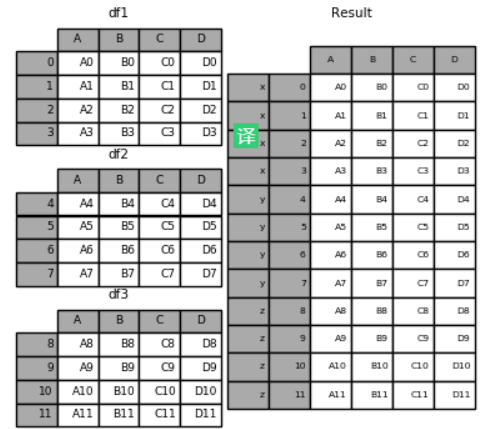
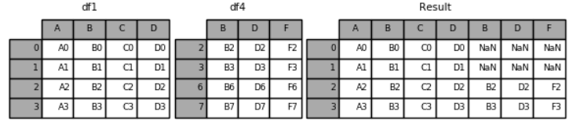

#### Merge, join and concatenate

For binary operations on two ``Series`` or ``DataFrame`` objects, Pandas will align indices in the process of performing the operation.

A similar type of alignment takes place for *both* columns and indices when performing operations on ``DataFrame``s:

When performing operations between a ``DataFrame`` and a ``Series``, the index and column alignment is similarly maintained.
Operations between a ``DataFrame`` and a ``Series`` are similar to operations between a two-dimensional and one-dimensional NumPy array.

###### Concatenating objects

Pandas has a function, ``pd.concat()``, which has a similar syntax to ``np.concatenate`` but contains a number of options that we'll discuss momentarily:

```python
# Signature in Pandas v0.18
pd.concat(objs, axis=0, join='outer', join_axes=None, ignore_index=False,
          keys=None, levels=None, names=None, verify_integrity=False,
          copy=True)
```

``pd.concat()`` can be used for a simple concatenation of ``Series`` or ``DataFrame`` objects, just as ``np.concatenate()`` can be used for simple concatenations of arrays:

If you'd like to simply verify that the indices in the result of ``pd.concat()`` do not overlap, you can specify the ``verify_integrity`` flag.
With this set to True, the concatenation will raise an exception if there are duplicate indices.

Sometimes the index itself does not matter, and you would prefer it to simply be ignored.
This option can be specified using the ``ignore_index`` flag.
With this set to true, the concatenation will create a new integer index for the resulting ``Series``:

Another option is to use the ``keys`` option to specify a label for the data sources; the result will be a hierarchically indexed series containing the data:

By default, the entries for which no data is available are filled with NA values.
To change this, we can specify one of several options for the ``join`` and ``join_axes`` parameters of the concatenate function.
By default, the join is a union of the input columns (``join='outer'``), but we can change this to an intersection of the columns using ``join='inner'``:

Another option is to directly specify the index of the remaininig colums using the ``join_axes`` argument, which takes a list of index objects.
Here we'll specify that the returned columns should be the same as those of the first input:

Because direct array concatenation is so common, ``Series`` and ``DataFrame`` objects have an ``append`` method that can accomplish the same thing in fewer keystrokes.
For example, rather than calling ``pd.concat([df1, df2])``, you can simply call ``df1.append(df2)``:

Keep in mind that unlike the ``append()`` and ``extend()`` methods of Python lists, the ``append()`` method in Pandas does not modify the original object–instead it creates a new object with the combined data.
It also is not a very efficient method, because it involves creation of a new index *and* data buffer.

The `concat()` function does all of the heavy lifting of performing concatenation operations along an axis while performing optional set logic (union or intersection) of the indexes (if any) on the other axes. Note that “if any” because there is only a single possible axis of concatenation for Series.

```python
 result = pd.concat(frames, keys=['x', 'y', 'z'])
```



When gluing together multiple `DataFrames`, you have a choice of how to handle the other axes. This can be done in the following two ways: Take the union of them all, `join='outer'`. Take the intersection, `join='inner'`.

```python
result = pd.concat([df1, df4], axis=1).reindex(df1.index)
```



A useful shortcut to `concat()` are the `append()` instance methods on Series and `DataFrame`.  They concatenate along `axis=0`. Ignoring index on the concatenation axis, use the `ignore_index` argument. You can concatenate a mix of `Series` and `DataFrame` objects. The `Series` will be transformed to `DataFrame` with the column name as the name of the `Series`. If unnamed `Series` are passed they will be numbered consecutively. A fairly common use of the `keys` argument is to override the column names when creating a new `DataFrame` based on existing `Series`. Notice how the default behavior consists on letting the resulting `DataFrame` inherit the parent `Series`’ name, when these existed. 

```python
pieces = {'x': df1, 'y': df2, 'z': df3}
```

Through the `keys` argument we can override the existing column names. You can also pass a dict to `concat` in which case the dict keys will be used for the `keys` argument.


Perhaps the simplest type of merge expresion is the one-to-one join, which is in many ways very similar to the column-wise concatenation.
As a concrete example, consider the following two ``DataFrames`` which contain information on several employees in a company:

The ``pd.merge()`` function recognizes that each ``DataFrame`` has an "employee" column, and automatically joins using this column as a key.
The result of the merge is a new ``DataFrame`` that combines the information from the two inputs.
Notice that the order of entries in each column is not necessarily maintained: in this case, the order of the "employee" column differs between ``df1`` and ``df2``, and the ``pd.merge()`` function correctly accounts for this.
Additionally, keep in mind that the merge in general discards the index, except in the special case of merges by index.

Many-to-one joins are joins in which one of the two key columns contains duplicate entries.
For the many-to-one case, the resulting ``DataFrame`` will preserve those duplicate entries as appropriate.
The resulting ``DataFrame`` has an aditional column with the "supervisor" information, where the information is repeated in one or more locations as required by the inputs.

Many-to-many joins are a bit confusing conceptually, but are nevertheless well defined.
If the key column in both the left and right array contains duplicates, then the result is a many-to-many merge.
This will be perhaps most clear with a concrete example.
Consider the following, where we have a ``DataFrame`` showing one or more skills associated with a particular group.
By performing a many-to-many join, we can recover the skills associated with any individual person:

We've already seen the default behavior of ``pd.merge()``: it looks for one or more matching column names between the two inputs, and uses this as the key.
However, often the column names will not match so nicely, and ``pd.merge()`` provides a variety of options for handling this.

Most simply, you can explicitly specify the name of the key column using the ``on`` keyword, which takes a column name or a list of column names:

At times you may wish to merge two datasets with different column names; for example, we may have a dataset in which the employee name is labeled as "name" rather than "employee".
In this case, we can use the ``left_on`` and ``right_on`` keywords to specify the two column names:

Sometimes, rather than merging on a column, you would instead like to merge on an index.

If you'd like to mix indices and columns, you can combine ``left_index`` with ``right_on`` or ``left_on`` with ``right_index`` to get the desired behavior:

pandas provides a single function, `merge()`, as the entry point for all standard database join operations between DataFrame or named Series objects. If left is a DataFrame or named Series and right is a subclass of DataFrame, the return type will still be DataFrame. The related `join()` method, uses merge internally for the index-on-index and column(s)-on-index join. If you are joining on index only, you may wish to use `DataFrame.join` to save yourself some typing.
 There are several cases to consider which are very important to understand: one-to-one joins, many-to-one joins, many-to-many joins. In standard relational algebra, if a key combination appears more than once in both tables, the resulting table will have the Cartesian product of the associated data.
The `how` argument to `merge` specifies how to determine which keys are to be included in the resulting table. If a key combination does not appear in either the left or right tables, the values in the joined table will be NA.

| method | join Name        | Description                               |
| ------ | ---------------- | ----------------------------------------- |
| left   | left outer join  | use keys from left frame only             |
| right  | right outer join | use keys from right frame only            |
| outer  | full outer join  | use union of keys from both frames        |
| inner  | inner join       | use intersection of keys from both frames |

Users can use the `validate` argument to automatically check whether there are unexpected duplicates in their merge keys. Key uniqueness is checked before merge operations and so should protect against memory overflows. Checking key uniqueness is also a good way to ensure user data structures are as expected.

```python
result = pd.merge(left, right, on='B', how='outer', validate="one_to_one")
pd.merge(left, right, on='B', how='outer', validate="one_to_many")
```

You can join a singly-indexed DataFrame with a level of a MultiIndexed DataFrame. The level will match on the name of the index of the singly-indexed frame against a level name of the MultiIndexed frame. Strings passed as the `on, left_on`, and `right_on` parameters may refer to either column names or index level names. This enables merging DataFrame instances on a combination of index levels and columns without resetting indexes.

 The merge `suffixes` argument takes a tuple of list of strings to append to overlapping column names in the input DataFrames to disambiguate the result columns.

**1. append与assign**

​         1.1. append方法

​         1.2. assign方法

- - **2. combine与update**

  -    2.1. combine方法

  -   2.2. update方法

​       **3. concat方法** 

​        **4. merge与join**

- -   4.1. merge函数

  -   4.2. join函数