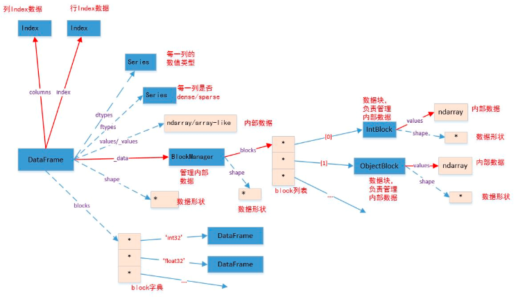

#### Series

将`Series`转换成其他数据类型：`.to_dict()`：转换成字典，格式为`{label->value}`；`.to_frame([name])`：转换成`DataFrame`。`name`为`Index`的名字；`.tolist()`：转换成列表

#### Index

`Index`对象负责管理轴`label`和其他元数据。构建`Series/DataFrame`时，传给`index/columns`关键字的任何数组或者序列都将被转化成一个`Index`。`Index` 对象是不可变的。这样才能够使得`Index`对象在多个数据结构之间安全共享 。`Index`的功能类似一个固定大小的集合。

| `Index`方法                | 作用                                           |
| -------------------------- | ---------------------------------------------- |
| `.append(other)`           | 连接另一个`Index`对象，产生一个新的`Index`对象 |
| `.difference(other)`       | 计算差集，返回一个`Index`对象                  |
| `.isin(values[, level])`   | 计算`Index`中各`label`是否在`values`中         |
| `.drop(labels[, errors])`  | 删除传入的`labels`，得到新的`Index`            |
| `.insert(loc, item)`       | 在指定下标位置插入值，得到新的`Index`          |
| `.unique()`                | 返回`Index`中唯一值的数组，得到新的`Index`     |
| `.get_indexer(target)`     | 获取`target`对应的下标列表。                   |
| `.get_level_values(level)` | 返回指定`level`的`Index`，用于`MultiIndex`     |
| `.get_loc(key)`            | 返回指定`label`处的下标，由`key`指定           |
| `.get_value(series, key)`  | 寻找`Series`指定`label`处的值。                |

#### `MultiIndex`

`MultiIndex`：层次化索引对象，表示单个轴上的多层索引。可以看做由元组组成的数组；

`MultiIndex`代表的是多级索引对象。它继承自`Index`，其中的多级`label`采用元组对象来表示。在`MultiIndex`内部，并不直接保存元组对象，而是使用多个`Index`对象保存索引中每级的`label`。

| 创建函数                             | 说明                                                         |
| ------------------------------------ | ------------------------------------------------------------ |
| `MultiIndex.from_arrays(arrays)`     | 将二维序列转换为`MultiIndex`。                               |
| `MultiIndex.from_tuples(tuples)`     | 将元组序列转换为`MultiIndex`。                               |
| `MultiIndex.from_product(iterables)` | 根据多个可迭代对象生成一个`MultiIndex`，其中使用笛卡尔积的算法。 |

#### `DataFrame`

`DataFrame` 是一个表格型的数据结构，它含有一组有序的列，每一列都可以是不同的值类型。其中`object`类型可以保存任何`python`对象，比如字符串。同一列必须是相同的值类型。`DataFrame` 既有行索引，又有列索引。他可以被看作为`Series`组成的字典；`DataFrame`中面向行和面向列的操作基本上是平衡的。其实`DataFrame`中的数据是以一个或者多个二维块存放的

常见的构造`DataFrame`有以下情况：二维`ndarray`：`data`就是数据，此时可以传入`index/columns`参数；一个字典，其中字典的值为一维数组、一维列表、一维元组：此时每个键就是列索引，对应的值就是列数据。要求所有序列的长度相同；`numpy`的结构化数组；`Series`组成的字典：如果没有显式的指定行索引，那么各个`Series`的索引将会被合并成`DataFrame`的行索引；字典的字典：各个内层字典会成为一列，键会被合并成结果的行索引；字典或者`Series`的列表：每一项将会成为`DataFrame`的一行。字典的键、`Series`索引的并集将会成为`DataFrame`的列索引；列表、元组组成的列表：类似于二维`ndarray`；另一个`DataFrame`：该`DataFrame`的索引将会被沿用，除非显式指定其他索引；`numpy`的`MaskedArray`：类似于二维`ndarray`，只是掩码值在结果`DataFrame`中会变成`NA/缺失值`

可以通过下面的类方法从其他数据结构中创建`DataFrame`：`DataFrame.from_dict(data, orient='columns', dtype=None)`：从字典中创建`DataFrame`：`data`：是个字典，其格式为： `{key:array-like}`或者`{key:dict}`；`orient`：指定了`key`为行还是列。参数的值为`'columns'`；或者`'index`；

`DataFrame.from_items(items, columns=None, orient='columns')`：从元组序列中创建`DataFrame`。`items`：为元组序列，元组格式为：`(key,value)`，其中`value`为表示一维数据的序列或者`Series`对象；`columns`：一个序列，给出列的`labels`。

##### Performance

The ``eval()`` function in Pandas uses string expressions to efficiently compute operations using ``DataFrame``s. ``pd.eval()`` supports the ``&`` and ``|`` bitwise operators. In addition, it supports the use of the literal ``and`` and ``or`` in Boolean expressions. ``pd.eval()`` supports access to object attributes via the ``obj.attr`` syntax, and indexes via the ``obj[index]`` syntax. Just as Pandas has a top-level ``pd.eval()`` function, ``DataFrame``s have an ``eval()`` method that works in similar ways.
The benefit of the ``eval()`` method is that columns can be referred to *by name*.

In addition to the options just discussed, ``DataFrame.eval()``  also allows assignment to any column.
Let's use the ``DataFrame`` from before, which has columns ``'A'``, ``'B'``, and ``'C'``:

We can use ``df.eval()`` to create a new column ``'D'`` and assign to it a value computed from the other columns. In the same way, any existing column can be modified:

The ``@`` character here marks a variable name rather than a column name, and lets you efficiently evaluate expressions involving the two "namespaces": the namespace of columns, and the namespace of Python objects.
Notice that this ``@`` character is only supported by the ``DataFrame.eval()`` method, not by the ``pandas.eval()`` function