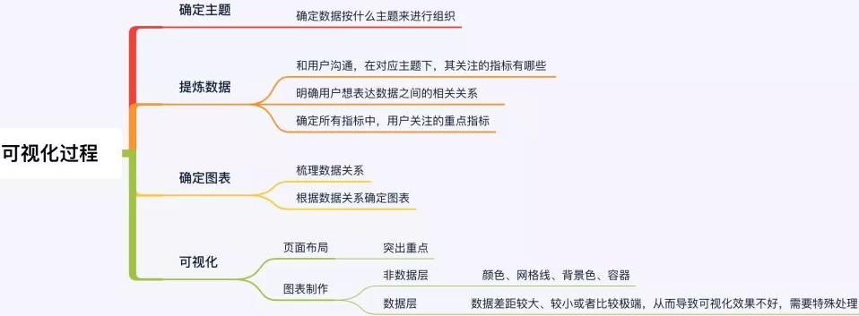
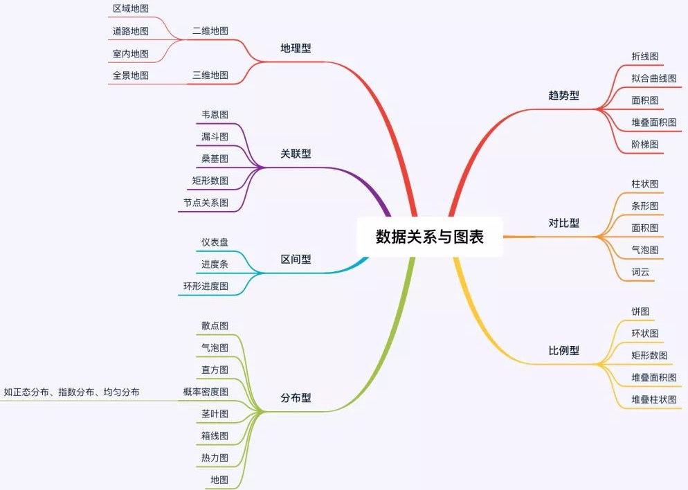
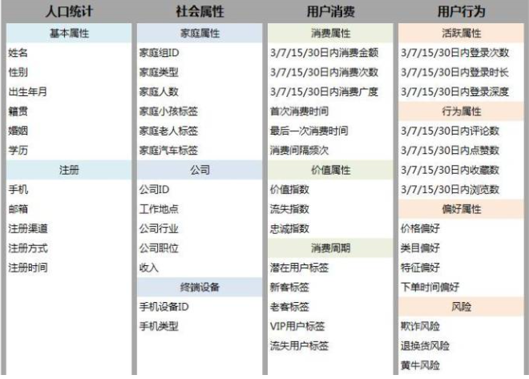

##### 可视化

 探索性分析指理解数据并找出值得分析或分享给他人的精华。而解释性分析，我们迫切希望能够言之有物，讲好某个故事。一个完整的数据可视化过程，主要包括以下4个步骤：确定数据可视化的主题、提炼可视化主题的数据、根据数据关系确定图表、进行可视化布局及设计

###### 数据类型

分类数据：指针反映事物类别的数据。如：用户的设备可以分为Iphone用户和andorid用户两种；支付方式可以分为支付宝、微信、现金支付三种等。诸如此类的分类所得到的数据被称为分类数据。

时序数据：也称时间序列数据，是指同一统一指标按时间顺序记录的数据列。如:每个月的新增用户数量、某公司近十年每年的GMV等。诸如此类按时间顺序来记录的指标对应的数据成为时序数据。

空间数据：指用来表示空间实体的位置、形状、大小及其分布特征诸多方面信息的数据，它可以用来描述来自现实世界的目标，它具有定位、定性、时间和空间关系等特性。

多变量：数据通常以表格形式的出现，表格中有多个列，每一列代表一个变量，将这份数据就称为多变量数据，多变量常用来研究变量之间的相关性。即用来找出影响某一指标的因素有哪些。

###### 可视化形式

在做可视化的过程中，我们需要先明确我们有什么数据，然后再去研究这些数据适合做什么类型的可视化，再然后从这些适合的可视化类型中选择能够很好的满足我们需求的视图。

为了找到合适的可视化形式我们需要先介绍两个内容：有哪些可视化形式、如何让可视化更加清晰。

  1. 有哪些可视化形式：基于数据的可视化形式有：视觉暗示、坐标系、标尺、背景信息以及前面四种形式的任意组合。① 视觉暗示：指通过查看图表就可以与潜意识中的意识进行联系从而得出图表表达的意识。常用的视觉暗示主要有：位置（位置高低）、长度（长短）、角度（大小）、方向（方向上升还是下降）、形状（不同形状代表不同分类）、面积（面积大小）、体积（体积大小）、饱和度（色调的强度，就是颜色的深浅）、色调（不同颜色）。
      坐标系：这里的坐标系和我们之前数学中学到的坐标系是相同的，只不过坐标轴的意义可能稍有不同。常见的坐标系种类有：直角坐标系、极坐标系和地理坐标系。
     ③ 标尺：前面说到的三种坐标系只是定义了展示数据的维度和方向，而标尺的作用是用来衡量不同方向和维度上的大小，其实和我们熟悉的刻度挺像。④ 背景信息：此处的背景和我们在语文中学习到的背景是一个概念，是为了说明数据的相关信息（who、what、when、where、why），使数据更加清晰，便于读者更好的理解。⑤ 组合组件：组合组件就是根据目标用途将上面四种信息进行组合。

2. 如何让可视化更加清晰① 建立视觉层次：把图表在视觉上进行分层，把非重点信息弱化，重点信息强化突出。② 增强图标可读性：让数据点更容易比较 、留白，图表之间留有一定空间的空白。③ 高亮显示重点内容：高亮就是以特殊形式显示的内容，便于读者在一堆数据中很快抓住重点。注释可视化：一般指图标的标题部分。帮助读者更好地理解图表的意思。

 可视化元素由3部分组成：可视化空间+标记+视觉通道， 数据可视化的显示空间，通常是二维。三维物体的可视化，通过图形绘制技术，解决了在二维平面显示的问题。 标记，是数据属性到可视化几何图形元素的映射，用来代表数据属性的归类。根据空间自由度的差别，标记可以分为点、线、面、体，分别具有零自由度、一维、二维、三维自由度。如我们常见的散点图、折线图、矩形树图、三维柱状图，分别采用了点、线、面、体这四种不同类型的标记。数据属性的值到标记的视觉呈现参数的映射，叫做视觉通道，通常用于展示数据属性的定量信息。常用的视觉通道包括：标记的位置、大小、形状、方向、颜色等。

 如果Python没有在其标准库中找到该模块，它将检查外部模块。这个操作也是以一种非常特殊的顺序进行的。它将首先在当前目录中进行搜索，然后移动到包安装的目录。 要让Python认识到一个目录是一个模块，也该目录必须包含一个__init_ .py文件。这样做是为了防止意外的名称冲突 

 求和编码通过比较某一特征取值下对应标签（或其他相关变量）的均值与标签的均值之间的差别来对特征进行编码。  Helmet编码是仅次于OHE和SumEncoder使用最广泛的编码方法，与SumEncoder不同的是，它比较的是某一特征取值下对应标签（或其他相关变量）的均值与他之前特征的均值之间的差异，而不是和所有特征的均值比较。

 对于无序的离散特征，实战中使用 OneHot, Hashing, LeaveOneOut, and Target encoding 方法效果较好，但是使用OneHot时要避免高基类别的特征以及基于决策树的模型， 使用Xgboost处理高维稀疏的问题效果并不会很差。  对于有序离散特征，尝试 Ordinal (Integer), Binary, OneHot, LeaveOneOut, and Target. Helmert, Sum, BackwardDifference and Polynomial 基本没啥用，但是当你有确切的原因或者对于业务的理解的话，可以进行尝试。 对于回归问题而言，Target 与 LeaveOneOut 方法可能不会有比较好的效果。LeaveOneOut、WeightOfEvidence、James-Stein、M-estimator 适合用来处理高基数特征。Helmert、Sum、Backward Difference、Polynomial 在机器学习问题里的效果往往不是很好(过拟合的原因)。

数仓经常会碰到的两类问题：

1、两个数据报表进行对比，结果差异很大，需要人工核对分析指标的维度信息，比如从头分析数据指标从哪里来，处理条件是什么，最后才能分析出问题原因       ——数据回溯问题

2、基础数据表因某种原因需要修改字段，需要评估其对数仓的影响，费时费力，然后在做方案        —— 影响分析问题

这两类问题都属于数据血缘分析问题，数据血缘分析还有其它的积极意义，比如：

问题定位分析

类似于影响分析，当程序运行出错时，可以方便找到问题的节点，并判断出问题的原因以及后续的影响

指标波动分析

当某个指标出现较大的波动时，可进行溯源分析，判断是由哪条数据发生变化所导致的

数据体检

判定系统和数据的健康情况，是否存在大量的冗余数据、无效数据、无来源数据、重复计算、系统资源浪费等问题

数据评估

通过血缘分析和元数据，可以从数据的集中度、分布、冗余度、数据热度、重要性等多角度进行评估分析，从而初步判断数据的价值

##### 结构思维

结构思维就是对应着数据分析的目的。需要通过数据分析来解释的问题，无外乎在三个方面：what，why，how即是什么，为什么以及怎么样三个方面的问题。针对问题的拆分和对比也是围绕着三个点展开。对what而言，就是需要了解现在的情况是什么样子，有哪些对象，在对象中涵盖了哪些数据，对象可以分成哪些部分，各个部门数据的大小如何，主要的数据贡献是来自于哪些地方等等。What就是状态进行展开，尤其是现状展开。比如分析现在各家产商的份额就是属于what的问题。

对why而言，比what更进一步，从现状进行回溯，需要通过分析来理清问题发生的因果关系以及对象之间的逻辑关系。和what聚焦静态数据相比，why更专注于动态数据，重点在考察哪些数据在不同的情况下发生的变化。比如需要分析市场份额为什么发生的变化，价格为什么上涨或者下降等等。

对how而言，从关注原因发展到了关注结果，更注重未来的情况，各个对象的数据未来会如何变化，对于分析的对象而言未来是什么样子。比如在制定了一项市场决策后，就会预测未来的投资收益情况。

用户画像的标签一般通过两种形式获得，基于已有数据或者一定规则加工，流失标签和距今天数皆是。另外一种是基于已有的数据计算概率模型，会用到机器学习和数据挖掘。

用户画像一般按业务属性划分多个类别模块。除了常见的人口统计，社会属性外。还有用户消费画像，用户行为画像，用户兴趣画像等。具体的画像得看产品形态，像金融领域，还会有风险画像，包括征信、违约、洗钱、还款能力、保险黑名单等。电商领域会有商品的类目偏好、品类偏好、品牌偏好

##### 可视化技巧

1.条形图的基线必须从零开始

2.使用简单易读的字体

3.条状图宽度适度：条形图之间的间隔应该是1/2栏宽度。

4.使用2D图形：虽然他们看起来很酷，但是3d形状可以扭曲感知,因此扭曲数据。坚持2 次元，确保数据准确。

 5.使用表格数字字体：表格间距赋予所有的数字相同的宽度，使它们排列时能彼此对齐，使比较更容易。

 6.统一感：统一感使我们更容易接收信息：颜色，图像，风格，来源

 7.不要过分热衷于饼图：展示多个区块比例大小，所有区块（圆弧）的加和等于 100%。但最好避免使用这个图表，因为肉眼对面积大小不敏感。

8.折线图中使用连贯的线条：虚线,虚线容易分散注意力。相反,使用实线和颜色,反而容易区分彼此的区别。

9.尊重部分所占整体的比例：在人们多选的问题上就会出现比例的重叠，不同选项的百分比之和大于一。为了避免这种情况，不能直接把比例做成统计图。相较于呈现数值，有些图更着重于表现部分与整体的关系。

10.面积、尺寸可视化：对同一类图形（例如柱状、圆环和蜘蛛图等）的长度、高度或面积加以区别，来清晰的表达不同指标对应的指标值之间的对比。制作这类数据可视化图形时，要用数学公式计算，来表达准确的尺度和比例。

11.使用大小来可视化值：大小可以帮助强调重要信息并添加上下文提示，使用大小来表示值配合地图使用的效果也非常好。如果您的可视化中有多个大小相同的数据点，它们会混在一起，很难区分值。

13.使用基础图形：一个很好的经验法则是，如果你不能高效理解，你的读者或听众可能也难理解。因此，坚持使用基础图形:直方图、条形图、维恩图、散点图和线形图。

14.视图数量：将您的可视化中的视图数量限制为三到四个。如果您添加太多视图，大局会被详细信息所淹没。

1.颜色深浅：通过颜色的深浅来表达指标值的强弱和大小，是数据可视化设计的常用方法，用户一眼看上去便可整体的看出哪一部分指标的数据值更突出。

2.使用同一色系：颜色用得太花，会给数据增加不可承受之重，相反，设计师应该采用同一色系，或者类比色。

3.避免使用鲜艳的颜色：明亮鲜艳的颜色就像是把所有的字母都大写想要强调一样，你的听众感觉你在对他们大声推销。单调的颜色，反而能很好地用于数据可视化，因为它们可以让你的读者理解你的数据，而不至于被数据淹没。

4.标签使用不同颜色区分：在某些情况下，在一段时间或一系列的值中，我们可能测量了不同种类的物体。例如，假设我们测量 6 个月以来狗和猫的体重。在实验结束时，我们想画出每只动物的体重，分别用蓝色和红色区分猫和狗。

5.颜色数量：不要在一张图上使用6种以上的颜色。

1.解释编码：通过一定的形状、颜色和几何图形的结合，将数据呈现出来。为了让读者能读清楚，图表设计者就要把这些图形解码回数据值。

轴标签：这可能看起来没有必要，或者不是很有帮助，但是你无法想象，如果你的图表有点混乱，或者看到数据的人对此不是很熟悉，你会被问多少次 x/y 轴代表的是什么。按照前面的两个绘图示例，如果要为轴设置特定名称。

3.标题：如果我们要将数据呈现给第三方，另一个基本但关键的要点是使用标题，它和之前的轴标记非常相似。

4.重点元素做注释：通常情况下，仅仅在图表的左右两侧使用刻度本身并不是很清楚。在图上标注值对于解释图表非常有用。

5.重要视图位置：将最重要的视图放置在顶部或左上角。眼睛通常会首先注意到该区域。

1.数据排序有序：数据类别按字母顺序,大小顺序,或价值进行排序，以一种合乎逻辑的和直观的方式来引导读者了解数据。

2.比较数据：比较是展示数据差异的好法子，但是如果你的读者不容易看出差别的话，那么你的比较就毫无意义。确保所有的数据都是呈现在读者面前,选择最合适的比较方法。

3.不可扭曲数据：确保所有可视化方式是准确的。例如,气泡图大小应该根据区域扩展,而不是直径。

4.展示数据：让读者看到数据，这是可视化的重点。确保没有数据丢失或被设计。例如,使用标准的面积图时，可以添加透明度,确保读者可以看到所有数据。

5.删除变量：很多时候，太多的信息会影响读者的注意，从可视化中删除隐含信息是一个好主意，在这种情况下，我认为我们不需要在轴中包含变量的名称。

6.避免数据噪音：把不重要的东西减到最少或者去掉。这包括减弱或移除图形线，改变轴线、图形线的颜色，以及用浅灰色描绘电子表格行。使得“数据比率”可以达到一个很高的水平，听众会更容易明白其中的数据情况。

