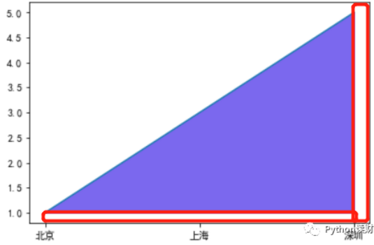
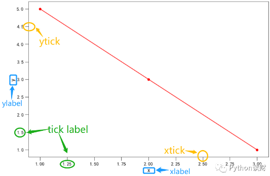

#### 工具


###### 选择绘图风格

We will use the ``plt.style`` directive to choose appropriate aesthetic styles for our figures.

```python
plt.style.use('ggplot')# 选择绘图风格
plt.style.available  # 可用的绘图风格
#use the style context manager, which sets a style temporarily:
with plt.style.context('stylename'):
    make_a_plot()
```

###### 设置中文字体

```python
plt.rcParams['font.sans-serif'] = ['SimHei']# SimHei：微软雅黑, FangSong：仿宋
plt.rcParams['axes.unicode_minus'] = False # 显示负坐标
```

###### Figure

```python
fig = plt.figure(figsize=(8,6))
```

###### Axes

```python
Figure.add_subplot(*args,**kwargs) #返回的是Axes实例
plt.subplot(nrows,ncols,plot_number) #plot_number起始于1，最大值为nrows*ncols。

plt.subplots(nrows, ncols) #函数一次性的创建多个SubPlot

plt.subplot2grid(shape=(2,2),loc=(0,0),colspan=1, rowspan=1) 
#shape:提供网格形状, loc:提供SubPlot位置即可, colspan指定纵向的跨度

gs=mpl.gridspec.GridSpec(2,2)
#GridSpec对象提供了类似array的索引方法，其索引的结果是一个SubplotSpec对象实例。
#如果你想创建横跨多个网格的SubplotSpec，那么你需要对`GridSpec`对象执行分片索引
gs.update(left=0.05,right=0.48,wspace=0.05) 
#left:subplot左侧宽度,wspace:subplot之间的空白宽度
plt.subplot(gs[0,0])#创建SubPlot
plt.subplot(gs[0,:-1])#创建横跨多个网格的SubplotSpec，对GridSpec对象执行分片索引
```

###### 颜色设置

```python
mpl.colors.cnames #常用颜色的字符串和对应的`#FFFFFF`形式

# 'g', 'r' 代表颜色的字符串
# '0.5' 0-1的小数 代表浮点数的字符串
# '#FF00FF' 十六进制的颜色字符串
# (0.1, 0.2, 0.3) #rgb三元组
from matplotlib.colors import ListedColormap
cmap = ListedColormap(['#0343df', '#e50000', '#ffff14', '#929591'])
ax = df.plot.bar(x='year', colormap=cmap)

colors.rgb2hex(rgb)#给出了`rgb`元组到`#FFFFFF`形式。
hex2color(s)#给出了`#FFFFFF`到`rgb`形式

```

###### 设置线段的风格

```python
ax.plot(t, s, '-p', color='gray',markersize=15, linewidth=4,markerfacecolor='white', markeredgecolor='gray',markeredgewidth=2)
```

###### 设置标题

```python
#设置16px的字体大小，将标题显示在左侧
ax.set_title('标题',fontdict={'size':16},loc = 'left')
```

###### 边框的显示

```python
ax.spines['right'].set_visible(False)
ax.spines['top'].set_visible(False)
```

###### 图例设置

函数：`ax.legend()`。图例是对图形所展示的内容的解释，比如在一张图中画了三条线，那么这三条线都代表了什么呢？这时就需要做点注释。

```python
ax.plot(['北京','上海','深圳'],[1,3,5],label='2010')
ax.plot(['北京','上海','深圳'],[2,4,6],label='2020')
ax.legend()# 第一种
ax.plot(['北京','上海','深圳'],[1,3,5])
ax.plot(['北京','上海','深圳'],[2,4,6])
ax.legend(['2010','2020'])#第二种
```

###### 图形与边框之间的留白比例

函数：`ax.margins()`



```python
# 可以设置四个方向都不留白，也可以单独设置留白的方向和宽度
ax.margins(0)
```

###### 设置双坐标轴

双坐标轴一般用于复合图表，同时表示两种图表的指标量纲不一，经典的使用场景如帕累托图。

```python
fig,ax = plt.subplots()
ax.plot(['北京','上海','深圳'],[1,3,5],color='r')
ax2 = ax.twinx()
ax2.bar(['北京','上海','深圳'],[20,40,60],alpha=0.3)
```

###### 坐标轴相关设置



首先有横坐标`xaxis`和纵坐标`yaxis`，横纵坐标上的标签为`xlabel`和`ylabel`，横纵坐标上有刻度线`tick`，刻度上对应的刻度标签则是`tick label`。具体设置时所对应的函数为

- `xlabel` -->`ax.set_xlabel()`
- `ylabel` -->`ax.set_ylabel()`
- tick和tick label -->`ax.tick_params`，`ax.xticks()`，`ax.yticks()`

```
ax.locator_params(axis='x', nbins=20)#调整坐标刻度
xmajorLocator = MultipleLocator(2)   #定义横向主刻度标签的刻度差为2的倍数。就是隔几个刻度才显示一个标签文本
ymajorLocator = MultipleLocator(3)   #定义纵向主刻度标签的刻度差为3的倍数。就是隔几个刻度才显示一个标签文本

ax1.xaxis.set_major_locator(xmajorLocator) #x轴 应用定义的横向主刻度格式。如果不应用将采用默认刻度格式
ax1.yaxis.set_major_locator(ymajorLocator) #y轴 应用定义的纵向主刻度格式。如果不应用将采用默认刻度格式
```

###### 网格线设置

```python
# b参数设置是否显示网格
# axis参数设置在哪个轴上显示网格线，可选参数为'x','y','both'
ax.grid(b=True,axis='y')
ax.grid(b=True,axis='x', color='0.5', lw=1, ls='-.')
```

###### Text

```python
ax.text(3, 8, 'boxed italics $E=mc^2$', style='italic',fontsize=15,
        bbox={'facecolor':'red', 'alpha':0.5, 'pad':10})

ax.text(0.95, 0.01, 'colored text in axes coords',
        verticalalignment='bottom', horizontalalignment='right',
        transform=ax.transAxes,
        color='green', fontsize=15)
```

###### Annotate

```python
ax.annotate('annotate', xy=(2, 1), xytext=(3, 4),
            arrowprops=dict(facecolor='black', shrink=0.05))
```

###### 水平垂直线

```python
plt.axhline(y=1, xmin=0, xmax=1, linewidth=8, color='#d62728')
plt.axvline(x=0, ymin=0.75, linewidth=8, color='#1f77b4')
plt.axhspan(0.25, 0.75, facecolor='0.5', alpha=0.5)
```

