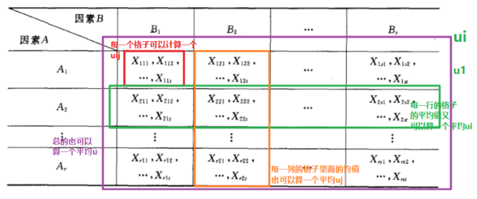

###### 双因素方差分析（无交互作用）

由于不考虑交互作用的影响，对每一个因素组合($A_i,B_j$)只需进行一次独立试验，称为无重复试验。将一个因素放在行的位置，称为行因素，设有$k$个水平；另一个因素放在列的位置，称为列因素，设有$r$个水平。

对行因素提出的假设为：$H_0:\mu_1=\mu_2=\cdots=\mu_k$ 。对应的备择假设  ：$H_1:$样本均值不完全相等对列因素提出的假设为：$H_0:\mu_1=\mu_2=\cdots=\mu_r$ 。对应的备择假设  ：$H_1:$样本均值不完全相等

行因素的第i个水平下的观测值的平均值：$\mu_{i\cdot}=\frac{1}{r}\sum_{j=1}^{r}x_{ij}$；列因素的第j个水平下的观测值的平均值:$\mu_{\cdot j}=\frac{1}{k}\sum_{j=1}^{k}x_{ij}$；所有观测值的总平均值：$\mu=\frac{1}{kr}\sum_{i=1}^k\sum_{j=1}^rx_{ij}$

| 名称         | 公式                                                                      |
| ---------- | ----------------------------------------------------------------------- |
| 总平方和       | $SST=\sum_{i=1}^k\sum_{j=1}^r(x_{ij}-\mu)^2$                            |
| 行因素的组间平方和  | $SSR=\sum_{i=1}^k\sum_{j=1}^r(\mu_{i\cdot}-\mu)^2$                      |
| 列因素的组间平方和  | $SSC=\sum_{i=1}^k\sum_{j=1}^r(\mu_{\cdot j}-\mu)^2$                     |
| 剩余因素产生的平方和 | $SSE=\sum_{i=1}^k\sum_{j=1}^r(x_{ij}-\mu_{i\cdot}-\mu_{\cdot j}+\mu)^2$ |
| 行因素均方      | $MSR=\frac{SSR}{k-1}$                                                   |
| 列因素均方      | $MSC=\frac{SSC}{r-1}$                                                   |
| 随机误差均方     | $MSE=\frac{SSE}{(k-1)(r-1)}$                                            |

检验行变量对因变量的影响，采用统计量$F_R$：$F=\frac{MSR}{MSE}\sim F(k-1,(k-1)(r-1))$

检验行变量对因变量的影响，采用统计量$F_C$：$F=\frac{MSC}{MSE}\sim F(r-1,(k-1)(r-1))$

将$F_R$和$F_C$与临界值$F_\alpha$进行比较：如果$F_R>F_\alpha$，则拒绝原假设$H_0$，行因素对观测值有显著影响；如果$F_C>F_\alpha$，则拒绝原假设$H_0$，列因素对观测值有显著影响。

###### 双因素方差分析

所谓双因素方差分析， 就是有两个因素$A,B$作用于试验的指标， 因素$A$有$r$个水平$A_1,\cdots,A_r$， 因素$B$有$s$个水平$B_1,\cdots,B_s$. 现对因素$A,B$的水平的每对组合$(A_i,B_j)$都作$t$次试验，也会得到一个表：

假设：$X_{ijk}\sim N(\mu_{ij},\sigma^2), i=1,\cdots,r;j=1,\cdots,s;k=1,\cdots,t$

类比单因素方差分析，有下面的数学模型：
$$
\left\{\begin{array}{ll}{X_{ijk}=\mu_{ij}+\epsilon_{ijk}}\\
\epsilon_{ijk}\sim N(0,\sigma^2),\epsilon_{ijk}独立\\
i=1,2,\cdots,r;j=1,2,\cdots,s;k=1,\cdots,t.\end{array}\right.
$$
行因素的第i个水平下的观测值的平均值：$\mu_{i}=\frac{1}{s}\sum_{j=1}^{s}\mu_{ij},i=1,\cdots,r$；列因素的第j个水平下的观测值的平均值:$\mu_{j}=\frac{1}{r}\sum_{j=1}^{r}\mu_{ij},j=1,\cdots,s$；观测值的总平均值：$\mu=\frac{1}{rs}\sum_{i=1}^r\sum_{j=1}^s \mu_{ij}$。同时定义：$\alpha_i=\mu_i-\mu,i=1,\cdots,r;\beta_j=\mu_j-\mu,j=1,\cdots,s;\gamma_{ij}=\mu_{ij}-\mu_i-\mu_j+\mu$
$$
\left\{\begin{array}{ll}{X_{ijk}=\mu+\alpha_i+\beta_j+\gamma_{ij}+\epsilon_{ijk}}\\
\epsilon_{ijk}\sim N(0,\sigma^2),\epsilon_{ijk}独立\\
i=1,2,\cdots,r;j=1,2,\cdots,s;k=1,\cdots,t.\\
\sum_{i=1}^r\alpha_i=0,\sum_{j=0}^s\beta_j=0,\sum_{i=1}^r\gamma_{ij}=0,\sum_{j=1}^s\gamma_{ij}=0\end{array}\right.
$$
因素A对于试验结果是否带来了显著影响

- $H_{01}:\alpha_1=\cdots=\alpha_r=0$
- $H_{11}:\alpha_1,\cdots,\alpha_r$不全为0

因素B对于试验结果是否带来了显著影响

- $H_{02}:\beta_1=\cdots=\beta_s=0$
- $H_{12}:\beta_1,\cdots,\beta_s$不全为0

两者的组合对于试验结果是否带来了显著影响

- $H_{03}:\gamma_{11}=\cdots=\gamma_{rs}=0$
- $H_{13}:\gamma_{11},\gamma_{12},\cdots,\gamma_{rs}$不全为0

$$
\begin{equation}\begin{array}{l}SST&=\sum_{i=1}^r\sum_{j=1}^s\sum_{k=1}^t(X_{ijk}-\overline{X})^2\\
&=\sum_{i=1}^r\sum_{j=1}^s\sum_{k=1}^t[(X_{ijk}-\overline{X}_{ij})+(\overline{X}_{i}-\overline{X})+(\overline{X}_{j}-\overline{X})+(\overline{X}_{ij}-\overline{X}_{i}-\overline{X}_{j}+\overline{X})]^2\\
&=\sum_{i=1}^r\sum_{j=1}^s\sum_{k=1}^t(X_{ijk}-\overline{X}_{ij})^2+st\sum_{i=1}^r(\overline{X}_{i}-\overline{X})^2+rt\sum_{j=1}^s(\overline{X}_{j}-\overline{X})^2+t\sum_{i=1}^r\sum_{j=1}^s(\overline{X}_{ij}-\overline{X}_{i}-\overline{X}_{j}+\overline{X})^2\\
&=S_E+S_A+S_B+S_{A\times B}
\end{array}\end{equation}
$$

当$H_{01}:\alpha_1=\cdots=\alpha_r=0$为真的时候：

这时候取显著水平为$\alpha$， 就会得到$H_{01}$的拒绝域：$F_A\ge F_{\alpha}(r-1,rs(t-1))$

$H_{02}$的拒绝域：$F_B=\frac{S_B/(s-1)}{S_E/(rs(t-1))}\ge F_{\alpha}(s-1,rs(t-1))$

$H_{03}$的拒绝域：$F_{A\times B}=\frac{S_{A\times B}/((r-1)(s-1))}{S_E/(rs(t-1))} \ge F_{\alpha}((r-1)(s-1),rs(t-1))$

| 数据分类                | 说明                                                         |
| ----------------------- | ------------------------------------------------------------ |
| 定类数据`Norminal Data` | 用来描述事物的属性，名称等，它一种标志，没有序次关系。       |
| 定序数据`Ordinal Data`  | 用数字表示个体在某个有序状态中所处的位置，不能做四则运算     |
| 定距数据`Interval Data` | 具有间距特征的变量，有单位，没有绝对零点，可以做加减运算，不能做乘除运算。 |
| 定比数据`Scalable Data` | 数据的最高级，既有测量单位，也有绝对零点                     |