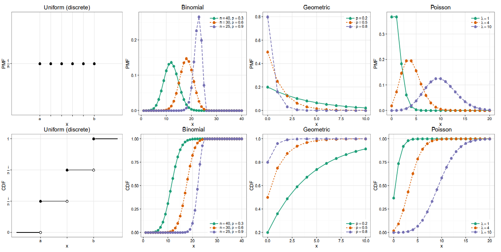
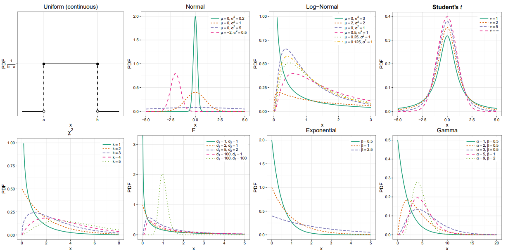
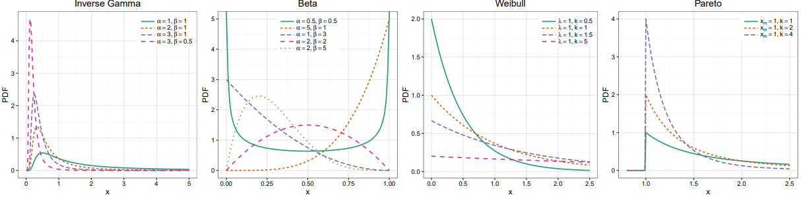
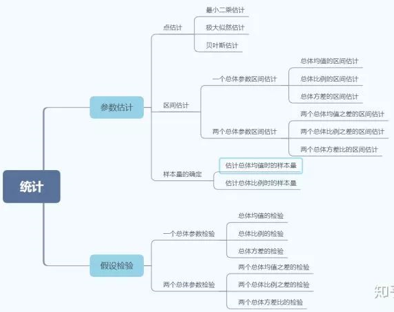

##### 概率分布

###### Discrete Distribution

|                   | $f_X(x)$                                                     | $E[X]$                                                       | $\mathbf{V}[X]$                    | $M_X(s)$                                          |
| ----------------- | ------------------------------------------------------------ | ------------------------------------------------------------ | ---------------------------------- | ------------------------------------------------- |
| Uniform           | $\frac{I(a \leq x \leq b)}{b-a+1}$                           | $\frac{a+b}{2}$                                              | $\frac{(b-a +1)^2-1}{12}$          | $\frac{e^{a s}-e^{-(b+1) s}}{s(b-a)}$             |
| Bernoulli         | $p^{x}(1-p)^{1-x}$                                           | $p$                                                          | $p(1-p)$                           | $1-p+p e^{s}$                                     |
| Binomial          | $\left( \begin{array}{l}{n} \\ {x}\end{array}\right) p^{x}(1-p)^{n-x}$ | $np$                                                         | $np(1-p)$                          | $\left(1-p+p e^{s}\right)^{n}$                    |
| Multinomial       | $\frac{n !}{x_{1} ! \ldots x_{k} !} p_{1}^{x_{1}} \cdots p_{k}^{x_{k}} \quad \sum_{i=1}^{k} x_{i}=n$ | $\left( \begin{array}{c}{n p_{1}} \\ {\vdots} \\ {n p_{k}}\end{array}\right)$ |                                    | $\left(\sum_{i=0}^{k} p_{i} e^{s_{i}}\right)^{n}$ |
| Hyper-geometric   | $\frac{\left( \begin{array}{c}{m} \\ {x}\end{array}\right) \left( \begin{array}{c}{N-m} \\ {n-x}\end{array}\right)}{\left( \begin{array}{c}{N} \\ {n}\end{array}\right)}$ | $\frac{nm}{N}$                                               | $\frac{n m(N-n)(N-m)}{N^{2}(N-1)}$ |                                                   |
| Negative Binomial | $\left( \begin{array}{c}{x+r-1} \\ {r-1}\end{array}\right) p^{r}(1-p)^{x}$ | $r\frac{1-p}{p}$                                             | $r\frac{1-p}{p^2}$                 | $\left(\frac{p}{1-(1-p) e^{s}}\right)^{r}$        |
| Geometric         | $p(1-p)^{x-1} \quad x \in \mathbb{N}^{+}$                    | $\frac{1}{p}$                                                | $\frac{1-p}{p^2}$                  | $\frac{p e^{s}}{1-(1-p) e^{s}}$                   |
| Poisson           | $\frac{\lambda^{x} e^{-\lambda}}{x !}$                       | $\lambda$                                                    | $\lambda$                          | $e^{\lambda\left(e^{s}-1\right)}$                 |

###### Continuous Distribution

|               | $f_X(x)$                                                     | $V[X]$                                                       | $M_X(s)$                                                     |
| ------------- | ------------------------------------------------------------ | ------------------------------------------------------------ | ------------------------------------------------------------ |
| Uniform       | $\frac{I(a<x<b)}{b-a}$                                       | $\frac{(b-a)^2}{12}$                                         | $\frac{e^{s b}-e^{s a}}{s(b-a)}$                             |
| Normal        | $\phi(x)=\frac{1}{\sigma \sqrt{2 \pi}} \exp \left\{-\frac{(x-\mu)^{2}}{2 \sigma^{2}}\right\}$ | $\sigma^2$                                                   | $\exp \left\{\mu s+\frac{\sigma^{2} s^{2}}{2}\right\}$       |
| Log-Normal    | $\frac{1}{x \sqrt{2 \pi \sigma^{2}}} \exp \left\{-\frac{(\ln x-\mu)^{2}}{2 \sigma^{2}}\right\}$ | $\left(e^{\sigma^{2}}-1\right) e^{2 \mu+\sigma^{2}}$         |                                                              |
| Multi-Normal  | $(2 \pi)^{-k / 2}\Sigma^{-1 / 2} e^{-\frac{1}{2}(x-\mu)^{T} \Sigma^{-1}(x-\mu)}$ | $\Sigma$                                                     | $\exp \left\{\mu^{T} s+\frac{1}{2} s^{T} \Sigma s\right\}$   |
| Student's t   | $\frac{\Gamma\left(\frac{\nu+1}{2}\right)}{\sqrt{\nu \pi} \Gamma\left(\frac{\nu}{2}\right)}\left(1+\frac{x^{2}}{\nu}\right)^{-(\nu+1) / 2}$ |                                                              |                                                              |
| Chi-square    | $\frac{1}{2^{k / 2} \Gamma(k / 2)} x^{k / 2-1} e^{-x / 2}$   | $2k$                                                         | $(1-2 s)^{-k / 2} s<1 / 2$                                   |
| F             | $\frac{\sqrt{\frac{\left(d_{1} x\right)^{d_{1}} d_{2}^{d_{2}}}{\left(d_{1} x+d_{2}\right)^{d_{1}} d_{2}^{d_{2}}}}}{x B\left(\frac{d_{1}}{2}, \frac{d_{1}}{2}\right)}$ | $\frac{2 d_{2}^{2}\left(d_{1}+d_{2}-2\right)}{d_{1}\left(d_{2}-2\right)^{2}\left(d_{2}-4\right)}$ |                                                              |
| Exponential   | $\frac{1}{\beta} e^{-x / \beta}$                             | $\beta^2$                                                    | $\frac{1}{1-\frac{s}{\beta}}(s<\beta)$                       |
| Gamma         | $\frac{\beta^{\alpha}}{\Gamma(\alpha)} x^{\alpha-1} e^{-\beta x}$ | $\frac{\alpha}{\beta^2}$                                     | $\left(\frac{1}{1-\frac{s}{\beta}}\right)^{\alpha}(s<\beta)$ |
| Inverse Gamma | $\frac{\beta^{\alpha}}{\Gamma(\alpha)} x^{-\alpha-1} e^{-\beta / x}$ | $\frac{\beta^{2}}{(\alpha-1)^{2}(\alpha-2)} \alpha>2$        | $\frac{2(-\beta s)^{\alpha / 2}}{\Gamma(\alpha)} K_{\alpha}(\sqrt{-4 \beta s})$ |
| Dirichlet     | $\frac{\Gamma\left(\sum_{i=1}^{k} \alpha_{i}\right)}{\prod_{i=1}^{k} \Gamma\left(\alpha_{i}\right)} \prod_{i=1}^{k} x_{i}^{\alpha_{i}-1}$ | $\frac{\mathbb{E}\left[X_{i}\right]\left(1-\mathbb{E}\left[X_{i}\right]\right)}{\sum_{i=1}^{k} \alpha_{i}+1}$ |                                                              |
| Beta          | $\frac{\Gamma(\alpha+\beta)}{\Gamma(\alpha) \Gamma(\beta)} x^{\alpha-1}(1-x)^{\beta-1}$ | $\frac{\alpha \beta}{(\alpha+\beta)^{2}(\alpha+\beta+1)}$    | $1+\sum_{k=1}^{\infty}\left(\prod_{r=0}^{k-1} \frac{\alpha+r}{\alpha+\beta+r}\right) \frac{s^{k}}{k !}$ |
| Weibull       | $\frac{k}{\lambda}\left(\frac{x}{\lambda}\right)^{k-1} e^{-(x / \lambda)^{k}}$ | $\lambda^{2} \Gamma\left(1+\frac{2}{k}\right)-\mu^{2}$       | $\sum_{n=0}^{\infty} \frac{s^{n} \lambda^{n}}{n !} \Gamma\left(1+\frac{n}{k}\right)$ |
| Pareto        | $\alpha \frac{x_{m}^{\alpha}}{x^{\alpha+1}} \quad x \geq x_{m}$ | $\frac{x_{m}^{2} \alpha}{(\alpha-1)^{2}(\alpha-2)} \alpha>2$ | $\alpha\left(-x_{m} s\right)^{\alpha} \Gamma\left(-\alpha,-x_{m} s\right) s<0$ |

##### 方差分析

 方差分析就是根据试验的结果进行分析， 鉴别各个有关因素对试验结果影响程度的有效方法。而根据涉及到的因素个数的不同， 又可以把方差分析分为单因素方差分析、多因素方差分析等。

方差分析是通过检验各个总体均值是否相等来判断分类型自变量对数值型自变量是否有显著影响。在方差分析中，所要检验的对象称为因素，因素的不同表现称为水平，因素的每一个水平都可以看作一个总体，每个因素水平下得到样本数据称为观测值。

###### 单因素方差分析

单因素方差分析仅考虑有一个因素对试验指标的影响。假如因素$A$有$r$个水平， 分别在第$i$个水平下进行多次独立的观测，样本总体为$N$，所得到的试验指标数据如下：
$$
\begin{equation}\begin{array}{l}A_1:N(\mu_1,\sigma^2)&X_{11}&\cdots &X_{1n_1}\\
A_2:N(\mu_2,\sigma^2)&X_{21}&\cdots &X_{2n_2}\\
\cdot&\cdot&\cdot\\
\cdot&\cdot&\cdot\\
A_r:N(\mu_r,\sigma^2)&X_{r1}&\cdots &X_{1n_r}\\
\end{array}\end{equation}
$$
每个总体都应符合正态分布；各个总体的方差$\sigma^2$必须相同；观测是独立的。我们会有下面的模型：
$$
\left\{\begin{array}{ll}{X_{ij}=\mu_i+\epsilon_{ij}}\\
\epsilon_{ij}\sim N(0,\sigma^2),\epsilon_{ij}独立\\
j=1,2,\cdots,n_i,i=1,2,\cdots,r\end{array}\right.
$$
如果我们想判断某个因素$A$对于试验指标是否有显著影响， 很直观的就是我们看看因素$A$不同的水平下试验指标的理论均值是否有显著差异， 即理论均值是否完全相同， 如果有显著差异， 就说明不同的水平对试验指标影响很大， 即$A$对试验指标有显著影响。故把问题转换成了比较不同水平下试验指标的均值差异。

基于上面的分析，  有如下原假设和备择假设：

- $H_0:\mu_1=\mu_2=\cdots=\mu_k$ 
- $H_1:\mu_1,\mu_2,\cdots,\mu_r$不全相等

| 名称       | 公式                                                         |
| ---------- | ------------------------------------------------------------ |
| 各组均值   | $\overline{x}_i=\frac{1}{n_i}\sum_{j=1}^{n_i}x_{ij}$         |
| 各组方差   | $S_i=\frac{1}{n_i-1}\sum_{j=1}^{n_i}(x_{ij}-\overline{x}_i)^2$ |
| 总体均值   | $\overline{x}=\frac{1}{N}\sum_{i=1}^r\sum_{j=1}^{n_i}x_{ij}$ |
| 总平方和   | $SST=\sum_{i=1}^r\sum_{j=1}^{n_i}(x_{ij}-\overline{x})^2$    |
| 组间平方和 | $SSA=\sum_{i=1}^r(\overline{x}_i-\overline{x})^2*n_i$        |
| 组内平方和 | $SSE=\sum_{i=1}^r\sum_{j=1}^{n_i}(x_{ij}-\mu_i)^2$           |
| 组间方差   | $MSA=\frac{SSA}{r-1}$                                        |
| 组内方差   | $MSE=\frac{SSE}{N-r}$                                        |

通过上面的分析，可以得到以下三点结论：

- $SST=SSA+SSE$
- $\frac{SSE}{\sigma^2}\sim \chi^2(N-r)$
- 当$H_0$为真的时候，$\frac{SSA}{\sigma^2}\sim \chi^2(r-1)$

$SSA$可以衡量不同水平之间的差异程度。那么我们直观的看就是如果$SSA$比较大的时候，说明不同水平之间的差异程度比较大了，这时候就应该拒绝$H_0$。构造如下检验统计量：
$$
F=\frac{MSA}{MSE}\sim F(r-1,N-r)
$$
若$F>F_\alpha$，则拒绝原假设，因素水平对观测值有显著影响；若$F<F_\alpha$，则接受原假设，不能认为因素水平对观测值有显著影响。

###### 双因素方差分析（无交互作用）

由于不考虑交互作用的影响，对每一个因素组合($A_i,B_j$)只需进行一次独立试验，称为无重复试验。

将一个因素放在行的位置，称为行因素，设有$k$个水平；另一个因素放在列的位置，称为列因素，设有$r$个水平。

对行因素提出的假设为：$H_0:\mu_1=\mu_2=\cdots=\mu_k$ 。对应的备择假设  ：$H_1:$样本均值不完全相等对列因素提出的假设为：$H_0:\mu_1=\mu_2=\cdots=\mu_r$ 。对应的备择假设  ：$H_1:$样本均值不完全相等

行因素的第i个水平下的观测值的平均值：$\mu_{i\cdot}=\frac{1}{r}\sum_{j=1}^{r}x_{ij}$；列因素的第j个水平下的观测值的平均值:$\mu_{\cdot j}=\frac{1}{k}\sum_{j=1}^{k}x_{ij}$；所有观测值的总平均值：$\mu=\frac{1}{kr}\sum_{i=1}^k\sum_{j=1}^rx_{ij}$

| 名称                 | 公式                                                         |
| -------------------- | ------------------------------------------------------------ |
| 总平方和             | $SST=\sum_{i=1}^k\sum_{j=1}^r(x_{ij}-\mu)^2$                 |
| 行因素的组间平方和   | $SSR=\sum_{i=1}^k\sum_{j=1}^r(\mu_{i\cdot}-\mu)^2$           |
| 列因素的组间平方和   | $SSC=\sum_{i=1}^k\sum_{j=1}^r(\mu_{\cdot j}-\mu)^2$          |
| 剩余因素产生的平方和 | $SSE=\sum_{i=1}^k\sum_{j=1}^r(x_{ij}-\mu_{i\cdot}-\mu_{\cdot j}+\mu)^2$ |
| 行因素均方           | $MSR=\frac{SSR}{k-1}$                                        |
| 列因素均方           | $MSC=\frac{SSC}{r-1}$                                        |
| 随机误差均方         | $MSE=\frac{SSE}{(k-1)(r-1)}$                                 |

检验行变量对因变量的影响，采用统计量$F_R$：$F=\frac{MSR}{MSE}\sim F(k-1,(k-1)(r-1))$

检验行变量对因变量的影响，采用统计量$F_C$：$F=\frac{MSC}{MSE}\sim F(r-1,(k-1)(r-1))$

将$F_R$和$F_C$与临界值$F_\alpha$进行比较：如果$F_R>F_\alpha$，则拒绝原假设$H_0$，行因素对观测值有显著影响；如果$F_C>F_\alpha$，则拒绝原假设$H_0$，列因素对观测值有显著影响。

###### 双因素方差分析

所谓双因素方差分析， 就是有两个因素$A,B$作用于试验的指标， 因素$A$有$r$个水平$A_1,\cdots,A_r$， 因素$B$有$s$个水平$B_1,\cdots,B_s$. 现对因素$A,B$的水平的每对组合$(A_i,B_j)$都作$t$次试验，也会得到一个表：

假设：$X_{ijk}\sim N(\mu_{ij},\sigma^2), i=1,\cdots,r;j=1,\cdots,s;k=1,\cdots,t$

类比单因素方差分析，有下面的数学模型：
$$
\left\{\begin{array}{ll}{X_{ijk}=\mu_{ij}+\epsilon_{ijk}}\\
\epsilon_{ijk}\sim N(0,\sigma^2),\epsilon_{ijk}独立\\
i=1,2,\cdots,r;j=1,2,\cdots,s;k=1,\cdots,t.\end{array}\right.
$$
行因素的第i个水平下的观测值的平均值：$\mu_{i}=\frac{1}{s}\sum_{j=1}^{s}\mu_{ij},i=1,\cdots,r$；列因素的第j个水平下的观测值的平均值:$\mu_{j}=\frac{1}{r}\sum_{j=1}^{r}\mu_{ij},j=1,\cdots,s$；观测值的总平均值：$\mu=\frac{1}{rs}\sum_{i=1}^r\sum_{j=1}^s \mu_{ij}$。同时定义：$\alpha_i=\mu_i-\mu,i=1,\cdots,r;\beta_j=\mu_j-\mu,j=1,\cdots,s;\gamma_{ij}=\mu_{ij}-\mu_i-\mu_j+\mu$
$$
\left\{\begin{array}{ll}{X_{ijk}=\mu+\alpha_i+\beta_j+\gamma_{ij}+\epsilon_{ijk}}\\
\epsilon_{ijk}\sim N(0,\sigma^2),\epsilon_{ijk}独立\\
i=1,2,\cdots,r;j=1,2,\cdots,s;k=1,\cdots,t.\\
\sum_{i=1}^r\alpha_i=0,\sum_{j=0}^s\beta_j=0,\sum_{i=1}^r\gamma_{ij}=0,\sum_{j=1}^s\gamma_{ij}=0\end{array}\right.
$$
因素A对于试验结果是否带来了显著影响

- $H_{01}:\alpha_1=\cdots=\alpha_r=0$
- $H_{11}:\alpha_1,\cdots,\alpha_r$不全为0

因素B对于试验结果是否带来了显著影响

- $H_{02}:\beta_1=\cdots=\beta_s=0$
- $H_{12}:\beta_1,\cdots,\beta_s$不全为0

两者的组合对于试验结果是否带来了显著影响

- $H_{03}:\gamma_{11}=\cdots=\gamma_{rs}=0$
- $H_{13}:\gamma_{11},\gamma_{12},\cdots,\gamma_{rs}$不全为0

$$
\begin{equation}\begin{array}{l}SST&=\sum_{i=1}^r\sum_{j=1}^s\sum_{k=1}^t(X_{ijk}-\overline{X})^2\\
&=\sum_{i=1}^r\sum_{j=1}^s\sum_{k=1}^t[(X_{ijk}-\overline{X}_{ij})+(\overline{X}_{i}-\overline{X})+(\overline{X}_{j}-\overline{X})+(\overline{X}_{ij}-\overline{X}_{i}-\overline{X}_{j}+\overline{X})]^2\\
&=\sum_{i=1}^r\sum_{j=1}^s\sum_{k=1}^t(X_{ijk}-\overline{X}_{ij})^2+st\sum_{i=1}^r(\overline{X}_{i}-\overline{X})^2+rt\sum_{j=1}^s(\overline{X}_{j}-\overline{X})^2+t\sum_{i=1}^r\sum_{j=1}^s(\overline{X}_{ij}-\overline{X}_{i}-\overline{X}_{j}+\overline{X})^2\\
&=S_E+S_A+S_B+S_{A\times B}
\end{array}\end{equation}
$$

当$H_{01}:\alpha_1=\cdots=\alpha_r=0$为真的时候：

这时候取显著水平为$\alpha$， 就会得到$H_{01}$的拒绝域：$F_A\ge F_{\alpha}(r-1,rs(t-1))$

$H_{02}$的拒绝域：$F_B=\frac{S_B/(s-1)}{S_E/(rs(t-1))}\ge F_{\alpha}(s-1,rs(t-1))$

$H_{03}$的拒绝域：$F_{A\times B}=\frac{S_{A\times B}/((r-1)(s-1))}{S_E/(rs(t-1))} \ge F_{\alpha}((r-1)(s-1),rs(t-1))$

##### 统计检验

###### 回归检验

回归检验：适用于预测变量是数值型的情况。

|              | 预测变量       | 结果变量 |
| ------------ | -------------- | -------- |
| 简单线性回归 | 单个，连续数值 | 连续数值 |
| 多重线性回归 | 多个，连续数值 | 连续数值 |
| 逻辑回归     | 连续变量       | 二元类别 |

###### 比较检验

比较检验：适用于预测变量是类别型，结果变量是数值型的情况。 

|                    | 预测变量         | 结果变量             |
| ------------------ | ---------------- | -------------------- |
| Paired t-test      | 两组，类别       | 组来自同一总体，数值 |
| Independent t-test | 两组，类别       | 组来自不同总体，数值 |
| ANOVA              | 两组及以上，类别 | 单个，数值           |
| MANOVA             | 两组及以上，类别 | 两个及以上，数值     |

###### 关联检验

常用的只有卡方检验一种，适用于预测变量和结果变量均为类别型的情况。

列联表是观测数据按两个或更多属性分类时所列出的频数表。列联表又称交互分类表，所谓交互分类，是指同时依据两个变量的值，将所研究的个案分类。交互分类的目的是将两变量分组，然后比较各组的分布状况，以寻找变量间的关系。用于分析离散变量或定型变量之间是否存在相关。

列联表分析的基本问题是，判明所考察的各属性之间有无关联，即是否独立。在$r\times c$表中，若以$p_i$、$p_j$和$p_{ij}$分别表示总体中的个体属于等级$A_i$，属于等级$B_j$和同时属于$A_i、B_j$的概率，A、B两属性无关联的假设可以表述为$H_0$：$p_{ij}=p_i·p_j,(i=1,2,\cdots,c;j=1,2,\cdots,c)$。未知参数$p_{ij}、p_i、p_j$的最大似然估计分别为行和及列和为样本大小。当$H_0$成立，且一切$p_i>0$和$p_j>0$时，统计量$\chi^2=\sum\frac{(A_{ij}-E_{ij})^2}{E_{ij}}$的渐近分布是自由度为$(r-1)(c-1)$的$\chi^2$分布，式中$E_{ij}=\frac{n_i\times n_j}{n}$称为期望频数。当$n$足够大，且表中各格的$E_{ij}$都不太小时，可以据此对$h_0$作检验：若$\chi^2$值足够大，就拒绝假设$h_0$，即认为A与B有关联。

#### 推断统计

##### 参数估计

参数估计 是为了判定总体数据特征性质，而从中抽取部分样本数据，通过样本的参数进而估计总体数据的特征

点估计：用样本的估计量直接作为总体参数的估计值(不能很好的说明估计出来的值与总体数据值之间的差距情况)

区间估计：在点估计的估计的基础之上，给出总体参数估计一个区间范围，该区间由样本统计量加减抽样误差而得到的

置信水平：重复抽取样本很多次，并每次构造置信区间，其中置信区间包含总体参数真值的次数所占的比值称为置信水平。

置信区间：由样本统计量所构造的总体参数的估计区间称为置信区间，统计学家在某种程度上确信这个区间会包含真正的总体参数，所以给它取名为置信区间

##### 假设检验

显著性水平：通过小概率准则来理解，在假设检验时先确定一个小概率标准----显著性水平；用$\alpha$表示；凡出现概率小于显著性水平的事件称小概率事件；

|             | $H_0$为真          | $H_0$为假         |
| ----------- | ------------------ | ----------------- |
| 未拒绝$H_0$ | 正确               | 第二类错误$\beta$ |
| 拒绝$H_0$   | 第一类错误$\alpha$ | 正确              |

如何设置原假设：$H_0$与$H_1$是完备事件组，相互对立，有且只有一个成立；在确立假设时，先确定备设$H_1$，然后再确定$H_1$，且保证“=”总在$H_0$上；原$H_0$一般是需要反驳的，而$H_1$是需要支持的；假设检验只提供原假设不利证据

 当$H_0$采用等号，而$H_1$采用不等号，双尾检验；当$H_0$是有方向性的，单尾检验

P值：当原假设为真时，比所得到的样本观察，结果更极端的结果会出现的概率。如果P值很小，我们拒绝原假设的理由越充分。

当样本容量n够大，样本观察值符合正态分布，可采用U检验。当样本容量n较小，若观测值符合正态分布，可采用T型检验

假设检验的基本步骤：

1. 根据实际问题提出原假设$H_0$和备择假设$H_1$
2. 选择适当的显著水平$\alpha$以及样本容量$n$
3. 构造合适的检验统计量，需要考虑的因素有样本容量大小，整体方差是否已知等。
4. 根据检验统计量和显著水平，做出拒绝域
5. 根据样本观测值，计算出检验统计量的观测值
6. 做出判断，若检验统计量的观测值落在拒绝域，则拒绝原假设；否则不拒绝原假设。

###### 均值检验

对于总体比例的检验，通常是在大样本条件下进行的，而小样本得到的结果是极不稳定的；所以对总体比例进行检验时，通常用正态分布来确定临界值，即采用$Z$统计量，$Z$统计量计算公式：
$$
z = \frac{p-\pi_0}{\sqrt{\frac{\pi_0(1-\pi_0)}{n}}}
$$
$p$为样本比例；$\pi_0$为总体比例

