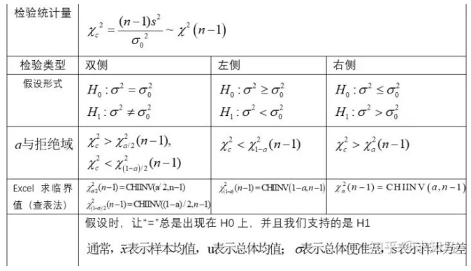

##### 概率分布

差分析的基本假定

有三个基本假定：

每个总体都应服从正态分布；

每个总体的方差必须相同；

观测值是独立的；

其中第三点一般都满足，前两点需要借助样本值做一些检验的工作；

##### 方差分析

方差分析是通过检验各个总体均值是否相等来判断分类型自变量对数值型自变量是否有显著影响。在方差分析中，所要检验的对象称为因素，因素的不同表现称为水平，因素的每一个水平都可以看作一个总体，每个因素水平下得到样本数据称为观测值。方差齐性是t检验和方差分析的前提条件

###### 单因素方差分析

单因素方差分析仅考虑有一个因素对试验指标的影响。假如因素$A$有$r$个水平， 分别在第$i$个水平下进行多次独立的观测，样本总体为$N$，所得到的试验指标数据如下：
$$
\begin{equation}\begin{array}{l}A_1:N(\mu_1,\sigma^2)&X_{11}&\cdots &X_{1n_1}\\
A_2:N(\mu_2,\sigma^2)&X_{21}&\cdots &X_{2n_2}\\
\cdot&\cdot&\cdot\\
\cdot&\cdot&\cdot\\
A_r:N(\mu_r,\sigma^2)&X_{r1}&\cdots &X_{1n_r}\\
\end{array}\end{equation}
$$
每个总体都应符合正态分布；各个总体的方差$\sigma^2$必须相同；观测是独立的。我们会有下面的模型：
$$
\left\{\begin{array}{ll}{X_{ij}=\mu_i+\epsilon_{ij}}\\
\epsilon_{ij}\sim N(0,\sigma^2),\epsilon_{ij}独立\\
j=1,2,\cdots,n_i,i=1,2,\cdots,r\end{array}\right.
$$
判断某个因素$A$对于试验指标是否有显著影响， 通过检验因素$A$不同的水平下试验指标的理论均值是否有显著差异， 如果有显著差异， 就说明不同的水平对试验指标影响很大， 即$A$对试验指标有显著影响。基于上面的分析，  有如下原假设和备择假设：

- $H_0:\mu_1=\mu_2=\cdots=\mu_k$ 
- $H_1:\mu_1,\mu_2,\cdots,\mu_r$不全相等

| 名称       | 公式                                                        |
| ---------- | ----------------------------------------------------------- |
| 总平方和   | $SST=\sum_{i=1}^r\sum_{j=1}^{n_i}(x_{ij}-\overline{x})^2$   |
| 组间平方和 | $SSA=\sum_{i=1}^r(\overline{x}_i-\overline{x})^2*n_i$       |
| 组内平方和 | $SSE=\sum_{i=1}^r\sum_{j=1}^{n_i}(x_{ij}-\overline{x}_i)^2$ |
| 组间方差   | $MSA=\frac{SSA}{r-1}$                                       |
| 组内方差   | $MSE=\frac{SSE}{N-r}$                                       |

其中$\overline{x}=\frac{1}{N}\sum_{i=1}^r\sum_{j=1}^{n_i}x_{ij}$为总体均值，$S_i=\frac{1}{n_i-1}\sum_{j=1}^{n_i}(x_{ij}-\overline{x}_i)^2$各组组内方差，$\overline{x}_i=\frac{1}{n_i}\sum_{j=1}^{n_i}x_{ij}$通为各组均值，可以得到以下三点结论：

- $SST=SSA+SSE$
- $\frac{SSE}{\sigma^2}\sim \chi^2(N-r)$
- 当$H_0$为真的时候，$\frac{SSA}{\sigma^2}\sim \chi^2(r-1)$

$SSA$可以衡量不同水平之间的差异程度。如果$SSA$比较大的时候，说明不同水平之间的差异程度比较大，这时候就应该拒绝$H_0$。构造如下检验统计量：
$$
F=\frac{MSA}{MSE}\sim F(r-1,N-r)
$$
若$F>F_\alpha$，则拒绝原假设，因素水平对观测值有显著影响；若$F<F_\alpha$，则接受原假设，不能认为因素水平对观测值有显著影响。

###### 双因素方差分析（无交互作用）

由于不考虑交互作用的影响，对每一个因素组合($A_i,B_j$)只需进行一次独立试验，称为无重复试验。将一个因素放在行的位置，称为行因素，设有$k$个水平；另一个因素放在列的位置，称为列因素，设有$r$个水平。

对行因素提出的假设为：$H_0:\mu_1=\mu_2=\cdots=\mu_k$ 。对应的备择假设  ：$H_1:$样本均值不完全相等对列因素提出的假设为：$H_0:\mu_1=\mu_2=\cdots=\mu_r$ 。对应的备择假设  ：$H_1:$样本均值不完全相等

行因素的第i个水平下的观测值的平均值：$\mu_{i\cdot}=\frac{1}{r}\sum_{j=1}^{r}x_{ij}$；列因素的第j个水平下的观测值的平均值:$\mu_{\cdot j}=\frac{1}{k}\sum_{j=1}^{k}x_{ij}$；所有观测值的总平均值：$\mu=\frac{1}{kr}\sum_{i=1}^k\sum_{j=1}^rx_{ij}$

| 名称                 | 公式                                                         |
| -------------------- | ------------------------------------------------------------ |
| 总平方和             | $SST=\sum_{i=1}^k\sum_{j=1}^r(x_{ij}-\mu)^2$                 |
| 行因素的组间平方和   | $SSR=\sum_{i=1}^k\sum_{j=1}^r(\mu_{i\cdot}-\mu)^2$           |
| 列因素的组间平方和   | $SSC=\sum_{i=1}^k\sum_{j=1}^r(\mu_{\cdot j}-\mu)^2$          |
| 剩余因素产生的平方和 | $SSE=\sum_{i=1}^k\sum_{j=1}^r(x_{ij}-\mu_{i\cdot}-\mu_{\cdot j}+\mu)^2$ |
| 行因素均方           | $MSR=\frac{SSR}{k-1}$                                        |
| 列因素均方           | $MSC=\frac{SSC}{r-1}$                                        |
| 随机误差均方         | $MSE=\frac{SSE}{(k-1)(r-1)}$                                 |

检验行变量对因变量的影响，采用统计量$F_R$：$F=\frac{MSR}{MSE}\sim F(k-1,(k-1)(r-1))$

检验行变量对因变量的影响，采用统计量$F_C$：$F=\frac{MSC}{MSE}\sim F(r-1,(k-1)(r-1))$

将$F_R$和$F_C$与临界值$F_\alpha$进行比较：如果$F_R>F_\alpha$，则拒绝原假设$H_0$，行因素对观测值有显著影响；如果$F_C>F_\alpha$，则拒绝原假设$H_0$，列因素对观测值有显著影响。

###### 双因素方差分析

所谓双因素方差分析， 就是有两个因素$A,B$作用于试验的指标， 因素$A$有$r$个水平$A_1,\cdots,A_r$， 因素$B$有$s$个水平$B_1,\cdots,B_s$. 现对因素$A,B$的水平的每对组合$(A_i,B_j)$都作$t$次试验，也会得到一个表：

假设：$X_{ijk}\sim N(\mu_{ij},\sigma^2), i=1,\cdots,r;j=1,\cdots,s;k=1,\cdots,t$

类比单因素方差分析，有下面的数学模型：
$$
\left\{\begin{array}{ll}{X_{ijk}=\mu_{ij}+\epsilon_{ijk}}\\
\epsilon_{ijk}\sim N(0,\sigma^2),\epsilon_{ijk}独立\\
i=1,2,\cdots,r;j=1,2,\cdots,s;k=1,\cdots,t.\end{array}\right.
$$
行因素的第i个水平下的观测值的平均值：$\mu_{i}=\frac{1}{s}\sum_{j=1}^{s}\mu_{ij},i=1,\cdots,r$；列因素的第j个水平下的观测值的平均值:$\mu_{j}=\frac{1}{r}\sum_{j=1}^{r}\mu_{ij},j=1,\cdots,s$；观测值的总平均值：$\mu=\frac{1}{rs}\sum_{i=1}^r\sum_{j=1}^s \mu_{ij}$。同时定义：$\alpha_i=\mu_i-\mu,i=1,\cdots,r;\beta_j=\mu_j-\mu,j=1,\cdots,s;\gamma_{ij}=\mu_{ij}-\mu_i-\mu_j+\mu$
$$
\left\{\begin{array}{ll}{X_{ijk}=\mu+\alpha_i+\beta_j+\gamma_{ij}+\epsilon_{ijk}}\\
\epsilon_{ijk}\sim N(0,\sigma^2),\epsilon_{ijk}独立\\
i=1,2,\cdots,r;j=1,2,\cdots,s;k=1,\cdots,t.\\
\sum_{i=1}^r\alpha_i=0,\sum_{j=0}^s\beta_j=0,\sum_{i=1}^r\gamma_{ij}=0,\sum_{j=1}^s\gamma_{ij}=0\end{array}\right.
$$
因素A对于试验结果是否带来了显著影响

- $H_{01}:\alpha_1=\cdots=\alpha_r=0$
- $H_{11}:\alpha_1,\cdots,\alpha_r$不全为0

因素B对于试验结果是否带来了显著影响

- $H_{02}:\beta_1=\cdots=\beta_s=0$
- $H_{12}:\beta_1,\cdots,\beta_s$不全为0

两者的组合对于试验结果是否带来了显著影响

- $H_{03}:\gamma_{11}=\cdots=\gamma_{rs}=0$
- $H_{13}:\gamma_{11},\gamma_{12},\cdots,\gamma_{rs}$不全为0

$$
\begin{equation}\begin{array}{l}SST&=\sum_{i=1}^r\sum_{j=1}^s\sum_{k=1}^t(X_{ijk}-\overline{X})^2\\
&=\sum_{i=1}^r\sum_{j=1}^s\sum_{k=1}^t[(X_{ijk}-\overline{X}_{ij})+(\overline{X}_{i}-\overline{X})+(\overline{X}_{j}-\overline{X})+(\overline{X}_{ij}-\overline{X}_{i}-\overline{X}_{j}+\overline{X})]^2\\
&=\sum_{i=1}^r\sum_{j=1}^s\sum_{k=1}^t(X_{ijk}-\overline{X}_{ij})^2+st\sum_{i=1}^r(\overline{X}_{i}-\overline{X})^2+rt\sum_{j=1}^s(\overline{X}_{j}-\overline{X})^2+t\sum_{i=1}^r\sum_{j=1}^s(\overline{X}_{ij}-\overline{X}_{i}-\overline{X}_{j}+\overline{X})^2\\
&=S_E+S_A+S_B+S_{A\times B}
\end{array}\end{equation}
$$

当$H_{01}:\alpha_1=\cdots=\alpha_r=0$为真的时候：

这时候取显著水平为$\alpha$， 就会得到$H_{01}$的拒绝域：$F_A\ge F_{\alpha}(r-1,rs(t-1))$

$H_{02}$的拒绝域：$F_B=\frac{S_B/(s-1)}{S_E/(rs(t-1))}\ge F_{\alpha}(s-1,rs(t-1))$

$H_{03}$的拒绝域：$F_{A\times B}=\frac{S_{A\times B}/((r-1)(s-1))}{S_E/(rs(t-1))} \ge F_{\alpha}((r-1)(s-1),rs(t-1))$

##### 统计检验

###### 比较检验

比较检验：适用于预测变量是类别型，结果变量是数值型的情况。 

|                    | 预测变量         | 结果变量             |
| ------------------ | ---------------- | -------------------- |
| Paired t-test      | 两组，类别       | 组来自同一总体，数值 |
| Independent t-test | 两组，类别       | 组来自不同总体，数值 |
| ANOVA              | 两组及以上，类别 | 单个，数值           |
| MANOVA             | 两组及以上，类别 | 两个及以上，数值     |

#### 推断统计

##### 参数估计

参数估计是为了判定总体数据特征性质，而从中抽取部分样本数据，通过样本的参数进而估计总体数据的特征

| 名称     | 作用                                                         |
| -------- | ------------------------------------------------------------ |
| 点估计   | 用样本的估计量直接作为总体参数的估计值                       |
| 区间估计 | 给出总体参数估计一个区间范围，该区间由样本统计量加减抽样误差而得到的 |
| 置信水平 | 重复抽取样本很多次，并每次构造置信区间，其中置信区间包含总体参数真值的次数所占的比值称为置信水平。 |
| 置信区间 | 由样本统计量所构造的总体参数的估计区间称为置信区间           |

##### 假设检验

显著性水平：通过小概率准则来理解，在假设检验时先确定一个小概率标准----显著性水平；用$\alpha$表示；凡出现概率小于显著性水平的事件称小概率事件；

|             | $H_0$为真          | $H_0$为假         |
| ----------- | ------------------ | ----------------- |
| 未拒绝$H_0$ | 正确               | 第二类错误$\beta$ |
| 拒绝$H_0$   | 第一类错误$\alpha$ | 正确              |

如何设置原假设：$H_0$与$H_1$是完备事件组，相互对立，有且只有一个成立；在确立假设时，先确定备设$H_1$，然后再确定$H_1$，且保证“=”总在$H_0$上；原$H_0$一般是需要反驳的，而$H_1$是需要支持的；假设检验只提供原假设不利证据

 当$H_0$采用等号，而$H_1$采用不等号，双尾检验；当$H_0$是有方向性的，单尾检验

P值：当原假设为真时，比所得到的样本观察，结果更极端的结果会出现的概率。如果P值很小，我们拒绝原假设的理由越充分。

当样本容量n够大，样本观察值符合正态分布，可采用U检验。当样本容量n较小，若观测值符合正态分布，可采用T型检验

假设检验的基本步骤：

1. 根据实际问题提出原假设$H_0$和备择假设$H_1$
2. 选择适当的显著水平$\alpha$以及样本容量$n$
3. 构造合适的检验统计量，需要考虑的因素有样本容量大小，整体方差是否已知等。
4. 根据检验统计量和显著水平，做出拒绝域
5. 根据样本观测值，计算出检验统计量的观测值
6. 做出判断，若检验统计量的观测值落在拒绝域，则拒绝原假设；否则不拒绝原假设。

###### 均值检验

对于总体比例的检验，通常是在大样本条件下进行的，而小样本得到的结果是极不稳定的；所以对总体比例进行检验时，通常用正态分布来确定临界值，即采用$Z$统计量，$Z$统计量计算公式：
$$
z = \frac{p-\pi_0}{\sqrt{\frac{\pi_0(1-\pi_0)}{n}}}
$$
$p$为样本比例；$\pi_0$为总体比例

自由度：构成样本统计量的独立的样本观测值的数目或自由变动的样本观测值的数目。自由度的设定是出于这样一个理由：在总体平均数未知时，用样本平均数去计算离差会受到一个限制——要计算标准差就必须先知道样本平均数，而样本平均数和n都知道的情况下，数据的总和就是一个常数了。所以，“最后一个”样本数据就不可以变了，因为它要是变，总和就变了，而这是不允许的

$t$检验：t检验适用于两个变量均数间的差异检验，多于两个变量间的均数比较要用方差分析。无论哪种类型的t检验，都必须在满足特定的前提条件下: 正态性和方差齐性，应用才是合理的。

###### 卡方检验

| 名称     | 定义                                                         |
| -------- | ------------------------------------------------------------ |
| $m$      | 表示特征的类别                                               |
| $k$      | 表示类别数目                                                 |
| $A_{ij}$ | 第i区间第j类的实例数量                                       |
| $R_i$    | 第i区间的实例数量$\mathrm{R}_{\mathrm{i}}=\Sigma_{j=1}^{k} \mathrm{A}_{\mathrm{i} j}$ |
| $C_j$    | 第j类的实例数量$C_{j}=\sum_{i=1}^{m} A_{i j}$                |
| $N$      | 总的实例数量$\mathrm{N}=\Sigma_{j=1}^{k} \mathrm{C}_{j}$     |
| $E_{ij}$ | $E_{ij}=A_{ij}$的期望$E_{i j}=\frac{N_{i} * C_{j}}{N}$       |

卡方独立性检验：$H_0$：两类变量之间相互独立，若$\chi^2$值足够大，就拒绝假设$H_0$，即特征与标签之间有关联。统计量： $\chi^{2}=\sum_{i=1}^{m} \sum_{j=1}^{k} \frac{(A_{ij}-E_{ij})^{2}}{E_{i j}}\sim\chi^2((m-1)(k-1))$

卡方拟合优度检验：$H_0$:理论频数和实际频数的吻合，$\chi^2=\sum\frac{(A_i-E_i)^2}{E_i}\sim\chi^2(k-1)$

##### 特征离散化

连续型数值特征的数值分布有偏向的可以分桶；离散型数值特征的数值跨越了不同的数量级可以分桶

分箱步骤：①对此特征进行排序；②选择某个点作为候选断点，用所选取的具体的离散化方法的尺度进行衡量此候选断点是否满足要求；③若候选断点满足离散化的衡量尺度， 则对数据集进行分裂或合并，再选择下一个候选断点，重复上述步骤；④当离散算法存在停止准则时，如果满足停止准则，则不再进行离散化过程，从而得到终的离散结果。 

评价标准：区间的个数，离散得到的区间数越少越好， 但是过少的区间数会导致数据的可理解性变差；离散化所导致的不一 致性，离散化之后数据的不一致性不能比离散化之前更高；预测准确性，即对模型准确性的要求。

| 方法 | 划分标准                           | 缺点                                                         | 优点                                                     | 解决办法                                                     |
| ---- | ---------------------------------- | ------------------------------------------------------------ | -------------------------------------------------------- | ------------------------------------------------------------ |
| 等宽 | 从最小值到最大值之间,均分为 N 等份 | 它对异常点比较敏感， 倾向于不均匀地把实例分布到各个箱中，会严重地损坏特征建立好的决策结构的能力 | 简单，易于操作，但都需要人为地规定划分区间的个数这个参数 | 离散化前首先设定某个阈值将异常数据移除。                     |
| 等频 | 使得每个区间包含大致相等的实例数量 | 可能将具有相同类标签的相同特征值分入不同的箱中以满足箱中数据的固定个数的条件 | 简单，易于操作，但都需要人为地规定划分区间的个数这个参数 | 先用等频法将特征值进行分箱，然后对各个相邻分箱的边界值进行调整， 使得相同的值可以被分入同一个箱中。 |

| 方法       | 划分标准                                                     |
| ---------- | ------------------------------------------------------------ |
| 1`R`       | 把连续的区间分成小的区间，然后再使用类标签对小区间的边界进行调整。 |
| `ID3`      | 计算区间内的每个数值作为候选断点，计算其熵值，从中选出具有小熵值的数据点作为断点，将区间一分为二， 然后再对得到的区间递归进行离散化  使用的停止准则的原则化合理性是有待考虑的 |
| `ChiMerge` | 具有最小卡方值的相邻区间合并在一起,直到满足确定的停止准则    |

######    1`R`分箱

操作比较方便，不需要用户人为指定分箱数， 并且避免把具有相同特征值相同类标签的实例分入不同的区间

1. 第一个实例开始，把前 6 个实例列入第一区间， 如果下一个实例与此区间中大多数实例的类标签相同，则把此实例加入区间中，再判定下一 个实例按照前述操作能否加入刚才的区间中， 否则形成下一个含 6 个实例的新的区间，对下 一个实例重复类似的操作，直至结束。
2. 从然后把 区间中的大多数实例的共同类标签作为此区间 的类标签，如果相邻区间经过此操作后有相同 的类标签，则应把这两个相邻区间合并。

###### `ChiMerge`

基本思想：对于精确的离散化，相对类频率在一个区间内应当完全一致。因此，如果两个相邻的区间具有非常类似的类分布，则这两个区间可以合并；否则，它们应当保持分开。而低卡方值表明它们具有相似的类分布。 

`ChiMerge`依赖于卡方检验：具有最小卡方值的相邻区间合并在一起，直到满足确定的停止准则。 

- 初始化：根据要离散的属性对实例进行排序：每个实例属于一个区间 
- 合并区间，又包括两步骤：计算每一对相邻区间的卡方值 ；将卡方值最小的一对区间合并 
- 预先设定一个卡方的阈值，在阈值之下的区间都合并，阈值之上的区间保持分区间。 

停止准则是当得到的每个区间中的类标签都是一样时，即停止离散化过程。这个准则也可以根据需要适当放宽要求。

###### `MDLP`算法

`MDLP`算法的具体步骤为：

1. 找到最优的切分点，选择切分点的标准就是信息增益最大；
2. 分别计算不切分变量情况下的最小描述长度和按照最优点切分以后的最小描述长度，如果前者的最小描述长度值大于后者，那么变量就应该需要切分，否则就放弃切分变量；
3. 对切分后的每一段重复上述的步骤并最终得到所有的切分点

其中比较两者之间的最小描述长度又可以等价成为下面的不等式
$$
\operatorname{Gain}(A, T ; S)>\frac{\log _{2}(N-1)+\log _{2}\left(3^{k}-2\right)-\left[k * E(S)-k_{1} * E\left(S_{1}\right)-k_{2} * E\left(S_{2}\right)\right]}{N}
$$

其中，$N$是集合$S$所包含的样本个数，这些样本又分别归属于$k$个大类。$k_1$和$k_2$分别是子集合$S_1$和$S_2$样本所属大类的个数。
