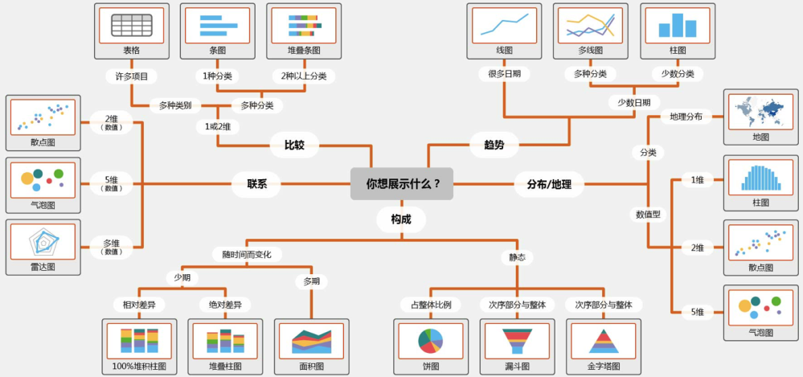
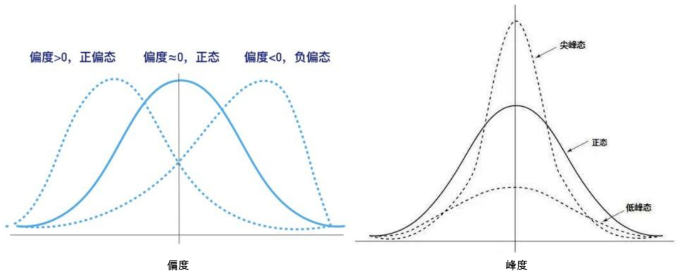

#### 探索性数据分析

对已有数据在尽量少的先验假设下通过作图、制表、方程拟合、计算特征量等手段探索数据的结构和规律的一种数据分析方法。

在数据竞赛中，使用EDA完成数据分析的过程如下：

- 读取并分析数据质量；

- 探索性分析每个变量；

- - 变量是什么类型；
  - 变量是否有缺失值；
  - 变量是否有异常值；
  - 变量是否有重复值；
  - 变量是否均匀；
  - 变量是否需要转换；

- 探索性分析变量与target标签的关系；

- - 变量与标签是否存在相关性；
  - 变量与标签是否存在业务逻辑；

- 探索性分析变量之间的关系；

- - 连续型变量与连续型变量;

  - - 可视化：散点图、相关性热力图；
    - 皮尔逊系数；
    - 互信息；

  - 离散变量与离散变量；

  - - 可视化：柱状图、饼图、分组表；
    - 卡方检验；

  - 检查变量之间的正态性；

  - - 直方图；
    - 箱线图；
    - Quantile-Quantile (QQ图)；

根据EDA我们可以得出以下结论：

- 变量是否需要筛选、替换和清洗；
- 变量是否需要转换；
- 变量之间是否需要交叉；
- 变量是否需要采样；



##### 数据总览

###### 数据简略观测

- head()：观察数据读取是否准确，常读取前5行数据。tail()
- shape：读取数据集的维度。

###### 数据总览

- describe()：包含每列的统计量，个数、平均值、方差、最小值、中位数、最大值等。
- 数据类型info()：了解数据每列的type，了解是否存在除了nan以外的特殊符号异常。

##### 数据检测

###### 缺失值检测

- 查看每列的存在nan情况
- 排序函数sort_values()：将数据集依照某个字段中的数据进行排序,该函数即可根据指定列数据也可根据指定行的
- 可视化nan值与缺失值

###### 异常值检测

- 3σ原则：拉依达准则，该准则具体来说，就是先假设一组检测数据只含有随机误差，对原始数据进行计算处理得到标准差，然后按一定的概率确定一个区间，认为误差超过这个区间的就属于异常值。
- 箱线图：依据实际数据绘制，真实、直观地表现出了数据分布的本来面貌，且没有对数据作任何限制性要求（3σ原则要求数据服从正态分布或近似服从正态分布），其判断异常值的标准以四分位数和四分位距为基础。

##### 预测分布

###### 总体分布概况

- 无接触约翰逊分布：
- 正态分布


当样本数据表明质量特征的分布为非正态时，应用基于正态分布的方法会作出不正确的判决。约翰逊分布族即为经约翰(yeo-johnson)变换后服从正态分布的随机变量的概率分布，约翰逊分布体系建立了三族分布，分别为有界**S****B** 、对数正态**S****L**和无界**S****U**。

```python
y = Train_data['price']
plt.figure(1); plt.title('Johnson SU')
sns.distplot(y, kde=False, fit=st.johnsonsu)
plt.figure(2); plt.title('Normal')
sns.distplot(y, kde=False, fit=st.norm)
plt.figure(3); plt.title('Log Normal')
sns.distplot(y, kde=False, fit=st.lognorm)
```

很多模型假设数据服从正态分布，数据整体服从正态分布，样本均值和方差则相互独立。当样本不服从正态分布时，可以做如下转换：

- 线性变化z-scores：基于原始数据的均值（mean）和标准差（standard deviation）进行数据的标准化。将A的原始值x使用z-score标准化到x’
- Boxcox变换：一种广义幂变换方法，是统计建模中常用的一种数据变换，用于连续的响应变量不满足正态分布的情况。
- yeo-johnson变换：是幂变换（power transformation）的方法之一，通过构建一组单调函数对随机变量进行数据变换。

###### 偏度峰度

- skeness：衡量随机变量概率分布的不对称性，是相对于平均值不对称程度的度量，通过对偏度系数的测量，我们能够判定数据分布的不对称程度以及方向。$g_1 = \frac{n^2\mu^33}{(n-1)(n-2)s^3}, \mu=(x_i-\overline{x}), s=\sqrt{\frac{1}{n-1}\sum_i(x_i-\overline{x})^2}$
- kurtosis：研究数据分布陡峭或平滑的统计量，通过对峰度系数的测量，我们能够判定数据相对于正态分布而言是更陡峭/平缓。$g_2=\frac{n^2(n+1)\mu^4}{(n-1)(n-2)(n-3)s^4}-3\frac{(n-1)^2}{(n-2)(n-3)}$



##### 特征分析

###### 数值特征

- 相关性分析：对两个或多个具备相关性的变量元素进行分析，从而衡量两个变量因素之间的相关密切程度。

- 特征的偏度和峰度

- 数字特征分布可视化

- - pd.melt()：处理数据，透视表格，可将宽数据转化为长数据，以便于后续分析。形成的数据即为，键：各特征名称，值：特征对应的值
  - sns.FacetGrid() ：先sns.FacetGrid()画出轮廓,再map()填充内容
  - sns.pairplot()：展示变量两两之间的关系（线性或非线性，有无较为明显的相关关系）。

###### 类别特征

- unique分布：对于一维数组或者列表，unique函数去除其中重复的元素，并按元素由大到小返回一个新的无元素重复的元组或者列表。

- 可视化：

- - 箱型图可视化：直观识别数据中的离群点，判断数据离散分布情况，了解数据分布状态。
  - 小提琴图可视化：用于显示数据分布及概率密度，这种图表结合了箱形图和密度图的特征，主要用来显示数据的分布形状
  - 柱形图可视化类别
  - 每个类别频数可视化

- 


#### 建模调参

#### 模型融合

