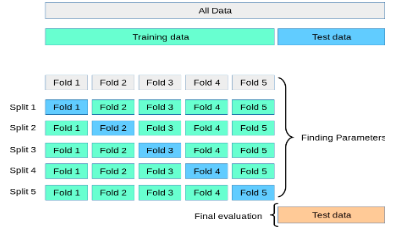
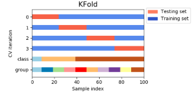
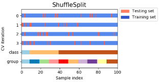
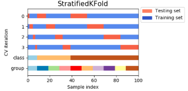
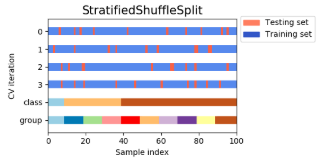
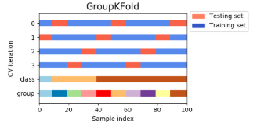
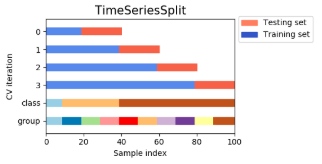

长尾分布：这种分布会使得采样不准，估值不准，因为尾部占了很大部分。另一方面，尾部的数据少，人们对它的了解就少，那么如果它是有害的，那么它的破坏力就非常大，因为人们对它的预防措施和经验比较少。

##### 调参方法

贪心调参 （坐标下降）

坐标下降法是一类优化算法，其最大的优势在于不用计算待优化的目标函数的梯度。最容易想到一种特别朴实的类似于坐标下降法的方法，与坐标下降法不同的是，不是循环使用各个参数进行调整，而是贪心地选取了对整体模型性能影响最大的参数。参数对整体模型性能的影响力是动态变化的，故每一轮坐标选取的过程中，这种方法在对每个坐标的下降方向进行一次直线搜索（line search）

网格调参GridSearchCV

作用是在指定的范围内可以自动调参，只需将参数输入即可得到最优化的结果和参数。相对于人工调参更省时省力，相对于for循环方法更简洁灵活，不易出错。

贝叶斯调参

贝叶斯优化通过基于目标函数的过去评估结果建立替代函数（概率模型），来找到最小化目标函数的值。贝叶斯方法与随机或网格搜索的不同之处在于，它在尝试下一组超参数时，会参考之前的评估结果，因此可以省去很多无用功。

#### 建模与调参

##### 线性回归

```python
sklearn.linear_model.LinearRegression(fit_intercept=True,normalize=False,copy_X=True,n_jobs=1)
model = LinearRegression(normalize=True)
model.fit(data_x, data_y)

model.intercept_, model.coef_
'intercept:'+ str(model.intercept_)
sorted(dict(zip(continuous_feature_names, model.coef_)).items(), key=lambda x:x[1], reverse=True)
```

价格大于90%分位数的部分截断了,就是长尾分布截断

进行log变化

 进行可视化，发现预测结果与真实值较为接近，且未出现异常状况。

##### 模型性能验证

###### 评价函数与目标函数

###### 交叉验证

###### 针对时间序列问题的验证

###### 绘制学习率曲线

###### 绘制验证曲线

##### 嵌入式特征选择

##### 模型对比

##### 非线性模型

SVM通过寻求结构化风险最小来提高学习机泛化能力,基本模型定义为特征空间上的间隔最大的线性分类器支持向量机的学习策略便是间隔最大化。SVR：用于标签连续值的回归问题SVC：用于分类标签的分类问题

Boosting一堆弱分类器的组合就可以成为一个强分类器；不断地在错误中学习，迭代来降低犯错概率通过一系列的迭代来优化分类结果，每迭代一次引入一个弱分类器，来克服现在已经存在的弱分类器组合的短板。
Adaboost整个训练集上维护一个分布权值向量W，用赋予权重的训练集通过弱分类算法产生分类假设（基学习器）y(x)， 然后计算错误率,用得到的错误率去更新分布权值向量w，对错误分类的样本分配更大的权值,正确分类的样本赋予更小的权值，每次更新后用相同的弱分类算法产生新的分类假设,这些分类假设的序列构成多分类器，对这些多分类器用加权的方法进行联合,最后得到决策结果
Gradient Boosting迭代的时候选择梯度下降的方向来保证最后的结果最好。损失函数用来描述模型的'靠谱'程度,假设模型没有过拟合,损失函数越大,模型的错误率越高。如果我们的模型能够让损失函数持续的下降,最好的方式就是让损失函数在其梯度方向下降。
GradientBoostingRegressor()loss - 选择损失函数，默认值为ls(least squres),即最小二乘法,对函数拟合learning_rate - 学习率n_estimators - 弱学习器的数目,默认值100max_depth - 每一个学习器的最大深度,限制回归树的节点数目,默认为3min_samples_split - 可以划分为内部节点的最小样本数,默认为2min_samples_leaf - 叶节点所需的最小样本数,默认为1
MLPRegressor()
参数详解
hidden_layer_sizes - hidden_layer_sizes=(50, 50),表示有两层隐藏层，第一层隐藏层有50个神经元,第二层也有50个神经元activation - 激活函数   {‘identity’, ‘logistic’, ‘tanh’, ‘relu’},默认relu
identity - f(x) = x
logistic - 其实就是sigmod函数,f(x) = 1 / (1 + exp(-x))
tanh - f(x) = tanh(x)
relu - f(x) = max(0, x)
solver - 用来优化权重     {‘lbfgs’, ‘sgd’, ‘adam’},默认adam,
lbfgs - quasi-Newton方法的优化器:对小数据集来说,lbfgs收敛更快效果也更好
sgd - 随机梯度下降
adam - 机遇随机梯度的优化器
alpha - 正则化项参数,可选的，默认0.0001
learning_rate - 学习率,用于权重更新,只有当solver为’sgd’时使用
max_iter - 最大迭代次数,默认200
shuffle - 判断是否在每次迭代时对样本进行清洗,默认True,只有当solver=’sgd’或者‘adam’时使用

XGBRegressor梯度提升回归树,也叫梯度提升机采用连续的方式构造树,每棵树都试图纠正前一棵树的错误与随机森林不同,梯度提升回归树没有使用随机化,而是用到了强预剪枝从而使得梯度提升树往往深度很小,这样模型占用的内存少,预测的速度也快

```
虽然随机森林模型在此时取得较好的效果，但LGB的效果与其相差不大。对LGB进行调参后结果会得到提高，下面对LGB进行简介。
**LightGBM**``使用的是histogram算法，占用的内存更低，数据分隔的复杂度更低。思想是将连续的浮点特征离散成k个离散值，并构造宽度为k的Histogram。然后遍历训练数据，统计每个离散值在直方图中的累计统计量。在进行特征选择时，只需要根据直方图的离散值，遍历寻找最优的分割点。``````LightGBM采用leaf-wise生长策略：每次从当前所有叶子中找到分裂增益最大（一般也是数据量最大）的一个叶子，然后分裂，如此循环。因此同Level-wise相比，在分裂次数相同的情况下，Leaf-wise可以降低更多的误差，得到更好的精度。
```

\```Leaf-wise的缺点是可能会长出比较深的决策树，产生过拟合因此LightGBM在Leaf-wise之上增加了一个最大深度的限制，在保证高效率的同时防止过拟合。`

```
参数:num_leaves - 控制了叶节点的数目，它是控制树模型复杂度的主要参数,取值应 <= 2 ^（max_depth）
bagging_fraction - 每次迭代时用的数据比例,用于加快训练速度和减小过拟合
feature_fraction - 每次迭代时用的特征比例,例如为0.8时，意味着在每次迭代中随机选择80％的参数来建树，boosting为random forest时用
min_data_in_leaf - 每个叶节点的最少样本数量。它是处理leaf-wise树的过拟合的重要参数。将它设为较大的值，可以避免生成一个过深的树。但是也可能导致欠拟合
max_depth - 控制了树的最大深度,该参数可以显式的限制树的深度
n_estimators - 分多少颗决策树(总共迭代的次数)
objective - 问题类型
regression - 回归任务,使用L2损失函数
regression_l1 - 回归任务,使用L1损失函数
huber - 回归任务,使用huber损失函数fair - 回归任务,使用fair损失函数
mape (mean_absolute_precentage_error) - 回归任务,使用MAPE损失函数
```

#### 线性模型回归

线性回归对于特征的要求

标签变化、处理长尾分布

理解线性回归模型

#### 模型性能验证

函数：评价函数、目标函数

方法：交叉验证方法、留一验证方法、针对时间序列的验证方法

秩相关系数，顾名思义，秩的相关系数。秩是指样本值的大小在全体样本从小到大排序后所占的次序。我们还要引入一个定义，对于一对数$(X_1, Y_1)$和$(X_2, Y_2)$，如果$X_1>X_2$且$Y_1> Y_2$或者$X_1<X_2$且$Y_1<Y_2$，则称$(X_1,Y_1)$和$(X_2, Y_2)$是一致的；如果$X_1>X_2$且$Y_1<Y_2$或者$X_1<X_2$且$Y_1>Y_2$，则称$(X_1,Y_1)$和$(X_2, Y_2)$是不一致的；如果$X_1=X_2$或$Y_1=Y_2$，则称$(X_1, Y_1)$和$(X_2,Y_2)$是一个`tie`。在评估逻辑回归模型的过程中，通常让逻辑回归中的目标变量作为X，逻辑回归的结果作为Y。记$n_c$为一致对的个数，$n_d$为不一致对的个数，$n_t$为$X$值不等而$Y$值相等的tie的个数，$N$为观测值的个数（样本量），可以有以下几个秩相关系数： 

一致性指标：$c=\frac{n_{c}+0.5 n_{t}}{n_{c}+n_{d}+n_{t}}$

`Gini coefficient`：$D_{Y X}=\frac{n_{c}-n_{d}}{n_{c}+n_{d}+n_{t}}$

`Goodman-Krustal Gamma`：$\Gamma=\frac{n_{c}-n_{d}}{n_{c}+n_{d}}$

`Kendall`：$\tau=\frac{n_{c}-n_{d}}{N(N-1) / 2}$

同时，`Gini`也等于2倍的`AUC`减一，`AUC`为`ROC`曲线与坐标轴围成的面积。对于二分类问题，这几种计算方法是等价的。 

`ROC`：那么一个模型的特异度可以定义为`TNR=TN/(FP+TN)`，灵敏度可以定义为`TPR=TP/(TP+FN)`。而`ROC`曲线的横坐标是1-特异度=`1-TNR=FP/(FP+TN)=FPR`，纵坐标是灵敏度即`TPR`。`KS`曲线中的所谓“累积比率”其实就是`ROC`曲线中的`TPR`和`FPR`。`ROC`曲线以`FPR`为横轴，`TPR`为纵轴，而`KS`曲线以阈值为横轴，`TPR`、`FPR`为纵轴。所以说，从某种角度看，`ROC`曲线和`KS`曲线其实是一回事。 

$\text{KS(Kolmogorov-Smirnov)}$：KS用于模型风险区分能力进行评估， 指标衡量的是好坏样本累计分部之间的差值。 好坏样本累计差异越大，KS指标越大，那么模型的风险区分能力越强。KS的计算步骤如下： 计算每个评分区间的好坏账户数。 计算每个评分区间的累计好账户数占总好账户数比率和累计坏账户数占总坏账户数比率。 计算每个评分区间累计坏账户占比与累计好账户占比差的绝对值，然后对这些绝对值取最大值即得此评分卡的K-S值。

提升度曲线：可以衡量使用这个模型比随机选择对坏样本的预测能力提升了多少倍。通常计算`LIFT`的时候会把模型的最终得分按照从低到高，排序并等频分为10组，计算分数最低的一组对应的`累计坏样本占比/累计总样本占比`就等于`LIFT`值了。从直观上理解，累计坏样本占比相当于是使用模型的情况下最差的这一组能够从所有的坏样本中挑出多少比例的坏样本，而累计总样本占比等于随机抽样的情况下从所有坏样本抽取了多少比例的坏样本。

而对模型的分析部分，则可以帮助我们了解模型哪些数据做的好，哪些数据做的不好，通过此类反馈，我们就可以对错误的数据展开研究，挖掘我们所遗漏的部分，进一步提升我们模型的预测性能。

模型特征重要性分析：`LGB/XGB`等的`importance`、`LR、SVM`的`coeff`等；特征重要性可以结合业务理解，有些奇怪的特征在模型中起着关键的作用，这些可以帮助我们更好地理解我们的业务，同时如果有些特征反常规，我们也可以看出来；可能这些就是过拟合的特征等等；     

模型分割方式分析：可视化模型的预测，包括`LGB`的每一颗数等；这些可以帮助我们很好的理解我们的模型，模型的分割方式是否符合常理也可以结合业务知识一起分析，帮助我们更好的设计模型；       

模型结果分析：这个在回归问题就是看预测的结果的分布；分类一般看混淆矩阵等。这么做可以帮助我们找到模型做的不好的地方，从而更好的修正我们的模型。

根据loss对样本加权的工作就已经有很多。神奇的是，其实在一条线上有着截然相反的想法的研究：第一类工作的想法是如果一个样本训练得不够好，也就是loss高的话，那么说明现在的模型没有很好fit到这样的数据，所以应该对这样的样本给予更高的权重。这一类工作就对应到经典的Hard Negative (Example) Mining，近期的工作如Focal Loss也是这个思想。另一类工作的想法是学习需要循序渐进，应该先学习简单的样本，逐渐加大难度，最终如果仍然后Loss很大的样本，那么认为这些样本可能是Outlier，强行fit这些样本反而可能会使泛化性能下降。这一类中对应的是Curriculum Learning或者Self-Paced Learning类型的工作。本质上，这两个极端对应的是对训练数据本身分布的不同假设。第一类方法认为那些fit不好的样本恰恰是模型应当着重去学习的，第二类方法认为那些fit不上的样本则很可能是训练的label有误。

###### K-S检验

KS检验，是统计学中的一种非参数假设检验，用来检测单样本是否服从某一分布，或者两样本是否服从相同分布。在单样本的情况下，我们想检验这个样本是否服从某一分布函数$F_0(x)$，记$F_1(x)$是该样本的经验分布函数。我们构造KS统计量：$D_n=\max_x|F_1(x)-F_0(x)|$

经验分布函数与目标分布的累积分布函数的最大差值就是我们要求的KS统计量：95%置信度的KS统计量的临界值由$D_n=\frac{1.36}{\sqrt{n}}$。两样本的KS检验，95%置信度的临界值为$D_n=1.36\sqrt{\frac{1}{n_x}+\frac{1}{n_y}}$，如果我们根据样本得到的KS统计量的值小于$D_n$，那么我们就接收原假设。否则，拒绝原假设。

#### 嵌入式特征选择

Lasso、Ridge回归、决策树

#### 模型对比

在信贷风控领域关于机器学习技术的探索主要分为三个方向。第一个方向，既然构造复杂模型存在着不稳定的风险，最稳妥的方式为使用机器学习或人工智能增加新特征，再使用评分卡模型。第二个方向为传统风控为体，机器学习为用。即特征筛选的标准和规则仍不变，仅替换评分卡模型为复杂模型比如`xgboost`等。第三个方向为大规模样本结合机器学习，保证模型的稳定和泛化。

###### 决策树算法

决策树优点：决策树易于理解和解释，可以可视化分析，容易提取出规则；可以同时处理标称型和数值型数据；测试数据集时，运行速度比较快；决策树可以很好的扩展到大型数据库中，同时它的大小独立于数据库大小。

决策树缺点：对缺失数据处理比较困难；容易出现过拟合问题；忽略数据集中属性的相互关联；`ID3`算法计算信息增益时结果偏向数值比较多的特征。

改进措施:对决策树进行剪枝。可以采用交叉验证法和加入正则化的方法；使用基于决策树的combination算法

###### 随机森林

优点：可以计算和比较哪些特征比较重要；训练速度快，容易做成并行化方法；在训练过程中，能够检测到特征之间的影响；对于不平衡数据集来说，随机森林能提供平衡数据集误差的有效方法；如有很大一部分的特征遗失，用RF算法仍然可以维持准确度；抗过拟合能力比较强；

缺点：在解决回归问题时，并没有像它在分类中表现的那么好，这是因为它并不能给出一个连续的输出。当进行回归时，随机森林不能够做出超越训练集数据范围的预测，这可能导致在某些特定噪声的数据进行建模时出现过度拟合；对于小数据或者低维数据，可能不能产生很好的分类；

###### `KNN`算法

优点 ：`KNN`是一种在线技术，新数据可以直接加入数据集而不必进行重新训练;`KNN`理论简单，容易实现

缺点：对于样本容量大的数据集计算量比较大；样本不平衡时，预测偏差比较大。如：某一类的样本比较少，而其它类样本比较多；`KNN`每一次分类都会重新进行一次全局运算；k值大小的选择。

###### `SVM`

优点：解决小样本下机器学习问题。解决非线性问题。无局部极小值问题。可以很好的处理高维数据集。泛化能力比较强。

缺点：对于核函数的高维映射解释力不强，尤其是径向基函数。对缺失数据敏感。

###### 朴素贝叶斯

优点：对大数量训练和查询时具有较高的速度。即使使用超大规模的训练集，针对每个项目通常也只会有相对较少的特征数，并且对项目的训练和分类也仅仅是特征概率的数学运算而已。支持增量式运算。即可以实时的对新增的样本进行训练。朴素贝叶斯对结果解释容易理解。

缺点：由于使用了样本属性独立性的假设，所以如果样本属性有关联时其效果不好。

###### 逻辑回归

优点：计算代价不高，易于理解和实现

缺点：容易产生欠拟合。分类精度不高；不能很好地处理大量多类特征或变量；  对于非线性特征，需要进行转换。

###### `Adaboost`

优点：很好的利用了弱分类器进行级联。可以将不同的分类算法作为弱分类器。`AdaBoost`具有很高的精度。相对于bagging算法和Random Forest算法，`AdaBoost`充分考虑的每个分类器的权重。

缺点：`AdaBoost`迭代次数也就是弱分类器数目不太好设定，可以使用交叉验证来进行确定。数据不平衡导致分类精度下降。训练比较耗时，每次重新选择当前分类器最好切分点。

###### 神经网络

神经网络优点：分类准确度高，学习能力极强。对噪声数据鲁棒性和容错性较强。有联想能力，能逼近任意非线性关系。

神经网络缺点：神经网络参数较多，权值和阈值。黑盒过程，不能观察中间结果。学习过程比较长，有可能陷入局部极小值。

#### Model selection and evaluation

##### Cross-validation: evaluating estimator performance

A test set should still be held out for final evaluation, but the validation set is no longer needed when doing CV. In the basic approach, called *k*-fold CV, the training set is split into *k* smaller sets (other approaches are described below, but generally follow the same principles). The following procedure is followed for each of the *k* “folds”:

> - A model is trained using k−1 of the folds as training data;
> - the resulting model is validated on the remaining part of the data

The performance measure reported by *k*-fold cross-validation is then the average of the values computed in the loop.



###### Computing cross-validated metrics

The simplest way to use cross-validation is to call the `cross_val_score` helper function on the estimator and the dataset.
By default, the score computed at each `CV` iteration is the score method of the estimator. It is possible to change this by using the scoring parameter

```python
from sklearn import metrics
scores = cross_val_score(clf, iris.data, iris.target, cv=5, scoring='f1_macro')
```

When the `cv` argument is an integer, `cross_val_score` uses the `KFold` or `StratifiedKFold` strategies by default,
It is also possible to use other cross validation strategies by passing a cross validation iterator instead,

```python
from sklearn.model_selection import ShuffleSplit
cv = ShuffleSplit(n_splits=5, test_size=0.3, random_state=0)
cross_val_score(clf, iris.data, iris.target, cv=cv) 
```

###### The `cross_validate` function and multiple metric evaluation

The `cross_validate` function differs from `cross_val_score` in two ways:

- It allows specifying multiple metrics for evaluation.
- It returns a `dict` containing fit-times, score-times in addition to the test score.

For single metric evaluation, where the scoring parameter is a string, callable or None, the keys will be - `['test_score', 'fit_time', 'score_time']`

And for multiple metric evaluation, the return value is a `dict` with the following keys - `['test_<scorer1_name>', 'test_<scorer2_name>', 'test_<scorer...>', 'fit_time', 'score_time']`

###### Obtaining predictions by cross-validation

The function `cross_val_predict` has a similar interface to `cross_val_score`, but returns, for each element in the input, the prediction that was obtained for that element when it was in the test set. Only `cross-validation` strategies that assign all elements to a test set exactly once can be used.
the function `cross_val_predict` is appropriate for:

- Visualization of predictions obtained from different models.
- Model blending: When predictions of one supervised estimator are used to train another estimator in ensemble methods.

###### Cross validation iterators

Assuming that some data is Independent and Identically Distributed is making the assumption that all samples stem from the same generative process and that the generative process is assumed to have no memory of past generated samples. The following `cross-validators` can be used in such cases.

**K-fold**



**Repeated K-Fold**: `RepeatedKFold` repeats `K-Fold` n times. It can be used when one requires to run `KFold` n times, producing different splits in each repetition.

Similarly, `RepeatedStratifiedKFold` repeats Stratified K-Fold n times with different randomization in each repetition

**Leave One Out**: `LeaveOneOut` is a simple cross-validation. Each learning set is created by taking all the samples except one, the test set being the sample left out. 

**Leave P Out:**`LeavePOut` is very similar to `LeaveOneOut` as it creates all the possible training/test sets by removing  samples from the complete set. 

**Shuffle Split**: The `ShuffleSplit` iterator will generate a user defined number of independent train / test dataset splits. Samples are first shuffled and then split into a pair of train and test sets.



**Stratified K-Fold**: `StratifiedKFold` is a variation of k-fold which returns stratified folds: each set contains approximately the same percentage of samples of each target class as the complete set.



**Stratified Shuffle Split**: `StratifiedShuffleSplit` is a variation of `ShuffleSplit`, which returns stratified splits, which creates splits by preserving the same percentage for each target class as in the complete set.



###### Cross-validation iterators for grouped data.

The `i.i.d.` assumption is broken if the underlying generative process yield groups of dependent samples.

**Group K-Fold**: `GroupKFold` is a variation of k-fold which ensures that the same group is not represented in both testing and training sets.



**Time Series Split**: `TimeSeriesSplit` is a variation of k-fold which returns first  folds as train set and the  th fold as test set. Note that unlike standard cross-validation methods, successive training sets are supersets of those that come before them. 



##### Tuning the hyper-parameters of an estimator

Any parameter provided when constructing an estimator may be optimized in this manner. Specifically, to find the names and current values for all parameters for a given estimator, use: `estimator.get_params()`
A search consists of:

- an estimator
- a parameter space;
- a method for searching or sampling candidates;
- a cross-validation scheme
- a score function.

###### Exhaustive Grid Search

The grid search provided by `GridSearchCV` exhaustively generates candidates from a grid of parameter values specified with the `param_grid` parameter.

###### Randomized Parameter Optimization

`RandomizedSearchCV` implements a randomized search over parameters, where each setting is sampled from a distribution over possible parameter values. This has two main benefits over an exhaustive search:

- A budget can be chosen independent of the number of parameters and possible values.
- Adding parameters that do not influence the performance does not decrease efficiency.

Specifying how parameters should be sampled is done using a dictionary, very similar to specifying parameters for `GridSearchCV`. Additionally, a computation budget, being the number of sampled candidates or sampling iterations, is specified using the `n_iter` parameter. For each parameter, either a distribution over possible values or a list of discrete choices can be specified:

```python
{'C': scipy.stats.expon(scale=100), 'gamma': scipy.stats.expon(scale=.1),
  'kernel': ['rbf'], 'class_weight':['balanced', None]}
```

###### Tips for Parameter search

Specifying an objective metric. By default, parameter search uses the `score` function of the estimator to evaluate a parameter setting. An alternative scoring function can be specified via the `scoring` parameter 

Specifying multiple metrics for evaluation. `GridSearchCV` and `RandomizedSearchCV` allow specifying multiple metrics for the `scoring` parameter. When specifying multiple metrics, the `refit` parameter must be set to the metric (string) for which the `best_params_` will be found and used to build the `best_estimator_` on the whole dataset. If the search should not be refit, set `refit=False`. Leaving refit to the default value `None` will result in an error when using multiple metrics.

Parallelism. Computations can be run in parallel if your OS supports it, by using the keyword `n_jobs=-1`.

Robustness to failure. Some parameter settings may result in a failure to `fit` one or more folds of the data. By default, this will cause the entire search to fail, even if some parameter settings could be fully evaluated. Setting `error_score=0` (or `=np.NaN`) will make the procedure robust to such failure, issuing a warning and setting the score for that fold to 0 (or `NaN`), but completing the search.

##### Model Evaluation: quantifying the quality of prediction

For the most common use cases, you can designate a scorer object with the `scoring` parameter; the table below shows all possible values. All scorer objects follow the convention that higher return values are better than lower return values.

The module `sklearn.metrics` also exposes a set of simple functions measuring a prediction error given ground truth and prediction:

- functions ending with `_score` return a value to maximize, the higher the better.
- functions ending with `_error` or `_loss` return a value to minimize, the lower the better. When converting into a scorer object using `make_scorer`, set the `greater_is_better` parameter to `False` 

```python
from sklearn.metrics import fbeta_score, make_scorer
ftwo_scorer = make_scorer(fbeta_score, beta=2)
from sklearn.model_selection import GridSearchCV
from sklearn.svm import LinearSVC
grid = GridSearchCV(LinearSVC(), param_grid={'C': [1, 10]},
                    scoring=ftwo_scorer, cv=5)
```

The second use case is to build a completely custom scorer object from a simple python function using `make_scorer`, which can take several parameters:

- the python function you want to use 
- whether the python function returns a score (greater_is_better=True, the default) or a loss (greater_is_better=False). If a loss, the output of the python function is negated by the scorer object, conforming to the cross validation convention that scorers return higher values for better models.
- for classification metrics only: whether the python function you provided requires continuous decision certainties (needs_threshold=True). The default value is False.
- any additional parameters,

```python
import numpy as np
def my_custom_loss_func(y_true, y_pred):
    diff = np.abs(y_true - y_pred).max()
    return np.log1p(diff)
score = make_scorer(my_custom_loss_func, greater_is_better=False)
```

##### Validation curves: plotting scores to evaluate models

###### Validation curve

plot the influence of a single hyper-parameter on the training score and the validation score to find out whether the estimator is over-fitting or under-fitting for some hyper-parameter values.

```python
import numpy as np
from sklearn.model_selection import validation_curve
from sklearn.datasets import load_iris
from sklearn.linear_model import Ridge

np.random.seed(0)
iris = load_iris()
X, y = iris.data, iris.target
indices = np.arange(y.shape[0])
np.random.shuffle(indices)
X, y = X[indices], y[indices]

train_scores, valid_scores = validation_curve(Ridge(), X, y, "alpha", np.logspace(-7, 3, 3), cv=5)
```

###### Learning curve

A learning curve shows the validation and training score of an estimator for varying numbers of training samples. It is a tool to find out how much we benefit from adding more training data and whether the estimator suffers more from a variance error or a bias error. If both the validation score and the training score converge to a value that is too low with increasing size of the training set, we will not benefit much from more training data.

```python
from sklearn.model_selection import learning_curve
from sklearn.svm import SVC

train_sizes, train_scores, valid_scores = learning_curve(
    SVC(kernel='linear'), X, y, train_sizes=[50, 80, 110], cv=5) 
```


- 用管道简化工作流
- 使用k折交叉验证评估模型性能
- 使用学习和验证曲线调试算法
- 通过网格搜索进行超参数调优
- 比较不同的性能评估指标