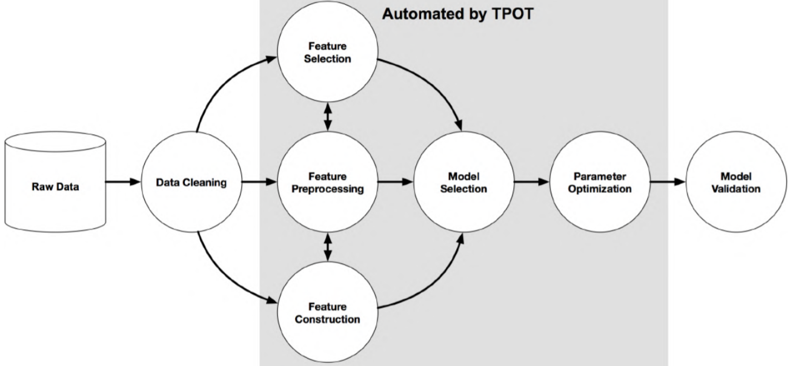
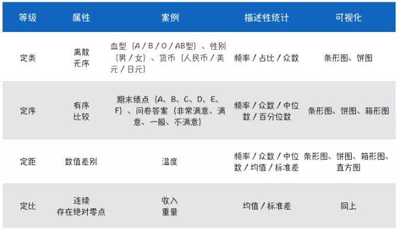
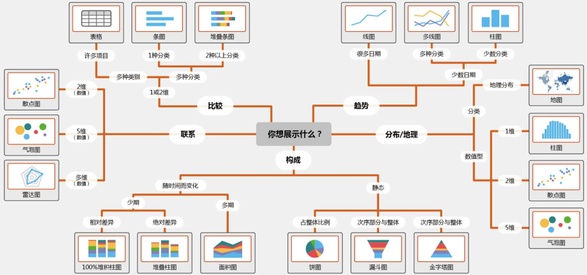
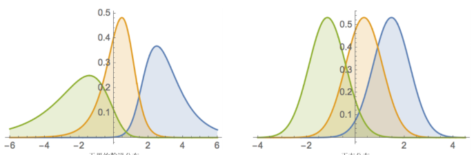
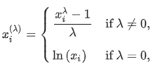
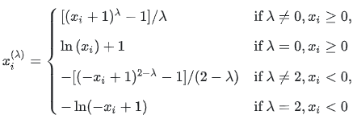
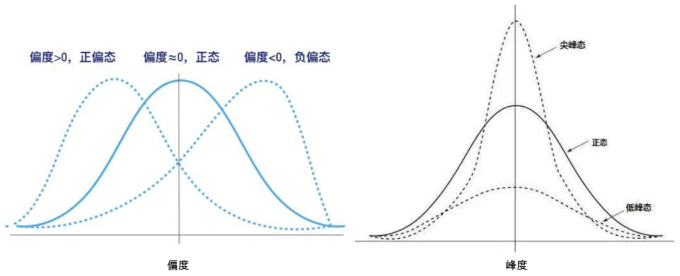

### 探索性数据分析

数据探索可以帮助我们更好地了解数据的性质以及干净程度，包括数据的大小，数据的缺失值的分布，训练集与测试集的分布差异等，同时，数据集中的奇异现象又会进一步促进我们对其进行研究与观察，更好地了解业务，并构建相应强特征；

在拿到数据之后，我们必须要明确以下几件事情： 

1. 数据是如何产生的，数据又是如何存储的； 
2. 数据是原始数据，还是经过人工处理（二次加工的）； 
3. 数据由那些业务背景组成的，数据字段又有什么含义； 
4. 数据字段是什么类型的，每个字段的分布是怎样的； 
5. 训练集和测试集的数据分布是否有差异；

在分析数据的过程中，还必须要清除的以下数据相关的问题： 

1. 数据量是否充分，是否有外部数据可以进行补充； 
2. 数据本身是否有噪音，是否需要进行数据清洗和降维操作； 
3. 评价函数是什么，和数据字段有什么关系； 
4. 数据字段与的标签的关系；

对于结构化数据，我们需要从以下几个角度完成赛题的数据分析： 

- 分析数据中每个字段的含义、分布、缺失情况；
  -  首先需要结合赛题背景，分析字段的含义，字段表示什么含义、字段的类型是什么、字段的 取值空间是什么、字段每个取值表示什么意义。
  -  接下来需要分析字段的分布情况，分析字段整体的分布，分析字段在训练集/测试集中的分 布情况。
  - 最后可以对数据字段进行缺失值得分析，分析字段缺失值的分布比例，字段在训练集/测试 集的缺失情况。
- 分析数据中每个字段的与赛题标签的关系； 
  - 首先可以计算数据每个字段与标签的相关性，可利用相关性计算； 
  - 接下来可以将字段与标签联合起来进行分析，分析每个字段取值情况下标签的取值情况，分 析字段分布于标签的分布情况。
- 分析数据字段两两之间，或者三者之间的关系； 
- 从其他维度分析数据


#### 全局分析

全局分析：知道我们数据的整体情况，决定我们采用什么样的机器等等； 

```python
df.head()#观察数据读取是否准确
df.shape#读取数据集的维度。
df.describe()#包含每列的统计量，个数、平均值、方差、最小值、中位数、最大值等。
df.info()#了解数据每列的type，了解是否存在除了nan以外的特殊符号异常。
```

#### 单变量分析

单变量分析：包括每个变量的分布，缺失情况等；通过单变量分析，我们可以进一步的了解每个变量的分布情况，是否有无用的变量，是否出现了某些分布奇怪的变量等.   

一般可以通过 `data.describe()` 获取基本的描述性统计，根据均值、标准差、极大极小值等指标，结合变量含义来判断。再接着看不同类别之间的特征值分布情况，可通过画直方图（数值型变量）和计算变量值占比分布（类别变量）来观察。观察不同变量之间的相关性情况，可以通过绘制 相关矩阵的热力图 来观察大体情况。



| 名称             | 定义                                                         | 原因                                                         | 影响                                                         |
| ---------------- | ------------------------------------------------------------ | ------------------------------------------------------------ | ------------------------------------------------------------ |
| 缺失值           |                                                              | 有些信息暂时无法获取，或者获取信息的代价太大、有些信息被遗漏、属性值不存在 | 数据挖掘建模将丢失大量的有用信息；数据挖掘模型所表现出的不确定性更加显著，模型中蕴含的规律更难把握；包含空值的数据会使建模过程陷入混乱，导致不可靠的输出。 |
| 异常值           | 异常值是指样本中的个别值，其数值明显偏离其他的观测值。异常值也称为离群点 | 检验数据是否有录入错误，是否含有不合常理的数据               |                                                              |
| 重复值           | 复制数据即，观察值存在副本。复制数据有两个主要类型：基于所有特征、基于关键特征。 |                                                              |                                                              |
| 单一值           | 有时一个特征不提供信息，是因为它拥有太多具备相同值的行。     |                                                              |                                                              |
| 其他数据质量检验 | 大写：在类别值中混用大小写是一种常见的错误。                 |                                                              |                                                              |
|                  |                                                              |                                                              |                                                              |

##### 缺失值分析

```python
null = df.isnull().sum()#查看每列的存在nan情况
null.sort_values()#对特征按照缺失值的数目进行排序
nullitem = df.isnull().sum(axis=1) # 查看每行存在的缺失值
# 缺失热力图
colours = ['#000099', '#ffff00'] # specify the colours - yellow is missing. blue is not missing.
sns.heatmap(df[cols].isnull(), cmap=sns.color_palette(colours))
# 缺失数据百分比列表
for col in df.columns:
    pct_missing = np.mean(df[col].isnull())
    print('{} - {}%'.format(col, round(pct_missing*100)))
#缺失数据直方图
for col in df.columns:
    missing = df[col].isnull()
    num_missing = np.sum(missing)

    if num_missing > 0:  
        print('created missing indicator for: {}'.format(col))
        df['{}_ismissing'.format(col)] = missing


# then based on the indicator, plot the histogram of missing values
ismissing_cols = [col for col in df.columns if 'ismissing' in col]
df['num_missing'] = df[ismissing_cols].sum(axis=1)

df['num_missing'].value_counts().reset_index().sort_values(by='index').plot.bar(x='index', y='num_missing')
```

##### 异常值分析

3σ原则：假设一组检测数据只含有随机误差，对原始数据进行计算处理得到标准差，然后按一定的概率确定一个区间，认为误差超过这个区间的就属于异常值。要求数据服从正态分布或近似服从正态分布

箱线图：判断异常值的标准以四分位数和四分位距为基础。异常值通常被定义为小于$Q_L-1.5\times \text{IQR}$或大于$Q_U-1.5\times \text{IQR}$值。对数据分布不作任何限制性要求。

对于分类问题可以分组查看，从而判断异常值。

```python
# 直方图/箱形图（数值特征）
df['life_sq'].hist(bins=100)
df.boxplot(column=['life_sq'])
# 描述统计量（数值特征）
#对于数值特征，当异常值过于独特时，箱形图无法显示该值。因此，我们可以查看其描述统计量
df['life_sq'].describe()
# 条形图（类别）
df['ecology'].value_counts().plot.bar()
#特征 ecology 具备合理的分布。但如果某个类别「other」仅有一个值，则它就是异常值。
```

##### 单一值分析

```
for col in df.columns:
    cnts = df[col].value_counts(dropna=False)
    top_pct = (cnts/num_rows).iloc[0]
```

##### 其他数据质量检验

1. 大写：在类别值中混用大小写是一种常见的错误。
2. 格式：另一个标准化是数据格式。比如将特征从字符串格式转换为 DateTime 格式。
3. 类别值：分类特征的值数量有限。有时由于拼写错误等原因可能出现其他值。识别它们的一种简单方式是模糊逻辑。该方法可以衡量使一个值匹配另一个值需要更改的字母数量。
4. 地址：因为人们往数据库中输入数据时通常不会遵循标准格式。

```python
from nltk.metrics import edit_distance

df_city_ex = pd.DataFrame(data={'city': ['torontoo', 'toronto', 'tronto', 'vancouver', 'vancover', 'vancouvr', 'montreal', 'calgary']})


df_city_ex['city_distance_toronto'] = df_city_ex['city'].map(lambda x: edit_distance(x, 'toronto'))
df_city_ex['city_distance_vancouver'] = df_city_ex['city'].map(lambda x: edit_distance(x, 'vancouver'))
df_city_ex
```

数据不一致性是指数据的矛盾性、不相容性。直接对不一致的数据进行挖掘，可能会产生与实际相违背的挖掘结果。在数据挖掘过程中，不一致数据的产生主要发生在数据集成的过程中，可能是由于被挖掘数据来自于不同的数据源、对于重复存放的数据未能进行一致性更新造成的。

可以通过`value_counts()`得到特征中值出现的次数，从而可以统计得到每个特征出现的频率，对于某个特征中如果某个值值出现的频率很高可以视为常值特征，将其删除；也可以根据值出现的频率考虑是否对特征进行二进制编码，或者对某些出现次数过少的特征进行合并。

##### 变量分布





当样本数据表明质量特征的分布为非正态时，应用基于正态分布的方法会作出不正确的判决。约翰逊分布族即为经约翰变换后服从正态分布的随机变量的概率分布，约翰逊分布体系建立了三族分布，分别为有界$S_B$ 、对数正态$S_L$和无界$S_U$。

```python
y = Train_data['price']
plt.figure(1); plt.title('Johnson SU')
sns.distplot(y, kde=False, fit=st.johnsonsu)
plt.figure(2); plt.title('Normal')
sns.distplot(y, kde=False, fit=st.norm)
plt.figure(3); plt.title('Log Normal')
sns.distplot(y, kde=False, fit=st.lognorm)
```

很多模型假设数据服从正态分布，数据整体服从正态分布，样本均值和方差则相互独立。当样本不服从正态分布时，可以做如下转换：

- 线性变化z-scores：基于原始数据的均值和标准差进行数据的标准化。将A的原始值x使用z-score标准化到x’

- Boxcox变换：一种广义幂变换方法，是统计建模中常用的一种数据变换，用于连续的响应变量不满足正态分布的情况。

  

- yeo-johnson变换：是幂变换的方法之一，通过构建一组单调函数对随机变量进行数据变换。



- skeness：衡量随机变量概率分布的不对称性，是相对于平均值不对称程度的度量，通过对偏度系数的测量，我们能够判定数据分布的不对称程度以及方向，目前有两种计算方式。

$$
b_1 = \frac{\frac{1}{n}\sum_{i=1}^n(x_i-\overline{x})^3}{[\frac{1}{n-1}\sum_{i=1}^n(x_i-\overline{x})^2]^{3/2}}\\
g_1=\frac{\sqrt{n(n-1)}}{n-2}\frac{\frac{1}{n}\sum_{i=1}^n(x_i-\overline{x})^3}{[\frac{1}{n}\sum_{i=1}^n(x_i-\overline{x})^2]^{3/2}}
$$

- kurtosis：研究数据分布陡峭或平滑的统计量，通过对峰度系数的测量，我们能够判定数据相对于正态分布而言是更陡峭/平缓。有两种计算方式。

$$
g_2 =\frac{\frac{1}{n}\sum_{i=1}^n(x_i-\overline{x})^4}{[\frac{1}{n}\sum_{i=1}^n(x_i-\overline{x})^2]^2}-3\\
G_2 =\frac{n(n+1)}{(n-1)(n-2)(n-3)}\frac{\sum_{i=1}^n(x_i-\overline{x})^4}{[\sum_{i=1}^n(x_i-\overline{x})^2]^2}-3\frac{(n-1)^2}{(n-2)(n-3)}
$$



`Omnibus`检验：$K=Z_1(g_1)^2+Z_2(g_2)^2$，式中$Z_1$和$Z_2$是两个正态化函数，$g_1$和$g_2$则分别是偏度和峰度.

`Jarque-Bera`检验：$JB=\frac{n}{6}(g_1^2+\frac{1}{4}g_2^2)$

两个检验的原假设$H_0$:数据是正态分布的。备择假设$H_1$：数据不是正态分布。

##### 训练和测试集分析

训练集与测试集的分布分析：寻找差异大的变量，这些差异大的变量往往是导致线下和线上差异的核心因素，这有利于我们更好的设计线下的验证方法。在时间序列上核心变量(数值型)的`boxplot`走势；在时间序列上核心变量(字符型)的frequency走势；核心变量的数据重复程度；核心变量的数据缺失程度；核心变量的数据离散程度；最后总结数据质量表现由好到坏的指标

#### 多变量分析

多变量分析：包括特征变量与特征变量之间的分析以及特征变量与标签之间的分析等；通过多变量分析，很多时候我们可以直接找到一些比较强的特征，此外变量之间的关系也可以帮助我们做一些简单的特征筛选。 

##### 离散值与连续值  

##### 连续型变量与连续型变量

- 可视化：散点图、相关性热力图；
- 皮尔逊系数；
- 互信息；
- sns.pairplot()：展示变量两两之间的关系（线性或非线性，有无较为明显的相关关系）。

##### 离散变量与离散变量

- 可视化：柱状图、饼图、分组表；
- 卡方检验；


##### 变量正态性检验

- 直方图；
- 箱线图；
- Quantile-Quantile (QQ图)；

#### 目标变量分析

目标变量为连续值：查看其值域范围是否较大，如果较大，可以考虑对其进行对数变换，并以变换后的值作为新的目标变量进行建模，在这种情况下，需要对预测结果进行逆变换。一般情况下，可以对连续变量进行Box-Cox变换。通过变换可以使得模型更好的优化，通常也会带来效果上的提升。

目标变量为离散值：如果数据分布不平衡，考虑是否需要上采样/下采样；如果目标变量在某个ID上面分布不平衡，在划分本地训练集和验证集的时候，需要考虑分层采样-Stratified Sampling。看目标占比情况，直接 `value_counts()`就可以解决，看看样本是否失衡。

```python
df1['target'].value_counts()
```

#### 数据类型

特征变量为连续值：如果为长尾分布并且考虑使用线性模型，可以对变量进行幂变换或者对数变换。

特征变量为离散值：观察每个离散值的频率分布，对于频次较低的特征，可以考虑统一编码为“其他”类别。

##### 数值特征

- 相关性分析：对两个或多个具备相关性的变量元素进行分析，从而衡量两个变量因素之间的相关密切程度。

- 特征的偏度和峰度

- 数字特征分布可视化

- - pd.melt()：处理数据，透视表格，可将宽数据转化为长数据，以便于后续分析。形成的数据即为，键：各特征名称，值：特征对应的值
  - sns.FacetGrid() ：先sns.FacetGrid()画出轮廓,再map()填充内容

##### 类别特征

- unique分布：对于一维数组或者列表，unique函数去除其中重复的元素，并按元素由大到小返回一个新的无元素重复的元组或者列表。

- 可视化：

- - 箱型图可视化：直观识别数据中的离群点，判断数据离散分布情况，了解数据分布状态。
  - 小提琴图可视化：用于显示数据分布及概率密度，这种图表结合了箱形图和密度图的特征，主要用来显示数据的分布形状
  - 柱形图可视化类别
  - 每个类别频数可视化

##### Pipelines and composite estimators

###### Pipeline: chaining estimators

All estimators in a pipeline, except the last one, must be transformers, 等价于must have a transform method. The last estimator may be any type. The Pipeline is built using a list of `(key, value)` pairs, where the `key` is a string containing the name you want to give this step and `value` is an estimator object

```python
estimators = [('reduce_dim', PCA()), ('clf', SVC())]
pipe = Pipeline(estimators)
# The utility function make_pipeline is a shorthand for constructing pipelines
make_pipeline(Binarizer(), MultinomialNB())
pipe.steps[0]; pipe[0]; pipe['reduce_dim']
pipe.named_steps.reduce_dim is pipe['reduce_dim']

pipe.set_params(clf__C=10) 
param_grid = dict(reduce_dim__n_components=[2, 5, 10],
                  clf__C=[0.1, 10, 100])
grid_search = GridSearchCV(pipe, param_grid=param_grid)
```

 The estimators of a pipeline are stored as a list in the `steps` attribute, but can be accessed by index or name by indexing the Pipeline. Pipeline’s `named_steps` attribute allows accessing steps by name with tab completion in interactive environments. A sub-pipeline can also be extracted using the slicing notation commonly used for Python Sequences, although only a step of 1 is permitted. This is convenient for performing only some of the transformations. Parameters of the estimators in the pipeline can be accessed using the `<estimator>__<parameter>` syntax. Calling `fit` on the pipeline is the same as calling fit on each estimator in turn, transform the input and pass it on to the next step. The pipeline has all the methods that the last estimator in the pipeline has. if the last estimator is a classifier, the Pipeline can be used as a classifier. If the last estimator is a transformer, again, so is the pipeline.

##### `FeatureUnion`: composite feature spaces

`FeatureUnion` combines several transformer objects into a new transformer that combines their output. A `FeatureUnion` takes a list of transformer objects. During fitting, each of these is fit to the data independently. The transformers are applied in parallel, and the feature matrices they output are concatenated side-by-side into a larger matrix.

```python
estimators = [('linear_pca', PCA()), ('kernel_pca', KernelPCA())]
combined = FeatureUnion(estimators)
```

`FeatureUnion` serves the same purposes as Pipeline - convenience and joint parameter estimation and validation. `FeatureUnion` and Pipeline can be combined to create complex models.
A `FeatureUnion` has no way of checking whether two transformers might produce identical features. It only produces a union when the feature sets are disjoint, and making sure they are the caller’s responsibility. A `FeatureUnion` is built using a list of `(key, value)` pairs, where the key is the name you want to give to a given transformation and `value` is an estimator object.

##### Column Transformer for heterogeneous data

The `ColumnTransformer` helps performing different transformations for different columns of the data, within a Pipeline that is safe from data leakage and that can be parametrized. `ColumnTransformer` works on arrays, sparse matrices, and pandas `DataFrames`. To each column, a different transformation can be applied, such as preprocessing or a specific feature extraction method.

```python
X = pd.DataFrame({'city': ['London', 'London', 'Paris', 'Sallisaw'],
     'title': ["His Last Bow", "How Watson Learned the Trick",
               "A Moveable Feast", "The Grapes of Wrath"],'expert_rating': [5, 3, 4, 5],
     'user_rating': [4, 5, 4, 3]})
'''In the above example, the CountVectorizer expects a 1D array as input and therefore the columns were specified as a string ('title'). However, preprocessing.OneHotEncoder as most of other transformers expects 2D data, therefore in that case you need to specify the column as a list of strings (['city']).'''
column_trans = ColumnTransformer([('city_category', OneHotEncoder(dtype='int'),['city']),
     ('title_bow', CountVectorizer(), 'title')],remainder='drop')

column_trans.fit(X) 
column_trans.get_feature_names()
column_trans.transform(X).toarray()
```

Apart from a scalar or a single item list, the column selection can be specified as a list of multiple items, an integer array, a slice, or a boolean mask. Strings can reference columns if the input is a `DataFrame`, integers are always interpreted as the positional columns.

We can keep the remaining rating columns by setting `remainder='passthrough'`. The values are appended to the end of the transformation:

```
column_trans = ColumnTransformer([('city_category', OneHotEncoder(dtype='int'),['city']),
     ('title_bow', CountVectorizer(), 'title')], remainder='passthrough')
```

 The `remainder` parameter can be set to an estimator to transform the remaining rating columns. The transformed values are appended to the end of the transformation.

```python
column_trans = ColumnTransformer([('city_category', OneHotEncoder(), ['city']),
     ('title_bow', CountVectorizer(), 'title')], remainder=MinMaxScaler())
```

##### Feature extraction

The `sklearn.feature_extraction` module can be used to extract features in a format supported by machine learning algorithms from datasets consisting of formats such as text and image.
Feature extraction is very different from Feature selection: the former consists in transforming arbitrary data, such as text or images, into numerical features usable for machine learning. The latter is a machine learning technique applied on these features.

###### loading features from `dicts`

`DictVectorizer` implements what is called one-of-K or “one-hot” coding for categorical features. Categorical features are “attribute-value” pairs where the value is restricted to a list of discrete of possibilities without ordering

