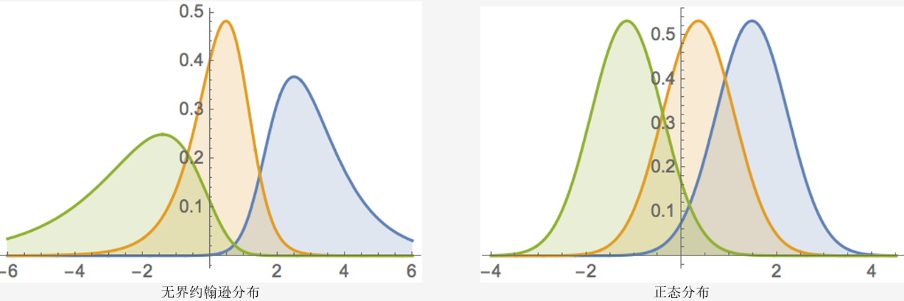

### 探索性数据分析

数据探索作用：了解数据性质及干净程度、数据的大小、数据的缺失值的分布、训练集与测试集的分布差异。

全局分析：知道数据的整体情况，决定我们采用什么样的机器等等；训练集和测试集的数据分布是否有差异；数据量是否充分，是否有外部数据可以进行补充；评价函数是什么，和数据字段有什么关系；

目标变量为连续值：查看其值域范围是否较大，如果较大是否需要进行对数变换。

目标变量为离散值：如果数据分布不平衡，考虑是否需要上采样/下采样；如果目标变量在某个ID上面分布不平衡，在划分本地训练集和验证集的时候，需要考虑分层采样。

#### 单变量分析

核心变量的数据重复程度；核心变量的数据缺失程度；核心变量的数据离散程度；最后总结数据质量表现由好到坏的指标


分析数据中每个字段的含义、分布、缺失情况；

-  分析字段的含义，字段表示什么含义、字段的类型是什么、字段的取值空间是什么、字段每个取值表示什么意义、是原始数据，还是经过人工处理。
-  接下来需要分析字段的分布情况，分析字段整体的分布，分析字段在训练集/测试集中的分布情况。
-  最后可以对数据字段进行缺失值得分析，分析字段缺失值的分布比例，字段在训练集/测试 集的缺失情况。

分析数据中每个字段的与赛题标签的关系； 

- 首先可以计算数据每个字段与标签的相关性，可利用相关性计算； 
- 接下来可以将字段与标签联合起来进行分析，分析每个字段取值情况下标签的取值情况，分析字段分布于标签的分布情况。



当样本数据表明质量特征的分布为非正态时，应用基于正态分布的方法会作出不正确的判决。约翰逊分布族即为经约翰变换后服从正态分布的随机变量的概率分布，约翰逊分布体系建立了三族分布，分别为有界$S_B$ 、对数正态$S_L$和无界$S_U$。

```python
y = Train_data['price']
plt.figure(1); plt.title('Johnson SU')
sns.distplot(y, kde=False, fit=st.johnsonsu)
plt.figure(2); plt.title('Normal')
sns.distplot(y, kde=False, fit=st.norm)
plt.figure(3); plt.title('Log Normal')
sns.distplot(y, kde=False, fit=st.lognorm)
```

当样本不服从正态分布时，可以做如下转换：

- 线性变化`z-scores`：基于原始数据的均值和标准差进行数据的标准化。

- `Box-Cox`变换：一种广义幂变换方法，是统计建模中常用的一种数据变换，用于连续的响应变量不满足正态分布的情况。

  

- `yeo-johnson`变换：是幂变换的方法之一，通过构建一组单调函数对随机变量进行数据变换。


- `skeness`：衡量随机变量概率分布的不对称性，是相对于平均值不对称程度的度量，通过对偏度系数的测量，我们能够判定数据分布的不对称程度以及方向，目前有两种计算方式。

$$
b_1 = \frac{\frac{1}{n}\sum_{i=1}^n(x_i-\overline{x})^3}{[\frac{1}{n-1}\sum_{i=1}^n(x_i-\overline{x})^2]^{3/2}}\\
g_1=\frac{\sqrt{n(n-1)}}{n-2}\frac{\frac{1}{n}\sum_{i=1}^n(x_i-\overline{x})^3}{[\frac{1}{n}\sum_{i=1}^n(x_i-\overline{x})^2]^{3/2}}
$$

- `kurtosis`：研究数据分布陡峭或平滑的统计量，通过对峰度系数的测量，我们能够判定数据相对于正态分布而言是更陡峭/平缓。有两种计算方式。

$$
g_2 =\frac{\frac{1}{n}\sum_{i=1}^n(x_i-\overline{x})^4}{[\frac{1}{n}\sum_{i=1}^n(x_i-\overline{x})^2]^2}-3\\
G_2 =\frac{n(n+1)}{(n-1)(n-2)(n-3)}\frac{\sum_{i=1}^n(x_i-\overline{x})^4}{[\sum_{i=1}^n(x_i-\overline{x})^2]^2}-3\frac{(n-1)^2}{(n-2)(n-3)}
$$


`Omnibus`检验：$K=Z_1(g_1)^2+Z_2(g_2)^2$，式中$Z_1$和$Z_2$是两个正态化函数，$g_1$和$g_2$则分别是偏度和峰度.

`Jarque-Bera`检验：$JB=\frac{n}{6}(g_1^2+\frac{1}{4}g_2^2)$

两个检验的原假设$H_0$:数据是正态分布的。备择假设$H_1$：数据不是正态分布。

##### 异常值

3σ原则：假设一组检测数据只含有随机误差，对原始数据进行计算处理得到标准差，然后按一定的概率确定一个区间，认为误差超过这个区间的就属于异常值。要求数据服从正态分布或近似服从正态分布

箱线图：判断异常值的标准以四分位数和四分位距为基础。异常值通常被定义为小于$Q_L-1.5\times \text{IQR}$或大于$Q_U-1.5\times \text{IQR}$值。对数据分布不作任何限制性要求。

对于分类问题可以分组查看，从而判断异常值。

#### 多变量分析

多变量分析：包括特征变量与特征变量之间的分析以及特征变量与标签之间的分析等；通过多变量分析，很多时候我们可以直接找到一些比较强的特征，此外变量之间的关系也可以帮助我们做一些简单的特征筛选。

### 特征工程

特征工程又包含了`Feature Selection`特征选择、`Feature Extraction`特征提取和`Feature construction`特征构造等子问题。特征工程是将原始数据，通过业务逻辑理解、数据变换、特征交叉与组合等方式，量化成模型训练和预测可直接使用的特征的过程。

##### 特征清洗

对于类别变量，可以统计比较少的取值； 对于数字变量，可以统计特征的分布异常值；统计字段的缺失比例；

###### 缺失值处理

1. 单独作为一类，做特殊编码
2. 统计样本缺失值数量作为新的特征，也可以对缺失值数量进行排序获得序号作为特征
3. 不处理：针对xgboost等树模型，有些模型有处理缺失的机制，所以可以不处理；
4. 如果缺失的太多，可以考虑删除该列；
5. 插值补全（均值，中位数，众数，建模预测，多重插补等）；
6. 二值化，根据是否缺失衍生特征。

特征值为连续值：按不同的分布类型对缺失值进行补全：偏正态分布，使用均值代替，可以保持数据的均值；偏长尾分布，使用中值代替，避免受`outlier`的影响；特征值为离散值：使用众数代替。

###### 异常值处理

1. 不处理，例如对于模型，如`LightGBM`和`XGBoost`，这类对异常值不敏感的算法来说不太需要处理；
2. 把异常值的处理用缺失值的处理的思路来处理，比如mean、median进行填补；
3. 对特征进行分箱，避免异常值的影响。
4. 业务异常的问题，可以结合业务和实际的情况进行处理
5. 对异常值进行截断，最大值和最小值截断，或者百分比截断
6. 对数值特征进行`Box-Cox`转化，降低异常值影响。

处于模型稳定性的考虑，对于精度过高的数据可以进行舍入，达到有效使用的精度。

#### 特征预处理

##### 量纲归一化

归一化作用于每一数据行，通过缩放以原样本的某个范数使得计算样本间相似度的时候有统一的标准。

标准化作用于每个特征列，通过去均值和缩放以方差值的方式将样本的所有特征列转化到同一量纲下

标准化原因：如果特征的量纲不一致会导致夸大一些特征在模型中对结果的影响；有些模型假设特征都是服从标准正态分布

##### 数据离散化

- 离散后稀疏向量内积乘法运算速度更快，计算结果也方便存储，容易扩展；
- 离散后的特征对异常值更具鲁棒性，如 age>30 为 1 否则为 0，对于年龄为 200 的也不会对模型造成很大的干扰；
- LR 属于广义线性模型，表达能力有限，经过离散化后，每个变量有单独的权重，这相当于引入了非线性，能够提升模型的表达能力，加大拟合；
- 离散后特征可以进行特征交叉，提升表达能力，由 M+N 个变量编程 M*N 个变量，进一步引入非线形，提升了表达能力；
- 特征离散后模型更稳定，如用户年龄区间，不会因为用户年龄长了一岁就变化
- 离散化在`one-hot`展开之后还可以进行特征交叉，这一系列增大特征维度的方法都可以增强逻辑回归这种线性模型的非线性表达能力
- 可以将缺失作为独立的一类带入模型。
- 将所有变量变换到相似的尺度上。

离散化后需要达到的效果：每个分箱之间的好坏比要有一定差异；每一箱中的样本数量不能过少；分箱的好坏比趋势要与业务常识保持一致；分箱切点的取值要符合业务常识。

ChiMerge卡方分箱算法由Kerber于1992提出。


它主要包括两个阶段：初始化阶段和自底向上的合并阶段。


1、初始化阶段：首先按照属性值的大小进行排序（对于非连续特征，需要先做数值转换，比如转为坏人率，然后排序），然后每个属性值单独作为一组。


2、合并阶段：

（1）对每一对相邻的组，计算卡方值。

（2）根据计算的卡方值，对其中最小的一对邻组合并为一组。

（3）不断重复（1），（2）直到计算出的卡方值都不低于事先设定的阈值，或者分组数达到一定的条件（如最小分组数5，最大分组数8）。

##### 特征编码

对于类别特征来说，有如下处理方式： (a) 自然数编码（Label Encoding） (b) 独热编码（Onehot Encoding） (c) 哈希编码（Hash Encoding） (d) 统计编码（Count Encoding） (e) 目标编码（Target Encoding） (f) 嵌入编码（Embedding Encoding） (g) 缺失值编码（NaN Encoding） (h) 多项式编码（Polynomial Encoding） (i) 布尔编码（Bool Encoding）

 对于数值特征来说，有如下处理方式： (a) 取整（Rounding） (b) 分箱（Binning） (c) 放缩

#### 特征构造

特征构造的方法：

1. 特征离散化
2. 特征二值化，转化为0或1
3. 特征编码
4. 特征之间的数学运算，加减组合或者提取一些统计特征
5. 特征的`embedding`

##### 类别特征

###### 编码特征

WOE转换是一种有监督的编码方式，将预测类别的集中度的属性作为编码的数值。通俗来讲就是特征取某个值的时候对违约比例的一种影响。

`OneHot`编码主要应用于无序的分类变量 

均值编码是针对高基数的类别特征进行处理，当类别特征的实例值过多时进行`OneHot`编码容易引起维度灾难，使得模型效果降低。均值编码在贝叶斯的架构下，利用所要预测的目标变量，有监督地确定最适合这个定性特征的编码方式。它最大的特点是基于经验贝叶斯方法利用已知数据估算先验概率和后验概率，通过对先验概率和后验概率做加权平均计算最终的特征编码值。 

##### 数值特征

1. 函数变换，常用的变换函数有：绝对值变换；平方、立方变换；对数变换；指数变换；倒数变换。
2. 对数据特征进行排序，获得排序特征，其优势在于处理后的特征具有鲁棒性，不受极端值影响 
3. 特征的分箱，对连续变量的离散化和多分类值离散变量的合并。
4. 统计特征，统计单个或者多个变量的统计值(max,min,count,mean)等而形成新的特征。
5. 决策树衍生特征，在决策树的系列算法中，每个样本都会落入一个叶子结点上，将叶子结点作为新的特征用于训练模型 

##### 时间序列特征

###### 时间本身衍生特征

- 持续时间：浏览时长；
- 间隔时间：购买/点击距今时长；距离假期的前后时长（节假日前和节假日后可能会出现明显的数据波动）；
- 年、季度、季节、月、星期、日、时 等；
- 节假日、节假日第 n 天、节假日前 n 天、节假日后 n 天；
- 一天的某个时间段；上午、中午、下午、傍晚、晚上、深夜、凌晨等；
- 年初、年末、月初、月末、周内、周末；
- 高峰时段、是否上班、是否营业、是否双休日；

###### 统计值特征

基于历史数据构造长中短期的统计值，包括前 n 天/周期内的：

- 四分位数；
- 中位数、平均数、偏差；
- 偏度、峰度；挖掘数据的偏离程度和集中程度；
- 离散系数；挖掘离散程度
- 前 n 个周期/天/月/年的同期值；同比和环比

###### `RFM`

`RFM`模型前提假设：最近有过交易行为的客户，二次发生交易的可能性要高于最近没有交易行为的客户；交易频率较高的客户比交易频率较低的客户，更有可能发生二次交易；过去所有交易总金额较多的客户，比交易总金额较少的客户，更有可能发生二次交易

`RFM`是构造统计类特征的基础，其含义为：

- R（Recency）最近一次消费时间：表示用户最近一次消费距离现在的时间。R值越大，表示客户交易发生的日期越久，反之则表示客户交易发生的日期越近。
- F（Frequency）消费频率：消费频率是指用户在统计周期内购买商品的次数F值越大，表示客户交易越频繁，反之则表示客户交易不够活跃。
- M（Monetary）消费金额：消费金额是指用户在统计周期内消费的总金额。M值越大，表示客户价值越高，反之则表示客户价值越低。

对于不同数据源，可以得到不同内容的`RFM`特征。例如：运营商数据：用户每天的通话记录次数、时长等；信用卡账单或电商交易数据：用户每天的交易笔数、金额等；埋点行为数据：用户每天在某页面的浏览量、点击量等；设备数据：用户每天的登陆、活跃次数。

接下来，我们就可以继续细分类目来统计。例如：信用卡交易数据：用户每天在母婴用品、交通出行、餐饮、美容美发等交易笔数、金额；设备App数据：用户手机上安装的借贷类、生活类、运动类、音乐类等App的数量。

第三方多头借贷数据通常包含以下变量：

> 借款人最近7天、1个月、3个月、6个月、12个月、18个月、24个月的某类平台借贷次数
>
> 某类平台包含：消费金融公司、互联网金融公司、银行信贷、数据风控公司等等。

###### 占比统计类特征

占比类特征，一方面可用来去除量纲影响，另一方面衡量用户的行为偏好。例如：最近N个月内母婴类消费次数占比 = 最近N个月内母婴类消费次数 / 最近N个月内消费次数

###### 趋势统计类特征

由于一个人的行为是会动态变化的，趋势可以更好的刻画当前的情况。

多头借贷趋势 =（当月的多头借贷次数 - 上个月的多头借贷次数）/ 上个月的多头借贷次数

如果以“最近7天的多头借贷次数 / 最近1个月的多头借贷次数”，我们便可以判断借款人的时间维度上的借贷行为分布。这个变量数值越大，代表近期借贷集中，短期风险更大。如果以“最近1个月的银行信贷借贷次数 / 最近1个月的多头借贷次数”，我们便可以判断借款人的在借贷平台维度的分布。这个变量数值越大，可以认为越趋于正面。

###### 稳定性特征

在不同时间点统计的数量特征基础上，我们可以继续衡量用户行为的稳定性。可以用变异系数来衡量这种数据波动水平。变异系数越小，代表波动越小，稳定性越好。变异系数的计算公式为：变异系数 =（ 标准偏差 SD / 平均值Mean ）× 100%

##### 特征分箱

类别型变量：如果不超过5个，无需进行分箱；超过5个，有两种方法。一，如果类别很多，可以对其进行bad_rate编码之后划入数值型变量；二，类别不是很多，对其进行降基处理，缩小至5个以内。
数值型变量：有无监督和有监督分箱两种方法。无监督分箱有等比分箱、等宽分箱、聚类分箱等。有监督分箱有卡方分箱、最优分箱等等。


#### 特征选择

减少特征数量、降维，使模型泛化能力更强，减少过拟合；增强对特征和特征值之间的理解

###### 方法分类

| 分类   | 说明                                                         | 思想                                                         |
| ------ | ------------------------------------------------------------ | ------------------------------------------------------------ |
| 过滤法 | 先进行特征选择，然后去训练学习器，所以特征选择的过程与学习器无关 | 对每一维特征“打分”，即给每一维的特征赋予权重，这样的权重就代表着该特征的重要性，然后依据权重排序。 |
| 包裹法 | 直接把最后要使用的分类器作为特征选择的评价函数，对于特定的分类器选择最优的特征子集 | 将子集的选择看作是一个搜索寻优问题，生成不同的组合，对组合进行评价，再与其他的组合进行比较。 |
| 嵌入法 | 将特征选择嵌入到模型训练当中，其训练可能是相同的模型，但是特征选择完成后，还能给予特征选择完成的特征和模型训练出的超参数，再次训练优化 | 在模型既定的情况下学习出对提高模型准确性最好的特征。也就是在确定模型的过程中，挑选出那些对模型的训练有重要意义的特征 |

优点：对特征进行搜索时围绕学习算法展开的，对特征选择的标准/规范是在学习算法的需求中展开的，能够考虑学习算法所属的任意学习偏差，从而确定最佳子特征，真正关注的是学习问题本身。由于每次尝试针对特定子集时必须运行学习算法，所以能够关注到学习算法的学习偏差/归纳偏差，因此封装能够发挥巨大的作用。缺点：运行速度远慢于过滤算法，实际应用用封装方法没有过滤方法流行。

主要方法：用带有`L1`正则化的项完成特征选择也可以结合`L2`惩罚项来优化、随机森林平均不纯度减少法/平均精确度减少法。优点：对特征进行搜索时围绕学习算法展开的，能够考虑学习算法所属的任意学习偏差。训练模型的次数小于Wrapper方法，比较节省时间。缺点：运行速度慢。

| 业务原则   | 说明                                                         |
| ---------- | ------------------------------------------------------------ |
| 合规性     | 用以加工变量的数据源是否符合国家法律法规？是否涉及用户隐私数据？是否合规 |
| 可得性     | 数据未来是否能继续采集？                                     |
| 稳定性     | 数据源采集稳是否稳定？变量取值分布变化是否稳定？             |
| 可解释性   | 需要符合业务可解释性。如果变量的业务逻辑不清晰，宁可弃之     |
| 逻辑性     | 特征变量是因，风控决策是果。如果某个变量是风控系统决策给出的，那么我们就不能入模。 |
| 可实时上线 | 模型最终目的是为了上线使用。如果实时变量不支持加工，那么对应的离线变量就只能弃之。 |

##### 单变量特征选择

特征选择方法：

1. 基于缺失率，剔除掉缺失率高的特征
2. 基于特征方差过滤特征，剔除掉方差（变异系数）较小的特征。对于离散变量计算每个值所占比率，如果某个类别特别多，则可以考虑剔除这个特征
3. 基于稳定性，通过计算训练样本和测试样本特征的稳定性对于可以进行时间切片的可以检验不同时间端的稳定性`PSI`，剔除不稳定的特征。避免模型的不稳定
4. 基于区分能力，计算特征和标签的相关性，剔除掉相关性小的特征。

| 系数                   | 优点                                                         | 缺点                                                         |
| ---------------------- | ------------------------------------------------------------ | ------------------------------------------------------------ |
| `Pearson`相关系数      | 计算速度快、易于计算                                         | 只对线性关系敏感，难以发现非线性相关性                       |
| 互信息和最大信息系数   | 只能用于离散型特征的选择，连续型特征需要先进行离散化才能用互信息进行特征选择 | 不属于度量方式，也没有办法进行归一化                         |
| 距离相关系数           | 距离相关系数是为了克服Pearson相关系数的弱点                  | 计算耗时                                                     |
| 基于学习模型的特征排序 |                                                              |                                                              |
| 卡方检验               |                                                              | 只适用于分类问题中离散型特征筛选，不能用于分类问题中连续型特征的筛选 |
| 基于IV, KS等           |                                                              |                                                              |

每个变量的IV值，或者单变量KS/AR值，并从大到小进行排序，挑选排名前多少的变量，或者大于一定阈值的变量。对于IV值较低的变量，他们本身能提供给模型的贡献也比较少，剔除掉也不足为惜了。

###### 随机森林选择

它易于使用。但它有两个主要问题：重要的特征有可能得分很低，关联特征问题；这种方法对特征变量类别多的特征越有利，偏向问题。

1. 平均不纯度减少：CART利用不纯度可以确定节点，对于分类问题，通常采用基尼不纯度，对于回归问题，通常采用的是方差或者最小二乘拟合。当训练决策树的时候，可以计算出每个特征减少了多少树的不纯度。对于一个决策树森林来说，可以算出每个特征平均减少了多少不纯度，并把它平均减少的不纯度作为特征选择的标准。

2. 平均精确度减少 ：通过直接度量每个特征对模型精确率的影响来进行特征选择。主要思路是打乱每个特征的特征值顺序，并且度量顺序变动对模型的精确率的影响。对于不重要的变量来说，打乱顺序对模型的精确率影响不会太大。对于重要的变量来说，打乱顺序就会降低模型的精确率。

###### 顶层特征选择

1. 稳定性选择：它的主要思想是在不同的数据子集和特征子集上运行特征选择算法，不断的重复，最终汇总特征选择结果。比如可以统计某个特征被认为是重要特征的频率，例如被选为重要特征的次数除以它所在的子集被测试的次数。

2. 递归特征消除：递归特征消除的主要思想是反复的构建模型然后选出最好的或者最差的的特征，把选出来的特征放到一遍，然后在剩余的特征上重复这个过程，直到所有特征都遍历了。这个过程中特征被消除的次序就是特征的排序。因此，这是一种寻找最优特征子集的贪心算法。


###### 共线性

通过计算变量的`VIF`，可以检验共线性问题是否存在，通过综合考虑单变量或多变量的AR值判断应该保留哪些变量、剔除哪些变量。常用的检验方法主要有简单相关系数检验法、容限度法、方差扩大因子法、特征值和条件指数法、`Theil`多重共线性效应系数法等。

容限度是由每个自变量$X_j$作为因变量对其他自变量回归时得到的余差比例，即：$\text{Tolerance}_j=1-R_j^2$。其中，$R_j^2$表示第$j$个自变量对其他自变量进行回归得到的判定系数$R^2$。容限度很大时，$R_j^2$很小，说明所$X_j$包含的独立信息很多，可能成为重要解释变量；反之，容限度很小，$R_j^2$很大，说明$X_j$与其他自变量的信息重复性越大，其对因变量$Y$的解释能力越小。容限度的大小是根据研究者的具体需要制定的，通常当容限度小于0.1时，便认为变量$X_j$与其他变量之间的多重共线性超过了容许界限。

方差扩大因子是容限度的倒数。即：$VIF_j=1/Tolerance_j=1/(1-R_j^2 )$。它表示所对应的偏回归系数的方差由于多重共线性而扩大的倍数。一般认为：若$VIF>10$，说明模型中有很强的共线性关系；若条件指数值在10与30间为弱相关，在30与100间为中等相关，大于100为强相关。

 The condition `indices` are computed as the square roots of the ratios of the largest eigenvalue to each successive eigenvalue. Values greater than 15 indicate a possible problem with collinearity; greater than 30, a serious problem. 最大的特征值除以其他特征值后的平方根。

###### 逐步回归

逐步回归是一个不断往模型中增加或删除变量，直到找到最优的变量组合、新增变量不再产生具有统计显著意义的增量效应为止。最需要注意的是模型拟合出来的系数方向是否一致，如果出现不一致的情况，可以考虑在变量清单中剔除掉这部分指标，重新进行逐步回归分析，直到系数方向一致为止。

1. 前向逐步回归：`FS`回归是让所有建模指标变量一个一个地进入回归方程，按照预先设定的显著性检验标准，最显著的指标变量最先进入，然后其次就是次显著的指标变量进入，依次类推。
2. 后向逐步回归：它的逻辑是首先让全部指标变量都进入回归方程，按照预先设定的显著性检验标准，把不显著的变量逐一剔除。
3. 混合逐步回归：按照预先设定的显著性检验标准，逐步加入或者剔除指标变量，可以由前向逐步回归开始，也可以由后向逐步回归开始，例如由前向逐步回归开始，当新指标变量进入时，如果老指标变量不满足预先设定的标准可以后向剔除，而对比前向逐步回归，变量一旦进入，就不再退出

##### 特征降维

数据特征维度太高，首先会导致计算很麻烦，其次增加了问题的复杂程度。但盲目减少数据的特征会损失掉数据包含的关键信息，容易产生错误的结论。

而数据降维就可以实现：使得数据集更易使用；确保变量之间彼此独立；降低算法计算运算成本

特征选择和特征降维的区别：特征选择是从已存在的特征中选取携带信息最多的，选完之后的特征依然具有可解释性，而特征降维，已存在的特征压缩，降维完毕后不是原来特征的任何一个，也就是特征降维之后的特征我们根本不知道什么含义了。