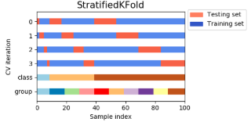

惯例： `scikit-learn estimator`遵守以下惯例：

 

\- 除非显式指定数据类型，否则所有的输入数据都被转换成 `float64`

\- 回归问题的输出被转换成 `float64`；分类问题的输出不被转换

\- `estimator`的参数可以更新：

 \- `estimator.set_params(...)`方法可以显式更新一个`estimator`的参数值

 \- 多次调用`estimator.fit(...)`方法可以隐式更新一个`estimator`的参数值。最近的一次训练学到的参数会覆盖之前那次训练学到的参数值。

##### 缺失值填补

A more sophisticated approach is to use the `IterativeImputer` class, which models each feature with missing values as a function of other features, and uses that estimate for imputation. 

It does so in an iterated round-robin fashion: at each step, a feature column is designated as output `y` and the other feature columns are treated as inputs `X`. A regressor is fit on `(X, y)` for known `y`. Then, the regressor is used to predict the missing values of `y`. This is done for each feature in an iterative fashion, and then is repeated for `max_iter` imputation rounds. The results of the final imputation round are returned.

```python
import numpy as np
from sklearn.experimental import enable_iterative_imputer
from sklearn.impute import IterativeImputer
imp = IterativeImputer(max_iter=10, random_state=0)
imp.fit([[1, 2], [3, 6], [4, 8], [np.nan, 3], [7, np.nan]])

X_test = [[np.nan, 2], [6, np.nan], [np.nan, 6]]
# the model learns that the second feature is double the first
print(np.round(imp.transform(X_test)))
```

```python
from sklearn.impute import KNNImputer
nan = np.nan
#filling in missing values using the k-Nearest Neighbors approach. 
X = [[1, 2, nan], [3, 4, 3], [nan, 6, 5], [8, 8, 7]]
imputer = KNNImputer(n_neighbors=2, weights="uniform")
imputer.fit_transform(X)
```

#####  特征选择

###### Removing features with low variance

`VarianceThreshold` is a simple baseline approach to feature selection. It removes all features whose variance doesn’t meet some threshold. By default, it removes all zero-variance features

###### Univariate feature selection

Univariate feature selection works by selecting the best features based on univariate statistical tests. It can be seen as a preprocessing step to an estimator. `Scikit-learn` exposes feature selection routines as objects that implement the transform method:

- `SelectKBest` removes all but the  highest scoring features
- `SelectPercentile` removes all but a user-specified highest scoring percentage of features
- using common univariate statistical tests for each feature: false positive rate `SelectFpr`, false discovery rate `SelectFdr`, or family wise error `SelectFwe`.
- `GenericUnivariateSelect` allows to perform univariate feature selection with a configurable strategy. This allows to select the best univariate selection strategy with hyper-parameter search estimator.

These objects take as input a scoring function that returns univariate scores and p-values (or only scores for `SelectKBest` and `SelectPercentile`): For regression: `f_regression, mutual_info_regression`; For classification: `chi2, f_classif, mutual_info_classif`.

The methods based on `F-test` estimate the degree of linear dependency between two random variables. On the other hand, mutual information methods can capture any kind of statistical dependency, but being nonparametric, they require more samples for accurate estimation.

###### Recursive feature elimination

Given an external estimator that assigns weights to features, recursive feature elimination is to select features by recursively considering smaller and smaller sets of features. First, the estimator is trained on the initial set of features and the importance of each feature is obtained either through a `coef_` attribute or through a `feature_importances_` attribute. Then, the least important features are pruned from current set of features. That procedure is recursively repeated on the pruned set until the desired number of features to select is eventually reached. `RFECV` performs `RFE` in a cross-validation loop to find the optimal number of features.

###### Feature selection using `SelectFromModel`

`SelectFromModel` is a meta-transformer that can be used along with any estimator that has a `coef_` or `feature_importances_` attribute after fitting. The features are considered unimportant and removed, if the corresponding `coef_` or `feature_importances_` values are below the provided threshold parameter. Apart from specifying the threshold numerically, there are built-in heuristics for finding a threshold using a string argument. Available heuristics are `“mean”, “median”` and float multiples of these like `“0.1*mean”`.·

```python
from sklearn.svm import LinearSVC
from sklearn.datasets import load_iris
from sklearn.feature_selection import SelectFromModel
X, y = load_iris(return_X_y=True)
lsvc = LinearSVC(C=0.01, penalty="l1", dual=False).fit(X, y)
model = SelectFromModel(lsvc, prefit=True)
X_new = model.transform(X)
```

##### 特征降维

##### Unsupervised dimensionality reduction

`cluster.FeatureAgglomeration` applies Hierarchical clustering to group together features that behave similarly.

###### Random Projection

The `sklearn.random_projection` module implements a simple and computationally efficient way to reduce the dimensionality of the data by trading a controlled amount of accuracy (as additional variance) for faster processing times and smaller model sizes.

###### Gaussian random projection

The`sklearn.random_projection.GaussianRandomProjection` reduces the dimensionality by projecting the original input space on a randomly generated matrix where components are drawn from the following distribution$N(0,\frac{1}{n_{sample}})$

###### Sparse random projection

The `sklearn.random_projection.SparseRandomProjection` reduces the dimensionality by projecting the original input space using a sparse random matrix.

Sparse random matrices are an alternative to dense Gaussian random projection matrix that guarantees similar embedding quality while being much more memory efficient and allowing faster computation of the projected data.

If we define s = 1 / density, the elements of the random matrix are drawn from


##### Pipelines and composite estimators

###### Pipeline: chaining estimators

All estimators in a pipeline, except the last one, must be transformers, 等价于must have a transform method. The last estimator may be any type. The Pipeline is built using a list of `(key, value)` pairs, where the `key` is a string containing the name you want to give this step and `value` is an estimator object

```python
estimators = [('reduce_dim', PCA()), ('clf', SVC())]
pipe = Pipeline(estimators)
# The utility function make_pipeline is a shorthand for constructing pipelines
make_pipeline(Binarizer(), MultinomialNB())
pipe.steps[0]; pipe[0]; pipe['reduce_dim']
pipe.named_steps.reduce_dim is pipe['reduce_dim']

pipe.set_params(clf__C=10) 
param_grid = dict(reduce_dim__n_components=[2, 5, 10],
                  clf__C=[0.1, 10, 100])
grid_search = GridSearchCV(pipe, param_grid=param_grid)
```

 The estimators of a pipeline are stored as a list in the `steps` attribute, but can be accessed by index or name by indexing the Pipeline. Pipeline’s `named_steps` attribute allows accessing steps by name with tab completion in interactive environments. A sub-pipeline can also be extracted using the slicing notation commonly used for Python Sequences, although only a step of 1 is permitted. This is convenient for performing only some of the transformations. Parameters of the estimators in the pipeline can be accessed using the `<estimator>__<parameter>` syntax. Calling `fit` on the pipeline is the same as calling fit on each estimator in turn, transform the input and pass it on to the next step. The pipeline has all the methods that the last estimator in the pipeline has. if the last estimator is a classifier, the Pipeline can be used as a classifier. If the last estimator is a transformer, again, so is the pipeline.

##### `FeatureUnion`: composite feature spaces

`FeatureUnion` combines several transformer objects into a new transformer that combines their output. A `FeatureUnion` takes a list of transformer objects. During fitting, each of these is fit to the data independently. The transformers are applied in parallel, and the feature matrices they output are concatenated side-by-side into a larger matrix.

```python
estimators = [('linear_pca', PCA()), ('kernel_pca', KernelPCA())]
combined = FeatureUnion(estimators)
```

`FeatureUnion` serves the same purposes as Pipeline - convenience and joint parameter estimation and validation. `FeatureUnion` and Pipeline can be combined to create complex models.
A `FeatureUnion` has no way of checking whether two transformers might produce identical features. It only produces a union when the feature sets are disjoint, and making sure they are the caller’s responsibility. A `FeatureUnion` is built using a list of `(key, value)` pairs, where the key is the name you want to give to a given transformation and `value` is an estimator object.

##### Column Transformer for heterogeneous data

The `ColumnTransformer` helps performing different transformations for different columns of the data, within a Pipeline that is safe from data leakage and that can be parametrized. `ColumnTransformer` works on arrays, sparse matrices, and pandas `DataFrames`. To each column, a different transformation can be applied, such as preprocessing or a specific feature extraction method.

```python
X = pd.DataFrame({'city': ['London', 'London', 'Paris', 'Sallisaw'],
     'title': ["His Last Bow", "How Watson Learned the Trick",
               "A Moveable Feast", "The Grapes of Wrath"],'expert_rating': [5, 3, 4, 5],
     'user_rating': [4, 5, 4, 3]})
'''In the above example, the CountVectorizer expects a 1D array as input and therefore the columns were specified as a string ('title'). However, preprocessing.OneHotEncoder as most of other transformers expects 2D data, therefore in that case you need to specify the column as a list of strings (['city']).'''
column_trans = ColumnTransformer([('city_category', OneHotEncoder(dtype='int'),['city']),
     ('title_bow', CountVectorizer(), 'title')],remainder='drop')

column_trans.fit(X) 
column_trans.get_feature_names()
column_trans.transform(X).toarray()
```

Apart from a scalar or a single item list, the column selection can be specified as a list of multiple items, an integer array, a slice, or a boolean mask. Strings can reference columns if the input is a `DataFrame`, integers are always interpreted as the positional columns.

We can keep the remaining rating columns by setting `remainder='passthrough'`. The values are appended to the end of the transformation:

```
column_trans = ColumnTransformer([('city_category', OneHotEncoder(dtype='int'),['city']),
     ('title_bow', CountVectorizer(), 'title')], remainder='passthrough')
```

 The `remainder` parameter can be set to an estimator to transform the remaining rating columns. The transformed values are appended to the end of the transformation.

```python
column_trans = ColumnTransformer([('city_category', OneHotEncoder(), ['city']),
     ('title_bow', CountVectorizer(), 'title')], remainder=MinMaxScaler())
```

##### Feature extraction

The `sklearn.feature_extraction` module can be used to extract features in a format supported by machine learning algorithms from datasets consisting of formats such as text and image.
Feature extraction is very different from Feature selection: the former consists in transforming arbitrary data, such as text or images, into numerical features usable for machine learning. The latter is a machine learning technique applied on these features.

###### loading features from `dicts`

`DictVectorizer` implements what is called one-of-K or “one-hot” coding for categorical features. Categorical features are “attribute-value” pairs where the value is restricted to a list of discrete of possibilities without ordering

### 数据清洗

##### Imputing missing data

单变量缺失值填补，填补特征缺失值的时候，使用此特征没有缺失值的数值特征来进行填充。多变量缺失值填补使用所有可用的特征来预测缺失特征的缺失值。`sklearn.inpute.SimpleImpute`可以使用众数、中位数和均值来填充。

The median is a more robust estimator for data with high magnitude variables which could dominate results.

轮询调度算法：A more sophisticated approach is to use the `IterativeImputer` class, which models each feature with missing values as a function of other features, and uses that estimate for imputation. It does so in an iterated round-robin fashion: at each step, a feature column is designated as output y and the other feature columns are treated as inputs X. A `regressor` is fit on (X, y) for known y. Then, the `regressor` is used to predict the missing values of y. This is done for each feature in an iterative fashion, and then is repeated for `max_iter` imputation rounds. The results of the final imputation round are returned. 


In the statistics community, it is common practice to perform multiple imputations, generate m separate imputations for a single feature matrix. Each of these m imputations is then put through the subsequent analysis pipeline. The m final analysis results allow the data scientist to obtain understanding of how analytic results may differ as a consequence of the inherent uncertainty caused by the missing values. The above practice is called multiple imputation. `IterativeImputer` can also be used for multiple imputations by applying it repeatedly to the same dataset with different random seeds when `sample_posterior=True`. 

The `MissingIndicator` transformer is useful to transform a dataset into corresponding binary matrix indicating the presence of missing values in the dataset. This transformation is useful in conjunction with imputation. When using imputation, preserving the information about which values had been missing can be informative. `NaN` is usually used as the placeholder for missing values. However, it enforces the data type to be float. The parameter `missing_values` allows to specify other placeholder such as integer.


##### Preprocessing data

###### Standardization, or mean removal and variance scaling

many elements used in the objective function of a learning algorithm assume that all features are centered around zero and have variance in the same order. If a feature has a variance that is orders of magnitude larger than others, it might dominate the objective function and make the estimator unable to learn from other features correctly as expected. The preprocessing module further provides a utility class `StandardScaler` that implements the Transformer `API` to compute the mean and standard deviation on a training set so as to be able to later reapply the same transformation on the testing set. An alternative standardization is scaling features to lie between a given minimum and maximum value, often between zero and one, or so that the maximum absolute value of each feature is scaled to unit size. This can be achieved using `MinMaxScaler` or `MaxAbsScaler`, respectively. The motivation to use this scaling include robustness to very small standard deviations of features and preserving zero entries in sparse data.
`MaxAbsScaler` works in a very similar fashion, but scales in a way that the training data lies within the range [-1, 1] by dividing through the largest maximum value in each feature. It is meant for data that is already centered at zero or sparse data. Centering sparse data would destroy the sparseness structure in the data, and thus rarely is a sensible thing to do. However, it can make sense to scale sparse inputs, especially if features are on different scales.

`MaxAbsScaler` and `maxabs_scale` were specifically designed for scaling sparse data, and are the recommended way to go about this. However, scale and `StandardScaler` can accept `scipy.sparse` matrices as input, as long as `with_mean=False` is explicitly passed to the constructor. Otherwise a `ValueError` will be raised as silently centering would break the sparsity and would often crash the execution by allocating excessive amounts of memory unintentionally. `RobustScaler` cannot be fitted to sparse inputs, but you can use the transform method on sparse inputs. This Scaler removes the median and scales the data according to the quantile range, defaults to `IQR`
Finally, if the centered data is expected to be small enough, explicitly converting the input to an array using the `toarray` method of sparse matrices is another option.

###### Non-linear transformation

Quantile transforms put all features into the same desired distribution based on the formula $G^{-1}(F(X))$ where $F$ is the cumulative distribution function of the feature and $G^{-1}$ the quantile function of the desired output distribution . This formula is using the two following facts: if $X$ is a random variable with a continuous cumulative distribution function $F$ then $F(X)$ is uniformly distributed on ; if $U$ is a random variable with uniform distribution on $[0,1]$ then $G^{-1}(U)$has distribution $G$. By performing a rank transformation, a quantile transform smooths out unusual distributions and is less influenced by outliers than scaling methods. It does, however, distort correlations and distances within and across features.

 Power transforms are a family of parametric transformations that aim to map data from any distribution to as close to a Gaussian distribution. 

`PowerTransformer` currently provides two such power transformations, the `Yeo-Johnson` transform and the Box-Cox transform. The `Yeo-Johnson` transform is given by:


 while the Box-Cox transform is given by 


Box-Cox can only be applied to strictly positive data. In both methods, the transformation is parameterized by λ, which is determined through maximum likelihood estimation. Here is an example of using Box-Cox to map samples drawn from a `lognormal` distribution to a normal distribution. Note that when applied to certain distributions, the power transforms achieve very Gaussian-like results, but with others, they are ineffective.
It is also possible to map data to a normal distribution using `QuantileTransformer` by setting `output_distribution='normal'`. 

###### Normalization

Normalization is the process of scaling individual samples to have unit norm. This process can be useful if you plan to use a quadratic form such as the dot-product or any other kernel to quantify the similarity of any pair of samples.

###### Discretization

Discretization provides a way to partition continuous features into discrete values. Certain datasets with continuous features may benefit from discretization, because discretization can transform the dataset of continuous attributes to one with only nominal attributes. One-hot encoded discretized features can make a model more expressive, while maintaining interpretability. 

By default the output is one-hot encoded into a sparse matrix and this can be configured with the `encode` parameter. For each feature, the bin edges are computed during `fit` and together with the number of bins, they will define the intervals. Discretization is similar to constructing histograms for continuous data. However, histograms focus on counting features which fall into particular bins, whereas discretization focuses on assigning feature values to these bins.

`KBinsDiscretizer` implements different binning strategies, which can be selected with the `strategy` parameter. The ‘`uniform’` strategy uses constant-width bins. The `‘quantile’` strategy uses the quantiles values to have equally populated bins in each feature. The `‘kmeans’` strategy defines bins based on a k-means clustering procedure performed on each feature independently.

###### Feature `binarization`

Feature `binarization` is the process of thresholding numerical features to get boolean values. This can be useful for downstream probabilistic estimators that make assumption that the input data is distributed according to a multi-variate Bernoulli distribution.

###### Generating polynomial features

Often it’s useful to add complexity to the model by considering nonlinear features of the input data. A simple and common method to use is polynomial features, which can get features’ high-order and interaction terms. It is implemented in `PolynomialFeatures`

#### 模型性能验证

##### 评价函数与目标函数

##### Model Evaluation: quantifying the quality of prediction

For the most common use cases, you can designate a scorer object with the `scoring` parameter; the table below shows all possible values. All scorer objects follow the convention that higher return values are better than lower return values.

The module `sklearn.metrics` also exposes a set of simple functions measuring a prediction error given ground truth and prediction:

- functions ending with `_score` return a value to maximize, the higher the better.
- functions ending with `_error` or `_loss` return a value to minimize, the lower the better. When converting into a scorer object using `make_scorer`, set the `greater_is_better` parameter to `False` 

```python
from sklearn.metrics import fbeta_score, make_scorer
ftwo_scorer = make_scorer(fbeta_score, beta=2)
from sklearn.model_selection import GridSearchCV
from sklearn.svm import LinearSVC
grid = GridSearchCV(LinearSVC(), param_grid={'C': [1, 10]},
                    scoring=ftwo_scorer, cv=5)
```

The second use case is to build a completely custom scorer object from a simple python function using `make_scorer`, which can take several parameters:

- the python function you want to use 
- whether the python function returns a score (greater_is_better=True, the default) or a loss (greater_is_better=False). If a loss, the output of the python function is negated by the scorer object, conforming to the cross validation convention that scorers return higher values for better models.
- for classification metrics only: whether the python function you provided requires continuous decision certainties (needs_threshold=True). The default value is False.
- any additional parameters,

```python
import numpy as np
def my_custom_loss_func(y_true, y_pred):
    diff = np.abs(y_true - y_pred).max()
    return np.log1p(diff)
score = make_scorer(my_custom_loss_func, greater_is_better=False)
```

##### 交叉验证

The performance measure reported by *k*-fold cross-validation is then the average of the values computed in the loop.


###### Computing cross-validated metrics

The simplest way to use cross-validation is to call the `cross_val_score` helper function on the estimator and the dataset.
By default, the score computed at each `CV` iteration is the score method of the estimator. It is possible to change this by using the scoring parameter

```python
from sklearn import metrics
scores = cross_val_score(clf, iris.data, iris.target, cv=5, scoring='f1_macro')
```

When the `cv` argument is an integer, `cross_val_score` uses the `KFold` or `StratifiedKFold` strategies by default,
It is also possible to use other cross validation strategies by passing a cross validation iterator instead,

```python
from sklearn.model_selection import ShuffleSplit
cv = ShuffleSplit(n_splits=5, test_size=0.3, random_state=0)
cross_val_score(clf, iris.data, iris.target, cv=cv) 
```

###### The `cross_validate` function and multiple metric evaluation

The `cross_validate` function differs from `cross_val_score` in two ways:

- It allows specifying multiple metrics for evaluation.
- It returns a `dict` containing fit-times, score-times in addition to the test score.

For single metric evaluation, where the scoring parameter is a string, callable or None, the keys will be - `['test_score', 'fit_time', 'score_time']`

And for multiple metric evaluation, the return value is a `dict` with the following keys - `['test_<scorer1_name>', 'test_<scorer2_name>', 'test_<scorer...>', 'fit_time', 'score_time']`

###### Obtaining predictions by cross-validation

The function `cross_val_predict` has a similar interface to `cross_val_score`, but returns, for each element in the input, the prediction that was obtained for that element when it was in the test set. Only `cross-validation` strategies that assign all elements to a test set exactly once can be used.
the function `cross_val_predict` is appropriate for:

- Visualization of predictions obtained from different models.
- Model blending: When predictions of one supervised estimator are used to train another estimator in ensemble methods.

###### Cross validation iterators

Assuming that some data is Independent and Identically Distributed is making the assumption that all samples stem from the same generative process and that the generative process is assumed to have no memory of past generated samples. The following `cross-validators` can be used in such cases.

**K-fold**


**Repeated K-Fold**: `RepeatedKFold` repeats `K-Fold` n times. It can be used when one requires to run `KFold` n times, producing different splits in each repetition.

Similarly, `RepeatedStratifiedKFold` repeats Stratified K-Fold n times with different randomization in each repetition

**Leave One Out**: `LeaveOneOut` is a simple cross-validation. Each learning set is created by taking all the samples except one, the test set being the sample left out. 

**Leave P Out:**`LeavePOut` is very similar to `LeaveOneOut` as it creates all the possible training/test sets by removing  samples from the complete set. 

**Shuffle Split**: The `ShuffleSplit` iterator will generate a user defined number of independent train / test dataset splits. Samples are first shuffled and then split into a pair of train and test sets.


**Stratified K-Fold**: `StratifiedKFold` is a variation of k-fold which returns stratified folds: each set contains approximately the same percentage of samples of each target class as the complete set.



**Stratified Shuffle Split**: `StratifiedShuffleSplit` is a variation of `ShuffleSplit`, which returns stratified splits, which creates splits by preserving the same percentage for each target class as in the complete set.


###### Cross-validation iterators for grouped data.

The `i.i.d.` assumption is broken if the underlying generative process yield groups of dependent samples.

**Group K-Fold**: `GroupKFold` is a variation of k-fold which ensures that the same group is not represented in both testing and training sets.


**Time Series Split**: `TimeSeriesSplit` is a variation of k-fold which returns first  folds as train set and the  th fold as test set. Note that unlike standard cross-validation methods, successive training sets are supersets of those that come before them. 


###### 针对时间序列问题的验证

###### 绘制学习率曲线

A learning curve shows the validation and training score of an estimator for varying numbers of training samples. It is a tool to find out how much we benefit from adding more training data and whether the estimator suffers more from a variance error or a bias error. If both the validation score and the training score converge to a value that is too low with increasing size of the training set, we will not benefit much from more training data.

```python
from sklearn.model_selection import learning_curve
from sklearn.svm import SVC

train_sizes, train_scores, valid_scores = learning_curve(
    SVC(kernel='linear'), X, y, train_sizes=[50, 80, 110], cv=5) 
```

###### 绘制验证曲线

plot the influence of a single hyper-parameter on the training score and the validation score to find out whether the estimator is over-fitting or under-fitting for some hyper-parameter values.

```python
import numpy as np
from sklearn.model_selection import validation_curve
from sklearn.datasets import load_iris
from sklearn.linear_model import Ridge

np.random.seed(0)
iris = load_iris()
X, y = iris.data, iris.target
indices = np.arange(y.shape[0])
np.random.shuffle(indices)
X, y = X[indices], y[indices]

train_scores, valid_scores = validation_curve(Ridge(), X, y, "alpha", np.logspace(-7, 3, 3), cv=5)
```

##### Tuning the hyper-parameters of an estimator

Any parameter provided when constructing an estimator may be optimized in this manner. Specifically, to find the names and current values for all parameters for a given estimator, use: `estimator.get_params()`
A search consists of:

- an estimator
- a parameter space;
- a method for searching or sampling candidates;
- a cross-validation scheme
- a score function.

###### Exhaustive Grid Search

The grid search provided by `GridSearchCV` exhaustively generates candidates from a grid of parameter values specified with the `param_grid` parameter.

###### Randomized Parameter Optimization

`RandomizedSearchCV` implements a randomized search over parameters, where each setting is sampled from a distribution over possible parameter values. This has two main benefits over an exhaustive search:

- A budget can be chosen independent of the number of parameters and possible values.
- Adding parameters that do not influence the performance does not decrease efficiency.

Specifying how parameters should be sampled is done using a dictionary, very similar to specifying parameters for `GridSearchCV`. Additionally, a computation budget, being the number of sampled candidates or sampling iterations, is specified using the `n_iter` parameter. For each parameter, either a distribution over possible values or a list of discrete choices can be specified:

```python
{'C': scipy.stats.expon(scale=100), 'gamma': scipy.stats.expon(scale=.1),
  'kernel': ['rbf'], 'class_weight':['balanced', None]}
```

###### Tips for Parameter search

Specifying an objective metric. By default, parameter search uses the `score` function of the estimator to evaluate a parameter setting. An alternative scoring function can be specified via the `scoring` parameter 

Specifying multiple metrics for evaluation. `GridSearchCV` and `RandomizedSearchCV` allow specifying multiple metrics for the `scoring` parameter. When specifying multiple metrics, the `refit` parameter must be set to the metric (string) for which the `best_params_` will be found and used to build the `best_estimator_` on the whole dataset. If the search should not be refit, set `refit=False`. Leaving refit to the default value `None` will result in an error when using multiple metrics.

Parallelism. Computations can be run in parallel if your OS supports it, by using the keyword `n_jobs=-1`.

Robustness to failure. Some parameter settings may result in a failure to `fit` one or more folds of the data. By default, this will cause the entire search to fail, even if some parameter settings could be fully evaluated. Setting `error_score=0` (or `=np.NaN`) will make the procedure robust to such failure, issuing a warning and setting the score for that fold to 0 (or `NaN`), but completing the search.