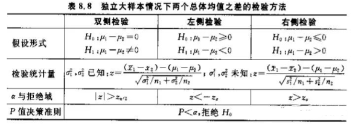

### 模型融合

#### 简单加权融合

回归：算术平均、几何平均

分类：投票

综合：排序融合、log融合

#### Boosting/Bagging

#### Stacking/Blending

**Edited Nearest Neighbours(ENN)**：对于属于多数类的一个样本，如果其K个近邻点有超过一半都不属于多数类，则这个样本会被剔除。这个方法的另一个变种是所有的K个近邻点都不属于多数类，则这个样本会被剔除。

 

- **NearMiss-1**：选择到最近的K个少数类样本平均距离最近的多数类样本
- **NearMiss-2**：选择到最远的K个少数类样本平均距离最近的多数类样本
- **NearMiss-3**：对于每个少数类样本选择K个最近的多数类样本，目的是保证每个少数类样本都被多数类样本包围

##### 描述统计

描述统计是通过图表或数学方法，对数据资料进行整理、分析，并对数据的分布状态、数字特征和随机变量之间关系进行估计和描述的方法。描述统计分为集中趋势分析、离中趋势分析和相关分析三大部分。

1. 集中趋势分析：集中趋势分析主要靠平均数、中数、众数等统计指标来表示数据的集中趋势。例如被试的平均成绩多少？是正偏分布还是负偏分布？

2. 离中趋势分析：离中趋势分析主要靠全距、四分差、平均差、方差（协方差：用来度量两个随机变量关系的统计量）、标准差等统计指标来研究数据的离中趋势。例如，我们想知道两个教学班的语文成绩中，哪个班级内的成绩分布更分散，就可以用两个班级的四分差或百分点来比较。

3. 相关分析：相关分析探讨数据之间是否具有统计学上的关联性。这种关系既包括两个数据之间的单一相关关系，也包括多个数据之间的多重相关关系；既包括A大B就大(小)，A小B就小(大)的直线相关关系，也可以是复杂相关关系（A=Y-B*X）；既可以是A、B变量同时增大这种正相关关系，也可以是A变量增大时B变量减小这种负相关，还包括两变量共同变化的紧密程度——即相关系数。

4. 推论统计：它以统计结果为依据，来证明或推翻某个命题。具体来说,就是通过分析样本与样本分布的差异，来估算样本与总体、同一样本的前后测成绩差异，样本与样本的成绩差距、总体与总体的成绩差距是否具有显著性差异。

###### 参数检验

参数检验是在已知总体分布的条件下（一般要求总体服从正态分布）对一些主要的参数(如均值、百分数、方差、相关系数等）进行的检验。

> 1）U验 ：使用条件：当样本含量n较大时，样本值符合正态分布
>
> 2）T检验 使用条件：当样本含量n较小时，样本值符合正态分布

A：单样本t检验：推断该样本来自的总体均数μ与已知的某一总体均数μ0 (常为理论值或标准值)有无差别；

B：配对样本t检验：当总体均数未知时，且两个样本可以配对，同对中的两者在可能会影响处理效果的各种条件方面为相似；

C：两独立样本t检验：无法找到在各方面极为相似的两样本作配对比较时使用。

###### 非参数检验

非参数检验则不考虑总体分布是否已知，常常也不是针对总体参数，而是针对总体的某些一般性假设（如总体分布的位罝是否相同，总体分布是否正态）进行检验。适用情况：顺序类型的数据资料，这类数据的分布形态一般是未知的。

A**：**虽然是连续数据，但总体分布形态未知或者非正态；

B：总体分布虽然正态，数据也是连续类型，但样本容量极小，如10以下；

###### 信度分析

信度即可靠性，它是指采用同样的方法对同一对象重复测量时所得结果的一致性程度。 信度指标多以相关系数表示，大致可分为三类：稳定系数（跨时间的一致性），等值系数（跨形式的一致性）和内在一致性系数（跨项目的一致性）。信度分析的方法主要有以下四种：**重测信度法、复本信度法、折半信度法、α信度系数法。**

- 重测信度法编辑：这一方法是用同样的问卷对同一组被调查者间隔一定时间重复施测，计算两次施测结果的相关系数。显然，重测信度属于稳定系数。重测信度法特别适用于事实式问卷，如性别、出生年月等在两次施测中不应有任何差异，大多数被调查者的兴趣、爱好、习惯等在短时间内也不会有十分明显的变化。如果没有突发事件导致被调查者的态度、意见突变，这种方法也适用于态度、意见式问卷。
- 复本信度法编辑：让同一组被调查者一次填答两份问卷复本，计算两个复本的相关系数。复本信度属于等值系数。复本信度法要求两个复本除表述方式不同外，在内容、格式、难度和对应题项的提问方向等方面要完全一致，而在实际调查中，很难使调查问卷达到这种要求，因此采用这种方法者较少。
- α信度系数法编辑：α信度系数是目前最常用的信度系数，其公式为：$α=\frac{k}{k-1}*(1-\sum{\frac{S_i^2}{S_T^2}})$。其中，K为量表中题项的总数， $S_i^2$为第i题得分的题内方差， $S_T^2$为全部题项总得分的方差。从公式中可以看出，属于内在一致性系数。这种方法适用于态度、意见式问卷的信度分析。总量表的信度系数最好在0.8以上，0.7-0.8之间可以接受；分量表的信度系数最好在0.7以上，0.6-0.7还可以接受。Cronbach 's alpha系数如果在0.6以下就要考虑重新编问卷。

分类：外在信度：不同时间测量时量表的一致性程度，常用方法重测信度。内在信度：每个量表是否测量到单一的概念，同时组成两表的内在体项一致性如何，常用方法分半信度。

###### 列联表分析

列联表是观测数据按两个或更多属性（定性变量）分类时所列出的频数表。列联表又称交互分类表，所谓交互分类，**是指同时依据两个变量的值，将所研究的个案分类。**交互分类的目的是将两变量分组，然后比较各组的分布状况，以寻找变量间的关系。用于分析离散变量或定型变量之间是否存在相关。

列联表分析的基本问题是，判明所考察的各属性之间有无关联，即是否独立。在r×с表中，若以$p_i$、$p_j$和$p_{ij}$分别表示总体中的个体属于等级$A_i$，属于等级$B_j$和同时属于$A_i、B_j$的概率,“A、B两属性无关联”的假设可以表述为$H_0$：$p_{ij}=p_i·p_j$，(i=1，2，…，r；j=1,2,…，с)，未知参数$p_{ij}、p_i、p_j$的最大似然估计分别为行和及列和为样本大小。当$H_0$成立，且一切$p_i>0$和$p_j>0$时，统计量的渐近分布是自由度为(r－1)(с－1) 的$Ⅹ$分布，式中$E_{ij}=\frac{n_i\times n_j}{n}$称为期望频数。当n足够大，且表中各格的$E_{ij}$都不太小时，可以据此对$h_0$作检验：若Ⅹ值足够大，就拒绝假设$h_0$，即认为A与B有关联。

###### 相关分析

研究现象之间是否存在某种依存关系，对具体有依存关系的现象探讨相关方向及相关程度。

1. 单相关：两个因素之间的相关关系叫单相关，即研究时只涉及一个自变量和一个因变量；

2. 复相关 ：三个或三个以上因素的相关关系叫复相关，即研究时涉及两个或两个以上的自变量和因变量相关；

3. 偏相关：在某一现象与多种现象相关的场合，当假定其他变量不变时，其中两个变量之间的相关关系称为偏相关。

###### 方差分析

使用条件：各样本须是相互独立的随机样本；各样本来自正态分布总体；各总体方差相等。

- 单因素方差分析：一项试验只有一个影响因素，或者存在多个影响因素时，只分析一个因素与响应变量的关系
- 多因素有交互方差分析：一项实验有多个影响因素，分析多个影响因素与响应变量的关系，同时考虑多个影响因素之间的关系
- 多因素无交互方差分析：分析多个影响因素与响应变量的关系，但是影响因素之间没有影响关系或忽略影响关系
- 协方差分析：传统的方差分析存在明显的弊端，无法控制分析中存在的某些随机因素，使之影响了分析结果的准确度。协方差分析主要是在排除了协变量的影响后再对修正后的主效应进行方差分析，是将线性回归与方差分析结合起来的一种分析方法。

###### 回归分析

- 一元线性回归分析：只有一个自变量X与因变量Y有关，X与Y都必须是连续型变量，因变量y或其残差必须服从正态分布。

- 多元线性回归分析使用条件：分析多个自变量与因变量Y的关系，X与Y都必须是连续型变量，因变量y或其残差必须服从正态分布 。

> **横型诊断方法**
>
> 残差检验：观测值与估计值的差值要跟从正态分布
>
> 强影响点判断：寻找方式一般分为标准误差法、Mahalanobis距离法
>
> 共线性诊断：诊断方式：容忍度、方差扩大因子法(又称膨胀系数VIF)、特征根判定法、条件指针CI、方差比例，处理方法：增加样本容量或选取另外的回归如主成分回归等

数据转换的方式有：

- 数据归一化(MinMaxScaler)；
- 标准化(StandardScaler)；
- 对数变换(log1p)；
- 转换数据类型(astype)；
- 独热编码(OneHotEncoder)；
- 标签编码(LabelEncoder)；
- 修复偏斜特征(boxcox1p)等。

#### 统计

##### 假设检验

显著性水平：通过小概率准则来理解，在假设检验时先确定一个小概率标准----显著性水平；用  表示；凡出现概率小于显著性水平的事件称小概率事件；

|             | $H_0$为真          | $H_0$为假         |
| ----------- | ------------------ | ----------------- |
| 未拒绝$H_0$ | 正确               | 第二类错误$\beta$ |
| 拒绝$H_0$   | 第一类错误$\alpha$ | 正确              |

如何设置原假设：

1）H0与H1是完备事件组，相互对立，有且只有一个成立
2）在确立假设时，先确定备设H1，然后再确定H0，且保证“=”总在H0上
3）原H0一般是需要反驳的，而H1是需要支持的

4）假设检验只提供原假设不利证据

什么是双尾检验，单尾检验？

1） 当H0采用等号，而H1采用不等号，双尾检验

2）当H0是有方向性的，单尾检验

P值：当原假设为真时，比所得到的样本观察，结果更极端的结果会出现的概率。如果P值很小，我们拒绝原假设的理由越充分。P的意义不表示两组差别大小，p反映两组差别有无统计学意义，显著性检验只是统计结论，判断差别还需要专业知识。

T检验与U检验

> 当样本容量n够大，样本观察值符合正态分布，可采用U检验
>
> 当样本容量n较小，若观测值符合正态分布，可采用T型检验

假设检验的基本步骤

1. 根据实际问题提出原假设$H_0$和备择假设$H_1$
2. 选取适当的显著性水平$\alpha$以及样本容量$n$
3. 构造合适的检验统计量，检验统计量的选择要考虑一些因素，如样本量的大小，总体的方差是否已知等
4. 根据统计量和显著性水平，找出拒绝域
5. 根据样本观测值，计算出检验统计量的观测值
6. 做出判断，若检验统计量的观测值落在拒绝域，则拒绝原假设$H_0$，否则不拒绝原假设$H_0$

###### 一个总体参数假设检验

对于总体比例的检验，通常是在大样本条件下进行的，而小样本得到的结果是极不稳定的；所以对总体比例进行检验时，通常用正态分布来确定临界值，即采用Z统计量，Z统计量计算公式：
$$
z = \frac{p-\pi_0}{\sqrt{\frac{\pi_0(1-\pi_0)}{n}}}
$$
p为样本比例；$\pi_0$为总体比例

###### 两个总体参数假设检验

