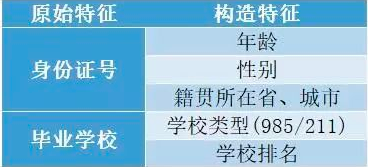
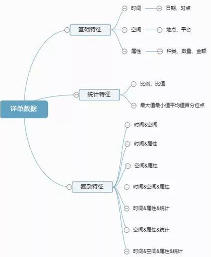

### 特征工程

特征工程又包含了`Feature Selection`特征选择、`Feature Extraction`特征提取和`Feature construction`特征构造等子问题。特征工程是将原始数据，通过业务逻辑理解、数据变换、特征交叉与组合等方式，量化成模型训练和预测可直接使用的特征的过程。其中主要包括了数据认知，数据清洗，特征提取，特征选择四个部分。

1. 数据认知：基于实际业务场景理解数据内容，发现数据与研究问题的关系。

2. 数据清洗：对数据进行规整，移除重复变量、处理缺失、异常数据等。

3. 特征提取：通过业务理解和技术实施，构造出描述研究问题的特征。

4. 特征选择：在构造的特征中筛选出最能刻画研究问题的特征。

在传统金融机构中，通过业务中的金融逻辑来反应借款人的风险是常用方法，例如：通过收入水平评估偿还能力，能力越大风险越小；通过历史还款记录评估还款意愿，记录越好风险越小；通过抵押物估值评估风险，估值越高风险越小。

#### 特征构造

特征构造的时候需要考虑数值特征，类别特征，时间特征。

- 数值特征，一般会尝试一些它们之间的加减组合（当然不要乱来，根据特征表达的含义）或者提取一些统计特征
- 类别特征，我们一般会尝试之间的交叉组合，embedding也是一种思路
- 时间特征，这一块又可以作为一个大专题来学习，在时间序列的预测中这一块非常重要，也会非常复杂，需要就尽可能多的挖掘时间信息，会有不同的方式技巧。

业务特征来源于实际业务场景中的数据，通过这些数据往往可以构造出大量的反应业务特点的特征。 基本属性特征主要是对研究对象固有的性质和特点的描述，主要涉及身份信息、教育信息、工作信息等，基于这类记录类信息通常解析其内容衍生出可用于量化描述或分类的特征 

基于详单数据的特征，这类数据的分析，首先是基本特征，而后统计和复杂特征层层递进，依据时间和空间的角度构造各种统计量，反应出研究对象的行为内容和稳定性。

 

关联信息特征，关联信息主要是通过社交数据建立人与人之间的联系，借助知识图谱的方法，对群体或节点的关联路径深度、关系类型、关系权重、关系密集度、关联节点属性等指标进行计算提取，将复杂的关系网络可视化。 

###### 1-to-N特征衍生

1. `OneHot`编码主要应用于无序的分类变量 
2. 均值编码是针对高基数的类别特征进行处理，当类别特征的实例值过多时进行`OneHot`编码容易引起维度灾难，使得模型效果降低。均值编码在贝叶斯的架构下，利用所要预测的目标变量，有监督地确定最适合这个定性特征的编码方式。它最大的特点是基于经验贝叶斯方法利用已知数据估算先验概率和后验概率，通过对先验概率和后验概率做加权平均计算最终的特征编码值。 

###### N-to-N特征衍生

1. 基于多项式的变换，主要是对现有特征进行多项式特征组合形成新的特征矩阵 

2. 决策树算法衍生特征，在决策树的系列算法中，每个样本都会落入一个叶子结点上，将叶子结点作为新的特征用于训练模型 

##### 统计量特征

指通过统计单个或者多个变量的统计值(max,min,count,mean)等而形成新的特征。

「单变量：」
如果某个特征与目标高度相关，那么可以根据具体的情况取这个特征的统计值作为新的特征。
「多变量：」
如果特征与特征之间存在交互影响时，那么可以聚合分组两个或多个变量之后，再以统计值构造出新的特征。

##### 时间特征

客户数据库中有三个神奇的要素，这三个要素构成了数据分析最好的指标：① 最近一次消费(Recency)；② 消费频率(Frequency)；③ 消费金额(Monetary)。在众多的客户关系管理`CRM`的分析模式中，`RFM`模型是被广泛提到的。`RFM`模型是衡量客户价值和客户创利能力的重要工具和手段。该模型通过一个客户的近期购买行为、购买的总体频率以及花了多少钱三项指标来描述该客户的价值状况。

消费的功能不仅在于提供的促销信息而已，营销人员的消费报告可以监督事业的健全度。优秀的营销人员会定期查看消费分析，以掌握趋势。月报告如果显示上一次购买很近的客户，(消费为1个月)人数如增加，则表示该公司是个稳健成长的公司；反之，如上一次消费为一个月的客户越来越少，则是该公司迈向不健全之路的征兆

影响复购的核心因素是商品，因此复购不适合做跨类目比较。比如食品类目和美妆类目：食品是属于“半标品”，产品的标品化程度越高，客户背叛的难度就越小，越难形成忠实用户；但是相对美妆，食品又属于易耗品，消耗周期短，购买频率高，相对容易产生重复购买，因此跨类目复购并不具有可比性。

理论上M值和F值是一样的，都带有时间范围，指的是一段时间（通常是1年）内的消费金额，在工作中我认为对于一般店铺的类目而言，产品的价格带都是比较单一的，比如：同一品牌美妆类，价格浮动范围基本在某个特定消费群的可接受范围内，加上单一品类购买频次不高，所以对于一般店铺而言，M值对客户细分的作用相对较弱。

空间特征

##### 非线性变换

1-to-1衍生方法指对单个特征进行处理输出单个新特征，主要方法有单变量函数变换、顺序特征、缺失特征、分箱特征和WOE转换特征。

1. 单变量的函数变换，属于一种数学变换。常用的变换函数有：绝对值变换；平方、立方变换；对数变换；指数变换；倒数变换。

2. 顺序特征主要应用于对连续型变量的处理，按照一定顺序对变量值进行排序，将其排序位置作为构造变量的取值。其优势在于处理后的特征具有鲁棒性，不受极端值影响 

3. 缺失特征主要是对单个样本数据在所有特征上的缺失值统计，可理解为对用户信息完备度的统计，需注意的是若该值过大或大部分重要特征的值缺失则需要进行特殊处理，由于缺失值过多导致样本信息的大量缺失，通常考虑删掉该条记录。 

4. 分箱主要应用于对连续变量的离散化和多分类值离散变量的合并。离散化后的特征对异常数据有较强的鲁棒性，不易受极端值的影响；且能避免特征中无意义的波动对模型造成的影响，模型会更稳定。 

5. WOE转换是一种有监督的编码方式，将预测类别的集中度的属性作为编码的数值。通俗来讲就是特征取某个值的时候对违约比例的一种影响。

特征组合

特征交叉

#### 特征选择

特征选择主要有两个功能：

- 减少特征数量、降维，使模型泛化能力更强，减少过拟合
- 增强对特征和特征值之间的理解

通常来说，从两个方面考虑来选择特征：

- 特征是否发散：如果一个特征不发散，例如方差接近于0，也就是说样本在这个特征上基本上没有差异，这个特征对于样本的区分并没有什么用。
- 特征与目标的相关性：这点比较显见，与目标相关性高的特征，应当优选选择。

根据特征选择的形式又可以将特征选择方法分为3种：

- 过滤法(Filter)：按照发散性或者相关性对各个特征进行评分，设定阈值或者待选择阈值的个数，选择特征。
- 包装法(Wrapper)：根据目标函数（通常是预测效果评分），每次选择若干特征，或者排除若干特征。
- 嵌入法(Embedded)：先使用某些机器学习的算法和模型进行训练，得到各个特征的权值系数，根据系数从大到小选择特征。

缺失率：一个变量，如果缺失率过高，他所包含的信息往往也比较少，做缺失值填补也会比较困难。区分能力：一般情况下，如果模型中加入过多的指标往往会比较冗余，因此在有限个指标中要使模型的效果更佳，自然需要挑选对坏样本识别能力较强的变量。稳定性：一个优秀的模型，除了能够很好的区分好坏样本以外，还需要足够的稳定，防止随着时间的推移过快衰退的现象出现。因此模型中的每一个变量也需要足够的稳定。要进行判断，可以计算不同时间切片之间该指标的PSI。业务逻辑：对于趋势与业务逻辑不一致的指标，往往也会予以剔除，来满足评分模型的可解释性

当选择最优特征以提升模型性能的时候，可以采用交叉验证的方法来验证某种方法是否比其他方法要好。当用特征选择的方法来理解数据的时候要留心，特征选择模型的稳定性非常重要，稳定性差的模型很容易就会导致错误的结论。对数据进行二次采样然后在子集上运行特征选择算法能够有所帮助，如果在各个子集上的结果是一致的，那就可以说在这个数据集上得出来的结论是可信的，可以用这种特征选择模型的结果来理解数据。

1. 去掉取值变化小的特征，该方法一般用在特征选择前作为一个预处理的工作，即先去掉取值变化小的特征，然后再使用其他特征选择方法选择特征。  对与连续变量计算方差，通过方差来进行筛选，对于离散变量计算每个值所占比率，如果某个类别特别多，则可以考虑剔除这个特征。如果机器资源充足，并且希望尽量保留所有信息，可以把阈值设置得比较高，或者只过滤离散型特征只有一个取值的特征。

2. `Filter`方法，先进行特征选择，然后去训练学习器，所以特征选择的过程与学习器无关。相当于先对特征进行过滤操作，然后用特征子集来训练分类器。主要思想：对每一维特征“打分”，即给每一维的特征赋予权重，这样的权重就代表着该特征的重要性，然后依据权重排序。
3. `Wrapper`方法，直接把最后要使用的分类器作为特征选择的评价函数，对于特定的分类器选择最优的特征子集。主要思想：将子集的选择看作是一个搜索寻优问题，生成不同的组合，对组合进行评价，再与其他的组合进行比较。这样就将子集的选择看作是一个优化问题，这里有很多的优化算法可以解决，尤其是一些启发式的优化算法，如GA、$\text{PSO}$、DE、ABC等。主要方法：递归特征消除算法。优点：对特征进行搜索时围绕学习算法展开的，对特征选择的标准/规范是在学习算法的需求中展开的，能够考虑学习算法所属的任意学习偏差，从而确定最佳子特征，真正关注的是学习问题本身。由于每次尝试针对特定子集时必须运行学习算法，所以能够关注到学习算法的学习偏差/归纳偏差，因此封装能够发挥巨大的作用。缺点：运行速度远慢于过滤算法，实际应用用封装方法没有过滤方法流行。
4. `Embedded`方法，将特征选择嵌入到模型训练当中，其训练可能是相同的模型，但是特征选择完成后，还能给予特征选择完成的特征和模型训练出的超参数，再次训练优化。主要思想：在模型既定的情况下学习出对提高模型准确性最好的特征。也就是在确定模型的过程中，挑选出那些对模型的训练有重要意义的特征。主要方法：用带有`L1`正则化的项完成特征选择也可以结合`L2`惩罚项来优化、随机森林平均不纯度减少法/平均精确度减少法。优点：对特征进行搜索时围绕学习算法展开的，能够考虑学习算法所属的任意学习偏差。训练模型的次数小于Wrapper方法，比较节省时间。缺点：运行速度慢。

###### 单变量特征选择

1. `Pearson`相关系数：相关系数计算速度快、易于计算，经常在拿到数据(经过清洗和特征提取之后的)之后第一时间就执行。Pearson相关系数能够表征丰富的关系，符合表示关系的正负，绝对值能够表示强度。 相关系数作为特征排序机制，**它只对线性关系敏感**，如果关系是非线性的，即便两个变量具有一一对应的关系，相关系数系数也可能会接近0。 
2. 互信息和最大信息系数： 互信息法也是评价定性自变量对定性因变量的相关性的，但是并不方便直接用于特征选择。它不属于度量方式，也没有办法进行归一化，在不同的数据上的结果无法做比较。  只能用于离散型特征的选择，连续型特征需要先进行离散化才能用互信息进行特征选择，而互信息的结果对离散化的方式很敏感。 
3. 距离相关系数：距离相关系数是为了克服Pearson相关系数的弱点而生的。
4. 基于学习模型的特征排序： 这种方法的思路是直接使用你要用的机器学习算法，针对每个单独的特征和响应变量建立预测模型。 
5. 卡方检验：只适用于分类问题中离散型特征筛选，不能用于分类问题中连续型特征的筛选，也不能用于回归问题的特征筛选

去掉取值变化小的特征方法一般用在特征选择前作为一个预处理的工作，即先去掉取值变化小的特征，然后再使用其他特征选择方法选择特征。如果机器资源充足，并且希望尽量保留所有信息，可以把阈值设置得比较高，或者只过滤离散型特征只有一个取值的特征。单变量特征选择可以用于理解数据、数据的结构、特点，也可以用于排除不相关特征，但是它不能发现冗余特征。

###### 随机森林选择

1. 平均不纯度减少：CART利用不纯度可以确定节点，对于分类问题，通常采用基尼不纯度，对于回归问题，通常采用的是方差或者最小二乘拟合。当训练决策树的时候，可以计算出每个特征减少了多少树的不纯度。对于一个决策树森林来说，可以算出每个特征平均减少了多少不纯度，并把它平均减少的不纯度作为特征选择的标准。

2. 平均精确度减少 ：通过直接度量每个特征对模型精确率的影响来进行特征选择。主要思路是打乱每个特征的特征值顺序，并且度量顺序变动对模型的精确率的影响。对于不重要的变量来说，打乱顺序对模型的精确率影响不会太大。对于重要的变量来说，打乱顺序就会降低模型的精确率。

###### 顶层特征选择

1. 稳定性选择：它的主要思想是在不同的数据子集和特征子集上运行特征选择算法，不断的重复，最终汇总特征选择结果。比如可以统计某个特征被认为是重要特征的频率，例如被选为重要特征的次数除以它所在的子集被测试的次数。

2. 递归特征消除：递归特征消除的主要思想是反复的构建模型然后选出最好的或者最差的的特征，把选出来的特征放到一遍，然后在剩余的特征上重复这个过程，直到所有特征都遍历了。这个过程中特征被消除的次序就是特征的排序。因此，这是一种寻找最优特征子集的贪心算法。

单变量特征选择可以用于理解数据、数据的结构、特点，也可以用于排除不相关特征，但是它不能发现冗余特征。

正则化的线性模型可用于特征理解和特征选择。相比起`L1`正则化，`L2`正则化的表现更加稳定，`L2`正则化对于数据的理解来说很合适。由于响应变量和特征之间往往是非线性关系，可以采用basis expansion的方式将特征转换到一个更加合适的空间当中，在此基础上再考虑运用简单的线性模型。

随机森林是一种非常流行的特征选择方法，它易于使用。但它有两个主要问题：重要的特征有可能得分很低，关联特征问题；这种方法对特征变量类别多的特征越有利，偏向问题。

当选择最优特征以提升模型性能的时候，可以采用交叉验证的方法来验证某种方法是否比其他方法要好。特征选择模型的稳定性非常重要，稳定性差的模型很容易就会导致错误的结论。对数据进行二次采样然后在子集上运行特征选择算法能够有所帮助，如果在各个子集上的结果是一致的，那就可以说在这个数据集上得出来的结论是可信的，可以用这种特征选择模型的结果来理解数据。

###### 共线性

通过计算变量的`VIF`，可以检验共线性问题是否存在，通过综合考虑单变量或多变量的AR值判断应该保留哪些变量、剔除哪些变量。常用的检验方法主要有简单相关系数检验法、容限度法、方差扩大因子法、特征值和条件指数法、`Theil`多重共线性效应系数法等。

容限度是由每个自变量$X_j$作为因变量对其他自变量回归时得到的余差比例，即：$\text{Tolerance}_j=1-R_j^2$。其中，$R_j^2$表示第$j$个自变量对其他自变量进行回归得到的判定系数$R^2$。容限度很大时，$R_j^2$很小，说明所$X_j$包含的独立信息很多，可能成为重要解释变量；反之，容限度很小，$R_j^2$很大，说明$X_j$与其他自变量的信息重复性越大，其对因变量$Y$的解释能力越小。容限度的大小是根据研究者的具体需要制定的，通常当容限度小于0.1时，便认为变量$X_j$与其他变量之间的多重共线性超过了容许界限。

方差扩大因子是容限度的倒数。即：$VIF_j=1/Tolerance_j=1/(1-R_j^2 )$。它表示所对应的偏回归系数的方差由于多重共线性而扩大的倍数。一般认为：若$VIF>10$，说明模型中有很强的共线性关系；若条件指数值在10与30间为弱相关，在30与100间为中等相关，大于100为强相关。

 The condition `indices` are computed as the square roots of the ratios of the largest eigenvalue to each successive eigenvalue. Values greater than 15 indicate a possible problem with collinearity; greater than 30, a serious problem. 最大的特征值除以其他特征值后的平方根。

###### 逐步回归

逐步回归是一个不断往模型中增加或删除变量，直到找到最优的变量组合、新增变量不再产生具有统计显著意义的增量效应为止。一般来说，这就是指标筛选的最后一步了，如果使用SAS进行逐步回归往往也能控制住入模变量的显著性，因此此时最需要注意的是模型拟合出来的系数方向是否一致，如果出现不一致的情况，可以考虑在变量清单中剔除掉这部分指标，重新进行逐步回归分析，直到系数方向一致为止。

1. 前向逐步回归：`FS`回归是让所有建模指标变量一个一个地进入回归方程，按照预先设定的显著性检验标准，最显著的指标变量最先进入，然后其次就是次显著的指标变量进入，依次类推。
2. 后向逐步回归：它的逻辑是首先让全部指标变量都进入回归方程，按照预先设定的显著性检验标准，把不显著的变量逐一剔除。
3. 混合逐步回归：按照预先设定的显著性检验标准，逐步加入或者剔除指标变量，可以由前向逐步回归开始，也可以由后向逐步回归开始，例如由前向逐步回归开始，当新指标变量进入时，如果老指标变量不满足预先设定的标准可以后向剔除，而对比前向逐步回归，变量一旦进入，就不再退出

经过特征选择后，可以直接训练模型了，但是可能由于特征矩阵过大，导致计算量大，训练时间长的问题，因此降低特征矩阵维度也是必不可少的。常见的降维方法有主成分分析法和线性判别分析，线性判别分析本身也是一个分类模型。

##### 特征降维

数据特征维度太高，首先会导致计算很麻烦，其次增加了问题的复杂程度，分析起来也不方便。但盲目减少数据的特征会损失掉数据包含的关键信息，容易产生错误的结论，对分析不利。

PCA降维方法，既可以减少需要分析的指标，而且尽可能多的保持了原来数据的信息。

但要注意一点， 特征选择是从已存在的特征中选取携带信息最多的，选完之后的特征依然具有可解释性，而PCA，将已存在的特征压缩，降维完毕后不是原来特征的任何一个，也就是PCA降维之后的特征我们根本不知道什么含义了。